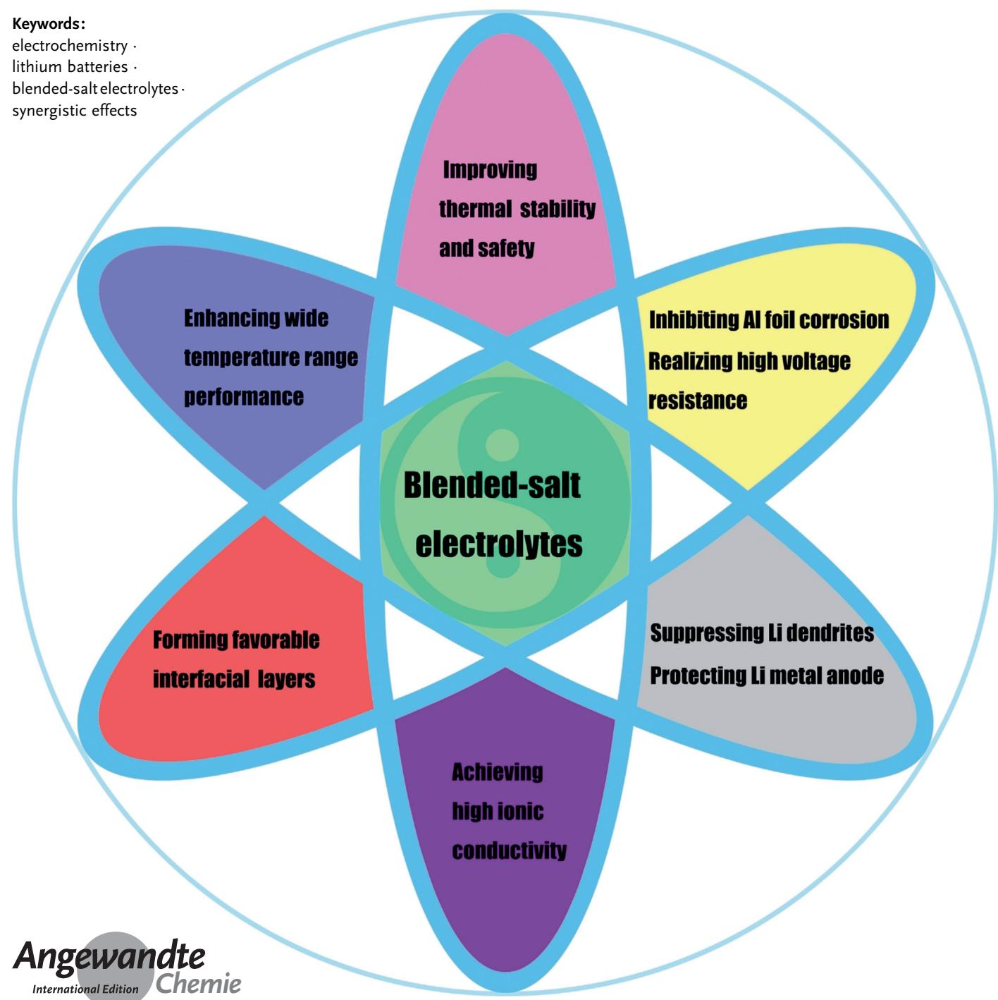
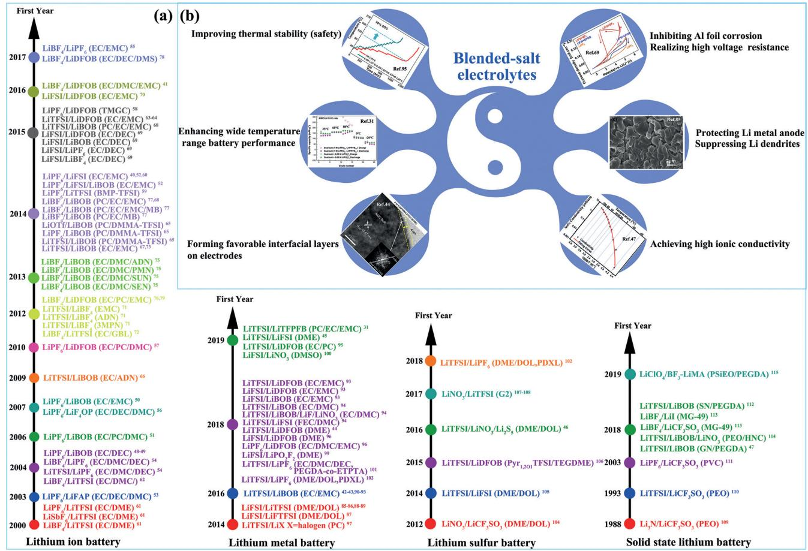
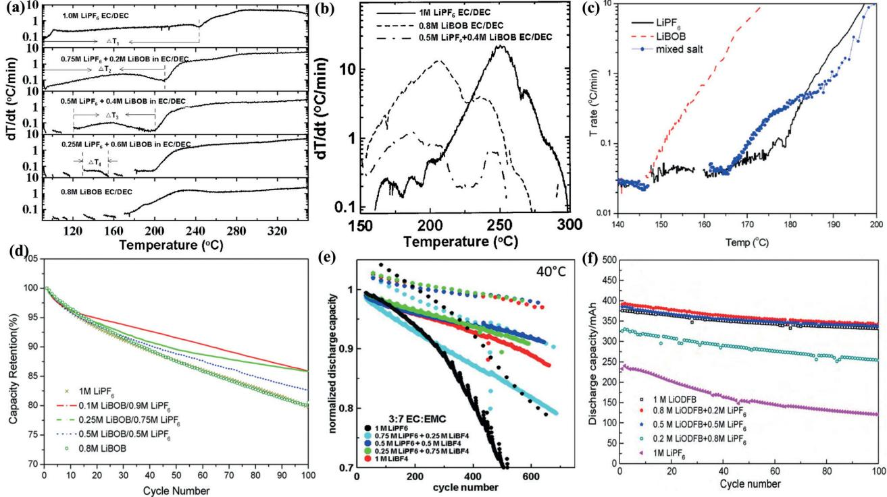
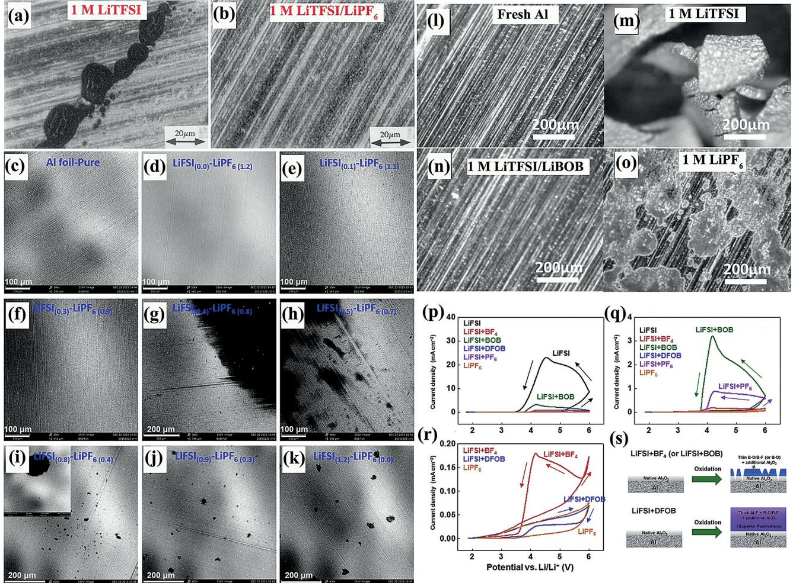
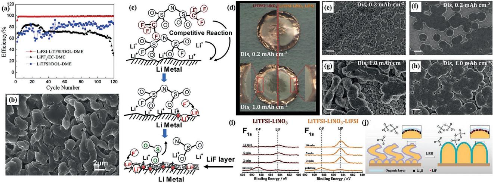
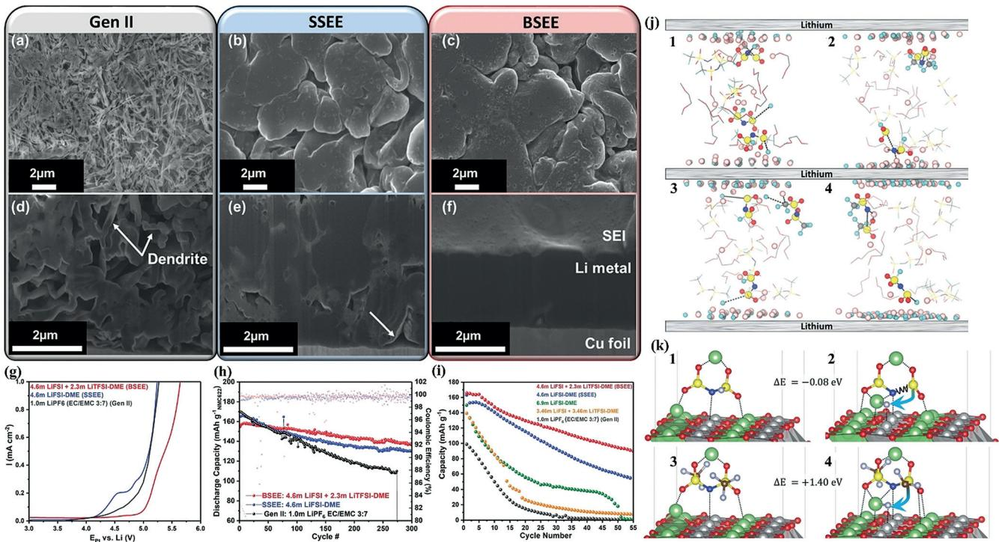
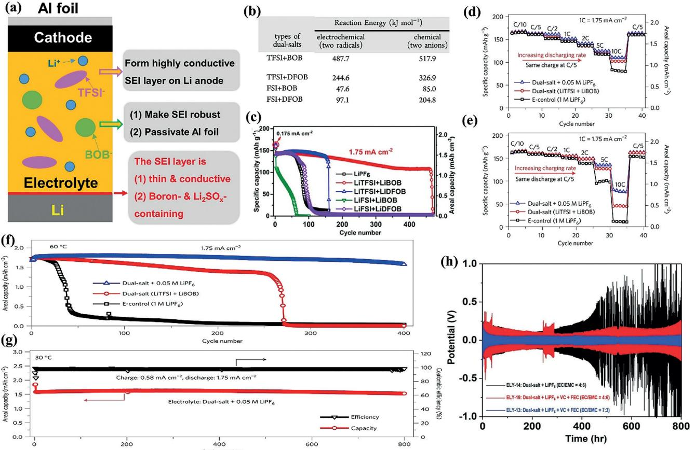
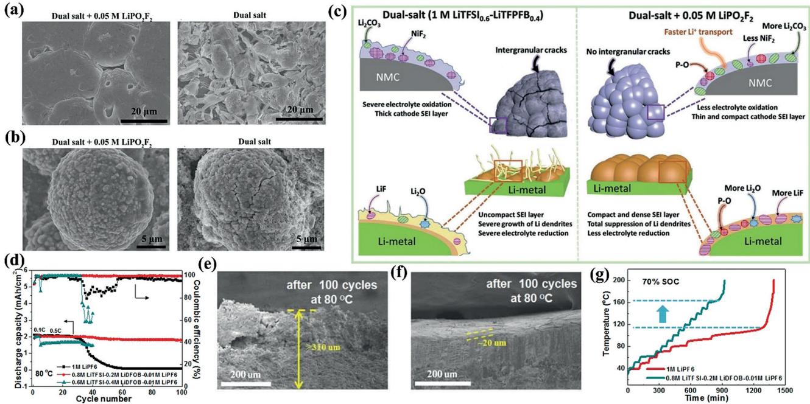
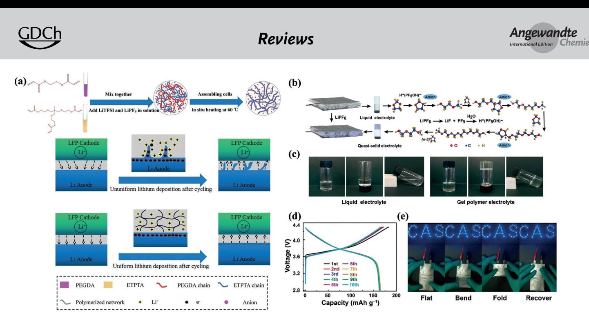

German Edition: DOI: [10.1002/ange.201906494](http://dx.doi.org/10.1002/ange.201906494) Lithium Batteries International Edition: DOI: [10.1002/anie.201906494](http://dx.doi.org/10.1002/anie.201906494)

# Formulation of Blended-Lithium-Salt Electrolytes for Lithium Batteries

Gaojie Xu, Xuehui Shangguan, Shanmu Dong, Xinhong Zhou, and [Guanglei Cui\\*](http://orcid.org/0000-0001-5987-7569)

3400 [www.angewandte.org](http://www.angewandte.org) -

2019 Wiley-VCH Verlag GmbH & Co. KGaA, Weinheim Angew. Chem. Int. Ed. 2020, 59, 3400 – 3415

Blended-salt electrolytes showing synergistic effects have been formulated by simply mixing several lithium salts in an electrolyte. In the burgeoning field of next-generation lithium batteries, blended-salt electrolytes have enabled great progress to be made. In this Review, the development of such blended-salt electrolytes is examined in detail. The reasons for formulating blended-salt electrolytes for lithium batteries include improvement of thermal stability (safety), inhibition of aluminum-foil corrosion of the cathode current collector, enhancement of performance over a wide temperature range (or at a high or low temperature), formation of favorable interfacial layers on both electrodes, protection of the lithium metal anode, and attainment of high ionic conductivity. Herein, we highlight key scientific issues related to the formulation of blended-salt electrolytes for lithium batteries.

# 1. Introduction

A global fossil-energy crisis is looming, and great effort is being devoted to the efficient use of renewable energy, such as solar, wind, and tidal power.[1] Rechargeable lithium batteries, including conventional lithium-ion batteries (LIBs),[2, 3] emerging lithium-metal batteries (LMBs) with an intercalation-type cathode,[4–7] lithium–sulfur (Li–S) batteries with a sulfur composite cathode,[8–11] solid-state lithium batteries with a solid-state electrolyte,[12, 13] and lithium–oxygen (Li–O2) batteries,[14, 15] have aroused great interest worldwide as promising sustainable energy-storage systems. The evergrowing anxiety about "endurance mileage" has been driving the increase in energy density of these lithium batteries. Unfortunately, the improvement of battery energy density is always accompanied by poor cyclability and serious safety concerns.[16, 17]

The electrolyte is the "blood" of lithium batteries, directly affecting their electrochemical performance and inherent safety.[18–23] Conventional and widely commercialized carbonate-based electrolytes typically contain lithium hexafluorophosphate (LiPF6) as the main conducting lithium salt, which is dissolved in an organic solvent mixture of cyclic carbonates with a high dielectric constant (such as propylene carbonate (PC) and ethylene carbonate (EC)) and linear alkyl carbonates with low viscosity (such as dimethyl carbonate (DMC), ethyl methyl carbonate (EMC), and diethyl carbonate (DEC)). Owing to its well-balanced properties, LiPF6 wins out over other lithium salts (such as lithium perchlorate (LiClO4), lithium hexafluoroarsenate (LiAsF6), and lithium tetrafluoroborate (LiBF4)) as the most widely commercialized one.[18] However, LiPF6 is still not the ideal lithium salt owing to its poor thermal stability and high moisture sensitivity. As a result, undesired highly reactive species, such as POF3 and HF, are generated, which induce the destruction of interfacial protective layers on both electrodes, the dissolution of transition metals from the cathode material, and reductive/oxidative decomposition of solvents.[1, 24] Furthermore, carbonate solvents have the shortcomings of high

# From the Contents

| 1. Introduction                                                | 3401 |
|----------------------------------------------------------------|------|
| 2. Blended-Salt Electrolytes for                               |      |
| Lithium-Ion Batteries                                          | 3403 |
| 3. Blended-Salt Electrolytes for Battery Chemistries Beyond |      |
| Lithium Ions                                                   | 3406 |
| 4. Summary and Outlook                                         | 3412 |

flammability and a limited electrochemical-stability window.[17, 22]

In the search for an ideal alternative lithium salt for LiPF6, tremendous work has been done to design, synthesize, and characterize novel lithium

salts in the past several decades.[18, 22, 25–31] The most intensively investigated lithium salts for lithium batteries are thermally and chemically stable lithium borates (typically lithium bis(oxalato)borate (LiBOB), lithium difluoro(oxalato)borate (LiDFOB)) and lithium imides (typically lithium bis(trifluoromethanesulfonyl)imide (LiTFSI), lithium bis(fluorosulfonyl)imide (LiFSI)). Besides the limitation of their high cost, the two representative lithium borate salts LiBOB and LiDFOB have relatively low solubility in carbonate solvents, while the two representative lithium imide salts LiTFSI and LiFSI always cause severe anodic dissolution of the aluminum-foil cathode current collector above 4 V. Unfortunately, most newly developed lithium salts are investigated as efficient functional electrolyte additives (small dosage)[20, 32–36] and still can not shake the dominance of conventional LiPF6 as the main lithium salt.

The conductivity of LiTFSI- and LiFSI-based electrolytes is comparable to that of LiPF6-based electrolytes. One way to alleviate the aforementioned severe Al corrosion of LiTFSI and LiFSI is to formulate highly concentrated electrolytes, which always demonstrate unfavorable characteristics of high viscosity (poor wettability), low Li+ conductivity, and very high cost.[37–39] Another way is to blend LiTFSI and LiFSI with LiBOB and LiDFOB to formulate blended-salt electrolytes containing at least two main lithium salts (usually binary/

[\*] G. Xu, X. Shangguan, Prof. S. Dong, Prof. G. Cui Qingdao Industrial Energy Storage Research Institute Qingdao Institute of Bioenergy and Bioprocess Technology Chinese Academy of Sciences No. 189 Songling Road, Qingdao, 266101 (P. R. China) E-mail: cuigl@qibebt.ac.cn Prof. X. Zhou College of Chemistry and Molecular Engineering Qingdao University of Science and Technology Qingdao, 266042 (P. R. China) The ORCID identification number(s) for the author(s) of this article can be found under: [https://doi.org/10.1002/anie.201906494.](https://doi.org/10.1002/anie.201906494)

# *Angewandte* Reviews *Chemie*

Figure 1. a) Evolution of blended-salt electrolytes for various lithium batteries. b) Main purposes of formulating blended-salt electrolytes. Reproduced with permission from Ref. [31], Copyright 2019 Wiley-VCH; Ref. [44], Copyright 2018 Nature Publishing Group; Ref. [47], Copyright 2018 Elsevier; Ref. [69], Copyright 2015 Elsevier; Ref. [85], Copyright 2014 Elsevier; Ref. [95], Copyright 2019 Elsevier.

ternary main lithium salts). To achieve a synergistic effect, blended-salt (also known as mixed-salt, hybrid-salt, dual-salt, binary-salt (bisalt), ternary-salt, etc.) electrolytes have been formulated by simple blending of several lithium salts in the electrolyte. In the last decade, great progress has been made in the application of blended-salt electrolytes in the burgeoning field of next-generation lithium batteries.[22, 23, 40–47] Therefore, it is necessary to systematically and comprehensively review the history of the development of blended-salt electrolytes, which tends to be neglected and is not fully understood.

In this Review, we examine the evolution of blended-salt electrolytes as classified in detail according to LIBs and chemistries "beyond lithium-ion batteries" (such as LMBs, Li–S batteries, solid-state lithium batteries; Figure 1 a). Progress with electrolyte solvents is also considered. The reasons for formulating blended-salt electrolytes for lithium batteries include improvement of thermal stability (safety), inhibition

Gaojie Xu is a research associate at Qingdao Institute of Bioenergy and Bioprocess Technology, Chinese Academy of Sciences. He received his M.S. degree in applied chemistry from Ocean University of China in 2012. His research is mainly concentrated on advanced electrolytes, electrode materials, and separators for next-generation lithium batteries. He is also interested in the evaluation of the thermal safety of batteries and the development of manufacturing techniques for large-format batteries.

Guanglei Cui completed his Ph.D. at the Institute of Chemistry of the Chinese Academy of Sciences in 2005 with Prof. Daoben Zhu and Prof. Lei Jiang. From 2005 to 2009, he was a postdoctoral scientist at the Max Planck Institutes for Polymer Research and Solid State Research with Prof. Klaus Mllen and Prof. Joachim Maier. Currently a principal investigator at Qingdao Institute of Bioenergy and Bioprocess Technology, Chinese Academy of Sciences, he was a recipient of the National Natural Science Fund for Distinguished Young Scholars of China in

2016 and became chief scientist of the National Key R&D Program of China in 2018.

of aluminum-foil corrosion of the cathode current collector, enhancement of performance in a wide temperature range (or at high or low temperature, formation of favorable interfacial layers on both electrodes, protection of the lithium-metal anode, and attainment of high ionic conductivity (Figure 1 b). This Review aims to summarize the key scientific issues related to the formulation of blended-salt electrolytes and provide meaningful perspectives for the future development of blended-salt electrolytes toward practical applications.

# 2. Blended-Salt Electrolytes for Lithium-Ion Batteries

# 2.1. LiPF6-Based Blended-Salt Electrolytes 2.1.1. Thermal-Stability (Safety) Evaluation

It is anticipated that the thermal stability (safety) of a LiPF6-based electrolyte can be improved by introducing thermally stable main lithium salts (such as LiBOB,[48–52] LiPF3(CF2CF3)3 (LiFAP),[53] LiBF4, [54, 55] lithium tetrafluoro- (oxalato)phosphate (LiPF4(C2O4), LiF4OP),[56] LiDFOB,[57, 58] LiTFSI,[54, 59] and LiFSI[40, 60]) into the electrolyte. Accelerating rate calorimetry (ARC) results of Jiang and Dahn suggested that the thermal stability of lithiated graphite (Li0.81C6) in the blended-salt electrolyte 0.25m LiPF6/0.6m LiBOB (EC/DEC) was much higher than in pure LiPF6-based electrolyte (Figure 2 a).[48] However, subsequent ARC measurement revealed that the addition of LiBOB dramatically decreased the thermal stability of the charged cathode Li0.5CoO2 in the electrolyte (Figure 2 b).[49] The exothermic reaction onset temperature of a 18650-type LiMn2O4 cell with the blendedsalt electrolyte 0.5m LiPF6/0.5m LiBOB (EC/EMC) was close to (actually slightly lower than) that with a purely LiPF6 based electrolyte, but much higher than with a purely LiBOB based electrolyte (Figure 2 c).[50] These interesting examples indicate that introducing thermally stable lithium salts into a LiPF6 based electrolyte to formulate a blended-salt electrolyte does not always bring the thermal-stability improvement (electrode/electrolyte thermal compatibility) and safety enhancement of the corresponding cells with a blended-salt electrolyte.[48–50, 53, 54] The underlying scientific mechanisms are still not fully understood.

### 2.1.2. Improving Battery Electrochemical Performance

Adding a thermally stable main lithium salt to a purely LiPF6 based electrolyte will always significantly improve the electrochemical performance of LIBs, especially at elevated temperatures.[40, 50–53, 55, 57, 59–60] Although the addition of

Figure 2. a) Self-heating rate as a function of temperature for Li0.81C6 (100 mg) with different electrolytes (100 mg). Reproduced with permission from Ref. [48], Copyright 2004 Elsevier. b) Self-heating rate as a function of temperature for Li0.5CoO2 (100 mg) with different electrolytes (100 mg). Reproduced with permission from Ref. [49], Copyright 2004 Electrochemical Society. c) Self-heating rate as a function of temperature for fully charged 18650-type LiMn2O4 cells with electrolyte systems based on 1m LiPF6, 0.8m LiBOB, and 0.5m LiBOB/0.5m LiPF6. Reproduced with permission from Ref. [50], Copyright 2007 Elsevier. d) Cycle performance of 18650-type LiMn2O4 cells with different salt compositions in the solvents EC/EMC at 558C. Reproduced with permission from Ref. [50], Copyright 2007 Elsevier. e) Cycle performance of Li[Ni0.4Mn0.4Co0.2]O2/ graphite pouch cells with different electrolyte formulations. Reproduced with permission from Ref. [55], Copyright 2017 Electrochemical Society. f) Cycle performance of 063048-type LiFePO4/AG full cells using electrolytes with different LiDFOB/LiPF6 ratios at 658C. Reproduced with permission from Ref. [57], Copyright 2010 Elsevier.

Angew. Chem. Int. Ed. 2020, 59, 3400 – 3415 -

2019 Wiley-VCH Verlag GmbH & Co. KGaA, Weinheim [www.angewandte.org](http://www.angewandte.org) 3403

LiBOB to a purely LiPF6 based electrolyte slightly decreased thermal stability (safety), it led to a significant improvement in 18650-type LiMn2O4 cell cycling performance, especially at elevated temperatures (Figure 2 d).[50] From another perspective, blending LiBOB and LiPF6 achieved a well-balanced state in terms of factors such as cell impedance, Mn dissolution, LiBOB decomposition, thermal stability, and elevated-temperature (55 8C) cycling performance.[50, 51] As a promising substitute for LiPF6, thermally and hydrolytically stable LiBF4 demonstrated other advantages of excellent performance at temperatures below 08C, efficient passivation of the Al current collector, and high compatibility with cathode materials (as well as stability at high voltage).[55] However, as compared to LiPF6, LiBF4 possessed lower conductivity and poorer compatibility with the graphite anode in an alkyl carbonate solvent. Encouragingly, a blended-salt electrolyte composed of 0.5m LiPF6/0.5m LiBF4 (EC/EMC) enabled the construction of 4.35 V Li[Ni0.4Mn0.4Co0.2]O2/graphite pouch cells with the least capacity fading over 600 cycles at 40 8C (Figure 2 e).[55]

The synergistic effect originated from impedance growth inhibition at the cathode by LiBF4 and improved anode passivation by LiPF6. Despite its higher solubility in carbonate solvents and lower solid–electrolyte interface (SEI) resistance as compared to LiBOB, LiDFOB still showed limited conductivity and high reactivity with the cathode.[50, 51, 57] The blended-salt electrolyte 1m LiDFOB/LiPF6 (optimized ratio was 4:1, EC/PC/DMC) endowed LiFePO4/ artificial graphite (AG) with much better cycling performance than a purely LiPF6 based electrolyte, especially at a high temperature of 65 8C (Figure 2 f).[57] LiDFOB has the ability to protect a graphite anode from being eroded by a LiPF6– PC-based electrolyte. Clearly, in these cases, the study of blended-salt electrolytes is always based on the external evaluation of electrochemical performance without clarification of the synergism of the blended-salt electrolyte with the electrode/electrolyte interface components and interface reaction processes. Moreover, the electrochemical/chemical compatibility between lithium salts and solvents needs to be given sufficient attention.

## 2.1.3. Role of LiPF6 in Inhibiting Aluminum-Foil Corrosion Caused by Lithium Imides

Early in 2000, Wang et al. proposed a mechanism for Al corrosion in the presence of LiTFSI involving the formation and diffusion of the complex [Al(N(SO2CF3)2)x)]3+x-. [61] According to this model, three efficient strategies were proposed: addition of perfluorinated inorganic anions (especially LiPF6, Figure 3 a,b) to form a passive film containing AlF3 with high electrical resistivity; use of ether solvents (such as tetrahydrofuran (THF) and dimethoxyethane (DME)) with low dielectric constants; development of a novel LiN- (SO2C2F5)2 salt with a larger anion than that of LiTFSI. In another case, a thermally stable and nonflammable blendedsalt electrolyte based on the ionic liquid (IL) butylmethylpyrrolidinium bis(trifluoromethanesulfonyl)imide (BMP-TFSI) and 0.4m LiTFSI/0.6m LiPF6 was designed to improve the performance of high-voltage (5 V class) LiNi0.5Mn1.5O4/Li cells, especially at 50 8C.[59] In that report, it was also revealed that the introduction of LiPF6 helped suppress Al pitting corrosion by forming passive AlF3 at elevated temperature.

As compared to LiPF6, LiFSI is endowed with much improved thermal stability (up to 180–2008C) as well as a higher ionic conductivity, solubility, and Li+ transference number. As in the case of LiTFSI, the practical application of LiFSI is hindered by the problem of Al corrosion, which is possibly associated with the F-S bonds in the FSI anions or the residual chloride (Cl-) impurities from the synthesis process.[52] In 2012, Nippon Shokubai Co. Ltd. reported that the addition of 0.2m LiFSI to a 1m LiPF6 (EC/EMC) based electrolyte led to a cyclability improvement of LiCoO2/ graphite cells.[52] However, Zheng and co-workers revealed that the introduction of 0.2m LiFSI into a 1m LiPF6 (EC/ EMC) based electrolyte led to severe corrosion of the Al/ LiFePO4 cathode, which failed to cycle.[52] Fortunately, the addition of LiFSI effectively improved the cycling stability and rate performance of the graphite anode. Therefore, LiBOB was further introduced to effectively passivate Al. The as-formulated LiPF6/LiFSI/LiBOB ternary-salt electrolyte enhanced the cycling stability both the LiFePO4 cathode and graphite anode, as well as the LiFePO4/graphite full cell. LiFSI helped to decrease the LiBOB-induced interface impedance increase. Subsequent studies revealed that a LiPF6/LiFSI dual-salt electrolyte enabled excellent operation of Li[Ni1/3Mn1/3Co1/3]O2 (NCM333)/graphite pouch cells.[40, 60] It was demonstrated that 4.2 V NCM333/graphite pouch cells containing 1m LiPF6/LiFSI (EC/EMC) with or without vinylene carbonate (VC) as an additive showed lower or similar self-discharge, lower charge-transfer resistance (Rct), and smaller amounts of gas evolution during formation and during storage at high temperature as compared to cells containing only 1m LiPF6 with and without VC, respectively.[60] However, it seemed that LiFSI was not stable when the cell cutoff voltage was raised to 4.45 V. The systematic study by Xia et al. showed that when the LiFSI concentration was lower than 0.3m, Al corrosion arising from LiFSI salt could be effectively suppressed by LiPF6 at high potential (Figure 3 c–k).[40] NCM333/graphite pouch cells with a 0.2m LiFSI/1.0m LiPF6 (EC/EMC) based blended-salt electrolyte displayed excellent cycling stability (at 30 8C) and storage performance over a wide temperature range.

The effects of lithium imide purity, different kinds of lithium imides, charge-cutoff potential, concentration of the lithium salt, and the electrolyte solvent on the corrosion behavior of aluminum (including morphology) should be clarified in detail. Furthermore, the chemical/electrochemical processes of Al corrosion by lithium imides and the inhibition of Al corrosion by LiPF6 should be characterized more thoroughly, for example, through in situ interface characterization in combination with theoretical calculations (such as density functional theory (DFT)).

Figure 3. Microscope image of an aluminum-foil electrode after being held at 4.5 V for 3 h in a) the electrolyte 1m LiTFSI (EC/DME) and b) the electrolyte 0.7m LiTFSI/0.3m LiPF6 (EC/DME). Reproduced with permission from Ref. [61], Copyright 2000 Elsevier. c–k) SEM images of Al foil before and after cyclic voltammetry testing in LiFSI–LiPF6 blended-salt electrolytes (different molar ratios of lithium salts, EC/EMC solvents) between 3.0 and 5.0 V at a scan rate of 0.1 mVs-1 . Reproduced with permission from Ref. [40], Copyright 2018 Wiley-VCH. Optical images of l) fresh Al foil and Al foils after anodic polarization tests at 3.9 V and 608C for 5 days in m) an electrolyte based only on 1m LiTFSI (EC/EMC), n) a 1m LiTFSI–LiBOB blended-salt electrolyte, and o) an electrolyte based only on 1m LiPF6. Reproduced with permission from Ref. [67], Copyright 2014 Royal Society of Chemistry. p) Cyclic voltammograms of Al electrodes during the first cycle in LiFSI, LiFSI/LiBF4, LiFSI/LiBOB, LiFSI/LiDFOB, LiFSI/LiPF6, and LiPF6 ; q) expanded view of (p); r) expanded view of (q). s) Formation of a passive layer on an Al electrode cycled in LiFSI/LiBF4 or LiFSI/LiBOB (top) and LiFSI/LiDFOB (bottom). Reproduced with permission from Ref. [69], Copyright 2015 Elsevier.

## 2.2. Blended-Salt Electrolytes Based on Lithium Imides and Lithium Borates

## 2.2.1. Role of Lithium Borates in Inhibiting the Corrosion of Aluminum Foil by Lithium Imides

Besides LiPF6, lithium borates (such as LiBF4, LiBOB, and LiDFOB) can also inhibit aluminum-foil corrosion by the lithium imides LiTFSI and LiFSI.[62–73] In 2004, it was reported that severe pitting corrosion of aluminum in LiTFSI (EC/ DMC) based electrolyte with the by-product Al[N- (SO2CF3)2]3y(OH)y could be significantly suppressed by adding LiBF4 (at least 0.2m), through the formation of a stable passive layer containing RCO2M (M = Al and/or Li, R = alkyl chain), lithium oxalate, LiOH, and insoluble Al- (BF4)3. [62] In another case, at an elevated temperature of 60 8C, the corrosion of Al in LiTFSI-based electrolyte was confirmed to be totally suppressed by LiBOB (Figure 3l–o).[67] Later, of the co-salts LiPF6, LiBF4, LiBOB, and LiDFOB, LiDFOB was revealed to be the best inhibitor of Al corrosion in LiFSI-based electrolyte (Figure 3 p–r) by comparing the current density obtained from cyclic voltammograms of the Al electrode.[69] The anodic corrosion behavior of Al in the blended-salt electrolyte 0.8m LiFSI/0.2m LiDFOB (EC/ DEC) was comparable to that of a corrosion-free 1m LiPF6 based electrolyte. The superior inhibition of Al corrosion by LiDFOB in LiFSI-based electrolyte was attributed to the LiDFOB-derived thick surface layer composed of Al-F, B-O/B-F, and Al2O3 (Figure 3 s). Efforts must be made to further elucidate the mechanism by which lithium borates suppress the corrosion of Al foil by taking advantage of in situ

interface characterization technology and theoretical studies (such as DFT calculations).

#### 2.2.2. Improving Battery Electrochemical Performance

Besides the inhibition of aluminum-foil corrosion, battery electrochemical performance will be also enhanced by introducing lithium borates as co-salts. LiFePO4/Li cells with a 0.6m LiTFSI/0.4m LiBOB (EC/EMC) based blendedsalt electrolyte demonstrated capacity fading of less than 5.8% at 60 8C for 1000 cycles, whereas cells with a purely LiPF6 based electrolyte failed to cycle at 60 8C.[67] Meanwhile, the room-temperature rate capability (up to 5 C) of a cell with a blended-salt electrolyte was comparable to that observed with a purely LiPF6 (1m) based electrolyte. A novel bendedsalt electrolyte composed of 0.5m LiTFSI/1.0m LiBF4 (EC/gbutyrolactone (GBL)) enabled the operation of a full LiFePO4/Li4Ti5O12 cell at least up to 608C without aging over thousand cycles, even at a rate of 60 C.[72] A high-voltage (5 V class) LiNi0.5Mn1.5O4/Li cell with a 0.5m LiTFSI/0.5m LiDFOB (EC/EMC) based blended-salt electrolyte showed superior cyclability and rate capability at room temperature than a cell with a purely 1m LiPF6 based electrolyte.[64] It was reported that blended-salt electrolytes based on LiFSI/ LiDFOB (carbonate solvents) possessed excellent compatibility with both LiCoO2/Li and LiCoO2/graphite cells.[69, 70]

### 2.3. Blended-Salt Electrolytes Based on Lithium Borates

Owing to their excellent stability and favorable SEIforming properties, lithium borates have aroused great interest in the past decades.[29] Recently, we reviewed progress in functional lithium borate salts for lithium batteries and developed some novel lithium borates.[25–31] For the development of high-energy and high-performance LIBs (especially over a wide temperature range), blended-salt electrolytes based on LiBF4, which is favorable at low temperature (but shows poor compatibility with the graphite anode in alkyl carbonate solvents), and LiBOB or LiDFOB, which are favorable at high temperature (and also with respect to the SEI layer), have been proposed.[41, 74–79] Duncan et al. reported that blended-salt electrolytes based on 1m LiBF4 and 0.1m LiBOB with dinitriles (chain lengths of n = 4–8) as the only solvent or mixed with EC as a second solvent could not well sustain a high-voltage (5 V class) LiNi0.5Mn1.5O4/Li cell except when DMC was added as an additional solvent.[75] It was demonstrated that DMC had the ability to suppress the oxidative decomposition of the LiBF4 salt at high voltage, by itself decomposing. Later, a 0.8m LiDFOB/0.2m LiBF4 (EC/ DMC/EMC) based blended-salt electrolyte was optimized out to enable the excellent wide-temperature operation (-20–60 8C) of a high-voltage (5 V class) LiNi0.5Mn1.5O4/ graphite full cell.[41] Cosolvents with a low melting point, high boiling point, or low viscosity (such as PC, the aliphatic ester methyl butanoate (MB), dimethyl sulfite (DMS)) are preferred for formulating electrolytes for a wide temperature range, especially subzero temperatures.[31, 76–80] Thus, 0.8m LiBF4/0.2m LiBOB (PC/EC/EMC/MB) and 0.5m LiBF4/ 0.5m LiDFOB (EC/DEC/DMS) were designed for a LiFePO4/Li cell, while 0.8m LiBF4/0.2m LiDFOB (PC/EC/ EMC) was evaluated in a LiCoO2/Li cell.

A graphite anode always shows poor electrochemical compatibility with LiBF4 and the aforementioned cosolvents PC, MB, and DMS. Identification of the graphite/electrolyte interface characteristics responsible for this poor compatibility would be advantageous for the design and formulation of high-performance electrolytes. As already mentioned, the electrochemical/chemical compatibility of lithium salts, solvents, and electrodes needs to be given sufficient attention.

# 3. Blended-Salt Electrolytes for Battery Chemistries "Beyond Lithium Ions"

#### 3.1. Lithium-Metal Batteries

The development of "holy grail" LMBs (with an intercalation-type cathode and lithium-metal anode) has long been hindered by the instability of the lithium/electrolyte interface (volume expansion and pulverization) and severe lithiumdendrite growth during lithium plating/stripping.[4–7, 31, 81–84] In recent years, blended-salt electrolytes have been arousing great interest and enabled great progress in lithium-metal protection and the development of high-performance LMBs (Figure 1 a).[31, 42–45, 85–102] However, LMBs are still mainly in the laboratory stage, and there is still a long way to go before large-format cells with excellent performance are realized. In the following, we objectively analyze the achievements that have been made to date and provide useful suggestions to facilitate the evolution of LMBs.

#### 3.1.1. Lithium-Imide-Based Blended-Salt Electrolytes

Adding LiFSI as a co-salt to a LiTFSI-based electrolyte to form a 0.5m LiFSI/0.5m LiTFSI (1,3-dioxolane (DOL)/DME) blended-salt electrolyte significantly increased the coulombic efficiency (ca. 99%, 0.25 mA cm-2 ) of lithium deposition/ dissolution processes (Figure 4 a).[85] At a high current density of 10 mA cm-2 , the formation of lithium dendrites can still be avoided (Figure 4 b). It was revealed that FSI was far more reactive than TFSI toward lithium metal, and a LiF-enriched SEI layer was preferentially formed to protect the lithium metal (Figure 4 c). Later, an unstacked graphene framework with deposited Li metal was proposed to be a stable Li metal anode with high coulombic efficiency in a LiTFSI–LiFSI (DOL/DME) based blended-salt electrolyte.[86] Concentrated blended-salt electrolytes are also proposed to improve the cycling stability of Li metal and inhibit lithium-metal dendritic growth.[87–89] It was previously reported that the ring-opening polymerization of DOL induced by LiFSI (LiFSI is not suitable to be used as single main salt in cyclic ether solvents) could be effectively suppressed by the addition of lithium (fluorosulfonyl)(trifluoromethanesulfonyl) imide (LiFTFSI, an analogue of LiFSI).[87]

A novel concentrated 2m LiFSI/2m LiFTFSI (DOL/ DME) blended-salt electrolyte enabled the construction of Li/Cu cells with dendrite-free Li metal, high average cou-

Figure 4. a) Coulombic efficiency of Li/stainless-steel (SS) cells as a function of cycle number for different electrolytes. b) Lithium morphology after 51 cycles in a 0.5m LiFSI/0.5m LiTFSI (DOL/DME) blended-salt electrolyte at a current density of 10 mA cm-2 . c) Competitive interfacial reactions of FSI and TFSI with Li metal. Reproduced with permission from Ref. [85], Copyright 2014 Elsevier. d) Optical images of Cu electrodes with different amounts of Li deposition. Morphology of the Li deposits (0.2 mAh cm-2 , DOL/DME): e) LiTFSI–LiNO3, f) LiTFSI–LiNO3–LiFSI. Morphology of the Li deposits (1.0 mAh cm-2 , DOL/DME): g) LiTFSI–LiNO3, h) LiTFSI–LiNO3–LiFSI. Scale bars: 5 mm. i) F1s spectra of the different SEI layers. j) Enhancement of the SEI layer with LiFSI. Reproduced with permission from Ref. [89], Copyright 2018 Wiley-VCH.

lombic efficiency (3 mA cm-2 , > 95%; 0.5 mA cm-2 , ca. 97%), and excellent cycling stability. Zhou and co-workers reported a concentrated LiTFSI/LiFSI (DME/DOL) based blendedsalt electrolyte that was supported by LiNO3 as an additive.[89] The additional LiFSI co-salt significantly enhanced the lithium-ion-transfer process and enabled homogenous Li deposition (Figure 4 d–h). It was proposed that LiFSI and LiNO3 contributed to the formation of the favorable SEI layer component LiF and Li2O, respectively (Figure 4i–j). Meanwhile, the vital role of LiTFSI was to stabilize the electrolyte at high concentration. As a result, Li/Cu cells remained stable over 450 cycles and the average Coulombic efficiency reached 99.1% at a current density of 0.5 mA cm-2 . Moreover, with 0.5-fold excess Li metal, the Coulombic efficiency of Li metal reached 99.4%. However, the aforementioned l m and concentrated LiTFSI/LiFSI based blended-salt electrolytes still seem to be limited by the Al corrosion issue and narrow electrochemical stability window of ether-based electrolytes, and seem to always be evaluated for low-voltage lithium battery systems (such as LiFePO4 based LMBs and Li-S batteries).

More recently, a highly concentrated blended-salt electrolyte (4.6 m LiFSI + 2.3 m LiTFSI in DME) was formulated by Xu and co-workers to endow plated Li metal with a denser, more conformal morphology (Figure 5 a–f), and this electrolyte also exhibited excellent oxidative stability (Figure 5 g).[45] Furthermore, far more challenging 4.4 V LMBs of NCM622/ Li (Figure 5 h) and NCM622/Cu (Figure 5i) based on a cathode with a high Ni content, LiNi0.6Mn0.2Co0.2O2 (NCM622), showed unprecedented cyclability (Figure 5 g–i), breaking the long-standing voltage limitation for ether-based electrolytes. Through a combination of electrochemical, spectroscopic (cryogenic transmission electron microscopy (cryo-TEM), and X-ray photoelectron spectroscopy (XPS)), and computational approaches (Figure 5j,k), a thorough mechanistic understanding of how the two anions FSI and TSFI behaved at electrode–electrolyte interfaces of the anode and the cathode was attained. Although complex, it is believed that this study will become a milestone for the investigation and evolution of blended-salt electrolytes because of its holistic approach.

## 3.1.2. Blended-Salt Electrolytes Based on Lithium Imides and Lithium Borates

With inhibited Al corrosion, blended-salt electrolytes based on 1m and concentrated lithium imides/lithium borates are highly compatible with 4 V class LMBs.[31, 42–44, 91–96] A 4.3 V LiNi0.8Co0.15Al0.05O2 (NCA)/Li LMB with a 0.6m LiTFSI/0.4m LiBOB (EC/EMC) blended-salt electrolyte exhibited good cycling stability during fast charging.[91] It was concluded by Xu and co-workers that highly conductive lithium sulfonates derived from LiTFSI favored the formation of a SEI layer with high conduction on the lithium-metal surface, while LiBOB made the SEI layer on the Li metal robust, stable, and thin during cycling (Figure 6 a). DFT calculations by Zhang and co-workers indicated that LiTFSI– LiBOB blended salts had the highest chemical and electrochemical stability, followed by LiTFSI–LiDFOB, LiFSI– LiDFOB, and LiFSI–LiBOB (Figure 6 b), and the cycling performance of 4.3 V LiNi0.4Mn0.4Co0.2O2 (NMC442)/Li LMBs with these different blended-salt electrolytes (EC/ EMC) showed the same order (Figure 6 c).[93] The proposed mechanism was that LiTFSI–LiBOB could effectively protect the Al substrate and form a more robust surface layer on the lithium-metal anode, whereas LiFSI–LiBOB resulted in serious corrosion of the stainless-steel cell case and a thicker/looser surface layer on the Li anode.

Recently, functional additives have been added to blended-salt electrolytes to further enhance the electrochem-

Figure 5. Top-view SEM images of the initial morphology of plated lithium and the corresponding cryogenic focused ion beam (cryo-FIB) crosssections after cycling in a, d) Gen II (1.0 m LiPF6 in EC/EMC (3:7), b, e) SSEE (4.6 m LiFSI in DME), and c,f) BSEE (4.6m LiFSI+2.3m LiTFSI in DME). Electrochemical testing of cells in various configurations: g) linear sweep voltammetry (LSV; sweep in the positive direction) to gauge the anodic stability of electrolytes, h) NCM622/Li Swagelok cells, and i) NCM622/Cu cells. j) Snapshots extracted from BOMD simulations of a BSEE electrolyte sandwiched between LiF-covered Li metal (Li pink, F cyan, O red, S yellow, N dark blue, C gray). Four of seven trajectories at 12 ps are shown and indicate a tendency for anions to decompose through defluorination or S-N cleavage. Unreacted material is depicted as wireframe models with hydrogen atoms excluded. Broken bonds are highlighted with a dashed line. k) Reaction mechanisms of Li2FSI and Li2TFSI on a LiNiO2 (104) surface (Li green, S yellow, O red, N blue, Ni dark gray, F light gray, C brown). Initial states are shown for LiFSI (1) and LiTFSI (3), with arrows indicating the defluorination reaction (2 and 4). Reproduced with permission from Ref. [45], Copyright 2019 Royal Society of Chemistry.

ical performance of LMBs.[42, 43, 92, 94, 95] Zhang and co-workers reported that adding an optimal amount (0.05m) of the functional additive LiPF6 to a 0.6m LiTFSI/0.4m LiBOB (EC/ EMC) blended-salt electrolyte significantly enhanced the charging capability (Figure 6 d,e) and cycling stability (Figure 6 f,g) of a 4.3 V NMC442/Li LMB.[42] It was clarified in detail that the LiPF6 additive played a key role in stabilizing the Al current collector. More importantly, the LiPF6 additive induced the generation of a robust and conductive SEI layer enriched with polycarbonate species that could effectively bind the isolated/"dead" Li to the bulk lithium-metal anode. The same additive-assisted blended-salt electrolyte was then found to have high compatibility with a 4.5 V LiNi0.76Mn0.14Co0.10O2 (NMC76)/Li LMB system.[43] It was also revealed that the addition of combinations of additives (VC and fluoroethylene carbonate (FEC)) and the optimization of the solvent composition (EC/EMC volume ratio) of a 0.6m LiTFSI/0.4m LiBOB blended-salt electrolyte could greatly improve the average Coulombic efficiency of the lithium-metal anode (Figure 6 h) and cycle life of a LiNi1/ 3Mn1/3Co1/3O2 (NMC333)/Li battery.[92] These improvements were believed to be associated with the formation of a more polymeric ionic conductive, compact, and robust surface layer on the surface of the lithium-metal anode through electrochemical reductive decomposition of the electrolyte components and the ring-opening polymerization of additives and the EC solvent. In some cases, LiTFSI/LiBOB-based blended-salt electrolytes are adopted as excellent standard electrolytes to evaluate the effects of engineering of the lithium-metal anode and separator modification.[90, 94] These reports suggest that the electrochemical performance of LMBs with blended-salt electrolytes can be further enhanced by adding functional additives, optimizing the organic solvents, engineering the lithium-metal anode, and modifying the separator. Of course, it is necessary to systematically clarify why these strategies are efficient and how they affect the reactions at the electrode/electrolyte interfaces in blended-salt electrolytes.

Some special blended-salt electrolytes based on lithium imides and lithium borates have been designed for the operation of LMBs over a wide temperature range and at ultrahigh temperature.[31, 95] We recently combined LiTFSI with lithium trifluoro(perfluoro-tert-butyloxyl)borate (LiTFPFB), which we synthesized ourselves, to formulate a lithium difluorophosphate (LiPO2F2) additive assisted 1m blended-salt electrolyte using low-melting-point and highboiling-point carbonates (PC and EMC) as dominant solvents.[31] Aluminum-foil corrosion induced by LiTFSI could

Figure 6. a) Effects of LiTFSI and LiBOB in a blended-salt electrolyte (EC/EMC). Reproduced with permission from Ref. [91], Copyright 2014 Elsevier. b) Gibbs reaction energies of blended salts, as determined by DFT calculations. c) Cycling performance of 4.3 V LiNi0.4Mn0.4Co0.2O2 (NMC442)/Li cells using a baseline LiPF6 electrolyte and four different blended-salt electrolytes (EC/EMC) at a current density of 1.75 mA cm-2 after three formation cycles at 0.175 mA cm-2 . Reproduced with permission from Ref. [93], Copyright 2017 American Chemical Society. Rate performance of 4.3 V NMC442/Li batteries using different electrolytes at 308C: d) charging at a constant rate of 0.2C but discharging at an increasing C rate; e) charging at an increasing C rate but discharging at a constant rate of 0.2 C (1 C=1.75 mA cm-2 ). f) Cycling performance of NMC442/Li batteries with different electrolytes at a high temperature of 60 8C. g) Cycling stability of an NMC442/Li battery based on a LiTFSI– LiBOB blended-salt electrolyte and the additive LiPF6 (0.05m), cycled with 0.58 mA cm-2 for charging and 1.75 mA cm-2 for discharging at 308C. Reproduced with permission from Ref. [42], Copyright 2017 Nature Publishing Group. h) Cycling performance of Li/ j Li symmetric cells using different electrolytes at a current density of 0.5 mA cm-2 and a charge/discharge capacity of 0.5 mA h cm-2 at 308C for 800 h. Reproduced with permission from Ref. [92], Copyright 2018 Wiley-VCH.

be efficiently suppressed by increasing the amount of LiTFPFB in the blended-salt electrolyte. The addition of LiPO2F2 dramatically improved the cyclability and rate capability of a LiNi0.5Mn0.3Co0.2O2/Li (NMC532/Li) LMB system over the unprecedented temperature range of -40 to 908C. It was revealed at 60 8C that the LiPO2F2 additive contributed to the formation of a compact and protective SEI layer at the surface of both the lithium-metal anode and NMC532 cathode (Figure 7 a–c). In particular, it was inferred that the LiPO2F2-assisted enrichment of inorganic lithium species (especially ion-conductive LiF and Li2O) and P-O species at the outer shell of the SEI layer provided the key ingredients for suppressing the growth of Li dendrites and their reactions with carbonate solvents. As demonstrated in Figure 1 a, the most frequently used lithium salts for blendedsalt electrolytes are LiPF6, LiBF4, LiTFSI, LiFSI, LiBOB, and LiDFOB, and novel lithium salts are rarely adopted. This conservative approach is not the way forward; although it is always difficult to use novel lithium salts directly as the sole main salt, they may lead to surprising results when used in blended-salt electrolytes with functional additives or/and innovative solvents.

Very recently, Li and co-workers formulated a LiPF6 assisted 0.8m LiTFSI/0.2m LiDFOB blended-salt electrolyte using the high-boiling-point/high-flash-point solvents EC and PC.[95] This electrolyte enabled the generation of a LiCoO2/Li LMB with excellent cyclability at elevated temperature of 808C because of the well-protected lithium-metal anode (Figure 7 d–f). More interestingly, accelerating rate calorimetry (ARC) results of a LiCoO2/Li pouch cell (2 Ah) suggested that this blended-salt electrolyte had better thermal stability than a LiPF6 electrolyte (Figure 7 g). It was indicated that the electrochemical, thermal, and mechanical safety evaluation of LMBs (especially pouch-type cells) should be brought to the forefront immediately, rather than just focusing on electrochemical performance improvement in

Figure 7. Typical SEM images of a cycled a) lithium-metal anode and b) NMC532 cathode recovered from NMC532/Li batteries with a LiTFSI/ LiTFPFB blended-salt electrolyte and a LiPO2F2-additive-assisted LiTFSI/LiTFPFB blended-salt electrolyte, cycled at 608C. c) Positive effects of the additive LiPO2F2 on interfaces of both a lithium-metal anode and NMC532 cathode during repeated cycling in a dual-salt electrolyte at 60 8C. Reproduced with permission from Ref. [31], Copyright 2019 Wiley-VCH. d) Cycling performance of LiCoO2/Li using different electrolytes (1 C: 2.4 mA cm-2 ) at 808C. e) Cross-section SEM image of a lithium-metal anode after 100 cycles with an LiPF6-based electrolyte at 808C. f) Crosssection SEM image of a lithium-metal anode after 100 cycles with an LiPF6-assisted 0.8m LiTFSI/0.2m LiDFOB blended-salt electrolyte at 808C. g) Temperature–time curves for ARC tests of LiCoO2/Li pouch cells (2 Ah; 70% state of charge), with a heating temperature step of 108C, followed by 30 min waiting. Reproduced with permission from Ref. [95], Copyright 2019 Elsevier.

coin-type cells. Concentrated LiDFOB/lithium imide (LiFSI and LiTFSI) blended-salt electrolytes (DME) have also been reported.[44, 96] Zhang and co-workers developed an etherbased (DME) highly concentrated (2m LiTFSI/2m LiDFOB) blended-salt electrolyte for 4.3 V NMC333/Li cells, thus breaking the long-standing voltage limitation for etherbased electrolytes.[44] The ether-based concentrated blendedsalt electrolyte greatly enhanced the oxidation stability of ether molecules, effectively passivated the highly catalytically active NMC333 cathode surface under high voltage, and formed a high-quality SEI layer on the lithium-metal anode for efficient lithium-metal cycling.

#### 3.1.3. Other Types of Blended-Salt Electrolyte

Other blended-salt electrolytes, such as LiTFSI/lithium halide (PC),[97] LiDFOB/LiPF6 (EC/DMC/EMC),[98] LiPO2F2/ LiFSI (DME),[99] LiFSI/LiNO3 (DMSO),[100] gel-type LiTFSI/ LiPF6 (EC/DMC/DEC, with cross-linked 3D poly(ethylene glycol) diacrylate (PEGDA)-co-ethoxylated trimethylolpropane triacrylate (ETPTA)),[101] and gel-type LiTFSI/LiPF6 (DME/DOL, linear-chain polydioxolane (PDXL)),[102] have also been proposed for efficient lithium-metal protection and high-performance LMBs. As compared to liquid electrolytes, solid and gel electrolytes are more promising for restraining the uncontrolled growth of lithium dendrites and lithium pulverization, but their use is still hindered by low ionic conductivity and incompatible interphases.[101–103] Guo and coworkers designed a rigid–flexible dual-salt (LiTFSI/LiPF6) gel polymer electrolyte (GPE, cellulose as the rigid support) with a 3D cross-linked polymer network by in situ polymerization of PEGDA, which contributes to lithium-ion transfer, and ETPTA, which acts as a cross-linker (Figure 8 a).[101] More importantly, the dual-salt 3D GPE possessed a high ionic conductivity of 0.56 mS cm-1 at room temperature and endowed the lithium-metal surface with a robust and conductive SEI layer, thus enabling uniform lithium deposition without significant dendrite growth after long-term cycling in a LiFePO4/Li LMB.

Recently, a crafted novel quasi-solid GPE (LiTFSI/LiPF6, DOL/DME, polydioxolane (PDXL)) was successfully obtained by utilizing in situ cationic ring-opening polymerization between LiPF6 and DOL at room temperature (Figure 8 b,c).[102] This novel GPE exhibited effective constraint of dendrite growth and pulverization of the lithium anode, and had high compatibility with varied cathodes, such as lowvoltage sulfur composite, LiFePO4, and high-voltage (4.3 V) NCM622 (Figure 8 d,e), thus breaking the voltage limitations for traditional ether-based electrolytes. Therefore, the further development of GPEs with blended salts, a well-designed polymer matrix, and suitable solvents will be an important direction for lithium-metal protection and improvement of the performance of LMBs.

Figure 8. a) Process for in situ polymerization of a dual-salt (LiTFSI/LiPF6) 3D GPE and its application in a LiFePO4/Li battery. Reproduced with permission from Ref. [101], Copyright 2018 Wiley-VCH. b) Mechanism of the LiPF6-induced polymerization of DOL. c) Optical images of the liquid electrolyte and the GPE (LiTFSI/LiPF6, DOL/DME, polydioxolane (PDXL)). d) Performance of an NCM622/Li battery (with a PDXL-based GPE) with a voltage range of 2.8–4.3 V. e) Optical images of light-emitting diode (LED) lamps lighted by a flexible NCM622/Li battery (with a PDXLbased GPE) upon mechanical deformation in various ways. Reproduced with permission from Ref. [102], Copyright 2017 American Association for the Advancement of Science.[102]

#### 3.2. Lithium–Sulfur Batteries

The development of Li-S batteries is hindered by both the unstable lithium-metal anode (interface instability and lithium-dendrite growth) and the polysulfide shuttle induced by the sulfur-based composite cathode.[8–11] Blended-salt electrolytes have been developed to enhance the electrochemical performance of Li-S batteries (Figure 1 a).[46, 102–108] LiNO3 is the most widely used additive or co-salt for suppressing the redox shuttle of lithium polysulfides in Li-S batteries.[104] By avoiding deep discharge Li-S batteries were endowed with a long cycle life when LiNO3 was adopted as an additive or a co-salt. Highly concentrated 3m LiNO3/0.5m LiTFSI (diglyme (G2)) enabled exceptionally high coulombic efficiency for lithium-metal plating/stripping and thus high stability of the Li anode in the sulfur-containing electrolyte.[107, 108] The optimized electrolyte 1m LiFSI/0.5m LiTFSI (DOL/DME) possessed higher ionic conductivity and lower viscosity and enabled the construction of Li-S batteries with a high sulfur content (79.05 wt%) that exhibited a higher specific capacity as well as superior cycling performance and rate capability.[105] LiFSI had higher affinity towards polysulfides and the electrode surface, thus contributing to the higher specific capacity. Chen and co-workers reported a LiTFSI/LiDFOB blended-salt electrolyte based on the ionic liquid N-methoxyethyl-N-methylpyrrolidinium bis(trifluoromethanesulfonyl)imide (Pyr1,2O1TFSI) and tri(ethylene glycol) dimethyl ether (TEGDME)) for Li-S batteries.[106] The introduction of LiDFOB as a co-salt (not an additive) rationalized the formation of the SEI layer on the lithiummetal anode by reductive reactions, which prevented the shuttle effect and protected the lithium-metal anode from lithium dendrites. For the development of high-performance Li-S batteries with a high sulfur loading, it is absolutely necessary to combine the strategy of formulating blended-salt electrolytes (novel lithium salts, solvents (not only ethers), and functional additives) with other varied strategies (such as engineering the lithium-metal anode, engineering the sulfurcomposite cathode, and modifying the separator).

#### 3.3. Solid-State Lithium Batteries

High-profile solid-state lithium batteries also adopt blended-salt-based solid polymer electrolytes (SPEs; Figure 1 a).[12, 13, 47, 109–116] In most cases, optimization of the ionic conductivity of blended-salt-based SPEs is the main focus. As a solid plasticizer, a plastic crystal material, such as succinonitrile (SN), can effectively increase the ionic conductivity in PEO-based and PEG-based SPEs.[47, 112] Recently, a freestanding and flexible SPE (LiTFSI–LiBOB, plastic crystal glutaronitrile (GN) as the plasticizer, cross-linked PEGDA) was reported to possess optimized ionic conductivity (over 1.0 mS cm-1 at 30 8C) and a wide electrochemical window of 0–4.5 V (versus Li/Li+).[47] The outstanding electrochemical stability of this blended-salt SPE was ascribed to the synergistic effect of LiTFSI and LiBOB (LiBOB protected Al, which was susceptible to LiTFSI; LiTFSI alleviated the reaction between LiBOB with the lithium-metal electrode). Moreover, this blended-salt SPE demonstrated stable lithium stripping/plating and had high compatibility with the LiFePO4 cathode. Later, GN was replaced with SN, and the optimized ionic conductivity and electrochemical window were raised to 1.76 mS cm-1 (at 30 8C) and 0–4.8 V (versus Li/Li+).[112] This blended-salt SPE endowed a 4.15 V LiNi0.8Co0.15Al0.05O2 (NCA)/Li solid-state battery with excellent cycling performance. In short, more attempts are needed to deeply explore the compatibility of electrode materials with blended-salt SPEs optimized for their ionic conductivity, and some advances are anticipated in solid-state lithium batteries.

# 4. Summary and Outlook

Despite their apparent promise, the cold reality is that blended-salt electrolytes have not been widely adopted for practical applications in different lithium batteries. The following critical analysis is intended to facilitate the evolution of blended-salt electrolytes and lithium batteries:

A. The introduction of thermally stable lithium salts (such as LiBOB) into an electrolyte based only on LiPF6 to formulate a blended-salt electrolyte will always improve the cycling performance of LIBs (especially at elevated temperatures), but will not always improve the thermal stability (electrode/electrolyte thermal compatibility) and safety of the corresponding LIBs. Why not? We must give full consideration to this point when evaluating blended-salt electrolytes, and systematic studies, such as interface studies, the investigation of thermal safety (e.g. differential scanning calorimetery (DSC), ARC, isothermal calorimetry (ITC)), and theoretical calculations, are needed to clarify the underlying scientific mechanisms.

In batteries based on chemistry "beyond lithium-ion technologies" (especially LMBs), the current main research focus is improvement of electrochemical performance in cointype cells, neglecting the evaluation of the electrochemical, thermal, and mechanical safety of electrode materials and corresponding large-format cells. The issue of the safety of different lithium batteries is of great public interest and must be brought to the forefront of battery research immediately.

Very recently, Dahn and co-workers reported that anodefree lithium-metal pouch cells with a LiDFOB/LiBF4 (FEC/ DEC) blended-salt electrolyte had 80% capacity remaining after 90 charge–discharge cycles, which is the longest life demonstrated to date for cells with zero excess lithium.[120] Therefore, a blended-salt electrolyte is a very good choice to significantly improve the performance of the extremely challenging anode-free LMBs.[45, 120]

B. At present, the study of blended-salt electrolytes always involves their partial evaluation in terms of performance and lacks clarification of their internal synergism at the electrode/electrolyte interface component and interface reaction processes. Although complex, a thorough mechanistic understanding of how these blended lithium salts behave at electrode/electrolyte interfaces at both the anode and the cathode is necessary, and in situ interface characterization technologies (for the identification of both solid-state and gas-state interface by-products)[117] and theoretical calculations are suggested.

C. The effects of the purity of lithium imides, type of lithium imide, charge cutoff voltage, concentration of lithium salts, and the electrolyte solvent on Al corrosion must be deeply and clearly clarified. Furthermore, the chemical/ electrochemical processes of Al corrosion by lithium imides and the mechanism for the inhibition of Al corrosion by a cosalt need to be characterized more thoroughly, for example, by combining emerging in situ interface characterization technologies and theoretical calculations.

D. Clearly, blended-salt electrolytes alone can not meet all requirements. The performance of lithium batteries with blended-salt electrolytes can be further enhanced by adding functional additives (even combinations of additives[118]), optimizing the organic solvents, engineering the electrodes (such as the surface modification of a lithium-metal anode and sulfur-composite cathode), modifying the separator, adopting GPEs, and other means. Of course, it is necessary to systematically clarify why these strategies are efficient and how these strategies affect the reactions at the electrode/ electrolyte interfaces in blended-salt electrolytes.

For example, the selection and further development of appropriate organic solvents (especially nonflammable solvents) with a wide electrochemical stability window (resistance to both oxidative and reductive decomposition) for blended-salt electrolytes are very important. In some cases, cosolvents may have poor chemical/electrochemical compatibility with the electrodes and even with the lithium salts. Identifying the characteristics of the electrode/electrolyte interfaces and solvated structures that are responsible for the poor compatibility is favorable for the design and formulation of high-performance blended-salt electrolytes, as demonstrated by Li and co-workers.[119]

E. The most frequently used lithium salts for blended-salt electrolytes are LiPF6, LiBF4, LiTFSI, LiFSI, LiBOB, and LiDFOB, whereas newly synthesized lithium salts are rarely adopted. Although novel lithium salts are difficult to use directly as the sole main salt, they can lead to surprises when used in blended-salt electrolytes with functional additives or/ and innovative solvents.

On the other hand, many novel lithium salts have been designed and synthesized by researchers who may be experienced and knowledgeable in the field of materials synthesis but not necessarily in the field of battery research (such as electrolyte formulation, interface characterization, and electrode selection). As a result, these novel lithium salts, the development of which has cost time and money, have not always been fully studied.

F. It is well-known that the electrochemical performance of electrode materials is greatly associated with electrolyte type,[18, 19] and there is a large number of novel electrode materials in the field of lithium batteries. Therefore, blendedsalt electrolytes can be formulated to enhance the performance of novel electrode materials, such as silicon-based anodes,[121] conversion-type anodes,[21] organic anodes or cathodes,[122] novel high-voltage or high-capacity cathodes.[21, 123] In other words, if the electrochemical performance of carefully designed novel electrode materials is not satisfactory, we must give full consideration to formulating highly compatible electrolytes (including blended-salt electrolytes).

G. The application and investigation of blended-salt electrolytes in high-profile Li-S batteries and solid-state lithium batteries are still lacking. Furthermore, the concept of

"blended-salt electrolytes" is possibly applicable to battery chemistries "beyond lithium", such as sodium batteries[124] and secondary batteries based on multivalent ions.[125–127] More studies are definitely needed, and some achievements are anticipated.

Lithium batteries are seemingly simple but actually complex. Therefore, in the process of formulating blendedsalt electrolytes and improving the performance of lithium batteries, a holistic concept is proposed. To put this concept into practice, a close combination of basic and applied research is suggested, including the synthesis of electrode materials, electrolyte formulation, separator/binder selection, the study of electrode/electrolyte interfaces, and the manufacture and performance evaluation of large-format batteries. Therefore, close collaboration within and between research teams is absolutely necessary. Only in this way can breakthroughs in blended-salt electrolytes and lithium batteries be anticipated.

# Acknowledgements

Our research in this area was supported by the National Natural Science Foundation for Distinguished Young Scholars of China (No. 51625204), the Strategic Priority Research Program of the Chinese Academy of Sciences (Grant No. XDA22010602), the National Key R&D Program of China (Grant No. 2018YFB0104300), the Youth Innovation Promotion Association of the Chinese Academy of Sciences (No. 2017253), and the Key Scientific and Technological Innovation Project of Shandong (Grant No. 2017CXZC0505).

# Conflict of interest

The authors declare no conflict of interest.

How to cite: Angew. Chem. Int. Ed. 2020, 59, 3400 – 3415 Angew. Chem. 2020, 132, 3426 – 3442

- [1] G. Xu, Z. Liu, C. Zhang, G. Cui, L. Chen, [J. Mater. Chem. A](https://doi.org/10.1039/C4TA06264G) 2015, 3[, 4092 – 4123](https://doi.org/10.1039/C4TA06264G).
- [2] T.-H. Kim, J.-S. Park, S. K. Chang, S. Choi, J. H. Ryu, H.-K. Song, [Adv. Energy Mater.](https://doi.org/10.1002/aenm.201200028) 2012, 2, 860 – 872.
- [3] G. Xu, P. Han, S. Dong, H. Liu, G. Cui, L. Chen, [Coord. Chem.](https://doi.org/10.1016/j.ccr.2017.05.006) Rev. 2017, 343[, 139 – 184](https://doi.org/10.1016/j.ccr.2017.05.006).
- [4] D. Lin, Y. Liu, Y. Cui, [Nat. Nanotechnol.](https://doi.org/10.1038/nnano.2017.16) 2017, 12, 194 206.
- [5] X. Cheng, R. Zhang, C. Zhao, Q. Zhang, [Chem. Rev.](https://doi.org/10.1021/acs.chemrev.7b00115) 2017, 117, [10403 – 10473](https://doi.org/10.1021/acs.chemrev.7b00115).
- [6] X. Wu, J. Wang, F. Ding, X. Chen, E. Nasybulin, Y. Zhang, J.-G. Zhang, Energy Environ. Sci. 2014, 7, 513 – 537.
- [7] Y. Guo, H. Li, T. Zhai, [Adv. Mater.](https://doi.org/10.1002/adma.201700007) 2017, 29, 1700007.
- [8] W. Chen, T. Lei, C. Wu, M. Deng, C. Gong, K. Hu, Y. Ma, L. Dai, W. Lv, W. He, X. Liu, J. Xiong, C. Yan, [Adv. Energy Mater.](https://doi.org/10.1002/aenm.201702348) 2018, 8[, 1702348](https://doi.org/10.1002/aenm.201702348).
- [9] Q. Pang, X. Liang, C. Y. Kwok, L. F. Nazar, Nat. Energy 2016, 1, 16132.
- [10] L. Wang, Y. Ye, N. Chen, Y. Huang, L. Li, F. Wu, R. Chen, [Adv.](https://doi.org/10.1002/adfm.201800919) [Funct. Mater.](https://doi.org/10.1002/adfm.201800919) 2018, 28, 1800919.
- [11] S. Zhang, K. Ueno, K. Dokko, M. Watanabe, [Adv. Energy](https://doi.org/10.1002/aenm.201500117) Mater. 2015, 5[, 1500117.](https://doi.org/10.1002/aenm.201500117)

- [12] C. Sun, J. Liu, Y. Gong, D. P. Wilkinson, J. Zhang, [Nano Energy](https://doi.org/10.1016/j.nanoen.2017.01.028) 2017, 33[, 363 – 386](https://doi.org/10.1016/j.nanoen.2017.01.028).
- [13] J. Zhang, J. Yang, T. Dong, M. Zhang, J. Chai, S. Dong, T. Wu, X. Zhou, G. Cui, Small 2018, 14[, 1800821.](https://doi.org/10.1002/smll.201800821)
- [14] H. Song, H. Deng, C. Li, N. Feng, P. He, H. Zhou, [Small](https://doi.org/10.1002/smtd.201700135) Methods 2017, 1[, 1700135.](https://doi.org/10.1002/smtd.201700135)
- [15] Y. Li, X. Wang, S. Dong, X. Chen, G. Cui, [Adv. Energy Mater.](https://doi.org/10.1002/aenm.201600751) 2016, 6[, 1600751.](https://doi.org/10.1002/aenm.201600751)
- [16] X. Feng, M. Ouyang, X. Liu, L. Lu, Y. Xia, X. He, [Energy](https://doi.org/10.1016/j.ensm.2017.05.013) [Storage Mater.](https://doi.org/10.1016/j.ensm.2017.05.013) 2018, 10, 246 – 267.
- [17] Q. Wang, L. Jiang, Y. Yu, J. Sun, [Nano Energy](https://doi.org/10.1016/j.nanoen.2018.10.035) 2019, 55, 93 114.
- [18] K. Xu, Chem. Rev. 2004, 104[, 4303 4417.](https://doi.org/10.1021/cr030203g)
- [19] K. Xu, Chem. Rev. 2014, 114[, 11503 11618.](https://doi.org/10.1021/cr500003w)
- [20] A. M. Haregewoin, A. S. Wotango, B.-J. Hwang, [Energy](https://doi.org/10.1039/C6EE00123H) [Environ. Sci.](https://doi.org/10.1039/C6EE00123H) 2016, 9, 1955 – 1988.
- [21] H. Zhang, H. Zhao, M. A. Khan, W. Zou, J. Xu, L. Zhang, J. Zhang, [J. Mater. Chem. A](https://doi.org/10.1039/C8TA05336G) 2018, 6, 20564 – 20620.
- [22] T. R. Jow, K. Xu, O. Borodin, M. Ue, Electrolytes for Lithium and Lithium-Ion Batteries, Springer, New York, Heidelberg, Dordrecht, London, 2014.
- [23] I. Cekic-Laskovic, N. von Aspern, L. Imholt, S. Kaymaksiz, K. Oldiges, B. R. Rad, M. Winter, Top. Curr. Chem. 2017, 375, 37.
- [24] J.-G. Han, K. Kim, Y. Lee, N.-S. Choi, [Adv. Mater.](https://doi.org/10.1002/adma.201804822) 2019, 31, [1804822.](https://doi.org/10.1002/adma.201804822)
- [25] X. Wang, Z. Liu, C. Zhang, Q. Kong, J. Yao, P. Han, W. Jiang, H. Xu, G. Cui, [Electrochim. Acta](https://doi.org/10.1016/j.electacta.2013.01.026) 2013, 92, 132 – 138.
- [26] X. Wang, Z. Liu, Q. Kong, W. Jiang, J. Yao, C. Zhang, G. Cui, [Solid State Ionics](https://doi.org/10.1016/j.ssi.2013.09.007) 2014, 262, 747 – 753.
- [27] B. Qin, Z. Liu, G. Ding, Y. Duan, C. Zhang, G. Cui, [Electro](https://doi.org/10.1016/j.electacta.2014.07.004)[chim. Acta](https://doi.org/10.1016/j.electacta.2014.07.004) 2014, 141, 167 – 172.
- [28] B. Qin, Z. Liu, J. Zheng, P. Hu, G. Ding, C. Zhang, J. Zhao, D. Kong, G. Cui, [J. Mater. Chem. A](https://doi.org/10.1039/C5TA00216H) 2015, 3, 7773 – 7779.
- [29] Z. Liu, J. Chai, G. Xu, Q. Wang, G. Cui, [Coord. Chem. Rev.](https://doi.org/10.1016/j.ccr.2015.02.011) 2015, 292[, 56 – 73](https://doi.org/10.1016/j.ccr.2015.02.011).
- [30] L. Qiao, Z. Cui, B. Chen, G. Xu, Z. Zhang, J. Ma, H. Du, X. Liu, S. Huang, K. Tang, S. Dong, X. Zhou, G. Cui, [Chem. Sci.](https://doi.org/10.1039/C8SC00041G) 2018, 9, [3451 – 3458.](https://doi.org/10.1039/C8SC00041G)
- [31] X. Shangguan, G. Xu, Z. Cui, Q. Wang, X. Du, K. Chen, S. Huang, G. Jia, F. Li, X. Wang, D. Lu, S. Dong, G. Cui, [Small](https://doi.org/10.1002/smll.201900269) 2019, 15[, 1900269.](https://doi.org/10.1002/smll.201900269)
- [32] M. Xu, L. Zhou, Y. Dong, Y. Chen, J. Demeaux, A. D. MacIntosh, A. Garsuch, B. L. Lucht, [Energy Environ. Sci.](https://doi.org/10.1039/C5EE03360H) 2016, 9[, 1308 – 1319.](https://doi.org/10.1039/C5EE03360H)
- [33] Y. Li, S. Wan, G. M. Veith, R. R. Unocic, M. P. Paranthaman, S. Dai, X.-G. Sun, [Adv. Energy Mater.](https://doi.org/10.1002/aenm.201601397) 2017, 7, 1601397.
- [34] J.-G. Han, J. B. Lee, A. Cha, T. K. Lee, W. Cho, S. Chae, S. J. Kang, S. K. Kwak, J. Cho, S. Y. Hong, N.-S. Choi, [Energy](https://doi.org/10.1039/C8EE00372F) [Environ. Sci.](https://doi.org/10.1039/C8EE00372F) 2018, 11, 1552 – 1562.
- [35] Y. Li, G. M. Veith, K. L. Browning, J. Chen, D. K. Hensley, M. P. Paranthaman, S. Dai, X.-G. Sun, [Nano Energy](https://doi.org/10.1016/j.nanoen.2017.07.051) 2017, 40, [9 – 19.](https://doi.org/10.1016/j.nanoen.2017.07.051)
- [36] T. Yang, H. Zeng, W. Wang, X. Zhao, W. Fan, C. Wang, X. Zuo, R. Zeng, J. Nan, [J. Mater. Chem. A](https://doi.org/10.1039/C9TA01293A) 2019, 7, 8292 – 8301.
- [37] Y. Yamada, A. Yamada, [J. Electrochem. Soc.](https://doi.org/10.1149/2.0041514jes) 2015, 162, A2406 [A2423.](https://doi.org/10.1149/2.0041514jes)
- [38] J. Zheng, J. A. Lochala, A. Kwok, Z. D. Deng, J. Xiao, [Adv. Sci.](https://doi.org/10.1002/advs.201700032) 2017, 4[, 1700032.](https://doi.org/10.1002/advs.201700032)
- [39] Y. Yamada , J. Wang, S. Ko, E. Watanabe, A. Yamada, Nat. Energy 2019, 4, 269 – 280.
- [40] L. Xia, Y. Jiang, Y. Pan, S. Li, J. Wang, Y. He, Y. Xia, Z. Liu, G. Z. Chen, [ChemistrySelect](https://doi.org/10.1002/slct.201702488) 2018, 3, 1954 – 1960.
- [41] H. Zhou, K. Xiao, J. Li, [J. Power Sources](https://doi.org/10.1016/j.jpowsour.2015.10.073) 2016, 302, 274 282.
- [42] J. Zheng, M. H. Engelhard, D. Mei, S. Jiao, B. J. Polzin, J.-G. Zhang, W. Xu, Nat. Energy 2017, 2, 17012.
- [43] W. Zhao, J. Zheng, L. Zou, H. Jia, B. Liu, H. Wang, M. H. Engelhard, C. Wang, W. Xu, Y. Yang, J.-G. Zhang, [Adv. Energy](https://doi.org/10.1002/aenm.201800297) Mater. 2018, 8[, 1800297.](https://doi.org/10.1002/aenm.201800297)

Angew. Chem. Int. Ed. 2020, 59, 3400 – 3415 -

2019 Wiley-VCH Verlag GmbH & Co. KGaA, Weinheim [www.angewandte.org](http://www.angewandte.org) 3413

- Mei, J. Zheng, W. Zhao, Q. Li, N. Liu, B. D. Adams, C. Ma, J. Liu, J.-G. Zhang, W. Xu, [Nat. Energy](https://doi.org/10.1038/s41560-018-0199-8) 2018, 3, 739 – 746.
- [45] J. Alvarado, M. A. Schroeder, T. P. Pollard, X. Wang, J. Z. Lee, M. Zhang, T. Wynn, M. Ding, O. Borodin, Y. S. Meng, K. Xu, [Energy Environ. Sci.](https://doi.org/10.1039/C8EE02601G) 2019, 12, 780 – 794.
- [46] C.-Z. Zhao, X.-B. Cheng, R. Zhang, H.-J. Peng, J.-Q. Huang, R. Ran, Z.-H. Huang, F. Wei, Q. Zhang, [Energy Storage Mater.](https://doi.org/10.1016/j.ensm.2016.01.007) 2016, 3[, 77 – 84](https://doi.org/10.1016/j.ensm.2016.01.007).
- [47] S. Li, Y.-M. Chen, W. Liang, Y. Shao, K. Liu, Z. Nikolov, Y. Zhu, Joule 2018, 2, 1 – 19.
- [48] J. Jiang, J. R. Dahn, [Electrochim. Acta](https://doi.org/10.1016/j.electacta.2004.05.014) 2004, 49, 4599 4604.
- [49] J. Jiang, H. Fortier, J. N. Reimers, J. R. Dahn, [J. Electrochem.](https://doi.org/10.1149/1.1667520) Soc. 2004, 151[, A609 – A613](https://doi.org/10.1149/1.1667520).
- [50] D.-T. Shieh, P.-H. Hsieh, M.-H. Yang, [J. Power Sources](https://doi.org/10.1016/j.jpowsour.2007.06.152) 2007, 174[, 663 – 667.](https://doi.org/10.1016/j.jpowsour.2007.06.152)
- [51] Z. Chen, W. Q. Lu, J. Liu, K. Amine, [Electrochim. Acta](https://doi.org/10.1016/j.electacta.2005.09.027) 2006, 51[, 3322 – 3326.](https://doi.org/10.1016/j.electacta.2005.09.027)
- [52] L. Zhang, L. Chai, L. Zhang, M. Shen, X. Zhang, V. S. Battaglia, T. Stephenson, H. Zheng, [Electrochim. Acta](https://doi.org/10.1016/j.electacta.2014.02.008) 2014, 127, 39 – 44.
- [53] J. S. Gnanaraj, E. Zinigrad, L. Asraf, M. Sprecher, H. E. Gottlieb, W. Geissler, M. Schmidt, D. Aurbach, [Electrochem.](https://doi.org/10.1016/j.elecom.2003.08.020) Commun. 2003, 5[, 946 – 951.](https://doi.org/10.1016/j.elecom.2003.08.020)
- [54] E.-S. Hong, S. Okada, T. Sonoda, S. Gopukumar, J.-I. Yamaki, [J.](https://doi.org/10.1149/1.1802136) [Electrochem. Soc.](https://doi.org/10.1149/1.1802136) 2004, 151, A1836 – A1840.
- [55] L. D. Ellis, I. G. Hill, K. L. Gering, J. R. Dahn, [J. Electrochem.](https://doi.org/10.1149/2.0811712jes) Soc. 2017, 164[, A2426 – A2433](https://doi.org/10.1149/2.0811712jes).
- [56] A. Xiao, L. Yang, B. L. Lucht, [Electrochem. Solid-State Lett.](https://doi.org/10.1149/1.2772084) 2007, 10[, A241 – A244](https://doi.org/10.1149/1.2772084).
- [57] Z. Zhang, X. Chen, F. Li, Y. Lai, J. Li, P. Liu, X. Wang, [J. Power](https://doi.org/10.1016/j.jpowsour.2010.05.056) Sources 2010, 195[, 7397 – 7402.](https://doi.org/10.1016/j.jpowsour.2010.05.056)
- [58] J. Wang, T. Yong, J. Yang, C. Ouyang, L. Zhang, [RSC Adv.](https://doi.org/10.1039/C4RA15854G) 2015, 5[, 17660 – 17666.](https://doi.org/10.1039/C4RA15854G)
- [59] N. Wongittharom, T.-C. Lee, I.-M. Hung, S.-W. Lee, Y.-C. Wang, J.-K. Chang, [J. Mater. Chem. A](https://doi.org/10.1039/c3ta14423b) 2014, 2, 3613 – 3620.
- [60] D. Y. Wang, A. Xiao, L. Wells, J. R. Dahn, [J. Electrochem. Soc.](https://doi.org/10.1149/2.0821501jes) 2015, 162[, A169 – A175](https://doi.org/10.1149/2.0821501jes).
- [61] X. Wang, E. Yasukawa, S. Mori, [Electrochim. Acta](https://doi.org/10.1016/S0013-4686(99)00429-6) 2000, 45, [2677 – 2684](https://doi.org/10.1016/S0013-4686(99)00429-6).
- [62] S.-W. Song, T. J. Richardson, G. V. Zhuang, T. M. Devine, J. W. Evans, [Electrochim. Acta](https://doi.org/10.1016/S0013-4686(03)00930-7) 2004, 49, 1483 – 1490.
- [63] F. Li, Y. Gong, G. Jia, Q. Wang, Z. Peng, W. Fan, B. Bai, [J.](https://doi.org/10.1016/j.jpowsour.2015.06.117) [Power Sources](https://doi.org/10.1016/j.jpowsour.2015.06.117) 2015, 295, 47 – 54.
- [64] F. Li, X. Shangguan, G. Jia, Q. Wang, Y. Gong, B. Bai, W. Fan, [J.](https://doi.org/10.1007/s10008-016-3313-5) [Solid State Electrochem.](https://doi.org/10.1007/s10008-016-3313-5) 2016, 20, 3491 – 3498.
- [65] A. Hofmann, M. Schulz, V. Winkler, T. Hanemann, [J. Electro](https://doi.org/10.1149/2.094403jes)chem. Soc. 2014, 161[, A431 – A438](https://doi.org/10.1149/2.094403jes).
- [66] Y. Abu-Lebdeh, I. Davidson, [J. Electrochem. Soc.](https://doi.org/10.1149/1.3023084) 2009, 156, [A60 – A65.](https://doi.org/10.1149/1.3023084)
- [67] X. Chen, W. Xu, M. H. Engelhard, J. Zheng, Y. Zhang, F. Ding, J. Qian, J.-G. Zhang, [J. Mater. Chem. A](https://doi.org/10.1039/c3ta13043f) 2014, 2, 2346 – 2352.
- [68] Z.-A. Zhang, X.-X. Zhao, B. Peng, Y.-Q. Lai, Z.-Y. Zhang, J. Li, [Trans. Nonferrous Met. Soc. China](https://doi.org/10.1016/S1003-6326(15)63839-0) 2015, 25, 2260 – 2265.
- [69] K. Park, S. Yu, C. Lee, H. Lee, [J. Power Sources](https://doi.org/10.1016/j.jpowsour.2015.07.052) 2015, 296, 197 [203.](https://doi.org/10.1016/j.jpowsour.2015.07.052)
- [70] X. Shangguan, G. Jia, F. Li, Q. Wang, B. Bai, [J. Electrochem.](https://doi.org/10.1149/2.1241613jes) Soc. 2016, 163[, A2797 – A2802](https://doi.org/10.1149/2.1241613jes).
- [71] A. J. Gmitter, I. Plitz, G. G. Amatucci, [J. Electrochem. Soc.](https://doi.org/10.1149/2.016204jes) 2012, 159[, A370 – A379](https://doi.org/10.1149/2.016204jes).
- [72] K. Zaghib, M. Dontigny, A. Guerfi, J. Trottier, J. Hamel-Paquet, V. Gariepy, K. Galoutov, P. Hovington, A. Mauger, H. Groult, C. M. Julien, [J. Power Sources](https://doi.org/10.1016/j.jpowsour.2012.05.025) 2012, 216, 192 – 200.
- [73] A. Liu, Ionics 2014, 20[, 451 458.](https://doi.org/10.1007/s11581-013-1011-1)
- [74] E. Zygadło-Monikowska, Z. Florjanczyk, P. Kubisa, T. Biedron, A. Tomaszewska, J. Ostrowska, N. Langwald, J. Power Sources 2010, 195, 6202 – 6206.
- [75] H. Duncan, N. Salem, Y. Abu-Lebdeh, [J. Electrochem. Soc.](https://doi.org/10.1149/2.088306jes) 2013, 160[, A838 – A848.](https://doi.org/10.1149/2.088306jes)
- [76] C. Yang, Y. Ren, B. Wu, F. Wu, [Adv. Mater. Res.](https://doi.org/10.4028/www.scientific.net/AMR.455-456.258) 2012, 455 456, [258 – 264.](https://doi.org/10.4028/www.scientific.net/AMR.455-456.258)
- [77] Y. Lai, B. Peng, Z. Zhang, J. Li, [J. Electrochem. Soc.](https://doi.org/10.1149/2.023406jes) 2014, 161, [A875 – A879.](https://doi.org/10.1149/2.023406jes)
- [78] Q. Zhao, Y. Zhang, F. Tang, J. Zhao, S. Li, [J. Electrochem. Soc.](https://doi.org/10.1149/2.0851709jes) 2017, 164[, A1873 – A1880.](https://doi.org/10.1149/2.0851709jes)
- [79] L. Zhang, Y. Sun, Y. Zhou, C. Hai, S. Hu, J. Zeng, Y. Shen, S. Dong, G. Qi, F. Li, Ionics 2018, 24[, 2995 – 3004](https://doi.org/10.1007/s11581-018-2470-1).
- [80] G. Xu, S. Huang, Z. Cui, X. Du, X. Wang, D. Lu, X. Shangguan, J. Ma, P. Han, X. Zhou, G. Cui, [J. Power Sources](https://doi.org/10.1016/j.jpowsour.2019.01.085) 2019, 416, 29 – [36.](https://doi.org/10.1016/j.jpowsour.2019.01.085)
- [81] Z. Hu, S. Zhang, S. Dong, W. Li, H. Li, G. Cui, L. Chen, [Chem.](https://doi.org/10.1021/acs.chemmater.7b00091) Mater. 2017, 29[, 4682 – 4689.](https://doi.org/10.1021/acs.chemmater.7b00091)
- [82] J. Chai, B. Chen, F. Xian, P. Wang, H. Du, J. Zhang, Z. Liu, H. Zhang, S. Dong, X. Zhou, G. Cui, Small 2018, 14[, 1802244.](https://doi.org/10.1002/smll.201802244)
- [83] Z. Hu, S. Zhang, S. Dong, Q. Li, G. Cui, L. Chen, [Chem. Mater.](https://doi.org/10.1021/acs.chemmater.8b00722) 2018, 30[, 4039 – 4047](https://doi.org/10.1021/acs.chemmater.8b00722).
- [84] X. Cheng, F. Xian, Z. Hu, C. Wang, X. Du, H. Zhang, S. Chen, S. Dong, G. Cui, [Angew. Chem. Int. Ed.](https://doi.org/10.1002/anie.201900105) 2019, 58, 5936 – 5940; [Angew. Chem.](https://doi.org/10.1002/ange.201900105) 2019, 131, 5997 – 6001.
- [85] R. Miao, J. Yang, X. Feng, H. Jia, J. Wang, Y. Nuli, [J. Power](https://doi.org/10.1016/j.jpowsour.2014.08.011) Sources 2014, 271[, 291 – 297](https://doi.org/10.1016/j.jpowsour.2014.08.011).
- [86] R. Zhang, X.-B. Cheng, C.-Z. Zhao, H.-J. Peng, J.-L. Shi, J.-Q. Huang, J. Wang, F. Wei, Q. Zhang, [Adv. Mater.](https://doi.org/10.1002/adma.201504117) 2016, 28, 2155 – [2162.](https://doi.org/10.1002/adma.201504117)
- [87] Q. Ma, Z. Fang, P. Liu, J. Ma, X. Qi, W. Feng, J. Nie, Y.-S. Hu, H. Li, X. Huang, L. Chen, Z. Zhou, [ChemElectroChem](https://doi.org/10.1002/celc.201500520) 2016, 3, [531 – 536.](https://doi.org/10.1002/celc.201500520)
- [88] P. Liu, Q. Ma, Z. Fang, J. Ma, Y.-S. Hu, Z.-B. Zhou, H. Li, X.-J. Huang, Li-Q. Chen, [Chin. Phys. B](https://doi.org/10.1088/1674-1056/25/7/078203) 2016, 25, 078203.
- [89] F. Qiu, X. Li, H. Deng, D. Wang, X. Mu, P. He, H. Zhou, [Adv.](https://doi.org/10.1002/aenm.201803372) [Energy Mater.](https://doi.org/10.1002/aenm.201803372) 2019, 9, 1803372.
- [90] X. Li, J. Tao, D. Hu, M. H. Engelhard, W. Zhao, J.-G. Zhang, W. Xu, [J. Mater. Chem. A](https://doi.org/10.1039/C7TA11259A) 2018, 6, 5006 – 5015.
- [91] H. Xiang, P. Shi, P. Bhattacharya, X. Chen, D. Mei, M. E. Bowden, J. Zheng, J.-G. Zhang, W. Xu, [J. Power Sources](https://doi.org/10.1016/j.jpowsour.2016.04.017) 2016, 318[, 170 – 177.](https://doi.org/10.1016/j.jpowsour.2016.04.017)
- [92] X. Li, J. Zheng, X. Ren, M. H. Engelhard, W. Zhao, Q. Li, J.-G. Zhang, W. Xu, [Adv. Energy Mater.](https://doi.org/10.1002/aenm.201703022) 2018, 8, 1703022.
- [93] X. Li, J. Zheng, M. H. Engelhard, D. Mei, Q. Li, S. Jiao, N. Liu, W. Zhao, J.-G. Zhang, W. Xu, [ACS Appl. Mater. Interfaces](https://doi.org/10.1021/acsami.7b15117) 2018, 10[, 2469 – 2479.](https://doi.org/10.1021/acsami.7b15117)
- [94] M. S. Kim, J.-H. Ryu, Deepika, Y. R. Lim, I. W. Nah, K.-R. Lee, L. A. Archer, W. I. Cho, [Nat. Energy](https://doi.org/10.1038/s41560-018-0237-6) 2018, 3, 889 – 898.
- [95] Z. Geng, J. Lu, Q. Li, J. Qiu, Y. Wang, J. Peng, J. Huang, W. Li, X. Yu, H. Li, Energy Storage Mater. 2019, 23, 646 – 652.
- [96] X. Liu, C. Shen, N. Gao, Q. Hou, F. Song, X. Tian, Y. He, J. Huang, Z. Fang, K. Xie, [Electrochim. Acta](https://doi.org/10.1016/j.electacta.2018.09.085) 2018, 289, 422 – 427.
- [97] Y. Lu, Z. Tu, L. A. Archer, [Nat. Mater.](https://doi.org/10.1038/nmat4041) 2014, 13, 961 969.
- [98] X. Bian, S. Ge, Q. Pang, K. Zhu, Y. Wei, B. Zou, F. Du, D. Zhang, G. Chen, [J. Alloys Compd.](https://doi.org/10.1016/j.jallcom.2017.11.126) 2018, 736, 136 – 142.
- [99] N. Dong, G. Yang, H. Luo, H. Xu, Y. Xia, Z. Liu, [J. Power](https://doi.org/10.1016/j.jpowsour.2018.08.059) Sources 2018, 400[, 449 – 456](https://doi.org/10.1016/j.jpowsour.2018.08.059).
- [100] S. Eijima, H. Sonoki, M. Matsumoto, S. Taminato, D. Mori, N. Imanishi, [J. Electrochem. Soc.](https://doi.org/10.1149/2.0611903jes) 2019, 166, A5421 – A5429.
- [101] W. Fan, N.-W. Li, X. Zhang, S. Zhao, R. Cao, Y. Yin, Y. Xing, J. Wang, Y.-G. Guo, C. Li, Adv. Sci. 2018, 5[, 1800559.](https://doi.org/10.1002/advs.201800559)
- [102] F.-Q. Liu, W.-P. Wang, Y.-X. Yin, S.-F. Zhang, J.-L. Shi, L. Wang, X.-D. Zhang, Y. Zheng, J.-J. Zhou, L. Li, Y.-G. Guo, [Sci. Adv.](https://doi.org/10.1126/sciadv.aat5383) 2018, 4[, eaat5383](https://doi.org/10.1126/sciadv.aat5383).
- [103] H. Zhang, J. Zhang, J. Ma, G. Xu, T. Dong, G. Cui, Electrochemical Energy Rev. 2019, 2, 128—148.
- [104] S. S. Zhang, [J. Electrochem. Soc.](https://doi.org/10.1149/2.002207jes) 2012, 159, A920 A923.
- [105] J. J. Hu, G. K. Long, S. Liu, G. R. Li, X. P. Gao, [Chem.](https://doi.org/10.1039/C4CC06666A) Commun. 2014, 50[, 14647 – 14650.](https://doi.org/10.1039/C4CC06666A)

- [106] F. Wu, Q. Zhu, R. Chen, N. Chen, Y. Chen, Y. Ye, J. Qian, L. Li, [J. Power Sources](https://doi.org/10.1016/j.jpowsour.2015.07.033) 2015, 296, 10 – 17.
- [107] B. D. Adams, E. V. Carino, J. G. Connell, K. S. Han, R. Cao, J. Chen, J. Zheng, Q. Li, K. T. Mueller, W. A. Henderson, J.-G. Zhang, [Nano Energy](https://doi.org/10.1016/j.nanoen.2017.09.015) 2017, 40, 607 – 617.
- [108] H. Wang, B. D. Adams, H. Pan, L. Zhang, K. S. Han, L. Estevez, D. Lu, H. Jia, J. Feng, J. Guo, K. R. Zavadil, Y. Shao, J.-G. Zhang, [Adv. Energy Mater.](https://doi.org/10.1002/aenm.201800590) 2018, 8, 1800590.
- [109] S. Skaarup, [Solid State Ionics](https://doi.org/10.1016/0167-2738(88)90314-1) 1988, 28 30, 975 978.
- [110] C. W. Walker, Jr., M. Salomon, [J. Electrochem. Soc.](https://doi.org/10.1149/1.2221103) 1993, 140, [3409 – 3412](https://doi.org/10.1149/1.2221103).
- [111] R. H. Y. Subban, A. K. Arof, Ionics 2003, 9[, 375 381](https://doi.org/10.1007/BF02376589).
- [112] W. Liang, Y. Shao, Y.-M. Chen, Y. Zhu, [ACS Appl. Energy](https://doi.org/10.1021/acsaem.8b01138) Mater. 2018, 1[, 6064 – 6071](https://doi.org/10.1021/acsaem.8b01138).
- [113] R. A. G. Whba, L. TianKhoon, M. S. Suait, M. Y. A. Rahman, A. Ahmad, Arabian J. Chem. 2018, [https://doi.org/10.1016/j.](https://doi.org/10.1016/j.arabjc.2018.11.009) [arabjc.2018.11.009.](https://doi.org/10.1016/j.arabjc.2018.11.009)
- [114] Q. Zhao, P. Chen, S. Li, X. Liu, L. A. Archer, [J. Mater. Chem. A](https://doi.org/10.1039/C8TA12008K) 2019, 7[, 7823 – 7830](https://doi.org/10.1039/C8TA12008K).
- [115] K.-Y. Yoon, S.-W. Ryu, Polymer (Korea) 2019, 43, 69 76.
- [116] Q. Wang, H. Zhang, Z. Cui, Q. Zhou, X. Shangguan, S. Tian, X. Zhou, G. Cui, [Energy Storage Mater.](https://doi.org/10.1016/j.ensm.2019.04.016) 2019, 23, 466 – 490.
- [117] A. M. Tripathi, W.-N. Su, B. J. Hwang, [Chem. Soc. Rev.](https://doi.org/10.1039/C7CS00180K) 2018, 47, [736 – 851](https://doi.org/10.1039/C7CS00180K).
- [118] G. Xu, C. Pang, B. Chen, J. Ma, X. Wang, J. Chai, Q. Wang, W. An, X. Zhou, G. Cui, L. Chen, [Adv. Energy Mater.](https://doi.org/10.1002/aenm.201701398) 2018, 8, [1701398.](https://doi.org/10.1002/aenm.201701398)
- [119] L. Xing, X. Zheng, M. Schroeder, J. Alvarado, A. von Wald Cresce, K. Xu, Q. Li, W. Li, [Acc. Chem. Res.](https://doi.org/10.1021/acs.accounts.7b00474) 2018, 51, 282 – 289.
- [120] R. Weber, M. Genovese, A. J. Louli , S. Hames, C. Martin, I. G. Hill, J. R. Dahn, [Nat. Energy](https://doi.org/10.1038/s41560-019-0428-9) 2019, 4, 683—689.
- [121] Y. Jin, B. Zhu, Z. Lu, N. Liu, J. Zhu, [Adv. Energy Mater.](https://doi.org/10.1002/aenm.201700715) 2017, 7, [1700715.](https://doi.org/10.1002/aenm.201700715)
- [122] Y. Liang, Y. Yao, Joule 2018, 2[, 1690 1706](https://doi.org/10.1016/j.joule.2018.07.008).
- [123] W. Li, B. Song, A. Manthiram, [Chem. Soc. Rev.](https://doi.org/10.1039/C6CS00875E) 2017, 46, 3006 [3059.](https://doi.org/10.1039/C6CS00875E)
- [124] A. Basile, M. Hilder, F. Makhlooghiazad, C. Pozo-Gonzalo, D. R. MacFarlane, P. C. Howlett, M. Forsyth, [Adv. Energy](https://doi.org/10.1002/aenm.201703491) Mater. 2018, 8[, 1703491.](https://doi.org/10.1002/aenm.201703491)
- [125] J. Muldoon, C. B. Bucur, T. Gregory, [Chem. Rev.](https://doi.org/10.1021/cr500049y) 2014, 114, [11683 – 11720.](https://doi.org/10.1021/cr500049y)
- [126] Y. Cheng, H. J. Chang, H. Dong, D. Choi, V. L. Sprenkle, J. Liu, Y. Yao, G. Li, [J. Mater. Res.](https://doi.org/10.1557/jmr.2016.331) 2016, 31, 3125 – 3141.
- [127] J. Tian, D. Cao, X. Zhou, J. Hu, M. Huang, C. Li, [ACS Nano](https://doi.org/10.1021/acsnano.7b09177) 2018, 12[, 3424 – 3435](https://doi.org/10.1021/acsnano.7b09177).

Manuscript received: May 24, 2019

Accepted manuscript online: July 23, 2019 Version of record online: December 2, 2019