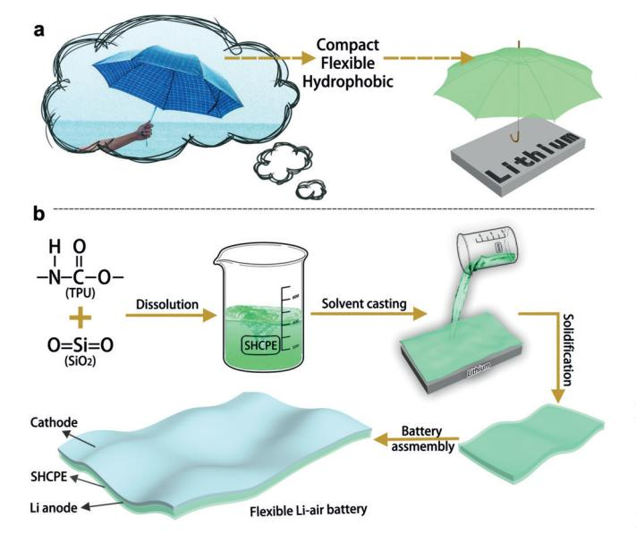
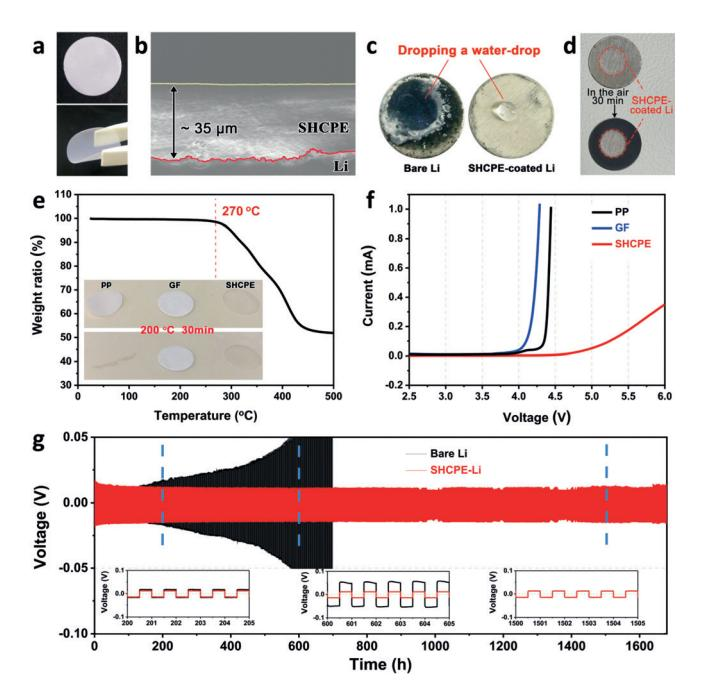
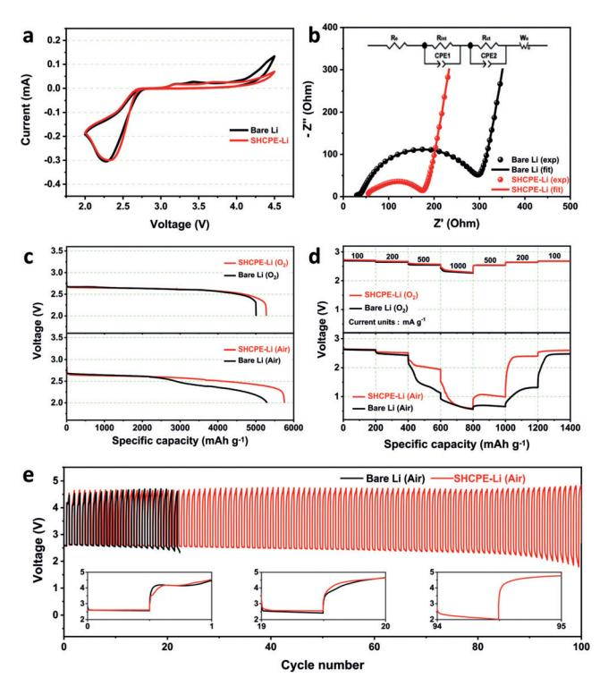
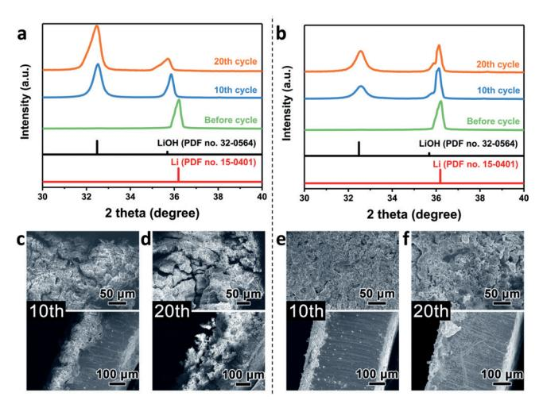
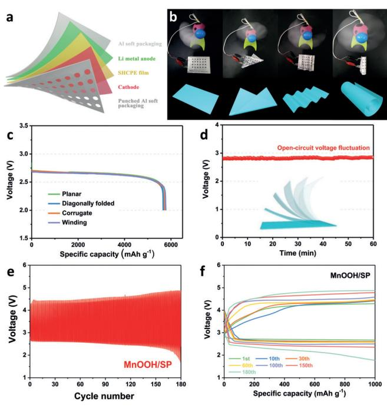
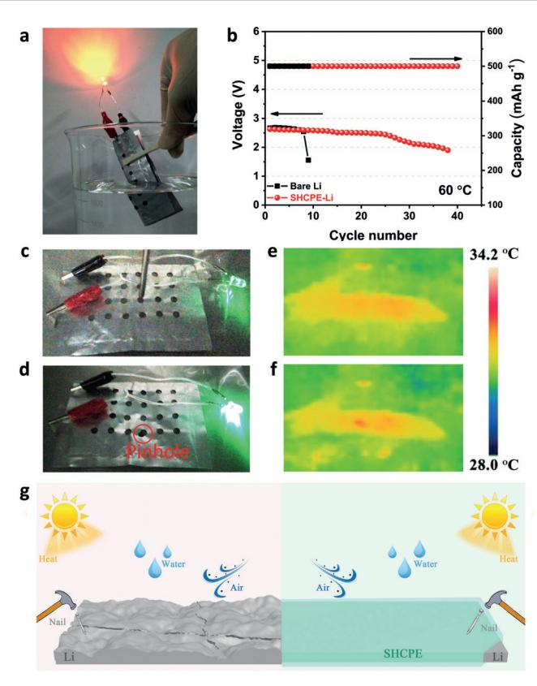

German Edition: DOI: [10.1002/ange.201911229](http://dx.doi.org/10.1002/ange.201911229) Lithium Batteries International Edition: DOI: [10.1002/anie.201911229](http://dx.doi.org/10.1002/anie.201911229)

## Protecting the Lithium Metal Anode for a Safe Flexible Lithium-Air Battery in Ambient Air

Tong Liu, Xi-lan Feng, Xin Jin, Ming-zhe Shao, Yu-tong Su, Yu Zhang,\* and Xin-bo Zhang\*

Abstract: The flexible Li-air battery (FLAB) with ultrahigh energy density is a hopeful candidate for flexible energy storage devices. However, most current FLAB operate in a pure oxygen atmosphere, which is limited by safety and corrosion issues from the metallic lithium anode and has thus greatly impeded the application of FLAB. Now, inspired by the protection effect of the umbrella, a stable hydrophobic composite polymer electrolyte (SHCPE) film with high flexibility, hydrophobicity, and stability was fabricated to protect the lithium anode. The SHCPE mitigated lithium corrosion and improved the capacity, rate performance, and cycle life (from 24 cycles to 95 cycles) of a battery in the ambient air. Based on the protection of SHCPE and the catalysis of MnOOH, the prepared pouch-type FLAB displayed high flexibility, stable performances, long cycling life (180 cycles), and excellent safety; the battery can bear soaking in water, high temperature, and nail penetration.

The development of flexible electronics, which revolutionized all aspects of human life, promoted the research of matched flexible energy storage systems and achieved much progress. [1] However, the current flexible metal ion batteries, flexible supercapacitors, flexible solar cells, and so on cannot satisfy the extraordinary demand for the future flexible energy storage devices because of their inherent low theoretical energy densities. [2] To this end, the flexible lithium–air batteries (FLAB) with ultrahigh energy density (ca. 3500 Whkg@1 ), inexpensive and eco-friendly would be a promising candidate. [3] However, as in early stages, most FLAB had to operate in the pure oxygen atmosphere (defined as the LiO2 battery), significantly hindered its broad application.[4] The equipment for extra O2 gas storage not only severely reduced the practical energy density of batteries but also failed to meet the portable requirements of the next-generation flexible electronic device. [5] Moreover, the safety of battery is an essential and easily ignored question, especially when the FLAB work in various complex environmental conditions. [6]

To make the FLAB which safely operates in the ambient air come true, it is highly necessary and challenging to solve the issues from metallic lithium anode. On the one hand, the metallic lithium is easily degraded by various species, such as N2 , CO2 , H2O that crossover from air cathode and reduced oxygen species (O2 @ , O2 2@ ) that generated during reactions, thus resulting in multitudinous by-products. [7] On the other hand, the adoption of metal lithium anode would lead to undesirable lithium dendrites growth throughout repeated lithium plating/stripping processes. [8] Moreover, in conventional Li-O2 batteries, common separators (for example, polypropylene (PP), glass fiber (GF)) immersed in liquid electrolyte cannot alleviate diffusion of the poisonous substance to Li anode side and prevent lithium dendrites penetration, let alone meet the requirements of high mechanical strength and thermal stability for application in flexible batteries. [9] Therefore, a strategy that addresses the problems of lithium anode and separator simultaneously is urgently needed to promote the practical applications of safe FLAB in the ambient air.

In our daily lives, the umbrellas are used to protect people from the burning sun, wind, rain, and snow. Inspired by the compact, flexible, hydrophobic umbrella cloth, for the FLAB, we fabricated a stable and hydrophobic composite polymer electrolyte (SHCPE) and covered it on the lithium anode to prevent the anode from harmful substances (Figure 1). The SHCPE that composed of thermoplastic polyurethane (TPU) and hydrophobic SiO2 nanoparticles demonstrated high flexibility, superior hydrophobicity, high ionic conductivity, and exceptional stability. The Li anode effectively protected by the SHCPE in the Li-air battery, and the battery exhibited improved electrochemical performance. More importantly, based on the SHCPE, a pouch-type flexible Li-air battery (PFLAB) was successfully fabricated with a long cycle life and excellent safety, which can even withstand various deformation, water, nail penetration, and high temperature, highlighting the feasibility of this strategy.

Figure 2 a showed that the white semitransparent SHCPE film with a diameter of 16 mm possesses an excellent bendability and mechanical stability. The SEM image (Supporting Information, Figure S1) demonstrated the surface of pristine metallic Li is uneven, which would result in inhomogeneous Li ions flux distribution and cause Li dendrites when

[\*] T. Liu, Prof. Dr. X.-b. Zhang State Key Laboratory of Rare Earth Resource Utilization, Changchun Institute of Applied Chemistry, Chinese Academy of Sciences Changchun 130022 (P. R. China) and University of Science and Technology of China Hefei 230026 (P. R. China) E-mail: xbzhang@ciac.ac.cn X.-l. Feng, X. Jin, M.-z. Shao, Y.-t. Su, Prof. Dr. Y. Zhang Key Laboratory of Bio-inspired Smart Interfacial Science and Technology of Ministry of Education, School of Chemistry Beihang University Beijing 100191 (P. R. China) E-mail: jade@buaa.edu.cn Prof. Dr. Y. Zhang Beijing Advanced Innovation Center for Biomedical Engineering, Beihang University Beijing 100191 (P. R. China) Supporting information and the ORCID identification number(s) for the author(s) of this article can be found under: [https://doi.org/10.1002/anie.201911229.](https://doi.org/10.1002/anie.201911229)

Figure 1. a) Protection of the lithium anode; b) fabrication process of the FLAB.

Figure 2. Characteristics of the SHCPE. a) Photographs of SHCPE at flat and bend conditions. b) Cross-section SEM image of the in situ SHCPE protective film on the lithium metal anode. The red line and yellow line represent the interface of the lithium metal and SHCPE, respectively. c) Photographs of bare Li sheet and SHCPE-coated Li sheet after dropping a water drop. d) Photographs of Li sheet partially coated by SHCPE film before (upper) and after (lower) exposed in ambient air for 30 min. e) Thermogravimetric curves of SHCPE; inset: photos of PP, GF, and SHCPE before and after heat at 2008C for 30 min. f) LSV curves for PP, GF/LE, and SHCPE at a constant scan rate of 1 mVs@1 . g) The cycling stability of the symmetric Li metal cells at 0.05 mAcm@2 .

coupled with the porous separators. [10] On the contrary, after coating the SHCPE, the inhomogeneous interface of lithium was well modified, in which the compact and even SHCPE film served as a separator and protection film (Figure 2 b; Supporting Information, Figure S4). The modified interface is favorable to homogeneous Li-ion transfer and inhibition of Li dendrite growth. Moreover, the SHCPE prepared in situ can contact with lithium metal closely to provide long-term and durable protection for it, alleviating the diffusion of corrosive substances to Li metal surface. The SHCPE displayed good hydrophobicity with a water contact angle up to 131.28 (Supporting Information, Figure S5). To exhibit it visually (Figure 2 c), we dropped water droplets on the Li sheet covered or uncovered SHCPE. It was apparent that the Li sheet coated with SHCPE film was steady, while the pristine Li sheet seriously destroyed, producing a severely rough surface, demonstrating the SHCPE film could effectively prevent the penetration of moisture. As mentioned above, the Li metal anode in Li-air battery is easily corroded by the oxidizing gases that crossover from cathode due to its semiopen structure. Thus, we prepared a Li sheet which partially protected by SHCPE film and exposed it in atmospheric condition. As shown in Figure 2 d, after exposure for 30 min, the Li sheet with the protection of SHCPE remained clean state and shined, while the bare Li corroded rapidly to turn black, indicating that SHCPE film can protect Li metal from corrosion of air.

The stability is a crucial property for the polymer electrolytes in FLAB system due to strong oxidizing intermediates would decompose unstable electrolyte and result in short cycle life of batteries. [11] As shown in Figure 2 e, the SHCPE film exhibited excellent thermostability that its weight remains unchanged until the temperature increase to 2708C. The inset in Figure 2 e also indicates that the glass fiber (GF) and SHCPE film remained intact at 200 8C, which is higher than the melting point of lithium metal, while the PP separator deformed severely after 30 min, demonstrating SHCPE could improve the safety of Li-air batteries under high temperature. The SHCPE film could bear 18 MPa of stress which far exceeded those of GF and PP separators (Supporting Information, Figure S6), and it could endure strain as high as about 800%, indicating it was robust enough to keep mechanical integrity during battery bending or folding. After soaking SHCPE and lithium metal with liquid electrolyte for 120 h, the unchanged FTIR spectra demonstrated the SHCPE possessed excellent chemical stability (Supporting Information, Figure S7). Because a high charge potential in the Li-air battery would lead to the oxidative decomposition of electrolyte, a wide working potential window is a critical parameter for the polymer electrolyte. [12] As shown in Figure 2 f, the results of linear sweep voltammetry (LSV) measurement showed that PP and GF/LE had an increased current below 4 V owing to electrolyte decomposition. By comparison, the current of SHCPE film was steady until charged to 4.7 V, indicating the SHCPE has better electrochemically stability and can be applied in high voltage batteries. It is noticeable SHCPE film delivered high ionic conductivity (0.26 mScm@1 at 303 K), which is a prerequisite for maintaining a fast ion transport in batteries (Supporting Information, Figure S8). This result approached the level of GF membrane (0.58 mScm@1 at 303 K), ensuring the successful operation of FLAB. Furthermore, we examined symmetric

lithium metal cells to evaluate the stability of SHCPE film in reversible Li plating/stripping. A comparative experiment between SHCPE protected lithium metal (SHCPE-Li) and bare lithium metal was carried out. The corresponding voltage-time curves in Figure 2 g indicated that the voltages of SHCPE film remained stable within 15 mV for more than 1700 h at 0.05 mAcm@2 , which is a notable improvement compared with that of bare Li (the voltage gradually increased to 100 mV after 670 h). The battery with SHCPE-Li also exhibited long cycle life at a high current density (Supporting Information, Figure S9), suggesting the SHCPE could effectively improve the interface stability and suppress dendritic Li growth and thus increase the cycle life of Li anode.

To assess the electrochemical stability of SHCPE film in the practical Li-O2 cell, cyclic voltammetry was carried out. The curves of SHCPE similar to those of GF/LE, indicating no side reactions occurred during the battery operation and SHCPE did not affect the Li-O2 battery reaction (Figure 3 a). Compared to the GF, the SHCPE displayed lower oxidation current density, demonstrating the SHCPE is more stable in the battery. The FTIR spectra also confirmed the SHCPE is stable in the presence of reaction intermediate (O2 @ and O2 2@ ) without the formation of by-products (Supporting Information, Figure S10). The morphology evolution of discharge products in Li-O2 battery with SHCPE was further inves-

Figure 3. Performances of the Li-air battery. a) Cyclic voltammetry curves of the Li-air batteries in O2 atmosphere. b) EIS of the Li-air batteries, where symbols denote experimental values, solid lines represent fitted data and equivalent circuit for fitting the experimental spectra as the inset. c) Discharge curves of Li-air batteries at a current density of 200 mAg @1 in the ambient air and pure O2 . d) Rate performances in the ambient air and pure O2 . e) Cycling performance of the Liair batteries at 200 mAg @1 and limited capacity of 500 mAhg @1 .

tigated (Supporting Information, Figure S11). After discharge, there were typical toroid-like discharge products, which identified as Li2O2 , on the cathode. [13] In subsequent recharge, the Li2O2 disappeared and no impurity residues, indicating the SHCPE not interfered with the formation of Li2O2 and the battery held good reversibility. The relevant Xray diffraction (XRD) results were also consistent with the SEM images (Supporting Information, Figure S12). Moreover, the SHCPE maintained uniform and compact morphology after 50 cycles in the Li-O2 batteries (Supporting Information, Figure S13). These results indicated that SHCPE had good stability in Li-O2 batteries and it did not affect the working mechanism of the batteries, which prompted us to apply SHCPE to lithium-air batteries.

Figure 3 b shows the electrochemical impedance spectra (EIS) of Li-air batteries. Re represents the ohmic resistance that contributions from the electrolyte, electrodes, current leads, and so on. Rint represents the interfacial resistance between electrode and electrolyte. [14] The Li-air battery with SHCPE-Li exhibited higher Re (47.43 W) than that of bare Li with GF/LE (30.40 W), which was consistent with the lower ionic conductivity of SHCPE. The value of Rint (113.4 W) was lower than that of bare Li with GF/LE (243.7 W), indicating SHCPE-Li had better interfacial contact with electrodes, which were beneficial to mass transfer. The Li-air battery with SHCPE-Li can steadily operate in the air, and its discharge curve is similar to that of battery in pure O2 (Figure 3 c). By comparison, the discharge curve of Li-air battery without SHCPE shows a drop at about 2600 mAhg @1 , which might be explained by the poor interfacial contact caused by corrosion of lithium upon discharging. It is noticeable the battery with SHCPE-Li exhibited higher capacities than that with bare Li both in O2 and in ambient air, owing to the durable and fullrange protection of SHCPE for Li metal anode during discharging (Supporting Information, Figure S14). In O2 atmosphere, the battery with SHCPE-Li showed a similar curve to that with bare Li at different current densities (Figure 3 d). In the ambient air, the Li-air battery with SHCPE-Li displayed a much better rate performance than that with bare Li. At current densities of 100 and 200 mAg @1 , the discharge potentials of Li-air cell with SHCPE-Li were almost the same to that with bare Li. As the current raised to 500 mAg @1 , the voltage plateau of SHCPE-Li was still about 2.0 V that is much higher than that with bare Li. Furthermore, at a higher current density of 1000 mAg @1 , both types of anodes exhibited a low voltage of 0.6 V, which might result from insufficient O2 mass transport (low O2 concentration in air). As current densities decreasing, the discharge potentials of Li-air battery with SHCPE-Li rapidly reverted to the initial high potentials, while that with bare Li anode recovered slowly. The better rate performance of SHCPE-Li could be ascribed to its lower interfacial resistance and ample protection for Li anode. Another considerable improvement of the Li-air battery with SHCPE-Li is cycling stability. As seen in the Supporting Information, Figure S15, in O2 atmosphere, the Li-O2 battery with SHCPE-Li displayed better cycling stability of 114 cycles than that with bare Li (106 cycles). More importantly, in ambient air, the Li-air battery with SHCPE-Li can cycle 95 times (Figure 3 e), far outperforming that with

bare Li (24 cycles), indicating SHCPE has a dramatic effect on improving the cycle stability of battery in the air.

To further reveal the mechanism of performance improvement in Li-air battery with the SHCPE-Li, we investigated the composition and morphology changes of Li anodes after different cycles. The XRD results (Figure 4 a,b) demonstrated

Figure 4. Characteristics of the lithium anode. XRD patterns of the anode taken from the Li-air batteries: a) bare Li and b) the Li metal itself after removing the modified SHCPE layer. The corresponding surface (upper) and cross-sectional (lower) SEM images of anode morphology evolution taken from the Li-air batteries after 10 and 20 cycles; c),d) the bare Li and e),f) the Li metal itself after removing the modified SHCPE layer.

the LiOH formed on the cycled anodes. Of note, after 20 cycles, the SHCPE-Li anode exhibited much weaker LiOH and stronger Li characteristic peaks than that of bare Li. The lesser LiOH indicated the corrosion occurred on the Li anode was significantly suppressed by SHCPE.[15] The SEM images of morphological evolutions on Li was consistent with the XRD results. After 10 cycles, there are many cracks on the surface of bare Li anode, which is much rougher than that protected by SHCPE (Figure 4 c,e). As shown cross-sectional SEM images, the lithium anode without SHCPE almost completely corroded after 20 cycles while that protected by SHCPE only consumed a small fraction (Figure 4 d,f), indicating the SHCPE can decrease Li consumption during cycling. Noticeable, the used SHCPE-Li could operate for another 91 cycles in a new built Li-O2 cell while the used bare anode circulated only 13 cycles, once again proving the excellent effect of SHCPE on improving the cycle life of lithium anode in Li-air batteries (Supporting Information, Figures S17, S18).

Inspired by the flexibility and anticorrosion of SHCPE and the increasing concern on flexible batteries, we fabricated a rechargeable PFLAB based on the SHCPE-Li. As shown in Figure 5 a, the PFLAB constituted of the lithium anode coated by the SHCPE film, flexible cathode and Al soft packaging. In Figure 5 b, the as-fabricated PFLAB showed good flexibility that it could power the air fan under planar, diagonally folded, corrugated, and winding shapes. Further-

Figure 5. Electrochemical performances of PFLAB. a) Representation for the architecture of the PFLAB. b) Photographs of the PFLAB powering an air fan under various shapes, c) the corresponding discharge curves of the PFLAB. d) Open-circuit voltage of the PFLAB after a dynamic bending and releasing process. e),f) Cycling performance of the PFLAB with SHCPE-Li and MnOOH/SP cathode at 500 mAg @1 and a specific capacity limit of 1000 mAhg @1 .

more, the corresponding discharge profiles of the PFLAB are hardly influenced (Figure 5 c), indicating the battery is stable under various deformations. Even after 500 repeating folding cycles, the discharge–charge performances of the PFLAB are nearly the same (Supporting Information, Figure S20). The open-circuit voltage of PFLAB is almost unchanged even under the dynamic bending and releasing process (Figure 5 d), further demonstrating the PFLAB holds a stable performance. To further improve the performance of PFLAB, we introduced a high-efficiency catalyst MnOOH (Supporting Information, Figure S21). At the current of 500 mAg @1 and the limited capacity of 1000 mAhg @1 , the fabricated PFLAB based on SHCPE-Li and MnOOH catalyst displayed a long cycling life (180 cycles). The FTIR spectra and XPS spectra of SHCPE confirmed its chemical properties kept stable during multiple cycles of PFLAB (Supporting Information, Figure S23). These results confirmed the feasibility of SHCPE applied in PFLAB and the fabricated battery exhibited excellent flexibility and stable performance.

As safety is the prerequisite to practical application of battery, thus we further tested PFLAB based on SHCPE at different extreme conditions to verify its safety. As shown in Figure 6 a, thanks to the hydrophobic nature of SHCPE, the PFLAB can lit the red LED even when it partially immersed in water, indicating the obtained battery possessed the functions of water resistance. According to the cycle tests in Figure 6 b, at 608C, the PFLAB with SHCPE exhibited a longer cycle life (37 cycles) than the battery without SHCPE (9 cycles) benefiting from the heat resistance of

Figure 6. Safety properties of PFLAB. a) Photograph of the PFLAB which partially immersed in water and powered a red LED. b) Cycling performances of the PFLAB with bare Li and SHCPE-Li at 608C. c),d) Photographs and e),f) corresponding infrared thermal imaging results of the PFLAB before and after nail penetration test; the nail hole is marked with a red circle. g) The protection of lithium metal by SHCPE in FLAB.

SHCPE. Unexpectedly, the green LED stayed lit by the PFLAB even after the nail penetration test and no short circuit or explosion occurred (Figure 6 c,d). The corresponding infrared thermal imaging results displayed that the battery temperature only rose at the pinhole, demonstrating the PFLAB is safe to nail penetration (Figure 6 e,f). These results confirmed the in situ formed SHCPE on the lithium anode is a viable strategy to improve the safety of PFLAB. We ascribed the high-grade flexibility, outstanding electrochemical stability, and high safety of PFLAB in the air to the excellent properties of SHCPE, as shown in Figure 6 g: 1) in situ preparation of SHCPE created a uniform dense film on Li surface, that can reduce the corrosion and dendritic growth of Li anode, and increase its reversibility; 2) the SHCPE with superior stability and hydrophobicity ensured no by-products introduced; 3) the high ionic conductivity and good interfacial contact of SHCPE guaranteed the continuous transmission of Li-ion, which was in favor of uniform Li plating/stripping during cycling; 4) the full protection of lithium metal by SHCPE prevented batteries from short circuit or fires caused by deformation, water, puncture, and heat, thereby considerably increasing the safety of PFLAB.

In summary, to tackle the challenges of safely operating the FLAB in ambient air, we inspired by umbrellas and fabricated a multifunctional SHCPE protective film for the lithium anode to construct a PFLAB. The SHCPE with high stability mitigated the lithium corrosions and increased the cycle stability of lithium anode, improving the electrochemical performance of Li-air battery in the air. After introducing SHCPE-protected Li anode, the prepared PFLAB displayed high-grade flexibility, stable performance, water/heat resistance and even endured nail penetration. In view of the high safety of the PFLAB, there is no doubt that this protection strategy will accelerate the practical application of FLAB, facilitate further investigations on the protection of alkali metal anodes and inspire more studies on flexible energy storage devices.

## Acknowledgements

This work was financially supported by National Key R&D Program of China (2016YFB0100103), National Natural Science Foundation of China (21725103, 21771013, 21905269, and 51631004), the Strategic Priority Research Program of the Chinese Academy of Sciences (XDA21010210), Jilin Province Science and Technology Development Plan Funding Project (20180101203JC), and Changchun Science and Technology Development Plan Funding Project (19SS010, 18DY012).

## Conflict of interest

The authors declare no conflict of interest.

Keywords: composite electrolytes · flexible batteries · Li-air batteries · lithium metal anodes · safety

How to cite: Angew. Chem. Int. Ed. 2019, 58, 18240– 18245 Angew. Chem. 2019, 131, 18408– 18413

- [1] a) H. Nishide, K. Oyaizu, [Science](https://doi.org/10.1126/science.1151831) 2008, 319, 737 738; b) J. A. Rogers, T. Someya, Y. Huang, [Science](https://doi.org/10.1126/science.1182383) 2010, 327, 1603 – 1607; c) Z. Guo, Y. Ma, X. Dong, J. Huang, Y. Wang, Y. Xia, [Angew.](https://doi.org/10.1002/anie.201807121) Chem. Int. Ed. 2018, 57, 11737 [– 11741;](https://doi.org/10.1002/anie.201807121) [Angew. Chem.](https://doi.org/10.1002/ange.201807121) 2018, 130, 11911 [– 11915.](https://doi.org/10.1002/ange.201807121)
- [2] a) Y. H. Zhu, Y. B. Yin, X. Yang, T. Sun, S. Wang, Y. S. Jiang, J. M. Yan, X. B. Zhang, [Angew. Chem.](https://doi.org/10.1002/anie.201702711) Int. Ed. 2017, 56, 7881 – [7885](https://doi.org/10.1002/anie.201702711); [Angew. Chem.](https://doi.org/10.1002/ange.201702711) 2017, 129, 7989 – 7993; b) Y. Wang, Z. Guo, Y. Ma, X. Dong, J. Huang, Y. Xia, Angew. Chem. Int. Ed. 2018, 57, 11737 – 11741; Angew. Chem. 2018, 130, 11911 – 11915; c) Y. L. Shao, M. F. El-Kady, L. J. Wang, Q. H. Zhang, Y. G. Li, H. Z. Wang, M. F. Mousaviand, R. B. Kaner, Chem. [Soc. Rev.](https://doi.org/10.1039/C4CS00316K) 2015, 44, 3639 [– 3665](https://doi.org/10.1039/C4CS00316K); d) X. Hu, Z. Li, J. Chen, [Angew. Chem.](https://doi.org/10.1002/anie.201701928) Int. Ed. 2017, 56, 5785 [– 5789](https://doi.org/10.1002/anie.201701928); [Angew. Chem.](https://doi.org/10.1002/ange.201701928) 2017, 129, 5879 – 5883; e) D. Yang, R. Yang, S. Priya, S. Liu, Angew. Chem. Int. Ed. 2018, 57, 4466 – 4483; Angew. Chem. 2018, 130, 4554 – 4566.
- [3] a) Q. C. Liu, J. J. Xu, D. Xu, X.-B. Zhang, Nat. Commun. 2015, 6, 7892; b) P. Tan, B. Chen, H. Xu, H. Zhang, W. Cai, M. Ni, M. Liu, Z. Shao, Energy [Environ.](https://doi.org/10.1039/C7EE01913K) Sci. 2017, 10, 2056 – 2080; c) Y. Zhang, L. Wang, Z. Guo, Y. Xu, Y. Wang, H. Peng, [Angew. Chem. Int.](https://doi.org/10.1002/anie.201511832) Ed. 2016, 55, 4487 [– 4491](https://doi.org/10.1002/anie.201511832); [Angew. Chem.](https://doi.org/10.1002/ange.201511832) 2016, 128, 4563 – 4567; d) X. Lei, X. Liu, W. Ma, Z. Cao, Y. Wang, Y. Ding, [Angew.](https://doi.org/10.1002/anie.201810882) Chem. Int. Ed. 2018, 57, 16131 [– 16135](https://doi.org/10.1002/anie.201810882); [Angew. Chem.](https://doi.org/10.1002/ange.201810882) 2018, 130, 16363 [– 16367.](https://doi.org/10.1002/ange.201810882)

- [4] a) D. S. Geng, N. Ding, T. S. A. Hor, S. W. Chien, Z. L. Liu, D. Wuu, X. L. Sun, Y. Zong, [Adv. Energy](https://doi.org/10.1002/aenm.201502164) Mater. 2016, 6, 1502164; b) M. Asadi, B. Sayahpour, P. Abbasi, A. T. Ngo, K. Karis, J. R. Jokisaari, C. Liu, B. Narayanan, M. Gerard, P. Yasaei, X. Hu, A. mukherjee, K. C. Lau, R. S. Assary, F. Khalili-Araghi, R. F. Klie, L. A. Curtiss, A. Salehi-Khojin, [Nature](https://doi.org/10.1038/nature25984) 2018, 555, 502 – 507; c) T. Zhang, H. Zhou, Nat. Commun. 2013, 4, 1817; d) L. Ye, W. Lv, J. Cui, Y. Liang, P. Wu, X. Wang, H. He, S. Lin, W. Wang, J. H. Dickerson, W. D. He, [ChemElectroChem](https://doi.org/10.1002/celc.201402315) 2015, 2, 312 – 323.
- [5] a) J. Christensen, P. Albertus, R. S. Sanchez-Carrera, T. Lohmann, B. Kozinsky, R. Liedtke, J. Ahmed, A. Kojic, J. Electrochem. Soc. 2012, 159, R1 – R30; b) X.-Y. Yang, J.-J. Xu, D. Bao, Z.-W. Chang, D.-P. Liu, Y. Zhang, X.-B. Zhang, [Adv. Mater.](https://doi.org/10.1002/adma.201700378) 2017, 29[, 1700378](https://doi.org/10.1002/adma.201700378); c) T. Liu, J.-J. Xu, Q.-C. Liu, Z.-W. Chang, Y.-B. Yin, X.-Y. Yang, X.-B. Zhang, Small 2017, 13[, 1602952](https://doi.org/10.1002/smll.201602952).
- [6] Y. B. Yin, X. Y. Yang, Z. W. Chang, Y. H. Zhu, T. Liu, J. M. Yan, Q. Jiang, [Adv. Mater.](https://doi.org/10.1002/adma.201703791) 2018, 30, 1703791.
- [7] a) H.-K. Lim, H.-D. Lim, K.-Y. Park, D.-H. Seo, H. Gwon, J. Hong, W. A. Goddard, H. Kim, K. Kang, J. Am. [Chem.](https://doi.org/10.1021/ja4016765) Soc. 2013, 135[, 9733](https://doi.org/10.1021/ja4016765) – 9742; b) L. Ye, M. Liao, H. Sun, Y. Yang, C. Tang, Y. Zhao, L. Wang, Y. Xu, L. Zhang, B. Wang, F. Xu, X. Sun, Y. Zhang, H. Dai, P. G. Bruce, H. Peng, [Angew. Chem. Int.](https://doi.org/10.1002/anie.201814324) Ed. 2019, 58[, 2437](https://doi.org/10.1002/anie.201814324) – 2442; [Angew. Chem.](https://doi.org/10.1002/ange.201814324) 2019, 131, 2459 – 2464; c) R. S. Assary, J. Lu, P. Du, X. Luo, X. Zhang, Y. Ren, L. A. Curtiss, K. Amine, [ChemSusChem](https://doi.org/10.1002/cssc.201200810) 2013, 6, 51 – 55; d) H.-J. Shin, W.-J. Kwak, D. Aurbach, Y.-K. Sun, [Adv. Funct.](https://doi.org/10.1002/adfm.201605500) Mater. 2017, 27, [1605500](https://doi.org/10.1002/adfm.201605500); e) Z. Zhu, A. Kushima, Z. Yin, L. Qi, K. Amine, J. Lu, J. Li, Nat. Energy 2016, 1, 16111.
- [8] a) N.-W. Li, Y. Shi, Y.-X. Yin, X.-X. Zeng, J.-Y. Li, C.-J. Li, L.-J. Wan, R. Wen, Y.-G. Guo, [Angew. Chem.](https://doi.org/10.1002/anie.201710806) Int. Ed. 2018, 57, 1505 – [1509](https://doi.org/10.1002/anie.201710806); [Angew. Chem.](https://doi.org/10.1002/ange.201710806) 2018, 130, 1521 – 1525; b) H. Ye, S. Xin, Y.- X. Yin, J.-Y. Li, Y.-G. Guo, L.-J. Wan, J. Am. [Chem.](https://doi.org/10.1021/jacs.7b01763) Soc. 2017, 139, 5916 [– 5922](https://doi.org/10.1021/jacs.7b01763); c) H. Song, H. Deng, C. Li, N. Feng, P. He, H.

Zhou, Small Methods 2017, 1[, 1700135](https://doi.org/10.1002/smtd.201700135); d) X. Q. Zhang, X. Chen, R. Xu, X. B. Cheng, H. J. Peng, R. Zhang, J. Q. Huang, Q. Zhang, [Angew. Chem.](https://doi.org/10.1002/anie.201707093) Int. Ed. 2017, 56, 14207 – 14211; [Angew.](https://doi.org/10.1002/ange.201707093) Chem. 2017, 129, 14395 [– 14399](https://doi.org/10.1002/ange.201707093).

- [9] a) J. J. Xu, Q. C. Liu, Y. Yu, J. Wang, J. M. Yan, X. B. Zhang, [Adv. Mater.](https://doi.org/10.1002/adma.201606552) 2017, 29, 1606552; b) D. Zhou, A. Tkacheva, X. Tang, B. Sun, D. Shanmukaraj, P. Li, F. Zhang, M. Armand, G. Wang, [Angew. Chem.](https://doi.org/10.1002/anie.201901582) Int. Ed. 2019, 58, 6001 – 6006; [Angew.](https://doi.org/10.1002/ange.201901582) [Chem.](https://doi.org/10.1002/ange.201901582) 2019, 131, 6062 – 6067; c) D. J. Lee, H. Lee, Y.-J. Kim, J.- K. Park, H.-T. Kim, [Adv. Mater.](https://doi.org/10.1002/adma.201503169) 2016, 28, 857 – 863; d) H. Wu, Y. Cao, H. Su, C. Wang, [Angew. Chem.](https://doi.org/10.1002/anie.201709774) Int. Ed. 2018, 57, 1361 – [1365](https://doi.org/10.1002/anie.201709774); [Angew. Chem.](https://doi.org/10.1002/ange.201709774) 2018, 130, 1375 – 1379.
- [10] a) X.-B. Cheng, R. Zhang, C.-Z. Zhao, Q. Zhang, [Chem.](https://doi.org/10.1021/acs.chemrev.7b00115) Rev. 2017, 117, 10403 [– 10473](https://doi.org/10.1021/acs.chemrev.7b00115); b) C. Yang, K. Fu, Y. Zhang, E. Hitz, L. Hu, [Adv. Mater.](https://doi.org/10.1002/adma.201701169) 2017, 29, 1701169.
- [11] C. V. Amanchukwu, J. R. Harding, Y. Shao-Horn, P. T. Hammond, [Chem.](https://doi.org/10.1021/cm5040003) Mater. 2015, 27, 550 – 561.
- [12] J. Zhang, B. Sun, X. Xie, K. Kretschmer, G. Wang, [Electrochim.](https://doi.org/10.1016/j.electacta.2015.03.103) Acta 2015, 183[, 56 –](https://doi.org/10.1016/j.electacta.2015.03.103) 62.
- [13] a) R. Black, S. H. Oh, J.-H. Lee, T. Yim, B. Adams, L. F. Nazar, [J.](https://doi.org/10.1021/ja2111543) Am. [Chem.](https://doi.org/10.1021/ja2111543) Soc. 2012, 134, 2902 – 2905; b) Y.-C. Lu, D. G. Kwabi, K. P. C. Yao, J. R. Harding, J. Zhou, L. Zuin, Y. Shao-Horn, Energy [Environ.](https://doi.org/10.1039/c1ee01500a) Sci. 2011, 4, 2999 – 3007.
- [14] Y. Li, Y. Yin, K. Guo, X. Xue, Z. Zou, X. Li, T. He, H. Yang, [J.](https://doi.org/10.1016/j.jpowsour.2013.04.123) Power [Sources](https://doi.org/10.1016/j.jpowsour.2013.04.123) 2013, 241, 288 – 294.
- [15] J. L. Shui, J. S. Okasinski, P. Kenesei, H. A. Dobbs, D. Zhao, J. D. Almer, D. J. Liu, Nat. Commun. 2013, 4, 2255.

Manuscript received: September 2, 2019

- Accepted manuscript online: October 6, 2019
- Version of record online: October 28, 2019