# **Assembling All-Solid-State Lithium–Sulfur Batteries with Li3N-Protected Anodes**

[Abdulkadir](http://orcid.org/0000-0002-1967-5855) Kızılaslan\* and Hatem Akbulut[a]

The construction of all-solid-state batteries is now easier after the successful synthesis of sulfur-based solid electrolytes with extremely high ionic conductivities. Utilizing lithium metal as the anode in these batteries requires a protective solid electrolyte layer to prevent corrosion due to the highly reactive nature of lithium. Li3N coating on lithium metal is a promising way of preventing the degradation of the electrolyte during charge and discharge. In this study, utilization of a Li3N-coated lithium anode and Li7P3S11 solid electrolyte are reported, where a

### **Introduction**

Challenging environmental problems arising from the use of fossil fuels urge the world to use environmentally friendly power sources. Lithium ion batteries (LIBs) are considered the most prominent alternatives to replace the use of fossil fuels on vehicles. Yet several concerns have to be eliminated before the adoption of these batteries into vehicles. Current LIBs utilizing ether based liquid electrolytes to shuttle lithium ions between anode and cathode. Flammability risk of these ether based liquid electrolytes has to be taken more into consideration as we scale up the LIBs from the ones used in electronic devices into vehicles. Besides, LIBs should supply more power density to be employed in vehicles due to economic concerns. Solid electrolytes are now the most favourable alternatives to replace liquid electrolytes especially after the successful synthesis of sulfide electrolytes having lithium ion conductivity on the order or up of commercial ether based liquid electrolytes.

Sulfidic solid electrolytes are synthesized broadly in three forms. LMPS(M=Ge,Sn,Si) type solidelectrolytes are synthesized in tetragonal crystal structures and reported to having ionic conductivity of 12 mScm 1 and 4 mS cm 1 for Li10GeP2S12 and Li10SnP2S12, respectively.[1,2] Subsequent syntheses focused on doping halogens into the structure resulted better electrochemical window up to 8 V (vs Li/Li+). Structures in Li6PS5X (X=Cl,Br,I) formula are having cubic argyrodite crystal structure with ionic conductivities barely less than LMPS type electrolytes but still on the order of 10 3 S cm 1 . [3] Lastly, solid electrolytes in (x)Li2S-(100-x)P2S5 system where x=67,70,75 and 80 yields

[a] *A. Kızılaslan, Prof. H. Akbulut Metallurgy and Materials Science Department Sakarya University Esentepe Campus, 54050 Sakarya (Turkey) E-mail: akizilaslan@sakarya.edu.tr akbulut@sakarya.edu.tr*

quaternary reduced graphene oxide (rGO)/S/carbon black/ Li7P3S11 composite is used as cathode in the assembled cell. Our results indicate that protecting the Li metal with a Li3N coating does not affect the electrochemical characteristics of the cell and extends the cycle life of the battery. A cell assembled with a protective layer was shown to having 306 mAhg 1 capacity after 120 cycles at 160 mAhg 1 current density, whereas a cell without protective layer had a capacity of 260 mAhg 1 .

superionic conductor solid electrolytes with ionic conductivity of the range 1–10 mS cm 1 . Among those structures, extremely high ionic conductivities reported on the 70Li2S:30P2S5 system with 16 mS cm 1 . [4]

Although great strides have been achieved in conductivity front, main challenge left to be overcome is to construct compatible anode and cathode pairs with the synthesized solid electrolytes. Wenzel et al[5] reported the instability of LMPS type solid electrolytes along with the phases formed at interface utilizing XPS analysis. A stable solid electrolyte interface has to be composed of phases that are electronically(ionically) insulating (conducting). Yet the phases formed on LMPS type solid electrolytes are reported to having electronically conductive phases in the form of LixMy. Such type of interfaces would consume anodes, through reducing electrolytes, and eventually kill the battery.

Increasing number of studies has focused on the engineering of the electrode-electrolyte interfaces to get compatible pairs specially to utilize lithium as anode. Ab Initio Molecular Dynamic (AIMD) studies based on Density Functional theory (DFT) are very effective and powerful way of searching desired systems over a large system database. Zhu et al.[6] searched different binary and ternary fluorides, sulfides, oxides and nitrides that are stable against Li anode. They concluded that most nitride structures behave cathodic against Li metal. Intentional modification of Li anode surface before assembling the cell is one plausible way to eliminate the adverse side effects of SEI layer. This layer would not only prevent the aforementioned phase problems but also construct better wetted interface. Moreover the common problem of Li anode dendritic growth may also be suppressed with the formation of proper coatings on the anode.

Based on nitride structures to be coated onto the Li metal, Li3N having two common polymorphs (α-Li3N and β-Li3N) already known as exhibiting high Li+ ionic conductivities.Several studies were successfully conducted to coat Li3N layer on the Li anode and encouraging results showing less impedance

Supporting information for this article is available on the WWW under <https://doi.org/10.1002/cplu.201800539>

on the interface are obtained.[7–11] Besides, coating Li3N onto the Li metal surface can be accomplished via the direct nitridation of Li metal with N2 gas at room temperature. Contrary to other more expensive and time consuming thin film coating processes, direct nitridation is a very effective way of utilizing the highly reactive nature of lithium.

On the cathode side sulfur is one of the promising materials with its theoretical energy density of 2600 Whkg 1 and is already at the focus of Li S batteries with liquid electrolytes. However, the formation and shuttle of lithium polysulfides formed on these systems are still challenging to be overcome in Li S batteries with liquid electrolytes. Solid electrolytes are now the most exciting alternatives to replace liquid electrolytes. In all solid state lithium ion batteries (ASSLIBs), one has to composite sulfur with a conductive material due to its extremely low conductivity of about 1×10 15 Sm 1 . Besides volume expansion during lithiation is another challenge of sulfur to be utilized in LIBs. Combining sulfur with reducedgraphene oxide(rGO) is shown to have better results mainly because rGO easily hosts the volume expansion of sulfur.[12] The composite cathode should also be ionically conductive. Combining rGO/Sulfur composites with ionically conductive solid electrolytes not only makes cathodes conductive but also decrease the chemical potential difference between the electrode and electrolyte.

In this study we report the successful synthesis of Li7P3S11 solid electrolyte and assembling of an ASSLIB where Li3N coated Li and sulfur active material composite served as anode and cathode, respectively. Chemical stability of Li3N Li7P3S11 interfaces were studied by means of ab-initio molecular dynamics (AIMD) simulations.

### **Results and Discussion**

Metastable glass-ceramic Li7P3S11 phase synthesized by two step reaction where at first step stoichiometric amount of Li2S-P2S5 powder mixture converted into glass form through ball-milling. Then, DSC analysis were carried out to reveal possible reactions during subsequent heat treatment to crystallize Li7P3S11 phase from the obtained glassy powders. Figure 1 shows the XRD analysis of ball-milled and crystallized Li7P3S11 phases along with DSC analysis in the inset. DSC analysis showed two exothermic peaks where each characterizes the crystallization of Li7P3S11 and Li4P2S6 phases. No other peaks was observed in the system up to 350°C and glass transition temperature is observed at around 200°C.

Li4P2S6 phase formed according to the following reaction and shown to be having ionic conductivity on the order of 10 7 S cm 1 at room temperature.[13,14] The structure is basically formed at temperatures higher than the crystallization temperature of Li7P3S11 phase because of sulfur loss due to heat [Eq. (1)].

$$
2Li_2S + P_2S_5 \rightarrow Li_4P_2S_6 + S \tag{1}
$$

Raman analysis was carried out to observe the local environ-

**Full Papers**

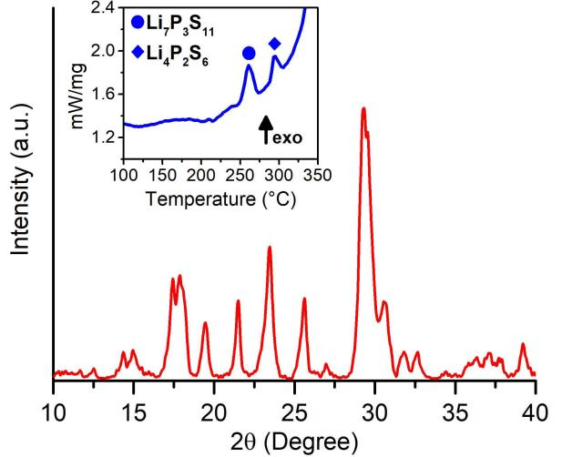

**Figure 1.** XRD analysis of Li7P3S11 synthesis and DSC analysis (inset).

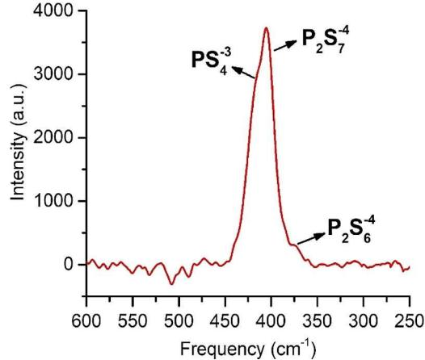

**Figure 2.** Raman analysis of synthesized Li7P3S11.

ment of the Li7P3S11 structure and the result given in Figure 2. Besides Raman analysis is a powerful technique to characterize the existence of impurity phases in the structure. Characterized peaks of Li7P3S11 structure are observed at around 420,410 and 380 cm 1 where each peak stands for PS 3 4 , P2S 4 7 and P2S 4 6 . Small neck observed at around 380 cm 1 which stands for the existence of impurity Li4P2S6 phase in trace amount.

Composite sulfur based rGO/S/CarbonBlack(CB)/ Li7P3S11cathode was utilized in assembled ASSLIB. Sulfur, CB and Li7P3S11 was utilized as active, electronic and ionic conductive materials respectively. rGO utilized in the system to restrict the well-known volume expansion(contraction) of sulfur during lithiation(delithiation). Mixing active material with solid electrolytes decrease the chemical potential difference between the electrode and electrolyte so that side reactions were prevented in the system.

Figure 3 a shows the Raman analysis of rGO along with the XRD analysis of rGO in the inset. The well-known peak of GO at around 11° converted into peak at around 26° upon the reduction through heat treatment at 800°C for 4 h under Ar-H2

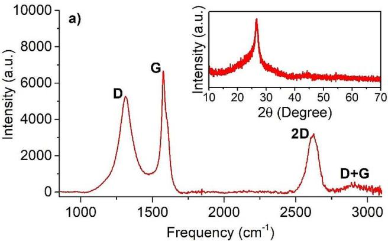

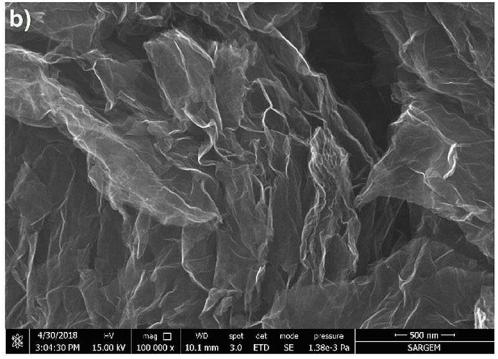

**Full Papers**

**Figure 3.** (a) Raman and XRD analysis of rGO and (b) morphology of the synthesized rGO.

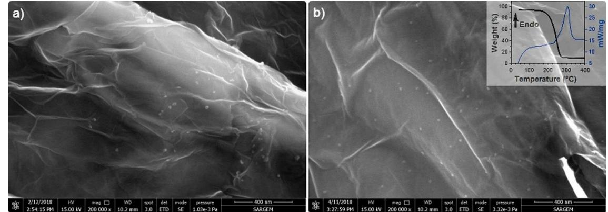

**Figure 4.** (a, b) FESEM images of rGO/S composite. Thermal gravimetry analysis of rGO/S composite (inset).

gas flow. In Raman analysis of obtained rGO structure, peak observed at around 1350 cm 1 indicates the structural defects and disorders named D band; where peak at around 1580 cm 1 denotes sp2 hybridization of carbon atoms. Smaller D band compared to G band observed upon the reduction represents the less defective nature of the structure which yields better electronic conductivity in the cathode. Figure 3 b shows the well-known wrinkled morphology of synthesized rGO structure. Sulfur was added into rGO to prepare rGO/S composite. Figure 4 a–b shows the morphology of rGO/S composite. The tiny bits of particulates are the sulfurs impregnated into rGO matrix. They are well dispersed into the system and having sizes around 10 nm. The amount of sulfur soaked into rGO matrix was measured by Thermal Gravimetry and shown in the inset of Figure 4 b. The result shows that 85 percent of rGO/S composite composed of sulfur active material. Overall cathode composition contains sulfur active material as approximately 37.5 wt%.

TEM analysis was carried out to further analyze the interaction and distribution of rGO/S composite. As seen in Figure 5, sulfur particulates with the size of about 10 nm are well distributed within rGO which are expected to accommodate the expansion of sulfur during lithiation.

Li3N layer was formed on the lithium anode chips through N2 gas flow inside an air-tight reaction chamber at 50°C.

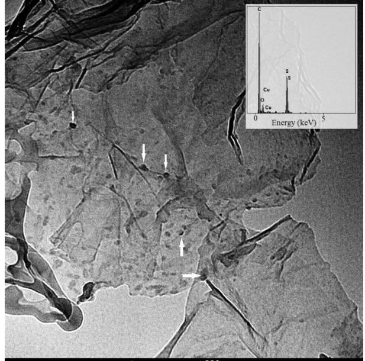

**Figure 5.** TEM analysis of rGO/S composite with EDS (inset).

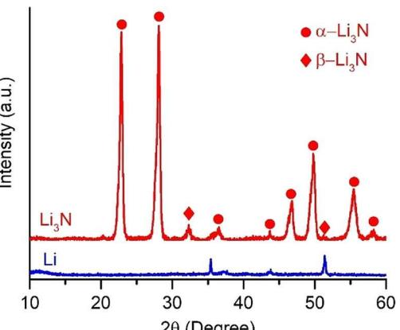

**Figure 6.** XRD analysis of pristine and Li3N coated Li metal.

Figure 6 shows the XRD analysis of the Li3N phase formed on the Li chips along with fresh Li chips. The peaks observed after nitridation assigned to α -Li3N phase with JCPDF 30-0759 card. Tiny peaks at around 32° and 52° were assigned to β-Li3N polymorphous arising due to the reaction at elevated temperature. Considering the low enthalpy barrier of α-Li3N to β-Li3N transition (0.01 eV)[8] it is inclined to get β-Li3N polymorphous in synthesis at temperatures higher than room temperature.

Nitridation kinetics of lithium is abrupt due to the high reactivity of Li metal. Besides, native film existing at the surface oflithium foils consist of LiOH, Li2O and Li2CO3 [10] always affect the nitridation kinetics i. e. nucleation site of Li3N phase Figure 7(a–b) shows the nitridation process taken during the synthesis where nitridation took place at the surface. Generally nitridation process starts withthe nucleation of Li3N and proceeds through the depth of lithium metal instead of surface. Nucleation and kinetics of the new phase have to be controlled to get such kind of layer. Figure 7 c display the nitride layer formed on the surface of the lithium with the thickness of about 130 μm. As observed, contrary to lithium metal, Li3N phase is hard and brittle.

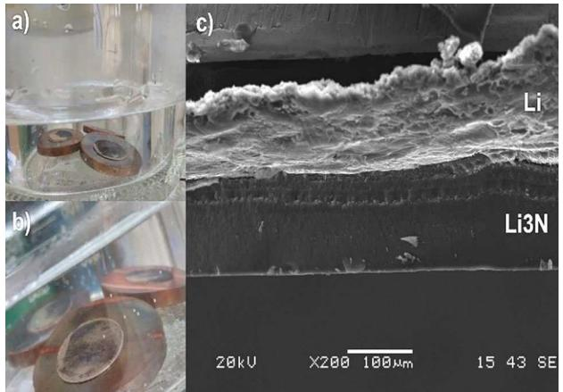

**Figure 7.** Synthesis of Li3N layer on an Li anode where nitridation took place on the surface.

**Full Papers**

**Figure 8.** (a) Nitridation of Li metal where island growth observed. (b) EDS map and (c) line analysis of displayed rectangular area.

Figure 8 a shows the intermediate stage of nitridation process, where nitridation did not take place evenly on the surface. Figure 8 (b–c) shows the elemental and line mapping of the area shown within the rectangle on the Figure 8 a. On Figure 8 c, Upper(Darker) side of the image represents the unnitrided part of the lithium where the other side(lighter) represents the nitrided part of the lithium. Line EDS analysis results(shown with yellow line) shows the nitrogen distribution on the nitrided and un-nitrided portion of the sample. The abrupt change in the nitrogen amount testifies the heterogeneous nitridation kinetics along with island-growth mechanism[7] of the synthesis. EDS dot mapping also testifies the uniform nitridation on the nitrided parts of the sample. The black dots observed in Figure 8b are oxide particulates formed during sample preparation due to exposure of air. Cracks were also liable to be formed on the nitrided part of the lithium chip due to the brittle nature of Li3N phase.

To test the ionic conductivity of the prepared solid electrolyte ion-blocking In/Li7P3S11/In symmetric cell were prepared. Figure 9 a shows the impedance measurement results where the inset displays the magnified high frequency semi-circle portion of the curve. Total ionic conductivity of the prepared solid electrolyte pellet is determined by the intercept between the x-axis and the straight line. Total conductivity of the pellet was measured as 4 mS cm 1 at room temperature. To test the electrochemical stability of the synthesized structure, we assembled Lithium/ Li7P3S11/Stainless Steel cell. Only the peaks denote lithium stripping and deposition were observed in figure 9 b. The result shows that the synthesized structure has a wide electrochemical window up to at least 5 V. The electrochemical window of the cell were also tested in the system where Li anode replaced with Li3N coated Li. Figure 9 c shows that Li3N layer does not prevent lithium stripping and

**Full Papers**

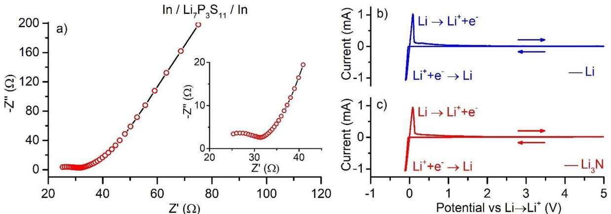

**Figure 9.** (a) Impedance analysis of synthesized Li7P3S11 electrolyte in symmetrical cell. Inset shows the magnification of high frequency region. Electrochemical window of (b) Li and (c) Li3N-protected Li assembled in Li(Li3N)/Li7P3S11/stainless steel cell.

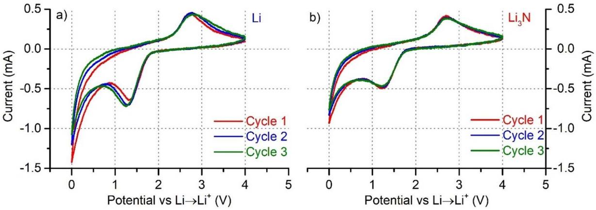

**Figure 11.** CV analysis of (a) Li/Li7P3S11/(rGO/S/CB/Li7P3S11) and (b) Li3N coated Li/Li7P3S11/(rGO/S/CB/Li7P3S11) cell.

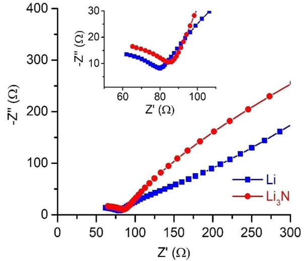

**Figure 10.** Impedance analysis of the cell with pure lithium and Li3N protected Li used as anode where Li7P3S11 and (rGO/S/CB/Li7P3S11) used as solid electrolyte and cathode respectively.

deposition in the cell. Beside any reaction due to Li3N was not observed in system up to 5 V.

Figure 10 shows the impedance measurements conducted on Li(or Li3N)/Li7P3S11/(S-rGO-CB-Li7P3S11) systems. Both cells have about the same total impedance(bulk+grain boundary resistance) which shows that Li3N layer does not contribute to total impedance of the system mainly due to high ionic conductivity and thin layer ofLi3N phase.

Asymmetric Li (or Li3N)/Li7P3S11/(S-rGO-CB-Li7P3S11) cell constructed to evaluate the reduction and oxidation reactions of the sulfur based cathode composite. The results given in Figure 11 show that two peaks representing S+2Li+ + 2e *\*\**Li2S reactions observed in both systems as common in allsolid state batteries utilizing sulfur as cathode active material. Anodic peak representing the oxidation of Li2S to lower order polysulfides observed at around 2.8 V vs Li/Li+. Cathodic peak representing the reduction of sulfur to higher order polysulfides observed at around 1.3 V vs Li/Li+ at first cycle. Difference between anodic and cathodic peaks were found to be increasing with cycling on pure Li anode system indicating that

# **Full Papers**

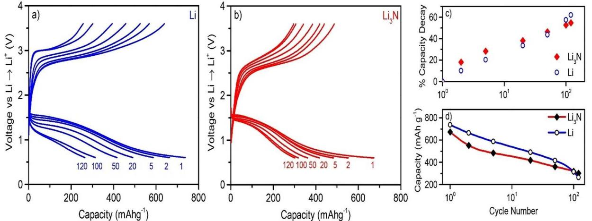

**Figure 12.** Cyclic performance of(a) Li/Li7P3S11/(rGO/S/CB/ Li7P3S11) (b) Li3N coated Li/Li7P3S11/(rGO/S/CB/ Li7P3S11) cell at 25°C. (c) Capacity decay upon cycling with respect to initial capacity. (d) Capacity of the cells upon cycling.

polarization is increasing in the system. Whereas on Li3N coated Li anode system polarization were not increased upon cycling.

Galvanostatic cyclic charge-discharge tests conducted between 0.6–3.6 V (vs Li/Li+) at a current density of 160 mAg 1 and the results given in Figure 12 (a–b). Contrary to Li S batteries with liquid electrolytes where two plateau observed due to the production of polysulfide intermediates, here, in solid electrolytes we observed one charge an discharge plateau as the only electrochemical reaction governing the reaction is S +2Li+ +2e *\*\**Li2S. Cycling tests reveal that cell assembled with pure lithium anode delivers higher initial capacities. However upon cycling capacity degradation is lower on the cell assembled with Li3N protected lithium anode. Cell with pure lithium anode has initial and final capacities of 730 and 260 mAhg 1 after 120 cycles whereas cell with Li3N coated lithium anode has initial and final capacities of 680 and 306 mAhg 1 . Figure 12 c display the capacity decay upon cycling with respect to initial capacity of both cells. Capacity decay is lower on Li3N protected system. Figure 12 d display the capacity of the cell with respect to cycle number. Cell with pure lithium anode has higher capacity until 75 cycles, yet the capacity of the cell with Li3N protected anode is higher afterwards.

### **Conclusion**

In summary, Li7P3S11 solid electrolyte is successfully synthesized and utilized in an ASSLIB where anode compose of Li3N coated Li metal and cathode is a quaternary sulfur based composite. The analysis on the effect of Li3N coating on Li metal anode revealed that the layer does not impede charge transfer substantially. Therefore, Li3N coating can be utilized in ASSLIBs to prevent the corrosion of Li anode in contact with solid electrolyte. Besides facile synthesis route of Li3N makes such kind of coatings feasible for mass production. Our molecular dynamic analysis revealed that Li7P3S11 solid electrolyte does not degrade in contact with Li3N within our 1.2 ps simulation. To our best knowledge there is not any study relating the use of Li3N coated Li anode at ASSLIBs and our results present promising characteristics of Li3N to improve the cycle ability of Li-ion batteries.

# **Experimental Section**

#### **Li7P3S11Synthesis**

Li7P3S11 glass ceramic powders were synthesized by ball milling and subsequent heat treatment of Li2S (99.98%, Sigma Aldrich) and P2S5 (99%, Merck) powders. Stoichiometric amount of powders were put into zirconia pot with 16 balls (10 mm) and rotated at 400 rpm for 24 h intermittently to prevent any sulfur loss due to heat. Ball milled glassy powders were then put into sealed quartz tube and sintered at 265°C for 2 h. All synthesis procedure was carried out in glovebox (MBRAUN LABstar) to prevent the exposure of powders to air.

Phase analysis of synthesized powders were carried out by X-ray diffraction (Rigaku D/MAX 2000) with Kapton band sealed apparatus. Raman analysis was utilized to observe the local environment of the synthesized Li7P3S11 structure with 732 nm laser. DSC analysis was carried out prior to crystallization heat treatment to characterize the possible exo(endo)thermic reactions during synthesis.

## **rGO/S/CB/Li7P3S11Composite Cathode Synthesis**

Quaternary cathode composition utilized in this study. Graphene oxide(GO) powders, synthesized by modified Hummers method, were heat treated at 800°C for 4 h in Ar-H2 atmosphere to convert GO into reduced Graphene Oxide(rGO). Exfoliated rGO structure were then mixed withas-dried sulfur in sealed quartz tubes at 155°C for 12 h [(rGO):S 1:5 wt%] to penetrate sulfur into rGO. Obtained composite were then mixed with SuperP as electronic conductive agent at cathode by ball milling at 370 rpm for 8 h [(rGO:S):SuperP 3:1 wt%]. Last step of cathode production was composed of mixing rGO-S-SuperP composite with Li7P3S11 powders by ball milling at 370 rpm for 8 h [(rGO:S:SuperP):Li7P3S1160:40 wt %].

#### **Li3N Coated Li Anode Synthesis**

Nitride coating of anode surface was carried out by ex-situ nitridation method where N2 gas allowed to flow through lithium chip containing sealed reaction chamber. Lithium chips with 300 μm thickness were initially scratched by a scalpel to clean surface films and then exposed to N2 gas(99.999% purity) flow with 100 sccm for 2 h at 50°C. Li3N layer first nucleates at the surface of the chipand then depending on the kinetics of the reaction proceeds either toward surface or depth of the chip.Black colored Li3N thin film formed on the lithium surface were then characterized by elemental and phase composition utilizing FESEM and X-ray Diffraction respectively.

Li3N layer was confined only to the surface of Li metal to take advantage of the higher theoretical capacity of lithium (3862 mAhg 1 ) instead of Li3N. Besides pure Li3N phase is brittle so that in all solid state batteries, where pressure is applied, it can be utilized in powder form. However, density and contact problems will unavoidably be faced in this case.

#### **Electrochemical Tests**

Electrochemical tests were conducted at GAMRY(Gamry Instruments Reference 1000)workstation. Synthesized solid electrolyte powders of about 90 mg were put into a PEEK insulated die (10 mm dia.) and pressed under 400 Mpa. 4 mg cathode powders corresponding to 1.175 mgcm 2 active material loadwere then spread onto the Li7P3S11 pellet and pressed under 340 MPa. At last, lithium chip was placed onto the other side of the pellet and pressed under 120 MPa. Stainless steel punches were utilized as pressure transmitting media along with current collectors in the cell. Impedance tests were carried out with symmetrical In/Li7P3S11/ In cell at frequency between 1 MHz–1 Hz with 10 mV amplitude. Cyclic Voltammetry(CV) tests were conducted by asymmetrical Li/ Li7P3S11/Stainless Steel cell between 0.2–5 V (vs Li/Li+) with 1 mV/s step size to evaluate the electrochemical window of the synthesized solid electrolyte. CV tests were also carried out atLi(or Li3 N)/ Li7P3S11/(S-rGO-CB-Li7P3S11) cells between 0–4 V to observe the anodic and cathodic reactions in the cell with 1 mV/s stepsize. Galvanostatic electrochemical charge-discharge tests were conducted between 0.6–3.6 V (vs Li/Li+) with a current density of 160 mAg 1 . Capacity was calculated according to the amount of sulfur active material in the cathode.

#### **Molecular Dynamic Simulations**

Ab-initio molecular dynamics(AIMD) simulations were performed using Vienna Ab initio Simulation Package(VASP)[16,17] to mimic the Li3N-Li7P3S11 interface. Perdew-Burke-Ernzerhof (PBE) version of Projected augmented wave (PAW) pseudopotentials were utilized. Energy cutoff of 400 eV used within gamma centered 1×1×1 kpoint. Time-step were selected as 1 fs with 1200 timestep to get 1.2 ps length simulation. Simulation time kept short due to computational costs. Li7P3S11 with triclinic crystal structure lack of having symmetry. Therefore it is extremely challenging to construct compatible interface between triclinic Li7P3S11 (Space group=P1) and hexagonal Li3N (Space group=P6/mmm(191)) within reasonable number of atoms for molecular dynamics studies. To construct interface with Li3N phase we selected the atoms reside within the enclosed rectangular prism of trigonal Li7P3S11 structure which does not preserve the stoichiometry. Li46P24S78 structureutilized in this study which deviates from the seven fold supercell structure of Li7P3S11 by 6.2%, 14.3% and 1.3% for Li, P and S respectively. Therefore our model utilized to resemble the interface is lack of lithium and excess of sulfur and phosphorus. For Li3N side we constructed interface by trimming from supercell so that the interface has dimensions 16.97 Å and 12.35 Å in z and y directions with the thickness of 8.91 Å.

### *Acknowledgements*

*This work was supported by Research Fund of the Sakarya University under the project no: 2017-01-08-043*

### *Conflict of Interest*

*The authors declare no conflict of interest.*

**Keywords:** all-solid-state batteries **·** electrochemistry **·** electrodes **·** lithium nitride **·** solid electrolytes

- [1] N. Kamaya, K. Homma, Y. Yamakawa, M. Hirayama, R. Kanno, M. Yonemura, T. Kamiyama, Y. Kato, S. Hama, K. Kawamoto, A. Mitsui, *[Nat.](https://doi.org/10.1038/nmat3066) Mater.* **2011**, *10*, [682–686](https://doi.org/10.1038/nmat3066).
- [2] P. Bron, B. Roling, S. Dehnen, *J. Power Sources* **2017**, *352*, [127–134.](https://doi.org/10.1016/j.jpowsour.2017.03.103)
- [3] C. Yu, L. van Eijck, S. Ganapathy, M. Wagemaker, *[Electrochim.](https://doi.org/10.1016/j.electacta.2016.08.081) Acta* **2016**, *215*, [93–99](https://doi.org/10.1016/j.electacta.2016.08.081).
- [4] Y. Seino, M. Nakagawa, M. Senga, H. Higuchi, K. Takada, T. Sasaki, J. *Mater. Chem.* **2015**, *3*, 2756–2761.
- [5] S. Wenzel, D. A. Weber, T. Leichtweiss, M. R. Busche, J. Sann, J. Janek, *Solid State Ionics* **2016**, *286*, [24–33.](https://doi.org/10.1016/j.ssi.2015.11.034)
- [6] Y. Zhu, X. He, Y. Mo, *Adv. Sci.* **2017**, *4*, [1600517.](https://doi.org/10.1002/advs.201600517)
- [7] Y. J. Zhang, W. Wang, H. Tang, W. Q. Bai, X. Ge, X. L. Wang, C. D. Gu, J. P. Tu, *J. Power Sources* **2015**, *277*, [304–311](https://doi.org/10.1016/j.jpowsour.2014.12.023).
- [8] G. Ma, Z. Wen, M. Wu, C. Shen, Q. Wang, J. Jin, X. Wu, *Chem. [Commun.](https://doi.org/10.1039/C4CC05535G)* **2014**, *50*, [14209–14212](https://doi.org/10.1039/C4CC05535G).
- [9] K. Park, J. B. Goodenough, *Adv. Energy Mater.* **2017**, *7*, [1700732.](https://doi.org/10.1002/aenm.201700732)
- [10] Y. Sun, Y. Y. Li, J. Sun, Y. Y. Li, A. Pei, Y. Cui, *Energy [Storage](https://doi.org/10.1016/j.ensm.2016.10.004) Mater.* **2017**, *6*, [119–124.](https://doi.org/10.1016/j.ensm.2016.10.004)
- [11] M. Baloch, D. Shanmukaraj, O. Bondarchuk, E. Bekaert, T. Rojo, M. Armand, *Energy Storage Mater.* **2017**, *9*, [141–149.](https://doi.org/10.1016/j.ensm.2017.06.016)
- [12] R. Xu, Z. Wu, S. Zhang, X. Wang, Y. Xia, X. Xia, X. Huang, J. Tu, *[Chem.](https://doi.org/10.1002/chem.201703116) Eur. J.* **2017**, *23*, [13950–13956.](https://doi.org/10.1002/chem.201703116)
- [13] Z. D. Hood, C. Kates, M. Kirkham, S. Adhikari, C. Liang, N. A. W.
- Holzwarth, *Solid State Ionics* **2016**, *284*, [61–70](https://doi.org/10.1016/j.ssi.2015.10.015). [14] L. E. Rush, N. A. W. Holzwarth, *Solid State Ionics* **2016**, *286*, [45–50.](https://doi.org/10.1016/j.ssi.2015.12.015)
- [15] T. Cheng, B. V. Merinov, S. Morozov, W. A. Goddard, *ACS [Energy](https://doi.org/10.1021/acsenergylett.7b00319) Lett.* **2017**, *2*, [1454–1459.](https://doi.org/10.1021/acsenergylett.7b00319)
- [16] G. Kresse, D. Joubert, *Phys. Rev. B* **1999**, *59*, [1758–1775](https://doi.org/10.1103/PhysRevB.59.1758).
- [17] G. Kresse, J. Furthmüller, *Phys. Rev. B* **1996**, *54*, [11169–11186.](https://doi.org/10.1103/PhysRevB.54.11169)

Manuscript received: October 22, 2018 Revised manuscript received: January 21, 2019 Accepted manuscript online: January 23, 2019