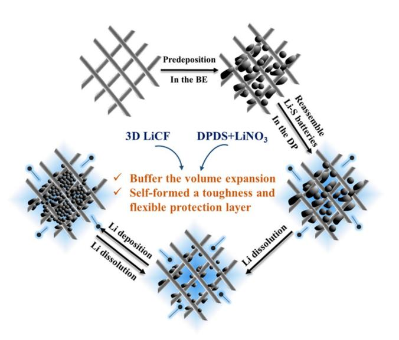
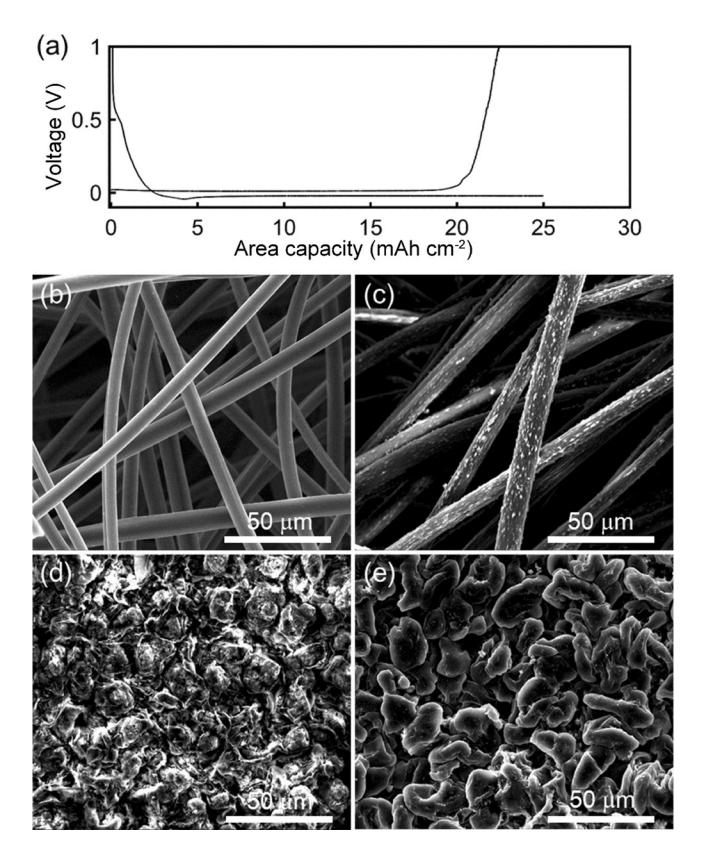
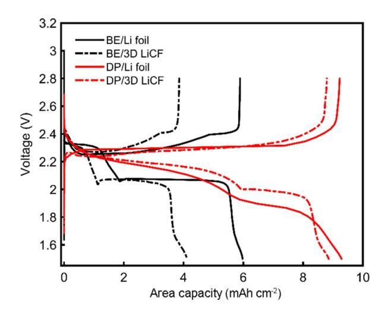
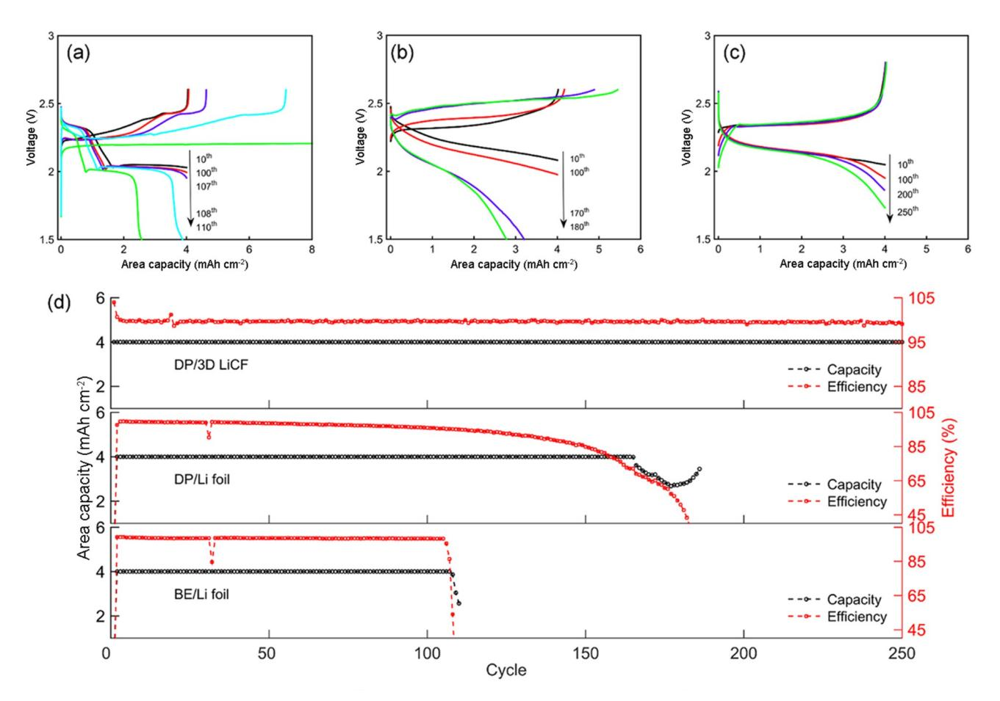
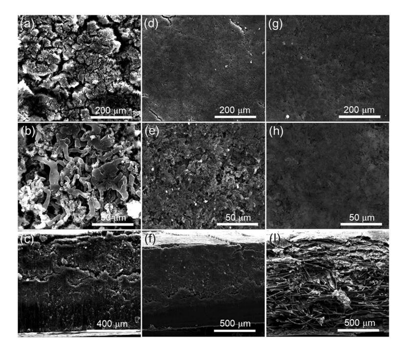
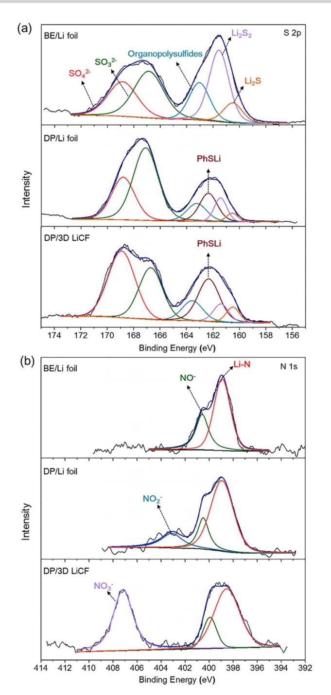
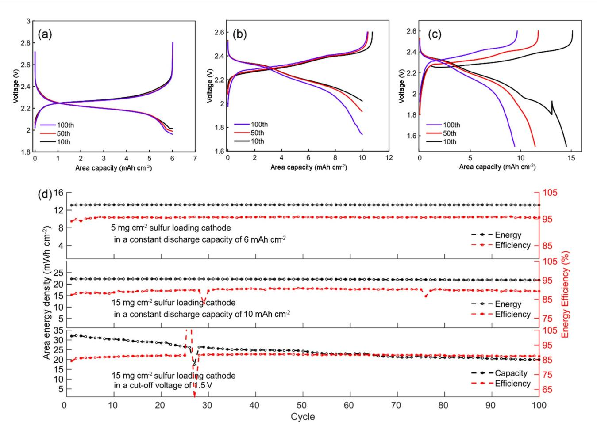

# Self-Formed Protection Layer on a 3D Lithium Metal Anode for Ultrastable Lithium–Sulfur Batteries

Xinxiu Yan,[a, b] Huan Zhang,[a, b] Meiling Huang,[a] Meizhen Qu,[a] and [Zhikai](http://orcid.org/0000-0001-7939-1873) Wei\*[a]

Lithium metal anodes are a key component of high-energydensity lithium–sulfur (Li–S) batteries. However, the issues associated with lithium anodes remain unsolved owing to the immature lithium anode construction and protection technology, which leads to internal short circuits, poor capacity retention, and low coulombic efficiency for high-sulfur-loading Li–S batteries. Herein, a highly stable 3D lithium carbon fiber composite (3D LiCF) anode for high-sulfur-loading Li–S batteries was demonstrated, in which a self-formed hybrid solid-electrolyte protection layer was constructed on a lithium metal surface through codeposition of thiophenolate ions and inorganic lithium salts by using diphenyl disulfide as a co-additive in the

# Introduction

The lithium–sulfur (Li–S) battery with sulfur as a cathode and lithium metal as an anode has a theoretical specific energy density of 2600 Whkg@1 , which is 3–5 times higher than the state-of-art lithium ion (Li-ion) batteries.[1–5] It has long been considered as the most promising energy storage device for the replacement of Li-ion batteries. However, the application of Li–S batteries has been hindered by several critical challenges,[6] especially the high sulfur loading on the cathode. Some issues that were concealed under low-sulfur-loading conditions appear not only on the sulfur cathode, but also, more seriously, on the lithium metal anode side.

Lithium metal, with the highest specific capacity (3860 mAhg @1 ), the lowest negative electrochemical potential (@3.04 V vs. standard hydrogen electrode), and a low gravimetric density (0.59 g cm @3 ), is regarded as the preferred anode material for Li–S batteries. However, lithium is a highly active alkali metal, which makes it unstable in organic electrolyte, and a solid-electrolyte interphase (SEI) is usually formed on the lithium metal surface.[7] The SEI layer is intrinsically brittle and cracks owing to the volume change effect during the Li deposition and dissolution process, which exposes fresh lithium to

| [a] Dr. X. Yan, Dr. H. Zhang, M. Huang, Prof. M. Qu, Dr. Z. Wei Chengdu Institute of Organic Chemistry                                                         |
|-------------------------------------------------------------------------------------------------------------------------------------------------------------------|
| Chinese Academy of Sciences Chengdu, 610041 (P.R. China)                                                                                                       |
| E-mail: zkwei@cioc.ac.cn                                                                                                                                          |
| [b] Dr. X. Yan, Dr. H. Zhang University of Chinese Academy of Sciences Beijing 100049 (P.R. China)                                                          |
| Supporting Information and the ORCID identification number(s) for the author(s) of this article can be found under: https://doi.org/10.1002/cssc.201900119. |

electrolyte. The aromatic components from thiophenolate could improve the stability of the protection layer, and the 3D structure of the carbon fiber could effectively buffer the volume effect during lithium cycling. A Li–S battery based on a 3D LiCF anode exhibited excellent cycling stability with an energy efficiency of 89.2% for 100 cycles in terms of a high energy density of 22.3 mWhcm@2 (10 mAhcm@2 area capacity of lithium cycling). This contribution demonstrates versatile and ingenious strategies for the construction of a 3D lithium anode structure and protection layer, providing an effective solution for practical stable Li–S batteries.

the electrolyte to form a new SEI layer. [8] This repeated crushing and reformation process during battery cycling consumes lithium metal, electrolyte, and sulfur, resulting in capacity degradation and a low coulombic efficiency. Furthermore, lithium dendrite growth usually occurs during the deposition process owing to the inhomogeneous local current density distribution on the surface of the lithium metal anode, which leads to an internal short circuit and safety issues of the Li–S batteries.[9] To ensure that the energy density of the Li–S battery exceeds the state-of-art Li-ion battery, the cycling area capacity of the cathode side needs to exceed at least 4 mAhcm@2 . That means at least a 20 mm variation of the thickness of the corresponding anode side, which is a huge volume change for an SEI layer on the lithium metal surface and will aggravate the attenuation of the battery capacity and efficiency. Additionally, the commonly used lithium foil is uneven at the microscale in the horizontal and vertical direction, leading to an uneven local current density distribution in the charge–discharge process, which aggravates the lithium dendrite growth.

To overcome these issues, various kinds of methods have been used to reinforce and stabilize the SEI layer on lithium metal, such as in situ polymerization by electrolyte additives,[10–16] artificial organic/inorganic hybrid protective layer, [17–22] and electrolyte component optimization[23–26] to achieve relatively high lithium coulombic efficiencies. However, most of these improvements are verified at low deposition capacity or low current density, which is far from the conditions in actual application. To achieve a cycling area capacity above 4 mAhcm@2 on the lithium anode side, lithium composite anodes with 3D conductive skeletons have been fabricated, such as a porous copper skeleton,[27–29] self-supported carbon skeletons such as carbon nanotubes,[30,31] carbon fibers,[32, 33]

graphene,[34–38] and porous carbon.[39–41] Among them, the 3D carbon skeleton with a high surface area can provide a large interface for lithium deposition, which efficiently reduces and homogenizes the local current density to suppress the growth of dendritic lithium. Furthermore, its high porosity can effectively buffer the volume change of the lithium during charge and discharge. Although a large reversible area capacity and high lithium coulombic efficiency can be achieved, this has rarely been accomplished in Li–S batteries.[32,34] In common Li– S batteries with ether electrolyte and LiNO3 additives, a spontaneous protection layer formed between lithium and electrolyte consumes the lithium, sulfur, LiNO3 , and solvent during the cycling process.[42] Owing to the large surface area provided by the 3D skeleton, Li–S batteries with 3D lithium composite anodes usually show a rapid capacity decay in the preliminary stage and low capacity retention for long-term cycling. Considering the practical application of 3D lithium anodes for Li–S batteries, it appears more beneficial to build a stable and mechanically strong protection layer on the lithium surface.

In this contribution, we propose a 3D lithium carbon fiber composite (3D LiCF) anode with a rationally designed in situ protection layer for long-term Li–S batteries. The 3D LiCF anode was fabricated by electrochemical predeposition on the carbon fiber surface, and a self-formed hybrid organic/inorganic protection layer was constructed on the surface of the 3D LiCF anode by using diphenyl disulfide (DPDS) as a co-additive for LiNO3 -containing ether electrolyte. On the one hand, the carbon fiber scaffold structure not only offers sufficient room for lithium deposition to buffer the corresponding volume change but also lowers the local current density to obtain a uniform electrochemical lithium deposition/dissolution process. On the other hand, chemical and electrochemical decomposed products of DPDS and LiNO3 codeposit on the 3D LiCF anode, which serve as plasticizers to improve the flexibility and roughness of the protection layer. This strategy shows a facile and cost-effective way to obtain a stable protection layer on the 3D LiCF anode, which exhibits an excellent capacity retention for high-sulfur-loading Li–S batteries. As a result, a cycling area capacity of 10 mAhcm@2 with an energy density of 22.3 mWhcm@2 at a current density of 1 mA cm @2 can be obtained with a high energy retention of 96.7% over 100 cycles and >89.0% energy efficiency, which is higher than the stateof-art Li-ion batteries (11–15 mWhcm@2 ). Furthermore, the batteries prepared with 3D LiCF coupled with a 15.0 mgcm@2 high-sulfur-loading cathode can deliver an energy density of 31.2 mWhcm@2 at a current density of 1 mA cm@2 . An energy density of 20.3 mWhcm@2 can be maintained after 100 cycles with no dendrites or short circuits occurring during cycling, showing ultrastable electrochemical performance for Li–S batteries.

#### Results and Discussion

As shown in the schematic diagram in Figure 1, the 3D LiCF electrode was fabricated by electrochemical predeposition of lithium on the carbon fiber electrode in the base electrolyte (marked as BE), which consisted of 1m bistrifluoromethanesul-

# Full Papers

Figure 1. A schematic diagram of 3D LiCF with a self-formed tough and flexible protection layer on the surface.

fonylimide (LiTFSI) in 1,3-dioxolane (DOL) and 1,2-dimethoxyethane (DME) (1:1 v/v) with the addition of 2 wt% LiNO3 . Then, the battery was reassembled with a sulfur/graphene (S/G) composite cathode in the BE with 20 wt% DPDS added (marked as DP). During cycling, the carbon fiber skeleton effectively buffered the volume expansion of lithium, whereas a tough and flexible protection layer induced by DPDS and LiNO3 -containing electrolyte self-formed on the 3D LiCF surface. The first discharge/charge profile of the 3D LiCF electrode is detailed in Figure 2 a, which shows a controlled lithium deposition capacity of 25 mAhcm@2 during the discharge process and 1 V cutoff voltage with 22.4 mAhcm@2 lithium dissolution during charge. The discharge capacity above 0 V was approximately 2.4 mAhcm@2 , corresponding to the lithium intercalation capacity in the carbon fibers. To observe the morphology evolution, we recorded the SEM images of the 3D LiCF electrodes in different discharge stages. The initial carbon fibers with a diameter of 8 mm and length of several hundred micrometers are shown in Figure 2 b, which provided an intertwined flexible and porous scaffold for lithium deposition. At a discharge voltage of 0 V, lithium grains initially appeared on the surface of the carbon fibers, presenting an evenly distributed morphology (Figure 2 c). After further plating with lithium for 15 mAhcm@2 , the pores formed by the carbon fibers were partially filled by lithium particles (Figure 2 d). At the end of discharge, the lithium particles grew to approximately 30 mm and displayed a smooth surface and dendrite-free lithium plating morphology (Figure 2 e). In contrast, the deposition morphology on lithium foil (Figure S1 in the Supporting Information) displayed an uneven lithium particle distribution and porous structure, indicating the formation of lithium dendrites and dead lithium, which leads to the failure of Li–S batteries. From the above comparison, a dendrite-free lithium plating morphology could be obtained on the 3D LiCF electrode, revealing that the large interface and uniform current distribution pro-

Figure 2. a) The first discharge/charge profile of 3D LiCF electrode. SEM images of b) the initial carbon fibers and after discharge to c) 2.42 mAhcm@2 (0 V), d) 15 mAhcm@2 (@21 mV), and e) 25 mAhcm@2 (@21.3 mV, end of discharge), respectively.

vided by the carbon fiber skeleton can inherently prevent the formation of lithium dendrites.

The as-prepared 3D LiCF anode was assembled with a S/G cathode (5.0 mgcm@2 sulfur loading) in different electrolytes to evaluate its electrochemical performance, and lithium foil as an anode was simultaneously compared. The preparation of the S/G cathode is described in the Experimental Section. The thickness of the S/G cathodes with 5.0 and 15.0 mgcm@2 sulfur loading was approximately 1.2 and 1.3 mm in the natural state, respectively, according to cross-sectional SEM images (Figure S2 in the Supporting Information). The commercial carbon fiber skeleton features an excellent elasticity in the natural state. After permeating the active material slurry, the large porosity is partially retained and facilitates the penetration of electrolyte into the interior of electrode. The thickness of the electrode would decrease after the battery sealing pressure. Furthermore, the electrolyte/sulfur (E/S) ratio is usually higher than 5 to ensure the wettability of electrodes and high sulfur utilization. Otherwise, it is difficult to study the performance of the 3D LiCF anode in a full Li–S battery (relevant descriptions are shown in Figure S3 in the Supporting Information). The first discharge/charge curves of Li–S batteries containing a 3D LiCF anode and lithium foil in BE and DP electrolyte at a current density of 1 mA cm@2 are shown in Figure 3 (marked as BE/Li foil, BE/3D LiCF, DP/Li foil, and DP/3D LiCF). Clearly, the BE/3D LiCF anode delivered an areal discharge capacity of

# Full Papers

Figure 3. The first discharge/charge curves of BE/Li foil, BE/3D LiCF, DP/Li foil, and DP/3D LiCF at a current density of 1 mA cm@2 .

4.1 mAhcm@2 (corresponding to a specific capacity of 837.8 mAhg @1 ), which was less than that of the BE/Li foil sample (5.9 mAhcm@2 , corresponding to a specific capacity 1175.2 mAhg @1 ). Like other 3D carbon skeletons, owing to the large interface provided by carbon fiber, much more active materials are consumed on the surface of the 3D LiCF anode to form a SEI layer, [42] which leads to a low discharge capacity in BE/3D LiCF. However, in DP, there are clear differences in the voltage profiles and capacity utilization. A modified sulfur redox pathway observed at approximately 2.2 V as result of the addition of DPDS was associated with the formation of a series of phenyl polysulfides, which are generated by the reaction of thiophenolate with polysulfide ions because of their thiophilicity. This process undergoes a chemical equilibrium between various phenyl polysulfides and results in a higher utilization of sulfur. Therefore, changes in the plateau potential and capacity were mainly owing to a change in the sulfur redox pathway under the influence of DPDS, which was consistent with a previous report. [13] Moreover, DPDS can also provide a fraction of discharge capacity. The galvanostatic profile of a battery with a blank cathode and 3D LiCF in DP is shown in Figure S4a in the Supporting Information. The approximately 2.08 V potential flat corresponds to the reduction of the S@S bond in DPDS, and a lean potential flat at 1.6 V corresponds to the reduction of LiNO3 . The DPDS additive is electrochemically reversible in the potential window of 1.5–2.8 V with the contribution of approximately 1 mAhcm@2 to the overall reversible capacity of Li–S batteries (Figure S4b in the Supporting Information). The addition of DPDS not only affected the sulfur redox process, but DPDS also participated in the formation of a protection layer on the lithium metal surface,[12] which reduced the capacity loss when the anode was changed from Li foil to 3D LiCF. Therefore, DP/3D LiCF and DP/Li foil delivered an area capacity of 8.9 and 9.3 mAhcm@2 , respectively, which was much smaller in capacity attenuation compared with the samples in the BE. Because of the multifunctional role of DPDS, we investigated its effect on cycling stability of lithium in full Li–S batter-

ies but not in symmetric batteries (Li/BE/Li, Li/DP/Li). Detail reasons are explained in Figure S5 in the Supporting Information.

Considering the large discharge capacity gap between the BE and DP electrolytes, the cycling mode of the Li–S batteries was set at a controlled capacity of 4 mAhcm@2 at a current density of 2 mA cm@2 for the purpose of comparing the anode stability under the same lithium cycling capacity. In the presence of the S/G cathode, the role of DPDS addition was to modify the sulfur redox pathway associated with the formation of various phenyl polysulfides. The majority of 4 mAhcm@2 capacity was contributed by the redox reaction of polysulfides above the discharge voltage of 2 V, which was not capable of undergoing electrochemical reduction of DPDS (&2.08 V). Therefore, the sulfur involved in the discharge/charge process was almost equivalent in DP and BE with a controlled capacity of 4 mAhcm@2 . For the sample of BE/Li foil (Figure 4 a, d), the cycling performance clearly indicated a short cycle life of approximately 110 cycles, with a short circuit at the end of lifespan owing to lithium dendrite formation. During cycling, the coulombic efficiency was maintained above 98.3% but rapidly decreased after the 107th cycle. This indicated that the protection layer on the surface of lithium foil from LiNO3 outlived its effect because of the dendrite growth and the volume effect from lithium cycling, finally leading to a short circuit. Additionally, the areal capacity of BE/3D LiCF was too low to cycle at a constant capacity like other anodes. The corresponding cycling performance is also shown in Figure S6 in the Supporting Information, in which a continuous capacity attenuation can be observed with a capacity retention of 43.8% after 300 cycles. However, it maintained a high coulombic efficiency of above 99.2% during its lifespan with no internal short circuit. By virtue of the large interface provided by 3D LiCF, the formation of lithium dendrites could be inhibited, and a prolonged cycle life could be obtained. However, the protection layer with contribution only by LiNO3 was not stable during cycling and continuously consumed active materials and electrolyte, leading to a low capacity retention. A much longer lifespan was obtained for the DP/Li foil (Figure 4 b, d) compared with the BE/Li foil, with no internal short circuit at the end of its life. Its coulombic efficiency was maintained above 99.0% in the early stage but rapidly decreased after the 150th cycle. Meanwhile, its polarization in the discharge/charge curves significantly increased. The lifespan of DP/3D LiCF (Figure 4 c, d) was over 250 cycles with no internal short circuit. Its coulombic efficiency was maintained above 99.4% during its cycle life with low polarization (only a small voltage drop of approximately 0.31 V at the end of discharge), which led to an energy density retention of 97.2% after 250 cycles. To further study the different polarization phenomena in DP with lithium foil and 3D LiCF anode, electrochemical impedance spectroscopy (EIS) tests were em-

Figure 4. The discharge/charge curves of a) BE/Li foil, b) DP/Li foil, and c) DP/3D LiCF with a constant discharge capacity of 4 mAhcm@2 at a current density of 2 mA cm@2 , and d) the corresponding cycling performance with coulombic efficiency.

ployed to monitor the impedance changes during cycling of the corresponding cells (Figure S7 in the Supporting Information). Two semicircles are shown in the Nyquist plot, in which the resistance of the SEI film (RSEI) at a high frequency is associated with the resistance of Li+ migration across the protection layer, and the charge-transfer resistance (RCT) at a low frequency is attributed to the interfacial charge–transfer resistance.[43] For DP/Li foil, from the 10th to 50th cycle, the corresponding impedance was relatively stable (Figure S7 a in the Supporting Information), which indicated that the protection layer on the lithium anode was stable in the early stage of the cycling process. However, from the 50th to 100th cycle, its impedance increased rapidly, which was also revealed in the charge–discharge curves (Figure 4b). For DP/3D LiCF, the impedance change was much more stable (Figure S7b in the Supporting Information), decreasing from the 10th to 50th cycle and increasing to the primitive level from the 50th to 100th cycle. This phenomenon revealed that the protection layer on the 3D LiCF anode formed during the cycling process and was stable during circulation. To analyze the changes to the lithium anode in the above testing samples, the morphologies of the lithium anodes after 100 cycles in BE/Li foil, DP/Li foil and DP/ 3D LiCF cells were obtained (Figure 5). The top surface (Figure 5 a, b) and cross-section images (Figure 5 c) of the BE/Li foil exhibited a porous, loose, and fractured structure with long lithium filaments, in which the rod-like large dendrites and dead lithium were the major reasons for the poor coulombic efficiency and short circuit of the battery (Figure 4 a). In contrast to the routine dendritic formation, the morphology of the DP/Li foil showed a mostly planar surface without any clear dendrite structure (Figure 5 d, e). Because no perfect SEI layer was formed, there were some inevitable cracks and small

Figure 5. SEM images of the surface and cross-section of a,b, c) BE/Li foil, d, e,f) DP/Li foil, and g,h, i) DP/3D LiCF after 100 cycles of lithium deposition/dissolution.

pores on the DP/Li foil anode. A dense and compact interior morphology was observed in the cross-section view (Figure 5 f), which indicated that the self-formed protection layer on the DP/Li foil induced by DPDS- and LiNO3 -containing electrolyte promoted the uniform deposition/dissolution of lithium. However, 2D planar lithium foil does not have enough space to accommodate the corresponding large volume change of approximately 180% (the thickness of original lithium foil was 600 mm). This will significantly damage the protection layer, enlarge its thickness owing to the spontaneous reaction between the electrolyte and the exposed fresh lithium metal, and finally lead to increased polarization. When 3D LiCF was used, the deposited lithium had the most uniform surface with small pores (Figure 5 g, h). There was no change in the thickness of 3D LiCF before and after lithium deposition/dissolution (Figure 5 i). Small lithium particles were mainly embedded in the carbon fiber skeleton, which provides a uniform interface for lithium deposition and buffers the volume effects during lithium cycling. The above comparison indicated that the protection layer co-induced by DPDS and LiNO3 was more stable than pure LiNO3 in the BE. Further bonding with the 3D carbon fiber skeleton resulted in volume effect mitigation. Therefore, the stable protection layer and dendrite-free structure of the DP/3D LiCF anode can extend the cycling life and improve the coulombic efficiency of Li–S batteries.

We performed X-ray photoelectron spectroscopy (XPS) to explore the detailed chemical composition of the SEI layer on the 3D LiCF and lithium foil anodes in the BE and DP after 50 cycles. The S 2p and N 1s spectra (Figure 6) indicated that the SEI layer was composed of complex organic/inorganic products, which were formed by the decomposition of additives and native electrolyte components. In the S 2p spectra

> (Figure 6 a), the signal in the range of 159.0–172.0 eV was split into five peaks centered at 160.5, 161.5, 163.3, 167.1, and 168.8 eV, which were attributed to Li2S, Li2S2 , organopolysulfides, SO3 2@ , and SO4 2@ , respectively. [44] The SEI layer of the BE/Li foil mainly consisted of Li2S and Li2S2 , demonstrating that an unstable protection layer on lithium foil causes continuous consumption of active materials. In contrast to the spectrum of BE, a dominant peak located at 162.4 eV corresponding to lithium organosulfides (PhSLi) confirmed the decomposed products of DPDS in the DP spectrum.[45] Moreover, the peak at 163.6 eV illustrated that the composition of organopolysulfides changed under the influence of DPDS decomposition, which was slightly higher than that in BE/Li foil (163.3 eV). In the N 1s spectra (Figure 6 b), the peak at 398.9 eV was assigned to the Li@N bond, and the peak at 400.5 eV was assigned to NO @ in the BE/Li foil. The peak at 403.1 eV for the DP/Li foil was attributed to NO2 @ , and the peak at 407.2 eV for DP/ 3D LiCF was attributed to NO3 @ . [46] During the long cycle test, well-maintained NO3 @ was only embedded in the SEI layer of DP/3D LiCF, which indicated that the protection layer was so stable that no LiNO3 was continuously consumed to form a new SEI layer. In

Figure 6. XPS spectra of BE/Li foil, DP/Li foil, and DP/3D LiCF after 50 cycles. a) S 2p spectra; b) N1s spectra.

addition, the relative content of Li, O, F, C, S, and N elements for the three samples is listed in Table S1 in the Supporting Information. As suggested by the results, DP/3D LiCF had the lowest relative content of S and highest relative content of N in the self-formed protection layer, which was more likely to suppress dendrite growth and continuous side reactions with lithium metal. For a cycling capacity of 4 mAhcm@2 , its energy density was approximately 8.5 mWhcm@2 for the Li–S battery, which was still lower than the state-of-art Li-ion batteries.

To investigate the cycling stability of the 3D LiCF anode under a higher energy density, the sample of DP/3D LiCF was Full Papers

cycled under a constant capacity of 6 mAhcm@2 with a current density of 1 mA cm@2 (Figure 7a) (coupled with 5.0 mg cm@2 low-sulfur-loading cathode). Although the lithium cycling capacity on the 3D LiCF anode was increased, a much more stable cycling performance was also obtained. Its energy density was maintained at 13.2 mWhcm@2 , with an energy efficiency of 95.4% during cycling and an energy retention of 99.5% after 100 cycles (Figure 7 d), which can reach or even exceed the state-of-art Li-ion batteries. Additionally, a quite low polarization was observed with only 52 mV voltage drop after 100 cycles, which means that a very stable protection layer was formed on the surface of the 3D LiCF anode. If the sulfur loading was increased to 15.0 mgcm@2 , the batteries with 3D LiCF anodes were measured at a constant discharge capacity of 10 mAhcm@2 (Figure 7 b) oracut-off voltage of 1.5 V (Figure 7 c). The corresponding energy density and energy efficiency are shown in Figure 7 d. The DP/3D LiCF anode exhibited a high areal energy density of 22.3 mWhcm@2 with an energy efficiency of approximately 89.2% and retained this over 100 cycles with little attenuation. Moreover, a higher initial areal capacity of 31.2 mWhcm@2 was achieved and maintained approximately 20.3 mWhcm@2 with an energy retention of 64.4% over 100 cycles, which is still much higher than for Liion batteries. The excellent battery performance unambiguously demonstrates the effective design of the DP/3D LiCF anode for promoting the performance of Li–S batteries under ultrahigh sulfur loading conditions.

### Conclusions

A new strategy was used to prepare a stabilized 3D lithium metal anode with high cycling capacity in Li–S batteries. The decomposition products from diphenyl disulfide (DPDS) coparticipated with LiNO3 in the formation of a protection layer on the 3D lithium carbon fiber composite (3D LiCF), which stabilized the lithium surface and inhibited lithium dendrite growth. Furthermore, the 3D structure of the carbon fibers effectively buffered the volume change during lithium deposition and dissolution. The pairing of these two approaches resulted in Li–S batteries with a practical energy level of 22.3 mWhcm@2 , an energy retention of 96.7% over 100 cycles, and an energy efficiency of >89.0%. More importantly, this research showed the effectiveness of thiophenolate for the stabilization of the protection layer on a lithium metal surface. This in situ cost-effective process for the formation of a protection layer can also be used for other kinds of 3D lithium–carbon anodes. These results shed new light on the application of 3D lithium anodes in Li–S batteries and promote the performance of Li–S batteries to reach a practical level.

### Experimental Section

#### Preparation of 3D LiCF anode and S/G cathode

We prepared the 3D LiCF electrode by lithium predeposition on the 116 mm carbon fiber electrode in the electrolyte of 1m LiTFSI in DOL and DME (in a volumetric ratio of 1:1) with the addition of

# Full Papers

Figure 7. The cycling performance of DP/3D LiCF coupled with the sulfur loading S/G cathodes of a) 5.0 mgcm@2 at a constant discharge capacity of 6 mAhcm@2 , b) 15.0 mgcm@2 at a constant discharge capacity of 10 mAh cm@2 , c) 15.0 mg cm@2 at a cut-off voltage of 1.5 V, and d) the corresponding energy densities with energy efficiency during 100 cycles.

2 wt% LiNO3 as base electrolyte (marked as BE). After the lithium deposition process with a capacity of 25 mAhcm@2 at 1 mA cm @2 current density, the cells were disassembled, and the corresponding 3D LiCF electrodes were used for the subsequent tests. For the preparation of the sulfur cathode, 90 wt% sulfur/graphene composite (S/G composite in a weight ratio of 3:1, and graphene is produced by Timesnano Inc.) and 10 wt% LA133 (Chengdu Indigo Power Sources Co. Ltd., China) were mixed by ball milling, and then the obtained slurry was added dropwise on the 116 mm carbon fiber electrodes. The sulfur loading on the cathodes was controlled in 4.8–5.0 mgcm@2 for the cycling test, and S/G cathodes with a high sulfur loading of 15.0 mgcm@2 were also produced to couple with the 3D LiCF anodes for high-energy-density Li–S batteries. Herein, the 3D carbon fiber electrode was a commercialized carbon felt with a thickness of approximately 1.0– 1.2 mm and a mass density of approximately 7.2–7.9 mgcm@2 , as a simple and commercially available skeleton to achieve higher sulfur loading and lithium storage.

#### Electrochemical measurements

For the electrochemical tests, the obtained 3D LiCF anode was investigated by assembling CR2032 coin-type Li–S cells, coupled with a S/G cathode and Celgard 2500 separator. The electrolyte used was BE with 20 wt% DPDS added (marked as DP). Simultaneously, the lithium foil anode was also measured in BE and DP for comparison. The Li–S batteries were operated in a potential window of 1.5–2.8 V (vs. Li+ /Li) or cycled within a fixed capacity for galvanostatic charge/discharge measurements. Galvanostatic deposition/dissolution tests of symmetric batteries Li/DP/Li (with 20, 5, 3, and 1 wt% DPDS addition) and Li/BE/Li were conducted at 2 mA cm@2 current density with a cycling capacity of 4 mAhcm@2 . EIS tests were performed on an Autolab multichannel electrochemical workstation (Metrohm, Multi Autolab/M204). The frequency range was 100 kHz to 10 mHz with an AC voltage amplitude of 5 mV, and the cells for the EIS test were executed at the fully charged state.

#### Characterization

The morphologies of the 3D LiCF and lithium foil anodes were observed by SEM (INCA Pen-taFETx3). The surface elemental composition was characterized by XPS (PHI 5600 Physical Electronics). All cycled batteries were disassembled in an argon-filled glovebox, and the obtained anodes were washed several times with anhydrous DME to remove any residues and finally dried in a vacuum chamber. The conditions under which the anodes were characterized are described in the Results and Discussion Section.

# Acknowledgements

The authors acknowledge financial supported by the Nation Natural Science Foundation of China (Grant No. 51474196), Science & Technology Department of Sichuan Provincial (Grant No. 2017GZ0114) and Western Young Scholars of the Chinese Academy of Sciences.

# Conflict of interest

The authors declare no conflict of interest.

Keywords: batteries · carbon fibers · diphenyl disulfide · lithium metal · protection layer

- [1] Q. Pang, X. Liang, C. Y. Kwok, L. F. Nazar, Nat. Energy 2016, 1, 16132.
- [2] A. Manthiram, Y. Fu, S.-H. Chung, C. Zu, Y.-S. Su, [Chem.](https://doi.org/10.1021/cr500062v) Rev. 2014, 114, [11751– 11787](https://doi.org/10.1021/cr500062v).
- [3] M. Wild, L. O'Neill, T. Zhang, R. Purkayastha, G. Minton, M. Marinescu, G. J. Offer, Energy [Environ.](https://doi.org/10.1039/C5EE01388G) Sci. 2015, 8, 3477 – 3494.
- [4] S. Evers, L. F. Nazar, Acc. [Chem. Res.](https://doi.org/10.1021/ar3001348) 2013, 46, 1135 1143.
- [5] A. Manthiram, Y. Fu, Y.-S. Su, Acc. [Chem. Res.](https://doi.org/10.1021/ar300179v) 2013, 46[, 1125– 1134](https://doi.org/10.1021/ar300179v).
- [6] H. Zhao, N. Deng, J. Yan, W. Kang, J. Ju, Y. Ruan, X. Wang, X. Zhuang, Q. Li, B. Cheng, [Chem.](https://doi.org/10.1016/j.cej.2018.04.112) Eng. J. 2018, 347[, 343– 365.](https://doi.org/10.1016/j.cej.2018.04.112)
- [7] J. Scheers, S. Fantini, P. Johansson, J. Power [Sources](https://doi.org/10.1016/j.jpowsour.2014.01.023) 2014, 255, 204 [218.](https://doi.org/10.1016/j.jpowsour.2014.01.023)
- [8] D. Aurbach, E. Pollak, R. Elazari, G. Salitra, C. S. Kelley, J. Affinito, J. [Elec](https://doi.org/10.1149/1.3148721)[trochem. Soc.](https://doi.org/10.1149/1.3148721) 2009, 156, A694 – A702.
- [9] L. Wang, Z. Zhou, X. Yan, F. Hou, L. Wen, W. Luo, J. Liang, S. X. Dou, Energy [Storage](https://doi.org/10.1016/j.ensm.2018.02.014) Mater. 2018, 14, 22 – 48.
- [10] G. Li, Y. Gao, X. He, Q. Huang, S. Chen, S. H. Kim, D. Wang, Nat. Commun. 2017, 8, 850.
- [11] G. Li, Q. Huang, X. He, Y. Gao, D. Wang, S. H. Kim, D. Wang, ACS [Nano](https://doi.org/10.1021/acsnano.7b08035) 2018, 12[, 1500](https://doi.org/10.1021/acsnano.7b08035) [– 1507](https://doi.org/10.1021/acsnano.7b08035).
- [12] H.-L. Wu, M. Shin, Y.-M. Liu, K. A. See, A. A. Gewirth, Nano [Energy](https://doi.org/10.1016/j.nanoen.2016.12.015) 2017, 32[, 50 –](https://doi.org/10.1016/j.nanoen.2016.12.015) 58.
- [13] S. Phadke, E. Coadou, M. Anouti, J. Phys. Chem. Lett. 2017, 8[, 5907.](https://doi.org/10.1021/acs.jpclett.7b02936)
- [14] H. Ota, K. Shima, M. Ue, J. Yamaki, [Electrochim.](https://doi.org/10.1016/j.electacta.2003.09.010) Acta 2004, 49, 565 572. [15] J. Guo, Z. Wen, M. Wu, J. Jin, Y. Liu, [Electrochem. Commun.](https://doi.org/10.1016/j.elecom.2014.12.008) 2015, 51,
- [59– 63](https://doi.org/10.1016/j.elecom.2014.12.008). [16] J. Chai, Z. Liu, J. Ma, J. Wang, X. Liu, H. Liu, J. Zhang, G. Cui, L. Chen, Adv. Sci. 2017, 4[, 1600377.](https://doi.org/10.1002/advs.201600377)
- [17] W. Liu, W. Li, D. Zhuo, G. Zheng, Z. Lu, K. Liu, Y. Cui, ACS [Cent. Sci.](https://doi.org/10.1021/acscentsci.6b00389) 2017, 3[, 135](https://doi.org/10.1021/acscentsci.6b00389) [– 140](https://doi.org/10.1021/acscentsci.6b00389).
- [18] M. S. Kim, M.-S. Kim, V. Do, Y. R. Lim, I. W. Nah, L. A. Archer, W. I. Cho, Nano [Energy](https://doi.org/10.1016/j.nanoen.2017.10.018) 2017, 41, 573 – 582.
- [19] K. Liu, A. Pei, H. R. Lee, B. Kong, N. Liu, D. Lin, Y. Liu, C. Liu, P. Hsu, Z. Bao, Y. Cui, J. Am. [Chem.](https://doi.org/10.1021/jacs.6b13314) Soc. 2017, 139, 4815 [– 4820](https://doi.org/10.1021/jacs.6b13314).
- [20] Y. Gao, Y. Zhao, Y. C. Li, Q. Huang, T. E. Mallouk, D. Wang, J. Am. [Chem.](https://doi.org/10.1021/jacs.7b06437) Soc. 2017, 139[, 15288 –](https://doi.org/10.1021/jacs.7b06437) 15291.
- [21] B. Zhu, Y. Jin, X. Hu, Q. Zheng, S. Zhang, Q. Wang, J. Zhu, [Adv. Mater.](https://doi.org/10.1002/adma.201603755) 2017, 29[, 1603755](https://doi.org/10.1002/adma.201603755).
- [22] Q. Li, F.-L. Zeng, Y.-P. Guan, Z.-Q. Jin, Y.-Q. Huang, M. Yao, W.-K. Wang, A.-B. Wang, [Energy Storage](https://doi.org/10.1016/j.ensm.2018.01.002) Mater. 2018, 13, 151– 159.
- [23] X. Yu, A. Manthiram, Phys. Chem. [Chem.](https://doi.org/10.1039/C4CP04895D) Phys. 2015, 17, 2127  [2136.](https://doi.org/10.1039/C4CP04895D)
- [24] B. D. Adams, E. V. Carino, J. G. Connell, K. S. Han, R. Cao, J. Chen, J. Zheng, Q. Li, K. T. Mueller, W. A. Henderson, J.-G. Zhang, Nano [Energy](https://doi.org/10.1016/j.nanoen.2017.09.015) 2017, 40[, 607– 617.](https://doi.org/10.1016/j.nanoen.2017.09.015)
- [25] H. Thuv, M. Augustin, A. M. Svensson, Meet. Abstr. 2017, MA2017-02, 519.
- [26] D. Aurbach, E. Zinigrad, H. Teller, P. Dan, J. [Electrochem. Soc.](https://doi.org/10.1149/1.1393349) 2000, 147, [1274](https://doi.org/10.1149/1.1393349) [– 1279](https://doi.org/10.1149/1.1393349).
- [27] Q. Li, S. Zhu, Y. Lu, Adv. Fun. Mater. 2017, 27[, 1606422.](https://doi.org/10.1002/adfm.201606422)
- [28] C.-P. Yang, Y.-X. Yin, S.-F. Zhang, N.-W. Li, Y.-G. Guo, Nat. Commun. 2015, 6, 8058.
- [29] H. Zhao, D. Lei, Y. B. He, Y. Yuan, Q. Yun, B. Ni, W. Lv, B. Li, Q. H. Yang, F. Kang, [Adv. Energy](https://doi.org/10.1002/aenm.201800266) Mater. 2018, 8, 1800266.
- [30] Y. Zhang, B. Liu, E. Hitz, W. Luo, Y. Yao, Y. Li, J. Dai, C. Chen, Y. Wang, C. Yang, H. Li, L. Hu, Nano Res. 2017, 10[, 1356](https://doi.org/10.1007/s12274-017-1461-2) [– 1365](https://doi.org/10.1007/s12274-017-1461-2).
- [31] F. Shen, F. Zhang, Y. Zheng, Z. Fan, Z. Li, Z. Sun, Y. Xuan, B. Zhao, Z. Lin, X. Gui, X. Han, Y. Cheng, C. Niu, Energy [Storage](https://doi.org/10.1016/j.ensm.2018.02.005) Mater. 2018, 13, 323 – [328.](https://doi.org/10.1016/j.ensm.2018.02.005)
- [32] R. Zhang, X. Chen, X. Shen, X.-Q. Zhang, X.-R. Chen, X.-B. Cheng, C. Yan, C.-Z. Zhao, Q. Zhang, Joule 2018, 2[, 764– 777.](https://doi.org/10.1016/j.joule.2018.02.001)
- [33] C. Yang, Y. Yao, S. He, H. Xie, E. Hitz, L. Hu, Adv. [Mater.](https://doi.org/10.1002/adma.201702714) 2017, 29, [1702714](https://doi.org/10.1002/adma.201702714).
- [34] S. Jin, S. Xin, L. Wang, Z. Du, L. Cao, J. Chen, X. Kong, M. Gong, J. Lu, Y. Zhu, H. Ji, R. S. Ruoff, [Adv. Mater.](https://doi.org/10.1002/adma.201602704) 2016, 28, 9094 – 9102.
- [35] R. Zhang, X.-R. Chen, X. Chen, X.-B. Cheng, X.-Q. Zhang, C. Yan, Q. Zhang, [Angew. Chem.](https://doi.org/10.1002/anie.201702099) Int. Ed. 2017, 56, 7764 – 7768; [Angew. Chem.](https://doi.org/10.1002/ange.201702263) 2017, 129[, 5653– 5656](https://doi.org/10.1002/ange.201702263).
- [36] A.-R. O. Raji, R. V. Salvatierra, N. D. Kim, X. Fan, Y. Li, G. A. L. Silva, J. Sha, J. M. Tour, ACS Nano 2017, 11[, 6362](https://doi.org/10.1021/acsnano.7b02731) [– 6369](https://doi.org/10.1021/acsnano.7b02731).
- [37] T. Wang, R. V. Salvatierra, A. S. Jalilov, J. Tian, J. M. Tou, ACS [Nano](https://doi.org/10.1021/acsnano.7b05874) 2017, 11[, 10761 –10767.](https://doi.org/10.1021/acsnano.7b05874)
- [38] D. Lin, Y. Liu, Z. Liang, H.-W. Lee, J. Sun, H. Wang, K. Yan, J. Xie, Y. Cui, Nat. [Nanotechnol.](https://doi.org/10.1038/nnano.2016.32) 2016, 11, 626 – 632.
- [39] H. Ye, S. Xin, Y.-X. Yin, J.-Y. Li, Y.-G. Guo, L.-J. Wan, J. Am. [Chem.](https://doi.org/10.1021/jacs.7b01763) Soc. 2017, 139[, 5916](https://doi.org/10.1021/jacs.7b01763) [– 5922](https://doi.org/10.1021/jacs.7b01763).
- [40] L. Liu, Y.-X. Yin, J.-Y. Li, S.-H. Wang, Y.-G. Guo, L.-J. Wan, [Adv. Mater.](https://doi.org/10.1002/adma.201706216) 2018, 30[, 1706216](https://doi.org/10.1002/adma.201706216).
- [41] Y. Zhang, W. Luo, C. Wang, Y. Li, C. Chen, J. Song, J. Dai, E. M. Hitz, S. Xu, C. Yang, Y. Wang, L. Hu, Proc. Natl. Acad. Sci. USA 2017, 114[, 3584– 3589.](https://doi.org/10.1073/pnas.1618871114)
- [42] S. Xiong, K. Xie, Y. Diao, X. Hong, J. Power [Sources](https://doi.org/10.1016/j.jpowsour.2013.02.072) 2013, 236[, 181– 187.](https://doi.org/10.1016/j.jpowsour.2013.02.072)
- [43] Y. Zhou, Y. Han, H. Zhang, D. Sui, Z. Sun, P. Xiao, X. Wang, Y. Ma, Y. Chen, [Energy Storage](https://doi.org/10.1016/j.ensm.2018.04.006) Mater. 2018, 14, 222– 229.
- [44] C. Zu, A. Manthiram, J. Phys. Chem. Lett. 2014, 5[, 2522– 2527](https://doi.org/10.1021/jz501352e).
- [45] A. Bhargav, M. E. Bell, J. Karty, Y. Cui, Y. Fu, ACS Appl. [Mater. Interfaces](https://doi.org/10.1021/acsami.8b06803) 2018, 10[, 21084](https://doi.org/10.1021/acsami.8b06803) [– 21090](https://doi.org/10.1021/acsami.8b06803).
- [46] X.-B. Cheng, C. Yan, H.-J. Peng, J.-Q. Huang, S.-T. Yang, Q. Zhang, [Energy](https://doi.org/10.1016/j.ensm.2017.03.008) [Storage](https://doi.org/10.1016/j.ensm.2017.03.008) Mater. 2018, 10[, 199– 205.](https://doi.org/10.1016/j.ensm.2017.03.008)

Manuscript received: January 12, 2019 Revised manuscript received: February 25, 2019 Accepted manuscript online: February 25, 2019 Version of record online: April 12, 2019

Full Papers