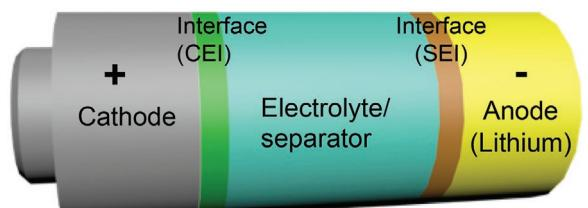
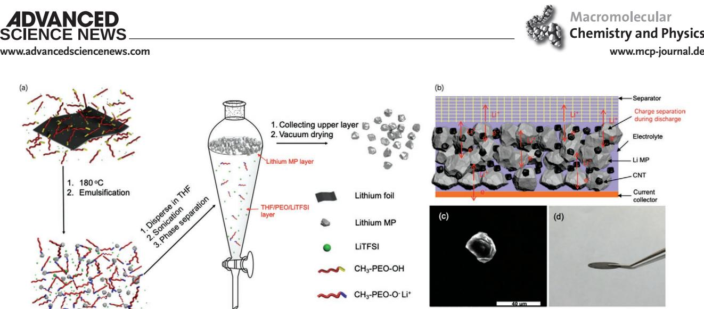
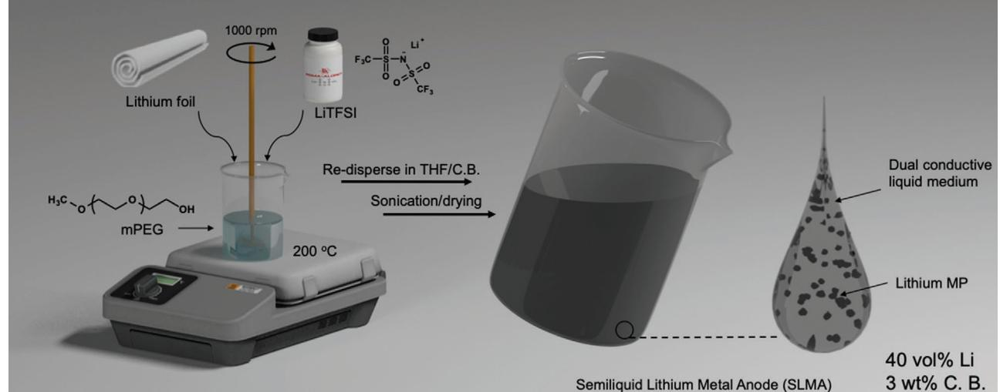
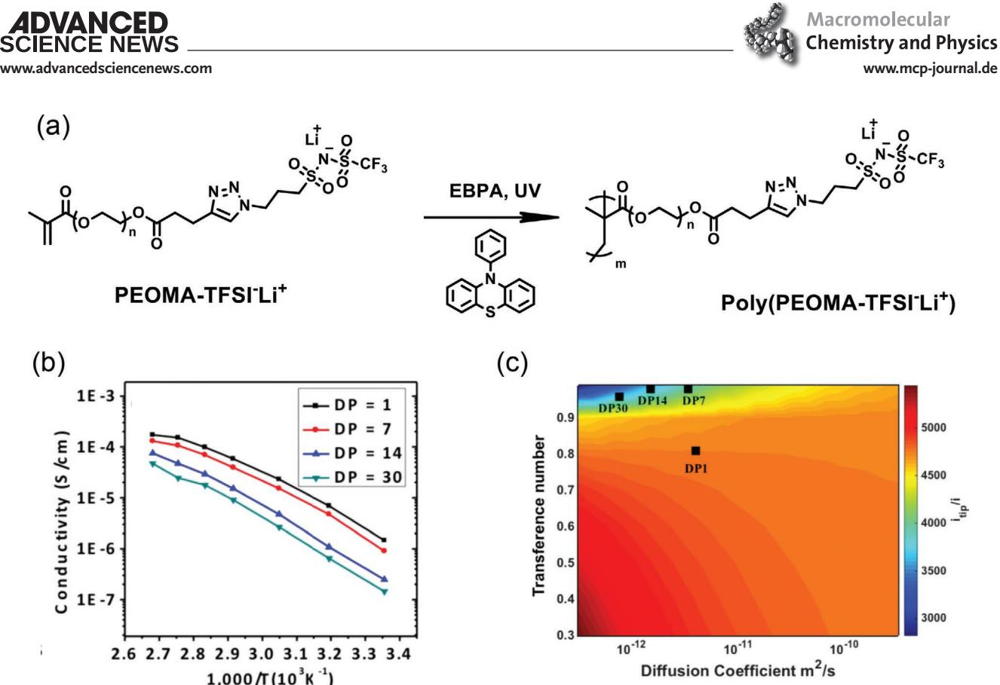
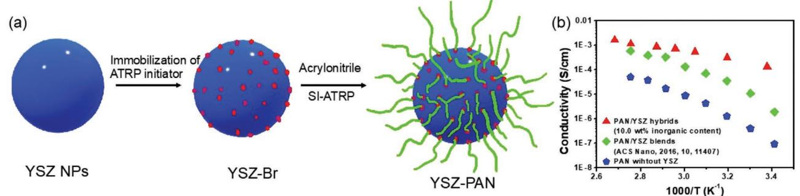
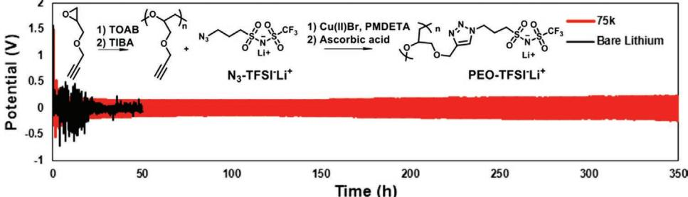

# **Polymer Chemistry for Improving Lithium Metal Anodes**

*Sipei Li, Francesca Lorandi, Jay F. Whitacre, and Krzysztof Matyjaszewski\**

**Lithium metal anode based rechargeable batteries (LMBs) are regarded as a highly appealing alternatives to replace state-of-the-art lithium ion batteries (LIBs) for applications that demand higher energy density. Due to the highly reactive nature of metallic lithium and the related challenges with regard to dendrite issues at the anode, and electrolyte and cathode design, the industrial success of LMBs is yet to be safely achieved. Traditionally, in an LMB, the role of polymeric components is mostly limited to separators and cathode binders. With the advancement in polymer chemistry and its growing applications in materials science, it is now recognized that functional polymers can greatly improve the practical performance of an LMB. This paper discusses some representative studies, in order to demonstrate how various macromolecular approaches could be adopted to improve LMBs especially concerning the anode side, including electrolyte and artificial solid electrolyte interphase.**

### **1. Introduction**

With the rapid development of world economics, the overexploitation of fossil fuels had a disastrous impact on the earth ecosystem. Thus, it is inevitable to improve the structure of global energy supply and storage.[1,2] Electrochemistry can efficiently convert and store energy without causing serious environmental damage and has the potential to make a major contribution to the implementation of renewable energies. Common electrochemical energy conversion and storage systems include primary batteries, rechargeable batteries, flow batteries, fuel cells, supercapacitors, etc.[3,4] Rechargeable batteries are energy devices that can reversibly convert chemical energies stored in active materials directly into electricity. Due to the very high energy efficiency (typically >90%) compared to conventional combustion engines (≈40%), rechargeable batteries continue to gain vast attention.[5]

S. Li, Dr. F. Lorandi, Prof. K. Matyjaszewski Department of Chemistry Carnegie Mellon University 4400 Fifth Avenue, Pittsburgh, PA 15213, USA E-mail: matyjaszewski@cmu.edu Prof. J. F. Whitacre Department of Mechanical Engineering Carnegie Mellon University 5000 Forbes Avenue, Pittsburgh, PA 15213, USA Prof. J. F. Whitacre Scott Institute for Energy Innovation Carnegie Mellon University 5000 Forbes Avenue, Pittsburgh, PA 15213, USA

The ORCID identification number(s) for the author(s) of this article can be found under https://doi.org/10.1002/macp.201900379.

**DOI: 10.1002/macp.201900379**

Initially commercialized by Sony in 1991, lithium ion batteries (LIBs) continue to dominate the market due to several advantages, such as higher energy density, longer cycle life, and wider working temperature compared to other common battery systems.[6] However, the development of LIBs has hit the bottleneck in recent years. An LIB with graphite anode and metal oxide cathode typically delivers a pack-level energy density lower than 300 Wh kg−1 , which struggles to satisfy the energy requirement for the contemporary technology demand and expansion.[6] Taking electric vehicles (EVs) as an example, manufacturing an EV that runs over 500 miles on one charge requires to develop a battery pack that can deliver > 500 Wh kg−1 . [7,8] However, the graphite

anode in LIBs has a limited theoretical capacity of 375 Ah kg−1 . In contrast, the direct use of metallic lithium as anode can dramatically improve the cell energy density. Indeed, lithium metal has the lowest redox potential (−3.04 V vs standard hydrogen electrode [SHE]), high theoretical capacity (3860 Ah kg−1 ) and inexpensive market price.[9] Moreover, the adoption of lithium metal anodes allows for using non-lithiated high-energy-density cathodes, such as sulfur and oxygen.[10] Pursuing the development of reliable rechargeable lithium metal batteries (LMBs), many laboratories across the world started programs to accelerate research on LMB. For example, the United States established the *Battery500* consortium in 2016, and China launched the *Made in China 2025* project in 2015, all aiming to revive metallic lithium anode for higher-energy-density rechargeable batteries.[11]

Conventionally, the use of polymer materials in practical LIBs is mostly limited to polyolefin-based separators and inactive binding materials in the cathode.[12] Polymer binders, most commonly poly(vinylidene fluoride) (PVDF), serve to affix active cathodic materials and conductive fillers to aluminum current collectors during charge/discharge.[8] In the last decades, the development of advanced polymerization techniques, such as atom transfer radical polymerization (ATRP), reversible addition−fragmentation chain-transfer (RAFT) polymerization, or nitroxide mediated polymerization (NMP), and post-polymerization modification chemistries has opened new avenues for creating polymer materials with controlled molecular weight (MW) and dispersity, chain morphology, functionality, and chemical and physical properties.[13–18] As these two fields—polymer science and battery science—come to bridge each other, inspirations and new opportunities arise.[17,19–24] When building a reliable high-energy-density LMB, five primary aspects need to be considered: the cathode and the cathode–electrolyte interface (CEI), the separator/electrolyte, the anode–electrolyte

**www.advancedsciencenews.com www.mcp-journal.de**

**Figure 1.** Illustration of the five components in a multi-interface lithium metal battery: cathode, cathode–electrolyte interface (CEI), separator/ electrolyte, anode–electrolyte interface (i.e., solid electrolyte interphase, SEI), and anode.

interface (i.e., solid electrolyte interphase [SEI]), and the anode (**Figure 1**). Polymer materials currently have a crucial role in all these aspects, due to the advances in polymer chemistry. This paper presents recent progresses in the application of functional polymers to create viable components in LMBs, focusing on 1) polymer/lithium composite anodes, 2) polymer electrolytes, and 3) polymer-based artificial SEIs.

## **2. Polymer/Lithium Composite Anode**

Conventional LMBs use planar lithium foils as anode. This type of material leaves rather limited space for improving the performance of lithium metal. Transforming a planar 2D lithium foil into a 3D composite lithium anode has several advantages: i) It could dramatically decrease the volume change that affects "hostless" lithium foil anodes, ii) could shift the location of charge separation processes from the anode surface to the entire structure, thus decreasing the local current density, iii) could lower the overpotential that would cause extra resistance and voltage loss, iv) could enable the functionalization of the 3D scaffold to guide non-dendritic electrodeposition of lithium during charge.[25–27]

Recently, our group developed a macromolecular emulsification-based approach to prepare high-purity lithium microparticles (Li MPs).[27] Hydroxyl-group containing monofunctional poly(ethylene oxide) (mPEO, i.e., CH3-PEO-OH) was used as a reactive surfactant that reduced and stabilized the size of lithium metal down to micron-level, when heated at an elevated temperature (180 °C) in the presence of Li, and an Li salt. (**Figure 2**a) The as formed Li MPs were purified from tetrahydrofuran (THF) using a separator funnel. The powderform of lithium metal allowed for easy blending with conductive carbon to create a 3D porous structure (Figure 2b). The as prepared composite anode (Figure 2d) showed superior electrochemical performance as compared to typical lithium foil.[27]

Polymer/lithium composite anode can greatly improve the interfacial contact between electrode and solid-state electrolyte. Compared to conventional organic liquid electrolytes, solidstate electrolytes are intrinsically safer and a better choice for lithium-metal anode as well as high-capacity cathode chemistries, such as sulfur and oxygen.[28] However, the high surface roughness of both anode and solid electrolytes often leads to high interfacial resistance, low areal capacity, and poor power output. These issues are overcome by exploiting the soft nature

**Sipei Li** is currently a Ph.D. student at the Department of Chemistry, Carnegie Mellon University. He obtained his Master's degree from Zhejiang University in 2014 and his Bachelor's degree from Zhejiang University of Technology in 2011. He is co-advised by Prof. Krzysztof Matyjaszewski and Prof. Jay F. Whitacre. He has been working in a broad range of areas including hyperbranched polymers, biomedicine, and energy. His current research aims to apply polymer chemistry to stabilize interfaces in rechargeable lithium metal batteries.

**Francesca Lorandi** received her Ph.D. in 2018 from University of Padova (Italy), under the supervision of Prof. A. Gennaro. She then joined the Matyjaszewski Polymer Group at Carnegie Mellon University. Her research interests include mechanistic investigations of reversible deactivation radical polymerizations, atom transfer radical polymerization in dispersed media, and development of polymer-based materials for energy storage devices.

**Jay F. Whitacre** started his career at the California Institute of Technology/Jet Propulsion Laboratory. Since joining Carnegie Mellon University in 2007, he has focused on the synergistic fields of energy storage and energy system technoeconomic assessment. He has developed a novel battery chemistry/design that is manufactured and sold by Aquion Energy, a company he founded in 2008.

**Krzysztof Matyjaszewski** is J.C. Warner University Professor of Natural Sciences at Carnegie Mellon University. His current group at CMU includes 17 graduate students and six postdoctoral fellows. In 1994, he discovered Cu-mediated atom transfer radical polymerization, which was commercialized in 2004 in the United States, Japan, and Europe. His research is focused on synthesis of well-defined macromolecules and hybrid materials via living and controlled polymerizations using radical and ionic mechanisms to prepare advanced materials for optoelectronic, biomedical, environmental, and energy-related applications.

**Figure 2.** a) Illustrations of Li MPs preparation by using reactive polymer surfactants. b) Half-cell configuration with the Li MPs/carbon composite electrode. c) Scanning electron microscopy image of the as prepared Li MPs. d) Microscopic image of the composite anode. Reproduced with permission.[27] Copyright 2019, American Chemical Society.

of some polymer materials that enables to create soft/flexible composites with lithium metal. The macromolecular reactive surfactant approach described above was used to create a composite anode by dispersing Li MPs in an electrically and ionically dual-conductive polymeric media made of mPEO, LiTFSI, and conductive carbon (**Figure 3**).[29] The semiliquid lithium metal/polymer composite anode (SLMA) had lithium content up to 40 vol% with a theoretical volumetric energy density of 800 mAh cm−3, and a scalable preparation. The SLMA exhibited a liquid response over a wide temperature range with a typical non-Newtonian shear-thinning behavior. The SLMA exhibited stable lithium plating/stripping behavior with planar voltage profile for nearly 400 h in a garnet electrolyte-based symmetric cell cycled at a current density of 1 mA cm−2 and an areal capacity of 1 mAh cm−2 . This exceptional stability sets a record for non-surface modified garnet-type electrolytes.[29,30]

The polymer-assisted preparations of Li MPs and semiliquid composite anodes prove that functional polymers can be used 1) as efficient processing agents for morphology transformation or surface chemistry modification; 2) to improve the ionic conductivity (or even electronic conductivity by using conductive polymers) in the anode matrix to reduce the local current density and mitigate the volume change.

#### **3. Polymer Electrolytes**

Liquid electrolytes show high ionic conductivity σ (1–10 mS cm−1 ) and high electrode wettability. However, when used with highly reactive lithium metal, they form a non-uniform and fragile anode/electrolyte interface (SEI) that favors dendrite proliferation and electrolyte depletion. In addition, liquid electrolytes have minimal mechanical integrity to physically prevent the dendrite extension. Finally, they have low transference number (tLi+), which can cause formation of concentration gradients that lead to polarization and increased internal

**Figure 3.** Schematics illustration of the preparation of flowable semiliquid lithium metal/polymer composite anode (SLMA) via an emulsification approach. Reproduced with permission.[29] Copyright 2019, Elsevier.

**Figure 4.** a) Polymerization of PEOMA-TFSI−Li+ by photoinduced metal-free ATRP. b) Ionic conductivity of poly(PEOMA-TFSI−Li+) with different DP. c) Contour plot showing the propensity of dendrite growth (ratio of tip current to applied current) for electrolytes of different transference numbers and Li+ diffusion coefficients. The model is evaluated at a temperature of 90 °C and the tip current is calculated using a dendrite of length 10 nm. Reproduced with permission.[40] Copyright 2018, American Chemical Society.

resistance, and even salt depletion/precipitation when the cell is cycled at high current densities.[28,31] The need for enhanced battery safety and higher-energy-density devices shifted the focus from conventional liquid electrolytes to solid-state alternatives. Ceramic lithium ion conductors have been widely reported as one of the best alternatives due to their similar or even higher ionic conductivity as compared to some liquid electrolytes. However, most ceramic electrolytes are not electrochemically stable against metallic lithium. Moreover, their surface roughness and lithiophobic interface can cause high interfacial resistance, limiting their applicability.[32] In comparison, solid polymer electrolytes (SPEs) provide better interface contact due to their softness, although achieving much lower ionic conductivity and low transference number. Thus, creating SPEs with high *t*Li+ (>0.8) and high σ could provide the most efficient electrolyte systems for LMBs.

Conventional SPEs generally have *t*Li+ < 0.5, because of their dual-ion conducting character. In contrast, single-ion conducting polymer electrolytes (SIPEs) have the anions immobilized via the polymer backbone/network so that only lithium ions are freely moving.[33] As a result, SIPEs tend to have higher *t*Li+, typically >0.7. Viable SIPE materials depends on i) the development of robust chemistries for immobilizing anions and ii) minimizing the decrease in ionic conductivity due to the strong ionic association. Previously, three types of SIPEs have been reported: sulfonate-based,[34] acrylate-based,[35] or

**Figure 5.** a) Synthesis of YSZ/polymer hybrids materials by SI-ATRP with high ionic conductivity. b) Comparison of ionic conductivity between PAN/ YSZ covalent hybrids, PAN/YSZ blends, and pure PAN electrolytes.

borate-based.[36] These types of SIPEs have low ionic conductivity due to the insufficient ionic dissociation between Li+ ions and electron-rich counter-ions. Our group recently modified the highly conductive TFSI−Li+ ion pairs by introducing an azide functionality, to connect the ion-pairs via click reaction to an ionically conductive poly(ethylene glycol)methyl ether methacrylate (PEOMA) macromonomer backbone. In order not to introduce impurity metal ions, the single-ion macromonomer PEOMA-TFSI−Li+ was polymerized by photoinduced metal-free ATRP to yield the SIPE poly(PEOMA-TFSI−Li+).[37–39] Poly(PEOMA-TFSI−Li+) showed high ionic conductivity (>1 × 10−4 S cm−1 at 90 °C and *t*Li+ > 0.97) especially with low degree of polymerization (DP) as shown in **Figure 4**b.[40] The kinetic model was applied to estimate the propensity of dendrite growth with such electrolytes. It was showed that with such extremely high *t*Li+, the dendrite growth could be largely mitigated (Figure 4c). This approach could provide a new platform for fabricating more conductive single-ion conducting materials.

Aiming to improve the conductivity and mechanical properties of SPEs, inorganic fillers are often introduced into the polymer matrix, forming composite polymer electrolytes. Indeed, the presence of inorganic parts can disrupt the polymer chain crystallinity, increasing its segmental motion[41] and thus greatly enhancing the ionic conductivity of the polymer electrolyte. Furthermore, when the inorganic fillers carry positive charges such as oxygen vacancies, they further facilitate the transport of lithium ion and improve the *t*Li+. [42] For this reason, we applied a fatty-acid inspired approach to immobilize ATRP initiators onto yttria-stabilized zirconia (YSZ) nanoparticles.[43] Polyacrylonitrile (PAN) was grafted from the surface of the YSZ NPs by surface-initiated ATRP (**Figure 5**a). Due to the immobilized chain-end, the matrix free volume should be increased if compared to a simple blend of the polymer and inorganic fillers, and therefore the crystallinity is further reduced. The composite with 10.0 wt% YSZ loading showed room-temperature ionic conductivity of ≈1 × 10−4 S cm−1, which is even two orders of magnitude higher than noncovalent blending of PAN and YSZ (Figure 5b).[42] As a consequence, we believe that the creation of covalently linked hybrid materials is a viable approach to enhance ionic conductivity of SPE. This approach enables to tune the material properties by changing the characteristics of both the inorganic filler and the polymer. In particular, it can be applied to conductive inorganic fillers such as ceramics, or single-ion conducting polymers can be grafted from the inorganic surface, thus obtaining solid electrolytes with simultaneously high mechanical strength and effective transport of Li+.

#### **4. Artificial Anode/Electrolyte Interface**

Unlike the case of LIBs where a stable SEI is spontaneously formed at the graphite anode/electrolyte interphase, in LMBs uneven Li stripping/plating cycles cause the breakdown of the fragile, inhomogeneous SEI at the Li metal surface, leading to further reactions of fresh lithium with the electrolyte and formation of lithium dendrites.[44,45] The continuous growth of lithium dendrites causes decreased cycling efficiency and safety concerns due to potential internal shorting and thermal runaway. Since conventional liquid electrolytes cannot mechanically suppress the dendrites growth in LMBs, the chemical pretreatment of the lithium metal surface with an ex situ coating (i.e., artificial SEI) before electrochemical reactions has been proposed as an effective strategy to stabilize the interface. The design of viable artificial SEIs is based on the following criteria: a) excellent mechanical stability and flexibility, b) good adhesion to the anode and also electrolyte in the case of solid electrolytes, c) low electrical resistance and high cation (Li+ for lithiumbased batteries) selectivity and permeability, d) high strength and tolerance to expansion and contraction stresses, e) insolubility in the electrolyte and stability over a wide range of operating temperatures and potentials.[46,47] Therefore, polymers are promising materials for artificial SEIs, due to their flexibility, facile processability, ionic conductivity, and low interfacial resistance. The performance of polymeric artificial SEIs can be further improved by creating single-ion conducting SEIs to combat the concentration gradients formed during cycling. To date, few investigations have been carried out using a singleion conducting polymer as an artificial SEI layer, rather than as the electrolyte. Guo et al. developed a lithiated poly(acrylic acid) that functioned as a self-adapting interface, acting both to distribute the concentration of anion evenly across the surface as well as to physically prevent dendrites through accommodating volume changes of the lithium during cycling at up to 1 mA cm−2 current densities.[48] However, most singleion polymers were created based on an ester-based backbone, which was electrochemically unstable against lithium. Besides, the EO (ethylene oxide)/Li ratio was typically low: 10/1. While such low ratio provides the maximum of ionic conductivity when used as electrolytes, higher lithium contents are needed

**Figure 6.** Symmetric cycling data of lithium anode with (red) and without (black) protection of artificial SEI at current density of 1 mA cm−2 and capacity of 0.5 mAh cm−2 . Electrolyte used: 1 m LiPF6 in EC:DMC 1:1. Inset: synthesis of the single-ion polymer PEO-TFSI−Li+ by anionic ring-opening polymerization and subsequent click chemistry.

in order to fight the generation of lithium concentration gradients when used as a thin layer of artificial SEI. Therefore, it will be interesting to create a single-ion polymer with a more stable backbone and higher EO/Li ratio for use as lithium protective artificial SEI. Herein, we report the application of a singleion polymer purposely designed to be an artificial SEI layer on metallic lithium, bearing a polyether backbone while possessing high EO/Li ratio (EO/Li = 2/1). Esters such as carbonates and acrylates/methacrylates are prone to electrochemical reduction against lithium metal, forming lithium alkyl carbonates (ROCO2Li) among other side products; instead, polyether backbones similar to PEO are much more electrochemically stable under negative redox potential. This single-ion polymer, PEO-TFSI−Li+, was prepared by anionic ring opening polymerization using a co-catalyst system of tetraoctylammonium bromide (TOAB) and triisobutylaluminum (TIBA) developed by Deffieux et al.[49,50] and subsequent copper-catalyzed alkyneazide cycloaddition (Inset of **Figure 6**). Electrochemical tests were conducted in a symmetric Li|Li coin cell using 1 m LiPF6 in a mixture of 1:1 ethylene carbonate:dimethyl carbonate (EC:DMC) as electrolyte, with each lithium chip coated on one side with PEO-TFSI−Li+ (MW = 75 000). Cycling tests were conducted to determine the interfacial stability at a current density of 1 mA cm−2 and 0.5 h per plating/stripping step. Figure 6 shows the relative cycling performance of bare and coated cells. In the first 20 cycles, the bare lithium-cell exhibited highly irregular voltage spikes for both stripping and plating. This behavior is indicative of unstable interface phenomena. In contrast, the PEO-TFSI−Li+ coated sample enabled stable cycling over the entire 350 h of testing, with an overpotential of only 120 mV for the first 150 cycles. The overpotential slowly increased, reaching ≈200 mV at 350 cycles, thus remaining even lower than the values reported for similar artificial SEIs.[48]

### **5. Conclusion and Perspectives**

The recent, novel applications of advanced polymer materials for LMBs presented in this paper confirm that functional polymers can be a vital building block for all the major components of an LMB. The numerous approaches that have been emerging within recent years illustrate a new perspective for achieving practical LMBs: the application of tailor-made functional polymers with a wide range of mechanical and electrochemical properties to optimize resistance, stability, and transport properties at different interfaces in LMBs.

Advanced polymer materials for LMBs are typically engineered to accomplish specific tasks and are tested in combination with conventional battery materials and setups. Instead, a more integrated strategy is required to achieve practical polymer-based LMBs. For instance, SIPEs should be used together with a polymer coated Li metal or a flowable polymer/Li composite anode in order to achieve better wettability of the electrode material. The integration of different polymer-based parts is expected to introduce new challenges but also provide better understanding of interfacial phenomena.

Looking ahead, one would hope to eliminate the interfaces, meaning that there will be no/limited barriers for mass transport between cathode and anode. In order to achieve this, the polymer should be covalently grafted/attached by chemical bonds rather than simply blended/mixed with inorganic components. It is reasonable to expect that in the near future polymers will be grafted directly from lithium metal foils or particles. This will likely result in efficient prevention of dead lithium formation and better ionic transport between binding polymers and Li, particularly in a 3D form. Moreover, we previously demonstrated that grafting polymers from metallic EGaIn (Eutectic Gallium Indium) particles can reduce the melting point of the metal alloy.[51] Therefore, grafting polymers from lithium metal could greatly enhance the flexibility of the composite anode as well as its adaptability to solid electrolytes.

### **Acknowledgements**

The authors would like to thank Jacob A. Flum and Dr. Sarah Frisco from Carnegie Mellon University and Prof. Guowei Wang from Fudan University for their contribution to the work of artificial single-ion polymer SEI, and also the financial support from NSF (DMR 1501324).

# **Conflict of Interest**

The authors declare no conflict of interest.

#### **Keywords**

artificial SEI, functional polymers, interfaces, lithium-metal batteries, polymer electrolytes

> Received: September 6, 2019 Revised: October 29, 2019 Published online: November 25, 2019

- [1] B. R. Sutherland, *Joule* **2019**, *3*, 1.
- [2] P. Nejat, F. Jomehzadeh, M. M. Taheri, M. Gohari, M. Z. Abd . Majid, *Renewable Sustainable Energy Rev.* **2015**, *43*, 843.
- [3] B. Dunn, H. Kamath, J.-M. Tarascon, *Science* **2011**, *334*, 928.
- [4] M. Winter, R. J. Brodd, *Chem. Rev.* **2004**, *104*, 4245.
- [5] J. B. Goodenough, K.-S. Park, *J. Am. Chem. Soc.* **2013**, *135*, 1167.
- [6] V. Etacheri, R. Marom, R. Elazari, G. Salitra, D. Aurbach, *Energy Environ. Sci.* **2011**, *4*, 3243.
- [7] L. Lu, X. Han, J. Li, J. Hua, M. Ouyang, *J. Power Sources* **2013**, *226*, 272.
- [8] Z. Lin, T. Liu, X. Ai, C. Liang, *Nat. Commun.* **2018**, *9*, 5262.
- [9] D. Lin, Y. Liu, Y. Cui, *Nat. Nanotechnol.* **2017**, *12*, 194.
- [10] P. G. Bruce, S. A. Freunberger, L. J. Hardwick, J.-M. Tarascon, *Nat. Mater.* **2012**, *11*, 19.
- [11] Y. Lu, X. Rong, Y.-S. Hu, L. Chen, H. Li, *Energy Storage Mater.* **2019**, *23*, 144.
- [12] S. S. Zhang, *J. Power Sources* **2007**, *164*, 351.
- [13] K. Matyjaszewski, *Adv. Mater.* **2018**, *30*, 1706441.
- [14] M. A. Gauthier, M. I. Gibson, H.-A. Klok, *Angew. Chem., Int. Ed.* **2009**, *48*, 48.
- [15] Y. Zheng, S. Li, Z. Weng, C. Gao, *Chem. Soc. Rev.* **2015**, *44*, 4091.
- [16] F. H. Schacher, P. A. Rupar, I. Manners, *Angew. Chem., Int. Ed.* **2012**, *51*, 7898.

- - [35] J. Rolland, E. Poggi, A. Vlad, J.-F. Gohy, *Polymer* **2015**, *68*, 344. [36] X.-G. Sun, J. B. Kerr, *Macromolecules* **2006**, *39*, 362.
		- [37] G. M. Miyake, J. C. Theriot, *Macromolecules* **2014**, *47*, 8255.
		- [38] X. Pan, M. Lamson, J. Yan, K. Matyjaszewski, *ACS Macro Lett.* **2015**, *4*, 192.
		- [39] X. Pan, C. Fang, M. Fantin, N. Malhotra, W. Y. So, L. A. Peteanu, A. A. Isse, A. Gennaro, P. Liu, K. Matyjaszewski, *J. Am. Chem. Soc.* **2016**, *138*, 2411.
	- [40] S. Li, A. I. Mohamed, V. Pande, H. Wang, J. Cuthbert, X. Pan, H. He, Z. Wang, V. Viswanathan, J. F. Whitacre, K. Matyjaszewski, *ACS Energy Lett.* **2018**, *3*, 20.
	- [41] C. M. Hui, J. Pietrasik, M. Schmitt, C. Mahoney, J. Choi, M. R. Bockstaller, K. Matyjaszewski, *Chem. Mater.* **2014**, *26*, 745.
	- [42] W. Liu, D. Lin, J. Sun, G. Zhou, Y. Cui, *ACS Nano* **2016**, *10*, 11407.
	- [43] J. Yan, X. Pan, Z. Wang, Z. Lu, Y. Wang, L. Liu, J. Zhang, C. Ho, M. R. Bockstaller, K. Matyjaszewski, *Chem. Mater.* **2017**, *29*, 4963.
	- [44] Z. Li, J. Huang, B. Y. Liaw, V. Metzler, J. Zhang, *J. Power Sources* **2014**, *254*, 168.
	- [45] D. Aurbach, E. Zinigrad, Y. Cohen, H. Teller, *Solid State Ionics* **2002**, *148*, 405.
	- [46] X.-Q. Zhang, X.-B. Cheng, Q. Zhang, *Adv. Mater. Interfaces* **2018**, *5*, 1701097.
	- [47] E. Peled, S. Menkin, *J. Electrochem. Soc.* **2017**, *164*, A1703.
	- [48] N.-W. Li, Y. Shi, Y.-X. Yin, X.-X. Zeng, J.-Y. Li, C.-J. Li, L.-J. Wan, R. Wen, Y.-G. Guo, *Angew. Chem., Int. Ed.* **2018**, *57*, 1505.
	- [49] A. Labbé, S. Carlotti, C. Billouard, P. Desbois, A. Deffieux, *Macromolecules* **2007**, *40*, 7842.
	- [50] A. Krimalowski, M. Thelakkat, *Macromolecules* **2019**, *52*, 4042.
	- [51] J. Yan, M. H. Malakooti, Z. Lu, Z. Wang, N. Kazem, C. Pan, M. R. Bockstaller, C. Majidi, K. Matyjaszewski, *Nat. Nanotechnol.* **2019**, *14*, 684.
- [17] R. Bouchet, S. Maria, R. Meziane, A. Aboulaich, L. Lienafa, J.-P. Bonnet, T. N. T. Phan, D. Bertin, D. Gigmes, D. Devaux, R. Denoyel, M. Armand, *Nat. Mater.* **2013**, *12*, 452.
- [18] C. Jangu, A. M. Savage, Z. Zhang, A. R. Schultz, L. A. Madsen, F. L. Beyer, T. E. Long, *Macromolecules* **2015**, *48*, 4520.
- [19] S. Choi, T.-w. Kwon, A. Coskun, J. W. Choi, *Science* **2017**, *357*, 279.
- [20] B. Zhang, R. Tan, L. Yang, J. Zheng, K. Zhang, S. Mo, Z. Lin, F. Pan, *Energy Storage Mater.* **2018**, *10*, 139.
- [21] T. Janoschka, N. Martin, U. Martin, C. Friebe, S. Morgenstern, H. Hiller, M. D. Hager, U. S. Schubert, *Nature* **2015**, *527*, 78.
- [22] S. Muench, A. Wild, C. Friebe, B. Häupler, T. Janoschka, U. S. Schubert, *Chem. Rev.* **2016**, *116*, 9438.
- [23] P. T. Dirlam, R. S. Glass, K. Char, J. Pyun, *J. Polym. Sci., Part A: Polym. Chem.* **2017**, *55*, 1635.
- [24] C. Li, S. Liu, C. Shi, G. Liang, Z. Lu, R. Fu, D. Wu, *Nat. Commun.* **2019**, *10*, 1363.
- [25] D. Lin, Y. Liu, Z. Liang, H.-W. Lee, J. Sun, H. Wang, K. Yan, J. Xie, Y. Cui, *Nat. Nanotechnol.* **2016**, *11*, 626.
- [26] D. Lin, Y. Liu, A. Pei, Y. Cui, *Nano Res.* **2017**, *10*, 4003.
- [27] S. Li, H. Wang, W. Wu, F. Lorandi, J. F. Whitacre, K. Matyjaszewski, *ACS Appl. Energy Mater.* **2019**, *2*, 1623.
- [28] S. Xia, X. Wu, Z. Zhang, Y. Cui, W. Liu, *Chem* **2019**, *5*, 753.
- [29] S. Li, H. Wang, J. Cuthbert, T. Liu, J. F. Whitacre, K. Matyjaszewski, *Joule* **2019**, *3*, 1637.
- [30] C.-Z. Zhao, Q. Zhang, *Joule* **2019**, *3*, 1575.
- [31] D. Zhou, D. Shanmukaraj, A. Tkacheva, M. Armand, G. Wang, *Chem* **2019**.
- [32] N. J. Dudney, in *Lithium Batteries: Science and Technology* (Eds: G.-A. Nazri, G. Pistoia), Springer, Boston, MA **2003**, p. 624.
- [33] H. Zhang, C. Li, M. Piszcz, E. Coya, T. Rojo, L. M. Rodriguez-Martinez, M. Armand, Z. Zhou, *Chem. Soc. Rev.* **2017**, *46*, 797.
- [34] P. P. Prosini, B. Banow, *Electrochim. Acta* **2003**, *48*, 1899.

**www.advancedsciencenews.com www.mcp-journal.de**