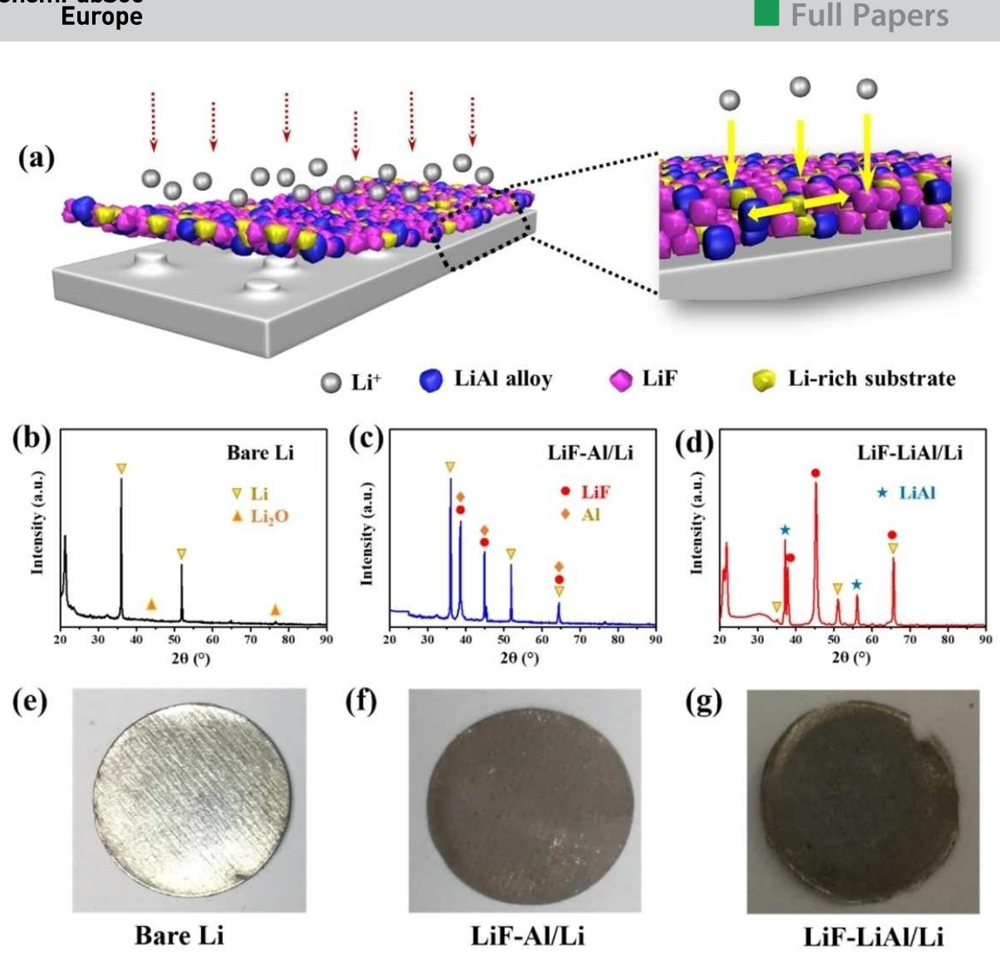
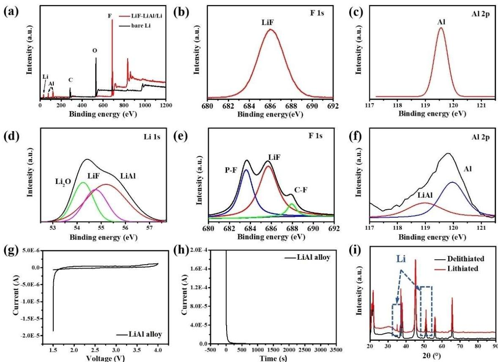
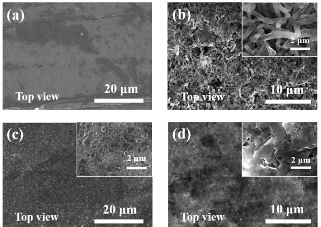
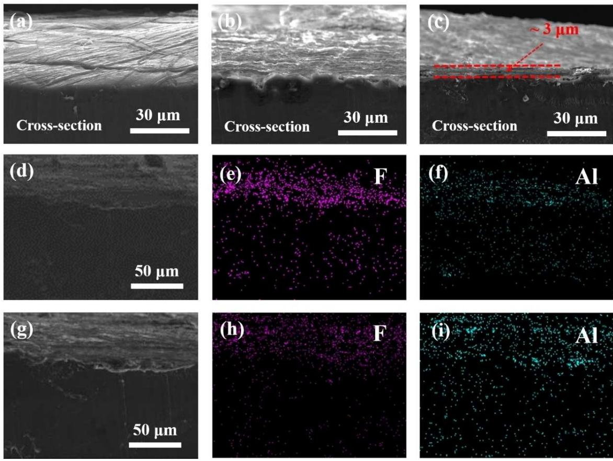
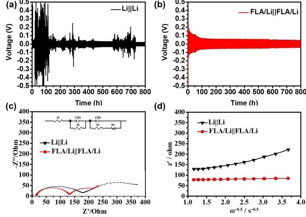
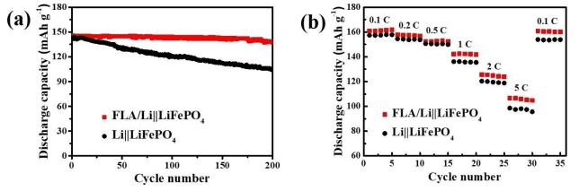

# **Formation of Stable Mixed LiF and Li-Al-Alloy Reinforced Interface Film for Lithium Metal Anodes**

Chao Shen,\*[a] Jinlei Gu,[a] Xin Li,\*[a] Maohui Bai,\*[a, b] De. Le Shao,[c] and Keyu Xie[a]

Metallic lithium is the most promising candidate for implementation in high energy density batteries. Nevertheless, the practical application of Li anode is hindered by its uncontrollable dendrite formation and strong electrolyte reactivity. Here, the replacement and alloying reactions are employed to form

# **1. Introduction**

At present, high energy density has become a fundamental requirement for the development of lithium ion batteries.[1] Among all candidate anodes, metallic lithium is a promising anode candidate, as it exhibits the highest theoretical capacity and lowest potential of 3,860 mA⋅h/g and –3.040 V vs. SHE, respectively.[2,3] Studies of LiS and LiO2 batteries with high theoretical specific energy densities that exceed 500 W⋅h/kg have demonstrated the practical implementation of lithium metal anodes.[4,5] However, the commercial application of lithium metal batteries has been hindered by severely limited cycling lifetimes and poor battery safety, which arise from lithium dendrite formation and the high reactivity of metallic lithium.[6,7] Formation of lithium dendrites and the stable interface of lithium metal depend directly on interfacial properties. Accordingly, ongoing efforts focused on interface engineering seek to overcome the drawbacks of lithium anodes. To this end, electrolyte additives, separator structural modification, and protective coating layers are being investigated.[8–16] More specifically, some researchers reported a LiF-rich SEI induced by LiNO3/FEC in nonaqueous electrolytes, which enhanced the uniformity of SEI and obtained a uniform morphology of lithium deposition; an in-situ-formed LiF-rich SEI by increasing LiFSI concentration in carbonate electrolytes to 10 M, which achieved a high CE (∼99.3%) of Li deposition and stripping.[17,18] These efforts have been successful in producing stable solidin-situ LiF and Li Al-alloy mixed layers that synergistically reinforces the interfacial film on a metallic lithium anode. Due to the film's high ionic conductivity and apparent chemical stability, the artificial interfacial film can inhibit the growth of lithium dendrites and improve the cycling stability of batteries.

electrolyte interphase (SEI) films and from the above articles, we can conclude that LiF can facilitate the diffusion of Li+ and improve the performance of batteries.[19–24] However, to ensure interfacial stability, an ideal modified surface layer must be reinforced for the diffusion of Li+ ions to achieve uniform lithium deposition and to prevent undesired reactions.[25,26] In addition, traditional fabrication methods cannot meet the demands of scalable, dendrite-free lithium anode production.[27]

Herein, we describe the fabrication of a pretreated lithium metal anode which can satisfy these requirements. An AlF3 dispersion agent was applied by spray painting to coat metallic lithium. An LiF layer and metallic Al then covered the metallic Li surface through a replacement reaction between AlF3 and Li. Al subsequently reacted with Li+ via an electrochemical process. As a result, an artificial reinforced interface was formed within the lithium anode framework, which served as a multifunctional transition phase in a robust SEI film. LiF acted as an ionic channel to facilitate the homogeneous diffusion of Li+ due to its high surface energy, and Li Al-alloy acted as a barrier layer that improved the electrochemical and mechanical stability of the SEI. Because of its relatively low reactivity, the Li Al-alloy inhibited undesired side reactions and suppressed formation of lithium dendrites. Ultimately, the spray-painting technique can be employed to realize scalable production of lithium anodes.

# **2. Results and discussion**

A schematic illustration of the fabrication process for the AlF3-Li anodes is shown in **Fig 1(a)**. We employed a facial spraypainting technique in the first step to modify the lithium electrode by in-situ formation of an LiF and Li Al-alloy mixed layer. The replacement and alloying reactions proceeded by: AlF3 + 3Li=3LiF + Al (replacement reaction, FA/Li in Figure 1) and Al + Li=Li Al-alloy (alloying reaction, FLA/Li in Figure 1).

The reaction products were characterized by X-ray diffraction (XRD) analysis, the results of which are shown in Figure 1(c) and Figure 1(d). for comparison, the XRD of bare Li is shown in Figure 1(b). Images of bare Li and the FA/Li anode formed through the replacement reaction are shown in Figure 1(e) and 1(f), respectively. The reinforced lithium anode (FLA/Li)

[a] *Dr. C. Shen, J. Gu, X. Li, Dr. M. Bai, Prof. K. Xie* State Key Laboratory of Solidification Processing, Center for Nano Energy Materials, School of Materials Science and Engineering, Northwestern Polytechnical University and Shaanxi Joint Laboratory of Graphene (NPU), Xi'an 710072, China E-mail: shenchao@nwpu.edu.cn 17792394585@163.com

[b] *Dr. M. Bai* School of Metallurgy and Environment, Central South University, Changsha 410083, PR China

E-mail: baimaohuinihao@163.com [c] *D. L. Shao*

Shaanxi Coal and Chemical Technology Institute Co., Ltd, Jinye Road, Xi'an 710070, China

Supporting information for this article is available on the WWW under <https://doi.org/10.1002/slct.201901292>

**Figure 1.** (a) Schematic illustration of FLA/Li anode and its aspects on Li plating. XRD patterns of (b) Bare Li, (c) FA/Li (the electrode after coating) and (d) FLA/Li anode (the electrode after cycling). Images of (e) bare Li metal, (f) FA/Li and (g) FLA/Li.

obtained following the alloying reaction is shown in Figure 1(g).

The X-ray photoelectron spectroscopy (XPS) results revealing the surface chemistries of the FA/Li and FLA/Li anodes are shown in Figure 2. Figure 2(a) shows strong F 1s and Al 2p signals from FA/Li. Peaks increasingly specific to F 1s (687.0 eV) and Al 2p (76.9 eV) can be seen in Figure 2(b) and Figure 2(c), respectively. Deconvolution of the F 1s peak of FLA/Li indicated the presence of fluorine in LiF, P–F and C–F. This result was consistent with our hypothesis that strong adsorption of F would occur, which is indicated in Figure 2(d). Al signals from FLA/Li were also observed in the XPS spectra. Both metallic Al (120.0 eV) and Al3+ (∼118.8 eV) yielded Al 2 s peaks, shown in Figure 2(e). The Li 1s peak in Figure 2(f) could be deconvoluted into peaks for Li in LiOH (54.4 eV) and Li in Li Al-alloy (55.5 eV), which were in agreement with the NIST database and a previous literature report.[28,29] This demonstrated the presence of metallic and ionic aluminium on the electrode surface, which was consistent with the formation of Li Al-alloy and adsorption of Al3+.

To assess the operational stability of the artificial layer in batteries, we employed FLA/Li as a working-electrode and metallic Li as a reference electrode. We performed cyclic voltammetry (CV) and constructed current-time (I T) curves at a constant potential of 1 V. No redox peak was observed in the CV plot shown in Figure 2(g), and no continuous response current was detected in the I T curve shown in Figure 2(h). The current dropped rapidly to nearly zero after 250 s. Thus, we concluded no significant electrochemical reaction involving lithium occurred in the reinforced interface film, and that the layer was stable. For confirmation, we compared the XRD patterns of the FLA/Li electrode in the lithiated and delithiated states (Figure 2(i)). There were no obvious differences between the patterns. In addition, the morphology of the mixed layer was not altered by CV cycling. These results indicated that the

**Figure 2.** XPS spectra of samples: (a) XPS survey spectra of FA/Li anode; (b) F 1s and (c) Al 2p regions of FA/Li XPS spectrum; (d) F 1s, (e) Al 2 s and (f) Li 1s regions of FLA/Li XPS spectrum; (g) CV curves of the Lij jAl battery between 1.5 and 4 V (scan rate: 0.1 mV/s); (h) current-time curves under constant potential (chronoamperometry) of Lij jAl battery; (i) XRD patterns of FA/Li electrode in the lithiated and delithiated states.

reinforced interface film was dynamically stable during the cycling test.

Figure 3 shows the SEM morphology of bare Li and FLA/Li electrode before cycle and after the cycles. Before the cycle,

**Figure 3.** (a, c) The SEM images of bare Li and FA/Li electrodes before cycling. (b, d) The SEM images of bare Li and FLA/Li electrodes after cycles.

the surface of bare Li is relatively flat and smooth, with fewer gullies and grooves (Figure 3(a)). After the treatment by AlF3, it is obvious that a mixed layer is formed on the surface of lithium (Figure 3(c)). The above electrodes are used as the working electrode to install the batteries, and then the SEM of bare Li and FLA/Li are shown in Figure 3(b) and (d). It can be clearly found that after the Li deposition, a large number of slender and sharp dendrites are generated on the surface of bare Li. These dendrites are about 10 μm in length and about 2 μm in diameter, completely satanding on the surface of the electrode, and will cause serious safety risks. In contrast, the FLA/Li electrode has a smooth and much denser surface without obvious dendrite, which is conducive to the improvement of the safety performance of the electrode.

In order to further analyze the morphology of the mixed layer on the electrode surface, SEM observation and EDS element distribution detection are carried out on the cross section of the electrode. Figure 4 **(a–c)** respectively show the SEM images of bare Li, FA/Li and FLA/Li electrodes, respectively. It can be seen that the surface of the bare Li is very smooth and flat, with no large pits or bumps except a few grooves, and no other impurities in the electrode. After

AlF3 treatment, a protective layer is formed evenly on the surface of the electrode, which is in close contact with Li metal.

**Figure 4.** (a-c) The cross-section SEM images of bare Li electrode, FA/Li electrode and FLA/Li electrode. (d-f) The corresponding EDS images of FA/Li electrode. (g-i) The corresponding EDS images of FLA/Li electrode. The purple spots represent the element F, and the blue green ones represent the element Al.

The overall morphology is almost the same as that of bare Li, and there are no bumps or pits on the surface. The surface of FLA/Li electrode is slightly poor, but there is no dendrite on the whole. The "grown" protective layer with a thickness of about 3 μm can be clearly seen in the cross section. Figure 4 (d-i) are the EDS images of FA/Li electrode and FLA/Li electrode, respectively. The purple spots in the figure represent element F, while the blue-green spots represent element Al. It can be seen that the distribution states of both elements F and Al can well match the SEM image, and the elements are evenly distributed without the presence of agglomerated particles. In conclusion, the protective layer has uniform thickness and composition on the surface of the electrode, which can even the deposition of Li and inhibit the growth of dendrites.

The galvanostatic symmetric cell cycling performances of Lij j Li and FLA/Lij j FLA/Li were also compared at a fixed current density of 1 mA/cm2 and a fixed capacity of 1 mA⋅h/ cm2 . With the Lij j Li symmetric cell, a high overpotential was observed during the first several cycles and during subsequent charge and discharge processes (Figure 5**(a)**). This was due to the poor ionic conductivity of the SEI on the bare Li electrode. On the other hand, the galvanostatic cycling curves obtained with the FLA/Lij j FLA/Li symmetric cell showed flat, smooth voltage plateaus, low overpotential below 50 mV, and better

**Figure 5.** Electrochemical performance and morphology of the bare Li and FLA/Li anodes after cycling. The cycling stability of the (a) bare Li and (b) FLA/Li anodes at a current density of 1 mA/cm2 . Experimental and fitted (solid curves) impedance spectra for the Lij j Li and FLA/Lij j FLA/Li cells measured after cycling at a current density of 1 mA/cm2 . (c) AC impedance measurements and (d) plots of Z' vs. ω 1/2. The inset of (c) shows the equivalent circuit.

stability even after 400 cycles (Figure 5(b)). The low and stable overpotential during Li plating and stripping was attributed to the functional layer, which promoted the homogeneous diffusion of Li+ and enhanced the electrochemical and mechanical stability of the metallic Li anode.

To examine the role of the functionalized reinforced layers in suppression of polarization and kinetic processes during Li+ diffusion, electrochemical impedance spectroscopy (EIS) was performed with the Lij j Li and FLA/Lij j FLA/Li symmetric cells following the CV test. The results of the impedance measurements are shown in Figure 5(c). The charge-transfer resistances (*Rct*) of the bare Li and FLA/Li anodes were 332.2 Ω and 127.1 Ω, respectively. The plots of the real axis (*Zre*) vs. the reciprocal square root of the lower angular frequencies (*ω* 1/2) are shown in Figure 5(d). The diffusion coefficients (*D*) of the Li ions diffusing into the bulk electrode were calculated according to Equations (1) and (2).

$$
Z_{re} = R_s + R_f + R_{ct} + \sigma_\omega \cdot \omega^{-0.5}
$$
 (1)

and

$$
D = 0.5 \times (RT/AF^2\sigma_{\omega}C)^2,
$$
 (2)

where *ω*, *R*, *T*, *F*, *A*, and *C* are the angular frequency region, the universal gas constant, the absolute temperature, Faraday's constant, the surface area of the electrode, and the molar concentration of Li+, respectively. The FLA/Li electrode with LiF and Li Al-alloy mixed layers exhibited a higher diffusion coefficient (1.4 × 10 15 cm2 /s) than did the pristine Li anode (3.5 × 10 16 cm2 /s).[30–32]

These properties were further verified during full-cell testing using the FLA/Li and Li anodes paired with an LiFePO4 cathode. Figure 6**(a)** shows that the LiFePO4 j j FLA/Li battery

**Figure 6.** (a) The constant current charge-discharge performance of FLA/ Lij j LiFePO4 and Lij j LiFePO4 batteries. (b) The rate performance of FLA/ Lij j Li.

had an initial specific capacity of 145.5 mA⋅h/g and retained 137.4 mA⋅h/g after 200 cycles, which represented 94.4% capacity retention. The LiFePO4 j j Li battery retained only 73.6% of its initial capacity. The capacities of the LiFePO4 j j FLA/Li battery were slightly reduced to 160.9, 157.9, 152.5, 142.2, 125.6 and 106.6 mA⋅h/g at current densities of 0.1, 0.2, 0.5, 1, 2 and 5 C, respectively (Figure 6(b)). The capacities of the LiFe-PO4 j j Li cell were 156.4, 153.5, 149.6, 134.1, 120.3 and 99.6 mA⋅h/g, respectively, at the same current densities. The reinforced layers not only inhibited the growth of lithium dendrites, but also enhanced the stability of the SEI. These findings confirmed that the excellent electrochemical performance of the LiFePO4 j j FLA/Li battery was due to the reinforced layers.

# **3. Conclusion**

We successfully demonstrated the formation of a reinforced mixed film on a lithium anode using a spray-painting method, which may be employed for large-scale production of lithium anodes with robust SEI films. Following the reduction and alloying processes, in-situ formation of a reinforced mixed layer containing LiF and Li Al-alloy occurred on the anode surface. The resulting dendrite-free anodes exhibited significantly enhanced electrochemical stability in symmetric Li cells and LiFePO4 j j FLA/Li cells.

#### **Supporting Information Summary**

Experimental details, XRD pattern, SEM image, XPS and electrochemical analysis of samples and the comparison of electrochemical performances of FLA/Lij j LiFePO4 and Lij j LiFePO4 batteries at a current density of 10 C in this work can be found in the Supporting Information.

## *Acknowledgements*

*This work was supported by the National Key R&D Program of China (2018YFB0104200).*

# *Conflict of Interest*

The authors declare no conflict of interest.

**Keywords:** alloying reaction **·** lithium dendrite **·** replacement reaction **·** surface

- [1] I. Kovalenko, B. Zdyrko, A. Magasinski, B. Hertzberg, Z. Milicev, R. Burtovyy, I. Luzinov, G. Yushin, *Science* **2011**, *334*, 75–79.
- [2] K. Y. Xie, Y. You, K. Yuan, W. Lu, K. Zhang, F. Xu, M. Ye, S. M. Ke, C. Shen, X. R. Zeng, X. L. Fan, B. Q. Wei, *Adv. Mater.* **2017**, *29*, 1604724–1604729.
- [3] M. H. Bai, K. Y. Xie, K. Yuan, K. Zhang, N. Li, C. Shen, Y. Q. Lai, R. Vajtai, P. Ajayan, B. Q. Wei, *Adv. Mater.* **2018**, 1801213–1801219.
- [4] X. Han, Y. Gong, K. K. Fu, X. He, G. T. Hitz, J. Dai, A. Pearse, B. Liu, H. Wang, G. Rubloff, Y. Mo, *Nat. Mater.* **2017**, *16*, 572–580.
- [5] M. Asadi, B. Sayahpour, P. Abbasi, A. T. Ngo, K. Karis, J. R. Jokisaari, C. Liu, B. Narayanan, M. Gerard, P. Yasaei, X. Hu, A. Mukherjee, K. C. Lau, R. S. Assary, F. K. Araghi, R. F. Klie, L. A. Curtiss, A. S. Khojin, *Nature* **2018**, *555*, 502–506 .
- [6] M. H. Ryou, Y. M. Lee, Y. Lee, M. Winter, P. Bieker, *Adv. Funct. Mater.* **2015**, *25*, 834–841.
- [7] G. Zheng, S. W. Lee, Z. Liang, H. W. Lee, K. Yan, H. Yao, H. Wang, W. Li, S. Chu, Y. Cui, *Nat. Nanotechnol.* **2014**, *9*, 618–623.
- [8] D. M. Smith, S. Cheng, W. Wang, T. J. Bunning, C. Y. Li, *J. Power Sources*, **2014**, *271*, 597–603.
- [9] L. Liu, Y. X. Yin, J. Y. Li, S. H. Wang, Y. G. Guo, L. J. Wan, *Adv. Mater.* **2018**, *30*, 1706216–1706223.
- [10] S. M. Kang, M. H. Ryou, J. W. Choi, H. Lee, *Chem. Mater.* **2012**, *24*, 3481– 3485.

- [11] Y. Lee, H. Lee, T. Lee, M. H. Ryou, Y. M. Lee, *J. Power Sources*, **2015**, *294,* 537–544.
- [12] J. J. Xu, D. Xu, Z. L. Wang, H. G. Wang, L. L. Zhang, X. B. Zhang, *Angew. Chem. Int. Ed.* **2013**, *52*, 3887–3890.
- [13] S. H. Wang, Y. X. Yin, T. T. Zuo, W. Dong, J. Y. Li, J. L. Shi, C. H. Zhang, N. W. Li, C. J. Li, Y. G. Guo, *Adv. Mater.* **2017**, *29*, 1703729–1703736.
- [14] C. Jin, O. Sheng, J. Luo, H. Yuan, C. Fang, W. Zhang, H. Huang, Y. Gan, Y. Xia, C. Liang, J. Zhang, *Nano Energy*, **2017**, *37*, 177–186.
- [15] M. G. Park, G. K. Sung, N. E. Sung, J. H. Kim, C. M. Park, *J. Power Sources*, **2016**, *328*, 607–614.
- [16] H. Wang, D. Lin, Y. Liu, Y. Li, Y. Cui, *Sci. Adv.* **2017**, *3*, 1701301–1701309.
- [17] X. Q. Zhang, X. Chen, X. B. Cheng, B. Q. Li, X. Shen, C. Yan, Q. Zhang, *Angew. Chem. Int. Ed.* **2018**, *57*, 5301-5305.
- [18] X. Fan, L. Chen, X. Ji, T. Deng, S. Hou, J. Chen, C. Wang, *Chem*, **2018**, *41*, 174-185.
- [19] X. Q. Zhang, X. B. Cheng, X. Chen, C. Yan, Q. Zhang, *Adv.Funct. Mater.* **2017**, *27*, 1605989.
- [20] Y. Yuan, F. Wu, Y. Bai, Y. Li, G. Chen, Z. Wang, C. Wu, *Energy Storage Mater.* **2019**, *16*, 411-418.
- [21] N. W. Li, Y. X. Yin, C. P. Yang, Y. G. Guo, *Adv. Mater.* **2016**, *28*, 1853–1858.
- [22] Z. X. Xu, J. L. Wang, J. Yang, X. W. Miao, R. J. Chen, J. Qian, R. R. Miao, *Angew. Chem. Int. Ed.* **2016**, *55*, 10372–10375.
- [23] H. K. Kang, S. G. Woo, J. H. Kim, J. S. Yu, S. R. Lee, Y. J. Kim, *ACS Appl. Mater. Interfaces*, **2016**, *8*, 26895–26901.
- [24] N. Li, W. F. Wei, K. Y. Xie, J. W. Tan, L. Zhang, X. D. Luo, K. Yuan, Q. Song, H. J. Li, C. Shen, E. M. Ryan, L. Liu, B. Q. Wei, *Nano Lett.* **2018**, *18*, 2067– 2073.
- [25] H. Kim, G. Jeong, Y. U. Kim, J. H. Kim, C. M. Park, H. J. Sohn, *Chem. Soc. Rev.* **2013**, *42*, 9011–9034.
- [26] W. B. Luo, X. W. Gao, D. Q. Shi, S. L. Chou, J. Z. Wang, H. K. Liu, *Small* **2016**, *12*, 3031–3038.
- [27] D. Lin, Y. Liu, Z. Liang, H. W. Lee, J. Sun, H. Wang, K. Yan, J. Xie, Y. Cui, *Nat. Nanotechnol.* **2016**, *11*, 626–632.
- [28] K. Xie, L. Duan, D. Zhang, J. Qiao, G. Dong, L. Wang, Y. Qiu, *J. Phys. D: Appl. Phys.* **2010**, *43*, 252001–252004.
- [29] Q. Pang, X. Liang, I. R. Kochetkov, P. Hartmann, L. F. Nazar, *Angew. Chem. Int. Ed.* **2018**, *57*, 9795–9798.
- [30] J. C. Zheng, Y. D. Han, D. Sun, B. Zhang, E. J. Cairns, *Energy Storage Mater.* **2017**, *7*, 48–55.
- [31] C. Shen, H. Long, G. Wang, W. Lu, L. Shao, K. Y. Xie, *J. Mater. Chem. A* **2018**, *6*, 6007–6014.
- [32] J. Yang, J. M. Zhang, X. Y. Zhou, Y. P. Ren, M. Jiang, J. J. Tang, *ACS Appl. Mater. Inter.* **2018**, *10*, 35216–35223.

Submitted: April 8, 2019 Accepted: June 26, 2019