**Lithium Metal Batteries**

# **Key Aspects of Lithium Metal Anodes for Lithium Metal Batteries**

*Zahid Ali Ghazi, Zhenhua Sun, Chengguo Sun, Fulai Qi, Baigang An, Feng Li,\* and Hui-Ming Cheng\**

**Rechargeable batteries are considered promising replacements for environmentally hazardous fossil fuel-based energy technologies. High-energy lithium-metal batteries have received tremendous attention for use in portable electronic devices and electric vehicles. However, the low Coulombic efficiency, short life cycle, huge volume expansion, uncontrolled dendrite growth, and endless interfacial reactions of the metallic lithium anode are major obstacles in their commercialization. Extensive research efforts have been devoted to address these issues and significant progress has been made by tuning electrolyte chemistry, designing electrode frameworks, discovering nanotechnology-based solutions, etc. This Review aims to provide a conceptual understanding of the current issues involved in using a lithium metal anode and to unveil its electrochemistry. The most recent advancements in lithium metal battery technology are outlined and suggestions for future research to develop a safe and stable lithium anode are presented.**

# **1. Introduction**

The development of renewable and clean energy technologies is necessary to fulfill the increasing energy demand and reduce our reliance on fossil fuels. Hydroelectric, solar and wind power systems are the most suitable options, but due to their intermittent nature, energy storage systems are required which can store the excess energy and supply it back on demand.[1,2] Rechargeable batteries, such as lithium-metal/ion, nickel-metal

Dr. Z. A. Ghazi, Dr. Z. H. Sun, Dr. C. G. Sun, Dr. F. L. Qi, Prof. F. Li, Prof. H.-M. Cheng Shenyang National Laboratory for Materials Science Institute of Metal Research Chinese Academy of Sciences Shenyang Liaoning 110016, China E-mail: fli@imr.ac.cn; cheng@imr.ac.cn Dr. C. G. Sun, Prof. B. G. An School of Chemical Engineering University of Science and Technology Liaoning Anshan 114051, China Prof. H.-M. Cheng Shenzhen Geim Graphene Center Tsinghua-Berkeley Shenzhen Institute Tsinghua University Shenzhen 518055, China

The ORCID identification number(s) for the author(s) of this article can be found under https://doi.org/10.1002/smll.201900687.

#### **DOI: 10.1002/smll.201900687**

hydride, and lead-acid are considered the leading candidates for storing electrochemical energy.[3] Among these, lithium ion batteries (LIBs) are ranked top due to their better power storage ability, long life stability, and thermal tolerance compared to the others.[4–6] Since the commercialization of LIBs by Sony in 1991, this technology has served for decades and has expanded into larger units including electric vehicles (EVs, hybrid, or plug-in), power tools, and electric power storage units.[1,7] However, the demand for storage devices with higher gravimetric and volumetric energy densities for long range EVs, and large energy storage systems for power load-leveling is continuously increasing.[1,8] These goals cannot be achieved with the current LIB technologies.[5,9]

Therefore, a great deal of work has to be done to develop new rechargeable Li-based batteries having novel cathode materials composed of a multielectron system, that have higher energy densities and overcome the charge-storage limitations of insertion-compound electrode materials. Impressively, lithium– sulfur (Li-S) and Li–air (Li–O2) batteries, which have cathodes composed of abundant sulfur and oxygen, are good options to achieve these goals.[9–11] With multielectron redox reactions, the theoretical specific energies of Li–S (2567 Wh kg−1 ) and Li–O2 (3582 Wh kg−1 ) batteries are an order of magnitude higher than C6/LiCoO2 (387 Wh kg−1 ) based LIBs.[8,9,12,13] Therefore, to fully use the high energy density of sulfur and oxygen cathodes, a further increase in charge storage capacity of the anode is crucial.

With this urgent need for high-energy density Li–S and Li–O2 batteries, Li metal has gained tremendous popularity as an anode due to its high theoretical capacity (3860 mAh g−1 ), low redox potential (−3.04 V vs the standard hydrogen electrode) as well as the lowest density (0.53 g cm−3).[8] Unfortunately, the large-scale applications of metallic Li are severely impeded by some serious drawbacks, such as high reactivity, volume changes, unstable solid electrolyte interphase (SEI), dendrite growth, and the formation of dead Li during the plating/ stripping process (**Figure 1**). The consequences of these problems may include a low Coulombic efficiency, high electrode impedance, capacity loss, a short life, and safety problems.[14,15] Therefore, it is necessary to have a deep understanding and basic knowledge about the Li electrochemistry in order to find solutions for these problems.

Here, we present a comprehensive review of the various aspects of the use of Li metal as the anode in Li metal batteries. Starting with a general introduction, the advantages of Li metal batteries over the others and the major scientific issues related to the use of Li metal anode are explicitly discussed. In the following sections, recent advances in the development of advanced Li metal batteries are outlined. Finally, the outlook and future directions for developing next generation Li metal batteries are presented together with some concluding remarks.

# **2. Li Metal as an Anode**

The estimated practical specific energies for Li–S and Li–O2 are given in **Figure 2** where they are compared to several other battery technologies including LIBs.[1] It is clear from this figure that the specific energy densities of Li–S and Li–O2 are significantly higher than those of alternative battery technologies. However, the high reactivity, large volume changes, dendrite formation, poor cyclic stability, and safety issues are some of the major problems hindering the practical use of Li metal anode in these battery systems.[16,17] Although, a significant amount of work has been done during the last 10 years to address these issues, a versatile solution is still absent.[18] Therefore, a fundamental understanding of Li metal chemistry is essential in order to make the Li anode a viable technology for next generation Li metal batteries. In the following sections, we shall discuss some of the key challenges facing the Li metal anode.

# **3. Challenges Faced by Li Metal Anodes**

# **3.1. Reactivity of Li Metal**

Li is an extremely reactive metal having only one electron in its outer shell, and due to the shielding effect between the nucleus and the inner electrons, it can easily loss its outer electron to form Li+, making it highly reactive and thermodynamically unstable.[19] Furthermore, rechargeable batteries are usually operated at a constant current density with an equal amount of current flowing between the two opposite electrodes (*I*cathode = *I*anode). As the positive electrode is usually porous in nature, the electric field is uniformly distributed and the current density is normalized by its relatively high electroactive surface area.[20,21] The Li metal anode is nonporous and planar creating an extremely high local current density with the electric field lines perpendicular to its surface. This also makes the Li metal anode highly reactive and causes some serious problems such as dendrite growth, an unstable SEI, reaction with the electrolyte solution, and safety concerns.[20,22–24] For these reasons almost all electrolytes, including solid electrolytes, undergo decomposition as soon they come in contact with Li resulting in a variety of reduction products (**Figure 3**).[25–29] The extremely high reactivity of Li anode has been spectroscopically confirmed by Fourier-transform infrared spectroscopy (FTIR), X-ray photoelectron spectroscopy (XPS), and energy dispersive spectroscopy (EDS) measurements,[25,30] and electrochemically observed with the help of chronopotentiometry, chronoamperometry, cyclic voltammetry, electrochemical quartz crystal microbalance

**Zahid Ali Ghazi** received his Ph.D. degree from the University of Chinese Academy of Sciences (UCAS) in 2017. He is currently working with Professor Feng Li as a postdoctoral researcher at the Institute of Metal Research, Chinese Academy of Sciences (IMR, CAS). His research interests focus on functional nano-

materials for electrochemical energy storage systems, such as lithium metal batteries, lithium sulfur batteries, and supercapacitors.

**Feng Li** is a professor at the Institute of Metal Research, Chinese Academy of Sciences (IMR, CAS). He received his Ph.D. in materials science from IMR, CAS in 2001 under the supervision of Prof. Hui-Ming Cheng. He mainly works on novel carbon-based materials and energy materials for lithium ion batteries, lithium

sulfur batteries, electrochemical capacitors, and new devices.

**Hui-Ming Cheng** is Professor and Director of both the *Advanced Carbon Research Division* of Shenyang National Laboratory for Materials Science, Institute of Metal Research, Chinese Academy of Sciences, and the *Low-Dimensional Material and Device Laboratory* of the Tsinghua-Berkeley Shenzhen Institute, Tsinghua University.

His research activities focus on carbon nanotubes, graphene, 2D materials, energy storage materials, photocatalytic semiconducting materials and bulk carbon materials.

(EQCM), galvanostatic/potentiostatic intermittent titrations (GITT, PITT), and electrochemical impedance spectroscopy (EIS).[25,31–35] The reactivity of Li anode has also been theoretically confirmed.[36–38] It has been found that the electrolyte salts (Figure 3a)[29] and additives (Figure 3b)[28] are repeatedly reduced/precipitated on the Li surface from solution.[39–42] Some of the aprotic salts, such as LiBF4, LiPF6, LiN(SO2CF3)2, and LiSO3CF3 are moisture sensitive and produce HF as the hydrolysis product due to the presence of trace moisture in the electrolyte solvents, which immediately react with Li metal anode

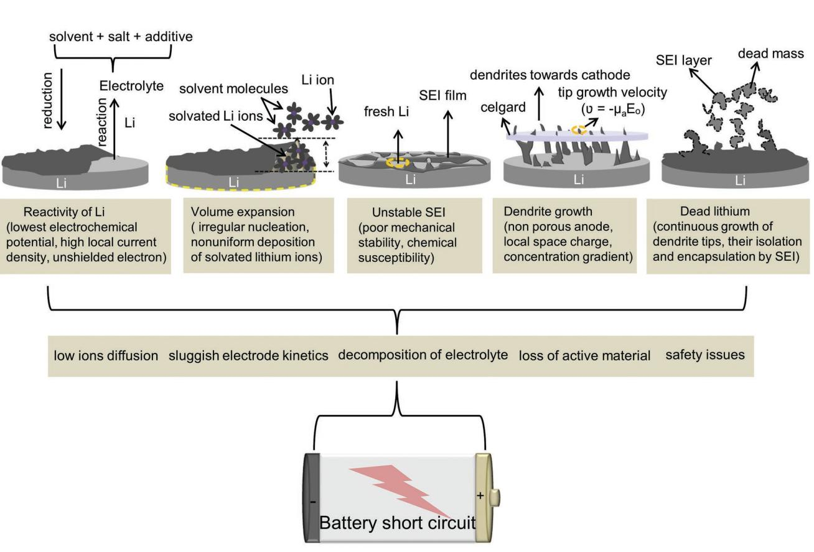

**Figure 1.** Schematic of the various challenges faced by Li anodes.

forming a LiF layer. However, LiClO4 and LiAsF6 are found to be stable due to the absence of fluorine and presence of strong AsF bonding in their molecules, respectively.[42–45] Furthermore, the commonly used ether or carbonate based electrolyte systems are also found to react with Li metal anode forming

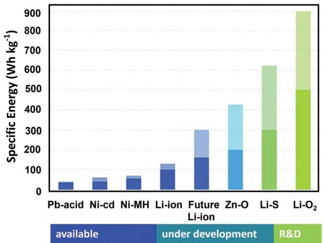

**Figure 2.** Comparison of the estimated practical specific energies of different rechargeable batteries systems with Li metal batteries (Li–S and Li–O2) and their future trend. Reproduced with permission.[1] Copyright 2012, Wiley-VCH.

reduction products such as (CH2 OCO2 Li)2, CH3OCO2Li, CH2CH2, Li2O, LiOH, Li2CO3, LiF, Li*x*PF*y*, etc.[25,27,46–48] Similarly, computational studies have shown that various liquid electrolytes are highly unstable against Li metal anode.[20,26,38,49] For instance, Tasaki et al.[50] performed detailed ab initio calculations to study the interaction of Li atoms with ethylene carbonate (EC), propylene carbonate (PC), vinyl ethylene carbonate (VEC), vinyl carbonate (VC), vinyl vinylene carbonate (VVC), ethylene sulfite (ES), and tetrahydrofuran (THF). A Hartree-Fock (HF) method was used to optimize the theoretical cluster model, consisting of 15 Li atoms and one solvent molecule, such that the carbonyl oxygen was facing the Li cluster while the hydrocarbon moiety was away from it. Various thermodynamic parameters, such as activation energy (∆*E*), enthalpy of reaction (∆*H*), and transition state (TS), were calculated and it was deduced that the solvents/additives undergo spontaneous and exothermic reactions with Li.[36,50] The computational studies of Leung et al.[51] and Yu et al.[49] have also confirmed the interaction between Li and liquid electrolytes. In addition to the liquid electrolytes, solid electrolyte materials are also thermodynamically unstable against Li metal and are reduced with highly favorable decomposition energies (Figure 3c,d).[27]

**www.small-journal.com**

All electrolytes, including additives,[63,64] solvents,[65–68] and Li salts[50,68–71] can decompose, polymerize or adsorb on the Li surface leading to the formation of surface films (SEI). With repeated cycling, the SEI develops cracks leading to further reaction of the electrolyte with bare Li and the process continues

**www.small-journal.com**

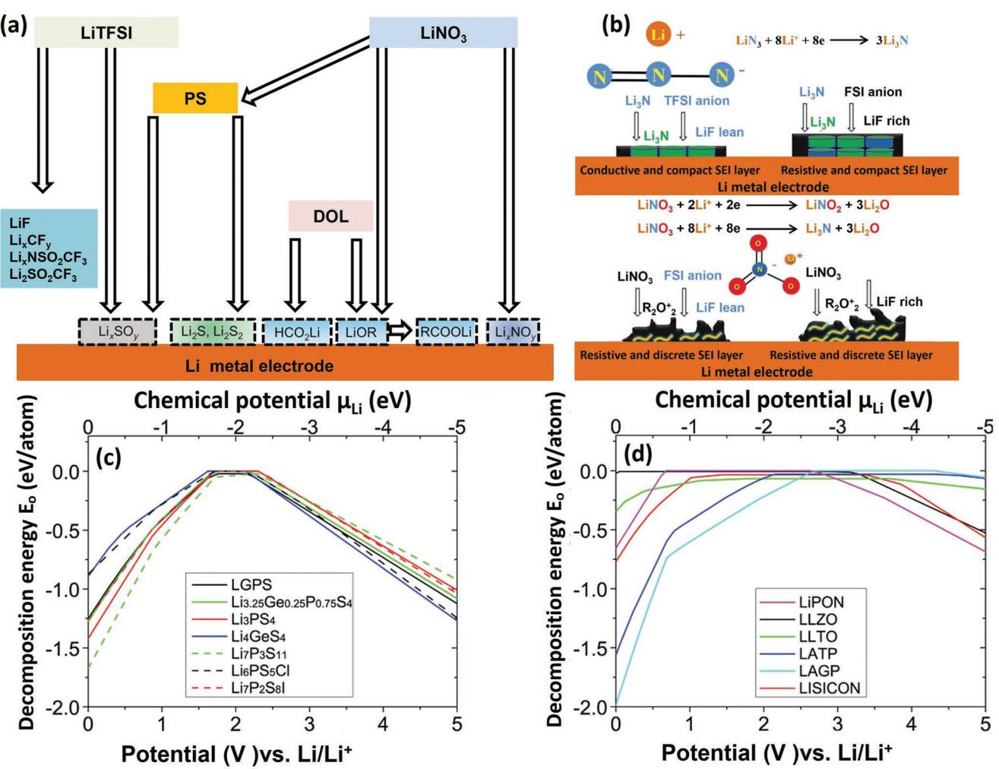

**Figure 3.** a) Schematic of the interaction of the electrolyte (solvents, salts, and additives) with the surface of a Li anode. Adapted with permission.[29] Copyright 2009, The Electrochemical Society. b) Schematic of the interaction of the Li surface with Li salts (e.g., LiTFSI, LiFSI) and additives (LiN3/LiNO3) in DME solvent. Reproduced with permission.[28] Copyright 2017, Wiley-VCH. The calculated decomposition energies (*E*D) of c) sulfide and d) oxide solid electrolyte materials as a function of the applied voltage (ϕ) or Li chemical potential (µLi ). Reproduced with permission.[27] Copyright 2015, American Chemical Society.

until the electrolyte is vanished. In fact, the continuous decomposition of electrolyte and the formation of unstable SEI are two of the major causes for the failure of the Li anode, which must be stopped.[52]

### **3.2. Volume Changes in Li Metal during a Charge–Discharge Cycle**

The huge volume expansion of Li metal anode during plating/stripping is another issue,[14,15] which is much worse than changes in alloy-type anodes such as lithium–silicon (**Figure 4**a).[53] Such huge volume changes mean that despite the reversibility of the electrochemical process, mechanical stress may destroy the integrity of the electrode, thus leading to capacity fade during cycling. Furthermore, the volume expansion could increase the contact area between Li and the electrolyte, which further accelerates the decomposition of the electrolyte. The volume changes in going from the stripping to plating states are illustrated in Figure 4b. During stripping, Li atoms lose electrons to the external circuit and dissolve in the electrolyte by migrating through the SEI (Figure 4c-I).[54] On cathodic polarization, the solvated Li ions shed their solvent molecules at the solution/SEI interface and deposit on the Li surface to become part of the metallic lattice, leading to uniform plating (Figure 4c-II).[54,55] However, this is only true when the SEI remains intact. In most cases, the SEI is fractured and the solvated Li ions can easily make their way through the fractures in the SEI and directly deposit on the metal surface in an irregular pattern, resulting in Li dendrites, dead Li, and a large volume expansion (Figure 4c-III).[14,15,56–60] Meanwhile, the electrolyte molecules immediately react with this fresh Li on the top surface of the anode to form a new thin SEI that can again fracture to provide paths for the entry of new electrolyte/solvated Li ions and this process continues until the whole electrolyte vanishes. Based on this failure mechanism, it can be

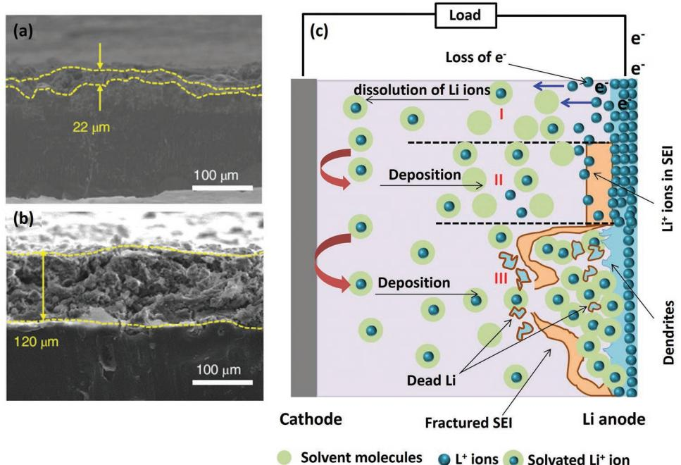

**Figure 4.** a,b) SEM images showing volume expansion for the Li anodes after 50 cycles in 4 m LiTFSI–LiDFOB–DME and 4 m LiTFSI–LiDFOB dual-salt–DME electrolytes. Reproduced with permission.[53] Copyright 2018, Nature Publishing Group. c) Schematic of volume expansion in a Li anode.

deduced that efforts must be made to rationally control the deposition of Li+, build integral SEI layers with high mechanical strength and flexibility, and reduce these volume changes in order to achieve safe and stable Li metal anodes.

#### **3.3. Growth of Li Dendrites**

In 1990, Chazalviel[61] modeled the growth of branched metallic deposits (dendrites) during electrodeposition in dilute salt solutions under a high electric field by proposing the following basic equations for the concentrations *C*a and *C*c:

$$
W_{c} = -D_{c}\Delta C_{c} + \mu_{c}C_{c}E
$$
\n(1)

$$
W_a = -D_a \Delta C_a - \mu_a C_a E \tag{2}
$$

where the subscripts a and c, respectively, stand for anions and cations, *W* is the ion flux, µ is the ion mobility, *D* is the diffusion constant, and *E* is the electric field. It was concluded that anion depletion occurs in the cathode vicinity creating a space charge, which is associated with a potential drop ∆*V*, leading to dendritic growth of the metal. Furthermore, a space charge was also shown to exist in the vicinity of the filament tips (dendrite tips), which advanced the front growth at a speed equal to the velocity of the anions leaving the anode (νa = −µa*E*o) in the applied electric field.

Later, Brissot et al.[62] used this model to investigate Li dendrite growth in a symmetrical Li/polymer cell under galvanostatic conditions. In their model, *D* and µ were assumed to be independent of concentration, such that *Z*a*C*a ≈ *Z*c*C*c ≈ *C* and all the potential-dependent terms were eliminated (where *z*a and *z*c, respectively, correspond to anionic and cationic charge numbers). Therefore, under such conditions, the current density (*J*) at the electrodes will be entirely due to cations, i.e., *J* = *J*c and *J*a = 0, and hence

$$
\frac{\partial C}{\partial t} (x = 0) = \frac{-J}{eD\left(1 + \frac{\mu_c}{\mu_a}\right)}
$$
(3)

Equation (3) is the mathematical formulation of the Brissot et al.'s model and can be effectively used to investigate the growth mechanism of Li dendrites in the cells. The change in ionic concentration from anode to cathode (d*C*/d*x*) is linearly related to *J*, so that, two different behaviors could be anticipated for a Li symmetrical cell at low and high current densities, depending on the initial ionic concentration (*C*o), the inter electrode distance (*L*) and the diffusion constant (*D*)

#### *(a) At a low current density (J* < *J\*)*

When the electrode effective current density *J* is lower than critical current density *J\* (*i.e.*, J* < *J\*)*, then d*C*/d*x* < 2*C*o/*L*, and the ionic concentration attains a steady state with a constant concentration gradient varying from *C*a = *C*o − ∆*C*a at the negative electrode to *C*c = *C*o + ∆*C*c at the positive. Under this condition, the potential also reaches a stationary value and no dendrite growth occurs. In practice, the cells are operated at a current density that is far below *J\** (*J* << *J\**), however, dendritic Li has still been observed.[14] Generally, at a low current density (*J* < *J\**), the ionic concentration remains very close to *C*o and does not approach zero at the negative electrode and therefore, the concentration gradient is very low and cannot be observed directly. However, this situation allows the cell to be easily polarized until dendrites appear which finally cause a decrease in the potential and short circuit the cell.[62]

#### *(b) At a high current density (J* > *J\*)*

**www.advancedsciencenews.com**

In this case, the electrode's effective current density *J* is higher than the critical current density *J\* (*i.e.*, J* >*J\*)* and d*C*/ d*x* > 2*C*o/L. Here, a high concentration gradient exists between the two electrodes and the ionic concentration goes to zero at the negative electrode (anode) leading to the formation of dendrites with the divergence of the cell potential at a time τ, called "*Sand's time*" as given below:

$$
\tau = \pi D \left( \frac{C_o e}{2J t_a} \right)^2 \tag{4}
$$

where

$$
t_{\rm a} = \frac{\mu_{\rm a}}{\mu_{\rm a} + \mu_{\rm c}}\tag{5}
$$

The term *t*a is the anion transference number while τ is the time at which Li dendrites start to grow. According to Brissot et al.,[62] in an applied electric field *E*o, the dendrites grow at a velocity equal to the drift velocity of the anions (*i* − *e*., νa = µa*E*o), where *E*o = *J*/σ and σ is the conductivity of the electrolyte. As *E*o is directly related to *J* therefore, dendrite growth is highly dependent on the current density. The dendrites can be predicted by knowing the value of *J\**, as given below[15,62,63]

$$
J^* = \frac{2DC_o e}{Lt_a} \tag{6}
$$

where *e* is the elementary charge. The above equation can be used to calculate *J\** by knowing the values of *C*o, *t*, and *D* for Li ions and the distance between the two electrodes. At τ, the effective current density exceeds the critical current density (i.e., *J* > *J\**) due to the ionic concentration gradient leading to the creation of a local space charge, which finally results in the formation of dendrites on the Li metal anode surface. Generally, this theory is valid for estimating metal dendrite growth at higher current densities (i.e., *J* > *J\**).[62,63]

#### **3.4. The SEI on a Li Metal Anode**

It is well known that the anode is always covered by a protective layer called an SEI film.[54] An unstable SEI results in fast self-discharge (short shelf-life), increased impedance, irreversible capacity loss, dendrite formation, and an abnormal Coulombic efficiency of the cell.[15,38,52,64–69] In early research, the Butler– Volmer equation was used to investigate the growth and behavior of the SEI film. It was postulated that the film is formed as result of the direct transfer of electrons from the Li anode to the cations in solution. Furthermore, the SEI was believed to interfere with the deposition/dissolution process of the anode, resulting in a short cycle life of the anode.[70,71] It was therefore recommended that the Li metal anode must be made free of such a passivating layer in order to achieve a stable life cycle. However, in 1979 Pled[54] proposed the SEI model and proved that the SEI film has no such negative influence on the performance of the anode. Rather, a stable SEI film allows the transport of Li ions while blocking electrons, thereby preventing the electrolyte from decomposing and improving the electrochemical performance of the cell (**Figure 5**). According to this model, the SEI is composed of one or two sublayers (a primary SEI at electrode electrolyte interface and a second porous layer next to primary one) and ion conduction occurs via the thermodynamically stable crystals of the primary SEI layer.[72] Later in 1987, Thevenin and Muller further classified SEI films into four types according to their structures and compositions, as given below:[31]

- (i) The SEI layer, which has the properties of a solid electrolyte and is mainly composed of inorganic compounds.
- (ii) The polymer electrolyte interphase (PEI) layer is composed of a compact mixture of polymeric and inorganic compounds and has the properties of a polymer electrolyte.
- (iii) The solid polymer layer (SPL) is characterized by average properties of both solid and polymer electrolytes in which solid inorganic compounds are dispersed in a polymer electrolyte.
- (iv) In a compact-stratified layer (CSL), the passivating layer is assumed to be made up of two sublayers, which consist of an SEI on the Li metal surface and another SEI or a PEI at the solution/electrode interface.

Similarly, Peled et al.[64] and Aurbach et al.[73] respectively proposed mosaic-type and multilayer microstructures for the SEI. In a broader sense, the SEI is the result of reactions between electrolytes and Li due to the loss of electrons from Li to the electrolyte solution. Extensive research has been done over the past 40 years to understand the structure and composition of SEI film.[30,37,38,58,60,72,74–77] Experimental and simulation studies have shown that SEI comprises of degraded inorganic salt, salts/ anions such as AsF− 6, PF− 6, CF3SO− 3, Li3N, Li2CO3, NS(O2CF3) − 2,C(SO2CF3) − 3 and LiX (X = F, Cl etc.) and reduction products of organic solvents such as (CH2OCO2 Li)2, ROLi, (R = alkyl group) CH3CH(OCO2Li) CH2OCO2Li, CH3OLi CH3OCO2Li, HCOOLi.[14,25,29,30,76] The composition of SEI can be correlated with the reactivity of the electrolyte components and solvated electrons (e− solv).[66,75,78,79] For instance, BF− 4 and ClO− 4 are significantly less reactive toward e− solv, and LiCl and boron (B0 ) are rarely found in the SEI. However, B0 was found in the SEI in ether-based solutions containing LiBF4 due to the kinetic stability of the ether solvent versus e− solv. [66,79] The composition and properties of an SEI film strongly depend upon the nature of the solvents, salts, and additives, so attention needs to be paid to the rational design of electrolytes for building an effective SEI film on the Li surface.[65,69,80,81] However, the SEI is a very complicated layer and its composition and properties may dependent on numerous factors including electrolyte composition/concentration, temperature, current density, etc.[66] Research on SEI formation and composition has been well reviewed elsewhere.[38,66,72,76]

#### *3.4.1. The SEI and Failure of the Li Metal Anode*

Generally, the SEI is considered a bilayer structure consisting of a primary compact layer directly grown on the Li surface and a secondary porous layer on the solution side, which controls the transport of ions in the cell. The transport of Li ions across

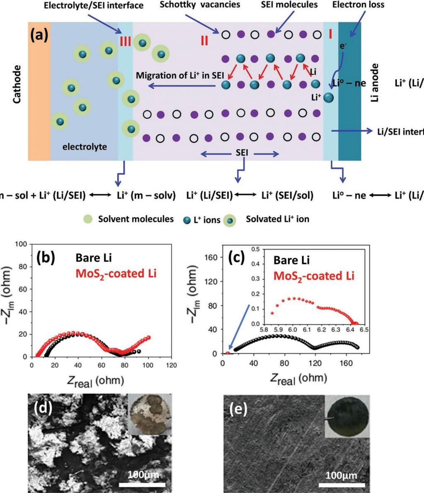

**Figure 5.** a) Schematics of SEI: Separation of a Li+ from the Li metal surface. (I) Migration of Li+ through the SEI by a Schottky vacancy mechanism. (II) Salvation of the Li+ electrolyte and (III) transport towards the cathode. b) Nyquist plots of bare and MoS2-coated cells after 15 cycles and c) after 240 cycles for bare Li; and for 300 cycles for MoS2-coated Li. d) SEM image of bare Li and e) protected Li after cycling at 10mAcm−2 . Reproduced with permission.[83] Copyright 2018, Nature Publishing Group.

the SEI during charge/discharge and its subsequent effect on performance can be explained with help of the following reaction steps (Figure 5):[72]

*Step-I: Electron loss at the Li/SEI interface* (Figure 5a-I).

In the first step, Li metal loses an electron at the SEI/Li interface to form Li+ which immediately transfers to the SEI (Li/SEI):

$$
Li^{\circ} - ne \leftrightarrow Li^{+}(Li/SEI)
$$
 (7)

*Step-II: Transfer of Li*+ *from the Li/SEI to the SEI solution interface (SEI/sol)* (Figure 5a-II).

In the second step, the transfer of a Li+ takes place through the defect sites in the crystals of the SEI from the Li/SEI interface to the SEI/sol (provided *t*Li+ = 1):

$$
Li^+(Li/SEI) \leftrightarrow Li^+(SEI/sol)
$$
 (8)

*Step-III: Finally, Li*+ *transfers from the SEI/sol interface to the bulk solution (m-sol) and its solvation occurs (Li*+ *(m-solv))* (Figure 5a-III).

In this step, the Li+ transfers to the bulk electrolyte solution through the porous SEI layer (*t*Li+ = 1).

$$
m - \text{sol} + \text{Li}^+ \left( \text{Li/SEI} \right) \leftrightarrow \text{Li}^+ \left( m - \text{solv} \right) \tag{9}
$$

It is clear that any one of the above reactions could be the rate-determining step for the back and forth transport of Li ions across the SEI. According to Pled and Menkin[72] under such

**www.small-journal.com**

conditions the Tafel slope (*b*) will be a linear function of the thickness (*L*) of the SEI:

$$
b = \frac{2.3RTL}{\alpha ZF} \tag{10}
$$

where *Z* is the valence of the cation (+1 for Li), α is the halfjump distance of the ion within the SEI, *F* is the Faraday constant. *R* is the resistance, and *T* is the temperature. The above assumptions are most valid when the SEI remains intact during charge/discharge (operation at open-circuit voltage (OCV) or at low current density). In practice, however, the cells are operated at high current densities and the SEI is known to suffer from continuous breaking and repairing process during repeated cycling. This results into an increased impedance, a high overpotential and a poor Coulombic efficiency of the electrode.[14,58,62,82] For instance, Cha et al.[83] demonstrated that the EIS spectra of bare and MoS2-coated Li anodes show almost similar film resistance after initial 15 cycles, suggesting the SEI to be undamaged (Figure 5b). However, the resistance of the bare Li anode was found to significantly increase after 240 cycles compared to MoS2-coated Li anode (Figure 5c) indicative of SEI failure (Figure 5d,e). Similarly, the Coulombic efficiency (ratio of irreversible capacity to the total reversible capacity) has become another important index for measuring the performance of an anode in a certain electrolyte.[84] The average Coulombic efficiency of an electrode is closely associated with an SEI layer. A stable SEI layer can effectively prevent the chemical reactions between electrolyte and Li, leading to high Coulombic efficiency and a long life of the battery. The low Coulombic efficiencies badly affect the cycle life.[85,86] For example, a Coulombic efficiency of 50% means irreversible loss of half of the Li during each cycle, which quickly depletes the Li in the battery. In addition to the irreversible Li loss, the rapid degradation of the electrolyte due to continuous healing and repairing of SEI also limits cycle life. Therefore, a Coulombic efficiency of 99% or above (less than 1% of Li loss on each cycle) is desirable for a practical Li metal battery.[82] However, almost all electrolytes are unstable against Li metal anode and therefore, is very crucial to have a continuous and flexible SEI on the Li metal anode.[45] An effective SEI must facilitate the diffusion of Li ions while blocking the leakage of electrons to the electrolyte. If the SEI develops cracks during cycling, the solvent molecules will thus react with the freshly exposed Li to form a new thin SEI. These solvated electrons (e− solv), with a lower negative reduction potential than Li, easily diffuse through this freshly-made SEI and reduce both solvent molecules and anions of the electrolyte. Even if, the solvent is stable these electrons can still reach the cathode and reduce it resulting in self-discharge of the battery.[72,87,88] Therefore, a rapid healing/repair of the SEI during plating/stripping is absolutely necessary to stop the loss of these solvated electrons and impede electrolyte decomposition.[89]

# **4. Strategies for Developing Stable Li Metal Anodes**

Significant research has been devoted to designing nanostructured and engineered electrode frameworks, building a stable SEI with desired properties and discovering new electrolytes for achieving safe and stable Li metal batteries, as summarized in **Table 1**. The recent developmental progress and strategies for protecting Li anodes are discussed below.

### **4.1. Modification of Li Metal Anode**

# *4.1.1. Melt Diffusion Strategy to Trap Li in Porous Hosts*

The extremely high local current density of the planar Li metal anode causes a nonuniform distribution of Li+ flux on the electrode surface.[15] Consequently, the anode experiences nonuniform Li nucleation, leading to uncontrolled dendrite growth and a large volume change.[21] Because of this, porous host materials are used to reduce the local current density in the Li anode in order to control volume changes and suppress dendrite growth. Nanostructured 3D porous carbons are considered ideal host materials to hold the Li due to their high mechanical, thermal, and chemical stabilities, large surface area, good conductivity, and low gravimetric density.[15] A lightweight layered electrode made by infiltrating reduced graphene oxide (rGO) with molten Li has been produced in an attempt to address this problem (**Figure 6**a).[23] On the one hand, the rGO holds a large amount of Li with uniform deposition during stripping/plating. On the other hand, the top most rGO layer acts as a stable artificial SEI film. In addition, the periodically stacked rGO significantly mitigate the volume changes during cycling (Figure 6b–d). The layered Li–rGO anode was able to deliver a specific capacity as high as ≈3 390 mAh g−1 , which corresponds to ≈87.8% capacity of a pure Li metal anode.

Usually porous carbons have poor Li wettability and a lithiophilic coating is used to facilitate the infiltration of molten Li.[24,90] These coating agents have been found to guide uniform Li deposition and inhibit dendrite growth. For instance, ZnO shows good Li wetting properties and has been used to coat polymer fibers to facilitate their infiltration with molten Li and address the issues of volume expansion and dendrite formation (Figure 6e).[91] Similarly, Hu et al.[92] and Liu et al.[93] separately used ZnO-coated carbonized wood (C-wood) (Figure 6f) and commercial carbon fiber cloth (CFC) (Figure 6g) as Li host materials. The unidirectional channels of Li–C-wood and Li–CFC composite anodes were found to help regulate the flow of Li+ along the vertical direction. Furthermore, the large surface area of the microchannels significantly reduces the local current density, which is necessary for uniform Li nucleation and dendrite suppression. The Li–C-wood and Li–CFC composites showed good cyclic stabilities and low overpotentials.

Li–carbon composite anodes can help suppress dendrite formation and achieve a high Coulombic efficiency. However, a considerable amount of the Li may attach to the external surface of the carbon host during infiltration, causing the resulting Li– carbon composite anodes to be unsuitable for practical use.[23,24] To this end, an air stable and free standing anode composed of Li*x*M alloy nanoparticles (M = Si, Sn, or Al) encapsulated by large graphene sheets has been demonstrated (**Figure 7**a).[94] Instead of porous carbons, Zhang et al.[95] reported using metallic nickel (Ni) foam as a lithophalic host for the infusion of molten Li (Figure 7b). An anode based on this Li/Ni composite showed flat voltage profiles with little hysteresis

**Table 1.** Summary of the recent progress made in developing Li metal batteries.

| Material                                                                                                                          | Li-nucleation overpotential [mV] | Current density [mA cm−2] | Lifespan [h] | C.E [%] | Cycles | Remarks                  |
|-----------------------------------------------------------------------------------------------------------------------------------|-------------------------------------|------------------------------|-----------------|------------|--------|--------------------------|
| Porous Li foam[96]                                                                                                                | 25                                  | 4.0                          | 320             | ≈95.5      | 200    | Anode                    |
| Li–nickel foam[95]                                                                                                                | 200                                 | 5.0                          | ≈40             | 90.0       | 100    | Anode                    |
| ZnO-decorated carbon fiber cloth[93]                                                                                              | 15                                  | 10.0                         | 900             | 99.0       | 140    | Current collector        |
| ZnO-coated carbonized wood[92]                                                                                                    | 90                                  | 3.0                          | ≈150            | –          | 225    | Anode                    |
| Br-doped graphene-like film-CuBr modified Cu foam[236]                                                                            | 84                                  | 10.0                         | 850             | 98.8       | 300    | Current collector/ anode |
| rGO-coated Li foil[237]                                                                                                           | 9                                   | 3.0                          | 700             | ≈99        | 300    | Anode                    |
| ZnO-decorated porous carbon[107]                                                                                                  | 40                                  | 2.0                          | 500             | 97         | 200    | Anode                    |
| Silver nanowires-3D graphene composite[109]                                                                                       | 5.0                                 | 0.5                          | 400             | ≈97.6      | 500    | Anode                    |
| Li6.4La3Zr2Al0.2O12 nanoparticles decorated 3D carbon nanofibers scaffold[123]                                                 | –                                   | –                            | 940             | 98         | 1000   | Anode                    |
| 3D porous MXene-GO aerogels scaffolds[119]                                                                                        | 18                                  | 10.0                         | ≈90             | 97.8       | 350    | Anode                    |
| Chemically polished lithium metal[238]                                                                                            | 78                                  | 1                            | ≈600            | 92         | 300    | Anode                    |
| N-doped graphene[239]                                                                                                             | 22                                  | 1.0                          | 145             | 98         | 200    | Anode                    |
| 3D current copper[21]                                                                                                             | –                                   | –                            | 600             | ≈97        | 50     | Current collector        |
| Free standing copper nanowire network[112]                                                                                        | –                                   | –                            | ≈550            | 98.6       | 200    | Current collector        |
| Compartmented copper current collector[20]                                                                                        | –                                   | –                            | 500             | ≈99        | 150    | Current collector        |
| Carbon nanoarray membrane on Ni foam[127]                                                                                         | ≈12                                 | 2.0                          | 1000            | 99         | 200    | Current collector        |
| Porous Cu with vertically aligned microchannels[125]                                                                              | ≈144                                | 1.0                          | 300             | 98.5       | 200    | Current collector        |
| Nitrogen-doped graphitic carbon foams[118]                                                                                        | 25                                  | 3.0                          | 1200            | ≈99.6      | 300    | Current collector        |
| Cu–Zn alloy[126]                                                                                                                  | –                                   | –                            | 800 h           | 81         | 120    | Current collector        |
| MoS2 protective layer[83]                                                                                                         | ≈52                                 | 3.0                          | 300             | 99         | 100    | Surface protection       |
| Li13In3, LiZn, Li3Bi, or Li3As alloy coatings[58]                                                                                 | 65                                  | 2.0                          | 1400            | –          | 700    | Surface protection       |
| LiF protection layer on 3DLi[59]                                                                                                  | 0                                   | 1.0                          | 450             | –          | 200    | Surface protection       |
| Lithium silicide coating[33]                                                                                                      | 90                                  | 3.0                          | 400             | –          | –      | Surface protection       |
| 3D glass fiber cloths[121]                                                                                                        | –                                   | 0.5                          | ≈170            | ≈98        | ≈90    | Surface protection       |
| Dynamically cross-linked polymer with solid–liquid hybrid behavior[154]                                                        | 22                                  | 1.0                          |                 | 97         | 120    | Surface protection       |
| Atomic layer deposition of LiF[84]                                                                                                | –                                   | 1.0                          | ≈260            | 98.8       | 180    | Surface protection       |
| Poly(dimethylsiloxane) thin film coating[151]                                                                                     | –                                   | 0.5                          | 800             | 94.5       | 200    | Surface protection       |
| Cross linked polymer- terpenes and lithium powder[68]                                                                             | –                                   | 0.2                          | 400             | –          | –      | Electrolyte              |
| Potassium nitrate[144]                                                                                                            | –                                   | 2                            | ≈200            | 98         | 100    | Additive                 |
| Optimized lithium polysulfide and lithium nitrate[143]                                                                            | –                                   | 3.0                          | –               | 98.5       | 200    | Additive                 |
| Diethylene glycol dimethyl ether-LiTFSI system[182]                                                                               | –                                   | 1.0                          | 400             | 96.2       | 200    | Electrolyte              |
| Fluoroethylene carbonate[137]                                                                                                     | –                                   | 0.1                          | –               | 98         | 100    | Additive                 |
| [240] Colloidal particles Al2O3                                                                                                | –                                   | 0.5                          | 940             | ≈99        | 150    | Additive                 |
| Fluoroethylene carbonate[128]                                                                                                     | –                                   | 1.0                          | 24              | 95         | 100    | Additive                 |
| N-propyl-N-methylpyrrolidinium bis(trifluoromethanesulfonyl)amide-ether[57]                                                    | –                                   | 0.5                          | 300             | 99.1       | 360    | Electrolyte              |
| F-rich interphases on Li[241]                                                                                                     | 10.2                                | 0.2                          | 1000            | ≈99.3      | ≈250   | Electrolyte              |
| Multilayered graphene/Cs+[242]                                                                                                    | –                                   | 1.0                          | –               | 99.9       | 200    | Additive                 |
| Li3PO4 SEI layer[243]                                                                                                             | –                                   | 10.0                         | 600             | ≈95        | 10     | Electrolyte              |
| Tris (2,2,2-trifluoroethyl) borate[244]                                                                                           | 16                                  | 0.1                          | 1000            | 90.5       | 100    | Additive                 |
| Hollow SiO2 nanospheres[219]                                                                                                      | –                                   | 0.5                          | 300             | –          | –      | Additive                 |
| 1,4-dioxane/LiTFSI–DME[245]                                                                                                       | –                                   | 0.5                          | 800             | 98         | 200    | Electrolyte              |
| LiPF6 /fluoroethylene carbonate/3,3,3-fluoroethylmethyl carbonate/1,1,2,2-tetrafluoroethyl-2,′2,′-trifluoroethyl ether[246] | –                                   | 0.5                          | –               | 99         | >550   | Electrolyte              |

\*C.E corresponds to the Li plating and stripping Coulombic efficiency (%) over the given number of cycles and current densities (mA cm−2).

**www.small-journal.com**

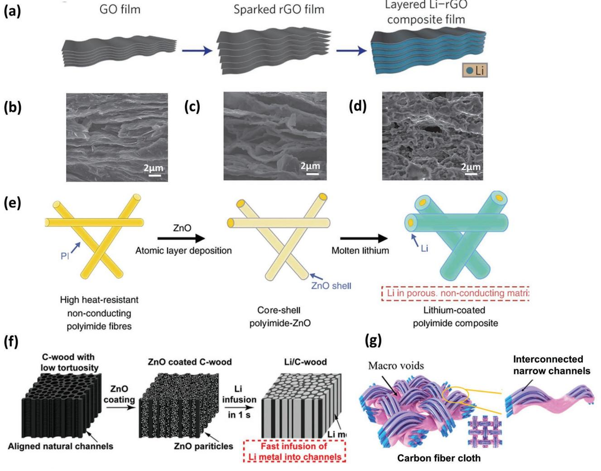

**Figure 6.** a) Schematic of the fabrication of a layered Li–rGO composite anode. Cross-sectional SEM images of the Li–rGO composite electrode b) before and c) after Li stripping and d) after 1 stripping/plating cycle. Reproduced with permission from.[23] Copyright 2016, Nature Publishing Group. e) Schematic of the fabrication of a Li-coated PI matrix electrode. Reproduced with permission.[91] Copyright 2016, Nature Publishing Group. f) Schematic of the material design of the C-wood (Left), ZnO-coated C-wood (Middle), and Li–C-wood anode (Right). Reproduced with permission.[235] Copyright 2017, National Academy of Sciences. g) Illustration of the highly interconnected microchannels in CFC/Li. Reproduced with permission.[93] Copyright 2018, American Chemical Society.

without dendrite formation (Figure 7c,d). In a full battery with a LiFePO4 (LFP) cathode, the Li/Ni composite anode showed better performance with reduced impedance and little polarization over 100 cycles.

The composite Li anodes have shown significant improvement in electrochemical performance. However, infusion with excess Li would completely fill the pores of the host material and the resulting anode would behave like a pure planar Li anode.[24] Therefore, the amount of Li infiltrated needs to be optimized in order to provide paths for ion transport on the outer as well as on the inner surface of the porous host. Hafez et al.[96] designed a highly porous and hollow Li–graphene foam containing an optimum amount of infused Li to ensure uniform electrolyte distribution throughout the electrode, and to accommodate the volume expansion and effectively suppress dendrite formation (Figure 7e). This electrode was stable over 160 cycles and exhibited a small overpotential of ≈25 mV at 4 mA cm−2. Recently, flexible batteries, especially those with high energy density cathodes such as sulfur and/or oxygen and a Li metal anode, have gained tremendous popularity due to their high energy densities, good rate capabilities, and ease of portability.[97,98] So far, a variety of flexible cathodes have been demonstrated with outstanding performance under bending conditions.[99–102] However, the use of a Li metal anode in bendable batteries is highly challenging. A planar Li anode could fracture on bending due to the brittle nature of its SEI and severe dendrite formation, leading to a short circuit of the cell (Figure 7f). In particular, in Li–S/O2 batteries, the soluble polysulfide/O2 species could further corrode the Li anode while the SEI is fractured so that a periodic replacement of the Li anode is required during long-term cycling, which is practically unacceptable for a commercial Li metal battery.[103–106]

**www.small-journal.com**

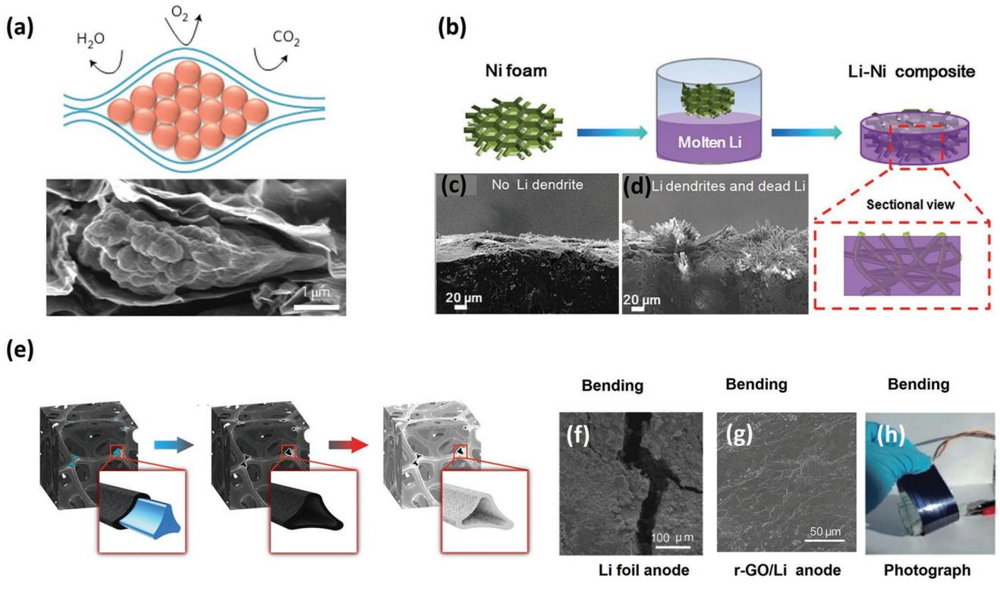

**Figure 7.** a) Schematics showing that large graphene sheets can separate Li*x*Si nanoparticles from gas molecules in air and a cross-sectional SEM image confirming the encapsulation of Li*x*Si nanoparticles by large graphene sheets. Reproduced with permission.[94] Copyright 2017, Nature Publishing Group. b) Schematic of the fabrication of a Li–Ni anode. c) SEM image of a composite anode without dendrites. d) SEM image of a bare Li anode showing dendrites. Reproduced with permission.[95] Copyright 2017, Wiley-VCH. e) Schematic of Li foam fabrication: Graphene deposition on a Ni foam (left), etching the graphene/Ni foam to obtain a hollow graphene foam (middle), Li infusion (right). Reproduced with permission.[96] Copyright 2018, Wiley-VCH. f) SEM image of a pure Li-metal anode showing cracks. g) SEM image of a Li–rGO scaffold with no cracks after bending. h) Optical image showing the bending tolerance of a Li–rGO scaffold. Reproduced with permission.[103] Copyright 2018, Wiley-VCH.

The controlled infusion of Li into a material that can withstand repeated bending, such as engineered rGO scaffolds, has been demonstrated to provide enough flexibility to avoid the formation of surface cracks, solve the local dendrite growth problem (Figure 7g) and enable the battery to function well under various bending conditions of the anode (Figure 7h).

#### *4.1.2. Electrochemical Strategy to Regulate Li Deposition*

Li metal can deposit irregularly anywhere in the anode as long as the Li ions meet electrons, leading to the formation of dendrites which cause short circuiting.[76,107,108] Although, significant progress has been made in designing advanced composite Li anodes by infusing molten Li into 3D porous hosts, it is still a challenge to control the spatial deposition of Li and limit dendrite formation. Electrochemical deposition could be an effective strategy to selectively nucleate and uniformly grow Li metal inside the porous host during plating/stripping. An ideal host must meet the criteria of: i) minimum nucleation overpotential to regulate uniform Li deposition, ii) high electrical conductivity to facilitate continuous electron transport and limit electrode polarization, iii) large specific surface area to reduce the local current density of the anode and inhibit dendrite growth, iv) an interconnected pore network with a high electrochemical stability to hold a large amount of Li and maintain the structural integrity of the electrode and v) excellent mechanical strength to withstand internal stresses and accommodate volume changes.[109–112] Conductive hosts with functional groups/active cites could satisfy these conditions to achieve controlled and dendrite-free Li deposition plating/stripping.[14,113] Mukherjee et al.[114] reported using porous graphene networks (PGN) to regulate the deposition of Li. Experimental and simulation results showed that defects in the graphene lattice act as seeds to initiate Li plating, leading to uniform and dendrite-free deposition. In addition, unstacked graphenes with a hexagonal-drum like morphology can reduce the effective current density of the electrode, regulate Li deposition, and suppress dendrite formation.[110] Most studies were aimed at developing large surface area porous hosts to reduce the local current density and thus inhibit dendrite formation according to the classical theory of dendrite growth.[62,115–117] However, recent studies have shown that porous hosts with a large electroactive surface area are helpful in reducing the nucleation overpotential and producing uniform Li deposition.[19,21,22,56] Therefore, attention needs to be paid to the nucleation behavior of Li within the host to further regulate Li deposition and improve the cycling performance of the Li anode. Cui's group[22] reported the use of hollow carbon encapsulated Au nanoparticles as seeds for Li nucleation (**Figure 8**a). The in situ transmission electron microscopic studies showed that the

**www.small-journal.com**

**Figure 8.** a) Schematic of Au NPs inside hollow carbon and Li nucleation on Au seeds. Reproduced with permission.[22] Copyright 2016, Nature Publishing Group. b) Schematic of guided Li nucleation and the growth process on NGCF without dendrites. c) Reduced nucleation overpotential. d) Galvanostatic discharge–charge curves showing the high areal capacity of a NGCF@Li anode at 3 mA cm−2. e) Charge–discharge curves showing the capacity of a Li–S full cell with NGCF@Li as the anode at 0.1 C. Reproduced with permission.[118] Copyright 2018, Wiley-VCH.

nucleation of Li occurs on the Au seeds inside the capsules, and this eliminated the possibility of dendrite formation so that the anode maintained a Coulombic efficiency as high at 98% over 300 cycles. Jin et al.[107] produced ZnO quantum dots decorating a hierarchical porous carbon (ZnO@HPC) anode to guide uniform Li deposition. Without the ZnO coating, Li was demonstrated to irregularly deposit in the HCP with severe dendrite growth, however after decorating with the ZnO quantum dots, the Li favored uniform deposition within ZnO@HPC pores during the initial nucleation process thus inhibiting the growth of dendrites. In a full battery with a LiCoO2 (LCO) cathode, the ZnO@HPC–Li anode showed good rate capability and lower voltage hysteresis at different current densities compared to a planar Li anode. Recently, a nitrogen-doped 3D graphitic carbon foam (NGCF) was used as a flexible and lightweight Li host to produce a more stable Li anode (Figure 8b).[118] In this material, the uniformly distributed nitrogen functional groups act as seeds for the initial Li nucleation, while the large specific surface area of the porous framework significantly reduces the local current density and alleviates volume changes during cycling. As a result, the NGCF composite electrode showed a lower nucleation overpotential (<25 mV at 3 mA cm−2 ) (Figure 8c) and delivered a high areal capacity (10 mAh cm−2 ) (Figure 8d). Furthermore, the NGCF@Li anode had a long lifespan (>1200 h) with high Coulombic efficiency (99.6%) for 300 cycles without dendrite formation. A full battery with a sulfur cathode and NGCF@Li anode achieved a high specific capacity of 1128 mAh g−1 (Figure 8e).

Although, constraining Li within a porous host by controlling the deposition by seeds has proven to be an effective way of reducing the local current density, accommodating volume changes and inhibiting dendrite growth,[15] further improvement is required to achieve more stable Li anodes with high Li plating/ stripping rates and a long cycle life to produce acceptable Li metal batteries. To overcome the limitations of low current density charge/discharge, Liang and co-workers[109] demonstrated a silver nanowire and graphene-based binary network (AGBN) as a host for the uniform electrodeposition of Li. In this material, the silver nanowires provide a large surface area, high electrical conductivity and act as seeds for Li deposition, whereas the graphene scaffold gives the electrode mechanical strength and maintains its structural integrity during fast cycling. With these features, an anode based on AGBN was operated at a current density as high as 40 mA cm−2 for over 1000 stripping/plating cycles (**Figure 9**a) and gave a low nucleation overpotential (<120 mV) (Figure 9b). Similarly, Zhang et al.[119] demonstrated oxygen-rich MXene (Ti3C2) and rGO aerogel scaffolds for Li metal anodes (Figure 9c). In MXene scaffolds, the layers provided voids to accommodate volume changes and facilitate Li ion transport due to the presence of abundant oxygen functional groups (Figure 9d). The Li–MXene anode remained stable over more than 300 cycles (Figure 9e) and showed a low nucleation overpotential (18 mV) at a 10 mA cm−2 current density (Figure 9f).

In scaffolds with a high electrical conductivity but poor ionic conductivity, Li plates on the outer surface of the matrix at

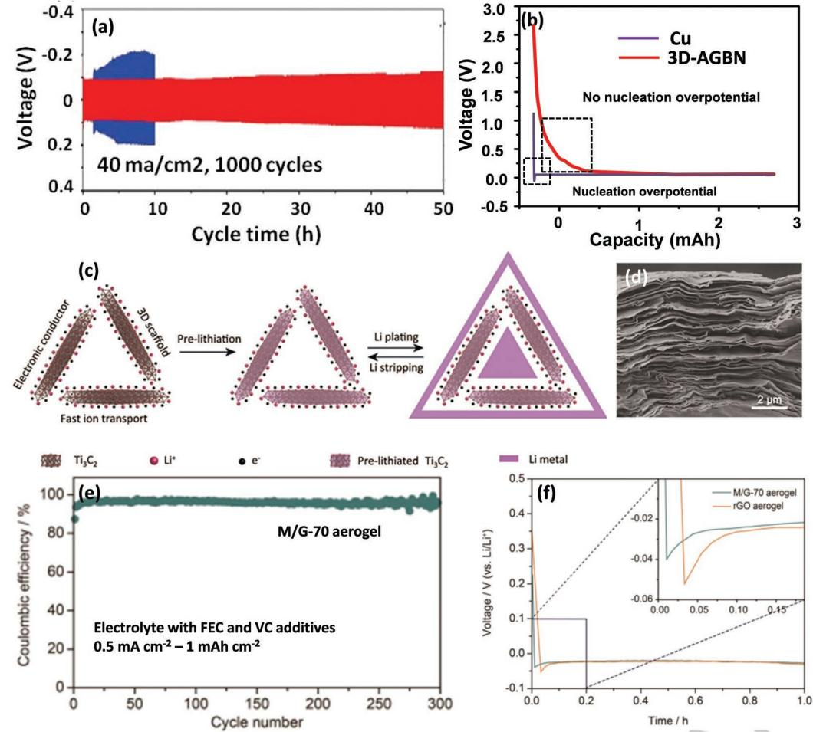

**Figure 9.** a) Comparisons of the cycling performance of symmetrical cells using a bare Li foil (blue) and a Li@3D–AGBN composite anode (red) at 40 mA cm−2 with a fixed capacity of 1 mAh cm−2. b) Nucleation overpotential of a Li foil (blue) and a Li@3D–AGBN composite anode. Rate performance of bare Li–Cu and 3D-AGBN anodes with NCM cathodes c) at 10 C and d) at 20 C. Reproduced with permission.[109] Copyright 2018, Wiley-VCH. c) Schematic of Ti3C2MXene aerogel scaffolds for Li metal anodes. d) Cross-sectional SEM image of the Ti3C2 membrane. e) Coulombic efficiency test of a Ti3C2/rGO aerogel anode. f) Nucleation overpotential curves. Reproduced with permission.[119] Copyright 2018, Wiley-VCH.

high current densities leading to dendrite growth and sluggish electrode kinetics.[24,120–122] Therefore, designing scaffolds with substantial ionic and electrical conductivities is crucial. Zhang et al.[123] proposed a mixed scaffold composed of ionically conductive Li6.4La3Zr2Al0.2O12 (LLZO) nanoparticles embedded in electrically conductive carbon nanofibers (**Figure 10**a). In this mixed ion-and-electronic conducting scaffold, the carbon nanofibers provided high electrical conductivity while the LLZO nanoparticles facilitated uniform and fast Li ion flux. A Li anode based on mixed this scaffold showed good electrochemical performance with a stable lifecycle of over 1000 h at a 5 mA cm−2 current density (Figure 10b).

Usually a planar copper foil is used as the current collector in Li metal batteries due to its high electrical conductivity and stable potential window relative to Li. However, Li undergoes inhomogeneous nucleation on a planar Cu current collector during the initial plating, which results in dendrite growth in the subsequent plating cycles.[19,112] Therefore, the development of 3D current collectors with a large surface area is highly recommended in order to reduce the effective current density, regulate Li deposition and suppress dendrite growth.[19] A porous copper current collector with a submicron skeleton and large surface area has been demonstrated to constrain the Li within its pores.[21] Compared to a planar current collector, the protuberances in a 3D porous current collector function as charge active sites to homogenize Li deposition and suppress dendrite growth (**Figure 11**a).[21] However, a drawback of using a metallic copper 3D collector is the lower areal capacity density (3.1 mAh cm−2 ) due to its small surface area (0.8 mg cm−2). To achieve a higher capacity density, Lu et al.[112] fabricated a freestanding Cu nanowire (CuNW) network as the current collector (Figure 11b) that was able to plate 7.5 mAh cm−2 of Li, had a stable lifespan of more than 550 h (Figure 11c) and achieved 98.6% Coulombic efficiency over 200 cycles without Li dendrite formation (Figure 11d). Importantly, the CuNW was also thermally stable for the infusion of molten Li to construct a Li– CuNWs anode. The Li/CuNW composite anode showed high rate capability and good cycling stability with a LCO cathode in a full battery. Optimizing the pore size and building aligned microchannels on porous copper is another strategy that can

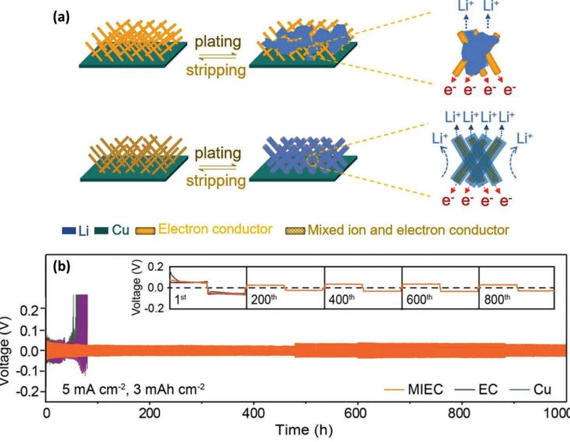

**Figure 10.** a) Schematics of electronic conducting scaffolds showing the mechanism of simultaneously reducing the local current density, regulating the current density and the homogenizing ionic flux. Without (top) and with electronic conductor (bottom). b) Galvanostatic voltage profiles of symmetric Li/MIEC–Li, Li/EC–Li, and Li/Cu–Li cells. Reproduced with permission.[123] Copyright 2018, Wiley-VCH.

further increase the internal surface area, provide voids to accommodate more Li and reduce the effective current density of a copper current collector.[124,125] Porous current collectors based on such structures have been demonstrated to significantly suppress dendrite growth and buffer the volume changes of Li metal during cycling.[20,126]

Instead of using copper, Liu et al.[127] produced a ladder-like carbon membrane on Ni foam (LCNM@Ni) as current collector for use in Li metal batteries (Figure 11e). The large surface area and ordered arrays of carbon nanoribbons of the LCNM@Ni were demonstrated to respectively reduce the local current density and homogenize the Li+ flux, thus suppressing dendrite growth and regulating Li nucleation. This unique LCNM@Ni current collector delivered a high capacity in a full cell with a LFP cathode (Figure 11f) and had a stable life cycle of more than 1000 h with a nucleation overpotential as low as 11 mV at 2 mA cm−2 compared to 82 mV for bare Ni foam (Figure 11g).

In summary, nanostructured frameworks have been designed and explored to address the issues of dendrite growth, volume changes and the, stability and safety of Li metal anodes (Table 1). Rapid advances in nanotechnology may allow the development of nanostructured anodes for next generation Li metal batteries.

#### **4.2. Building an SEI Film on a Li Metal Anode**

The stable SEI film on Li metal anode is crucial for achieving a safe Li metal battery with a long life cycle. Unfortunately, it is known to fracture during cell operation and this leads to dendrite growth, the formation of dead Li and the decomposition of the battery electrolyte. At present, an in situ or ex situ technique is used to achieve a stable SEI. In the former case, a variety of electrolytes and additives are used to give the SEI mechanical strength and chemical stability within the operating potential window, while the latter involves the coating of an artificial protective layer on the surface of the electrode before assembling the cell. However, in both cases the ultimate goal is to gain control over the irreversible capacity loss, impede electrolyte decomposition, reduce interfacial resistance, and suppress dendrite formation, and thus achieve safe and high performance Li anodes.

### *4.2.1. In Situ Formation of an SEI on Li Metal Anode*

A passivating film is immediately formed on the Li metal surface upon contact with the electrolyte due its high reactivity.[31] The film that is formed after assembling the cell is known as an in situ SEI.[38,60,128] However, the in situ SEI is weak and can develop cracks during stripping/plating. Therefore, suitable electrolyte additives are used to increase its stability.[18,34,128] These additives usually have a strong affinity for Li metal and are used to strengthen the SEI film. However, they must react with Li to a certain extent in order to avoid the consumption of Li metal. Additives or other contaminants can greatly change the surface chemistry of the Li metal, so knowledge of the chemistry of the additive and Li metal is necessary in order to produce a stable SEI with the desired properties. Extensive efforts have been made in recent years to experimentally study

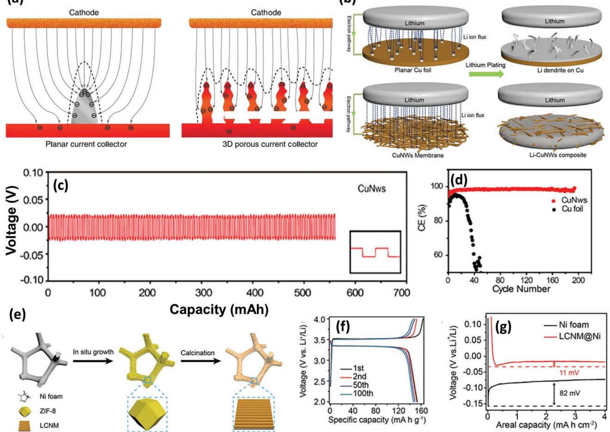

**Figure 11.** a) Schematic of the electric field on planar (left) and porous (right) copper foils and the corresponding Li deposition sites. Reproduced with permission.[21] Copyright 2015, Nature Publishing Group. b) Schematics of the distribution of Li ion flux and Li-metal plating models on different current collectors. Planar Cu foil (top) and CuNW network (bottom). The dashed lines between the two electrodes show the distributions of Li ion flux; the gray regions on the current collectors correspond to the plated Li. c) Voltage profiles at 1 mA cm−2. d) Comparison of % CE of a Li anode on a planar Cu foil and 3D CuNW at 1 mA cm−2. Reproduced with permission.[112] Copyright 2016, American Chemical Society. e) Schematic of the process for the synthesis of a LCNM@Ni collector. f) Charge–discharge curves of LCNM@Ni and Ni foam current collectors at 2 mA cm−2 for 4 mAh cm−2. g) Magnified voltage profiles showing the Li nucleation overpotentials. Reproduced with permission.[127] Copyright 2018, The Royal Society of Chemistry.

and theoretically compute the effect of electrolyte additives on the structure and properties of the SEI during cycling.[18,52] It has been found that the onset potential of SEI formation lies between 2.0 to 0.8 V, and changes with the nature of the additive, the composition of the electrolyte and the sweep rate.[66] The selection of a suitable additive needs great attention because different battery systems operate under different potential windows depending upon the cathode material and therefore the onset potential window may also vary. Generally, the lowest unoccupied molecular orbital (LUMO) of a typical additive must be lower than that of the electrolyte (both salt and solvent) so that it is reduced before the primary electrolyte and forms an initial SEI on the electrode surface.[77] For instance, the additive CsPF6 that has a lower LUMO energy level (−1.96 eV) than LiPF6 (a salt) whose LUMO is −1.44 eV, has been found to reduce easily to PF− 6 and Cs+ ions.[89] The negatively charged PF− 6 anions act as a self-healing agent by reacting with Li to form a LiF-SEI layer. In addition, the Cs+

ions produce an electrostatic shield of positive ions, which forces additional Li to adjacent vacancies in the anode, and thus suppresses the formation of Li dendrites (**Figure 12**a,b). However, due to its similarity with Li, Cs+ could also tend to deposit together with Li+ at a higher current density resulting in a shortage of additive after repeated cycling.[18]

The trend of developing environmentally friendly, cost effective, and multifunctional additives has significantly increased in recent years and a number of inorganic additives, (e.g., HF,[79,80] LiF,[129] LiBr,[130] LiNO3, [131,132] lithium oxalyldifluoroborate (LiODFB),[133] copper acetate,[134]), organic additives (e.g., polymers,[135] VC,[136] fluoroethylene carbonate (FEC),[128,137] toluene,[138] pyrrole[139]) and hybrid additives (e.g., AlCl3-pyrrole,[140] VC-LiNO3 (vinylene carbonate),[136] Li2S5– LiNO3–LiTFSI ternary salts[29]) have been used to address the stability and ionic conductivity issues of the SEI layer. However, there is a great concern with high energy density LiS and LiO2 batteries, where the discharge products of the cathode

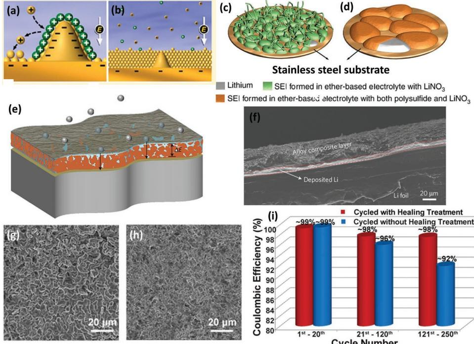

**Figure 12.** a,b) Schematics of self-healing electrostatic shield mechanism of the SEI. Reproduced with permission.[89] Copyright 2013, American Chemical Society. c) Weak SEI in an ether-based electrolyte with LiNO3 and dendrite growth. d) Stable SEI with both polysulfide and LiNO3 without dendrites. Reproduced with permission.[143] Copyright 2015, Nature Publishing Group. e) Schematic depicting the function of the alloy/LiCl-protected Li. f) Cross-sectional SEM image of the composite Li13In3|Li after plating 2 mAh cm−2 of Li. Reproduced with permission.[58] Copyright 2017, Nature Publishing Group. g) SEM image of a Li anode before dendrite healing. h) SEM image of a Li anode after healing of the dendrites at ≈70 °C for 3 d. i) Comparison of the average CE of the Li–S battery after various cycles at ≈0.75 mA cm−2 with and without the healing of the dendrites. Reproduced with permission.[145] Copyright 2018, American Association for the Advancement of Science.

materials, such as polysulfides or oxygen, can approach the anode surface and react with components in the SEI leading to further complications.[2,8,141] LiNO3 has been widely used as additive in LiS batteries to protect the Li from polysulfide attack.[9,10,142] Interestingly, under optimized concentrations, Li polysulfides and LiNO3 have been found to function as additives in an ether-based electrolyte and have helped to achieve a more stable and uniform SEI layer on the Li surface than LiNO3 alone (Figure 12c,d).[143] Besides LiNO3, Jia et al.[144] used KNO3 as an electrolyte additive to protect the Li anode due to its synergistic effect of controlling dendrite growth through the shielding effect of K+ and increasing the functionality of the SEI by the incorporation of NO− 3. A KNO3 additive to the LiTFSI–DOL/DME electrolyte system was demonstrated to deliver a high Coulombic efficiency of 97% after 100 cycles in a Li–Cu cell, whereas a Li–S battery using a KNO3 additive was able to achieve an average capacity of 637 mAh g−1 during 100 cycles. Recently, Nazar and co-workers[58] have reported a thin alloy layer (Li*y*M*z*, where M = In, Zn, Bi, As) of transition metal chlorides (MCl*x*) on the Li surface as a dendrite inhibitor (Figure 12e). Accordingly, a Li ion conductive LiM layer was directly grown on the Li metal surface followed by an insulating LiCl layer. In this dual-layer SEI, the alloying agents facilitate Li ion conductivity, while the insulating LiCl provides mechanical stability and maintains the texture of the film during cycling, and thus suppresses the growth of Li dendrites (Figure 12f). When used with a Li4Ti5O12 (LTO) cathode, the alloy-protected Li anode was able to achieve a long-life of 1500 cycles at 5C rate in a full cell configuration.

Building an SEI with additives has proven to be an effective strategy for protecting the Li anode from reacting with electrolytes and suppressing dendrite formation. However, most anode additives are vulnerable to reduction and even those with a lower LUMO cannot always maintain a stable and compact SEI layer.[77] Therefore, alternative solutions are required in order to achieve a safe and stable Li metal anode. Recently, Li et al.[145] have found that a high current density above ≈9 mA cm−2 can help trigger the self-healing of dendrites on the Li anode surface. It was demonstrated that a significant amount of heat is generated by the dendrites when the plating/stripping current density is increased, which forces the surface Li atoms to rearrange, and thereby heal the dendrites and smoothens the Li metal surface. It was found that in practice, the self-healing of dendrites can occur by thermal annealing of the anode for about 3 d at 70 °C (Figure 12g,h). Furthermore, the effect of temperature and current density on the self-healing of dendrites was studied in a Li–S battery and after heat treatment the device showed a higher Coulombic efficiency that an untreated device, as shown in Figure 12i.

#### *4.2.2. Building an Artificial SEI Film on a Li Metal Anode*

The artificial coating/ex situ modification of an SEI is considered more effective and easier than the in situ strategy. So

far, a great deal of work has been done to protect the Li anode with artificial SEI coatings and many nanostructured materials, including self-assembled carbon spheres, layered metal oxides, and graphene have been used.[67,85,91,146–151] It is highly desirable that the SEI should be: i) thin and firmly attached to the Li surface in order to provide a continuous Li ion flux; ii) mechanically strong to effectively suppress the growth of dendrites; iii) and flexible enough to buffer the volume changes of the electrode.[38,66] Polymer thin films obtained by a layer-bylayer self-assembly technique (LBL) can meet these requirements. The LBL technique permits the building of a multilayer SEI on the Li surface, which can allow the exchange of more ions than their stoichiometric number relative to the electrode either by simple adsorption or electrostatic interactions using hydrogen bond donor and acceptor groups in the polymer framework.[82,152,153] Bucur et al.[82] introduced a pH-sensitive membrane composed of a negative polyelectrolyte such as poly(3,4-ethylenedioxythiophene)-poly(styrenesulfonate) (PEDOT:PSS) and a positive polyelectrolyte, such as poly(diallyldimethylammonium) chloride (PDAD), on a copper substrate to address the issue of Li dendrites and improve the Coulombic efficiency (**Figure 13**a). One of the advantages of such a polymer membrane is that the adhesion strength between the substrate and the membrane can be tuned to promote the nucleation of Li underneath it. The membrane maintains its structural integrity on repeated cycling due to its highly flexible and elastic nature, and helps control dendrite growth, impeding electrolyte decomposition and improving life cycle of the anode. The Li metal anode coated with such a pH-sensitive membrane had a stable life of over 200 cycles and a Coulombic efficiency of up to 95% was achieved. In another study, Liu et al.[154] demonstrated a dynamic cross-linked polymer with "solid-liquid" hybrid characteristics for use as an interfacial layer on a Li metal anode (Figure 13b). Such unique dynamic properties of the polymer helped provide uniform surface coverage. However, in most cases, the monomers used were linear and the polymer membranes had an irregular porosity, which resulted in a nonuniform ion flux and caused irregular

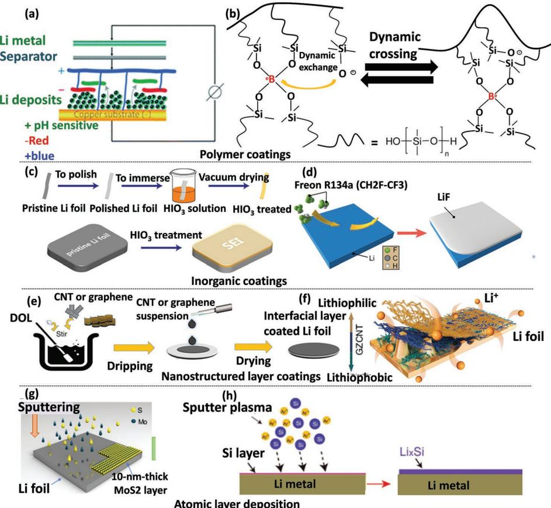

**Figure 13.** a) Schematic of the layer-by-layer (LBL) assembly of oppositely charged polymers on a planar surface. Reproduced with permission.[82] Copyright 2016, The Royal Society of Chemistry. b) Molecular structure of the cross-linked polymer used to protect Li metal anodes Reproduced with permission.[154] Copyright 2017, American Chemical Society. c) Schematic of the HIO3 coating on a Li surface. Reproduced with permission.[156] Copyright 2017, American Chemical Society. d) Diagram showing the reaction of gaseous Freon R134a with a Li surface to build a LiF SEI layer. Reproduced with permission.[59] Copyright 2017, American Chemical Society. e) Schematic of the fabrication of an interfacial layer on a Li anode. f) Diagrammatic representation of the different parts of an interfacial layer; lithiophobic (top), carbon nanotube/zinc oxide (GZCNT) (middle), and lithiophilic (bottom). Reproduced with permission.[35] Copyright 2018, Nature Publishing Group. g) Schematic of a MoS2 layer coating a Li anode. Reproduced with permission.[83] Copyright 2018, Nature Publishing Group. h) Preparation of a Li*x*Si-modified Li anode. Reproduced with permission.[33] Copyright 2018 Wiley-VCH.

Li deposition. Ionic insulator species, such as Li2CO3 and/or LiOH are predominantly found in the SEI and their removal is extremely necessary for a better performance.[155] Recently, an artificial SEI composed of iodic acid (HIO3) (a weak solid-state acid) has been reported to act as a scavenger for Li2CO3 and/or LiOH (Figure 13c).[156] HIO3 not only helps remove the insulating Li2CO3/LiOH species but also generates ion conductive LiI and LiIO3, thus significantly increasing the Li conductivity of the film.[80,157] Compared to an uncoated Li anode, a cell with an HIO3-coated Li anode showed lower polarization, reduced impedance, and achieved a longer life cycle with higher Coulombic efficiency. Similarly, fluorinated compounds, such as HF, have been found to help in forming a LiF-rich SEI to protect the Li anode and guide uniform Li plating.[80,158,159] Unfortunately, the coating of planar Li metal with such functional materials has poor mechanical strength to stop the growth of dendrites or accommodate the volume expansion and the SEI can therefore easily fracture during cycling.[14,23,122] Thin layer coatings of 3D composite Li anodes can overcome the limitations of their planar counterparts due their large surface area and ability to accommodate the volume changes.[58]

Cui et al.[59] demonstrated a LiF-coated 3D Li-reduced graphene oxide (Li–rGO) anode (Figure 13d). Coating the 3D Li anode with gaseous species (Freon R134a) produces a homogenous film with a controllable thickness. Li metal batteries based on a LiF-coated Li–rGO anode showed significant improvement in its electrochemical performance compared to an uncoated planar Li anode. Nevertheless, the batteries still suffered from sluggish kinetics and a high overpotential was observed due to cracking of the film. Since LiF is highly fragile due to its inorganic nature, 10% FEC, and 1% VC were added to the electrolyte to respectively heal the cracked parts and increase the flexibility of the film. However, the addition of such additives could result in an uncontrolled thickness of the SEI, which could give rise to other complications, such as poor ion diffusion and increased impedance.

In a broader sense, bulk organic polymers are flexible but mechanically poor in resisting dendrite growth, while inorganic materials are mechanically strong but fragile, and in both cases the result would be the failure of SEI. An ideal SEI should fulfill the following criteria: i) minimum electronic but maximum Li conductivity; ii) uniform morphology and composition, iii) elasticity and flexibility to accommodate the volume changes during Li stripping/plating; iv) a softer outside and harder inside to provide mechanical robustness and suppress dendrite growth.[66] Nanostructured materials, such as layered nanosheets, are considered ideal coating agents that meet these requirements. Furthermore, the small voids between adjacent layers could allow the transport of Li ions while preventing the large solvent molecules from approaching the Li surface. In a recent study, Zhang et al.[35] reported a hybrid SEI coating on Li metal with an upper lithiophobic carbon nanotube layer and a lower lithiophilic ZnO/carbon nanotube layer, as schematically shown in Figure 13e. The top layer was shown to provide high mechanical strength against dendrite growth[23,98,103,110,127] while the bottom lithiophilic ZnO layer anchored the whole layer onto the Li foil and improved Li conductivity (Figure 13f).[92,107,160] The Li anode coated with this lithiophilic– lithiophobic bifunctional layer showed a stable lifespan for over 1000 h without any dendrite formation after 200 cycles.

Similarly, atomic layer deposition (ALD) and molecular layer deposition (MLD) are also considered simple techniques for the fabrication of thin, elastic, and mechanically strong artificial SEI films directly on the electrode surface.[37,51,161–163] They offer more possibilities than gas coating and a conformal SEI with a precise thickness can be produced to protect the Li from direct contact with the electrolyte.[164–166] As an example, amorphous aluminum oxide (Al2O3) is electronically insulating with a bandgap of 9.9 eV[167] and has been used as an ALD coating agent on a Li anode.[147] Experimental and simulation results have shown that Al2O3 coatings greatly control the tunneling of electrons out of the anode surface, and hence decrease the electrolyte decomposition. However, it should be noted that most of the metal oxides lithiate during charge/discharge where Li replaces the metal (M) forming Li2O + M. Therefore, it is crucial to also consider the chemical composition of the SEI after lithiation before choosing metal oxide based coatings.[51,160] MLD is considered another effective strategy to produce pure polymeric or inorganic–organic hybrid thin films on surface of anode, and can significantly improve the stability of SEI in both ether-based and carbonate-based electrolytes.[168] Recently, Sun et al.[169] reported MLD-coating of an ultrathin polymer film of "polyurea" on Limetal anodes as an artificial SEI layer to regulate Li-ion flux and suppress dendrite formation. The Li-metal anode protected with the polyurea layer was demonstrated to exhibit a long and stable life cycle of more than 1000 h at a current density of 0.5 mA cm2 .

Similarly, layer transition metal dichalcogenides (LTMC), such as 2D molybdenum disulfide (2D-MoS2), have emerged as a new class of layer materials due to their remarkably diverse range of unique properties. MoS2 interlayers have been used for blocking polysulfides in Li–S batteries due to their high flexibility, good Li conductivity, and strong mechanical strength.[170–172] Recently, Cha et al.[83] reported the formation of a ≈10 nm SEI coating by sputtering 2D-MoS2 nanosheets onto a Li metal anode with the aim of creating a physical barrier between the electrolyte and the Li metal (Figure 13g). The atomically thin layers of 2D-MoS2 tightly adhere to the Li surface forming a uniform interface and maintain a homogeneous ion flux. In addition, a considerable amount of Li can be trapped between two adjacent MoS2 layers, providing a consistent Li ion flow, facilitating fast Li diffusion, and reducing the interfacialcontact resistance. A full Li–S cell consisted of a 2D-MoS2 protected Li anode and a CNT/S composite cathode was able to achieve a high specific energy density (≈589Whkg−1 ), a long life cycle (1 200 cycles) and quite high Coulombic efficiency (≈98%). Similarly, Tang et al.[33] demonstrated the deposition of a smooth Li silicide (Li*x*Si) coating to restructure an inhomogeneous Li surface to produce a uniform distribution of the Li+ flux (Figure 13h). In situ optical microscopy observations confirmed that the Li*x*Si-modified Li anode showed dendrite-free Li dissolution/deposition behavior, whereas a bare Li electrode suffered with obvious dendrite growth. The developments and understandings of MLD and ALD techniques for applications in batteries have been well reviewed recently.[166,173]

In summary, SEI is a complicated structure and understanding the formation, composition, phase transformation, morphology, chemical evolution, and mechanical degradation of the SEI layer is of great importance for improving the electrochemical performance of the anode.[174,175] Unfortunately,

due to the extremely high reactivity of Li metal and SEI to oxygen and moisture, it is difficult to readily use the majority of standard analytical techniques. Especially, the ex situ analysis is not always considered as a reliable tool because Li electrode could react with the surrounding environment after removing from electrolyte solutions and washing with solvents.[176,177] Therefore, in situ characterization techniques are preferably used to gain more understanding of the SEI layer. Various surface-sensitive techniques, such as FT-IR, Raman spectroscopy, in situ cryogenic electron microscopy and in situ AFM are frequently used to investigate the surface chemistry and morphological changes in SEI during cell operation.[177–180] Similarly, operando XRD, impedance spectroscopy, operando X-ray photoelectron spectroscopy, XAS, and NMR can be used to probe phenomenon such as, phase transformation volumetric expansion of anode, chemical composition, and local structural and chemical evolution of the SEI layer.[72,175,181–183] Further details about the advanced characterization of SEI can be found in recently published reviews.[175,177]

### **4.3. Designing Electrolytes for Achieving Safe and Stable Li Metal Anodes**

The electrolyte is one of the more important components of the battery, and the structure and composition of the SEI film is closely related to the nature of the electrolyte[15,25,38,66,67] Theoretical calculations show that an electrolyte will be stable if its LUMO is higher than the Fermi level of the anode; otherwise it will reduce on the anode surface.[38,184] However, in most cases, the LUMO of the electrolyte (solvents and salts) is higher than that of Li but is still found to reduce on the anode.[38] Therefore, it is highly desirable to develop new electrolyte systems composed of novel components (including solvents, salts, and additive), which can operate in a wider potential window, improving ionic conductivity and guaranteeing thermodynamic stability and safety.

A typical electrolyte must satisfy several requirements such as:[184,185]

- (i) A large stability window so that all of the desired reactions can happen without electrolyte composition.
- (ii) Be able to form a chemically stable and mechanically strong SEI film.
- (iii) Be ionically conductive (σLi > 10−4 S cm−1) but electronically insulating (σE < 10−10 S cm−1).
- (iv) A high Li ion transference number (*t*Li/*t*total ≈ 1).
- (v) Be inert to other components of the cell and only participate in the desired redox reactions.
- (vi) Not lose its properties because of a slight change in the battery environment (e.g., electrical, mechanical, and thermal alterations to the system).
- (vii) Be nontoxic, nonflammable and nonexplosive when the cell is damaged or short circuits.
- (viii)Be cost effective and commercially feasible.

Organic liquid electrolytes are more frequently used in Li metal batteries and can be broadly classified as carbonate-based (e.g., PC, EC, dimethyl carbonate (DMC), diethyl carbonate (DEC), and ethyl methyl carbonate (EMC)) or ether-based (e.g., dioxalane (DOL), 1,2-dimethoxyethane (DME), and tetraethylene glycol dimethyl ether (TEGDME)).[15,184] Carbonatebased electrolytes generally offer good solubility of Li salts and have an oxidation potential (highest occupied molecular orbital) at ≈4.7 V and a reduction potential (LUMO) near 1.0 V.[186–189] Furthermore, in carbonate-based electrolytes, the Li ion diffusion activation energy is low due to their relatively low viscosity. They are also able to develop an SEI film on a Li anode surface that stops decomposition of the electrolyte. However, despite their success in Li-dendrite suppression and achieving long life Li metal anodes, carbonate-based electrolytes are not suitable for high energy density Li–S and Li–O2 batteries, in which they irreversibly decompose due to nucleophilic attack by polysulfides/reduced oxygen species.[15,184,190,191] In addition, carbonate-based electrolytes have low flash points (< 30 °C) making them highly flammable, which leads to safety concerns.[18,184] Ether-based electrolytes such as DME, DOL, and TEGDME have also been widely used in Li metal batteries.[170,192] Their low viscosities and high ionic conductivities make them highly compatible with Li–S and Li–O2 batteries. Compared to carbonates, ether-based electrolytes have been found to deliver high Coulombic efficiencies and low voltage hysteresis.[45,190,193]

Besides solvents, the selection of suitable Li salts for liquid electrolytes is also crucial for building a stable SEI and suppressing Li dendrite formation. The salts in the electrolyte can also react with the Li anode surface to form an SEI film.[194] The most frequently used Li salts in Li metal batteries include LiClO4, LiAsF6, LiBF4, LiTF, LiPF6, LiTFSI, etc.[15,194] Owing to its good solubility in organic solvents, high ionic conductivity (9.0 mS cm−1 in EC/DMC at 20 °C) and appreciable anodic stability (5.1 V), LiClO4 is considered one of the favorite salts for achieving a high Coulombic efficiency of Li metal anodes.[45] However, a strong oxidizing perchlorate intermediate is reported to violently react with organic species at high current densities, giving rise to serious safety concerns.[43,195] Therefore, LiAsF6 is preferred due to its superior safety, because arsenate in its high oxidation state (V) is less toxic than As(III) and As(0).[45] However, similar to LiClO4, the SEI formed on a Li anode using a LiAsF6-based electrolyte mainly consists of Li2CO3, which is an ionic insulator and has a negative effect on the cycling performance of the cell.[45,155] In contrast, LiPF6 and LiBF4 form an ionically conductive LiF-rich SEI, which has been demonstrated to enable more uniform Li deposition and protect the Li metal anode from side reactions, especially in high energy density Li–S and Li–O2 batteries.[59,150] Furthermore, highly concentrated salt solutions have also been reported to significantly improve the performance of the Li anode and Coulombic efficiencies up to more 98% have been achieved at high current densities for 1000 cycles.[69,75,81] Recently, Linda et al.[182] adopted a new strategy of tuning the electrolyte structure by adjusting the solvent/salt molar ratio in a diethylene glycol dimethyl ether (G2) and LiTFSI system (G2:LiTFSI) to simultaneously tackily the polysulfide shuttling and dendrite growth problems (**Figure 14**a,b). By using this modified electrolyte system, a Li–S cell was able to maintain a 720 mAh g−1 capacity over 100 cycles compared to 420 mAh g−1 for the unmodified electrolyte (Figure 14c).

Room temperature ionic liquids (RTILs) have emerged as a new class of electrolytes for rechargeable Li batteries. Compared to carbonate or ether-based electrolytes, RTILs have

**www.small-journal.com**

several advantages such as a high boiling point, low vapor pressure, better thermal stability, nonflammability, a high oxidation potential (≈5.3 V vs Li+/Li0 ), and good Li-salt solubility. These features make RTILs ideal candidates for use in safe Li metal batteries.[196–200] Unfortunately, low Li ion conductivities, high viscosities, and poor stabilities below 1.1 V hinder their wide application as electrolytes for Li batteries.[201] To tackle these issues, various salt additives (e.g., EC or VC) and secondary solvents (e.g., PC or DOL/DME) have been added to RTILs to produce hybrid electrolytes.[57,184,202] The hybrid ionic liquid electrolytes based on pyrrolidinium, imidazolium, and piperidinium have been proven to effectively suppress Li dendrite growth and improve the performance of Li metal anodes.[15,57,184,201–203] For instance, Archer and co-workers[202] have demonstrated a hybrid ionic liquid electrolytes based on silica nanoparticles functionalized with the ionic liquid 1-methy-3-propylimidazolium bis(trifluoromethanesulfone) imide (SiO2-IL-TFSI) for application in Li metal batteries. In the SiO2 -IL-TFSI electrolyte, the silica nanoparticles were demonstrated to serve as reservoirs for the anions and hence reduce their mobility. As a result, no space charge develops in the electrode and thus the dendrite growth is suppressed.

The other options are inorganic solid electrolytes, which are crystalline, glass, or ceramic materials including sulfides,[204–206] oxides,[207,208] nitrides,[209] and phosphates.[74,210] In addition to safety, good Li ion conductivities and high elastic moduli ranging from tens to hundreds of GPa are their key advantages.[14] As a result, they offer fast Li ion transport and give the SEI enough mechanical stability to prevent dendrite growth.[14,15,27] However, such high modulus materials often adhere poorly to the electrode surface, which significantly increases the interfacial resistance during cycling.[14,211] Furthermore, most inorganic solid electrolytes have a very narrow electrochemical stability window and are thermodynamically unstable with a Li metal anode.[14,15,27] First-principles calculations on the thermodynamic stability of inorganic solid electrolytes have shown the favorable nature of the reaction between the solid electrolytes and the Li metal anode.[27] Generally, solid electrolyte materials are respectively reduced and oxidized at low and high potentials. For example, the thiophosphate electrolytes reduce at 1.6–1.7 V and oxidize at 2–2.3 V, and this abnormal behavior leads to irreversible decomposition. Compared to sulfides, oxides have high reduction potentials. They are hard to oxidize (oxidized until >3 V). In particular,

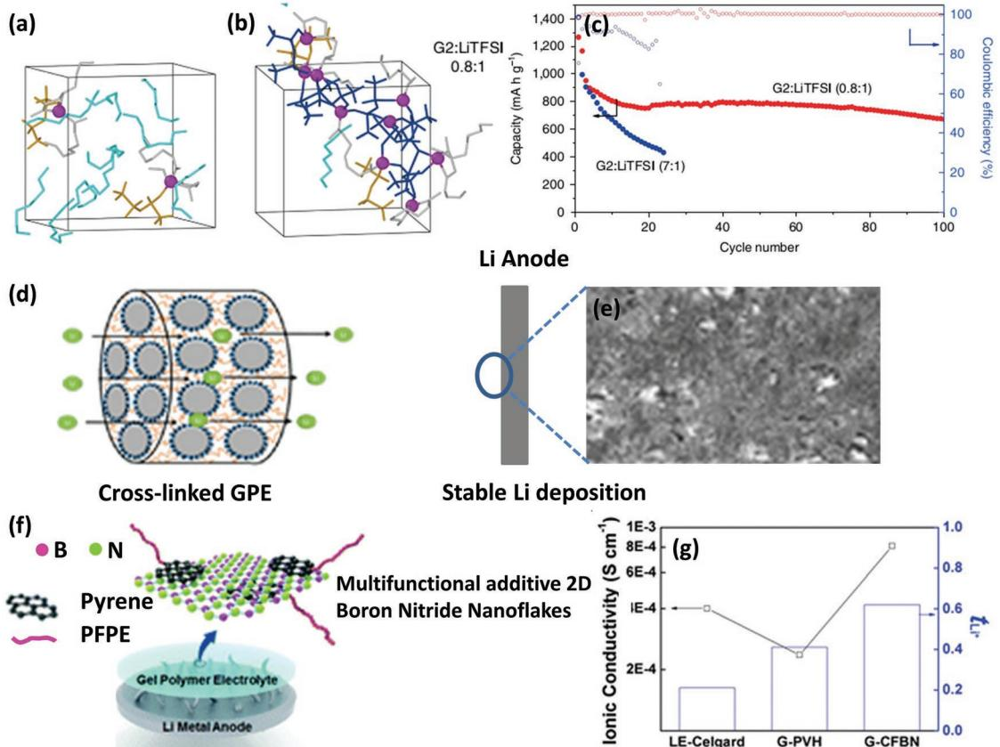

**Figure 14.** Simulated structures of the (diethylene glycol dimethyl ether) G2:LiTFSI electrolyte system with different G2:LiTFSI ratios, a) 7:1 and b) 0.8:1. Li+ cations are represented by purple while cyan and gray are free and coordinated G2 molecules, respectively. CIPs and aggregates of TFSI−anions are shown in gold and blue, respectively. c) Cyclic performance of Li–S cells using these two electrolytes. Reproduced with permission.[182] Copyright 2018, Nature Publishing Group. d) Schematic of a ceramic-cross-linked gel polymer electrolyte. e) SEM image of a Li anode showing uniform Li deposition. Reproduced with permission.[225] Copyright 2016, American Chemical Society. f) Schematic of a 2D boron nitride nanoflake additive for gel polymer electrolytes. g) Comparison of the ionic conductivities and Li transference numbers. Reproduced with permission.[226] Copyright 2017, Royal Society of Chemistry.

NASICON-type materials such as Li1.3Al0.3Ti1.7(PO4)3 (LATP) and Li1.3Al0.3Ge1.7(PO4)3 (LAGP) solid-state electrolytes are thermodynamically stable up to 4.2 V. Although, inorganic solid electrolytes are safer and helpful in forming a stable SEI film, still they need to be protected from side reactions with the Li anode by using coating agents, which results in an increase in the battery impedance.[15,27,212,213]

Gel polymer electrolytes, a class of polymer electrolytes, are promising candidates for use in Li metal batteries. They are composed of a liquid electrolyte solution (e.g., LiPF6, LiClO4) dissolved in an organic solvent, (e.g., EC, DMC, DEC, PC) entrapped in a polymeric matrix either through physical or electrostatic interactions.[214,215] Such a combination of polymer and liquid electrolytes provides good mechanical stability and good transport properties comparable to those of liquid electrolytes. The physiochemical properties of a gel polymer electrolyte is determined by the structural stability of the polymer framework and polymer–solvent-Li+ interactions, and when these interactions are strong the electrolyte is more stable than one with weak interactions.[214] For instance, poly(acrylonitrile)-(PAN) and poly(methyl methacrylate) (PMMA)-based gel polymer electrolytes are more stable due to the strong interaction between Li+ and electron-rich oxygen and nitrogen atoms, respectively.[214] Poly(vinylidene fluoride) (PVdF) is found to have the weakest polymer–solvent-Li+ interactions due to physical trapping of the electrolyte solution.[214,216,217] However, various approaches have been used to improve ionic conductivity, reduce the crystallinity, and increase the mechanical stability of the PVdF matrix.[148,218,219] Replacing LiPF6, LiClO4 or LiBF4 salts with lithium chelatoborates has produced improvements in the thermochemical and Li ion transport properties of gel polymer electrolytes.[220–222] For instance, a composite gel polymer electrolyte based on PVdF and lithium polyvinyl alcohol oxalate borate (LiPVAOB) has been shown to significantly improve the Li ion conductivity, allow fast Li transfer and develop a stable SEI.[223] It can be seen from Equations (4) and (5) that Sand's time (τ), which is the start time for Li dendrite formation, is directly related to 1/*t*anion and for a binary Li+ electrolyte the *t*anion + *t*Li+ = 1. This means that by increasing *t*Li+ to unity, the Sand's time could be increased and Li dendrite growth could be theoretically stopped.[194] Saito et al.[224] reported gel-polymer electrolytes composed of LiTFSI/EC+DMC and polyvinyl butyral (PVB) that reduced the anion mobility by the presence of Lewis acid ionic groups on the PVB polymer chain. As a result, this gel polymer electrolyte showed a significant improvement in the Li transference number and Li ion conductivity with increased degree of salt dissociation. Tsao et al.[225] reported using a composite gel polymer electrolyte composed of a ceramic crosslinker and a poly(ethylene oxide) (PEO) matrix to increase the Li transference number and suppress Li dendrite growth (Figure 14d). The Li metal anode with this gel polymer electrolyte achieved 97% Coulombic efficiency over 100 cycles without dendrite formation (Figure 14e). The addition of nanomaterials, such as boron nitride nanoflakes (BNNFs) to gel-polymer electrolytes, has also been demonstrated to substantially improve the Li ion conductivity, increase the Li transference number, build a stable SEI and effectively suppress Li dendrite formation (Figure 14f,g).[226]

Compared to gel polymer electrolytes, solid polymer electrolytes can provide good mechanical rigidity preventing dendrite growth. They are composed of solvent-free, polymer-salt systems where the Li salts are dissolved in a polymer matrix.[227] A typical example of a solid polymer electrolyte is linear PEO (monomer unit CH2CH2O), as first reported by Wright.[228] Later, Armand demonstrated the use of LiX/PEO systems (X = Cl, F, etc.) as electrolytes for Li batteries.[229] In PEO-based solid electrolytes, the dissolution of the Li salt is promoted by the Lewis acid–base interactions between Li+ of the salt and oxygen of the PEO.[214,230,231] Despite good safety, versatility in design, flexibility and robustness, solid polymer electrolytes are limited by their poor ionic conductivities.[232]

In summary, the choice and development of a suitable electrolyte are still the bottleneck of Li metal batteries and more research work in this area is required. Details of the various electrolyte systems have been already extensively discussed in several previous reviews.[45,46,141,215,233]

# **5. Conclusions and Perspectives**

Li metal batteries have attracted the attention of prominent research groups and industry due to their high energy densities. During the last four decades, extensive research effort has been devoted to developing advanced Li anodes in order to meet the energy requirements of portable electronic devices, vehicles, and the rigid demands of industry. Li metal battery technology is expected to reach its maturity in the near future, and this will enable it to fulfill the needs of various energy demanding applications. Here, we outline the possible opportunities and directions which would help open the way for future research on the Li metal anode (**Figure 15**).

### **5.1. Nanostructured 3D Composite Li Metal Anode**

Most of the initial research on the Li anode was based on a hostless planar Li foil. In recent years, significant progress has been seen in developing composite Li anodes. In most cases, the porous host is either conductive carbon that has been coated with lithiophilic agents such as ZnO or metals such as Ni and Cu.[21,95,96,112] Although these porous hosts partially help to reduce the electrode current density and suppress Li dendrite formation, coating with such heavy metals/metal oxides can greatly offset the advantage of the high energy density of the Li anode because neither the porous host nor the coating agents contribute to the capacity. Furthermore, the outer conductive surface of these porous hosts provides sites for Li deposition and may result in dendrite growth during cycling.[24] These issues can be addressed by using nanostructured electrodes with aligned microchannels (preferably lightweight porous carbons) having the outer surface insulating (to avoid Li deposition outside the pores) and the inner surface conductive with lithiophilic functional groups on the interior of the channels. An anode based on such nanostructures is expected to reduce the local current density of the electrode, suppress dendrite growth, facilitate Li transport through the aligned channels and control Li nucleation with atomic accuracy[113,123,125]

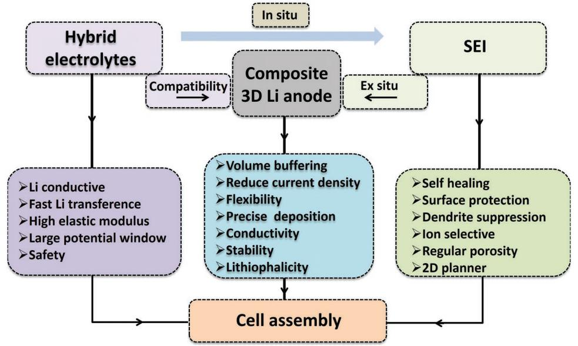

**Figure 15.** Outlooks for Li metal batteries. Diagram of the relationship of electrolyte, SEI and anode with each other along with their corresponding desired properties.

### **5.2. Electrolyte Systems with Desired Electrochemical Properties**

The discovery of new electrolytes could allow the use of Li metal electrodes for the development of high-energy Li–S and Li–air batteries. Most research work on Li metal batteries has involved individual components, such as electrode, electrolyte, and SEI. It needs to be emphasized that the development of a practical battery does not rely on a single component and joint efforts are required. For instance, the Li anode is found to have a high Coulombic efficiency in liquid organic electrolytes such as ethers or carbonates. However, polysulfides from a sulfur electrode are found to have a highly solubility in these electrolytes, which causes a severe shuttling effect and causes further complications in the cell. On the other hand, electrolyte systems with a high viscosity, such as gel-polymer or even solid electrolytes, are found to significantly reduce the dissolution of polysulfides and mitigate the polysulfide shuttling effect. Indeed, solid electrolytes would offer more safety, strong mechanical stability, and a high energy density.[15,234] However, their high impedance and interfacial instability are two main limitations. Therefore, a combination of multiple electrolyte systems, that is, "hybrid electrolytes,", could effectively address these issues. This can be achieved by the incorporation of additives, using suitable Li salts or modifying solvents. The introduction of a suitable secondary component or an additive could also increase the electrolyte stability widow, which is very important to stop electrolyte decomposition and reinforce a stable and strong SEI to effectively suppress dendrite formation.[36,38]

#### **5.3. 2D Planner SEI with Regular Porosity and Ion Selectivity**

A stable and robust SEI is also very important to achieve dendrite free and stable Li anodes. As discussed in this review, in situ or ex situ approaches have been used to stabilize the SEI structure through electrolyte component modulation or artificial coatings. We believe that in connection with hybrid electrolyte systems, an in situ developed SEI could possess good mechanical stability and ion selectivity that would help to effectively suppress Li dendrite growth. In addition, a hybrid electrolyte may also provide opportunities to use self-healing agents to immediately repair the broken regions of the SEI during repeated cycling.[18]

Besides the in situ modification of the SEI, impressive progress has been made in developing artificial layers on the Li anode and more research efforts are required. In comparison, ex situ techniques are preferred because they provide more control over the thickness of the SEI and allow the use of desired coating agents with high chemical stability and good mechanical strength. The artificial coating of a flat Li foil using organic polymers, inorganic layer materials or gas molecules only functions as a physical barrier at the anode–electrolyte interface, and most of these strategies suffer from the problems of poor Li ion conductivity and chemical or mechanical instability. Therefore, we suggest using nanostructured 2D porous materials with regular porosities and controlled functionalities for artificial coatings, which would act as ionic sieves to selectively absorb Li ions while stopping the diffusion of electrolyte molecules or other impurities. In conclusion, the ex situ modification of SEI could be preferred because it is an easy technique providing unlimited material choices for SEI chemistry and processing methods, whereas the in situ approach may involve complex parasitic reactions at the anode/electrolyte interface.[38]

Summing up, Li metal battery technologies involve complicated operations from material processing to battery packing and recycling, covering a vast scientific area including chemistry, physics, materials, engineering, computational techniques, etc. Therefore, multidisciplinary skills and joint research efforts are required for their development and practical applications. Nanotechnology-based solution could help to promote the commercialization of Li metal batteries. In doing so, attention must also be paid to maintain the energy density of the composite anode high enough and whether a method has necessary characteristics for the large-scale development of Li metal anodes.

# **Acknowledgements**

**www.advancedsciencenews.com**

The authors acknowledge financial support from MOST (2016YFA0200100 and 2016YFB0100100), the T. S. Keˇ Research Fellowship Program of Shenyang National Laboratory for Materials Science, the National Natural Science Foundation of China (Nos. 51525206 and 51521091), the Strategic Priority Research Program of the Chinese Academy of Sciences (XDA22010602), the Youth Innovation Promotion Association of the Chinese Academy of Sciences (No. 2015150), the Key Research Program of the Chinese Academy of Sciences (Grant No. KGZD-EW-T06), the Program for Guangdong Innovative and Entrepreneurial Team Program (Grant No. 2017ZT07C341), and the Development and Reform Commission of Shenzhen Municipality for the development of the "Low-Dimensional Materials and Devices" discipline.

# **Conflict of Interest**

The authors declare no conflict of interest.

# **Keywords**

Coulombic efficiency, dendrite growth, lithium anode, rechargeable batteries, volume expansion

Received: February 6, 2019

Revised: March 4, 2019

Published online: April 11, 2019

- [1] N.-S. Choi, Z. Chen, S. A. Freunberger, X. Ji, Y.-K. Sun, K. Amine, G. Yushin, L. F. Nazar, J. Cho, P. G. Bruce, *Angew. Chem., Int. Ed.* **2012**, *51*, 9994.
- [2] Z. W. Seh, Y. Sun, Q. Zhang, Y. Cui, *Chem. Soc. Rev.* **2016**, *45*, 5605.
- [3] V. Etacheri, R. Marom, R. Elazari, G. Salitra, D. Aurbach, *Energy Environ. Sci.* **2011**, *4*, 3243.
- [4] P. G. Bruce, *Solid State Ionics* **2008**, *179*, 752.
- [5] M. R. Palacín, *Chem. Soc. Rev.* **2009**, *38*, 2565.
- [6] M.-T. F. Rodrigues, G. Babu, H. Gullapalli, K. Kalaga, F. N. Sayed, K. Kato, J. Joyner, P. M. Ajayan, *Nat. Energy* **2017**, *2*, 17108.
- [7] J. M. Tarascon, M. Armand, *Nature* **2001**, *414*, 359.
- [8] P. G. Bruce, S. A. Freunberger, L. J. Hardwick, J.-M. Tarascon, *Nat. Mater.* **2012**, *11*, 19.
- [9] A. Manthiram, Y. Fu, S.-H. Chung, C. Zu, Y.-S. Su, *Chem. Rev.* **2014**, *114*, 11751.
- [10] R. Fang, S. Zhao, Z. Sun, D.-W. Wang, H.-M. Cheng, F. Li, *Adv. Mater.* **2017**, *29*, 1606823.
- [11] R. Fang, K. Chen, L. Yin, Z. Sun, F. Li, H.-M. Cheng, *Adv. Mater.* **2019**, *31*, 1800863.
- [12] P. Albertus, G. Girishkumar, B. McCloskey, R. S. Sánchez-Carrera, B. Kozinsky, J. Christensen, A. C. Luntz, *J. Electrochem. Soc.* **2011**, *158*, A343.
- [13] X. Shen, H. Liu, X.-B. Cheng, C. Yan, J.-Q. Huang, *Energy Storage Mater.* **2018**, *12*, 161.
- [15] C. Yang, K. Fu, Y. Zhang, E. Hitz, L. Hu, *Adv. Mater.* **2017**, *29*, 1701169.
- [16] L. Wang, Z. Zhou, X. Yan, F. Hou, L. Wen, W. Luo, J. Liang, S. X. Dou, *Energy Storage Mater.* **2018**, *14*, 22.
- [17] Y. Fan, X. Chen, D. Legut, Q. Zhang, *Energy Storage Mater.* **2019**, *16*, 169.
- [18] H. Zhang, G. G. Eshetu, X. Judez, C. Li, L. M. Rodriguez-Martínez, M. Armand, *Angew. Chem., Int. Ed.* **2018**, *57*, 15002.
- [19] X. Guan, A. Wang, S. Liu, G. Li, F. Liang, Y.-W. Yang, X. Liu, J. Luo, *Small* **2018**, *14*, 1801423.
- [20] P. Zou, Y. Wang, S.-W. Chiang, X. Wang, F. Kang, C. Yang, *Nat. Commun.* **2018**, *9*, 464.
- [21] C.-P. Yang, Y.-X. Yin, S.-F. Zhang, N.-W. Li, Y.-G. Guo, *Nat. Commun.* **2015**, *6*, 8058.
- [22] K. Yan, Z. Lu, H.-W. Lee, F. Xiong, P.-C. Hsu, Y. Li, J. Zhao, S. Chu, Y. Cui, *Nat. Energy* **2016**, *1*, 16010.
- [23] D. Lin, Y. Liu, Z. Liang, H.-W. Lee, J. Sun, H. Wang, K. Yan, J. Xie, Y. Cui, *Nat. Nanotechnol.* **2016**, *11*, 626.
- [24] Z. Liang, D. Lin, J. Zhao, Z. Lu, Y. Liu, C. Liu, Y. Lu, H. Wang, K. Yan, X. Tao, Y. Cui, *Proc. Natl. Acad. Sci. USA* **2016**, *113*, 2862.
- [25] D. Aurbach, *J. Power Sources* **2000**, *89*, 206.
- [26] M. Odziemkowski, D. E. Irish, *J. Electrochem. Soc.* **1992**, *139*, 3063.
- [27] Y. Zhu, X. He, Y. Mo, *ACS Appl. Mater. Interfaces* **2015**, *7*, 23685.
- [28] G. G. Eshetu, X. Judez, C. Li, O. Bondarchuk, L. M. Rodriguez-Martinez, H. Zhang, M. Armand, *Angew. Chem., Int. Ed.* **2017**, *56*, 15368.
- [29] D. Aurbach, E. Pollak, R. Elazari, G. Salitra, C. S. Kelley, J. Affinito, *J. Electrochem. Soc.* **2009**, *156*, A694.
- [30] D. Aurbach, M. L. Daroux, P. W. Faguy, E. Yeager, *J. Electrochem. Soc.* **1987**, *134*, 1611.
- [31] J. G. Thevenin, R. H. Muller, *J. Electrochem. Soc.* **1987**, *134*, 273.
- [32] P. Raghavan, X. Zhao, J.-K. Kim, J. Manuel, G. S. Chauhan, J.-H. Ahn, C. Nah, *Electrochim. Acta* **2008**, *54*, 228.
- [33] W. Tang, X. Yin, S. Kang, Z. Chen, B. Tian, S. L. Teo, X. Wang, X. Chi, K. P. Loh, H.-W. Lee, G. W. Zheng, *Adv. Mater.* **2018**, *30*, 1801745.
- [34] L. Wang, S. Liu, K. Zhao, J. Li, Y. Yang, G. Jia, *Ionics* **2018**, *24*, 3337.
- [35] H. Zhang, X. Liao, Y. Guan, Y. Xiang, M. Li, W. Zhang, X. Zhu, H. Ming, L. Lu, J. Qiu, Y. Huang, G. Cao, Y. Yang, L. Mai, Y. Zhao, H. Zhang, *Nat. Commun.* **2018**, *9*, 3729.
- [36] G. Ramos-Sanchez, F. A. Soto, J. M. Martinez de la Hoz, Z. Liu, P. P. Mukherjee, F. El-Mellouhi, J. M. Seminario, P. B. Balbuena, *J. Electrochem. Energy Convers. Storage* **2016**, *13*, 031002.
- [37] L. Shi, A. Xu, T. Zhao, *ACS Appl. Mater. Interfaces* **2017**, *9*, 1987.
- [38] A. Wang, S. Kadam, H. Li, S. Shi, Y. Qi, *npj Comput. Mater.* **2018**, *4*, 15.
- [39] M. Hughes, N. A. Hampson, S. A. G. R. Karunathilaka, *J. Power Sources* **1984**, *12*, 83.
- [40] K. M. Abraham, *J. Power Sources* **1985**, *14*, 179.
- [41] Y. Matsuda, *J. Power Sources* **1987**, *20*, 19.
- [42] D. Aurbach, I. Weissman, A. Zaban, O. Chusid, *Electrochim. Acta* **1994**, *39*, 51.
- [43] C. Nanjundiah, J. L. Goldman, L. A. Dominey, V. R. Koch, *J. Electrochem. Soc.* **1988**, *135*, 2914.
- [44] D. Aurbach, Y. Ein-Eli, B. Markovsky, A. Zaban, S. Luski, Y. Carmeli, H. Yamin, *J. Electrochem. Soc.* **1995**, *142*, 2882.
- [45] K. Xu, *Chem. Rev.* **2004**, *104*, 4303.
- [46] M. Keller, A. Varzi, S. Passerini, *J. Power Sources* **2018**, *392*, 206.
- [47] Y. Zhu, X. He, Y. Mo, *J. Mater. Chem. A* **2016**, *4*, 3253.
- [48] W. D. Richards, L. J. Miara, Y. Wang, J. C. Kim, G. Ceder, *Chem. Mater.* **2016**, *28*, 266.
- [49] J. Yu, P. B. Balbuena, J. Budzien, K. Leung, *J. Electrochem. Soc.* **2011**, *158*, A400.

- [50] K. Tasaki, K. Kanda, T. Kobayashi, S. Nakamura, M. Ue, *J. Electrochem. Soc.* **2006**, *153*, A2192.
- [51] K. Leung, Y. Qi, K. R. Zavadil, Y. S. Jung, A. C. Dillon, A. S. Cavanagh, S.-H. Lee, S. M. George, *J. Am. Chem. Soc.* **2011**, *133*, 14741.
- [52] S. S. Zhang, *J. Power Sources* **2006**, *162*, 1379.
- [53] S. Jiao, X. Ren, R. Cao, M. H. Engelhard, Y. Liu, D. Hu, D. Mei, J. Zheng, W. Zhao, Q. Li, N. Liu, B. D. Adams, C. Ma, J. Liu, J.-G. Zhang, W. Xu, *Nat. Energy* **2018**, *3*, 739.
- [54] E. Peled, *J. Electrochem. Soc.* **1979**, *126*, 2047.
- [55] A. M. Tarditi, M. L. Bosko, L. M. Cornaglia, M. S. J. Hashmi, in *Comprehensive Materials Finishing*, Elsevier, Oxford, UK **2017**, pp. 1–24.
- [56] A. Pei, G. Zheng, F. Shi, Y. Li, Y. Cui, *Nano Lett.* **2017**, *17*, 1132.
- [57] N.-W. Li, Y.-X. Yin, J.-Y. Li, C.-H. Zhang, Y.-G. Guo, *Adv. Sci.* **2017**, *4*, 1600400.
- [58] X. Liang, Q. Pang, I. R. Kochetkov, M. S. Sempere, H. Huang, X. Sun, L. F. Nazar, *Nat. Energy* **2017**, *2*, 17119.
- [59] D. Lin, Y. Liu, W. Chen, G. Zhou, K. Liu, B. Dunn, Y. Cui, *Nano Lett.* **2017**, *17*, 3731.
- [60] J. O. Besenhard, M. Winter, J. Yang, W. Biberacher, *J. Power Sources* **1995**, *54*, 228.
- [61] J. N. Chazalviel, *Phys. Rev. A* **1990**, *42*, 7355.
- [62] C. Brissot, M. Rosso, J. N. Chazalviel, S. Lascaud, *J. Power Sources* **1999**, *81-82*, 925.
- [63] Y. Guo, H. Li, T. Zhai, *Adv. Mater.* **2017**, *29*, 1700007.
- [64] E. Peled, D. Golodnitsky, G. Ardel, *J. Electrochem. Soc.* **1997**, *144*, L208.
- [65] K. Xu, *Chem. Rev.* **2014**, *114*, 11503.
- [66] P. Verma, P. Maire, P. Novák, *Electrochim. Acta* **2010**, *55*, 6332.
- [67] G. A. Umeda, E. Menke, M. Richard, K. L. Stamm, F. Wudl, B. Dunn, *J. Mater. Chem.* **2011**, *21*, 1593.
- [68] J. Shim, J. W. Lee, K. Y. Bae, H. J. Kim, W. Y. Yoon, J.-C. Lee, *ChemSusChem* **2017**, *10*, 2274.
- [69] J. Qian, W. A. Henderson, W. Xu, P. Bhattacharya, M. Engelhard, O. Borodin, J.-G. Zhang, *Nat. Commun.* **2015**, *6*, 6362.
- [70] J. Jorné, C. W. Tobias, *J. Electrochem. Soc.* **1974**, *121*, 994.
- [71] W. H. Tiedemann, D. N. Bennion, *J. Electrochem. Soc.* **1973**, *120*, 1624.
- [72] E. Peled, S. Menkin, *J. Electrochem. Soc.* **2017**, *164*, A1703.
- [73] D. Aurbach, B. Markovsky, M. D. Levi, E. Levi, A. Schechter, M. Moshkovich, Y. Cohen, *J. Power Sources* **1999**, *81-82*, 95.
- [74] J. B. Bates, N. J. Dudney, G. R. Gruzalski, R. A. Zuhr, A. Choudhury, C. F. Luck, J. D. Robertson, *Solid State Ionics* **1992**, *53-56*, 647.
- [75] D. Aurbach, A. Zaban, *J. Electrochem. Soc.* **1993**, *140*, L155.
- [76] X.-B. Cheng, R. Zhang, C.-Z. Zhao, F. Wei, J.-G. Zhang, Q. Zhang, *Adv. Sci.* **2016**, *3*, 1500213.
- [77] A. M. Haregewoin, A. S. Wotango, B.-J. Hwang, *Energy Environ. Sci.* **2016**, *9*, 1955.
- [78] M. Odziemkowski, D. E. Irish, *J. Electrochem. Soc.* **1993**, *140*, 1546.
- [79] K. Kanamura, S. Shiraishi, Z. i. Takehara, *J. Electrochem. Soc.* **1996**, *143*, 2187.
- [80] Y. Lu, Z. Tu, L. A. Archer, *Nat. Mater.* **2014**, *13*, 961.
- [81] L. Suo, Y.-S. Hu, H. Li, M. Armand, L. Chen, *Nat. Commun.* **2013**, *4*, 1481.
- [82] C. B. Bucur, A. Lita, N. Osada, J. Muldoon, *Energy Environ. Sci.* **2016**, *9*, 112.
- [83] E. Cha, M. D. Patel, J. Park, J. Hwang, V. Prasad, K. Cho, W. Choi, *Nat. Nanotechnol.* **2018**, *13*, 337.
- [84] L. Chen, K.-S. Chen, X. Chen, G. Ramirez, Z. Huang, N. R. Geise, H.-G. Steinrück, B. L. Fisher, R. Shahbazian-Yassar, M. F. Toney, M. C. Hersam, J. W. Elam, *ACS Appl. Mater. Interfaces* **2018**, *10*, 26972.
- [85] G. Zheng, C. Wang, A. Pei, J. Lopez, F. Shi, Z. Chen, A. D. Sendek, H.-W. Lee, Z. Lu, H. Schneider, M. M. Safont-Sempere, S. Chu, Z. Bao, Y. Cui, *ACS Energy Lett.* **2016**, *1*, 1247.
- [86] C. Yan, X.-B. Cheng, Y.-X. Yao, X. Shen, B.-Q. Li, W.-J. Li, R. Zhang, J.-Q. Huang, H. Li, Q. Zhang, *Adv. Mater.* **2018**, *30*, 1804461.
- [87] J. Jortner, N. R. Kestner, *Electrons in Fluids: The Nature of Metal-Ammonia Solutions*, Springer, Berlin Heidelberg **1973**, p. 1.
- [88] E. Peled, D. Golodnitsky, J. Penciner, in *Handbook of Battery Materials*, Wiley-VCH, Germany **2007**, pp. 419–456.
- [89] F. Ding, W. Xu, G. L. Graff, J. Zhang, M. L. Sushko, X. Chen, Y. Shao, M. H. Engelhard, Z. Nie, J. Xiao, X. Liu, P. V. Sushko, J. Liu, J.-G. Zhang, *J. Am. Chem. Soc.* **2013**, *135*, 4450.
- [90] H. Kim, C.-Y. Chou, J. G. Ekerdt, G. S. Hwang, *J. Phys. Chem. C* **2011**, *115*, 2514.
- [91] Y. Liu, D. Lin, Z. Liang, J. Zhao, K. Yan, Y. Cui, *Nat. Commun.* **2016**, *7*, 10992.
- [92] Y. Zhang, W. Luo, C. Wang, Y. Li, C. Chen, J. Song, J. Dai, E. M. Hitz, S. Xu, C. Yang, Y. Wang, L. Hu, *Proc. Natl. Acad. Sci. USA* **2017**, *114*, 3584.
- [93] W. Deng, W. Zhu, X. Zhou, X. Peng, Z. Liu, *ACS Appl. Mater. Interfaces* **2018**, *10*, 20387.
- [94] J. Zhao, G. Zhou, K. Yan, J. Xie, Y. Li, L. Liao, Y. Jin, K. Liu, P.-C. Hsu, J. Wang, H.-M. Cheng, Y. Cui, *Nat. Nanotechnol.* **2017**, *12*, 993.
- [95] S.-S. Chi, Y. Liu, W.-L. Song, L.-Z. Fan, Q. Zhang, *Adv. Funct. Mater.* **2017**, *27*, 1700348.
- [96] A. M. Hafez, Y. Jiao, J. Shi, Y. Ma, D. Cao, Y. Liu, H. Zhu, *Adv. Mater.* **2018**, *30*, 1802156.
- [97] Y. Hu, X. Sun, *J. Mater. Chem. A* **2014**, *2*, 10712.
- [98] H.-J. Peng, J.-Q. Huang, Q. Zhang, *Chem. Soc. Rev.* **2017**, *46*, 5237.
- [99] J. Song, Z. Yu, T. Xu, S. Chen, H. Sohn, M. Regula, D. Wang, *J. Mater. Chem. A* **2014**, *2*, 8623.
- [100] G. Zhou, Y. Zhao, A. Manthiram, *Adv. Energy Mater.* **2015**, *5*, 1402263.
- [101] Y. Chen, S. Lu, X. Wu, J. Liu, *J. Phys. Chem. C* **2015**, *119*, 10288.
- [102] G. Zhou, *Next-Generation High Performance Lithium-Sulfur Batteries,* Springer, Singapore **2017**, p. 39.
- [103] A. Wang, S. Tang, D. Kong, S. Liu, K. Chiou, L. Zhi, J. Huang, Y.-Y. Xia, J. Luo, *Adv. Mater.* **2018**, *30*, 1703891.
- [104] C. Huang, J. Xiao, Y. Shao, J. Zheng, W. D. Bennett, D. Lu, L. V. Saraf, M. Engelhard, L. Ji, J. Zhang, X. Li, G. L. Graff, J. Liu, *Nat. Commun.* **2014**, *5*, 3015.
- [105] J. Lu, Y. Jung Lee, X. Luo, K. Chun Lau, M. Asadi, H.-H. Wang, S. Brombosz, J. Wen, D. Zhai, Z. Chen, D. J. Miller, Y. Sub Jeong, J.-B. Park, Z. Zak Fang, B. Kumar, A. Salehi-Khojin, Y.-K. Sun, L. A. Curtiss, K. Amine, *Nature* **2016**, *529*, 377.
- [106] M. M. Ottakam Thotiyl, S. A. Freunberger, Z. Peng, Y. Chen, Z. Liu, P. G. Bruce, *Nat. Mater.* **2013**, *12*, 1050.
- [107] C. Jin, O. Sheng, J. Luo, H. Yuan, C. Fang, W. Zhang, H. Huang, Y. Gan, Y. Xia, C. Liang, J. Zhang, X. Tao, *Nano Energy* **2017**, *37*, 177.
- [108] D. Lu, Y. Shao, T. Lozano, W. D. Bennett, G. L. Graff, B. Polzin, J. Zhang, M. H. Engelhard, N. T. Saenz, W. A. Henderson, P. Bhattacharya, J. Liu, J. Xiao, *Adv. Energy Mater.* **2015**, *5*, 1400993.
- [109] P. Xue, S. Liu, X. Shi, C. Sun, C. Lai, Y. Zhou, D. Sui, Y. Chen, J. Liang, *Adv. Mater.* **2015**, *5*, 1400993.
- [110] R. Zhang, X.-B. Cheng, C.-Z. Zhao, H.-J. Peng, J.-L. Shi, J.-Q. Huang, J. Wang, F. Wei, Q. Zhang, *Adv. Mater.* **2016**, *28*, 2155.
- [111] S. Chu, Y. Cui, N. Liu, *Nat. Mater.* **2017**, *16*, 16.
- [112] L.-L. Lu, J. Ge, J.-N. Yang, S.-M. Chen, H.-B. Yao, F. Zhou, S.-H. Yu, *Nano Lett.* **2016**, *16*, 4431.
- [113] Z. Liang, G. Zheng, C. Liu, N. Liu, W. Li, K. Yan, H. Yao, P.-C. Hsu, S. Chu, Y. Cui, *Nano Lett.* **2015**, *15*, 2910.
- [114] R. Mukherjee, A. V. Thomas, D. Datta, E. Singh, J. Li, O. Eksik, V. B. Shenoy, N. Koratkar, *Nat. Commun.* **2014**, *5*, 3710.
- [115] M. Rosso, T. Gobron, C. Brissot, J. N. Chazalviel, S. Lascaud, *J. Power Sources* **2001**, *97–98*, 804.
- [116] M. Wang, J. Li, X. He, H. Wu, C. Wan, *J. Power Sources* **2012**, *207*, 127.

- [117] D. Wang, W. Zhang, W. Zheng, X. Cui, T. Rojo, Q. Zhang, *Adv. Sci.* **2017**, *4*, 1600168.
- [118] L. Liu, Y.-X. Yin, J.-Y. Li, S.-H. Wang, Y.-G. Guo, L.-J. Wan, *Adv. Mater.* **2018**, *30*, 1706216.
- [119] X. Zhang, R. Lv, A. Wang, W. Guo, X. Liu, J. Luo, *Angew. Chem., Int. Ed.* **2018**, *57*, 15028.
- [120] M. D. Blue, G. C. Danielson, *J. Appl. Phys.* **1957**, *28*, 583.
- [121] X.-B. Cheng, T.-Z. Hou, R. Zhang, H.-J. Peng, C.-Z. Zhao, J.-Q. Huang, Q. Zhang, *Adv. Mater.* **2016**, *28*, 2888.
- [122] D. Lin, J. Zhao, J. Sun, H. Yao, Y. Liu, K. Yan, Y. Cui, *Proc. Natl. Acad. Sci. USA* **2017**, *114*, 4613.
- [123] C. Zhang, S. Liu, G. Li, C. Zhang, X. Liu, J. Luo, *Adv. Mater.* **2018**, *30*, 1801328.
- [124] Q. Yun, Y.-B. He, W. Lv, Y. Zhao, B. Li, F. Kang, Q.-H. Yang, *Adv. Mater.* **2016**, *28*, 6932.
- [125] S.-H. Wang, Y.-X. Yin, T.-T. Zuo, W. Dong, J.-Y. Li, J.-L. Shi, C.-H. Zhang, N.-W. Li, C.-J. Li, Y.-G. Guo, *Adv. Mater.* **2017**, *29*, 1703729.
- [126] Y. An, H. Fei, G. Zeng, X. Xu, L. Ci, B. Xi, S. Xiong, J. Feng, Y. Qian, *Nano Energy* **2018**, *47*, 503.
- [127] L. Liu, Y.-X. Yin, J.-Y. Li, Y.-G. Guo, L.-J. Wan, *Chem. Commun.* **2018**, *54*, 5330.
- [128] J. Heine, P. Hilbig, X. Qi, P. Niehoff, M. Winter, P. Bieker, *J. Electrochem. Soc.* **2015**, *162*, A1094.
- [129] S. Choudhury, L. A. Archer, *Adv. Electron. Mater.* **2016**, *2*, 1500246.
- [130] Y. Lu, Z. Tu, J. Shu, L. A. Archer, *J. Power Sources* **2015**, *279*, 413.
- [131] S. S. Zhang, *Electrochim. Acta* **2012**, *70*, 344.
- [132] S. S. Zhang, *J. Power Sources* **2016**, *322*, 99.
- [133] F. Wu, J. Qian, R. Chen, J. Lu, L. Li, H. Wu, J. Chen, T. Zhao, Y. Ye, K. Amine, *ACS Appl. Mater. Interfaces* **2014**, *6*, 15542.
- [134] C. Zu, A. Dolocan, P. Xiao, S. Stauffer, G. Henkelman, A. Manthiram, *Adv. Energy Mater.* **2016**, *6*, 1501933.
- [135] Y. Matsuda, M. Sekiya, *J. Power Sources* **1999**, *81-82*, 759.
- [136] J. Guo, Z. Wen, M. Wu, J. Jin, Y. Liu, *Electrochem. Commun.* **2015**, *51*, 59.
- [137] X.-Q. Zhang, X.-B. Cheng, X. Chen, C. Yan, Q. Zhang, *Adv. Funct. Mater.* **2017**, *27*, 1605989.
- [138] J.-W. Choi, G. Cheruvally, D.-S. Kim, J.-H. Ahn, K.-W. Kim, H.-J. Ahn, *J. Power Sources* **2008**, *183*, 441.
- [139] W. Yang, W. Yang, A. Song, L. Gao, G. Sun, G. Shao, *J. Power Sources* **2017**, *348*, 175.
- [140] M. Wu, Z. Wen, J. Jin, Y. Cui, *Electrochim. Acta* **2013**, *103*, 199.
- [141] A. Manthiram, X. Yu, S. Wang, *Nat. Rev. Mater.* **2017**, *2*, 16103.
- [142] F. C. d. Godoi, D.-W. Wang, Q. Zeng, K.-H. Wu, I. R. Gentle, *J. Power Sources* **2015**, *288*, 13.
- [143] W. Li, H. Yao, K. Yan, G. Zheng, Z. Liang, Y.-M. Chiang, Y. Cui, *Nat. Commun.* **2015**, *6*, 7436.
- [144] W. Jia, C. Fan, L. Wang, Q. Wang, M. Zhao, A. Zhou, J. Li, *ACS Appl. Mater. Interfaces* **2016**, *8*, 15399.
- [145] L. Li, S. Basu, Y. Wang, Z. Chen, P. Hundekar, B. Wang, J. Shi, Y. Shi, S. Narayanan, N. Koratkar, *Science* **2018**, *359*, 1513.
- [146] G. Zheng, S. W. Lee, Z. Liang, H.-W. Lee, K. Yan, H. Yao, H. Wang, W. Li, S. Chu, Y. Cui, *Nat. Nanotechnol.* **2014**, *9*, 618.
- [147] A. C. Kozen, C.-F. Lin, A. J. Pearse, M. A. Schroeder, X. Han, L. Hu, S.-B. Lee, G. W. Rubloff, M. Noked, *ACS Nano* **2015**, *9*, 5884.
- [148] H. Lee, D. J. Lee, Y.-J. Kim, J.-K. Park, H.-T. Kim, *J. Power Sources* **2015**, *284*, 103.
- [149] K. Yan, H.-W. Lee, T. Gao, G. Zheng, H. Yao, H. Wang, Z. Lu, Y. Zhou, Z. Liang, Z. Liu, S. Chu, Y. Cui, *Nano Lett.* **2014**, *14*, 6016.
- [150] Q.-C. Liu, J.-J. Xu, S. Yuan, Z.-W. Chang, D. Xu, Y.-B. Yin, L. Li, H.-X. Zhong, Y.-S. Jiang, J.-M. Yan, X.-B. Zhang, *Adv. Mater.* **2015**, *27*, 5241.
- [151] B. Zhu, Y. Jin, X. Hu, Q. Zheng, S. Zhang, Q. Wang, J. Zhu, *Adv. Mater.* **2017**, *29*, 1603755.
- [152] T. R. Farhat, J. B. Schlenoff, *J. Am. Chem. Soc.* **2003**, *125*, 4627.
- [153] N. Osada, C. B. Bucur, H. Aso, J. Muldoon, *Energy Environ. Sci.* **2016**, *9*, 1668.
- [154] K. Liu, A. Pei, H. R. Lee, B. Kong, N. Liu, D. Lin, Y. Liu, C. Liu, P.-c. Hsu, Z. Bao, Y. Cui, *J. Am. Chem. Soc.* **2017**, *139*, 4815.
- [155] C. Ling, R. Zhang, K. Takechi, F. Mizuno, *J. Phys. Chem. C* **2014**, *118*, 26591.
- [156] W. Jia, Q. Wang, J. Yang, C. Fan, L. Wang, J. Li, *ACS Appl. Mater. Interfaces* **2017**, *9*, 7068.
- [157] Y. Mugnier, C. Galez, J. M. Crettez, P. Bourson, J. Bouillot, *Solid State Commun.* **2000**, *115*, 619.
- [158] K. Kanamura, S. Shiraishi, Z.-I. Takehara, *J. Fluorine Chem.* **1998**, *87*, 235.
- [159] S. Shiraishi, K. Kanamura, Z. i. Takehara, *J. Electrochem. Soc.* **1999**, *146*, 1633.
- [160] T. Feng, Y. Xu, Z. Zhang, X. Du, X. Sun, L. Xiong, R. Rodriguez, R. Holze, *ACS Appl. Mater. Interfaces* **2016**, *8*, 6512.
- [161] S. M. George, *Chem. Rev.* **2010**, *110*, 111.
- [162] L. A. Riley, A. S. Cavanagh, S. M. George, S.-H. Lee, A. C. Dillon, *Electrochem. Solid-State Lett.* **2011**, *14*, A29.
- [163] Y. Ma, J. M. Martinez de la Hoz, I. Angarita, J. M. Berrio-Sanchez, L. Benitez, J. M. Seminario, S.-B. Son, S.-H. Lee, S. M. George, C. Ban, P. B. Balbuena, *ACS Appl. Mater. Interfaces* **2015**, *7*, 11948.
- [164] X. Xiao, P. Lu, D. Ahn, *Adv. Mater.* **2011**, *23*, 3911.
- [165] Y. S. Jung, A. S. Cavanagh, L. A. Riley, S.-H. Kang, A. C. Dillon, M. D. Groner, S. M. George, S.-H. Lee, *Adv. Mater.* **2010**, *22*, 2172.
- [166] Y. Zhao, K. Zheng, X. Sun, *Joule* **2018**, *2*, 2583.
- [167] P. Katiyar, C. Jin, R. J. Narayan, *Acta Mater.* **2005**, *53*, 2617.
- [168] Y. Zhao, L. V. Goncharova, Q. Sun, X. Li, A. Lushington, B. Wang, R. Li, F. Dai, M. Cai, X. Sun, *Small Methods* **2018**, *2*, 1700417.
- [169] Y. Sun, Y. Zhao, J. Wang, J. Liang, C. Wang, Q. Sun, X. Lin, K. R. Adair, J. Luo, D. Wang, R. Li, M. Cai, T.-K. Sham, X. Sun, *Adv. Mater.* **2019**, *31*, 1806541.
- [170] Z. A. Ghazi, X. He, A. M. Khattak, N. A. Khan, B. Liang, A. Iqbal, J. Wang, H. Sin, L. Li, Z. Tang, *Adv. Mater.* **2017**, *29*, 1606817.
- [171] Y. C. Jeong, J. H. Kim, S. H. Kwon, J. Y. Oh, J. Park, Y. Jung, S. G. Lee, S. J. Yang, C. R. Park, *J. Mater. Chem. A* **2017**, *5*, 23909.
- [172] P. Guo, D. Liu, Z. Liu, X. Shang, Q. Liu, D. He, *Electrochim. Acta* **2017**, *256*, 28.
- [173] Y. Zhao, X. Sun, *ACS Energy Lett.* **2018**, *3*, 899.
- [174] Q. Li, J. Chen, L. Fan, X. Kong, Y. Lu, *Green Energy Environ.* **2016**, *1*, 18.
- [175] J. Lu, T. Wu, K. Amine, *Nat. Energy* **2017**, *2*, 17011.
- [176] S. F. Amalraj, D. Aurbach, *J. Solid State Electrochem.* **2011**, *15*, 877.
- [177] S. J. An, J. Li, C. Daniel, D. Mohanty, S. Nagpure, D. L. Wood, *Carbon* **2016**, *105*, 52.
- [178] L. Y. Beaulieu, T. D. Hatchard, A. Bonakdarpour, M. D. Fleischauer, J. R. Dahn, *J. Electrochem. Soc.* **2003**, *150*, A1457.
- [179] Y. Li, Y. Li, A. Pei, K. Yan, Y. Sun, C.-L. Wu, L.-M. Joubert, R. Chin, A. L. Koh, Y. Yu, J. Perrino, B. Butz, S. Chu, Y. Cui, *Science* **2017**, *358*, 506.
- [180] W. Huang, D. T. Boyle, Y. Li, Y. Li, A. Pei, H. Chen, Y. Cui, *ACS Nano* **2019**, *13*, 737.
- [181] K. Edström, M. Herstedt, D. P. Abraham, *J. Power Sources* **2006**, *153*, 380.
- [182] Q. Pang, A. Shyamsunder, B. Narayanan, C. Y. Kwok, L. A. Curtiss, L. F. Nazar, *Nat. Energy* **2018**, *3*, 783.
- [183] K. N. Wood, K. X. Steirer, S. E. Hafner, C. Ban, S. Santhanagopalan, S.-H. Lee, G. Teeter, *Nat. Commun.* **2018**, *9*, 2490.
- [184] J. B. Goodenough, Y. Kim, *Chem. Mater.* **2010**, *22*, 587.
- [185] F. Meutzner, M. U. d. Vivanco, *AIP Conf. Proc.* **2014**, *1597*, 185.
- [186] X. Zhang, R. Kostecki, T. J. Richardson, J. K. Pugh, P. N. Ross, *J. Electrochem. Soc.* **2001**, *148*, A1341.
- [187] M. Egashira, H. Takahashi, S. Okada, J.-i. Yamaki, *J. Power Sources* **2001**, *92*, 267.
- [188] R. Imhof, P. Novák, *J. Electrochem. Soc.* **1999**, *146*, 1702.

- [189] K. Hayashi, Y. Nemoto, S.-i. Tobishima, J.-I. Yamaki, *Electrochim. Acta* **1999**, *44*, 2337.
- [190] J. Gao, M. A. Lowe, Y. Kiya, H. D. Abruña, *J. Phys. Chem. C* **2011**, *115*, 25132.
- [191] D. Xu, Z.-L. Wang, J.-J. Xu, L.-L. Zhang, X.-B. Zhang, *Chem. Commun.* **2012**, *48*, 6948.
- [192] Z. A. Ghazi, L. Zhu, H. Wang, A. Naeem, A. M. Khattak, B. Liang, N. A. Khan, Z. Wei, L. Li, Z. Tang, *Adv. Energy Mater.* **2016**, *6*, 1601250.
- [193] S. A. Freunberger, Y. Chen, Z. Peng, J. M. Griffin, L. J. Hardwick, F. Bardé, P. Novák, P. G. Bruce, *J. Am. Chem. Soc.* **2011**, *133*, 8040.
- [194] W. Xu, J. Wang, F. Ding, X. Chen, E. Nasybulin, Y. Zhang, J.-G. Zhang, *Energy Environ. Sci.* **2014**, *7*, 513.
- [195] G. H. Newman, R. W. Francis, L. H. Gaines, B. M. L. Rao, *J. Electrochem. Soc.* **1980**, *127*, 2025.
- [196] V. R. Koch, L. A. Dominey, C. Nanjundiah, M. J. Ondrechen, *J. Electrochem. Soc.* **1996**, *143*, 798.
- [197] Y. Wang, K. Zaghib, A. Guerfi, F. F. C. Bazito, R. M. Torresi, J. R. Dahn, *Electrochim. Acta* **2007**, *52*, 6346.
- [198] B. Garcia, S. Lavallée, G. Perron, C. Michot, M. Armand, *Electrochim. Acta* **2004**, *49*, 4583.
- [199] E. Markevich, V. Baranchugov, D. Aurbach, *Electrochem. Commun.* **2006**, *8*, 1331.
- [200] A. Eftekhari, Y. Liu, P. Chen, *J. Power Sources* **2016**, *334*, 221.
- [201] J. Fuller, R. T. Carlin, R. A. Osteryoung, *J. Electrochem. Soc.* **1997**, *144*, 3881.
- [202] Y. Lu, K. Korf, Y. Kambe, Z. Tu, L. A. Archer, *Angew. Chem., Int. Ed.* **2014**, *53*, 488.
- [203] S. S. Moganty, S. Srivastava, Y. Lu, J. L. Schaefer, S. A. Rizvi, L. A. Archer, *Chem. Mater.* **2012**, *24*, 1386.
- [204] R. Kanno, M. Murayama, *J. Electrochem. Soc.* **2001**, *148*, A742.
- [205] F. Mizuno, A. Hayashi, K. Tadanaga, M. Tatsumisago, *Adv. Mater.* **2005**, *17*, 918.
- [206] N. Kamaya, K. Homma, Y. Yamakawa, M. Hirayama, R. Kanno, M. Yonemura, T. Kamiyama, Y. Kato, S. Hama, K. Kawamoto, A. Mitsui, *Nat. Mater.* **2011**, *10*, 682.
- [207] Y.-H. Cho, J. Wolfenstine, E. Rangasamy, H. Kim, H. Choe, J. Sakamoto, *J. Mater. Sci.* **2012**, *47*, 5970.
- [208] R. Murugan, V. Thangadurai, W. Weppner, *Angew. Chem., Int. Ed.* **2007**, *46*, 7778.
- [209] A. Rabenau, *Solid State Ionics* **1982**, *6*, 277.
- [210] H. Aono, E. Sugimoto, Y. Sadaoka, N. Imanaka, G. y. Adachi, *J. Electrochem. Soc.* **1990**, *137*, 1023.
- [211] Z. Deng, Z. Wang, I.-H. Chu, J. Luo, S. P. Ong, *J. Electrochem. Soc.* **2016**, *163*, A67.
- [212] E. Rangasamy, G. Sahu, J. K. Keum, A. J. Rondinone, N. J. Dudney, C. Liang, *J. Mater. Chem. A* **2014**, *2*, 4111.
- [213] G. Sahu, E. Rangasamy, J. Li, Y. Chen, K. An, N. Dudney, C. Liang, *J. Mater. Chem. A* **2014**, *2*, 10396.
- [214] M. Montanino, S. Passerini, G. B. Appetecchi, *Rechargeable Lithium Batteries*, Woodhead Publishing, Elesvier, Netherlands **2015**, p. 73.
- [215] A. Manuel Stephan, *Eur. Polym. J.* **2006**, *42*, 21.
- [216] Y.-J. Wang, D. Kim, *Electrochim. Acta* **2007**, *52*, 3181.
- [217] V. Gentili, S. Panero, P. Reale, B. Scrosati, *J. Power Sources* **2007**, *170*, 185.
- [218] D. J. Lee, H. Lee, Y.-J. Kim, J.-K. Park, H.-T. Kim, *Adv. Mater.* **2016**, *28*, 857.
- [219] D. Zhou, R. Liu, Y.-B. He, F. Li, M. Liu, B. Li, Q.-H. Yang, Q. Cai, F. Kang, *Adv. Energy Mater.* **2016**, *6*, 1502214.
- [220] S. Shui Zhang, *Electrochem. Commun.* **2006**, *8*, 1423.
- [221] Z.-M. Xue, K.-N. Wu, B. Liu, C.-H. Chen, *J. Power Sources* **2007**, *171*, 944.
- [222] B. Xie, H. S. Lee, H. Li, X. Q. Yang, J. McBreen, L. Q. Chen, *Electrochem. Commun.* **2008**, *10*, 1195.
- [223] Y. Zhu, S. Xiao, Y. Shi, Y. Yang, Y. Hou, Y. Wu, *Adv. Energy Mater.* **2014**, *4*, 1300647.
- [224] Y. Saito, M. Okano, T. Sakai, T. Kamada, *J. Phys. Chem. C* **2014**, *118*, 6064.
- [225] C.-H. Tsao, Y.-H. Hsiao, C.-H. Hsu, P.-L. Kuo, *ACS Appl. Mater. Interfaces* **2016**, *8*, 15216.
- [226] J. Shim, H. J. Kim, B. G. Kim, Y. S. Kim, D.-G. Kim, J.-C. Lee, *Energy Environ. Sci.* **2017**, *10*, 1911.
- [227] D. E. Fenton, J. M. Parker, P. V. Wright, *Polymer* **1973**, *14*, 589.
- [228] P. V. Wright, *Br. Polym. J.* **1975**, *7*, 319.
- [229] M. Armand, *Solid State Ionics* **1983**, *9–10*, 745.
- [230] P. G. Bruce, C. A. Vincent, *J. Chem. Soc., Faraday Trans.* **1993**, *89*, 3187.
- [231] P. V. Wright, *MRS Bull.* **2002**, *27*, 597.
- [232] L. Borchardt, M. Oschatz, S. Kaskel, *Chem. Eur. J.* **2016**, *22*, 7324.
- [233] S. Liang, W. Yan, X. Wu, Y. Zhang, Y. Zhu, H. Wang, Y. Wu, *Solid State Ionics* **2018**, *318*, 2.
- [234] H. Duan, Y.-X. Yin, X.-X. Zeng, J.-Y. Li, J.-L. Shi, Y. Shi, R. Wen, Y.-G. Guo, L.-J. Wan, *Energy Storage Mater.* **2018**, *10*, 85.
- [235] Y. Zhang, W. Luo, C. Wang, Y. Li, C. Chen, J. Song, J. Dai, E. M. Hitz, S. Xu, C. Yang, Y. Wang, L. Hu, *Proc. Natl. Acad. Sci.* **2017**, *114*, 3584.
- [236] H. Duan, J. Zhang, X. Chen, X.-D. Zhang, J.-Y. Li, L.-B. Huang, X. Zhang, J.-L. Shi, Y.-X. Yin, Q. Zhang, Y.-G. Guo, L. Jiang, L.-J. Wan, *J. Am. Chem. Soc.* **2018**, *140*, 18051.
- [237] M. Bai, K. Xie, K. Yuan, K. Zhang, N. Li, C. Shen, Y. Lai, R. Vajtai, P. Ajayan, B. Wei, *Adv. Mater.* **2018**, *30*, 1801213.
- [238] W. Tang, X. Yin, Z. Chen, W. Fu, K. P. Loh, G. W. Zheng, *Energy Storage Mater.* **2018**, *14*, 289.
- [239] R. Zhang, X.-R. Chen, X. Chen, X.-B. Cheng, X.-Q. Zhang, C. Yan, Q. Zhang, *Angew. Chem., Int. Ed.* **2017**, *56*, 7764.
- [240] H. Ye, Y.-X. Yin, S.-F. Zhang, Y. Shi, L. Liu, X.-X. Zeng, R. Wen, Y.-G. Guo, L.-J. Wan, *Nano Energy* **2017**, *36*, 411.
- [241] X. Fan, L. Chen, X. Ji, T. Deng, S. Hou, J. Chen, J. Zheng, F. Wang, J. Jiang, K. Xu, C. Wang, *Chem* **2018**, *4*, 174.
- [242] J.-S. Kim, D. W. Kim, H. T. Jung, J. W. Choi, *Chem. Mater.* **2015**, *27*, 2780.
- [243] N.-W. Li, Y.-X. Yin, C.-P. Yang, Y.-G. Guo, *Adv. Mater.* **2016**, *28*, 1853.
- [244] Y. Ma, Z. Zhou, C. Li, L. Wang, Y. Wang, X. Cheng, P. Zuo, C. Du, H. Huo, Y. Gao, G. Yin, *Energy Storage Mater.* **2018**, *11*, 197.
- [245] R. Miao, J. Yang, Z. Xu, J. Wang, Y. Nuli, L. Sun, *Sci. Rep.* **2016**, *6*, 21771.
- [246] X. Fan, L. Chen, O. Borodin, X. Ji, J. Chen, S. Hou, T. Deng, J. Zheng, C. Yang, S.-C. Liou, K. Amine, K. Xu, C. Wang, *Nat. Nanotechnol.* **2018**, *13*, 715.