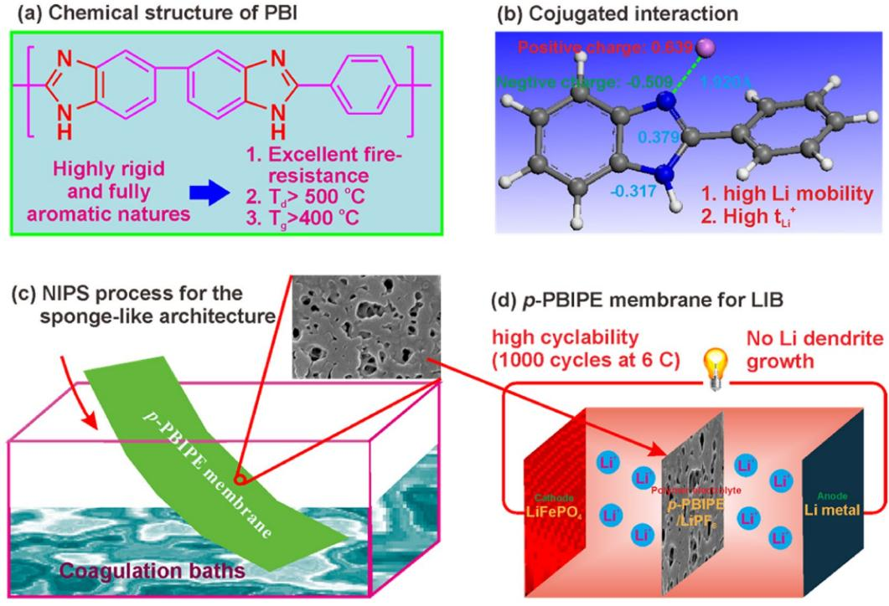
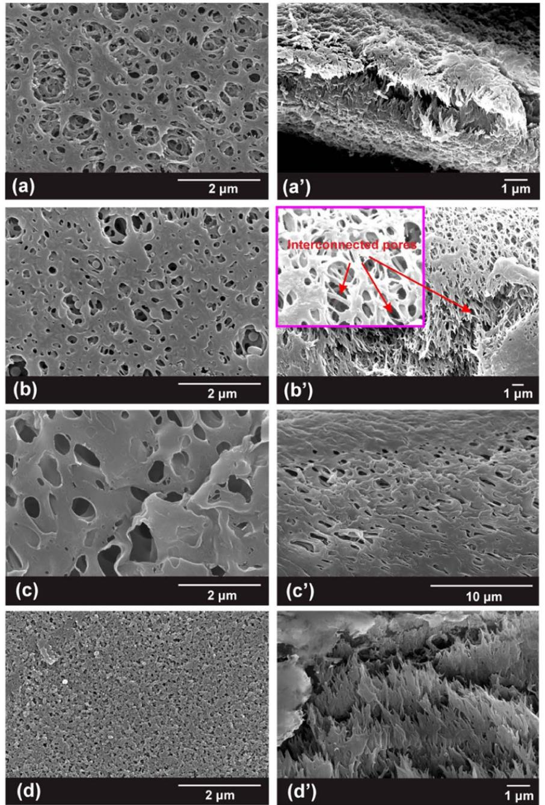
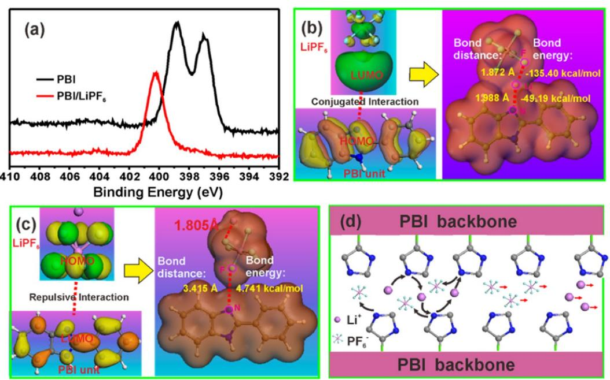
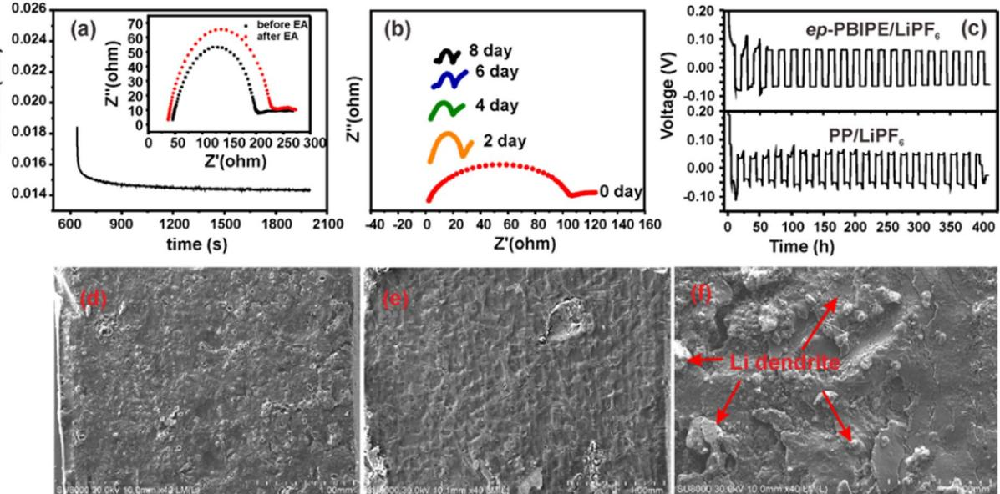
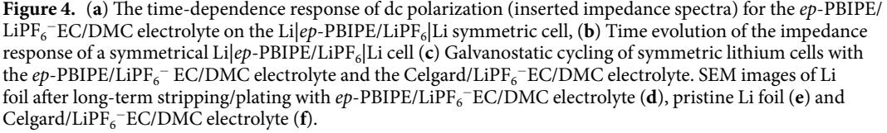
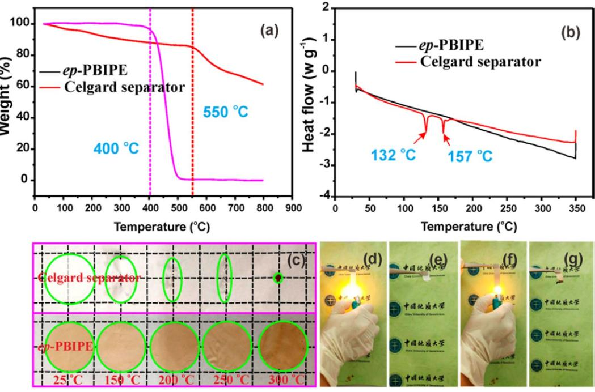
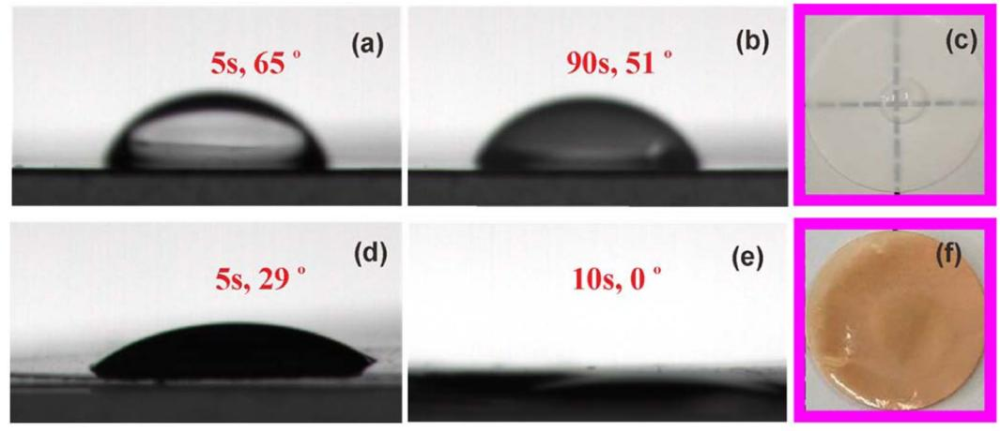
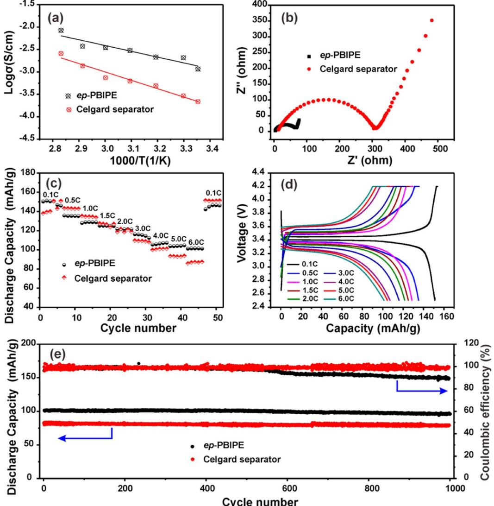
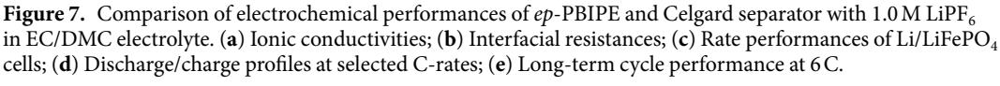
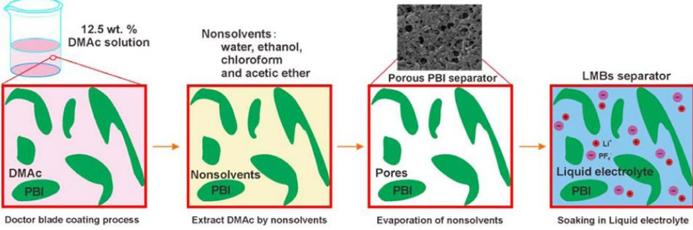

**OPEN**

# **A facile non-solvent induced phase separation process for preparation of highly porous polybenzimidazole separator for lithium metal battery application**

**JiayingWang1, Yang He1, QuanWu1, YunfengZhang1\*, Zhiyuan Li 3, Zhihong Liu2, Shikang Huo1, Jiaming Dong1, Danli Zeng1 & Hansong Cheng1**

**The drawbacks of low porosity, inferior electrolyte wettability, low thermal dimensional stability and permissive lithium dendrite growth of the conventional microporous polyolefn-based separators hinder their widely application in the high power density and safe Lithium ion batteries. Herein, highly porous polybenzimidazole-based separator is prepared by a facile non-solvent induced phase separation process (NIPS) using water, ethanol, chloroform and ethyl acetate as the coagulation bath solvent, respectively. It was found that the ethanol is suitable to fabricate uniform morphology macroporous separator with the porosity of 92%, electrolyte uptake of 594 wt.%, and strong mechanical strength of 15.9MPa. In addition, the experimental tests (electrochemical analysis and XPS test) and density functional theory calculation suggest that the electron-rich imidazole ring of polybenzimidazle can enhance Li+ mobility electrostatic attraction interaction while the block the PF6 − mobility via electrostatic repulsion interaction. Therefore, high Li+ transference number of 0.76 was obtained for the neat polybenzimidazole-based polymer electrolyte. As a proof of concept, the Li/LiFePO4 cell with the polybenzimidazole-based polymer electrolyte/1.0M LiPF6 − ethylene carbonate/dimethyl carbonate (v:v=1:1) electrolyte exhibits excellent rate capability of >100mAh g−1 at 6C (1C=170mAg−1) and superior cycle stability of 1000 cycles.**

Anode materials with higher specifc capacity than the commercialized graphite are currently one of the most challenges for the next-generation battery system[s1](#page-8-0) . Among them, Li metal anode has attracted much attention in the past decade due to its highest specifc capacity (3860 mAh g−1 ) and the lowest potential (−3.04V vs. NHE)[2](#page-8-1) . However, the uncontrolled dendritic and mossy lithium growth leads to short cycle life, low coulombic efciency and even serious safety issues by the internal short circuit[3](#page-8-2) . Numerous eforts have been devoted to increasing Li+ transference number of electrolyte for uniform deposition of lithium to suppress its dendrite growth[4–](#page-8-3)[6](#page-8-4) . Recently, single ion conducting polymer electrolytes with Li+ transference number close to 1.0 have been proved as an efective strateg[y7](#page-8-5)[–12.](#page-8-6) Unfortunately, the high cost of both materials and flm-forming process largely hinder their commercialization. Another approach to increase Li+ transference number is to add a promoter and enhance the Li+ dissociation, such as metal oxides[13,](#page-8-7) ceramics[14](#page-8-8),[15](#page-8-9) or MOF[s16.](#page-8-10) However, the precipitation of promoters from the membrane will lead to irreversible performance los[s17,](#page-8-11)[18.](#page-8-12)

Te high thermal dimensional stability and fre retardancy of separators are of great importance to mitigate fre hazards by avoiding the short circui[t19](#page-8-13)[,20](#page-8-14). Te commercial microporous polyolefn separators, i.e., polyethylene (PE) and polypropylene (PP), sufer from severe thermal dimensional shrinkage at elevated temperatures (100–150 °C)[21.](#page-8-15) In addition, the low porosity (30–40%) largely limits the electrolyte uptake, leading to low ionic

1 Sustainable Energy Laboratory, Faculty of Material Science and Chemistry, China University of Geosciences (Wuhan), 388 Lumo RD, Wuhan, 430074, China. 2School of Environment and Civil Engineering, Dongguan University of Technology, No.1, Daxue Road, Songshan Lake, Dongguan, Guangdong Province, 523808, P. R. China. 3 National Quality Supervision & Inspection Center of Lithium Battery Products (Shandong), Intelligent Manufacturing Town, Fuyuan 3rd Road, National High-tech Zone, Zaozhuang, Shandong, 277800, P. R. China. \*email: [zhangyf329@gmail.com](mailto:zhangyf329@gmail.com)

**Figure 1.** (**a**) Schematic illustration of the composition and advances of PBI, (**b**) conjugated interaction the PBI and Li+, (**c**) fabrication of *p*-PPBIPE membrane, and (**d**) Li/LiFePO4 cell with *p*-PPBIPE membrane.

conductivit[y22–](#page-8-16)[24.](#page-8-17) Moreover, the polyolefn based separators have poor compatibility with the electrolyte due to its hydrophobicity, which hampered fast absorption of large amount of electrolytes for efective ionic mobilit[y25](#page-8-18).

As one of the most popular engineering plastics, the fully aromatic polybenzimidazole (PBI) has intrinsically high thermal stability (thermal decomposition, Td>550 °C). Li *et al*. fabricated the porous PBI-based separator via water vapor induced phase immersion method, the as-prepared membrane possesses the porosity of 81%, and electrolyte uptake of 328%[26.](#page-8-19) Liang and his co-workers performed a blending phase inversion to prepare the micropores of PBI-based membrane via extracting poly(ethylene glycol)−10000 (PEG-10000) from the dry OPBI/PEG blend membranes with wate[r27.](#page-8-20) Te high porosity of 70% and electrolyte uptake of 316% were achieved when the PEG-10000 content was up to 150 wt.%. However, the mechanical property was largely sacrifced and the mechanical strength was decreased to 10MPa, which is about two-thirds of commercial Celgard 2400 separator.

Te lithium ion transference number ( + *tLi*) is one of the most critical parameters of the electrolyte for application in lithium metal batteries by suppressing lithium dendrite growth. Te relationship between the + *tLi* and lithium dendrite growth can be illustrated by using the Equation: τ = π − D( ) *eC* 2*Jt* 0 , where τ is time consume to achieve complete ion depletion, *D* is the ambipolar difusion coefcient, *e* is the electric charge, *C*0 is the initial concentration, *J* is the current density and *t-* is the transference number of anions. It indicates that reduce the t− or increase transference of + *tLi* can increase the deplete time of Li+ and suppress lithium dendrite growth.

In the present, a facile non-solvent induced phase separation process was performed to fabricate highly porous PBI-based membranes by using four diferent non-solvent, water, ethanol, chloroform and ethyl acetate as the coagulation bath solvent, respectively (Fig. [1b\)](#page-1-0). Te results indicate that ethanol induced phase separated porous membrane possesses highest porosity of 92% and electrolyte uptake of 594%, which are almost 3 times and 7 times higher than those of commercial PP separator, respectively. In addition, the porous membrane displays a strong mechanical strength of 15.8MPa, which is even higher than the value of 14.5MPa for commercial PP separator. It is benefcial for both incorporation of more electrolytes and uniform Li stripping/platin[g28](#page-9-0),[29](#page-9-1). In addition, the strong electron-rich feature of imidazole ring favors Li+ dissociation from lithium salt by the strong conjugated interaction (Fig. [1c\)](#page-1-0), enhances Li+ difusion and hence its transference number. Te Li+ transference number of PBI-based polymer electrolytes without any additives is as high as 0.7[630.](#page-9-2) Afer impregnation of 1.0M LiPF6 - EC/DMC (v:v=1:1) into the *p*-PBIPE membrane, the Li/LiFePO4 cell (Fig. [1d\)](#page-1-0) exhibits excellent rate capability and superior cycle stability for over 1000 cycles at 6C. Tese make the PBI-based polymer electrolyte for advanced Li metal batteries with high safety and performance.

### **Results and Discussion**

**Membrane morphology.** To prepare a polymer electrolyte membrane with high porosity and appropriate mechanical strength, four solvents (water, ethanol, ethyl acetate and chloroform) are selected as the coagulation bath for the NIPS process, where the as-prepared membranes are denoted as *wp*-PBIPE, *ep*-PBIPE, *ap*-PBIPE,

**Figure 2.** SEM images of as-prepared *p*-PBIPE membranes. Surfaces: (**a**) *wp*-PBIPE, (**b**) *ep*-PBIPE, (**c**) *ap*-PBIPE, and (**d**) *cp*-PBIPE; cross-section: (a') *wp*-PBIPE, (b') *ep*-PBIPE, (c') *ap*-PBIPE, and (d') *cp*-PBIPE.

and *cp*-PBIPE, respectively. Scanning electron microscopy (SEM) images of the four membranes are shown in Fig. [2](#page-2-0), and the key parameters, such as porosity, electrolyte uptake and mechanical strength, are listed in Table [1.](#page-3-0) Te *wp*-PBIPE (Fig. [2a and a'](#page-2-0)) and *ep*-PBIPE (Fig. [2b and b'](#page-2-0)) membranes display more favorable pore architectures than that of the *ap*-PBIPE (Fig. [2c and c'\)](#page-2-0) and *cp*-PBIPE (Fig. [2d and d'\)](#page-2-0) membranes. Simultaneously, the *wp*-PBIPE and *ep*-PBIPE show much higher porosities and more electrolyte uptake than those of the *ap*-PBIPE and *cp*-PBIPE (Table [1\)](#page-3-0). Te *ap*-PBIPE exhibits the highest mechanical strength of 23.5MPa, while the high toxicity as well as high cost of the ethyl acetate hinders its large-scale application. In addition, the non-uniform pore architecture gives rise to detrimental efect on the battery performances[31.](#page-9-3) In particular, the *ep*-PBIPE exhibits high porosity and appropriate mechanical strength of 15.9MPa, higher than mechanical strength of 14.5MPa in the transverse direction for the commercial Celgard separator[32,](#page-9-4)[33,](#page-9-5) which is greatly benefcial for improving battery cycle stability[34](#page-9-6),[35](#page-9-7). Furthermore, the *ep*-PBIPE displays uniform and interconnected pore structure, indicating the smooth Li+ difusion, which is similar to the commercial Celgard separator (Fig. S1). Besides, the low cost and low toxicity of the ethanol coagulation bath makes the *ep*-PBIPE promising for large-scale application.

| Properties        | Tickness (μm) | Porosity(%) | Electrolyte uptake (%) | Mechanical strength (MPa) | Elongation (%) |
|-------------------|------------------|-------------|---------------------------|------------------------------|-------------------|
| wp-PBIPE          | 29               | 87          | 614                       | 2.3                          | 4.5               |
| ep-PBIPE          | 33               | 92          | 594                       | 15.9                         | 7.6               |
| ap-PBIPE          | 31               | 85          | 521                       | 23.5                         | 13.0              |
| cp-PBIPE          | 34               | 82          | 507                       | 8.4                          | 3.1               |
| Celgard separator | 23               | 31          | 80                        | 14.5                         | 824.9             |

**Table 1.** Tabulated properties of the porosity, electrolyte uptake, and mechanical strength of the as-prepared *p*-PBIPE membranes.

**Figure 3.** (**a**) XPS spectra of N1s of the neat PBI membrane and the PBI immersed in 1.0M LiPF6 -EC/DMC (v:v=1:1); (**b**) Te calculated electrostatic potential of LiPF6, PBI unit and PBI unit/LiPF6 to illustrate the conjugated interaction between Li+ and electron-rich imidazole ring; (**c**) Te repulsive interaction between PF6 − and electron-rich imidazole ring; (**d**) Schematic illustration of the electron-rich imidazole ring for promoting the Li+ mobile and restricting PF6 - mobile.

**Conjugated interaction.** Te strong interaction between Li+ and electron-rich imidazole ring to promote Li+ difusion are proved by X-ray photoelectron spectroscopy (XPS) and density functional theory (DFT) calculations. As depicted in Fig. [3a](#page-3-1), two peaks are observed at around 398.7eV and 397.1 eV for the neat PBI membrane, corresponding to the –N=(*sp*2 hybrid N atom) and –NH– (*sp*3 hybrid N atom) of the imidazole ring, respectively. However, one peak disappears afer immersing the PBI membrane into 1.0M LiPF6 in EC/DMC (v:v=1:1) electrolyte and another peak shifs to 400.3 eV, indicating that the strong interaction forms between LiPF6 and PBI backbone.

As illustrated in Fig. [3b](#page-3-1) and Table S1, DFT calculations indicate that the highest occupied molecular orbital (HOMO) of the electron-rich imidazole ring in PBI can matches well with the lowest unoccupied molecular orbital (LUMO) of the Li+ in LiPF6 to form N–Li conjugated bond with the bonding distance of 1.988Å and bonding energy of −49.194 kcal mol−1 . By contrast, the electron-rich imidazole ring shows repulsive interaction to PF6 with long bonding distance of 3.415Å and bonding energy of 4.741 kcal mol−1 (Figs. [3c](#page-3-1) and S2). Te formed conjugated bond contributes to the Li+ dissociation from PF6 −, serving as another Li+ pathway in *ep*-PBIPE membrane while the movement of PF6 - is restricted (Fig. [3d\)](#page-3-1).

**Li+ transference number, Li stripping/plating performance and morphology of Li metal anode.** The Li ion transference number of *ep*-PBIPE/LiPF6 was measured by a steady-state current method on the Li|electrolyte|Li symmetric cell asseblied with the *ep*-PBIPE/LiPF6 and PP-LiPF6 −EC/DMC electrolyte at room temperature, the impedance spectra and the time-dependence response upon DC polarization are displayed in Fig. [4a](#page-4-0). It shows that the Li ion transference number of *ep*-PBIPE/LiPF6 electrolyte consequently increases from 0.23 (Fig. S3) for the Celgard/LiPF6 electrolyte up to 0.76, which is benefcial to improve the stability of Li stripping/plating, in particular, to suppress lithium dendrite growt[h36.](#page-9-8) Te time-dependent interface stability between the *ep*-PBIPE/LiPF6 electrolyte and Li metal based on impedance measurements of a Li|*ep*-PBIPE/LiPF6|Li cell

is depicted in Fig. [4b](#page-4-0). It depicts that the resistance becomes constant afer 4 day, demonstrating a stable interface between the Li and *ep*-PBIPE.

Te stripping/plating performance of metallic lithium anodes was determined by the galvanostatic Li stripping/plating cycling test and the results are shown in Fig. [4c](#page-4-0). Li/Li symmetric cell at 0.5 mAcm−2 with the *ep*-PBIPE/LiPF6 electrolyte exhibits a stable voltage profle, which is consistant with the previously reported anion-anchoring single ion conducting polymer electrolytes[37](#page-9-9)–[39](#page-9-10). In contrast, Li/Li symmetric cell with the Celgard/LiPF6 electrolyte shows fuctuating voltage profle with increasing voltage hysteresis, stemming from the depletion of cations at the Li/electrolyte interfac[e40](#page-9-11)[,41.](#page-9-12) Figure [4d–f](#page-4-0) shows the SEM images of Li foil with ep-PBIPE/ LiPF6 electrolyte and Celgard/LiPF6 electrolyte afer long cycles of stripping/plating. Te top surface of Li electrode with *ep*-PBIPE/LiPF6 electrolyte is relatively uniform (Fig. [4d\)](#page-4-0), without an overgrowth of dendrites, which is similar with the neat Li foil (Fig. [4e](#page-4-0)). In contrast, the Li foil in Celgard/LiPF6 electrolyte exhibits a mossy, dendritic deposition (Fig. [4f](#page-4-0)).

**Thermal stability and fre- retardancy.** It is known that good thermal stabilities, including high thermal decomposition temperature and good dimensional stability are key parameters for battery separators, playing a vital role in preventing the thermal runaway when commercial batteries overheat caused by overcharge, overdischarge, internal and external short circuit or accident[s42–](#page-9-13)[44](#page-9-14). Termo-gravimetric (TG) analysis is employed to investigate the thermal stability of the Celgard separator and *ep*-PBIPE. As shown in Fig. [5a,](#page-5-0) the thermal decomposition temperatures reach up to 400°C and 550°C, respectively, for the Celgard separator and *ep*-PBIPE, which are much higher than the required temperature of 80°C. However, diferential scanning calorimeter (DSC) analysis in Fig. [5b](#page-5-0) reveals that the Celgard separator possesses sofen point and melting point at 132°C and 157°C, respectively, representing the poor thermal dimensional stability (Fig. [5c](#page-5-0)). In contrast, no endothermic peak is observed for the *ep*-PBIPE even at high temperature of 350 °C, which is consistent with the high thermal dimensional stability without any shrinkage at 300°C. Moreover, the fre-retardancy tests indicate that the *ep*-PBIPE is nonfammable and exhibit intriguing fre-retarding properties, benefting from the intrinsic fame-retardancy of PBI (Fig. [5d–g](#page-5-0)).

**Wettability.** Figure [6a–f](#page-5-1) shows the electrolyte wettability of the Celgard separator and *ep*-PBIPE determined by the contact angle measurements. Te Celgard separator displays a slow electrolyte wetting with high contact angle of 51° afer 90 s (Fig. [6a–c](#page-5-1)). Te poor electrolyte wetting is caused by the nonpolar nature of the polyolefn polymer, originated from an intrinsically hydrophobic property and low surface energy[45](#page-9-15),[46](#page-9-16). In contrast, the electrolyte completely penetrates into the *ep*-PBIPE within 10 s (Fig. [6d–f\)](#page-5-1). Besides the rather diferent pore structures, the fast electrolyte wetting of the *ep*-PBIPE is attributed to its highly polar imidazole ring. Accordingly, the superior electrolyte wetting leads to good electrolyte interfacial contact and small interfacial resistance[26](#page-8-19),[47](#page-9-17).

**Electrochemical performance.** Te high ionic conductivity and good electrode compatibility of polymer electrolytes are crucial for the power density of LIBs. Te temperature dependence of ionic conductivity of

**Figure 5.** (**a**) TG curves and (**b**) DSC curves of Celgard and *ep*-PBIPE membranes, (**c**) Termal shrinkage images of Celgard separator and *ep*-PBIPE membrane. Fire-resistance test of Celgard, before (**d**) and afer (**e**) burning, and *ep*-PBIPE membrane, before (**f**) and afer (**g**) burning.

**Figure 6.** Contact angles of 1.0M LiPF6 in EC/DMC liquid electrolyte on Celgard separator afer (**a**) 5 s, (**b**) 90 s, and (**c**) the photo afer 60 s, and contact angles of 1.0M LiPF6 in EC/DMC electrolyte on *ep*-PBIPE membrane afer (**d**) 5 s, (**e**) 10 s, and (**f**) the image afer 60 s wetting.

the *ep*-PBIPE membrane and Celgard separator, soaking with 1.0M LiPF6 -EC/DMC, is depicted in Fig. [7a](#page-6-0). Te ionic conductivity of the *ep*-PBIPE/1.0M LiPF6 -EC/DMC is 1.16 mS cm−1 , which is much higher than that of Celgard/1.0M LiPF6 -EC/DMC (0.44mS cm−1 ). Figure [7b](#page-6-0) shows the Nyquist plots of symmetric cells with two electrolytes. Favored by high porosity to absorb more electrolytes, the assembled cell with *ep*-PBIPE membrane exhibits reduced interfacial resistance.

Te electrochemical performances with the *ep*-PBIPE/1.0M LiPF6 -EC/DMC and Celgard/1.0M LiPF6-EC/ DMC electrolytes are evaluated in Li/LiFePO4 cells. As depicted in Fig. [7c,](#page-6-0) Li/LiFePO4 cell with the *ep*-PBIPE membrane demonstrates reversible discharge capacity of 151 mAh g−1 at 0.1C, close to the theoretical capacity (LiFePO4, 170 mAh g−1 ). Even at high current density of 6C, it still maintains high discharge capacity of >100 mAh g−1 (Fig. [7d](#page-6-0)), which is much higher than that of 87 mAh g−1 for the cell with Celgard separator. Te cycling performances with two electrolytes at 6C are shown in Fig. [7e](#page-6-0). Te Li/LiFePO4 cell with the *ep*-PBIPE-based electrolyte delivers an initial discharge capacity of 101 mAh g−1 , higher than that of 83 mAh g−1 for the Celgard-based electrolyte, and the capacity retention is 92.1% afer 1000 cycles, corresponding to a

capacity loss of 0.0079% per cycle, which is attributed to excellent electrochemical stability (Fig. S4). Furthermore, we found that the coulombic efciency of *ep*-PBIPE-based separator is much lower than that of Celgard separator afer ~600 cycles. As we know that when the coulombic efciency reaches below 95%, it suggests the failure of the lithium metal battery. Terefore, the stable cycling might be achieved by overwhelm usage of lithium metal rather than the merits of the separator. Tese results suggest that the *ep*-PBIPE membrane exhibits high potential application in high-density and safe Li metal batteries.

In conclusion, a series of PBI-based polymer electrolytes (*p*-PBIPEs) were successfully fabricated via a facile non-solvent induced phase separation process. Te results indicate that ethanol is the best coagulation bath for highly porous *p*-PBIPE (*ep*-PBIPE) membrane with well-interconnected sponge-like pore structure and appropriate mechanical strength. In particular, the strong conjugated interaction between Li+ and electron-rich imidazole ring is greatly favorable for improving the Li+ dissociation and migration, subsequently increasing Li+ transference number up to 0.76, and can efectively suppress the lithium dendrites growth. Tis enables stable Li stripping/plating for more than 400 h. In addition, the highly rigid and fully aromatic PBI backbone results in high thermal stability of *ep*-PBIPE membrane even at 300°C, and the high polarity of imidazole ring and high porosity guarantees fast electrolyte wetting within 10 s. Te Li/LiFePO4 battery with the *ep*-PBIPE membrane exhibits excellent rate performance of >100mAh g−1 at 6C and outstanding electrochemical stability for 1000 cycles.

#### **Experimental Section**

**Materials.** Polybenzimidazoles (PBI) was purchased from Suzhou Pinyu Optoelectronics Technology Co., Ltd. Lithium iron phosphate (LiFePO4), PVDF, and conductive agent (Acetylene Black) were purchased from Shanghai Darui Fine Chemical Co., Ltd., and used as received. N,Ndimethylacetamide (DMAC, AR, Aladdin)

**Figure 8.** Te illustration of the NIPS process for preparation of the porous PBI separator.

and N-Methyl-2-pyrrolidone (NMP, Anhydrous grade, 99.5%, Aladdin) were used as received. PP membrane (Celgard 2400) was cut into 19mm flm for use.

**Fabrication of p-PBIPE membranes.** Te non-solvent induced phase separation process was conducted according to our previous publicatio[n45](#page-9-15). To investigate the efect of diferent coagulation bath solvents on the properties of the membranes, the four solvents with diferent polarity, water, ethanol, ethyl acetate and chloroform, were selected as solvents. As illustrated in Fig. [8](#page-7-0), the calculated amount of PBI was frst dissolved in N, N-dimethylacetamide (DMAc) to prepare a 12.5wt% uniform casting solution. Aferward, the homogenous solution was cast onto a clean glass plate to prepare a flm with average thickness of 35 µm. Te flm was quickly immersed in the mentioned four coagulation baths for 0.5 h to exchange DMAc solvent. Finally, the formed *p*-PBIPEs were dried at room temperature for 12h followed by at 100 °C for 24h in a vacuum oven.

**Preparation of LiFePO4 electrode and battery assembly.** Te LiFePO4 cathode consisting of a mixture of LiFePO4 active material, acetylene black (AB) and binder of PVDF at a mass ratio of 7:2:1 was prepared by the following steps. PVDF binder was frstly dissolved in NMP, and the well-mixed mixture was then added into the above solution and stirred for at least 4 h to form homogeneous slurry. Afer that, the slurry was cast on an aluminum foil, dried at 60 °C for 12h, and cut into 15mm discs for use as the cathode of a coin cell and the mass loading of the cathode is approximately 4 mg cm−2 . Finally, the as-prepared cathode flm was completely dried at 80 °C in a vacuum oven overnight and then transferred into an argon-flled glove box for further characterization. Te Li/LiFePO4 half-cells were assembled with *p*-PBIPE membrane and Celgard as separators and 1.0M LiPF6 -EC/DMC (v/v=1:1) as electrolyte.

**Characterization.** Te morphology of the membranes was studied using a scanning electron microscope (FE-SEM, SU8010, HITACHI). Samples must be sprayed with gold for 100 s before testing. Te interaction between *p*-PBIPEs membrane and LiFP6 was analyzed by the X-ray photoelectron spectroscopy (XPS, Escalab 250xi, Termo Fisher) and the testing samples were the *p*-PBIPEs membranes before and afer immersed in 1M LiPF6/EC/DMC (v:v=1:1). Te tensile strength and elongation tests of membranes were indicated using a tensile tester XLW (PC) at a strain rate of 25 mm/min. Te thermal stability of membranes was characterized thermogravimetric analyzer (STA 449 F3, Germany NETZSCH) under an atmosphere of nitrogen with temperature range of from 30 to 800 °C at a rate of 10 °C min−1 . Te endothermic and exothermic behaviors were investigated using Diferential Scanning Calorimetry (METTLER TOLEDO DSC3) under nitrogen fow from 30 to 350 °C. Te wettability of membranes with electrolyte was conducted by static contact angle and electrolyte spreading test. Te thermal shrinkage test was performed by putting the membranes in a heating plate at various temperatures (150, 200, 250 and 300 °C), for 0.5 h at each temperature. Te electrochemical stability was measured by the cyclic voltammetry (CV) with the membrane was sandwiched by a lithium electrode and a stainless steel (SS) electrode. Te voltage was swept at the scan rate of 0.5mVs−1 from −1.0V to 5.0V (vs. Li/Li+).

Te electrolyte uptake of the membrane was measured by immersing the membrane in a liquid electrolyte (1M LiPF6 in EC / DMC, 1:1v/v) for 24h for achieving complete soakage. Te weights of dry membrane (M0) and wet membrane (M1) were obtained by accurately weighing the mass before and afer the membrane soakage. Te electrolyte uptake was calculated by the following Eq. [\(1](#page-7-1)):

$$
Solution \tuptake = \frac{M_1 + M_0}{M_0} \times 100\% \tag{1}
$$

Te process for determination of porosity (P) of the membrane is as follows. Te dry membrane was immersed in n-butanol for 24 h for soaking the solvent in pore. Te weight of the dry membrane and wet membrane were measured, respectively, and then the porosity was calculated according to the following Eq. [\(2\)](#page-7-2):

$$
P\% = \frac{W_w - W_d}{\rho b \ * \ V_m} \times 100\%
$$
\n(2)

where Wd is the dry weight of membrane, Ww is the wet weight of membrane, ρb is the density of n-butanol and Vm is the volume of the membrane.

Te ionic conductivity (σ) of polymer electrolytes was tested using electrochemical impedance spectroscopy (EIS) by sandwiching the electrolyte-soaked membrane between two stainless steel (SS) electrodes. Te impedance data was recorded over a frequency range from 106Hz to 1Hz and the oscillating voltage of 5mV. Te ionic conductivity (σ) was calculated by the following Eq. ([3](#page-8-21)):

$$
\sigma = \frac{l}{RA} \tag{3}
$$

where l and A are the thickness and efective area of a membrane, respectively. And R is the impedance (Ω) of the membrane measured by EIS.

Te lithium ion transference number (t+) was measured by sandwiching the membrane between two lithium electrodes. Te lithium ion transference number (t+) was calculated by the following Eq. [\(4\)](#page-8-22):

$$
t^{+} = \frac{I_{s}(\Delta V - I_{0}R_{0})}{I_{0}(\Delta V - I_{s}R_{s})}
$$
\n(4)

where ΔV is the set polarization voltage, I0 and IS are the initial and steady-state currents, and R0 and RS are the initial and steady-state resistances of the passivating layers on the Li electrode.

Received: 15 August 2019; Accepted: 23 November 2019;

Published: xx xx xxxx

#### **References**

- 1. Li, M., Lu, J., Chen, Z. & Amine, K. 30 Years of Lithium-Ion Batteries. *Adv Mater*, e1800561 (2018).
- 2. Li, C. *et al*. Single-Ion Conducting Electrolyte Based on Electrospun Nanofbers for High-Performance Lithium Batteries *Advanced Energy*. *Materials* **9**, 1970029 (2019).
- 3. Zhu, M. *et al*. A Biobased Composite Gel Polymer Electrolyte with Functions of Lithium Dendrites Suppressing and Manganese Ions Trapping. *Advanced Energy*. *Materials* **8**, 1702561 (2018).
- 4. Duan, H. *et al*. Dendrite-Free Li-Metal Battery Enabled by a Tin Asymmetric Solid Electrolyte with Engineered Layers. *J Am Chem Soc* **140**, 82–85 (2018).
- 5. Deng, K. *et al*. Efective Suppression of Lithium Dendrite Growth Using a Flexible Single-Ion Conducting Polymer Electrolyte. *Small*, e1801420 (2018).
- 6. Khan, M. A. *et al*. Recent Progresses in Electrocatalysts for Water Electrolysis. *Electrochemical Energy Reviews* **1**, 483–530 (2018).
- 7. Porcarelli, L. *et al*. Single-Ion Conducting Polymer Electrolytes for Lithium Metal Polymer Batteries that Operate at Ambient Temperature. *ACS Energy Letters* **1**, 678–682 (2016).
- 8. Zhang, Y. *et al*. A gel single ion polymer electrolyte membrane for lithium-ion batteries with wide-temperature range operability. *RSC Adv.* **4**, 21163–21170 (2014).
- 9. Xu, R. *et al*. Dual-Phase Single-Ion Pathway Interfaces for Robust Lithium Metal in Working Batteries. *Advanced Materials* **31**, 1808392 (2019).
- 10. Zhao, C.-Z. *et al*. An anion-immobilized composite electrolyte for dendrite-free lithium metal anodes. *Proceedings of the National Academy of Sciences* **114**, 11069–11074 (2017).
- 11. Tu, Z. *et al*. Designing Artifcial Solid-Electrolyte Interphases for Single-Ion and High-Efciency Transport in. *Batteries. Joule* **1**, 394–406 (2017).
- 12. Zhao, C.-Z. *et al*. An ion redistributor for dendrite-free lithium metal anodes. *Science Advances* **4**, eaat3446 (2018).
- 13. Liang, X., Yang, Y., Jin, X., Huang, Z. & Kang, F. Te high performances of SiO 2 /Al 2 O 3 -coated electrospun polyimide fbrous separator for lithium-ion battery. *Journal of Membrane Science* **493**, 1–7 (2015).
- 14. Shi, C. *et al*. A high-temperature stable ceramic-coated separator prepared with polyimide binder/Al 2 O 3 particles for lithium-ion batteries. *Journal of Membrane Science* **517**, 91–99 (2016).
- 15. Wang, Y., Wang, S., Fang, J., Ding, L.-X. & Wang, H. A nano-silica modifed polyimide nanofber separator with enhanced thermal and wetting properties for high safety lithium-ion batteries. *Journal of Membrane Science* **537**, 248–254 (2017).
- 16. Lin, Z., Guo, X. & Yu, H. Amorphous modifed silyl-terminated 3D polymer electrolyte for high-performance lithium metal battery. *Nano Energy* **41**, 646–653 (2017).
- 17. Chen, G., Zhang, F., Zhou, Z., Li, J. & Tang, Y. A Flexible Dual-Ion Battery Based on PVDF-HFP-Modifed Gel Polymer Electrolyte with Excellent Cycling Performance and Superior Rate Capability. *Advanced Energy*. *Materials* **8**, 1801219 (2018).
- 18. Zhang, Y. *et al*. Highly porous single-ion conductive composite polymer electrolyte for high performance Li-ion batteries. *Journal of Power Sources* **397**, 79–86 (2018).
- 19. Li, D. *et al*. A low cost shutdown sandwich-like composite membrane with superior thermo-stability for lithium-ion battery. *Journal of Membrane Science* **542**, 1–7 (2017).
- 20. Liu, Y. *et al*. A mechanically robust porous single ion conducting electrolyte membrane fabricated via self-assembly. *Journal of Membrane Science* **507**, 99–106 (2016).
- 21. Love, C. T. Termomechanical analysis and durability of commercial micro-porous polymer Li-ion battery separators. *Journal of Power Sources* **196**, 2905–2912 (2011).
- 22. Woods, J., Bhattarai, N., Chapagain, P., Yang, Y. & Neupane, S. *In situ* transmission electron microscopy observations of rechargeable lithium ion batteries. *Nano Energy* **56**, 619–640 (2019).
- 23. Zhang, Y. *et al*. Lithium-Ion Batteries with a Wide Temperature Range Operability Enabled by Highly Conductive sp3Boron-Based Single Ion Polymer Electrolytes. *Energy Technology* **2**, 643–650 (2014).
- 24. Zhang, Y. *et al*. Design and synthesis of a single ion conducting block copolymer electrolyte with multifunctionality for lithium ion batteries. *RSC Adv.* **4**, 43857–43864 (2014).
- 25. Lv, P. *et al*. Robust Succinonitrile-Based Gel Polymer Electrolyte for Lithium-Ion Batteries Withstanding Mechanical Folding and High Temperature. *ACS Appl Mater Interfaces* **10**, 25384–25392 (2018).
- 26. Li, D. *et al*. Superior Termally Stable and Nonfammable Porous Polybenzimidazole Membrane with High Wettability for High-Power Lithium-Ion Batteries. *ACS Applied Materials & Interfaces* **9**, 8742–8750 (2017).
- 27. Liang, N., Fang, J. & Guo, X. A simple approach for preparation of porous polybenzimidazole membranes as a promising separator for lithium ion batteries. *Journal of Materials Chemistry A* **5**, 15087–15095 (2017).
- 28. Zhang, Y. *et al*. Infuence of chemical microstructure of single-ion polymeric electrolyte membranes on performance of lithium-ion batteries. *ACS Appl Mater Interfaces* **6**, 17534–42 (2014).
- 29. Jana, A. & García, R. E. Lithium dendrite growth mechanisms in liquid electrolytes. *Nano Energy* **41**, 552–565 (2017).
- 30. Gerbaldi, C. *et al*. Innovative high performing metal organic framework (MOF)-laden nanocomposite polymer electrolytes for allsolid-state lithium batteries. *Journal of Materials Chemistry A* **2**, 9948–9954 (2014).
- 31. Zhang, Y. *et al*. Toward ambient temperature operation with all-solid-state lithium metal batteries with a sp 3 boron-based solid single ion conducting polymer electrolyte. *Journal of Power Sources* **306**, 152–161 (2016).
- 32. Chen, Y. *et al*. A dual-layer micro/nanostructured fbrous membrane with enhanced ionic conductivity for lithium-ion battery. *Electrochimica Acta* **292**, 357–363 (2018).
- 33. Zhai, Y., Xiao, K., Yu, J., Yang, J. & Ding, B. Termostable and nonfammable silica–polyetherimide–polyurethane nanofbrous separators for high power lithium ion batteries. *Journal of Materials Chemistry A* **3**, 10551–10558 (2015).
- 34. Xue, Z. M., Ding, J., Zhou, W. & Chen, C. H. Density functional theory study on LBDOB and its derivatives: Electronic structures, energies, and molecular properties. *Electrochimica Acta* **55**, 3838–3844 (2010).
- 35. Lever, A. B. P. Electronic characteristics of an extensive series of ruthenium complexes with the non-innocent o-benzoquinonediimine ligand: A pedagogical approach. *Coordination Chemistry Reviews* **254**, 1397–1405 (2010).
- 36. Miao, R. *et al*. A new ether-based electrolyte for dendrite-free lithium-metal based rechargeable batteries. *Sci Rep* **6**, 21771 (2016).
- 37. Xu, D. *et al*. High-Strength Internal Cross-Linking Bacterial Cellulose-Network-Based Gel Polymer Electrolyte for Dendrite-Suppressing and High-Rate Lithium Batteries. *ACS Appl Mater Interfaces* **10**, 17809–17819 (2018).
- 38. Zahn, R., Lagadec, M. F., Hess, M. & Wood, V. Improving Ionic Conductivity and Lithium-Ion Transference Number in Lithium-Ion Battery Separators. *ACS Applied Materials & Interfaces* **8**, 32637–32642 (2016).
- 39. Zhang, Y. *et al*. A class of sp3 boron-based single-ion polymeric electrolytes for lithium ion batteries. *RSC Advances* **3**, 14934 (2013).
- 40. Wan, G. *et al*. Suppression of Dendritic Lithium Growth by *in Situ* Formation of a Chemically Stable and Mechanically Strong Solid Electrolyte Interphase. *ACS Appl Mater Interfaces* **10**, 593–601 (2018).
- 41. Zhang, H. *et al*. Recent progress in advanced electrode materials, separators and electrolytes for lithium batteries. *Journal of Materials Chemistry A* **6**, 20564–20620 (2018).
- 42. Li, D., Shi, D., Feng, K., Li, X. & Zhang, H. Poly (ether ether ketone) (PEEK) porous membranes with super high thermal stability and high rate capability for lithium-ion batteries. *Journal of Membrane Science* **530**, 125–131 (2017).
- 43. Shi, C. *et al*. Functional separator consisted of polyimide nonwoven fabrics and polyethylene coating layer for lithium-ion batteries. *Journal of Power Sources* **298**, 158–165 (2015).
- 44. Shayapat, J., Chung, O. H. & Park, J. S. Electrospun polyimide-composite separator for lithium-ion batteries. *Electrochimica Acta* **170**, 110–121 (2015).
- 45. Dong, J. *et al*. Highly porous single ion conducting polymer electrolyte for advanced lithium-ion batteries via facile water-induced phase separation process. *Journal of Membrane Science* **568**, 22–29 (2018).
- 46. Li, D., Zhang, H. & Li, X. Porous polyetherimide membranes with tunable morphology for lithium-ion battery. *Journal of Membrane Science* **565**, 42–49 (2018).
- 47. Ma, Q. *et al*. Single Lithium-Ion Conducting Polymer Electrolytes Based on a Super-Delocalized Polyanion. *Angew Chem Int Ed Engl* **55**, 2521–5 (2016).

# **Acknowledgements**

Te authors gratefully acknowledge support of the National Natural Science Foundation of China (Nos 21603197 and 51872127), National Key R&D Program of China (2018YFB15029), Natural Science Foundation of Hubei Province (No. 2016CFB181), Fundamental Research Funds for the Central University, China University of Geosciences, Wuhan (No. CUGL180403) and China University of Geosciences (Wuhan) for the program of Center for Advanced Energy Research and Technologies.

# **Author contributions**

J.W., Y.Z., D.Z. and H.C. conceived and designed this work; J.W. performed the experiments; Y.H., Q.W., Z.L., Z.L., S.H. and J.D. provided some help with experimental testing. J.W. and Y.Z. prepared this manuscript; all authors read and fnalized the fnal manuscript.

# **Competing interests**

Te authors declare no competing interests.

# **Additional information**

**Supplementary information** is available for this paper at<https://doi.org/10.1038/s41598-019-55865-6>.

**Correspondence** and requests for materials should be addressed to Y.Z.

**Reprints and permissions information** is available at [www.nature.com/reprints.](http://www.nature.com/reprints)

**Publisher's note** Springer Nature remains neutral with regard to jurisdictional claims in published maps and institutional afliations.

**Open Access** This article is licensed under a Creative Commons Attribution 4.0 International License, which permits use, sharing, adaptation, distribution and reproduction in any medium or format, as long as you give appropriate credit to the original author(s) and the source, provide a link to the Creative Commons license, and indicate if changes were made. Te images or other third party material in this article are included in the article's Creative Commons license, unless indicated otherwise in a credit line to the material. If material is not included in the article's Creative Commons license and your intended use is not permitted by statutory regulation or exceeds the permitted use, you will need to obtain permission directly from the copyright holder. To view a copy of this license, visit [http://creativecommons.org/licenses/by/4.0/.](http://creativecommons.org/licenses/by/4.0/)

© Te Author(s) 2019