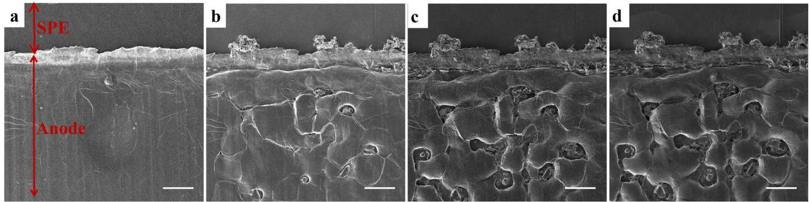
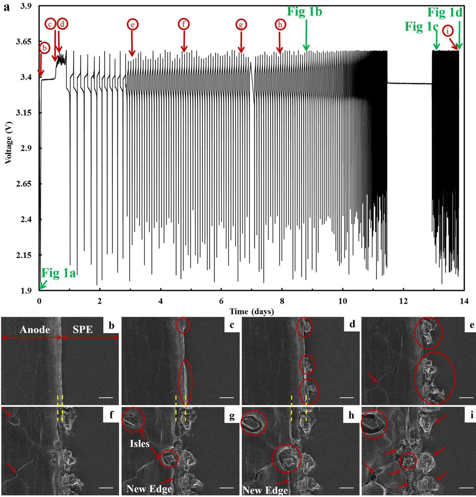
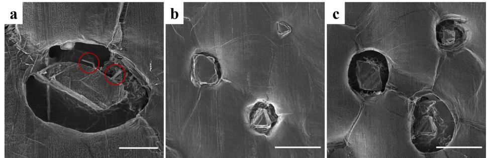
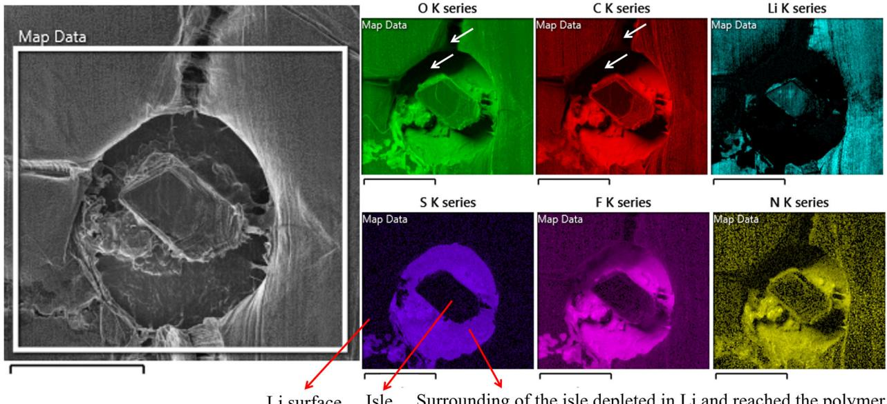
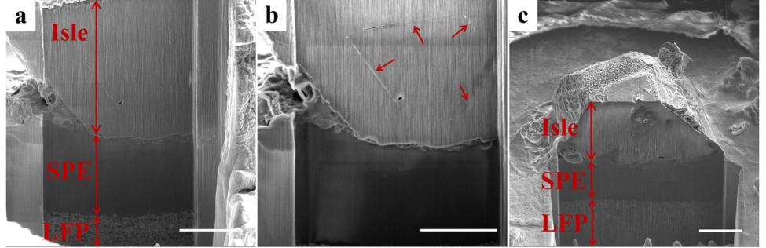
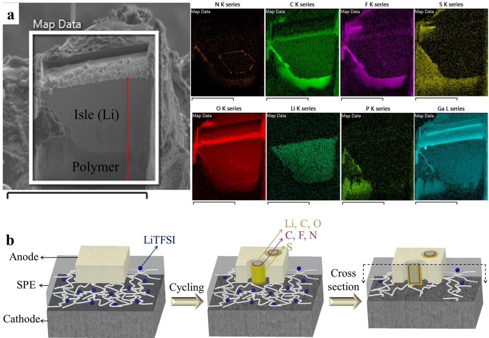
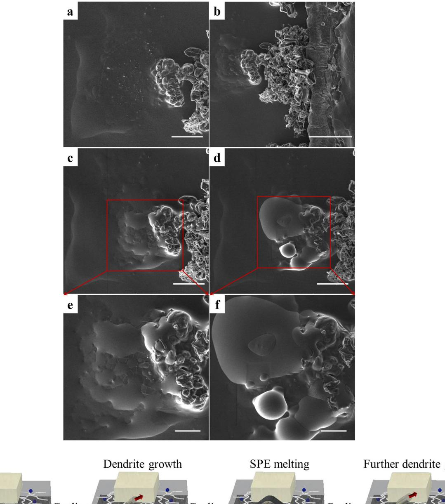
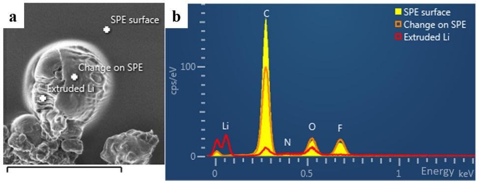

ARTICLE

https://doi.org/10.1038/s42004-019-0234-0 **OPEN**

# In situ observation of solid electrolyte interphase evolution in a lithium metal battery

Maryam Golozar1,2, Andrea Paolella1 \*, Hendrix Demers1 , Stéphanie Bessette2, Marin Lagacé1 , Patrick Bouchard1 , Abdelbast Guerfi1 , Raynald Gauvin2 & Karim Zaghib1 \*

Lithium metal is a favorable anode material in all-solid Li-polymer batteries because of its high energy density. However, dendrite formation on lithium metal causes safety concerns. Here we obtain images of the Li-metal anode surface during cycling using in situ scanning electron microscopy. Constructing videos from the images enables us to monitor the failure mechanism of the battery. Our results show the formation of dendrites on the edge of the anode and isles of decomposed lithium bis(trifluoromethanesulfonyl)imide on the grain boundaries. Cycling at high rates results in the opening of the grain boundaries and depletion of lithium in the vicinity of the isles. We also observe changes in the surface morphology of the polymer close to the anode edge. Extrusion of lithium from these regions could be evidence of polymer reduction due to a local increase in temperature and thermal runaway assisting in dendrite formation.

1 Center of Excellence in Transportation Electrification and Energy Storage, Hydro-Québec, Varennes, QC J0L 1N0, Canada. 2Department of Mining and Materials Engineering, McGill University, Montréal, QC H3A 0C5, Canada. \*email: [paolella.andrea2@hydro.qc.ca;](mailto:paolella.andrea2@hydro.qc.ca) [zaghib.karim@hydro.qc.ca](mailto:zaghib.karim@hydro.qc.ca)

L ithium metal anode has a high capacity of 3860 mAh/g, which makes it a good candidate for use in Li-ion batteries[1.](#page-7-0) However, dendrite formation on lithium metal poses a safety issue due to the possibility of short circuit and explosion, especially when in contact with flammable liquid electrolytes[2](#page-7-0)–[4.](#page-7-0) Allsolid Li-polymer batteries are safer choices since polymers are not flammable, in contrast to liquid electrolytes, and can add mechanical strength to the battery[5](#page-7-0). The most common electrolytes used in these batteries are poly (ethylene oxide) Polyetherbased polymers owing to their low glass transition temperature, dissolution of lithium salt, and high ionic conductivity at temperatures above 70 °C[5](#page-7-0)–[7.](#page-7-0) The main conductive salt that is used in polymer electrolytes is lithium bis(trifluoromethanesulfonyl) imide (Li[N(SO2CF3)2], LiTFSI)[8,9](#page-7-0). Even though all-solid Li-metal polymer batteries are great replacements for batteries with liquid electrolytes, further investigation of higher charging rate cycling should be conducted, as this can cause the formation of dendrites that can perforate through this medium due to their carbide nature[10](#page-7-0).

In this work, we investigate the failure mechanism of an allsolid Li-metal polymer battery following the evolution of a solid electrolyte interphase (SEI) using in situ scanning electron microscopy (SEM). Images of the surface of the battery are gathered during cycling, and videos are constructed after the experiment that shows the performance of the battery from the beginning to the end of cycling. Chemical analysis are also performed using energy-dispersive spectroscopy (EDS). We follow the formation of isles and holes, which are related to the various reactions that could take place at the defects in comparison with the rest of the anode[1.](#page-7-0) Furthermore, it is also possible to observe the reduction of LiTFSI salt[8](#page-7-0). Electrolytes containing LiTFSI salt have been shown to increase dendritic morphology formation on copper substrates[8,11.](#page-7-0) Thus, it is crucial to study the behavior of the Li-metal anode in contact with polymer electrolytes in these batteries. This study shows formation of dendrites, opening of grain boundaries, and isles, and also decomposition of the salt.

# Results

In situ cycling observations. In this section, first an overall view of all the phenomena observed during cycling and presented in the videos are given and then each phenomena is further explained in the following sections. Figure 1 shows SEM images of the surface of the anode and polymer close to the edge of the anode before cycling, after 9 days of cycling, after 13 days of cycling, and at the end of cycling. In total, the battery was cycled inside the microscope for 14 days. At the beginning of cycling, the polymer electrolyte-based battery was stabilized at 70 °C in order to have a total ionic conductivity of ~10−4 S/cm; then, after 2 days of cycling, the temperature was increased to 80 °C to further facilitate ionic conductivity and, thus, the reactions at the interface. Cycling started at a low current of 0.1 mA (C/12, first charge) and was increased to 0.403 mA (C/3, from second cycle), 0.537 mA (C/2, from sixth cycle), and 1.074 mA (C/1, from 12th cycle) during cycling to induce dendrite growth, and the battery failed after 14 days. Before cycling, we observed a smooth anode and polymer surface (Fig. 1a). As we cycled the battery we generally observed: (a) growth of dendrites on the edge of the anode, (b) high activity on the grain boundaries, (c) formation of isles on the surface of the anode, and (d) depletion of lithium metal in the vicinity of these isles. These phenomena were observed on the entire anode surface (Supplementary Fig. 1). To better understand the sequence in which these phenomena had taken place, as well as at what point during cycling, a video was constructed from the images obtained during cycling with time interval of 30 min (Supplementary Movie 1). Supplementary Movie 1 shows the correlation between the images and the cycling curve. Figure [2](#page-2-0) shows the cycling curve and images from different times during cycling. At the beginning, both the anode and the polymer have a smooth surface (Fig. [2](#page-2-0)b at 3.25 V). After a few hours of cycling, the polymer was subjected to a change close to the anode edge (Fig. [2](#page-2-0)c at 3.43 V), where the dendrites originate (Fig. [2d](#page-2-0) at 3.49 V). Dendrites started forming during the first charge due to unstable Li/polymer interface at the beginning of cycling where the SEI layer is not fully formed to protect the lithium surface. The fluctuations in the first charge in the cycling curve (Fig. [2](#page-2-0)a) are an indication of dendrite formation. The unstable interface of the lithium and the polymer can lower the coulombic efficiency of the battery[12.](#page-7-0) After the first cycle Li/polymer interface becomes more stable with a more uniform SEI layer which is indicated by the smooth cycling curve. However, with an increase in the cycling rate, the possibility of damaging the SEI layer increases as well, which results in formation of more dendrites.

Further cycling of the battery shows further growth of dendrites on the edge and more pronounced grain boundaries (Fig. [2](#page-2-0)e, f at 3.42 V after 14 cycles and at 2.93 V after 35 cycles, respectively). After 7 days of cycling, two isles start appearing: one on the surface of the anode and one close to the edge; also, a new edge starts forming on the lithium surface (Fig. [2g](#page-2-0) at 3.49 V after 59 cycles). Further cycling does not show continued growth of the dendrites that appeared at the beginning of cycling but does show the formation of a new edge on the anode and lithium depletion in the vicinity of the isles (Fig. [2](#page-2-0)h at 3.14 V after 75 cycles). After 14 days of cycling, we observed dendrite growth on the new edge, opening of the grain boundaries, further depletion of lithium in the vicinity of the isles, and coverage of the dendrites that were formed at the beginning of cycling by polymer (Fig. [2](#page-2-0)i at 3.55 V at the end of cycling). These observations are discussed in more detail below.

The behavior of the battery observed through the cycling curve and the SEM images indicates that the electrochemical

Fig. 1 SEM images of the surface of the Li anode and SPE during cycling. SEM images: a before cycling, b after 9 days, c after 13 days, and d after 14 days of cycling. The cycling points at which these images were obtained are indicated in Fig. [2](#page-2-0) with green arrows. Scale bars represent 200 µm

Fig. 2 Cycling curve and SEM images obtained during cycling. a Cycling curve showing the times at which the SEM images b–i were obtained (red circles), corresponding to Supplementary Movie 1 (straight lines indicate the times at which cycling was stopped). SEM image b at the beginning of cycling (at 3.25 V); c after 13 h of cycling, showing a change in the SPE close to the anode edge (at 3.43 V); d after 14.5 h of cycling, showing dendrites on the anode edge (at 3.49 V); e after 3 days of cycling, showing further growth of dendrites and more pronounced grain boundaries (at 3.42 V); f after 5 days of cycling, showing more activity on the grain boundaries (yellow dashed lines indicate the thickness of the Li consumed on the anode edge) (at 2.93 V); g after 7 days of cycling, showing isolated regions on the anode and close to the edge (isles) and the beginning of the formation of a new anode edge (at 3.49 V); h after 8 days, showing Li depletion in the vicinity of the isles and formation of a new anode edge (at 3.14 V); and i after 14 days of cycling, showing dendrites on the newly formed edge, high activity at the grain boundaries and isles and the coverage of dendrites formed at the beginning by SPE (at 3.55 V). Scale bars represent 100 µm

performance of the battery could possibly be enhanced provided that a stable Li/SPE interface is achieved[12](#page-7-0).

Dendrites and new anode edge. During formation and growth of the dendrites on the edge of the anode, lithium metal on the edge and at the interface is consumed to produce lithium oxides, carbides, and carbonate[s13](#page-7-0). Further growth results in the hollowing out of the dendrites, which makes them electrochemically inactive, resulting in "dead Li"[10,14,15](#page-7-0). Consumption of lithium in this region could lead to a lack of lithium metal for participation in redox electrochemical processes, which results in the consumption of another lithium layer from the anode and the formation of a second anode edge layer. This observation is indicated by the yellow dotted lines in Fig. 2, which compares the position of the

Fig. 3 SEM images of the surface of the lithium showing isles. SEM images a at high magnification of the isle from Fig. [2](#page-2-0)h after cycling showing two needle morphology dendrites (scale bar representing 50 µm), b of three isles on the anode after 9 days of cycling (scale bar representing 100 µm), and c of the three isles in b after cycling (scale bar representing 100 µm)

Fig. 4 Map of one isle on the anode surface. This map shows high concentration of S and F in the vicinity of the isle, indicating the consumption of lithium in these regions (dark regions indicated with white arrows are the result of a shadowing effect). Scale bars represent 100 µm

original anode edge with that of the new edge. This observation is in agreement with a previous report by Yoshimatsu et al[.15:](#page-7-0) using the voltage profile, they showed that the plated lithium is stripped during discharge, and some lithium is also stripped from the substrate to compensate for lithium loss as a result of "dead Li" formatio[n15](#page-7-0). At the end of cycling, we observed the growth of dendrites on the newly formed anode edge. This region contains fresh lithium that could participate in the formation of new dendrites due to non-uniform SEI layer or a nonhomogeneous solid–solid contact between the lithium anode and the SP[E12,16](#page-7-0).

Grain boundaries. By continuously imaging during cycling, we observed the opening of the grain boundaries, which indicates a higher activity in these regions compared to the grains. This opening occurs because grain boundaries are sites with high free energies and, thus, higher diffusion rates than the grains[17](#page-7-0)–[19](#page-7-0).

Isles. Supplementary Movie 2 shows a close up of a region on the anode where an isle starts appearing. This isle starts appearing at the intersection of the grain boundaries. As lithium is consumed in this region during cycling, we start seeing an isolated region of the anode, which we refer to as an isle. Figure 3a shows a higher magnification of one of the isles, where we see that two dendrites with needle morphology have formed. The wall of the isle contains fresh lithium metal from the interior of the anode that has not been in contact with the rest of the battery, which is more prone to dendrite formation[20.](#page-7-0) Supplementary Fig. 2 shows a high magnification of some of the isles that are surrounded by high numbers of dendrites in the hollow region. This phenomenon was also reported by Yu et al.[20](#page-7-0). Figure 3b, c show three isles in another region of the anode after 9 and 14 days of cycling, respectively. These images show how lithium metal changes during cycling. Isles are formed where the grain boundaries meet and their surroundings become lithium content-deficient as cycling continues. Hovington et al.[1](#page-7-0) also observed these isles in Li1.2V3O8 (LVO) solid-state batteries after cycling. They showed that the formation of these isles is independent of the applied pressure on the battery and is related to the lithium film[1](#page-7-0). They suggested that lithium is removed preferentially at the grain boundaries because of its high reactivity in these regions[1.](#page-7-0) We were able to show the creation of these isles and a high activity at the grain boundaries using in situ cycling with no applied pressure on the battery.

To investigate the depth of the depleted lithium layer in the vicinity of the isles, we conducted mapping of the surface using an extreme EDS detector (Fig. 4). The mapping findings show that the region around the isle is rich in S, F, and N and does not contain lithium, which indicates that the lithium surrounding the isle is fully consumed in the depth of the anode (this finding was also confirmed by cross-section mapping of the isle). High concentration of S, F, and N in the vicinity of the isle shows an exposed region of the polymer as the result of lithium consumption. To better understand why these isles are formed on the anode, the isles were milled using FIB (Supplementary Movie 3 shows the milling of an isle using FIB). Figure 5a shows the cross section of one of the isles (lithium anode (isle), SPE, and LFP). Figure 5b shows a higher magnification image of Fig. 5a, where we see the appearance of lines in the isle with a precise geometry, suggesting that the precipitate is crystalline in nature. Additionally, we observed the presence of pores on the interface of the lithium and the polymer. Figure 5c shows the cross section of another isle, where the porosity and the depletion of lithium in the vicinity of the isle are more evident.

LiTFSI salt. Mapping of the cross section of an isle shows that the lines in Fig. 5b are rich in N and that the isle is surrounded by S (Fig. 6). This mapping also shows that the sides and bottom of the isle are rich in C, F, and some N. This distribution could be the result of LiTFSI decomposition and the probable formation of a

Fig. 5 SEM images of the isles that were milled using FIB. Images show a cross section of one isle (scale bar representing 10 µm), b higher magnification of image a showing the lines on the edge (scale bar representing 10 µm), and c cross section of another isle showing the porosity of the isle–SPE interface (scale bar representing 20 µm)

Fig. 6 Map of the cross section of an isle and a schematic showing isle formation. a Map of an isle milled using FIB showing the N content of the lines in the cross section and a high concentration of C and F surrounding the isle (SEM image scale bar representing 50 µm and map results scale bar representing 25 µm). b Schematic of the battery during cycling showing the appearance of the isles and the chemical composition surrounding them

Fig. 7 SEM images of the polymer and a schematic showing dendrite growth. SEM images. a After 3 days of cycling (scale bar representing 50 µm), b after 7 days of cycling (scale bar representing 100 µm), c after 9 days of cycling (scale bar representing 50 µm), and d after 13 days of cycling (scale bar representing 50 µm). e High magnification of the red box in image c (scale bar representing 20 µm), and f high magnification of the red box in image d showing the morphological change on the SPE (scale bar representing 20 µm). The cycling points at which these images were obtained are indicated in Supplementary Fig. 4 by blue arrows. g Schematic of the dendrite formation and the effect of SPE melting on further dendrite growth. Images correspond to Supplementary Movie 2 and Supplementary Fig. 4

precipitate composed of Li3N, Li2S, LiF[21,22](#page-7-0). The strong C–F bond in LiTFSI should produce a small amount of pure LiF and then a different hydrolysis reaction in comparison with LiPF6 or LiBF4. In Fig. [6](#page-4-0) the presence of C, F, and N in the core (on the wall of the isle) and S in the shell (further away from the isle) suggests a gradual decomposition of LiTFSI by multiple reductions forming subunits such as LixCNF3 and LiySOx.

At first, Li3N crystal precipitates could form, which are not soluble and do not dissolve with further cycling, thus forming the isles. Kızılaslan et al. [23](#page-7-0) used Li3N as a protective layer on a lithium anode to enhance the cycling of the battery. After that, further decomposition of the salt may result in the formation of Li2S, LiCxFy, LiF, LixCNF3, and LiySOx surrounding the isle. The LiF surrounding the isle acts as a SEI layer to protect the lithium in the isle from further dissolving, as Li ion transfer in LiF is slower than that of Li2CO3 and Li2O[20,24.](#page-7-0) Salt decomposition was also reported by Chao et al. [25](#page-7-0) using Xray photoelectron spectroscopy (XPS), where a more severe

Fig. 8 EDS of the morphological change observed on the SPE close to the anode edge. a SEM image showing the extrusion of lithium from the SPE after half a day (scale bar representing 100 µm). b EDS spectra of this region

decomposition was reported on graphite/SPE interface in comparison with Li/SPE interface. Figure [6](#page-4-0) shows a schematic of isle formation and the composition of the salt surrounding the isles. The mapping results for these isles in a battery cycled with no external pressure shows that the formation of isles depends on the reactions that take place in these regions and not on the applied pressure on the battery, as suggested by Hovington et al. [1](#page-7-0). Galluzzo et al. [26](#page-7-0) has shown that lithium metal dissolves and diffuses in the polyether bulk as Li+ and a free electron. Lithium metal may then reduce the salt in the polymer. Eshetu et al. [8](#page-7-0) have proposed two mechanisms for LiTFSI salt reduction by lithium in all-solid-state Li–S batteries. Our study suggests that dissolution of lithium metal in polyether begins at the grain boundaries and continues with further cycling at high rates until we observe the depletion of lithium in the vicinity of the isles. The resulting lithium metal in these regions could reduce the LiTFSI salt, which explains the high concentration of S, F, and C around the isles.

Supplementary Fig. 3 shows the mapping of a milled region of the polymer, where we observed perforation by dendrites. The mapping result shows an inhomogeneous distribution of F, C, and O, with greater F and O contents below the region, where we observed dendrites and a lower C content. The inhomogeneous distribution of F shows the dependency of dendrite formation on the salt decomposition. The low C concentration underneath the region with dendrites could be due to consumption of C by Li to form dendrites[10.](#page-7-0)

Generally, among all the possible Li-salt, LiTFSI is considered a salt able to limit dendrite formation. As reported by Li et al. [27,](#page-7-0) LiTFSI in ether solvent shows the longest cycle life with highest current due to its high transference number. LiTFSI is able to keep lithium metal with a flat and dense surface. As reported by Suo et al. [28](#page-7-0) solvent-in-salt configuration (4 M LiTFSI in DME/DOL) can improve the stabilization of lithium metal surface although this specific configuration is not applicable on PEO:LiTFSI due to limitation of salt solubility. In the future in order to increase transfer number (and reduce dendrite formation) PEO should be replaced with another polymer.

Dendrite and polymer. Figure [7a](#page-5-0)–d show SEM images of the polymer close to the anode edge after 3, 7, 9, and 13 days of cycling, which corresponds to Supplementary Movie 4 and Supplementary Fig. 4. Figure [7e](#page-5-0), f also show higher magnification images of this region. The sequence shows the perforation of dendrites through the polymer close to the anode edge, which was previously observed[10](#page-7-0). Figure 8 shows the EDS analysis of the morphological change in the polymer close to the anode edge after half of a day. A comparison of the EDS spectra shows the extrusion of lithium from the polymer where a Li peak is observed.

As we cycle the battery, we observe a morphological change in the polymer surrounding the dendrites due to a liquefaction process. This phenomenon is probably due to a local temperature increase followed by decomposition and degassing of the polymer. As cycling is continued at high rates, dendrites that were formed in these regions are covered by the polymer (Figs. [2](#page-2-0)h and [7](#page-5-0)d). We suppose that the dendrite formation locally increases the temperature of the polymer to above its melting point, which could result in side reactions and a change in the state of the polymer from solid to more liquid-like. Figure [7](#page-5-0) shows a schematic of this process. Thermal analysis modeling by Chen and Evans[29](#page-7-0) showed that the battery temperature could increase and result in thermal runaway if the battery is cycled at high rates and there is a local heat source. A local increase in the temperature of the battery could elevate the battery temperature to the onset of thermal runaway, resulting in exothermic side reactions[29.](#page-7-0) The local temperature can increase as a result of exothermic reactions, such as SEI decomposition, electrolyte decomposition, or lithium reaction with the electrolyte[30](#page-7-0) or due to an increase in the resistance of the area. Commarieu et al. [31](#page-7-0) investigation on polycarbonate solid electrolytes also shows the decomposition of this SPE in lithium metal batteries. Further studies need to be focused on decomposition of other polymers.

### Discussion

In this study, an in situ SEM analysis technique was used to study an all-solid Li-metal polymer battery. Videos were used to study the battery behavior and failure mechanism from the beginning to the end of cycling.

The formation and growth of dendrites were observed, which leads to the formation of dead lithium that does not participate in the redox electrochemical reactions. Additionally, a new lithium edge that was active in these reactions was observed. Furthermore, the interaction of the dendrites with the polymer was observed. SEM images showed a morphological change on the SPE during cycling corresponding to regions where dendrites extruded out of the polymer. This interaction leads to the decomposition of the polymer by local melting, reduction, and thermal runaway. The videos also showed an increase in activity at the grain boundaries during cycling, which leads to the formation of isolated isles on the anode surface at high cycling rates. Characterization of the isles showed that the increase in activity could lead to salt decomposition and explain the formation of these isles. These isles decreased the electrochemical performance of the battery.

## Methods

Battery preparation. All-solid-state polyether-based Li-metal polymer batteries were used in this study. The LiFePO4 (LFP) cathode was prepared by mixing LFP with a POLYETHER-based polymer and LiTFSI at an ethylene oxide to LiTFSI ratio of approximately 20:1. The final slurry was doctor blade coated on an aluminum carbon-coated current collector with a final loading of 7.291 mg/cm2. Batteries were assembled using a LFP cathode (LFP-(POLYETHER:LiTFS)), polyether-based solid polymer electrolyte (SPE) (Hydro-Québec) with lithium trifulorosulfonimide (LiTFSI) salt, and a 34 μm-thick lithium metal anode produced by Hydro-Québec.

The final LFP-(POLYETHER:LiTFSI)-lithium metal batteries were assembled in a glove box and then transferred to the microscope using an airtight sample holder designed and fabricated at Hydro-Québec. A plane view set up was used to conduct these experiments, where the surfaces of the anode and edges of the polymer were constantly monitored during cycling with no pressure applied to the battery. This assembly induces the growth of dendrites due to the edge effect and absence of pressure, as reported in our previous work10.

In situ cycling. In situ cycling experiments were carried out using a TESCAN scanning electron microscope, Mira 3. Different regions of the anode were imaged during cycling at different magnifications by using acquisition software developed specifically for these in situ experiments. Videos were constructed from these images after cycling to better understand the behavior of the battery from the beginning to the end of cycling.

To conduct ex situ analysis after cycling, a focused ion beam scanning electron microscope (FIB-SEM) (TESCAN Lyra 3 GT FIB-SEM) with a gallium ion sourcefocused ion beam was used. Chemical analysis during and after cycling was conducted by using a windowless EDS detector with extreme electronics (Oxford Instrument). This EDS detector allows for the detection of lithium with a low X-ray energy of 52 eV, which cannot be detected with standard EDS detectors32,33. This detector eliminates the absorption of low-energy X-rays by the windows in standard EDS detectors and increases the detection capabilities by using low noise extreme electronics33.

# Data availability

All data used in this manuscript are available from the authors.

Received: 10 July 2019; Accepted: 22 October 2019;

## References

- 1. Hovington, P. et al. New lithium metal polymer solid state battery for an ultrahigh energy: nano C-LiFePO4 versus nano Li1. 2V3O8. Nano Lett. 15, 2671–2678 (2015).
- 2. Zhang, H. et al. Single lithium-ion conducting solid polymer electrolytes: advances and perspectives. Chem. Soc. Rev. 46, 797–815 (2017).
- 3. Rosso, M. et al. Dendrite short-circuit and fuse effect on Li/polymer/Li cells. Electrochim. Acta 51, 5334–5340 (2006).
- 4. Monroe, C. & Newman, J. Dendrite growth in lithium/polymer systems a propagation model for liquid electrolytes under galvanostatic conditions. J. Electrochem. Soc. 150, A1377–A1384 (2003).
- 5. Mauger, A., Armand, M., Julien, C. M. & Zaghib, K. Challenges and issues facing lithium metal for solid-state rechargeable batteries. J. Power Sources 353, 333–342 (2017).
- 6. Daigle, J. C. et al. Lithium battery with solid polymer electrolyte based on comb-like copolymers. J. Power Sources 279, 372–383 (2015).
- 7. Armand, M.B, Chabagno, J.M. & Duclot, M.J. Fast ion transport in solids. North Holland, New York, 131 (1979).
- 8. Eshetu, G. G. et al. Ultrahigh performance all solid-state lithium sulfur batteries: salt anion's chemistry-induced anomalous synergistic effect. J. Am. Chem. Soc. 140, 9921–9933 (2018).
- 9. Judez, X. et al. Lithium bis (fluorosulfonyl) imide/poly (ethylene oxide) polymer electrolyte for all solid-State Li–S cell. J. Phys. Chem. Lett. 8, 1956–1960 (2017).
- 10. Golozar, M. et al. In situ scanning electron microscopy detection of carbide nature of dendrites in Li–polymer batteries. Nano Lett. 18, 7583–7589 (2018).
- 11. Qian, J. et al. High rate and stable cycling of lithium metal anode. Nat. Commun. 6, 6362 (2015).
- 12. Xin, S. et al. Solid-state lithium metal batteries promoted by nanotechnology: progress and prospects. ACS Energy Lett. 2, 1385–1394 (2017).
- 13. Ismail, I., Noda, A., Nishimoto, A. & Watanabe, M. XPS study of lithium surface after contact with lithium-salt doped polymer electrolytes. Electrochim. Acta 46, 1595–1603 (2001).
- 14. Kushima, A. et al. Liquid cell transmission electron microscopy observation of lithium metal growth and dissolution: root growth, dead lithium and lithium flotsams. Nano Energy 32, 271–279 (2017).
- 15. Yoshimatsu, I., Hirai, T. & Yamaki, J. I. Lithium electrode morphology during cycling in lithium cells. J. Electrochem. Soc. 135, 2422–2427 (1988).
- 16. Zhao, C. Z. et al. Liquid phase therapy to solid electrolyte–electrode interface in solid-state Li metal batteries: a review. Energy Storage Mater. (2019) (In press).
- 17. Fisher, J. C. Calculation of diffusion penetration curves for surface and grain boundary diffusion. J. Appl. Phys. 22, 74–77 (1951).
- 18. Park, M., Zhang, X., Chung, M., Less, G. B. & Sastry, A. M. A review of conduction phenomena in Li-ion batteries. J. Power Sources 195, 7904–7929 (2010).
- 19. Porter, D. A., Easterling, K. E. & Sherif, M. Phase Transformations in Metals and Alloys (Revised Reprint) (CRC Press, 2009).
- 20. Yu, S.-H., Huang, X., Brock, J. D. & Abruna, H. D. Regulating key variables and visualizing lithium dendrite growth: an operando X-ray study. J. Am. Chem. Soc. 141, 8441–8449 (2019).
- 21. Wang, M. et al. Effect of LiFSI concentrations to form thickness- and modulus-controlled SEI layers on lithium metal anodes. J. Phys. Chem. 122, 9825–9834 (2018).
- 22. Cheng, X.-B. et al. Implantable solid electrolyte interphase in lithium-metal batteries. Chem 2, 258–270 (2017).
- 23. Kizilaslan, A. & Akbulut, H. Assembling all-solid-state lithium–sulfur batteries with Li3N-protected anodes. ChemPlusChem 84, 183–189 (2019).
- 24. Chen, Y. C., Ouyang, C. Y., Song, L. J. & Sun, Z. L. Electrical and lithium ion dynamics in three main components of solid electrolyte interphase from density functional theory study. J. Phys. Chem. 115, 7044–7049 (2011).
- 25. Chao, X. et al. Interface layer formation in solid polymer electrolyte lithium batteries: an XPS study. J. Mater. Chem. A 2, 7256–7264 (2014).
- 26. Galluzzo, M. D. et al. Dissolution of lithium metal in poly(ethylene oxide). ACS Energy Lett. 4, 903–907 (2019).
- 27. Li, Y. et al. The effects of lithium salt and solvent on lithium metal anode performance. Solid State Ion-. 324, 144–149 (2018).
- 28. Suo, L., Hu, Y. S., Li, H., Armand, M. & Chen, L. A new class of solvent-in-salt electrolyte for high-energy rechargeable metallic lithium batteries. Nat. Commun. 4, 1481 (2013).
- 29. Chen, Y. & Evans, J. W. Thermal analysis of lithium‐ion batteries. J. Electrochem. Soc. 143, 2708–2712 (1996).
- 30. Spotnitz, R. & Franklin, J. Abuse behavior of high-power, lithium-ion cells. J. Power Sources 113, 81–100 (2003).
- 31. Commarieu, B. et al. Solid-to-liquid transition of polycarbonate solid electrolytes in Li-metal batteries. J. Power Sources 436, 226852 (2019).
- 32. Hovington, P. et al. Direct and indirect observation of lithium in a scanning electron microscope; not only on pure Li! Microsc. Microanal. 21, 2357 (2015).
- 33. Hovington, P. et al. Can we detect Li KX‐ray in lithium compounds using energy dispersive spectroscopy? Scanning 38, 571–578 (2016).

# Acknowledgements

This work was financially supported by Hydro Québec and McGill Engineering Doctoral Award (MEDA). The authors gratefully acknowledge the work of Julie Hamel-Pâquet in preparing the batteries and Michel Roy, Daniel Clément, and Vincent Gariépy for their technical support.

# Author contribution

M.G. performed the experiments, M.G., A.P. H.D., S.B., and R.G. interpreted the in situ results; M.L., P.B., A.G., K.Z. prepared the Li metal anode and set up; M.G. and A.P. wrote the manuscript with the input from all the authors.

# Competing interests

The authors declare no competing interests.

# Additional information

Supplementary information is available for this paper at [https://doi.org/10.1038/s42004-](https://doi.org/10.1038/s42004-019-0234-0) [019-0234-0](https://doi.org/10.1038/s42004-019-0234-0).

Correspondence and requests for materials should be addressed to A.P. or K.Z.

Reprints and permission information is available at <http://www.nature.com/reprints>

Publisher's note Springer Nature remains neutral with regard to jurisdictional claims in published maps and institutional affiliations.

Open Access This article is licensed under a Creative Commons Attribution 4.0 International License, which permits use, sharing, adaptation, distribution and reproduction in any medium or format, as long as you give appropriate credit to the original author(s) and the source, provide a link to the Creative Commons license, and indicate if changes were made. The images or other third party material in this article are included in the article's Creative Commons license, unless indicated otherwise in a credit line to the material. If material is not included in the article's Creative Commons license and your intended use is not permitted by statutory regulation or exceeds the permitted use, you will need to obtain permission directly from the copyright holder. To view a copy of this license, visit [http://creativecommons.org/](http://creativecommons.org/licenses/by/4.0/) [licenses/by/4.0/](http://creativecommons.org/licenses/by/4.0/).

© The Author(s) 2019