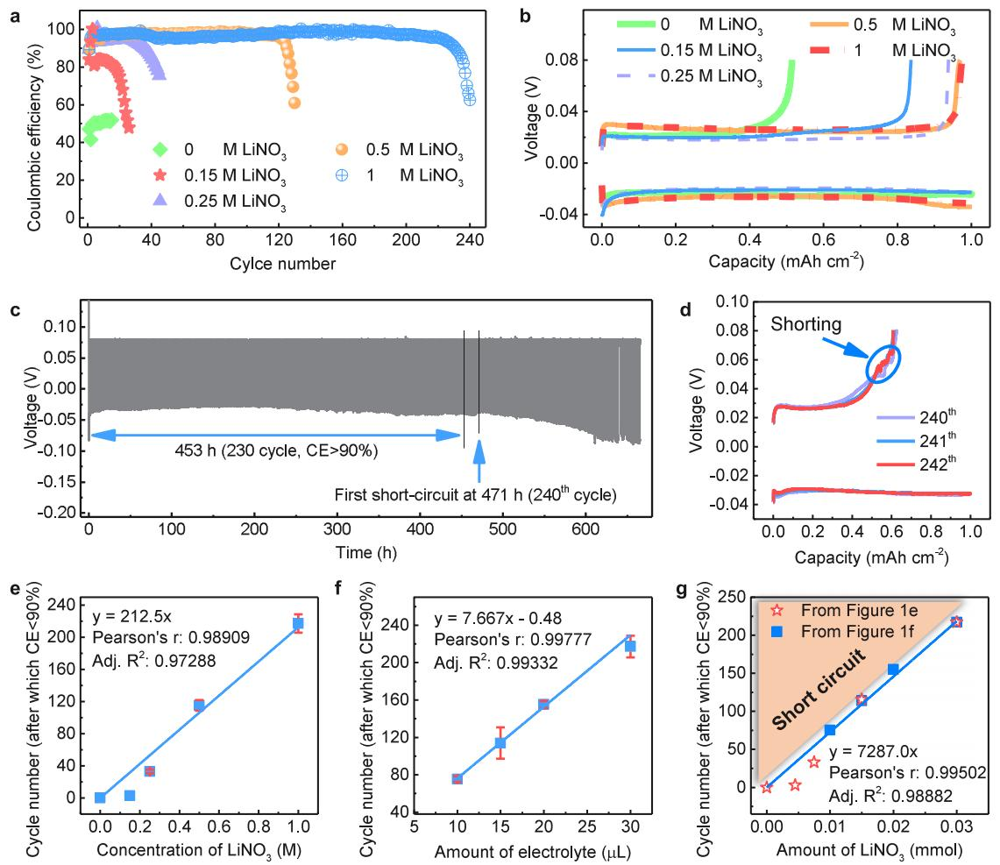
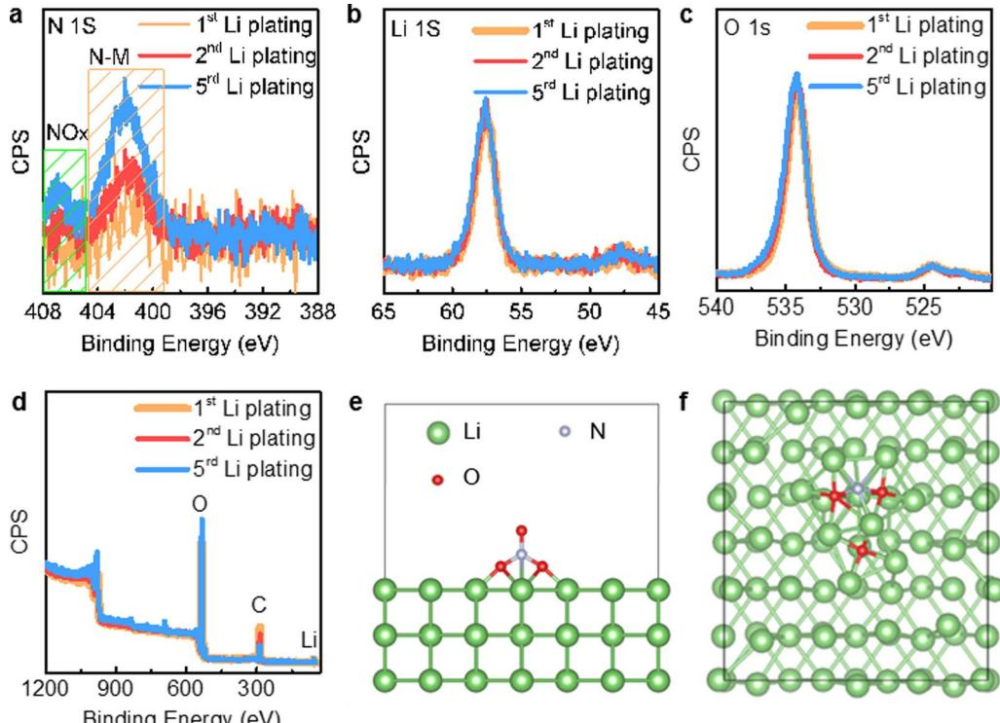
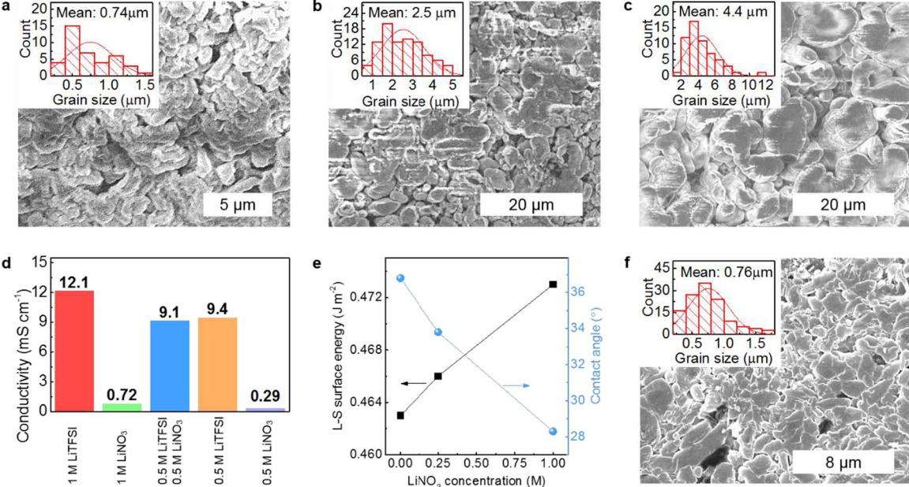

## **This document is downloaded from DR‑NTU (https://dr.ntu.edu.sg) Nanyang Technological University, Singapore.**

# An investigation on the relationship between the stability of lithium anode and lithium nitrate in electrolyte

Yu, Linghui; Song, Jiajia; Wang, Paul Luyuan; Ong, Samuel Jun Hong; Gu, Chengding; Liao, Hanbin; Wang, Ting; Chen, Wei; Lev, Ovadia; Xu, Jason Zhichuan

2019

Yu, L., Song, J., Wang, P. L., Ong, S. J. H., Gu, C., Liao, H., . . . Xu, Z. J. (2019). An investigation on the relationship between the stability of lithium anode and lithium nitrate in electrolyte. Journal of The Electrochemical Society, 166(15), A3570‑A3574. doi:10.1149/2.0151915jes

## https://hdl.handle.net/10356/137413

https://doi.org/10.1149/2.0151915jes

© The Electrochemical Society, Inc. 2019. All rights reserved. Except as provided under U.S. copyright law, this work may not be reproduced, resold, distributed, or modified without the express permission of The Electrochemical Society (ECS). The archival version of this work was published in Journal of The Electrochemical Society, 166, 15, A3570‑A3574.

Downloaded on 20 May 2025 01:31:50 SGT

### **An Investigation on the Relationship between the Stability of Lithium Anode and Lithium Nitrate in Electrolyte**

**Linghui Yu,1,2 Jiajia Song,1,2 Luyuan Paul Wang,1 Samuel Jun Hoong Ong,1,2 Chengding Gu,3 Hanbin Liao,1 Ting Wang,1 Wei Chen,3 Ovadia Lev,2,4 and Zhichuan J. Xu 1,2,5,6,∗,z**

*1School of Materials Science and Engineering, Nanyang Technological University, 639798 Singapore 2Singapore-HUJ Alliance for Research and Enterprise, NEW-CREATE Phase II, Campus for Research Excellence and Technological Enterprise (CREATE), 138602 Singapore 3Department of Chemistry, National University of Singapore, 117543 Singapore 4The Institute of Chemistry, The Hebrew University of Jerusalem, Jerusalem 9190401, Israel 5Energy Research Institute@NTU, ERI@N, Interdisciplinary Graduate School, Nanyang Technological University, 639798 Singapore*

*6Solar Fuels Lab, Nanyang Technological University, Singapore 639798, Singapore*

Understanding the relationship between lithium anode and electrolyte is important to develop a more compatible lithium/electrolyte system for stable and safe cycling of lithium-metal based batteries. However, to date, there has not been any work to quantify the effects of electrolyte on the performance of electrode due to the complexity. Herein, we quantify the relationship between an electrolyte additive, LiNO3, and the stability of lithium anode. It is found that, with increasing the amount of LiNO3, the cyclability of lithium anode rises linearly and the risk of dendrite-induced short circuits can be reduced. Low Coulombic efficiency (CE) and short circuits tend to occur in tandem. LiNO3 is found to be continuously consumed upon electrochemical cycling, which leads to a low CE and a high risk of short circuits.

© 2019 The Electrochemical Society. [DOI: 10.1149/2.0151915jes]

Manuscript submitted July 23, 2019; revised manuscript received September 25, 2019. Published October 22, 2019.

Lithium is an ideal anode for batteries because it is the lightest metal (6.94 g mol–1), which leads to a high capacity of 3861 mAh g–1, and it has the lowest electrochemical potential (−3.04 vs. SHE). Hence, lithium is used as an anode in high-energy sulfur- and oxygen-based batteries to maximize the system's performance.1,2 The energy density of existing lithium-ion batteries would also be greatly enhanced should lithium replace graphite as the anode.3–5 However, low Coulombic efficiency (CE) and dendrite formation have been preventing lithium from being used as an anode in rechargeable batteries for several decades.3,6–8 This is because the former leads to poor cyclability and the latter causes safety issues.

Although pioneering work on lithium anode can be traced back to late 1950s,9 intense work only began a few years ago due to the importance of using lithium in developing high-energy lithium-sulfur and lithium-air batteries.4,10–12 Effort to date generally involves introducing an artificial interface,13–19 influencing lithium plate formation,20–22 use of lithium metal hosts23–25 and formation of advanced solid electrolyte interface (SEI) layer through electrolyte modification.26–30 Although significant progress has been made in past years, commercialization of rechargeable batteries with lithium anode remains elusive, which is mainly attributed to the cyclability requirement and the dendrite formation concern.

To develop stable lithium anodes, as well as other battery systems, it is highly desired to understand the relationship between electrode and electrolyte. This is because it helps develop a more compatible electrolyte/electrode system for stable and safe cycling. For example, formation of SEI layer on high potential cathode (e.g., LiNi0.5Mn1.5O4, LiMn1/3Ni1/3Co1/3O2) and low potential anode (lithium, silicon and graphite) consumes electrolyte and it may also possibly release gases. Thus, understanding the stability of electrolyte during electrochemical processes is critical to improve the cyclability and safety of rechargeable lithium batteries. However, although there have been intense efforts devoted to understanding the compatibility of electrode and electrolyte, they have only given qualitative results.4,31–33 Due to the complexity, there has not been a work to quantify the effects of electrolyte on the performance of electrode in rechargeable lithium batteries.

In this work, we investigate the relationship between the stability of lithium anode and a commonly used electrolyte additive, LiNO3. We provide an example to show that it's possible to quantify the effects of electrolyte additive on the stability of electrode. We show that, with increasing the amount of LiNO3, the cyclability of lithium anode rises linearly and the risk of dendrite-induced short circuits can be reduced.

#### **Experimental**

The electrolyte solvent used in this study was 1,2-dimethoxyethane (DME). The electrolyte salts were LiTFSI and LiNO3. Different concentrations of salts and different amounts of electrolytes were used in the measurements as introduced along the results and discussion. For all the electrochemical measurements, the cell components were assembled into a 2032 coin cell with a Celgard 2325 separator in an Argon-filled glove box. For the evaluation of lithium plating/stripping cyclability, a lithium disc with a diameter of ∼12.5 ± 0.3 mm was used as a lithium source, and a copper disc with a diameter of ∼14.3 mm was used as a lithium plating substrate. The lithium plating capacity was set to be 1 mAh cm–2. The cutoff voltage for lithium stripping was 0.08 V. The plating and stripping currents were the same to be 1 mA cm–2. All the measurements were performed at room temperature using Neware battery testers (Neware Electronic Co.).

Plated lithium on Cu was analyzed by X-ray photoelectron spectroscopy (XPS) and field emission scanning electron microscopy (FESEM). For these measurements, the cells were disassembled in an Argon-filled glove box and the plated lithium were rinsed with DME. After drying, the samples were sealed in containers before being quickly transferred into the chambers. XPS experiments were performed in a custom-designed UHV system with a base pressure better than 2.0 × 10-10 mbar. Al Ka (hυ = 1486.6 eV) was used as the excitation sources for XPS. All XPS measurements were performed at room temperature, and the binding energies of all XPS spectra were calibrated and referenced to the Fermi level of a sputter-cleaned Ag(110) surface. The microscope used was a JOEL JSM-6340F microscope. Contact angles were measured at room temperature using a Dataphysics OCA 15Pro. The lithium was placed in a transparent homemade chamber with a rubber seal on top. The chamber was filled with Ar. 1.8μL of electrolyte was used for each contact angle measurement. The measurement was performed at least 4 times for each electrolyte at different lithium positions and the average values are reported.

Density Functional Theory (DFT) Calculations. Lithium (110) surface was cleaved from the face-centered and body-centered cubic crystal structures and was modeled using an three atomic layers p(4 × 3) super cell 72 atoms. Over the surfaces, a vacuum space of 15 Å is set. The positions of top two layers atoms were relaxed and the bottom one-layer atoms were fixed. The calculation was employed

zE-mail: xuzc@ntu.edu.sg

**Figure 1.** Lithium plating/striping properties using Li/Cu cells. (a) Cyclability using 30 uL of 1 M LiTFSI electrolyte containing different concentrations of LiNO3. (b) Lithium plating/striping curves of the 10th cycle in (a). (c) Lithium plating/stripping voltage profiles of the cell with 30 uL of electrolyte containing 1 M LiTFSI/ 1 M LiNO3. The CE becomes lower than 90% after 230 cycles. First short circuit occurs at the 240th cycle. (d) Voltage profiles of the 240th – 242th cycles of (c) where the short circuits are indicated. (e) Linearity of the concentration of LiNO3 and the lithium plating/stripping cyclability with 30 μL of electrolyte containing 1 M LiTFSI. (f) Linearity of the amount of electrolyte and the lithium plating/stripping cyclability with the electrolyte containing 1 M LiTFSI/1 M LiNO3. (g) Linearity of the amount of LiNO3 and the lithium plating/stripping cyclability using the data from (e) and (f). The region that has a high risk of short circuit is indicated in (g) with shade.

by Vienna ab initio Simulation package (VASP) using spin-polarized density functional.34 The projector augmented wave (PAW) model with Perdew-Burke-Ernzerhof (PBE) function was used to describe the interactions between core and electrons.35,36 An energy cutoff of 500 eV was used for the plane-wave expansion of the electronic wave function. A Methfessel–Paxton smearing method with a width of 0.2 eV are used in the calculation. The Brillouin zones of all systems were sampled with Gamma-point centered Monkhorst-Pack grids. A 4 × 4 × 1 Monkhorst Pack k-point setup were used for bulk geometry optimization, while 9 × 9 × 9 for electronic structures calculation. and Van der Waals (vdW) interaction was considered at DFT-D3 method as proposed by Grimme.37 The force and energy convergence criterion were set to 0.02 eV Å–1 and 10–5 eV, respectively. The adsorption energies of species at the surface site were calculated as follows: Ead = E(A∗) - E(A) - E(∗), where E is total energy obtained directly from DFT calculation. E(A) and E(∗) represent the calculated total energies for the isolated molecules and the bare surface.

#### **Results and Discussion**

We first investigated the influence of the concentration of LiNO3 on lithium anode. LiTFSI/DME electrolytes with 5 different LiNO3 concentrations, i.e., 0 M, 0.15 M, 0.25 M, 0.5 M and 1 M, were used. The concentration of LiTFSI was fixed at 1 M and the amount of electrolyte in each cell was 30 μL. Li/Cu cells were used as the testing cells with Cu as a plating substrate. The lithium plating capacity was set at 1 mAh cm–2 and the plating and striping currents were both set at 1 mA cm–2 for all the cells in this work. Figure 1a shows the lithium plating/stripping cyclability of the various electrolytes. We can see that LiNO3 could significantly improve the CE of lithium plating and striping. In the absence of LiNO3 (0 M), the CE is ∼50%. Upon the addition of LiNO3, regardless of the concentration used, the CE increases higher than 80% during the 1st cycle, before rising above higher than 90% in subsequent cycles. This suggests that once there is a sufficiently high concentration of LiNO3 (e.g., >=0.15 M) in the electrolyte, the SEI layer on the plated lithium, which is derived from the decomposition of the electrolyte,38,39 can effectively protect the lithium electrode to achieve a high CE of >90%. The polarization curves during plating and stripping under various concentrations of LiNO3 are shown in Figure 1b. Increasing the concentration of LiNO3 gives only slightly change on voltage polarization, where the voltage difference ranged ±0.01 V from 0 M to 1 M of LiNO3. This is negligible in practical applications. Higher concentrations (0.5 M and 1 M) of LiNO3 give larger polarization than lower concentrations (0 M, 0.15 M, 0.25 M). On the one hand, this may be possibly due to decreased mobility of Li+ upon increasing the concentration of electrolyte salt/additive (LiNO3).40 On the other hand, this may be also due to the increased lithium grain size, i.e., reduced active surface area, upon increasing the concentration of LiNO3, as will be discussed later.

We found that the CE for plating and striping processes begin to fade rapidly once it falls below ∼90%. Better cyclability could be achieved at higher concentration of LiNO3. At 1 M of LiNO3, high CE (>90%) values can maintain for 230 cycles (including the 1st cycle). During the high CE (>90%) process, the cell overpotential is low, for example, <0.05 V in 1 M of LiNO3 (Figure 1c). Low CE and dendrite-induced short circuits tend to occur in tandem. For example, the CE of the cell with 1 M LiTFSI/ LiNO3 electrolyte starts to be <90% after 230 cycles, and the first short circuit happens at the 240th cycle (Figures 1c and 1d). More examples are shown in Figure S1. Of 38 cells tested, 33 have a first short circuit in less than 30 cycles after CE starts to be <90% and decreases to <80%; 5 have a first short when the CE is >90% (the CE data of the 5 cells were not used for relationship quantification in Figure 1). This suggests that there is a high risk of short circuit when lithium plating/stripping CE becomes low. Such a phenomenon should be related to the morphology change during cycling as will be discussed later.

To evaluate the correlation between cyclability of lithium anode and LiNO3, we plotted the number of cycles where CE was above 90% (including the 1st cycle), as a function of the concentration of LiNO3. As per shown in Figure 1e, it clearly depicts that cyclability and concentration of LiNO3 follow a linear trend: y = 212.5x, where y is the number of cycles for which CE was above 90%, and x the concentration of LiNO3, in M. The intercept is fixed at 0. Such a linearity clearly shows the importance of using a high concentration of LiNO3. It suggests that the cyclability of lithium anode should be limited by the solubility of LiNO3.

In the above segment, we had used a fixed amount of electrolyte (30 uL) for each measurement, while varying only the concentration of LiNO3. Through this, we find a linear relationship between the concentration of LiNO3 and the cyclability of lithium anode. To further reinforce this finding, we fixed the concentration of LiNO3 to be 1 M and varied the amount of electrolyte used during the measurements. Three additional amounts of electrolyte (10, 15 and 20μL) were tested. The cyclability of lithium anodes with the various amounts of electrolyte, are shown in Figure S2. Even though all the measurements used the same concentration of LiNO3, the cells show different cyclabilities. Instead, another linear relationship was observed to arise between the amount of electrolyte and the number of cycles before which the CE drops below 90% (Figure 1f): y = 7.667x − 0.48, where y is the number of cycles for which CE was above 90% (including the 1st cycle) and x the amount of electrolyte, in μL. For comparison, the data in Figures 1e and 1f are combined into Figure 1g by converting the x-axis into the amount of LiNO3, in mmol. Finally, these two groups of data can also be linearly fitted: y = 7287.0x, where y is the number of cycles for which CE was above 90%, and x the amount of LiNO3, in mmol. The intercept is fixed at 0. These results demonstrate that the cyclability of lithium anode and the amount of the LiNO3 follow a linear trend. The shaded region in Figure 1g refers to plating and stripping processes that have a high risk of short circuit.

Through these results, we outlined a hypothesis that LiNO3 is continuously consumed during electrochemical cycling and that low CE is attributed to the complete consumption of LiNO3. It is generally realized that the electrolyte in Li-ion batteries can be continuously decomposed during cycling. But it has yet to be demonstrated that LiNO3 is continuously consumed during lithium plating/stripping cycling. In an early report, it is suggested that LiNO3 can be continuously consumed during cell standing at an elevated temperature (50°C) by an electrochemical impedance study.41 However, that conclusion can't be applied to our system because our study has a complete different condition, i.e., electrochemical cycling. Thus, to confirm the hypothesis, we performed XPS measurements on the plated lithium collected at different cycles with 30 μL of electrolyte containing 1 M LiTFSI/1 M LiNO3. XPS has been used to determine the composition of the SEI layer formed on lithium in LiNO3 electrolytes.38 Here we used it to compare the amount of nitrogen on the plated lithium which is due to the decomposition of LiNO3 and its reaction with DME.38,39 It shows that the nitrogen peaks (such as NOx, N-O, C-N, graphitic N, pyridinic N-O)38,42–44 becomes more pronounced upon cycling (Figure 2a), while the lithium and oxygen peaks remain constant at different cycles (Figures 2b, 2c and 2d). It confirms that LiNO3 is continuously consumed during cycling. Thus, it is reasonable to conclude that the linearity (Figures 1e, 1f and 1g) is due to the continuous consumption of LiNO3. After complete consumption of LiNO3, effective protective SEI layer will not form and hence, resulting in rapid CE decline and short circuiting. These findings suggest that when there is always sufficient LiNO3, lithium anode may have unlimited cyclability and short circuit may never occur.

Density Functional Theory (DFT) study was used to understand why there is the continuous decomposition of LiNO3 upon cycling. Figures 2e and 2f show the initial and optimized adsorption structures of NO3 group on lithium (110) surface. In the optimized structure (Figure 2f), three N-O bonds are broken and dissociated to N and O atoms. The dissociated N and O atoms then bond with lithium. The calculated adsorption energy of NO3 on lithium (110) surface is −10.3732 eV. These results indicate that LiNO3 reacts strongly with lithium. The products of the reaction may form a SEI layer that prevents further decomposition reaction. However, upon plating/stripping cycling, there is always fresh lithium exposed to the electrolyte. Thus, there is the continuous decomposition of LiNO3.

To compare the LiNO3 decomposition rate during resting and cycling, we tested the cyclability of cells after 5 days standing before cycling while the cycling tests of all the cells used in Figure 1 were started in less than 24 h after the cells assembled. Figure S3 shows the cyclability of 2 cells after 5 days standing before cycling. 2 electrolyte amounts, 10 μL and 15 μL, were used. The electrolyte contains 1 M LiTFSI/1 M LiNO3. There is not much difference of the cyclability for these 2 cells compared those tested in less than 24 h. For example, the cell with 10 μL of electrolyte in Figure S3 maintained 75 cycles with a CE larger than 90% before shorting occurred. This is in comparable with the cells with 10 μL of electrolyte in Figure 1f, which can also have a CE larger than 90% for 70–80 cycles. Thus, more than 4 days resting causes a negligible difference in LiNO3 decomposition. And it takes only less than 6.7 days (i.e., less than 80 cycles) for almost all the LiNO3 in the 10 μL of electrolyte to be decomposed. These mean that the LiNO3 decomposition during resting is negligible compared to cycling. This is also because there is always fresh lithium exposed to the electrolyte upon plating/stripping cycling.

The morphology of the plated lithium is often associated to the battery's stability.19,45,46 Thus, we investigated how the concentration of LiNO3 affects the morphology. The scanning electron microscope (SEM) images of the plated lithium and the histograms of the diameter are as shown in Figures 3a, 3b and 3c. Corresponding lowmagnification images are shown in Figure S4, S5 and S6. The electrolytes used for these measurements were 30 μL containing 1 M of LiTFSI and different concentrations of LiNO3. The mean diameters for the 0 M, 0.25 M and 1 M LiNO3 electrolytes are 0.74 μm, 2.5 μm, and 4.4 μm, respectively. The results show that the grain size of the plated lithium enlarges with increasing concentration of LiNO3 and a more stable lithium anode is accompanied by a larger grain size of the plated lithium.

To understand why increasing the concentration of LiNO3 leads to larger lithium grain, we evaluated two key factors: conductivity of electrolyte and lithium-electrolyte surface energy. The conductivity of electrolyte is related to the overpotential of testing cell and hence, affects the driving force of lithium plating. As shown in Figure 3d, the conductivity of LiTFSI electrolyte is more than 1 magnitude higher than LiNO3 at the same concentration. The addition of LiNO3 in a LiTFSI/DME electrolyte causes a negligible change in conductivity, e.g., 9.4 mS cm–1 and 9.1 mS cm–1 for 0.5 M LiTFSI electrolyte and 0.5 M LiTFSI/0.5 M LiNO3 electrolyte, respectively. Thus, the

**Figure 2.** Continuous decomposition of LiNO3 upon electrochemical cycling. XPS N 1S (a), Li 1S (b), O 1S (c) and wide-scan (d) spectra of the plated lithium at different plating cycles with the electrolyte containing 1 M LiTFSI/1 M LiNO3, respectively. N-M in (a) represents N-containing groups possibly including N-O, C-N, graphitic N, pyridinic N, pyridinic N-O and pyrrolic N.43,44 (e) Initial and (f) optimized adsorption structures of NO3 on lithium (110) surface.

addition of LiNO3 does not seem to lead to a conductivity difference that can significantly affect the grain size of the plated lithium.

Surface energy is always a key to control the growth of grain in the synthesis of nano-/micro-structured materials. This is because the synthetic system tends to have a lower surface energy. We calculated the electrolyte (L) – lithium (S) surface energy (Figure 3e) for the three electrolytes used in Figures 3a, 3b and 3c. The result shows that an increment in concentration of LiNO3 leads to a higher surface energy.

**Figure 3.** SEM, conductivity and surface energy studies. SEM images of the plated lithium (after the 2nd plating on Cu) using 30 μL of 1 M LiTFSI electrolytes with different concentrations of LiNO3: (a) 0 M, (b) 0.25 M and (c) 1 M. (d) Conductivity comparison of different electrolytes. (e) Electrolyte (L) – lithium (S) surface energy and contact angle. (f) SEM image of the plated lithium (after the 71th plating on Cu) using 30 μL of 1 M LiTFSI / 0.25 M LiNO3 electrolyte. Insets in the SEM images: corresponding size histograms of the plated lithium. Mean diameters of the plated lithium are indicated in the histograms. No conductive coating layer, such as gold, was used for these SEM samples because it may react with lithium.

As a result, the plated lithium will have a larger grain, so that it has a lower surface area to reduce the total surface energy. This is consistent with our result, i.e., a higher concentration of LiNO3 leads to a larger lithium grain. Thus, we believe that the difference in surface energy induced by the addition of LiNO3 is a major factor that results in different lithium grain sizes. The surface energy was calculated using contact angle data (Figure 3e). The method used for the calculation can be found in Table S1.

The grain size of lithium is highly related to the safety of batteries with a porous separator. The smaller the grain, the easier the lithium penetrating through the pores of porous separator which results in shorting. We tested 5 cells with 1 M LiTFSI/0 M LiNO3 electrolyte. 2 of them have a first short circuit at the 1st cycle (Figure S7a and b). Another one has a first short circuit at the 2nd cycle (Figure S7c). While for the cells with LiNO3, as mentioned above, most of them have a first short circuit after the CE becomes lower than 90%. This demonstrates that short circuits can occur easily at the very beginning when the grain of plated lithium is small.

To analyze the morphology of plated lithium in the beginning of the plating/stripping processes and after cycling, we obtained SEM image of the plated lithium after the 71th plating using 30 μL of 1 M LiTFSI/0.25 M LiNO3 electrolyte (Figure 3f). The mean grain size is 0.76 μm, much smaller than the one after the 2nd cycle, which is 2.5 μm (Figure 3b). We also analyzed the size of the plated lithium after the 1st plating (Figure S8a) and after 86th plating (Figure S8b) using 10 μL of 1 M LiTFSI/1 M LiNO3 electrolyte. The mean grain size decreases from 3.4 μm at the 1st cycle to 1.2 μm at the 86th cycle for this electrolyte. We ascribe the decrease in grain size of the plated lithium after cycling to the continuous consumption LiNO3 in the electrolyte. This also explains why low CE and short circuits tend to occur in tandem. This is because the concentration of LiNO3 becomes low when CE starts to fail and the grain of the plated lithium become small and gets easier to penetrate through porous separator.

#### **Conclusions**

We quantified the relationship between LiNO3 and lithium anode. With increasing the amount of LiNO3, the cyclability of lithium anode rises linearly and the risk of dendrite-induced short circuits can be reduced. Low CE and dendrite-induced short circuits are found to tend to occur in tandem. LiNO3 is demonstrated to be continuously consumed during electrochemical cycling which leads to a low CE and a high risk of short circuits. The differences in grain size of the plated lithium that is associated with short circuits is explained by surface energy. A higher LiNO3 concentration leads to a larger electrolyte-lithium surface energy, resulting in a larger lithium grain. Thus, lithium grain becomes smaller and easier to penetrate the porous separator upon cycling due to the consumption of LiNO3. This study also provides an example to show that it is possible to quantify the effects of electrolyte additive on the stability of electrode.

#### **Acknowledgments**

Authors thank the Facility for Analysis, Characterization, Testing and Simulation (FACTS) at the Nanyang Technological University for materials characterizations. This research is supported by the National Research Foundation, Prime Minister's Office, Singapore under its Campus for Research Excellence and Technological Enterprise (CREATE) programme. The work is partially supported by the Singapore Ministry of Education Tier 2 Grants (MOE2017-T2-1-009 and Tier II R143-000-A29-112) and Tier 1 grant (RG3/18 (S)).

#### **ORCID**

Zhichuan J. Xu https://orcid.org/0000-0001-7746-5920

#### **References**

- 1. P. G. Bruce, S. A. Freunberger, L. J. Hardwick, and J.-M. Tarascon, *Nat. Mater.*, **11**, 19 (2012).
- 2. X.-B. Cheng, J.-Q. Huang, and Q. Zhang, *J. Electrochem. Soc.*, **165**, A6058 (2018).
- 3. P. Albertus, S. Babinec, S. Litzelman, and A. Newman, *Nature Energy*, **3**, 16 (2017).
- 4. D. Lin, Y. Liu, and Y. Cui, *Nat. Nanotechnol.*, **12**, 194 (2017).
- 5. K. J. Harry, K. Higa, V. Srinivasan, and N. P. Balsara, *J. Electrochem. Soc.*, **163**, A2216 (2016).
- 6. J. M. Tarascon and M. Armand, *Nature*, **414**, 359 (2001).
- 7. L. L. Kong, L. Wang, Z. C. Ni, S. Liu, G. R. Li, and X. P. Gao, *Adv. Funct. Mater.*, 1808756 (2019).
- 8. C. Wang, D. Wang, and C. Dai, *J. Electrochem. Soc.*, **155**, A390 (2008).
- 9. C. A. Vincent and B. Scrosati, *Modern Batteries*, Second edition ed.; Butterworth-Heinemann publications: Burlington, 1997.
- 10. M. D. Tikekar, S. Choudhury, Z. Tu, and L. A. Archer, *Nature Energy*, **1**, 16114 (2016).
- 11. J. Liu, Z. Bao, Y. Cui, E. J. Dufek, J. B. Goodenough, P. Khalifah, Q. Li, B. Y. Liaw, P. Liu, A. Manthiram, Y. S. Meng, V. R. Subramanian, M. F. Toney, V. V. Viswanathan, M. S. Whittingham, J. Xiao, W. Xu, J. Yang, X.-Q. Yang, and J.-G. Zhang, *Nature Energy*, **4**, 180 (2019).
- 12. H. Lu, Z. Chen, Y. Yuan, H. Du, J. Wang, X. Liu, Z. Hou, K. Zhang, J. Fang, and Y. Qu, *J. Electrochem. Soc.*, **166**, A2453 (2019).
- 13. X.-Q. Zhang, X. Chen, R. Xu, X.-B. Cheng, H.-J. Peng, R. Zhang, J.-Q. Huang, and Q. Zhang, *Angew. Chem. Int. Ed.*, **56**, 14207 (2017).
- 14. J. Xie, L. Liao, Y. Gong, Y. Li, F. Shi, A. Pei, J. Sun, R. Zhang, B. Kong, R. Subbaraman, J. Christensen, and Y. Cui, *Science Advances*, **3**, eaao3170 (2017).
- 15. K. Liu, A. Pei, H. R. Lee, B. Kong, N. Liu, D. Lin, Y. Liu, C. Liu, P.-C. Hsu, Z. Bao, and Y. Cui, *J. Am. Chem. Soc.*, **139**, 4815 (2017).
- 16. X. Liang, Q. Pang, I. R. Kochetkov,M. S. Sempere, H. Huang, X. Sun, and L. F. Nazar, *Nature Energy*, **2**, 17119 (2017).
- 17. B. Zhu, Y. Jin, X. Hu, Q. Zheng, S. Zhang, Q. Wang, and J. Zhu, *Adv. Mater.*, 1603755 (2017).
- 18. N.-W. Li, Y.-X. Yin, C.-P. Yang, and Y.-G. Guo, *Adv. Mater.*, **28**, 1853 (2016).
- 19. G. Zheng, S. W. Lee, Z. Liang, H.-W. Lee, K. Yan, H. Yao, H. Wang, W. Li, S. Chu, and Y. Cui, *Nat Nano*, **9**, 618 (2014).
- 20. H. Ye, S. Xin, Y.-X. Yin, J.-Y. Li, Y.-G. Guo, and L.-J. Wan, *J. Am. Chem. Soc.*, **139**, 5916 (2017).
	- 21. W. Liu, D. Lin, A. Pei, and Y. Cui, *J. Am. Chem. Soc.*, **138**, 15443 (2016).
- 22. Z. Liang, G. Zheng, C. Liu, N. Liu, W. Li, K. Yan, H. Yao, P.-C. Hsu, S. Chu, and Y. Cui, *Nano Lett.*, **15**, 2910 (2015).
- 23. K. Yan, Z. Lu, H.-W. Lee, F. Xiong, P.-C. Hsu, Y. Li, J. Zhao, S. Chu, and Y. Cui, *Nature Energy*, **1**, 16010 (2016).
- 24. D. Lin, Y. Liu, Z. Liang, H.-W. Lee, J. Sun, H. Wang, K. Yan, J. Xie, and Y. Cui, *Nat Nano*, **11**, 626 (2016).
- 25. S. Jin, Z. Sun, Y. Guo, Z. Qi, C. Guo, X. Kong, Y. Zhu, and H. Ji, *Adv. Mater.*, **29**, 1700783 (2017).
- 26. J. Zheng, M. H. Engelhard, D. Mei, S. Jiao, B. J. Polzin, J.-G. Zhang, and W. Xu, *Nature Energy*, **2**, 17012 (2017).
- 27. Z. Xu, J. Wang, J. Yang, X. Miao, R. Chen, J. Qian, and R. Miao, *Angew. Chem. Int. Ed.*, **55**, 10372 (2016).
- 28. Y. Lu, Z. Tu, and L. A. Archer, *Nat. Mater.*, **13**, 961 (2014).
- 29. S. Jiao, X. Ren, R. Cao, M. H. Engelhard, Y. Liu, D. Hu, D. Mei, J. Zheng, W. Zhao, Q. Li, N. Liu, B. D. Adams, C. Ma, J. Liu, J.-G. Zhang, and W. Xu, *Nature Energy*, **3**, 739 (2018).
- 30. Z. L. Brown, S. Heiskanen, and B. L. Lucht, *J. Electrochem. Soc.*, **166**, A2523 (2019).
- 31. J. B. Goodenough and Y. Kim, *Chem. Mater.*, **22**, 587 (2010).
- 32. M. R. Palacín and A. De Guibert, *Science*, **351** (2016).
- 33. J. Cabana, L. Monconduit, D. Larcher, and M. Rosa Palacin, *Adv. Mater.*, **22**, E170 (2010).
- 34. G. Kresse and J. Hafner, *Phys Rev B*, **47**, 558 (1993).
- 35. B. Hammer, L. B. Hansen, and J. K. Norskov, *Physical Review B*, **59**, 7413 (1999).
- 36. M. C. Payne, M. P. Teter, D. C. Allan, T. A. Arias, and J. D. Joannopoulos, *Reviews*
- *of Modern Physics*, **64**, 1045 (1992). 37. S. Grimme, J. Antony, S. Ehrlich, and H. Krieg, *The Journal of Chemical Physics*, **132**, 154104 (2010).
- 38. D. Aurbach, E. Pollak, R. Elazari, G. Salitra, C. S. Kelley, and J. Affinito, *J. Electrochem. Soc.*, **156**, A694 (2009).
- 39. X. Liang, Z. Wen, Y. Liu, M. Wu, J. Jin, H. Zhang, and X. Wu, *J. Power Sources*, **196**, 9839 (2011).
- 40. L. Suo, Y.-S. Hu, H. Li, M. Armand, and L. Chen, *Nat. Commun.*, **4**, 1481 (2013).
- 41. S. S. Zhang, *Electrochim. Acta*, **70**, 344 (2012).
- 42. S. J. Kang, T. Mori, S. Narizuka, W. Wilcke, and H.-C. Kim, *Nat. Commun.*, **5**, 3937 (2014).
- 43. J. R. Pels, F. Kapteijn, J. A. Moulijn, Q. Zhu, and K. M. Thomas, *Carbon*, **33**, 1641 (1995).
- 44. J. Zhang, Z. Xia, and L. Dai, *Science Advances*, **1**, e1500564 (2015).
- 45. J. Qian, W. A. Henderson, W. Xu, P. Bhattacharya, M. Engelhard, O. Borodin, and J.-G. Zhang, *Nat. Commun.*, **6**, 6362 (2015).
- 46. Y. Zhang, J. Qian, W. Xu, S. M. Russell, X. Chen, E. Nasybulin, P. Bhattacharya, M. H. Engelhard, D. Mei, R. Cao, F. Ding, A. V. Cresce, K. Xu, and J.-G. Zhang, *Nano Lett.*, **14**, 6889 (2014).