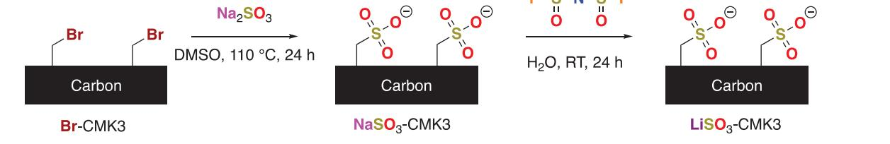
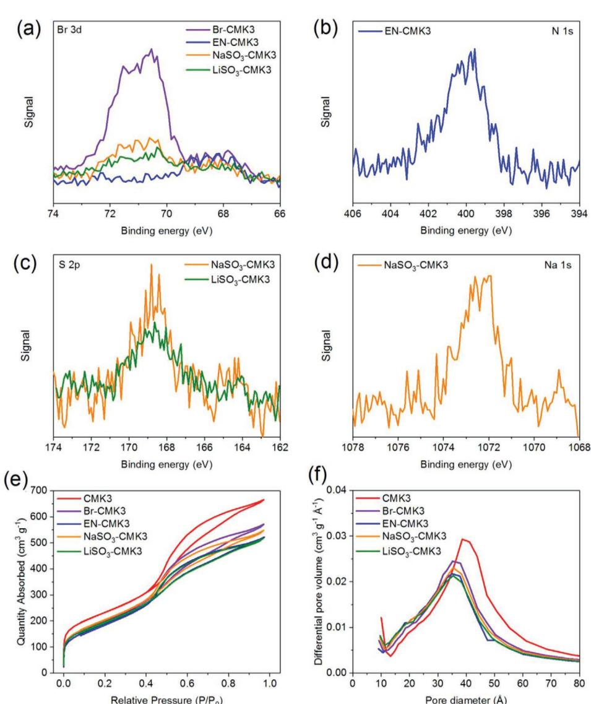
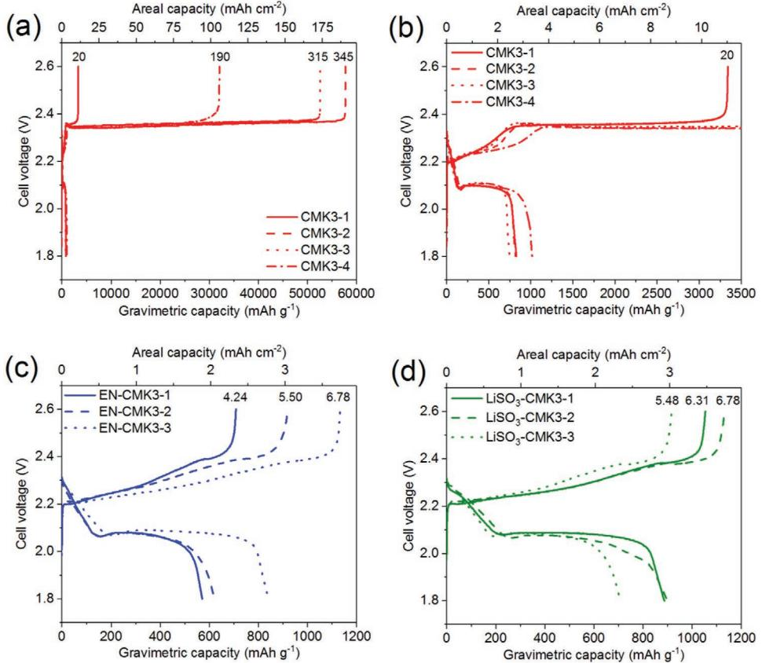
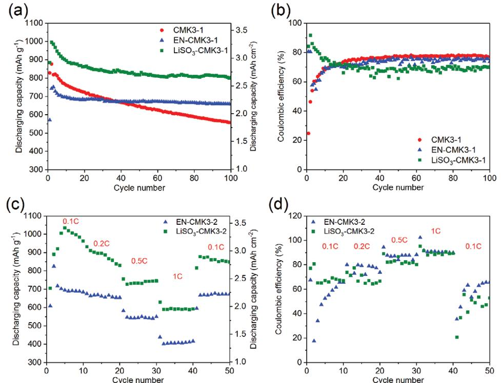
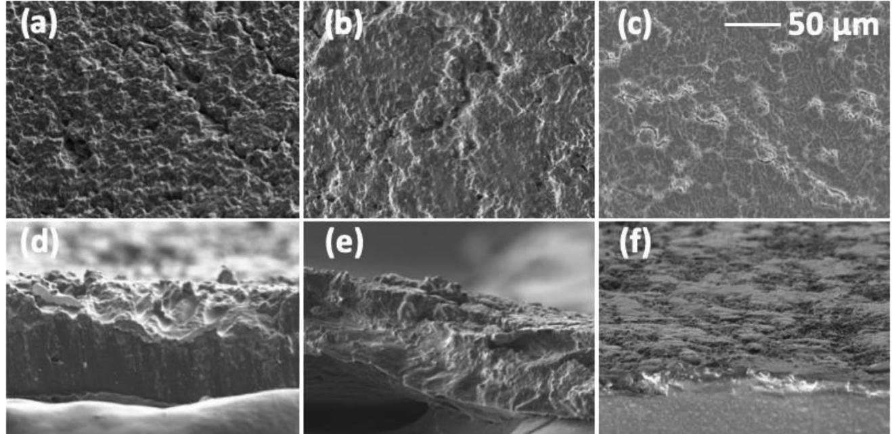
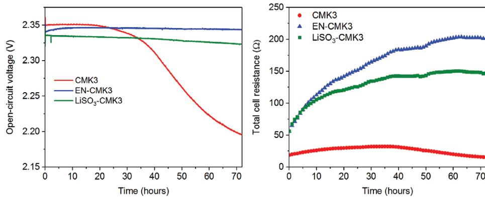

# **Lithium Sulfonate Functionalization of Carbon Cathodes as a Substitute for Lithium Nitrate in the Electrolyte of Lithium–Sulfur Batteries**

*Samuel J. Fretz, Urbi Pal, Gaetan M. A. Girard, Patrick C. Howlett, and Anders E. C. Palmqvist\**

**A method for grafting lithium sulfonate (LiSO3) groups to carbon surfaces is developed and the resulting carbons are evaluated for their potential to reduce the lithium polysulfide (LiPS) shuttle in lithium–sulfur (Li–S) batteries, replacing the common electrolyte additive lithium nitrate (LiNO3). The LiSO3 groups are attached to the ordered mesoporous carbon (CMK3) surface via a three-step procedure to synthesize LiSO3-CMK3 by bromomethylation, sodium sulfite (Na2SO3) substitution, and cation exchange. As a comparison, ethylenediamine (EN)-substituted CMK3, EN-CMK3, is also synthesized and tested. When used as a cathode in Li–S batteries, the unfunctionalized CMK3 suffers from strong LiPS shuttling as evidenced by its low initial Coulombic efficiencies (ICEs, <10%) compared to its functionalized derivatives EN-CMK3 and LiSO3-CMK3 (ICEs >75%). Postcycling analysis reveals the benefits of cathode surface functionalization on the lithium anode via an attenuated LiPS shuttle. When monitored at open circuit, the functionalized cathodes maintain their cell voltages much better than the CMK3 control and concurrent electrochemical impedance spectroscopy reveals their higher total cell resistance, which provides evidence for a reduced LiPS shuttle in the vicinity of both electrodes. Overall, such surface groups show promise as cathode-immobilized "lithium nitrate mimics."**

# **1. Introduction**

In the modern era, electrochemical energy storage is largely met by lithium-ion (Li-ion) batteries, which have revolutionized the

Dr. S. J. Fretz, Prof. A. E. C. Palmqvist Department of Chemistry and Chemical Engineering Applied Chemistry Chalmers University of Technology Gothenburg SE-412 96, Sweden E-mail: anders.palmqvist@chalmers.se U. Pal, Dr. G. M. A. Girard, Prof. P. C. Howlett ARC Centre of Excellence for Electromaterials Science Deakin University 221 Burwood Highway, Burwood, Victoria 3125, Australia The ORCID identification number(s) for the author(s) of this article can be found under https://doi.org/10.1002/adfm.202002485.

© 2020 The Authors. Published by WILEY-VCH Verlag GmbH & Co. KGaA, Weinheim. This is an open access article under the terms of the Creative Commons Attribution-NonCommercial-NoDerivs License, which permits use and distribution in any medium, provided the original work is properly cited, the use is non-commercial and no modifications or adaptations are made.

### **DOI: 10.1002/adfm.202002485**

portable electronic device markets due to their high voltage and energy densities.[1] Further increasing the battery capacity requires going beyond Li-ion batteries and exploring electrode materials with alternative electrochemical couples, one of which is the lithium–sulfur (Li–S) cell, in which the eponymous elements serve as the anode and cathode, respectively. The Li–S redox process exhibits a theoretical specific energy of 2500 Wh kg−1 , about three times higher than materials for leading lithium-ion cells (≈700 Wh kg−1 ),[2] which has inspired much research interest in the past few decades.[3]

One of the key issues to be resolved for Li–S batteries is their poor rechargeability, which stems from the phenomenon known as the lithium polysulfide shuttle (LiPS shuttle).[4] This problem results from the high solubility of partially reduced sulfur species, called lithium polysulfides (Li2S*n*, 4 ≤ *n* ≤ 8; LiPS), in the battery electrolyte. During charging, the diffusion

of soluble LiPS away from the cathode and their undesired reduction on the anode counteracts the applied current. This opposing current is observed in the form of an extraordinarily long charging cycle that can last many times the theoretical maximum.[5] Such long charging times drastically reduce the Coulombic efficiency (CE, <10%). Moreover, the LiPS shuttle was also linked to a fast self-discharge rate for Li–S cells.[6]

To address these concerns, lithium nitrate (LiNO3) is commonly added to Li–S battery electrolytes. While this salt is known to increase dramatically the CEs to >95%,[7] it exhibits some distinct disadvantages.[8] First and foremost, nitrate is known to reduce on both the anode[7a,e,9] and cathode,[7f,10] which calls into question its long term stability and, by extension, its effect on the battery lifetime. Nitrate also limits the electrochemical stability window of the electrolyte with deeper discharges causing more irreversible nitrate reduction and an associated adverse effect on the redox reversibility of the sulfur cathode.[7c,9,11]

Understanding the exact role of LiNO3 in increasing the CE is also critically important. Initially, LiNO3 was thought to form a protective layer of Li*x*NO*y* on the Li anode (i.e., a solid-electrolyte interphase or SEI), which prevents reduction of LiPS on the anode,[7e,12] but this role is being revisited. Some reports have suggested that, while this Li*x*NO*y* layer does indeed form, it is ineffective at preventing LiPS reduction.[7a,13] In fact, this layer is deleterious to cell performance, increasing cell resistance and lowering operating voltage.[7a] Nitrate ions were also found to progressively reduce on the Li anode, providing additional evidence for the inability of the layer to prevent LiPS reduction.[9] Meanwhile, another study has proposed that nitrate anions could act as catalysts for the conversion of LiPS to S8 on the cathode[7c] and our own research has shown that nitrate has a profound impact on the cathode charging mechanism.[7f]

Given its widespread use, we know of only a limited number of studies that explicitly avoid LiNO3 and maintain high CEs by modifying an aspect of the cell design. Some methods include SEI-forming electrolyte additives,[14] or modifying the separator[15] or Li anode.[16] Cathode modifications can also increase the CE to >90% without LiNO3, for example, by incorporation of nitrogen dopants[17] or oxides (SiO2 or TiO2) [18] into the conductive host for sulfur. One report studied various metal oxides for their potential to replace LiNO3, the best of which was found to be RuO2. [7a] RuO2 was postulated to fulfill a catalytic role for LiPS oxidation into S8 during charging, similar to the proposed role of nitrate anions.[7c] Importantly, the RuO2 cells also exhibited higher voltages and enhanced durability compared to those with LiNO3, demonstrating the advantages of replacing this salt. In another publication, similar to RuO2, black phosphorous quantum dots were found to catalyze LiPS conversion and maintained CEs >98% when LiNO3 was omitted from the battery electrolyte.[19]

However, what is missing in the above studies is modifying an aspect of the Li–S cell to become an explicit "lithium nitrate mimic." In other words, to the best of our knowledge, no study exists with the goal of installing a chemically similar species within the cell architecture in an attempt to retain the beneficial properties of the nitrate anion. We hypothesized that modifying the cathode with such a species could endow it with the anion's benefits and perhaps yield information on the true role of lithium nitrate on the LiPS shuttle. Stated differently, we hope to move the usefulness of lithium nitrate from the solution phase to the cathode surface.

To modify the cathode, we have recently reported the bromomethylation reaction as the first of a two-step method for grafting a variety of organic functional groups to carbon surfaces.[7f] Using this methodology, we synthesized ethylenediamine (EN)-functionalized ordered mesoporous carbon CMK3, EN-CMK3. When used in conjunction with a LiPS-containing electrolyte (a catholyte) lacking LiNO3, the EN-CMK3 cathode exhibited a greatly reduced LiPS shuttle compared to unmodified CMK3 as evidenced by the former's much shorter charging times. We hypothesized that by exchanging the EN groups for a functional group more similar to nitrate, we could further enhance the battery performance.

In the pursuit of a "lithium nitrate mimic" to install on the carbon surface, we considered a few possible functional groups. Unfortunately, grafting nitrates themselves to the carbon surface is problematic for several reasons: one, the surface groups would be neutral, organic nitrates (R-ONO2) and would likely show significantly different properties from their anionic, solution phase counterparts; two, nitrate anions are known to reduce irreversibly at the cathode in Li–S cells at low cell voltages, forming a cathode-electrolyte interphase (CEI),[7a,f,10] so the surface nitrates could presumably undergo similar reactions during cycling; and three, the conditions to install nitrate groups would also likely involve nitric acid (HNO3), a potent carbon oxidizer,[20] resulting in a large increase of oxygencontaining functionality (e.g., alcohols and carboxylic acids) in addition to the desired nitrate groups.[21]

As a replacement for nitrates, we considered organic sulfonates (R-SO3 −) since they share similar characteristics with inorganic nitrate: monoanionic, three oxygens, and halogenfree. Furthermore, the basicity of both anions is similar as their conjugate acids, methanesulfonic acid (CH3SO3H) and HNO3, have pKa values of −1.9 and −1.4, respectively. CH3SO3H can also be used as a supporting electrolyte in batteries given its redox inactivity;[22] any surface sulfonate groups are likely to be redox inactive too.

Sulfonation of carbons can be accomplished by a variety of means.[20a,23] One common method includes subjecting the carbon to concentrated sulfuric acid (H2SO4) or fuming sulfuric acid (SO3 dissolved in H2SO4).[24] While high sulfonic acid loadings can be obtained (>1 mmol g−1 ), the potential for unwanted oxidation of the carbon substrate by SO3 and/or H2SO4 makes these methods unsuitable for the preparation of carbon electrodes. Alternatively, diazonium salts can graft sulfonate groups to the carbon surface,[25] which avoids the use of oxidizing acids and SO3 and a very high sulfonate loading can be obtained (1.94 mmol g−1 ). However, this high loading is accompanied by a dramatic decrease in both the surface area and pore volume (41% and 59% decrease, respectively). While not stated explicitly, the high loading and drastic loss of porosity could indicate multilayer formation within the carbon's pores.

An alternative approach to sulfonate synthesis in the solution phase involves nucleophilic substitution of alkyl halides with sulfites (e.g., Na2SO3), which is termed the Strecker sulfite alkylation as it was first reported by Adolph Strecker in 1868.[26] Such a reaction dovetails perfectly with bromomethylated carbons given their propensity for substitution with a variety of nucleophiles. Moreover, the lack of oxidizing acids or potential to form multilayers makes this approach attractive for the functionalization of porous carbon electrodes for Li–S batteries.

In this study, we use a Strecker sulfite alkylation for the preparation of the lithium sulfonate-functionalized carbon, LiSO3- CMK3. As cathode materials in Li–S batteries, both EN-CMK3 and LiSO3-CMK3 demonstrate a greatly reduced LiPS shuttle relative to pristine CMK3 when used with a LiNO3-free electrolyte. The results presented herein show how surface groups such as these could potentially substitute for LiNO3 in the Li–S battery electrolyte.

# **2. Results and Discussion**

### **2.1. Functionalized CMK3 Synthesis**

As a substrate for sulfonate and other surface groups, we selected ordered mesoporous carbon CMK3 for this study as a continuation of our previous reports[7f,10b] and because it has an ordered arrangement of narrow sized pores and a high specific surface area. A 10 g batch of CMK3 was bromomethylated to

**Figure 1.** Synthesis of EN-CMK3 via Br-CMK3. For simplicity, surface groups in this figure and Figure 2 are shown attached to an unspecific carbon surface since, in principle, multiple bonding arrangements could be present including bonded to the edge[7f] or top[10b] of a graphitic sheet. However, the mixed sp2 /sp3 hybridization of amorphous carbons[27] such as CMK3 makes the exact nature of the bonding to the surface ambiguous.

provide enough starting material, denoted Br-CMK3, for all the reactions presented herein. As shown previously, bromomethylated carbons can undergo substitution reactions with a variety of nucleophiles including amines, azide, iodide, ammonia, and amide enolates. As a comparison to the previous study with catholytes without LiNO3, [7f] 2 g of Br-CMK3 was boiled in neat EN to form EN-CMK3 (**Figure 1**).

To install sulfonate groups on the CMK3 surface, we modified our previous procedure for azide (N3 −) substitution on bromomethylated carbons (**Figure 2**).[7f] Sodium sulfite (Na2SO3) was dissolved in a suspension of Br-CMK3 in dimethylsulfoxide (DMSO) with a sodium iodide (NaI) catalyst at 110 °C for 24 h to yield NaSO3-CMK3. To exchange the counter cations, NaSO3-CMK3 was stirred in a 1 m solution of lithium bis(fluorosulfonyl)imide (LiFSI) for 24 h to make LiSO3-CMK3.

#### **2.2. Functionalized CMK3 Characterization**

In the previous bromomethylation study,[7f] the CMK3 samples used for making Li–S battery cathodes were characterized thoroughly using X-ray fluorescence (XRF), elemental analysis (EA), X-ray photoelectron spectroscopy (XPS), nitrogen-sorption, small angle X-ray scattering (SAXS), scanning electron microscopy (SEM), and X-ray diffraction (XRD). Among these, SAXS, SEM, and XRD showed indistinguishable results among all samples, which underscores the mild reaction conditions and monolayer functionalization of this two-step scheme. Therefore, in the current study, the CMK3 materials were subjected to analysis with XRF, EA, XPS, and nitrogen-sorption with the first two allowing for quantification of the bromomethyl, EN, and lithium sulfonate surface groups. As determined by XRF, the Br-CMK3 starting material has a Br loading of 0.65 mmol g−1 , which is reduced to 0.14 mmol g−1 upon EN substitution to form EN-CMK3 (Table S1, Supporting Information). This residual Br species is likely not bromomethyl groups, but rather anionic bromide, as determined by XPS (vide infra). The nitrogen content of EN-CMK3 corresponds to an EN loading of 0.92 mmol g−1 as determined by EA (Table S2, Supporting Information), or a yield of ≈140% from Br-CMK3 (based on initial Br content). The higher than expected yield was observed multiple times for EN nucleophiles in the previous study (≈125–130%) and is attributed to EN reacting with other groups on the carbon surface, for example, with a carbonyl group via an imine condensation.[7f]

By comparison, NaSO3-CMK3 and LiSO3-CMK3 exhibit sulfonate loadings of 0.34 and 0.32 mmol g−1 , respectively (EA; Table S2, Supporting Information). The similar sulfonate contents indicate covalent attachment to the carbon surface; the aqueous lithium salt wash to exchange the counter cations would likely remove any physisorbed Na2SO3. The yield of LiSO3-CMK3 is ≈50%, indicating that the bromide substitution efficiency of sulfite is lower than for similar nucleophiles, particularly azide, which showed yields around 85% under similar reaction conditions.[7f] The residual bromine content of both sulfonate-modified carbons is 0.20 mmol g−1 , consistent with their lower loadings. The XRF and EA results show together that about 0.10 mmol g−1 , or 15%, of the initial bromine content of Br-CMK3 is unaccounted for in these carbon materials. No iodine from the NaI catalyst was detected, meaning that the bromine was lost via some other means.

X-ray photoelectron spectroscopy was used to further characterize surface elemental composition of the functionalized carbons (**Table 1** and **Figure 3**a–d). As expected from the EA

**Figure 2.** Synthesis of LiSO3-CMK3 using a Strecker sulfite alkylation on Br-CMK3 followed by cation exchange with an aqueous-organic lithium bis(fluorosulfonyl)imide (LiFSI) solution.

**www.advancedsciencenews.com www.afm-journal.de**

**Table 1.** XPS atomic concentrations. Units are atomic %.

| Sample     | C 1s  | N 1s | O 1s | Br 3d | Na 1s | S 2p |
|------------|-------|------|------|-------|-------|------|
| CMK3       | 94.00 | 0    | 6.00 | 0     | 0     | 0    |
| Br-CMK3    | 93.66 | 0    | 5.82 | 0.52  | 0     | 0    |
| EN-CMK3    | 92.25 | 2.35 | 5.29 | 0.11  | 0     | 0    |
| NaSO3-CMK3 | 92.05 | 0    | 7.03 | 0.17  | 0.35  | 0.40 |
| LiSO3-CMK3 | 90.69 | 0    | 9.03 | 0.10  | 0     | 0.17 |

and XRF data, bromomethylation of CMK3 results in a large Br content that, upon substitution with either EN or sulfite, is reduced but not completely removed. In the Br 3d spectra (Figure 3a), two signals are observed at ≈70.5 and 68 eV for Br-CMK3, which correspond to alkylbromides[7f,10b] and anionic bromide,[28] respectively. For the peak at 70.5 eV, its intensity is lowered considerably upon substitution with either EN or sulfite. The negligible intensity of this peak for EN-CMK3 supports complete substitution of its bromomethyl groups by EN; the residual Br content of EN-CMK3 as determined by XRF (Table S1, Supporting Information) is therefore likely to be mostly anionic bromide. For both NaSO3- and LiSO3-CMK3, the peak at 70.5 eV retains a moderate intensity indicating a lower substitution efficiency, which corroborates their higher residual bromine content (XRF; Table S1, Supporting Information) and lower yield (EA; Table S2, Supporting Information). For the peak at 68 eV, its intensity is similar across all samples; the anionic bromide introduced from the bromomethylation reaction is retained during the subsequent substitution and ion exchange reactions.

After substitution, EN-CMK3 exhibits a large nitrogen content while NaSO3-CMK3 and LiSO3-CMK3 show smaller sulfur concentrations, consistent with their lower surface group

**Figure 3.** Characterization of surface modified CMK3. X-ray photoelectron spectra of the a) Br 3d, b) N 1s, c) S 2p, and d) Na 1s regions. e) Nitrogen adsorption–desorption isotherms and f) pore size distributions based on the adsorption isotherm.

loadings (Table 1). In the N 1s spectrum (Figure 3b), EN-CMK3 shows a large signal at ≈400 eV, consistent with an amine[29] while, in the S 2p spectra (Figure 3c), NaSO3- and LiSO3-CMK3 show weaker sulfur signals at ≈169 eV, which is consistent with an oxidized sulfur center such as a sulfonate or sulfone.[30] Sodium was detected for NaSO3-CMK3 but not for LiSO3- CMK3, supporting ion substitution (Table 1 and Figure 3d); no lithium signal was detected for LiSO3-CMK3. The increased oxygen concentrations found for both sulfonate carbons relative to the other three is also consistent with attaching a SO3 − group to the surface (Table 1). The lower oxygen content of EN-CMK3 relative to both Br-CMK3 and CMK3 points to a condensation reaction as the reason for high yield of EN-CMK3 since such a reaction would eliminate oxygen (as water) from the carbon surface.

The surface and electrochemical properties of the functionalized carbons were characterized using nitrogen-sorption and cyclic voltammetry (CV). The highest N2 adsorption capacity was found for unmodified CMK3, which decreases sequentially upon bromomethylation then substitution (Figure 3e). This trend is corroborated in that CMK3 possesses the highest Brunauer–Emmett–Teller (BET) surface area, Barrett–Joyner– Halenda (BJH) pore volume and pore diameter, followed by Br-CMK3, then finally EN-, NaSO3-, and LiSO3-CMK3 (**Table 2**). In the pore diameter distributions (Figure 3f), the peak representing the mesopores (>20 Å) in CMK3 is shifted sequentially to smaller pore diameters upon bromomethylation then substitution. This peak and the peak corresponding to the micropores (<20 Å) are reduced in area along the same series, both of which reflect the somewhat smaller pore volumes for the functionalized carbons. Cyclic voltammograms acquired with the Li–S battery electrolyte used in this study, but without any added LiPS (Li2S8, vide infra), show similar traces for CMK3, EN-CMK3, and LiSO3-CMK3 with no apparent redox peaks (Figure S1, Supporting Information). Therefore, the native oxide layer of CMK3 and the EN and sulfonate surface groups are redox inactive within the voltage range used for Li–S battery cycling and the reactions used to synthesize EN-CMK3 and LiSO3-CMK3 do not affect negatively the carbons' conductivity.

Taken together, the EA, XRF, XPS, nitrogen-sorption, and CV results demonstrate the apparent trade-off of this threestep surface modification method: while sulfonation via bromomethylation results in lower loadings compared to other methods such as diazonium salts[25] or fuming sulfuric acid,[24] the retention of the carbon's electrical conductivity, surface

**Table 2.** BET surface areas and BJH pore volumes and diameters of CMK3 and its functionalized derivatives.

| Sample     | BET surface area [m2 g−1 ] | BJH pore volume [cm3 g−1 a) ] | BJH pore diameter [Å]a) |
|------------|----------------------------------|-------------------------------------------|----------------------------|
| CMK3       | 832                              | 1.06                                      | 39.8                       |
| Br-CMK3    | 741                              | 0.90                                      | 37.0                       |
| EN-CMK3    | 700                              | 0.81                                      | 35.2                       |
| NaSO3-CMK3 | 732                              | 0.87                                      | 35.8                       |
| LiSO3-CMK3 | 715                              | 0.82                                      | 34.9                       |

a)Based on the adsorption isotherm.

area, and porosity highlights the advantages of this method. For example, in this study, the lowest surface area and pore volume were found for EN-CMK3; however, the extent to which these properties decrease from the parent CMK3 is minimal (12% and 23%, respectively) compared to the other sulfonation methods, in particular functionalization via diazonium salts (41% and 59% decrease, respectively).[25]

#### **2.3. Applications of Sulfonated CMK3 in Li–S Batteries**

As mentioned previously, lithium nitrate (LiNO3) is a common electrolyte additive for Li–S batteries to attenuate the LiPS shuttle.[7a–d] In order to assess the effect of the attached surface groups on the CMK3 cathode on this phenomenon, we omit purposefully LiNO3 from the electrolyte used in this study. LiNO3 is known also to increase dramatically the CEs to >95%,[7e,f] and so, by excluding it, a larger dynamic range in CEs between Li–S cells can be realized. Therefore, the electrolyte chosen for this study was 1 m lithium bis(trifluoromethanesulfonyl)imide (LiTFSI) dissolved in a 1:1 volume ratio of 1,2-dimethoxyethane (DME) and 1,3-dioxolane (DOL) as a solvent. Impregnation with sulfur into carbon cathodes can occur via several means including the catholyte system used in the previous study.[7f] In order to study this LiPS-free electrolyte, we elected to deposit a solution of LiPS (Li2S8) dissolved in DME onto a precut cathode followed by gentle heating at 60 °C to remove the solvent.[10b,31] The theoretical areal capacity of the prepared electrodes is ≈5.5 mAh cm−2 and the approximate electrolyte-to-sulfur ratio is 11.7 µL mg−1 .

#### *2.3.1. Lithium–Sulfur Cell Cycling Tests*

Cell cycling was performed under galvanostatic (constant current) conditions at either 0.1C (167.5 mA g−1 sulfur) or at variable C-rates. For all cell cycling, the maximum charging time was set to 1000 h, or 100 times the theoretical maximum at 0.1C, to quantify the full length of the LiPS shuttle. One of the key tests for the LiPS shuttle is the initial Coulombic efficiency (ICE), which is the ratio of the first discharge over the first charge.[7a] As stated previously, a strong LiPS is characterized by an exceptionally long charging plateau at ≈2.35 V during the first cycle, which results in a very low ICE (<10%). Multiple cells for each cathode were made to help account for random fluctuations in cell fabrication and testing and to obtain an average ICE. First cycle data for all cells are contained in **Figure 4** and **Table 3**.

Prior to analyzing the ICEs for these cells, it should be mentioned that, because the initial sulfur species is Li2S8 (instead of S8), each sulfur atom has, on average, an oxidation state of −1/4, or is 1/8th discharged to the final oxidation state of −2 (Li2S). Thus, the theoretical maximum for the ICE is 7/8ths or 87.5%, assuming that all of the sulfur that was reduced in the first discharge step is oxidized in the first charging step (Figures S4–S6, Supporting Information, vide infra). For the control CMK3 cathode, four replicate cells were fabricated, all of which showed long initial charging times: 340, 315, 190, and 20 h with corresponding ICEs of 1.4%, 1.4%, 3.2%, and 25%, respectively (average: 7.8%; Figure 4a,b and Table 3). The

**Figure 4.** First cycle waveforms for duplicate a,b) CMK3, c) EN-CMK3, and d) LiSO3-CMK3 cells. (b) is a zoom-in of (a) so that the discharging waveforms are discernable. The number above each waveform corresponds to the charging time in hours. First cycle waveforms for CMK3-1, EN-CMK3-1, and LiSO3-CMK3-1 are reproduced in Figures S4–S6 in the Supporting Information, respectively, for comparison to latter cycles.

drastic differences in charging times indicate that the LiPS shuttle mechanism is relatively stochastic and can vary significantly from cell-to-cell. However, we can say definitively that the CMK3 cells clearly exhibit a significant LiPS shuttle in the absence of electrolytic LiNO3. In sharp contrast to CMK3, triplicate cells made with EN-CMK3 or LiSO3-CMK3 cathodes show much higher and more consistent ICE values with averages of 74.3% and 80.0%, respectively (Figure 4c,d and Table 3). These averages are only 13.2 and 7.5 percentage points below the theoretical maximum of 87.5% and are comparable to the ICEs with other cathode modifications, which are about 5–15 percentage points below their respective theoretical maxima (**Table 4**). More importantly, however, the relative increases in ICEs obtained in this study are considerably higher than those from other cathode modifications and are among the largest relative increases reported. The noticeably lower ICE values of unfunctionalized

| Cathode    | Cell number | Discharge time [h] | Discharge capacity [mAh g−1 ] | Charge time [h] | Charge capacity [mAh g−1 ] | Initial Coulombic efficiency [%] |
|------------|-------------|--------------------|----------------------------------|-----------------|-------------------------------|----------------------------------|
| CMK3       | 1           | 4.95               | 830                              | 20              | 3340                          | 25                               |
|            | 2           | 4.90               | 820                              | 345             | 57 730                        | 1.4                              |
|            | 3           | 4.75               | 750                              | 315             | 52 600                        | 1.4                              |
|            | 4           | 6.05               | 1015                             | 190             | 32 070                        | 3.2                              |
| EN-CMK     | 1           | 3.42               | 570                              | 4.24            | 710                           | 81                               |
|            | 2           | 3.72               | 621                              | 5.50            | 920                           | 68                               |
|            | 3           | 5.03               | 842                              | 7.78            | 1133                          | 65                               |
| LiSO3-CMK3 | 1           | 5.31               | 887                              | 6.31            | 1055                          | 84                               |
|            | 2           | 4.23               | 708                              | 5.48            | 917                           | 77                               |
|            | 3           | 5.38               | 900                              | 6.78            | 1133                          | 79                               |

**Table 3.** Summary of first cycle data for CMK3 Li–S cells.

| Cathode modification                    | ICE without cathode modification [%] | ICE with cathode modification [%] | Increase [%] |
|-----------------------------------------|--------------------------------------|-----------------------------------|--------------|
| Nitrogen-enriched mesoporous carbon[17] | 85                                   | 95                                | 10           |
| Phosphorous quantum dots[19]            | 80 90                             |                                   | 10           |
| [18b] Magnéli-phase TinO2n−1         | 80a)                                 | 95a)                              | 15           |
| RuO2 in graphite[7a]                    | 66.4                                 | 92.5                              | 26.1         |
| EN-CMK3 with Li2S8 catholyte[7f]        | 3b)                                  | 73b)                              | 70           |
| This work                               | 7.8b),c)                             | EN-CMK3: 74.3b),d)                | 66.5         |
|                                         |                                      | LiSO3-CMK3: 80.0b),d)             | 72.2         |

**Table 4.** Comparison of improvements in initial Coulombic efficiencies (ICEs) without electrolytic LiNO3 using cathode modifications.

a)Unmodified sample contained rutile TiO2 while the best performing modified sample contained Magnéli-phase Ti4O7; b)Theoretical maximum is 87.5%; c)Average of four ICEs; d)Average of three ICEs.

CMK3 compared to the other unmodified cathodes shows that, under the conditions used in this study, this carbon is inherently inept at retaining LiPS within its pores and attenuating the LiPS shuttle. Therefore, this drastic increase in the ICEs evidences strong interactions between the LiPS and both the EN and LiSO3 surface groups.

As a reference, CMK3 and EN-CMK3 cells containing the LiNO3 electrolyte additive were studied in a previous publication;[10b] the cell construction and testing were almost identical to ones used in the present study with the main difference being the addition of 0.4 m LiNO3 to the DOL–DME electrolyte. The ICEs for CMK3 and EN-CMK3 at 0.1C were 87% and 78%, respectively. The significantly increased ICE for CMK3 with LiNO3 supports efficient LiPS shuttle suppression by nitrate anions in the absence of surface groups. By comparison, the ICE for EN-CMK3 only increases by ≈4% upon addition of LiNO3, demonstrating that surface groups can act as effective "lithium nitrate mimics."

To further probe the effect of surface functionalization on the cell cycling and the LiPS shuttle, cyclic voltammograms with Li2S8-impregnated working electrodes were obtained (Figure S2, Supporting Information). During the reduction (discharging) scans, overall similar results were obtained for all three cathodes signifying that the discharge mechanism is largely unchanged by the surface functional groups. During the oxidation (charging) scans, two major peaks at ≈2.3 and 2.4 V are observed, wherein the higher voltage peak has been correlated to the LiPS shuttle.[7f] Interestingly, for both ENand LiSO3-CMK3, this peak is shifted to higher voltages by ≈30–40 mV relative to unmodified CMK3, indicating that the surface groups could slightly impact the LiPS shuttle mechanism. More importantly, however, the baseline current density between 2.4 and 2.6 V on the subsequent reduction scan is higher for CMK3 (≈0.35 mA cm−2 ) compared to both EN-CMK3 (≈0.25 mA cm−2 ) and LiSO3-CMK3 (≈0.22 mA cm−2 ). Since the baseline current density in this region of the CV has been shown to be closely correlated to the magnitude of the LiPS shuttle,[7f] the higher value obtained for CMK3 is therefore consistent with its much more intense LiPS shuttle (Figure 4 and Table 3). Additionally, the slightly lower baseline current density obtained for LiSO3-CMK3 relative to EN-CMK3 is in agreement with the former's higher average ICE.

Cycling for 100 cycles at 0.1C was conducted to see the effect of the surface groups on the long-term cell performance (**Figure 5**a,b; selection of cells subjected to long-term cycling and rate-testing are discussed in Figure S3 in the Supporting Information). In the second cycle, all cells show a moderate increase in the discharging capacity, which is attributed to starting from S8 instead of Li2S8, thereby permitting additional reduction of sulfur in later cycles. As evidence for this change, the first discharge plateau at ≈2.3 V, which corresponds to S8 reduction to Li2S8, [7f,10b,32] becomes pronounced after the first cycle (Figures S4–S6, Supporting Information). For the two functionalized CMK3 cathodes, prolonged cycling reveals moderate decreases in discharging capacity over the first 20 cycles, eventually stabilizing to around 670 and 820 mAh g−1 for EN-CMK3 and LiSO3-CMK3, respectively (Figure 5a). By comparison, the unfunctionalized CMK3 cathode suffers from a noticeably larger capacity fading and never reaches a stable capacity, eventually falling below the capacity of EN-CMK3. The pronounced retention in capacity over 100 cycles evidences surface modifications such as these not only increase the ICEs, but also benefit the long-term cell cycling. Both observations support strong interactions between the surface groups and the polar sulfur species within the cell. The enhanced capacity of LiSO3-CMK3 relative to EN-CMK3 despite the latter having an almost threefold higher surface group loading (Table S2, Supporting Information) lends evidence for proportionally stronger interactions between the LiPS and the surface-bound sulfonate groups. Strong ionic interactions possible only with sulfonate groups is a plausible explanation. Furthermore, the LiSO3 groups could facilitate Li+ hopping, thereby increasing Li+ ion conduction near the cathode surface.

Figure 5b shows the cell CEs for each 0.1C cycled cell. The CMK3 cell gradually increases its CE from 25% to ≈77% over the first 20 cycles indicating that prolonged, continuous cycling can eventually alleviate a strong LiPS shuttle. Meanwhile, the EN-CMK3 cell shows an initial decrease during the third cycle from 80% to 58%, before gradually increasing to ≈75%. A similar, although greater, decrease in CE to ≈25% during the second cycle was also observed in our previous study employing EN-CMK3 using Li2S8 catholytes without LiNO3. [7f] These similar results could indicate that the EN groups struggle initially to contain the LiPS shuttle and the charging time increases temporarily. In comparison to EN-CMK3, the CEs for LiSO3-CMK3 follow the opposite trend: its CE maximizes during the second cycle at 92% and gradually decreases to ≈70%, again showing that this surface group interacts proportionally stronger with

**Figure 5.** Galvanostatic cycling performance of Li–S cells using CMK3 cathodes. a) Specific discharging capacities and b) Coulombic efficiencies for cells cycled at 0.1C for 100 cycles. c) Specific discharging capacities and d) Coulombic efficiencies for rate-tested EN-CMK3 and LiSO3-CMK3 cathodes.

LiPS. The highest stabilized CE was found for CMK3 (≈77%), but this value could be artificially high due to this cell's considerably larger capacity fading (Figure 5a). The slightly lower stabilized CE for LiSO3-CMK3 (≈68%) relative to EN-CMK3 (≈75%) could be due to the former's higher capacity and/or significantly lower surface group loading. A few noticeably lower CEs were also recorded for LiSO3-CMK3 compared to previous or subsequent cycles (e.g., cycles 20 and 50; Figure S6, Supporting Information, right), indicating that the LiPS can vary quickly from cycle-to-cycle.

The functionalized cathodes were also subjected to rate capability testing to study how the LiPS shuttle is affected by the applied current (Figure 5c,d). Unmodified CMK3 was not rate tested due to its considerably longer charging times. The cells were cycled at 0.1C, 0.2C, 0.5C, and 1C for 10 cycles each before returning to 0.1C for an additional 10 cycles. During the first 10 cycles, the EN-CMK3 cell has discharging capacities of around 700 mAh g−1 (Figure 5c), similar to the analogous cell cycled at 0.1C for 100 cycles (Figure 5a). The LiSO3-CMK3 cell reaches a maximum discharging capacity of 1030 mAh g−1 , which is also comparable to the corresponding value for its analogous cell (995 mAh g−1 ; Figure 5a). As before, the discharging capacities for both cathodes gradually decrease over the first 10 cycles with LiSO3-CMK3 suffering larger losses. The trends in the CEs also resemble the 0.1C cycled cells: the EN-CMK3 cell again shows an increased LiPS shuttle as its CE decreases to 18% in the second cycle which gradually increases to ≈65%, while the LiSO3-CMK3 cell experiences a brief increase in CE before stabilizing to ≈70% (Figure 5d).

Doubling the applied current to 0.2C during cycles 11–20 appears to not greatly impact the rate of capacity fading established during the first 10 cycles in either cell. However, upon increasing the current to 0.5C, the capacity decreases noticeably by 150–200 mAh g−1 , but the capacity fading stops abruptly for both cells. Doubling the applied current to 1C results in a similar capacity loss also with no capacity fading. During this time, the CEs improve with increased current and maximize at ≈90% at 1C. Upon returning to 0.1C, the majority of the capacity is regained, similar to the last values recorded at 0.2C for both cells, and a slow capacity fade is observed for LiSO3-CMK3 during the last 9 cycles. Most importantly, the CEs suffer noticeably when the current is decreased; the CEs for the first cycle at 0.1C drop to 35% and 21% for EN-CMK3 and LiSO3-CMK3, respectively. In subsequent cycles, the CEs increase overall, but still fluctuate by ≈20%.

To summarize the cell cycling and CV data, the LiSO3 groups, as anticipated, appear to work better as a surface-immobilized "lithium nitrate mimic." While both modified cathodes greatly increase the ICE compared to unfunctionalized CMK3, LiSO3- CMK3 exhibits higher discharging capacities with more stable CEs; unlike EN-CMK3, this cathode does not seem prone to a temporary decrease in its CEs during cycles 2–10. Increasing the applied current, while decreasing the discharging capacity, appears to improve the CE and can even increase it to above 90%. This could signify that a straightforward solution to a strong LiPS shuttle could be simply increasing the applied current. However, the greatly reduced CEs upon returning to lower C-rates demonstrate that increased currents do not solve the LiPS shuttle problem permanently.

### **Table 5.** Amount of charged passed during 100 cycles at 0.1C in CMK3 cells.

| Cell         | Charge passed during charging [mAh]a) | Charged passed during discharge [mAh]a) | Total charge passed [mAh]a) | Discharge–charge ratio [%] |
|--------------|---------------------------------------|-----------------------------------------|-----------------------------|----------------------------|
| CMK3-1       | 233                                   | 168                                     | 401                         | 72.2                       |
| EN-CMK3-1    | 237                                   | 173                                     | 410                         | 72.3                       |
| LiSO3-CMK3-1 | 306                                   | 215                                     | 521                         | 70.1                       |

**www.advancedsciencenews.com www.afm-journal.de**

a)Area of lithium anode was 1.54 cm2.

Overall, the CEs for both cathodes remain below those with LiNO3 (>95%), indicating that a small, but significant, LiPS shuttle is still present. However, the drastic increase in ICE from pristine CMK3 supports the case for making the conductive additive for sulfur more polar to reduce the LiPS shuttle and capacity fading and to increase the overall cell performance. These results also lend evidence for a potential role of nitrate within a Li–S cell: if a nitrate anion is in the vicinity of the cathode surface during charging, it, like the surface groups of the functionalized cathodes, can act as a binding point for one or more LiPS. This keeps some LiPS close to each other and to the cathode surface, allowing them enough time to oxidize and create new S-S bonds (i.e., grow the LiPS chain length; increase *n* in Li2S*n*), eventually forming S8. Future work will focus on producing cathodes containing novel functional groups with sufficiently high loadings to approach the CEs obtained with LiNO3.

#### *2.3.2. Analysis of Cycled Lithium Anodes*

The nature of the LiPS shuttle requires that the soluble LiPS react on the lithium anode, thereby affecting lithium plating and stripping as well as causing deposition of sulfur species. To assess the effect of the LiPS shuttle on this electrode, the lithium anodes were removed from the long-term cycled cells (100 cycles at 0.1C; Figure 5a,b) and were analyzed using SEM and energy dispersive X-ray analysis (EDX). For these cells, it is important to note the total amount of charge passed so that the relative amounts of lithium plated and stripped can be compared. As shown in **Table 5**, both the CMK3 and EN-CMK3 cells have similar total amounts of charge passed (401 and 410 mAh, respectively) while the corresponding value for the LiSO3-CMK3 cell is about 25–30% larger at 521 mAh. This significantly larger value results from this cell's higher stabilized capacity compared to the other two (Figure 5a). Conversely, the lowest value recorded for the CMK3 cell reflects its much faster capacity fading despite its longer charging times during cycles 1–5. For all three cells, a similar discharge–charge ratio was calculated (≈70%), which is due to their similar stabilized CEs (Figure 5b).

The SEM images of the anodes recovered from the unfunctionalized CMK3 (**Figure 6**a,d) reveal relatively rough surfaces while the surfaces from EN-CMK3 (Figure 6b,e) are a bit smoother, but still show some irregularities. In contrast, the anode recovered from the LiSO3-CMK3 cell shows much more homogeneous and smoother surfaces (Figure 6c,f) in spite of the significantly larger amount of cycled charge. These observations are in line with the lower LiPS shuttle in the LiSO3-CMK3

**Figure 6.** SEM and EDX analysis of Li anodes cycled 100 times at 0.1C (Figure 5a,b). SEM images of Li anodes in a,d) CMK3 cell, b,e) EN-CM3 cell, and c,f) LiSO3-CMK3 cell. Images were taken at a 1000× magnification with a 5 kV accelerating voltage. The scale bar shown in (c) applies to all SEM images.

**Table 6.** Elemental atomic concentrations for the three anode surfaces determined by EDX. Concentrations are given in atomic percent.

| Cell       | Carbon | Oxygen | Fluorine | Sulfur  |
|------------|--------|--------|----------|---------|
| CMK3       | 7 ± 4  | 8 ± 4  | 25 ± 15  | 60 ± 20 |
| EN-CMK3    | 12 ± 6 | 21 ± 2 | 15 ± 2   | 52 ± 8  |
| LiSO3-CMK3 | 8 ± 2  | 28 ± 3 | 21 ± 2   | 43 ± 3  |
|            |        |        |          |         |

cell in that the shorter, more consistent charging times of this cell facilitate Li plating and stripping and formation of a stable SEI; equivalently, the longer, more variable charging times experienced by the EN-CMK3 cell and especially the CMK3 cell during cycles 1–20 likely hinder homogeneous Li plating and SEI formation.

EDX analysis also demonstrates how cathode functionalization impacts positively the lithium anode via a reduced LiPS shuttle. The nonlithium atomic concentrations are collected in **Table 6** and the EDX spectra are included in Figures S7–S12 in the Supporting Information. The EDX analysis shows average atomic sulfur contents on the Li surface increasing in the order LiSO3-CMK3 < EN-CMK3 < CMK3. This ordering is consistent with the relative strengths of the LiPS shuttle: a stronger LiPS shuttle results in more sulfur deposition on the anode surface. The much larger capacity fading of the CMK3 cell could also be partially responsible for the high sulfur content on its anode (Figure 5a), providing further evidence for the retention of the LiPS at the functionalized cathode surfaces. Moreover, the errors calculated from the average atomic compositions of the elements detected (C, O, F, S) are considerably greater in the unfunctionalized CMK3 cell compared to the other two, which suggests a highly inhomogeneous lithium surface for the CMK3 sample. This corroborates the much rougher Li surface observed in the SEM images for this cell (Figure 6a,d). The deposition of these nonlithium elements onto the anode, particularly sulfur, would be expected to hinder lithium plating and stripping as well as SEI formation. Importantly, for cells that contain LiPS in direct contact with the lithium anode (i.e., a catholyte cell),[7f,33] this observation suggests that such cells will inevitably suffer from obstructed lithium stripping and plating, leading to shorter cell lifetimes; it would be better to contain the electroactive sulfur species wholly within the cathode and/or minimize sulfur contact with the lithium anode. Overall, the SEM and EDX analysis demonstrates clearly the benefits of cathode surface functionalization on the lithium anode.

#### *2.3.3. Self-Discharge Testing*

To further assess the effect of cathode functionalization on the LiPS shuttle, we subjected three uncycled cells to self-discharge tests for ≈3 days (72 h) while acquiring electrochemical impedance spectra (EIS) at hourly intervals. Example impedance spectra, the equivalent circuit, and fitting parameters are shown in Figures S13 and S14 and Table S3 in the Supporting Information. All cells started with similar open-circuit voltages (OCVs) of ≈2.34 V (**Figure 7**, left). After 72 h, the OCV of the LiSO3- CMK3 cell decreased by only 6 mV, while the same parameter for the EN-CMK3 cell gained 11 mV. In stark contrast, the OCV of the CMK3 cell decreased by 165 mV, the majority of which occurred after 25 h. This observation lends evidence for the surface groups interacting strongly with the LiPS, thereby preventing their dissolution into the battery electrolyte and the associated loss of cell voltage. The much lower rate of self-discharge for these cells correlates to their lower LiPS shuttle current as observed in the 0.1C cycling (Figure 4 and Table 3) and lower baseline current densities in CV (Figure S2, Supporting Information). The correlation corroborates the results of a previous study, which linked the LiPS shuttle to a fast self-discharge rate for Li–S cells.[6] Since LiNO3 is known to suppress such voltage losses,[34] the surface groups act as effective "lithium nitrate mimics" in that they help prevent self-discharge.

During the 72 h test, the total cell resistance (R1 + R2 + R3 acquired from equivalent circuit fitting; see the Supporting Information) is plotted versus time for all three carbon electrodes in Figure 7, right. It can be seen that, during the entire period, the unfunctionalized CMK3 shows very low cell resistance at ≈20–30 Ω. By comparison, the same parameter measured for both functionalized cells started significantly higher at near 60 Ω and increased gradually over 72 h to ≈200 and 150 Ω for EN-CMK3 and LiSO3-CMK3, respectively. This gradual increase in overall resistance in the functionalized cells can be attributed to the formation of a stable SEI at the lithium

**Figure 7.** Open-circuit voltages (OCVs, left) and total cell resistances (right) during self-discharge test for CMK3 cathodes.

anode as well as the stabilization of the sulfur redox couple(s) at the cathode; both of these indicate an attenuation of the active LiPS shuttle mechanism. At open circuit potential, a significant, continuously replenished LiPS concentration in the vicinity of the lithium anode can be expected to destabilize the lithium metal electrode, disrupting SEI formation, and lowering the overall cell resistance; equivalently, the large increases observed in overall cell resistances during the 72 h period in the EN- and LiSO3-CMK3 cells can be attributed partially to formation of a stable SEI (vide infra). Considering the surfaces and elemental compositions of the lithium anodes in the long term cycled cells (Figure 6 and Table 6), SEM and EDX analysis showed rough surfaces for the unfunctionalized CMK3 cell along with a higher, more inhomogeneously distributed sulfur content, both of which were attributed to a prominent LiPS shuttle. In contrast, the EN-CMK3 and LiSO3-CMK3 anodes were smoother, contained less sulfur, and were more uniform in composition, suggesting a more stable SEI resulting from a suppressed LiPS shuttle. This reasoning is in agreement with their higher overall cell resistances as determined by impedance analysis.

From the perspective of the cathode, the significantly higher cell resistances point to stabilization of the sulfur redox couples within the functionalized cathodes, which, in turn, help to minimize self-discharge. Their retention of OCV correlates well with their higher cell resistances, the latter of which can therefore be interpreted as the cathodes' ability to oppose LiPS diffusion away from the surface. For the CMK3 cell, the period during which it lost the most voltage (40–60 h) occurs during a slight decrease in its cell resistance while, between the two functionalized cathodes, the higher cell resistances of EN-CMK3 are consistent with its slightly lower OCV loss (or higher OCV gain); both observations provide additional evidence for this correlation. In addition to the formation of a stable SEI on the lithium anode, the large increases in total cell resistance in the EN- and LiSO3-CMK3 cells over the 72 h period can be attributed to LiPS diffusion to other sites on the cathode surface, which contain EN or LiSO3 groups. This diffusion would increase the overall level of surface group-LiPS binding over time, which is measured as higher total cell resistances. The 3× higher surface group loading of EN-CMK3 compared to LiSO3-CMK3 (Table S2, Supporting Information) could explain why the former underwent a larger increase in cell resistance (≈50 Ω greater) during the 72 h period even though both cells started from a similar value. Overall, from the perspective of both the anode and cathode, the higher total cell resistances indicate a significantly reduced LiPS shuttle in the Li–S cells with functionalized cathodes.

# **3. Conclusions**

A new method for the synthesis of lithium sulfonate (LiSO3) functionalized carbons is reported and the surface groups are investigated as a replacement for electrolytic lithium nitrate (LiNO3) in lithium–sulfur (Li–S) batteries. Ordered mesoporous carbon CMK3 is bromomethylated to form Br-CMK3, which can undergo bromide displacement with sodium sulfite (Na2SO3) to form NaSO3-CMK3, and the alkali metal cation can be exchanged by stirring in lithium salt solution to produce LiSO3-CMK3. As a reference, EN was also used to substitute bromide to synthesize EN-CMK3. Elemental and X-ray techniques confirm sulfonate attachment on NaSO3-CMK3 and LiSO3-CMK3, albeit with lower yields and loadings compared to EN-CMK3. The retention of the carbon's surface area, pore volume, and electrical conductivity are the main advantages of this three-step surface sulfonation strategy.

The CMK3 carbons were evaluated as cathodes in Li–S batteries to study the effect of the surface modification on cell performance. LiNO3 was explicitly avoided in the electrolyte in order to emphasize the impact of the surface groups on the LiPS shuttle. Multiple cells of each cathode were made to account for random differences in cell fabrication and testing. When cycled at 0.1C, four cells containing unmodified CMK3 cathodes show initial charging times of 345, 315, 190, and 20 h showing that the LiPS shuttle is unambiguously present under these conditions and can vary drastically from cell-to-cell. However, upon modifying the cathode surface with either EN or LiSO3 groups, the charging times were reduced to ≈6 h and the average ICE increased from 7.8% for CMK3 to 74% and 80% for EN-CMK3 and LiSO3-CMK3, respectively, compared to the theoretical maximum of 87.5%. These are among the highest reported increases in ICE using a cathode modification in place of electrolytic LiNO3. CV analysis corroborates a reduced LiPS shuttle mechanism in Li–S cells containing EN- and LiSO3-CMK3 cathodes. Prolonged cycling reveals that the CMK3 cathode suffers from a much higher capacity fading relative both to EN-CMK3 and LiSO3-CMK3. The retention of capacity together with the greatly increased ICEs evidences strong interactions between the EN and LiSO3 surface groups and the LiPS active material. Rate testing of the modified cathodes demonstrates that increasing the applied current, while lowering the capacity, can increase the CE up to ≈90% and stall capacity fading. However, upon returning to lower currents, a relatively large LiPS shuttle is observed and the CE suffers noticeably (<35%).

Cathode surface functionalization also positively affects the lithium anode. SEM images show much smoother, compact lithium metal surfaces from LiSO3-CMK3 cell after 100 cycles despite this cell undergoing a significantly larger amount of total charge passed relative to the other two. EDX analysis of the lithium anodes reveals lower, more homogeneously distributed sulfur deposits on anodes recovered from the EN- and LiSO3- CMK3 cells compared to the anode recovered from the unmodified CMK3 cell. Both SEM and EDX analysis support an attenuated LiPS shuttle mechanism in the cells with functionalized cathodes. A self-discharge test reveals that, within the duration of the test (three days), the cells with functionalized cathodes retain their charge much better compared to the unfunctionalized control. During this time, significantly higher cell resistances were recorded via EIS for the cells with functionalized carbons, indicating the formation of a stable SEI on the lithium anode as well as stabilization of the redox active LiPS on the cathode.

In summary, we believe that these functional groups have the potential to serve as surface-bound "lithium nitrate mimics" with lithium sulfonate (LiSO3) being particularly promising due to its higher capacity (≈150–250 mAh g−1 higher) while maintaining a high CE (>70%). With a judicious choice of functional group and sufficiently high surface group loadings, surface

modifications such as these could eventually replace LiNO3 in the Li–S battery electrolyte.

# **4. Experimental Section**

*Chemicals and Electrode Materials*: All chemicals were purchased from Sigma-Aldrich and used as received except for LiTFSI (>99%, Coors Tek US) and polyvinylidene difluoride binder (PVDF, Arkema). Mesoporous carbon CMK3 was purchased from ACS Materials and XC-72R (Vulcan) from The Fuel Cell Store. Ultrathin lithium (100 µm thick) was purchased from Gelon LIB Co., Ltd. Br-CMK3 and EN-CMK3 were synthesized using the previously published procedure.[7f] The synthesis data for CMK3, Br-CMK3, and EN-CMK3 (XRF, EA, XPS, and nitrogen-sorption) were reproduced from a previous publication for comparison with the corresponding data for NaSO3-CMK3 and LiSO3-CMK3.[10b] Br-CMK3 was dried at 60 °C under vacuum for a minimum of 2 h before reaction with EN and sulfite nucleophiles. The sodium iodide (NaI, >99%) catalyst was dried at 60 °C under vacuum before use. CMK3 cathodes on aluminum current collectors were fabricated using the previously published procedure,[7f] which is summarized here: a CMK3 sample was ball milled into a slurry with Vulcan and PVDF in a 8:1:1 weight ratio in an *N*-methyl-2-pyrrolidone (NMP) solvent and was poured onto an aluminum current collector. The slurry was coated with a doctor blade at 250 µm thickness followed by drying at room temperature (16 h) and then at 80 °C (2 h). The cathodes were cut into 13 mm diameter circles followed by a final drying step at 80 °C under vacuum (16 h) before immediate transfer into an argon-filled glovebox.

*Synthesis of NaSO3-CMK3 and LiSO3-CMK3*: The method used was based on the procedure for preparing azide-modified carbon surfaces.[7f] In a 3-neck 250 mL round-bottom flask, Br-CMK3 (1.8 g, 1.17 mmol Br), sodium sulfite (Na2SO3, 4.54 g, 36 mmol), sodium iodide (NaI, 270 mg, 1.8 mmol), DMSO (72 mL), and a large stir bar were added. The side necks were sealed with rubber septa and the flask was placed in the fume hood and a condenser, attached to a N2/vacuum manifold, was attached to the center neck. After sparging with N2 for 10 min under reduced pressure with stirring, the flask was heated to 110 °C under N2 for 24 h. The carbon product was vacuum filtered and washed with water, 1:1 water–ethanol (v/v), ethanol, and then acetone (2 × 100 mL each), and was dried in an air oven at 60 °C for 2 h before drying in vacuum at 60 °C overnight (16 h).

To exchange the cations, NaSO3-CMK3 (1.5 g), an aqueous solution of LiFSI (1 m, 20 mL), acetone (5 mL), and a stir bar were placed into a 40 mL glass vial. The vial was capped and sonicated for 10 min followed by stirring at room temperature for 16 h. The carbon product was washed with water, 1:1 water–ethanol (v/v), ethanol, and then acetone (2 × 100 mL each), and dried in air at 60 °C for 2 h before drying in vacuum at 60 °C overnight (16 h).

*Characterization of Modified Carbons*: Determination of bromine loadings was performed on a Spectro Xepos HE XRF spectrometer using calibration data supplied by the manufacturer. Determination of nitrogen loadings for EN-CMK3 and sulfur loadings for NaSO3-CMK3 and LiSO3-CMK3 was performed by EA on an Elementar Vario MICRO Cube HCNS analyzer. XPS was carried out on a Quantum 2000 scanning ESCA microprobe from Physical Electronics using Al K*α* radiation (1486 eV) at an incidence angle of 45° relative to the sample surface. Multipak spectrum: ESCA was used for analysis of the spectra. The binding energies for all spectra were referenced to the C 1s peak at 285 eV. Specific surface area, pore volume, and pore size distribution were measured by nitrogen-sorption using a TriStar 3000 instrument from Micromeritics. Unfunctionalized CMK3 was degassed for a minimum of 3 h at 200 °C under a N2 flow. Functionalized CMK3 samples were degassed for a minimum of 16 h at 110 °C under a N2 flow. The specific surface areas were calculated using the BET algorithm and the pore volumes, diameters, and distributions were calculated using the BJH algorithm on the adsorption isotherm.

*Preparation of Li*2*S*8 *Solution and Cathode Impregnation*: In an argonfilled glovebox, lithium sulfide (Li2S, 230 mg, 5 mmol) and sulfur (1122 mg, 35 mmol) were added to an oven-dried 10 mL screw cap vial with a small magnetic stir bar (molar ratio of Li2S to S = 1:7). DME (5 mL) was added to the vial and the cap was tightened. The vial was heated with stirring at 60 °C for 24 h to produce a dark red solution before cooling to RT. The final Li2S8 concentration was 1 m.

In an argon-filled glovebox, a hot plate was heated to 60 °C and a precut, 13 mm diameter carbon cathode was placed on it. After warming for 2–3 min, the 1 m Li2S8 solution in DME (10 µL, 10 µmol Li2S8, 2.70 mg Li2S8 of which 2.56 mg S) was added to the center of the cathode. The cathode was kept at 60 °C on the hot plate for a minimum of 5 min to evaporate all DME before removing it and allowing it to cool to RT. After drying, the Li2S8 precipitate covered an approximately circular area with a diameter of ≈1 cm, or about 60% of the cathode's apparent surface area; the final sulfur loadings were ≈3.3 mg cm−2 , corresponding to a theoretical areal capacity of 5.5 mAh cm−2 . The impregnated cathode was used directly in the coin cell assembly.

*Electrolyte Preparation*: In an argon-filled glovebox, LiTFSI (574 mg) and a small stir bar were added to an oven-dried 5 mL vial. Anhydrous DME (1 mL) and DOL (1 mL) were added and the solution was stirred for 2 h at room temperature. The final solute concentration was 1 m and was stored in an argon filled glovebox for Li–S battery fabrication.

*Lithium Anode Preparation and Coin Cell Assembly and Testing*: In an argon-filled glovebox, 100 µm thick lithium foil (≈4 × 4 cm, Gelon LIB Co., Ltd.) was placed on a glass plate and was flattened using a roller. The surface was polished using cyclohexane (≈1 mL) and a brush. The lithium foil was peeled off the glass and the polishing process was repeated on the other side. Using a circular hole punch, 14 mm diameter circles of lithium foil were cut. The lithium discs were removed from the foil and were centered on 16 mm diameter, 0.5 mm thick stainless steel spacers. The Li discs were flattened using the roller to adhere the lithium to the spacer.

All CMK3 cathodes were tested in CR2032 type coin cells (Hohsen Corp. Ltd., Japan) using 16 mm diameter polypropylene Celgard 2400 separator (Wellcos Co), 30 µL electrolyte, and 14 mm diameter polished Li foil anodes adhered to a spacer. The CMK3 cathodes had been previously cut into 13 mm diameter circles and impregnated with the Li2S8 solution. The electrolyte-to-sulfur ratio was 11.7 mg µL−1 . The assembly order was: cell casing with gasket, C–S cathode, 20 µL electrolyte, separator, 10 µL electrolyte, anode adhered to spacer, a second 0.5 mm thick spacer, compression spring, and then cap. Constant current battery cycling was conducted on a Neware battery tester. Cells were cycled at a rate of 0.1C (167.5 mA g−1 sulfur; i.e., 0.428 mA or 0.322 mA cm−2 at the cathode) for 100 cycles for durability testing or at rates of 0.1C, 0.2C, 0.5C, 1C, and 0.1C (10 cycles each) for rate capability testing with the voltage recorded every 30 s. A rest time of 1 min was added after each discharge or charge step. The voltage cutoffs were 2.6 and 1.8 V. All capacities were normalized against the mass of sulfur for gravimetric capacities. Areal capacities were also provided in the waveform and cycle graphs, which are based on the areal sulfur loading. Because only relative capacities are emphasized in this study, for simplicity, only gravimetric capacities are discussed in the text. Coin cells for CV were prepared as described here and were tested using the previously published procedure.[7f]

*Self-Discharge Test and Electrochemical Impedance Spectra Fitting*: The self-discharge test was conducted on a Multi Potentiostat VMP3 (Bio-Logic, France). Cells for this test were assembled as for the constantcurrent cycling. The carbon–sulfur cathode was considered as the working electrode and the lithium anode was used as the counter and reference electrode. The OCV was recorded every 10 s. EIS were recorded at hourly intervals over a 72 h period. The impedance was measured using a 10 mV alternating current from 1 MHz to 0.1 Hz and impedance spectra were fitted on the EC-Lab software (Z Fit v. 11.12) using the equivalent circuit shown in Figure S13 in the Supporting Information. Example Nyquist plots and fits are shown in Figure S14 in the Supporting Information and the fitting parameters are listed in Table S3 in the Supporting Information. The time dependence of the cell resistance (considered as the sum of all resistor components) is plotted and shown in Figure 7 to understand the effect of functionalization on the surface impedance.

*Analysis of Postcycled Electrodes*: In order to investigate the morphology of the postcycling Li metal surface, electrodes from the

CMK3, EN-CMK3, and LiSO3-CMK3 cells after 100 charge–discharge cycles at 0.1C (Figure 5a,b) were analyzed by SEM and EDX. Cycled coin cells were disassembled to recover the lithium metal disks and cross-section images of lithium metal were obtained with a JEOL JSM-IT300 at an accelerating voltage of 5 kV. EDX was performed using an Oxford Instruments X-Max 50 mm2 detector, attachment at 10–11 mm working distance with a collection time of 5 min. Oxford Instruments Aztec (v. 1.0) software was used for spectral acquisition. The crosssection of the interface was prepared by cutting the lithium electrodes with a surgical blade. To avoid electrode contamination or side reactions of the lithium electrodes with atmospheric moisture and oxygen, the samples were transferred from the glovebox to the SEM via a JEOL loadlock chamber for loading air-sensitive samples.

## **Supporting Information**

Supporting Information is available from the Wiley Online Library or from the author.

## **Acknowledgements**

The Swedish Energy Agency (Energimyndigheten) is gratefully acknowledged for project funding (project 37671-1). The authors acknowledge funding from the Australian Research Council (ARC) through its Centre of Excellence program (CE140100012). The authors thank Dr. Juan Salvador Lezama Pacheco at Stanford University (Stanford, CA, USA) for acquiring the XRF measurements and Anne Wendel at Chalmers for acquiring the XPS spectra. Part of this work was conducted at Chalmers Materials Analysis Laboratory (CMAL) with much help from Dr. Stefan Gustafsson. The authors thank Profs. Russell Varley and Luke Henderson at Deakin University for many helpful conversations. The authors also thank Dr. Marco Agostini at Chalmers for help with the lithium polysulfide cathode impregnation and Prof. T. Daniel P. Stack at Stanford for help with the bromomethylation reaction. P.C.H., G.M.A.G., and U.P. would like to acknowledge the support of the Australia-India Strategic Research Fund (AISRF, grant agreement No. 48515).

# **Conflict of Interest**

The authors declare no conflict of interest.

# **Keywords**

bromomethylation, Li–S batteries, lithium nitrate, lithium polysulfide shuttle, surface functionalization

> Received: March 17, 2020 Revised: May 9, 2020 Published online: July 6, 2020

- [1] C. Daniel, J. O. Besenhard, *Handbook of Battery Materials*, Wiley, Weinheim, Germany **2011**.
- [2] P. G. Bruce, S. A. Freunberger, L. J. Hardwick, J. M. Tarascon, *Nat. Mater.* **2012**, *11*, 19.
- [3] a) Q. Pang, X. Liang, C. Y. Kwok, L. F. Nazar, *Nat. Energy* **2016**, *1*, 16132; b) M. Jana, R. Xu, X.-B. Cheng, J. S. Yeon, J. M. Park, J.-Q. Huang, Q. Zhang, H. S. Park, *Energy Environ. Sci.* **2020**, *13*, 1049.

- [4] M. Barghamadi, A. S. Best, A. I. Bhatt, A. F. Hollenkamp, M. Musameh, R. J. Rees, T. Rüther, *Energy Environ. Sci.* **2014**, *7*, 3902.
- [5] Q. Wang, J. Jin, X. Wu, G. Ma, J. Yang, Z. Wen, *Phys. Chem. Chem. Phys.* **2014**, *16*, 21225.
- [6] H. S. Ryu, H. J. Ahn, K. W. Kim, J. H. Ahn, K. K. Cho, T. H. Nam, *Electrochim. Acta* **2006**, *52*, 1563.
- [7] a) N. Ding, L. Zhou, C. Zhou, D. Geng, J. Yang, S. W. Chien, Z. Liu, M. F. Ng, A. Yu, T. S. Hor, M. B. Sullivan, Y. Zong, *Sci. Rep.* **2016**, *6*, 33154; b) Y. V. Mikhaylik, *Google Patents US7354680B2*, **2008**; c) S. S. Zhang, *J. Power Sources* **2016**, *322*, 99; d) A. Manthiram, Y. Fu, S. H. Chung, C. Zu, Y. S. Su, *Chem. Rev.* **2014**, *114*, 11751; e) X. Liang, Z. Y. Wen, Y. Liu, M. F. Wu, J. Jin, H. Zhang, X. W. Wu, *J. Power Sources* **2011**, *196*, 9839; f) S. J. Fretz, C. T. Lyons, E. Levin, C. E. D. Chidsey, A. E. C. Palmqvist, T. D. P. Stack, *J. Mater. Chem. A* **2019**, *7*, 20013.
- [8] Q. Zhao, J. Zheng, L. Archer, *ACS Energy Lett.* **2018**, *3*, 2104.
- [9] S. S. Zhang, *Electrochim. Acta* **2012**, *70*, 344.
- [10] a) Z. J. Gong, Q. X. Wu, F. Wang, X. Li, X. P. Fan, H. Yang, Z. K. Luo, *RSC Adv.* **2016**, *6*, 37443; b) S. J. Fretz, M. Agostini, P. Jankowski, P. Johansson, A. Matic, A. E. C. Palmqvist, *Batteries Supercaps* **2020**, [https://doi.org/10.1002/batt.202000027.](https://doi.org/10.1002/batt.202000027)
- [11] X. N. Li, J. W. Liang, W. H. Li, J. Luo, X. Li, X. F. Yang, Y. F. Hu, Q. F. Xiao, W. Q. Zhang, R. Y. Li, T. K. Sham, X. L. Sun, *Chem. Mater.* **2019**, *31*, 2002.
- [12] a) D. Aurbach, E. Pollak, R. Elazari, G. Salitra, C. S. Kelley, J. Affinito, *J. Electrochem. Soc.* **2009**, *156*, A694; b) A. Manthiram, Y. Fu, Y. S. Su, *Acc. Chem. Res.* **2013**, *46*, 1125; c) N. Jayaprakash, J. Shen, S. S. Moganty, A. Corona, L. A. Archer, *Angew. Chem., Int. Ed.* **2011**, *50*, 5904; d) M. Barghamadi, A. S. Best, A. I. Bhatt, A. F. Hollenkamp, P. J. Mahon, M. Musameh, T. Rüther, *J. Power Sources* **2015**, *295*, 212; e) M. Barghamadi, A. S. Best, A. F. Hollenkamp, P. Mahon, M. Musameh, T. Rüther, *Electrochim. Acta* **2016**, *222*, 257.
- [13] R. Xu, J. C. M. Li, J. Lu, K. Amine, I. Belharouak, *J. Mater. Chem. A* **2015**, *3*, 4170.
- [14] Q. Zhao, Z. Tu, S. Wei, K. Zhang, S. Choudhury, X. Liu, L. A. Archer, *Angew. Chem., Int. Ed.* **2018**, *57*, 992.
- [15] Z. Li, Y. Han, J. Wei, W. Wang, T. Cao, S. Xu, Z. Xu, *ACS Appl. Mater. Interfaces* **2017**, *9*, 44776.
- [16] a) Y. Lu, S. Gu, X. Hong, K. Rui, X. Huang, J. Jin, C. Chen, J. Yang, Z. Wen, *Energy Storage Mater.* **2018**, *11*, 16; b) C. Sun, X. Huang, J. Jin, Y. Lu, Q. Wang, J. Yang, Z. Wen, *J. Power Sources* **2018**, *377*, 36; c) J. Sun, J. X. Liang, J. N. Liu, W. Y. Shi, N. Sharma, W. Lv, R. T. Lv, Q. H. Yang, R. Amal, D. W. Wang, *Energy Environ. Sci.* **2018**, *11*, 2509.
- [17] F. G. Sun, J. T. Wang, H. C. Chen, W. C. Li, W. M. Qiao, D. H. Long, L. C. Ling, *ACS Appl. Mater. Interfaces* **2013**, *5*, 5630.
- [18] a) X. Ji, S. Evers, R. Black, L. F. Nazar, *Nat. Commun.* **2011**, *2*, 325; b) X. Tao, J. Wang, Z. Ying, Q. Cai, G. Zheng, Y. Gan, H. Huang, Y. Xia, C. Liang, W. Zhang, Y. Cui, *Nano Lett.* **2014**, *14*, 5288.
- [19] Z. L. Xu, S. Lin, N. Onofrio, L. Zhou, F. Shi, W. Lu, K. Kang, Q. Zhang, S. P. Lau, *Nat. Commun.* **2018**, *9*, 4164.
- [20] a) A. Stein, Z. Y. Wang, M. A. Fierke, *Adv. Mater.* **2009**, *21*, 265; b) Z. Y. Wang, F. Li, N. S. Ergang, A. Stein, *Chem. Mater.* **2006**, *18*, 5543.
- [21] a) Y. Otake, R. G. Jenkins, *Carbon* **1993**, *31*, 109; b) P. Vinke, M. van der Eijk, M. Verbree, A. F. Voskamp, H. van Bekkum, *Carbon* **1994**, *32*, 675; c) B. K. Pradhan, N. K. Sandle, *Carbon* **1999**, *37*, 1323; d) X. Chen, M. Farber, Y. M. Gao, I. Kulaots, E. M. Suuberg, R. H. Hurt, *Carbon* **2003**, *41*, 1489; e) J. Jaramillo, P. M. Alvarez, V. Gomez-Serrano, *Fuel Process. Technol.* **2010**, *91*, 1768.
- [22] M. D. Gernon, M. Wu, T. Buszta, P. Janney, *Green Chem.* **1999**, *1*, 127.
- [23] W. Kicinski, M. Szala, M. Bystrzejewski, *Carbon* **2014**, *68*, 1.
- [24] a) M. Okamura, A. Takagaki, M. Toda, J. N. Kondo, K. Domen, T. Tatsumi, M. Hara, S. Hayashi, *Chem. Mater.* **2006**, *18*, 3039;

b) V. L. Budarin, J. H. Clark, R. Luque, D. J. Macquarrie, *Chem. Commun.* **2007**, 634; c) R. Xing, Y. Liu, Y. Wang, L. Chen, H. Wu, Y. Jiang, M. He, P. Wu, *Microporous Mesoporous Mater.* **2007**, *105*, 41.

- [25] X. Q. Wang, R. Liu, M. M. Waje, Z. W. Chen, Y. S. Yan, K. N. Bozhilov, P. Y. Feng, *Chem. Mater.* **2007**, *19*, 2395.
- [26] A. Strecker, *Ann. Chem. Pharm.* **1868**, *148*, 77.
- [27] K. Kinoshita, *Carbon: Electrochemical and Physicochemical Properties*, Wiley, New York **1988**.
- [28] a) J. Li, L. Vaisman, G. Marom, J. K. Kim, *Carbon* **2007**, *45*, 744; b) X. L. Zhou, S. R. Coon, J. M. White, *J. Chem. Phys.* **1991**, *94*, 1613.
- [29] a) G. Beamson, D. Briggs, *High Resolution XPS of Organic Polymers: The Scienta ESCA300 Database*, John Wiley and Sons, West Sussex **1992**; b) R. Chakravarti, M. L. Kantam, H. Iwai, S. S. Al-deyab,

K. Ariga, D.-H. Park, J.-H. Choy, K. S. Lakhi, A. Vinu, *ChemCatChem* **2014**, *6*, 2872.

- [30] J. F. Moulder, W. F. Stickle, P. E. Sobol, K. D. Bomben, *Handbook of X-Ray Photoelectron Spectroscopy*, Perkin-Elmer Corporation, Physical Electronic Division, Eden Prairie, MN **1992**.
- [31] M. Agostini, J.-Y. Hwang, H. M. Kim, P. Bruni, S. Brutti, F. Croce, A. Matic, Y.-K. Sun, *Adv. Energy Mater.* **2018**, *8*, 1801560.
- [32] a) J. H. Kim, T. Kim, Y. C. Jeong, K. Lee, K. T. Park, S. J. Yang, C. R. Park, *Adv. Energy Mater.* **2015**, *5*, 1500268; b) L. F. Nazar, M. Cuisinier, Q. Pang, *MRS Bull.* **2014**, *39*, 436.
- [33] D. H. Lim, M. Agostini, F. Nitze, J. Manuel, J. H. Ahn, A. Matic, *Sci. Rep.* **2017**, *7*, 6327.
- [34] a) M. Sun, X. Wang, J. Wang, H. Yang, L. Wang, T. Liu, *ACS Appl. Mater. Interfaces* **2018**, *10*, 35175; b) D. Moy, A. Manivannan, S. R. Narayanan, *J. Electrochem. Soc.* **2015**, *162*, A1.