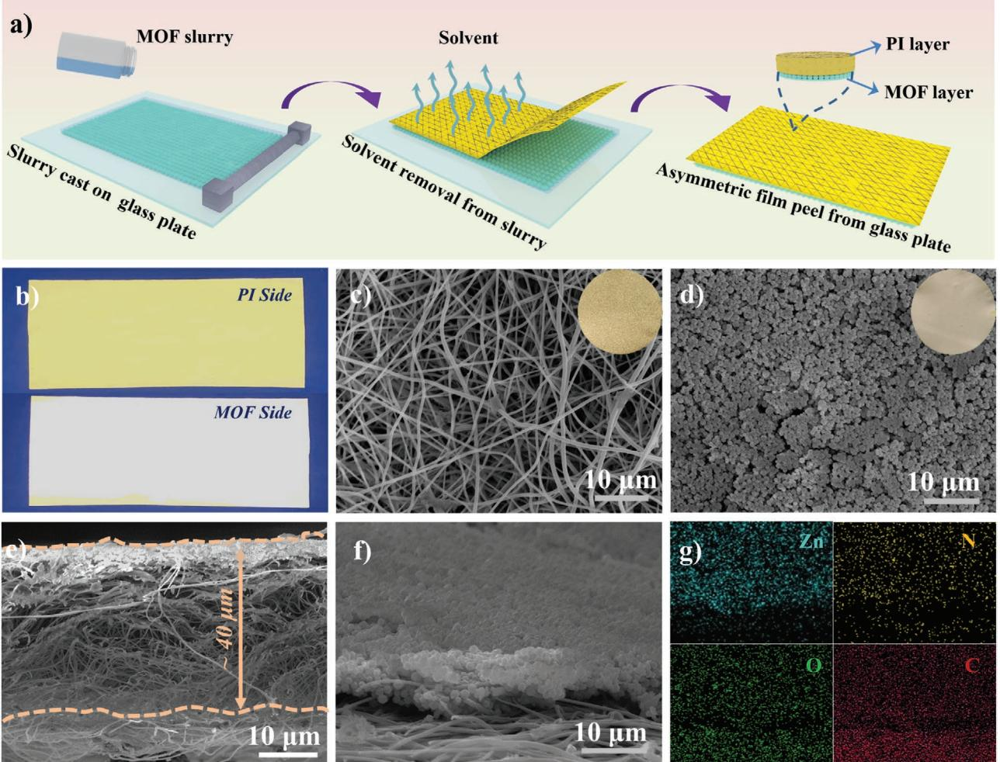
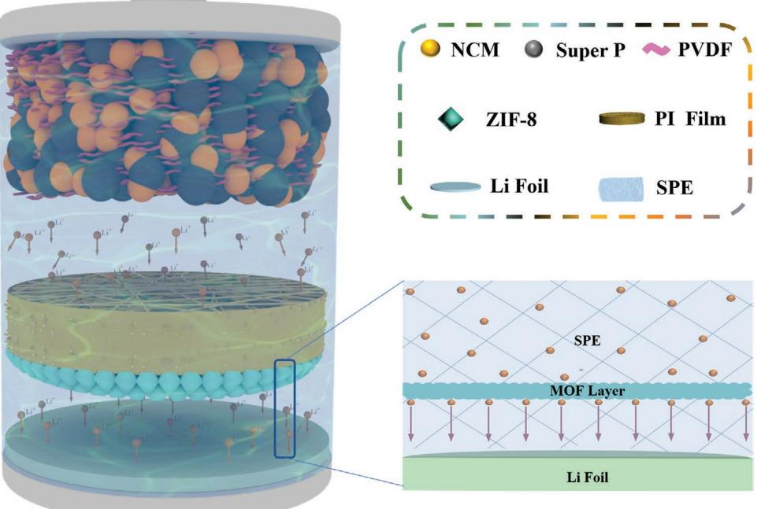
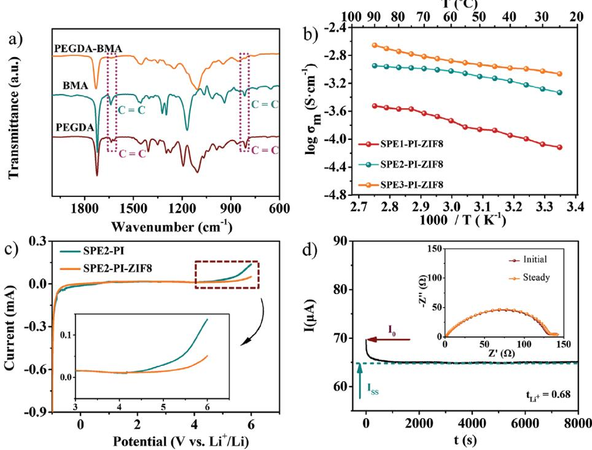
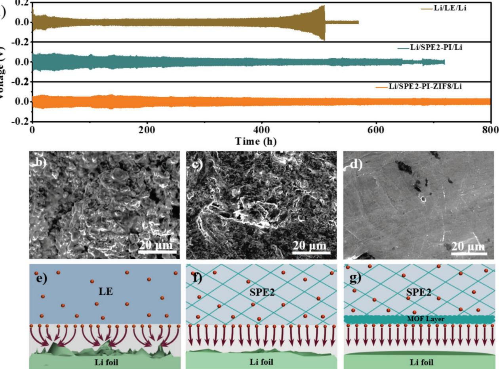
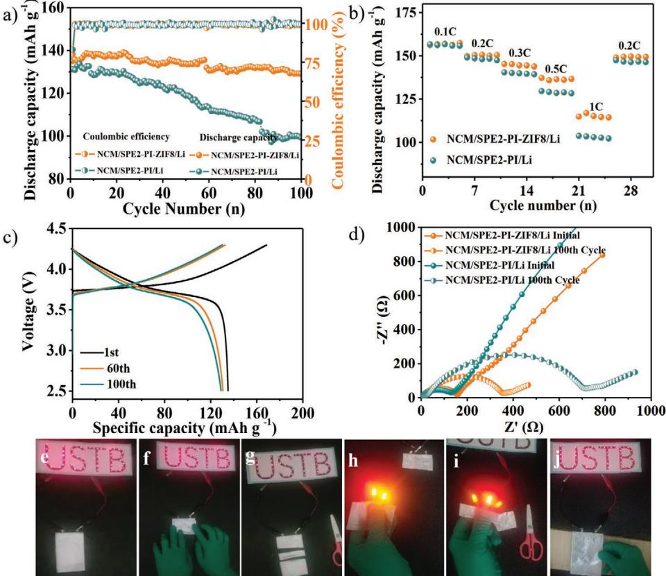

# **Asymmetric Polymer Electrolyte Constructed by Metal–Organic Framework for Solid-State, Dendrite-Free Lithium Metal Battery**

*Guoxu Wang, Pingge He, and Li-Zhen Fan\**

**Solid-state polymer electrolytes (SPEs) with flexibility, easy processability, and low cost have been regarded as promising alternatives for conventional liquid electrolytes in next-generation high-safety lithium metal batteries. However, SPEs generally suffer poor strength to block Li dendrite growth during the charge/discharge process, which severely limits their wide practical applications. Here, a rational design of 3D cross-linked network asymmetric SPE modified with a metal–organic framework (MOF) layer on one side is proposed and prepared through an in-situ polymerization process. In such unique asymmetric SPEs, the nanoscale MOF layer acts as a shield that effectively suppresses the growth of Li dendrites and regulates the uniform Li+ transport, and the polymer electrolyte can be scattered in the whole cell to endow the smooth transmission of Li+. As a result, the asymmetric SPE exhibits high ionic conductivity, wide electrochemical window, high thermal stability and safety, which endows the Li/Li symmetrical cell with outstanding cyclic stability (operate well over 800 h at a current density of 0.1 mA cm−2 for the capacity of 0.1 mAh cm−2 ).**

# **1. Introduction**

Lithium metal has attracted extensive research attention as a promising anode material for high-performance lithium batteries because of its high theoretical capacity of 3860 mAh g−1 and extremely low redox potential (−3.04 V vs standard hydrogen electrode).[1–5] Meanwhile, lithium metal plays an important role to meet the ever-increasing demands for high energy-density batteries in electronic equipment and electric vehicles.[6] However, the inherent problems of lithium dendrites formation during charging and discharging, and low columbic efficiency of lithium metal seriously impede its application in lithium metal batteries (LMBs).[7–9] Despite numerous attempts to inhibit the formation of lithium dendrites in conventional liquid electrolyte (LE), including electrolyte additives,[10] electrode protection,[11,12] separator modification,[13]

E-mail: fanlizhen@ustb.edu.cn

**DOI: 10.1002/adfm.202007198**

and current collection modification,[14] the lithium dendrite issue still remains since the stripping/deposition of lithium during charging and discharging usually causes cracks on solid electrolyte interphase (SEI), which leads to further side reactions between traditional LE and newly exposed lithium metal.[15] The results indicate that the LE system can hardly inhibit the formation of lithium dendrites, which will deteriorate the performance of batteries and even cause short circuit, resulting in safety problems.

Solid-state electrolytes instead of LE provide a promising solution for solving safety problems,[16] because solid-state electrolytes are non-toxic, non-leaking and non-flammable. The leak-free solid electrolytes, including ceramic electrolytes and polymer electrolytes, can reduce the possibility of short circuit and thermal runaway.[17] Compared to ceramic electro-

lytes which suffer brittleness and large interfacial resistance between solid-state electrolyte and electrodes,[18–21] solid-state polymer electrolytes (SPEs) hold wide promise for the next generation LMBs with easy processability, high flexibility, low cost, low interfacial resistance and lightweight.[22] However, SPEs usually show low ionic conductivity and poor mechanical strength, which cannot effectively hinder the growth Li dendrite.[23–25] In this case, mechanical properties of SPEs are usually enhanced by in-situ cross-linking or combining with inorganic ceramics.[26–31] In-situ cross-linking method not only enhances the mechanical properties of 3D network structure SPEs but also simplifies the fabrication process and reduces the interfacial resistance.[26–27] Furthermore, to inhibit lithium dendrite growth, numerous kinds of fillers are introduced to improve the mechanical modulus and ionic conductivity of SPEs. However, fillers easily aggregate in the matrix (when the filler content exceed a certain amount), leading to phase separation, which deteriorates the well-defined ion-conducting path, resulting in significant decrease in ionic conductivity and energy density of batteries.[32–34] In order to greatly combine the advantages of ceramic electrolytes and SPEs, multilayer or sandwich structured electrolytes are developed, which can not only effectively suppress the Li dendrite growth (ceramic electrolyte), but also form a stable and low resistance interface with electrodes (SPEs).[35–39] Thus, the optimized structure of electrolytes with high ionic conductivity and appropriate mechanical

G. X. Wang, Dr. P. G. He, Prof. L.-Z. Fan

Beijing Advanced Innovation Center for Materials Genome Engineering Beijing Key Laboratory for Advanced Energy Materials and Technologies University of Science and Technology Beijing Beijing 100083, China

The ORCID identification number(s) for the author(s) of this article can be found under https://doi.org/10.1002/adfm.202007198.

strength to ensure the rapid transfer of Li+ and inhibit the growth of lithium dendrites is urgently required to meet the increasing demand of high-performance solid-state lithium batteries.

Here, we designed a 3D asymmetric cross-linked network SPE modified with a thin metal–organic framework (MOF) layer on one side through an in-situ polymerization process for dendrite-free LMBs. MOFs have been recognized as effective polymer electrolyte fillers or electrolyte hosts in LMBs to improve ionic conductivity and constrain ion transport paths due to their large specific surface area, open pore structure and abundant Lewis acid sites on the surface.[40–44] In such unique asymmetric SPE structure, the MOF layer (≈5 µm) with high porosity acts as a "securer" when contacting with Li metal anode (the MOF modification side), which not only possesses high mechanical strength to inhibit the growth of lithium dendrites, but also regulates uniform Li+ flux during the charging/discharging process. Meanwhile, on the other side facing with cathode, SPE directly contacts with active materials, which greatly reduces the interface resistance and promotes the rapid transmission of Li+. Furthermore, the asymmetric 3D cross-linked network SPE is polymerized by poly(ethylene glycol) diacrylate (PEGDA) and butyl methacrylate (BMA), which can enhance the chemical and thermal stability of SPE and hinder anions transmission. Moreover, the assembled Li/Li symmetrical cell based on such asymmetric electrolyte exhibits outstanding cyclic stability over 800 h at a current density of 0.1 mA cm−2 for the capacity of 0.1 mAh cm−2 .

## **2. Results and Discussion**

The schematic illustration for preparation of asymmetric film with ZIF-8 nanoparticles modified polyamide (PI-ZIF8) is shown in the **Figure 1**a. First, ZIF-8 nanoparticles uniformly mixed with a small amount of PEO were casted on a glass plate with a scraper. Then the PI film with high porosity covered on the surface of the mixed suspension. Finally, the asymmetric film modified by ZIF-8 layer was obtained when the solvent completely evaporated. ZIF-8 nanoparticles with a uniform

**Figure 1.** a) The preparation schematic of PI-ZIF8 film; b) optical image comparison of PI-ZIF8 film with modified and unmodified ZIF-8 layer; top-view SEM images of c) modified and d) unmodified ZIF-8 layer of PI film; e,f) cross-sectional view of PI-ZIF8 and g) corresponding Zn, N, O, C elements EDS mapping images.

size of ≈300 nm used as protective layer were composed of dispersed crystals of a rhombic dodecahedral shape (as shown in Figure S1a, Supporting Information). EDS maps, as displayed in Figure S1b–d, Supporting Information, demonstrated that C, Zn, and N elements were uniformly distributed in the sample. Moreover, comparative X-ray diffraction (XRD) patterns in Figure S2, Supporting Information suggest that as-prepared ZIF-8 exhibited pure crystal phase, which matched well with the simulated one.[45] For the ZIF-8 modification layer, no characteristic peaks of PEO could be found, indicating that a small amount of PEO shows negligible effect on the crystal structure of ZIF-8. The Brunauer–Emmett–Teller (BET) surface area of pristine ZIF-8 nanoparticles (with organic functional-groups on the surface) was as high as 1237 cm2 g−1 (Figure S3, Supporting Information), which is beneficial to promote ionic conductivity and interfacial properties of electrolytes. The surface morphology of both sides (modified and unmodified sides) of PI-ZIF8 film was investigated by optical photographs and scanning electron microscopy (SEM) images. As shown in Figure 1b, one side of PI-ZIF8 film was fully covered with ZIF-8 nanoparticles (bright-yellow color), clearly distinguishing it from the pristine PI film. As shown in the corresponding SEM images, the unmodified side of PI-ZIF8 film (Figure 1c) remained the structure of pristine PI film (Figure S4, Supporting Information) and the modified side showed a dense ZIF-8 nanoparticle layer covering on the surface (Figure 1d). From the cross-sectional image (Figure 1e,f), the ZIF-8 layer (≈5 µm) and PI film (≈40 µm) exhibit dense and loose characteristics, respectively. Zn, N, O, and C element mappings in Figure 1g further demonstrated that ZIF-8 nanoparticles uniformly and densely covered on the surface of PI film. Thermogravimetric analysis (TGA) was conducted to evaluate the thermal stability of PI-ZIF8 film. Figure S5, Supporting Information shows TGA plots of celgard separator, PEO, PI film, ZIF-8 nanoparticles, and PI-ZIF8 film. Celgard separator started to rapidly decompose at about 200 °C, whereas PI-ZIF8 film decomposed over 350 °C due to the high decomposition temperatures of both ZIF-8 and PI film, which indicates that PI-ZIF8 film exhibits good thermal stability for the applications in the LMBs.

High-performance solid-state lithium batteries enabled by precursors solidified in PI-ZIF8 (SPE-PI-ZIF8) are schematically shown in **Figure 2**. The SPE-PI-ZIF8 was constructed by cross-linking PEGDA and BMA to enhance the mechanical properties and thermal stability, demonstrating unique advantages as follows: i) On the Li metal side, porous MOF layer can be used as a solid shielding layer (Figure S6, Supporting Information) to physically inhibit the growth of lithium dendrites and homogenize the concentration of Li+ by its high-polarity structure and surface functional groups.[40,44,46] In addition, during the in-situ polymerization process, the precursor of SPE can effectively penetrate the MOF layer, forming intimate contact with Li anode, and reduce the interface resistance. ii) On the cathode side, an intimate contact with a smaller interfacial resistance between SPE and cathode has formed after precursor in-situ solidification in the PI-ZIF8 film, further promoting the transport of Li+ and improving the performances of batteries. iii) PI-ZIF8 film with high electrolyte-uptake ability can absorb large amount of precursor and provide abundant Li+ supplement and continuous transmission paths, which prevents electrolyte from drying out and maintains long-lasting Li+ migration to suppress the increasing battery resistance, leading to long cycle life of LMBs and enhancing safety of Li metal batteries.[47,48] Moreover, the dense nano-MOF layer could maintain uniform distribution of Li+ flux passing through the surface

**Figure 2.** Structural schematic diagram of dendritic-free lithium metal battery constructed by asymmetric electrolyte.

**Figure 3.** a) FTIR spectra of PEGDA and BMA monomers before/after polymerization; temperature dependence of ionic conductivity of b) SPE-PI-ZIF8 with different LE content; c) LSV curves of Li/SPE2-PI/SS and Li/SPE2-PI-ZIF8/SS at room temperature; d) current variation with time during polarization of Li/SPE2-PI-ZIF8/Li symmetrical cell at room temperature.

of the Li metal anode, which helps to alleviate the growth of lithium dendrites and prevent the continuous growth of SEI caused by crack formation.[44] Furthermore, the aperture size of ZIF-8 nanoparticles is about 3.4 Å, larger than the diameter of Li+ (≈1.5 Å), which can realize directional transmission of Li+. [49]

The Fourier transform infrared (FTIR) spectra in **Figure 3**a were used to verify the successful polymerization of two monomers. The FTIR absorption bands at 1610–1680 cm−1 and 780–830 cm−1 corresponding to CC stretching vibration and twisting vibration of the acrylate groups of two monomers almost disappeared after polymerization, indicating the completion of two monomers crosslinking, and the formation of 3D network structure. Generally, the ionic conductivity would increase with higher content of LE in the system of SPE. However, from the viewpoint of safety, less LE could provide higher safety of batteries. Therefore, the effects of LE mass (with LE mass fraction of 50, 60, and 80 wt%) on SPE performance were explored. We abbreviate them as SPE1-PI-ZIF8, SPE2-PI-ZIF8, and SPE3-PI-ZIF8, respectively. The optical photograph of SPEs with varied amounts of LE after the polymerization process was shown in Figure S7a, Supporting Information, and all SPE samples show a solid-like structure. The SEM images show a uniform wrinkled texture (Figure S7b, Supporting Information) on unmodified side and flat structure (Figure S7c, Supporting Information) on modified side of SPE-PI-ZIF8 surface. From the cross-section SEM of SPE-PI-ZIF8 (Figure S7d, Supporting Information), the precursor has fully penetrated into the pores of the PI-ZIF8 film. Meanwhile, Zn and N EDS-elemental mappings in Figure S7e,f, Supporting Information further verify that the thickness of ZIF-8 layer was ≈5 µm. In Figure 3b, the ionic conductivities of asymmetric electrolytes gradually reduced with the decrease of LE amount. When the LE amount decreased to 60 wt%, the ionic conductivity of SPE2- PI-ZIF8 could still maintain at 4.7 × 10−4 S cm−1 , which could ensure the rapid transmission of lithium ions. No significant differences in conductivity between SPE2-PI-ZIF8 and SPE2- PI (6.38 × 10−4 S cm−1 in Figure S8, Supporting Information) are observed, indicating that the introduction of the thin nano-MOF layer had little effect on the conductivity of composite SPE.

The electrochemical-stability window is an important criterion for evaluating the applicability of electrolyte for highvoltage LMBs. Figure 3c presented the LSV curves to test the electrochemical-stability window of SPE2-PI-ZIF8 and SPE2-PI at 25 °C. For SPE2-PI, the current density began to increase obviously at around 4.5 V, while the SPE2-PI-ZIF8 began to decompose until at 4.9 V (versus Li+/Li) due to the introduction of MOF layer, indicating the SPE2-PI-ZIF8 is more favorable for high-energy battery applications. Moreover, lithium-ion transference number *t*Li+ plays an important role to affect the Li dendrite growth during the charging/discharging process, since low *t*Li+ will build large lithium-ion concentration gradient near the Li anode, which leads to the formation of strong interfacial electric-field and thus the intensification of dendrite propagation.[32,50] In the case of Li cell with SPE2-PI-ZIF8 electrolyte, a high *t*Li+ (0.68) was obtained (Figure 3d), which was over three times higher than that of traditional LE (*t*Li+ = 0.2 shown in Figure S9a, Supporting Information) and also much

**www.advancedsciencenews.com www.afm-journal.de**

**Figure 4.** Electrochemical tests, Li morphologies and schematic illustrations of Li deposition of Li/Li symmetric cells with LE, SPE2-PI and SPE2-PI-ZIF8. a) Curves for comparation the long-term cycling stabilities of Li/LE/Li, Li/SPE2-PI/Li and Li/SPE2-PI-ZIF8/Li cells at current densities of 0.1 mA cm−2 for 0.1 mAh cm−2 . Surface morphology images of Li metal b) in LE electrolyte, c) in SPE2-PI, and d) in SPE2-PI-ZIF8 on MOF-coating layer side after lithium plating/stripping 500 h at current density of 0.1 mA cm−2 for 0.1 mAh cm−2 ; the illustration of Li deposition behaviors of Li/Li symmetric cells with e) LE, f) SPE2-PI, and g) SPE2-PI-ZIF8.

higher than that of SPE2-PI (*t*Li+ = 0.45 shown in Figure S9b, Supporting Information). The high lithium-ion transference number observed in SPE2-PI-ZIF8 electrolyte was attributed to the 3D polymer network structure formed by monomer crosslinking and limited anion transport via modified MOF layer on the PI film.

The long-term electrochemical stabilities and voltage polarization were investigated by lithium plating and stripping experiment in symmetric Li/Li batteries with the LE, SPE2- PI, and SPE2-PI-ZIF8, respectively. All the symmetric Li/Li batteries were charged and discharged at a current density of 0.1 mA cm−2 for the area capacity of 0.1 mAh cm−2 . As shown in **Figure 4**a, the LE-based symmetric Li/Li battery exhibited a smaller polarization during the first 400 h, then the polarization voltage began to increase sharply, finally showing short-circuit after 500 h. The result indicated that nonuniform lithium-ion plating/stripping were proceeding at the surface of Li anode, and Li dendrites gradually grew and finally penetrating the separator. For Li/SPE2-PI/Li, the battery exhibited stable cycling performance with a small polarization voltage until slight short-circuit occurred after about 650 h, indicating that the mechanical strength of SPE2-PI is not enough to effectively inhibit the growth of lithium dendrites. In a sharp contrast, the voltage polarization in Li/SPE2-PI-ZIF8/Li showed a smooth plateau even after 800 h, suggesting the MOF layer played an important role in inhibiting lithium dendrite growth and stabilizing lithium-ion transport. Subsequently, another comparative experiment was implemented at a current density 0.3 mA cm−2 for 0.3 mAh cm−2 (Figure S10, Supporting Information). The voltage polarization of Li/LE/Li battery remarkably increased in the initial period and the Li/SPE2-PI/Li battery was shortcircuited soon. On the contrary, for Li/SPE2-PI-ZIF8/Li, despite the slightly increased polarization voltage, it could still keep stable, further proving the important role of MOF layer in enhancing the cycling performance of batteries. The Li/SPE2- PI-ZIF8/Li cell showed long-term stability cycles at 0.4 mA cm−2 over hundreds of hours (Figure S11, Supporting Information).

In order to investigate morphology evolution of the Li anode after long-term Li plating/stripping, the symmetric Li/Li batteries were disassembled after lithium plating/stripping of

500 h at current density of 0.1 mA cm−2 for the area capacity of 0.1 mAh cm−2 . The fresh Li metal anode shows a smooth and dense surface, as shown in Figure S12a, Supporting Information. However, massive loose and porous "dead Li" can be observed after repeated Li plating/stripping in Li/LE/Li battery (Figure 4b). For Li/SPE2-PI/Li battery, massive "dead Li" disappeared, but the Li anode surface was still very rough (Figure 4c), demonstrating that SPE2-PI with three-dimensional polymer network could alleviate the growth of lithium dendrites to some extent, but the issue could not be fundamentally resolved. Nevertheless, the side of Li anode contacting with MOF layer (Figure 4d and Figure S12b, Supporting Information) in Li/ SPE2-PI-ZIF8/Li battery showed smooth and shiny surface, revealing that the growth of lithium dendrites could be effectively inhibited by the MOF layer. Furthermore, no apparent lithium dendrites were found on the other side (not contacting with MOF layer) of Li anode (Figure S12c, Supporting Information). These results demonstrate that the MOF layer effectively stabilizing lithium ion transport in batteries. The critical current density of Li/SPE2-PI-ZIF8/Li cell was characterized as well (Figure S13, Supporting Information). The charge/discharge polarization voltage increased with the increase of current densities from 0.1 to 0.7 mA cm−2 and short-circuit phenomenon occurred at 1.2 mA cm−2 . The interfacial resistance between the Li anode and LE, SPE2-PI and SPE2-PI-ZIF8 were monitored over continuous time to study the stability of the electrode/electrolyte interface (Figure S14, Supporting Information). At the initial stage, the Li/LE/Li cell exhibited the smallest interfacial resistance (≈70 Ω) compared to those of Li/SPE2-PI/ Li (≈90 Ω) and Li/SPE2-PI-ZIF8/Li (≈120 Ω) cells. The interfacial resistance gradually increased in Li/LE/Li cell, while interfacial resistance in Li/SPE2-PI/Li and Li/SPE2-PI-ZIF8/Li cells became stable after 5 days. These results suggest that SPE has batter compatibility with Li anode and the SEI film formed on the surface of Li anode in SPE is more stable than that of LE, which is good agreement with literature reports.[37,51,52] Moreover, the process of Li+ deposition in the Li metal batteries with LE, SPE2-PI, and SPE2-PI-ZIF8 electrolyte is explicated by schematic illustrations. In LE system (Figure 4e), heterogeneous deposition caused by polarization and strong electric field tends to bring out dendrite nucleation and unconstrained dendrite growth, leading to safety problems.[34] Compared with LE, SPE2- PI can improve the interface compatibility with lithium anode. The wrapping of liquid phase in polymer skeleton ensures less contact between lithium surface and active electrolyte components, effectively reducing the interfacial reaction (Figure 4f), and promoting the uniform deposition of lithium ions on the surface of Li anode,[35,36] but the mechanical strength of SPE2- PI is not enough to completely inhibit the growth of lithium dendrites. For SPE2-PI-ZIF8 electrolyte (Figure 4g), besides the advantages of SPE2-PI, MOF layer can enhance the mechanical strength of electrolyte and regulate uniform Li+ transport, consequently inhibiting the growth of lithium dendrites.

To study the role of the MOF coating layer in uniformly distributing Li+ flux at the surface of Li anode, MOF layer coated on the surface of Cu foil (termed as Cu-ZIF8) was further examined in Li/LE/Cu-ZIF8 battery. The Cu-ZIF8 was prepared by casting the slurry of ZIF-8 and PEO on the surface of Cu foil, following by drying. From the SEM images in Figure S15b,

Supporting Information, the MOF layer with a thickness of about 5 µm was tightly covered on the surface of Cu foil (Figure S15a, Supporting Information). Moreover, the morphologies of the Li deposition in Li/LE/Cu and Li/LE/Cu-ZIF8 batteries at amount of 1 mAh cm−2 at current density of 1 mA cm−2 are investigated by SEM. For the bare Cu electrode, severe needlelike dendrites grew on the surface of Cu foil (Figure S15c, Supporting Information). On the contrary, no lithium dendrite was found on the surface of Cu-ZIF8 after lithium deposition, as shown in Figure S15d, Supporting Information, which indicated that MOF layer worked as a shield to homogeneously distribute Li+ transport and inhibit lithium dendrites growth during the whole process.

The practical applicability of such asymmetric electrolytes is demonstrated through assembled full cells using Li metal as anode and LiNi0.5Co0.2Mn0.3O2 coated by Al2O3 (termed as NCM) as cathode testing from 2.5 to 4.3 V. As depicted in **Figure 5**a, the NCM/SPE2-PI-ZIF8/Li full cell at 0.5C rate not only exhibited a remarkably high initial capacity (135 mAh g−1 ) but also an excellent long-term cycling stability over 100 cycles (a capacity retention of 95.6%) when compared to that of NCM/SPE2-PI/Li cell over 100 cycles. The capacity of NCM/ SPE2-PI/Li cell decreased gradually during the process of cycling. After 100 cycles, the capacity retention of the cells was only 75.6%. The rate performance of the NCM/Li cells with SPE2-PI-ZIF8 and SPE2-PI under different rates from 0.1 to 1C was presented in Figure 5b. Although the discharge capacities of both cells reduced with the increase of current density, the NCM/SPE2-PI-ZIF8/Li cell still delivered higher discharge capacities especially at high rates. Even at 1C rate, the NCM/ SPE2-PI-ZIF8/Li battery can also possess a discharge capacity of 114 mAh g−1 . More importantly, when the rate was reversed back to 0.2C, the specific capacity of NCM/SPE2-PI-ZIF8/Li cell could be nearly recovered. As seen from the Figure 5c and Figure S16a, Supporting Information, the polarization voltage of NCM/SPE2-PI-ZIF8/Li cell was significantly lower than that of NCM/SPE2-PI/Li cell after 100 cycles. The decreased capacity in NCM/SPE2-PI/Li cell indicated the continuous lithium-dendrite growth on the surface of Li anode. As shown in Figure 5d, the interfacial resistance of NCM/SPE2-PI/Li greatly increases with increasing number of cycles. Whereas, NCM/ SPE2-PI-ZIF8/Li battery remains a relatively stable interfacial resistance, indicating that the MOF layer can effectively help to alleviate the growth of lithium dendrites. Furthermore, the intimate contact between SPE2-PI-ZIF8 and NCM cathode can be formed after precursor in-situ solidification (Figure S17, Supporting Information). The SPE2-PI-ZIF8 and NCM cathode layer interface is well contact without any visible delamination, indicating that this tight and continuous contact interface can enable reduction of the interfacial resistance, and promote ion transfer in the solid-state LMBs. Similarly, SPE2- PI-ZIF8 also demonstrated excellent performances in LFP/Li battery. The specific capacity of LFP/SPE2-PI-ZIF8/Li cell was 162 mAh g−1 at 0.1C, 134 mAh g−1 at 0.5C, 117 mAh g−1 at 1C, 97 mAh g−1 at 2C, 79 mAh g−1 at 3C and 58 mAh g−1 at 5C (Figure S16b, Supporting Information). The stable discharge capacity and columbic efficiency over a long period further indicated that the interface of LFP/SPE2-PI-ZIF8/Li is stable (Figure S16c, Supporting Information). The outstanding

**Figure 5.** Electrochemical characterizations of full cells at 25 °C. a) Cycling performances at 0.5C and b) rate capability of the NCM/SPE2-PI/Li and NCM/SPE2-PI-ZIF8/Li batteries with 4.3 V cut-off; c) charge and discharge profiles of NCM/SPE2-PI-ZIF8/Li cell at different cycles at rate of 0.5C; d) Nyquist plots of the NCM/SPE2-PI/Li and NCM/SPE2-PI-ZIF8/Li batteries before and after 100 cycles; photographs of NCM/SPE2-PI-ZIF8/Li pouch cell can light up LED lamps at e) flat, f) bending, g) cutting, and j) punching states. h,i) The obtained piece of pouch cell for lighting some LED lamps.

cycling performances and rate capability of LFP/SPE2-PI-ZIF8/Li were ascribed to the unique structure of the asymmetric electrolyte modified with MOF layer.

Safety is an important factor to evaluate the performance of lithium batteries in practical applications, especially in the fields of large energy storage devices such vehicles and mobile electronic devices. The NCM/SPE2-PI-ZIF8/Li pouch type cell was assembled to evaluate the safety property of SPE2-PI-ZIF8 under harsh conditions. As demonstrated in Figure 5e–g, the pouch cell could make LED lamps operate well under the conditions of flat, bending, and even being cut, which demonstrated the superior safety performance of NCM/SPE2-PI-ZIF8/Li pouch cell. Meanwhile, the obtained piece of the cell could also light up LED lamps (Figure 5h,i). Furthermore, the pouch cell still kept a good shape without any flame after nail tests (Figure 5j), which demonstrated that NCM/SPE2-PI-ZIF8/ Li solid-state cell displayed superior safety performance in practical applications.

#### **3. Conclusion**

In summary, we proposed a facile and rational strategy to construct an asymmetric SPE modified by a mechanically-robust and nanoscale MOF layer. Such an asymmetric SPE could not only suppress the growth of lithium dendrites through regulating uniform Li+ deposition by MOF layer, but also reduce the interfacial resistance between electrodes and electrolytes through an in-situ polymerization method. Furthermore, the MOF layer combination with 3D cross-linked polymer network could significantly improve the mechanical properties and ionic conductivity of asymmetric SPE. The obtained SPE2-PI-ZIF8 showed high ionic conductivity (4.7 × 10−4 S cm−1 ) and *t*Li+ (0.68) at room temperature. Moreover, Li/Li symmetric and LBMs cells based on SPE2-PI-ZIF8 maintained a low and stable voltage hysteresis even over 800 h cycles and delivered high capacity retention (95.6%) after 100 cycles and excellent safety. The SPE2-PI-ZIF8 provides a promising way to develop nextgeneration LMBs with high energy density and superior safety performance.

## **4. Experimental Section**

*Materials Preparation*: Zn(CH3COO)2, 2-methylimidazole and 2, 2′-Azobis-(2, 4-dimethylvaleronitrile) (ABVN, C14H24N4) were purchased from Macklin. Polyethylene oxide (PEO, *M*w: 600 000). Poly(ethylene glycol) diacrylate (PEGDA, Mw:400) and butyl methacrylate (BMA, *M*w: 142.2) were purchased from Sigma-Aldrich. 1 m LiPF6/ethylene carbonate (EC): dimethylcarbonate (DMC): ethylmethylcarbonate (EMC) (v/v/v = 1:1:1)

were obtained from Shenzhen Capchem Technology Co., Ltd. PI film was achieved from Jiangxi Advanced Nanofiber S&T Co., Ltd.

*Synthesis of ZIF-8 Nanoparticles*: The preparation of ZIF-8 nanoparticles was based on previous report.[45] Specifically, 175 mg Zn(CH3COO)2 powder and 263 mg 2-methylimidazole powder were directly mixed. Afterwards, 40 mL methanol was added to stir vigorously for 5 min and then the obtained solution aged at room temperature for 24 h. Finally, white powder was separated by centrifugation and washed with methanol for three times before vacuum drying.

*Fabrication of ZIF-8 Nanoparticles Modified PI Film*: First, 1 g ZIF-8 nanoparticle was added to 10 mL anhydrous acetonitrile and dispersed by ultrasound for 10 min, and then 0.1 g PEO was added into the slurry. The resulting suspension was stirred in a sealed state for 24 h to obtain homogeneous emulsion. The prepared emulsion was cast on the glass plate by a doctor blade with a thickness of 50 µm and then the PI film was covered on it. After the solvent evaporated completely, the asymmetric PI film modified by ZIF-8 nanoparticles could be obtained.

*Preparation of 3D Asymmetric Cross-Linked Network SPE*: 3D asymmetric cross-linked network SPE was prepared through an in-situ thermal-initiated polymerization method. PEGDA, BMA and thermal initiator AVBN were added into the carbonate electrolyte (1 m LiPF6 in EC: DMC: DEC) and stirred for 30 min to form a uniform solution. The mass ratio of PEGDA to BMA was 2:1 with (100−*X*) wt% (PEGDA+BMA) + *X* wt% (carbonate electrolyte), (*X* = 50, 60, 80). The mass of thermal initiator AVBN was 1% of the mass of monomer. The precursor solution was injected into PI-ZIF8 or PI film of cells and then assembled. Then, the cells were heated at 60 °C for 3 h in order to polymerization completely. Three kinds of precursors (*X* = 50, 60, 80) solidified in PI-ZIF8 (PI) film to obtain 3D asymmetric cross-linked network SPE, which could be termed as SPE1-PI-ZIF8, SPE2-PI-ZIF8, and SPE3- PI-ZIF8, respectively (SPE1-PI, SPE2-PI, and SPE3-PI). All processes of preparing the 3D asymmetric cross-linked network SPE were operated in an Ar-filled glove box (H2O < 0.1 ppm, O2 < 0.1 ppm).

# **Supporting Information**

Supporting Information is available from the Wiley Online Library or from the author.

# **Acknowledgements**

Financial supports from the National Key R&D Program of China (Grant No. 2018YFB0104300), National Natural Scientific Foundation of China (51872027) and Natural Science Foundation of Beijing Municipality (Z200011) are gratefully acknowledged.

#### **Conflict of Interest**

The authors declare no conflict of interest.

#### **Keywords**

asymmetric polymer electrolyte, dendrite-free Li anode, metal–organic framework, thermal stability

> Received: August 24, 2020 Revised: September 27, 2020

- Published online: October 6, 2020
- [1] Y. Zhang, T.-T. Zuo, J. Popovic, K. Lim, Y.-X. Yin, J. Maier, Y.-G. Guo, *Mater. Today* **2020**, *33*, 56.
- [2] D. Lin, Y. Liu, Y. Cui, *Nat. Nanotechnol.* **2017**, *12*, 194.
- [3] X.-B. Cheng, C.-Z. Zhao, Y.-X. Yao, H. Liu, Q. Zhang, *Chem* **2019**, *5*, 74.
- [4] S. Huang, H. Yang, J. Hu, Y. Liu, K. Wang, H. Peng, H. Zhang, L.-Z. Fan, *Small* **2019**, *15*, 1904216.
- [5] T. S. Wang, X. Liu, Y. Wang, L.-Z. Fan, *Adv. Funct. Mater.* **2020**, 2001973.
- [6] P. G. Bruce, S. A. Freunberger, L. J. Hardwick, J. M. Tarascon, *Nat. Mater.* **2012**, *11*, 19.
- [7] N.-W. Li, Y.-X. Yin, C.-P. Yang, Y.-G. Guo, *Adv. Mater.* **2016**, *28*, 1853.
- [8] Z. Xu, J. Wang, J. Yang, X. Miao, R. Chen, J. Qian, R. Miao, *Angew. Chem., Int. Ed.* **2016**, *128*, 10528.
- [9] J. B. Goodenough, *Energy Environ. Sci.* **2014**, *7*, 14.
- [10] X.-Q. Zhang, X.-B. Cheng, X. Chen, C. Yan, Q. Zhang, *Adv. Funct. Mater.* **2017**, *27*, 1605989.
- [11] G. Zheng, S. W. Lee, Z. Liang, H. W. Lee, K. Yan, H. Yao, H. Wang, W. Li, S. Chu, Y. Cui, *Nat. Nanotechnol.* **2014**, *9*, 618.
- [12] X. B. Cheng, R. Zhang, C. Z. Zhao, F. Wei, J. G. Zhang, Q. Zhang, *Adv. Sci.* **2016**, *3*, 1500213.
- [13] X. B. Cheng, R. Zhang, C. Z. Zhao, Q. Zhang, *Chem. Rev.* **2017**, *117*, 10403.
- [14] S.-S. Chi, Y. Liu, W.-L. Song, L.-Z. Fan, Q. Zhang, *Adv. Funct. Mater.* **2017**, *27*, 1700348.
- [15] X. Shen, H. Ji, J. Liu, J. Zhou, C. Yan, T. Qian, *Energy Storage Mater.* **2020**, *24*, 426.
- [16] Y. Li, H. Xu, P. H. Chien, N. Wu, S. Xin, L. Xue, K. Park, Y. Y. Hu, J. B. Goodenough, *Angew. Chem., Int. Ed.* **2018**, *57*, 8587.
- [17] S. Xin, Y. You, S. Wang, H.-C. Gao, Y.-X. Yin, Y.-G. Guo, *ACS Energy Lett.* **2017**, *2*, 1385.
- [18] C. Yang, L. Zhang, B. Liu, S. Xu, T. Hamann, D. McOwen, J. Dai, W. Luo, Y. Gong, E. D. Wachsman, L. Hu, *Proc. Natl. Acad. Sci. U. S. A.* **2018**, *115*, 3770.
- [19] Y. Li, X. Chen, A. Dolocan, Z. Cui, S. Xin, L. Xue, H. Xu, K. Park, J. B. Goodenough, *J. Am. Chem. Soc.* **2018**, *140*, 6448.
- [20] Y. Li, W. Zhou, S. Xin, S. Li, J. B. Goodenough, *Angew. Chem., Int. Ed.* **2016**, *55*, 9965.
- [21] H. Xu, Y. Li, A. Zhou, N. Wu, S. Xin, Z. Li, J. B. Goodenough, *Nano Lett.* **2018**, *18*, 7414.
- [22] P. Hovington, M. Lagace, A. Guerfi, P. Bouchard, A. Mauger, C. M. Julien, M. Armand, K. Zaghib, *Nano Lett.* **2015**, *15*, 2671.
- [23] H. T. Le, D. T. Ngo, R. S. Kalubarme, G. Cao, C. N. Park, C. J. Park, *ACS Appl. Mater. Interfaces* **2016**, *8*, 20710.
- [24] J. Zhang, J. Zhao, L. Yue, Q. Wang, J. Chai, Z. Liu, X. Zhou, H. Li, Y. Guo, G. Cui, L. Chen, *Adv. Energy Mater.* **2015**, *5*, 1501082.
- [25] P. Yao, B. Zhu, H. Zhai, X. Liao, Y. Zhu, W. Xu, Q. Cheng, C. Jayyosi, Z. Li, J. Zhu, K. M. Myers, X. Chen, Y. Yang, *Nano Lett.* **2018**, *18*, 6113.
- [26] S. Choudhury, R. Mangal, A. Agrawal, L. A. Archer, *Nat. Commun.* **2015**, *6*, 10101.
- [27] W. Fan, N. W. Li, X. Zhang, S. Zhao, R. Cao, Y. Yin, Y. Xing, J. Wang, Y. G. Guo, C. Li, *Adv. Sci.* **2018**, *5*, 1800559.
- [28] J. Bae, Y. Li, J. Zhang, X. Zhou, F. Zhao, Y. Shi, J. B. Goodenough, G. Yu, *Angew. Chem., Int. Ed.* **2018**, *57*, 2096.
- [29] N. Wu, P. H. Chien, Y. Li, A. Dolocan, H. Xu, B. Xu, N. S. Grundish, H. Jin, Y. Y. Hu, J. B. Goodenough, *J. Am. Chem. Soc.* **2020**, *142*, 2497.
- [30] L. Chen, Y. Li, S.-P. Li, L.-Z. Fan, C.-W. Nan, J. B. Goodenough, *Nano Energy* **2018**, *46*, 176.
- [31] J. Hu, P. He, B. Zhang, B. Wang, L.-Z. Fan, *Energy Storage Mater.* **2020**, *26*, 283.
- [32] L. Chen, W. Li, L.-Z. Fan, C. W. Nan, Q. Zhang, *Adv. Funct. Mater.* **2019**, *29*, 1901047.
- [33] T. Jiang, P. He, G. Wang, Y. Shen, C. W. Nan, L.-Z. Fan, *Adv. Energy Mater.* **2020**, *10*, 1903376.
- [34] J. Shim, H. J. Kim, B. G. Kim, Y. S. Kim, D.-G. Kim, J.-C. Lee, *Energy Environ. Sci.* **2017**, *10*, 1911.

**www.advancedsciencenews.com www.afm-journal.de**

- [35] H. Duan, M. Fan, W. P. Chen, J. Y. Li, P. F. Wang, W. P. Wang, J. L. Shi, Y. X. Yin, L. J. Wan, Y. G. Guo, *Adv. Mater.* **2019**, *31*, 1807789.
- [36] J. Y. Liang, X. X. Zeng, X. D. Zhang, T. T. Zuo, M. Yan, Y. X. Yin, J. L. Shi, X. W. Wu, Y. G. Guo, L. J. Wan, *J. Am. Chem. Soc.* **2019**, *141*, 9165.
- [37] W. Zhou, S. Wang, Y. Li, S. Xin, A. Manthiram, J. B. Goodenough, *J. Am. Chem. Soc.* **2016**, *138*, 9385.
- [38] Y. Li, B. Xu, H. Xu, H. Duan, X. Lu, S. Xin, W. Zhou, L. Xue, G. Fu, A. Manthiram, J. B. Goodenough, *Angew. Chem., Int. Ed.* **2017**, *56*, 753.
- [39] H. Huo, Y. Chen, J. Luo, X. Yang, X. Guo, X. Sun, *Adv. Energy Mater.* **2019**, *9*, 1804004.
- [40] Z. Wang, S. Wang, A. Wang, X. Liu, J. Chen, Q. Zeng, L. Zhang, W. Liu, L. Zhang, *J. Mater. Chem. A* **2018**, *6*, 17227.
- [41] Z. Wang, R. Tan, H. Wang, L. Yang, J. Hu, H. Chen, F. Pan, *Adv. Mater.* **2018**, *30*, 1704436.
- [42] H. Huo, B. Wu, T. Zhang, X. Zheng, L. Ge, T. Xu, X. Guo, X. Sun, *Energy Storage Mater.* **2019**, *18*, 59.
- [43] S. Bai, Y. Sun, J. Yi, Y. He, Y. Qiao, H. Zhou, *Joule* **2018**, *2*, 2117.
- [44] J. Qian, Y. Li, M. Zhang, R. Luo, F. Wang, Y. Ye, Y. Xing, W. Li, W. Qu, L. Wang, L. Li, Y. Li, F. Wu, R. Chen, *Nano Energy* **2019**, *60*, 866.
- [45] N. L. Torad, M. Hu, Y. Kamachi, K. Takai, M. Imura, M. Naito, Y. Yamauchi, *Chem. Commun.* **2013**, *49*, 2521.
- [46] C. Yuan, J. Li, P. Han, Y. Lai, Z. Zhang, J. Liu, *J. Power Sources* **2013**, *240*, 653.
- [47] M. Zhu, J. Wu, W.-H. Zhong, J. Lan, G. Sui, X. Yang, *Adv. Energy Mater.* **2018**, *8*, 1702561.
- [48] Y. Zhu, J. Cao, H. Chen, Q. Yu, B. Li, *J. Mater. Chem. A* **2019**, *7*, 6832.
- [49] Y. Yu, C. Yue, X. Lin, S. Sun, J. Gu, X. He, C. Zhang, W. Lin, D. Lin, X. Liao, B. Xu, S. Wu, M. Zheng, J. Li, J. Kang, L. Lin, *ACS Appl. Mater. Interfaces* **2016**, *8*, 3992.
- [50] R. Xu, Y. Xiao, R. Zhang, X. B. Cheng, C. Z. Zhao, X. Q. Zhang, C. Yan, Q. Zhang, J. Q. Huang, *Adv. Mater.* **2019**, *31*, 1808392.
- [51] Y. Guo, H. Li, T. Zhai, *Adv. Mater.* **2017**, *29*, 1700007.
- [52] F. Liu, W. Wang, Y. Yin, S. Zhang, J. Shi, L. Wang, X. Zhang, Y. Zheng, J. J. Zhou, L. Li, Y. Guo, *Sci. Adv.* **2018**, *4*, eaat5383.