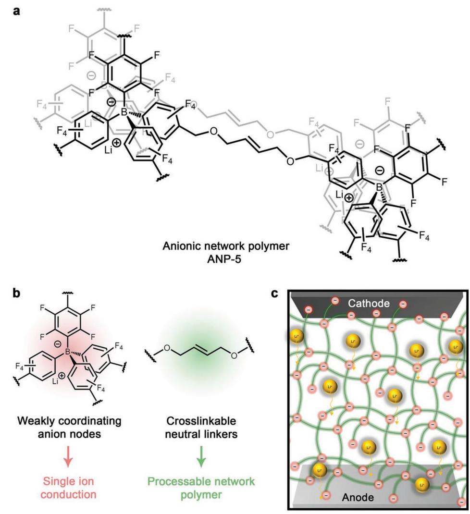
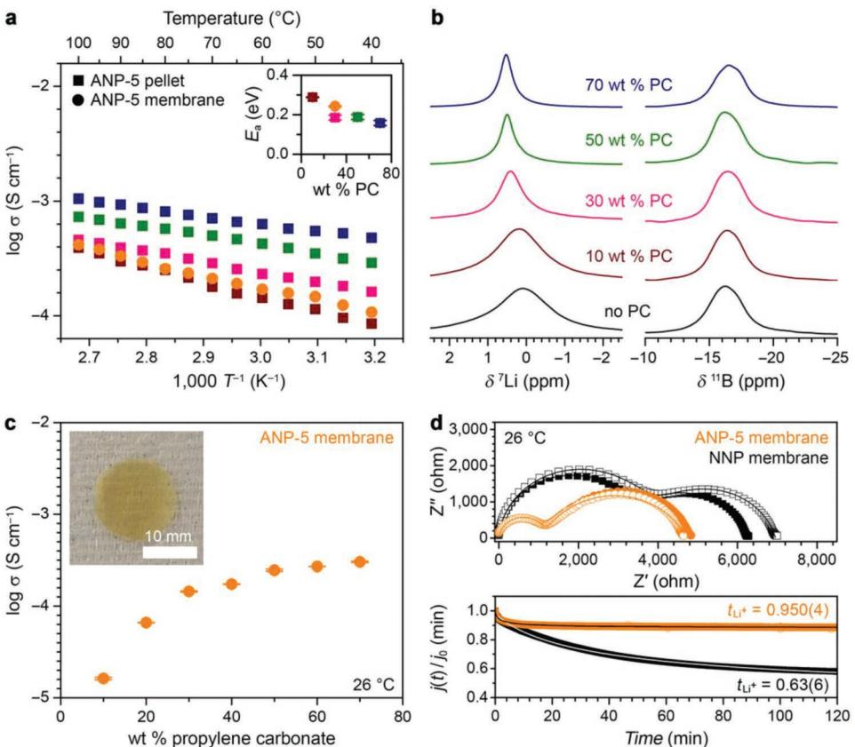
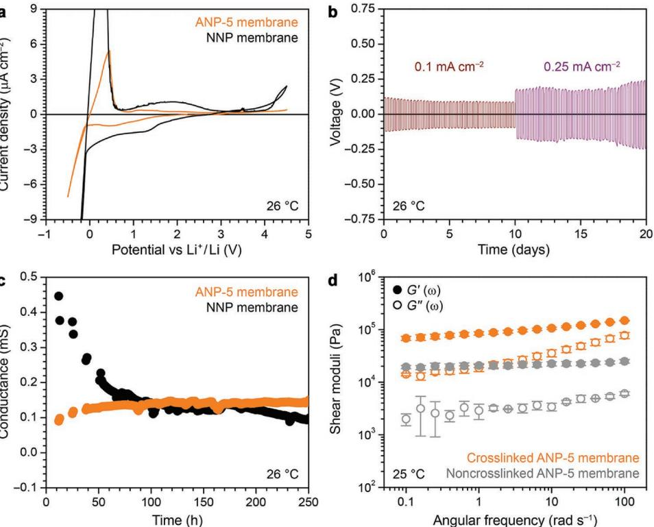
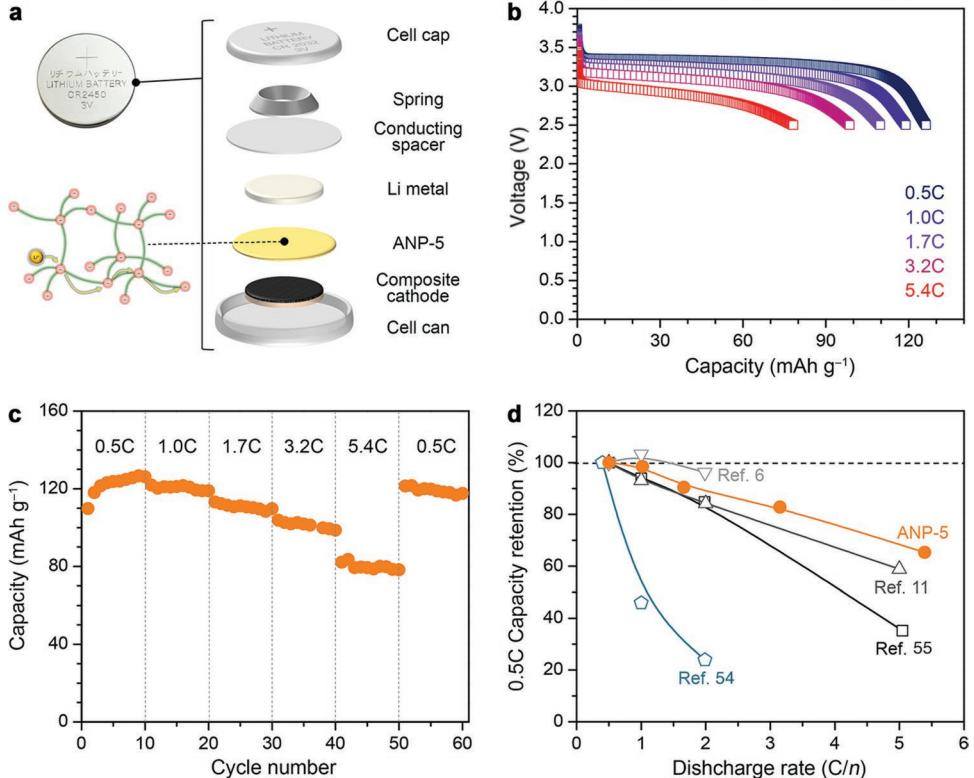

# **A Single-Ion Conducting Borate Network Polymer as a Viable Quasi-Solid Electrolyte for Lithium Metal Batteries**

*Dong-Myeong Shin, Jonathan E. Bachman, Mercedes K. Taylor, Jovan Kamcev, Jesse G. Park, Michael E. Ziebel, Ever Velasquez, Nanette N. Jarenwattananon, Gurmukh K. Sethi, Yi Cui, and Jeffrey R. Long\**

**Lithium-ion batteries have remained a state-of-the-art electrochemical energy storage technology for decades now, but their energy densities are limited by electrode materials and conventional liquid electrolytes can pose significant safety concerns. Lithium metal batteries featuring Li metal anodes, solid polymer electrolytes, and high-voltage cathodes represent promising candidates for next-generation devices exhibiting improved power and safety, but such solid polymer electrolytes generally do not exhibit the required excellent electrochemical properties and thermal stability in tandem. Here, an interpenetrating network polymer with weakly coordinating anion nodes that functions as a high-performing single-ion conducting electrolyte in the presence of minimal plasticizer, with a wide electrochemical stability window, a high room-temperature conductivity of 1.5 × 10−4 S cm−1 , and exceptional selectivity for Li-ion conduction (***t***Li+ = 0.95) is reported. Importantly, this material is also flame retardant and highly stable in contact with lithium metal. Significantly, a lithium metal battery prototype containing this quasisolid electrolyte is shown to outperform a conventional battery featuring a polymer electrolyte.**

Increasing energy demand in sectors ranging from electronics to transportation is driving research into battery technologies that can deliver higher energy densities, longer cycle lifetimes, and enhanced safety at reasonable costs.[1–3] One major development has been a conceptual shift away from commercial secondary lithium-ion batteries, which feature a liquid electrolyte and carbonaceous anode, toward higher energy density

Prof. D.-M. Shin, Dr. M. K. Taylor, Prof. J. Kamcev, J. G. Park, M. E. Ziebel, Dr. N. N. Jarenwattananon, Prof. J. R. Long Department of Chemistry University of California, Berkeley Berkeley, CA 94720, USA E-mail: jrlong@berkeley.edu Prof. D.-M. Shin Department of Mechanical Engineering The University of Hong Kong Pokfulam Road 999077, Hong Kong, China Dr. J. E. Bachman, Prof. Y. Cui Department of Materials Science and Engineering Stanford University Stanford, CA 94305, USA

The ORCID identification number(s) for the author(s) of this article can be found under https://doi.org/10.1002/adma.201905771.

#### **DOI: 10.1002/adma.201905771**

rechargeable lithium metal batteries. Lithium metal offers many advantages over carbon-based anodes, including a high specific capacity (3860 mAh g−1 ) that is ten times that of graphite and a large reduction potential (−3.04 V vs the standard hydrogen electrode).[4–6] Concomitantly, there is growing interest in the development of solid-state materials to replace commercial liquid electrolytes—composed of inorganic lithium salts dissolved in alkyl carbonates—as these suffer from a number of limitations, including flammability, low ion selectivity in conduction, and incompatibility with lithium metal.[7] Indeed, lithium dendrites formed upon charging can separate from the anode, reducing battery energy density, and infiltrate the electrolyte, leading to decomposition and dangerous thermal runaway.[7,8]

Recent materials design efforts have focused on the development of ion-

selective solid polymer electrolytes that feature anionic groups immobilized onto the polymer backbone,[6,8–14] wherein only Li+ cations are free to move through the material. These singleion conductors can display Li+ transport numbers approaching unity, but their room temperature ionic conductivities are typically less than 10−5 S cm−1 , [6,10] an order of magnitude lower than the minimum conductivity required for lithium battery

Dr. M. K. Taylor, Prof. J. R. Long Materials Sciences Division Lawrence Berkeley National Laboratory Berkeley, CA 94720, USA E. Velasquez, Prof. J. R. Long Department of Chemical and Biomolecular Engineering University of California, Berkeley Berkeley, CA 94720, USA G. K. Sethi Department of Materials Science and Engineering University of California Berkeley, Berkeley, CA 94720, USA

**Figure 1.** Structure of the anionic borate network polymer. a) The single-ion conducting anionic borate network polymer, ANP-5, developed as an electrolyte for an all-solid-state lithium metal battery. b) The tetrafluorophenyl borate anion nodes (red) are physically anchored while the lithium cations are mobile throughout the material, acting as the dominant contributors to ionic conductivity. The *cis*-2-butene-1,4-diol linker (green) facilitates crosslinking to generate a membrane polymer resistant to swelling in the presence of plasticizer. c) Schematic of a lithium metal battery featuring ANP-5 as the electrolyte.

operation.[9] The addition of plasticizers to form gel-polymer electrolytes can significantly enhance conductivities,[15,16] but large amounts of organic solvent pose safety hazards and limit mechanical strength.[17] Hence, there is a need for single-ion conducting polymer electrolytes that exhibit high ionic conductivities in the presence of minimal plasticizer.

Control over the distance between anionic species within electrolytes is predicted to be a critical factor in engendering efficient site-to-site cation hopping and ultimately high conductivity.[18,19] In this regard, robust and tunable porous aromatic frameworks are promising candidates for porous electrolytes—indeed, interpenetration often places their functional groups in close proximity, which has been shown to enhance ion conduction and uptake as well as gas storage and separation properties.[19–25] Some of us previously reported ionic conductivities as high as 2.7 × 10−4 S cm−1 for interpenetrated frameworks containing weakly coordinating borate anions,[19]

but the insolubility and infusibility of these materials limited post-synthetic processing,[26–28] hindering the incorporation into the battery cell. Herein, we report a processable singleion conducting borate polymer that is a highly efficient electrolyte for Li-metal battery applications. This polymer forms as a diamondoid network consisting of weakly coordinating borate anions connected through butenediol linkers (**Figure 1**). The borate nodes display a weak affinity for lithium cations, promoting Li+ mobility, while the alkene units enable postsynthetic crosslinking to generate robust membranes. With minimal plasticizer, this electrolyte exhibits remarkable selectivity for Li+ ion conduction and a high room temperature conductivity, together with flame retardancy and stability toward Li metal and high-potential cathode materials. Battery cycling tests reveal outstanding power performance and cycling stability, suggesting that the material can serve as a functional electrolyte for next-generation lithium batteries.

**www.advancedsciencenews.com www.advmat.de**

**Figure 2.** Ion-conducting properties. a) Arrhenius plots for ANP-5 pellets (squares) with various plasticizer concentrations (10, 30, 50, and 70 wt%) and crosslinked ANP-5 membrane (circles) with 30 wt% plasticizer. (Inset) Polymer activation energy as a function of plasticizer wt%. b) Solid-state magic angle spinning (ssMAS) 7Li and 11B NMR spectra of powdered ANP-5 in the presence of differing amounts of plasticizer at room temperature. c) Ionic conductivity of the crosslinked ANP-5 membrane containing different plasticizer concentrations, measured at 26 °C. Inset) Photograph of the crosslinked membrane, scale bar = 10 mm. d) Top) Impedance spectra for the ANP-5 (orange symbols) and NNP (black symbols) membranes before and after polarization (filled and open symbols, respectively). Bottom) Current decay curves for ANP-5 (orange) and NNP (black) membranes during polarization of a symmetric Li | electrolyte | Li cell at an applied voltage of 100 mV, yielding lithium transference numbers, *t*Li +, of 0.950(4) and 0.63(6) for ANP-5 and NNP, respectively.

Polymerization of lithium tetrakis(4-(chloromethyl)-2.3.5.6 tetrafluorophenyl)borate with *cis*-2-butene-1,4-diol in the presence of *n*-butyllithium[29] resulted in formation of a new nonporous anionic network polymer featuring tetraphenylborate anion nodes, hereafter referred to as ANP-5 (Figure 1). We introduce the ANP-*n* notation to refer to a growing family of tetraphenylborate-based anionic polymer materials developed earlier by some of us,[24] constructed from tetrakis(4-iodophenyl)borate and 1,4-diethynylbenzene (ANP-1), tetrakis(4-iodo-2,3,5,6 tetrafluorophenyl)borate and 1,4-diethynylbenzene (ANP-2), tetrakis(4-bromo-2,3,5,6-tetrafluorophenyl)borate and 1,4-diethynylbenzene (ANP-3), or tetrakis(4-iodo-2,3,5,6 tetrafluorophenyl)borate and tri(ethylene glycol)-substituted 1,4-diethynylbenzene (ANP-4). ANP 1–4 series of materials was demonstrated to possess promising ionic conductivity, but because ANP 1–4 were all based on highly rigid diethynylbenzene linkers, they suffered from poor processability and were difficult to incorporate successfully into battery prototypes. In order to address these issues, we designed ANP-5 to be based on a flexible butenediol linker, allowing for significantly improved structural flexibility, mechanical properties, and processability in the resulting polymer, as well as the possibility of post-synthetic mechanical crosslinking. Characterization of ANP-5 by infrared spectroscopy, elemental analysis, and inductively coupled plasma optical emission spectrometry confirmed the anticipated polymer composition (see Supporting Information).

Pressed pellet samples of ANP-5 (Figure S1a, Supporting Information) were soaked in solutions of varying propylene carbonate concentration and analyzed using variable-temperature impedance spectroscopy to investigate the energetics and solvent-dependence of lithium ion conduction (**Figure 2**a). At 40 °C, the ionic conductivity of the polymer is 8.5 × 10−5 S cm−1 in the presence of only 10 wt% plasticizer, and this value increases to 4.8 × 10−4 S cm−1 with 70 wt% plasticizer (Figure S2, Supporting Information). Polar solvating plasticizers such as propylene carbonate have been shown to facilitate ion dissociation in solid electrolytes,[30] and indeed the fraction of mobile charge carriers in ANP-5 increases with the plasticizer concentration (Figure S3, Supporting Information), helping to rationalize the observed high ionic conductivity. The polymer exhibits low activation energies in the range of 0.16–0.29 eV (Figure 2a, inset) and can therefore be classified as a superionic conductor defined as an electrolyte with an ionic conductivity >10−4 S cm−1 and an activation energy <0.4 eV.[31]

To gain further insight into the Li+ environment in ANP-5, solid-state magic angle spinning nuclear magnetic resonance (ssMAS NMR) spectroscopy was used to characterize the electrolyte in the presence of differing amounts of plasticizer at room temperature. The 7 Li resonances shift downfield with increasing plasticizer content, which we attribute to the greater tendency of Li+ to dissociate from the [B(C6F5)4] − nodes upon solvation by propylene carbonate (Figure 2b; Figure S4, Supporting Information). The 7 Li line widths also become narrower as the plasticizer quantity is increased, whereas the 11B line widths are consistently broad (FWHM ≈ 430 Hz) and exhibit little sensitivity to plasticizer content. Thus, the solvated lithium cation has more freedom of motion and a larger degree of dynamic averaging[32,33] compared to that of the anion.

Functional solid electrolytes must be processable into membranes with strong resistance to swelling in the presence of a plasticizer. We sought to minimize swelling in our material by crosslinking particles of ANP-5 to form a robust extended structure. Interpenetration of the ANP-5 network places butenediol groups within sufficient proximity for intraparticle crosslinking in the presence of a radical initiator. Furthermore, we sought to crosslink the interfacial butenediol linkers of the polymer particles as shown in Figure S5, Supporting Information. Membranes were fabricated using a modified casting method (Figure S6, Supporting Information). Briefly, the polymer was first dispersed in *N*,*N*-dimethylformamide and sonicated to yield a stable colloidal suspension with a mean particle size of ≈85 ± 25 nm, as measured by dynamic light scattering (Figure S7, Supporting Information). At this stage, the suspension was drop cast onto a polydimethylsiloxane substrate, or mixed with the radical initiator 2,2′-azobis(2-methylpropionitrile) and then drop cast. The samples were heated at 70 °C for 12 h to fully evaporate *N*,*N*-dimethylformamide, after which time they were separated from the substrate to yield free-standing membranes (Figure S1b, Supporting Information). The membrane thickness could be tuned by varying the polymer concentration or the suspension volume used for drop casting (Figure S8, Supporting Information), and a maximum thickness of 97 ± 28 µm was obtained with 5 wt% polymer suspended in 1 mL of *N*,*N*-dimethylformamide. Successful crosslinking was confirmed by the near complete disappearance of the C = C stretching band at 1580 cm−1 in the infrared spectrum of the polymer membrane (Figure 9, Supporting Information). The crosslinked membrane is resistant to swelling when mixed with plasticizer amounts as high as 40 wt% and exhibits reduced swelling compared to the non-crosslinked membrane (Figure S10, Supporting Information).

Notably, the crosslinked membrane exhibits an ionic conductivity of 1.5 × 10−4 S cm−1 at 26 °C in the presence of only 30 wt% plasticizer (and 3.0 × 10−4 S cm−1 with 70 wt% plasticizer, Figure 2c), which is exceptional performance for a single ion-conducting polymer at room temperature (see Table S1, Supporting Information). The activation energy for Li+ transport (0.24 eV) and the ionic conductivity of the membrane are also similar to those of the pelletized powder (Figure 2a). The fraction of charge carriers participating in conduction[34] was also found to increase gradually with increasing plasticizer content in the membrane, analogous to the pressed pellets (Figure S11, Supporting Information). Notably, the free charge carrier density plateaus for propylene glycol concentrations above 30 wt%, consistent with the small increase in conductivity observed with increasing solvent amounts, and the large carrier density and conductivity both suggest that the membrane can perform well under nearly dry conditions. Subsequent measurements described below using ANP-5 were all performed with the crosslinked membrane in the presence of 30 wt% plasticizer.

We employed impedance spectroscopy to further analyze the ion selectivity of conduction at 26 °C in a symmetric Li | ANP-5 | Li cell (Figure 2d, top). Remarkably, the lithium transference number, representing the fraction of the current carried by the cation, is nearly unity (*t*Li+ = 0.950(4), Figure 2d, bottom), indicating that lithium acts as essentially the only mobile ionic species. For comparison, we also prepared an analogous network polymer featuring neutral tetraphenylmethane nodes (i.e., neutral network polymer (NNP), Figure S12, Supporting Information) and, upon mixing with 30 wt% of 5 m lithium bistriflimide (LiTFSI) in propylene carbonate, evaluated its function as a lithium ion electrolyte in an analogous symmetric cell. In this case, the lithium transference number is substantially lower (*t*Li+ = 0.63(6)), indicating that the neutral polymer electrolyte behaves as a binary ionic conductor (Figure 2d). Indeed, both Li+ and TFSI– ions are expected to be mobile throughout the neutral polymer, while in contrast the tetraphenyl borate nodes of ANP-5 are structurally anchored within the framework, giving rise to the high selectivity for Li+ ion conduction. These results are also consistent with the 7Li and 11B ssMAS NMR data, which indicated that the Li+ ion mobility is much greater than that of borate anions in the propylene-carbonate-soaked polymer (Figure 2b; Figure S3b, Supporting Information).

The oxidative stability of the ANP-5 membrane was investigated using cyclic voltammetry on stainless steel electrodes. Measurements were performed at 26 °C between −0.5 and 4.5 V (vs Li/Li+) at a scan rate of 0.2 mV s−1 (**Figure 3**a). When mixed with 30 wt% plasticizer, the anionic polymer electrolyte exhibited a low oxidative current up to 4.5 V while the saltsoaked neutral polymer decomposed above 3.9 V. We attribute this oxidative decomposition to the presence of the mobile TFSI– ions in the latter material.[6,35] In contrast, the stationary tetraphenylborate anions of ANP-5 can only be oxidized at the electrolyte–electrode interface and thus they afford enhanced electrochemical stability. To investigate the dynamic stability of the Li | ANP-5 interface, we performed galvanostatic lithium plating/stripping electrochemical cycling measurements, again using a symmetric Li | ANP-5 | Li cell. Measurements were performed at 26 °C and current densities of 0.1 and 0.25 mA cm−2, and data were collected over the course of 3 h of lithium plating followed by 3 h of lithium stripping to mimic realistic cycling conditions (Figure 3b).[36,37] The symmetric cells were able to plate and strip lithium electrodes with an extremely stable voltage polarization for 10 days. Lithium dendrite growth resistance was quantified in terms of total charge passed, *Cd*, at the moment when the Li symmetric cell undergoes a short-circuit induced by dendrite growth.[38] The total charge passed across the ANP-5 electrolyte over 10 days was 86.4 and 216 C cm−2, for current densities of 0.1 and 0.25 mA cm−2 , respectively. These values do not indicate the total charge passed at the time of cell

**Figure 3.** Polymer electrochemical and mechanical stability. a) Oxidation stability of ANP-5 and NNP membranes in the presence of 30 wt% plasticizer (orange and black curves, respectively) as evaluated on stainless steel using a scanning rate of 0.2 mV s−1 . b) Potential profiles of lithium plating/stripping in a symmetric Li | ANP-5 | Li cell at different current densities. c) Time dependence of the interfacial conductance measured at room temperature in a symmetric Li | electrolyte | Li cell. d) Frequency dependency of the storage (*G*′) and loss (*G*″) moduli measured at 25 °C for crosslinked (orange symbols) and noncrosslinked (gray symbols) ANP-5 membrane containing 30 wt% plasticizer.

failure, because the Li | ANP-5 | Li cell exhibited no cell failure for 20 days. Moreover, based on these values, the ANP-5 electrolyte outperforms conventional polyethylene oxide (PEO) electrolyte (*Cd* values of approximately 5–18.2 C cm−2 at current densities in the range of 0.17–1.0 mA cm−2 , see Table S2, Supporting Information). Ultimately, the ANP-5 electrolyte demonstrates excellent resistance to dendrite-induced short circuiting, a result is in line with previous reports on single ion conducting polymers.[39,40] While post-cycling microscopy imaging would be needed to better assess the resistance of ANP-5 to dendrite growth, these electrochemical measurements provide a preliminary yet powerful method to quantify the resistance of our material to dendrite growth.

We also measured the stability of the interfacial conductance in a symmetric cell over the course of ≈10 days at 26 °C (Figure 3c). Although the NNP seems to outperform ANP-5 in terms of its initial interfacial conductance, it is important to note that the conductance value is affected by the geometrical parameters and greatly varies with a symmetric Li | electrolyte | Li cell dimension, which is defined as G = σ A *l* −1, where σ is conductivity, *A* is sample area, and *l* is sample thickness. Due to variations in the geometrical factors for NNP and ANP-5 membranes, we found that a comparison of the change in interfacial conductance over time provided the best indication of the interfacial stability of the materials. While the conductance of the neutral polymer-based electrolyte decreased to ≈20% of its initial value, the conductance of the anionic network polymer electrolyte remained stable. This remarkable performance is likely due to the homogeneous distribution of stationary borate anions at the electrode surface, which in turn provides a uniform, localized electric field and even lithium electrodeposition. In contrast, the heterogeneous ion distribution present in the neutral network polymer electrolyte—analogous to most liquid electrolytes—likely results in uneven Li-metal plating, leading to steady degradation of the Li–electrolyte interface. Indeed, instabilities at Li–electrolyte interfaces have previously been shown to result from an uneven distribution of mobile anions at the anode.[39,41–43] Overall, these results demonstrate the compatibility of ANP-5 for potential implementation in Li-metal batteries with high-potential cathode materials.

Beyond electrochemical stability, solid-state electrolytes must maintain direct contact with both electrodes in a battery to ensure proper function. To verify adhesion of ANP-5 over the course of battery cycling and electrode expansion and contraction, we performed storage (*G*′) and loss (*G*″) shear moduli tests at 25 °C on crosslinked and non-crosslinked membrane electrolytes with 30 wt% plasticizer (Figure 3d). For both materials, *G*′ was higher than *G*″ by nearly an order of magnitude over the measured frequency range, and both moduli were largely frequency independent, suggesting that the membranes act as elastic solids.[35,44] The shear modulus of the crosslinked membrane was found to be an order of magnitude larger than

that of the non-crosslinked membrane (0.1 vs 0.01 MPa), confirming that crosslinking improves the membrane mechanical properties. Further, assuming ANP-5 is an isotropic material, the Young's modulus, *E*, can be approximated by the equation *E* = 2*G*(1 + *v*) [45] where *G* is the shear modulus and *v* is Poisson's ratio. The shear moduli of both crosslinked and noncrosslinked ANP-5 membranes are largely frequency independent, as seen in Figure 3d. Poisson's ratio is in the range of 0.25 < *v* < 0.35 for most polymers,[46,47] so we set *v* = 0.3 in this study. The Young's moduli for crosslinked and noncrosslinked ANP-5 membranes were accordingly determined to be *Ec* = 0.27 ± 0.08 GPa and *Enc* = 0.05 ± 0.004 GPa, respectively. Notably, the Young's modulus of the crosslinked membrane is approximately fivefold larger than that of the non-crosslinked membrane, indicating that our crosslinking approach was successful. We note that the shear modulus for the crosslinked polymer is relatively low, affording the material a desirable degree of elasticity. This trait is particularly advantageous given that membrane electrolyte adhesion has been shown to decrease dramatically when the membrane shear modulus exceeds a few MPa.[52,53]

We investigated the practical performance of ANP-5 in a battery prototype (**Figure 4**a) featuring a lithium-metal anode and a composite cathode (60:20:10:10 by weight LiFePO4:ANP-5:polyvinylidene difluoride:carbon black). It is worth noting that our battery prototype represents a proof-of-concept device, intended to illustrate the utility of our electrolyte, rather than an optimized, high energy density device. Although LiFePO4 is not regarded as high-potential cathode material, we chose the LiFePO4 battery system for these preliminary demonstrations, as it is known to provide stable discharge voltages, safety, and a long life span. Battery discharge curves obtained at room temperature and different rates C/*n—*corresponding to a full discharge of the theoretical cathode capacity C (170 mAh g−1 for LiFePO4) in *n* h—are shown in Figure 4b. A well-defined potential plateau occurs for all discharge rates, indicating that energy delivery is stable even for rapid battery consumption. A discharge capacity of 122 mAh g−1 was achieved at a rate of C/2 (72% of the theoretical capacity of LiFePO4), and this value decreased to 120, 111, 101, and 80 mAh g−1 at rates of C, 1.7C, 3.2C, and 5.4C, respectively. We note that the high porosity of

**Figure 4.** Battery prototype tests. a) Schematic of battery prototype featuring Li metal, ANP-5 membrane, and a composite cathode vertically stacked in a coin cell. b) Discharge profiles for the prototype at room temperature. c) Energy capacity of the prototype at room temperature over many charge/discharge cycles at the various rates. d) Discharged capacity retention of the prototype as a function of discharge rate (data from Figure 4c) compared with literature data for state-of-the-art solid electrolytes: a polystyrene-based anionic triblock copolymer,[6] a gel polymer made from lithium bis(allylmalonato)borate and pentaerythritol tetrakis(2-mercaptoacetate) in the presence of plasticizer,[11] poly(ethylene oxide) and lithium salts combined with a sulfated ZrO2 ceramic filler,[54] and the polymerization product of lithium 1-[3-(methacryloyloxy)propylsulfonyl]- 1-(trifluoromethylsulfonyl)imide with poly(ethylene glycol) methyl ether methacrylate and poly(ethylene glycol) methyl ether dimethacrylate in the presence of propylene carbonate as a plasticizer.[55] The battery prototype was able to deliver 79.9 mAh g−1 at 5.4C (67% of C/2 capacity), while the literature electrolytes were able to deliver 138.3 mAh g−1 at 2C (corresponding to 96% of C/2 capacity),[6] 86 mAh g−1 at 5C (corresponding to 59% of C/2 capacity),[11] 12.1 mAh g−1 at 2C (corresponding to 24% of C/2 capacity),[54] and 46.3 mAh g−1 at 5C (corresponding to 35% of C/2 capacity).[55]

the composite cathode likely gives rise to a tortuous conduction pathway, lowering the experimental discharge capacity. However, even in the absence of any device optimization the electrolyte performance is exceptional and its initial discharge capacity remains reasonably stable over many cycles at various discharge rates carried out at room temperature (Figure 4c). Indeed, after 10 cycles at each C rate (50 cycles total), the capacity returned to 121 mAh g−1 for a discharge rate of 0.5C. Impressively, more than 67% of the discharge capacity is retained at 5.4C. To our knowledge, this retention rate is higher than any value reported to date for batteries fabricated with binary ion conducting polymers,[54] single ion conducting polymers,[6] or gel electrolytes[11,55] (Figure 4d; Table S3, Supporting Information). The overpotential determined from the discharge/charge profiles changes linearly with the discharge rate (Figure S13, Supporting Information), which is typical for single ion conducting batteries.[56] The overpotential is only 0.16 V at 0.5C, lower than that reported for an anionic polymer based on poly(arylene ether), which exhibits overpotentials of 0.18 and 0.23 V at 0.4C and 0.6C, respectively.[56] It is worth noting that our battery prototype represents a proof-of-concept device, intended to illustrate the utility of our electrolyte, rather than an optimized, high energy density device. Although LiFePO4 is not regarded as high-potential cathode material, we chose the LiFePO4 battery system for these preliminary demonstrations, as it is known to provide stable discharge voltages, safety, and a long life span. However, our cyclic voltammetry studies preliminarily suggest that the ANP-5 electrolyte could be operational in batteries composed of various cathode materials possessing oxidative potentials of up to 4.5 V versus Li0/+, including LiCoO2 and LiNi0.33Mn0.33Co0.33O2. Further studies with ANP-5 will explore its performance as an electrolyte in high energy density battery devices.

The exceptional energy capacity of our battery prototype is due in large part to the high selectivity of the electrolyte for lithium ion conduction in tandem with its moderate conductivity, which together minimize the formation of a concentration gradient in the cell. Figure S14, Supporting Information, shows the long-term cycling performance of the battery prototype at a rate of 0.5C. Although the discharge capacity diminishes slightly with repeated cycling, the capacity remains at nearly 102 mAh g−1 at 0.5C after 100 cycles—84% of the initial capacity. Both the battery discharge capacity and coulombic efficiency remain steady over 100 cycles (98.8%), demonstrating excellent long-term stability for this battery prototype.

Remarkably, ANP-5 simply decomposes in the presence of an open flame and does not ignite. In contrast, both carbonate and gel-polymer electrolytes mixed with 80 wt% plasticizer are highly flammable (Figure S15 and Video S1, Supporting Information). The impressive flame retardancy of ANP-5 may arise as a result of fluorine substitution on the polymer phenyl groups—indeed fluorination has previously been associated with reduced flammability in various ether and carbonate-based electrolytes.[2,57,58] Thermogravimetric analysis revealed that the pure electrolyte is stable up to ≈290 °C, while decomposition of the electrolyte–propylene glycol mixtures begins at a much lower temperature of ∼100 °C associated with the loss of propylene glycol (Figure S16, Supporting Information). Ultimately, the impressive flame retardancy and thermal stability of ANP-5 render this material a promising candidate electrolyte for the design of safer lithium batteries.

We have reported a single-ion conducting borate network polymer, ANP-5, that exhibits outstanding performance as a lithium metal battery electrolyte, with a high room temperature ionic conductivity of 1.5 × 10−4 S cm−1 in the presence of minimal plasticizer, high selectivity for lithium ion conduction (*t*Li+ = 0.95), exceptional electrochemical stability toward both a Li-metal anode and high-potential cathode, and excellent flame retardancy. The polymer is further stable to simple ion exchange (Figure S17, Supporting Information) and therefore may be a functional material for various alkali metal transport and absorption applications. Importantly, the synthesis presented here is broadly applicable to the design of a new class of materials featuring closely spaced, weakly coordinating anions in an interpenetrated network polymer. Finally, this approach may be further applicable to the design of materials with synthetic ion-selective channels for application in high energy density Li-S or Li-Br batteries.

## **Experimental Section**

*Materials*: All experiments were carried out under a dry argon atmosphere using standard Schlenk techniques. Anhydrous tetrahydrofuran was dried using a commercial solvent purification system designed by JC Meyer Solvent Systems. Anhydrous 1,4-dioxane, *cis*-2-butene-1,4-diol, and propylene carbonate were purchased from Sigma-Aldrich and stored over molecular sieves for at least 1 day prior to use. All other solvents and reagents were obtained from commercial vendors and used without further purification.

*Synthesis of the Anionic Network Polymer Electrolyte*: ANP-5 was synthesized using a slightly modified version of the method presented in ref. [29], starting from lithium tetrakis(4-(chloromethyl)-2.3.5.6 tetrafluorophenyl)borate. Briefly, the first step is the deprotonation of the butenediol linker with *n*-butyllithium. The second step is the nucleophilic substitution reaction of methyl chloride with deprotonated butenediol at 100 °C to yield the network polymer. The analogous neutral network polymer was also synthesized by nucleophilic substitution, starting from tetrakis(4-(bromomethyl)phenyl)methane. Full experimental details of the synthesis and characterization of both network polymers are described in Supporting Information.

*Electrolyte Membrane Fabrication*: Membranes of ANP-5 were produced using a modified casting method. First, polymer (100 mg) was dispersed in *N*,*N*-dimethylformamide (1 mL) with the help of ultrasonic agitation. Next, 2,2′-azobis(2-methylpropionitrile) (0.1 wt%) was added to the colloidal suspension and the entire mixture was vigorously shaken for 1 min using a vortex shaker. The solution was then cast onto a polydimethylsiloxane mold and heated to 70 °C. After drying overnight, the mold and substrate were carefully detached from the membrane sample. The resulting membranes were further dried at 120 °C under reduced pressure for at least 12 h. The membrane thicknesses were in the range 80–100 µm.

*Ionic Conductivity and Selectivity*: The ionic conductivity of ANP-5 was investigated using a Biologic VMP-3 multipotentiostat with impedance spectroscopy capability, over the frequency range from 1 Hz to 1 MHz. Symmetrical stainless-steel/electrolyte/stainless-steel cells were assembled in a dry, argon filled glove box (<0.5 ppm H2O) to carry out impedance spectroscopy measurement as a function of temperature in the range 26–100 °C. Propylene carbonate was utilized as a plasticizer. The lithium transference number for ion selectivity in conduction was measured by impedance spectroscopy. The electrolyte was sandwiched between two non-blocking electrodes (lithium metal foils). A 100-mV dc voltage was applied across the electrolyte and the current response was recorded as a function of time. The transference number was then

**www.advancedsciencenews.com www.advmat.de**

calculated using the relationship proposed in ref. [59], with details described in Supporting Information. The stability of the electrolyte on the lithium electrodes was measured at room temperature in the same cell for 250 h.

*ssMAS NMR*: The ssMAS NMR spectra were acquired at room temperature using a Bruker AV-500 spectrometer equipped with a 4 mm 1H/X MAS probe. An ssMAS frequency of 10 kHz was used for all signal acquisitions. Lithium-7 spectra were acquired using a single-pulse sequence with a 90° pulse of 3.4 µs and a recycle delay of 0.5 s. The 7Li chemical shifts were calibrated using a 1 m LiCl aqueous solution as an external reference. Boron-11 spectra were acquired using a Hahn-echo pulse sequence to minimize the background signal from boron in the stator, with a 90° pulse of 6 µs and a recycle delay of 5 s. Interpulse spacings were rotor synchronized to approximately 300 µs to minimize the stator background. Shorter interpulse spacings (10–100 µs) did not show additional boron peaks. The 11B chemical shifts were calibrated using a 0.1 m boric acid aqueous solution as an external reference.

*Rheometry Experiments*: The viscoelastic properties of the ANP-5 membrane were studied using a strain-controlled Rheometric Scientific ARES (Advanced Rheometric Expansion System) rheometer. The rheometer was equipped with 8-mm diameter parallel plates with a gap of 0.5 mm. The existence and extent of the linear viscoelastic regime were determined using a strain sweep test at 1 rad s−1 to determine the strains at which the storage (*G*′) and loss (*G*″) moduli were constant, and a strain in this linear regime was employed. At each temperature, the thermal expansion of the plattens was taken into account using a thermal expansion factor of 2.2 µm °C−1 . The experimental protocol consisted of heating the fixtures with the sample to 25 °C, setting the gap separation, holding for 20 min to equilibrate, and starting measurements.

*Electrochemical Characterization*: The electrochemical stability of the ANP-5 membrane in the presence of a high-potential cathode and lithium metal were investigated using a Biologic VMP-3 multipotentiostat. To analyze the electrochemical stability window Li | ANP-5 | stainless-steel cells were assembled in a dry, argon-filled glove box (<0.5 ppm H2O). The cells were equilibrated at room temperature for 12 h, and then cyclic voltammetry measurements were carried out using a 0.2 mV s−1 sweep rate between −0.5 V and 4.5 V (vs Li+/Li). Galvanostatic polarization measurements were performed on Li | ANP-5 | Li symmetric cells at various current densities in the range of 0.1–0.25 mA cm−2 using a 3-h lithium plating followed by a 3-h lithium stripping. The impedance spectra of symmetrical Li | ANP-5 | Li cells were recorded as a function of time to investigate the interfacial conductance. The conductance values were calculated using the parameter from fitting with equivalent circuit (Figure S18, Supporting Information).

*Battery*: To fabricate the composite electrode, a slurry of LiFePO4 (purchased from MTI Corp), powder ANP-5, poly(vinylidene fluoride) (Sigma-Aldrich), and carbon black (MTI Corp) was prepared in a 60:20:10:10 ratio (by weight) with *N*-methylpyrrolidone as the solvent. In order to improve the contact at the cathode–electrolyte interface, 20 wt% of ANP-5 powder was added into the cathode slurry. The slurry was coated on Al foil using a doctor blade, vacuum dried at 60 °C, and calendered. The active mass loading was 1.2 mg cm−2 . The composite LiFePO4 electrode and ANP-5 membranes were further dried in an Ar-filled glovebox (sub-ppm O2, <0.1 ppm H2O) for at least 24 h. Propylene carbonate (30 wt%) was added to the dry ANP-5 membrane, and the plasticized film was then sandwiched between the composite electrode and a Li foil anode (750-µm thick, Alfa Aesar). Coin cells were assembled using 2032 cell casings. The potential window was 3.8–2.5 V for all C rates. The battery prototype was charged with a constant current rate of 0.5C to ensure full charging of the cell.

#### **Supporting Information**

Supporting Information is available from the Wiley Online Library or from the author.

### **Acknowledgements**

Characterization of the materials by impedance spectroscopy to obtain transference numbers, ssMAS NMR spectroscopy, and rheometry was supported as part of the Joint Center for Energy Storage Research, an Energy Innovation Hub funded by the U.S. Department of Energy, Office of Science, Basic Energy Sciences. Other aspects of the research were supported by Robert Bosch, LLC through a Bosch Energy Research Network (BERN) grant. The authors thank the National Science Foundation for graduate student fellowship support of M.K.T., J.G.P., and E.V. The authors thank personnel within the College of Chemistry NMR facility for assistance with MAS NMR experiments. Y.C. acknowledges the support from U.S. Department of Energy, under the Assistant Secretary for Energy Efficiency and Renewable Energy, Office of Vehicle Technologies, the Battery Materials Research (BMR) Program, and Battery 500 Consortium. Part of this work was performed at the Stanford Nano Shared Facilities (SNSF)/Stanford Nanofabrication Facility (SNF), supported by the National Science Foundation under award ECCS-1542152. Additionally, the authors would like to acknowledge Prof. Nitash P. Balsara for assistance with rheometry experiments and Dr. Katie R. Meihaus for editorial assistance.

## **Conflict of Interest**

The authors declare no conflict of interest.

#### **Keywords**

borate network polymers, electrolytes, lithium metal batteries, single-ion conducting polymers

> Received: September 4, 2019 Revised: December 28, 2019 Published online: January 27, 2020

- [1] A. Manthiram, M. Yu, S. Wang, *Nat. Rev. Mater.* **2017**, *2*, 16103.
- [2] X. Fan, L. Chen, O. Borodin, X. Ji, J. Chen, S. Hou, T. Deng, J. Zheng, C. Yang, S.-C. Liou, K. Amine, K. Xu, C. Wang, *Nat. Nanotechnol.* **2018**, *13*, 715.
- [3] P. Albertus, S. Babinec, S. Litzelman, A. Newman, *Nat. Energy* **2018**, *3*, 16.
- [4] D. Lin, Y. Liu, Y. Y. Cui, *Nat. Nanotech.* **2017**, *12*, 194.
- [5] Y. Lu, Z. Tu, L. A. Archer, *Nat. Mater.* **2014**, *13*, 961.
- [6] R. Bouchet, S. Maria, R. Meziane, A. Aboulaich, L. Lienafa, J.-P. Bonnet, T. N. T. Phan, D. Bertin, D. Gigmes, D. Devaux, R. Denoyel, M. Armand, *Nat. Mater.* **2013**, *12*, 452.
- [7] K. Xu, *Chem. Rev.* **2004**, *104*, 4303.
- [8] Q. Ma, H. Zhang, C. Zhou, L. Zheng, P. Cheng, J. Nie, W. Feng, Y.-S. Hu, H. Li, X. Huang, L. Chen, M. Armand, Z. Zhou, X., *Angew. Chem., Int. Ed.* **2016**, *55*, 2521.
- [9] H. Zhang, C. Li, M. Piszcz, E. Coya, T. Rojo, L. M. Rodriguez-Martinez, M. Armand, Z. Zhou, *Chem. Soc. Rev.* **2017**, *46*, 797.
- [10] Y. Chen, Y. Tian, Z. Li, N. Zhang, D. Zeng, G. Xu, Y. Zhang, Y. Sun, H. Ke, H. Cheng, *J. Memb. Sci.* **2018**, *566*, 181.
- [11] K. Deng, S. Wang, S. Ren, D. Han, M. Xiao, Y. Meng, *J. Power Sources* **2017**, *360*, 98.
- [12] D. Zhou, Y. Chen, B. Li, H. Fan, F. Cheng, D. Shanmukaraj, T. Rojo, M. Armand, G. Wang, *Angew. Chem., Int. Ed.* **2018**, *57*, 10168.
- [13] D. Zhou, A. Tkacheva, X. Tang, B. Sun, D. Shanmukaraj, P. Li, F. Zhang, M. Armand, G. Wang, *Angew. Chem., Int. Ed.* **2019**, *58*, 6001.

- [14] X. Tang, D. Zhou, P. Li, X. Guo, C. Wang, F. Kang, B. Li, G. Wang, *ACS Cent. Sci.* **2019**, *5*, 365.
- [15] Z. Xue, D. He, X. Xie, *J. Mater. Chem. A* **2015**, *3*, 19218.
- [16] X. Cheng, J. Pan, Y. Zhao, M. Liao, H. Peng, *Adv. Energy Mater.* **2018**, *8*, 1702184.
- [17] L. Long, S. Wang, M. Xiao, Y. Meng, *J. Mater. Chem. A* **2016**, *4*, 10038.
- [18] K.-J. Lin, K. Li, J. K. Maranas, *RSC Adv.* **2013**, *3*, 1564.
- [19] J. F. Van Humbeck, M. L. Aubrey, A. Alsbaiee, R. Ameloot, G. W. Coates, W. R. Dichtel, J. R. Long, *Chem. Sci.* **2015**, *6*, 5499.
- [20] G. Barin, G. W. Peterson, V. Crocellà, J. Xu, K. A. Colwell, A. Nandy, J. A. Reimer, S. Bordiga, J. R. Long, *Chem. Sci.* **2017**, *8*, 4399.
- [21] T. Ben, Y. Li, L. Zhu, D. Zhang, D. Cao, Z. Xiang, X. Yao, S. Qiu, *Energy Environ. Sci.* **2012**, *5*, 8370.
- [22] W. Lu, D. Yuan, J. Sculley, D. Zhao, R. Krishna, H.-C. Zhou, *J. Am. Chem. Soc.* **2011**, *133*, 18126.
- [23] W. Lu, J. P. Sculley, D. Yuan, R. Krishna, Z. Wei, H.-C. Zhou, *Angew. Chem., Int. Ed.* **2012**, *51*, 7480.
- [24] J. F. Van Humbeck, T. M. McDonald, X. Jing, B. M. Wiers, G. Zhu, J. R. Long, *J. Am. Chem. Soc.* **2014**, *136*, 2432.
- [25] J. Kamcev, M. K. Taylor, D.-M. Shin, N. N. Jarenwattananon, K. A. Colwell, J. R. Long, *Adv. Mater.* **2019**, *31*, 1808027.
- [26] S.-Y. Moon, J.-S. Bae, E. Jeon, J.-W. Park, *Angew. Chem., Int. Ed.* **2010**, *49*, 9504.
- [27] S.-Y. Moon, E. Jeon, J. S. Bae, M. Byeon, J.-W. Park, *Polym. Chem.* **2014**, *5*, 1124.
- [28] J. S. Bae, E. Jeon, M. Byeon, J.-W. Park, *ACS Macro Lett.* **2015**, *4*, 991.
- [29] J. Axelson, *Ph.D. Dissertation*, University of California, Berkeley, CA, USA **2016**.
- [30] U H. Choi, S. Liang, M. V. O'Reilly, K. I. Winey, J. Runt, R. H. Colby, *Macromolecules* **2014**, *47*, 3145.
- [31] S. S. Park, Y. Tulchinsky, M. Dincă, *J. Am. Chem. Soc.* **2017**, *139*, 13260.
- [32] A. Petronico, T. P. Moneypenny, B. G. Nicolau, J. S. Moore, R. G. Nuzzo, A. A. Gewirth, *J. Am. Chem. Soc.* **2018**, *140*, 7504.
- [33] K. J. McGrath, R. G. Weiss, *Langmuir* **1997**, *13*, 4474.
- [34] A. K. Arof, S. Amirudin, S. Z. Yusof, I. M. Noor, *Phys. Chem. Chem. Phys.* **2014**, *16*, 1856.
- [35] M. Gauthier, T. J. Carney, A. Grimaud, L. Giordano, N. Pour, H.-H. Chang, D. P. Fenning, S. F. Lux, O. Paschos, C. Bauer, F. Maglia, S. Lupart, P. Lamp, Y. Shao-Horn, *J. Phys. Chem. Lett.* **2015**, *6*, 4653.
- [36] G. M. Stone, S. A. Mullin, A. A. Teran, D. T. Hallinan Jr., A. M. Minor, A. Hexemere, N. P. Balsara, *J. Electrochem. Soc.* **2012**, *159*, A222.
- [37] R. Khurana, J. L. Schaefer, L. A. Archer, G. W. Coates, *J. Am. Chem. Soc.* **2014**, *136*, 7395.
- [38] X.-W. Zhang, Y. Li, S. A. Khan, P. S. Fedkiw, *J. Electrochem. Soc.* **2004**, *151*, A1257.
- [39] C.-Z. Zhao, X.-Q. Zhang, X.-B. Cheng, R. Zhang, R. Xu, P.-Y. Chen, H.-J. Peng, J.-Q. Huang, Q. Zhang, *Proc. Natl. Acad. Sci. USA* **2017**, *114*, 11069.
- [40] Y. Li, K. W. Wong, Q. Dou, K. M. Ng, *J. Mater. Chem. A* **2016**, *4*, 18543.
- [41] D. Lin, J. Zhao, J. Sun, H. Yao, Y. Liu, K. Yan, Y. Cui, *Proc. Natl. Acad. Sci. USA* **2017**, *114*, 4613.
- [42] R. Zhang, X.-R. Chen, X. Chen, X.-B. Cheng, X.-Q. Zhang, C. Yan, Q. Zhang, *Angew. Chem., Int. Ed.* **2017**, *56*, 7764.
- [43] K. K. Fu, Y. Gong, J. Dai, A. Gong, X. Han, Y. Yao, C. Wang, Y. Wang, Y. Chen, C. Yan, Y. Li, E. D. Wachsman, L. Hu, *Proc. Natl. Acad. Sci. USA* **2016**, *113*, 7094.
- [44] I. Villaluenga, K. H. Wujcik, W. Tong, D. Devaux, D. H. C. Wong, J. M. DeSimone, N. P. Balsara, *Proc. Natl. Acad. Sci. USA* **2016**, *113*, 52.
- [45] L. D. Landau, E. M. Lifshitz, in *Theory of Elasticity, Vol. 7 of Course of Theoretical Physics*, 2nd ed., Pergamon Press, Ltd., Oxford **1970**, p. 13.
- [46] W. D. Callister Jr., in *Materials Science and Engineering: An Introduction*, 7th ed., John Wiley & Sons, Inc., New York **2007**.
- [47] E. Oberg, F. D. Jones, H. L. Horton, H. H. Ryffel, in *Machinery's Handbook*, 30th ed., Industrial Press, Inc., South Norwalk, CT, USA **2016**.
- [48] T. R. Long, R. M. Elder, E. D. Bain, K. A. Masser, T. W. Sirk, J. H. Yu, D. B. Knorr Jr., J. L. Lenhart, *Soft Matter* **2018**, *14*, 3344.
- [49] D. B. Knorr Jr., K. A. Masser, R. M. Elder, T. W. Sirk, M. D. Hindenlang, J. H. Yu, A. D. Richardson, S. E. Boyd, W. A. Spurgeon, J. L. Lenhart, *Compos. Sci. Technol.* **2015**, *114*, 17.
- [50] X. Sheng, J. K. Lee, M. R. Kessler, *Polymer* **2009**, *50*, 1264.
- [51] M. C. M. van der Sanden, H. E. H. Meijer, *Polymer* **1993**, *34*, 5063.
- [52] C. A. Dahlquist, in *Treatise on Adhesion and Adhesives, Pressure Sensitive Adhesives* (Ed. R. L. Patrick), Marcel Dekker, Inc., New York, **1969**, p. 219.
- [53] C. Creton, L. Leibler, *J. Polym. Sci. B* **1996**, *34*, 545.
- [54] F. Croce, S. Sacchetti, B. Scrosati, *J. Power Sources* **2006**, *162*, 685.
- [55] L. Porcarelli, A. S. Shaplov, F. Bella, J. R. Nair, D. Mecerreyes, C. Gerbaldi, *ACS Energy Lett.* **2016**, *1*, 678.
- [56] Y. Chen, H. Ke, D. Zeng, Y. Zhang, Y. Sun, H. Cheng, *J. Membrane Sci.* **2017**, *525*, 349.
- [57] K. Xu, S. Zhang, J. L. Allen, T. R. Jow, *J. Electrochem. Soc.* **2002**, *149*, A1079.
- [58] G. Nagasubramanian, C. J. Orendorff, *J. Power Sources* **2011**, *196*, 8604.
- [59] P. G. Bruce, J. Evans, C. A. Vincent, *Solid State Ion.* **1988**, *28–30*, 918.