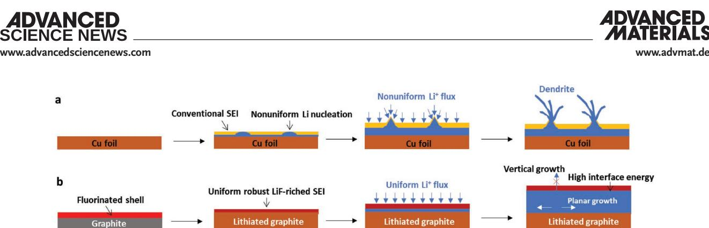
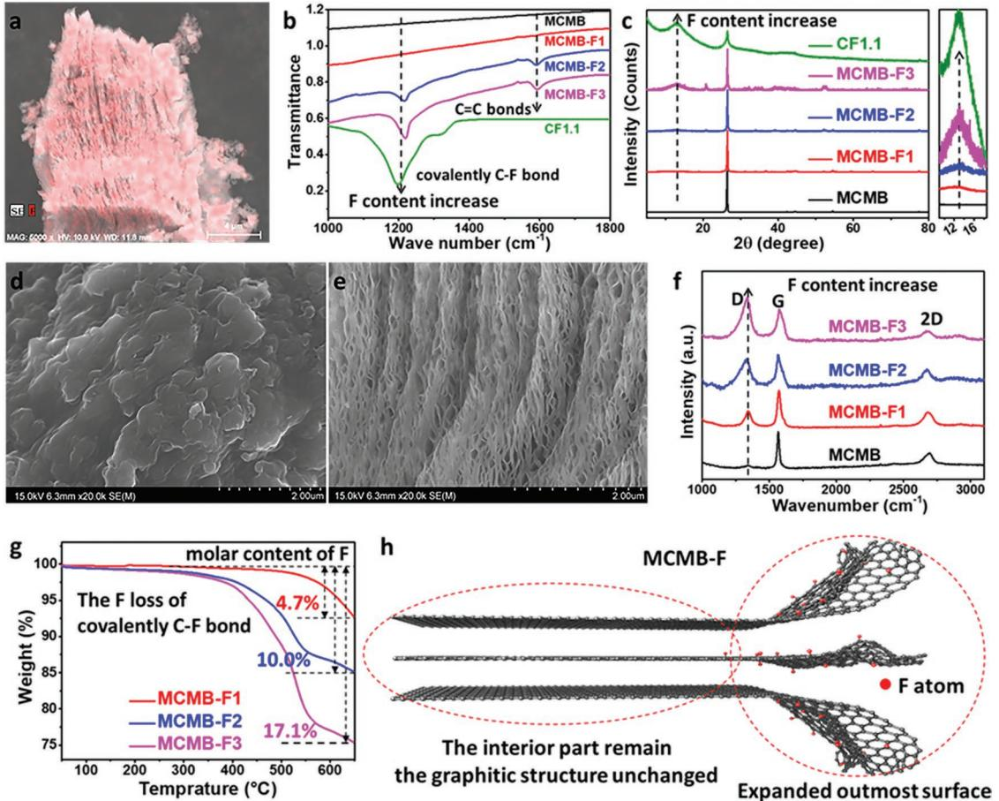
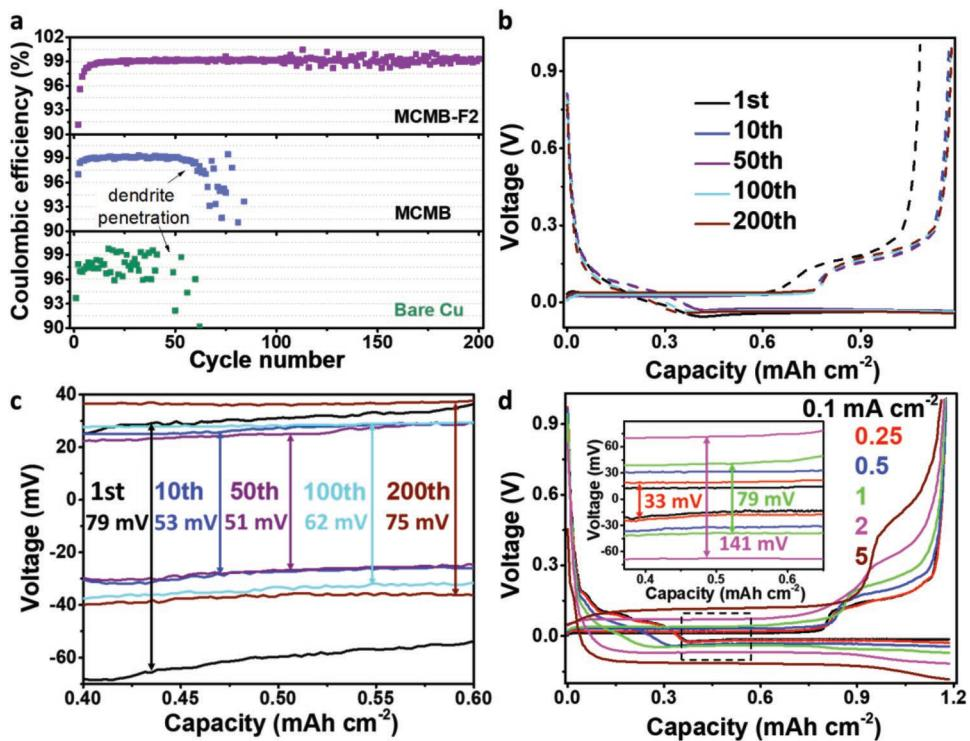
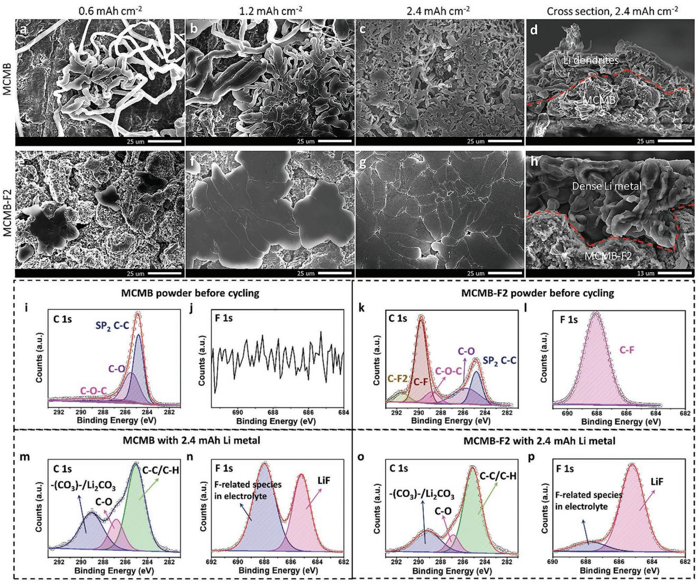
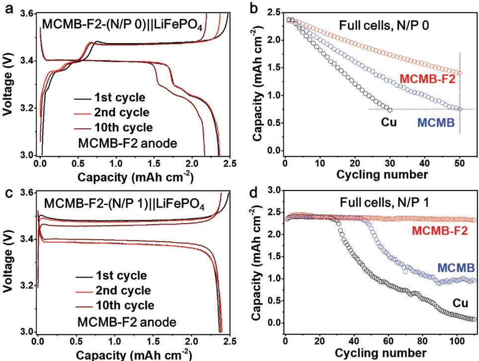

# **A Highly Reversible, Dendrite-Free Lithium Metal Anode Enabled by a Lithium-Fluoride-Enriched Interphase**

*Chunyu Cui, Chongyin Yang,\* Nico Eidson, Ji Chen, Fudong Han, Long Chen, Chao Luo, Peng-Fei Wang, Xiulin Fan, and Chunsheng Wang\**

**Metallic lithium is the most competitive anode material for next-generation lithium (Li)-ion batteries. However, one of its major issues is Li dendrite growth and detachment, which not only causes safety issues, but also continuously consumes electrolyte and Li, leading to low coulombic efficiency (CE) and short cycle life for Li metal batteries. Herein, the Li dendrite growth of metallic lithium anode is suppressed by forming a lithium fluoride (LiF)-enriched solid electrolyte interphase (SEI) through the lithiation of surface-fluorinated mesocarbon microbeads (MCMB-F) anodes. The robust LiF-enriched SEI with high interfacial energy to Li metal effectively promotes planar growth of Li metal on the Li surface and meanwhile prevents its vertical penetration into the LiF-enriched SEI from forming Li dendrites. At a discharge capacity of 1.2 mAh cm<sup>−</sup><sup>2</sup> , a high CE of >99.2% for Li plating/stripping in FEC-based electrolyte is achieved within 25 cycles. Coupling the pre-lithiated MCMB-F (Li@MCMB-F) anode with a commercial LiFePO4 cathode at the positive/negative (P/N) capacity ratio of 1:1, the LiFePO4//Li@MCMB-F cells can be charged/discharged at a high areal capacity of 2.4 mAh cm<sup>−</sup><sup>2</sup> for 110 times at a negligible capacity decay of 0.01% per cycle.**

With the continued development of portable electronics and electric vehicles, the high energy of lithium-ion batteries (LIBs) is urgently needed.[1] However, the current graphite anodes and Li metal oxide cathodes have gradually approached their theoretical limits. To further enhance the energy density, graphite anode with capacity of 372 mAh g−<sup>1</sup> in LIBs has to be replaced by the Li metal anodes that have the highest specific capacity (3860 mAh g−<sup>1</sup> ) and the lowest redox potential (−3.04 V vs standard hydrogen electrode).[2] When it couples with sulfur (Li–S battery),[3] oxygen (Li–O2 battery),[4] or high-energy intercalation type cathodes, a much higher energy density of Li metal batteries (LMBs) can be achieved.[5,6] However, the practical application of LMBs

```
Dr. C. Cui, Dr. C. Yang, Dr. N. Eidson, Dr. J. Chen, Dr. F. Han, Dr. L. Chen, 
Dr. C. Luo, Dr. P.-F. Wang, Dr. X. Fan, Prof. C. Wang
Department of Chemical and Biomolecular Engineering
University of Maryland
College Park, MD 20742, USA
E-mail: cyyang@umd.edu; cswang@umd.edu
Prof. C. Wang
Department of Chemistry and Biochemistry
University of Maryland
College Park, MD 20742, USA
     The ORCID identification number(s) for the author(s) of this article 
     can be found under https://doi.org/10.1002/adma.201906427.
```
#### **DOI: 10.1002/adma.201906427**

still faces challenges of Li dendrite, which can penetrate through separator and lead to short circuit.[7] In addition, the formation of the dead Li and the repeating repair of solid electrolyte interphase (SEI) consume large amount of Li and electrolytes, resulting in a very low coulombic efficiency (CE) and rapid decay of the battery cycling.[8] If vast Li metal and electrolyte excess are used, a longer cycle life can be achieved at a price of lower energy density than current LIBs and high safety concern.[9]

Up to now, many strategies for Li dendrite suppression mainly relied on electrolyte optimization,[5,10,11] artificial SEI,[12] or synthesis of three-dimensional current collectors.[13] The most effective strategy is to control the nucleation and growth pattern of Li deposition. The higher value of Fermi level of Li metal than that of the lowestunoccupied molecular orbitals (LUMO) of almost all the organic-liquid electrolytes inevitably leads to the formation of a non-

uniform organic/inorganic passivation SEI layer on the Li surface, which induces inhomogeneous Li nucleation.[9] Because the organic/inorganic SEI is inhomogeneous and has a low interface energy to Li, any Li protrusion in a concerted electric field will attract more Li+ flux, accelerating the vertical growth of Li dendrites instead of planar growth (illustrated in **Figure 1**a).[14] Inorganic compounds such as LiF,[15] LiNO3, [16] and Li2S*x*, [17] having a high interface energy than that of organic compounds were chosen to form stable SEIs on the surface of Li anodes to suppress the dendrite growth. Among them, LiF exhibits the highest interfacial energy against Li metal (73.28 meV Å−<sup>2</sup> ) [18] and shows potential alteration of Li vertical growth patterns. Unfortunately, many efforts to enhance this strategy of LiF-enriched SEI have to rely on the reduction of fluorinated electrolyte components,[19] leading to the consumption of superfluous amounts of electrolyte before forming enough LiF passivation in a long cycle time. Another route involves an artificial LiF-based SEI,[20] by coating LiF layer on anode surface using precision instrument at a high cost. It is very challenging to form a conformal LiF coating especially in a thick porous electrode; non-uniform LiF coating can cause failure during long cycling.[21]

Herein, we build up a conformal LiF-enriched SEI on graphite by the lithiation of a pre-fluorinated graphite. Fluorinated graphite (or graphite fluoride [GF], CF*x*, 0 ≤ *x* ≤ 1.1), a well-known cathode material in lithium primary batteries



**Figure 1.** a,b) The schematic illustration of the electrochemical deposition process of Li on a Cu anode (a) and a surface-fluorinated mesocarbon microbeads (MCMB-F) anode (b). The fluorinated shell of MCMB-F generates the formation of a LiF-enriched SEI, orienting the Li growth planarly rather than vertically.

(950 mAh g<sup>−</sup><sup>1</sup> for *x* = 1.1),[22] can irreversibly form LiF on graphite surface after the lithiation. The conformal-coated LiF by incorporating GF with molten Li can even make Li metal anode to be an air-stable.[23] In this work, we fluorinated the surface of commercial mesocarbon microbeads (MCMB) with an optimized F content (MCMB-F) by controlling fluorinating temperature and time, in which the outermost layer of MCMB graphite is highly fluorinated, while its interior part still maintains the graphite structure unchanged. During the lithiation of MCMB-F, negligible volume change of surface fluorinated graphite guarantees an intact and robust LiF-enriched SEI (Figure 1b). By using the LiF-coated graphite as Li-plating substrate, the growth pattern of Li metal is effectively altered to dendrite-free large crystalline grains, with a smooth surface and dense structure. So, the MCMB-F2 anode minimizes the electrolyte consumption and detached Li loss when used as Li metal anode, enabling a high Li plating/stripping CE of 99.2% within 25 cycles. The high reversibility of this dendrite-free Li metal anode was further proved by the LiFePO4/MCMB-F full cell performances with Li-free and onefold Li excess anodes.

The surface fluorination process of commercial MCMB is illustrated in Figure S1, Supporting Information, in which the MCMB and F in cobalt trifluoride (CoF3) were reacted at a high temperature of 400 °C for 12 h under argon protection. As the fluorine source, the CoF3 releases F2 during its self-decomposition process at 400 °C, which oxidizes the surface of MCMB into MCMB-F.[24] The experimental details are elaborated in the Supporting Information. The F contents in MCMB-F are designed by changing the mass ratios of CoF3:MCMB from 1:2, 1:1, to 1:0.5, denoted as MCMB-F1, MCMB-F2, and MCMB-F3, respectively. The successful fluorination of MCMB-F was confirmed by energy-dispersive X-ray spectroscopy (EDS) (**Figure 2**a), revealing the uniform distribution of F on the surface of MCMB-F2. The formation of C–F bonds was also evidenced by Fourier transform infrared spectroscopy (FTIR) spectra (Figure 2b). As the reference, the FTIR spectra of commercial fluorinated graphite polymer (CF1.1) show an obvious peak at 1220 cm corresponding to a covalently C–F bond.[25,26] Both MCMB-F2 and MCMB-F3 show obvious absorption band at 1220 cm, corresponding to the stretching vibration of C–F bonds. X-ray diffraction (XRD) patterns reveal the limited fluorination on the graphite surface (Figure 2c). The XRD pattern of the commercial CF1.1 was shown as the reference, which delivers an additional broad (001) peak at 12.8° comparing to graphite, reflecting a typical hexagonal system of highly fluorinated graphite.[27] Similarly, all the MCMB-F samples show the same broad (001) reflections, while its increasing intensity from MCMB-F1 to MCMB-F3 accord with the expected increasing fluorination level.[25] However, the sharp (002) reflections at 26.5° indicate that the cores of MCMB-F particles still remain in the intact graphite structure.[28] This core-shell structure is the perfect substrate for Li metal deposition because the stress from structure and volume change is minimized during the initial lithiation of C–F.

The surface fluorination also changes surface structure and morphology of MCMB-F. As shown in the scanning electron microscopy (SEM) images in Figure 2d,e and Figure S2–S4, Supporting Information, the MCMB-F2 shows an expanded layered morphology on the surface layer, comparing with the pristine MCMB annealed at the same condition without CoF3 (Figure S5, Supporting Information). It is due to the perpetual attack by the F2 during the fluorination process, which expanded the graphene layer on the surface by forming GF. The expanded layered morphology enable MCMB-F2 a higher specific surface area value of 2.1 m2 g<sup>−</sup><sup>1</sup> than MCMB (0.9 m2 g−<sup>1</sup> ), as revealed by their Brunauer–Emmett–Teller (BET) results in Figure S6, Supporting Information. The Raman spectra (Figure 2f) shows a D-band peak at ≈1334 cm due to the defects in the sp3 carbon lattice due to the edge plane vibrations, vacancies, and grain boundaries, and a G-bands (≈1564 cm) representing the inplane sp2 stretching vibrations.[29] Comparing to the MCMB with the ideal graphite structure, the increasing *I*D/*I*G values (from 0.296 of MCMB to 1.071 of MCMB-F3) and broadening G bands of MCMB-F reveal that the fluorination reaction creates an abundance of defects on their surfaces. For measuring the F content in these three MCMB-F materials, the thermogravimetric analysis (TGA) was conducted to estimate the overall F content in these MCMB-F materials. As shown in Figure 2g, the covalent C–F bond breaks between 350 and 650 °C, while the mass loss above 650 °C is most likely related to the destruction of the carbon structure.[30] The calculated molar content of F for MCMB-F1, MCMB-F2, and MCMB-F3 are 4.7%, 10.0%, and 17.1%, respectively. All the above evidences prove that the surface layer of MCMB-F is highly fluorinated, while its core retaining the ideal graphite structure, as schematically illustrated in Figure 2h.

The CE of Li plating/stripping on Cu and MCMB-F substrates was first evaluated in coin-type half cells with Li metal as a counter electrode and 1 M lithium bis(fluorosulfonyl)imide/ lithium difluoro(oxalato)borate (LiFSI/LiDFOB, with a molar




**Figure 2.** Characterization of surface-fluorinated MCMB materials. a) EDS mapping image of F for MCMB-F2. b) FTIR spectra of MCMB, MCMB-F, and CF1.1. CF1.1 is the commercial fluorinated graphite polymer with a C:F ratio of 1:1.1 (by mole). c) XRD patterns of MCMB, MCMB-F, and CF1.1. d,e) SEM images of MCMB (d) and MCMB-F2 (e). f) Raman spectra of MCMB and MCMB-F. g) TGA curves and h) schematic diagram of MCMB-F.

ratio of 8:2) in fluoroethylene carbonate (denoted as 1.0 M LiFSI/LiDFOB-FEC) as an electrolyte (**Figure 3**). The linear sweep voltammograms and electrochemical impedance spectrum (Figure S7, Supporting Information) reveal that the electrolyte has a high oxidative stability potential of 4.6 V and a high ionic conductivity of 6.979 mS cm<sup>−</sup>1. The indispensable role of LiDFOB salt is demonstrated in Figure S8, Supporting Information, since the CE for Li plating/stripping on MCMB-F2 electrode in 1.0 M LiFSI-FEC electrolyte at 0.5 mA cm−<sup>2</sup> is only 98.5%, while the CE for Li plating/stripping on MCMB-F2 electrode in 1.0 M LiFSI/LiDFOB-FEC increases to 99.2% (Figure 3a). The decomposition products of LiDFOB, including oxalate and CO2, could act as a capping agent to modify the surface of LiF particles and control the size and shape of the LiF particles to prevent its agglomeration.[31] Before the electrochemical evaluation, the MCMB-F was pre-lithiated from ≈2.4 to ≈0.1 V versus Li/Li+ to form LiF-enriched SEI layer (Figure S9, Supporting Information). For practical applications, all the MCMB-F samples can also be pre-lithiated through the short circuit process (detailed in the Supporting Information) before Li plating/stripping test.

Figure 3a shows the Li plating/stripping CE of Cu, MCMB, and MCMB-F2 with the areal plating capacity of 1.2 mAh cm<sup>−</sup>2. The CE of the Li plating/stripping is calculated from the capacity ratio of Li removed from substrate to that of deposited during the same cycle (as reflected by the total charge capacity for each process). The discharge/charge CE of MCMB-F2 reaches 99.0% within only 15 cycles, increases to 99.2% within 25 cycles, and stably maintains for 200 cycles without any CE decay. The Li plating/stripping CE of 99.2% on graphite subtract is one of the highest CE in all carbon-based substrates.[32] Even when the areal capacity is increased to 2.4 (Figure S10, Supporting Information) and 4.8 mAh cm<sup>−</sup>2 (Figure S11, Supporting Information), at a high current density of 1 mA cm−<sup>2</sup> , the MCMB-F2 still attains a high CE of 99.1% within 50 cycles (2.4 mAh cm−<sup>2</sup> ), and ≈98.5% within only 30 cycles (4.8 mAh cm−<sup>2</sup> ), respectively. For comparison, the CEs for Li plating/stripping on Cu foil and pure MCMB in the same electrolyte are low. The CE for Li plating/stripping on MCMB substrate at 0.5 mA cm−<sup>2</sup> , with the areal plating capacity of 1.2 mAh cm−<sup>2</sup> , is ≈99.0% at 50 cycles and drop to ≈98.3% at 76 cycles, while the Li plating/stripping CE on Cu substrate drops to an average value of ≈97.7% for 30 cycles, followed by the rapid CE decrease and cell failure due to the penetration of Li dendrites. In addition, Figure S12 and S13, Supporting Information, reveal that the MCMB-F2 electrode has a much higher Li plating/stripping CE and more stable cycling stability than commercial CF1.1 in both 4.0 M LiTFSI/LiNO3-DME/DOL and 1.0 M LiFSI/LiDFOB-FEC




**Figure 3.** Electrochemical performance of MCMB and MCMB-F electrodes in half-cells. a) CE of Li plating/stripping on Cu, MCMB, and MCMB-F2 substrate at 0.5 mA cm−<sup>2</sup> , 1.2 mAh cm−<sup>2</sup> . b) Li plating/stripping profiles on MCMB-F2 at different cycles at 0.5 mA cm−<sup>2</sup> , 1.2 mAh cm−<sup>2</sup> . (0.4 mAh cm−<sup>2</sup> capacity from Li intercalation, 0.8 mAh cm<sup>−</sup>2 capacity from Li deposition). c) The corresponding polarization curves of (b). d) The polarization curves of MCMB-F2 at different current densities ranging from to 0.1 to 5 mA cm−<sup>2</sup> , at 1.2 mAh cm−<sup>2</sup> .

electrolytes. Therefore, the LiF-enriched SEI formed by the lithiation of surface fluorinated graphite is uniquely effectual for the dendrite suppression and CE improvement. Even though the SEI formed by the electrolyte decomposition also contains LiF, it is insufficient to alter the growth pattern of Li deposition, which eventually leads to the continuous consumption of electrolyte and the formation of dead Li. It is worth noting that the LiF content in SEI should be optimized here, too much or too less LiF content may be harmful for achieving high CE. For MCMB-F3 with superfluous F content (Figure S14, Supporting Information), the average CE of ≈98.1% is much lower than that of MCMB-F2. However, if the F content is too low, the formed LiF SEI layer in MCMB-F1 is not enough to suppress the Li dendrite growth.

Figure 3b shows the corresponding voltage profiles for Li metal plating/stripping on MCMB-F2, which consists of the typical plateau for Li-ion intercalation into graphite, followed by Li plating/stripping on the MCMB-F2 surface at a potential of ≈0.03 V.[33] In total areal capacity of 1.2 mAh cm<sup>−</sup><sup>2</sup> , ≈0.4 mAh cm−<sup>2</sup> (335 mAh g−<sup>1</sup> ) is attributed to graphite intercalation, and ≈0.8 mAh cm−<sup>2</sup> is induced by Li plating process. The voltage hysteresis between Li plating and stripping curves is the overpotential. As revealed by the corresponding polarization curves in Figure 3c, the MCMB-F2 shows a high overpotential of 90 mV during the first cycle, decreases to 53 mV in the 10th cycle, and maintains low values during in rest of the cycles. Comparatively, the MCMB shows a low overpotential of 37 mV during its first cycle, as shown in Figure S15, Supporting Information, but it rapidly increases to 58 mV during its 10th cycle, reaches a high value of 105 mV during its 50th cycle, and stays very high until the battery failed. The overpotentials of the MCMB-F2 electrode at different current densities from 0.1 to 5 mA cm−<sup>2</sup> are shown in Figure 3d. The overpotentials become larger with the increase of current density from 33 mV at 0.25 mA cm−<sup>2</sup> to 79 mV at 1 mA cm−<sup>2</sup> , and reaches 141 mV at 2 mA cm−<sup>2</sup> , while its CE is still stable even at high current density of 5 mA cm−<sup>2</sup> (Figure S16, Supporting Information), which is comparable or higher than all previous reported CEs.[5,10] Since the MCMB-F2 electrode presents outstanding stability and high CE toward Li metal plating/stripping, MCMB-F2 is used as Li plating/stripping substrate for further study.

The high CE of Li plating/stripping on MCMB-F2 substrate is mostly attributed to the alteration of Li growth pattern and dendrite suppression, which are revealed by the comparisons of SEM images of MCMB and MCMB-F substrate after 100 cycles (**Figure 4**) in 1.0 M LiFSI/LiDFOB-FEC. Sharp different morphology evolutions of deposited Li metal on MCMB and MCMB-F2 electrodes are observed after discharging to 0.6 (Figure 4a,e), 1.2 (Figure 4b,f) and 2.4 mAh cm−<sup>2</sup> (Figure 4c,d,g,h). For MCMB, the needle-like Li dendrites are observed at the early stage of Li plating (0.6 mAh cm−<sup>2</sup> , Figure 4a). The Li dendrites unthread from the cracks of the MCMB electrode, showing the high length-diameter ratio with few branches, and messily stacked on the surface of the MCMB electrode. As the capacity increases to 1.2 mAh cm−<sup>2</sup> (Figure 4b), more dendrites continually become longer and thicker. Till the




**Figure 4.** a–h) SEM morphologies of deposited Li metal on MCMB and MCMB-F2 electrodes after 100 cycle. Images of MCMB (a–d) and MCMB-F2 (e–h) after discharge to capacities of 0.6 mAh cm<sup>−</sup>2 (a,e), 1.2 mAh cm<sup>−</sup>2 (b,f), and 2.4 mAh cm<sup>−</sup><sup>2</sup> (c,d,g,h). Cross sections of the MCMB (d) and MCMB-F2 (h) electrodes at the discharge capacity of 2.4 mAh cm−<sup>2</sup> . The mass loading of the above electrodes are ≈2.66 mg cm<sup>−</sup>2. i–p) The XPS profiles of the MCMB (i–j) and MCMB-F2 (k–l) powders before cycling, and deposited Li metal on MCMB (m–n) and MCMB-F2 (o–p) substrates after discharge to capacities of 2.4 mAh cm<sup>−</sup><sup>2</sup> .

capacity increases to 2.4 mAh cm<sup>−</sup>2 (Figure 4c), almost the entire surface of the MCMB electrode is covered by the Li dendrites, with massive vast gaps between dendrites revealing a loose and porous structure. These Li dendrites would dramatically increase the surface area of deposited Li metal in every cycle, which continually consume the electrolyte to form passivation layer, leading to low CE. More seriously, these dendrites would easily detach during the unevenly stripping to form "dead" Li metal, resulting in short circuits and poor cycle stability. In sharp contrast, the Li metal on MCMB-F2 electrodes (Figure 4e–g) displays a completely different behavior, starting with the formation of cloud-like big Li chunks evenly distributing on the graphite surface. As the plating capacity increases, these Li metal chunks keep growing horizontally, until they merge together into a polycrystalline-like dense Li metal bulk, covering the whole surface of the MCMB-F2 electrode. The high interfacial energy of LiF against Li metal ensures smooth growth pattern of Li metal along interface between Li and LiF SEI; therefore, the Li metal on MCMB-F2 electrode prefers horizontal growth as the capacity increases, revealing a smooth surface and dendrite-free dense structure. The cross-section of SEM image confirms the porous of Li metal on MCMB (Figure 4d), but the dense filling on MCMB-F2 (Figure 4h). The Figure S17, Supporting Information, shows more visual structure schematics of deposited Li-metal on MCMB and MCMB-F2 electrodes. Accordingly, the MCMB-F2 anode minimizes the electrolyte consumption of electrolyte and capacity loss due to the lower specific area during the cycling process. In addition, the smooth surface also lowers the risk of penetrating the separator, resulting in higher safety in LMBs.

To understand the role of LiF-enriched SEI in Li plating/ striping, the surface chemistry of MCMB and MCMB-F2


fresh powders, cycled MCMB and MCMB-F2 electrodes, and the deposited Li metal on MCMB (Figure 4m,n) and MCMB-F2 (Figure 4o,p) substrates after discharge to capacities of 2.4 mAh cm<sup>−</sup><sup>2</sup> was analyzed by using XPS, in the electrolyte of 1.0 M LiFSI/LiDFOB-FEC. As shown in Figure 4i–l and Figure S18, Supporting Information, both MCMB and MCMB-F2 powders show typical C 1s peaks. In the XPS of fresh MCMB (Figure 4i) and MCMB-F2 materials (Figure 4k), the peaks at ≈284.8 eV are attributed to sp2, the peaks at 285.5 eV are due to C atoms directly bonded to oxygen in hydroxyl configurations, and the peaks at 286.4 eV are attributed to the epoxide groups (C–O–C). In addition to these peaks, the MCMB-F2 powder also presents two additional new C 1s peaks that are not observed in MCMB. The new peak at 289.8 eV in MCMB-F2 corresponds to bonding of C–F, and 291.6 eV peak is due to C–F2. Therein the C–F2 bonds are easily formed at the new defects or at the edge of graphite sheet.[26] F 1s spectrum at 688.1 eV for fresh MCMB-F2 reveals that the fluorine atoms are covalently bonded to carbon atoms in MCMB-F2, but only the C–F bond in F 1s was detected because of its stronger intensity than C–F2. In contrast, no F 1s spectrum is found for MCMB powder. As for the cycled MCMB and MCMB-F electrodes in Figure S19, Supporting Information, both the MCMB and MCMB-F2 electrodes present typical C 1s spectra, including the hydrocarbon centered at ≈284.8 eV, the C–O-containing species at ≈286.3 eV, the carbonyl species at ≈288.4 eV, and the Li2CO3 species at ≈290.6 eV, consistent with previous reports.[34] The MCMB-F2 electrode presents an additional small peak at ≈289.5 eV, which belongs to the CF–CF*n* (0 < *n* < 2) species due to the existence of GF for MCMB-F2 powder. Compared to the fresh MCMB-F2 powder, the C–F bonds of the cycled MCMB-F2 electrode disappeared, and the strong LiF peak of F 1s at 685.2 eV reveals that CF is reduced to LiF. Comparatively, the cycled MCMB electrode shows a weaker LiF peak than PVDF, while the larger integral area of LiF than PVDF in cycled MCMB-F2 reveals its SEI contains much higher LiF content than cycled MCMB. The high-resolution transmission electron microscopy images of cycled MCMB, MCMB-F2, and CF1.1 in Figure S20, Supporting Information, reveal that the cycled MCMB-F2 and CF1.1 electrodes own a more uniform SEI than MCMB, therein the LiF that embedded in the SEI of MCMB-F2 is amorphous. After discharge to the capacity of 2.4 mAh cm<sup>−</sup>2 (Figure 4m–p; Figure S21, Supporting Information), both the Li metal on MCMB and MCMB-F2 electrode present typical C 1s spectra, including the C–C/C–H bonds centered at ≈285.1 eV, the C–O contained species at ≈286.9 eV, and the –(CO3)–/Li2CO3 species at ≈290.2 eV, corresponding with previous reports.[34] As for F 1s, the LiF peak of the deposited Li metal on MCMB-F2 is much stronger than F-related species. Comparatively, the Li metal on MCMB electrode delivers weaker LiF peak than F-related species of the residual electrolyte. The EDS mapping in Figure S22 and S23, Supporting Information, reveals that the deposited Li metal on MCMB-F2 electrode owns a more uniform F elements distribution than MCMB. The time of flight secondary ion mass spectrometry (ToF-SIMS, Figure S24, Supporting Information) characterization of deposited Li metal after discharge to a capacity of 2.4 mAh cm<sup>−</sup>2 reveals that the thickness of such LiF-enriched SEI on the substrate of MCMB-F2 is ≈9 nm. So, the SEI of the deposited Li metal on MCMF-F2 contains much higher LiF content than MCMB in 1.0 M LiFSI/LiDFOB-FEC, which is consistent with the cycled MCMB and MCMB-F2 electrodes, revealing a high robustness of the SEI on MCMB-F2.

Because both LiFSI salt and FEC solvent are well-known to form LiF-enriched SEI layers by reduction, while the reduction of LiTFSI salt will form LiF-less SEI. To distinguish the beneficial feature of the surface-fluorinated MCMB from the LiF formed from reaction of the electrolytes, the electrochemical performances of Li plating/stripping on MCMB and MCMB-F2 substrates are further compared in 4 M LiTFSI in DME/DOL (1/1, by volume) with LiNO3 (2%, by weight) as additive (denoted as 4.0 M LiTFSI/LiNO3-DME/DOL). As shown in Figure S25, Supporting Information, the Li plating/stripping CE on MCMB-F2 in 4.0 M LiTFSI/LiNO3-DME/DOL reaches 98.0% in initial 30 cycles, and further increases to 98.5% after 100 cycles without any CE decay for 150 cycles. Comparatively, the Li plating/stripping CE on MCMB substrate only maintains ≈50 cycles, followed by the rapid CE decrease and cell failure due to the penetration of Li dendrites. The SEM images of deposited Li metal (2.4 mAh cm−<sup>2</sup> ) reveal that the Li metal on MCMB-F2 (Figure S26a, Supporting Information) is dendrites free and has a dense structure, while the Li on MCMB (Figure S26b, Supporting Information) has a low density with vastly needle-like Li dendrites. The XPS results in Figure S26c–f, Supporting Information, reveal that the SEI on the Li-deposited MCMB-F2 has a higher LiF content than MCMB. So, the MCMB-F2 electrode in F-less electrolyte (4.0 M LiTFSI/LiNO3- DME/DOL) can still form a uniform LiF-enriched SEI, ensuring that MCMB-F2 electrode has a higher Li plating/stripping CE than that on MCMB, thus more robust to suppress the Li dendrites. The formation of such artificial LiF SEI significantly reduce the Li lost due to the irreversible capacity loss in the initial few cycles, enabling a high plating/stripping CE increasing within few cycles. The LiF-rich SEI formed form the reduction of 1.0 M LiFSI/LiDFOB-FEC is to self-heal the LiF SEI during the long cycling process, further enhancing the Li plating/ stripping performance. Obviously, the LiF content in SEI on MCMB-F2 formed in 1.0 M LiFSI/LiDFOB-FEC is higher than that formed in 4.0 M LiTFSI/LiNO3-DME/DOL, which significantly enhanced the Li plating/stripping CE on MCMB-F2 in 1.0 M LiFSI/LiDFOB-FEC with more dense structure of the deposited Li metal.

Three Li-free MCMB-F2, MCMB, and Cu anodes are coupled with a high-loading LiFePO4 (2.4 mAh cm<sup>−</sup><sup>2</sup> ) cathodes to form three Li-free full cells. All of the anodes were pre-cycled for 5 cycles before being reassembled into full cells. **Figure 5**a,b shows the full cell performances of Li-free anodes at a current density of 0.5 mA cm<sup>−</sup>2. Since the area capacity of LiFePO4 is 2.4 mAh cm<sup>−</sup>2, while the anode is free of Li metal, the capacity ratio of the negative electrode to the positive electrode (N/P) is 0 (neglecting the capacity of MCMB due to low loading). LiFePO4 cathode in lean electrolyte of 50 µL with excess Li anode attains a CE of 100% (Figure S27, Supporting Information). Since LiFePO4 is the only Li source in three Li-free full cells, the full cell cycle stability is controlled by the anode CE. The charge– discharge curves of MCMB-F2-(N/P 0)||LiFePO4 (Figure 5a) and MCMB-(N/P 0)||LiFePO4 (Figure S28, Supporting Information) full cells reveal that their intercalation reactions occupy ≈1/3 (≈0.8 mAh cm−<sup>2</sup> ) of the total capacity. The cycling performances




**Figure 5.** a,b) Electrochemical performance of MCMB-F2||LiFePO4, MCMB||LiFePO4, and Cu||LiFePO4 full cells with an area capacities of 2.4 mAh cm<sup>−</sup><sup>2</sup> (Li metal free, capacity ratio of the negative electrode to the positive electrode [N/P] is 0 since MCMB's capacity is very small due to low loading). c,d) Electrochemical performance of Li@MCMB-F2||LiFePO4 full cells with an area capacities of LiFePO4 is 2.4 mAh cm<sup>−</sup><sup>2</sup> and pre-lithiated capacity of Li@MCMB-F2 is also 2.4 mAh cm−<sup>2</sup> , so the N/P is 1.

in Figure 5b reveal that MCMB-(N/P 0)||LiFePO4 remains only 31% (0.75 mAh cm<sup>−</sup>2) of the original capacity (2.4 mAh cm<sup>−</sup>2) after 50 cycles. Even worse, the Cu-(N/P 0)||LiFePO4 full cell decays to 31% of its original capacity within only 30 cycles. In sharp contrast, the MCMB-F2-(N/P 0)||LiFePO4 shows much better cycling stability than MCMB-(N/P 0)||LiFePO4 and Cu-(N/P 0)||LiFePO4 with remaining a capacity of 1.4 mAh cm<sup>−</sup>2 (58% of the original capacity) after 50 cycles, presenting an average CE (ACE) of Li-free of ≈99% for anode, which is the same to the CE of MCMB-F2 measured in half cell (Figure 2a), and is much higher than MCMB- (N/P 0)||LiFePO4 of 97.7%, and Cu-(N/P 0)||LiFePO4 of 96.1%. The detailed calculation of ACE of Li-free is illustrated in Supporting Information. Figure S29, Supporting Information, confirms the much higher and more stable CE of MCMB-F2-(N/P 0)||LiFePO4 than MCMB-(N/P 0)||LiFePO4 and Cu-(N/P 0)||LiFePO4. When the anode is pre-lithiated onefold Li excess of 3 mAh (2.4 mAh cm<sup>−</sup>2, the same areal capacity as LiFePO4 cathode), the corresponding capacity ratio of N/P is 1. As shown in Figure 5c–d, the Li@MCMB-F2- (N/P 1)||LiFePO4 demonstrates stable full cell performance with a negligible capacity decay (0.01%) after 110 cycles (Figure S30, Supporting Information), presenting an ACE of ≈99.1% for anode; the detailed calculation of ACE of Liexcess is illustrated in , Supporting Information. While for Li@MCMB-(N/P 1)||LiFePO4 and Li@Cu-(N/P 1)||LiFePO4, they only steadily cycle for 44 (ACE of Li-excess: ≈97.7%) and 26 cycles (ACE of Li-excess: ≈96.2%), respectively, followed by fast capacity decay. Based on these results, the successful application of the LiF-enriched SEI layer for MCMB-F2 is thus demonstrated for the full cell system.

Due to high interface energy of Li, LiF is the most effective SEI component for Li dendrite suppression. Instead of physically coating LiF on the substrate, we pre-fluorinate the surface of MCMB and in situ form uniform LiF-enriched SEI on MCMB during the first lithiation. The LiF-enriched SEI can be self-healed by the decomposition of the fluorinated 1.0 M LiFSI/LiDFOB-FEC electrolyte, ensuring long cycle life. Benefitting from the intrinsic electronic insulation of LiF and its high surface energy, the MCMB-F2 electrode achieves a high CE of 99.2% within only 25 cycles at a discharge capacity of 1.2 mAh cm−<sup>2</sup> (30% is Li intercalation capacity in MCMB and 70% is the Li plating) and 99.1% within 50 cycles at a high discharge capacity of 2.4 mAh cm<sup>−</sup>2. The Li dendrite-free growth pattern during the whole Li-plating process contributes not only to improved CE, but also improved safety for such system. When 2.4 mAh cm−<sup>2</sup> of LiFePO4 is coupled with 2.4 mAh cm<sup>−</sup><sup>2</sup> of pre-lithiated Li@MCMB-F2 to form a full cell, the full cell steadily cycled for 110 cycles with minimal capacity decay (0.01%). Besides MCMB, the pure copper substrate was also fluorinated using the same fluorination method, and the fluorinated Cu substrate significantly enhanced Li plating/stripping CE than neat Cu (Figure S31 and S32, Supporting Information). The fluorination process is a universal method and holds the potential for many other applications. The design of the MCMB-F anode provides an efficient avenue to construct a LiFenriched SEI for the construction of LMBs with high Li metal CE and Li dendrite-free growth.

**www.advancedsciencenews.com www.advmat.de**

#### **Experimental Section**

Detailed information on the experimental procedures can be found in the Supporting Information.

## **Supporting Information**

Supporting Information is available from the Wiley Online Library or from the author.

### **Acknowledgements**

This work was supported by the Energy Efficiency and Renewable Energy Office of the U.S. Department of Energy through the Battery500 Consortium Seedling project under contract DE-EE0008200. The authors acknowledge the support of the Maryland Nano-Center and its NispLab. The NispLab is supported in part by the NSF as a MRSEC Shared Experimental Facility.

### **Conflict of Interest**

The authors declare no conflict of interest.

#### **Author Contributions**

C.C, C.Y., and C.W. designed the experiments. C.C. and C.Y. conducted the electrochemical experiments. N.E., F.H., L.C., C.L., P.-F.W., and X.F. analyzed the data. C.W. conceived and supervised the project. All the authors contributed to the interpretation of the results.

#### **Keywords**

dendrite-free Li plating, high coulombic efficiency, Li metal batteries, LiF-enriched solid electrolyte interphase, surface fluorinated graphite

> Received: September 30, 2019 Revised: November 29, 2019 Published online: February 14, 2020

- [1] a) M. Armand, J.-M. Tarascon, *Nature* **2008**, *451*, 652; b) B. Dunn, H. Kamath, J.-M. Tarascon, *Science* **2011**, *334*, 928; c) J. B. Goodenough, *Nat. Electron.* **2018**, *1*, 204.
- [2] a) J. W. Choi, D. Aurbach, *Nat. Rev. Mater.* **2016**, *1*, 16013; b) J. B. Goodenough, Y. Kim, *Chem. Mater.* **2009**, *22*, 587.
- [3] L. Suo, Y.-S. Hu, H. Li, M. Armand, L. Chen, *Nat. Commun.* **2013**, *4*, 1481.
- [4] P. G. Bruce, S. A. Freunberger, L. J. Hardwick, J.-M. Tarascon, *Nat. Mater.* **2012**, *11*, 19.
- [5] X. Fan, L. Chen, O. Borodin, X. Ji, J. Chen, S. Hou, T. Deng, J. Zheng, C. Yang, S.-C. Liou, *Nat. Nanotechnol.* **2018**, *13*, 715.
- [6] W. Xu, J. Wang, F. Ding, X. Chen, E. Nasybulin, Y. Zhang, J.-G. Zhang, *Energy Environ. Sci.* **2014**, *7*, 513.
- [7] a) D. Lin, Y. Liu, Y. Cui, *Nat. Nanotechnol.* **2017**, *12*, 194; b) S. Choudhury, R. Mangal, A. Agrawal, L. A. Archer, *Nat. Commun.* **2015**, *6*, 10101.
- [8] a) D. Aurbach, E. Zinigrad, Y. Cohen, H. Teller, *Solid State Ionics* **2002**, *148*, 405; b) C. Fang, J. Li, M. Zhang, Y. Zhang, F. Yang,


J. Z. Lee, M.-H. Lee, J. Alvarado, M. A. Schroeder, Y. Yang, B. Lu, N. Williams, M. Ceja, L. Yang, M. Cai, J. Gu, K. Xu, X. Wang, Y. S. Meng, *Nature* **2019**, *572*, 511.

- [9] X.-B. Cheng, R. Zhang, C.-Z. Zhao, Q. Zhang, *Chem. Rev.* **2017**, *117*, 10403.
- [10] J. Qian, W. A. Henderson, W. Xu, P. Bhattacharya, M. Engelhard, O. Borodin, J.-G. Zhang, *Nat. Commun.* **2015**, *6*, 6362.
- [11] S. Jiao, X. Ren, R. Cao, M. H. Engelhard, Y. Liu, D. Hu, D. Mei, J. Zheng, W. Zhao, Q. Li, N. Liu, B. D. Adams, C. Ma, J. Liu, J.-G. Zhang, W. Xu, *Nat. Energy* **2018**, *3*, 739.
- [12] a) N.-W. Li, Y.-X. Yin, C.-P. Yang, Y.-G. Guo, *Adv. Mater.* **2016**, *28*, 1853; b) Y. Liu, D. Lin, P. Y. Yuen, K. Liu, J. Xie, R. H. Dauskardt, Y. Cui, *Adv. Mater.* **2017**, *29*, 1605531; c) A. C. Kozen, C.-F. Lin, O. Zhao, S. B. Lee, G. W. Rubloff, M. Noked, *Chem. Mater.* **2017**, *29*, 6298.
- [13] a) Q. Yun, Y. B. He, W. Lv, Y. Zhao, B. Li, F. Kang, Q. H. Yang, *Adv. Mater.* **2016**, *28*, 6932; b) C.-P. Yang, Y.-X. Yin, S.-F. Zhang, N.-W. Li, Y.-G. Guo, *Nat. Commun.* **2015**, *6*, 8058; c) Q. Li, S. Zhu, Y. Lu, *Adv. Funct. Mater.* **2017**, *27*, 1606422.
- [14] Q. Cheng, L. Wei, Z. Liu, N. Ni, Z. Sang, B. Zhu, W. Xu, M. Chen, Y. Miao, L.-Q. Chen, *Nat. Commun.* **2018**, *9*, 2942.
- [15] Y. Lu, Z. Tu, L. A. Archer, *Nat. Mater.* **2014**, *13*, 961.
- [16] a) S. S. Zhang, *Electrochim. Acta* **2012**, *70*, 344; b) V. Giordani, W. Walker, V. S. Bryantsev, J. Uddin, G. V. Chase, D. Addison, *J. Electrochem. Soc.* **2013**, *160*, A1544.
- [17] a) W. Li, H. Yao, K. Yan, G. Zheng, Z. Liang, Y.-M. Chiang, Y. Cui, *Nat. Commun.* **2015**, *6*, 7436; b) C.-Z. Zhao, X.-B. Cheng, R. Zhang, H.-J. Peng, J.-Q. Huang, R. Ran, Z.-H. Huang, F. Wei, Q. Zhang, *Energy Storage Mater.* **2016**, *3*, 77.
- [18] X. Fan, X. Ji, F. Han, J. Yue, J. Chen, L. Chen, T. Deng, J. Jiang, C. Wang, *Sci. Adv.* **2018**, *4*, 9245.
- [19] L. Suo, W. Xue, M. Gobet, S. G. Greenbaum, C. Wang, Y. Chen, W. Yang, Y. Li, J. Li, *Proc. Natl. Acad. Sci. USA* **2018**, *115*, 1156.
- [20] a) J. Xie, L. Liao, Y. Gong, Y. Li, F. Shi, A. Pei, J. Sun, R. Zhang, B. Kong, R. Subbaraman, J. Christensen, Y. Cui, *Sci. Adv.* **2017**, *3*, eaao3170; b) H. Wang, D. Lin, Y. Liu, Y. Li, Y. Cui, *Sci. Adv.* **2017**, *3*, e1701301.
- [21] S. Choudhury, R. Mangal, A. Agrawal, L. A. Archer, *Nat. Commun.* **2015**, *6*, 10101.
- [22] a) E. Rangasamy, J. Li, G. Sahu, N. Dudney, C. Liang, *J. Am. Chem. Soc.* **2014**, *136*, 6874; b) Q. Zhang, S. D'Astorg, P. Xiao, X. Zhang, L. Lu, *J. Power Sources* **2010**, *195*, 2914.
- [23] X. Shen, Y. Li, T. Qian, J. Liu, J. Zhou, C. Yan, J. B. Goodenough, *Nat. Commun.* **2019**, *10*, 900.
- [24] I. Plitz, F. Badway, J. Al-Sharab, A. DuPasquier, F. Cosandey, G. Amatucci, *J. Electrochem. Soc.* **2005**, *152*, A307.
- [25] P. Gong, Z. Wang, J. Wang, H. Wang, Z. Li, Z. Fan, Y. Xu, X. Han, S. Yang, *J. Mater. Chem.* **2012**, *22*, 16950.
- [26] a) W. Lai, D. Xu, X. Wang, Z. Wang, Y. Liu, X. Zhang, Y. Li, X. Liu, *Phys. Chem. Chem. Phys.* **2017**, *19*, 24076; b) X. Wang, W. Wang, Y. Liu, M. Ren, H. Xiao, X. Liu, *Phys. Chem. Chem. Phys.* **2016**, *18*, 3285.
- [27] A. Hamwi, *J. Phys. Chem. Solids* **1996**, *57*, 677.
- [28] R. Alcantara, F. F. Madrigal, P. Lavela, J. Tirado, J. J. Mateos, C. G. De Salazar, R. Stoyanova, E. Zhecheva, *Carbon* **2000**, *38*, 1031.
- [29] I. Made Joni, M. Vanitha, P. Camellia, N. Balasubramanian, *Diamond Relat. Mater.* **2018**, *88*, 129.
- [30] Y. Liu, R. L. Vander Wal, V. N. Khabashesku, *Chem. Mater.* **2007**, *19*, 778.
- [31] a) Y. Xia, Y. Xiong, B. Lim, S. E. Skrabalak, *Angew. Chem., Int. Ed.* **2009**, *48*, 60; b) C. M. Phan, H. M. Nguyen, *J. Phys. Chem. A* **2017**, *121*, 3213.

**www.advancedsciencenews.com www.advmat.de**


- [32] a) H. Wang, D. Lin, J. Xie, Y. Liu, H. Chen, Y. Li, J. Xu, G. Zhou, Z. Zhang, A. Pei, *Adv. Energy Mater.* **2019**, *9*, 1802720; b) M. Wang, Z. Peng, W. Luo, F. Ren, Z. Li, Q. Zhang, H. He, C. Ouyang, D. Wang, *Adv. Energy Mater.* **2019**, *9*, 1802912; c) Y. Sun, G. Zheng, Z. W. Seh, N. Liu, S. Wang, J. Sun, H. R. Lee, Y. Cui, *Chem* **2016**, *1*, 287.
- [33] a) H. Yang, H. Bang, K. Amine, J. Prakash, *J. Electrochem. Soc.* **2005**, *152*, A73; b) B. Veeraraghavan, J. Paul, B. Haran, B. Popov, *J. Power Sources* **2002**, *109*, 377.
- [34] a) M. L. Lazar, B. L. Lucht, *J. Electrochem. Soc.* **2015**, *162*, A928; b) M. Nie, B. L. Lucht, *J. Electrochem. Soc.* **2014**, *161*, A1001; c) S. Rezvani, F. Nobili, R. Gunnella, M. Ali, R. Tossici, S. Passerini, A. Di Cicco, *J. Phys. Chem. C* **2017**, *121*, 26379.