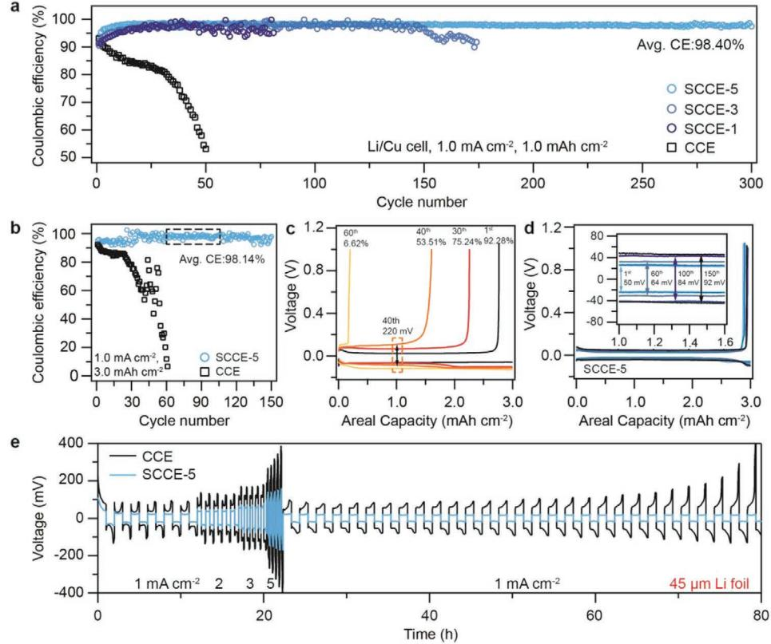
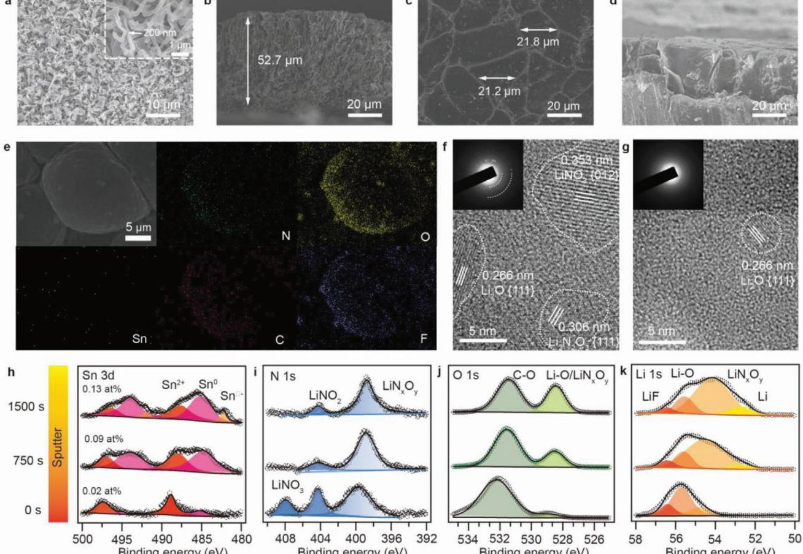
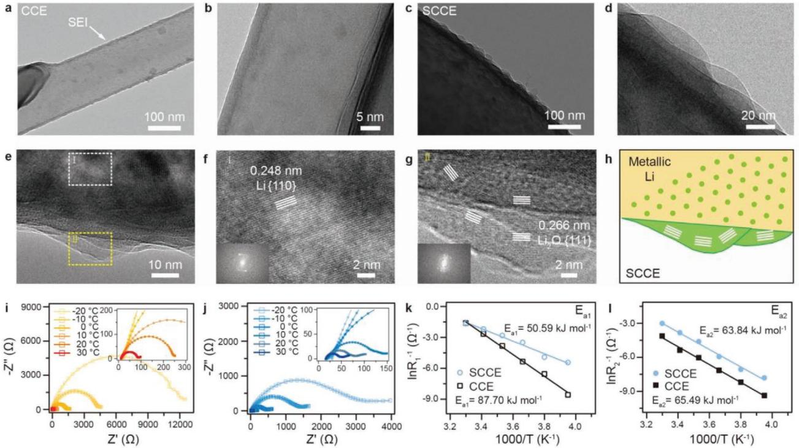
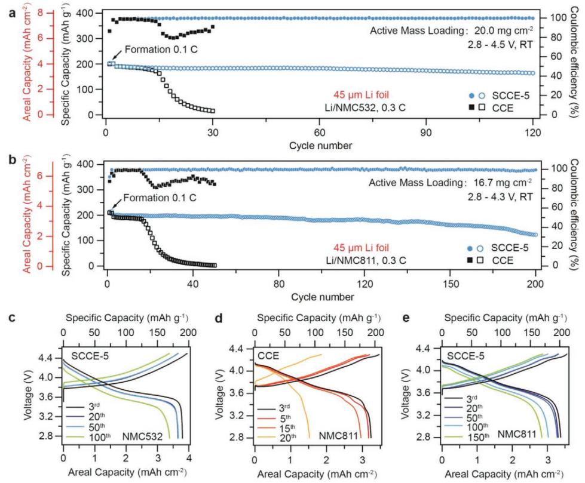
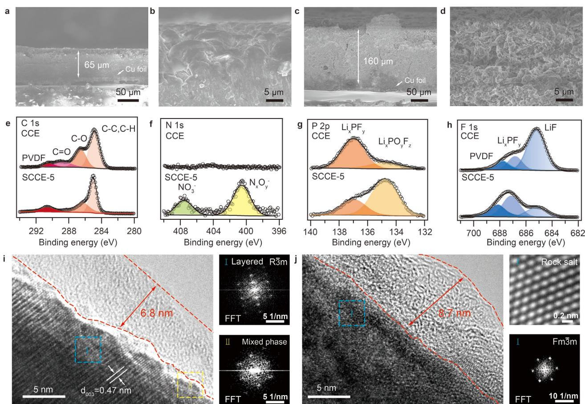

# **Colossal Granular Lithium Deposits Enabled by the Grain-Coarsening Effect for High-Efficiency Lithium Metal Full Batteries**

*Weidong Zhang, Qiang Wu, Jinxin Huang, Lei Fan, Zeyu Shen, Yi He, Qi Feng, Guannan Zhu,\* and Yingying Lu\**

**The low Coulombic efficiency of the lithium metal anode is recognized as the real bottleneck to practical high-efficiency lithium metal batteries with limited Li excess. The grain size and microstructure of deposited lithium strongly influences the lithium plating/stripping efficiency. Here, a solubilizermediated carbonate electrolyte that can realize grain coarsening of lithium deposits (>20 µm in width) with oriented columnar morphology, which is in sharp contrast with conventional nanoscale dendrite-like lithium deposits in carbonate electrolytes, is reported. It exhibits improved Li Coulombic efficiency to 98.14% at a high capacity of 3 mAh cm−2 over 150 cycles, because the colossal lithium deposition with minimal tortuosity can maintain the bulk Li with continuous electron conducting pathway during the stripping process, thus enabling efficient Li utilization. Li/NMC811 full batteries, composed of thin Li anode (45 µm) and a high-capacity NMC811 cathode (16.7 mg cm−2 ), can achieve at least 12 times longer lifespan (200 cycles).**

With the current graphite anode in lithium-ion batteries approaching its theoretical energy density limits, the lithium metal anode has been considered as a key component to high-energy lithium-based battery technologies,[1] because it delivers high theoretical specific capacity (3860 vs 372 mAh g−1 for conventional graphite anode), and has extremely low electrochemical redox potential (−3.04 V vs SHE).[2,3] Highvoltage lithium metal batteries (LMBs), using Ni-Rich LiNi*x*Mn*y*Co1−*x*–*y*O2 (NMC) cathode materials (e.g., NMC811) and thin Li foil (<50 µm in thickness), are one of the most feasible battery configurations to achieve specific energy higher than 300 Wh kg−1 at cell level.[4,5] Compared with ether-based

W. Zhang, Q. Wu, L. Fan, Z. Shen, Prof. Y. He, Prof. Y. Lu College of Chemical and Biological Engineering State Key Laboratory of Chemical Engineering Institute of Pharmaceutical Engineering Zhejiang University Hangzhou 310027, China E-mail: yingyinglu@zju.edu.cn J. Huang, Q. Feng, Dr. G. Zhu SAIC Motor Corporation

Shanghai 201804, China E-mail: zhuguannan@saicmotor.com

The ORCID identification number(s) for the author(s) of this article can be found under https://doi.org/10.1002/adma.202001740.

**DOI: 10.1002/adma.202001740**

electrolytes with limited oxidative stability (<3.8 V vs Li/Li+),[6] carbonate electrolytes are considered as a strong candidate for high voltage Li/NMC full batteries due to its wide electrochemical window and high oxidation stability (>4.5 V vs Li/Li+).[7]

Battery short-circuits induced by dendritic Li deposition can be relieved by employing functionalized separators,[8,9] artificial solid electrolyte interphases[10–12] and 3D composite anodes.[13–15] Li Coulombic efficiency (Li CE), defined as the ratio between the amount of Li stripped and Li plated at each cycle, is used as a truthful indicator to monitor the irreversible consumption of active Li.[16] Recently published works have demonstrated that low Li CE as a result of side reactions at the lithium metal surface and inefficient stripping process turns out to be the real

culprit behind poor cyclability of practical full LMBs, but this issue is usually hidden when huge excess Li is used (e.g., thick Li metal anode > 300 µm).[17,18] Li CE in conventional carbonate electrolyte (1 m LiPF6 in ethylene carbonate/diethyl carbonate (EC/DEC)) is usually less than 70%, which means that up to 30% of active Li is lost every charge/discharge process. Enhancing Li CE in carbonate electrolyte is a necessary and exigent issue put forth for solution, which is also the key factor to improve the cycle life of practical Li/NMC full batteries.[19,20] Until very recently, quantification results of inactive Li revealed that Li loss at each cycle is dominated by the isolated Li in tortuous and insulating solid-electrolyteinterphase (SEI) layers during the stripping process, instead of continuous side reactions between electrolyte and reactive lithium metal.[21] Thus, increasing the grain size and minimizing the microstructural tortuosity of lithium deposition can effectively maintain the bulk electronic conductive connection during the stripping process and mitigate the formation of isolated Li inside of SEI layers.[17,21] Lithium deposition with a columnar chunky morphology and minimized tortuosity is an ideal architecture to improve Li CE. However, the grain size of currently reported lithium electrodeposits after modifications (e.g., advanced electrolyte,[22–24] artificial SEI,[25,26] and current collector[27,28] ) usually ranges from 500 nm to 5 µm, lacking of effective strategy to realize columnar chunky lithium morphology in the conventional carbonate electrolyte.

Doping electrolyte additives in LMBs can regulate the electrolyte solvation structures, alter the chemical constituents of SEI, and thus tune the grain size and morphology of lithium deposits.[29] Lithium nitrate (LiNO3), as an indispensable electrolyte additive to improve Li CE in ether-based electrolytes, can promote the size of lithium deposits to a diameter of 2–5 µm, which is one order larger than the dendrite-like lithium deposits (≈200 nm in width) in conventional carbonatebased electrolytes.[30] High concentration LiNO3 in ether-based electrolytes can offset the irreversible consumption of lithium during cycling and extremely improve the deposition/stripping efficiency. When the concentration of LiNO3 in ether electrolyte increased from 1 to 5 wt%, almost fivefold improvement in cell lifetime can be achieved.[31] Introducing LiNO3-containing additives into carbonate-based electrolytes is a promising solution to turn the grain size of lithium deposits and improve Li CE in Li/NMC cells. However, LiNO3 additive can hardly dissolve in carbonate-based electrolytes (≈800 ppm), because carbonate molecules (e.g., EC and DEC) with limited Lewis basicity are insufficient to break the strong electronic interaction between Li+ and NO3 −. [32] Although sustained-release of LiNO3 into carbonate electrolytes at millimolar-level proposed recently can enhance the cycling stability of LMBs, but the concentration and mass loading of LiNO3 is far below that in ether-based electrolytes.[32,33] The fundamental problem of the dissolution of LiNO3 in carbonate electrolytes remains unsettled.[34,35] To remedy for the deficiency of salt-dissolving capability of carbonate electrolytes, additional Lewis acid sites in carbonate electrolytes which function as solubilizers can coordinate and solvate NO3 − from the surface of LiNO3 cluster and promote complete dissociation between ion pairs.[36] Theoretically, one high-valence cation with positive charge can coordinate multiple monodentate nitrate anions and form chemically stable organometallic compounds in the electrolyte.

In this work, we introduce solubilizer tin (II), as a third agent beyond common solvents and additives, into conventional carbonate electrolyte (CCE, 1 m LiPF6 in EC/DEC) to overcome the solubility barrier of LiNO3 cluster until it reaching up to 5 wt%. Grain coarsening behavior of lithium deposits (>20 µm in width) with oriented columnar morphology can be realized in the solubilizer-mediated carbonate electrolyte (SCCE). Metal–organic hybrid SEI layer derived from the Sn2+–NO3 − coordination-solvation structure provides a positive impact on the grain coarsening of lithium deposition. The SCCE electrolyte promotes Li CE to 98.14% at a high capacity of 3 mAh cm−2 over 150 cycles due to almost reservable stripping process among coarse lithium electrodeposits. When SCCE electrolyte was applied to Li/NMC811 full batteries under highly challenging conditions (thin Li anode: 45 µm, ultrahigh-loading cathodes: 4 mAh cm−2 , high discharging rate: 1.9 mA cm−2), Li/NMC811 full batteries retained 89.6% of their original capacities after 130 cycles.

Tin (II) with appropriate Lewis acidy can effectively coordinate NO3 − and promote complete dissociation between ion pairs without decomposing the solvent molecules, and the coordination-solvation capability of tin (II) is superior to most high-valence cations (Figure S1, Supporting Information). The solubility of LiNO3 additive in 1 m LiPF6 EC/DEC electrolyte can be upgraded from ppm level to 5 wt% by introducing 0.5 wt% tin trifluoromethanesulfonate (Sn(OTf)2) as a solubilizer (Figures S2 and S3, Supporting Information). The dissolution mechanism of LiNO3 cluster mediated by solubilizer was studied by ab initio molecular dynamics (AIMD) simulations. As shown in **Figure 1**a, the snapshots from trajectories clearly demonstrate that the structure of LiNO3 cluster is disrupted by Lewis acid Sn2+ first, then NO3 − ions appears in the solvation layer of Sn2+ and diffuse along with Sn2+. Finally, at least four NO3 − ions coordinate with Sn2+ in 1 m LiPF6 EC/DEC electrolyte. Based on AIMD result, it can be concluded that the Sn2+ plays a significant role in facilitate the dissolution of LiNO3 cluster in carbonate solvents. Pronounced differences can be observed from Figure S4 (Supporting Information) that LiNO3 cluster can hardly dissociate in the absence of Sn2+. Root mean square deviation (RMSD) is generally used as an indicator to judge of differences in molecular structure, the value of RMSD indicate that the degree of differences between current and initial structures.[37] The value of RMSD of NO3 − ion cluster increases as time step increases (Figure 1b), which means the difference of NO3 − cluster is increasingly obvious compare with the initial structure. Whereas in the system without Sn(OTf)2, the value of RMSD of NO3 − ion cluster only increased slightly and tend to be stable after 4000 time steps. Simultaneously, the average centroid distance of NO3 − ion cluster increased from 8.38 to 10.12 Å with time step increases can be found from Figure S5 (Supporting Information), which showed the same trend with RMSD analysis. While in the system without Sn(OTf)2, the average centroid distance of NO3 − ion cluster was slightly disturbed around 6.4 Å without significant change. Both RMSD and average centroid distance results indeed support that Sn2+ can influence the stability of LiNO3 cluster, and NO3 − ions can be dragged into solvent by Sn2+ because the interactions between Li+ and NO3 − decreased. After sufficient time of simulation, NO3 − ions can distribute in the carbonate electrolyte uniformly.

To study the solubilizer mediated coordination-solvation environment in carbonate solvents, radial distribution function (RDF) was used to investigate the solvation structure differences by adding trace of Sn2+. Figure 1c shows that the first peak intensity in g(r) for Sn2+-N(NO3 −) pair is stronger than the first peak intensity in g(r) for Li+-N(NO3 −) pair, which means that NO3 − ions are more likely to appear in the solvation structure of Sn2+. Furthermore, the autocorrelation function result shows that the average residence time of NO3 − ions in the solvation structure of Li+ is 7.0 ps, while the average residence time of NO3 − ions in the solvation structure of Sn2+ is 10.0 ps during the simulation time. Based on the results of average residence time, it can be concluded that the interactions between Sn2+ and NO3 − are much stronger than that between Li+ and NO3 − because of the higher charge, so the NO3 − ions prefer to bonded with Sn2+ when Sn(OTf)2 was added into system. The RDFs of oxygen atom in NO3 − ions around Sn2+ and Li+ solvation structure also confirm that NO3 − ions easily coordinate with Sn2+ instead of Li+. The subtle coordination-solvation environment was further probed by Nuclear magnetic resonance (NMR) spectroscopy. As the 17O NMR spectra shown in Figure 1d, the carbonyl 17O chemical shift of EC moves from 235.6 to 223.8 ppm (∆*a*) when 1 m LiPF6 adds into EC/DEC solvents, which can be attributed to the direct interaction between **www.advancedsciencenews.com www.advmat.de**

**Figure 1.** Coordination-solvation chemistry mediated by solubilizer in carbonate electrolyte. a) Snapshots of the AIMD simulation cell with solubilizer at 300 K. b) The changes of RMSD of NO3 − ion cluster. c) The RDFs of Li+–NO3 − and Sn2+–NO3 − in 1 m LiPF6 EC/DEC. d–f) 17O, 7 Li, and 1 H NMR spectra of SCCE and CCE electrolyte. g) Schematic illustration of solvation sheath structure in solubilizer-mediated carbonate electrolyte.

Li+ and carbonyl at the primary solvation sheath.[38] The smaller carbonyl displacement of DEC (∆*b*) reveals that DEC molecules are located at the secondary solvation sheath due to the weak dipolar interaction between Li+ and DEC. When the solubilizer Sn(OTf)2 and LiNO3 additive were added, the carbonyl 17O chemical shift of EC exhibits a further upfield shift to 221.9 ppm, which suggests that Sn2+ with higher charge and stronger Lewis acidy is preferentially involved in solvation structure and induces stronger dipolar interaction with EC than Li+. The distinctive coordination-solvation chemistry mediated by solubilizer can also be verified by the downfield displacements in 7 Li and 1 H NMR spectra (Figure 1e,f). The solvated salts and solvents are unequivocally succumbed to the inductive effect induced by electron-withdrawing Sn2+ in the local solvation environment. The presence of Sn2+ in electrolytes will only affect the coordination-solvation process and will not cause the chemical structure changes of salts and solvents (Figure S6, Supporting Information). As illustrated by Figure 1g which differs from the conventional solvated Li+ complex, solubilizer Sn2+ can preferentially coordinate and tightly bind the EC molecules and NO3 −, forming the stable "solvation sheath." Moreover, this distinctive coordination-solvation sheath mediated by solubilizer has a profound effect on regulation of the SEI/cathode electrolyte interface (CEI) structures, and strongly influences the grain size of lithium deposits and Li CE.

Li/Cu cells using various SCCE were tested to evaluate the cycling performances of the lithium metal anode at current density of 1 mA cm−2 and constant areal capacity of 1 mAh cm−2 (**Figure 2**a). When a small amount of LiNO3 (e.g., 1 wt%) solvated in the conventional carbonate electrolyte by solubilizer (SCCE-1), a significant improvement in Li CE was observed, with an average Li CE of 96.3% over 80 cycles. In contrast, Li CE in CCE (1 m LiPF6 in EC/DEC) dropped to below 90% after just 3 cycles, averaging 79.1% in the first 50 cycles. Similar to the "concentration effect" in ether electrolyte,[31] increasing the concentration of LiNO3 can efficiently enhance the cycle life of lithium metal. When the concentration of LiNO3 in the carbonate electrolyte is increased to 5 wt% (SCCE-5), the average Li CE reaches 98.4% over 300 cycles. As shown in Figure 2b, Li metal cyclability was further tested under deep cycling

**Figure 2.** High-efficiency lithium metal deposition/stripping in solubilizer-mediated carbonate electrolyte. a,b) Li Coulombic efficiency measured in Li/ Cu cells in different electrolytes with various LiNO3 concentration at 1 mA cm−2. Areal capacity: 1 mAh cm−2 a) and 3 mAh cm−2 b). c,d) Lithium metal deposition/stripping voltage profiles at selected cycles in 1 m LiPF6 EC/DEC c) and SCCE-5 electrolyte d). e) Rate performances of symmetric Li cells using 45 µm Li anode in different electrolytes at various current densities from 1 to 5 mA cm−2.

condition (e.g., 3 mAh cm−2 ), which is equivalent to the Li utilization in practical full batteries with high areal capacity. The average Li CE is ≈98.1% over 150 cycles when SCCE-5 electrolyte is used, whereas for CCE electrolyte, the Li CE decreases to <80% after just 27 cycles (average Li CE over 60 cycles is 70.1%). In addition, cells using CCE electrolyte exhibit continuous increase in voltage gap between Li plating and stripping (up to 220 mV, high areal capacity: 3 mAh cm−2) and rapid attenuation in Li CE (Figure 2c). As expected, Li/Cu cells using SCCE-5 electrolyte show lower voltage hysteresis (<46 mV) and impressive average Li CE over 150 cycles (Figure 2d). To further demonstrate the substantial superior of SCCE electrolyte, 1 m LiPF6 EC/DEC electrolyte with 0.5 wt% Sn(OTf)2 was also tested as a comparison (Figure S7, Supporting Information) and displays only slight improvement in Li CE (60.5% over 100 cycles). Interestingly, the grain size of lithium deposits increases to ≈1 µm, which may be attributed to fast ion transport in alloy interface via 0.5 wt% Sn(OTf)2 additive.[39]

Symmetric Li/Li cells using 45 µm Li foils (9.08 mAh cm−2 , Figure S8, Supporting Information) were tested to evaluate the cycling stability when Li source is limited, which can mimic the charge/discharge process in full LMBs. At the charging/ discharging current density of 1 mA cm−2 and areal capacity of 3 mAh cm−2, cells using the CCE can only run 16 cycles due to the huge loss of active Li (>0.56 mAh cm−2 ) at each cycle, which is consistent with the poor Li CE measured in Li/Cu cells. For SCCE-5 electrolyte, Li/Li cells using 45 µm Li foils exhibit greatly improved cycling stability, with nearly constant voltage hysteresis over 620 h (Figure S9, Supporting Information). The rate performance of symmetric Li/Li cells using 45 µm Li foils was tested by cycling at current densities of 1, 2, 3, and 5 mA cm−2 (Figure 2e). Lower and maintained stable voltage hystereses were observed for Li/Li cells using SCCE-5 electrolyte. The voltage hysteresis of cells using conventional carbonate electrolyte increased rapidly after 50 h and finally failed after 80 h due to the completely loss of active Li. The greatly improved Li/Li cell performances further suggest the superiority of SCCE electrolyte on enhancing the Li CE. The performances of SCCE electrolyte is at the forefront of most reported electrolyte engineering for high-voltage LMBs (Figure S10 and Table S1, Supporting Information).

Pronounced differences in lithium deposition morphology using 45 µm Li foils at a high capacity of 5 mAh cm−2 were observed via scanning electron microscopy (SEM) images. Dendrite-like lithium deposits (≈200 nm wide) with high tortuosity were observed in 1 m LiPF6 EC/DEC electrolyte (**Figure 3**a). From the cross-sectional view, the thickness of lithium deposition in CCE can reach ≈52.7 µm due to the newly formed porous and loose microstructures (Figure 3b), which is twice of the theoretic value (≈24 µm for a capacity of 5 mAh cm−2). In contrast, grain coarsening behavior of lithium deposition can be observed in SCCE-5 electrolyte,

**Figure 3.** Lithium deposition morphology ruled by solubilizer-mediated carbonate electrolyte. a–d) Top view (a) and cross-sectional (b) SEM images of dendrite-like lithium deposition (5 mAh cm−2) and in CCE electrolyte. The current density is fixed at 1 mA cm−2 . c,d) Top view (c) and cross-sectional (d) SEM images of deposited Li morphology at an areal capacity of 5 mAh cm−2 in SCCE electrolyte. e) SEM image and EDS mapping (N, O, Sn, C, and F) of the lithium depositions in SCCE electrolyte. f,g) The HRTEM images of the SEI layers derived from SCCE electrolyte (f) or 1 m LiPF6 in EC/ DEC electrolyte (g). h–k) XPS Sn 3d, N 1s, O 1s, and Li 1s depth profiles of the lithium metal interface using an SCCE electrolyte.

forming columnar chunky lithium deposits with minimized tortuosity (≈20 µm wide, Figure 3c). Focused ion beam scanning electron microscopy (FIB-SEM) revealed that the dense microstructure of lithium deposits with minimal porosity can be achieved in SCCE electrolyte (Figure S11, Supporting Information). The thickness of the densely packed chunky lithium deposits is ≈25.6 µm (Figure 3d; and Figure S12, Supporting Information), which is very close to the theoretic value. Compared with the ether electrolyte with only LiNO3 additive, the lithium deposition is more compact and the size of Li grain is quadruple in SCCE-5 electrolyte under the synergistic effect of solubilizer Sn2+ and LiNO3 additive (Figure S13, Supporting Information). The large Li chunks with minimal tortuosity in SCCE electrolyte can maintain the bulk Li with continuous electron conducting pathway during stripping process, reducing the amount of isolated Li within the SEI and facilitating high Li CE (Figure S14, Supporting Information). However, dendrite Li with large tortuosity will entrap active Li within the insulating and tortuous SEI layers, resulting in low Li CE in CCE electrolyte (Figure S15, Supporting Information).

The chemical constituents and spatial structures of SEI layers are considered as the key factors to influence the microstructure of lithium deposits.[40] The elemental mapping by energy-dispersive X-ray spectroscopy (EDS) suggests uniform distribution of N, O, C, and F elements and trace of Sn element at the surface of Li deposits, which are derived from the Sn2+–NO3 − coordination-solvation structure (Figure 3e). Essential differences of SEI formed in these two electrolytes can be observed via high-resolution transmission electron microscopy (HRTEM). The SEI formed in SCCE-5 electrolyte contains large amounts of crystalline inorganic nanoparticles (Figure 3f; and Figure S16, Supporting Information). The lattice fringes observed in the crystalline region demonstrate the coexistence of Li2O, LiNO3, and Li2N2O3 in the SEI layers formed in SCCE-5 electrolyte. In contrast, the SEI formed in CCE electrolyte exhibits amorphous nature in most regions, which is confirmed by selected area electron diffraction (Figure 3g). X-ray photoelectron spectroscopy (XPS) depth profiling analysis, further revealed the chemical compositions of the metal–organic hybrid SEI layers derived from the Sn2+–NO coordination-solvation structure. Trace of Sn-containing species with different

oxidation state distribute in the hybrid SEI layers (Figure 3h). Oxidized Sn2+ species (0.02 at%) clearly lingered on the uppermost portion of the lithium metal anode, which may be originated from the Sn2+ residue. Interestingly, the fraction of Sn-containing species dramatically increased after Ar sputtering (0.13 at%). The dominating Sn0 species can be detected closer to the lithium metal side due to the strong chemical reactivity of Li0 . Besides, Sn2+–NO3 − coordination-solvation structure induced preferential reduction of NO3 − can lead to a nitrogen and oxygen-rich inorganic interphase formed of LiNO2 and LiN*x*O*y* and Li2O (Figure 3i–k), which is consistent with the HRTEM results. These ceramic-like components, known as superior Li-ion conductors, can provide fast ion transport and uniform Li-ion flux at atomic scales. The unique metal–organic hybrid SEI layer derived from the Sn2+–NO3 − coordination-solvation structure provides a positive impact on the grain coarsening of lithium deposition. In agreement with previous works showing benefits on Cu0 mixed interphase,[41] the discrete Sn0 can promote polycrystalline SEI with small domains (nitride species and Li2O), which may enhance the Li+ transport and storage ability among grain boundary regions and promote chunky lithium deposition.

To further elucidate the mechanism of lithium deposits coarsening in SCCE electrolyte, we revealed the spatial structural of SEI via cryogenic-transmission electron microscopy (Cryo-TEM). which can supplement and support the HRTEM results in Figure 3f–g. Cryo-TEM has recently shown tremendous potential on characterizing beam-sensitive and air-reactive materials at cryogenic temperatures, such as lithium metal.[42] **Figure 4**a exhibited a typical image of dendrite-like lithium deposition in CCE electrolyte. Magnified cryo-TEM images of the SEI formed in CCE electrolyte clearly showed an amorphous nature (≈30 nm), and no distinct crystalline phases can be observed (Figure 4b). Different from the mosaic and multilayered SEI nanostructures reported before,[43] a wavy SEI nanostructure uniformly emerged on the interface of deposited Li in SCCE electrolyte (Figure 4c,d). The crystallinity of deposited Li can be confirmed by the lattice spacing 0.248 nm, corresponding to the {110} planes of metallic Li (Figure 4e,f). High-resolution Cryo-TEM images proved that the nanowave-structured SEI was dominated by high concentration of crystalline inorganic compositions (Figure 4g,h), and the content of nanocrystalline components were even higher than the SEI formed in ether electrolyte (with 2 wt% LiNO3, Figure S17, Supporting Information). High concentration of NO3 − in SCCE may be the key factor for the formation of nanocrystalline rich SEI, instead of multilayered SEI in the sustained-release electrolyte.[32] Abundant ceramic-like crystalline grains in the SEI are regarded to facilitate fast Li ion transport via the grain boundaries between multiple nanocrystalline components, which is similar to the Li ion transport mechanism in organic/inorganic composite solid electrolytes.

Temperature-dependent electrochemical impedance spectroscopy (EIS) were then carried out to reveal the great differences of Li ion transfer property between the SEIs formed

**Figure 4.** Nanowave-structured SEI Formed in solubilizer-mediated carbonate electrolyte. a,b) Cryo-TEM images of dendrite-like lithium deposits with amorphous SEI in CCE electrolyte. c,d) Cryo-TEM images of lithium deposits with wavy nanostructured SEI in SCCE electrolyte. e–g) Magnified TEM images of wavy SEI with crystalline domains. h) Schematic of the observed wavy structure formed on colossal lithium deposits in SCCE electrolyte. i,j) Nyquist plots of the Li|Li cells with CCE electrolyte (i) and SCCE electrolyte (j) at different temperatures (−20–30 °C). k,l) Arrhenius behavior and comparison of activation energies between the lithium ion transport resistance through SEI (k) and desolvation activation energy (l).

in CCE and SCCE electrolyte (Figure 4i,j). According to the previous electrochemical theory, solvated Li ion from the bulk electrolyte needs to overcome two activation energy (*E*a) barriers to reach the active lithium: 1) lithium ion transport resistance through SEI (*E*a1) and desolvation activation energy (*E*a2).[44] *E*a1 and *E*a2 can be obtained by fitting the temperature-dependent lithium ion transport resistance (*R*SEI) and charge transfer resistance (*R*CT) according to Arrhenius equation. Nanowavestructured SEI formed in SCCE electrolyte with the lowest *E*a1 (50.59 kJ mol−1 , Figure 4k) exhibited the greatest lithium ion conductivity, which is much lower than the SEI formed in CCE electrolyte (87.70 kJ mol−1 ) and ether electrolyte (with 2 wt% LiNO3, 61.08 kJ mol−1 , Figure S18, Supporting Information). The decreased *E*a1 can be attributed to the large ratio of inorganic fillers and abundant grain boundaries for Li ion transportation in the SEI. The values of *E*a2 in SCCE (63.84 kJ mol−1 ) and CCE (65.49 kJ mol−1 ) are almost equal, which may be ascribed to the same electrolyte solvents and salts used in these two systems. According to the equation between bulk/surface ionic conductivity and Li grain radius reported by Biswal et al., ionic conductivity in the SEI is associated with the term cubic in Li grain radius.[40] The distinctly increased ion conductivity of SEI form in SCCE electrolyte can dramatically tune the grain size of Li deposits, which also tallies with the lithium deposits coarsening phenomenon.

Li/NMC532 and Li/NMC811 under practical conditions (45 µm Li anode, high-loading cathode and lean electrolyte) were tested to further gauge the compatibility and utility function of the SCCE electrolyte in high-voltage full batteries. The majority of previous studies on LMBs are based on thick Li metal anodes (>300 µm thiciangk), low-area capacity cathode (1.5 mAh cm−2 ), and large negative to positive capacity (N/P) ratio (>40), which severely masks the poor Li CE and cyclability problem of lithium metal.

In order to evaluate the high-voltage cycling performance of SCCE electrolyte, commercial single crystal NMC532 was chosen as high-voltage cathode (cutoff voltage: 4.5 V, mass loading: 20 mg cm−2 , Figure S19, Supporting Information) to pair with 45 µm Li foil. As shown in **Figure 5**a, the capacity and Coulombic efficiency of Li/NMC532 full cells using CCE electrolyte (1 m LiPF6 in EC/DEC, 10 µL mAh−1 ) dropped quickly only after 12 cycles at 0.3 C due to the fast "active Li" depletion caused by the extremely poor Li CE under deep cycling condition. In comparison, Li/NMC532 full batteries using SCCE-5 electrolyte (10 µL mAh−1 ) exhibited a high specific capacity of 190.0 mAh g−1 in the voltage range of 2.8–4.5 V and cycled stably over 120 cycles. It worth noticing that Li/NMC532 full cells can only deliver 164.4 mAh g−1 when cycling between 2.8 and 4.3 V, which demonstrates that increasing the cutoff voltage is one of the effective strategies to enhance the specific capacity

**Figure 5.** Cycling performances of high-voltage Li/NMC532 and Li/NMC811 full batteries with 45 µm Li anode. a) Cycling performances of the Li/NMC532 at 0.3 C (voltage range: 2.8–4.5 V) in different electrolytes. The N/P ratios of the Li/NMC532 cell was 2.37. b) Cycling performances of Li/NMC811 at 0.3 C (voltage range: 2.8–4.3 V) in different electrolytes. The N/P ratios of the Li/NMC811 cell was 2.64. c) The corresponding charge/ discharge curves of Li/NMC532 using solubilizer-mediated carbonate electrolyte at the 3rd, 20th, 50th, and 100th cycles. d,e) The corresponding charge/ discharge curves of Li/NMC811 using CCE electrolyte (d) or SCCE-5 electrolyte (e) at different cycles.

and energy density (Figure S20, Supporting Information). The detailed charging/discharging voltage profile of Li/NMC532 full cells reveal that areal capacity can reach 3.8 mAh cm−2 under deep-cycling conditions, and 86.2% of the initial capacity was maintained after 120 cycles (Figure 5c).

When SCCE-5 electrolyte was applied to Li/NMC811 full batteries composed of thin Li anode (45 µm, 9 mAh cm−2 ) and high mass loading NMC811 cathode (3.4 mAh cm−2 , Figure S21, Supporting Information), the cycling lifespan and capacity retention improved significantly. As shown in Figure 5b, cells using CCE electrolyte can only run 15 cycles at 0.3 C, while at least 12 times longer lifespan (200 cycles) and high initial Coulombic efficiency (92.26%; 87.54% for control cells) can be achieved via the application of SCCE-5 electrolyte. As expected, the significantly improved cycling lifespan (180 cycles; 15 cycles for control cells) can also be observed at a higher current density of 0.5 C (i.e., 1.5 mA cm−2 , Figure S22, Supporting Information). The charging/discharging voltage profiles of cells using CCE electrolyte at 0.3 C exhibited a continuous capacity fading before a sudden failure caused by "active Li" depletion after 15 cycles (Figure 5d). In contrast, limited polarization and relatively stable capacity retention can be observed when SCCE-5 electrolyte was used (Figure 5e). More impressively, high capacity retention (89.6%) and excellent cycling stability (130 cycles) were achieved in SCCE-5 electrolyte under extremely demanding conditions (i.e., ultrahigh-loading cathodes: 4 mAh cm−2 , high discharging rate: 1.9 mA cm−2, Figure S23, Supporting Information). To further verify the potential of SCCE electrolyte for practical application, we constructed pouch-type Li/NMC811 full cells, consisted of 45 µm Li anode and high cathode loading cathode (21 mg cm−2 ), at 100 mAh level for 120 cycles (Figure S24, Supporting Information). Compared to the reported full LMBs performances under practical conditions in the literatures (Table S2, Supporting Information), the cycling performances of full LMBs using SCCE-5 electrolyte is no doubt in the leading position.

Postcycling characterizations were carried out to understand the mechanisms for the excellent cycling stability of the Li/ NMC811 full batteries. Grain coarsening of lithium metal deposition via SCCE-5 electrolyte not only can maintain the bulk electronic conductive connection and improve Li CE, but also can mitigate the anode pulverization problem of the thin anode. As shown in **Figure 6**a,b, columnar chunky lithium deposition packed densely on the top of the thin Li anode, and no corrosion can be observed inside of the bulk Li anode after 30 cycles. For cells using 1 m LiPF6 EC/DEC electrolyte (Figure 6c,d),

**Figure 6.** Effects of solubilizer-mediated carbonate electrolyte on both Li anodes and NMC811 cathodes. a–d) Postcycling SEM analyses of Li metal anodes obtained from Li/NMC811 cells using SCCE-5 electrolyte (a,b) or CCE electrolyte (c,d) after 30 cycles. e–h) Characterization of CEI components using CCE (top layer) and SCCE-5 electrolyte (bottom layer). i,j) Postcycling HRTEM analyses of NMC811 cathodes obtained from Li/NMC811 cells using SCCE-5 electrolyte (i) or CCE (j) after 50 cycles.

the native thin Li anode retrieved from Li/NMC811 full batteries was completely consumed, and it is totally pulverized to form lithium dendrites (Figure S25, Supporting Information).[45,46] The thickness of the Li anode using CCE electrolyte increased from 45 to 160 µm, while only slight volume fluctuation (from 45 to 65 µm) was observed when SCCE-5 electrolyte was used. Only sheet-like SEI shells left on the Cu current collector (Figure S26, Supporting Information), and the thickness of Li anode using SCCE-5 electrolyte is only half of that using CCE electrolyte after 200 cycles (Figure S27, Supporting Information).

The improved initial Coulombic efficiency and capacity retention of Li/NMC811 full batteries using SCCE-5 electrolyte can be attributed to the unique CEI layers generated from Sn2+–NO3 − coordination-solvation structure. Li/NMC532 and Li/NMC811 half cells (Figures S28 and S29, Supporting Information) using thick Li anodes (500 µm thick) were tested to evaluate the influences of SCCE-5 electrolyte on cathodes accurately. SCCE-5 electrolyte exhibits excellent cycling stability especially at high charging/discharging rate (i.e., 1.51 mA cm−2 ), retaining 96.5% of the original reversible capacity after 50 cycles, in comparison with 77.9% capacity retention for CCE electrolyte within 50 cycles. CEI chemical compositions on the surface of cycled NMC811 cathodes in SCCE-5 and CCE electrolytes were characterized using XPS (Figure 6e–h). Carbonaceous species containing CO and CO functional groups are greatly dwindled on the NMC811 surface cycled in SCCE-5 electrolyte, suggesting that less solvents molecules are decomposed and involved in the CEI layer formation. As shown in Figure 6f, there are apparent signals of nitride species (LiNO2, LiN*x*O*y*) derived from Sn2+–NO3 − coordination-solvation structure, which is similar to the CEI compositions on sulfur cathodes when LiNO3 additive is used in ether electrolyte. The elemental mapping also confirms the CEI layer on cycled NMC811 is rich of N element (Figure S30, Supporting Information). Besides, the CEI formed in SCCE electrolyte has a higher ratio of Li*x*PO*y*F*z* relative to LiF, whereas the CEI formed in 1 m LiPF6 EC/DEC electrolyte has more LiF relative to Li*x*PO*y*F*z*. Li*x*PO*y*F*z* has been long regarded as one of the effective CEI components to improve the surface stability and capacity retention of Ni-rich NMC cathodes. The increased Li*x*PO*y*F*z* and nitride components in CEI layers may contribute to the improved cycling performances of Li/NMC811 full batteries using SCCE-5 electrolyte. Similar CEI components and intensity can be observed on NMC532 cathodes (Figure S31, Supporting Information).

Deeper insight into the effective cathode protection in SCCE electrolyte can be obtained from HRTEM characterization. After 50 cycles in SCCE-5 electrolyte, the NMC811 primary particle was protected by an amorphous CEI layer (≈6.8 nm, Figure 6i) derived mainly from Sn2+–NO3 − coordination-solvation structure, and this thin CEI layer can efficiently inhibit further solvent decomposition and electrolyte corrosion to the cathode. Bulk layered structure with R3m phase can be maintained and a very thin cation mixing layer can be observed (mixed phase from fast Fourier transform (FFT) pattern) underneath the CEI layer in SCCE-5 electrolyte. However, at least 10 nm NiO-like layer (Fm3m phase from FFT, Figure 6j) can be observed underneath the thick and uneven CEI layer in CEE electrolyte due to transition-metal ions occupying the Li sites, suggesting the gradual cathode decline may be induced by electrolyte infiltration through the native CEI layer in CCE electrolyte.[47,48] The above results indicate the significance of the CEI layer generated from Sn2+–NO3 − coordination-solvation structure on efficient protection of NMC811. Previous studies have also identified that cycling stabilities are strongly related to the microcracking within the secondary particles.[49] Severe disintegration of secondary particles can be clearly observed for the NMC811 in CCE electrolyte, which accelerates the electrolyte infiltration into the particle core (Figure S32, Supporting Information). The mechanical integrity of NMC811 secondary particles can be improved and the pulverization problem can be alleviated in SCCE-5 electrolyte (Figure S33, Supporting Information). The joint effects of protective CEI layer and mechanical integrity of NMC811 cathode in SCCE electrolyte render the substantially improved cycling stability.

In summary, we reported that solubilizer-mediated carbonate electrolyte can coarsen the grain of lithium deposits (>20 µm wide) with oriented columnar morphology. It can significantly enhance the Li CE because large Li chunks with minimal tortuosity can maintain the bulk electron conducting pathway during stripping process, thus enabling efficient Li utilization. Trace of tin (II) as a solubilizer can provide additional Lewis acid sites to coordinate and solvate NO3 − in conventional carbonate electrolytes, and the Sn2+–NO3 − coordination-solvation structure can dramatically optimize the compositions of both SEI and CEI. Under a practical condition with limited Li excess (45 µm Li, ≈9 mAh cm−2) and high mass loading NMC811 cathode (16.7 mg cm−2 , 3.4 mAh cm−2), Li/NMC811 full batteries exhibited an at least 12 times longer lifespan (200 cycles) via the application of SCCE-5 electrolyte. This work demonstrated that significance of grain size and microstructure of lithium deposition on lithium plating/stripping efficiency, and the solubilizer-mediated lithium deposition coarsening provides a very promising solution for practical high-efficiency LMBs.

# **Experimental Section**

*Method of Calculation*: AIMD was used to analysis the dissolution mechanism of LiNO3 cluster in LiPF6 EC/DEC electrolytes with Sn(OTf)2 as solubilizer. All calculations were performed with the CP2K, a quantum chemistry and solid state physics software package. The Perdew–Burke– Enzerhof generalized gradient approximation was used for the exchangecorrelation functional. The core electrons were described by the Gaussian and plane-wave basis and the convergence criterion for energy is 1.0E−8 eV. The convergence criterion of self-consistent field loop based on orbital transformation (OT) method was set as 1.0 × 10−4 eV. Besides, a long range dispersion-correction DFT-D3 was involved for all calculations. AIMD simulations were performed under the NVT (a simulation system that consists of a constant number of atoms at a constant volume, in which the temperature of the system is controlled by using a thermostat) ensemble. The time step of 0.5 fs was used in all AIMD simulations.

*Materials*: 1 m LiPF6 EC/DEC (1:1 by volume) was purchased from DodoChem. Tin (II) trifluoromethanesulfonate (Sn(OTf)2, anhydrous, ≥98%) and lithium nitrate (LiNO3, anhydrous, ≥99.99%) were purchased from Shanghai Aladdin Bio-Chem Technology Co., LTD. To prepare the solubilizer mediated carbonate electrolyte, 0.5 wt% Sn(OTf)2 and 1.0–5.0 wt% LiNO3 were dissolved in 1 m LiPF6 EC/DEC electrolyte by heating at 60 °C with constant stirring. 45 µm Li anode (with Cu current collector) was purchased from China Energy Lithium Co., Ltd. Cathode

**www.advancedsciencenews.com www.advmat.de**

NMC532 electrode (active mass loading: 20.0 mg cm−2 ) and Cathode NMC811 electrode (active mass loading: 16.7 or 21.0 mg cm−2) were kindly provided from SAIC Motor Corporation. All the cathodes were dried under vacuum overnight before use.

*Material Characterizations*: The 17O, 7 Li, 1 H, 13C, 31P, and 19F NMR spectra were recorded on Agilent DD2-600 (600 MHz) at room temperature. In order to reflect the real solvation structure in SCCE-5 electrolyte, no deuterated solvents were added into NMR tubes in the 17O NMR experiment. SEM measurements were conducted on Hitachi SU8000 FE-SEM and FEI Quanta 3D FEG SEM/FIB Dual Beam at 5 kV. SEI and CEI compositions after cycling were analyzed by XPS (Escalab 250Xi). For HRTEM analysis (200 kV-2100F, JEOL), the Cu foil were collected from Li/Cu cells after five lithium metal plating/stripping cycles and was immersed into pure DME for 2 h of ultrasonic cleanout. All the postcycling samples were disassembled in an argon-filled glovebox and rinsed with pure dimethyl carbonate to remove residual salt. For cryo-TEM characterizations, the TEM grid with deposited Li-metal was placed in an Eppendorf tube and sealed in an argon-filled bag. The Eppendorf tube was crushed inside a bath of liquid nitrogen without any air exposure. The sample was then carefully loaded onto a cryo-TEM holder under liquid nitrogen and transferred to the TEM column. All cryo-TEM images were obtained on a FEI Talos F200C under low dose mode at an accelerating voltage of 200 kV. Li/Li symmetrical cells using different electrolytes were rested for 6 h (after 1 cycle, 1 mA cm−2, 1 mAh cm−2 ) before EIS tests. The temperature-dependent EIS characterizations were conducted in a high-low temperature chamber (−20–30 °C) and Solartron Analytical Electrochemical Workstation (frequency ranging from 100 kHz and 0.1 Hz).

*Electrochemical Tests*: CR2032 coin cells (MTI Corporation) were assembled in an argon-filled glovebox with H2O and O2 content below 0.3 ppm. Celgard 2400 (25 µm monolayer PP) separator was used as the separator and 40 µL electrolyte was applied to each cell. The charge/discharge measurements were carried out on the LAND battery tester (Wuhan LAND Electronics Co., Ltd.) at room temperature. The symmetrical cells using 45 µm Li anode were cycled at current densities of 1 mA cm−2 under fixed charge/discharge capacities of 1 or 3 mAh cm−2 . Li/Cu cells were used to evaluate the Li Coulombic efficiency, cells were cycled at 0–1 V for 5 cycle (for SEI formation, no Li deposition). Then a fixed amount of lithium (1 or 3 mAh cm−2 ) was plated onto the Cu foil and stripped back by a cutoff voltage (1.0 V). For Li/NMC532 (N/P ratio of 2.28 in Figure 5a) or Li/NMC811 full cells (N/P ratio of 2.64 in Figure 5b, N/P ratio of 2.25 in Figure S23, Supporting Information), two formation cycles at 0.1 C rate were conducted before a long-term cyclelife test at a higher charge/discharge current (0.3 C or 0.5 C) within a voltage range of 2.8–4.5 or 2.8–4.3 V versus Li+/Li.

# **Supporting Information**

Supporting Information is available from the Wiley Online Library or from the author.

### **Acknowledgements**

The authors thank Fang Chen (Department of Chemistry, Zhejiang University) for SEM analysis. They also thank Lingyun Wu (Cryo-Electron Microscopy, Zhejiang University) for her assistance on Cryo-TEM. This work was supported by the National Key R&D Program of China (Nos. 2018YFA0209600 and 2016YFA0202900), the Natural Science Foundation of China (NSFC, Y.L., 21676242 and 21878268)

#### **Conflict of Interest**

The authors declare no conflict of interest.

# **Keywords**

carbonate electrolytes, coordination-solvation chemistry, full batteries, grain coarsening, lithium-metal anodes, solubilizers

> Received: March 11, 2020 Revised: April 10, 2020 Published online: May 11, 2020

- [1] J. M. Tarascon, M. Armand, *Nature* **2001**, *414*, 359.
- [2] D. Lin, Y. Liu, Y. Cui, *Nat. Nanotechnol.* **2017**, *12*, 194.
- [3] X. B. Cheng, R. Zhang, C. Z. Zhao, Q. Zhang, *Chem. Rev.* **2017**, *117*, 10403.
- [4] C. Niu, H. Lee, S. Chen, Q. Li, J. Du, W. Xu, J.-G. Zhang, M. S. Whittingham, J. Xiao, J. Liu, *Nat. Energy* **2019**, *4*, 551.
- [5] S. Chen, C. Niu, H. Lee, Q. Li, L. Yu, W. Xu, J.-G. Zhang, E. J. Dufek, M. S. Whittingham, S. Meng, J. Xiao, J. Liu, *Joule* **2019**, *3*, 1094.
- [6] K. Xu, *Chem. Rev.* **2004**, *104*, 4303.
- [7] K. Xu, *Chem. Rev.* **2014**, *114*, 11503.
- [8] W. Zhang, Z. Tu, J. Qian, S. Choudhury, L. A. Archer, Y. Lu, *Small* **2018**, *14*, 1703001.
- [9] W. Luo, L. Zhou, K. Fu, Z. Yang, J. Wan, M. Manno, Y. Yao, H. Zhu, B. Yang, L. Hu, *Nano Lett.* **2015**, *15*, 6149.
- [10] W. Zhang, S. Zhang, L. Fan, L. Gao, X. Kong, S. Li, J. Li, X. Hong, Y. Lu, *ACS Energy Lett.* **2019**, *4*, 644.
- [11] X. Liang, Q. Pang, I. R. Kochetkov, M. S. Sempere, H. Huang, X. Sun, L. F. Nazar, *Nat. Energy* **2017**, *2*, 17119.
- [12] M. S. Kim, J.-H. Ryu, Deepika, Y. R. Lim, I. W. Nah, K.-R. Lee, L. A. Archer, W. Il Cho, *Nat. Energy* **2018**, *3*, 889.
- [13] W. Zhang, H. L. Zhuang, L. Fan, L. Gao, Y. Lu, *Sci. Adv.* **2018**, *4*, eaar4410.
- [14] W. Zhang, L. Fan, Z. Tong, J. Miao, Z. Shen, S. Li, F. Chen, Y. Qiu, Y. Lu, *Small Methods* **2019**, *3*, 1900325.
- [15] L. Fan, H. L. Zhuang, W. Zhang, Y. Fu, Z. Liao, Y. Lu, *Adv. Energy Mater.* **2018**, *8*, 1703360.
- [16] B. D. Adams, J. Zheng, X. Ren, W. Xu, J.-G. Zhang, *Adv. Energy Mater.* **2018**, *8*, 1702097.
- [17] C. Fang, X. Wang, Y. S. Meng, *Trends Chem.* **2019**, *1*, 152.
- [18] J. Liu, Z. Bao, Y. Cui, E. J. Dufek, J. B. Goodenough, P. Khalifah, Q. Li, B. Y. Liaw, P. Liu, A. Manthiram, Y. S. Meng, V. R. Subramanian, M. F. Toney, V. V. Viswanathan, M. S. Whittingham, J. Xiao, W. Xu, J. Yang, X.-Q. Yang, J.-G. Zhang, *Nat. Energy* **2019**, *4*, 180.
- [19] Z. Lin, T. Liu, X. Ai, C. Liang, *Nat. Commun.* **2018**, *9*, 5262.
- [20] Y. Cao, M. Li, J. Lu, J. Liu, K. Amine, *Nat. Nanotechnol.* **2019**, *14*, 200.
- [21] C. Fang, J. Li, M. Zhang, Y. Zhang, F. Yang, J. Z. Lee, M. H. Lee, J. Alvarado, M. A. Schroeder, Y. Yang, B. Lu, N. Williams, M. Ceja, L. Yang, M. Cai, J. Gu, K. Xu, X. Wang, Y. S. Meng, *Nature* **2019**, *572*, 511.
- [22] S. Chen, J. Zheng, L. Yu, X. Ren, M. H. Engelhard, C. Niu, H. Lee, W. Xu, J. Xiao, J. Liu, J.-G. Zhang, *Joule* **2018**, *2*, 1548.
- [23] L. Yu, S. Chen, H. Lee, L. Zhang, M. H. Engelhard, Q. Li, S. Jiao, J. Liu, W. Xu, J.-G. Zhang, *ACS Energy Lett.* **2018**, *3*, 2059.
- [24] X. Ren, S. Chen, H. Lee, D. Mei, M. H. Engelhard, S. D. Burton, W. Zhao, J. Zheng, Q. Li, M. S. Ding, M. Schroeder, J. Alvarado, K. Xu, Y. S. Meng, J. Liu, J.-G. Zhang, W. Xu, *Chem* **2018**, *4*, 1877.
- [25] Z. Yu, D. G. Mackanic, W. Michaels, M. Lee, A. Pei, D. Feng, Q. Zhang, Y. Tsao, C. V. Amanchukwu, X. Yan, H. Wang, S. Chen, K. Liu, J. Kang, J. Qin, Y. Cui, Z. Bao, *Joule* **2019**, *3*, 2761.
- [26] G. Zheng, C. Wang, A. Pei, J. Lopez, F. Shi, Z. Chen, A. D. Sendek, H.-W. Lee, Z. Lu, H. Schneider, M. M. Safont-Sempere, S. Chu, Z. Bao, Y. Cui, *ACS Energy Lett.* **2016**, *1*, 1247.

**www.advancedsciencenews.com www.advmat.de**

- [27] J. Pu, J. Li, K. Zhang, T. Zhang, C. Li, H. Ma, J. Zhu, P. V. Braun, J. Lu, H. Zhang, *Nat. Commun.* **2019**, *10*, 1896.
- [28] R. V. Salvatierra, G. A. Lopez-Silva, A. S. Jalilov, J. Yoon, G. Wu, A. L. Tsai, J. M. Tour, *Adv. Mater.* **2018**, *30*, 1803869.
- [29] H. Zhang, G. G. Eshetu, X. Judez, C. Li, L. M. Rodriguez-Martínez, M. Armand, *Angew. Chem., Int. Ed.* **2018**, *57*, 15002.
- [30] B. D. Adams, E. V. Carino, J. G. Connell, K. S. Han, R. Cao, J. Chen, J. Zheng, Q. Li, K. T. Mueller, W. A. Henderson, J.-G. Zhang, *Nano Energy* **2017**, *40*, 607.
- [31] W. Li, H. Yao, K. Yan, G. Zheng, Z. Liang, Y. M. Chiang, Y. Cui, *Nat. Commun.* **2015**, *6*, 7436.
- [32] Y. Liu, D. Lin, Y. Li, G. Chen, A. Pei, O. Nix, Y. Li, Y. Cui, *Nat. Commun.* **2018**, *9*, 3656.
- [33] Q. Shi, Y. Zhong, M. Wu, H. Wang, H. Wang, *Proc. Natl. Acad. Sci. USA* **2018**, *115*, 5676.
- [34] J. Guo, Z. Wen, M. Wu, J. Jin, Y. Liu, *Electrochem. Commun.* **2015**, *51*, 59.
- [35] Y. Liu, X. Qin, D. Zhou, H. Xia, S. Zhang, G. Chen, F. Kang, B. Li, *Energy Storage Mater.* **2020**, *24*, 229.
- [36] V. Gutmann, *Electrochim. Acta* **1976**, *21*, 661.
- [37] F. E. Cohen, M. J. Sternberg, *J. Mol. Biol.* **1980**, *138*, 321.
- [38] X. Bogle, R. Vazquez, S. Greenbaum, A. v. W. Cresce, K. Xu, *J. Phys. Chem. Lett.* **2013**, *4*, 1664.
- [39] Z. Tu, S. Choudhury, M. J. Zachman, S. Wei, K. Zhang, L. F. Kourkoutis, L. A. Archer, *Nat. Energy* **2018**, *3*, 310.
- [40] P. Biswal, S. Stalin, A. Kludze, S. Choudhury, L. A. Archer, *Nano Lett.* **2019**, *19*, 8191.
- [41] C. Yan, X. B. Cheng, Y. X. Yao, X. Shen, B. Q. Li, W. J. Li, R. Zhang, J. Q. Huang, H. Li, Q. Zhang, *Adv. Mater.* **2018**, *30*, 1804461.
- [42] Y. Li, Y. Li, A. Pei, K. Yan, Y. Sun, C.-L. Wu, L.-M. Joubert, R. Chin, A. L. Koh, Y. Yu, *Science* **2017**, *358*, 506.
- [43] Y. Li, W. Huang, Y. Li, A. Pei, D. T. Boyle, Y. Cui, *Joule* **2018**, *2*, 2167.
- [44] C. Yan, H.-R. Li, X. Chen, X.-Q. Zhang, X.-B. Cheng, R. Xu, J.-Q. Huang, Q. Zhang, *J. Am. Chem. Soc.* **2019**, *141*, 9422.
- [45] Y. Zhang, Y. Zhong, Q. Shi, S. Liang, H. Wang, *J. Phys. Chem. C* **2018**, *122*, 21462.
- [46] Y. Zhang, Y. Zhong, S. Liang, B. Wang, X. Chen, H. Wang, *ACS Mater. Lett.* **2019**, *1*, 254.
- [47] S. Jiao, X. Ren, R. Cao, M. H. Engelhard, Y. Liu, D. Hu, D. Mei, J. Zheng, W. Zhao, Q. Li, N. Liu, B. D. Adams, C. Ma, J. Liu, J.-G. Zhang, W. Xu, *Nat. Energy* **2018**, *3*, 739.
- [48] Q. Lin, W. Guan, J. Meng, W. Huang, X. Wei, Y. Zeng, J. Li, Z. Zhang, *Nano Energy* **2018**, *54*, 313.
- [49] K.-J. Park, J.-Y. Hwang, H.-H. Ryu, F. Maglia, S.-J. Kim, P. Lamp, C. S. Yoon, Y.-K. Sun, *ACS Energy Lett.* **2019**, *4*, 1394.