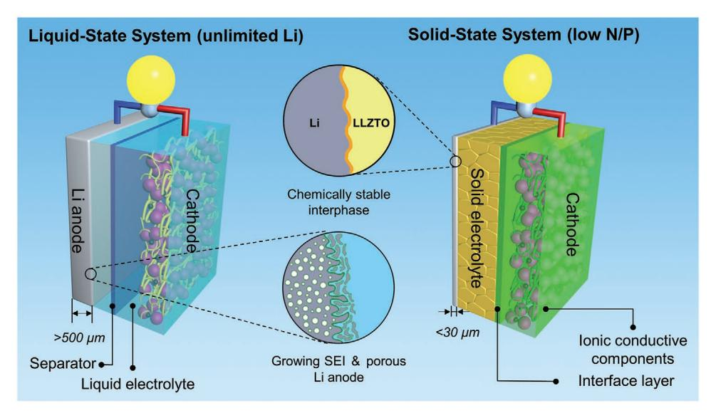
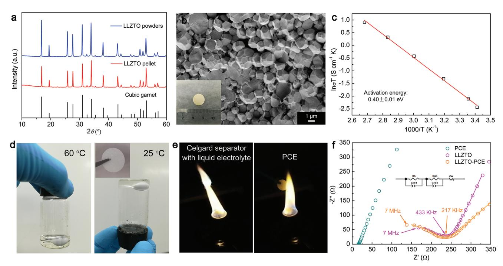
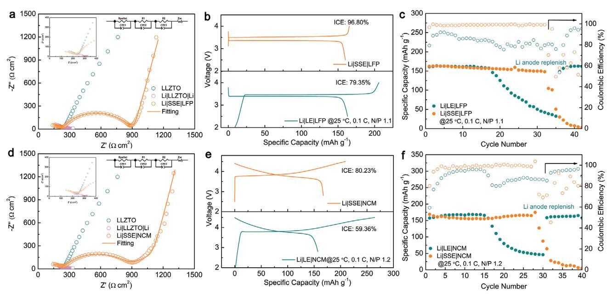
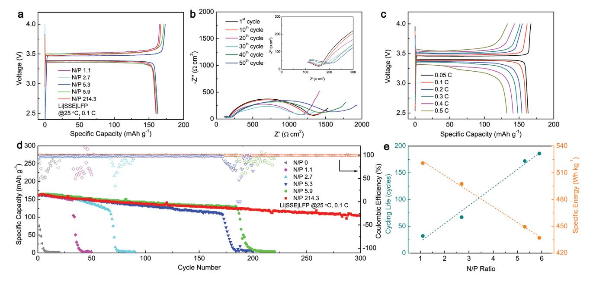
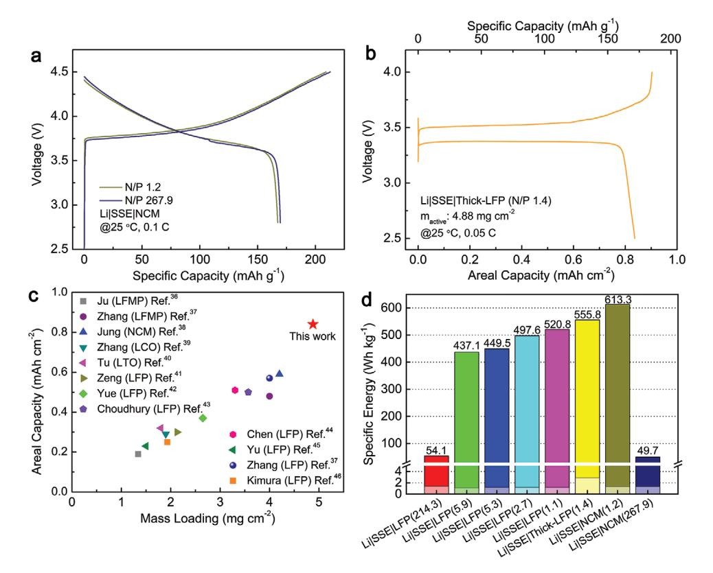

# **All-Solid-State Batteries with a Limited Lithium Metal Anode at Room Temperature using a Garnet-Based Electrolyte**

*Shaojie Chen, Jingxuan Zhang, Lu Nie, Xiangchen Hu, Yuanqi Huang, Yi Yu, and Wei Liu\**

**Metallic lithium (Li), considered as the ultimate anode, is expected to promise high-energy rechargeable batteries. However, owing to the continuous Li consumption during the repeated Li plating/stripping cycling, excess amount of the Li metal anode is commonly utilized in lithium-metal batteries (LMBs), leading to reduced energy density and increased cost. Here, an all-solid-state lithium-metal battery (ASSLMB) based on a garnet-oxide solid electrolyte with an ultralow negative/positive electrode capacity ratio (N/P ratio) is reported. Compared with the counterpart using a liquid electrolyte at the same low N/P ratios, ASSLMBs show longer cycling life, which is attributed to the higher Coulombic efficiency maintained during cycling. The effect of the species of the interface layer on the cycling performance of ASSLMBs with low N/P ratio is also studied. Importantly, it is demonstrated that the ASSLMB using a limited Li metal anode paired with a LiFePO4 cathode (5.9 N/P ratio) delivers a stable long-term cycling performance at room temperature. Furthermore, it is revealed that enhanced specific energies for ASSLMBs with low N/P ratios can be further achieved by the use of a high-voltage or high mass-loading cathode. This study sheds light on the practical high-energy all-solid-state batteries under the constrained condition of a limited Li metal anode.**

With the growing demands of large-scale energy storage systems for electric vehicles and smart grid, the state-of-the-art lithium-ion batteries (LIBs) cannot satisfy the requirements of high energy density and cycling stability.[1,2] Metallic lithium (Li) is the most attractive anode material as a result of its ultrahigh theoretical specific capacity (3860 mAh g−1 ), the lowest redox potential (−3.040 V vs the standard hydrogen electrode), and a low gravimetric density (0.534 g cm−3).[3–6] Therefore, the Li metal anode is a promising candidate for the next-generation high-energy lithium-based batteries, especially Li–S and Li–air battery systems. However, overbalanced Li foils with hundreds of micrometers thicknesses are commonly used to pair cathode (<3 mAh cm−2) at laboratory, which means that a large amount of excess Li metal will not be cycled, leading to a large decline in the real specific capacity of Li metal anode,

**DOI: 10.1002/adma.202002325**

energy density, and cost effective. Albertus et al. have advocated for the use of limited lithium (≤30 µm) to ensure early identification of technical challenges associated with stable and dendrite-free cycling and a more rapid transition to commercially relevant designs.[7] And recently, Liu et al.[8] re-emphasized the importance of limited lithium and announced that 50 µm Li anode was required to reach a high energy of 300 Wh kg−1 . Therefore, for practical lithium-metal batteries (LMBs), the utilization of thin Li metal anode with thicknesses <30 µm (<6 mAh cm−2 ) is extremely necessary.[6–10] In other words, the negative to positive electrode capacity ratio (N/P ratio) must be strictly restricted.

Limiting the amount of Li metal anode is a great challenge, since it is highly reactive. The continuous reaction of Li metal with electrolyte to generate a solid electrolyte interphase (SEI) as well as the uneven Li platting to form dendrite growth and pulverized Li metal, which cause fast con-

sumptions of Li metal and electrolyte, low Coulombic efficiency (CE), and short lifespan of LMBs. To improve cycling stability of Li metal anode in organic liquid electrolyte, various attempts have already been made, including highly concentrated electrolyte,[11] electrolyte additives,[12,13] external pressure,[14,15] Li host,[16,17] and surface coating.[18,19] While most of the above strategies use unlimited Li foil, only a few studies focus on limiting the amount of Li metal for LMBs.[6,9,20,21] For example, Niu et al. reported a self-smoothing Li–carbon anode based on the host of mesoporous carbon nanofibers and a high-energy LMB with a low N/P ratio of ≤2.[6] Archer's group and Cho's group achieved stable operations of LMBs composed of a high-loading cathode and a thin Li anode (20 µm) with Langmuir–Blodgett artificial SEIs.[9] While, compared with liquid electrolyte, some types of solid electrolytes are less reactive with Li metal, which may be good candidates for LMBs with low N/P ratios.[22] Additionally, the safety of LMBs can be greatly improved by replacing flammable liquid electrolyte with solid electrolyte.[23] But, up to now, there are only a few researches about all-solidstate lithium-metal batteries (ASSLMBs) using limited amount of Li metal anode. A recent work reported an ASSLMB with Li6PSCl sulfide electrolyte and Ag–C composite anode with no excess Li.[24] Besides, the studies of LiPON-based thin-film batteries with limited Li metal have been reported, which are

S. Chen, J. Zhang, L. Nie, X. Hu, Y. Huang, Prof. Y. Yu, Prof. W. Liu School of Physical Science and Technology ShanghaiTech University Shanghai 201210, China E-mail: liuwei1@shanghaitech.edu.cn

The ORCID identification number(s) for the author(s) of this article can be found under https://doi.org/10.1002/adma.202002325.

**Figure 1.** Comparison of LMBs using liquid electrolyte and solid electrolyte. For the liquid-state system, the highly reactive Li metal anode continually reacts with the liquid electrolyte during cycling, leading to thick SEI growth and Li metal pulverization. To guarantee stable cycling of the liquid battery, thick/unlimited Li metal is commonly used in the laboratory, which cannot reflect the conditions in operating practical LMBs. For the solid-state system, by using a solid electrolyte that is stable with the Li metal anode, a limited amount of metallic Li (thickness <30 µm) can be realized in LMBs for practical applications.

suitable principally for microelectronic devices due to the low areal capacities.[25,26] Hence, strategies for reducing the amount of metallic Li are urgently required for practical LMBs.

Here, we originally report a rational design for ASSLMBs that can stably run at room temperature (RT) over long-term cycling, with an extremely low amount of Li metal (**Figure 1**). A solid-state electrolyte (SSE) of garnet-type Li6.4La3Zr1.4Ta0.6O12 (LLZTO) pellet,[27–29] with a LLZTO–cathode interface layer of solid-state plastic crystal electrolyte (PCE) and an anode–LLZTO interface layer of a gold thin film is prepared. Precise amount of Li metal can be deposited on the gold surface by evaporation. It reveals that the cycling performance of the ASSLMBs outperform the conventional liquid-state lithium-metal batteries (LSLMBs) with the same N/P ratios, attributed to the improvement of Coulombic efficiency by the use of SSEs. Significantly, ASSLMBs based on the deigned SSE show a stable cycling over 185 cycles at the low N/P ratio of 5.9. Furthermore, based on this ASSLMB system, high-voltage cathode and high mass loading of active material have been also systematically investigated to achieve long-cycling and high-energy rechargeable batteries.

The LLZTO garnet electrolyte was synthesized via a conventional solid-state reaction method. The X-ray diffraction (XRD) patterns of LLZTO powders and LLZTO pellet are shown in **Figure 2**a, respectively. Both match the standard pattern of cubic garnet phase, indicating that the prepared LLZTO are pure cubic phase without any impurities. The high-resolution transmission electron microscopy (HRTEM) image (Figure S1, Supporting Information) with inset selected-area electron diffraction (SAED) pattern also demonstrates the cubic garnet structure, which is in accordance with the XRD results. In addition, the element composition of LLZTO sample determined by inductively coupled plasma optical emission spectrometer (ICP-OES) is listed in Table S1 in the Supporting Information, which is basically consistent with our expected composition in stoichiometric Li6.4La3Zr1.4Ta0.6O12 with 2 wt% Al2O3 as sintering aid. Besides, as shown in Figure S2 in the Supporting Information, the element composition of LLZTO sample was also characterized by energydispersive spectrometry (EDS) measurement for the cross-section of the pellet. Figure 2b shows the cross-section scanning electron microscopy (SEM) image of the LLZTO pellet, revealing a dense morphology and well grown grains with clear grain boundaries. To measure the Li-ion conductivity of the LLZTO pellet, electrochemical impedance spectroscopy (EIS) method was performed to Li-ion-blocking gold electrode of LLZTO at a temperature range from 20 to 100 °C (Figure S3, Supporting Information). At 25 °C, the ionic conductivity is calculated to be 4.0 × 10−4 S cm−1 . The Arrhenius plot is shown in Figure 2c and the activation energy is calculated to be 0.40 ± 0.1 eV.

The high interface impedance between the SSE and cathode/ anode is a critical factor for ASSLMBs.[30–32] As is well known, the interface of inorganic electrolyte–cathode is a solid-solid interface, which often possesses a high interfacial resistance due to the incomplete physical contact. In this work, to reduce the LLZTO-cathode interface resistance, a succinonitrile (SN) based PCE layer is conformally attached to the LLZTO surface (LLZTO–PCE). The SN-based PCE has long been known for its high RT ionic conductivity and nonflammability, which is considered to be a safe electrolyte.[33–35] PCE is prepared by simply adding bis(trifluoromethane)sulfonimide lithium salt (LiTFSI) into SN. From Figure 2d, we can clearly see that SN melts when heating to 60 °C and LiTFSI is dissolved completely. When cooled down to RT (25 °C), PCE becomes an SSE. From the inset picture in Figure 2d, a piece of glass fiber membrane is used as host to obtain a free-standing PCE. The nonflammability of PCE is also proved by flame test, whereas the Celgard separator with liquid electrolyte ignites easily (Figure 2e). The EIS data of PCE, LLZTO, and LLZTO–PCE shown in Figure 2f indicate that the ionic conductivity of the PCE membrane is

**Figure 2.** Characterization of solid-state electrolytes. a) XRD patterns of the as-prepared LLZTO powders and pellet. b) Cross-sectional SEM image of the LLZTO ceramic pellet (the inset figure shows the optical image of the LLZTO pellet). c) Arrhenius plot of the LLZTO pellet. d) Photographs of PCE at 60 °C (left) and 25 °C (right). The inset is the optical image of PCE film. e) Optical images of flame test on a Celgard separator with liquid electrolyte and a PCE membrane. f) EIS of PCE, LLZTO, and LLZTO–PCE at 25 °C (the inset is the equivalent circuit).

7.2 × 10−4 S cm−1 , and the ionic conductivity of LLZTO–PCE is similar with the pure LLZTO pellet. To maintain a stable Li metal anode–LLZTO interface during cycling, a "lithiophilic" layer of gold thin film was sputtered on the LLZTO surface. Hence, the designed SSE is composed of three layers of gold thin film, LLZTO pellet, and PCE layer (Au–LLZTO–PCE).

It should be noted that factors that could influence the amount of Li metal for ASSLMBs, including temperature, surface morphology of LLZTO, dopant elements, and species of interface layer, have been considered and optimized. First, we have prepared an LLZTO-based ASS battery that could operate at room temperature, because room temperature is the most practical operating temperature for batteries. Second, it was reported that the surface of LLZTO pellet would react with humid air to form Li2CO3, which would greatly increase the Li|LLZTO interfacial resistance.[36] Fortunately, this phenomenon can be greatly relieved by polishing LLZTO with sandpaper inside a glove box, as shown in Figure S4 in the Supporting Information. For exclusion of the impacts of surface morphology and component, every LLZTO pellet used in this experiment was carefully polished inside a glove box with sandpaper from 400 to 2000 grits. And the dopant of Ta was adopted because Ta could stabilize cubic phase LLZO and thus improve the ionic conductivity.[37] Moreover, it was reported that Ta–LLZO is more stable than Al–LLZO and Nb–LLZO when contacting with Li metal.[36] Finally, considering the effect of different interface layer, the Al2O3 coating enables wetting of metallic lithium in contact with the garnet electrolyte surface and improves the stability with Li metal. Therefore, Al2O3 with thickness of 5 nm was also investigated, which was deposited onto LLZTO pellets through atomic layer deposition (ALD), as shown in Figure S5 in the Supporting Information. At the same low N/P ratio of 1.1, the ASSLMBs with the interface layer of Au had a better cycling performance than that with Al2O3, which may due to the existence of Au coating promotes the uniform Li metal deposition and reduces the contact loss of deposited lithium during lithium dissolution process. For Al2O3 coating, we conjecture that Al2O3 layer reacted with lithium steam to form Li–Al–O phase during thermal evaporation process, which could lead to irreversibly trapped lithium in the Al2O3 layer and thus a lower N/P ratio calculated from the deposition parameters, explaining the lower cycling performance.[38] Besides, we have also investigated the influences of pressure and temperature. We applied pressure to Li symmetry cells and monitored the change of EIS. As shown in Figure S6 in the Supporting Information, the resistance of Li|LLZTO decreased from about 115 to 75 Ω cm2 after loading 20 MPa pressure, indicating the pressure can optimize the Li|LLZTO interface contact. In addition, the effect of temperature was also studied. As shown in Figure S7a in the Supporting Information, when the low N/P cells were cycled at 60 °C, we can see that the capacity dropped quickly after only 7 cycles. We also conducted the EIS measurements to investigate the degradation mechanism. As shown in Figure S7b in the Supporting Information, we can see that the total resistance increases quickly from about 85 to 5000 Ω after cycling. We predict the reason may be related to the melting of PCE, whose melting point is about 55 °C. Therefore, after disassembling and replace PCE, the total resistance decreased to about 230 Ω, which is in agreement with our prediction.

Next, limited Li metal anode is coupled with LiFePO4 (LFP)/LiNi0.33Co0.33Mn0.33O2 (NCM) cathode (N/P ratio of ≈1) to construct the full cells using liquid electrolyte and

**Figure 3.** Electrochemical performance of LSLMBs and ASSLMBs with low N/P ratios. a) EIS of LLZO, Li|LLZTO|Li, and Li|SSE|LFP at 25 °C. b) Initial charge–discharge curves of LSLMBs and ASSLMBs using limited Li metal coupled with LFP at the N/P ratio of 1.1, and c) the corresponding cycling performances under the C-rate of 0.1C at 25 °C. d) EIS of LLZO, Li|LLZTO|Li, and Li|SSE|NCM at 25 °C. e) Initial charge–discharge curves of LSLMBs and ASSLMBs using limited Li metal coupled with NCM at the N/P ratio of 1.2. f) The corresponding cycling performances under the C-rate of 0.1C at 25 °C. Li|SSE|LFP and Li|SSE|NCM are the ASSLMBs using Au–LLZTO–PCE solid electrolyte.

Au–LLZTO–PCE solid electrolyte. The interface resistances were first studied by EIS measurements as shown in **Figure 3**a. In the EIS curve of Li|LLZTO|Li symmetry cell with a gold thin film on LLZTO surface, two semicircles can be clearly observed: one at the high frequencies is assigned as the sum of the grain and grain boundary resistance, and the other at low frequencies is assigned to the Li-metal–LLZTO interface resistance. The area specific resistance (ASR) of Li-metal–LLZTO interface is ≈25 Ω cm2 . Equivalent circuit used for fitting the EIS of Li|SSE|LFP using Au–LLZTO–PCE is also shown in Figure 3a, wherein *R*pellet, *R*1, and *R*2 represent the ASRs of the resistances of solid electrolyte, Li|SSE interface, and SSE|cathode interface, respectively. *Z*w is the Warburg impedance attributed to the effect of Li ions diffusion across the electrode–electrolyte interface, which appears as a sloped line in the low-frequency region.[39] The fitting results are listed in Table S2 in the Supporting Information. With the PCE interface layer, the LLZTO–cathode interface showed a relatively low resistance of 630 Ω cm2 at RT.

The liquid-state and all-solid-state LMBs using limited Li metal anode (N/P ratio ≈1) were then cycled at 0.1C at RT. The mass loading of active materials in LFP cathode is ≈2.26 mg cm−2 and the thickness of the limited Li metal anode is 2 µm. The initial charge–discharge curves of the two types of batteries are compared in Figure 3b. The initial Coulombic efficiency (ICE) of ASSLMBs is 96.80%, much higher than LSLMBs of only 79.35%. Due to Li metal anode is unstable to organic liquid electrolyte, a thick SEI layer was formed during the beginning several cycles, which greatly consumes the amount of Li metal anode and liquid electrolyte, especially for the first cycle. On the contrary, LLZTO is relatively stable with Li metal, thus a high ICE could be obtained. To further investigate the reason for the difference of ICE, the X-ray photoelectron spectroscopy (XPS) data of SEI and LLZTO are also provided in Figures S8 and S9 in the Supporting Information. The CE of Li plating/stripping based on LLZTO electrolyte is essential for calculating the Li anode consumption.[40] As shown in Figure S10 in the Supporting Information, the CE of the Li|LLZTO|Cu cell is about 82%, which is in agreement with a recently published paper.[41] The mechanism of Li loss is that LLZTO electrolytes first react with Li metal to form a stable SEI, and then the relatively high lithium loss in this experiment is attributed to the irreversibly trapped lithium in copper current collector and contact loss of deposited lithium during stripping process. In addition, we have also carried out the XPS depth profiling for the surface of Li foil before and after cycling using LLZTO as electrolyte, as shown in Figure S11 in the Supporting Information. For the Li foil before cycling, the signal of Li2O decreases quickly and the signal of Li0 increases quickly during etching process, showing the Li foil before cycling only has a few Li2O on the surface. However, for the Li foil after cycling, except for the existence of Li2O, the surface also has Li2CO3. Besides, the signal of Li2O decreases slowly and the signal of Li0 increases slowly during etching process. The above results indicate that the LLZTO electrolytes react with Li metal to form SEI, like Li2CO3 and Li2O. Besides, after disassembling the cycled cell, there is some Li metal remaining on the current collector. For enhancing the wettability of LLZTO toward Li metal, a thin Au layer is used as interface layer.[42–44] The reaction between Au and Li promotes enhanced molten Li infusion onto the garnet's rough surface, whereas the formation of a Li–Au alloy fills the gap between the garnet and the Li metal to further improve interface stability. To further understand the stability of Li–LLZTO interface with Au as interfacial layer, the critical current density (CCD) and cycling performance of Li|Au–LLZTO–Au|Li symmetry cells were also measured. As shown in Figure S12 in the Supporting Information, the CCD of Li|Au–LLZTO–Au|Li was measured to be 0.30 mA cm−2 , indicating that Li dendrites would still form at high current densities even with Au coating layer. As shown in Figure S13 in the Supporting Information, the Li symmetry cells obtained a long cycling life of over 1000 cycles at 0.1 mA cm−2 without increased polarization, which is due to the stable Li|LLZTO interface with Au coating layer under electrochemical operations. And, the asformed Li–Au alloy can be used as a Li-ion conductor between Li metal and garnet, which allows more uniform Li+ flux and improves Li+ transport. During plating process, we believe that Li will first form Li–Au alloy, and then deposit on the surface of Li–Au alloy. Since the sputtered Au layer has a strong interaction with garnet electrolyte, and the alloy phase is a Li-ion conductor. A similar Li–Sn alloy has been proved to be a good Li-ion conductor by density functional theory (DFT) calculation in our previous work.[45]

In addition, from the cycling performances of the two types of batteries at the extremely low N/P ratio of 1.1 (Figure 3c), we can obviously see that the specific capacities of ASSLMBs and LSLMBs start to decrease after the 32th and 16th cycle, respectively. The longer cycling life of ASSLMBs is attributed to the higher CE than that of LSLMBs. During cycling, the CE of ASS-LMBs is about 99%, while that of LSLMBs is less than 90%. Notably, the Li|LFP half cells with unlimited Li metal anode exhibit ≈95% CE during cycling (Figure S14, Supporting Information), showing that the LSLMBs with different amounts of Li anode have different CEs. Under a low N/P ratio of 1.1, the CE of Li anode influences the CE of the full cell, which is different with the situation using unlimited Li anode. When the Li anode is unlimited, the measured CE of Li-metal batteries is determined by the cathode material. However, when limited Li anode is used, the measured CE of Li-metal batteries reflects both of cathode material and Li anode.[46] Besides, after replenishing Li anode, the specific capacities of the LSLMBs recover to the initial value. So, the fast capacity fading and CE reduction in the full cells with limited Li metal are mainly due to the continuous consumption of Li metal anode rather than cathode decay. Therefore, the use of SSE is a good strategy to improve cycling performance in LMBs with limited Li metal, which increases the real specific capacity of Li metal.

While, it is very challenging to limit the amount of Li metal, at the same time, not sacrificing the cycling stability. To investigate the influence of Li metal amount on electrochemical performance of ASSLMBs, the Au–LLZTO–PCE-based cells using limited Li metal coupled with LFP cathode (N/P ratios: 0, 1.1, 2.7, 5.3, 5.9, and 214.3) were assembled. The initial charge–discharge curves of cells with various N/P ratios under the C-rate of 0.1C at RT are shown in **Figure 4**a, showing nearly the same discharge specific capacity of 161 mAh g−1 . The limiting Li metal anode will not decrease the specific capacity. The EIS of the ASSLMBs are also recorded during cycling, as shown in Figure 4b. From the fitting results of several cycles in Table S2 in the Supporting Information, we can see the total resistances of cathode interface and anode interface decrease at first 30 cycles, which may mainly attribute to the interface optimization mechanism of PCE interface layer between LLZTO and cathode. The SN-based PCE is a kind of soft electrolyte material at RT, which may increase the contact area with cathode during cycling, leading to a reduced cathode interfacial resistance.[33,34] And then slightly increase after 30 cycles, which may be due to interface deterioration. During cycling, the total interface resistances remain a relatively stable value, and the

**Figure 4.** Electrochemical performance of ASSLMBs using Au–LLZTO–PCE solid electrolyte with limited amount of metallic Li anode. a) Charge– discharge curves of ASSLMBs using limited Li metal coupled with LFP at various N/P ratios. b) EIS of ASSLMBs using unlimited Li metal coupled with LFP at the N/P ratio of 214.3 for various cycles. c) Rate performance of ASSLMBs using unlimited Li metal coupled with LFP at the N/P ratio of 214.3. d) Cycling performances of ASSLMBs using limited Li metal coupled with LFP at various N/P ratios. e) The plots of cycling life and specific energy as a function of N/P ratio for ASSLMBs.

resistances of SSE also have little change with cycling (inset figure in Figure 4b). The charge–discharge curves of the ASS-LMBs at various C rates are shown in Figure 4c, the specific capacities are 163, 161, 154, 148, 141, and 132 mAh g−1 at 0.05C to 0.5C, respectively. In addition, due to relatively low total resistance by using Au–LLZTO–PCE solid electrolyte, the ASS-LMBs also have a good rate capability. As shown in Figure 4d, we can see that the ASSLMBs based on Au–LLZTO–PCE using unlimited Li metal foil (N/P ratio: 214.3) can stably cycle at RT, showing a high specific capacity of 164 mAh g−1 with a good capacity retention of 65% after 300 cycles. For the cells with limited Li metal, the specific capacities have a steep drop for all the cycling curves, which is due to the exhaustion of limited Li anode.[6,8,47] Note that the capacities decrease slowly before the steep drop, which is due to the capacity loss on the positive electrode side. The stable cycling life is 32, 67, 172, and 186 for different N/P ratios of 1.1, 2.7, 5.3, and 5.9, respectively. If only the lithium provided by cathode can be used, the anodefree cell (N/P ratio: 0) shows a low initial discharge capacity of ≈76 mAh g−1 and a very quick decay. In order to find out the relationship between cycling life and N/P ratio, above data are plotted in Figure 4e and the according specific energy of each ASSLMB is also calculated (based on the active material loading of both cathode and anode). We can clearly see that there is a trade-off between cycling life and specific energy: with the

increasing of N/P ratio, cycling life increases simultaneously, but specific energy decreases. In this work, by optimizing the N/P ratio to 5.9, the cell can stably cycle more than 185 cycles at RT, showing the best performance for ASSLMBs with limited Li metal up to now to our knowledge. Hence, it can be seen that SSEs can provide the possibility for realizing long-cycling and high-energy-density ASSLMBs with limited Li metal.

To further enhance specific energy of ASSLMBs with limited Li metal anode, two approaches have been considered: the adoptions of high-voltage cathode of NCM and high mass loading of active material. The ASSLMBs based on Li metal paired with NCM also showed higher CE and better cycling performance than the counterpart using liquid electrolyte (Figure 3d–f). As shown in **Figure 5**a, the ASSLMBs using NCM with 267.9 N/P ratio achieve 167 mAh g−1 at a cutoff voltage range of 2.8–4.5 V. Besides, a thick LFP cathode (Thick-LFP) with high mass loading of 4.88 mg cm−2 was also fabricated, using carbon cloth as 3D current collector. For the cathode components, the LFP is active material, the mixture of PEO, LiTFSI, and SN is ionic conductor, and the carbon is electronic conductor. The Thick-LFP ASSLMBs using Au–LLZTO–PCE can obtain a high areal capacity of 0.83 mAh cm−2, corresponding to a high specific capacity of 171 mAh g−1 at 0.05C at RT (Figure 5b). The mass loading of active material and areal capacity are higher than the data

**Figure 5.** Electrochemical performance of ASSLMBs using Au–LLZTO–PCE solid electrolyte with limited amount of metallic Li anode. a) Charge–discharge curves of the ASSLMBs using Li metal coupled with NCM at high and low N/P ratios. b) Charge–discharge curves of the ASSLMB using limited Li metal coupled with thick LFP at the N/P ratio of 1.4. c) The comparison of areal capacity versus mass loading of cathode active materials in solid-state LMBs in the literature, operated at RT. d) Estimated specific energies for the ASSLMBs using Li metal anode coupled with LFP cathode at various N/P ratios. The specific energies for the ASSLMBs using high-voltage of NCM cathode as well as high mass loading of active material, under constrained condition of limited Li metal amount, are also shown.

from recent reports in the literature about solid-state lithium batteries operated at RT, shown in Figure 5c.[48–58] The specific energies of ASSLMBs with different cell parameters are summarized in Figure 5d. To avoid misunderstanding, note that the specific energies are calculated only based on the active material loading of both cathode and anode. The ASSLMB here is only a model mainly used to investigate the influences of different cell parameters, including N/P ratio, cathode voltage, and mass loading of active materials. If the specific energy is calculated based on the total weight of LLZTO electrolyte, glass fiber, PCE, current collectors, and materials on both cathode and anode, it decreases quickly from 520 to 1.2 Wh kg−1 (for the calculation details please see the Supporting Information). As shown in Figure 5d, the lightly shaded area on the bottom represents the specific energy based on the total weight, which is far below the value only based on the active material loading of both cathode and anode. Obviously, there is still a long road ahead for achieving high-energy longcycling garnet-based ASSLMBs. Apart from improving the ionic conductivity and reducing the interfacial resistances, reducing the thickness of solid electrolyte is still challenging but quite important, which will be further studied in our following work. The highest specific energy of 613.3 Wh kg−1 is achieved for ASSLMB with NCM of an ultralow N/P ratio of 1.2. It can be concluded that the adoptions of low N/P ratio, high-voltage cathode, and high active material loading can greatly enhance the specific energy.

Recent research progresses on garnet-based solid-state LMBs are summarized in **Table 1**. Although reducing Li metal amount for practical LMBs is of great challenge, a few research groups focus on it, because it is very challenging. And, to realize LMBs using SSEs stably running at RT, most proposed strategies use a simple method of adding a small amount of liquid electrolyte or gel electrolyte at the SSE–cathode interface.[59] Comparatively, in this work, the liquid electrolyte-free LMBs based on the rational designed SSE of Au–LLZTO–PCE, with limited Li metal, run stably over long cycling at RT, demonstrating a great progress toward practical high-energy batteries.

We designed a solid electrolyte of Au–LLZTO–PCE for ASS-LMBs. Through comparing the LSLMBs and ASSLMBs under a practical condition of low N/P ratio, we prove that ASSLMBs can achieve a longer cycling life, attributed to the intrinsic chemical stability of LLZTO to Li metal. To improve specific energy of ASSLMBs, several approaches have been investigated, including reducing N/P ratio, applying high-voltage cathode, and increasing active material loading. The ASSLMB with extremely low amount of Li metal anode (N/P ratio: 5.9) could stably run for 185 cycles with a high specific capacity of

**Table 1.** Literature review of solid-state lithium-metal batteries based on garnet-type Li7La3Zr2O12 solid electrolytes.

| Battery structure        | N/P ratioa)    | Working temperature [°C] | Current density | Specific capacity [mAh g−1 ] | Massactive material [mg cm−2] | Areal capacity [mAh cm−2] | Voltage [V vs Li/Li+] | Cycling life | Deposition method     | Refs. |
|--------------------------|----------------|--------------------------------|--------------------|---------------------------------------|----------------------------------|---------------------------------|--------------------------|-----------------|--------------------------|-------|
| Li LLZO LTOb)            | Unlimited Lic) | 95                             | 3.2 mA cm−2        | 15                                    | 1.60                             | 0.02                            | 1.0–2.5                  | <20             | Slurry coating           | [60]  |
| Li SPEd) LLZO SPE LFPe)  | Unlimited Li   | 90                             | 0.2C               | 140                                   | 1.60                             | 0.22                            | 2.5–4.2                  | 200             | Slurry coating           | [61]  |
| Li LLZO Li2SiO3 NCM111f) | Unlimited Li   | 100                            | 10 µA cm−2         | 138                                   | 2.00                             | 0.28                            | 2.0–4.5                  | 10              | Slurry coating           | [62]  |
| Li LLZO LFP              | Unlimited Li   | 60                             | 0.05C              | 150                                   | 1.18                             | 0.18                            | 2.76–4.0                 | 100             | Slurry coating           | [63]  |
| Li LLZO LFP              | Unlimited Li   | 65                             | 100 µA cm−2        | 143                                   | 1.20–1.80                        | 0.17–0.26                       | 2.5–3.8                  | 50              | Slurry coating           | [64]  |
| Li LLZO LFP              | Unlimited Li   | 60                             | 100 µA cm−2        | 133                                   | 1.18                             | 0.16                            | 2.5–3.8                  | 90              | Slurry coating           | [65]  |
| Li LLZO NCM523g)         | Unlimited Li   | 80                             | 5 µA cm−2          | 123                                   | 1.00                             | 0.12                            | 3.0–4.6                  | 5               | Cosintering              | [66]  |
| Li LLZO LCOh)            | Unlimited Li   | 100                            | 0.05C              | 106                                   | 1.00                             | 0.11                            | 3.0–4.05                 | 40              | Cosintering              | [67]  |
| Li LLZO LCO              | Unlimited Li   | 25                             | 0.05C              | 94                                    | 1.00                             | 0.09                            | 3.0–4.05                 | 100             | Cosintering              | [67]  |
| Li LLZO ILi) NCM523      | Unlimited Li   | RT                             | 0.1C               | 175                                   | 0.90                             | 0.16                            | 3.0–4.3                  | 500             | Slurry coating           | [68]  |
| Li Ge LLZO GPEj) LFP     | Unlimited Li   | RT                             | 0.1 mA cm−2        | 138                                   | 0.59                             | 0.08                            | 2.4–4.0                  | 100             | Slurry coating           | [69]  |
| Li LLZO LEk) LFMOl)      | Unlimited Li   | RT                             | 0.1C               | 103                                   | N/A                              | N/A                             | 3.5–5.3                  | 50              | Slurry coating           | [38]  |
| Li LLZO LCO              | Unlimited Li   | 25                             | 0.1C               | 129                                   | 0.25                             | 0.03                            | 2.5–4.2                  | 100             | PLDm)                    | [70]  |
| Li LLZO LCO              | Unlimited Li   | RT                             | 1 µA cm−2          | 80                                    | N/A                              | N/A                             | 3.2–4.2                  | 25              | PLD                      | [71]  |
| Li LLZO PCEn) NCM111     | 1.2            | 25                             | 0.1C               | 167                                   | 2.00                             | 0.33                            | 2.8–4.5                  | 26              | Slurry coating This work |       |
| Li LLZO PCE LFP          | Unlimited Li   | 25                             | 0.1C               | 164                                   | 2.61                             | 0.43                            | 2.5–4.0                  | 300             | Slurry coating This work |       |
| Li LLZO PCE LFP          | 5.9            | 25                             | 0.1C               | 165                                   | 2.01                             | 0.33                            | 2.5–4.0                  | 186             | Slurry coating This work |       |
| Li LLZO PCE LFP          | 5.3            | 25                             | 0.1C               | 162                                   | 2.13                             | 0.35                            | 2.5–4.0                  | 172             | Slurry coating This work |       |
| Li LLZO PCE LFP          | 2.7            | 25                             | 0.1C               | 164                                   | 2.22                             | 0.36                            | 2.5–4.0                  | 67              | Slurry coating This work |       |
| Li LLZO PCE LFP          | 1.1            | 25                             | 0.1C               | 163                                   | 2.26                             | 0.37                            | 2.5–4.0                  | 32              | Slurry coating This work |       |
| Li LLZO PCE LFP          | 1.4            | 25                             | 0.05C              | 171                                   | 4.88                             | 0.83                            | 2.5–4.0                  | 10              | Slurry coating This work |       |

a)N/P ratio is the capacity ratio of the negative electrode to the positive electrode; b)LTO, Li4Ti5O12; c)Unlimited Li, thickness is often above 500 µm, leading to a high N/P ratio; d)SPE, solid polymer electrolyte; e)LFP, LiFePO4; f)NCM111, LiNi0.33Co0.33Mn0.33O2; g)NCM523, LiNi0.5Co0.2Mn0.3O2; h)LCO, LiCoO2; i)IL, ionic liquid; j)GPE, gel polymer electrolyte; k)LE, liquid electrolyte; l)LFMO, Li2FeMn3O8; m)PLD, pulse laser deposition; n)PCE, plastic crystal electrolyte.

165 mAh g−1 and a good capacity retention of 78%. A high specific energy of 613.3 Wh kg−1 is achieved for ASSLMBs using limited Li metal coupled with high-voltage NCM cathode at an ultralow N/P ratio of 1.2. Besides, the highest areal capacity of 0.83 mAh cm−2 is realized for ASSLMBs with limited Li metal. Hence, our work provided a thought and a demonstration that the cycling performance could be improved by rational design of solid electrolyte for the solid-state batteries with limited Li metal.

### **Experimental Section**

*Materials Synthesis*: The LLZTO garnet electrolyte was synthesized via a conventional solid-state reaction method. The starting materials were LiOH·H2O (≥98%, Aladdin), La2O3 (99.99%, Macklin), ZrO2 (99.99%, Aladdin), and Ta2O5 (99.99%, Macklin). 20% excess of LiOH·H2O was used to compensate the lithium volatilization during high-temperature calcination process. Stoichiometric amounts of above chemicals were mixed in isopropanol, ball milled at 600 rpm for 6 h, and calcinated at 950 °C for 6 h. The powders were sieved through 400 grits and uniaxial pressed into pellets after adding 2 wt% *γ*-Al2O3 (99.99%, energychemical) powders as sintering additive, followed by isostatic pressing under 200 MPa. The pellets were then sintered at 1100 °C for 12 h. In order to prevent Li loss during sintering, all samples were covered with mother powders during sintering. After sintering, the LLZTO pellets were polished with sand papers of 800, 1200, and 2000 grits until a smooth LLZTO surface was obtained. The thickness of LLZTO ceramic pellet was about 900 µm. And, the relative density of LLZTO electrolyte pellet was about 92.8%. The PCE was made by simply dissolving 5 mol% LiTFSI in SN at 60 °C. Then, a piece of glass fiber (GF/C1822-047, Whatman) was used as host to soak PCE and was cooled down to room temperature to get a solid-state PCE film. The thickness of PCE was about 160 µm.

*Preparation of Thin Lithium Metal Anode*: For liquid-state batteries, a thin layer of lithium was deposited on a copper foil (diameter of 12 mm) as anode via thermal evaporation. The Li metal was loaded to a tungsten boat of the thermal evaporator. And, the evaporation rate and thickness were measured by a quartz-crystal microbalance. The rate used was about 1 nm s−1 . The lithium anode capacity can be accurately controlled through change deposited lithium thickness, achieving different N/P ratios. And, the relationship between areal capacity and thickness is determined in Figure S15 in the Supporting Information. For solidstate batteries, after sputtering gold onto LLZTO pellet for 5 min, the Au-coated LLZTO pellet was directly used as substrate for deposition of lithium. The thickness of Au was measured by X-ray reflectivity (XRR) to be 55 nm, as shown in Figure S16 in the Supporting Information. All the thermal evaporation processes were conducted under an argon atmosphere inside a glove box. And, the morphologies of evaporated Li and the cross-section of Li|LLZTO interface are shown in Figure S17 in the Supporting Information.

*Preparation of Cathode*: For liquid-state batteries, the LFP (MTI Corporation) cathode was prepared through a slurry coating method. LiFePO4 powders, carbon black (MTI Corporation), and poly(vinylidene fluoride) (PVDF, MTI Corporation) at a weight ratio of 8:1:1 were dispersed in *N*-methyl-2-pyrrolidone (NMP). The obtained homogeneous slurry was doctor-bladed on a carbon-coated aluminum foil and dried at 60 °C in a vacuum oven overnight. The mass loading of each LFP cathode was about 3.0 mg cm−2 . NCM (MTI Corporation) cathode was prepared by a similar procedure, and the mass of each NCM cathode was about 2.5 mg cm−2 . For solid-state batteries, LFP cathode and NCM cathode were the same as liquid-state batteries. Thick LFP (Thick-LFP) was prepared by mixing LFP powders, PEO, LiTFSI, SN, and conductive carbon with a weight ratio of 5:2.4:1.6:1 in acetonitrile (AN). A piece of conductive carbon cloth was used as 3D current collector to soak the above slurry, and then dried in the glove box for 2 days. The LFP loading of Thick-LFP cathode was 4.88 mg cm−2 .

*Assembling of Lithium-Metal Batteries*: For liquid-state batteries, working electrode was assembled into coin 2032-type cell with Celgard as the separator and 1.0 m LiPF6 in 1:1 vol/vol ethylene carbonate/diethyl carbonate (EC/DEC) as the electrolyte. The deposited Li and Li metal foil were used for low N/P ratio batteries and high N/P ratio batteries, respectively. For solid-state batteries, coin 2032-type cell was assembled with working electrode and lithium deposited LLZTO pellet. A piece of PCE pellet was added between working electrode and LLZTO pellet. For high N/P ratio solid-state batteries, lithium foil was used as anode. All the coin 2032-type cells were tested under no external pressure.

*Characterization and Electrochemical Measurement*: XRD was performed on a Bruker D8 Advance using a Cu K*α* radiation source. SEM patterns were recorded using a JEOL JSM-7800F. TEM characterizations were carried out using a JEM-2100Plus thermionic transmission electron microscope operated at 200 kV. ICP-OES was conducted on an iCAP 7400 Radial. XPS spectra were recorded with the ThermoFisher ESCA 250XI using an Al K*α* (*λ* = 0.83 nm, *hυ* = 1486.7 eV). And, the X-ray source was operated at 2 kV, 20 mA. The cycled LLZTO interface was prepared by peeling off the Li foils after charge–discharge cycling. To avoid the reaction between LLZTO and air, the cycled LLZTO pellet was carefully transferred for XPS analysis through a sealing device with Ar as protective gas. The density of LLZTO electrolyte pellet was measured by Archimedes' method. A theoretical density of 5.5 g cm−3 was used to calculate the relative density of samples. The blocking electrode was formed via sputtering gold on the surface of LLZTO pellet for the ionic conductivity measurement. The EIS measurement was performed using a Biologic VMP300 potentiostat over a frequency range from 1.0 to 7 MHz. The coin cells were tested by a LAND system from 2.5 to 4.0 V (LFP batteries) and 2.8 to 4.5 V (NCM batteries) at room temperature (25 °C). The specific energy (*E*sp, in Wh kg−1 ) of a cell can be calculated as

$$
E_{sp} = C_{Cell} \times V_{Cell} / W_{Cell}
$$
 (1)

where *C*Cell is the cell capacity (in Ah), *V*Cell is the cell voltage (in V), and *W*Cell is the total cell weight (in kg). *C*Cell is correlated to the specific capacity of the cathode material and the loading of the cathode when the anode is in excess. *V*Cell is normally defined as the mid-point voltage during the discharge process. *W*Cell includes the active material weights of both cathode and anode.

## **Supporting Information**

Supporting Information is available from the Wiley Online Library or from the author.

#### **Acknowledgements**

This work was partially supported by the National Key Research and Development Program (2019YFA0210600) and the National Natural Science Foundations of China (21805185 and 21905174). The authors also acknowledge CℏEM, SPST of ShanghaiTech University (#EM02161943) for supporting.

### **Conflict of Interest**

The authors declare no conflict of interest.

#### **Keywords**

interface layers, lithium metal anodes, negative/positive electrode capacity ratio, solid electrolytes, specific energy

> Received: April 4, 2020 Revised: October 21, 2020 Published online: November 25, 2020

**www.advancedsciencenews.com www.advmat.de**

- [1] B. Dunn, H. Kamath, J. M. Tarascon, *Science* **2011**, *334*, 928.
- [2] S. Choi, T. W. Kwon, A. Coskun, J. W. Choi, *Science* **2017**, *357*, 279.
- [3] D. Lin, Y. Liu, Y. Cui, *Nat. Nanotechnol.* **2017**, *12*, 194.
- [4] W. Xu, J. Wang, F. Ding, X. Chen, E. Nasybulin, Y. Zhang, J.-G. Zhang, *Energy Environ. Sci.* **2014**, *7*, 513.
- [5] W. Liu, D. Lin, A. Pei, Y. Cui, *J. Am. Chem. Soc.* **2016**, *138*, 15443.
- [6] C. Niu, H. Pan, W. Xu, J. Xiao, J. G. Zhang, L. Luo, C. Wang, D. Mei, J. Meng, X. Wang, Z. Liu, L. Mai, J. Liu, *Nat. Nanotechnol.* **2019**, *14*, 594.
- [7] P. Albertus, S. Babinec, S. Litzelman, A. Newman, *Nat. Energy* **2017**, *3*, 16.
- [8] J. Liu, Z. Bao, Y. Cui, E. J. Dufek, J. B. Goodenough, P. Khalifah, Q. Li, B. Y. Liaw, P. Liu, A. Manthiram, Y. S. Meng, V. R. Subramanian, M. F. Toney, V. V. Viswanathan, M. S. Whittingham, J. Xiao, W. Xu, J. Yang, X.-Q. Yang, J.-G. Zhang, *Nat. Energy* **2019**, *4*, 180.
- [9] M. S. Kim, J.-H. Ryu, Deepika, Y. R. Lim, I. W. Nah, K.-R. Lee, L. A. Archer, W. Il Cho, *Nat. Energy* **2018**, *3*, 889.
- [10] R. Weber, M. Genovese, A. J. Louli, S. Hames, C. Martin, I. G. Hill, J. R. Dahn, *Nat. Energy* **2019**, *4*, 683.
- [11] J. Qian, B. D. Adams, J. Zheng, W. Xu, W. A. Henderson, J. Wang, M. E. Bowden, S. Xu, J. Hu, J.-G. Zhang, *Adv. Funct. Mater.* **2016**, *26*, 7094.
- [12] J. Zheng, M. H. Engelhard, D. Mei, S. Jiao, B. J. Polzin, J.-G. Zhang, W. Xu, *Nat. Energy* **2017**, *2*, 17012.
- [13] X.-Q. Zhang, X. Chen, X.-B. Cheng, B.-Q. Li, X. Shen, C. Yan, J.-Q. Huang, Q. Zhang, *Angew. Chem., Int. Ed.* **2018**, *57*, 5301.
- [14] A. J. Louli, M. Genovese, R. Weber, S. G. Hames, E. R. Logan, J. R. Dahn, *J. Electrochem. Soc.* **2019**, *166*, A1291.
- [15] C. Niu, H. Lee, S. Chen, Q. Li, J. Du, W. Xu, J.-G. Zhang, M. S. Whittingham, J. Xiao, J. Liu, *Nat. Energy* **2019**, *4*, 551.
- [16] K. Yan, Z. Lu, H.-W. Lee, F. Xiong, P.-C. Hsu, Y. Li, J. Zhao, S. Chu, Y. Cui, *Nat. Energy* **2016**, *1*, 16010.
- [17] D. Lin, Y. Liu, Z. Liang, H. W. Lee, J. Sun, H. Wang, K. Yan, J. Xie, Y. Cui, *Nat. Nanotechnol.* **2016**, *11*, 626.
- [18] J. Zhao, L. Liao, F. Shi, T. Lei, G. Chen, A. Pei, J. Sun, K. Yan, G. Zhou, J. Xie, C. Liu, Y. Li, Z. Liang, Z. Bao, Y. Cui, *J. Am. Chem. Soc.* **2017**, *139*, 11550.
- [19] G. Zheng, S. W. Lee, Z. Liang, H. W. Lee, K. Yan, H. Yao, H. Wang, W. Li, S. Chu, Y. Cui, *Nat. Nanotechnol.* **2014**, *9*, 618.
- [20] T. Kang, Y. Wang, F. Guo, C. Liu, J. Zhao, J. Yang, H. Lin, Y. Qiu, Y. Shen, W. Lu, L. Chen, *ACS Cent. Sci.* **2019**, *5*, 468.
- [21] P. Shi, X. B. Cheng, T. Li, R. Zhang, H. Liu, C. Yan, X. Q. Zhang, J. Q. Huang, Q. Zhang, *Adv. Mater.* **2019**, *31*, 1902785.
- [22] M. Fingerle, C. Loho, T. Ferber, H. Hahn, R. Hausbrand, *J. Power Sources* **2017**, *366*, 72.
- [23] T. Inoue, K. Mukai, *ACS Appl. Mater. Interfaces* **2017**, *9*, 1507.
- [24] Y.-G. Lee, S. Fujiki, C. Jung, N. Suzuki, N. Yashiro, R. Omoda, D.-S. Ko, T. Shiratsuchi, T. Sugimoto, S. Ryu, J. H. Ku, T. Watanabe, Y. Park, Y. Aihara, D. Im, I. T. Han, *Nat. Energy* **2020**, *5*, 348.
- [25] J. B. Bates, N. J. Dudney, G. R. Gruzalski, R. A. Zuhr, A. Choudhury, C. F. Luck, J. D. Robertson, *J. Power Sources* **1993**, *43–44*, 103.
- [26] J. Li, C. Ma, M. Chi, C. Liang, N. J. Dudney, *Adv. Energy Mater.* **2015**, *5*, 1401408.
- [27] Z. Zhang, Y. Shao, B. Lotsch, Y.-S. Hu, H. Li, J. Janek, L. F. Nazar, C.-W. Nan, J. Maier, M. Armand, L. Chen, *Energy Environ. Sci.* **2018**, *11*, 1945.
- [28] V. Thangadurai, S. Narayanan, D. Pinzaru, *Chem. Soc. Rev.* **2014**, *43*, 4714.
- [29] Z. Gao, H. Sun, L. Fu, F. Ye, Y. Zhang, W. Luo, Y. Huang, *Adv. Mater.* **2018**, *30*, 1705702.
- [30] L. Xu, S. Tang, Y. Cheng, K. Wang, J. Liang, C. Liu, Y.-C. Cao, F. Wei, L. Mai, *Joule* **2018**, *2*, 1991.
- [31] Y. Shen, Y. Zhang, S. Han, J. Wang, Z. Peng, L. Chen, *Joule* **2018**, *2*, 1674.
- [32] D. H. S. Tan, A. Banerjee, Z. Chen, Y. S. Meng, *Nat. Nanotechnol.* **2020**, *15*, 170.
- [33] P. J. Alarco, Y. Abu-Lebdeh, A. Abouimrane, M. Armand, *Nat. Mater.* **2004**, *3*, 476.
- [34] C. Wang, K. R. Adair, J. Liang, X. Li, Y. Sun, X. Li, J. Wang, Q. Sun, F. Zhao, X. Lin, R. Li, H. Huang, L. Zhang, R. Yang, S. Lu, X. Sun, *Adv. Funct. Mater.* **2019**, *29*, 1900392.
- [35] H.-J. Ha, E.-H. Kil, Y. H. Kwon, J. Y. Kim, C. K. Lee, S.-Y. Lee, *Energy Environ. Sci.* **2012**, *5*, 6491.
- [36] Y. Zhu, J. G. Connell, S. Tepavcevic, P. Zapol, R. Garcia-Mendez, N. J. Taylor, J. Sakamoto, B. J. Ingram, L. A. Curtiss, J. W. Freeland, D. D. Fong, N. M. Markovic, *Adv. Energy Mater.* **2019**, *9*, 1803440.
- [37] T. Thompson, J. Wolfenstine, J. L. Allen, M. Johannes, A. Huq, I. N. David, J. Sakamoto, *J. Mater. Chem. A* **2014**, *2*, 13431.
- [38] X. Han, Y. Gong, K. K. Fu, X. He, G. T. Hitz, J. Dai, A. Pearse, B. Liu, H. Wang, G. Rubloff, Y. Mo, V. Thangadurai, E. D. Wachsman, L. Hu, *Nat. Mater.* **2017**, *16*, 572.
- [39] J. Wang, W. Huang, A. Pei, Y. Li, F. Shi, X. Yu, Y. Cui, *Nat. Energy* **2019**, *4*, 664.
- [40] Y. Zhong, Y. Xie, S. Hwang, Q. Wang, J. J. Cha, D. Su, H. Wang, *Angew. Chem., Int. Ed. Engl.* **2020**, *59*, 14003.
- [41] T. Krauskopf, R. Dippel, H. Hartmann, K. Peppler, B. Mogwitz, F. H. Richter, W. G. Zeier, J. Janek, *Joule* **2019**, *3*, 2030.
- [42] J. Wakasugi, H. Munakata, K. Kanamura, *J. Electrochem. Soc.* **2017**, *164*, A1022.
- [43] P. Lv, Y. Li, Y. Wu, G. Liu, H. Liu, S. Li, C. Tang, J. Mei, Y. Li, *ACS Appl. Mater. Interfaces* **2018**, *10*, 25384.
- [44] C. L. Tsai, V. Roddatis, C. V. Chandran, Q. Ma, S. Uhlenbruck, M. Bram, P. Heitjans, O. Guillon, *ACS Appl. Mater. Interfaces* **2016**, *8*, 10617.
- [45] S. Xia, X. Zhang, C. Liang, Y. Yu, W. Liu, *Energy Storage Mater.* **2020**, *24*, 329.
- [46] B. D. Adams, J. Zheng, X. Ren, W. Xu, J.-G. Zhang, *Adv. Energy Mater.* **2018**, *8*, 1702097.
- [47] R. Xu, Y. Xiao, R. Zhang, X. B. Cheng, C. Z. Zhao, X. Q. Zhang, C. Yan, Q. Zhang, J. Q. Huang, *Adv. Mater.* **2019**, *31*, 1808392.
- [48] J. Ju, Y. Wang, B. Chen, J. Ma, S. Dong, J. Chai, H. Qu, L. Cui, X. Wu, G. Cui, *ACS Appl. Mater. Interfaces* **2018**, *10*, 13588.
- [49] J. Zhang, J. Zhao, L. Yue, Q. Wang, J. Chai, Z. Liu, X. Zhou, H. Li, Y. Guo, G. Cui, L. Chen, *Adv. Energy Mater.* **2015**, *5*, 1501082.
- [50] Y. C. Jung, M. S. Park, D. H. Kim, M. Ue, A. Eftekhari, D. W. Kim, *Sci. Rep.* **2017**, *7*, 17482.
- [51] X. Zhang, T. Liu, S. Zhang, X. Huang, B. Xu, Y. Lin, B. Xu, L. Li, C. W. Nan, Y. Shen, *J. Am. Chem. Soc.* **2017**, *139*, 13779.
- [52] Z. Tu, Y. Kambe, Y. Lu, L. A. Archer, *Adv. Energy Mater.* **2014**, *4*, 1300654.
- [53] X. X. Zeng, Y. X. Yin, N. W. Li, W. C. Du, Y. G. Guo, L. J. Wan, *J. Am. Chem. Soc.* **2016**, *138*, 15825.
- [54] H. Yue, J. Li, Q. Wang, C. Li, J. Zhang, Q. Li, X. Li, H. Zhang, S. Yang, *ACS Sustainable Chem. Eng.* **2017**, *6*, 268.
- [55] S. Choudhury, R. Mangal, A. Agrawal, L. A. Archer, *Nat. Commun.* **2015**, *6*, 10101.
- [56] G. Chen, C. Niu, Y. Chen, W. Shang, Y. Qu, Z. Du, L. Zhao, X. Liao, J. Du, Y. Chen, *Solid State Ionics* **2019**, *341*, 115048.
- [57] J. Yu, S. C. T. Kwok, Z. Lu, M. B. Effat, Y.-Q. Lyu, M. M. F. Yuen, F. Ciucci, *ChemElectroChem* **2018**, *5*, 2873.
- [58] K. Kimura, M. Yajima, Y. Tominaga, *Electrochem. Commun.* **2016**, *66*, 46.
- [59] A. J. Samson, K. Hofstetter, S. Bag, V. Thangadurai, *Energy Environ. Sci.* **2019**, *12*, 2957.
- [60] J. van den Broek, S. Afyon, J. L. M. Rupp, *Adv. Energy Mater.* **2016**, *6*, 1600736.
- [61] S.-S. Chi, Y. Liu, N. Zhao, X. Guo, C.-W. Nan, L.-Z. Fan, *Energy Storage Mater.* **2019**, *17*, 309.
- [62] G. V. Alexander, N. C. Rosero-Navarro, A. Miura, K. Tadanaga, R. Murugan, *J. Mater. Chem. A* **2018**, *6*, 21018.

**www.advancedsciencenews.com www.advmat.de**

- [63] F. Du, N. Zhao, Y. Li, C. Chen, Z. Liu, X. Guo, *J. Power Sources* **2015**, *300*, 24.
- [64] Y. Li, X. Chen, A. Dolocan, Z. Cui, S. Xin, L. Xue, H. Xu, K. Park, J. B. Goodenough, *J. Am. Chem. Soc.* **2018**, *140*, 6448.
- [65] H. Xu, Y. Li, A. Zhou, N. Wu, S. Xin, Z. Li, J. B. Goodenough, *Nano Lett.* **2018**, *18*, 7414.
- [66] T. Liu, Y. Zhang, X. Zhang, L. Wang, S.-X. Zhao, Y.-H. Lin, Y. Shen, J. Luo, L. Li, C.-W. Nan, *J. Mater. Chem. A* **2018**, *6*, 4649.
- [67] F. Han, J. Yue, C. Chen, N. Zhao, X. Fan, Z. Ma, T. Gao, F. Wang, X. Guo, C. Wang, *Joule* **2018**, *2*, 497.
- [68] Y. Shao, H. Wang, Z. Gong, D. Wang, B. Zheng, J. Zhu, Y. Lu, Y.-S. Hu, X. Guo, H. Li, X. Huang, Y. Yang, C.-W. Nan, L. Chen, *ACS Energy Lett.* **2018**, *3*, 1212.
- [69] W. Luo, Y. Gong, Y. Zhu, Y. Li, Y. Yao, Y. Zhang, K. K. Fu, G. Pastel, C. F. Lin, Y. Mo, E. D. Wachsman, L. Hu, *Adv. Mater.* **2017**, *29*, 1606042.
- [70] S. Ohta, T. Kobayashi, J. Seki, T. Asaoka, *J. Power Sources* **2012**, *202*, 332.
- [71] T. Kato, T. Hamanaka, K. Yamamoto, T. Hirayama, F. Sagane, M. Motoyama, Y. Iriyama, *J. Power Sources* **2014**, *260*, 292.