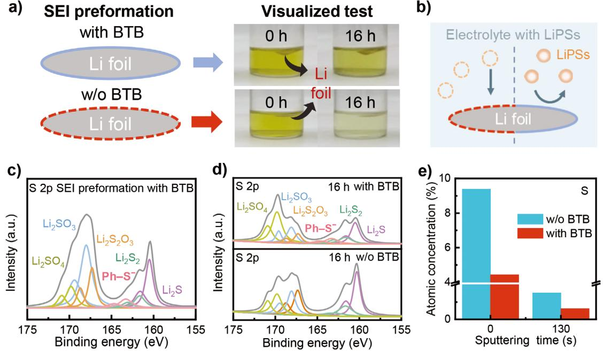
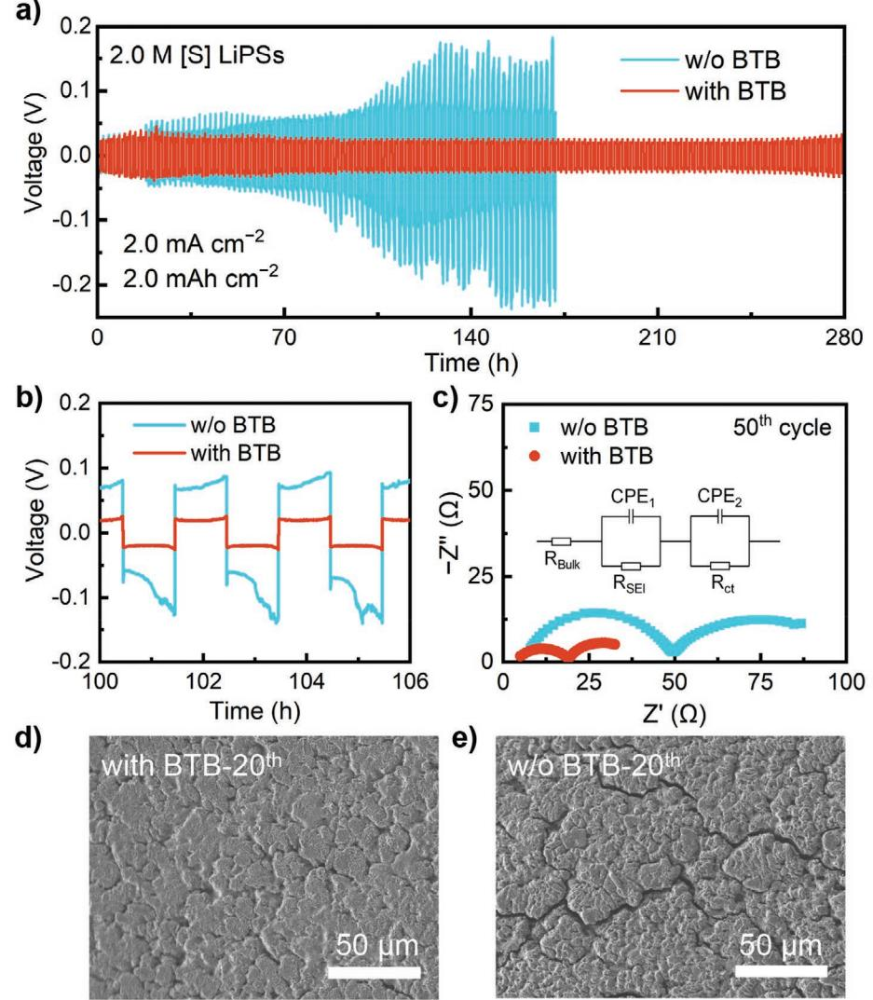
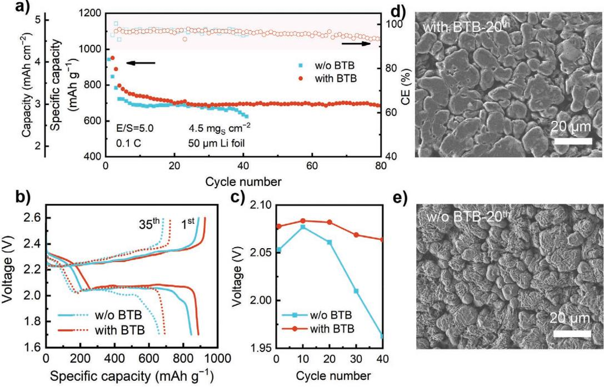
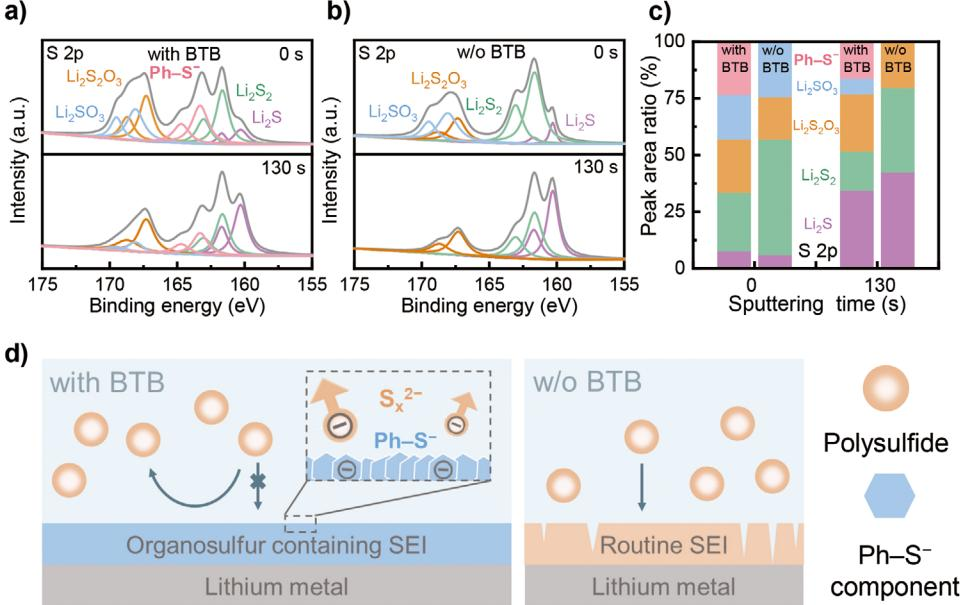

# **Shielding Polysulfide Intermediates by an Organosulfur-Containing Solid Electrolyte Interphase on the Lithium Anode in Lithium–Sulfur Batteries**

*Jun-Yu Wei, Xue-Qiang Zhang, Li-Peng Hou, Peng Shi, Bo-Quan Li, Ye Xiao, Chong Yan, Hong Yuan, and Jia-Qi Huang\**

**The lithium–sulfur (Li–S) battery is regarded as a promising high-energydensity battery system, in which the dissolution–precipitation redox reactions of the S cathode are critical. However, soluble Li polysulfides (LiPSs), as the indispensable intermediates, easily diffuse to the Li anode and react with the Li metal severely, thus depleting the active materials and inducing the rapid failure of the battery, especially under practical conditions. Herein, an organosulfur-containing solid electrolyte interphase (SEI) is tailored for the stabilizaiton of the Li anode in Li–S batteries by employing 3,5-bis(trifluoromethyl) thiophenol as an electrolyte additive. The organosulfur-containing SEI protects the Li anode from the detrimental reactions with LiPSs and decreases its corrosion. Under practical conditions with a high-loading S cathode (4.5 mgS cm−2 ), a low electrolyte/S ratio (5.0 µL mgS −1 ), and an ultrathin Li anode (50 µm), a Li–S battery delivers 82 cycles with an organosulfurcontaining SEI in comparison to 42 cycles with a routine SEI. This work provokes the vital insights into the role of the organic components of SEI in the protection of the Li anode in practical Li–S batteries.**

The pursuit of wireless and nonfossil society stimulates the demand of high-energy-density secondary batteries which outperform the current lithium-ion batteries in terms of specific energy.[1] Lithium–sulfur (Li–S) battery is regarded as one of the most promising battery systems with an estimated practical specific energy of more than 500 Wh kg−1 benefiting from the

can be found under https://doi.org/10.1002/adma.202003012.

#### **DOI: 10.1002/adma.202003012**

multielectron conversion reactions of S, which surpasses the current lithium-ion batteries of 260–300 Wh kg−1 . [2] At the initial stages, Li–S batteries are mainly limited by the inherent drawbacks of S cathode, including the insulating nature of S as active materials, the shuttle of Li polysulfide (LiPS) intermediates, and the huge volume change of cathode.[3] Remarkable progress has been made in the design of highperformance composite S cathode in the recent years, especially after the pioneering work by Nazar and co-workers in 2009,[4] which significantly mitigates the intrinsic drawbacks of S as cathode materials.[5]

The conversion of S falls in a mechanistic class of precipitation–dissolution redox reactions.[6] Specifically, S undergoes a solid–liquid–solid conversion reaction.[7] The initial reduction of S results in the soluble LiPS intermediates (e.g., Li2S*x*, *x* ≥ 4), and the continued reduction of the

soluble LiPSs results in the precipitation of Li2S2 or Li2S.[8] The soluble LiPSs are indispensable in promoting the continuous redox reactions of nonconductive S and Li2S as intrinsic mediators, which affords the foundation of the high energy density of Li–S batteries.[9] Meanwhile, the soluble LiPSs diffuse between anode and cathode and induce the notorious shuttle effect.[10] However, as the origin of the shuttle effect,[11] the effect of the reactions between Li anode and LiPSs on the failure of Li metal anode is few touched.

The stability of Li metal anode is mainly dictated by the solid electrolyte interphase (SEI), which is composed of the reaction products between Li metal and electrolyte.[12] The components and structure of SEI govern the behaviors of Li deposition into uniformity or dendrites, further dictating the depletion of Li and electrolyte and finally the lifespan of a battery.[13,14] In Li–S batteries, the soluble LiPSs in electrolyte must be taken into consideration in the understanding and regulation of SEI and Li deposition, which is different and more complex compared with that in the absence of the soluble LiPSs.[15] The soluble LiPSs can react with Li metal reductively through chemical or electrochemical processes.[11,16] The reaction products between LiPSs and Li become the ingredients of subsequent SEI, which deteriorate the uniformity of SEI and aggravate the nonuniform Li deposition. In a stripping process, the shape of Li dendrite

J.-Y. Wei, Y. Xiao, Dr. C. Yan, Prof. H. Yuan, Prof. J.-Q. Huang School of Materials Science and Engineering Beijing Institute of Technology Beijing 100081, China E-mail: jqhuang@bit.edu.cn J.-Y. Wei, Dr. B.-Q. Li, Y. Xiao, Dr. C. Yan, Prof. H. Yuan, Prof. J.-Q. Huang Advanced Research Institute of Multidisciplinary Science Beijing Institute of Technology Beijing 100081, China X.-Q. Zhang, L.-P. Hou, P. Shi, Dr. B.-Q. Li Beijing Key Laboratory of Green Chemical Reaction Engineering and Technology Department of Chemical Engineering Tsinghua University Beijing 100084, China The ORCID identification number(s) for the author(s) of this article

can lead to the decrease of the utilization efficiency of deposited Li and induce the loss of fresh Li.[17] The accumulation of dead Li also increases the internal resistance.[18] Moreover, SEI cracks and fresh Li exposes easily during a charge or discharge process with large volume change.[19] The soluble LiPSs can react with fresh Li metal directly, depleting the active Li and S concurrently and deteriorating Li–S batteries finally. Therefore, a uniform and stable SEI in the presence of the soluble LiPSs on Li metal anode is crucial for practical Li–S batteries.

Generally, a SEI composed of both organic and inorganic components stems from the reaction between electrolyte and Li.[14,20] The regulation of electrolyte is one of the most direct ways to construct a targeted SEI.[21] The role of inorganic components in constructing uniform and stable SEI has been explored in Li–S batteries since 2008, such as lithium nitrate (LiNO3) and its derivatives.[22] The decomposition products of LiNO3 involve into the formation of SEI, which enhances the uniformity of SEI and block LiPSs. However, only inorganic components are insufficient for a long-lifespan Li–S battery under practical conditions. As an indispensable component, the role of organic components in regulating the uniformity of SEI and shielding the soluble LiPSs is rarely touched. The organic components can be combined with inorganic components to promote the development of practical Li–S batteries.

Herein, an organosulfur-containing SEI was investigated for shielding LiPSs and thus enhancing the stability of Li metal anode in Li–S batteries by employing 3,5-bis(trifluoromethyl)thiophenol (BTB, Figure S1, Supporting Information) as an electrolyte additive based on the seminal progress on sulfur-containing polymers or solvents in Li–S batteries.[23] The organosulfur-containing SEI protects Li anode from the detrimental side reactions with LiPSs, which significantly benefits the uniformity of Li deposition and reduces the overpotential of Li plating/stripping processes. The effect of an organosulfur-containing SEI was demonstrated in a Li–S battery under practical conditions including a high loading S cathode (4.5 mgS cm−2 ), a low E/S ratio (5.0 µL mgS −1 ), and an ultrathin Li anode (50 µm). A Li–S battery delivers 82 cycles with an organosulfur-containing SEI in comparison to 42 cycles with a routine SEI before rapid decay.

The capability of shielding LiPSs of SEI was first investigated by the visualized experiments. The SEI is mainly formed by the reaction products of electrolyte and Li metal and thus soluble LiPSs also participate in the formation of SEI in Li–S batteries inevitably. Therefore, the SEI formed with the participation of LiPSs should be employed to evaluate the capability of shielding LiPSs. The visualized experiments include two steps: the SEI preformation and the visualized test (**Figure 1**a). In the SEI preformation, a fresh Li foil was first soaked in the electrolyte with LiPSs for 1 h, in which there is with and without BTB additive, respectively. The concentration of LiPSs (Li2S8 as a prototype of LiPSs) is 0.4 m [S] (0.4 m S species). In the visualized test, the obtained Li foil was soaked in the electrolyte with 5 × 10−3 m [S] LiPSs in a sealed bottle. The reaction extent between Li and LiPSs is indicated by the fading degree of the electrolyte color. After 16 h, the electrolyte significantly became almost colorless when the SEI on Li foil was preformed without BTB additive because LiPSs were nearly exhausted by reacting with Li. In contrast, when the SEI on Li foil was preformed with

**Figure 1.** The visualized experiments and XPS to identify the capability of shielding LiPSs of SEI. a) The schematics of SEI preformation in the LiPS electrolyte with or without BTB additive (left) and the optical images of LiPS electrolyte with a Li foil after 0 and 16 h in the visualized test (right). No LiNO3 is used in the comparison. The organosulfur-containing SEI: blue; the routine SEI: red; Li foil: gray. b) The schematic of the role of different types of SEI while contacting with LiPS electrolyte. c) XPS characterizations of S 2p spectra of the Li foil after SEI preformation by LiPS electrolyte with BTB additive. d) XPS characterizations of S 2p spectra of the Li foil after the visualized test for 16 h. e) The atomic concentration of S element at different argon (Ar+) sputtering time in different types of SEI after the visualized test for 16 h.

BTB additive, the discoloration extent of the electrolyte is significantly mitigated, proving that LiPSs retain in the electrolyte instead of being exhausted (Figure 1b). The reactions between LiPSs and Li are significantly suppressed by the SEI formed in the presence of BTB additive.

The significantly suppressed reactions between LiPSs and Li metal originate from the differences in SEI. X-ray photoelectron spectroscopy (XPS) analysis was carried out on the Li foil to reveal the components of SEI. In S 2p spectra on Li foil after SEI preformation with BTB additive (Figure 1c), the organosulfur-containing component with phenyl group (Ph–S−, 163.4 eV) is detected, which is the reaction product of BTB additive in SEI. Moreover, the organosulfur-containing component still exists after soaking in LiPS electrolyte for 16 h (Figure 1d), proving its stability in the presence of LiPSs. Meanwhile, the content of inorganic Li sulfides (Li2S/Li2S2) and the atomic concentration of S in the organosulfur-containing SEI decrease significantly (Figure 1e). Therefore, the organosulfur-containing SEI is achieved with BTB additive and then suppresses the side reactions between Li and LiPSs.

The effect of the organosulfur-containing SEI on the behaviors of Li plating/stripping in the presence of LiPSs was further investigated. The concentration of LiPSs in symmetric Li–Li batteries is 2.0 m [S] in consideration of the solubility and the actual concentration of LiPSs in electrolyte of Li–S batteries. In addition, an ultrathin Li foil with a thickness of 50 µm was utilized. At a current density of 2.0 mA cm−2 and an areal capacity of 2.0 mAh cm−2 , a stable voltage curve is obtained during 280 h with an organosulfur-containing SEI, while the battery with a routine SEI fails within 170 h (**Figure 2**a,b). The

**Figure 2.** The electrochemical performance and Li plating/striping behaviors in symmetric Li–Li batteries. a) The long-term stability of symmetric Li–Li batteries with 50 µm thick Li foils in the presence of 2.0 M [S] LiPSs in electrolyte with and without BTB additive at a current density of 2.0 mA cm−2 and a capacity of 2.0 mAh cm−2 . 2% LiNO3 additive was used in both electrolytes. b) The corresponding local enlarged voltage–time curves. c) EIS of the symmetric Li–Li batteries after the 50th cycle. The inset: the equivalent circuit diagram. d,e) SEM images of the cycled Li anode with (d) and without (e) BTB additive in symmetric Li–Li batteries at the 20th cycle.

polarization voltage of the battery with an organosulfur-containing SEI remains steady at around 30 mV during 280 h. In contrast, the polarization voltage with a routine SEI gradually increases to 100 mV after 100 h and 200 mV until failure happens. Furthermore, the plating/stripping of Li anode also shows reduced internal resistance with an organosulfur-containing SEI even without LiNO3 additive, because of the suppressed side reactions between Li and LiPSs (Figure S2, Supporting Information). The pretreated Li delivers a stable polarization voltage of about 20 mV for more than 80 h. However, the polarization voltage of bare Li keeps around 20 mV only during the first 40 h.

The changes of polarization voltage are also consistent with the results from the electrochemical impedance spectroscopy (EIS). Generally, the semicircle at the high frequency range represents the transport of Li ions through SEI (*R*SEI), and the semicircle at the low frequency range stands for the charge transfer resistance (*R*ct). The impedances of an organosulfur-containing SEI are close to those of a routine SEI initially (Figure S3, Supporting Information). However, the organosulfur-containing SEI remains low impedances (*R*SEI of 13 Ω and *R*ct of 14 Ω) after 50 cycles, while the impedances of a routine SEI increase significantly (*R*SEI of 45 Ω and *R*ct of 37 Ω, Figure 2c). The large increase in *R*SEI is owing to the continuous side reactions on Li metal and the accompanying drastic increase in *R*ct is from the accumulation of dead Li.[24] The Li deposition with an organosulfur-containing SEI presents a smooth and compact morphology (Figure 2d) after 20 cycles, while that with a routine SEI is corrosive and scraggy (Figure 2e). The corrosive morphology of Li metal is mainly caused by the side reactions with LiPSs. The organosulfur-containing SEI shields the Li metal from the side reactions with LiPSs, affording a significantly improved utilization of Li deposition and a decreased internal resistance, which significantly improves the cycling performance of symmetric Li–Li batteries.

Li–S batteries were assembled for an assessment of the organosulfur-containing SEI. Currently, long lifespan and high Coulombic efficiency of Li–S batteries are generally achieved under the mild conditions of a low loading S cathode (<2.0 mgS cm−2), a high E/S ratio (>20.0 µL mgS −1 ), and a greatly excess Li anode (600 µm, Figure S4, Supporting Information). However, for a practical Li–S battery with high energy density, a high loading S cathode (>4.0 mgS cm−2 ), a low E/S ratio (<5.0 µL mgS −1 ), and an ultrathin Li anode (<50 µm) are necessary.[25] Therefore, a high loading S cathode of 4.5 mgS cm−2 , an ultrathin Li anode of 50 µm, and a low E/S ratio of 5.0 µL mgS −1 (considering the large useless volume of a coin cell) were adopted (Figure S5, Supporting Information). The Li–S battery with an organosulfur-containing SEI delivers a discharge capacity of 950 mAh g−1 (4.0 mAh cm−2) at the first cycle and remains 700 mAh g−1 (3.0 mAh cm−2 ) after 82 cycles at 0.1 C, while the capacity of the battery with a routine SEI falls off a cliff after 35 cycles despite with the similar initial capacity (**Figure 3**a). The discharge curves with the two types of SEI are quite different in spite of the similar discharge capacities within the initial 35 cycles (Figure 3b). In the later part of the discharge curve of the 35th cycle, an obvious voltage drop occurs in the battery with a

**Figure 3.** The electrochemical performance of Li–S batteries and the corresponding Li deposition morphology. a) The cycling performance of Li–S batteries at 0.1 C under practical conditions with a high loading S cathode (4.5 mgS cm−2 ), a low E/S ratio (5.0 µL mgS −1 ), and an ultrathin Li anode (50 µm). 2% LiNO3 additive was used in both electrolytes. b) The galvanostatic discharge–charge profiles at the 1st and the 35th cycle. c) The discharge voltage at the 80% of discharge capacity at different cycles. The SEM images of the cycled Li anode with (d) and without (e) BTB additive in Li–S batteries after the 20th cycle.

routine SEI, which cannot be observed in the curve of the battery with an organosulfur-containing SEI, though the discharge capacity approximates to each other. The abrupt voltage drop mainly stems from the depletion of fresh Li which is consumed constantly by the reactions with high concentration of LiPSs in electrolyte.[26] At initial stage, fresh Li is adequate and thus the voltage drop is avoided. However, the fresh Li depletes gradually during cycles due to the reactions of Li and LiPSs. Therefore, less and less available Li remains, and more and more unrenewable Li accumulates continuously. The resistance of Li stripping increases, which leads to an extreme overpotential. The increased overpotential of Li stripping in Li–S batteries can be reflected in the discharge voltage if the cathode maintains stable. When fresh Li is not sufficient to finish the discharge process, the battery will cease because of the huge voltage drop. The voltage at 80% depth of discharge of the battery with a routine SEI drops by more than 100 mV during 40 cycles, while that of the battery with an organosulfur-containing SEI decreases by 20 mV (Figure 3c). The changes of EIS also confirm the remission of overpotential in Li–S batteries with an organosulfurcontaining SEI (Figure S6, Supporting Information).

The cycled Li anode of Li–S batteries was disassembled to monitor the morphology change. The Li surface is smooth with an organosulfur-containing SEI after the 20th cycle, and the deposition of Li is compact (Figure 3d). In contrast, the Li surface with the routine SEI is corrosive and the morphology of deposition is sparse (Figure 3e). Therefore, the depletion of fresh Li is alleviated significantly with the protection of an organosulfur-containing SEI, contributing to a significantly improved lifespan of Li–S batteries under practical conditions.

The components of an organosulfur-containing SEI on Li metal anode in Li–S batteries were further detected by XPS. The S 2p spectra of the organosulfur-containing SEI indicates the compositions of inorganic sulfides (Li2S/Li2S2), organosulfur-containing component (Ph–S−), sulfites, and thiosulfates (**Figure 4**a). The organosulfur-containing component originates from the decomposition of BTB additive. The content of the organosulfur-containing component in the sulfur-containing components is ≈23% on the surface of SEI and ≈18% after 130 s sputtering (Figure 4c). The organosulfur-containing component exists in the different depths of SEI. In contrast, the routine SEI is only composed of sulfites, thiosulfates, and inorganic Li sulfides (Figure 4b and Figures S7 and S8, Supporting Information). Besides, the content of inorganic sulfides (Li2S2 and Li2S) in an organosulfur-containing SEI is lower than that in a routine SEI. The inorganic sulfides, which are mainly taken place by Ph–S− component, decrease by ≈25% on the surface and ≈18% after 130 s sputtering in an organosulfur-containing SEI (Figure 4c). The content of Li2S2 and Li2S in a routine SEI increases because more LiPSs react with Li metal directly. In other words, the organosulfur-containing SEI shields Li anode from LiPSs and mitigates the reactions between LiPSs and Li anode.

The formation of an organosulfur-containing SEI with BTB additive and its role in the protection of Li anode from LiPSs are presented (Figure 4d). The active sulfydryl group in BTB additive reacts with Li metal, which affords the generation of Ph–S− component as organic ingredients in SEI. Compared with the SEI formed in a routine electrolyte, the Ph–S− component is the typical feature of the SEI formed with BTB additive, which is therefore denoted as the organosulfur-containing SEI. The Ph–S− component can repel LiPSs by electrostatic repulsion. Therefore, the organosulfur-containing SEI is able to mitigate the side reactions between Li metal and LiPSs. The surface of Li anode maintains smooth and uniform, decreasing the depletion of fresh Li and electrolyte and leading to a much

**Figure 4.** The components of an organosulfur-containing SEI and the corresponding schematics of the formation and effect of SEI. The XPS depth profiles of SEI with (a) and without (b) BTB additive from the anode of Li–S batteries after 5 cycles. c) The peak area ratio of sulfur-containing components in the SEI formed with and without BTB additive after 0 and 130 s sputtering. d) The schematics of the formation of SEI with and without BTB additive and the corresponding effect of the formed SEI in shielding LiPSs from Li anode.

improved cycle performance under practical conditions. On the contrary, LiPSs can react with Li anode continuously with a routine SEI, which induces a corrosive and uneven Li anode and a rapid failure. Despite the superior performance of BTB additive in the coin cell at practical conditions, when it comes to scaleup applications, the potential electrolyte gassing problem needs to be taken into account for applications in scale-up scenarios.

In conclusion, an organosulfur-containing SEI was tailored by employing BTB additive in order to protect Li metal anode from the soluble LiPSs during cycles in Li–S batteries. The active sulfydryl group in BTB additive reacts with Li metal and affords the generation of organic Ph–S− components in SEI, constructing an organosulfur-containing SEI. The organosulfurcontaining SEI can shield LiPSs and protect Li anode from the detrimental side reactions with LiPSs, decreasing the depletion of fresh Li and electrolyte. In a Li–S battery under practical conditions with a high loading S cathode (4.5 mgS cm−2 ), a low E/S radio (5.0 µL mgS −1 ), and an ultrathin Li anode (50 µm), 82 cycles were achieved with an organosulfur-containing SEI in comparison to 42 cycles with a routine SEI before rapid decay. This work provides fresh insights into the role of organic components in SEI in the protection of Li metal anode in practical Li–S batteries with a high concentration of soluble LiPSs. Moreover, the understanding in this work can be also implantable to the interfacial protection in other metal–sulfur battery systems.

## **Supporting Information**

Supporting Information is available from the Wiley Online Library or from the author.

#### **Acknowledgements**

This work was supported by Beijing Natural Science Foundation (L182021), National Natural Science Foundation of China (21776019, 21808124), National Key Research and Development Program (2016YFA0202500), and Scientific and Technological Key Project of Shanxi Province (20191102003).

## **Conflict of Interest**

The authors declare no conflict of interest.

## **Keywords**

additives, lithium metal anodes, lithium–sulfur batteries, polysulfides, solid electrolyte interphase

> Received: May 4, 2020 Revised: July 7, 2020 Published online: August 6, 2020

- 
- [3] P. G. Bruce, S. A. Freunberger, L. J. Hardwick, J.-M. Tarascon, *Nat. Mater.* **2012**, *11*, 19.
- [4] X. Ji, K. T. Lee, L. F. Nazar, *Nat. Mater.* **2009**, *8*, 500.
- [5] a) S.-H. Chung, A. Manthiram, *Adv. Mater.* **2019**, *31*, 1901125; b) R. Fang, S. Zhao, Z. Sun, D.-W. Wang, H.-M. Cheng, F. Li, *Adv. Mater.* **2017**, *29*, 1606823; c) Q. Pang, X. Liang, C. Y. Kwok, L. F. Nazar, *Nat. Energy* **2016**, *1*, 16132.
- [6] S.-Y. Lang, R.-J. Xiao, L. Gu, Y.-G. Guo, R. Wen, L.-J. Wan, *J. Am. Chem. Soc.* **2018**, *140*, 8147.
- [7] A. Manthiram, Y. Fu, S.-H. Chung, C. Zu, Y.-S. Su, *Chem. Rev.* **2014**, *114*, 11751.
- [8] a) F. Y. Fan, W. C. Carter, Y.-M. Chiang, *Adv. Mater.* **2015**, *27*, 5203; b) H. Pan, J. Chen, R. Cao, V. Murugesan, N. N. Rajput, K. S. Han, K. Persson, L. Estevez, M. H. Engelhard, J.-G. Zhang, K. T. Mueller, Y. Cui, Y. Shao, J. Liu, *Nat. Energy* **2017**, *2*, 813.
- [9] Z.-W. Zhang, H.-J. Peng, M. Zhao, J.-Q. Huang, *Adv. Funct. Mater.* **2018**, *28*, 1707536.
- [10] X.-B. Cheng, J.-Q. Huang, H.-J. Peng, J.-Q. Nie, X.-Y. Liu, Q. Zhang, F. Wei, *J. Power Sources* **2014**, *253*, 263.
- [11] Y. V. Mikhaylik, J. R. Akridge, *J. Electrochem. Soc.* **2004**, *151*, A1969.
- [12] a) E. Peled, *J. Electrochem. Soc.* **1979**, *126*, 2047; b) X.-B. Cheng, R. Zhang, C.-Z. Zhao, F. Wei, J.-G. Zhang, Q. Zhang, *Adv. Sci.* **2016**, *3*, 1500213.
- [13] Y. Li, W. Huang, Y. Li, A. Pei, D. T. Boyle, Y. Cui, *Joule* **2018**, *2*, 2167.
- [14] D. Aurbach, *J. Power Sources* **2000**, *89*, 206.
- [15] a) C. Yan, X.-Q. Zhang, J.-Q. Huang, Q. Liu, Q. Zhang, *Trends Chem.* **2019**, *1*, 693; b) R. Cao, W. Xu, D. Lv, J. Xiao, J.-G. Zhang, *Adv. Energy Mater.* **2015**, *5*, 1402273; c) Y. Zhao, Y. Ye, F. Wu, Y. Li, L. Li, R. Chen, *Adv. Mater.* **2019**, *31*, 1806532; d) Y. Han, X. Duan, Y. Li, L. Huang, D. Zhu, Y. Chen, *Mater. Res. Bull.* **2015**, *68*, 160; e) D. Zheng, D. Liu, J. B. Harris, T. Ding, J. Si, S. Andrew, D. Qu, X.-Q. Yang, D. Qu, *ACS Appl. Mater. Interfaces* **2017**, *9*, 4326; f) D. Zheng, X.-Q. Yang, D. Qu, *ChemSusChem* **2016**, *9*, 2348.
- [16] R. Yemini, M. N. Rosy, *J. Electrochem. Soc.* **2019**, *166*, A3098.
- [17] K. N. Wood, E. Kazyak, A. F. Chadwick, K.-H. Chen, J.-G. Zhang, K. Thornton, N. P. Dasgupta, *ACS Cent. Sci.* **2016**, *2*, 790.
- [18] a) D. Lu, Y. Shao, T. Lozano, W. D. Bennett, G. L. Graff, B. Polzin, J. Zhang, M. H. Engelhard, N. T. Saenz, W. A. Henderson, P. Bhattacharya, J. Liu, J. Xiao, *Adv. Energy Mater.* **2015**, *5*, 1400993; b) Z. Lu, W. Li, Y. Long, J. Liang, Q. Liang, S. Wu, Y. Tao, Z. Weng, W. Lv, Q.-H. Yang, *Adv. Funct. Mater.* **2020**, *30*, 1907343.
- [19] M. Wang, F. Zhang, C.-S. Lee, Y. Tang, *Adv. Energy Mater.* **2017**, *7*, 1700536.
- [20] E. Peled, *J. Electrochem. Soc.* **1997**, *144*, L208.
- [21] a) S. Y. Zheng, F. Yi, Z. P. Li, Y. J. Zhu, Y. H. Xu, C. Luo, J. H. Yang, C. S. Wang, *Adv. Funct. Mater.* **2014**, *24*, 4156; b) H. Zhang, G. G. Eshetu, X. Judez, C. Li, L. M. Rodriguez-Martínez, M. Armand, *Angew. Chem., Int. Ed.* **2018**, *57*, 15002; c) Q. Zhao, Z. Tu, S. Wei, K. Zhang, S. Choudhury, X. Liu, L. A. Archer, *Angew. Chem., Int. Ed.* **2018**, *57*, 992; d) Y. Yamada, J. Wang, S. Ko, E. Watanabe, A. Yamada, *Nat. Energy* **2019**, *4*, 269; e) C.-W. Lee, Q. Pang, S. Ha, L. Cheng, S.-D. Han, K. R. Zavadil, K. G. Gallagher, L. F. Nazar, M. Balasubramanian, *ACS Cent. Sci.* **2017**, *3*, 605.
- [22] a) Y. Mikhaylik, *US 7,354,680,* **2008**; b) D. Aurbach, E. Pollak, R. Elazari, G. Salitra, C. S. Kelley, J. Affinito, *J. Electrochem. Soc.* **2009**, *156*, A694; c) S. S. Zhang, *Electrochim. Acta* **2012**, *70*, 344; d) X. Liang, Z. Wen, Y. Liu, M. Wu, J. Jin, H. Zhang, X. Wu, *J. Power Sources* **2011**, *196*, 9839; e) S. Xiong, K. Xie, Y. Diao, X. Hong, *Electrochim. Acta* **2012**, *83*, 78; f) Y.-X. Yao, X.-Q. Zhang, B.-Q. Li, C. Yan, P.-Y. Chen, J.-Q. Huang, Q. Zhang, *InfoMat* **2020**, *2*, 379.
- [23] a) G. X. Li, Y. Gao, X. He, Q. Q. Huang, S. R. Chen, S. H. Kim, D. H. Wang, *Nat. Commun.* **2017**, *8*, 10; b) S. R. Chen, D. W. Wang, Y. M. Zhao, D. H. Wang, *Small Methods* **2018**, *2*, 5; c) W. X. Hua, Z. Yang, H. G. Nie, Z. Y. Li, J. Z. Yang, Z. Q. Guo, C. P. Ruan,

[1] M. Armand, J. M. Tarascon, *Nature* **2008**, *451*, 652.

[2] a) J. W. Choi, D. Aurbach, *Nat. Rev. Mater.* **2016**, *1*, 16013; b) X.-Q. Zhang, C.-Z. Zhao, J.-Q. Huang, Q. Zhang, *Engineering* **2018**, *4*, 831.

**www.advancedsciencenews.com www.advmat.de**

X. Chen, S. M. Huang, *ACS Nano* **2017**, *11*, 2209; d) J. R. He, A. Bhargav, A. Manthiram, *Energy Storage Mater.* **2019**, *23*, 88.

- [24] X.-Q. Zhang, X.-M. Wang, B.-Q. Li, P. Shi, J.-Q. Huang, A. Chen, Q. Zhang, *J. Mater. Chem. A* **2020**, *8*, 4283.
- [25] a) H.-J. Peng, J.-Q. Huang, X.-B. Cheng, Q. Zhang, *Adv. Energy Mater.* **2017**, *7*, 1700260; b) S.-H. Chung, C.-H. Chang, A. Manthiram, *Adv. Funct. Mater.* **2018**, *28*, 1801188; c) M. Zhao,

B.-Q. Li, H.-J. Peng, H. Yuan, J.-Y. Wei, J.-Q. Huang, *Angew. Chem., Int. Ed.* **2020**, *31*, 12636.

[26] J. Liu, Z. Bao, Y. Cui, E. J. Dufek, J. B. Goodenough, P. Khalifah, Q. Li, B. Y. Liaw, P. Liu, A. Manthiram, Y. S. Meng, V. R. Subramanian, M. F. Toney, V. V. Viswanathan, M. S. Whittingham, J. Xiao, W. Xu, J. Yang, X.-Q. Yang, J.-G. Zhang, *Nat. Energy* **2019**, *4*, 180.