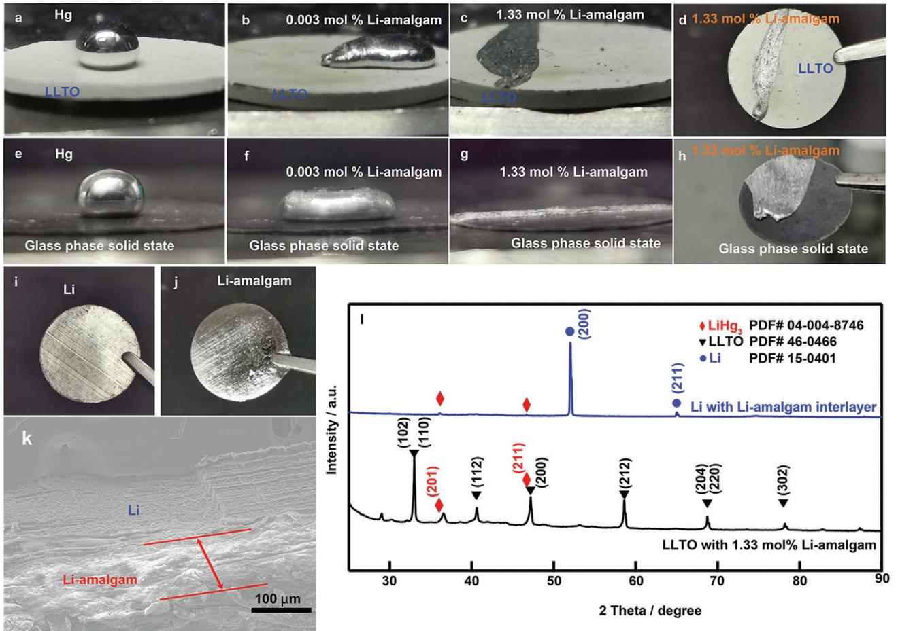
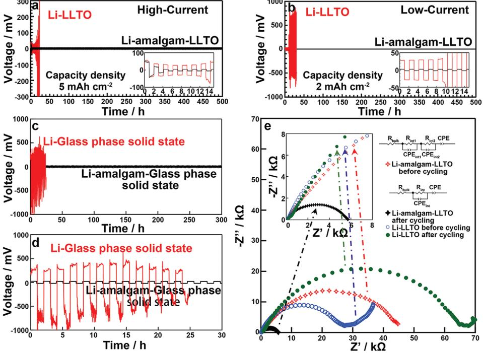
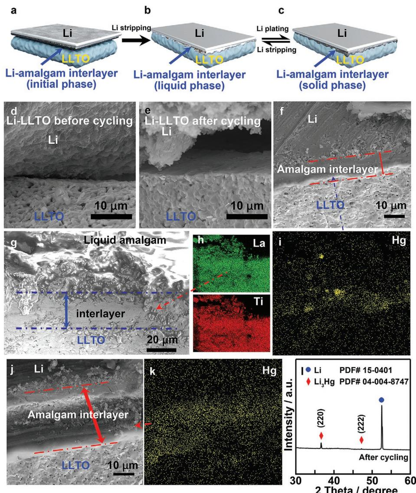
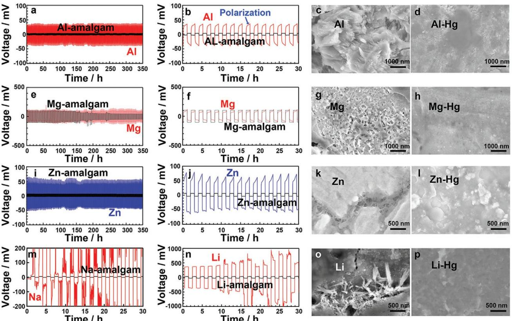

# **A Self-Healing Amalgam Interface in Metal Batteries**

*Ye Fan, Tao Tao,\* Yuxuan Gao, Chao Deng, Baozhi Yu, Ying (Ian) Chen,\* Shengguo Lu, and Shaoming Huang*

**Poor cyclability and safety concerns caused by the uncontrollable dendrite growth and large interfacial resistance severely restrict the practical applications of metal batteries. Herein, a facile, universal strategy to fabricate ceramic and glass phase compatible, and self-healing metal anodes is proposed. Various amalgam-metal anodes (Li, Na, Zn, Al, and Mg) show a long cycle life in symmetric cells. It has been found that liquid Li amalgam shows a complete wetting with the surface of lanthanum lithium titanate electrolyte and a glass-phase solid-state electrolyte. The interfacial compatibility between the lithium metal anode and solid-state electrolyte is dramatically improved by using an in situ regenerated amalgam interface with high electron/ion dual-conductivity, obviously decreasing the anode/electrolyte interfacial impedance. The lithium-amalgam interface between the metal anode and electrolyte undergoes a reversible isothermal phase transition between solid and liquid during the cycling process at room temperature, resulting in a selfhealing surface of metal anodes.**

The growing demands for energy storage systems with high energy density has renewed researcher's interest in metal batteries, such as lithium (Li), sodium (Na), potassium (K), aluminum (Al), zinc (Zn), and magnesium (Mg),[1–9] because of the high theoretical capacity (Li: 3860 mAh g−1 , Na: 1166 mAh g−1 , K: 687 mAh g−1 , Al: 2978 mAh g−1 , Zn: 820 mAh g−1 , and Mg: 2206 mAh g−1 ) and moderate electrochemical potential (Li: −3.04 V, Na: −2.71 V, K: −2.93 V, Al: −2.069 V, Zn: −0.7618 V, and Mg: −2.372 V versus the standard hydrogen potential) of metal anodes. Despite these advantages, metal battery anodes still face significant challenges including metal dendrite growth and large volume change during cycling, which could cause severe safety issues of metal batteries and lead to their short

Dr. Y. Fan, Dr. T. Tao, Y. Gao, C. Deng, Prof. S. Lu, Prof. S. Huang School of Materials and Energy Guangdong University of Technology Guangzhou 510006, P. R. China E-mail: taotao@gdut.edu.cn Dr. T. Tao Dongguan South China Design Innovation Institute Dongguan 523808, P. R. China Dr. B. Yu, Prof. Y. (I.) Chen Institute for Frontier Materials Deakin University 75 Pigdons Road, Waurn Ponds, Victoria 3216, Australia E-mail: ian.chen@deakin.edu.au

The ORCID identification number(s) for the author(s) of this article can be found under https://doi.org/10.1002/adma.202004798.

#### **DOI: 10.1002/adma.202004798**

cycling life.[10–12] Besides, all-solid-state metal batteries mainly suffer from large interfacial impedance caused by the poor interfacial contact between solid-state electrolyte and metal anode, greatly limiting their practical applications.[13,14] Continuous efforts have been devoted to controlling the lithium metal dendrite growth, inhibiting the huge volume change of anodes, or enhancing the interfacial compatibility between solid-state electrolytes and metal anodes by using various kinds of strategies, such as adding protective layers on anodes, inserting interfaces between anode and separator, modifying separator, fabricating new 3D current collectors, optimizing electrolytes, employing ionic liquids, and using liquid alloys.[15–26] Although these methods could have a significant effect on one of these issues, no candidate method has been demonstrated

to be fit for all stable dendrite-free metal batteries so far. Therefore, universal strategies for both constructing stable metal battery anodes and improving the interfacial compatibility of the metal anode/electrolyte are seriously required.

In metal batteries, anodes based on energetic metals can easily react with the electrolyte to form a rough, fragile solid– electrolyte interphase (SEI) on the metal surface because of their high Fermi energy level.[27–29] The formed fragile SEI film could not suppress the substantial volume change and interfacial fluctuations of metal anodes,[26] and therefore constantly breaks and reforms during cycling. Also, the non-uniform SEI layer can induce uneven metal deposition and accelerate metal dendrite growth.[12,30,31] The growing Li dendrites can pierce SEI, leading to the reformation of SEI. During the subsequent battery cycling, the repeated breakage and reformation of SEI consumes a larger amount of electrolytes and active metals, resulting in the low Coulombic efficiency of batteries.[32–34] Therefore, introducing an ideal artificial interface between metal anodes and electrolytes may be an effective approach for improving the electrochemical performance of metal batteries. The ideal interface should have several advantages: both high electronic/ionic conductivity, excellent interfacial compatibility with the anode and electrolyte, and good mechanical and electrochemical properties during electrochemical plating and stripping reactions.

Owing to a high self-healing ability and diffusivity of ions in liquids, low-melting-point metallic alloys have been employed as dendrite-free liquid metal anodes for metal batteries, which are capable of affording a liquid buffer to heal the cracks induced by the expansion/contraction of anodes and diminish

the metal dendrite growth during cycling.[23,35] But the limited materials selection and applicability of these self-healing liquid metal anodes hinder their practical application in metal batteries. Mercury is the only common liquid metal at standard temperature and pressure, which has a good electric conductivity (1.1 × 106 S m−1 ). It usually serves as a liquid working electrode in polarography.[36] Mercury can easily react with various kinds of metals to form stable alloys, called amalgams, such as Li, Na, K, Al, Zn, Mg, Ag, Au, and Sn.[37,38] The phase state transition of amalgam (liquid, soft paste or solid) seriously depends upon the proportion of mercury.[37] A latest research has also shown that fabricating a Li amalgam protection layer on the Li metal surface can realize lithium-dendrite-free anode.[4] Thus, amalgam film grown by a facile in situ alloying process on the corresponding metal anode surface could be a potential candidate as artificial SEI layer with self-healing feature in the metal batteries.

Here, various kinds of amalgam films are in situ grown by directly spreading mercury droplet onto the metal surface at room temperature, including Li, Na, Al, Zn, and Mg. It has been found that liquid lithium amalgam exhibits an intimate contact with a solid-state electrolyte, resulting in a significant decrease in interfacial impedance. Specifically, the regenerated amalgam interface with self-healing behavior enables ultrastable metal dendrite free anode in symmetric cell during cycling. We demonstrate a facile universal approach to fabricate advanced dendrite-free metal anodes for metal batteries.

The interfacial compatibility between lithium metal anode and solid-state electrolyte is critical for high-energy-density all-solidstate batteries. It has been found that pure lithium metal is not compatible with inorganic solid-state electrolytes until heating for a long time at a high temperature.[17,39] To improve the surface contact between lithium metal anode and solid-state electrolyte at room temperature, a thin Li-amalgam layer is introduced. As shown in **Figure 1**a,e, a larger contact angle is observed between mercury and inorganic solid-state electrolytes, including lanthanum lithium titanate (LLTO) electrolyte and glass-phase solidstate electrolyte (Li2S-P2S5), indicating a bad wetting behavior. After directly adding 0.003 mol% lithium metal into the mercury at room temperature, the solid-state electrolytes exhibit an improved wettability to mercury (Figure 1b,f). When the lithium metal content further increases to 1.33 mol%, liquid amalgam fully wets the surface of electrolyte pellets without interfacial void space (Figure 1c,d,g,h). Furthermore, after coating the surface of

**Figure 1.** a–h) Photos of the wetting behavior of solid-state electrolytes: LLTO (a–d) and glass-phase solid-state (e–h), with pure Hg, 0.003 mol% Li-amalgam, and 1.33 mol% Li-amalgam. i–k) SEM images of the top surface for pure Li foil (i), Li foil with an amalgam film coating (j), and the side surface for the amalgam-film-coated lithium foil after making 45° turn (k). l) XRD profiles of the pristine Li-amalgam-coated LLTO and amalgam-coated lithium foil before cycling.

electrolyte with liquid amalgam for 30 min, the white solid LLTO electrolyte turns to dark gray (Figure S2a, Supporting Information), demonstrating that the resulted amalgam diffuses into the inner of electrolyte through un-compacted surface. The intimate contact between mercury and solid-state electrolyte could be generated by the addition of lithium metal. To better understand the improvement in wettability between mercury and solid-state electrolytes, the X-ray diffraction (XRD) pattern in Figure 1l shows that mercury is lithiated to form a LiHg3 (powder diffraction file (JCPDF)-04-004-8746) alloy layer on the surface of LLTO electrolyte ((JCPDF)-46-0466). No peaks contribute to impurities, indicating that Li-amalgam film is chemically stable with the LLTO electrolyte. It seems that alloy formation between mercury and lithium metal is a critical factor in causing the enhanced contact between amalgam and solid-state electrolytes. According to the angle of infiltration formula, Van't Hoff isothermal equation and Nernst equation described in the additional information section, the wettability between liquid and solid is related to their surface energy. The surface free energy of mercury can be continuously decreased with increasing the lithium content. The value of surface free energy could reach a minimum when the concentration of lithium is 1.33 mol% in Li-Hg system,[37] resulting in an acute angle and intimate contact between amalgam and solid-state electrolytes. All results show that liquid Li-amalgam has a good wetting with inorganic solid-state electrolytes at room temperature.

To realize dendrite-free metal anodes and improve interfacial compatibility between metal anodes and solid-state electrolytes, a series of amalgam layers are in situ fabricated by directly dropping mercury on the corresponding metal surface at room temperature, including Li, Na, Al, Zn, and Mg (Figure 1i,j; Figures S1 and S2, Supporting Information), because mercury, a liquid metal, can easily alloy with various kinds of metals. After coating, the metal-amalgam layers exhibit more metallic luster than metal foils, and the thickness of Li-amalgam layer is ≈70 µm (Figure 1k), which can be regulated by controlling the alloying process. The X-ray diffraction peaks of the lithium metal coated by Li-amalgam layer match well with LiHg3 and pure Li (Figure 1l).

All solid symmetric cells consisting of Li metal/solid-state electrolyte/Li metal, or Li-amalgam/solid-state electrolyte/ amalgam-Li are assembled to further investigate the interfacial stability and Li-ion transport capability across the solid-state electrolyte (LLTO or Li2S-P2S5), and Li-amalgam interface. At a current density of 2 mA cm−2 , the Li-amalgam/solid-state electrolyte/amalgam-Li cells exhibit the long cycling stability with a small voltage polarization (**Figure 2**b–d), indicating a stable interface of Li-amalgam/solid-state electrolyte. In comparison, the charge–discharge voltage of the Li/solid-state electrolyte/Li cells increase sharply in a few hours, indicating uneven lithium ion flow through the interface. When the cells are performed at a higher current density of 5 mA cm−2 , the voltage of Liamalgam/LLTO cell decreases from ≈80 to ≈10 mV in initial stage, and exhibits a stable plateau after plating/stripping for 500 h (Figure 2a), indicating the establishing of new interfaces between Li-amalgam anode and LLTO electrolyte, which well

**Figure 2.** a–d) Voltage profile of galvanostatic lithium plating/stripping on the all-solid-state symmetric lithium cells (the insets in (a) and (b) show the initial 15 h galvanostatic cycles): a) pure Li/LLTO electrolyte cell and Li-amalgam/LLTO electrolyte cell at a current density of 5mAcm−2 and b) a current density of 2mAcm−2 . c,d) Pure Li/glass-phase solid-state electrolyte cell and Li-amalgam/glass-phase solid-state electrolyte cell at a current density of 2mAcm−2 . e) Impedance spectra of the pristine Li-LLTO, the pristine Li-amalgam-LLTO, the cycled Li-amalgam-LLTO, and the cycled Li-LLTO symmetric cells recorded at room temperature.

agrees with the electrochemical impedance spectroscopy (EIS) measurements. As shown in Figure 2e, the interfacial impedance of the pristine Li-amalgam/LLTO cell presents slightly higher values than that of the Li/LLTO cell, because the electric conductivity of Li-amalgam is lower than that of pure lithium metal, and solid Li-amalgam interface could have a relatively poor wetting with the LLTO electrolyte before cycling. However, after five cycles, Li-amalgam/LLTO cell shows a significantly decreased interfacial impedance (Figure 2e), which is much lower than that of the cycled Li/LLTO cell. Since, during the lithiation/delithiation cycling process, the Li-amalgam undergoes a reversible phase transition from solid to liquid (**Figure 3**g). The resulted liquid Li-amalgam can fully wet the surface of the solid electrolyte (Figure 1c), and infiltrate and fill into the porous space of the solid electrolyte (Figure S2a, Supporting Information) to form a new interface between the Li-amalgam anode and LLTO electrolyte. The transmission electron microscopy data shown in Figure S3a–c, Supporting Information also reveals a new phase likely produced by the reaction of the liquid Li-amalgam with the LLTO electrolyte during cycling. Thus, the regenerated amalgam interface between anode and electrolyte is more stable after several cycles, and have a good wettability with anode and solid-state electrolytes, resulting in a low interfacial impedance.

The scanning electron microscopy (SEM) images and elemental mappings shown in Figure 3 confirm the existence of the continuous amalgam interface between lithium metal

**Figure 3.** a–c) Schematic of Li-amalgam-LLTO system during all Li stripping and plating process. d–g,j) SEM images of: d) the pristine Li/LLTO electrolyte interface, e) the cycled Li/LLTO electrolyte interface, f) the pristine Li-amalgam/LLTO electrolyte interface, and g) the Li-amalgam/LLTO electrolyte interface during the first Li stripping process, and j) the Li-amalgam/LLTO electrolyte interface after the first Li stripping/plating cycle. i,k) Element analysis (Hg) of: i) the pristine Li-amalgam/LLTO electrolyte interface and k) the Li-amalgam/LLTO electrolyte interface after first Li stripping/plating cycle. h) Element analysis (Ti and La) of the Li-amalgam/LLTO electrolyte interface during the first Li stripping process. l) The XRD pattern of the lithium anode with amalgam interface after cycling.

anode and LLTO electrolyte, which infiltrates into the voids and the grain boundaries on the surface of solid-state electrolytes to result in a gradually increased thickness of amalgam layer from ≈7 to ≈24 µm during cycling process. An intimate contact between electrode and electrolyte is achieved (Figure 3a–c). In contrast to Li-amalgam-LLTO cell, the pure Li-LLTO cell shows a poor contact between lithium metal and electrolyte even after cycling (Figure 3d,e).[40,41] XRD analysis reveals that Li-deficient alloy (LiHg3) phase appearing in the interface can be transformed to Li-rich alloy (Li3Hg) phase ((JCPDF)-04-004- 8747) after the first cycle (Figure 1l and Figure 3l), and SEM images show that the lithium amalgam interface between the metal anode and electrolyte undergoes a reversible phase transition from solid to liquid at room temperature during delithiation/lithiation cycling process (Figure 3g). Clearly, it can be observed that the liquid amalgam appears in the interface between lithium amalgam anode and electrolyte, when Liamalgam-LLTO cell is disassembled and broken down into two parts (Figure S13, Supporting Information). This can be attributed to the phase transformation of amalgam between liquid, soft paste, and solid, which heavily relies upon the proportion of mercury in the amalgam. During Li stripping process, the rapidly reduced concentration of lithium in the amalgam layer leads to the formation of liquid amalgam on the surface of amalgam interface. The formed semi-solid amalgam interface consists of two phases (Figure S5, Supporting Information): liquid phase and solid phase. The side of amalgam interface near the electrolyte is liquid due to Li-deficiency, while the other side is solid near the lithium metal because of Li-rich environment. On the other hand, the sufficient lithium source in amalgam can promote the phase transition of alloy layer from liquid to solid during Li plating process. Furthermore, the resulted liquid amalgam spreads on the surface of solid-state electrolyte, and slowly diffuses into the inner of electrode and electrolyte during cycling, finally resulting in the formation of the stable interface between electrode and electrolyte(Figure 3j and Figure S11, Supporting Information). The testing result of X-ray photoelectron spectroscopy further confirms the amalgam layer composed of Li and Hg (Figure S3d,e, Supporting Information). The Hg4f spectrum of the pristine Li-amalgam sample exhibits a peak at 101.84 eV, is assigned to Hg*δ* − .[42] After the first cycle, the binding energy of the Hg4f is shifted back to around 101.9 eV, demonstrating that the Li-amalgam interface has a good electrochemical reversibility, which can reversibly store Li by alloying and plating processes. Thus, the formation of interface between electrode and electrolyte can be attributed to the liquid amalgam (Figure 3g) caused by the delithiation of the amalgam layer. The Li-deficient alloy (LiHg3) interface can alternate with the Li-rich alloy (Li3Hg) during cycling, facilitating ion transport through this artificial SEI. The artificial amalgam interface with isothermal phase transformation property has a good self-healing ability to inhibit the metal dendrite growth during cycling, an intimate contact with the anode and electrolytes, high electronic/ ionic dual-conductivity, and excellent mechanical and electrochemical stability. These results demonstrate the feasibility of amalgam interface for metal battery anodes.

The above results demonstrate the Li metal anodes modified by amalgam film which enables a long-term cycling stability for all-solid-state batteries. To evaluate the electrochemical performance of metal anodes modified by amalgam film in liquid electrolytes, symmetric cells composed of pristine pure metal electrodes and metal-amalgam electrodes, and full cells composed of pristine metal anodes or metalamalgam anodes, and cathodes (LiFePO4 for lithium ion batteries, or V2O5 for zinc ion batteries) were assembled, respectively. The corresponding liquid electrolyte was added in between the cathode and anode before assembling cells. As expected, similar results have been achieved in the voltage profile of galvanostatic metal plating/stripping on metal electrodes with amalgam interface and metal electrodes without amalgam interface in liquid electrolyte, including Al, Mg, Zn, Na, and Li (**Figure 4**a,b,e,f,i,j,m,n). Small voltage hysteresis over hundreds of hours in a symmetric cell configuration at a current density of 2 mA cm−2 can be obtained, such as a flat plateau at 10 mV for Al-amalgam, 100 mV for Mg-amalgam, 8 mV for Zn-amalgam, 3 mV for Na-amalgam, and 70 mV for Li-amalgam(Figure 4b,f,j,m,n), indicating that the amalgam film is able to effectively protect the metal anode. Also, the mercury and liquid amalgam show a poor wettability with the glass fiber separator and can be fully absorbed by lithium metal (Figure S4, Supporting Information), and thus could not diffuse into the side of cathode and cause the short-circuit during cycling. In comparison, symmetric cells that use pristine pure metals show obviously irregular voltage fluctuations, demonstrating an unstable electrode structure. To identify the effect of the surface oxide layer on the electrochemical performance of the metal electrode, metal stripping/plating tests of pristine pure metals without removing the surface oxide layer including Al, Mg, and Zn were also conducted (Figure S6, Supporting Information), which show an increase in voltage hysteresis for these symmetric cells, indicating that the oxide layer on the metal is unstable during cycling.

Li-amalgam/liquid electrolyte/LiFePO4 full cells and Znamalgam/liquid electrolyte/V2O5 full cells cathode are taken as an example to study the electrochemical performance of lithium ion batteries and zinc ion batteries, respectively. The interfacial resistance and electrode reversibility of Li/liquid electrolyte/LiFePO4 full cell and Li-amalgam/liquid electrolyte/LiFePO4 full cell before and after cycling are compared by EIS analysis and cyclic voltammetry (Figure S7a–f, Supporting Information), similar to the results of solid-state symmetric cells. The interfacial resistance of the cycled Li-amalgam based full cell is much lower than that of the pristine Li-amalgam based full cell, and the cycled pure Li based full cell, and its anode reaction reversibility is higher than that of the pure Li based full cell, indicating the formation of stable, reversible interface with high electron/ion dual-conductivity between anode and electrolyte during cycling. The Coulombic efficiency (98.6%) and capacity retention (above 88% after 300 cycles) of full cells with the Li-amalgam anode are much higher than that of the pure lithium anode (Figure S8, Supporting Information). The cycling performance of Zn-amalgam/liquid electrolyte/ V2O5 full cells is shown in Figure S7g,h, Supporting Information. A higher specific capacity of 209 mAh g−1 and capacity retention of 90% after 150 cycles are obtained for the cells with Zn- amalgam anode, while the cells with Zn anode only deliver a specific capacity of 138 mAh g−1 (66% of the initial discharge

**www.advancedsciencenews.com www.advmat.de**

**Figure 4.** a,b,e,f,i,j,m,n) Galvanostatic cycling curves of a,b) Al and Al-amalgam symmetric cells with liquid electrolyte, e,f) Mg and Mg-amalgam symmetric cells with liquid electrolyte, i,j) Zn and Zn-amalgam symmetric cells with liquid electrolyte, m) Na and Na-amalgam symmetric cells with liquid electrolyte, and n) Li and Li-amalgam symmetric cells with liquid electrolyte at a current density of 2 mA cm−2. c,d,g,h,k,l,o,p) Their corresponding SEM images after cycling: c) liquid Al symmetric cell, d) liquid Al-amalgam cell, g) liquid Mg symmetric cell, h) liquid Mg-amalgam symmetric cell, k) liquid Zn symmetric cell, l) liquid Zn-amalgam symmetric cell, o) liquid Li symmetric cell, and p) liquid Li-amalgam symmetric cell.

capacity) at a current density of 200 mA g−1 . The top surface morphology of metal anodes with amalgam film or without amalgam film in the liquid full cell, such as Al, Mg, Zn, and Li, is investigated by SEM (Figure 4c,d,g,h,k,l,o,p and Figure S10, Supporting Information). Owing to the protection of amalgam film, all metal-amalgam anodes show a smooth surface morphology without observable metal dendrites after multiple cycles. The flat, uniform surface morphology may be explained by an amalgam interface with self-healing feature induced by the solid-to-liquid transformation of the amalgam interface during repeated charging/discharging cycles. On the contrary, metal anodes without amalgam film show irregular appearance with obvious dendrite and crack, due to the formation of the non-uniform, fragile SEI produced by uncontrolled side reactions between liquid electrolyte and metal anode, and the continual growth of metal dendrite. In contrast to the XRD pattern of the pristine metal-amalgam anodes, including Al, Zn, and Mg (Figure S9, Supporting Information), the diffraction peaks of amalgam phase in the interface become stronger after cycling, probably due to the formation of compact homogenous amalgam interface of anode/electrolyte. These results exhibit a promising path toward the effective fabrication of stable metal batteries based on the self-healing room-temperature metal anodes.

In conclusion, we demonstrate an effective, universal strategy to overcome the interfacial issues of metal anodes/ electrolytes toward high-performance metal batteries by introducing of an amalgam interface, such as uncontrollable metal dendrite growth, large interfacial resistance and huge volume change. The liquid Li based-amalgam shows an excellent wettability with inorganic solid-state electrolytes, including LLTO electrolyte and glass-phase solid-state (Li2S-P2S5) electrolyte. Various types of metal anodes, including Li, Na, Zn, Al, and Mg, are fabricated by directly spreading mercury droplet onto the metal surface at room temperature, which show a long stable cycling life with a small voltage hysteresis over hundreds of hours in a symmetric cell configuration. The fabricated amalgam layer on the surface of Li metal anode in all-solid-state symmetric cells which has a high electron/ ion dual-conductivity, can undergo a reversible isothermal phase transition from solid (Li-rich amalgam) to liquid (Lideficient amalgam) during cycling process at room temperature, resulting in a formation of stable, self-healing interface between lithium metal anode and solid-state electrolyte. The formed amalgam interface obviously improves the interfacial compatibility of metal anode/solid-state electrolytes, inhibits the metal dendrite growth, and relieves the volume change of metal anode.

#### **Supporting Information**

Supporting Information is available from the Wiley Online Library or from the author.

### **Acknowledgements**

This work was supported by Guangdong Natural Science Foundation, China (Grant No. 2019A1515012041), the Natural Science Foundation of China (Grant No. 51372042, 51872053, 51920105004), the NSFC-Guangdong Joint Fund (Grant No. U1501246), China Postdoctoral Science Foundation, and the Discovery program from the Australian Research Council.

# **Conflict of Interest**

The authors declare no conflict of interest.

# **Keywords**

amalgam, metal batteries, solid-state electrolytes

Received: July 14, 2020

- Revised: August 27, 2020
- Published online: September 23, 2020
- [1] P. Senguttuvan, S. Han, S. Kim, A. Lipson, S. Tepavcevic, T. Fister, I. Bloom, A. Burrell, C. Johnson, *Adv. Energy Mater.* **2016**, *6*, 1600826.
- [2] M. C. Lin, M. Gong, B. Lu, Y. Wu, D. Y. Wang, M. Guan, M. Angell, C. Chen, J. Yang, B. J. Hwang, H. Dai, *Nature* **2015**, *520*, 324.
- [3] L. F. Wan, B. R. Perdue, C. A. Apblett, D. Prendergast, *Chem. Mater.* **2015**, *27*, 5932.
- [4] G. He, Q. Li, Y. Shen, D. Yi, *Angew. Chem., Int. Ed.* **2019**, *58*, 18466.
- [5] J. Hwang, S. Myung, Y. Sun, *Chem. Soc. Rev.* **2017**, *46*, 3529.
- [6] J. Ming, J. Guo, C. Xia, W. Wang, H. N. Alshareef, *Mater. Sci. Eng., R* **2019**, *135*, 58.
- [7] M. S. Park, S. B. Ma, D. J. Lee, D. Im, S. G. Doo, O. Yamamoto, *Sci. Rep.* **2015**, *4*, 3815.
- [8] D. Su, A. McDonagh, S. Z. Qiao, G. Wang, *Adv. Mater.* **2017**, *29*, 1604007.
- [9] J. Xie, Q. Zhang, *Small* **2019**, *15*, 1805061.
- [10] K. J. Harry, D. T. Hallinan, D. Y. Parkinson, A. A. MacDowell, N. P. Balsara, *Nat. Mater.* **2014**, *13*, 69.
- [11] S. Higashi, S. W. Lee, J. S. Lee, K. Takechi, Y. Cui, *Nat. Commun.* **2016**, *7*, 11801.
- [12] M. Jäckle, K. Helmbrecht, M. Smits, D. Stottmeister, A. Groß, *Energy Environ. Sci.* **2018**, *11*, 3400.
- [13] C. Yang, K. Fu, Y. Zhang, E. Hitz, L. Hu, *Adv. Mater.* **2017**, *29*, 1701169.

- [14] A. Manthiram, X. Yu, S. Wang, *Nat. Rev. Mater.* **2017**, *2*, 16103.
- [15] C. Sun, Y. Ruan, W. Zha, W. Li, M. Cai, Z. Wen, *Mater. Horiz.* **2020**, *7*, 1667.
- [16] Y. Wang, E. Sahadeo, G. Rubloff, C. F. Lin, S. B. Lee, *J. Mater. Sci.* **2019**, *54*, 3671.
- [17] X. Han, Y. Gong, K. K. Fu, X. He, G. T. Hitz, J. Dai, A. Pearse, B. Liu, H. Wang, G. Rubloff, Y. Mo, V. Thangadurai, E. Wachsman, L. Hu, *Nat. Mater.* **2017**, *16*, 572.
- [18] L. Sang, K. L. Bassett, F. C. Castro, M. J. Young, L. Chen, R. T. Haasch, R. Haasch, J. Elam, V. Dravid, R. Nuzzo, A. A. Gewirth, *Chem. Mater.* **2018**, *30*, 8747.
- [19] F. Qu, D. Jiang, Z. Liu, A. Zhang, Y. Zheng, Q. Jia, C. Li, J. Liu, *Electrochim. Acta* **2020**, *353*, 136600.
- [20] R. Koerver, W. Zhang, L. de Biasi, S. Schweidler, A. O. Kondrakov, S. Kolling, T. Brezesinski, P. Hartmann, W. Zeier, J. Janek, *Energy Environ. Sci.* **2018**, *11*, 2142.
- [21] I. Osada, H. de Vries, B. Scrosati, S. Passerini, *Angew. Chem., Int. Ed.* **2016**, *55*, 500.
- [22] B. Yu, T. Tao, S. Mateti, S. Lu, Y. Chen, *Adv. Funct. Mater.* **2018**, *28*, 1803023.
- [23] R. D. Deshpande, J. Li, Y. T. Cheng, M. W. Verbrugge, *J. Electrochem. Soc.* **2011**, *158*, A845.
- [24] Y. Liu, D. Lin, Z. Liang, J. Zhao, K. Yan, Y. Cui, *Nat. Commun.* **2016**, *7*, 10992.
- [25] X. Q. Zhang, X. B. Cheng, Q. Zhang, *Adv. Mater. Interfaces* **2018**, *5*, 1870005.
- [26] J. Lang, L. Qi, Y. Luo, H. Wu, *Energy Storage Mater.* **2017**, *7*, 115.
- [27] E. Peled, S. Menkin, *J. Electrochem. Soc.* **2017**, *164*, A1703.
- [28] X. B. Cheng, R. Zhang, C. Z. Zhao, F. Wei, J. G. Zhang, Q. Zhang, *Adv. Sci.* **2016**, *3*, 1500213.
- [29] M. Z. Mayers, J. W. Kaminski, T. F. MillerIII, *J. Phys. Chem. C* **2012**, *116*, 26214.
- [30] Y. S. Cohen, Y. Cohen, D. Aurbach, *J. Phys. Chem. B* **2000**, *104*, 12282.
- [31] G. Girishkumar, B. McCloskey, A. C. Luntz, S. Swanson, W. Wilcke, *J. Phys. Chem. Lett.* **2010**, *1*, 2193.
- [32] W. Xu, J. Wang, F. Ding, X. Chen, E. Nasybulin, Y. Zhang, J. G. Zhang, *Energy Environ. Sci.* **2014**, *7*, 513.
- [33] R. Cao, W. Xu, D. Lv, J. Xiao, J. G. Zhang, *Adv. Energy Mater.* **2015**, *5*, 1402273.
- [34] T. Tao, S. Lu, Y. Fan, W. Lei, S. Huang, Y. Chen, *Adv. Mater.* **2017**, *29*, 1700542.
- [35] Y. Wu, L. Huang, X. Huang, X. Guo, D. Liu, D. Zheng, X. Zhang, R. Ren, D. Qu, J. Chen, *Energy Environ. Sci.* **2017**, *10*, 1854.
- [36] N. Y. Sreedhar, M. S. Nayak, K. S. Prasad, P. R. Prasad, C. N. Reddy, *E-J. Chem.* **2010**, *7*, 166.
- [37] H. J. Deiseroth, *Prog. Solid State Chem.* **1997**, *25*, 73.
- [38] P. Riethe, *Dtsch. Zahnarztl. Z.* **1980**, *35*, 443.
- [39] Y. Jin, P. J. McGinn, *Electrochim. Acta* **2013**, *89*, 407.
- [40] J. Yan, J. Yu, B. Ding, *Adv. Mater.* **2018**, *30*, 1705105.
- [41] C. Wang, K. Fu, S. Kammampata, D. McOwen, A. Samson, L. Zhang, G. Hitz, A. Nolan, E. Wachsman, Y. Mo, V. Thangadurai, L. Hu, *Chem. Rev.* **2020**, *120*, 4257.
- [42] E. Talik, R. Babiarz-Zdyb, A. Dziedzic, *J. Alloys Compd.* **2005**, *398*, 276.