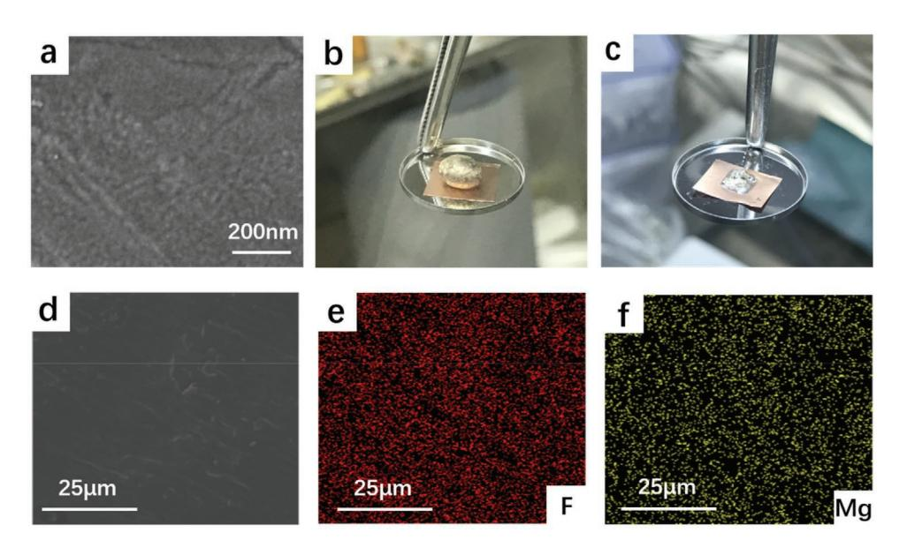
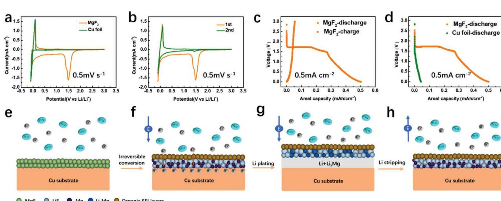
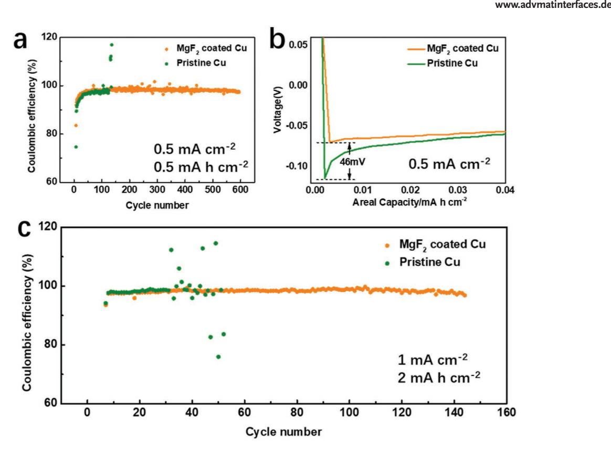
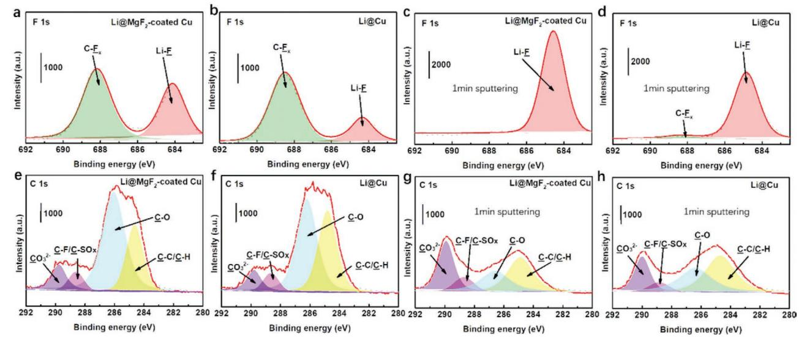
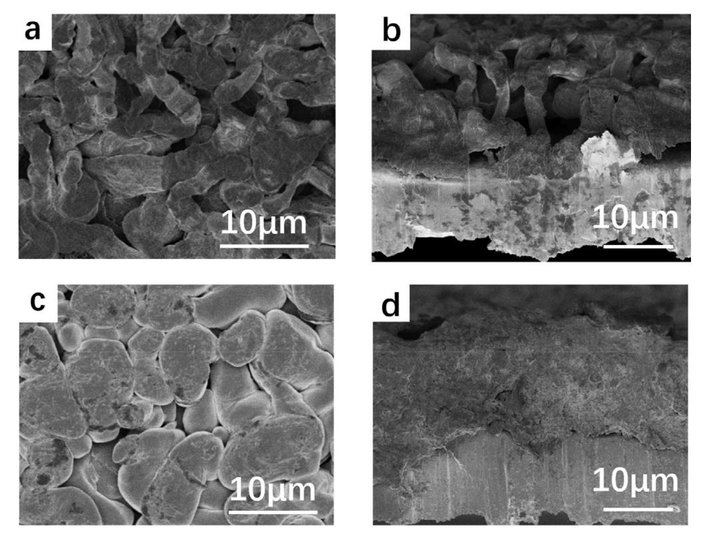
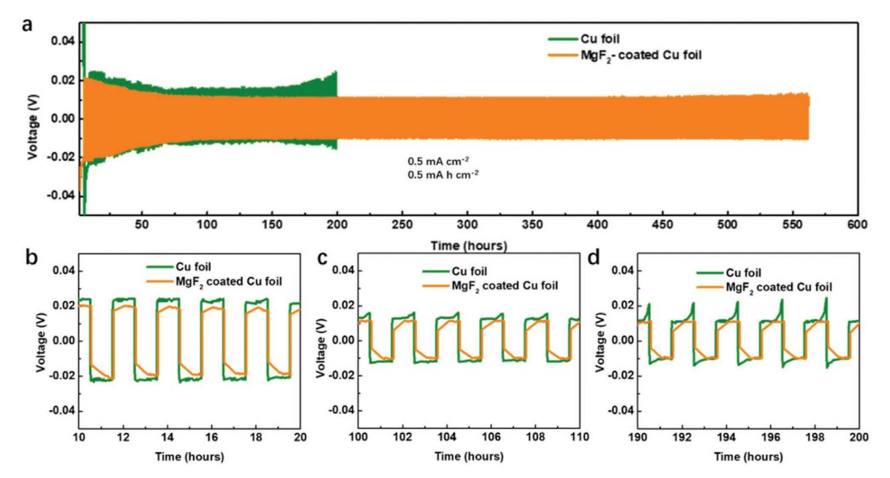

# **A New Strategy of Constructing a Highly Fluorinated Solid-Electrolyte Interface towards High-Performance Lithium Anode**

*Panlong Li, Wuliang Feng, Xiaoli Dong,\* Yonggang Wang, and Yongyao Xia\**

**Lithium fluoride (LiF)-rich solid-electrolyte interface (SEI) layers are reported as an effective method to suppress lithium dendrites growth and capacity fading for Li-plating/Li-stripping. Herein, a new pre-fluorination strategy is proposed by constructing an MgF2 thin film on pristine copper foil via the magnetron sputtering. This MgF2 film proves a lithiophilic substrate and shows highly irreversible conversion reaction to LiF in the first cycle. The resulting uniform LiF-rich dual-layered SEI layer helps homogenize lithium ions flux, and remaining magnesium metal particles help reduce the overpotential of lithium nucleation, which regulates the behavior of Li-plating/Li-stripping. As a result, the half-cells (with a fixed plating capacity of 0.5 mAh cm−2 at 0.5 mA cm−2 ) with the electrode after 3 min sputtering treatment show a long cycle life and a high average Coulombic efficiencies (98.3% for 600 cycles). This pre-fluorination strategy paves an effective and facile way for the application of lithium metal batteries.**

The electronic devices with long standby time require highenergy-density batteries.[1] Lithium (Li) metal batteries show a huge potential as the next-generation high-energy secondary batteries, because their anode material, Li metal anode, shows the highest theoretical capacity (3860 mAh g−1 ) and the lowest standard negative electrochemical potential (–3.04 V vs standard hydrogen electrode).[2] And alternative electrochemical secondary batteries based on the conversion reaction,[3] such as Li-S batteries,[4] Li-O2 batteries,[5] and Li-CO2 batteries,[6] have shown higher theoretical and practical capacities than traditional intercalation compounds-based batteries. Li metal is widely used as the anode material in these kinds of alternative batteries.[3] However, the practical application of Li metal anode faces tremendous challenges, such as the safety issues and the practical capacity fading, induced by the uncontrolled growth of lithium dendrite during cycling and the severe side reactions with the liquid electrolyte, respectively.[7]

E-mail: xldong@fudan.edu.cn; yyxia@fudan.edu.cn

The ORCID identification number(s) for the author(s) of this article can be found under https://doi.org/10.1002/admi.202000154.

**DOI: 10.1002/admi.202000154**

The solid-electrolyte interface (SEI) layer is considered a vital role in the protection of lithium metal anode and the regulation of Li plating and stripping behaviors.[8] Lots of chemical and physical methods have been proposed to construct an effective SEI layer on the surface of Li metal anode via in situ or ex situ techniques to tackle the problems of Li metal, such as the growth of lithium dendrites and the adverse side reactions with the liquid electrolytes.[9] A lithium fluoride (LiF)-rich SEI layer emerges as a promising protection layer on the lithium metal anode to regulate Li-plating/-stripping behaviors by suppressing the side reactions and achieving uniform lithium ion flux, so as to enhance the electrochemical performance and the security of lithium metal batteries.[10]

Towards the huge challenges of the practical application of lithium metal anode, various kinds of efforts have been made to construct a LiF-rich SEI layer on Li metal anode.[11] According to the most previous reports,[8a,12] these kinds of LiF-rich SEI layers generated through the chemical and electrochemical reactions between lithium metal anode and the components of liquid electrolytes,[13] such as fluorinated solvents,[14] additives,[15] and fluorinated anion of salts.[16] Physical coating methods,[17] such as atomic layer deposition,[18] molecular layer deposition,[19] and the magnetron sputtering,[20] were applied to construct the artificial SEI layers for the regulation of lithium plating and stripping behavior because of the excellent properties of these coating layers, such as the high homogeneity and the controllability. However, there are few reports about constructing a highly fluorinated SEI coating layer for lithium metal anode via these kinds of physical coating methods. Fortunately, it is worth noting that the magnetron sputtering has been proved an effective method to generate a uniform magnesium fluoride (MgF2) thin film,[21] and this method has been widely used for uniform optical coatings,[22] which means that MgF2 sputtering layers are highly homogeneous and the method of generating the uniform MgF2 thin coating films via the magnetron sputtering shows a great potential on building a highly fluorinated and uniformly distributed SEI layer for regulating Li-plating/-stripping behavior. Furthermore, it is widely reported that the naturally formed SEI on Li metal is made up with the inner inorganic layer and outer organic layer. The well-designed dual-layered SEI is able to protect Li metal and suppress Li-dendrite growth.[23]

P. L. Li, W. L. Feng, Dr. X. L. Dong, Prof. Y. G. Wang, Prof. Y. Y. Xia Department of Chemistry and Shanghai Key Laboratory of Molecular Catalysis and Innovative Materials, Institute of New Energy, iChEM (Collaborative Innovation Center of Chemistry for Energy Materials) Fudan University Shanghai 200433, China

Herein, we develop a new strategy to build a LiF-rich duallayered SEI layer by constructing an MgF2 thin film on pristine copper foil via the magnetron sputtering. It is found that this MgF2 thin film exhibits a good wettability with the molten lithium. Also, the MgF2 coating film is demonstrated to convert into a LiF-rich inner SEI layer during the process of discharge in the first cycle. This electrochemical conversion reaction shows high irreversibility in the first cycle and hardly any LiF will convert into MgF2 during the process of charge. We confirm the optimal MgF2 coating condition towards the excellent lithium plating and stripping performance. These magnesium metal particles induced by the highly irreversible conversion reaction will also help reduce the overpotential of lithium nucleation on the current collectors and regulate the behavior of lithium plating and stripping. This strategy of pre-fluorination on lithium anode shows a great potential on the practical application of lithium metal anodes.

The magnetron sputtering was applied to construct MgF2 thin film on the pristine Cu foil electrode. As shown in **Figure 1**, this MgF2 thin film on the pristine Cu foil electrode was characterized by scanning electron microscopy (SEM) and energy-dispersive spectroscopy (EDS) mapping. The high-magnification SEM image is shown in Figure 1a, and the surface of MgF2-coated Cu foil electrode (3 min sputtering) is nearly smooth without obvious particles, which indicates a uniform MgF2 thin film on the copper foil. However, when the sputtering time increased up to 15 min, extra MgF2 formed particles on the former produced MgF2 layer, as shown in Figure S1, Supporting Information. According to Figure S2a,b, Supporting Information, the photograph and enlarged view of MgF2-coated Cu foil show the difference of Cu foil with/ without MgF2 thin coating film. The round area was covered by a round nut during the magnetron sputtering process. Figure S3, Supporting Information, shows the corresponding SEM image of this round area.

Then, this MgF2-coated copper foil electrode was tested to confirm its wettability with the molten lithium in comparison with the pristine copper foil. As shown in Figure 1b,c, MgF2 treated copper foil displays better wettability with lithium metal, which would facilitate the nucleation process of lithium in the first cycle.[24] Further investigations were conducted to confirm the elemental composition and distribution of this sample via EDS mapping. As shown in Figure 1d–f, the distribution of fluorine and magnesium element is homogeneous. In addition, the EDS mapping sum spectrum is shown in Figure S4, Supporting Information, and the ratio of apparent concentration of Mg and F approaches to 1:2. These results indicate that magnetron sputtering can construct a uniform MgF2 thin film on the substrate of copper foil. This coating layer will induce the nucleation of lithium during the first cycle of lithium plating because of the wettability of MgF2 with lithium metal.

In order to illuminate the conversion process of MgF2 during discharge and charge process, an MgF2 electrode (MgF2 electrodes were obtained via the slurry (MgF2/carbon black conductive additive (Super P)/polyvinylidene fluoride (PVDF) = 8:1:1 coated on the copper foil) was used for cyclic voltammograms (CV) test and discharge/charge test with a Li metal plate as a reference and counter electrode, as shown in **Figure 2**a–d. According to Figure 2a,b, there is an obvious cathodic peak at around 1.5 V (vs Li+/Li) in the CV of the MgF2 electrode, but no anodic peak exists in the first cycle. In the second cycle, that cathodic peak decreases greatly, but still exists at around 1.5 V (vs Li+/Li). By contrast, the copper foil has no obvious cathodic and anodic peak at around 1.5 V (vs Li+/Li). Notably, the small cathodic peak below 1 V (vs Li+/Li) in the first cycle of the CV with MgF2 in Figure 2a can be attributed to the Li-Mg alloying process, which is well consistent with the potential clarified before.[25] The formed Li-Mg alloy would contribute to the low overpotential for lithium nucleation

$$
(MgF2 + 2Li+ + 2e- \rightarrow 2LiF + Mg)
$$
\n(1)

**Figure 1.** Characterization of MgF2-coated Cu foil. a) SEM images of MgF2-coated Cu foil. b,c) The wettability of molten Li onto b) pristine Cu foil and c) MgF2-coated Cu foil. d) SEM images of MgF2-coated Cu foil and e,f) the corresponding EDS-mapping images of MgF2-coated Cu foil.

**www.advancedsciencenews.com**

**Figure 2.** The electrochemical tests and the schematics of the irreversible conversion reaction of MgF2. a) The comparison of the CVs of MgF2 electrodes and pristine Cu foil electrode as working electrodes respectively, with lithium plates as reference and counter electrodes. b) The first and second cycles of the CVs of MgF2 electrodes as working electrodes with lithium plates as reference and counter electrodes. c) The profiles of the discharge/ charge of Li/MgF2 half cells. d) The comparison of profiles of the discharge of Li/MgF2 half cells and Li/Cu half cells. e–h) The schematic of the irreversible conversion reaction of MgF2 during the discharge/charge process.

These results indicate that the conversion reaction (Equation (1)) is completely irreversible. Also, the MgF2 thin film-coated copper foil (with a small quantity of MgF2) was tested by CV, and was also compared with pristine copper foil (as shown in Figure S5, Supporting Information), which is consistent in the MgF2 electrodes (with a large quantity of MgF2). Furthermore, the charge and discharge profiles of MgF2 electrode/Li half-cells and pristine copper foil/Li half-cells in the first cycle are compared in Figure 2c,d. According to Figure 2c, the high irreversibility of the conversion reaction (Equation (1)) is verified again. The limited charging capacity is related to the capacity of the carbon black conductive additive in the MgF2 electrode. Figure 2d shows the comparison of the discharge profiles of the MgF2 electrode and pristine copper foil, which is conductive to eliminating the influence of the copper foil.

According to these electrochemical testing results and previously reported dual-layered SEI model, a possible mechanism of MgF2-coated Cu foil electrode towards a high-performance lithium metal anode is illuminated in Figure 2e–h. In the etherbased liquid electrolyte, lithium ions migrate through the MgF2 thin film during the process of discharge in the first cycle, and lithium ions and MgF2 convert into LiF and Mg (Equation (1)) at around 1.5 V (Figure 2f), which is accompanied with the decomposition of electrolyte at around 1.6 V (Figure S5, Supporting Information). Consequently, a dual-layered SEI is formed with an outer organic layer and inner MgF2-induced inorganic layer. Then the reduction of lithium ions follows this conversion reaction (Equation (1)); lithium metal begins to deposit on the copper foil when lithium ions get electrons from the current collector (Figure 2g). During the process of lithium stripping, lithium metal turns into lithium ions, but LiF in the SEI layer still remains stable and unchanged (Figure 2h). As a result, a LiF-rich dual-layered SEI layer generates through this strategy of pre-fluorination via the magnetron sputtering. Due to the homogeneity of this MgF2 thin film via the magnetron sputtering, this in situ LiF-rich SEI layer is also uniform, which is expected to homogenize the lithium ions flux and regulate the behavior of lithium plating and stripping.

To verify the effect of this pre-fluorination strategy via the magnetron sputtering, the electrochemical performance of lithium plating and stripping on MgF2 thin film-coated Cu foil (named MgF2-coated Cu foil) and pristine Cu foil was studied in an ether-based electrolyte (1 mol L–1 lithium bis(trifluoromethanesulfonyl)imide (LiTFSI) and 2 wt% lithium nitrate (LiNO3) in 1:1 (by volume) 1,3-dioxolane (DOL)/1,2 dimethoxyethane (DME)), named 1 M electrolyte. The Li/MgF2 coated Cu foil and Li/Cu foil half-cells were tested on LAND CT2001A Battery Cycler (Wuhan, China) at a current density of 0.5 mA cm−2 with a fixed capacity of 0.5 mAh cm−2 . The corresponding results are shown in **Figure 3**a,b. The Coulombic efficiencies (CEs) of different electrodes with/without MgF2 sputtering treatment are compared in Figure 3a and Figure S6a, Supporting Information. According to Figure 3a, the electrode with 3 min sputtering shows a long cycle number and high average CE (98.3% for 600 cycles). By contrast, the pristine copper foil without sputtering treatment has a lower stable cycle number, less than 130 cycles, due to its short circuit induced by lithium dendrites, and its average CE is around 96.4% for 120 cycles. In addition, the electrode with 1 min sputtering treatment displays enhanced performance in comparison with the pristine copper foil (Figure S6a, Supporting Information). However, prolonging the sputtering time to 5 min has an adverse impact on the electrochemical performance of lithium plating and stripping, such as lower CE than the pristine copper foil. The corresponding discharge and charge profiles of Li/ MgF2-coated Cu foil (3 min sputtering) and Li/Cu foil half-cells in the first cycle are compared in Figure 3b, and Li/MgF2-coated Cu foil half-cells with different sputtering treatment are shown in Figure S6b, Supporting Information. The cells with electrodes of 3 min sputtering as working electrodes show the lower overpotentials of lithium nucleation and the lower, relatively stable voltage platform than the figure for the **www.advancedsciencenews.com**

**Figure 3.** The electrochemical performance of MgF2 thin film-coated Cu foil. a) CEs comparison of Li-plating/Li-stripping on MgF2-coated Cu foil electrodes with 3 min sputtering and the pristine Cu foil without treatment, tested by half-cells at 0.5 mA cm−2 with a plating capacity of 0.5 mAh cm−2. b) The comparison of the discharge/charge profiles of these electrodes on the first cycle of half-cell tests. c) CEs comparison of Li-plating/Li-stripping on different electrodes tested by half-cells at 1 mA cm−2 with a plating capacity of 2 mAh cm−2 .

pristine copper foil as working electrodes. To be more specific, the overpotentials of lithium nucleation on the pristine copper electrode is around –116 mV, while the figure for MgF2-modified copper electrode is 70 mV, which is 46 mV lower than those of pristine copper electrode. It is reasonable that thinner MgF2 films lead to lower overpotential of the lithium nucleation and stable voltage platform on the MgF2-coated copper foil. However, when prolonging the sputtering time to 5 min, the electrochemical performance of these cells sees an obvious attenuation, including the lower CE, and the higher overpotential of the lithium nucleation than those of the pristine copper foil. The similar results are observed when the fixed plating capacity and the current density of lithium deposited on the MgF2-coated Cu foil and the pristine Cu foil were increased up to 2 mAh cm−2 and 1 mA cm−2 , respectively (Figure 3c). As shown in Figure 3c, that half-cells with MgF2-coated Cu foils treated by 3 min sputtering as working electrodes show the longer lifespan, about 140 cycles. By contrast, the lifetime of the half-cells with the pristine Cu foils as working electrodes cycles stably less than 30 cycles due to the short circuit induced by dendrite growth. In addition, as shown in Figure S7, Supporting Information, the half-cell with MgF2-coated Cu foil treated by 5 min sputtering as a working electrode displays lower CEs than those of the pristine copper foil. This worse performance is attributable to the poor ionic conductivity of MgF2 and the possible schematic diagrams are shown in Figure S8, Supporting Information. Once the ionic conductivity of this MgF2

film is too high for lithium ions to cross, the existing cracks are the only accessible pathway for lithium ions to get electrons and convert into LiF and Mg metal particles. After that, more lithium ions become lithium metal, which is expected to form lithium dendrites because of the electrochemical inactivity of MgF2 bulks. As a result, long sputtering time would result in the high overpotential of lithium nucleation and low CEs, and a reasonable parameter of the sputtering thickness is quite crucial and necessary for MgF2 to convert into LiF-rich SEI layer. An optimal sputtering time was selected as 3 min with a fixed sputtering power of 100 W in the following experiments.

The electrochemical performance has proven that this MgF2 thin film-coated Cu foil displays higher CEs and longer lifetimes than the pristine copper foil. However, the nanoparticles induced by a conversion reaction are difficult to detect.[26] X-ray photoelectron spectroscopy (XPS) was conducted to confirm the component of the SEI layer and evaluate the influence of this pre-fluorinated strategy for stabilizing lithium metal anode. Also, argon sputtering was employed to obtain the depth profiles of the SEI layer. XPS results are shown in **Figure 4**. According to Figure 4a,b, there are two main peaks in the F1s spectrum, exhibiting at around 684.8 and 688.8 eV, attributed to LiF and CF*x*, respectively. It is evident that the deposited lithium on the MgF2-coated copper foil electrode shows stronger signal at the peak of LiF, indicating more LiF content in the SEI layer after pre-fluorinated treatment. Argon sputtering is projected to remove the organic contaminants on

**Figure 4.** XPS results of deposited lithium on MgF2-coated copper electrodes and pristine copper electrodes. F1s spectra of a) Li@ MgF2-coated Cu; b) Li@Cu; c) Li@ MgF2-coated Cu after 1 min argon sputtering; d) Li@Cu after 1 min argon sputtering. C1s spectra of e) Li@ MgF2-coated Cu; f) Li@ Cu; g) Li@ MgF2-coated Cu after 1 min argon sputtering; h) Li@Cu after 1 min argon sputtering.

the electrode, which facilitates to detect the depth profiles of the SEI layer. Figure 4c,d shows that LiF dominates the fluorinated content in the SEI layer after 1 min sputtering, MgF2-induced pre-fluorination results in a higher LiF content than the pristine copper electrode (which still contains the organic content (CF*x*)). As a result, a dual-layered is confirmed by above results. LiF dominates the content of the inner inorganic layer and MgF2 sputtering treatment greatly improves the content of LiF in the dual-layered SEI structure.

As shown in Figure 4e-h, C1s spectra exhibit four kinds of peaks for the electrodes with/without MgF2 treatment. It is found that the organic contents (such as CO and CC/CH) dominate the components of the SEI layer without argon sputtering, which is reasonable that there are some containments and remaining of the liquid electrolyte.[27] After 1 min sputtering (as shown in Figure 4g,h), the signals of CO and CC/ CH weaken, while the inorganic contents of CO3 2− (attributed to Li2CO3) obviously increase. According to some previous reports, the appropriate content of Li2CO3 is proved to be an effective component in the SEI and CEI for stabilizing between the electrode/electrolyte interface.[28] Moreover, Mg 1s spectrum is also detected, as shown in Figure S9, Supporting Information. There exists a very weak peak in the MgF2-modified sample after argon sputtering, which indicates that metallic Mg is dispersed in the inner inorganic layer as an alloy form of Li*x*Mg. Above results strongly prove the possible mechanism in Figure 2 and a LiF-rich dual-layered SEI structure induced by MgF2 coating.

Under this optimal sputtering time, SEM characterization was applied to characterize the morphologies of the deposited lithium with a fixed plating capacity of 2 mAh cm−2 at the current density of 1 mA cm−2 (**Figure 5**), so as to confirm the mechanism of this strategy. According to Figure 5a,b, the morphologies of lithium dendrites plated on the pristine copper foil are noodle-like (the top view in Figure 5a) and polyporous (the side view in Figure 5b). These porous structures deteriorate the problems of lithium dendrites, leading to a low CE and short lifespan. By contrast, the morphologies of lithium plated on the MgF2-coated Cu foil are almost dense (the top view in Figure 5c) and compact (the side view in Figure 5d), which quite differ from those on the pristine copper foil. These SEM images indicate that this LiF-rich SEI layer helps homogenize lithium ion flux and densify the morphologies of plated lithium.

Also, the cycling stability of Li-plating/Li-stripping behaviors on the MgF2 sputtering-treated electrodes was evaluated by symmetric cells in comparison with that of the pristine copper foil. Li-plating/Li-stripping behaviors of the pristine Cu foil and the MgF2-sputtering-treated Cu foil with pre-deposited Li (the fixed plating capacity is 2 mAh cm−2) are compared in the Li//Li@Cu foil and Li//Li@MgF2-coated Cu foil symmetric cells at the current density of 0.5 mA cm−2 with a fixed plating capacity of 0.5 mAh cm−2 (**Figure 6**). The voltage-time profiles in Figure 6 show that Li//Li@MgF2-coated Cu foil symmetric cells remain stable over 550 h, which is greatly longer than Li//Li@Cu foil symmetric cells (undergoing high overpotential induced by gradually increased internal resistance at 200 h). In addition, the stable overpotential of Li//Li@ MgF2-coated Cu foil symmetric cells (at around 11.4 mV) is lower than that of Li//Li@Cu foil symmetric cells (at around 16.1 mV). The cycling stability of lithium plating and stripping on MgF2-treated copper foil was further investigated in the Li@Cu/LiFePO4 cells and Li@MgF2-coated Cu/LiFePO4 cells, as shown in Figure S10, Supporting Information. A total of 2 mAh cm−2 of lithium (limited plated lithium) was pre-plated on these two kinds of electrodes (Cu foil and MgF2 coated Cu foil). The specific discharging capacities of Li@Cu/ LiFePO4 cells see a sharp drop at around 100 cycles, due to the complete depletion of lithium metal anode (Figure S10a, Supporting Information). By contrast, the figures for Li@Cu/ LiFePO4 cells remain relatively stable over 150 cycles. The charge/discharge profiles of these two cells in the first cycle are compared in Figure S10b. The CE of LiFePO4 cells is

**Figure 5.** SEM images of the morphologies of 2.0 mAh cm−2 lithium plating on the pristine Cu foil and MgF2 thin film (3 min sputtering) coated Cu foil. a) The top view of deposited lithium on the pristine Cu foil. b) The corresponding side view of lithium dendrites on the pristine Cu foil. c) The top view of deposited lithium on MgF2 thin film (3 min sputtering) coated Cu foil. d) The corresponding side view of dense deposited lithium on MgF2 thin film (3 min sputtering) coated Cu foil.

**Figure 6.** The symmetric cells test results. a) The voltage–time profiles of the Li-plating/Li-stripping are compared with a cycling capacity of 0.5 mAh cm−2 at 0.5 mA cm−2 in Li//Li@MgF2 thin film (3 min sputtering) coated Cu foil and Li//Li@ pristine Cu. b–d) The voltage–time profiles of (a) in an enlarged view of b) 10–20 h, c) 100–110 h, and d) 190–200 h.

**www.advmatinterfaces.de**

added and compared in Figure S11, Supporting Information, which indicated that LFP/Li@MgF2-coated Cu cells show more stable CEs than LFP/Li@Cu cells, especially after 100 cycles. The CEs' fluctuation of LFP/Li@Cu cells resulted from the Li depletion, which is consistent with the capacity degradation after 100 cycles in Figure S10a, Supporting Information. The first-cycle CE in Figure S10b, Supporting Information, is around 84.6% and 86.3% for LFP/Li@MgF2-coated Cu cells and LFP/Li@ Cu cells, respectively, resulting from the formation of CEI and SEI in the first cycle.

In summary, we demonstrate a new and effective pre-fluorination method to construct a highly fluorinated SEI layer through magnetron sputtering a uniform MgF2 thin film on copper (Cu) foil. First, this MgF2 thin film exhibits a good wettability with molten lithium, which would enhance the lithiophilic property of Cu foil. Second, the uniform LiF-rich dual-layered SEI layer induced by the highly irreversible conversion reaction (Equation (1)) can effectively help homogenize lithium ions flux and regulate the behavior of lithium plating and stripping. The remaining magnesium metal also contributes to reduce the overpotential of lithium nucleation. As a result, the half cells (a fixed plating capacity of 0.5 mAh cm−2 at the current density of 0.5 mA cm−2) with the electrode after 3 min sputtering treatment show a long cycle life and high average CE (98.3% for 600 cycles). Li//Li@MgF2-coated Cu foil symmetric cells remain stable over 550 h. XPS results indicate a LiF-rich dual-layered SEI layer with this pre-fluorination method. SEM images of the morphologies of lithium plating on the MgF2-coated Cu foil seem much dense and compact in comparison with those on the pristine Cu foil. This pre-fluorination strategy shows great potential on the application of lithium metal batteries.

#### **Experimental Section**

*The Preparation of MgF*2 *Thin Film-Coated Cu Foil*: 2 cm × 2 cm copper foils (the thickness is 10 µm) were washed by ethyl alcohol and then the magnetron sputtering was applied to deposit an MgF2 thin film on surface of copper foil. At a fixed sputtering power of 100 W, different sputtering time was set to control the thickness of MgF2 coating film.

*Cyclic Voltammograms Test*: MgF2 electrodes were obtained via the slurry (MgF2/Super P/PVDF = 8:1:1) coated on the copper foil (the areal mass loading is around 1.5 mg cm−2). BioLogic VSP-300 electrochemical workstation was used to obtain cyclic voltammograms of the conversion reaction of MgF2 by using MgF2 electrodes (12 mm in diameter) and the process of Li plating/stripping by using a copper foil disc (12 mm in diameter) as a working electrode, respectively, and a Li metal plate (12 mm in diameter) as a reference and counter electrode. The scan rate was 0.5 mV s−1 . All the separators used in this work were polypropylene separators with a diameter of 18 mm.

*Half-Cells Test (Li/Cu and Li/MgF*2*-Coated Cu)*: MgF2-coated Cu foil and Cu foil were assembled with a lithium metal as a counter electrode in the 2016-type coin cell, respectively. The electrolytes were 1 mol L−1 LiTFSI and 2 wt% LiNO3 in 1:1 (by volume) DOL/DME. The electrolyte was purchased from Xiaoyuan, Shanghai, China. The small current of 0.05 mA was set up at the first six cycles to remove the contaminants on the surface of the working electrodes and active the batteries.

*Symmetric Cells Test*: Symmetric cells were tested by Li@Cu and Li@ MgF2-coated Cu (Cu foil and MgF2-coated Cu foil with 2 mAh cm−2 of pre-deposited lithium) and lithium foil in the 2016-type coin cells. The cycling current density and capacity were set as 0.5 mA cm−2 and 0.5 mAh cm−2.

*Li@Cu/LiFePO*4 *Cells and Li@MgF*2*-Coated Cu/LiFePO*4 *Cells*: LiFePO4 (MTI, Hefei, China) (LiFePO4/Super P/PVDF = 7:2:1) on carbon-coated aluminum foil (the areal mass loading is around 1.5 mg cm−2) and Cu foil with pre-deposited lithium (2 mAh cm−2 ) were used as the cathode and anode, respectively, to fabricate the 2016-type coin cell. The electrolytes were 1 mol L−1 LiTFSI and 2 wt% LiNO3 in 1:1 (by volume) DOL/DME.

*Characterizations*: SEM images were obtained via a Nova NanoSem 450 instrument. XPS was applied to characterize the SEI layer of deposited-Li by using a XSAM800 Ultra Spectrometer. All the tested deposited-Li sample was cycled at a small current of 0.05 mA at 0–1 V (vs Li+/Li) in the first six cycles, in order to remove the contaminants on the surface of the working electrodes and active the batteries. Then, 2 mAh cm−2 of deposited-Li was plated on the electrode in the halfcell with a current density of 1 mA cm−2 . After that, the electrode with deposited-Li was disassembled from the cycled half-cells in the glove box, washed by DME pure solvent.

## **Supporting Information**

Supporting Information is available from the Wiley Online Library or from the author.

## **Acknowledgements**

This work was partially supported by the National Natural Science Foundation of China (21875045) and National Key Research and Development Plan (2016YFB0901500).

# **Conflict of Interest**

The authors declare no conflict of interest.

## **Author Contributions**

P.L.L. and W.L.F. contributed equally to this work. P.L.L. conceived the idea. P.L.L. and W.L.F. designed the experiment. Y.Y.X. and X.L.D. directed the project. Y.G.W. gave some advice about the manuscript. P.L.L. carried out the experiments of material characterization and electrochemical tests. W.L.F. conducted the magnetron sputtering and some characterization. The manuscript was written through contributions of all authors. All authors have given approval to the final version of the manuscript.

#### **Keywords**

lithium metal anodes, magnesium fluoride, magnetron sputtering, prefluorination, solid-electrolyte interfaces

> Received: January 27, 2020 Revised: February 28, 2020 Published online: April 24, 2020

[1] a) P. Simon, Y. Gogotsi, B. Dunn, *Science* **2014**, *343*, 1210; b) E. Pomerantseva, F. Bonaccorso, X. Feng, Y. Cui, Y. Gogotsi, *Science* **2019**, *366*, eaan8285.

[2] a) Y. Guo, H. Li, T. Zhai, *Adv. Mater.* **2017**, *29*; b) H. Yu, J. Xie, N. Shu, F. Pan, J. Ye, X. Wang, H. Yuan, Y. Zhu, *Research* **2019**, *2019*, 9129457.

**www.advancedsciencenews.com**

- [3] X. Liang, Q. Pang, I. R. Kochetkov, M. S. Sempere, H. Huang, X. Sun, L. F. Nazar, *Nat. Energy* **2017**, *2*, 17119.
- [4] Q. Pang, X. Liang, C. Y. Kwok, L. F. Nazar, *Nat. Energy* **2016**, *1*, 16132.
- [5] Q. C. Liu, J. J. Xu, S. Yuan, Z. W. Chang, D. Xu, Y. B. Yin, L. Li, H. X. Zhong, Y. S. Jiang, J. M. Yan, X. B. Zhang, *Adv. Mater.* **2015**, *27*, 5241.
- [6] X. W. Mu, H. Pan, P. He, H. S. Zhou, *Adv. Mater.* **2019**, [https://doi.](https://doi.org/10.1002/adma.201903790) [org/10.1002/adma.201903790.](https://doi.org/10.1002/adma.201903790)
- [7] H. Yang, C. Guo, A. Naveed, J. Lei, J. Yang, Y. Nuli, J. Wang, *Energy Storage Mater.* **2018**, *14*, 199.
- [8] a) N. von Aspern, G. V. Roschenthaler, M. Winter, I. Cekic-Laskovic, *Angew. Chem., Int. Ed.* **2019**, *58*, 15978; b) X. Q. Zhang, X. B. Cheng, Q. Zhang, *Adv. Mater. Interfaces* **2018**, *5*, 1701097.
- [9] a) Y. M. Lee, N.-S. Choi, J. H. Park, J.-K. Park, *J. Power Sources* **2003**, *119–121*, 964; b) Q. Yang, M. Cui, J. Hu, F. Chu, Y. Zheng, J. Liu, C. Li, *ACS Nano* **2020**, *14*, 1866.
- [10] a) D. Lin, Y. Liu, W. Chen, G. Zhou, K. Liu, B. Dunn, Y. Cui, *Nano Lett.* **2017**, *17*, 3731; b) J. Hu, K. Chen, C. Li, *ACS Appl. Mater. Interfaces* **2018**, *10*, 34322; c) Q. Yang, C. Li, *Energy Storage Mater.* **2018**, *14*, 100.
- [11] a) X. Q. Zhang, X. Chen, R. Xu, X. B. Cheng, H. J. Peng, R. Zhang, J. Q. Huang, Q. Zhang, *Angew. Chem., Int. Ed.* **2017**, *56*, 14207; b) X. Shen, Y. Li, T. Qian, J. Liu, J. Zhou, C. Yan, J. B. Goodenough, *Nat. Commun.* **2019**, *10*, 900.
- [12] L. Suo, W. Xue, M. Gobet, S. G. Greenbaum, C. Wang, Y. Chen, W. Yang, Y. Li, J. Li, *Proc. Natl. Acad. Sci. USA* **2018**, *115*, 1156.
- [13] a) X. Zhang, Q. Zhang, X. G. Wang, C. Wang, Y. N. Chen, Z. Xie, Z. Zhou, *Angew. Chem., Int. Ed.* **2018**, *57*, 12814; b) F. Li, Y.-H. Tan, Y.-C. Yin, T.-W. Zhang, L.-L. Lu, Y.-H. Song, T. Tian, B. Shen, Z.-X. Zhu, H.-B. Yao, *Chem. Sci.* **2019**, *10*, 9735; c) Y. X. Yuan, F. Wu, G. H. Chen, Y. Bai, C. Wu, *J. Energy Chem.* **2019**, *37*, 197.
- [14] a) Z. Zeng, V. Murugesan, K. S. Han, X. Jiang, Y. Cao, L. Xiao, X. Ai, H. Yang, J.-G. Zhang, M. L. Sushko, J. Liu, *Nat. Energy* **2018**, *3*, 674; b) G. Salitra, E. Markeyich, M. Afri, Y. Talyosef, P. Hartmann, J. Kulisch, Y.-K. Sun, D. Aurbach, *ACS Appl. Mater. Interfaces* **2018**, *10*, 19773.
- [15] a) F. Ding, W. Xu, G. L. Graff, J. Zhang, M. L. Sushko, X. Chen, Y. Shao, M. H. Engelhard, Z. Nie, J. Xiao, X. Liu, P. V. Sushko, J. Liu, J. G. Zhang, *J. Am. Chem. Soc.* **2013**, *135*, 4450; b) S. S. Zhang, *Electrochim. Acta* **2012**, *70*, 344.
- [16] a) L. Suo, Y. S. Hu, H. Li, M. Armand, L. Chen, *Nat. Commun.* **2013**, *4*, 1481; b) P. Li, C. Li, Y. Yang, C. Zhang, R. Wang, Y. Liu, Y. Wang,

J. Luo, X. Dong, Y. Xia, *Research* **2019**, *2019*, 7481319; c) F. Qiu, X. Li, H. Deng, D. Wang, X. Mu, P. He, H. Zhou, *Adv. Energy Mater.* **2019**, *9*, 1803372.

- [17] W. Wang, X. Yue, J. Meng, J. Wang, X. Wang, H. Chen, D. Shi, J. Fu, Y. Zhou, J. Chen, Z. Fu, *Energy Storage Mater.* **2019**, *18*, 414.
- [18] A. C. Kozen, C.-F. Lin, O. Zhao, S. B. Lee, G. W. Rubloff, M. Noked, *Chem. Mater.* **2017**, *29*, 6298.
- [19] Y. Zhao, L. V. Goncharova, Q. Sun, X. Li, A. Lushington, B. Wang, R. Li, F. Dai, M. Cai, X. Sun, *Small Methods* **2018**, *2*, 1700417.
- [20] L. Fan, H. L. Zhuang, L. Gao, Y. Lu, L. A. Archer, *J. Mater. Chem. A* **2017**, *5*, 3483.
- [21] P. J. Kelly, R. D. Arnell, *Vacuum* **2000**, *56*, 159.
- [22] a) R. De, S. M. Haque, S. Tripathi, C. Prathap, K. D. Rao, N. K. Sahoo, in *Dae Solid State Physics Symposium 2015*, Vol. 1731 (Eds: R. Chitra, S. Bhattacharya, N. K. Sahoo), American Institute of Physics, Melville, NY **2016**; b) J. Mashaiekhy, Z. Shafieizadeh, H. Nahidi, I. Hadi, *Optik* **2013**, *124*, 3957.
- [23] a) Y. Zhao, M. Amirmaleki, Q. Sun, C. Zhao, A. Codirenzi, L. V. Goncharova, C. Wang, K. Adair, X. Li, X. Yang, F. Zhao, R. Li, T. Filleter, M. Cai, X. Sun, *Matter* **2019**, *1*, 1215; b) C. Yan, X.-B. Cheng, Y. Tian, X. Chen, X.-Q. Zhang, W.-J. Li, J.-Q. Huang, Q. Zhang, *Adv. Mater.* **2018**, *30*, 1707629.
- [24] a) S. H. Wang, J. Yue, W. Dong, T. T. Zuo, J. Y. Li, X. Liu, X. D. Zhang, L. Liu, J. L. Shi, Y. X. Yin, Y. G. Guo, *Nat. Commun.* **2019**, *10*, 4930; b) Y. Gu, H. Y. Xu, X. G. Zhang, W. W. Wang, J. W. He, S. Tang, J. W. Yan, D. Y. Wu, M. S. Zheng, Q. F. Dong, B. W. Mao, *Angew. Chem., Int. Ed.* **2019**, *58*, 3092; c) K. Yan, Z. Lu, H.-W. Lee, F. Xiong, P.-C. Hsu, Y. Li, J. Zhao, S. Chu, Y. Cui, *Nat. Energy* **2016**, *1*.
- [25] Z. Shi, M. L. Liu, D. Naik, J. L. Gole, *J. Power Sources* **2001**, *92*, 70.
- [26] a) P. Poizot, S. Laruelle, S. Grugeon, L. Dupont, J. M. Tarascon, *Nature* **2000**, *407*, 496; b) F. Wang, H. C. Yu, M. H. Chen, L. Wu, N. Pereira, K. Thornton, A. Van der Ven, Y. Zhu, G. G. Amatucci, J. Graetz, *Nat. Commun.* **2012**, *3*, 1201; c) W. Fu, E. Zhao, Z. Sun, X. Ren, A. Magasinski, G. Yushin, *Adv. Funct. Mater.* **2018**, *28*, 1801711; d) X. Hua, R. Robert, L.-S. Du, K. M. Wiaderek, M. Leskes, K. W. Chapman, P. J. Chupas, C. P. Grey, *J. Phys. Chem. C* **2014**, *118*, 15169.
- [27] J. Zheng, M. H. Engelhard, D. Mei, S. Jiao, B. J. Polzin, J.-G. Zhang, W. Xu, *Nat. Energy* **2017**, *2*.
- [28] a) W. Zhao, J. Zheng, L. Zou, H. Jia, B. Liu, H. Wang, M. H. Engelhard, C. Wang, W. Xu, Y. Yang, J.-G. Zhang, *Adv. Energy Mater.* **2018**, *8*, 1800297; b) C. R. Jarvis, M. J. Lain, M. V. Yakovleva, Y. Gao, *J. Power Sources* **2006**, *162*, 800.

**www.advmatinterfaces.de**