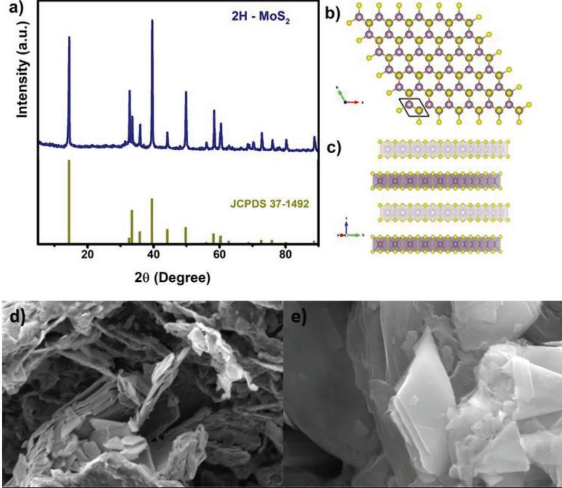
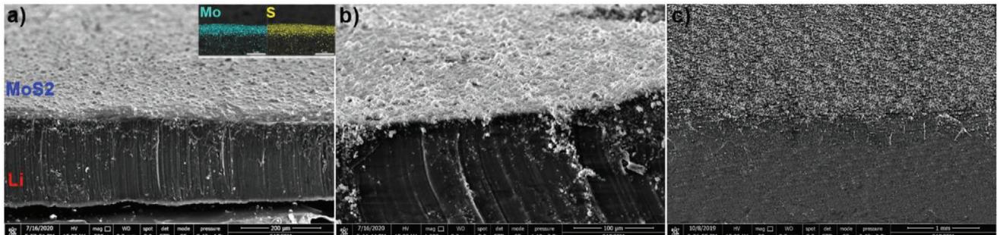
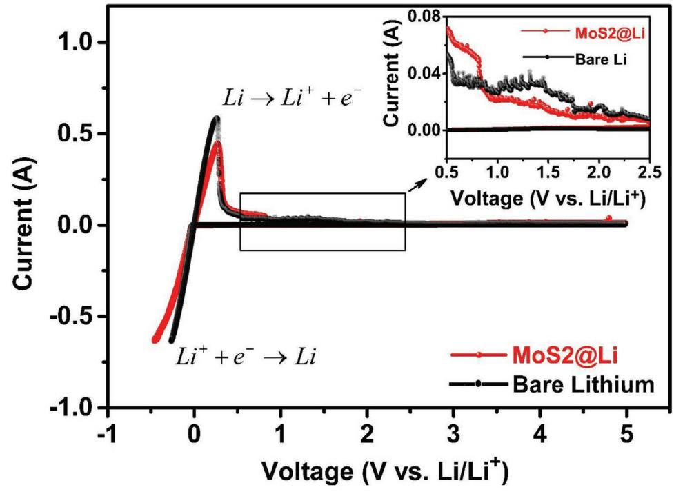
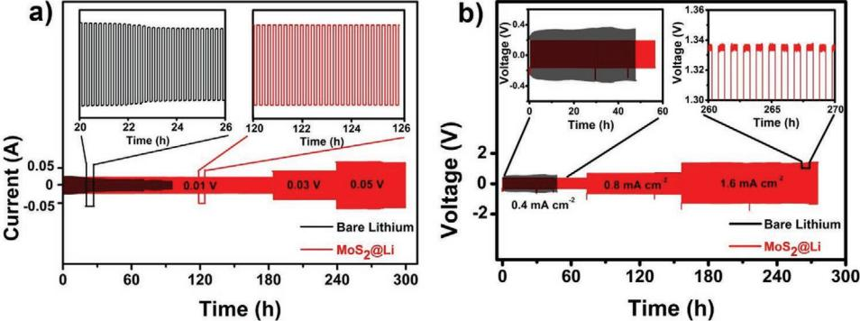
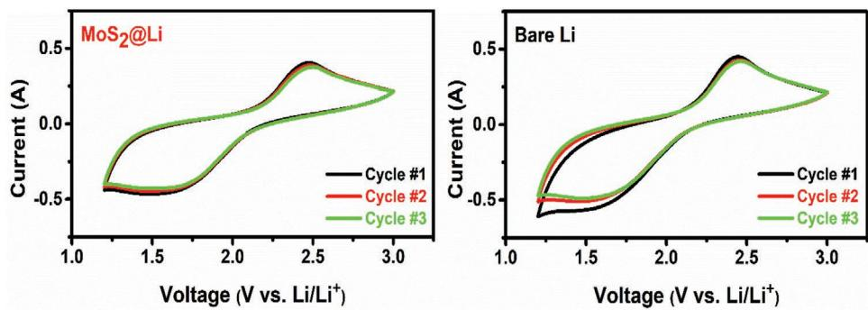
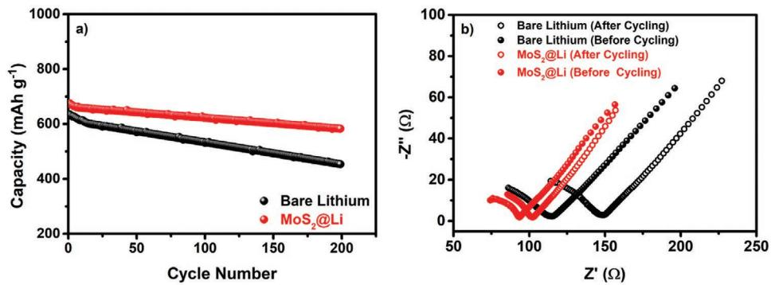

# **2H-MoS2 as an Artificial Solid Electrolyte Interface in All-Solid-State Lithium–Sulfur Batteries**

*Abdulkadir Kızılaslan,\* Tuğrul Çetinkaya, and Hatem Akbulut*

**All-solid-state lithium-ion batteries are considered the next-generation energy storage systems. However, certain problems arise from the degradation of anode–electrolyte interface hindering their use especially when lithium is used as an anode. Herein, lithium metal anode surface is modified by an artificial 2H-MoS2 layer to prevent the contact between highly reactive lithium and solid electrolyte without sacrificing the lithium ion transport. The stabilization of the electrode/electrolyte interface is attributed to the electrochemical stability of the 2H-MoS2 layer. Besides, high ionic conductivity and selective sieving nature of layered MoS2 neither prevents the electrochemical reactions nor increases the total impedance of the cell. Electrochemical stability of the electrode/electrolyte interface is shown by long-term chronoamperometry and chronovoltammetry tests. By stabilizing electrode/electrolyte interface, initial and final discharge capacities of 675.8 and 584.1 mAh g−1 , respectively, is obtained at 0.4 mA cm−2 current density in MoS2@Li/ Li7P3S11/S. After 200 cycles, discharge capacity fade is obtained as 13.58% and 27.3% for the cells assembled with MoS2@Li and bare Li anodes, respectively.**

### **1. Introduction**

The use of fossil fuels and accompanied environmental problems triggered the scientific studies to build new energy storage systems. Lithium-ion batteries (LIBs) are considered the most prominent alternatives to replace the use of fossil fuels on vehicles. As we approach to the theoretical capacity limits of LIBs, lithium–sulfur batteries emerged as new potential energy storage system with their theoretical energy density of 2500 Wh kg−1 . [1–3]

Dr. A. Kızılaslan, Dr. T. Çetinkaya, Prof. H. Akbulut Metallurgy and Materials Science Department Sakarya University Esentepe Campus, Sakarya 54187, Turkey E-mail: akizilaslan@sakarya.edu.tr Dr. A. Kızılaslan, Dr. T. Çetinkaya, Prof. H. Akbulut Development and Application Center (SARGEM) Sakarya University Esentepe Campus, Sakarya 54187, Turkey Dr. T. Çetinkaya, Prof. H. Akbulut NESSTEC Energy & Surface Technology A.S. Technology Development Zones Sakarya University Sakarya, Turkey The ORCID identification number(s) for the author(s) of this article can be found under https://doi.org/10.1002/admi.202001020.

**DOI: 10.1002/admi.202001020**

Regardless of the battery type, Li-ion (sulfur) or Li-O2, it is rational to consider the lithium metal as the anode material in these batteries due to several aspects. First, it is the lightest solid (0.534 g cm−3 ) in the whole periodic table and has the lowest electrode potential with −3.04 V.[4,5] Second, as a pure lithium source, an intercalation or conversion reaction media is not necessarily required in batteries with lithium anodes. Overall, lithium metal has a theoretical specific capacity of ≈3860 mAh g−1 . [4] However, many problems arising from the highly reactive nature of lithium metals, namely; 1) uncontrollable dendrite formation during lithium deposition\dissolution and 2) unstable solid-electrolyte interface (SEI) layer formation, restricts its use in secondary batteries.

All-solid-state LIBs (ASSLIBs) are now emerging systems to replace LIBs with

liquid electrolytes and are free of the aforementioned problems in certain aspects. Solid-electrolytes were shown to greatly suppress the formation of lithium dendrites. However, the formation of an unstable SEI layer still exists in ASSLIBs. Although solid electrolytes with lithium-ion conductivity on the order of liquid electrolytes have been synthesized,[6–9] their adaption into a cell with lithium anode is hindered due to the formation of unstable SEI layer. A stable SEI layer has to meet several criteria. First, an SEI layer has to be composed of electronically (ionically) insulating (conducting) phases. Besides, the layer should be thin and dense enough so that the total impedance of the system does not increase due to the low ionic conductivity of the layer.

Unfortunately, only a few numbers of solid electrolytes exist that satisfies the above mentioned criteria. One plausible way to avoid the self-formation of the unstable SEI layer is to coat the lithium anode with the phases having desired properties. By coating lithium anode; 1) the contact between anode and electrolyte can be increased due to better wetting, 2) dendrite formation can be eliminated, and 3) electrolyte decomposition can be prevented. Li3N coating was shown to increase capacity retention in our previous study.[10] However, the small grain sizes (<160 nm), and weak interconnection is not capable of suppressing Li metal dendrites for long cycles.[11] Moreover, the voltage stability window of Li3N is only ≈0.45 V and unstable to reduction (≤2.4 V vs Li/Li+) which is low for practical applications.[12] An ultrathin Al2O3 layer was shown to increase the wetting and electrochemical stability of the garnet-type solid

electrolyte.[13,14] Similarly, a thin LiPON layer on lithium anode effectively prevented the formation of lithium dendrites even at high currents.[15]

2D materials, especially transition metal dichalcogenides (TMDCs) are attractive materials in the synthesis of advanced functional materials.[16–19] Among TMDCs, molybdenum disulfide (MoS2) has attracted much interest in recent studies as an anode material for LIBs to replace graphite anode due to the high capacity of 670 mAh g−1 . [20–23] Besides, MoS2 and its derivatives are utilized in different forms of energy storage systems.[24–26] As similar to graphite, MoS2 has a layered structure of covalently bonded MoSMo units into a hexagonal lattice. The large interlayer distance of 0.62 nm (0.34 nm in graphite) facilitates the fast lithium ion diffusion in the structure.[27,28] Moreover, theoretical studies reveal that unlike graphene where lithium ions strongly bind to defects, lithium ions loosely adsorb onto MoS2 defects and lithium-ion diffusion does not hinder.[29–31] The diffusion energy barrier was calculated in the range of 0.21–0.29 eV in different studies[32,33] and Shuai et al. showed that the diffusion kinetics of MoS2 can be controlled by the adjustment of its layer spacing.[34] As a challenge to utilize MoS2 as an anode in LIBs, MoS2 is a poor electrical conductive material. In fact, many studies were focused on to increase the conductivity of MoS2. [35–37] However, as an artificial SEI layer, the poor electronic conductivity of MoS2 is an asset once sufficient ionic conductivity ensured thorough adjusting the thickness of the layer. MoS2 is also utilized as lithium ion conductive membrane in LIBs with liquid electrolytes, thanks to their selective ion transport characteristics.[38–41] Recently, Cha et al. have utilized 10 nm thick 2D MoS2 as a protective layer for lithium metal anodes in liquid based lithium sulfur batteries and reported that MoS2 provides good adhesion on the surface of lithium metal and enhance the Li+ transport and conductivity.[42] Similarly, Yao et.al.[43] used bilayer solid electrolyte to avoid the reaction between the highly reactive lithium anode and solid electrolyte. Although many attempts to utilize protective layers in LIBs with liquid electrolyte systems have been carried out, the analysis of such layers in ASSLIBs is still in its infancy. Besides, studies reported in the literature are utilized thin film coating techniques that are hard to be scaled up for mass production and not cost effective.

In this study, we report a facile coating of MoS2 onto lithium anode as an artificial SEI layer in ASSLIBs and evaluation of the electrochemical performance of the cells assembled with bare and MoS2 coated lithium. By utilizing the selective sieving and highly stable nature of MoS2, the layer is expected to prevent the degradation of solid electrolyte and corrosion of lithium anode through preventing the contact between the anode and solid electrolyte. Highly ionic conductive Li7P3S11 and sulfur based composite cathode were utilized as solid electrolyte and cathode, respectively in this study.

### **2. Results and Discussion**

The phase analysis of the coating on the lithium surface was performed using XRD analysis. **Figure 1**a displays the XRD analysis result of the coating layer. The layer crystallizes in 2H-MoS2 with a highly crystalline nature in P63/mmc [194]

symmetry where the atomic structure of the phase is given in Figure 1b,c. The structure has one layer of Mo that is sandwiched between two layers of S which is known as the most stable polymorph of MoS2 phases. The layers are connected to each other thorough weak Van der Waals interactions and expected to supply paths for lithium ion diffusion. The distance between the layers (0.62 nm) is approximately twice as much as the distance in graphite so that lithium ion movement between the layers is expected to be much easier compared to graphite. Low and high magnification field emission scanning electron microscope (FESEM) image of exfoliated 2H-MoS2 is shown in Figure 1d,e. It is obvious that MoS2 structure was exfoliated successfully and flake size was altered between 1 and 4 µm.

Structural analysis of MoS2 layer on lithium anode was carried out by FESEM, and the corresponding cross section images are given in **Figure 2**a,b at low and high magnifications with a 5° tilt angle. A thin layer of MoS2 is observed on the surface. Oxides are formed on the cross section due to the transfer of lithium chip from the glovebox to the chamber of electron microscopy. The homogeneous distribution of the MoS2 layer on lithium chip is also shown at higher magnification in Figure 2b where the oxides are more obvious in the cross section.

Figure 2c displays the surface of the lithium chip partially coated with MoS2 layer. The thickness of the coating layer was measured as 2.0 µm. Considering the overall impedance of the cell, the coating layer has to be thin and uniform to prevent local impedance arising due to the uneven coating. In fact, unlike LIBs with liquid electrolytes, extremely thin layers formed by thin film coating techniques is hard to be utilized in ASSLIBs due to their vulnerability under the operating pressure of these cells.

**Figure 3** displays the cyclic voltammetry (CV) curves of the asymmetric Li/Li7P3S11/stainless steel (SUS) and MoS2@Li/ Li7P3S11/SUS cells in the potential range of −0.5–5 V (vs Li/Li+). A wide electrochemical window of 5 V was measured in both cells with lithium ion stripping and deposition reactions observed at 0.27 V and just below 0 V, respectively. No reaction was detected between MoS2 and Li during the anodic and cathodic sweep, attributed to the stable interface behavior of 2D MoS2. However, a close look at the CV curves indicates that there is a large fluctuation in the current in bare-lithium compared to MoS2@Li. Such fluctuations in the current demonstrate that the compatibility between lithium and solid electrolyte was increased by MoS2 coating. Such small fluctuations in the current would inevitably deteriorate the stability between electrode and electrolyte in long cycles.[44] So that batteries expected to operate long times have to be constructed with elements having stable interfaces.

In fact, electrochemical window analyses conducted by CV tests can just barely catch the reactions that stands for the degradation of the interfaces due to the fast scan rates.[45] Therefore, in order to check the stability of the electrode/electrolyte interface, we have constructed symmetric Li/Li7P3S11/Li and MoS2@ Li/Li7P3S11/MoS2@Li cells. Long term chronoamperometry scan at different voltages was carried out. **Figure 4**a displays the long time span current response of the symmetric cells at a constant voltage. Fade in the current over time is attributed to the incompatibility in the electrode/electrolyte interface. In fact,

**Figure 1.** a) XRD analysis of exfoliated 2H-MoS2, b) basal plane view, c) *c*-axis view of 2H-MoS2 crystal structure (sulfur and molybdenum are depicted in yellow and blue colors, respectively), d) low, and e) high magnification SEM images of exfoliated 2H-MoS2 layers.

Wenzel et al. characterized the interface where the formation of Li2S and P2S5 due to the degradation of Li7P3S11 was shown by XPS analysis.[46] In Li2S-P2S5-MS2 (M: Ge, Sn, and Si) systems, this phenomenon is even more severe due to the reduction of solid electrolyte in contact with lithium anode.[47] However, in MoS2@Li current response to the applied voltage even at 30 and 50 mV is stable over a longer time span which testifies the compatibility between the interfaces Li/MoS2 and MoS2/ Li7P3S11. Steady-state current at 0.01 V is higher in MoS2 coated system, which is attributed to less resistance for Li depositing and stripping at the interface.[48]

The compatibility between the electrode/electrolyte interface was further demonstrated by chronovoltammetry analysis at increasing current densities as shown in Figure 4b. Symmetric Li/Li7P3S11/Li and MoS2@Li/Li7P3S11/MoS2@Li cells were repeatedly charged and discharged at different current densities. The polarization voltage of bare lithium is higher compared to MoS2@Li which shows the incompatibility of Li/Li7P3S11 interface.[49] However, in MoS2@Li, the polarization curves are stable over time even at higher current densities of 1.6 mA cm−2. Further increase in current densities leads to fluctuations in the polarization curves which show the

**Figure 2.** MoS2 layer on lithium chip from cross section a) low magnification with EDS map analysis in the inset, b) high magnification, and c) MoS2 layer on lithium chip surface. (Scale bars: 200 µm, 100 µm and 1 mm for image (a), (b), and (c), respectively).

**Figure 3.** CV analysis of MoS2@Li/Li7P3S11/SUS and Li/Li7P3S11/SUS cells.

deterioration of electrode/electrolyte interface in the MoS2@Li system.

To check the effect of MoS2 coating on the electrochemical performance of the cell, CV analysis was carried out to characterize electrochemical reactions and corresponding voltages in which the reactions take place. **Figure 5** displays the CV analysis of the batteries in which bare lithium and MoS2 coated lithium were utilized as an anode. In all-solid-state lithium sulfur batteries, the reactions governing the electrochemical behavior of the cell is known to be different than lithium–sulfur batteries with liquid electrolytes.[50,51] On the cathodic scan, one reduction peak at around 1.75 V was observed which stands for the reduction of S8 into Li2S where the corresponding reaction was observed in anodic scan at around 2.4 V which is due to oxidation of Li2S reverse back into S8. The overall reaction governing all-solid-state lithium-sulfur batteries was confirmed as S + 2Li+ + 2e− ↔ Li2S. Besides, the overlap of the curves represents the cyclic stability of the systems. The cell assembled with the MoS2@Li as anode is expected to preserve the capacity for longer cycles and experience less capacity fade upon cycling.

Galvanostatic charge–discharge tests were conducted at the current density of 0.4 mA cm−2 for 200 cycles to test the cycling stability of the cells with and without MoS2 coating on lithium anode. **Figure 6** displays the cycling profiles of the cells in the voltage range of 1.2–3 V. Cell assembled with MoS2 coating displays an initial discharge capacity of 675.8 mAh g−1 and after 200 cycles capacity fade was measured as 13.58%. However, in the cell assembled with bare lithium anode, the capacity loss after 200 cycles was 27.3%. Our results indicate the stabilization of lithium/Li7P3S11 interface thorough an artificial MoS2 layer which prevents the degradation of the solid electrolyte and lithium anode.

**Figure 4.** a) Chronoamperometry analysis of symmetric cells assembled with bare lithium and MoS2@Li as anode at different voltages and b) chronovoltammetry analysis of symmetric cells assembled with bare lithium and MoS2@Li as anode at different current densities.

**Figure 5.** CV analysis of all solid state a) MoS2@Li/Li7P3S11/S and b) Li/Li7P3S11/S cells.

**Figure 7**a displays the discharge capacity of the cells upon cycling. Discharge capacity was shown to more stable in the cell assembled with MoS2 coating and the capacity loss in the cell with bare lithium anode is evident. The impedance spectra of the cells were measured and the results are shown in Figure 7b. The Nyquist plots for both cells display an incomplete semicircle in the high frequency region and a linear spike at the low frequency region as common in all-solid-state batteries with sulfur based solid electrolytes. The intercept between the real part of the impedance plot and linear spike stands for the total impedance of the cell arising from the charge transfer resistance and interface resistance due to anode–electrolyte contact. Nyquist plots show that the total impedance of the cell is lower in the cell with MoS2 coating and the increase in the total impedance of the cell is reduced. However, in the cell assembled with a bare lithium anode, the total resistance of the cell increases substantially possibly due to the formation of a layer composed of Li2S and Li3P phases as Li7P3S11 decomposed.[46,52] Continuous increase in the thickness of the SEI layer due to the degradation of solid electrolytes would inevitably increase the total impedance of the cell as evidenced in the cell assembled with bare lithium anode.

# **3. Conclusion**

In summary, lithium anode surface has been modified with MoS2 via a facile coating route. Noticeably, the electrochemical performance of the cell assembled with MoS2 layer on the anode surface was increased. The increased electrochemical performance was attributed to the stabilization of the electrode/electrolyte interface as verified by chronoamperometry and chronovoltammetry tests. Besides, the coating layer was also shown to neither prevents the electrochemical reactions of the cell nor increases the total impedance of the cell due to the ionic conductive nature of the layer. By constructing an all-solid-state lithium sulfur battery with MoS2 coating layer on lithium surface, we have obtained initial and final discharge capacities of 675.8 and 584.1 mAh g−1 with 13.58% capacity fade after 200 cycles. Same analysis yields a 27.3% capacity loss in the cell assembled with bare lithium anode. Our results demonstrate the significant effect of solid electrolyte interface on the electrochemical performance of the cell and serve a facile synthesis route to prevent the degradation of anode and electrolyte in all-solid-state batteries by imposing an artificial layer using 2D MoS2 nanosheets between anode and electrolyte.

# **4. Experimental Section**

Synthesis of solid electrolyte used in this study was reported in the previous study.[10] Phase analysis of MoS2 coating was carried out by Rigaku D/MAX 2000 type X-ray spectrometer with Cu K*α* radiation between 5° and 90° with 1° min−1 scan rate. The morphology and elemental mapping of the MoS2 coating were observed with an FESEM (FEI Quanta FEG 450).

2D MoS2 was exfoliated using the electrochemical intercalation of Li+ according to the previous study.[53] Briefly, a MoS2 pellet prepared from MoS2 powders used as working electrode, Pt mesh was counter electrode, Ag wire was the reference electrode, and 1m LiClO4 dissolved in ethylene carbonate and dimethyl carbonate mixture (1:1 based on volume) was used as an electrolyte for electrochemical exfoliation process. The electrochemical lithiation process was performed by chronoamperometry technique at −4.5 V potential for 3 h. The Li

**Figure 6.** Galvanostatic charge–discharge analysis of all solid state a) MoS2@Li/Li7P3S11/S and b) Li/Li7P3S11/S cells.

**Figure 7.** Cycle analysis of all solid state a) MoS2@Li/Li7P3S11/S and Li/Li7P3S11/S cells and, b) Nyquist plots for MoS2@Li/Li7P3S11/S and Li/Li7P3S11/S cells before and after galvanostatic cycling.

intercalated MoS2 pellet was then immediately immersed into DI water to exfoliate MoS2 layers while the Li+ transform into LiOH. The obtained MoS2 aqueous suspension was first washed with *n*-hexane and then with water to remove organic impurities. Finally, exfoliated 2D MoS2 product was obtained after filtering the suspension.

Typically, 2 mg exfoliated MoS2 with 2H structure was then spread onto lithium chip (ø16 mm) and pasted by rubbing with a cotton bar. After a homogeneous layer was obtained, further analysis on the homogeneity of the coating layer was verified by FESEM analysis.

Sulfur based cathode synthesis was carried out by melt-diffusion method. Sublimed sulfur and graphene (4:1 wt%) were initially mixed in an agate mortar and heat treated at 155 °C for 10 h in a sealed glass jar to melt and diffuse sulfur into graphene. Obtained graphene/sulfur composite was then mixed with carbon black and Li7P3S11 by ball milling for 12 h at 370 rpm. Overall sulfur content in the composite cathode was 36 wt%.

The electrochemical measurements were conducted on all-solidstate PEEK insulated battery cell (ø10 mm). The cell was assembled as follows. 100 mg Li7P3S11 solid electrolyte was pressed under 340 MPa to obtain a solid electrolyte pellet. 4 mg sulfur based composite cathode powder was then loaded on one side of the pellet and pressed under 240 MPa. Finally, bare lithium or MoS2 coated lithium chip was attached to the other side of the pellet and pressed under 120 MPa to get the three layered cell. Stainless steel punches of the battery mold acted as a pressure transmitting media along with current collectors in the cell. All process was conducted inside glovebox to prevent the exposure of solid electrolyte to air.

Electrochemical impedance spectroscopy analysis was carried out in the frequency range of 1 Hz–1 MHz at 10 mV AC voltage. CV analysis was conducted in Gamry Ref. 1000 galvanostat between 1.2 and 3 V at a scan rate of 0.5 mV s−1 . The galvanostatic charge–discharge tests were carried out between 1.2 and 3 V with a current density of 0.4 mA cm−2 at 40 °C. Chronoamperometry analysis was performed in symmetric Li/Li7P3S11/Li and MoS2@Li/Li7P3S11/MoS2@Li cells at different voltages. Similarly, chronovoltammetry analysis was carried out in symmetric cells at different current densities.

The visualizations of the structures were generated with VESTA.[54]

## **Acknowledgements**

This work was supported by Research Fund of the Sakarya University under the project no: 2019-8-28-31.

# **Conflict of Interest**

The authors declare no conflict of interest.

#### **Keywords**

2H-MoS2, all-solid-state lithium–sulfur batteries, Li7P3S11

Received: June 7, 2020 Revised: July 19, 2020 Published online: August 23, 2020

- [1] X. Xu, S. Wang, H. Wang, B. Xu, C. Hu, Y. Jin, J. Liu, H. Yan, *J. Energy Storage* **2017**, *13*, 387.
- [2] W. Ren, W. Ma, S. Zhang, B. Tang, *Energy Storage Mater.* **2019**, *23*, 707.
- [3] S.-K. Lee, Y. J. Lee, Y.-K. Sun, *J. Power Sources* **2016**, *323*, 174.
- [4] W. Xu, J. Wang, F. Ding, X. Chen, E. Nasybulin, Y. Zhang, J.-G. Zhang, *Energy Environ. Sci.* **2014**, *7*, 513.
- [5] M. S. Kim, Deepika, S. H. Lee, M.-S. Kim, J.-H. Ryu, K.-R. Lee, L. A. Archer, W. Il Cho, *Sci. Adv.* **2019**, *5*, 5587.
- [6] N. Kamaya, K. Homma, Y. Yamakawa, M. Hirayama, R. Kanno, M. Yonemura, T. Kamiyama, Y. Kato, S. Hama, K. Kawamoto, A. Mitsui, *Nat. Mater.* **2011**, *10*, 682.
- [7] Y. Kato, S. Hori, T. Saito, K. Suzuki, M. Hirayama, A. Mitsui, M. Yonemura, H. Iba, R. Kanno, *Nat. Energy* **2016**, *1*, 16030.
- [8] H. Yamane, M. Shıbata, Y. Shımane, T. Junke, Y. Seıno, S. Adams, K. Mınamı, A. Hayashı, M. Tatsumısago, *Solid State Ionics* **2007**, *178*, 1163.
- [9] Q. Ge, L. Zhou, Y. Lian, X. Zhang, R. Chen, W. Yang, *Electrochem. Commun.* **2018**, *97*, 100.
- [10] A. Kızılaslan, H. Akbulut, *ChemPlusChem* **2019**, *84*, 183.
- [11] Y. Li, Y. Sun, A. Pei, K. Chen, A. Vailionis, Y. Li, G. Zheng, J. Sun, Y. Cui, *ACS Cent. Sci.* **2018**, *4*, 97.
- [12] B. Scrosati, J. Garche, W. Tillmetz, *Advances in Battery Technologies for Electric Vehicles*, 1st ed., Woodhead Publishing, Cambridge **2015**.
- [13] H. Xu, Y. Li, A. Zhou, N. Wu, S. Xin, Z. Li, J. B. Goodenough, *Nano Lett.* **2018**, *18*, 7414.
- [14] X. Han, Y. Gong, K. (Kelvin) Fu, X. He, G. T. Hitz, J. Dai, A. Pearse, B. Liu, H. Wang, G. Rubloff, Y. Mo, V. Thangadurai, E. D. Wachsman, L. Hu, *Nat. Mater.* **2017**, *16*, 572.
- [15] A. Schwöbel, R. Hausbrand, W. Jaegermann, *Solid State Ionics* **2015**, *273*, 51.
- [16] Q. Cheng, J. Pang, D. Sun, J. Wang, S. Zhang, F. Liu, Y. Chen, R. Yang, N. Liang, X. Lu, Y. Ji, J. Wang, C. Zhang, Y. Sang, H. Liu, W. Zhou, *InfoMat* **2020**, *2*, 656.
- [17] Q. Hao, J. Pang, Y. Zhang, J. Wang, L. Ma, O. G. Schmidt, *Adv. Opt. Mater.* **2018**, *6*, 1700984.

**www.advancedsciencenews.com**

- [18] Y. Sang, Z. Zhao, M. Zhao, P. Hao, Y. Leng, H. Liu, *Adv. Mater.* **2015**, *27*, 363.
- [19] J. Wang, S. Liu, J. Pang, P. Song, W. Tang, Y. Ren, W. Xia, *Appl. Phys. Express* **2020**, *13*, 052004.
- [20] S. Jayabal, J. Wu, J. Chen, D. Geng, X. Meng, *Mater. Today Energy* **2018**, *10*, 264.
- [21] J. Huang, Z. Wei, J. Liao, W. Ni, C. Wang, J. Ma, *J. Energy Chem.* **2019**, *33*, 100.
- [22] D. Chen, W. Chen, L. Ma, G. Ji, K. Chang, J. Y. Lee, *Mater. Today* **2014**, *17*, 184.
- [23] A. K. Singh, P. Kumar, D. J. Late, A. Kumar, S. Patel, J. Singh, *Appl. Mater. Today* **2018**, *13*, 242.
- [24] H. Wang, D. Tran, J. Qian, F. Ding, D. Losic, *Adv. Mater. Interfaces* **2019**, *6*, 1900915.
- [25] Y. Cao, X. Zhu, J. Jiang, C. Liu, J. Zhou, J. Ni, J. Zhang, J. Pang, *Sol. Energy Mater. Sol. Cells* **2020**, *206*, 110279.
- [26] W. Liu, J. He, Z. Li, W. Jiang, J. Pang, Y. Zhang, Y. Sun, *Phys. Scr.* **2012**, *85*, 055806.
- [27] E. Cha, M. D. Patel, J. Park, J. Hwang, V. Prasad, K. Cho, W. Choi, *Nat. Nanotechnol.* **2018**, *13*, 337.
- [28] Y. Li, K. Chang, Z. Sun, E. Shangguan, H. Tang, B. Li, J. Sun, Z. Chang, *ACS Appl. Energy Mater.* **2020**, *3*, 998.
- [29] Y. Li, D. Wu, Z. Zhou, C. R. Cabrera, Z. Chen, *J. Phys. Chem. Lett.* **2012**, *3*, 2221.
- [30] X. Sun, Z. Wang, *Beilstein J. Nanotechnol.* **2017**, *8*, 2711.
- [31] Y. Y. Li, D. Wu, Z. Zhou, C. R. Cabrera, Z. Chen, J. Shuai, H. D. Yoo, Y. Liang, Y. Y. Li, Y. Yao, L. C. Grabow, X. Sun, Z. Wang, Y. Q. Fu, *J. Phys. Chem. Lett.* **2015**, *637*, 1.
- [32] H. J. Chen, J. Huang, X. L. Lei, M. S. Wu, G. Liu, C. Y. Ouyang, B. Xu, *Int. J. Electrochem. Sci.* **2013**, *8*, 2196.
- [33] L. David, R. Bhandavat, G. Singh, *ACS Nano* **2014**, *8*, 1759.
- [34] J. Shuai, H. D. Yoo, Y. Liang, Y. Li, Y. Yao, L. C. Grabow, *Mater. Res. Express* **2016**, *3*, 064001.
- [35] K. Qi, Z. Yuan, Y. Hou, R. Zhao, B. Zhang, *Appl. Surf. Sci.* **2019**, *483*, 688.
- [36] H. Xue, S. Yue, J. Wang, Y. Zhao, Q. Li, M. Yin, S. Wang, C. Feng, Q. Wu, H. Li, D. Shi, Q. Jiao, *J. Electroanal. Chem.* **2019**, *840*, 230.
- [37] J. Wang, L. Zhang, K. Sun, J. He, Y. Zheng, C. Xu, Y. Zhang, Y. Chen, M. Li, *Chem. Eng. J.* **2019**, *372*, 665.
- [38] W. Hirunpinyopas, E. Prestat, P. Iamprasertkun, M. A. Bissett, R. A. W. Dryfe, *2D Mater.* **2020**, *7*, 015030.
- [39] M. Deng, K. Kwac, M. Li, Y. Jung, H. G. Park, *Nano Lett.* **2017**, *17*, 2342.
- [40] Z. A. Ghazi, X. He, A. M. Khattak, N. A. Khan, B. Liang, A. Iqbal, J. Wang, H. Sin, L. Li, Z. Tang, *Adv. Mater.* **2017**, *29*, 1606817.
- [41] L. Ries, E. Petit, T. Michel, C. C. Diogo, C. Gervais, C. Salameh, M. Bechelany, S. Balme, P. Miele, N. Onofrio, D. Voiry, *Nat. Mater.* **2019**, *18*, 1112.
- [42] E. Cha, M. D. Patel, J. Park, J. Hwang, V. Prasad, K. Cho, W. Choi, *Nat. Nanotechnol.* **2018**, *13*, 337.
- [43] X. Yao, D. Liu, C. Wang, P. Long, G. Peng, Y.-S. Hu, H. Li, L. Chen, X. Xu, *Nano Lett.* **2016**, *16*, 7148.
- [44] R. Xu, X. Xia, X. Wang, Y. Xia, J. Tu, *J. Mater. Chem. A* **2017**, *5*, 2829.
- [45] Z. Shen, W. Zhang, G. Zhu, Y. Huang, Q. Feng, Y. Lu, *Small Methods* **2020**, *4*, 1900592.
- [46] S. Wenzel, T. Leichtweiss, D. Krüger, J. Sann, J. J. Janek, D. Krüger, J. Sann, J. J. Janek, *Solid State Ionics* **2015**, *278*, 98.
- [47] S. Wenzel, S. Randau, T. Leichtweiß, D. A. Weber, J. Sann, W. G. Zeier, J. Janek, *Chem. Mater.* **2016**, *28*, 2400.
- [48] X.-B. Cheng, C. Yan, H.-J. Peng, J.-Q. Huang, S.-T. Yang, Q. Zhang, *Energy Storage Mater.* **2018**, *10*, 199.
- [49] Y. Tian, T. Shi, W. D. Richards, J. Li, J. C. Kim, S. H. Bo, G. Ceder, *Energy Environ. Sci.* **2017**, *10*, 1150.
- [50] Q. Zhang, N. Huang, Z. Huang, L. Cai, J. Wu, X. Yao, *J. Energy Chem.* **2020**, *40*, 151.
- [51] X. Yao, N. Huang, F. Han, Q. Zhang, H. Wan, J. P. Mwizerwa, C. Wang, X. Xu, *Adv. Energy Mater.* **2017**, *7*, 1602923.
- [52] Q. Zhang, D. Cao, Y. Ma, A. Natan, P. Aurora, H. Zhu, *Adv. Mater.* **2019**, *31*, 1901131.
- [53] A. Ejigu, I. A. Kinloch, E. Prestat, R. A. W. Dryfe, *J. Mater. Chem. A* **2017**, *5*, 11316.
- [54] K. Momma, F. Izumi, *J. Appl. Crystallogr.* **2011**, *44*, 1272.

