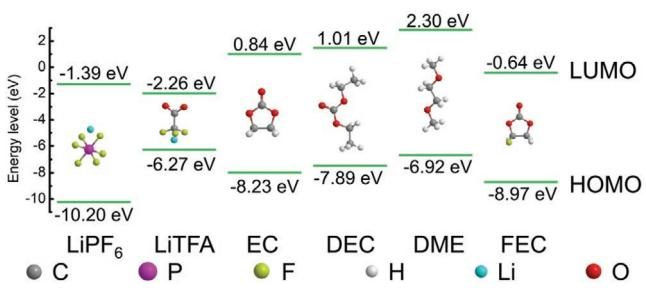
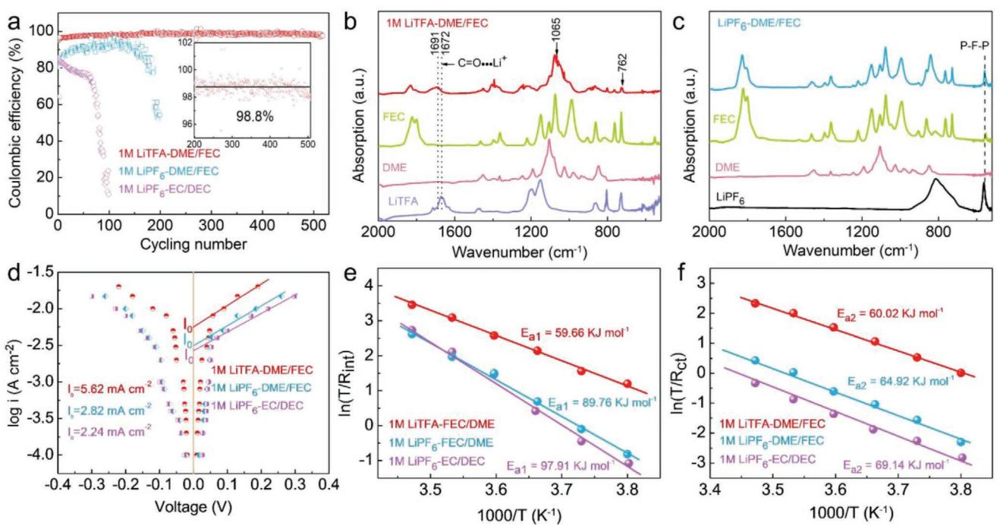
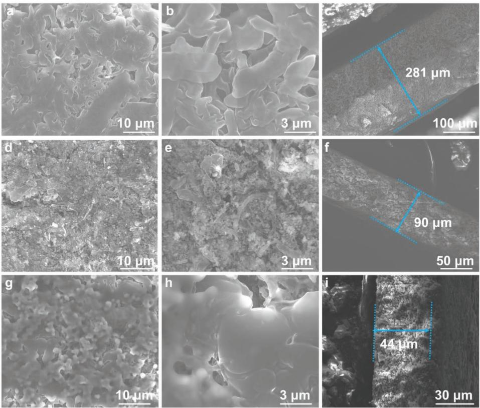
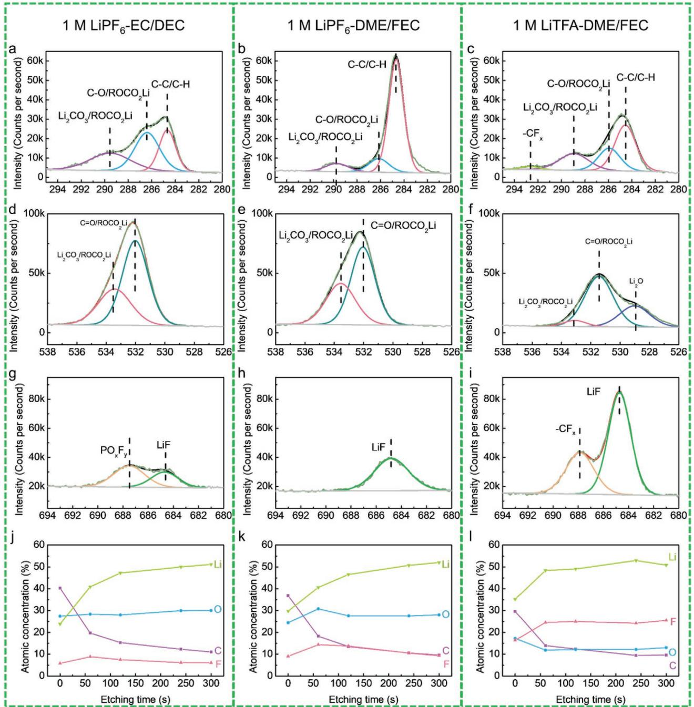
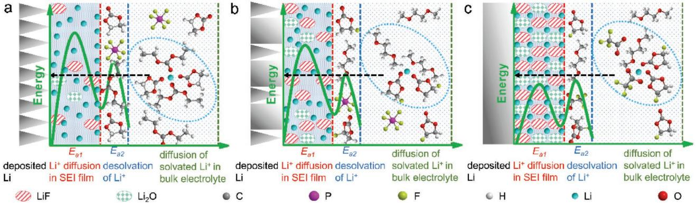
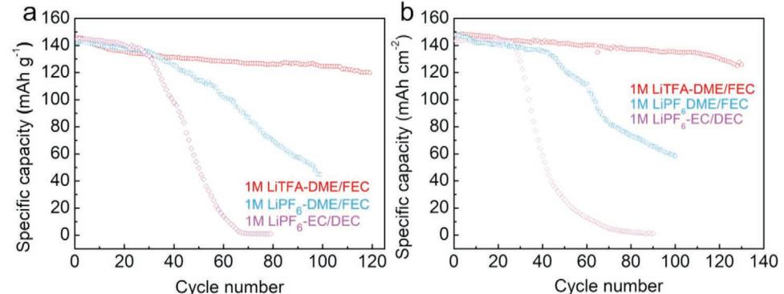

# **An Anion-Tuned Solid Electrolyte Interphase with Fast Ion Transfer Kinetics for Stable Lithium Anodes**

*Zhenxing Wang, Fulai Qi, Lichang Yin, Ying Shi, Chengguo Sun, Baigang An, Hui-Ming Cheng, and Feng Li\**

**The spatial distribution and transport characteristics of lithium ions (Li+) in the electrochemical interface region of a lithium anode in a lithium ion battery directly determine Li+ deposition behavior. The regulation of the Li+ solvation sheath on the solid electrolyte interphase (SEI) by electrolyte chemistry is key but challenging. Here, 1 m lithium trifluoroacetate (LiTFA) is induced to the electrolyte to regulate the Li+ solvation sheath, which significantly suppresses Li dendrite formation and enables a high Coulombic efficiency of 98.8% over 500 cycles. With its strong coordination between the carbonyl groups (CO) and Li+, TFA− modulates the environment of the Li+ solvation sheath and facilitates fast desolvation kinetics. In addition, due to relatively smaller lowest unoccupied molecular orbital energy than solvents, TFA− has a preferential reduction to produce a stable SEI with uniform distribution of LiF and Li2O. Such stable SEI effectively reduces the energy barrier for Li+ diffusion, contributing to low nucleation overpotential, fast ion transfer kinetics, and uniform Li+ deposition with high cycling stability. This work provides an alternative insight into the design of interface chemistry in terms of regulating anions in the Li+ solvation sheath. It is anticipated that this anion-tuned strategy will pave the way to construct stable SEIs for other battery systems.**

Metallic lithium (Li), with a high specific capacity (3860 mAh g−1 ) and the lowest redox potential (−3.04 V vs standard hydrogen electrode), has been considered as the most

Z. Wang, Dr. F. Qi, Prof. L. Yin, Y. Shi, Prof. H.-M. Cheng, Prof. F. Li Shenyang National Laboratory for Materials Science Institute of Metal Research Chinese Academy of Sciences 72 Wenhua Road, Shenyang 110016, China E-mail: fli@imr.ac.cn Z. Wang, Dr. F. Qi, Y. Shi, Prof. F. Li School of Materials Science and Engineering University of Science and Technology of China Hefei 230026, China Prof. C. Sun, Prof. B. An School of Chemical Engineering University of Science and Technology Liaoning Anshan 114051, China Prof. H.-M. Cheng Shenzhen Geim Graphene Center Tsinghua-Berkeley Shenzhen Institute Tsinghua University Shenzhen 518055, China

The ORCID identification number(s) for the author(s) of this article can be found under https://doi.org/10.1002/aenm.201903843.

**DOI: 10.1002/aenm.201903843**

promising anode candidates for highenergy rechargeable batteries.[1] Nevertheless, the uncontrolled dendrite formation and poor reversible Li plating/stripping efficiency long hinder its practical application. Fundamentally, the reactive nature of Li metal can spontaneously trigger side reactions with the electrolyte and form a passivation layer (called solid electrolyte interphase, SEI).[2] The chemical heterogeneity and mechanical instability of SEI are generally considered as the reasons for dendrites formation.[3] Therefore, manipulating the electrolyte chemistry is considered as the most effective method, for it can directly impact the properties of SEI and alter Li+ deposition behavior.[4]

In the electrolyte, Li+ is solvated by solvents and anions to form the Li+ solvation sheath.[5] The Li+ solvation sheath can diffuse freely in bulk electrolyte, which has a higher probability of touching Li surface. Once touching Li metal surface, the solvent molecules and anions from

the solvation sheath will be reduced by electrons and compose the main components of SEI, thereby modulating Li+ transport and deposition behaviors.[6] Due to the diverse reactivity and proportion in the Li+ solvation sheath, the contributions from solvents and anions to the interface chemistry are distinctly different.[7] For the dilute electrolytes (esters and ethers), more solvent molecules dominated the Li+ solvation sheath due to high ratio of solvent/anions (e.g., 11.6:1 in 1 m lithium hexafluorophosphate (LiPF6)-ethylene carbonate (EC)/diethyl carbonate (DEC)). The reduction species in the SEI depend on the reactivity and proportion of the components (solvents and anions) in the Li+ solvation sheath.[8] With a high proportion of solvent molecules in the solvation sheath, the as-obtained SEI was principally composed of solvent-derived organic species (ROLi, RCOOLi, and ROCO2Li), accompanied with few inorganic species (LiF, Li2S, and Li2O) mainly originating from anions.[4a,9] Such solvent-derived SEI with highly resistive nature can bring about sluggish transport and uneven charge distribution of Li+, resulting in notorious dendrite growth with low Coulombic efficiency (CE, 80%).[10] Inducing F atoms to the molecular structure of solvent can tune the reactivity of the Li+ solvation sheath.[11] For instance, fluoroethylene carbonate (FEC) has a relatively smaller lowest unoccupied molecular orbital (LUMO) than EC, which can be preferentially reduced to form a SEI

with high proportion of LiF. The SEI can enhance the interfacial transport of Li+ and enable higher CE (90%).[12] Employing trifluoromethyl functional groups (–CF3) to the solvent molecules can adjust the LUMO energy of a SEI layer for stabilizing the Li metal anodes.[11] However, the CE performance is still deficient for practical applications of Li metal anodes. In addition, highly concentrated electrolytes have also been demonstrated to modulate Li+ solvation sheath for stable Li anode with high CE.[9,13] Due to the decreased solvent/salt ratio (almost 1:1 in highly concentrated electrolytes), more anions take in the Li+ solvation sheath and produce a SEI layer with a great amount of inorganic components, resulting in uniform Li+ transport with fast kinetics. Of course, highly concentrated electrolyte will raise the cost and bring about high electrolyte viscosity, which makes it hard for the practical application of Li metal anodes.[14] Recently, the reports have emphasized the importance of regulating the anions for stable Li metal anodes, such as tuning the Li+ solvation sheath by inducing NO3 − anions and modulating the inner Helmholtz plane with the introduction of NO3 −/F− anions.[5,15] Therefore, developing new types of anions is highly desirable for constructing ideal SEI to modulate Li+ deposition. A desired Li salt should have a good dissociation in aprotic solvents and produce stable SEI to protect Li metal. Introduction of electron-withdrawing groups to anions, especially electronegative F atoms, can promote easy dissociation because of weak coordination ability between anions and cations.[16] Additionally, the electronegative F atom can adjust the frontier molecular orbitals for benefiting the stability of SEI.[11] To regulate the environment of Li+ solvation sheath, anions with carbonyl group (CO) or carboxyl group (COO−) are better choice for their strong coordination with Li+. [17]

Here, an electrolyte based on 1 m lithium trifluoroacetate (LiTFA) in 1, 2-dimethoxyethane (DME)/FEC enables a high CE of 98.8% over 500 cycles. With strong coordination between carbonyl group (CO) and Li+, TFA− can modulate the environment of Li+ solvation sheath and facilitate fast desolvation kinetics. During SEI formation, TFA− has a preferential reduction than solvents for its lower LUMO energy, contributing to an abundance of LiF and Li2O. Such stable SEI renders low nucleation overpotential and fast ion transfer kinetics by reducing the energy barrier when Li+ diffuses through SEI. Therefore, uniform Li+ deposition with spherical morphologies is achieved. Coupled with lithium iron phosphate (LFP) and aggressive LiNi0.6Co0.2Mn0.2O2 (NCM622) cathodes, the full cells with limited Li as the anode enabled longer cycling stability than the control samples.

Based on frontier molecular orbital theory, the components of SEI highly depend on the LUMO of the solute or solvent in the electrolyte. Inspired for this, the molecular orbital energy of LiTFA was calculated by density functional theory (DFT) to explore its thermodynamic potential of forming a new interface. **Figure 1** shows the energy levels of LUMO and highest occupied molecular orbital (HOMO) of the solutes and solvents. The reduction potential decreased in the following order: LiTFA > LiPF6 > FEC > EC > DEC > DME, indicating that LiTFA has a higher tendency to be reduced during SEI formation. Here, 1 m LiTFA was induced to DME/FEC to evaluate its performance. DME was chosen as the solvent for its low reaction activity with Li (LUMO: 2.30 eV). To enhance the oxidation ability of DME

**Figure 1.** Molecular orbital energies of solutes and solvents. The data for the solvents (e.g., EC, DEC, DME, and FEC) are taken from two previous reports.[19]

(oxidation potential less than 4.0 V vs Li+/Li) for the application in high-voltage cathodes,[5,18] FEC (HOMO: −8.97 eV) was used as the corporate solvent.

To investigate Li+ plating/stripping behavior, the CE in the different electrolytes was evaluated by Li||Cu cells. In 1 m LiPF6-EC/DEC, the initial CE was only 85% and subsequently showed a fast decay at 0.5 mA cm−2 (**Figure 2**a). In this electrolyte, more solvent molecules dominated the Li+ solvation sheath and resulted in a SEI principally composed of solventderived organic species (ROCO2Li), as well as little LiF produced by decompositions of PF6 −. [4a] Such solvent-derived SEI was deficient to construct a stable SEI for protecting Li anode, thereby leading to poor Li plating/stripping efficiency. With a lower LUMO energy than EC (0.84 eV), FEC (−0.64 eV) has a higher potential to preferentially decompose and regulate the SEI with more LiF.[20] DME has a lower reactivity with Li metal for its higher LUMO energy (2.30 eV) than carbonates. After replacing EC/DEC to DME/FEC, to some extent, the CE just raised to 90%. Even replacing LiPF6 to sulfimide-based Li salt (bis(trifluoromethane)sulfonimide lithium, LiTFSI), the CE and cycling stability were still not improved to a significant extent (Figure S1, Supporting Information). With lower energy of LUMO (−2.26 eV), LiTFA was introduced to DME/ FEC for regulating the reactivity of Li+ solvation sheath. As Figure S2, Supporting Information shows, although with a moderate ionic conductivity (5.4 mS cm−1), 1 m LiTFA-DME/ FEC achieved a significant higher CE of 95.5% for the initial cycle and gradually ramped up to ≈98.8% after 130 cycles. After increasing to higher current density and higher areal capacity (Figure S3, Supporting Information), the average CE in LiTFA-DME/FEC still exhibited higher Li plating/stripping CE than LiPF6-EC/DEC and LiPF6-DME/FEC electrolytes. To eliminate the effect of DME and FEC on the CE performance, we added the CE testing at 0.5 mA cm−2 with fixed 1 mAh cm−2 in other different electrolytes. As shown in Figure S4, Supporting Information, the electrolyte of 1 m LiTFA-DME enables higher CE than other electrolytes, indicating that LiTFA plays a critical role on improving the cycling stability of Li metal anode. The interactions among Li+, anions, and solvent molecules were investigated by attenuated total reflection Fourier transform infrared (ATR-FTIR) with 1 cm−1 resolution. The spectra of LiTFA-DME/FEC electrolyte was depicted in Figure 2b, the emerging characteristic bands at 720 and 1065 cm−1 can be assigned as the aggregates of Li+ solvation sheath.[21] Notably, the CO asymmetric stretching frequency of LiTFA exhibited

**www.advancedsciencenews.com www.advenergymat.de**

**Figure 2.** Electrochemical performance in different electrolytes. a) Li plating/stripping efficiency on a Cu working electrode in different electrolytes at a current density of 0.5 mA cm−2 with a fixed capacity of 1.0 mAh cm−2. b) ATR-FTIR spectra of LiTFA, DME, FEC, and 1 m LiTFA-DME/FEC. c) ATR-FTIR spectra of LiPF6, DME, FEC, and 1 m LiPF6-DME/FEC. d) Tafel plots for Li plating/stripping in different electrolytes. The Tafel plot was obtained by plotting the overpotential of galvanostatic Li plating/stripping to the natural log of the current density. e) and f) The activation energies of *R*int and *R*ct derived from Nyquist plots.

strong blue shift (19 cm−1 ), which indicated strong interaction between Li+ and carbonyl oxygen group in the Li+ solvation sheath.[17,21] In contrast, for LiPF6-EC/DEC and LiPF6-DME/ FEC, the typical characteristic PF6 − peak at 562 cm−1 (P-F-P) was almost the same as the undissolved salt, indicating minimal anions participating in the Li+ solvation sheath (Figure S5, Supporting Information and Figure 2c).[22] Therefore, the high CE and long cycling stability verify that TFA− takes in the Li+ solvation sheath and subsequently regulates the properties of SEI to minimize side reactions at Li/electrolyte interface.

In order to understand the process, the electrode kinetics in different electrolytes were investigated. As shown in Figure S6a, Supporting Information, the overpotential of initial Li+ plating/ stripping in LiPF6-EC/DEC was 38 mV, but increased to 58 mV (50th) and 115 mV (100th). The large overpotential was arised from the highly resistive SEI produced by severe side reactions at Li/electrolyte interface, which increased the ion transport resistance.[20] The polarization was slightly reduced in LiPF6-DME/FEC (1st: 34 mV, 50th: 47mV, and 100th: 95 mV) due to low reactivity between Li and DME (Figure S6b, Supporting Information). While after replacing PF6 − to TFA− (Figure S6c, Supporting Information), the overpotential was greatly reduced (150th: 88 mV). To further evaluate the electrochemical cycling stability of Li metal in different electrolytes, the Li**||**Li symmetric cells were investigated (Figure S7, Supporting Information). It can be seen that the overpotential of Li**||**Li cells in LiTFA-DME/FEC electrolyte remains a lower overpotential at 2 mA cm−2 for more than 320 h, in contrast to the higher overpotential in the LiPF6-EC/DEC or LiPF6- DME/FEC electrolyte. This result suggested that TFA− produced a conductive SEI for lower transporting resistance during Li+ plating/stripping. Li||Li symmetric cells were further assembled by galvanostatic cycling at various current densities to explore ion transfer kinetics at the interface (Figure 2d). The fast exchange current density in LiTFA-DME/FEC was almost two times larger than that in LiPF6-EC/DEC (2.24 mA cm−2 ) and LiPF6-DME/FEC (2.82 mA cm−2 ), indicating fast ion transfer kinetics during Li+ deposition.[23] The Li+ deposition process could be divided into four parts: diffusion of solvated Li+ in bulk electrolyte, Li+ desolvation at SEI/electrolyte interface, Li+ diffusion through SEI, and Li+ plating over Li surface (Li+ + e− = Li).[15,24] The Li+ desolvation at SEI/electrolyte interface and Li+ diffusion through SEI layer are two rate-determining steps, where large energy barrier needs to be overcome.[25]

To measure the activation energy during Li+ deposition, the temperature-dependent electrochemical impedance spectroscopy (EIS) was carried out. The as-obtained EIS profiles and the fitted equivalent circuit from 263 to 288 K were shown in Figure S8 and Tables S1–S3, Supporting Information. Based on the Arrhenius equation:

$$
k = \frac{T}{R_{\rm res}} = A \exp\left(-\frac{E_a}{RT}\right) \tag{1}
$$

where *k* represents the rate constant, *T* is the absolute temperature, *R*res is the ion transfer resistance, *A* is the preexponential constant, *E*a is the activation energy, and *R* is the standard gas constant. The activation energy (*E*a) is obtained by fitting the separated semicircles (*R*int, *R*ct) in Li||Li symmetric

**Figure 3.** Morphologies of the Li surface in different electrolytes after 100 cycles at a current density of 0.5 mA cm−2 . a)–c) SEM images in LiPF6-EC/DEC; d)–f) SEM images in LiPF6-DME/FEC; g)–i) SEM images in LiTFA-DME/FEC.

cells (Figure 2e,f). *R*int represents the resistance of Li+ across the SEI at medium frequencies; *R*ct represents the resistance of Li+ desolvation at SEI/electrolyte interface at lower frequencies (also denoted as charge transfer).[6b,26] The rate constant *k* is determined by *T* and the fitted *R*int or *R*ct (Tables S1–S3, Supporting Information). In accordance with the fitted *R*int and *R*ct, the corresponding activation energy *E*a1 and *E*a2 are obtained by the Arrhenius equation. *E*a1, represents the activation energy of Li+ when transporting through SEI, was reduced by more than 40% in LiTFA-DME/FEC (59.66 kJ mol−1 ), compared with a larger energy barrier in LiPF6-EC/DEC (97.91 kJ mol−1 ) and LiPF6-DME/FEC (89.76 kJ mol−1) (Figure 2e). The decreased energy barrier proves that TFA− in the Li+ solvation sheath has a significant effect on the Li+ transport kinetics of SEI. *E*a2 represents the energy barrier of Li+ desolvation from Li+ solvation sheath. Compared with Li+ desolvation energy in LiPF6-EC/ DEC (69.14 kJ mol−1 ) and LiPF6-DME/FEC (64.92 kJ mol−1 ), LiTFA-DME/FEC (60.02 kJ mol−1 ) showed a slightly decrease (Figure 2f). Generally, for aprotic polar solvent containing oxygen atoms, the coordination between Li+ and solvent is far stronger than its anion counterpart, giving rise to higher Li+ desolvation energy.[27] Suppose at 263 K, the *R*ct and *R*int for LiPF6-EC/DEC, LiPF6-DME/FEC, and LiTFA-DME/FEC are 4359, 2636, 260 Ω and 774, 598, 79 Ω, respectively. The corresponding *k*ct and *k*int are 0.060, 0.100, 1.012 and 0.400, 0.440, 3.330. Therefore, with strong coordination between CO and Li+, TFA− can replace part of solvent molecule to regulate the environment of Li+ solvation sheath and facilitate fast ion transfer kinetics.

The impact of different electrolytes on morphology evolutions was characterized by the scanning electron microscopy (SEM). The top and cross-section view of Li metal anodes were obtained from Li||Cu cells at 0.5 mA cm−2 with fixed 1.0 mAh cm−2 after 100 cycles. In agreement with the report,[10] the plating Li in LiPF6-EC/DEC showed needle-like dendrites with length of several micrometers (**Figure 3**a,b). Such notorious dendrite growth induced severe dead Li formation and continuous consumption of electrolyte, leading to a much thick cross-section of cycled Li (281 µm, Figure 3c). For LiFP6-DME/FEC (Figure 3d,e), the less-dendritic morphology was observed and the corrosive depth of Li decreased to 90 µm for a more stable SEI, which reduced the parasitic reactions at the Li/electrolyte interface (Figure 3f). In comparison, when LiTFA-DME/FEC was adopted, different morphologies of the cycled Li were observed. Due to the preferential reduction of TFA− in the Li+ solvation sheath, a robust SEI reduced the energy barrier for Li+ desolvation and diffusion, contributing to a round-shaped Li morphology with a dense and uniform distribution (Figure 3g,h). Moreover, the thickness of the cycled Li metal was only 44 µm, indicating less dead Li or side reactions between Li and electrolyte (Figure 3i). Such Li morphology has two advantages: (1) higher CE performance, smaller surface area renders less side reactions between Li and electrolyte; (2) higher safety, spherical Li morphology induces less potential to penetrate through the separator.

**www.advancedsciencenews.com www.advenergymat.de**

**Figure 4.** XPS characterization of the SEI components on cycled Li anodes in different electrolytes after 100 cycles. a), d), g), and j) are C1s, O1s, F1s spectra and atomic concentrations in the SEI of LiPF6-EC/DEC; b), e), h), and k) are C1s, O1s, F1s spectra and atomic concentrations in the SEI of LiPF6-DME/FEC; c), f), i), and l) are C1s, O1s, F1s spectra and atomic concentrations in the SEI of LiTFA-DME/FEC.

The chemical compositions of SEI on Li metal were further explored by X-ray photoelectron spectroscopy (XPS) to figure out the underlying mechanism of diverse ion transport kinetics in different electrolytes (**Figure 4** and Figures S9–S11, Supporting Information). The signals of C 1s spectra for the three SEI films presented similar peaks corresponding to Li2CO3/ROCO2Li, C-O/ ROCO2Li, and C–C/C–H centered at 289.5, 286.5, and 284.6 eV[28] (Figure 4a–c). The O 1s spectra (Figure 4d–f) were fitted into Li2CO3/ROCO2Li (533.7 eV) and CO/ROCO2Li (532.0 eV),[29] corresponding to the decomposition of solvent molecules. As sputtering time increased, organic ROCO2Li always dominated the SEI of LiPF6-EC/DEC and LiPF6-DME/FEC based on peak areas, as well as small amount of inorganic Li2O since 60 s, reflecting an uneven organic-dominated layer (Figure S10, Supporting Information). Interestingly, in SEI of LiTFA-DME/FEC, stable Li2O was detected from top to bottom, which can be

**Figure 5.** Schematics of the Li+ deposition process in different electrolytes. a) LiPF6-EC/DEC, b) LiPF6-DME/FEC, and c) LiTFA-DME/FEC. The aggregates in the light-blue dotted ovals represent the Li+ solvation sheath in the bulk electrolyte. The two bold dark-green waves correspond to the activation energies consumed on breakup of the Li+ solvation sheath at the SEI/electrolyte interface (*E*a2) and the diffusion of Li+ through the SEI film (*E*a1).

ascribed as the decomposition of TFA−. In addition, LiF (arising from LiPF6, FEC, or LiTFA) was detected at ≈684.6 eV[30] in all SEI films (Figure 4g–i). We also compared the atomic contents of elemental composition in different interfaces (Figure 4j–l). Before Ar+ sputtering, the SEI of LiTFA-DME/FEC showed a lower atomic content of C (30%) and O (17%), in contrast to the SEI of LiPF6-EC/DEC (C: 41%, O: 27%) and LiPF6-DME/FEC (C: 38%, O: 25%), implied a less organic content on the outer layer. As the sputtering time increased, the contents of C (organic species) in all SEI films showed a rapid decline within the first 60 s, but O almost kept stable. This was consisted with the report that most organic species (ROCO2Li) covered on the outer layer and partial ROCO2Li were shifted to inorganic products (Li2CO3 and Li2O) in the inner layer.[31] In the SEI of LiTFA-DME/FEC, inorganic Li2O dominated the inner SEI rather than organic ROCO2Li since etching for 120 s (Figure S10, Supporting Information). Notably, the atomic content of F (mainly LiF) in SEI of LiTFA-DME/FEC was dramatically increased from 16% to 25% since etching for 60 s, which kept almost three times higher than that in LiPF6-EC/DEC (9%) and two times higher than in LiPF6-DME/FEC (14%). The bond strengths of TFA− and PF6 − were further calculated to confirm the difference. As shown in Figure S12, Supporting Information, the bond strength of C–F in TFA− anions (203.29 kJ mol−1 ) was remarkably weaker than that of P–F in PF6 − anions (346.96 kJ mol−1 ), suggesting the bond-breaking potential of producing a LiF-rich layer on Li metal surface. Therefore, TFA− decomposed as the dominant reduction and produced a robust SEI with an abundance of LiF and Li2O, which was responsible for lowering the energy barrier of Li+ diffusion and contributing to fast and uniform Li+ deposition.

Based on the reports, the components of LiF and Li2CO3 may also be derived from the decompositions of FEC. The degradation mechanism is as follows:[32]

$$
FEC + Li^{+} + e^{-} \rightarrow poly(VC) + LiF + Li_{2}CO_{3}
$$
\n(2)

In order to confirm the sources of LiF and Li2CO3, XPS and surface-enhanced Raman scattering (SERS) were conducted. LiF detected at 684.6 eV in 1 m LiTFA-DME without FEC was characterized (Figure S13a, Supporting Information). For O 1s spectrum (Figure S13b, Supporting Information), Li2CO3

detected at 533.0 eV may arise either from LiTFA or DME solvent. To further explore the source of Li2CO3, 0.1 m LiTFA was dissolved in CH2Cl2 solvent (Figure S14, Supporting Information). Obviously, no peak was found at 1090 cm−1 (corresponding to Li2CO3 [33] ). Therefore, the possible degradation process of LiTFA is as following:

$$
C_2F_3O_2Li + nLi^+ + ne^- \rightarrow LiF + Li_2O + C_2F_2OLi_{n-2}
$$
\n(3)

The reduction potential of LiTFA was further explored by cyclic voltammetry (CV) in 1 m LiTFA-DME using copper (Cu) electrode at a scanning rate of 0.1 mV s−1 . A distinct reduction onset potential was found at about 1.1 V (vs Li+/Li) (Figure S15, Supporting Information). And no similar reduction peak can be observed in the DME solvent without LiTFA. Therefore, the cathodic current starting from 1.1 V (vs Li+/Li) can be assigned to the reduction potential of LiTFA. The reduction species from TFA−, PF6 −, or FEC in the Li+ solvation sheath can become portion of SEI and affect its properties (ion transfer kinetics, surface energy, etc.). In the bulk electrolyte of LiPF6-EC/DEC (**Figure 5**a), the Li+ solvation sheath was composed of a great amount of EC, DEC molecules, and little PF6 −. Once the electrochemical reaction occurs, the EC, DEC molecules, and PF6 − in the Li+ solvation sheath will be reduced by electrons and compose the main components of SEI. The SEI was principally composed of more organic components (ROCO2Li) derived from EC or DEC solvents distributed in the outer layer, accompanied by few inorganic products (Li2O and LiF) in the inner layer. Before deposition, Li+ had to overcome large energy barrier to break up the Li+ solvation sheath. When Li+ transported through SEI, the highly resistive organic ROCO2Li species with large energy barrier blocked Li+ diffusion and induced uneven charge distribution, subsequently leading to dendritic Li growth. After replacing EC/DEC to DME/FEC (Figure 5b), the energy barrier of Li+ desolvation had slightly decreased due to weaker solvation of FEC compared with EC.[34] The Li+ diffusion barrier across the SEI also be reduced. This can be ascribed to the increased content of LiF from FEC in addition to PF6 − in the SEI, which enhanced the transport kinetics of Li+ and produced less-dendritic morphology. In contrast, for LiTFA-DME/ FEC electrolyte (Figure 5c), TFA− regulated the environment of

**Figure 6.** Electrochemical performances of Li metal anodes using LFP and NCM622 as cathode materials. a) Cycling stability of LFP**||**Li cells in different electrolytes when cycled at 0.5 C. b) Cycling stability of NCM622**||**Li cells in different electrolytes when cycled at 1 C.

Li+ solvation sheath and facilitated fast desolvation kinetics. Additionally, with lower energy of LUMO than solvents, TFA− in the Li+ solvation sheath was preferentially reduced to form a SEI with an abundance of LiF and Li2O from outer to inner layer. Hence, when Li+ transported through SEI, the components (LiF and Li2O) played a significant role. LiF can prevent the electrons exchange, produce uniform diffusion field gradients, and afford uniform Li+ flux.[35] Li2O was demonstrated to be beneficial for stabilizing the SEI film.[36] As a result, with an abundance of LiF and Li2O, more ion channels resulted in smaller energy barrier for Li+ to get through. Fast and uniform spatial distribution of Li+ flux finally got uniform deposition morphology.

The oxidation stability of various electrolytes was evaluated via CV. As shown in Figure S16, Supporting Information, the anodic current in LiTFA-DME/FEC remained stable until 4.2 V, which guaranteed it can be used with LFP. LFP with an areal capacity of ≈1.5 mAh cm−2 and Li (≈2 times excess) were constructed as the cell. LFP**||**Li cells in the three different electrolytes all exhibited a flat plateau at 3.4 V vs Li+/Li, delivering an initial discharge capacity of ≈142 mAh g−1 (Figure S17, Supporting Information). As **Figure 6**a showed, the LFP**||**Li cells with LiTFA-DME/FEC electrolyte presents the best cycling stability, retaining 85% of the original reversible capacity after 100 cycles, with an average CE of 99.5% (Figure S18, Supporting Information), in comparison with <50% capacity retention for LiPF6-EC/DEC within 45 cycles. Though DME/FEC mitigates capacity fading, the LFP**||**Li cells still quickly decays to <50% of the original capacity after 75 cycles. The fast capacity decay is ascribed to the low Li plating/stripping CE in LiPF6- EC/DEC and LiPF6-DME/FEC electrolyte. In addition, the aggressive LiNi0.6Co0.2Mn0.2O2 (NCM622) cathode was also used to test the full cells. At 1 C (160 mA g−1 ), the cell delivered an initial discharge capacity of ≈145 mAh g−1 in three electrolytes (Figure S19, Supporting Information). As shown in Figure S20, Supporting Information, the cells using LiPF6-EC/ DEC exhibited an average CE of 98.1% in the first 23 cycles. However, beyond 23 cycles, it quickly dropped to <95%, accompanied by a fast capacity decay and terminated cycling after 70 cycles (Figure 6b). Though DME/FEC improved the CE and mitigated capacity fading, LiPF6-FEC/DME still experienced abrupt capacity drop after about 40 cycles. In comparison, the cells in LiTFA-DME/FEC retained a stable CE of 98.6% over 130 cycles before failing. The electrochemical performance was mainly ascribed to high Li plating/stripping efficiency.

In this study, stable Li metal with high CE has been achieved by introducing TFA− to the Li+ solvation sheath and regulating the SEI with fast ion transport kinetics. With strong coordination with Li+, TFA− can replace part of solvent molecule to form the solvation sheath structure, leading to lower energy barrier for Li+ desolvation. Additionally, due to lower energy of LUMO than solvents in Li+ solvation sheath, TFA− has a preferential reduction to produce a stable SEI with an abundance of LiF and Li2O. Such SEI effectively reduces the energy barrier for Li+ diffusion, contributing to lower nucleation overpotential and faster ion transfer kinetics. As a result, homogeneous Li+ transport across the interface accounts for a uniform Li+ deposition and high cycling stability. This work not only provides fresh insight on regulating the reactivity of anions in the Li+ solvation sheath to manipulate the interface chemistry and alter Li+ deposition behaviors, but also paves new way on constructing stable SEI for high-energy-density materials.

## **Experimental Section**

*Materials*: CH2Cl2 and LFP materials were purchased from MACKLIN and used as received. EC, DEC, DME, FEC, LiTFA, LiTFSI, and LiPF6 were purchased from Sigma-Aldrich.

*Electrochemical Measurements*: The Li||Cu cells were assembled or disassembled in an Ar-filled glove box with oxygen and water contents below 0.1 ppm. Coin cells of 2025 type were used as the Li||Cu, Li||Li symmetric, LFP||Li, and NCM||Li cells. For the Li||Cu cells, Li metal was used as the counter and reference electrodes while a Cu substrate was used as the working electrode. The cells were cycled in the voltage range −0.5 to 1.0 V (vs Li+/Li) at current densities of 0.5 mA cm−2 with a fixed capacity of 1.0 mAh cm−2 by a LAND galvanostatic device. The CE is defined as charging capacity over discharging capacity. For LFP||Li and NCM||Li cells, Li pre-deposited on the Cu substrate at ≈3.0 mAh cm−2 was used as the anode. The LFP (≈1.5 mAh cm−2) and NCM (≈1.1 mAh cm−2) electrodes were prepared by casting a slurry mixture containing 85 wt% active material, 10 wt% Super P, and 5 wt% polyvinylidene fluoride binder (PVDF) in *N*-methyl-2-pyrrolidone onto a carbon-coated aluminum (Al) foil. Celgard 2500 polypropylene membranes were used as the separator for the Li||Cu, LFP||Li, and NCM||Li cells. Liquid electrolyte of 30 µL (1 m LiTFA-DME, 1 m LiTFA-DME/FEC, 1 m LiTFA-EC/DEC, 1 m LiPF6-DME/FEC, 1 m LiPF6-DME/EC, or 1 m LiPF6-EC/DEC) was used for the coin cells.

The ratio of DME:FEC was set at 7:3 and 1:1 for EC:DEC by volume. CV and EIS measurements (10 mV, 105–100 Hz) were performed using a VSP-300 multichannel workstation.

*Characterization*: The Li deposited on the Cu substrate was protected by an Ar atmosphere in a homemade container to avoid contact with air during the transfer process before characterization. The morphologies of the samples were characterized by SEM (FEI Nova Nano-SEM 430, 10 kV). XPS analysis was performed using an ESCALAB 250 instrument with Al Kα radiation (15 kV, 150 W) under a pressure of 4 × 10−8 Pa. The ionic conductivity of the different electrolytes was measured by a FE30 at room temperature. All samples were rinsed with DME to remove residual electrolyte, then dried under vacuum. Surfaceenhanced Raman scattering was performed using a Jobin Yvon Lab RAM HR800 with a 632.8 nm He–Ne laser. For the surface-enhanced Raman spectroscopy sample, a commercial silver (Ag) foil was immersed in a freshly prepared 12% HNO3 solution for 5 s. A sponge-type surface with a high degree of roughness was thus created to enhance the signal. ATR-FTIR spectra were recorded on a Nicolet iS5 iD7 ATR spectrometer equipped with a diamond KBr beam splitter. An empty ATR cell blanketed with argon was used to collect the background spectrum.

*Theoretical Calculations*: The chemical structures, bond strengths, and molecular orbital energy levels of the selected solutes and solvents were calculated using the DFT method implemented in the Vienna ab initio simulation package,[37] based on the generalized gradient approximation of Perdew–Burke–Ernzerhof with a plane wave energy cutoff of 400 eV.[38]

#### **Supporting Information**

Supporting Information is available from the Wiley Online Library or from the author.

#### **Acknowledgements**

The authors thank Dr. Qinwei Wei and Dr. Xinxin Wei for the valuable discussions. They acknowledge financial support from National Natural Science Foundation of China (Grant Nos. 51525206, 51972312, 51472249, 51902316), Ministry of Science and Technology of the People's Republic of China (2016YFA0200100 and 2016YFB0100100), the Strategic Priority Research Program of the Chinese Academy of Sciences (XDA22010602), the Key Research Program of the Chinese Academy of Sciences (Grant No. KGZD-EW-T06), and the Bureau of Industry and Information Technology of Shenzhen for the "2017 Graphene Manufacturing Innovation Center Project" (Grant No. 201901171523). The theoretical calculations in this work were performed on TianHe-1(A) at National Supercomputer Center in Tianjing and Tianhe-2 at National Supercomputer Center in Guangzhou.

## **Conflict of Interest**

The authors declare no conflict of interest.

#### **Keywords**

anions, energy barriers, lithium metal anodes, solid electrolyte interphase, solvation sheaths

Received: November 23, 2019

- Revised: January 17, 2020 Published online: February 17, 2020
- [1] D. C. Lin, Y. Y. Liu, Y. Cui, *Nat. Nanotechnol.* **2017**, *12*, 194.
- [2] D. Aurbach, E. Zinigrad, Y. Cohen, H. Teller, *Solid State Ionics* **2002**, *148*, 405.
- [3] a) W. Xu, J. L. Wang, F. Ding, X. L. Chen, E. Nasybulin, Y. H. Zhang, J. G. Zhang, *Energy Environ. Sci.* **2014**, *7*, 513; b) X. Liang, Q. Pang, I. R. Kochetkov, M. S. Sempere, H. Huang, X. Q. Sun, L. F. Nazar, *Nat. Energy* **2017**, *2*, 17119; c) C. Z. Sun, A. Lin, W. W. Li, J. Jin, Y. Y. Sun, J. H. Yang, Z. Y. Wen, *Adv. Energy Mater.* **2019**, *10*, 1902989.
- [4] a) X. Q. Zhang, X. Chen, X. B. Cheng, B. Q. Li, X. Shen, C. Yan, J. Q. Huang, Q. Zhang, *Angew. Chem., Int. Ed.* **2018**, *57*, 5301; b) J. Guo, Z. Y. Wen, M. F. Wu, J. Jin, Y. Liu, *Electrochem. Commun.* **2015**, *51*, 59.
- [5] X. Q. Zhang, X. Chen, L. P. Hou, B. Q. Li, X. B. Cheng, J. Q. Huang, Q. Zhang, *ACS Energy Lett.* **2019**, *4*, 411.
- [6] a) J. F. Qian, W. A. Henderson, W. Xu, P. Bhattacharya, M. Engelhard, O. Borodin, J. G. Zhang, *Nat. Commun.* **2015**, *6*, 6362; b) K. Xu, Y. F. Lam, S. S. Zhang, T. R. Jow, T. B. Curtis, *J. Phys. Chem. C* **2007**, *111*, 7411.
- [7] Z. X. Wang, C. G. Sun, Y. Shi, F. L. Qi, Q. W. Wei, X. Li, Z. H. Sun, B. G. An, F. Li, *J. Power Sources* **2019**, *439*, 227073.
- [8] R. Younesi, G. M. Veith, P. Johansson, K. Edström, T. Vegge, *Energy Environ. Sci.* **2015**, *8*, 1905.
- [9] X. L. Fan, L. Chen, X. Ji, T. Deng, S. Hou, J. Chen, J. Zheng, F. Wang, J. J. Jiang, K. Xu, C. S. Wang, *Chem* **2018**, *4*, 174.
- [10] X. L. Fan, L. Chen, O. Borodin, X. Ji, J. Chen, S. Hou, T. Deng, J. Zheng, C. Y. Yang, S. C. Liou, K. Amine, K. Xu, C. S. Wang, *Nat. Nanotechnol.* **2018**, *13*, 715.
- [11] W. D. Zhang, S. Q. Zhang, L. Fan, L. N. Gao, X. Q. Kong, S. Y. Li, J. Li, X. Hong, Y. Y. Lu, *ACS Energy Lett.* **2019**, *4*, 644.
- [12] a) Z. Q. Zhu, Y. X. Tang, Z. S. Lv, J. Q. Wei, Y. Y. Zhang, R. H. Wang, W. Zhang, H. R. Xia, M. Z. Ge, X. D. Chen, *Angew. Chem., Int. Ed.* **2018**, *57*, 3656; b) J. W. Meng, F. L. Chu, J. L. Hu, C. L. Li, *Adv. Funct. Mater.* **2019**, *29*, 1902220; c) J. L. Hu, K. Y. Chen, C. L. Li, *ACS Appl. Mater. Interfaces* **2018**, *10*, 34322.
- [13] L. M. Suo, W. J. Xue, M. Gobet, S. G. Greenbaum, C. Wang, Y. M. Chen, W. L. Yang, Y. X. Li, J. Li, *Proc. Natl. Acad. Sci. USA* **2018**, *115*, 1156.
- [14] J. M. Zheng, J. A. Lochala, A. Kwok, Z. D. Deng, J. Xiao, *Adv. Sci.* **2017**, *4*, 1700032.
- [15] C. Yan, H. R. Li, X. Chen, X. Q. Zhang, X. B. Cheng, R. Xu, J. Q. Huang, Q. Zhang, *J. Am. Chem. Soc.* **2019**, *141*, 9422.
- [16] H. Tokuda, S. I. Tabata, M. Susan, K. Hayamizu, M. Watanabe, *J. Phys. Chem. B* **2004**, *108*, 11995.
- [17] D. M. Seo, S. Reininger, M. Kutcher, K. Redmond, W. B. Euler, B. L. Lucht, *J. Phys. Chem. C* **2015**, *119*, 14038.
- [18] E. M. Erickson, E. Markevich, G. Salitra, D. Sharon, D. Hirshberg, E. de la Llave, I. Shterenberg, A. Rosenman, A. Frimer, D. Aurbach, *J. Electrochem. Soc.* **2015**, *162*, A2424.
- [19] a) B. F. Li, J. Zhao, Z. H. Zhang, C. Zhao, P. F. Sun, P. X. Bai, J. X. Yang, Z. Zhou, Y. H. Xu, *Adv. Funct. Mater.* **2019**, *29*, 1807137; b) D. Xu, J. M. Su, J. Jin, C. Sun, Y. D. Ruan, C. H. Chen, Z. Y. Wen, *Adv. Energy Mater.* **2019**, *0*, 1900611.
- [20] X. Q. Zhang, X. B. Cheng, X. Chen, C. Yan, Q. Zhang, *Adv. Funct. Mater.* **2017**, *27*, 1605989.
- [21] K. K. Lee, K. Park, H. Lee, Y. Noh, D. Kossowska, K. Kwak, M. Cho, *Nat. Commun.* **2017**, *8*, 14658.
- [22] a) L. D. Kock, M. D. S. Lekgoathi, P. L. Crouse, B. M. Vilakazi, *J. Mol. Struct.* **2012**, *1026*, 145; b) S. Sankarasubramanian, J. Kahky, V. Ramani, *Proc. Natl. Acad. Sci. USA* **2019**, *116*, 14899.
- [23] Q. Zhao, Z. Y. Tu, S. Y. Wei, K. H. Zhang, S. Choudhury, X. T. Liu, L. A. Archer, *Angew. Chem., Int. Ed.* **2018**, *57*, 992.
- [24] K. Xu, A. Von Cresce, U. Lee, *Langmuir* **2010**, *26*, 11538.
- [25] Y. P. Guo, P. Niu, Y. Y. Liu, Y. Ouyang, D. Li, T. Y. Zhai, H. Q. Li, Y. Cui, *Adv. Mater.* **2019**, *31*, 1900342.
- [26] K. Xu, *J. Electrochem. Soc.* **2007**, *154*, A162.
- [27] X. Bogle, R. Vazquez, S. Greenbaum, A. v. W. Cresce, K. Xu, *J. Phys. Chem. Lett.* **2013**, *4*, 1664.

**www.advancedsciencenews.com www.advenergymat.de**

- [28] X. Li, J. M. Zheng, M. H. Engelhard, D. H. Mei, Q. Y. Li, S. H. Jiao, N. Liu, W. G. Zhao, J. G. Zhang, W. Xu, *ACS Appl. Mater. Interfaces* **2018**, *10*, 2469.
- [29] N. Togasaki, T. Momma, T. Osaka, *J. Power Sources* **2014**, *261*, 23.
- [30] X. Shen, X. B. Cheng, P. Shi, J. Q. Huang, X. Q. Zhang, C. Yan, T. Li, Q. Zhang, *J. Energy Chem.* **2019**, *37*, 29.
- [31] C. Yan, X. B. Cheng, Y. Tian, X. Chen, X. Q. Zhang, W. J. Li, J. Q. Huang, Q. Zhang, *Adv. Mater.* **2018**, *30*, 1707629.
- [32] a) Y. Okuno, K. Ushirogata, K. Sodeyama, Y. Tateyama, *Phys. Chem. Chem. Phys.* **2016**, *18*, 8643; b) A. L. Michan, B. S. Parimalam, M. Leskes, R. N. Kerber, T. Yoon, C. P. Grey, B. L. Lucht, *Chem. Mater.* **2016**, *28*, 8149.
- [33] J. Wang, Y. B. Yin, T. Liu, X. Y. Yang, Z. W. Chang, X. B. Zhang, *Nano Res.* **2018**, *11*, 3434.
- [34] N. von Aspern, G. V. Röschenthaler, M. Winter, I. Cekic-Laskovic, *Angew. Chem., Int. Ed.* **2019**, *58*, 15978.
- [35] a) Y. X. Yuan, F. Wu, Y. Bai, Y. Li, G. H. Chen, Z. H. Wang, C. Wu, *Energy Storage Mater.* **2019**, *16*, 411; b) Y. X. Yuan, F. Wu, G. H. Chen, Y. Bai, C. Wu, *J. Energy Chem.* **2019**, *37*, 197; c) S. Jurng, Z. L. Brown, J. Kim, B. L. Lucht, *Energy Environ. Sci.* **2018**, *11*, 2600.
- [36] S. Q. Shi, P. Lu, Z. Y. Liu, Y. Qi, L. G. Hector, H. Li, S. J. Harris, *J. Am. Chem. Soc.* **2012**, *134*, 15476.
- [37] G. Kresse, J. Furthmüller, *Phys. Rev. B* **1996**, *54*, 11169.
- [38] J. P. Perdew, K. Burke, M. Ernzerhof, *Phys. Rev. Lett.* **1996**, *77*, 3865.