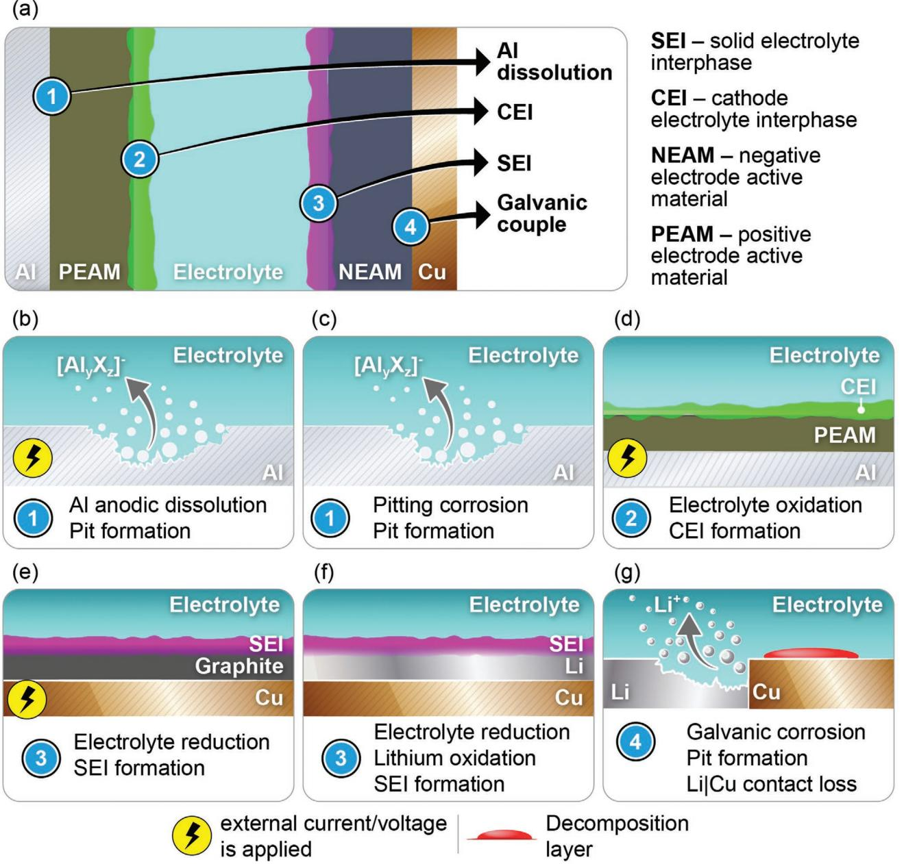
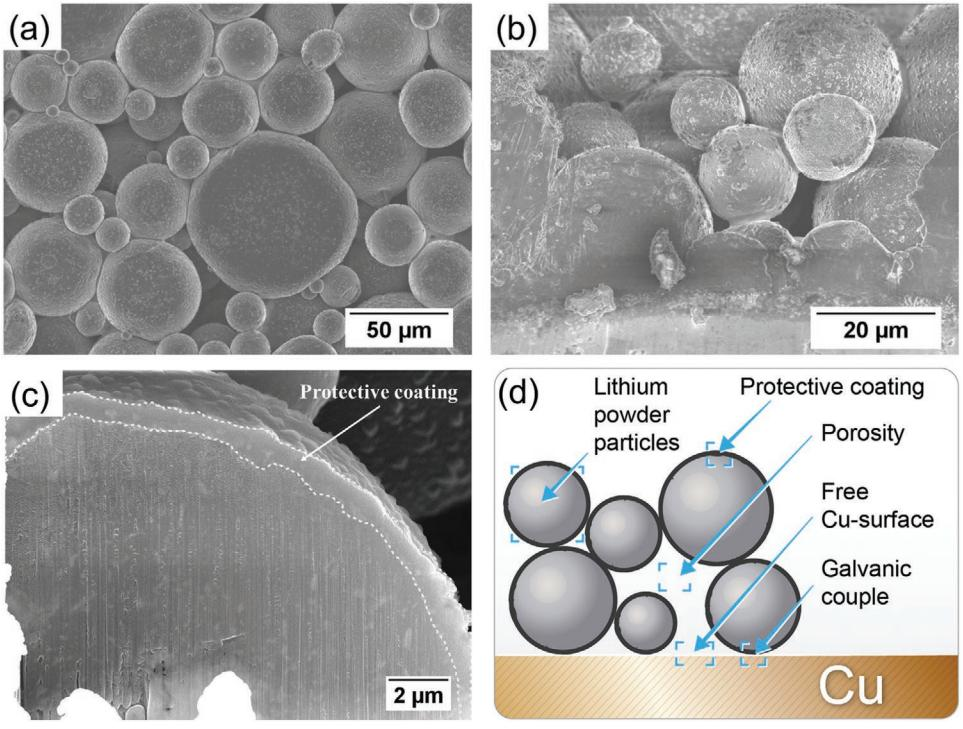
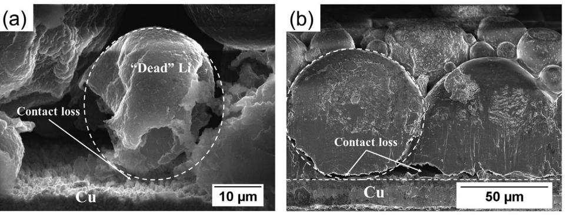
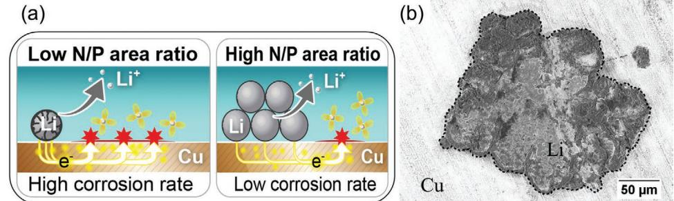
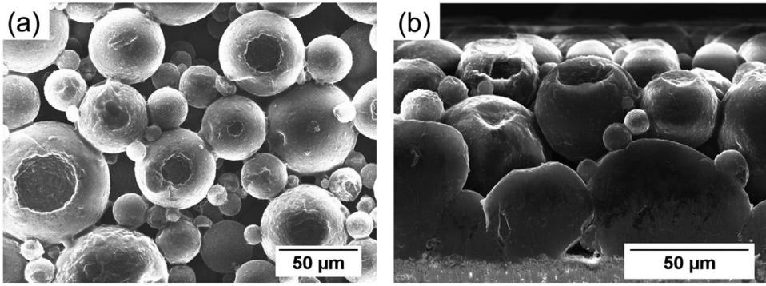
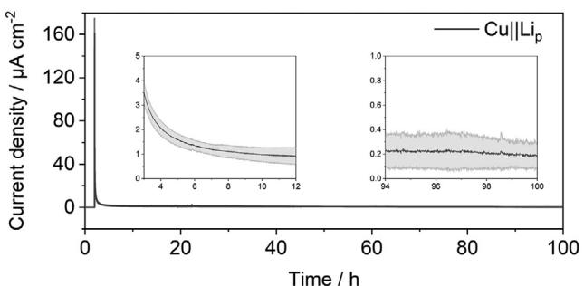
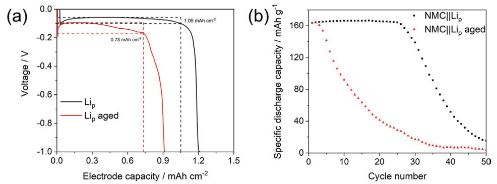

# **Galvanic Corrosion of Lithium-Powder-Based Electrodes**

*Aleksei Kolesnikov, Martin Kolek, Jan Frederik Dohmann, Fabian Horsthemke, Markus Börner, Peter Bieker, Martin Winter,\* and Marian Cristian Stan\**

**Lithium metal is considered to be the most promising anode for the next generation of batteries if the issues related to safety and low coulombic efficiency can be overcome. It is known that the initial morphology of the lithium metal anode has a great influence on the cycling characteristics of a lithium metal battery (LMB). Lithium-powder-based electrodes (Lip-electrodes) are reported to diminish the occurrence of high surface area lithium deposits. Usually, ultra-thin lithium foils (<50 µm) and Lip-electrodes are prepared on a copper substrate, thus a metal–metal contact area is generated. The combination of these two metals in the presence of an electrolyte, however, can lead to galvanic corrosion. Herein, the corrosion behavior of Lip-electrodes is studied. The porosity of such electrodes leads to a high amount of accessible Cu surface in contact with electrolyte. As a consequence, Lip-electrodes aged for 1 week in the electrolyte show spontaneous lithium dissolution near the junction to copper and void formation on the lithium-powder particles. This corrosion process affects the delivered capacity of Lip-electrodes and increases the overvoltage of the lithium electrodissolution process. The occurrence of corrosion at the Cu|Lip interface raises concerns about the practicality of multi-metallic component systems for LMBs.**

### **1. Introduction**

Alternative to state-of-the-art lithium ion battery (LIB) technology,[1] intensive investigations are conducted on batteries promising higher energy contents. Lithium metal[2] due to its high gravimetric and volumetric capacity (3862 Ah kg−1 and 2085 Ah L−1 ) is considered to be one of the most promising candidates

MEET Battery Research Center

University of Münster

Corrensstrasse 46, Münster 48149, Germany

E-mail: martin.winter@uni-muenster.de; marian.stan@uni-muenster.de Dr. P. Bieker

Institute of Physical Chemistry

University of Münster

Corrensstrasse 28–30, Münster 48149, Germany

Prof. M. Winter

Helmholtz Institute Münster (HI MS)

IEK-12, Forschungszentrum Jülich GmbH, Corrensstrasse 46, Münster 48149, Germany

The ORCID identification number(s) for the author(s) of this article can be found under https://doi.org/10.1002/aenm.202000017.

© 2020 The Authors. Published by WILEY-VCH Verlag GmbH & Co. KGaA, Weinheim. This is an open access article under the terms of the Creative Commons Attribution License, which permits use, distribution and reproduction in any medium, provided the original work is properly cited.

#### **DOI: 10.1002/aenm.202000017**

for anode materials to replace graphite[3] in lithium batteries. The application of thin lithium foils is considered to enable an increase in energy density by nearly a factor of 2 in case of solid-state lithium metal batteries (SSLMBs).[4] Besides LIB-derived cathode materials, lithium anodes are often considered for conversion-type cathodes enabling S8||Li and O2||Li batteries as well.[5] Nevertheless, lithium as anode material in rechargeable batteries has been extensively studied over four decades[6] and still no commercial application could be realized.[7] Major challenges concern the safety and uncontrolled lithium electrodeposition that often leads to the formation of high surface area lithium (HSAL), frequently called "dendrites." The high reactivity of pristine lithium and especially electrodeposited lithium leads to severe side reactions with electrolytes which result in the formation of a solid electrolyte interphase (SEI).[8] This SEI, however, is fractured during consecutive lithium electrodeposition and elec-

trodissolution resulting in an inhomogeneous interphase on the lithium surface. These inhomogeneities can cause uncontrolled lithium electrodeposition and the formation of HSAL deposits.[9] Such deposits can occur in needle-like ( = dendritic) morphology and puncture the separator. After growing to the cathode, an internal short-circuit may be caused which dramatically increases the risk of a thermal runaway. To overcome the described issues, various approaches were developed based on electrolyte and lithium anode interphase engineering,[10] minimizing volume changes by using stable hosts,[11] and preventing dendrite formation and propagation by the use of solid-state electrolytes.[12]

The stability of materials in contact with its environment is a well-known research area for corrosion science. Corrosion, in general, is defined as the chemical or electrochemical reaction between a material and its environment that results in a deterioration of the material and its properties.[13] As energy storage and conversion systems imply materials in a thermodynamically non-equilibrium state, corrosion-related processes are highly relevant for such systems. **Figure 1**a presents an overview of possible corrosion-related phenomena in a battery cell. Herein, we only discuss corrosion phenomena which occur in the presence of an electrolyte.

At the positive electrode side, dissolution of Al,[14] which is typically used as a positive electrode current collector, and the cathode electrolyte interphase (CEI)[15] formation are phenomena related to corrosion in a battery cell (Figure 1b–d). One of the two processes which leads to dissolution of Al is

A. Kolesnikov, M. Kolek, J. F. Dohmann, F. Horsthemke, Dr. M. Börner, Dr. P. Bieker, Prof. M. Winter, Dr. M. C. Stan

**www.advancedsciencenews.com www.advenergymat.de**

**Figure 1.** Schematic representation showing a) possible corrosion-related phenomena in a battery cell, b) anodic Al dissolution, c) pitting corrosion, d) CEI on a positive electrode, e) SEI on a graphite negative electrode, f) SEI on a Li metal negative electrode, and g) galvanic corrosion.

the anodic Al dissolution. Such process occurs if an external current/voltage is applied and is caused by anodic polarization (potential shift in the "positive" direction) of the positive electrode side resulting in an increase of the Al potential beyond its oxidation potential and finally the electrochemical dissolution of Al and pit formation (Figure 1b).[14b] It is indeed questionable whether a simple anodic oxidation process should be termed "corrosion."[14a,b] The other cause leading to the chemical dissolution of Al is an insufficient protection layer at the Al surface. Al, with a standard redox potential of −1.68 V versus SHE,[16] can chemically react with its environment and be oxidized which leads to Al dissolution and further pit formation without the need of an external current/voltage (Figure 1c). In this case, pit formation can be described as pitting corrosion and is often observed while aqueous processing of electrode pastes for cathodes.[14g,h] Since these two (chemical and electrochemical) dissolution processes can occur simultaneously under cell operation conditions, it is difficult to separate and to distinguish between them in practice.

The formation of surface films at the positive (Figure 1d) and negative electrodes (Figure 1e,f) in LIBs and LMBs can be considered as corrosion phenomenon as well. For cathode materials, the formation of the CEI, normally induced by an external current/voltage, is characterized by the oxidation of electrolyte components which form a Li+-permeable surface coating (Figure 1d).[15a,b] Similar processes are known for anode materials like graphite, where the formation of a Li+-conductive, but electronically insulating, SEI allowed the development of the first commercially successful LIBs.[1a,6,7] While such SEI on graphite is generated during the application of an external current/voltage (Figure 1e), for LMBs, with Li as the anode material (Figure 1f), such surface layers occur spontaneously caused by the very low standard redox potential of Li (−3.04 V vs SHE).[16] In case of Li, SEI formation is accompanied by the reduction of electrolyte components and the oxidation of Li.[17]

Whereas Al current collector dissolution, CEI and SEI formation were extensively investigated, a most important deterioration process in LMBs—the galvanic (often called bimetallic) corrosion—is not in the focus of battery researchers. However, Lin and co-workers have recently re-investigated the corrosion behavior of the electrochemically formed Li deposits on the Cu current collector and indicated that the different electrolyte reduction kinetics on the two metals lead to the degradation of such Li deposits.[18] Galvanic corrosion is defined herein as a electrochemical reaction, involving a galvanic couple and electrolyte, leading to accelerated oxidation of the metal with lower standard electrode potential in the presented galvanic couple.[19] Due to the inconsistent use of terminology in the literature (local element, galvanic couple, galvanic cell, corrosion element, local galvanic couple),[18–20] herein, we further define the terms "galvanic couple" as dissimilar metals placed in electrical contact (but without electrolyte) and "galvanic element" as a system consisting of a galvanic couple exposed to electrolyte. In battery cells, whenever metallic negative electrodes (anodes) are utilized, the formation of a galvanic couple is inevitable. Due to the presence of metallic current collectors or cell housings, galvanic corrosion has to be considered by cell design and operation. For LMBs, such galvanic corrosion occurs at Cu|Li interfaces with Cu being a current collector or substrate for Li, especially when thin Li electrodes are applied. While Cu does not form intermetallic phases with Li under typical battery cell conditions, galvanic corrosion results in oxidation (dissolution) of Li and electrolyte reduction with the formation of electrolyte decomposition layers (mostly) on the Cu surface (Figure 1g). A critical drawback of such corrosion is the dissolution of Li at the Cu|Li interface which can finally result in contact-loss between the two metals. In the schematic depictions in Figure 1a–g, we summarized the various corrosion-related phenomena, which can occur in a battery cell and especially in LMBs (Figure 1f,g), while the importance of corrosion phenomena for the certain case of LMBs—lithium-powder-based electrodes (Lip-electrodes)—will be discussed in detail in this work.

Many studies have reported that lithium-powder (Lip) can be successfully utilized as anode material in rechargeable LMBs with liquid or solid-state electrolytes.[21] Due to the high surface area of Lip-electrodes, reduced effective current densities compared to planar Li-foil-based electrodes can be achieved during Li electrodeposition and electrodissolution. As a consequence, Lip-electrodes are prone to enable an improved control over HSAL formation compared to Li foil, especially under high C-rates.[22] Furthermore, it was stated that the electrolyte consumption based on parasitic side reactions and dimensional changes of Li was lower in case of Lip-electrodes when compared to Li foil. This has been rationalized by the formation of a more stable and homogeneous SEI on the Lip-electrodes. Besides that, the porous character of such Lip-electrodes mitigates volume changes in the Li anodes by utilizing the pore volume for the Li electrodeposition process.[23]

Herein, we investigate the corrosion behavior of Lip when in contact with Cu-foil and in the presence of a liquid electrolyte that is 1 M LiPF6 in EC:DEC 3:7 (w/w) (LP47). Due to the porosity of these electrodes, some of the Cu-surface will be in contact with the organic liquid electrolyte. In our investigations, we have found that a spontaneous Li dissolution of Lip-electrodes aged for one week in the organic liquid electrolyte occurred at the Cu|Lip interface as well as at the surface of Lip and was accompanied by the formation of pits and voids. This corrosion process affects the practical capacity of the Lipelectrodes, increases the overvoltage of the Li electrodissolution, and leads to continuous electrolyte decomposition. Furthermore, on a larger picture, such a corrosion process at the Cu|Lip interface provokes novel concern about the practicality of multimetallic component systems for lithium-metal anodes in LMBs.

### **2. Results and Discussion**

To investigate corrosion processes occurring in Lip-electrodes, symmetrical Lip||Lip coin cells (CR2032) were assembled with the electrolyte 1 m LiPF6 in EC:DEC 3:7 (w/w) and stored under open circuit voltage (OCV) conditions (calendaric aging) at room temperature for 1 week. Morphological investigations of the pristine and aged Lip-electrodes were conducted by means of scanning electron microscopy (SEM).

### **2.1. Morphology of Pristine Lip**

In general, Lip consists of Li metal particles having a spherical form (**Figure 2**a,b), which is preserved after the preparation of Lip-electrodes by an electrode paste casting method.[24] Furthermore, the protective coating on its surface (applied by manufacturer during powder synthesis) could be maintained as well. Figure 2c shows a SEM micrograph of a focused ion beam (FIB) prepared cross-section of Li particle indicating a protective coating (thickness below 1 µm) on the surface. Such protective or passivating coatings are necessary to prevent material degradation during the storage and transportation, as a higher surface area of the Lip increases its reactivity.

The composition of protective coatings can be tailored during the fabrication of Lip, which is usually performed by the droplet emulsion technique (DET). Using DET, Li metal is heated above its melting point (180.6 °C) in an inert medium with subsequent active agitating.[25] To modify the protective coating, various chemicals can be applied resulting, for example, in Li2CO3-, LiF-, Li3PO4-, or wax-protected Lip. [25,26] As the composition of protective coatings can significantly influence both, corrosion behavior and performance of the Lip-electrodes during the cell operation, surface analysis of Lip-electrodes was performed by means of X-ray photoelectron spectroscopy (XPS) (Figure S1, Supporting Information). Li2CO3, LiOH, and LiF were found to be the components of the protective coating on the Lip used in this study.

**Figure 2.** SEM micrographs a) in top-view and b) in cross-section of Lip-electrodes. c) FIB prepared cross-section of Li particle with protective coating on its surface. d) Schematic representation of the properties important for Lip-electrodes.

Electrode porosity is an essential characteristic of Lipelectrodes (Figure 2d). The porosity of Lip-electrodes has an important influence on the accessibility of the Cu-substrate by the electrolyte which plays a crucial role in the corrosion mechanism. Even though the Lip-electrodes would follow the maximum density of a packing of congruent spheres in Euclidean three space, according to the proved Kepler conjecture, the density would account for ≈74%.[27] By following this assumption, ≈26% of free volume inside the electrode could be occupied by the electrolyte. In case of the electrode used in this study, the Li particles exhibit a broad size distribution (5–80 µm) and could be slightly deformed during the electrode fabrication process. The calculated electrode density (solid volume fraction) of the Lip-electrodes amounted to ≈79% (±2.5%), while the free volume ratio of the electrode was determined to be ≈21% (±2.5%) (Table S1, Supporting Information). The schematic in Figure 2d summarizes the important parameters of the electrode system under consideration, which will be further investigated in the following.

#### **2.2. Basic Principles of Galvanic Corrosion**

Galvanic corrosion occurs when two dissimilar metals, being in contact with each other, are immersed in corrosive media, for example, a corrosive liquid. A current flow from the metal with lower standard electrode potential (anode) to the metal with higher standard electrode potential (cathode) leads to the increased corrosion of the anode, while preventing the cathode from oxidation.[13]

Due to the high porosity within the Lip-electrodes structure, the electrolyte can occupy large spaces inside the electrode and access the surface of the Cu current collector. As a result, Li and Cu being in intimate contact, are both immersed in the carbonate-based electrolyte, being a corrosive medium for metallic Li (well known for the SEI formation process). In this situation, Cu|Li galvanic element is formed and Li as less noble metal ( 3.04 Li|Li 0 *E V* + = − vs SHE, 0.34 Cu|Cu 0 *E V* 2+ = + vs SHE) plays the role of the anode in the Cu|Li galvanic element and undergoes galvanic corrosion, that is, oxidation to Li+. This is a thermodynamically favorable process, since the Gibb's free energy calculated according to Equation (1) is negative.

$$
\Delta G = -nF \left( E_{\text{Cu}|\text{Cu}^{2*}}^{0} - E_{\text{Li}|\text{Li}^{*}}^{0} \right) \tag{1}
$$

$$
\Delta G = -1 \text{ mol} \times 96485 \text{ C mol}^{-1} \times (0.34 \text{ V} - (-3.04 \text{ V})) = -326119.3 \text{ J}
$$
\n(2)

where Δ*G* is the Gibbs free energy; *F* the Faraday constant; *n* the number of electrons transferred in oxidation reaction; Cu|Cu 0 Li|Li 0 ( ) *E E* 2+ + − the cell potential (electromotive force).

Being in contact with Li, Cu is not soluble in the electrolyte; thus, electrolyte reduction should be involved as the counter reaction to the oxidation of Li. For the calculation, the standard electrode potentials (Li|Li+ and Cu|Cu2+) of the water-based systems were used only for the purpose to demonstrate that electron transfer from Li to Cu is favorable; however, the real values can deviate from the calculated one for our Cu|Li system (i.e., Lip-electrode).

**Figure 3.** Distance effect of galvanic corrosion: SEM micrographs in cross-section of aged Lip-electrodes with a) Li particle isolated from the Cu and b) Li particles having poor contact to the Cu.

#### **2.3. Galvanic Corrosion: Distance Effect**

The positions where corrosion occurs are strongly related to the mechanism of corrosion. In case of a uniform reaction, which is the most common form of corrosion, material degradation (metal oxidation) is evenly distributed over the surface. At contrast, pitting corrosion is characterized by extreme local material degradation and results in localized void formation on the metal surface. One of the necessary conditions for galvanic corrosion is an electric contact between dissimilar metals. Usually in this case, the corrosion rate is the highest near the junction and slows down with increasing distance from the junction point, what is known as the "distance effect."[13,19] In **Figure 3**a,b, the cross section micrographs of an aged Lip-electrode are presented. Initially spherical particles, demonstrate obvious signs of corrosion. According to the distance effect of galvanic corrosion, Li dissolution occurs near the junction to the copper substrate. This behavior can lead to contact loss between Li particles and the Cu current collector, resulting in the formation of electrochemically not active, so called "dead" Li. This is demonstrated in Figure 3a, where, in accordance with the "distance effect", Li dissolution occurred near the junction to Cu and a Li particle was almost completely isolated from the current collector and surrounding particles. Figure 3b shows two Li particles with "ragged" edges at the interface to the Cu current collector, which were formed due to Li dissolution induced by galvanic effects. The formed "ragged" edges provide only poor contact on the Li|Cu interface, which can be easily lost with progressive corrosion or during anodic Li dissolution under cell operation conditions. Thus, according to our understanding, "ragged" edges of Li particles shown in Figure 3b can be considered as the initial stage of the formation of "dead" Li. These observations show that ongoing corrosion would result in a continuously decreasing practical capacity of Lip-electrodes. However, the accumulation of corrosion products on the copper surface (discussed in Section 2.6) could reduce the corrosion rate and, in an ideal case, prevent further Li dissolution.

#### **2.4. Galvanic Corrosion: Area Effect**

The area effect in galvanic corrosion is attributed to the ratio of anodic to cathodic surface area. Small area negative electrodes (N or anodes, herein Li metal) and large area positive electrodes (P or cathodes, herein Cu current collector) result in high corrosion rates of the anode (**Figure 4**a). This effect is used when a protection (passivation) of P is desired, and is known as cathodic protection. In this case, N plays the role of "sacrificial anode" and undergoes accelerated corrosion due to contact with P, while protection of P can be observed.[19] For Lip-electrodes, it is important to consider the area effect because it has direct influence on the corrosion rate of the Li metal and in consequence also on the capacity of Lip-electrodes. To demonstrate the consequences of an unfavorable N/P area ratio involving Lip-electrodes, small agglomerates of Li particles, resulting in small surface area were brought in

**Figure 4.** Area effect of galvanic corrosion: a) schematic representing the effect of the negative (N, Li) to positive (P, Cu) electrode area ratio on the corrosion rate; b) SEM micrograph in top-view of the aged Lip-electrode with unfavorable N/P area ratio.

**Figure 5.** Pitting corrosion: SEM micrographs a) top-view and b) cross-section of the aged Lip-electrodes.

contact with a large Cu-surface area and were aged together in the electrolyte. The SEM image of the Lip-electrode after aging is presented in Figure 4b. As described above, Li plays the role of a sacrificial anode and is prone to accelerated corrosion. In the present case, we observed significant morphological changes, so that the initial spherical shape of Li particles (when compared to Figures 2 or 3) is hard to identify. Consequently, to reduce the area effect of corrosion, good Li inter-particle contact is extremely important to avoid an unfavorable N/P ratio and to prevent high corrosion rates of Lip.

#### **2.5. Pitting Corrosion**

Pitting is one of the corrosion forms which is characterized by extreme local material degradation and results in void formation on the metal surface.[19] In **Figure 5**a,b, the electrode surfaces and cross sections of the aged electrodes are presented. The Li particles exhibit visible voids on the surface. Void formation in Lip-electrodes is usually attributed to locally enhanced electrodissolution of Li metal particles.[24,28] In the present case, these observations further indicate that neither the applied protective film created during particle synthesis on the Lip surface, nor the SEI can prevent local Li dissolution into the electrolyte. Notably, such behavior is not typical for Li-foil-based electrodes, where the formation of an SEI layer occurs on the Li surface, thus preventing continuous Li dissolution.[29] Consequently, the degradation mechanism of Lip-electrodes differs from the one of Li-foil. Particularly, the above-described galvanic corrosion process of Lip-electrodes does not occur upon use of Li-foil-based electrodes as one of the necessary conditions for galvanic corrosion is the exposure of a galvanic redox couple (here, Li and Cu) to the electrolyte. As Li-foil-based electrodes expose no porosity enabling electrolyte penetration to the current collector, a contact between electrolyte and current collector is excluded, thus preventing galvanic corrosion. This is not the case when Li-foils are supported by metallic substrates or by other 3D host structures where contact of dissimilar metals both wetted by electrolyte (representing corrosive medium) is generated.[11b,30] In this situation, corrosion could be an utmost obstacle for practical application, as described herein for Lip-electrodes.

#### **2.6. Corrosion Quantification**

The zero resistance ammetry (ZRA) technique was used to quantify the extent of corrosion induced by connection of Li and Cu. Zero voltage is applied between the P (Cu) and N (Li) electrode while the current flow in-between is measured. In case there are no electrochemical reactions occurring at the electrode surface (no electron/ion transfer at the interface between electrode and electrolyte), no current is supposed to be detected. On the contrary, current flow reveals ongoing electrochemical processes in the cell. In this work, current flow can be referred to as corrosion (dissolution) of Lip-electrodes as reaction at the N and reductive decomposition of the electrolyte on the Cu surface as reaction at the P. **Figure 6** shows the current–time behavior of Cu||Lip cells during the ZRA experiment. At the initial moment, when the cell voltage is set to zero, the current reaches values >160 µA cm−2 with a subsequent decrease to values <1 µA cm−2 already after 10 h (following 2 h of OCV condition to enable sufficient wetting). Further decrease leads to the quasi-steady state value of about 0.2 µA cm−2 . These results show that Lip-electrodes corrode quickly after being brought in contact to electrolyte, while the corrosion rate decreases by time. This finding can be explained by the formation of a passive film on the Cu surface and thus impeding reductive decomposition of the electrolyte which can be related to the counter reaction of the Li oxidation (Figure 1g). This assumption has been supported by gas chromatography–mass spectrometry "GC-MS" measurements of the aged electrolyte, collected after contact with Lip-based electrodes, where no decomposition products

**Figure 6.** Galvanic corrosion current in Cu||Lip cells determined by ZRA.

**Figure 7.** a) Practical capacity determination of Lip-electrodes before and after aging. b) Specific discharge capacity of the pristine and aged Lip||NMC cells obtained during constant current cycling at a C-rate of 0.2C/0.2C for the charge/discharge processes.

of the electrolyte have been detected (below limit of detection, LOD). In contrast, decomposition products were observed on the copper surface (Figure S2, Supporting Information).

An ongoing corrosion process would lower the practical capacity of the Li anode and lead to early cell deterioration.

To show the consequences of corrosion, the practical capacity of the Lip-electrodes was determined by measuring the Li electrodissolution capacity in a Cu||Lip cell (**Figure 7**a) and the influence of the Lip-electrode aging on the electrochemical performance of NMC||Lip cells was investigated (Figure 7b). For pristine Lip-electrodes, the cells were connected to the battery testing unit immediately after assembly, while for aged Lipelectrodes, the cells were connected after 1-week aging at room temperature under open circuit voltage (OCV) conditions.

Figure 7a presents the voltage profiles of the Cu||Lip cells before and after aging when a constant current density of 0.1 mA cm−2 is applied. The Li electrodissolution process was stopped when a cut-off voltage of −1 V was reached. At the beginning of the Li metal electrodissolution step (in parallel to Li electrodeposition on Cu), the voltage of the cell with pristine Lip-electrodes decreased to −0.11 V, demonstrating a so-called "activation" overvoltage, typically observed for Li metal anodes.[29] Thereafter, the voltage increases and Li electrodissolution occurs in the voltage range from −0.06 to −0.1 V, with a decreasing trend until the capacity of 1.05 mAh cm−2 is reached. The following voltage drop to the cut-off value (−1 V) indicates that available electrochemically active Li at the Lip-electrode is consumed or that the contact to the current collector is lost. In comparison, the cell with the aged Lip-electrode shows an "activation" overvoltage of −0.19 V, Li dissolution in the voltage range from −0.09 to −0.17 V, and in general a stronger decrease in voltage leading to a practical electrode capacity of 0.9 mAh cm−2 for the aged versus 1.2 mAh cm−2 for the pristine electrode. The observed higher overvoltage of the aged Lip-electrodes is consistent with the electrochemical impedance spectroscopy (EIS) data shown in the Figure S3, Supporting Information, demonstrating increased overall impedance of the Lip||Lip cell after the aging period of 7 days. Increased cell impedance is usually attributed to the formation of a thicker SEI on the Li surface, which hinders the Li ion transport during Li-electrodeposition/ electrodissolution processes and leads to higher overvoltage.[17] The reduced electrode capacity and higher overvoltage after aging at a short resting period of only 1 week reveals the significance of corrosion processes for LMBs based on Lip-electrodes.

Furthermore, the electrochemical behavior of the pristine and aged Lip-electrodes in full cells with NMC 622 as a cathode material was examined during constant current cycling at a C-rate of 0.2C/0.2C for the charge/discharge processes (Figure 7b). The specific discharge capacities of both NMC||Lip cells show values above 160 mAh g−1 in the initial cycles. While the capacities for the NMC||Lip cell with a pristine Lip-electrode remain stable for 26 cycles, the cell comprising the aged Lip-electrode showed strong capacity decay already after the second cycle. The reduced cycling life of the aged NMC||Lip cell is in accordance with the discussed deterioration of the Lip-electrodes based on the corrosion phenomena. A fast evolution of "dead" Li at the Cu|Lip interface, as described earlier, is considered as the major contribution for the deterioration of the aged NMC||Lip cells. Following this observation, the practical impact of the corrosion phenomena at Lip-electrodes is shown and raises concerns about effective anode designs with Lip as active component.

### **3. Conclusions**

We demonstrated the appearance of galvanic corrosion in Lipelectrodes. Spontaneous void formation on the Lip-surface, as well as Li-dissolution near the junction to the Cu current collector, even under OCV conditions, were found to be characteristic signs of corrosion in Lip-electrodes. These detrimental processes result in the formation of "dead" Li and continuously decreasing practical capacity of Lip-electrodes during storage. Such deterioration of Lip-electrodes can lead to safety issues and premature cell failure of LMBs with Lip-based anodes. Furthermore, on a larger picture, such corrosion processes at the Cu|Lip interface raises a novel concern about multi-metallic component systems for Li-metal-based anodes in LMBs.

In fact, the electrolyte contact to the current collector must be avoided. Application of film-forming electrolyte additives,[10a,b] interface engineering by means of chemical reactions,[10c,24] or physical vapor deposition techniques[31] can effectively prevent electrolyte decomposition in contact with Li metal. The same approaches could be applied to isolate copper from the electrolyte and thus, suppress corrosion in Lip-electrodes.

**www.advancedsciencenews.com www.advenergymat.de**

## **4. Experimental Section**

Lip-electrodes were prepared using a procedure described by Heine et al.[21b] Lip (d90 < 50 µm, China Energy Lithium) was mixed with a solution of 3% (by weight) of poly(isobutylene) (PIB, Oppanol B200, BASF) in heptane (Sigma Aldrich, anhydrous 99%) and coated on dendritic Cu foil (18 µm; Schlenk Metal Foils GmbH & Co. KG). After drying, the electrodes with a final composition of 95 wt% active material and 5 wt% binder were roll-pressed[17] to 90 µm (70% of their initial thickness) using a benchtop calendar machine (MTI Corp., MR100DC). To estimate the porosity of the Lip-electrodes, the thickness and weight of the electrodes was determined and the porosity was calculated based on the crystallographic density of the electrode materials (Li and poly(isobutylene)) (Table S1, Supporting Information). The cathode material LiNi0.6Mn0.2Co0.2O2 (NMC 622, BASF) was mixed with a solution of poly(vinylidene) difluoride (PVdF, Solvay) in *N*-methyl-2 pyrrolidone (NMP, anhydrous, 99.5%; Sigma-Aldrich) and conductive agent Super C65 (Imerys Graphite & Carbon) using an intensive mixer Labormischer R02 VAC (EIRICH EVACTHERM) to a final composition of 95:2:3 by weight (active material:conductive agent:binder). The slurry was coated on aluminium current collector, with a wet film thickness of 120 µm, leading to an average capacity per area of ≈1 mAh cm−2 . The electrode sheets were pre-dried at 70 °C and subjected to calendering (electrode porosities of ≈30%) and finally cut into disks (12 mm diameter) prior the final drying step, performed under vacuum (10−3 mbar) and at 120 °C for 12 h.

The electrochemical characterization of the Lip-electrodes was carried out in 2-electrode[32] coin cells (CR2032) using a battery tester Maccor Series 4000 (Maccor Inc.). For this, Cu||Lip and NMC||Lip cells with a separator stack including four layers of non-woven poly(propylene) separators (Freudenberg, FS 2190) faced to the Cu-foil and one layer of Celgard 2500 separator facing to the Li side were used. The separator was soaked with 120 µL electrolyte 1 m LiPF6 in EC:DEC 3:7 w/w (LP47, BASF SE). Cu||Lip-cells were discharged using a current density of 0.1 mA cm−2 until the cut-off voltage of −1 V was reached. NMC||Lip cells were charged and discharged at a constant current corresponding to 0.2C-rate for charge and discharge with voltage limits 4.3 and 3.0 V. All the measurements were carried out at 20 °C and all the cells were assembled inside a dry room (dew point −50 °C).

Electrochemical impedance spectroscopy (EIS) of Lip||Lip cells was measured using a Solartron SI 1287 potentiostat in combination with a Solartron SI 1260 impedance/gain phase analyzer. The spectra were recorded between 1 MHz and 10 mHz with an amplitude of 5 mV.

Zero resistance ammetry (ZRA) was performed on CR2032 Cu||Lip cells, assembled with one layer of Celgard 2500 separator soaked with 30 µL electrolyte, using a VMP3 (Bio-Logic Science Instruments) potentiostat.

The morphology of the Lip-electrodes was investigated using a scanning electron microscope (SEM, Zeiss Auriga Crossbeam Workstation) with a field emission gun (Schottky-type) and an energy dispersive X-ray spectroscopy system (EDX, X-Max 80 mm2 detector; Oxford Instruments). The SEM images were recorded using an acceleration voltage of 3 or 20 kV. Prior to the SEM measurements, the aged electrodes were washed with 2 mL dimethyl carbonate (DMC, anhydrous ≥99%; Sigma-Aldrich) for three times and then dried under reduced pressure. For the cross-section investigations, the Lip-electrodes were either sliced using a razor blade or prepared by a focused ion beam (FIB) milling process using gallium ions from a high brightness liquid metal ion source.

The GC–MS experiments were executed on a Shimadzu GCMS-QP2010 Ultra with assembled AOC-5000 Plus autosampler and a non-polar Supelco SLB-5ms (30 m × 0.25 mm × 0.25 µm) column. The system was controlled by the GCMS Real Time Analysis (Shimadzu). Data analysis was done with GCMS Postrun Analysis (Shimadzu) and integrated NIST 11 library. Helium (6.0purity; Westfalen Gas) with a column flow of 1.16 mL min−1 was used as carrier gas. Split ratios of 1:100 were applied and the oven program started at 40 °C. The initial temperature was held for 1 min and followed by a 3 °C min−1 ramp until 60 °C was reached. Afterward, a ramp with 30 °C min−1 until 260 °C was joined in series. The final temperature was held for 2 min, leading to an overall measurement time of 16.3 min. The mass range was set to 20–350 *m*/*z* with an event time of 0.2 s. The mass spectrometer was run in EI mode with an ion source temperature of 200 °C and an interface temperature of 250 °C. The filament was operated at 70 V and the detector voltage was set relative to the particular tuning result (≈1 kV).

XPS investigations were performed with an Axis Ultra DLD (Kratos, United Kingdom) using a monochromatic Al Kα source (1486.6 eV). The measurement was carried out with a 6 mA filament current, a filament voltage of 12 kV, and a detector pass energy of 20 eV. Possible charging of the samples was compensated by using a charge neutralizer. The fitting was carried out with CasaXPS (Casa Software Ltd., United Kingdom). The C 1s peak at 284.5 eV was taken as an internal reference for the adjustment of the energy scale in the spectra.

### **Supporting Information**

Supporting Information is available from the Wiley Online Library or from the author.

### **Acknowledgements**

The authors acknowledge the German Federal Ministry of Education and Research (BMBF) for the financial support within the project BCT-Battery Cell Technology (03XP0109I). The authors would like to thank Andre Bar for the support with the graphical figures within this manuscript.

## **Conflict of Interest**

The authors declare no conflict of interest.

### **Keywords**

electrodeposition, electrodissolution, galvanic corrosion, lithium metal batteries, lithium-powder-based electrodes

> Received: January 2, 2020 Revised: February 16, 2020 Published online: March 8, 2020

- [1] a) M. Winter, B. Barnett, K. Xu, *Chem. Rev.* **2018**, *118*, 11433; b) R. Wagner, N. Preschitschek, S. Passerini, J. Leker, M. Winter, *J. Appl. Electrochem.* **2013**, *43*, 481.
- [2] a) P. Albertus, S. Babinec, S. Litzelman, A. Newman, *Nat. Energy* **2018**, *3*, 16; b) T. Schedlbauer, S. Krüger, R. Schmitz, R. Schmitz, C. Schreiner, H. Gores, S. Passerini, M. Winter, *Electrochim. Acta* **2013**, *92*, 102; c) R. Schmitz, R. Müller, S. Krüger, R. W. Schmitz, S. Nowak, S. Passerini, M. Winter, C. Schreiner, *J. Power Sources* **2012**, *217*, 98.
- [3] a) M. Winter, J. O. Besenhard, in *Handbook of Battery Materials*, Vol. *3* (Ed: J. O. Besenhard), Wiley-VCH, Weinheim **1999**, p. 383; b) M. Winter, K.-C. Moeller, J. O. Besenhard, in *Lithium Batteries: Science and Technology* (Ed: G. A. Nazri), Kluwer Academic Publishers, New York **2004**, p. 144.
- [4] a) J. Betz, G. Bieker, P. Meister, T. Placke, M. Winter, R. Schmuch, *Adv. Energy Mater.* **2019**, *9*, 1803170; b) R. Schmuch, R. Wagner, G. Hörpel, T. Placke, M. Winter, *Nat. Energy* **2018**, *3*, 267; c) T. Placke, R. Kloepsch, S. Dühnen, M. Winter, *J. Solid State Electrochem.* **2017**, *21*, 1939.
- [5] X.-P. Zhang, Y.-Y. Sun, Z. Sun, C.-S. Yang, T. Zhang, *Nat. Commun.* **2019**, *10*, 3543.

**www.advancedsciencenews.com www.advenergymat.de**

- [6] a) R. Selim, P. Bro, *J. Electrochem. Soc.* **1974**, *121*, 1457; b) J. Besenhard, *J. Electroanal. Chem. Interf. Electrochem.* **1978**, *94*, 77.
- [7] a) J. Schnell, T. Günther, T. Knoche, C. Vieider, L. Köhler, A. Just, M. Keller, S. Passerini, G. Reinhart, *J. Power Sources* **2018**, *382*, 160; b) W. Xu, J. Wang, F. Ding, X. Chen, E. Nasybulin, Y. Zhang, J.-G. Zhang, *Energy Environ. Sci.* **2014**, *7*, 513; c) J. O. Besenhard, M. Winter, *Pure Appl. Chem.* **1998**, *70*, 603.
- [8] a) M. Winter, *Z. Phys. Chem.* **2009**, *223*, 1395; b) E. Peled, *J. Electrochem. Soc.* **1979**, *126*, 2047.
- [9] M. H. Ryou, Y. M. Lee, Y. Lee, M. Winter, P. Bieker, *Adv. Funct. Mater.* **2015**, *25*, 834.
- [10] a) R. Mogi, M. Inaba, S.-K. Jeong, Y. Iriyama, T. Abe, Z. Ogumi, *J. Electrochem. Soc.* **2002**, *149*, A1578; b) K. Kanamura, S. Shiraishi, Z.-i. Takehara, *J. Fluorine Chem.* **1998**, *87*, 235; c) X. Liang, Q. Pang, I. R. Kochetkov, M. S. Sempere, H. Huang, X. Sun, L. F. Nazar, *Nat. Energy* **2017**, *2*, 17119; d) J. Qian, W. A. Henderson, W. Xu, P. Bhattacharya, M. Engelhard, O. Borodin, J.-G. Zhang, *Nat. Commun.* **2015**, *6*, 6362.
- [11] a) D. Lin, Y. Liu, Z. Liang, H.-W. Lee, J. Sun, H. Wang, K. Yan, J. Xie, Y. Cui, *Nat. Nanotechnol.* **2016**, *11*, 626; b) Y. Liu, D. Lin, Z. Liang, J. Zhao, K. Yan, Y. Cui, *Nat. Commun.* **2016**, *7*, 10992.
- [12] a) L. Imholt, D. Dong, D. Bedrov, I. Cekic-Laskovic, M. Winter, G. Brunklaus, *ACS Macro Lett.* **2018**, *7*, 881; b) S. Yu, R. D. Schmidt, R. Garcia-Mendez, E. Herbert, N. J. Dudney, J. B. Wolfenstine, J. Sakamoto, D. J. Siegel, *Chem. Mater.* **2015**, *28*, 197; c) D. Lin, Y. Liu, Y. Cui, *Nat. Nanotechnol.* **2017**, *12*, 194.
- [13] V. Cicek, B. Al-Numan, *Corrosion Chemistry*, Scrivener Publishing, Salem, MA, USA **2011**.
- [14] a) E. Krämer, S. Passerini, M. Winter, *ECS Electrochem. Lett.* **2012**, *1*, C9; b) E. Krämer, T. Schedlbauer, B. Hoffmann, L. Terborg, S. Nowak, H. J. Gores, S. Passerini, M. Winter, *J. Electrochem. Soc.* **2013**, *160*, A356; c) P. Meister, X. Qi, R. Kloepsch, E. Krämer, B. Streipert, M. Winter, T. Placke, *ChemSusChem* **2017**, *10*, 804; d) A. Hofmann, L. Merklein, M. Schulz, T. Hanemann, *Electrochim. Acta* **2014**, *116*, 388; e) X. Zhang, P. Ross, R. Kostecki, F. Kong, S. Sloop, J. Kerr, K. Striebel, E. Cairns, F. McLarnon, *J. Electrochem. Soc.* **2001**, *148*, A463; f) E. Shembel, R. Apostolova, A. Strizhko, A. Belosokhov, A. Naumenko, V. Rozhkov, *J. Power Sources* **1995**, *54*, 421; g) I. Doberdò, N. Löffler, N. Laszczynski, D. Cericola, N. Penazzi, S. Bodoardo, G.-T. Kim, S. Passerini, *J. Power Sources* **2014**, *248*, 1000; h) B. C. Church, D. T. Kaminski, J. Jiang, *J. Mater. Sci.* **2014**, *49*, 3234.
- [15] a) K. Abe, Y. Ushigoe, H. Yoshitake, M. Yoshio, *J. Power Sources* **2006**, *153*, 328; b) Y. Qian, P. Niehoff, M. Börner, M. Grützke, X. Mönnighoff, P. Behrends, S. Nowak, M. Winter, F. M. Schappacher, *J. Power Sources* **2016**, *329*, 31; c) D. R. Gallus,

R. Wagner, S. Wiemers-Meyer, M. Winter, I. Cekic-Laskovic, *Electrochim. Acta* **2015**, *184*, 410.

- [16] W. Haynes, *Handbook of Chemistry and Physics*, (Ed: W. M. Haynes) CRC Press, Boca Raton, FL **2016**.
- [17] J. Becking, A. Gröbmeyer, M. Kolek, U. Rodehorst, S. Schulze, M. Winter, P. Bieker, M. C. Stan, *Adv. Mater. Interfaces* **2017**, *4*, 1700166.
- [18] D. Lin, Y. Liu, Y. Li, Y. Li, A. Pei, J. Xie, W. Huang, Y. Cui, *Nat. Chem.* **2019**, *11*, 382.
- [19] M. G. Fontana, *Corrosion Engineering*, McGraw-Hill, New York **1986**.
- [20] a) A. Tahara, T. Kodama, *Corros. Sci.* **2000**, *42*, 655; b) V. Cicek, *Corrosion Engineering*, John Wiley & Sons, New York **2014**; c) W. Lynes, *J. Electrochem. Soc.* **1951**, *98*, 3C.
- [21] a) J. Heine, S. Krüger, C. Hartnig, U. Wietelmann, M. Winter, P. Bieker, *Adv. Energy Mater.* **2014**, *4*, 1300815; b) J. Heine, U. Rodehorst, X. Qi, J. P. Badillo, C. Hartnig, U. Wietelmann, M. Winter, P. Bieker, *Electrochim. Acta* **2014**, *138*, 288; c) J. S. Kim, W. Y. Yoon, *Electrochim. Acta* **2004**, *50*, 531; d) S.-K. Kong, B.-K. Kim, W.-Y. Yoon, *J. Electrochem. Soc.* **2012**, *159*, A1551; e) J. H. Lee, C. W. Lim, J. K. Lee, S. M. Cho, B. K. Kim, W. Y. Yoon, *Electrochim. Acta* **2014**, *131*, 202; f) Y. S. Lee, J. H. Lee, J. A. Choi, W. Y. Yoon, D. W. Kim, *Adv. Funct. Mater.* **2013**, *23*, 1019.
- [22] S. W. Hwang, J. H. Yom, S. M. Cho, W. Y. Yoon, *ACS Appl. Mater. Interfaces* **2017**, *9*, 22530.
- [23] J. H. Chung, W. S. Kim, W. Y. Yoon, S. W. Min, B. W. Cho, *J. Power Sources* **2006**, *163*, 191.
- [24] A. Kolesnikov, D. Zhou, M. Kolek, J. P. B. Jimenez, P. Bieker, M. Winter, M. C. Stan, *J. Electrochem. Soc.* **2019**, *166*, A1400.
- [25] M. Yakovleva, Y. Gao, Y. Li, (FMC Lithium USA Corp.), *US Patent 7588623B2*, **2013**.
- [26] B. M. Song, H. E. Park, W. Yoon, B. K. Kim, *J. Korean Phys. Soc.* **2009**, *54*, 1136.
- [27] T. C. Hales, *Ann. of Math.* **2005**, 1065.
- [28] C. Hong, W. Yoon, B. Cho, K. Yi, *Electrochem. Solid-State Lett.* **2008**, *11*, A39.
- [29] G. Bieker, M. Winter, P. Bieker, *Phys. Chem. Chem. Phys.* **2015**, *17*, 8670.
- [30] H. Zhao, D. Lei, Y. B. He, Y. Yuan, Q. Yun, B. Ni, W. Lv, B. Li, Q. H. Yang, F. Kang, *Adv. Energy Mater.* **2018**, *8*, 1800266.
- [31] a) A. C. Kozen, C.-F. Lin, A. J. Pearse, M. A. Schroeder, X. Han, L. Hu, S.-B. Lee, G. W. Rubloff, M. Noked, *ACS Nano* **2015**, *9*, 5884; b) Y. Cao, X. Meng, J. W. Elam, *ChemElectroChem* **2016**, *3*, 858.
- [32] R. Nölle, K. Beltrop, F. Holtstiege, J. Kasnatscheew, T. Placke, M. Winter, *Mater. Today* **2020**, *32*, 131.