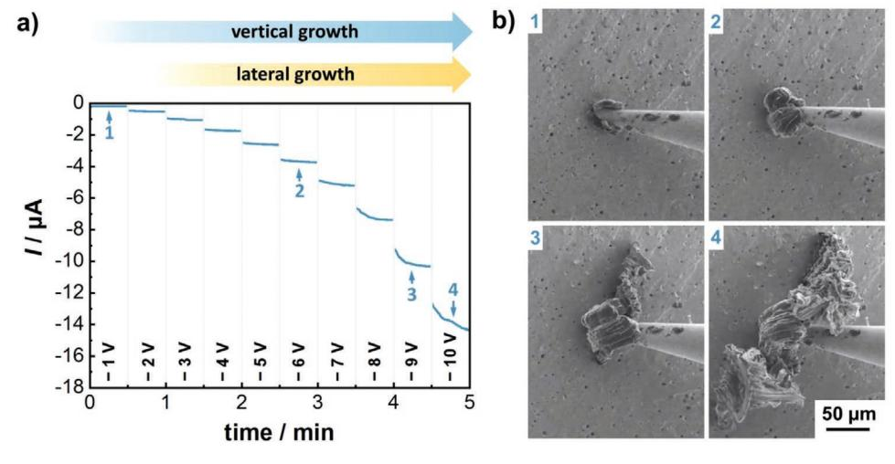
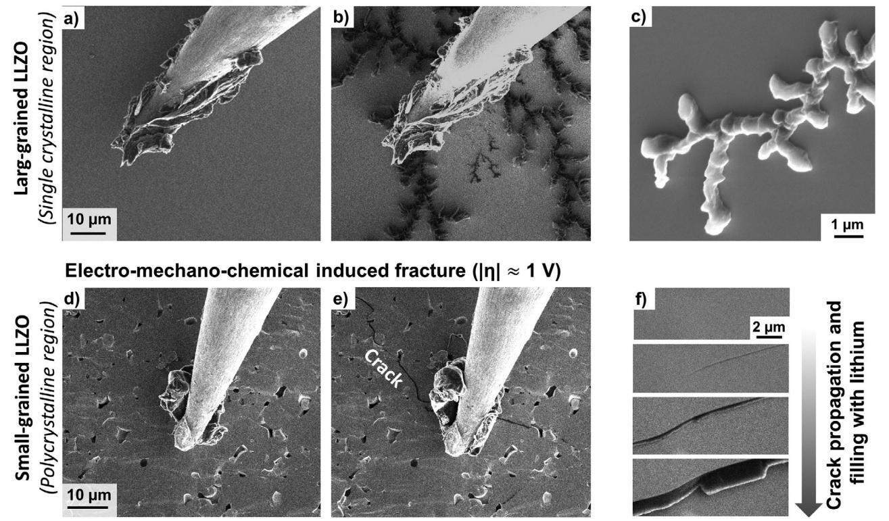
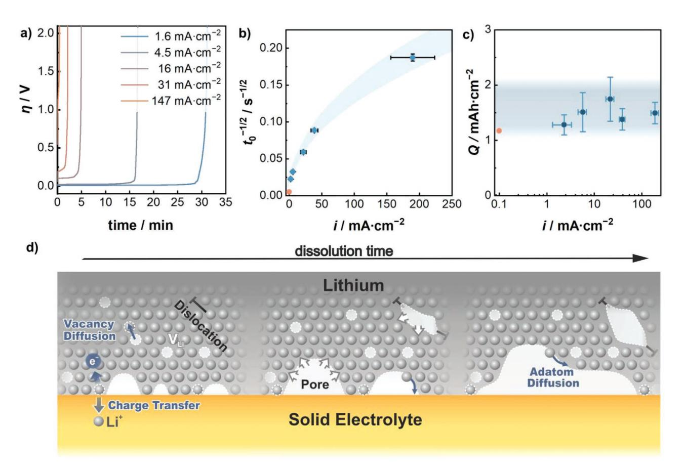

# **The Fast Charge Transfer Kinetics of the Lithium Metal Anode on the Garnet-Type Solid Electrolyte Li6.25Al0.25La3Zr2O12**

*Thorben Krauskopf,\* Boris Mogwitz, Hannah Hartmann, Dheeraj K. Singh, Wolfgang G. Zeier, and Jürgen Janek\**

**The charge transfer kinetics between a lithium metal electrode and an inorganic solid electrolyte is of key interest to assess the rate capability of future lithium metal solid state batteries. In an in situ microelectrode study run in a scanning electron microscope, it is demonstrated that—contrary to the prevailing opinion—the intrinsic charge transfer resistance of the Li| Li6.25Al0.25La3Zr2O12 (LLZO) interface is in the order of 10−1 Ω cm2 and thus negligibly small. The corresponding high exchange current density in combination with the single ion transport mechanism (***t***+ ≈ 1) of the inorganic solid electrolyte enables extremely fast plating kinetics without the occurrence of transport limitations. Local plating rates in the range of several A cm−2 are demonstrated at defect free and chemically clean Li**|**LLZO interfaces. Practically achievable current densities are limited by lateral growth of lithium along the surface as well as electro-chemo-mechanical-induced fracture of the solid electrolyte. In combination with the lithium vacancy diffusion limitation during electrodissolution, these morphological instabilities are identified as the key fundamental limitations of the lithium metal electrode for solid-state batteries with inorganic solid electrolytes.**

# **1. Introduction**

Lithium metal solid-state batteries (LM-SSBs) are currently investigated as a future battery technology with conventional layered cathode materials, because they can offer benefits in the

- T. Krauskopf, Dr. B. Mogwitz, H. Hartmann, Dr. D. K. Singh, Dr. W. G. Zeier, Prof. J. Janek Institute of Physical Chemistry Justus-Liebig-University Giessen Heinrich-Buff-Ring 17, Giessen D-35392, Germany E-mail: thorben.krauskopf@phys.chemie.uni-giessen.de; juergen.janek@phys.chemie.uni-giessen.de Dr. W. G. Zeier, Prof. J. Janek Center for Materials Research (ZfM) Justus-Liebig-University Giessen Heinrich-Buff-Ring 16, Giessen D-35392, Germany The ORCID identification number(s) for the author(s) of this article can be found under https://doi.org/10.1002/aenm.202000945.
- © 2020 The Authors. Published by WILEY-VCH Verlag GmbH & Co. KGaA, Weinheim. This is an open access article under the terms of the [Creative](http://creativecommons.org/licenses/by/4.0/)  [Commons Attribution](http://creativecommons.org/licenses/by/4.0/) License, which permits use, distribution and reproduction in any medium, provided the original work is properly cited.

#### **DOI: 10.1002/aenm.202000945**

gravimetric and volumetric energy density of up to 50% and 80% compared to future liquid electrolyte lithium ion batteries with graphite intercalation anode.[1,2]

In a LM-SSB, the flammable liquid organic solvent electrolyte is replaced with a solid electrolyte.[3] The solid electrolyte is believed to suppress dendritic growth and low coulombic efficiency on the lithium metal anode side,[4,5] which are the key issues for the use of a lithium metal electrode in conventional batteries with liquid electrolyte.[6–11] However, there are still remaining interfacial challenges of the lithium metal|solid electrolyte interface that need to be solved.[12,13] In particular, high interfacial impedances and the still not well understood growth of lithium through the solid electrolyte are currently the main discussed bottlenecks limiting the rate capability of the lithium metal anodes on solid electrolytes.

Compared to liquid electrolytes and

solid polymer electrolytes, inorganic solid electrolytes (ISEs) base on a single ion conduction mechanism with the transference number *t*(Li+) of unity. This should in theory prevent diffusion related transport limitations inside the ISE. However, in order to evaluate the rate performance that can be practically achieved, it is necessary to obtain a fundamental understanding of the charge transfer kinetics at the interface. Yet, the charge transfer kinetics between lithium metal and ISE is still rarely studied—both experimentally and theoretically. For the investigation of the elementary charge transfer process, an ISE that is electrochemically stable[14] in contact with lithium metal is required. The electrode kinetics of an unstable ISE would rather reflect the charge transfer kinetics between the emerging solid electrolyte interphase and the lithium metal anode. In this context, garnet-type ISEs, such as Li7La3Zr2O12 (LLZO), were experimentally shown to have sufficient stability at the lithium metal chemical potential *µ*Li0 , [15–17] as the thermodynamic driving force for decomposition is negligibly small.[18] Therefore LLZO-type ISEs are currently the most suitable model system to investigate the intrinsic Li|ISE interface kinetics without disturbance by unwanted chemical reactions.

For the investigation of the Li|LLZO interfacial kinetics, usually potentiostatic electrochemical impedance spectroscopy

(PEIS) is applied to symmetric Li|LLZO|Li cells, in which lithium metal foil is mechanically or thermally attached to a polished ISE surface. Contaminations on both, lithium metal[19] and the garnet ISE[20,21] as well as subsurface damage due to the polishing procedure[22] result in inhomogeneous active interface contact and have so far prevented reliable measurements of the intrinsic charge transfer kinetics between LLZO and lithium. High interfacial impedances in the range of up to several 1000  $\Omega$  cm2 are reported in literature.[23–25] In particular, a  $Li_2CO_3$  contamination layer, which rapidly forms on the LLZO ISE in humid atmosphere, is made responsible for the high interfacial impedances.[20,21] More recent reports show that the interfacial impedance for a bare Li|LLZO interface can be reduced to the single digit  $\Omega$  $\rm cm^2$  range,  $^{\left[19,26,27\right]}$  and recent theoretical results even indicate a negligible overall interfacial resistance in the range of  $10^{-2} \Omega$ cm2.[28] Further, it has to be noted that impedance spectroscopy is usually performed with a small sinusoidal amplitude of around 10 mV and thus gives solely information on the linear range of the interface kinetics. There is only a limited number of reports dealing with the electrode kinetics of lithium metal anode on ISE in the high overpotential (>100 mV) regime, which all point toward a bulk transport limitation, but yet were not able to provide mechanistic insights into the charge transfer reaction itself.[29-33]

**1DVANCED** 

**CIENCE NEWS** www.advancedsciencenews.com

For the theoretical description of lithium ion transfer at the Li|ISE interface, the Butler-Volmer (BV) equation[34,35] (see Equation (1)) or extended versions are widely used[36,37]

$$i = i_0 \left[ \exp \left( -\frac{\alpha F}{RT} \eta \right) - \exp \left( -\frac{(1-\alpha)F}{RT} \eta \right) \right]$$
 (1)

Herein  $\eta = E - E_{eq}$  denotes the electrode overpotential,  $\alpha$  is the transfer coefficient, and the exchange current density  $i_0$  can be expressed by the charge transfer resistance  $R_{CT}$  via  $i_0 = RT \cdot (F \cdot R_{CT})^{-1}$  which can be obtained by measurements in the linear regime of the electrode kinetics. For precise theoretical models dealing with the lithium metal anode in SSBs, the charge transfer reaction needs to be well known.[38] In literature, the charge transfer resistance is often set equal to the interfacial impedance.

However, recent results clearly show that the Li|LLZO interfacial impedance does not reflect the charge transfer alone, but is rather dominated by current constriction resistances in the ISE at the interface.[26] This demonstrates the need to find experimental methods to better characterize the charge transfer kinetics of the lithium electrode on ISEs. For solid polymer electrolytes (SPEs), pulsed techniques were recently performed to obtain deeper insights into the nature of the charge transfer at the Li|SPE interface and it was found that a series of different interface processes determine the overall kinetics, in particular two charge transfer processes as well as the transport across the solid electrolyte interphase.[39] Very recently, Boyle et al. were able to measure the charge transfer kinetics of the lithium metal electrode in ether type liquid electrolytes without contributions of ion blocking solid electrolyte interphases by transient voltammetry measurements with ultra-microelectrodes.[40] Their results indicated surprisingly fast charge transfer kinetics with exchange current densities as high as  $i_0 = 40$  mA cm-2.

More importantly, a simple BV model was not sufficient to mathematically describe the charge transfer reaction. Due to the single ion transport in ISEs, the Li|ISE interface is fundamentally different from the above-mentioned cases. The LiISE charge transfer kinetics is still largely unexplored and mechanistic insights are highly desirable for the development of accurate theoretical models.

In this work, we employ in situ generated lithium metal microelectrodes[41] on atomically smooth trans-granular LLZO cross-sections. Transgranular fracture surfaces offer the possibility to measure the true, unaltered interfacial kinetics without disturbing effects from unwanted contamination or segregation layers or by polishing introduced subsurface damage. Yet, in LM-SSB research on garnet type solid electrolytes, microelectrodes are currently mainly used for local conductivity measurements on the ISE.[42,43] By performing different electrochemical methods like PEIS, cyclic voltammetry, and galvanostatic as well as potentiostatic techniques on in situ generated lithium microelectrodes, we comprehensively measure the kinetics at the Li|LLZO interface and reveal the fast intrinsic nature of the elementary charge transfer reaction.

Based on the results, we find that rather ion transport within the LLZO ISE is the rate limiting step of the interface kinetics than charge transfer itself. Our measurements provide an upper limit for the Li|LLZO charge transfer (polarization) resistance, which is surprisingly low. Through simultaneous observations using scanning electron microscopy, we further reveal mechanisms governing cell failure at high current densities. Lithium metal growth through LLZO due to fracture of the ceramic and lateral growth of lithium along the LLZO surface are found to be responsible for the observed short circuits. The dominant failure mode is found to be critically dependent on the ISE microstructure. Furthermore, electrodissolution experiments with lithium metal microelectrodes show a similar transport limitation during lithium electrodissolution as found in our previous work[26] and the mechanism of contact loss due to vacancy injection is addressed. The obtained results can also be transferred to other Li|ISE systems, as they mainly reflect the nature of the lithium metal anode.

#### 2. Results and Discussion

#### 2.1. LiLLZO Charge Transfer Kinetics

To investigate the charge transfer kinetics, PEIS as well as CV measurements were performed on microelectrodes inside the scanning electron microscopy (SEM) chamber. Lithium microelectrodes were deposited in situ on atomically flat transgranular LLZO grain cross-sections using a tungsten needle. The schematic experimental setup is shown in **Figure 1a** and in more detail in Figure S1 of the Supporting Information. The characterization of the employed LLZO specimen can be found in Figure S2 of the Supporting Information.

Figure 1c shows the recorded impedance spectrum of the lithium microelectrode. A large sinusoidal amplitude of 400 mV was required to achieve reliable data. Data points below 200 Hz are excluded from the fit, because the consideration of these data points led to large residuals in the Kramers-Kronig test.[44]

**www.advancedsciencenews.com www.advenergymat.de**

**Figure 1.** Measurement setup and data for the charge transfer characterization of the Li|LLZO interface. a) Schematic experimental setup for the in situ measurements. The macroscopic lithium counter electrode (CE) was inherently also used as reference electrode (RE). The lithium microelectrode was in situ generated by plating on a tungsten needle and connected as working electrode (WE). LLZO substrates with different grain size were used for the measurements. b) SEM image of the in situ generated lithium microelectrode on the LLZO surface that was used for impedance characterization. c) Nyquist plot of the impedance spectrum of a lithium microelectrode on an atomically flat single crystalline LLZO cross-sectional surface. Data points are shown in blue, a fit using the denoted equivalent circuit is shown in orange. The red data points were excluded from the fit. d) Cyclic voltammogram recorded on compact lithium microelectrodes with a scan rate of 500 V min−1 . The slope d*I*/d*η* of the curve can be attributed to the constriction resistance inside the ISE and was used for the estimation of the interface contact of the microelectrode in order to calculate the corresponding current density (second *y*-axis).

For a discussion on the impedance data quality and analysis we refer to Figure S3 of the Supporting Information.

The impedance data in Figure 1c can be fit with an equivalent circuit consisting of a resistor in series with an ideal capacitance (*C*) in parallel with a resistor (*R*). The first resistor is attributed to ohmic losses caused by the microelectrode setup. The second parallel *R*–*C* circuit (*C*SE ≈ 7 × 10−11 F) can be attributed to the bulk ionic transport in the ISE within the microelectrode constriction zone (see Figure S4, Supporting Information).[41,45] With the knowledge of the resistance of the *R*–*C* circuit, the microelectrode diameter can be calculated from the constriction resistance *R*bulk = (2·*σ·d*) −1 . [41] The ionic conductivity of LLZO was measured separately on the macroscopic pellet and results as *σ =* 5.0 × 10−4 S cm−1 . Assuming circular geometry, the diameter of the lithium microelectrode is thus *d* = 27.5 µm. This value is in good agreement with the SEM image of the microelectrode as shown in Figure 1b, taking into account that the diameter of the interface contact spot is slightly smaller than the overall diameter of the microelectrode. In order to estimate the accuracy of this method for the evaluation of the contact geometry by the current constriction resistance, a lithium microelectrode was detached after determining the microelectrode resistance. The calculated and the real contact area are compared in Figure S5 of the Supporting Information. Very good agreement between the calculated and the real electrode area is found. Overall, a relative discrepancy of less than 20% is found. The estimation of the microelectrode interface contact area based on the current constriction resistance is more accurate than the graphical inspection of the microelectrode. Therefore, whenever no detachment was possible, this procedure was used for all area-normalized analyses in this work.

Most important, no significant additional impedance contribution was detected in the low frequency range, where the charge transfer process is expected. In order to estimate an upper limit for the charge transfer resistance, we estimated the error for the low frequency part of the measurement. Therefore, we simply calculated the difference between the fitted DC resistance (Re(Z) *f* → 0 Hz) and the real part of the last measurement point at 1 Hz that was not considered for the fit. The obtained charge transfer resistance *R*CT can thus been specified to be below 0.8 × 10−1 Ω cm² (*i*0 > 300 mA cm−2). The real value cannot be determined with the given resolution of the spectra. However, the obtained upper limit of *R*CT is already orders of magnitude lower than commonly reported interface resistances.[21,23,26,27] It is important to note that the overall interface resistances *R*int, which are reported in literature, should not be confused with the charge transfer resistance *R*CT. Measured interfacial resistances include all kinetic steps within the interface region including transport through high resistive layers like Li2CO3, [21] and we showed in a previous study that *R*int is dominated by current constriction effects, i.e., insufficient (atomic) contact between LLZO and lithium metal.[26] There is no report of a charge transfer resistance alone (or the exchange current density as directly related quantity) for the Li|LLZO interface so far, and our study shows that charge transfer is indeed not the rate limiting step dominating interfacial impedances in literature. The experimental result is also in good agreement with a recent theoretical study, which demonstrated that the intrinsic area specific resistance of the interface is in the order of *R*int = 10−2 Ω cm2 to which the charge transfer process contributes only a minor part with *R*CT = 2 × 10−3 Ω cm2 . [28]

As the impedance spectrum suggests that the electrode polarization can be attributed primarily to the ohmic IR drop inside the ISE (constriction resistance), a purely linear dependence of *i* versus *η* is expected. CV was used to check for possible deviations from linearity (see Figure 1d). The *I* versus *η* graph is indeed linear. This confirms that the electrode kinetics is dominated exclusively by the IR drop within the ISE. New methods are needed for a precise analysis of the nature of the charge transfer reaction and to obtain absolute values for the charge transfer resistance. Instrumentally, this is not feasible, as the essential correction of the IR drop—as usually performed in liquid electrolytes[40] —is not possible for LLZO due to the rate limiting role of the bulk ionic transport.

Lower scan rates led to a strong hysteresis in the CV data, especially during the anodic scans. This phenomenon is attributed to the vacancy transport limitations in the lithium metal[26,46] (Figure S6, Supporting Information). This transport limitation, which is—in addition to the charge transfer reaction—important for the treatment of the overall electrode kinetic is quantitatively more thoroughly investigated by the use of galvanostatic measurements which are discussed below.

#### **2.2. Li|LLZO Electrodeposition Kinetics**

As no transport limitation during plating was found, almost unlimited plating rates are expected to be possible for lithium metal plating on ISEs. **Figure 2** shows the results of a potentiostatic measurement, in which the externally applied overpotential was increased stepwise from −1 to −10 V. We like to emphasize that these high overvoltages are caused by the microelectrode (constriction) geometry and do not correspond to a charge transfer overvoltage.

Figure 2a shows the current profile during the stepwise increase of the externally applied plating overpotential. At low externally applied overpotentials, the current remains unchanged and the slope d*I*/d*t* is almost zero. This indicates stable plating without any change of the interface contact area. With increasing external applied overpotentials, the current strongly increases during the 30 s long potentiostatic pulses. This increase of current is attributed to the increase of the interface contact area.

This behavior becomes well visible when examining the video recorded in situ (see Video S1, Supporting Information; Figure 2b). At low overpotentials, stable vertical lithium whisker growth takes place. Further examples of vertical growth at low overpotentials are shown in Videos S2 and S3 of the Supporting Information. It is important to note that whisker growth was observable on the whole cross-sectional surface of LLZO. The high achievable growth rate of the whiskers reflects the intrinsic ultrafast plating kinetics of a clean interface, which was also assumed in a recent report of Motoyama et al.[22] However, Video S2 of the Supporting Information also shows at the very beginning preferred growth along a defect line. This is in agreement with a recent paper, in which lithium nucleation was observed to occur preferably at surface irregularities.[47] At higher overpotentials, the increase of the current goes along with an emerging lateral (fractal)[48] growth mode, which is facilitated at higher overpotentials. Using Faraday's law, the inspection of the growth rate allows calculating the local current density (see Equation (S6), Supporting Information). At −10 V (Video S1, second 44–45, Supporting Information) we estimate a growth rate of locally up to 15 µm s−1 . This demonstrates that a local current density as high as 11 A cm−2 is achieved during the measurement. Visually, different plating rates can be detected locally. The reason could be the presence

**Figure 2.** Potentiostatic plating experiments on a predeposited lithium microelectrode with a stepwise increase of the overpotential from −1 to −10 V. The experiments were performed on a single crystalline substrate with pinholes. Identical results were also obtained on fully dense cross-sections. a) Current profile and b) SEM images taken at different time intervals as indicated in the current profile. A change of the growth mode from purely vertical to additionally lateral growth was found with increasing applied negative overpotential.

of nonequilibrium defects like dislocations in the LLZO which can increase the local transport of ions in the ISE. Also, strong mechanical stresses can be induced by the tungsten needle. This becomes visible as it induces plastic deformation of lithium close to the tungsten tip. The local stresses can cause a boundary traction potential[49] in the ISE and may locally reduce the plating rates. Unfortunately, local stresses cannot be quantified experimentally. It has to be noted that Corish and O'Briain also demonstrated the intrinsic fast plating kinetics of parent metal whiskers on silver ion ISEs.[50] They used a supersaturation method to grow silver whiskers on *α*- Ag2S and showed that current densities of 8.5 A cm−2 can be achieved at low overvoltages of only a few mV.[50]

The onset overpotential at which lateral growth takes place is not well reproducible and varied from experiment to experiment. Usually the onset is above (|*η*| > 1 V) for ≈ 20 µm large microelectrodes. For plating experiments of silver on AgBr, a similar switch in the growth mode from whisker-like vertical growth to dendrite-like lateral growth was observed and attributed to the change of the electric field distribution at the microelectrode.[51] The electric field distribution close to the microelectrode and especially along the surface is very sensitive to the electronic properties of the LLZO surface and the dimensions of the microelectrode. For LLZO, a theoretical study predicted a highly increased electronic conductivity at the surface compared to the bulk,[52,53] which could promote lateral growth. The different surface properties of differently oriented grain cross-sections as well as the different microelectrode geometry at the beginning of the potentiostatic load are the most relevant causes for the wide spread in the observed onset overpotential for lateral growth.[54] For extended electrodes in real battery devices, the onset overpotential/current density for lateral growth is expected to be even larger, as the fraction of current lines parallel to the surface is small.[51,54] Therefore stable plating at current densities even higher than 102 mA cm−2 is expected to be in principle achievable for macroscopic lithium electrodes on defect free LLZO substrates. Stable lithium plating–stripping at current densities up to 10 mA cm−2 were also recently reported in symmetric cell tests[19] and our work suggests that even higher values may be achieved.

To further investigate the lateral growth mode, a high negative overpotential of −10 V was applied immediately after contacting a microelectrode with a small amount of predeposited lithium. **Figure 3**a–c and Video S4 of the Supporting Information show the lateral, dendrite like growth of lithium along the LLZO surface. Already after 2 s, lithium grows completely to the lithium counter electrode, which was about 1 mm away from the microelectrode, and short circuits both electrodes (Figure S7, Supporting Information). The short circuit also induces strong Joule heating and leads to local melting of the dendritic lithium filaments. The fractal growth mode points toward a transport limitation of the Li+ inside the solid electrolyte.

**Figure 3.** Failure modes causing short circuits due to lithium growth to the counter electrode. a,b) SEM images of lateral, dendritic growth along the ISE surface before and after plating at high negative overpotentials. c) High resolution image of the dendritic structure. d,e) SEM images of electrochemically induced fracture of a polycrystalline LLZO substrate. The crack is initiated at a negative overpotential of around −0.7 V. f) High resolution images of the crack propagation mechanism showing the immediate filling of the crack with lithium metal.

This phenomenon is called diffusion-limited aggregation and was also found for copper growth on mixed conducting CuBr films.[48]

For fully dense single grain substrate regions, lateral growth toward the counter electrode was the dominant failure mode causing short circuits. However, for polycrystalline materials with a grain size of 10 µm, intergranular and intragranular crack formation close to the micromanipulator tip and crack propagating to the counter electrode were found to dominate cell failure (see Figure 3d–f; Videos S5 and S6, Supporting Information). Crack formation occurred at much lower negative overpotentials (|*η*| < 1 V) compared to lateral growth. These results demonstrate that the defect concentration and geometry of polycrystalline pellet surfaces are the main descriptors for crack initiation, as previously suggested by Porz et al.[55] The large difference in the fracture susceptibility between single crystalline and polycrystalline substrates further proves the strong impact of the microstructure on the short circuiting susceptibility. Although the grain boundary regions have a high impact on the fracture susceptibility, lithium mainly grows intragranular. This is also in agreement with macroscopic measurements on polycrystalline garnet samples, which also showed an involvement of transgranular fracture on the cell short circuits.[56–58] In addition, preferred growth along the grain boundary regions[59] as well as growth through interconnected pores[60,61] in pellets with open porosity are reported failure modes.

#### **2.3. Li|LLZO Electrodissolution Kinetics**

The microelectrode setup also allows measuring the electrodissolution kinetics at very high stripping rates. **Figure 4**a shows current density-dependent electrodissolution experiments on compact, around 2000 µm² large lithium metal microelectrodes.

**Figure 4.** Galvanostatic measurements on the electrodissolution kinetics of the lithium metal anode on LLZO. a) Potential profile during lithium electrodissolution experiments on compact lithium microelectrodes as a function of the current density. b) Plot of the depletion times against the current density according to Sand's equation, showing no linear correlation. c) Plot of the cumulative areal capacity that can be stripped as function of the applied current density. For each data point, three microelectrode experiments have been performed. The error bars indicate the standard deviation of these three measurements. The orange point denotes the areal charge that can be stripped at 100 µA cm−2 as estimated from a electrodissolution experiment on a macroscopic mechanically attached lithium electrode according to a previous work.[26] d) Schematic of the processes at the Li|ISE interface with a rigid ceramic ISE. If the critical current density during galvanostatic electrodissolution is exceeded, pores form and grow at the interface. The quantitative treatment of lithium depletion at the interface becomes complicated due to the contribution of manifold surface diffusion processes. Direct charge transfer reactions are only possible at the remaining contact points resulting in an increase of the interface resistance and a temporal change of the local current density at the interface.

*Adv. Energy Mater.* **2020**, *10*, 2000945

The microelectrode area varied slightly from experiment to experiment and was calculated according to Equation (2). For the derivation, we refer to the Supporting Information.

$$i = \frac{I}{A} = I \frac{16 \cdot \sigma^2 \cdot \eta_0^2}{\pi \cdot I_0^2}$$
 (2)

For all dissolution experiments, the overpotential increases strongly at the end of the stripping cycle. The increase in the overpotential can be directly correlated to the loss of effective contact. This is proven by impedance spectra that are recorded at different stages during stripping (see Figure S8, Supporting Information). The electrodissolution measurements at different current densities demonstrate that fully reversible dissolution of the electroplated lithium metal whiskers was not possible. This is in stark contrast to silver whiskers, which can be fully reversibly dissolved after deposition.[50,62] One explanation for the different behavior may also be attributed to the so-called "memory effect" of electroplated metals.[63-66] While this effect was shown to facilitate the electrodissolution of freshly deposited silver metal, it was not observed for the lithium microelectrodes in this work. The reasons for this difference is thoroughly discussed in Note S1 including Figure S9 of the Supporting Information.

As no memory effect was observed for the lithium microelectrodes, one could assume that the depletion times  $t_0$  in Figure 4a merely depend on the bulk diffusion properties of lithium metal. In an early work, Jow and Liang related the temporal depletion of lithium on an ISE to the self-diffusion coefficient in lithium metal. They used Sand's equation (see Equation (3)) to quantitatively describe the temporal decrease of the active site number (effective contact area) at the interface according to a simple 1D diffusion problem obeying Fick's second law[67]

$$\frac{1}{\sqrt{t_0}} = \frac{2}{\sqrt{D \cdot \pi} \cdot c_0 \cdot F} \cdot i \tag{3}$$

Herein,  $c_0$  denotes the initial concentration of lithium, which is 69.6 mmol cm $-3$  and *D* is assumed to be the self-diffusion coefficient of lithium in lithium metal. In Figure 4b, we analyzed our data according to Equation (3).[68]

For a constant vacancy diffusion coefficient and a 1D diffusion profile, a linear relation is expected. However, the graph strongly deviates from linearity. For a simple diffusion problem according to Equation (3), this would indicate that the diffusion coefficient increases orders of magnitude with increasing current density, which is unphysical. While for low current densities, linearity might be approximated, this is definitely not possible in the investigated wide range observed in this study. Also the data from Jow and Liang, which were collected in a range up to 1.5 mA cm-2, show a similar deviation from linearity at the higher investigated current densities.[67]

In Figure 4c, the cumulated areal charge that can be passed during stripping is plotted against the current density. Interestingly, the areal cumulated charge results for all measurements in the range between 1 and 2 mAh cm-2 and can be regarded as almost constant within the error interval and apparently is independent from the applied current density. Furthermore, the data point for a measurement performed on macroscopic electrodes, as taken from a previous work,[26] is shown as orange data point and also shows that a similar areal charge can be stripped from an ideally mechanically contacted macroscopic lithium metal electrode. This suggests that, independent of the current density and the state of the electroplated lithium, a defined and constant quantity of lithium can be dissolved until full contact loss occurs. This quantity corresponds to around (3–6)  $\times$  104 virtual monolayers of stripped lithium (i.e., around 5–10  $\mu$ m).

At first glance, this is in contradiction to a conventional diffusion problem. Certainly, the model of 1D diffusion highly oversimplifies the real transport kinetics in the lithium metal electrode. If the intrinsic vacancy-mediated diffusion of lithium cannot keep up with the external applied current density, pores will form at the interface. We roughly estimated the critical current density, at which the interface gets morphologically unstable, in a recent publication as  $10^{-2}$ – $10^{-1}$  mA cm-2; far below the current densities investigated in the present work. Therefore, the critical current density is far exceeded in the microelectrode measurements and pores will form at the interface. For the temporal loss of contact, a highly complicated 3D transport problem has to be solved with the strong participation of surface diffusion processes[69] (see Figure 4d). As surface diffusion processes are usually faster than bulk diffusion at room temperature,[70] the growth rate of the pores may be dominated by the charge passed per area and be relatively insensitive to the current density. Especially at high current densities, the counteracting bulk diffusion mechanism may be too slow to become relevant in the kinetic data. It has to be noted that the herein estimated areal charge of around  $1-2$  mAh cm-2 is below the practical requirements of  $>5$  mAh cm-2.[71] This shows that a better understanding of the transport limitation inside the lithium metal anode is decisive for its practical application. Future atomistic models and theoretical long-scale kinetic simulations may help to identify the involved diffusive processes counteracting lithium depletion at a solid|solid interface.

# 3. Conclusions

In this study, we took advantage of in situ generated lithium metal microelectrodes to thoroughly investigate the kinetics, rate capability and morphological instability of the lithium metal anode on LLZO-type model electrolytes.

The model experiments demonstrate the ultrafast charge transfer kinetics ( $R_{CT}$  < 10-1  $\Omega$  cm2) of stable and clean Li|LLZO interfaces which enables fast stable plating rates in the range of several 100 mA cm-2. The plating rates determined in this work are more than one order of magnitude larger than required on the battery cell level (10 mA cm-2). In this experimental ideal case scenario, the stripping kinetics and in particular the transport limitation due to the vacancy injection and diffusion is determined as the sole kinetic parameter that fundamentally restricts the rate capability of metal anodes on ISEs. Despite the related morphological instability, we showed that a significant amount of lithium can be stripped; even at very high current densities of several hundred mA cm−2, which is ascribed to very fast surface diffusion in pores at the interface.

The results have far-reaching implications for the mechanistic understanding of the lithium metal anode on stable ISEs. They show that the rate limiting role of the charge transfer kinetics in combination with space charge layer is clearly overestimated in literature for the Li|LLZO interface.[72] A precise knowledge of the charge transfer kinetics is very important for the prediction of precise potential profiles in batteries and modeling approaches for lithium metal growth through ceramic electrolytes.[38,49,73]

With this work, we hope to stimulate a rethinking of the kinetics of metal electrodes on single ion conductors and to inspire future theoretical and experimental work on the atomistic understanding of the charge transfer reaction. This understanding is required to obtain meaningful predictions of the rate capability of lithium metal anodes under ideal conditions. We believe that these results are not restricted to the Li|LLZO interface and can be transferred to the kinetics of the lithium metal electrode on other ISEs or inorganic solid electrolyte interphases. We expect that the charge transfer reaction with all types of fast single ion conductors will be mechanistically similar and of low impedance.

From a technological perspective, the fast charge transfer kinetics as well as the in principle achievable ultrafast plating kinetics will therefore be by no means prohibitive for the use of the lithium metal electrode in LM-SSBs with ISEs. This demonstrates that, in theory, fast charging of LM-SSBs can be achieved on ISEs with regard to the metal anode side. The problem of short circuiting by growth of lithium through the ISE was found to be highly correlated to the ISE microstructure and may ultimately be the most critical practical bottleneck, because it is a highly complicated engineering task to obtain the clean and defect free interfaces investigated in this work on the cell level.

#### **4. Experimental Section**

*Preparation of LLZO Solid Electrolyte Pellets*: Large-grained and smallgrained Li6.25Al0.25La3Zr2O12 (LLZO) pellets were prepared using a classical solid-state synthetic route. The procedure is described in detail in a previous work.[26] In order to promote grain growth,[74] a 3 wt% excess of the lithium source Li2CO3 (>99.0%, Sigma-Aldrich) was used in this work. For large grained LLZO with a grain size of around 1 mm, sintering was performed for 15 h at 1250 °C. Polycrystalline material with a smaller grain size of around 10 µm was synthesized the same way but with sintering for only 4 h at 1250 °C.

*Material Characterization*: X-ray diffraction was used to determine the crystalline phases of the pellets. A representative large- and smallgrained LLZO pellet was sealed under inert atmosphere inside a sample holder (PANalytical) with a polycarbonate dome. Additionally, the large-grained pellet was manually ground to powder afterward and placed on a (911)-oriented silicon zero background holder for a second measurement. X-ray diffraction was performed using a PANalytical Empyrean powder diffractometer in Bragg–Brentano *θ*–*θ* geometry with Cu K*α* radiation. Measurements were carried out in the 2*θ* range between 20° and 90° with a step size of 0.026°. The counting time per step was 200 s. The cross-sectional microstructure of the pellets was investigated using a Carl Zeiss Ultra field emission SEM instrument (Merlin). Pellets were fractured manually. The air-sensitive samples were transferred from the glovebox to the vacuum chamber of the SEM with a Leica transfer module system (EM VCT500).

*Cell Assembly and In Situ SEM Setup*: For cell assembly, LLZO pellets were dry polished inside a glovebox (500 grit SiC, Buehler, CarbiMet). Then a lithium metal counter electrode was attached on one side of the pellet. Therefore, fresh lithium foil was pressed from a thin lithium plate that was cut from a lithium metal rod (99.8%, abcr) with a ceramic knife. The lithium metal electrode (thickness ≈ 100 µm, diameter = 6 mm) was then pressed on the pellet surface using a hand press at a pressure of around 20 MPa. The pellet was fractured manually into two semicircular pieces and one of the pieces was then vertically placed into a homemade sample holder and was fixed by an electronically conductive grub screw (see Figure S1b, Supporting Information). The sample holder was then fixed on a cubic stub for transfer into the SEM chamber with a Leica transfer module system (EM VCT500).

The experimental setup inside the SEM is shown in Figure S1a of the Supporting Information. A microelectrode module (prober module, Kammrath & Weiss GmbH) with two micromanipulators was installed inside the SEM chamber (Carl Zeiss Ultrafield emission SEM instrument (Merlin)). Tungsten needles (Simac Masic & TSS bv) were attached on the micromanipulators, which can be externally operated in *x*, *y*, and *z* directions under high-vacuum condition by a control unit. The electrically shielded connections for the microelectrodes and the control units of the micromanipulators are guided through a passage to the outside of the HR-SEM chamber. Additionally, the transfer track, which is in electronic connection with the lithium counter electrode, but isolated from the SEM stage, was also connected similarly.

*Electrochemical Measurements*: For all measurements, the mechanically pressed macroscopic lithium counter electrode acted inherently as reference electrode. One of the micromanipulators was then oriented and contacted to the transgranular fracture surface of the LLZO pellet and was used as working electrode. The force of the tungsten needle on the garnet was measurable, but is negligibly small as the microelectrode is just attached via a flexible thin metal wire. However, due to the small diameter, large stresses may be induced locally. A SP-150 potentiostat (Bio-Logic) with implemented impedance analyzer was used for all electrochemical measurements. Electrochemical characterization was performed by impedance spectroscopic, cyclic voltammetric and galvanostatic as well as potentiostatic methods. PEIS was performed on lithium metal working electrodes in a frequency range from 1 MHz to 1 Hz. Cyclic voltammetry was performed in a range between −1 and 1 V versus Li+/Li. The specific measurement settings are included in Section 2 and varied depending on the electrode geometry. Except for the metal plating experiments, a suitable amount of lithium was predeposited on the tungsten needles and the lithium reservoir acted as working electrode. The pressure inside the SEM chamber during the measurements was smaller than 10−3 Pa.

# **Supporting Information**

Supporting Information is available from the Wiley Online Library or from the author.

#### **Acknowledgements**

This work was funded in part by the German Federal Ministry of Education and Research (BMBF) under the project "EvaBatt," Grant Identifier No. 03XP0134C and the project "LiSi," Grant Identifier No. 03XP0224E. T.K. acknowledges financial support (Kekulé scholarship) by the Funds of the Chemical Industry (FCI).

# **Conflict of Interest**

The authors declare no conflict of interest.

**www.advancedsciencenews.com www.advenergymat.de**

#### **Keywords**

dendrites, lithium metal anodes, LLZO, solid electrolytes, solid-state batteries

> Received: March 12, 2020 Revised: May 6, 2020 Published online: June 5, 2020

- [1] J. Betz, G. Bieker, P. Meister, T. Placke, M. Winter, R. Schmuch, *Adv. Energy Mater.* **2019**, *9*, 1803170.
- [2] S. Randau, D. A. Weber, O. Kötz, R. Koerver, P. Braun, A. Weber, E. Ivers-Tiffée, T. Adermann, J. Kulisch, W. G. Zeier, F. H. Richter, J. Janek, *Nat. Energy* **2020**, *5*, 259.
- [3] J. Janek, W. G. Zeier, *Nat. Energy* **2016**, *1*, 16141.
- [4] C. Monroe, J. Newman, *J. Electrochem. Soc.* **2004**, *151*, A880.
- [5] C. Monroe, J. Newman, *J. Electrochem. Soc.* **2005**, *152*, A396.
- [6] J.-G. Zhang, W. Xu, W. A. Henderson, *Lithium Metal Anodes and Rechargeable Lithium Metal Batteries*, Springer International Publishing, Basel **2017**, p. 5.
- [7] X.-Q. Zhang, X. Chen, R. Xu, X.-B. Cheng, H.-J. Peng, R. Zhang, J.-Q. Huang, Q. Zhang, *Angew. Chem.* **2017**, *129*, 14395.
- [8] D. Lin, Y. Liu, Y. Cui, *Nat. Nanotechnol.* **2017**, *12*, 194.
- [9] J.-M. Tarascon, M. Armand, *Materials For Sustainable Energy: A Collection of Peer-Reviewed Research and Review Articles from Nature Publishing Group*, World Scientific, Singapore **2011**, p. 171.
- [10] T. Placke, R. Kloepsch, S. Duehnen, M. Winter, *J. Solid State Electrochem.* **2017**, *21*, 1939.
- [11] X.-B. Cheng, R. Zhang, C.-Z. Zhao, Q. Zhang, *Chem. Rev.* **2017**, *117*, 10403.
- [12] R. C. Xu, X. H. Xia, S. Z. Zhang, D. Xie, X. L. Wang, J. P. Tu, *Electrochim. Acta* **2018**, *284*, 177.
- [13] H.-D. Lim, J.-H. Park, H.-J. Shin, J. Jeong, J. T. Kim, K.-W. Nam, H.-G. Jung, K. Y. Chung, *Energy Storage Mater.* **2020**, *25*, 224.
- [14] Y. Zhu, X. He, Y. Mo, *J. Mater. Chem. A* **2016**, *4*, 3253.
- [15] Y. Zhu, J. G. Connell, S. Tepavcevic, P. Zapol, R. Garcia-Mendez, N. J. Taylor, J. Sakamoto, B. J. Ingram, L. A. Curtiss, J. W. Freeland, *Adv. Energy Mater.* **2019**, *9*, 1803440.
- [16] H. Duan, H. Zheng, Y. Zhou, B. Xu, H. Liu, *Solid State Ionics* **2018**, *318*, 45.
- [17] K. Hofstetter, A. J. Samson, S. Narayanan, V. Thangadurai, *J. Power Sources* **2018**, *390*, 297.
- [18] Y. Zhu, X. He, Y. Mo, *ACS Appl. Mater. Interfaces* **2015**, *7*, 23685.
- [19] H. Zheng, S. Wu, R. Tian, Z. Xu, H. Zhu, H. Duan, H. Liu, *Adv. Funct. Mater.* **2020**, *30*, 1906189.
- [20] H. Huo, J. Luo, V. Thangadurai, X. Guo, C. Nan, X. Sun, *ACS Energy Lett.* **2020**, *5*, 252.
- [21] A. Sharafi, S. Yu, M. Naguib, M. Lee, C. Ma, H. M. Meyer, J. Nanda, M. Chi, D. J. Siegel, J. Sakamoto, *J. Mater. Chem. A* **2017**, *5*, 13475.
- [22] M. Motoyama, Y. Tanaka, T. Yamamoto, N. Tsuchimine, S. Kobayashi, Y. Iriyama, *ACS Appl. Energy Mater.* **2019**, *2*, 6720.
- [23] H. Buschmann, J. Dölle, S. Berendts, A. Kuhn, P. Bottke, M. Wilkening, P. Heitjans, A. Senyshyn, H. Ehrenberg, A. Lotnyk, *Phys. Chem. Chem. Phys.* **2011**, *13*, 19378.
- [24] A. Sharafi, H. M. Meyer, J. Nanda, J. Wolfenstine, J. Sakamoto, *J. Power Sources* **2016**, *302*, 135.
- [25] L. Cheng, W. Chen, M. Kunz, K. Persson, N. Tamura, G. Chen, M. Doeff, *ACS Appl. Mater. Interfaces* **2015**, *7*, 2073.
- [26] T. Krauskopf, H. Hartmann, W. G. Zeier, J. Janek, *ACS Appl. Mater. Interfaces* **2019**, *11*, 14463.
- [27] A. Sharafi, E. Kazyak, A. L. Davis, S. Yu, T. Thompson, D. J. Siegel, N. P. Dasgupta, J. Sakamoto, *Chem. Mater.* **2017**, *29*, 7961.
- [28] J. Gao, X. Guo, Y. Li, Z. Ma, X. Guo, H. Li, Y. Zhu, W. Zhou, *Adv. Theory Simul.* **2019**, *2*, 1900028.

- [29] M. Chiku, W. Tsujiwaki, E. Higuchi, H. Inoue, *J. Power Sources* **2013**, *244*, 675.
- [30] M. Meyer, H. Rickert, U. Schwaitzer, *Solid State Ionics* **1983**, *9–10*, 689.
- [31] V. Lushta, D. Dietzel, B. Roling, A. Schirmeisen, *ACS Appl. Mater. Interfaces* **2019**, *11*, 5476.
- [32] H. Buschmann, S. Berendts, B. Mogwitz, J. Janek, *J. Power Sources* **2012**, *206*, 236.
- [33] M. Chiku, W. Tsujiwaki, E. Higuchi, H. Inoue, *Electrochemistry* **2012**, *80*, 740.
- [34] T. Erdey-Grúz, M. Volmer, *Z. Phys. Chem.* **1930**, *150*, 203.
- [35] K.-J. Vetter, S. Bruckenstein, B. Howard, *Electrochemical Kinetics: Theoretical Aspects: Sections 1, 2 and 3 of Electrochemical Kinetics: Theoretical and Experimental Aspects*, Academic Press, New York, CA **1967**.
- [36] M. Klinsmann, F. E. Hildebrand, M. Ganser, R. M. McMeeking, *J. Power Sources* **2019**, *442*, 227226.
- [37] M. Ganser, F. E. Hildebrand, M. Klinsmann, M. Hanauer, M. Kamlah, R. M. McMeeking, *J. Electrochem. Soc.* **2019**, *166*, H167.
- [38] G. Li, C. W. Monroe, *Phys. Chem. Chem. Phys.* **2019**, *21*, 20354.
- [39] L. Blume, U. Sauter, T. Jacob, *Electrochim. Acta* **2019**, *318*, 551.
- [40] D. T. Boyle, X. Kong, A. Pei, P. E. Rudnicki, F. Shi, W. Huang, Z. Bao, J. Qin, Y. Cui, *ACS Energy Lett.* **2020**, *5*, 701.
- [41] J. Fleig, *Solid State Ionics* **2003**, *161*, 279.
- [42] S. Smetaczek, A. Wachter-Welzl, R. Wagner, D. Rettenwander, G. Amthauer, L. Andrejs, S. Taibl, A. Limbeck, J. Fleig, *J. Mater. Chem. A* **2019**, *7*, 6818.
- [43] A. Wachter-Welzl, R. Wagner, D. Rettenwander, S. Taibl, G. Amthauer, J. Fleig, *J. Electroceram.* **2017**, *38*, 176.
- [44] B. A. Boukamp, *Solid State Ionics* **2004**, *169*, 65.
- [45] J. T. S. Irvine, D. C. Sinclair, A. R. West, *Adv. Mater.* **1990**, *2*, 132.
- [46] T. Krauskopf, B. Mogwitz, C. Rosenbach, W. G. Zeier, J. Janek, *Adv. Energy Mater.* **2019**, *9*, 1902568.
- [47] T. Krauskopf, R. Dippel, H. Hartmann, K. Peppler, B. Mogwitz, F. H. Richter, W. G. Zeier, J. Janek, *Joule* **2019**, *3*, 2030.
- [48] C. Lambert, P. Lauque, J.-L. Seguin, G. Albinet, M. Bendahan, J.-M. Debierre, P. Knauth, *ChemPhysChem* **2002**, *3*, 107.
- [49] L. Barroso-Luque, Q. Tu, G. Ceder, *J. Electrochem. Soc.* **2020**, *167*, 020534.
- [50] J. Corish, C. D. O'Briain, *J. Cryst. Growth* **1972**, *13–14*, 62.
- [51] K. Peppler, J. Janek, *Solid State Ionics* **2006**, *177*, 1643.
- [52] H.-K. Tian, Z. Liu, Y. Ji, L.-Q. Chen, Y. Qi, *Chem. Mater.* **2019**, *31*, 7351.
- [53] H.-K. Tian, B. Xu, Y. Qi, *J. Power Sources* **2018**, *392*, 79.
- [54] K. Peppler, M. Poelleth, S. Meiss, M. Rohnke, J. Janek, *Z. Phys. Chem.* **2006**, *220*, 1507.
- [55] L. Porz, T. Swamy, B. W. Sheldon, D. Rettenwander, T. Frömling, H. L. Thaman, S. Berendts, R. Uecker, W. C. Carter, Y.-M. Chiang, *Adv. Energy Mater.* **2017**, *7*, 1701003.
- [56] W. Manalastas, J. Rikarte, R. J. Chater, R. Brugge, A. Aguadero, L. Buannic, A. Llordés, F. Aguesse, J. Kilner, *J. Power Sources* **2019**, *412*, 287.
- [57] L. C. Zhang, J. F. Yang, C. L. Li, Y. X. Gao, X. P. Wang, Q. F. Fang, *J. Power Sources* **2020**, *449*, 227610.
- [58] E. Kazyak, R. Garcia-Mendez, W. S. LePage, A. Sharafi, A. L. Davis, A. J. Sanchez, K.-H. Chen, C. Haslam, J. Sakamoto, N. P. Dasgupta, *Matter* **2020**, *2*, 1025.
- [59] E. J. Cheng, A. Sharafi, J. Sakamoto, *Electrochim. Acta* **2017**, *223*, 85.
- [60] Y. Ren, Y. Shen, Y. Lin, C.-W. Nan, *Electrochem. Commun.* **2015**, *57*, 27.
- [61] F. Shen, M. Dixit, X. Xiao, K. Hatzell, *ACS Energy Lett.* **2018**, *3*, 1056.
- [62] M. Rohnke, T. Best, J. Janek, *J. Solid State Electrochem.* **2005**, *9*, 239.
- [63] J. Janek, S. Majoni, *Ber. Bunsenges. Phys. Chem.* **1995**, *99*, 14.
- [64] R. D. Armstrong, T. Dickinson, H. R. Thirsk, R. Whitfield, *J. Electroanal. Chem. Interfacial Electrochem.* **1971**, *29*, 301.

**www.advancedsciencenews.com www.advenergymat.de**

- [65] J. H. Kennedy, F. Chen, A. Clifton, *J. Electrochem. Soc.* **1968**, *115*, 918.
- [66] D. O. Raleigh, *Electroanal. Chem.* **1971**, *6*, 87.
- [67] T. R. Jow, C. C. Liang, *J. Electrochem. Soc.* **1983**, *130*, 737.
- [68] S. A. Mareev, D. Yu. Butylskii, A. V. Kovalenko, A. V. Petukhova, N. D. Pismenskaya, L. Dammak, C. Larchet, V. V. Nikonenko, *Electrochim. Acta* **2016**, *195*, 85.
- [69] D. Gaissmaier, M. van den Borg, D. Fantauzzi, T. Jacob, *ChemSusChem* **2020**, *13*, 771.
- [70] P. Haasen, *Physical Metallurgy*, 3rd ed., Cambridge University Press, Cambridge, USA **1996**.
- [71] P. Albertus, S. Babinec, S. Litzelman, A. Newman, *Nat. Energy* **2018**, *3*, 16.
- [72] Y. Shen, Y. Zhang, S. Han, J. Wang, Z. Peng, L. Chen, *Joule* **2018**, *2*, 1674.
- [73] G. Bucci, J. Christensen, *J. Power Sources* **2019**, *441*, 227186.
- [74] Y. Ren, Y. Shen, Y. Lin, C.-W. Nan, *ACS Appl. Mater. Interfaces* **2019**, *11*, 5928.