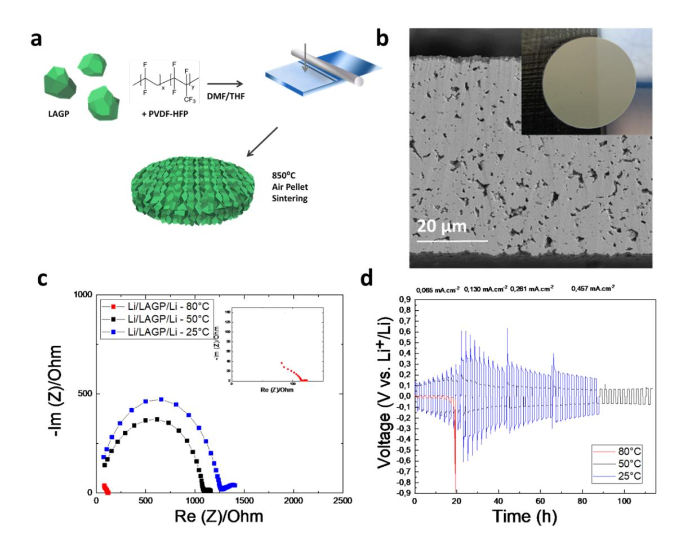
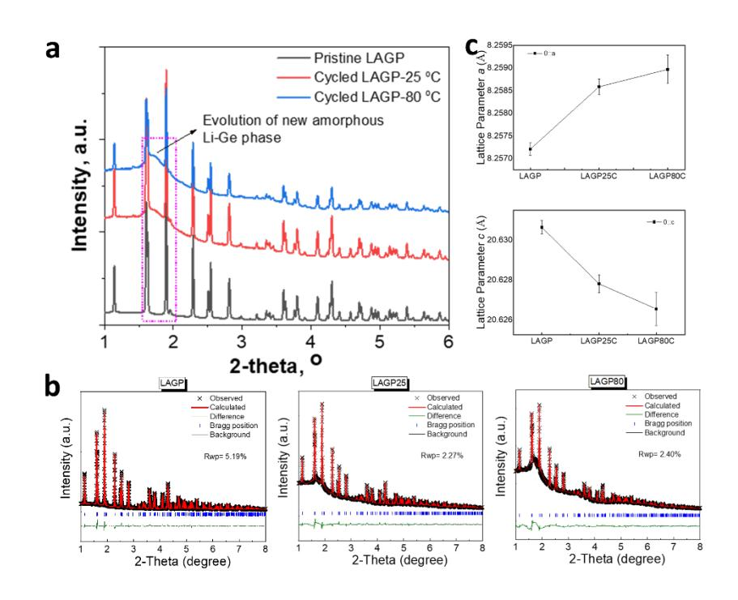
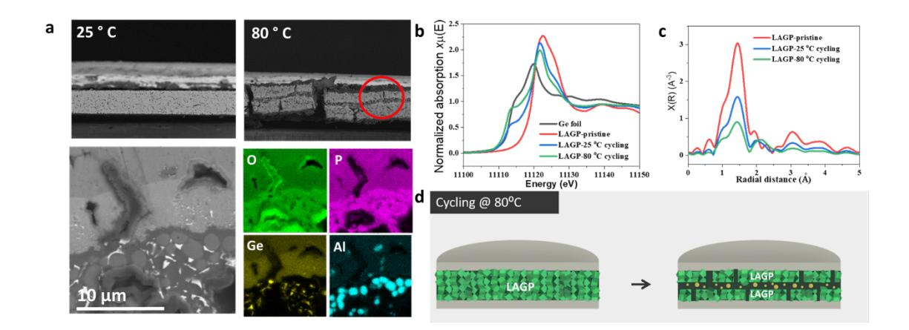
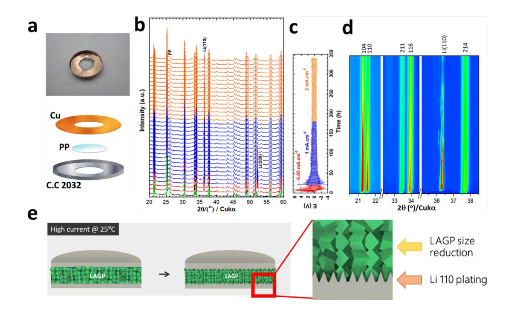

# **Understanding the reactivity of a thin Li1.5Al0.5Ge1.5(PO4)3 solid-state electrolyte toward metallic lithium anode**

Andrea Paolella1,° , Wen Zhu1,° , Gui-Liang Xu2,° , Andrea La Monaca1 , Sylvio Savoie1 , Gabriel Girard1 , Ashok Vijh1 , Hendrix Demers1 , Nicolas Delaporte1 , Alexis Perea1 , Abdelbast Guerfi1 , Xiang Liu,2 Yang Ren,3 Cheng-Jun Sun,3 Jun Lu2 , Khalil Amine2,\* and Karim Zaghib1,\*

1 Hydro-Québec, Center of Excellence in Transportation Electrification and Energy Storage, Varennes, Québec J0L 1N0, Canada

2 Chemical Sciences and Engineering Division, Argonne National Laboratory, 9700 South Cass Avenue, Lemont, IL 60439, USA

3 X-ray Science Division, Argonne National Laboratory, 9700 S Cass Ave, Lemont, IL 60439, USA

\* Corresponding author: Zaghib.karim@hydro.qc.ca; Amine@anl.gov

° These authors contributed equally to the manuscript.

**Keywords**: NASICON, Lithium metal, interface, temperature, plating

# **Abstract**

The thickness of solid-state electrolytes (SSEs) significantly affects the energy density and safety performance of all-solid-state lithium batteries. However, a sufficient understanding of the reactivity toward lithium metal of ultrathin SSEs (< 100 µm) based on NASICON remains lacking. Herein, for the first time, we develop a self-standing and ultrathin (70 µm) NASICON-type Li1.5Al*0.5*Ge1.5(PO4)3 (LAGP) electrolyte via a scalable solution process. X-ray diffraction, X-ray absorption spectroscopy, and X-ray photoelectron spectroscopy reveal that changes in LAGP at the metastable Li–LAGP interface during battery operation is temperature dependent. Severe germanium reduction and decrease in LAGP particle size are detected at the Li–LAGP interface at elevated temperature. Oriented plating of lithium metal on its preferred (110) face occurs during *in situ* XRD cycling.

#### **Introduction**

Lithium-ion batteries have revolutionized energy storage technology, dominating the application of portable electronic devices and emerging electric vehicles1 . However, stateof-the-art lithium-ion batteries have reached their energy density limit owing to the restriction of electrode materials. Lithium metal is considered as the ultimate anode for next-generation lithium batteries because of its high specific capacity (3860 mAh g-1 ) and low potential (-3.04 V vs. the standard hydrogen electrode). Replacing the conventional graphite by metallic lithium at the negative electrode can boost the specific energy of the cell by at least two-fold, depending on the cathode chemistry. However, conventional liquid electrolytes are highly flammable and may induce the formation of lithium dendrites, leading to dangerous short circuits and serious safety concerns. 2,3

All-solid-state lithium batteries (ASSLBs) with solid-state electrolytes (SSEs) have been considered as a promising candidate for the next generation of energy storage technology. It is widely accepted that the use of an optimal SSE can significantly increase energy density and improve safety performance owing to its wide electrochemical window and non-flammability. Several solid electrolytes based on polymer4 , ceramic oxides5 , ceramic sulfides6 , and hybrid polymer-ceramic7 materials have been reported and applied in ASSLB studies. Among them, NASICON-structured phosphate-based electrolytes, Li1.5Al*0.5*Ge1.5(PO4)3 (LAGP)8 - 9 and Li1.5Al*0.5*Ti1.5(PO4)3 (LATP)10, have attracted significant attention due to their high ionic conductivity (around 10-4 S/cm), high voltage stability (up to 5 V), and excellent moisture stability. 11 Despite these merits, LAGP and LATP suffer from poor structural stability against Li metal, which dramatically limits their practical application. Janek et al.12 and Kang et al.13 have both observed the reduction of LAGP and formation of a mixed conducting interface when LAGP is directly in contact with Li metal, leading to severely increased resistance and failure of the cell. Building a functional interlayer, such as a plastic super-conductive interlayer14, 3D gel polymer electrolyte15, and wetted polypropylene interlayer16, at the Li–LAGP interface has been an effective strategy for suppressing the untoward reactions between Li and LAGP. However, such successes are mostly based on thick LAGP (200 m–1 mm), which will not only lead to higher interfacial resistance but also dramatically lower overall energy density. To compete with the energy density of the liquid-type lithium-ion batteries, the scalable fabrication of ultrathin and self-standing LAGP (< 100m) that can act as an ASSLB analogue to the current separator in lithium-ion batteries is highly desired but technically challenging. To the best of our knowledge, the thinnest full ceramic (polymer free) LAGP electrolyte reported so far is 200 m17, which is still far thicker than the typical thickness (20–25 m) in current lithium-ion batteries. In addition, the fabrication processes, hotpressing and diamond-wire slicing, are not cost-effective. For those seeking to solve these problems, there is still a large knowledge gap between thick and ultrathin LAGP electrolytes in terms of ionic conductivity, mechanical stability, and chemical stability against Li metal, especially under harsh operating conditions (e.g., high temperature and high-rate cycling).

Herein, we report having for the first time fabricated a self-standing and ultrathin (~70 µm) LAGP electrolyte for high-energy ASSLBs via a scalable and cost-effective solutionbased process. Using synchrotron high-energy X-ray diffraction, X-ray absorption spectroscopy, and X-ray photoelectron spectroscopy, we further discovered that the phase evolution at the metastable LAGP–Li interface during cycling is temperature dependent, which results in a more severe germanium reduction in LAGP and induced phase decomposition at elevated temperatures. Reduction in LAGP crystallite size and the development of a preferred lithium (110) orientation are observed via in-situ X-ray diffraction, even under low current. The present understanding has provided critical clues for the advancement of the use of ultrathin SSEs for high-energy ASSLBs.

#### **Materials and Methods**

**Preparation of LAGP sheet.** A standard self-standing LAGP film was made by adding LAGP (purchased from MSE-300 nm particle size, as shown in **Figure S1**) to a mixture of polyvinyl difluoride-hexafluoropropylene (PVDF–HFP) in dimethylformamide (DMF) and tetrahydrofurane (THF) in 1:1 v/v ratio. This coating was cast onto a polypropylene sheet (to prevent the film from sticking) and dried at 50 °C to evaporate the THF. Then, a flexible film was punched and annealed between two glass disks in a muffle furnace (Nabertherme) at 850° C for 10 h in air. The density of the final thin LAGP is around 80% while the standard 1mm thick LAGP is around 90-95%. Symmetrical Li–LAGP/Li batteries were prepared by applying 36-µm-thick lithium metal disks (prepared at Hydro-Quebec Shawinigan laboratories) to both sides of LAGP pellets, assembled between two stainless steel spacers in a standard 2032 coin cell.

**Synchrotron high-energy X-ray diffraction (XRD) and X-ray absorption spectroscopy (XAS)**. Synchrotron high-energy XRD images of pristine and cycled LAGP were obtained with a Perkin-Elmer 2D X-ray detector at Beamline 11-ID-C of the Advanced Photon Source (APS) at Argonne National Laboratory. The X-ray wavelength was 0.1173 Å. By using the FIT2D program calibrated against a CeO2 standard, we converted 2D images into a 1D plot of 2θ versus intensity. In addition, Ge K-edge XAS of pristine and cycled LAGP was carried out in transmission mode at Beamline 20-BM-B of the APS.

**X-ray photoelectron spectroscopy (XPS).** This analysis was performed using a PHI 5600-ci spectrometer (Physical Electronics) to assess the chemical composition of the sample and the environment. An achromatic aluminum X-ray source (1486.6 eV) was used to record the survey (1400-0 eV) and the high-resolution (C1s, Ge3d, and Al2p) spectra, both without charge compensation. The detection angle was set at 45º with respect to the surface, and the analyzed area was 0.5 mm2 . The curve-fitting procedures for the different elements were performed by means of a least-squares Gaussian-Lorentzian peak fitting procedure, after Shirley background subtraction. The C1s peaks were referenced at 283.0 eV (the carbon is from carbide).

**In-situ XRD cycling.** The in-situ XRD patterns were collected from a standard 2032 coin cell with a polypropylene window. This measurement was performed on a Bruker D8 Advance diffractometer using Cu-K radiation. The total scan time was 1 h with a step size of 0.025°. The electrochemical measurement was conducted on a Biologic SP300 (Biologic Science Instrument), controlled by EC-Lab. The cell experienced (charge/1 h + discharge/1 h) cycles with increased currents for a total of 340 h (0.05 mA·cm-2 /10 cycles + 1 mA·cm-2 /80 cycles + 2 mA·cm-2 /80 cycles).

**Electrical conductivity** The electrical conductivities of a LAGP pellet and a LAGP-PVDF thin film were determined by 2-pin probe measurement using a Hiresta-UO (Model MCP-HT450, Mitsubishi Chemical Analytech) applying a voltage limit of 100 V. Ten measures for each sample were realized. The electrical conductivity of the sample was calculated taking into account the dimensions and the distance between the electrodes and the values of resistance (Ω) obtained.

#### **Results and Discussion**

**Thermal stability.** We have prepared a self-standing LAGP solid electrolyte as reported in the Methods section and **Figure 1a**. The LAGP thicknesses were controlled between 70 and 100 µm with ionic conductivities of 2 × 10-5 S/cm at 25 °C and 1 × 10-4 S/cm at 80 °C, respectively (see **Figure S2**). The thin LAGP showed an electronic conductivity value of 1.1 x10-9 S/cm making it a good candidate as solid electrolyte; moreover its value is lower than value reported for millimeter thick LAGP (1.44x10-8 S/cm) as shown in S.I. **Figure 1b** shows a scanning electron microscopy (SEM) image of a 70-µm-thick pellet after sintering, with its XRD pattern exhibiting the NASICON structure reported in **Figure S3**. The LAGP pellets were assembled in symmetrical Li/LAGP pellet/Li cells and cycled at 25 °C and 80 °C. **Figure 1c** shows that the cell has greater resistance at 80 °C than at 25 °C, although the ionic conductivity of LAGP is higher at the elevated temperature. At 50 °C the thin LAGP pellets showed an intermediate behavior between that observed at 25 °C and 80 °C (see **Figure 1)**: this result suggests that the LAGP–Li interface is linearly influenced by the temperature. The voltage profile evolution of the sample cycled at 25 °C suggests the probable formation of soft dendrites in agreement with Albertus et al.18

The Ragone tests in **Figure 1d** were conducted on symmetrical cells at different temperatures. The cell cycled at 80 °C suffered from short circuit prematurely after seven cycles at ⁓ 65 µA/cm2 , whereas the cell with the same configuration but cycled at room temperature was much more stable until 400 µA/cm2 . This high-temperature behavior probably arises because our cell essentially became an "electrolysis" cell, causing strong electrochemical decomposition reactions at the interfaces as well as within the electrolyte, which, in turn, caused degradation and short circuits. It is important to note that by using a standard 1-mm-thick pellet, we found no difference in cycling performance between 25° and 80 °C, as indicated in **Figure S4**. The Li/LAGP/Li cells are thus much more resistive: although thin LAGP pellets have lower ionic conductivity with respect to mm-thick LAGP9 , the reduced thickness facilitate Li/LAGP/Li cells cycling due to shorter Li+ ions pathways. A thicker pellet likely takes much more time to decompose a large proportion of LAGP or induce the "dielectric breakdown" of the pellet before short circuits appear. The thickness reduction of the pellet (from 1 mm to 70–100 µm) is thus crucial in demonstrating the thermal influence of the lithium metal–LAGP interface.

**Figure 1:** *a) Schematic of LAGP pellet preparation, b) photo and SEM image of as-sintered LAGP pellet, and c) Nyquist plots and d) cycling results of symmetrical cells of Li/LAGP sheet/Li at 25, 50, and 80 °C.*

**Figure 2a** shows the ex-situ synchrotron high energy X-ray diffraction (HEXRD) spectra of the LAGP electrolyte cycled at 25 °C (at high rate of 400 µA/cm2 ) and 80 °C (seven cycles at low rate of ⁓ 65 µA/cm2 ). A large amorphous shoulder and broad peak can be clearly observed in both cycled LAGP examples, which may be related to the formation of a Li–Ge alloy (see **Figure S5**). This result indicates that the side reactions at the Li–LAGP interface were accelerated at elevated temperature and rates. **Figure 2b** shows the Rietveld refinement of the HEXRD patterns of the pristine and cycled thin LAGP pellets. The Li1.5Al0.5Ge1.5(PO4)3 compound was used as the starting model for the refinement. Good agreements were obtained between the observed and the calculated HEXRD patterns, with low reliability factors (Rwp= 5.19%, Rwp= 2.27%, and Rwp= 2.40%) for all three samples. The lattice parameter evolution after cycling is compared in **Figure 2c**. An increase in lattice *a* of LAGP due to cycling is evident: parameter *a* is 8.2570 Å for the pristine sample and increases to 8.2585 Å and 8.2590 Å for the LAGP cycled at 25 °C and 80 °C, respectively. The *c* parameter decreases with cycling: it is 20.632 Å before cycling, then decreases to 20.627 Å and 20.6265 Å for LAGP at 25 °C and 80 °C.

**Figure 2***: a) Post-mortem synchrotron XRD patterns, b) refinement, and c) lattice parameters of Li/LAGP sheet/Li cells after cycling at 25 and 80 o C.*

This anisotropic volume expansion in the crystal structure of LAGP electrolytes during cycling may lead to cracks owing to local strain and cause contact losses with Li metal. An SEM characterization was further conducted to verify the mechanical integrity of LAGP after cycling. **Figure 3a** shows SEM micrographs on the cycled cells at 25° C and 80 °C. At 80 °C, the LAGP electrolyte pellet was fractured both horizontally and vertically, whereas the cell cycled at 25 °C was substantially stable. In the center of the pellet, a new layer appeared with clusters rich in Ge along with an agglomeration of some bigger particles rich in Al and phosphate (see **Figure 3a**). To explain the segregation phases at the pellet center, we suppose the decomposition followed the cracks from both sides of the pellet, and some preferential decomposition cross-joining occurred in one layer at the center of the ceramic. On the other hand, the electrolyte cycled at 25 o C showed only Alrich segregated particles, which are possibly AlPO4, as indicated by **Figure S6**. The presence of a degradation layer with a considerable amount of germaniumsuggests that the direct contact of Li metal with LAGP at 80o C facilitated the interfacial reaction between Li and LAGP.

To obtain detailed information regarding the redox reaction taking place at the metastable Li–LAGP interface, Ge K-edge X-ray near edge absorption spectroscopy (XANES) was conducted on the cycled LAGP samples to reveal their valence state changes. **Figure 3b** shows the Ge K-edge XANES spectra of LAGP before and after cycling at different temperatures with a reference Ge foil. As shown, the peak intensity of the white line decreased after cycling, and the Ge K-edge shifted to a lower energy. Although the edge shift between 25 o C and 80 o C is not very obvious, there is a significant change on the spectra line, which is related to electron occupancy change. Extended X-ray absorption fine structure (EXAFS) analysis was also carried out to probe the local structure changes of LAGP after cycling. As shown in **Figure 3c**, the magnitudes of the first, second, and third peaks decreased after cycling and became more severe in the LAGP at 80 °C. This is similar to the lithiation process of the Ge reference electrode, which tends to form Li–Ge alloys and results in a significant decrease in peak magnitude19,20,21. The peak decrease is due either to the breakdown of the crystalline size or loss of crystallinity. This result clearly confirms that the reduction of LAGP is more pronounced at 80 °C than 25 °C, which is consistent with the results of HEXRD. Consequently, we concluded that Ge was significantly reduced by Li metal to form amorphous Li–Ge alloys after cycling, and is more severe when cycling at higher temperature. The change in the oxidation states of Ge4+ in the cycled LAGPs was also investigated by XPS (see **Figure S7**). High resolution spectra of Ge3d were obtained from the pristine and 25 °C and 80 °C cycled electrolytes. As shown in **Figure S7**, the binding energies of Ge3d in the three samples are in the following order:

#### Ge3d 80C cycled < Ge3d25C cycled < Ge3dpristine

Compared with the pristine LAGP, the reduced binding energy values confirmed that the reduction of Ge4+ ions occurred after cycling, and the extent of the reduction is greater at 80 °C than at 25 °C. Thus, the Ge oxidation state at the interface is affected by the thermal process, moving from Ge4+ in pristine LAGP to Ge2+ and Ge0 in the samples cycled at room temperature and 80 °C, respectively. This observation corroborates the XAS results in which Ge4+ was more significantly reduced at 80 °C than 25 °C.

*Figure 3: Analyses of pristine LAGP and LAGPs cycled at 25 and 80 °C:* a) *SEM images and energy dispersive X-ray spectroscopy maps, b) Ge K-edge XANES spectra of LAGP before and after cycling at different temperatures, c) Fourier transformed EXAFS spectra, and d) schematic of decomposition reaction.* 

The evolution of the amorphous Li-Ge phase due to the reduction of Ge would generate new amorphous/crystalline phase boundaries in the LAGP, making it more vulnerable during cycling due to inhomogeneous lithium diffusion. Consequently, Ge4+ was reduced to Ge0 and formed Li–Ge alloy at the Li–LAGP interface. In addition, the loss of Ge in the LAGP led to its decomposition to the Ge-free AlPO4 (**Figure S6**). As shown in the schematic in **Figure 3d,** the Ge-rich layer in the middle of the pellet may be explained as follows: considering that the escaped photoelectrons in XPS are approximately 5 nm, germanium should be reduced at the Li–LAGP interface, and progressively reduced through the pellet cracks joining the center from both sides. Moreover as indicated in **Figure S7**, in the pellet cycled 25 °C, the germanium at the interface is only partially reduced, confirming the good stability of LAGP at room temperature.

**Structure evolution of LAGP during cycling.** The structural evolution of Li metal at the Li–SSEs interface could significantly affect the cell performance as well; however, this is typically difficult to detect by XRD due to the small scattering factor of Li metal. For this work, we designed a new coin cell based on a standard casing for a coin cell 2032 with a hole, a polypropylene window, and a copper ring to assure electric contact with the lithium metal, as shown in **Figure 4a.** The lithium metal was 36-µm thick, and the ultrathin LAGP was 70 µm.

We were able to monitor the structural evolution of the Li–LAGP–Li symmetrical cell during XRD cycling22. **Figure 4b** plots the in-situ XRD spectra collected during cycling of the cell along with the corresponding voltage curve in **Figure 4c**. As shown, the Li– LAGP–Li symmetric cell can sustain a high rate of charge/discharge for a long time when cycling at room temperature. After cycling at 1 mA·cm-2 for about 120 h, Li(OH) begins to form and grow gradually. This may be due to the limited amount of moisture absorbed in the electrolyte. As the cycling proceeds, small changes occur in the crystal structure of LAGP, as manifested as a decrease in peak intensity, peak broadening, and peak up-shift. The broadening of the LAGP peaks suggests a reduced crystallite size, whereas the peak up-shift indicates the shortening of lattice parameters. **Table 1** gives these lattice parameters and the crystallite sizes of LAGP in the as-made cell and after cycling for 340 h. The lattice a and c parameters were reduced by approximately 10% with a decrease in the LAGP crystallite size of approximately 27%. The small lattice parameter changes demonstrated that the crystal structure is relatively stable, even under a high current of 2 mA·cm-2 .

**Figure 4**: *(a) Image of new cell, (b) in-situ XRD of Li//LAGP sheet//Li at different current values, (c) corresponding variation of voltage vs. time, and (d) contour plot of enlarged 2 ranges showing the up-shift of 2 and texturing of Li(110). Intensity: red = maximum, blue = minimum; \*: Polypropylene window. Reference: PDF 04-022-7674 for Li1.5Al0.5Ge1.5(PO4)3 (green peak bars); PDF 00-001-1264 for Li. e) Schematic of reaction of Li(110) alignment.*

**Table 1:** Lattice parameters of LAGPs obtained via Rietveld refinement and the crystallite size from Scherrer estimation.

|                  | a (Å)  | c (Å)   | V (Å3 ) | Crystallite size (Å) |
|------------------|--------|---------|------------|----------------------|
| LAGPas made cell | 8.2629 | 20.6441 | 1220.654   | 551                  |
| LAGPcycled 340h  | 8.2544 | 20.6187 | 1216.656   | 400                  |

**Orientated Li (110) plane growth at the Li-LAGP interface.** Another interesting phenomenon observed from the evolution of the in-situ XRD spectra is the preferential orientation growth along the (110) crystal face on the lithium metal surface (**Figure 4b– 4d**). Such an orientation is related to the intrinsic feature of lithium-ion electro-migration during the nucleation and growth process23. As the Li ions are stripped off or deposited on the Li metal surface, they rearrange themselves to reduce the surface energy or interfacial energy, resulting from the development of the preferred orientation of the low-energy (110) plane24. In addition, the (110) plane has more steps and kinks with low-coordinated surface atoms, which could provide preferential sites for Li metal deposition/dissolution. **Figure 4e** illustrates two observations made during LAGP cycling: crystal size is reduced, and Li plates are preferentially located on the (110) face at a current of 0.05 mA/cm2 . Note that the Li (200) face is visible for approximately 100 h when the 1 mA/cm2 current is applied (peak at ⁓52°). **Figure S8a** plots the intensity of (110) and (200) lines obtained from the XRD spectra in **Figure 4**. The lithium (110) and (200) lines showed very low intensities for the as made cell, but the intensities increased quickly as the cycling proceeded. High (110) line intensity is observed as time < 130 hours. **Figure S8b** shows the variation of intensity ratios of (110)/(200) versus cycling time. In most cases, the ratios of (110)/(200) are greater than that of the as-received lithium foil (**Figure S9**). In most cases, the ratios of (110)/(200) are greater than that of the as-received lithium foil except for the first 25 hours. The very low counts of (200) line in regions I and II lead to the high (110)/(200) ratio despite the (110) plane orientation is not as noticeable as in the region of t < 130hours. Shi et al.25 showed that Li texturing is complex and influenced by many factors including electrolytes (liquid cells) which hinder the cathodic process and induce selective absorption on different crystal planes at the inferface. In our all solid cell, **Figure S9** illustrates that the extent of preferred orientation of lithium varied during cycling, which demonstrates that the local structure and the interfaces between lithium and LAGP play important role in the lithium orientation despite the exact mechanism is not clear at present. In addition the porosity of thin LAGP pellet may cause an increased tortuosity for Li+ transport26 and an uneven ionic distribution at lithium metal surface with respect to mm thick LAGP: as result the Li-metal plating is favoured along (110) direction and the global thin LAGP pellet reactivity is increased at 80 °C. Our new cell design based on a polypropylene window may help in future experiments regarding the investigation of thin lithium metal and the ceramic solid electrolyte interface.

## **Conclusions**

In this work we have investigated the thermal and electrochemical stability of the interface between lithium metal and thin self-standing LAGP solid electrolyte. We observed that LAGP becomes more reactive toward metallic lithium at high temperature (80 °C) than at room temperature (25 °C), forming amorphous products such as Li–Ge alloy, AlPO4-rich particles, and reduced-size LAGP particles. Meanwhile, during cycling at a high current (over 1 mA/cm2 ) of LAGP at 25 °C, the occurrence of the main decomposition is related to the reduced LAGP size and oriented growth of metallic lithium along the (110) direction. We believe that these results contribute to a better understanding of the properties (better stability at room temperature than 80 °C) of NASICON-type electrolyte and its reactivity (decomposition/degradation) when in contact with a metallic lithium anode. The future use of thin full NASICON ceramic electrolytes must take in account their enhanced reactivity toward lithium metal with respect to mm-scale electrolytes reported in literature Moreover, our new polypropylene window can follow the reactions occurring between thin lithium metal foil and a ceramic electrolyte, opening new interesting analytical investigations.

## **Acknowledgments**

This research was financially supported by Hydro-Quebec and Ministry of Economy and Innovation, Quebec Government. Research at the Argonne National Laboratory was funded by the U.S. Department of Energy (DOE), Vehicle Technologies Office. Use of the Advanced Photon Source, Office of Science user facilities, was supported by the U. S. Department of Energy, Office of Science, and Office of Basic Energy Sciences, under Contract No. DE‐AC02‐06CH11357.The authors want to thank Eloise Leroux, Amelie Forand, Alina Gheorghe Nita, Daniel Clement and Vincent Gariepy of Hydro-Quebec for helpful suggestions and Dr. Pascale Chevalier of Laval University for XPS measurements.

## **Conflict of Interests**

The authors declare that they have no known competing financial interests or personal relationships that could have appeared to influence the work reported in this paper.

# **References**

- 1. Armand, M. & Tarascon, J. M. Building better batteries. *Nature* **451**, 652–657 (2017).
- 2. Wang, J. *et al.* Fire-extinguishing organic electrolytes for safe batteries. *Nat. Energy* **3**, 22–29 (2018).
- 3. Zhao, Q., Liu, X., Stalin, S., Khan, K. & Archer, L. A. Solid-state polymer electrolytes with in-built fast itnerfacial transport for secondary lithium batteries. *Nat. Energy* **4**, 365–373 (2019).
- 4. Zhou, D. *et al.* Stable Conversion Chemistry-Based Lithium Metal Batteries Enabled by Hierarchical Multifunctional Polymer Electrolytes with Near-Single Ion Conduction. *Angew. Chem. Int. Ed. Engl.* 6001–6006 (2019) doi:10.1002/anie.201901582.
- 5. Murugan, R., Thangadurai, V. & Weppner, W. Fast Lithium Ion Conduction in Garnet-Type Li 7 La 3 Zr 2 O 12. *Angew. Chem. Int. Ed. Engl.* **4**, 7778–7781 (2007).
- 6. Garcia-mendez, R., Smith, J. G., Neuefeind, J. C., Siegel, D. J. & Sakamoto, J. Correlating Macro and Atomic Structure with Elastic Properties and Ionic Transport of Glassy Li2S-P2S5 (LPS) Solid Electrolyte for Solid-State Li Metal Batteries. *Adv. Energy Mater.* 2000335 (2020).
- 7. Lee, W. *et al.* Ceramic Salt Composite Electrolytes from Cold Sintering. *Adv. Funct. Mater.* **29**, 1807872 (2019).
- 8. Safanama, D., Damiano, D., Prasada, R. & Adams, S. Lithium conducting solid electrolyte Li 1 + x Al x Ge 2 − x ( PO 4 ) 3 membrane for aqueous lithium air battery. *Solid State Ionics* **262**, 211–215 (2014).
- 9. Paolella, A. *et al.* Toward an All-Ceramic Cathode Electrolyte Interface with Low-Temperature Pressed NASICON Li1.5Al0.5Ge1.5(PO4)3 Electrolyte. *Adv. Mater. Interfaces* **5**, 202000164 (2020).
- 10. Morimoto, H., Awano, H., Terashima, J. & Shindo, Y. Preparation of lithium ion conducting solid electrolyte of NASICON-type Li 1+x AlxTi2-x(PO4)3 ( x=0.3) obtained by using the mechanochemical method and its application as surface modi fi cation materials of LiCoO2 cathode for lithium cell. *J. Power Sources* **240**, 636–643 (2013).
- 11. Zhang, M. *et al.* Water-stable lithium anode with Li1.4Al0.4Ge1.6(PO4)3-TiO2 sheet prepared by tape casting method for lithium-air batteries. *J. Power Sources* **235**, 117–121 (2013).
- 12. Hartmann, P. *et al.* Degradation of NASICON-Type Materials in Contact with Lithium Metal: Formation of Mixed Conducting Interphases (MCI) on Solid Electrolytes. *J. Phys. Chem. C* **117**, 21064–21074 (2013).
- 13. Chung, H. & Kang, B. Mechanical and Thermal Failure Induced by Contact between a Li1.5Al0.5Ge1.5(PO4)3 Solid Electrolyte and Li Metal in an All Solid-State Li Cell. *Chem. Mater.* **5**, 8611–8619 (2017).
- 14. Liu, Q. *et al.* Safe LAGP-based all solid-state Li metal batteries with plastic superconductive interlayer enabled by in-situ solidi fi cation. *Energy Storage Mater.* **25**, 613–620 (2020).
- 15. Yu, Q. *et al.* Constructing Effective Interfaces for Li1.5Al0.5Ge1.5(PO4)3 Pelelts

to Achieve Room-Temperature Hybrid Solid-State Lithium Metal Batteries. *ACS Appl. Mater. Interfaces* **5**, 9911–9918 (2019).

- 16. Bosubabu, D., Sivaraj, J., Sampathkumar, R. & Ramesha, K. LAGP | Li Interface Modi fi cation through a Wetted Polypropylene Interlayer for Solid State Li-Ion and Li − S batteries. *ACS Appl. Energy Mater.* **2**, 4118–4125 (2019).
- 17. Xu, C., Hu, N. & Lu, L. Preparation of thin solid electrolyte by hot pressing and diamond wire slicing. *RSC Adv.* **9**, 11670–11675 (2019).
- 18. Albertus, P., Babinec, S., Litzelman, S. & Newman, A. Status and challengers in enabling the lithium metal electrode for high-energy and low-cost rechargeable batteries. *Nat. Energy* **3**, (2018).
- 19. Silberstein, K. E., Lowe, M. A., Richards, B., Gao, J. & Hanrath, T. Operando X ‑ ray Scattering and Spectroscopic Analysis of Germanium Nanowire Anodes in Lithium Ion Batteries. *Langmuir* **31**, 2028–2035 (2015).
- 20. Lim, L. Y., Liu, N., Cui, Y. & Toney, M. F. Understanding Phase Transformation in Crystalline Ge Anodes for Li- Ion Batteries. *Chem. Mater.* **26**, 3739–3746 (2014).
- 21. Li, T. *et al.* In situ and operando investigation of the dynamic morphological and phase changes of a selenium-doped germanium electrode during (de)lithiathion processes. *J. Mater. Chem. A* **8**, 750–759 (2020).
- 22. Ouvrard, G. *et al.* Heterogeneous behaviour of the lithium battery composite electrode LiFePO 4. *J. Power Sources* **229**, 16–21 (2013).
- 23. Jacob, .E.B. & Garik, P. The formation of patterns in non-equilibrium growth. *Nature* **343**, 523–530 (1990).
- 24. Koch, S. L., Morgan, B. J., Passerini, S. & Teobaldi, G. Density functional theory screening of gas-treatment strategies for stabilization of high energy-density lithium metal anodes. *J. Power Sources* **296**, 150–161 (2015).
- 25. Shi, F. *et al.* Strong texturing of lithium metal in batteries. *Proceeding Natl. Acad. Sci.* **114**, 12138–12143 (2017).
- 26. Dixit, M. B., Regala, M., Shen, F., Xiao, X. & Hatzell, K. B. Tortuosity Effects in Garnet-Type Li7La3Zr2O12 Solid Electrolytes. *ACS Appl. Mater. Interfaces* **11**, 2022–2030 (2019).