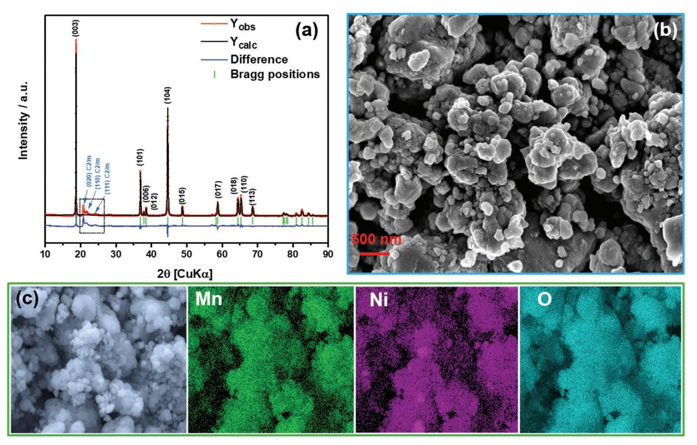
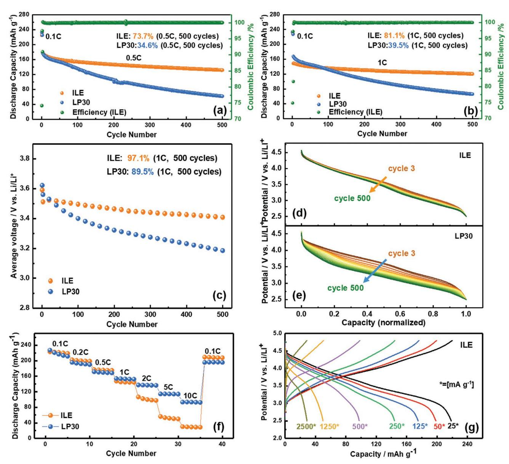
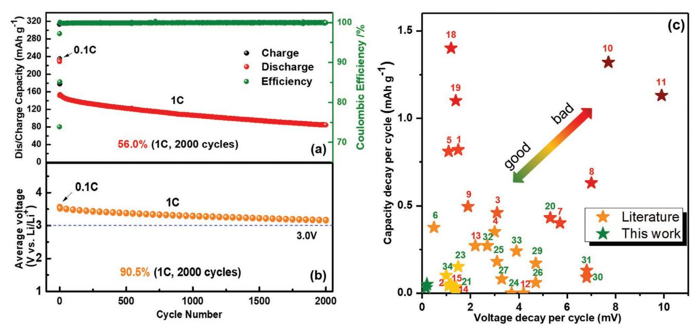
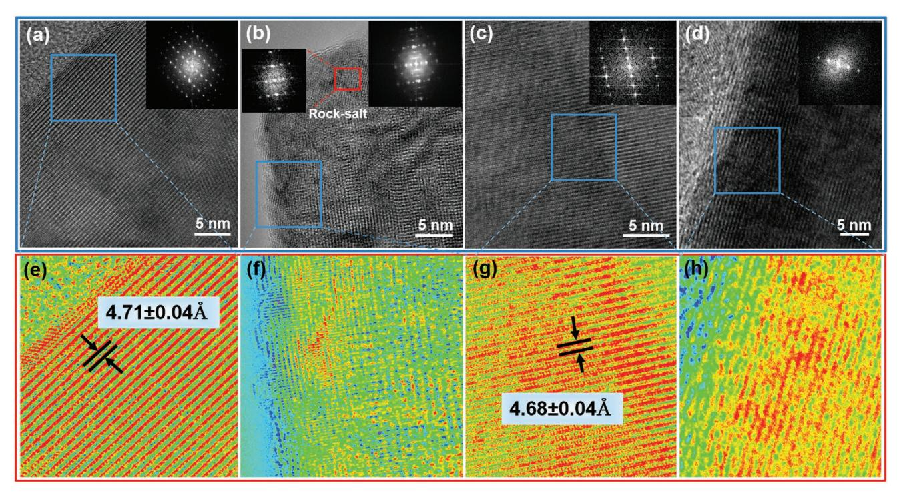
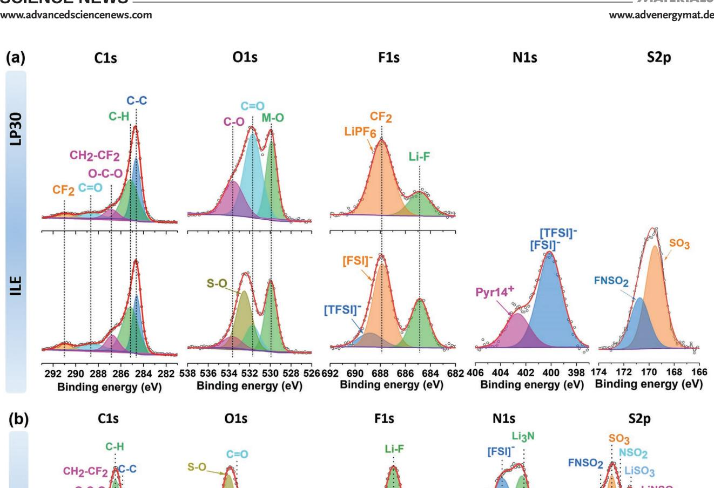
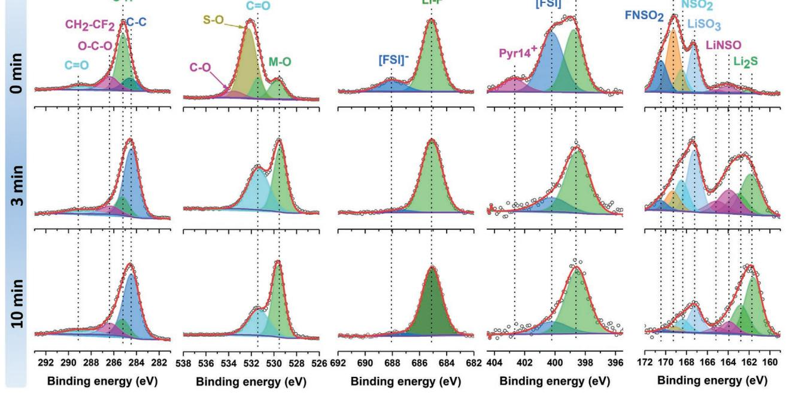
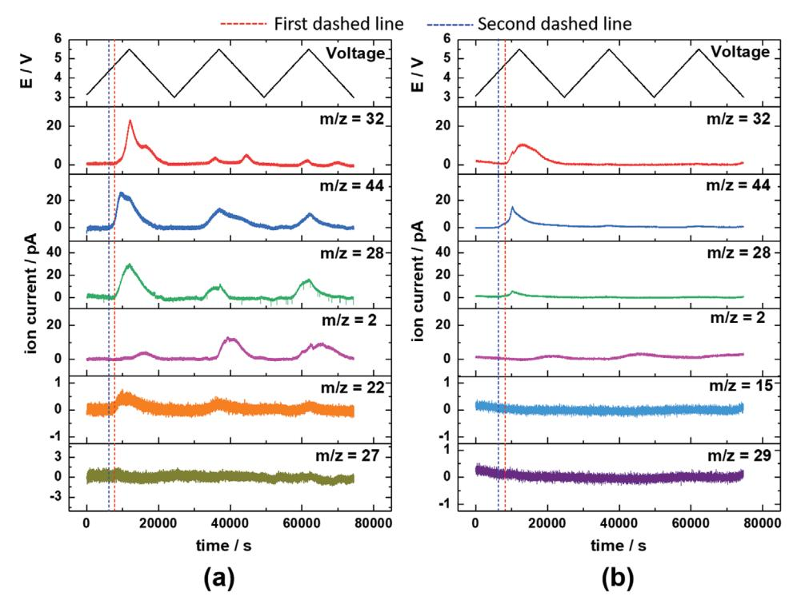
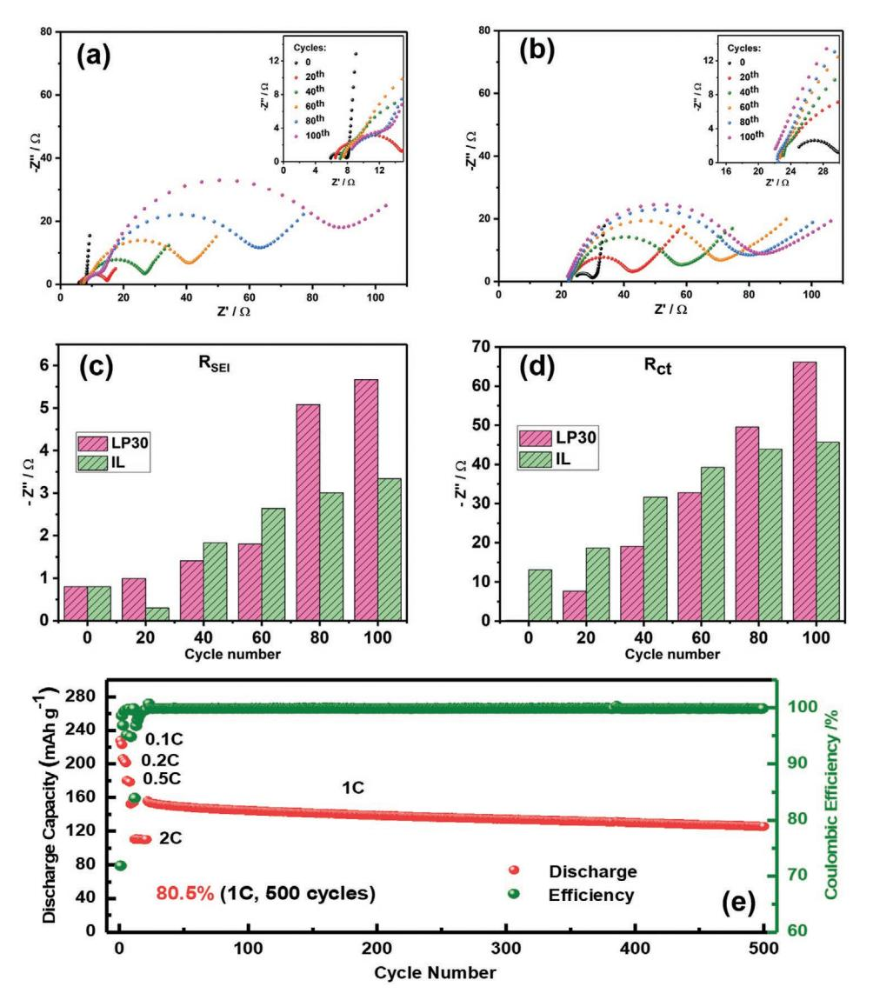

# **Reducing Capacity and Voltage Decay of Co-Free Li1.2Ni0.2Mn0.6O2 as Positive Electrode Material for Lithium Batteries Employing an Ionic Liquid-Based Electrolyte**

*Fanglin Wu, Guk-Tae Kim,\* Thomas Diemant, Matthias Kuenzel, Annika Regitta Schür, Xinpei Gao, Bingsheng Qin, Dorothea Alwast, Zenonas Jusys, Rolf Jürgen Behm, Dorin Geiger, Ute Kaiser, and Stefano Passerini\**

**Lithium-rich layered oxides (LRLOs) exhibit specific capacities above 250 mAh g−1 , i.e., higher than any of the commercially employed lithium-ion-positive electrode materials. Such high capacities result in high specific energies, meeting the tough requirements for electric vehicle applications. However, LRLOs generally suffer from severe capacity and voltage fading, originating from undesired structural transformations during cycling. Herein, the eco-friendly, cobalt-free Li1.2Ni0.2Mn0.6O2 (LRNM), offering a specific energy above 800 Wh kg−1 at 0.1 C, is investigated in combination with a lithium metal anode and a room temperature ionic liquid-based electrolyte, i.e., lithium bis(trifluoromethanesulfonyl)imide and** *N***-butyl-***N***-methylpyrrolidinium bis(fluorosulfonyl)imide. As evidenced by electrochemical performance and high-resolution transmission electron microscopy, X-ray photoelectron spectroscopy, and online differential electrochemical mass spectrometry characterization, this electrolyte is capable of suppressing the structural transformation of the positive electrode material, resulting in enhanced cycling stability compared to conventional carbonate-based electrolytes. Practically, the capacity and voltage fading are significantly limited to only 19% and 3% (i.e., lower than 0.2 mV per cycle), respectively, after 500 cycles. Finally, the beneficial effect of the ionic liquid-based electrolyte is validated in lithium-ion cells employing LRNM and Li4Ti5O12. These cells achieve a promising capacity retention of 80% after 500 cycles at 1 C.**

# **1. Introduction**

State-of-the-art batteries for electric vehicles (EVs) are limited to specific energies of around 235 Wh kg−1 , shortcoming the high requirements for an extended EV driving range.[1] Due to their high specific capacity and operative voltage, lithium (Li)-rich layered oxides (LRLO)-positive electrode (hereinafter cathode) materials would enable very high specific energies, beyond 350 Wh kg−1 at the electrode stack level.[2] Economical and environmental concerns associated with lithium-ion batteries (LIBs) are becoming increasingly important as present LIB cells heavily rely on cobalt (Co)-containing positive electrode materials bearing severe supply risks due to the very limited availability of Co and the conditions under which it is mined.[3,4] Among the Co-free positive electrode materials, LRLOs, more specifically Li1.2Ni0.2Mn0.6O2 (LRNM), have a comparably low nickel content as LiNi0.5Mn1.5O4 (LNMO), but at the same time have much larger specific capacity (250 vs 147 mAh g−1 ), and therefore far higher energy density than any other

F. Wu, Dr. G.-T. Kim, Dr. M. Kuenzel, A. R. Schür, Dr. X. Gao, Dr. B. Qin, Prof. R. J. Behm, S. Passerini Helmholtz Institute Ulm (HIU) Helmholtzstrasse 11, D-89081, Ulm, Germany E-mail: guk-tae.kim@kit.edu; stefano.passerini@kit.edu

The ORCID identification number(s) for the author(s) of this article can be found under https://doi.org/10.1002/aenm.202001830.

© 2020 Karlsruher Institut für Technologie. Published by WILEY-VCH Verlag GmbH & Co. KGaA, Weinheim. This is an open access article under the terms of the Creative Commons Attribution-NonCommercial-NoDerivs License, which permits use and distribution in any medium, provided the original work is properly cited, the use is non-commercial and no modifications or adaptations are made.

# F. Wu, Dr. G.-T. Kim, Dr. M. Kuenzel, A. R. Schür, Dr. X. Gao, Dr. B. Qin,

S. Passerini Karlsruhe Institute of Technology (KIT) P.O. Box 3640 D-76021, Karlsruhe, Germany Dr. T. Diemant, D. Alwast, Dr. Z. Jusys, Prof. R. J. Behm Institute of Surface Chemistry and Catalysis Ulm University Albert-Einstein-Allee 47 D-89081, Ulm, Germany Dr. D. Geiger, Prof. U. Kaiser Central Facility for Electron Microscopy Ulm University Albert-Einstein-Allee 11 D-89081, Ulm, Germany

#### **DOI: 10.1002/aenm.202001830**

existing Co-free cathode material.[4,5] However, the practical use of Co-free LRLOs is impeded by the low first cycle coulombic efficiency, the rather low rate capability and, most critically, the pronounced capacity and voltage fading upon cycling.[6] The root cause for these issues is associated with the activation of the Li2MnO3 component at high potentials (4.6–4.8 V), which, however, is also the reason for the high capacity.[7] During such an activation process, the Li2MnO3 phase decomposes and transition metal (TM) ions can easily migrate into the lithium layer. Simultaneously, oxygen vacancies (i.e., deficiency sites) are generated upon the irreversible loss of O2 from the structure.[8] As a result, displaced TM ions occupy sites in the lithium layer and prevent Li+ to reinsert into their previous positions.[9] This process, commonly referred to as cation mixing, gradually increases during cycling, leading to a transformation of the layered oxide into spinel-like, disordered TM layers and, eventually, into the rock-salt structure.[6,10,11] At the same time, the high upper cut-off voltage is outside of the electrochemical stability window of conventional, organic carbonate-based electrolytes, which additionally leads to unwanted side reactions and gas evolution.[12] Moreover, such electrolytes are highly flammable and volatile, bearing safety risks of LIB technology.[13]

Room temperature ionic liquids (RTILs) are potential alternatives to the organic carbonate-based electrolyte providing several advantages, such as low flammability, low volatility and, most crucially, a high (electro)chemical stability, beyond 4.8 V.[14–16] However, their high viscosity results in low ionic conductivity, limiting the rate capability of LRLO cathodes.[17] This limitation sums up to the intrinsically low ionic conductivity of LRLOs.[18] Therefore, only a few reports[19–21] employing ILs for LRLOs are available, mainly dealing with approaches to reduce the high viscosity and, hence, the low ionic conductivity of IL-based electrolytes (ILEs). These mostly consist in either employing organic solvents as additives or operating the cell at elevated temperature.[22–24] Mixing different ILs with LiPF6 and ethylene carbonate/dimethyl carbonate (EC/DMC) was shown to result in improved cycling stability compared to pure carbonate-based electrolytes.[13] Increasing the IL content leads to a reduced initial irreversible capacity loss and higher coulombic efficiency in the first cycle.[13] Such mixtures can even be non-flammable when the IL content is high. Finally, employing these electrolytes, higher discharge capacities and lower irreversible capacity losses with better cyclability of cathode materials have been achieved.[25] Regarding the second approach, organic solvent-free ILEs have been employed in combination with lithium-rich cathode materials at elevated temperature, leading to improved rate capabilities and high initial capacities.[12,21] Nair et al.[23] combined both methods and investigated a four-component IL-containing electrolyte cocktail showing excellent cycling performance for more than 1200 cycles at 1 C and 45 °C. However, those two approaches (addition of organic solvents and increased operating temperature) do not fully qualify for the practical application of batteries. Therefore, it is important to address the root cause of the problem and develop RTILs with high ionic conductivity compatible with LRLO cathode materials.

*N*-butyl-*N*-methylpyrrolidinium bis(trifluorome thanesulfonyl)imide (PYR14TFSI) is a rather common IL with excellent electrochemical stability, but with rather high viscosity.[26] In contrast, *N*-butyl-*N*-methylpyrrolidinium bis(fluorosulfonyl) imide (Pyr14FSI) displays lower viscosity and higher chemical reactivity owing to the weak SF bond.[27,28] The lower viscosity goes along with a higher ionic conductivity,[29] which is a critical factor for its application as electrolyte.[30] Elia et al.[27] systematically investigated the electrochemical properties of pyrrolidinium-based ILs with interchanging (T)FSI counter ions. They showed that Pyr14FSI-LiTFSI has the lowest viscosity and highest ionic conductivity within their series of investigated ILs. Additionally, the FSI− anion is capable of forming a stable passivation film on the cathode material and on the current collector,[29] while the TFSI− anion cannot prevent Al current collector corrosion.[31] Furthermore, some reports indicate that IL electrolytes containing FSI might suppress the structural transformation of the cathode.[12,32] Therefore, it is reasonable to test Pyr14FSI as an IL electrolyte for LRLO cathode materials. In this work, high-purity 0.8Pyr14FSI-0.2LiTFSI was synthesized to address the main shortcomings of capacity and voltage fading of Co-free LRNM. To the best of our knowledge, this is the first report on superior cycling stability of LRLOs in a pure ILE at room temperature. In order to exclusively evaluate the impact of the electrolyte (IL vs organic carbonate-based) on the LRNM cathode material, Li-ion cells were studied excluding the influence of lithium metal as counter electrode. For this purpose, Li4Ti5O12 (LTO) electrodes were prepared using an aqueous binder (sodium carboxymethyl cellulose). The LTO electrodes alone show extremely stable cycling performance in the ILE, which is, to the best of our knowledge, superior to any previous reports.[33,34] Finally, the Li-ion cell employing LRNM/LTO shows an excellent performance when using the IL electrolyte, demonstrating that this electrolyte could mitigate the capacity fading and voltage decay to a great extent. These results highlight the great perspective of using ILs in eco-friendly and safe high energy storage systems for EVs.

# **2. Results and Discussion**

#### **2.1. Material Characterization**

LRNM was synthesized by a simple solid-state reaction method, as described previously.[35] The refined X-ray diffraction (XRD) pattern (*χ*2 = 3.6, Rwp = 5.15) is shown in **Figure 1**a. The experimental and calculated patterns can well be indexed to the hexagonal layered *α*-NaFeO2 structure with an *R*-3*m* space group.[36] No impurity phase is present, except the low intensity reflections between 20° and 25°, which are originating from monoclinic Li2MnO3 with *C*2/*m* space group.[37] The lattice parameters of the synthesized LRNM were calculated to be *a* = *b* = 2.8559(1) Å, *c* = 14.2507(3) Å, resulting in a *c*/*a* ratio of 4.990, clearly indicating the layered structure. The scanning electron microscopy (SEM) micrograph (Figure 1b) of LRNM shows that the material is composed of irregularly shaped, microscale particles comprising many small primary particles (see Figure S1, Supporting Information, for higher magnification). The elemental mapping (Figure 1c) reveals a uniform distribution of nickel and manganese within LRNM.

**Figure 1.** a) Refined XRD pattern of as-synthesized LRNM powder. b) SEM micrograph of LRNM and c) EDX elemental mapping for manganese (Mn), nickel (Ni), and oxygen (O).

### **2.2. Electrochemical Performance of LRNM in ILE**

The electrochemical performance of the Co-free electrode material, illustrated in **Figure 2**, has been evaluated in cells employing the conventional 1 M solution of LiPF6 in a 1:1 weight mixture of EC and DMC, also known as LP30, and in an innovative ILE, whose performance is illustrated in Figure S2, Supporting Information, and the related text. This latter electrolyte was employed because it enables a rather reversible lithium plating/stripping, and thus the long-term cycling of Li metal cells. From Figure 2a, it is obvious that the cycling stability of the LRNM electrode in contact with ILE is much higher than for LP30. The capacity retention after 500 galvanostatic charge/discharge cycles at 0.5 C-rate is 73.7% in ILE compared to only 34.5% for LP30. The same is true also at higher rate (1 C-rate; Figure 2b). In fact, the initially slightly higher capacity of the LRNM electrode in LP30 drastically decreases upon cycling to 66 mAh g−1 , i.e., much lower than the 120 mAh g−1 recorded when using ILE. Furthermore, the voltage versus capacity behavior of LRNM electrodes upon the first cycle, which is crucial for this material, is compared in Figure S3, Supporting Information. The voltage curves obtained in the two, different electrolytes, are practically identical with only a slightly lower capacity in ILE than in LP30, but a slightly higher coulombic efficiency (73.9% vs 73.6%). This result demonstrates that 0.8Pyr14FSI-0.2LiTFSI as electrolyte can significantly improve the cycling performance compared to a standard LP30 electrolyte, stabilizing both interfaces, that with LRNM and that with lithium metal.

As mentioned earlier, LRLOs, including LRNM, suffer from extensive voltage decay upon cycling, mainly resulting from the migration of TM ions into the Li+ layer in the fully delithiated state, i.e., at high potentials. These TM ions can be irreversibly trapped in the Li+ slabs with increasing number of (de-) lithiation cycles[8] further decreasing the lithium-ion diffusivity and causing structural transformation.[9] Therefore, the voltage behavior upon cycling of LRNM electrodes was further investigated. The calculated average discharge voltage upon cycling of such electrodes in ILE and LP30 is displayed in Figure 2c. Once more, the LRNM electrode cycled with ILE exhibits a remarkable stability, showing a rather low voltage fading (97.1% retention) after 500 cycles at 1 C. In the same test, the electrode cycled with LP30, instead, showed only 89.5% voltage retention. In order to reveal more details, a few selected galvanostatic discharge curves are illustrated in Figure 2d,e. The discharge potential profile of the LRNM electrode in LP30 electrolyte decreases continuously, resulting from both capacity fading and voltage fading. On the other hand, the discharge potential profile change of the LRNM in ILE is very moderate, occurring mostly during the initial cycles and reaching an almost steady state after 200 cycles. Thus, it appears that the use of ILE changes the bulk properties of the LRNM material, which is rather surprising.

Figure 2f illustrates the discharge capacities at different current densities, employing ILE and LP30. At low currents, i.e., below 1 C-rate, the capacity achieved with ILE is slightly higher than that with LP30. Increasing the current density to 1 C-rate and above,

**Figure 2.** Galvanostatic cycling of LRNM in ILE (0.8Pyr14FSI-0.2LiTFSI) and LP30 (1 M LiPF6 in EC/DMC) electrolyte at a) 0.5 C-rate and b) 1C-rate. c) Average discharge voltage of LRNM electrodes (1C-rate) employing ILE or LP30 as electrolyte. Selected potential profiles during extended cycling using d) ILE and e) LP30. f) Rate capability of LRNM in ILE and LP30 electrolyte with g) corresponding potential profiles of LRNM at increasing current density employing ILE. The initial two cycles were performed at 0.1 C-rate.

the performance of the ILE-based cell declines rapidly, which is attributed to the lower ionic conductivity (higher viscosity) of ILE compared to LP30. The potential profiles versus specific capacity of the LRNM electrode in the ILE-based cell recorded at various current densities are shown in Figure 2g. The disappearance of the low-voltage feature during both the charge and discharge steps is clearly the reason for the decreasing capacity upon increasing current (219 mAh g−1 @ 25 mA g−1 , 198 mAh g−1 @ 50 mA g−1 , 175 mAh g−1 @ 125 mA g−1 , 144 mAh g−1 @ 250 mA g−1 , 98 mAh g−1 @ 500 mA g−1 , 50 mAh g−1 @ 1250 mA g−1 , and 29 mAh g−1 @ 2500 mA g−1 ). However, when the current is reduced to 25 mA g−1 (i.e., 0.1 C-rate), the electrode in contact with ILE showed the highest specific capacity, indicating that the high rate test did not degrade the overall LRNM performance.

Hence, using ILE, exceptionally long cycling could be carried out as shown in **Figure 3**. From the third to the 2002nd cycle (1 C-rate), the capacity decreases only slightly (about 0.03 mAh g−1 per cycle), resulting in a capacity retention of 56.0%. Moreover, the average discharge voltage remained very stable, arriving at 90.5% of the initial value after 2000 cycles. This corresponds to a decrease of only 0.17 mV per cycle, which is significantly lower than the 0.75 mV per cycle (over the initial 500 cycles) recorded using LP30 (Figure 2c). To the best of our knowledge, this value is lower than those reported anywhere in the literature (for a detailed comparison see Figure 3c). This enables the tremendous success to report for the first time the exceptional number of 2000 cycles with a capacity retention >50% and average discharge voltage still above 3 V.

**Figure 3.** Long-term constant current cycling (2000 cycles) of LRNM employing ILE (0.8Pyr14FSI-0.2LiTFSI) and Li metal: a) specific capacity and b) average discharge voltage. The initial two cycles were performed at 0.1 C-rate. c) Graphical comparison of the performance decay of lithium-rich cathodes reported in previous studies and herein. (The numbers refer to the entries in Table S1, Supporting Information. Also, red numbers indicate Co-containing materials, green numbers indicate Co-free LRLOs.)

### **2.3. Identifying the Origin of the Improved Cycling Stability of LRNM in the ILE**

In order to identify the reasons for the remarkable cycling stability and the mitigated voltage decay in ILE, we characterized the morphology of the electrodes by ex situ SEM imaging, as shown in Figure S4, Supporting Information. The LRNM electrodes cycled in both LP30 and ILE were analyzed after 100 cycles (0.5 C-rate and 20 °C) and compared with the pristine electrodes. There are no major changes observed between cycled and fresh electrodes. However, still a few distinctions could be identified. In the low magnification images, the electrode tested in ILE still appears rather densely packed (Figure S4g, Supporting Information), while that cycled in LP30 appears to be looser and more porous (Figure S4d, Supporting Information). At higher magnification, the particles exposed to LP30 appear to slightly change in shape, showing sharper contours than in the ILE (highlighted by the red circles in Figure S4f, Supporting Information). This suggests that side reactions with the organic carbonate-based electrolyte gradually degrade the particles surface during long-term cycling. In contrast, the particles cycled with ILE well maintain their morphology, which is in good agreement with the more stable electrochemical performance.

In order to further investigate the changes occurring on the surface and in the bulk of the active material particles, pristine and cycled electrodes were subjected to an in-depth investigation via high-resolution transmission electron microscopy (HRTEM). The pristine LRNM (**Figure 4**a) exhibits a highly ordered layered structure. However, after 100 cycles in LP30 (Figure 4b), the near-surface region of the LRNM particles appears wrinkled due to the crystal strain occurring upon repeated (de-)lithiation. Additionally, the edges appear to be rough due to material degradation, implying that the cathode electrolyte interphase (CEI) layer may not be robust enough to protect the particle surface against reaction with electrolyte species. Furthermore, the material has nearly entirely lost its well-ordered layered structure, partially turning into spinel-like and rock-salt-like structures, the latter is evident from the fast Fourier transform (FFT) patterns calculated from the area (red frame) near the particle surface. This structural transformation is triggered by the Ni2+ migration into the lithium layer during charging at high potential, which also favors the voltage decay during cycling.[38,39] In contrast, the surface of LRNM cycled in ILE appears smooth, with no obvious change compared to the pristine material within the accuracy of our measurement of ±0.04 Å (Figure 4c). The FFT pattern evidences that the layered structure is well maintained for the particles exposed to ILE (Figure 4c). Even after 2000 cycles in ILE (Figure 4d), we did not find evidence for the apparent emergence of a rock-salt phase. These observations are highlighted by the adoption of colored HRTEM micrographs (Figure 4e–h), which nicely highlight the 003 lattice planes that are indeed identical (within the error of our measurement) for the pristine electrode (Figure 4e) and those cycled for 100 cycles (Figure 4g) or 2000 cycles (Figure 4h) in ILE, respectively. Only the atomic structure of LRNM cycled in LP30 (Figure 4f) is clearly distorted and many irregularities are visible. Therefore, the HRTEM results prove that the ILE can suppress the crystal structure transformation of LRNM, which explains the reduced capacity and voltage fading and the resulting rather stable electrochemical performance.

The reason behind the improved electrochemical and structural stability of LRNM in ILE might be related to the nature of the CEI layer, which might prevent reactions between the electrolyte and the LRNM material.[40] To get more insight, X-ray photoelectron spectroscopy (XPS) was used to probe the composition of the CEI layers formed on the LRNM particles cycled

**Figure 4.** a,e) HRTEM micrographs and relevant FFT patterns of LRNM particles as made, after 100 cycles in b,f) LP30, and after c,g) 100 and d,h) 2000 cycles in ILE.

in the two electrolytes. The main results of these measurements are presented in **Figure 5**a. Starting with the C1s region, the peak at 284.6 eV can be attributed to conductive carbon (Super C65). The peak at 285.2 eV is assigned to CH*x* functionalities, while the peak at 286.7 eV is mainly due to CO moieties, with yet another peak at 288.5 eV assigned to CO groups. For the electrodes cycled in LP30, the detection of CO and CO-containing species on conventional cathodes has already been reported, as well as the formation of polyethylene oxide (PEO) by polymerization of EC with proposed possible contributions of lithium alkyl carbonates (ROCO2Li) or Li2CO3 from decomposition of the carbonate solvents.[40] Finally, the polyvinylidene difluoride (PVDF) binder in the electrode material contributes to the features at 291.0 eV (**C**F2-CH2) and 286.7 eV (**C**H2-CF2). Peaks due to CO and CO groups are also found in the O1s detail spectra, which are centered at 531.7 and 533.6 eV. Additionally, another peak due to oxide atoms in LRNM is detected at 529.9 eV. Furthermore, after cycling in ILE, there is an obvious peak at 532.5 eV that we relate to SO groups.[41] In the F1s region of the electrode cycled in LP30, two peaks at 685.0 and 687.9 eV can be discerned, which are attributed to LiF and LiPF6 (or decomposition products of it, e.g., LiPF*x*O*y*), respectively.[42] On the surface of the electrode cycled in ILE, the peak of LiF is also present. Additionally, two further peaks are detected at 687.9 and 688.8 eV, which can be attributed to fluorine in FSI− and TFSI−, respectively.[42] It may be noted that the CF2 group from PVDF will contribute to the peak at 687.9 eV in both cases. Finally, the N1s detail spectra show two features, which can be assigned to N atoms in TFSI−/FSI− (400.0 eV) and Pyr14+ (402.2 eV), while the S2p detail spectra exhibit two peaks at 170.7 and 169.5 eV that may be attributed to FNSO2 and SO3. [41,43]

The results demonstrate in both cases the formation of a CEI layer as a result of the decomposition of the electrolyte salts and solvent, which consists of organic (PEO, ROCO2Li, etc.) and inorganic (LiF, Li2CO3, etc.) compounds. Additionally, the LiF peak is more pronounced in the CEI formed in ILE than in LP30, pointing to a higher content of LiF as a key component of the CEI in the electrolyte.[24] On the other hand, the intensity of the CO peak in the CEI formed in ILE is much lower than that in LP30, as expected for the absence of carbonate groups in the electrolyte solvent. The inorganic compound-rich CEI layer formed in ILE relates well with the higher electrochemical stability window of the electrolyte. In contrast, LP30 is much less stable and prone to decomposition, which is associated with the presence of trace impurities of water and the generation of highly reactive HF, detrimental for the stability of both, the CEI layer as well as the LRNM surface[42,44]

$$
LiPF_6 + H_2O \text{ (traces)} \rightarrow LiF \downarrow +POF_3 + 2HF \uparrow
$$
 (1)

$$
\begin{array}{c}\n\text{EC} \rightarrow \text{EC}^+ \rightarrow \text{H}^+ \\
\text{H}^+ + \text{LiPF}_6 \rightarrow \text{HF} \uparrow + \text{Li}^+ + \text{PF}_5 \uparrow\n\end{array}
$$
\n(2)

The HF generated (Equations (1) and (2)) will attack the surface of the LRLO, reinforcing the migration of Ni2+ to the lithium slabs, eventually resulting in the formation of the disordered rock-salt structure.[40] Accordingly, the superior material performance in ILE does not only result from the slightly thicker CEI film, but very possibly is also related to its composition. Due to the limited information depth of XPS, the CEI layer discussed above represents only the outermost region of

**Figure 5.** a) XPS analysis of LRNM electrodes after 100 cycles in (top) LP30 (1 M LiPF6 in EC/DMC) and (bottom) ILE (0.8Pyr14FSI-0.2LiTFSI). b) Depth profiling XPS analysis of LRNM electrodes after 2000 cycles in IL (0.8Pyr14FSI-0.2LiTFSI) electrolyte (top) before and after Ar-sputtering for (middle) 3 min and (bottom) 10 min.

the passivation film. Thus, it was necessary to investigate the gradient of its constituents reaching closer to the active material surface. Figure 5b shows XPS spectra recorded after 2000 cycles in the IL electrolyte, before and after sputtering for 3 and 10 min. From the F1s and N1s spectra, we see that no more Pyr14+ and only very limited amounts of FSI− are still present in the inner part of the CEI, already after 3 min of sputtering, which illustrates the high anodic stability of the IL. The inorganic solid species of Li3N (N1s) is the main constituent besides LiF (F1s), which are both uniformly distributed in the CEI film. These species are present at nearly the same level at both sputtering depths. Differently, FNSO2, SO3, NSO2, LiSO3, LiNSO, and Li2S (all S2p) vary in their concentration at different depths. Overall, more anion fragments of the IL (FNSO2, SO3, NSO2,

**Figure 6.** Selected ion current responses of online DEMS measurements recorded during CV scans of LRNM electrodes in a) LP30 (1 M LiPF6 in EC/DMC) and b) ILE (0.8Pyr14FSI-0.2LiTFSI) (for dashed lines, see text).

and LiSO3) are present in the outer layer, while LiNSO and Li2S are dominating in the inner layer, which is uncovered upon sputtering. Regardless of their concentration, all of these components are electronically insulating but ion-conductive. These are important properties of the CEI for protecting the LRNM cathode material surface against the electrolyte, while providing good Li+ diffusion kinetics towards the interface.[40,45]

Additional information on the formation and dynamic change of the CEI can be obtained from differential electrochemical mass spectrometry (DEMS) measurements. In fact, DEMS provides the possibility to analyze the evolution of gaseous decomposition products during a few cycles.[46] In addition, the peculiar behavior of LRLOs, including LRNM, to release O2 at the end of the (first) charge, can be followed by this technique. The oxygen loss is expected to occur at the surface, causing TM ions to migrate into the bulk and occupy vacancies originating from Li removal.[46] The DEMS results in **Figure 6** directly compare the gas evolution by recording the ion currents for selected mass-to-charge (*m*/*z*) ratios during the first three cycles in LP30 and ILE (see Figure S5, Supporting Information, for the corresponding voltage profiles). In both cases the O2 signal (*m*/*z* = 32) starts to increase at around 4.7 V. Previously, this behavior has been assigned to the oxygen release upon activation of the Li2MnO3 component under removal of Li+ at high potential (≈4.5 V).[46,47] Controversially, Strehle et al.[48] recently proposed a different mechanism, suggesting that the O2 release is related to the structural rearrangement of the active material at the end of the first charge. Herein, the charge plateau accompanying the Li2MnO3 activation occurs at 4.5–4.6 V, while the O2 signal starts rising at 4.7 V (first dashed line). This is, in fact, close to the end of the voltage plateau and therefore, the O2 release is assigned to the structural rearrangement of LRNM at high potential (>4.7 V), where the peak reaches its maximum. In ILE, the O2 signal is approximately only half of that in LP30 electrolyte. Additionally, a small O2 peak appears also in the second and third cycles in LP30, but not in ILE. Taken together, the results confirm that LRNM cycled in ILE suffers less from the TM ion migration into the Li+ sites in the vicinity of oxygen-deficient sites, i.e., cation mixing. This leads to a less pronounced crystal structure transformation in ILE than LP30.[8,49] The *m*/*z* = 44 and 22 signals appearing during cycling in LP30 are assigned to CO2. The *m*/*z* = 28 signal also present in this measurement may derive from CO or C2H4 formation. Since, the *m*/*z* = 27 signal, which is also related to the C2H4 fragment, is rather weak, we conclude that the *m*/*z* = 28 signal belongs to CO rather than to ethene.[50] Additionally, since the *m*/*z* = 44 and 28 signals evolve simultaneously at around 4.2 V (second dashed line), they are likely to result from carbonate decomposition. The signal intensity is much more intense in LP30 electrolyte than in ILE and thus, is assigned to the oxidative decomposition of EC and DMC as well as the possible dehydrogenation of the organic carbonates catalyzed by the presence of Ni4+. [44,50] Besides, the CO2/CO evolution can also originate from the decomposition of residual surface Li2CO3, which is held responsible for the very sharp peak above 4.2 V observed for LRNM in the IL electrolyte.[51] Although in both cases unwanted CO2/CO gas is released, only the electrolyte oxidation, which is prevailing in LP30 electrolyte, results in the release of protons (H+), which are highly aggressive and can attack the LRNM structure as

well as the LiPF6 in the electrolyte (see Equations (1) and (2) above).[44] Additionally, H2 (*m*/*z* = 2) is evolving during the reverse scan in LP30 electrolyte, which is commonly assigned to the reduction of trace water impurities at the lithium counter electrode.[52] However, the signal is even increasing during the second and third scans and therefore, also clearly related to the decomposition of the electrolyte.[50] In contrast, the IL electrolyte shows hardly any H2 release nor fragments of the IL (CH3: *m*/*z* = 15, C2H5: *m*/*z* = 29), further supporting the previous conclusion of a higher stability of the CEI and cathode structure in the IL electrolyte due to the absence of highly reactive protons.

# **2.4. Compatibility of LTO with ILE**

To assess the effect of the ILE without being affected by the lithium metal counter electrode and thus to relate the improved performance discussed above exclusively to the positive impact of the IL electrolyte on the LRNM cathode material, LTO was tested in ILE as a reliable counter electrode for further investigation. Prior to Li-ion cell assembly, the LTO electrode was evaluated in the IL electrolyte at RT. The CV scans of LTO recorded at 0.02 mV s−1 (**Figure 7**a) show a highly reversible peak couple (cathodic scan: 1.5 V, anodic scan: 1.7 V) with very limited electrode polarization and that increases slightly at faster scan rates (Figure S6, Supporting Information). Accordingly, the potential profiles recorded for different current densities upon galvanostatic discharge/charge cycling (Figure 7b) reveal a very flat and extended voltage plateau, especially at low currents. Only at discharge/charge rates above 2 C polarization starts to increase significantly, which is attributed to the low conductivity and high viscosity of the IL electrolyte. The discharge capacity reaches 174 mAh g−1 in the first cycle (at 0.1 C) with a very high coulombic efficiency of 98.7%. In the following, the capacity decreases slightly at higher currents, going from 0.1 C, 0.2 C, 0.5 C to 1 C, and more significantly at 2 C (140 mAh g−1 ), but reverts to the high initial value (163 m Ah g−1 ) when the current rate is lowered to 0.5 C for long-term cycling (Figure 7c). The LTO shows an extremely stable capacity retention of 99.6% after 2000 cycles at 0.5 C, with a coulombic efficiency very close to 100%. The practically overlapping potential profiles of the 11th and 2000th cycle (Figure 7b) highlight the outstanding cycling stability of the LTO electrode in the IL electrolyte rendering it a reliable counter electrode for the characterization of LRNM in Li-ion cells.

# **2.5. Li-Ion Cell Performance**

As graphite anodes commonly suffer from incompatibility with pure IL electrolytes,[53,54] the extremely stable performing

**Figure 7.** Electrochemical characterization of LTO electrodes employing the IL electrolyte (0.8Pyr14FSI-0.2LiTFSI) and Li metal. a) First three CV scans. b) Selected potential profiles during rate capability test and c) long-term galvanostatic cycling at 0.5 C corresponding to a specific current of 85 mA g−1 .

**Figure 8.** Electrochemical impedance spectroscopy (EIS) of LRNM/LTO Li-ion cells. AC response recorded at OCV in fully discharged state before and after every 20th cycle in a) LP30 electrolyte and b) IL electrolyte as well as the evolution of c) the resistance of SEI film and d) the charge transfer resistance. e) Long-term, constant current cycling of the LRNM/LTO (i.e., Li-ion) cell in IL electrolyte between 1.0 and 3.3 V.

LTO was chosen to realize Li-ion cells. The cells were characterized in LP30 and IL electrolyte by recording electrochemical impedance spectra (EIS) after every 20 cycles (**Figure 8**). In both cases, the EIS response shows a depressed semicircle gradually increasing with cycle number and the typical steep line attributed to solid state lithium diffusion. The equivalent circuit model used for fitting the data (Figure S7, Supporting Information) is composed of a bulk electrolyte resistance (*R*s) in series with three Randles elements representing the SEI (*R*SEI and *C*SEI), electronic properties and charge transfer (*R*ct and *C*ct) at the electrode.[55,56] The electrolyte resistance in LP30 is around 6 Ω, which is smaller than that in ILE(23 Ω) because of its higher conductivity. In contrast, the values of *R*SEI are almost identical in the two electrolytes before cycling. However, the *R*SEI value increases much more rapidly upon cycling in LP30 electrolyte compared to the IL electrolyte, where only a moderate increase is observed until it approaches saturation. This confirms the rapid formation of a stable SEI layer in the IL electrolyte, while the increasing SEI resistance in LP30 indicates continuous decomposition of electrolyte and thickening of an unstable SEI layer.[55,57] A similar trend is observed for *R*ct in both electrolytes leading to larger polarization in LP30,[55] which additionally contributes to the poor electrochemical performance related to the surface degradation of LRNM.

Finally, the long-term cycling stability of the LRNM|LTO Li-ion cell using the IL electrolyte was evaluated (Figure 8e), and the LRNM|LTO Li-ion cell using the LP30 electrolyte as comparing sample is also shown in Figure S8, Supporting Information. The cathode-limited Li-ion cell exhibits a high discharge capacity of 228 mAh g−1 in the first cycle (0.1 C), with an initial coulombic efficiency of 71.8%. When increasing the discharge/charge rate to 0.2 C, 0.5 C, 1 C, and 2 C, the discharge capacity drops to 206, 180, 152, and 110 mAh g−1 , respectively. These values are slightly higher than those of LRNM Li-metal cells, indicating that the performance in these latter cells was limited by the poor kinetics of lithium metal in the ILE. After the rate capability test, the lithiumion cell shows an excellent stability during prolonged cycling, with a capacity retention of more than 80% after 500 cycles. To the best of our knowledge, this exceeds the performance of any reported Co-free, LRLO in lithium-ion cells using an ILE.

# **3. Conclusions**

In this work, we demonstrated the excellent performance of Cofree LRNM as a next-generation high-energy cathode material in combination with an ILE (0.8Pyr14FSI-0.2LiTFSI). The use of such an electrolyte dramatically reduces the capacity and voltage fading of the LRNM cathode in lithium metal cells with a remarkable capacity retention of more than 81% after 500 cycles, combined with an exceptionally low voltage fading (less than 3%). This beneficial impact is attributed to the formation of a stable CEI layer protecting the active electrode material's surface, as confirmed by XPS and EIS analysis. As a result, the structural transformation of the LRNM to rocksalt phase, which commonly starts from the particle surface, is efficiently suppressed as evident from HRTEM measurements. Additionally, the ILE is rather stable also with high-voltage cathodes, resulting in a lower generation of aggressive decomposition products, including HF, as compared to conventional organic carbonate-based electrolytes. The herein presented ILE is also well compatible with the LTO-negative electrode, which shows outstanding cycling stability with practically no capacity loss over 2000 cycles. The resulting LRNM/LTO Li-ion cell exhibits a remarkable capacity retention of more than 80% after 500 cycles at 1 C as well as coulombic efficiencies above 99.9%. Such a significant performance improvement for LRNM opens new perspectives for the use of safe ILEs in combination with Co-free LRNM cathodes for eco-friendly high-energy batteries.

# **4. Experimental Section**

*Materials*: LRNM was synthesized via a simple solid-state reaction. Stoichiometric amounts of LiCH3COO (3% excess), Mn(CH3COO)2·4H2O, and Ni(CH3COO)2·4H2O were mixed by planetary ball milling for 3 h, dried at 80 °C overnight, collected, and manually ground in a mortar. The precursor was pre-heated in a box furnace at 480 °C for 5 h with a heating rate of 3 °C min–1 and subsequently pressed into pellets under a pressure of 8 tons cm–2. The pellets were calcined at 900 °C for 6 h and immediately quenched in liquid nitrogen to freeze the layered solid-solution phase. The final product was ground and sieved to a particle size below 45 µm. LTO was purchased from NEI (NANOMYTE SP-10). The IL electrolyte (0.8Pyr14FSI-0.2LiTFSI) was prepared by dissolving LiTFSI (99.5 wt%, 3 M) in Pyr14FSI (in a molar ratio of 2:8). The neat IL was dried at 80 °C using a turbo pump under a dynamic vacuum below 10−7 mbar. For comparison, measurements were done using the commercial electrolyte (LP30), consisting of 1 M LiPF6 in a mixture of EC and DMC (1:1 by weight).

*Electrode Preparation*: The LRNM electrodes were prepared by mixing the active material, conductive carbon Super C65 (IMERYS), and PVDF binder (Solef 6020, Arkema) in a weight ratio of 85:10:5. The slurry, prepared using *N*-methyl-2-pyrrolidone (NMP; anhydrous, >99.5%; Sigma-Aldrich) as dispersant and solvent, was cast onto aluminum foil (20 µm). After drying at 80 °C overnight, the electrodes were punched into disks of 12 mm diameter and vacuum dried at 120 °C for 12 h and finally pressed at 8 ton cm−2. The average mass loading was around 2 ± 0.2 mg cm−2. Negative electrodes were made by mixing LTO, Super C45, carboxymethyl cellulose (CMC), and styrene-butadiene rubber (SBR) (89:7:2:2) by magnetic stirring for 2 h, using water as dispersant and solvent. Before casting the electrode slurry onto aluminum foil (20 µm), 1% formic acid was added to adjust the pH of the aqueous slurry to neutralization (pH ≈ 7).

*Electrochemical Measurements*: The electrochemical performance of lithium metal cells, employing 0.8Pyr14FSI-0.2LiTFSI, was evaluated in pouch cells, which were assembled in a dry room (dew point <–60 °C). All other electrochemical characterizations were conducted in threeelectrode Swagelok cells assembled in an argon-filled glove box (O2 < 0.1 ppm, H2O < 0.1 ppm) using Whatman glass fiber GF/D as separator and lithium metal disks as counter and reference electrode. Galvanostatic cycling was performed in a Maccor battery tester 4300. LRNM electrodes were charged to a cut-off voltage of 4.8 V for activation at 0.1 C during the first two cycles, and then cycled between 2.5 and 4.6 V at 1 C or 0.5 C. LTO anodes were cycled in the voltage range between 1.0 and 2.5 V. All potential values refer to the Li/Li+ quasi-reference redox couple. Li-ion cells were cycled between cell voltages of 1.0 and 3.3 V with a negative/positive capacity ratio of around 1.2. Electrochemical impedance spectroscopy (EIS) of Li-ion cells was performed using a VMP multichannel potentiostat (BioLogic). EIS data were collected after every 20 galvanostatic (dis)charge cycles, spanning a frequency range from 1 to 10 mHz and applying a 5 mV voltage amplitude versus OCV in the fully discharged state. The (dis)charge rate of 1 C corresponds to a specific current of 250 mA g−1 . All electrochemical measurements were performed in a climatic chamber at 20 ± 2 °C.

*Material Characterization*: Powder XRD on LRNM was performed using a Bruker D8 Advance diffractometer (Cu K*α* radiation, *λ* = 0.154 nm) in a 2*θ* range of 10–90°. The morphology and structure of samples was investigated by SEM (ZEISS Crossbeam XB340 equipped with an energy dispersive X-ray (EDX) spectrometer) and by HRTEM (FEI Titan 80-330 with an image Cs-corrector operated at 300 kV). XPS was conducted on a PHI 5800 Multi-Technique ESCA system using monochromatic Al K*α* radiation (1486.6 eV), a take-off angle of 45°, and pass energies of 29.35 and 93.9 eV at the analyzer for detail and survey spectra, respectively. Cycled electrodes were investigated after washing with DMC (and subsequent drying), either directly or after Ar+ ion sputtering for 3 and 10 min (≈1 nm min−1 sputter rate, 1 µA, 5 kV). All XPS spectra were calibrated to the C (1s) peak at 284.8 eV. Differential electrochemical mass spectrometry (DEMS) was performed in an argonfilled glovebox. The beaker-type electrochemical cell was equipped with a working electrode (prepared at the same ratio as mentioned above) directly coated on a non-porous 50 µm thick fluorinated ethylenepropylene (FEP) polymer film (Bohlender), that was sputtered with aluminum source before. The setup has been introduced in the work by Jusys et al. recently.[50] Stripes of lithium foil (purity 99.9%, Alfa Aesar) were used as counter and reference electrode, the cell volume of 600 µL was filled with the respective electrolytes. The electrochemical measurements were conducted with a potentiostat (PAR 263A), the emerging gas was analyzed via a quadrupole mass spectrometer (Pfeiffer Vacuum QMA 410). The potentiodynamic measurements were performed at a scan rate of 0.2 mV s−1 in the potential range of 3–5.5 V.

# **Supporting Information**

Supporting Information is available from the Wiley Online Library or from the author.

# **Acknowledgements**

The authors would like to acknowledge the financial support from the European Union within the Si-DRIVE project. This project received funding from the European Union's Horizon 2020 research and

innovation programme under grant agreement number 814464. Further support was provided by the German Federal Ministry of Education and Research in the projects LiEcoSafe and LuCaMag under contract numbers 03X4636C and 03EK3051C, respectively. F.W. and B.Q. gratefully acknowledge financial support from the Chinese Scholarship Council (CSC). The financial support of the Helmholtz Association is also acknowledged. This work contributes to the research performed at CELEST (Center for Electrochemical Energy Storage Ulm-Karlsruhe). Open access funding enabled and organized by Projekt DEAL.

## **Conflict of Interest**

The authors declare no conflict of interest.

## **Author Contributions**

F.W. performed the material synthesis and XRD characterization and electrochemical measurements with the support of B.Q., and drafted the manuscript. A.R.S. performed the refinement of the XRD measurements. M.K. performed the SEM measurements. X.G. synthesized and characterized the ILE. T.D. and R.J.B. performed and analyzed the XPS measurements. D.A., Z.J., and R.J.B. performed and analyzed the DEMS measurements. D.G. and U.K. performed and analyzed the TEM characterization. G.-T.K. conceptualized the activities, and supervised the experimental work and the writing of the manuscript. S.P. conceptualized and coordinated the activities, provided funding for the work, and revised the manuscript.

# **Keywords**

cobalt-free cathodes, ionic liquid electrolytes, lithium batteries, lithiumrich layered oxides, voltage fading

> Received: June 3, 2020 Revised: July 3, 2020 Published online: July 23, 2020

- [1] X. Zeng, M. Li, D. Abd El-Hady, W. Alshitari, A. S. Al-Bogami, J. Lu, K. Amine, *Adv. Energy Mater.* **2019**, *9*, 1900161.
- [2] R. Schmuch, R. Wagner, G. Hörpel, T. Placke, M. Winter, *Nat. Energy* **2018**, *3*, 267.
- [3] E. A. Olivetti, G. Ceder, G. G. Gaustad, X. Fu, *Joule* **2017**, *1*, 229.
- [4] M. Wentker, M. Greenwood, J. Leker, *Energies* **2019**, *12*, 504.
- [5] J. An, L. Shi, G. Chen, M. Li, H. Liu, S. Yuan, S. Chen, D. Zhang, *J. Mater. Chem. A* **2017**, *5*, 19738.
- [6] J. Zheng, S. Myeong, W. Cho, P. Yan, J. Xiao, C. Wang, J. Cho, J.-G. Zhang, *Adv. Energy Mater.* **2017**, *7*, 1601284.
- [7] W. Li, B. Song, A. Manthiram, *Chem. Soc. Rev.* **2017**, *46*, 3006.
- [8] E. M. Erickson, F. Schipper, T. R. Penki, J.-Y. Shin, C. Erk, F.-F. Chesneau, B. Markovsky, D. Aurbach, *J. Electrochem. Soc.* **2017**, *164*, A6341.
- [9] W. Liu, P. Oh, X. Liu, M. J. Lee, W. Cho, S. Chae, Y. Kim, J. Cho, *Angew. Chem., Int. Ed.* **2015**, *54*, 4440.
- [10] P. Oh, M. Ko, S. Myeong, Y. Kim, J. Cho, *Adv. Energy Mater.* **2014**, *4*, 1400631.
- [11] G. Chen, J. An, Y. Meng, C. Yuan, B. Matthews, F. Dou, L. Shi, Y. Zhou, P. Song, G. Wu, D. Zhang, *Nano Energy* **2019**, *57*, 157.
- [12] J. Li, S. Jeong, R. Kloepsch, M. Winter, S. Passerini, *J. Power Sources* **2013**, *239*, 490.
- [13] J. Zheng, D. Zhu, Y. Yang, Y. Fung, *Electrochim. Acta* **2012**, *59*, 14.
- [14] G. A. Elia, U. Ulissi, F. Mueller, J. Reiter, N. Tsiouvaras, Y. K. Sun, B. Scrosati, S. Passerini, J. Hassoun, *Chem. - Eur. J.* **2016**, *22*, 6808.

- [15] D. R. MacFarlane, N. Tachikawa, M. Forsyth, J. M. Pringle, P. C. Howlett, G. D. Elliott, J. H. Davis, M. Watanabe, P. Simon, C. A. Angell, *Energy Environ. Sci.* **2014**, *7*, 232.
- [16] M. Armand, F. Endres, D. R. MacFarlane, H. Ohno, B. Scrosati, *Nat. Mater.* **2009**, *8*, 621.
- [17] G. A. Giffin, *J. Mater. Chem. A* **2016**, *4*, 13378.
- [18] Z. Li, F. Du, X. Bie, D. Zhang, Y. Cai, X. Cui, C. Wang, G. Chen, Y. Wei, *J. Phys. Chem. C* **2010**, *114*, 22751.
- [19] T. Evans, D. M. Piper, H. Sun, T. Porcelli, S. C. Kim, S. S. Han, Y. S. Choi, C. Tian, D. Nordlund, M. M. Doeff, C. Ban, S. J. Cho, K. H. Oh, S. H. Lee, *Adv. Mater.* **2017**, *29*, 1604549.
- [20] F. Wu, Q. Zhu, R. Chen, N. Chen, Y. Chen, L. Li, *Nano Energy* **2015**, *13*, 546.
- [21] J. Patra, P. P. Dahiya, C.-J. Tseng, J. Fang, Y.-W. Lin, S. Basu, S. B. Majumder, J.-K. Chang, *J. Power Sources* **2015**, *294*, 22.
- [22] U. Ulissi, G. A. Elia, S. Jeong, F. Mueller, J. Reiter, N. Tsiouvaras, Y. K. Sun, B. Scrosati, S. Passerini, J. Hassoun, *ChemSusChem* **2018**, *11*, 229.
- [23] J. R. Nair, F. Colò, A. Kazzazi, M. Moreno, D. Bresser, R. Lin, F. Bella, G. Meligrana, S. Fantini, E. Simonetti, G. B. Appetecchi, S. Passerini, C. Gerbaldi, *J. Power Sources* **2019**, *412*, 398.
- [24] L. Dong, F. Liang, D. Wang, C. Zhu, J. Liu, D. Gui, C. Li, *Electrochim. Acta* **2018**, *270*, 426.
- [25] H. Li, J. Pang, Y. Yin, W. Zhuang, H. Wang, C. Zhai, S. Lu, *RSC Adv.* **2013**, *3*, 13907.
- [26] F. Castiglione, E. Ragg, A. Mele, G. B. Appetecchi, M. Montanino, S. Passerini, *J. Phys. Chem. Lett.* **2011**, *2*, 153.
- [27] G. A. Elia, U. Ulissi, S. Jeong, S. Passerini, J. Hassoun, *Energy Environ. Sci.* **2016**, *9*, 3210.
- [28] E. Paillard, Q. Zhou, W. A. Henderson, G. B. Appetecchi, M. Montanino, S. Passerini, *J. Electrochem. Soc.* **2009**, *156*, A891.
- [29] I. A. Shkrob, T. W. Marin, Y. Zhu, D. P. Abraham, *J. Phys. Chem. C* **2014**, *118*, 19661.
- [30] H.-B. Han, S.-S. Zhou, D.-J. Zhang, S.-W. Feng, L.-F. Li, K. Liu, W.-F. Feng, J. Nie, H. Li, X.-J. Huang, *J. Power Sources* **2011**, *196*, 3623.
- [31] E. Kramer, T. Schedlbauer, B. Hoffmann, L. Terborg, S. Nowak, H. J. Gores, S. Passerini, M. Winter, *J. Electrochem. Soc.* **2013**, *160*, A356.
- [32] T. Evans, J. Olson, V. Bhat, S.-H. Lee, *J. Power Sources* **2014**, *265*, 132.
- [33] G. T. Kim, S. S. Jeong, M. Joost, E. Rocca, M. Winter, S. Passerini, A. Balducci, *J. Power Sources* **2011**, *196*, 2187.
- [34] W. Chen, H. Jiang, Y. Hu, Y. Dai, C. Li, *Chem. Commun.* **2014**, *50*, 8856.
- [35] F. Wu, G. T. Kim, M. Kuenzel, H. Zhang, J. Asenbauer, D. Geiger, U. Kaiser, S. Passerini, *Adv. Energy Mater.* **2019**, *9*, 1902445.
- [36] J. Li, R. Klöpsch, M. C. Stan, S. Nowak, M. Kunze, M. Winter, S. Passerini, *J. Power Sources* **2011**, *196*, 4821.
- [37] R.-P. Qing, J.-L. Shi, D.-D. Xiao, X.-D. Zhang, Y.-X. Yin, Y.-B. Zhai, L. Gu, Y.-G. Guo, *Adv. Energy Mater.* **2016**, *6*, 1501914.
- [38] J. Reed, G. Ceder, *Chem. Rev.* **2004**, *104*, 4513.
- [39] W. Liu, P. Oh, X. Liu, S. Myeong, W. Cho, J. Cho, *Adv. Energy Mater.* **2015**, *5*, 1500274.
- [40] W. Zhao, J. Zheng, L. Zou, H. Jia, B. Liu, H. Wang, M. H. Engelhard, C. Wang, W. Xu, Y. Yang, J.-G. Zhang, *Adv. Energy Mater.* **2018**, *8*, 1800297.
- [41] J. Alvarado, M. A. Schroeder, T. P. Pollard, X. Wang, J. Z. Lee, M. Zhang, T. Wynn, M. Ding, O. Borodin, Y. S. Meng, K. Xu, *Energy Environ. Sci.* **2019**, *12*, 780.
- [42] G. G. Eshetu, T. Diemant, S. Grugeon, R. J. Behm, S. Laruelle, M. Armand, S. Passerini, *ACS Appl. Mater. Interfaces* **2016**, *8*, 16087.
- [43] L. E. Camacho-Forero, T. W. Smith, P. B. Balbuena, *J. Phys. Chem. C* **2017**, *121*, 182.

- [44] T. Ma, G. L. Xu, Y. Li, L. Wang, X. He, J. Zheng, J. Liu, M. H. Engelhard, P. Zapol, L. A. Curtiss, J. Jorne, K. Amine, Z. Chen, *J. Phys. Chem. Lett.* **2017**, *8*, 1072.
- [45] B. Qin, S. Jeong, H. Zhang, U. Ulissi, D. Vieira Carvalho, A. Varzi, S. Passerini, *ChemSusChem* **2019**, *12*, 208.
- [46] A. R. Armstrong, M. Holzapfel, P. Novak, C. S. Johnson, S. H. Kang, M. M. Thackeray, P. G. Bruce, *J. Am. Chem. Soc.* **2006**, *128*, 8694.
- [47] N. Yabuuchi, K. Yoshii, S. T. Myung, I. Nakai, S. Komaba, *J. Am. Chem. Soc.* **2011**, *133*, 4404.
- [48] B. Strehle, K. Kleiner, R. Jung, F. Chesneau, M. Mendez, H. A. Gasteiger, M. Piana, *J. Electrochem. Soc.* **2017**, *164*, A400.
- [49] C. P. Laisa, A. K. Nanda Kumar, S. Selva Chandrasekaran, P. Murugan, N. Lakshminarasimhan, R. Govindaraj, K. Ramesha, *J. Power Sources* **2016**, *324*, 462.
- [50] Z. Jusys, M. Binder, J. Schnaidt, R. J. Behm, *Electrochim. Acta* **2019**, *314*, 188.
- [51] S. E. Renfrew, B. D. McCloskey, *J. Am. Chem. Soc.* **2017**, *139*, 17853.
- [52] M. Metzger, B. Strehle, S. Solchenbach, H. A. Gasteiger, *J. Electrochem. Soc.* **2016**, *163*, A798.
- [53] M. Ishikawa, T. Sugimoto, M. Kikuta, E. Ishiko, M. Kono, *J. Power Sources* **2006**, *162*, 658.
- [54] H. Zheng, K. Jiang, T. Abe, Z. Ogumi, *Carbon* **2006**, *44*, 203.
- [55] X.-Y. Qiu, Q.-C. Zhuang, Q.-Q. Zhang, R. Cao, Y.-H. Qiang, P.-Z. Ying, S.-G. Sun, *J. Electroanal. Chem.* **2012**, *687*, 35.
- [56] F. Nobili, R. Tossici, R. Marassi, F. Croce, B. Scrosati, *J. Phys. Chem. B* **2002**, *106*, 3909.
- [57] E. Peled, S. Menkin, *J. Electrochem. Soc.* **2017**, *164*, A1703.