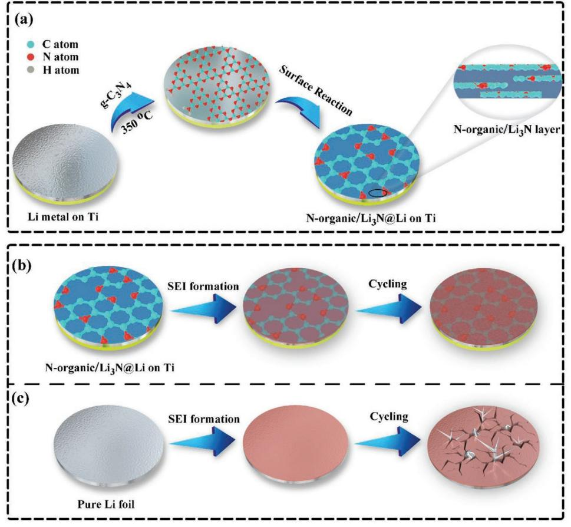
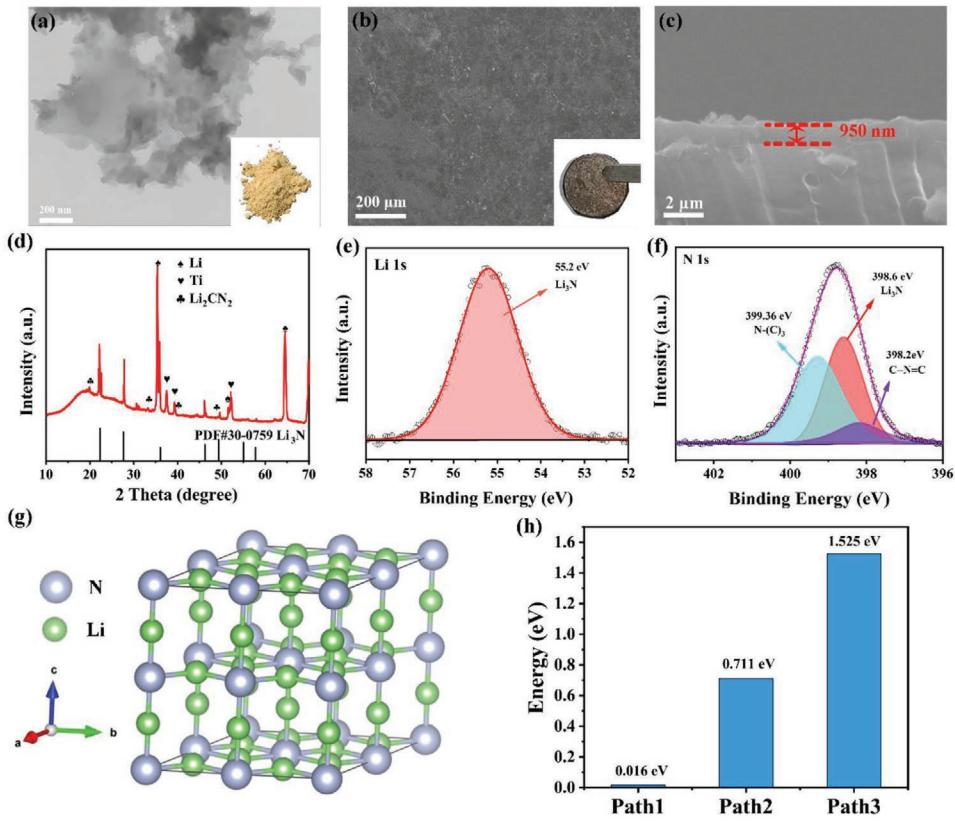
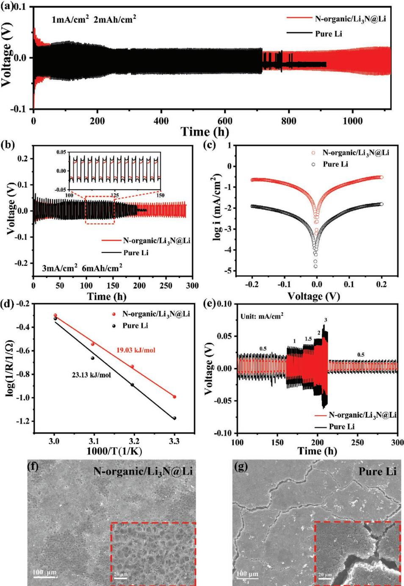
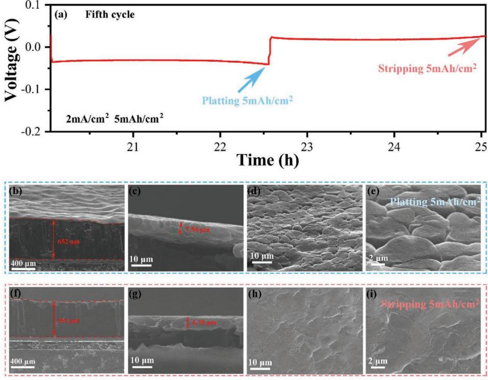
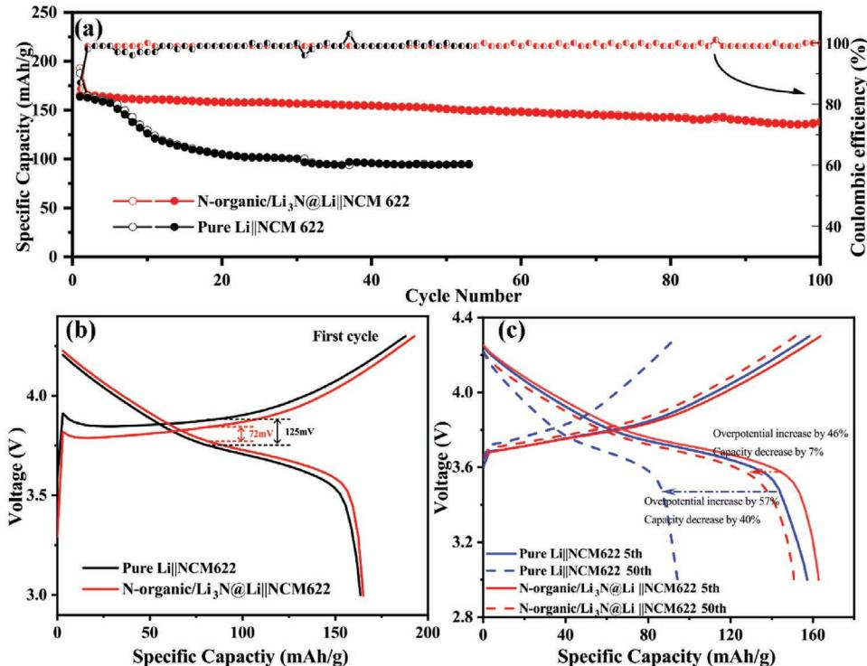

# **g-C3N4 Derivative Artificial Organic/Inorganic Composite Solid Electrolyte Interphase Layer for Stable Lithium Metal Anode**

*Shufen Ye, Lifeng Wang, Fanfan Liu, Pengcheng Shi, Haiyun Wang, Xiaojun Wu, and Yan Yu\**

**Lithium metal anodes are one of the most promising anodes in "next-generation" rechargeable batteries. However, continuous dendrite growth and interface instability of the anode have prevented practical applications. Constructing an artificial solid electrolyte interphase (SEI) is an effective way to solve these issues. Herein, an artificial organic/inorganic SEI layer (denoted as N-organic/Li3N) is designed, consisting of Li2CN2 and Li3N phases, to achieve stable cycling of Li metal electrodes. Density functional theory (DFT) results reveal that the N-organic/Li3N layer with a high Li ionic conductivity can effectively facilitate the transport of Li ions across the electrode surface and lead to uniform Li ionic flux on Li electrodes via strong interactions between Li ions and N-organic groups, resulting in dendrite-free Li stripping/ plating. The N-organic/Li3N-coated Li (denoted as N-organic/Li3N@Li) anode delivers stable long-term cycling performance over 1100 h with a fixed areal capacity of 2 mAh cm−2 under 1 mA cm−2 . A full battery assembled with a LiNi0.6Co0.2Mn0.2O2 (NCM622) cathode displays better long-term cycle performance when the N-organic/Li3N@Li composite anode is applied. The advantages of the organic/inorganic artificial SEI provide important insights into the design principles of SEI for lithium metal anodes.**

Li metal batteries (LMBs) offer excellent potential for nextgeneration high energy density Li-ion batteries because of its highest theoretical capacity (3860 mAh g−1 ) and lowest redox potential (−3.04 V vs standard hydrogen electrode) among all the traditional anode materials.[1–7] As far as high energy densities are concerned, LMBs, such as Li-LiMO2 (M = Ni, Mn, and Co (NCM)) batteries,[8] Li–S batteries,[9,10] and Li–O2 batteries,[11–13] can more likely meet the ever-growing demands of

| S. Ye, L. Wang, F. Liu, Dr. P. Shi, H. Wang, Prof. X. Wu, Prof. Y. Yu Hefei National Laboratory for Physical Sciences at the Microscale |
|--------------------------------------------------------------------------------------------------------------------------------------------|
| Department of Materials Science and Engineering                                                                                            |
| CAS Key Laboratory of Materials for Energy Conversion                                                                                      |
| University of Science and Technology of China                                                                                              |
| Hefei, Anhui 230026, China                                                                                                                 |
| E-mail: yanyumse@ustc.edu.cn                                                                                                               |
| Prof. Y. Yu                                                                                                                                |
| Dalian National Laboratory for Clean Energy (DNL)                                                                                          |
| Chinese Academy of Sciences (CAS)                                                                                                          |
| Dalian 116023, China                                                                                                                       |
| The ORCID identification number(s) for the author(s) of this article can be found under https://doi.org/10.1002/aenm.202002647.         |

**DOI: 10.1002/aenm.202002647**

electrical energy storage than traditional lithium ion batteries.[14,15] However, the practical application of LMBs has been prevented due to the high chemical reactive between Li and organic electrolytes, forming an unstable solid electrolyte interphase (SEI) at the electrolyte/Li interface. The SEI is mechanically fragile that cannot accommodate the huge volume changes forming Li dendrites. The lithium dendrite growth leads to continuously consumed electrolytes and poor cycle life of LMBs.[16–18] Additionally, the SEI cracker causes locally enhanced Li ionic flux and nonuniform Li deposition, which triggers the continuous growth of dendrite and internal short circuits.

There are three main approaches to get the stable SEI, namely, 1) building a high Li ionic conductivity SEI film ex situ on the Li metal surface, such as Li2S,[19] Li2Se,[20] LiF,[21] and Li3N;[22,23] 2) constituting SEI film in situ on the Li metal surface through regulating the composition

of electrolytes and additives;[24–28] and 3) constructing a high mechanical strength SEI film ex situ on the Li metal surface.[29] Among these artificial SEI film, Li3N thin film coating has been demonstrated to suppress the lithium dendrite growth because of its high Li ionic conductivity(ionic conductivity: ≈10−3 to 10−4 S cm−1 at room temperature),[30,31] unique thermodynamic stability against Li metal[32,33] and high Young's modulus.[30] However, loosely connected Li3N small particles form porous artificial SEI layer that cannot hinder the penetration of corrosive electrolytes and tolerate the infinite volume change during the Li plating/stripping process.[34,35] Formation of compact and uniform Li3N contained passivation layer on Li metal is therefore highly desirable. Moreover, nitrogen-containing organic groups (CNC and N(C)3 groups) have been demonstrated a strong interaction with Li, regulating lithium ions to be evenly distributed on the electrode surface.[36,37] One can expect that introduction nitrogen-containing organic groups into inorganic Li3N layer could combine the merits of both, improving lifespan of Li metal anode.

Herein, we design a CNC and N(C)3 groups-rich artificial SEI with Li2CN2 phase and abundant high ionic conductive Li3N phase (denoted as N-organic/Li3N) via simple

**Figure 1.** Schematic illustration of the detailed synthetic procedure for a) N-organic/Li3N@Li on Ti foil, the Li nucleation and plating process on b) N-organic/Li3N@Li on Ti foil, and c) pure Li foil.

hyperthermal reduction. And this artificial SEI has the following versatile advantages. 1) Nitrogen-containing organic groups can effectively link the Li3N particles, forming a conformal and compact coating on the surface of Li metal.[38,39] 2) The high ionic conductivity of Li3N reduces the resistance of Li ion transfer across the lithium/electrolyte interfaces, improving the cycling efficiency.[40,41] 3) Nitrogen-containing organic groups can realize Li ion homogenous distribution on Li foil surface and provide nucleation sites for Li deposition with lower overpotential.[36] The obtained N-organic/Li3N@Li composite anode shows a stable cycle life about 1100 h at 1 mA cm−2 with a fixed areal capacity of 2 mAh cm−2 . Furthermore, the full cell assembled with LiNi0.6Co0.2Mn0.2O2 (NCM622) cathode displays an excellent stable long-term cycling with capacity retention 90% after 100 cycles. Density functional theory (DFT) calculations reveal that there are strong adsorption energies between Li atom and CNC and N(C)3 groups based on the model g-C3N4 molecule, regulating the homogeneous allocation of Li ionic flux on the Li metal anode surface and inducing Li ion uniformly deposition. Moreover, Li ions can migrate quickly in Li3N due to the low migration barrier energy, reducing local Li ion aggregation.

The synthesis process of N-organic/Li3N@Li composite electrode is illustrated in **Figure 1**a. First, Li metal is molten on titanium (Ti) foil at 350 °C. Then, g-C3N4 powder reacts with the molten Li, forming N-organic/Li3N protective layer on the surface of Li metal. During the electrochemical stripping/ plating process, lithium metal coated with high ionic conductivity N-organic/Li3N results in more homogenous Li deposition, thus efficiently reducing the overpotential of Li metal anode (Figure 1b).[42] In the case of untreated Li foil surface (Figure 1c), the growth of needle-like lithium particles after several cycles is due to the locally enhanced Li ionic flux, causing dendrites formation and easily piercing the original SEI.

Transmission electron microscopy (TEM) (**Figure 2**a) and scanning electron microscope (SEM) (Figure S1a, Supporting Information) images confirm that 2D layer morphology of the g-C3N4. Pure g-C3N4 powder displays yellow color (inset of Figure 2a). X-ray diffraction (XRD) pattern (Figure S1b, Supporting Information) of g-C3N4 powder demonstrates the crystallinity, which matches the pure phase of g-C3N4. [43,44] After reacting with molten Li, the resulting N-organic/Li3N@Li composite displays a smooth and uniform surface (Figure 2b). The surface of N-organic/Li3N@Li composite electrode is brown black (inset of Figure 2b), indicating that a chemical reaction occurs between g-C3N4 powder and molten Li metal at 350 °C. Energy-dispersive spectrometer (EDS) analysis (Figure S2, Supporting Information) indicates that carbon and nitrogen elements are uniformly distributed on the surface of Li metal. Figure 2c reveals that the thickness of N-organic/Li3N is about

**Figure 2.** a) TEM image of g-C3N4 and the digital photograph of g-C3N4 powder (inset). b) Top-view and c) cross-section SEM image of N-organic/ Li3N@Li. The inset picture in (b) is the corresponding digital photograph of N-organic/Li3N@Li on Ti foil. d) The XRD pattern of N-organic/Li3N@Li on Ti foil. e) Li 1s and f) N 1s XPS spectra of N-organic/Li3N@Li. g) Schematic of the Li3N crystal structure. h) The migration barrier energy of Li atom in Li3N crystal from three different pathways.

950 nm. After reacting with molten Li metal, the XRD peaks of N-organic/Li3N@Li (Figure 2d) located at 22.9°, 28.2°, 36.6°, 46.8°, 49.9°, 55.6°, and 58.3° can be indexed to the alpha-Li3N (PDF#30-0759). Moreover, the Li2CN2 also appears in the N-organic/Li3N@Li composite. X-ray photoelectron spectroscopy (XPS) was performed to explore the chemical composition of N-organic/Li3N@Li and g-C3N4. Figure 2e displays the high-resolution Li 1s spectrum of N-organic/Li3N@Li composite. The strong peak at 55.2 eV corresponds to the existence of Li3N in N-organic/Li3N@Li composite.[45,46] The N 1s spectra of g-C3N4 can be divided into three N species with the binding energies of 400.27 eV (N atoms in CNH*x* groups), 399 eV (N atoms in N(C)3 groups), and 398.06 eV (N atoms in NCN groups) in Figure S3 (Supporting Information).[36,47,48] And the N 1s spectra of N-organic/Li3N@Li composite can also be divided by three peaks located at 399.36, 398.6, and 398.2 eV (Figure 2f), which are corresponding to N atoms in N(C)3 groups, Li3N[49] and CNC groups in the tri-*s*-triazine units, respectively. According to the XPS results, the amino groups vanish and the proportion of CNC groups declines sharply after forming N-organic/Li3N@Li composite, confirming that molten Li reacts with the marginal amino groups and CN=C groups in g-C3N4 and forms Li3N and Li2CN2. [50]

DFT calculations demonstrate that Li3N crystal is an excellent lithium ion conductor. Figure 2g and Figure S4 (Supporting Information) show the related calculation models and three pathways of Li atom migration. Path 1 (Figure S4a, Supporting Information) displays that Li ion diffuses within the Li–N plane (inplane diffusion, perpendicular to the *C* axis). Figure S4b (Supporting Information) shows that Li ion transfers through the Li–N planes (out-of-plane diffusion, parallel to the *C* axis), denoted as Path 2. Path 3 also displays that Li ion passes through the Li–N planes, which is different with Path 2 (Figure S4c, Supporting Information). The migration barrier energy of Path 1, Path 2, and Path 3 is 0.016, 0.711, and 1.525 eV, respectively (as shown in Figure 2h and Figure S4d–f in the Supporting Information). Compared to other ion conductors(i.e., Li2S,[20] Li2Se,[20] and LiF[51] ), Li3N is one of the fastest Li-ion conductors. Thus, introduction of Li3N to artificial SEI can effectively boost the transport of Li ions across the electrode surface, leading to more uniform Li ionic flux. DFT calculations are also preformed to explore the interplay between Li ion and CNC and N(C)3 groups. The consequents of the charge transfer calculation (Figure S5, Supporting Information) confirm that the strong interplay between Li ion and CNC and N(C)3 groups. The CNC and N(C)3 groups regulate the homogeneous distribution of Li ionic flux on the Li metal surface and provide abundant Li ion nucleation sites.

The Li deposition behavior shows a significant effect on its electrochemical cyclability. The electrochemical Li plating/stripping performances of the N-organic/Li3N@Li composite and pure Li electrodes have been tested in symmetric batteries with

**www.advancedsciencenews.com www.advenergymat.de**

**Figure 3.** Voltage–time profiles of the N-organic/Li3N@Li anode and pure Li anode at a) 1 mA cm−2 and 2 mAh cm−2 ; b) 3 mA cm−2 and 6 mAh cm−2 . c) Tafel profile obtained from cyclic voltammetry measurements after 30 cycles at 1 mA cm−2 and 1 mAh cm−2. d) The activation energy for Li ion diffusion through SEI. e) Rate performance at current density from 0.5 to 3 mA cm−2 with a fixed areal capacity of 1 mAh cm−2 in symmetric cells. The SEM images of f) N-organic/Li3N@Li and g)pure Li electrode after rate performance test.

ether electrolyte (1 m lithium di(trifluoromethanesulfonyl) imide in 1,3-dioxolane:dimethoxyethane=1:1 Vol% with 1.0% LiNO3 as the additive). As shown in **Figure 3**a, the N-organic/ Li3N@Li composite electrode exhibits a long-term cycle stability over 1100 h with smooth and small polarization voltages at 1 mA cm−2 with a fixed capacity of 2 mAh cm−2 , delivering a stable polarized voltage of around 36 mV (Figure S6a, Supporting Information). By contrast, the cycle lifespan of pure Li electrode is only 700 h with a higher polarized voltage value (57 mV) (Figure S6b, Supporting Information). It indicates that the artificial N-organic/Li3N layer has better Li ion migration rate than those native SEI on pure Li electrode. Figure S7a (Supporting Information) compares the lifespan of the N-organic/Li3N@Li and pure Li at 2 mA cm−2 with a fixed

capacity of 4 mAh cm−2 . The N-organic/Li3N@Li composite electrode shows an exceptional cycling stability for 450 h, compared with that of pure Li (only 130 h). Constructing of the organic/inorganic composite SEI can prevent the formation of Li dendrites during plating/stripping and be mechanically robust and flexible, which can extend the cycle performance of Li anode.[52–54] Figure S7b,c (Supporting Information) confirms the overpotential of the N-organic/Li3N@Li electrode is much less than that of pure Li electrode during 0–20 and 130–160 h, respectively, demonstrating the enhanced Li ionic conductivity of the artificial SEI with N-organic/Li3N. To further demonstrate the cycle performance, the voltage–time profile of the N-organic/Li3N@Li and pure Li symmetric cells are cycled at 3 mA cm−2 and 6 mAh cm−2 (Figure 3b). Compared to the pure Li electrode, the N-organic/Li3N@Li electrode shows a more stable voltage–time profile and smaller overpotential for approximately 300 h. The electrochemical performance of N-organic/ Li3N@Li anode outperforms other artificial SEI coated Li metal anodes, which are shown in Table S1 (Supporting Information). To investigate the CEs of N-organic/Li3N@Li and pure Li electrodes, Li-Cu cells were measured at 1mA cm−2 and 1mAh cm−2 with a cutoff voltage of 1 V (Figure S8, Supporting Information). Li-Cu cell with N-organic/Li3N@Li electrode displays more stable cycle performance and longer lifespan than that of pure Li electrode, implying a better cycle life in full battery. The Tafel profile shows that the exchange current density of the N-organic/Li3N layer (≈0.0432 mA cm−2) is higher than that of native SEI (≈0.0011 mA cm−2 ), indicating higher charge-transfer kinetic and faster Li ionic transmission in artificial N-organic/Li3N SEI layer (Figure 3c). To further investigate the stabilizing effect of the artificial SEI layer, electrochemical impedance spectrum (EIS) measurements are carried out to investigate the SEI resistance of both electrodes. As shown in Figure S9a (Supporting Information), the N-organic/Li3N@Li composite electrode displays a lower SEI resistance (≈115.3 Ω) and charging transfer resistance (≈160 Ω) than those of pure Li electrode (≈205 and 200 Ω) before cycling, indicating that introducing Li3N with high ionic conductivity to SEI can increase the speed of Li ion transport. After ten cycles at 1 mA cm−2 with a stripping/plating capacity of 1 mAh cm−2 , the impedance for pure lithium and the N-organic/Li3N@Li composite anode all decreases sharply due to electrode activation,[55] as exhibited in Figure S9b (Supporting Information). After cycling, the SEI film resistance (≈6.8 Ω) and charging transfer resistance (≈4 Ω) of the N-organic/Li3N@Li composite electrode are still lower than those of pure Li electrode (≈49.6 and 89.7 Ω), revealing the advantages of the artificial organic/inorganic SEI. The equivalent circuit of Nyquist plot is shown in Figure S9c (Supporting Information).The temperature-dependent electrochemical impedance spectra (Figure S10a,b, Supporting Information) are also performed to explore the activation energy for Li ion diffusion through SEI from 303 to 333 K. The activation energy is obtained through fitting the first semicircle (the SEI film resistance) in Li||Li symmetrical batteries in the light of equivalent circuit in Figure S10c (Supporting Information) and the activation energy is in line with the law of Arrhenius. Figure 3d shows that the activation energy of the N-organic/Li3N layer (19.03 kJ mol−1 ) is lower than that of the native SEI (23.13 kJ mol−1 ) due to the rapid Li ion pathways supplied by Li3N. Additionally, the outstanding protection effect of the N-organic/Li3N composite layer is also examined based on ester electrolyte (1.0 m LiPF6 in fluoroethylene carbonate and ethyl methyl carbonate (3:7 by weight ratio)). The N-organic/Li3N@Li composite electrode shows stable Li stripping/plating profile about 700 h that is two times longer than that of pure Li electrode (350 h) at the current density of 1 mA cm−2 and areal capacity of 1 mAh cm−2 (Figure S11, Supporting Information).

The rate behaviors of symmetric cells with the N-organic/ Li3N@Li composite and pure Li electrodes are compared at the areal capacity of 1 mAh cm−2 (Figure 3e; Figure S12, Supporting Information). When the current densities enhance from 0.5 to 3 mA cm−2 , the N-organic/Li3N@Li symmetric cell shows a steady voltage polarization value of 15.7, 28.4, 36.2, 41.4, and 58.2 mV at the current densities of 0.5, 1, 1.5, 2, and 3 mA cm−2 , respectively. When the current density comes back to 0.5 mA cm−2, the voltage value reinstates a lower value of 11 mV. The artificial organic/inorganic SEI composition leads to the uniform Li deposition and suppresses the growth of Li dendrite. By contrast, the pristine Li electrode displays a much higher polarized voltage due to the fracture of SEI layer and the growth of Li dendrites signally increased kinetic migration obstacle at the high current density. The symmetric cells with the N-organic/Li3N@Li composite electrodes and pure Li electrodes after rate cycling were disassembled to observe the surface morphology of electrodes. The SEM images (Figure 3f) show that the surface of N-organic/Li3N@Li composite electrode is consisted of dense Li particles. However, the pure Li electrode suffers from the serious deformation with the appearance of a coarse surface along with cracks according to top-view SEM images (Figure 3g). The high uniformity and high ionic conductivity of our artificial organic/inorganic composite layer are supposed to significantly enhance anode stability.

The influence of N-organic/Li3N layer on the morphology of lithium metal was also explored under high areal capacity plating and stripping process via SEM characterization. Figure S13 (Supporting Information) exhibits the first five cycles of discharge/charge curves at 2 mA cm−2 with a capacity of 5 mAh cm−2. **Figure 4**a displays the fifth cycle of discharge/ charge profiles. The position indicated by the arrow represents the end of the morphology. Figure 4b shows that the thickness of the N-organic/Li3N@Li electrode is 652 µm after plating 5 mAh cm−2 . Meanwhile, Figure 4c reveals that the thickness of artificial SEI increases to 7.54 µm due to lithium ion anchored with CNC groups and N(C)3 groups.[56,57] The top-view SEM images display that "stake" structure distributes evenly on the surface (Figure 4d,e), powerfully proving that CNC and N(C)3 groups can regulate the homogeneous distribution of Li ionic flux and induce Li ion uniform deposition. After stripping 5 mAh cm−2 , the thickness of N-organic/Li3N@ Li composite electrode reduces to 616 µm (Figure 4f) and the thickness of artificial SEI layer is 6.35 µm (Figure 4g). It is noteworthy that the thickness of the SEI layer with a similar value before and after stripping 5 mAh cm−2 is larger than that of the original N-organic/Li3N SEI (950 nm). It maybe attributes to the partial Li ion remain in the artificial SEI, forming a compact and stable SEI layer. Furthermore, the thickness of N-organic/Li3N@Li electrode reduces by 36 µm after stripping 5 mAh cm−2 , demonstrating that most of the Li ion deposits

**www.advancedsciencenews.com www.advenergymat.de**

**Figure 4.** a) The fifth cycle of symmetric cell cycling with the N-organic/Li3N@Li electrodes at 2 mA cm−2 and 5 mAh cm−2. b,c) Cross-section SEM and d,e) top-view SEM images of N-organic/Li3N@Li electrode after plating 5 mAh cm−2 . f,g) Cross-section SEM and h,i) top-view SEM images of N-organic/Li3N@Li electrode after stripping 5 mAh cm−2 .

**Figure 5.** a) Long-term cycling performance of N-organic/Li3N@Li||NCM622 and pure Li||NCM622 cells at 1 C with mass loading of 7 mg cm−2. b) The first cycle, c) fifth cycle and fiftieth cycle charge/discharge curve of Li||NCM622 using pure Li and N-organic/Li3N@Li anode at 1 C.

under the N-organic/Li3N SEI and a small amount of Li ion combines with the CNC and N(C)3 groups in the artificial SEI. And Figure 4h,i display that the N-organic/Li3N@Li composite electrode surface recovers flat and smooth after stripped 5 mAh cm−2 . It demonstrates that the artificial SEI layer is so stable that it can withdraw large volume changes.

All these superiorities were further investigated through full battery testing. Full batteries with pure Li metal or N-organic/ Li3N@Li composite anode and NCM622 cathode are tested at 1C (1C = 180 mA g−1 ) in the voltage range of 3.0–4.3 V. The N-organic/Li3N@Li||NCM622 battery (**Figure 5**a) exhibits superior cycling performance, delivering reversible capacity of 138 mAh g−1 with CE as high as ≈99% after 100 cycles. In comparison, the capacity of pure Li||NCM622 battery declines sharply after ten cycles. Figure 5b shows that the polarized voltage of the N-organic/Li3N@Li ||NCM622 full battery is 72 mV, which is lower than that of the pure Li||NCM622 full battery (125 mV) during the first cycle. The lower polarized voltage indicates that Li ion can transport through artificial SEI layer quickly due to the existence of Li3N. Comparing the voltage profiles of 5th and 50th cycles (Figure 5c), the overpotentials are increased 46% and 57% in N-organic/Li3N@Li||NCM622 and pure Li||NCM622 full battery, respectively. Higher overpotential could be observed for pure Li foil anode, resulting from the sluggish kinetics at Li foil/electrolyte interface.

In summary, a composite artificial organic/inorganic SEI layer, consisting of Li2CN2 and Li3N, is introduced on the surface of Li metal to suppress the growth of Li dendrites. DFT results reveal that the CNC and N(C)3 groups can guide uniform lithium ions distribution on the Li electrode and provide adequate lithium ions nucleation site, leading to a robust SEI layer. Moreover, high ionic conductivity Li3N introduced to the SEI can not only facilitate the lithium ions transport between the electrode/electrolyte interface but also mitigate the lithium nonuniform Li ion flux. As a result, the N-organic/ Li3N@Li composite electrodes can realize uniform lithium ion deposition and long lifespan (1100 h) at 1 mA cm−2 and 2 mAh cm−2 with dendrite-free. Remarkably, the full battery paired with N-organic/Li3N@Li anode shows better cycle stability than those full batteries without the N-organic/Li3N protected anode. This work sheds light on material and component design of artificial SEI with high ionic conductivity for high performance Li metal batteries.

## **Supporting Information**

Supporting Information is available from the Wiley Online Library or from the author.

# **Acknowledgements**

S.Y. and L.W. contributed equally to this work. This work was supported by the National Key R&D Research Program of China (No. 2018YFB0905400), the National Natural Science Foundation of China (Nos. 51925207, U1910210, and 51872277), Dalian National Laboratory for Clean Energy (DNL) Cooperation Fund, the CAS (DNL 180310), and the Fundamental Research Funds for the Central Universities (Wk2060140026).

# **Conflict of Interest**

The authors declare no conflict of interest.

### **Keywords**

artificial SEI, g-C3N4., Li3N, lithium ion conductors, lithium metal batteries

Received: August 17, 2020 Revised: September 13, 2020 Published online: October 7, 2020

- [1] D. Chen, H. Tan, X. Rui, Q. Zhang, Y. Feng, H. Geng, C. Li, S. Huang, Y. Yu, *InfoMat* **2019**, *2*, 251.
- [2] S. S. Zhang, *InfoMat* **2019**, *2*, 942.
- [3] B. Liu, J. G. Zhang, W. Xu, *Joule* **2018**, *2*, 833.
- [4] F. Zhang, F. Shen, Z.-Y. Fan, X. Ji, B. Zhao, Z.-T. Sun, Y.-Y. Xuan, X.-G. Han, *Rare Met.* **2018**, *37*, 510.
- [5] N. Zhao, R. Fang, M.-H. He, C. Chen, Y.-Q. Li, Z.-J. Bi, X.-X. Guo, *Rare Met.* **2018**, *37*, 473.
- [6] T. Li, H. Liu, P. Shi, Q. Zhang, *Rare Met.* **2018**, *37*, 449.
- [7] F. Guo, P. Chen, T. Kang, Y. Wang, C. Liu, Y. Shen, W. Lu, L. Chen, *Acta Phys.-Chim. Sin.* **2019**, *35*, 1365.
- [8] E. Flores, P. Novák, U. Aschauer, E. J. Berg, *Chem. Mater.* **2019**, *32*, 186.
- [9] B. Q. Li, L. Kong, C. X. Zhao, Q. Jin, X. Chen, H. J. Peng, J. L. Qin, J. X. Chen, H. Yuan, Q. Zhang, J. Q. Huang, *InfoMat* **2019**, *1*, 533.
- [10] Z. Wei, Y. Ren, J. Sokolowski, X. Zhu, G. Wu, *InfoMat* **2020**, *2*, 483.
- [11] P. G. Bruce, S. A. Freunberger, L. J. Hardwick, J. M. Tarascon, *Nat. Mater.* **2011**, *11*, 19.
- [12] C.-S. Yang, K.-N. Gao, X.-P. Zhang, Z. Sun, T. Zhang, *Rare Met.* **2018**, *37*, 459.
- [13] L. Xiao, E.-W. Li, J.-Y. Yi, W. Meng, B.-H. Deng, J.-P. Liu, *Rare Met.* **2018**, *37*, 527.
- [14] A. Rosenman, E. Markevich, G. Salitra, D. Aurbach, A. Garsuch, F. F. Chesneau, *Adv. Energy Mater.* **2015**, *5*, 1500212.
- [15] D. Chen, X. Yue, X. Li, X. Wu, Y. Zhou, *Acta Phys.-Chim. Sin.* **2019**, *35*, 667.
- [16] W. Xu, J. Wang, F. Ding, X. Chen, E. Nasybulin, Y. Zhang, J. G. Zhang, *Energy Environ. Sci.* **2014**, *7*, 513.
- [17] I. W. Doron Aurbach, A. Schechter, *Langmuir* **1996**, *12*, 3991.
- [18] K. Xu, *Chem. Rev.* **2014**, *114*, 11503.
- [19] H. Chen, A. Pei, D. Lin, J. Xie, A. Yang, J. Xu, K. Lin, J. Wang, H. Wang, F. Shi, D. Boyle, Y. Cui, *Adv. Energy Mater.* **2019**, *9*, 1900858.
- [20] F. F. Liu, L. F. Wang, Z. W. Zhang, P. C. Shi, Y. Z. Feng, Y. Yao, S. F. Ye, H. Y. Wang, X. J. Wu, Y. Yu, *Adv. Funct. Mater.* **2020**, *30*, 2001607.
- [21] J. Lang, Y. Long, J. Qu, X. Luo, H. Wei, K. Huang, H. Zhang, L. Qi, Q. Zhang, Z. Li, H. Wu, *Energy Storage Mater.* **2019**, *16*, 85.
- [22] Y. Li, Y. Sun, A. Pei, K. Chen, A. Vailionis, Y. Li, G. Zheng, J. Sun, Y. Cui, *ACS Cent. Sci.* **2018**, *4*, 97.
- [23] Y. X. Yao, X. Q. Zhang, B. Q. Li, C. Yan, P. Y. Chen, J. Q. Huang, Q. Zhang, *InfoMat* **2020**, *2*, 379.
- [24] F. Chu, J. Hu, C. Wu, Z. Yao, J. Tian, Z. Li, C. Li, *ACS Appl. Mater. Interfaces* **2018**, *11*, 3869.
- [25] S. Jurng, Z. L. Brown, J. Kim, B. L. Lucht, *Energy Environ. Sci.* **2018**, *11*, 2600.
- [26] Z. Lin, Q. Xia, W. Wang, W. Li, S. Chou, *InfoMat* **2019**, *1*, 376.
- [27] Z. Zeng, X. Liu, X. Jiang, Z. Liu, Z. Peng, X. Feng, W. Chen, D. Xia, X. Ai, H. Yang, Y. Cao, *InfoMat* **2020**, *2*, 984.

**www.advancedsciencenews.com www.advenergymat.de**

- [28] Z. Cheng, Y. Mao, Q. Dong, F. Jin, Y. Shen, L. Chen, *Acta Phys.- Chim. Sin.* **2019**, *35*, 868.
- [29] K. Liu, A. Pei, H. R. Lee, B. Kong, N. Liu, D. Lin, Y. Liu, C. Liu, P. C. Hsu, Z. Bao, Y. Cui, *J. Am. Chem. Soc.* **2017**, *139*, 4815.
- [30] K. Chen, R. Pathak, A. Gurung, E. A. Adhamash, B. Bahrami, Q. He, H. Qiao, A. L. Smirnova, J. J. Wu, Q. Qiao, Y. Zhou, *Energy Storage Mater.* **2019**, *18*, 389.
- [31] W. Li, G. Wu, C. M. Araújo, R. H. Scheicher, A. Blomqvist, R. Ahuja, Z. Xiong, Y. Feng, P. Chen, *Energy Environ. Sci.* **2010**, *3*, 1524.
- [32] Y. Zhu, X. He, Y. Mo, *ACS Appl. Mater. Interfaces* **2015**, *7*, 23685.
- [33] Y. Zhu, X. He, Y. Mo, *Adv. Sci.* **2017**, *4*, 1600517.
- [34] M. Wu, Z. Wen, Y. Liu, X. Wang, L. Huang, *J. Power Sources* **2011**, *196*, 8091.
- [35] G. Ma, Z. Wen, M. Wu, C. Shen, Q. Wang, J. Jin, X. Wu, *Chem. Commun.* **2014**, *50*, 14209.
- [36] Z. Lu, Q. Liang, B. Wang, Y. Tao, Y. Zhao, W. Lv, D. Liu, C. Zhang, Z. Weng, J. Liang, H. Li, Q.-H. Yang, *Adv. Energy Mater.* **2019**, *9*, 1803186.
- [37] Y. Xu, T. Li, L. Wang, Y. Kang, *Adv. Mater.* **2019**, *31*, 1901662.
- [38] Y. Gu, W. W. Wang, Y. J. Li, Q. H. Wu, S. Tang, J. W. Yan, M. S. Zheng, D. Y. Wu, C. H. Fan, W. Q. Hu, Z. B. Chen, Y. Fang, Q. H. Zhang, Q. F. Dong, B. W. Mao, *Nat. Commun.* **2018**, *9*, 1339.
- [39] G. Li, Y. Gao, X. He, Q. Huang, S. Chen, S. H. Kim, D. Wang, *Nat. Commun.* **2017**, *8*, 850.
- [40] K. Shi, Z. Wan, L. Yang, Y. Zhang, Y. Huang, S. Su, H. Xia, K. Jiang, L. Shen, Y. Hu, S. Zhang, J. Yu, F. Ren, Y. B. He, F. Kang, *Angew. Chem., Int. Ed.* **2020**, *59*, 11784.
- [41] T. Zhang, H. Lu, J. Yang, Z. Xu, J. Wang, S. I. Hirano, Y. Guo, C. Liang, *ACS Nano* **2020**, *14*, 5618.
- [42] X. B. Cheng, R. Zhang, C. Z. Zhao, Q. Zhang, *Chem. Rev.* **2017**, *117*, 10403.
- [43] T. Xiong, W. Cen, Y. Zhang, F. Dong, *ACS Catal.* **2016**, *6*, 2462.
- [44] W.-J. Ong, L.-L. Tan, Y. H. Ng, S.-T. Yong, S.-P. Chai, *Chem. Rev.* **2016**, *116*, 7159.
- [45] Y. J. Zhang, W. Wang, H. Tang, W. Q. Bai, X. Ge, X. L. Wang, C. D. Gu, J. P. Tu, *J. Power Sources* **2015**, *277*, 304.
- [46] H. Xu, Y. Li, A. Zhou, N. Wu, S. Xin, Z. Li, J. B. Goodenough, *Nano Lett.* **2018**, *18*, 7414.
- [47] A. Thomas, A. Fischer, F. Goettmann, M. Antonietti, J.-O. Müller, R. Schlögl, J. M. Carlsson, *J. Mater. Chem.* **2008**, *18*, 4893.
- [48] S. Yang, Y. Gong, J. Zhang, L. Zhan, L. Ma, Z. Fang, R. Vajtai, X. Wang, P. M. Ajayan, *Adv. Mater.* **2013**, *25*, 2452.
- [49] S. Xiong, K. Xie, Y. Diao, X. Hong, *J. Power Sources* **2013**, *236*, 181.
- [50] J. Chen, Z. Mao, L. Zhang, D. Wang, R. Xu, L. Bie, B. D. Fahlman, *ACS Nano* **2017**, *11*, 12650.
- [51] L. Fan, H. L. Zhuang, L. Gao, Y. Lu, L. A. Archer, *J. Mater. Chem. A* **2017**, *5*, 3483.
- [52] Z. Wang, Y. Wang, Z. Zhang, X. Chen, W. Lie, Y. B. He, Z. Zhou, G. Xia, Z. Guo, *Adv. Funct. Mater.* **2020**, *30*, 2002414.
- [53] Y. Gao, Z. Yan, J. L. Gray, X. He, D. Wang, T. Chen, Q. Huang, Y. C. Li, H. Wang, S. H. Kim, T. E. Mallouk, D. Wang, *Nat. Mater.* **2019**, *18*, 384.
- [54] Z. Jiang, L. Jin, Z. Han, W. Hu, Z. Zeng, Y. Sun, J. Xie, *Angew. Chem., Int. Ed.* **2019**, *58*, 11374.
- [55] Z. Xu, J. Yang, T. Zhang, L. Sun, Y. Nuli, J. Wang, S. i. Hirano, *Adv. Funct. Mater.* **2019**, *29*, 1901924.
- [56] X. Chen, X. R. Chen, T. Z. Hou, B. Q. Li, X. B. Cheng, R. Zhang, Q. Zhang, *Sci. Adv.* **2019**, *5*, eaau7728.
- [57] Y. Jeon, S. Kang, S. H. Joo, M. Cho, S. O. Park, N. Liu, S. K. Kwak, H.-W. Lee, H.-K. Song, *Energy Storage Mater.* **2020**, *31*, 505.