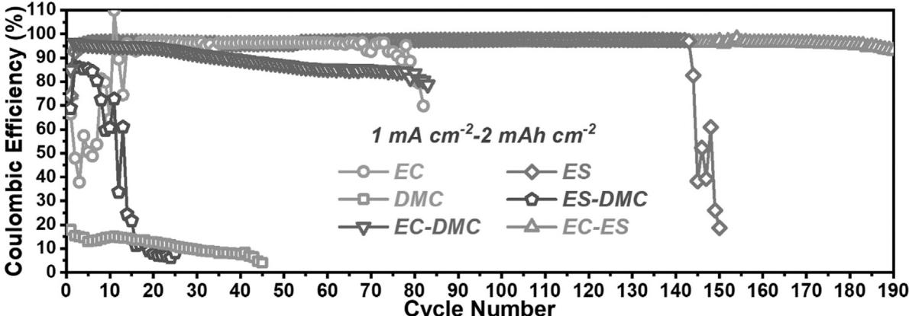
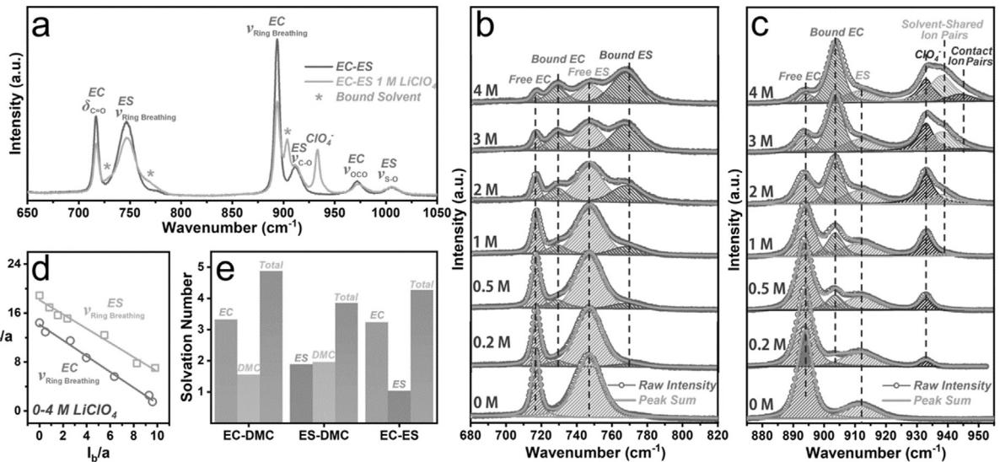
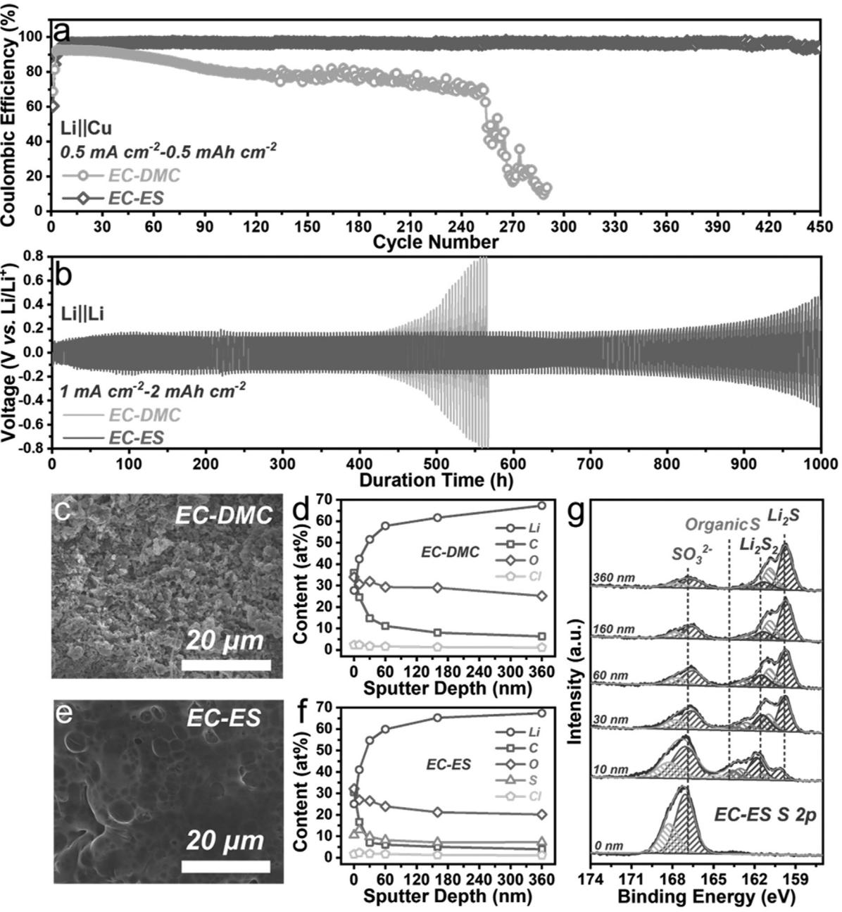
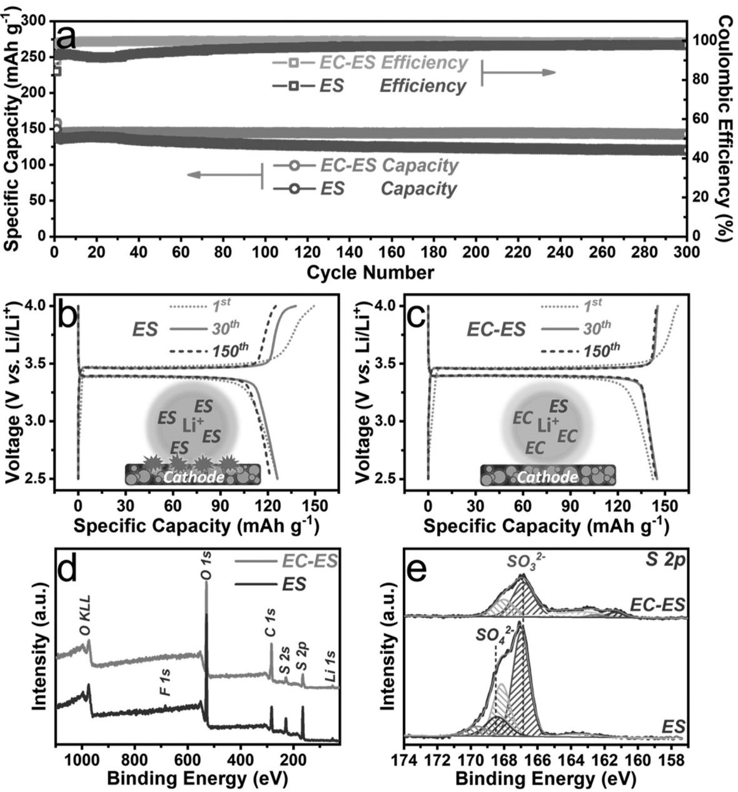

## Electrochemistry

Zitierweise:

Internationale Ausgabe: doi.org/[10.1002/anie.202000023](http://dx.doi.org/10.1002/anie.202000023) Deutsche Ausgabe: doi.org/[10.1002/ange.202000023](http://dx.doi.org/10.1002/ange.202000023)

## Solvent Molecule Cooperation Enhancing Lithium Metal Battery Performance at Both Electrodes

Yifang Zhang, Yiren Zhong, Zishan Wu, Bo Wang,\* Shuquan Liang,\* and [Hailiang Wang\\*](http://orcid.org/0000-0003-4409-2034)

Abstract: Developing electrolytes compatible with efficient and reversible cycling of electrodes is critical to the success of rechargeable Li metal batteries (LMBs). The Coulombic efficiencies and cycle lives of LMBs with ethylene carbonate (EC), dimethyl carbonate, ethylene sulfite (ES), and their combinations as electrolyte solvents show that in a binarysolvent electrolyte the extent of electrolyte decomposition on the electrode surface is dependent on the solvent component that dominates the solvation sheath of Li+. This knowledge led to the development of an EC-ES electrolyte exhibiting high performance for Li jj LiFePO4 batteries. Carbonate molecules occupy the solvation sheath and improve the Coulombic efficiencies of both the anode and cathode. Sulfite molecules lead to desirable morphology and composition of the solid electrolyte interphase and extend the cycle life of the Li metal anode. The cooperation between these components provides a new example of electrolyte optimization for improved LMBs.

Lithium ion batteries (LIBs) have boosted the development of portable electronics, electric vehicles, and smart grids in the past decades.[1] Nevertheless, their energy density is approaching the ceiling, which plagues their wider application in the future. The demand for more powerful batteries has motivated researchers to explore new chemistries beyond Li ion intercalation. Li metal electrodes operating upon the interconversion between Li0 and Li+ are a popular candidate for the anode.[2–5] Despite its ultrahigh specific capacity of 3860 mAh g-1 , the deposition/dissolution process often exhibits relatively low Coulombic efficiency (CE) owing to the high reactivity of Li metal with common electrolytes, which would corrode the Li anode and shorten its cycle life.[6–9]

In our prior research, we found that the efficiency of a thick Li metal electrode is limited by the reactivity of the electrolyte and the cycle life is determined by the properties of the interphase layer.[10] Yet how the electrolyte species

| [*] Y. Zhang, Y. Zhong, Z. Wu, H. Wang Department of Chemistry and Energy Sciences Institute, Yale University, West Haven, CT 06516 (USA) E-mail: hailiang.wang@yale.edu |
|-----------------------------------------------------------------------------------------------------------------------------------------------------------------------------------|
| Y. Zhang, S. Liang School of Materials Science & Engineering, Central South University Changsha, Hunan 410083 (China) E-mail: lsq@csu.edu.cn                             |
| B. Wang Global Energy Interconnection Research Institute North America San Jose, CA 95134 (USA) E-mail: bo.wang@geirina.net                                              |
| Supporting information and the ORCID identification number(s) for the author(s) of this article can be found under: https://doi.org/10.1002/anie.202000023.                 |

2020 Wiley-VCH Verlag GmbH & Co. KGaA, Weinheim 7871

interact with the Li metal electrode under electrochemical conditions and affect the performance of Li metal batteries (LMBs) are not well understood. Solvation of the Li+ ion is considered to be important to the chemistry at the electrode/ electrolyte interface.[11] Various techniques, including vibrational spectroscopy (FTIR or Raman),[12–15] electrospray ionization mass spectrometry,[16] and nuclear magnetic resonance spectroscopy[17, 18] have been employed to study the structure of the solvation sheath and to understand the interfacial chemistry on the molecular level. It has been shown that the solvation structure is related to important phenomena in LIBs, including formation of the solid electrolyte interphase (SEI),[19] co-intercalation of solvent,[20] and effects of concentrated electrolyte.[14, 15, 21] As new electrolytes remain to be developed for efficient and stable LMBs, it is necessary to study the correlation of the Li+ ion solvation with the performance of Li metal electrodes. In addition, influences on both the anode and the cathode should be taken into account for the design and optimization of electrolytes.

In this work, we studied the effects of individual electrolyte solvents and their combinations in LMBs, and correlated the electrochemical performance with their interactions with Li+. On the anode side, a binary-solvent electrolyte can exhibit high CE if the solvent molecules of high compatibility/ low reactivity with Li metal electrodes dominate the solvation sheath of Li+, despite the co-existence of a low-efficiency solvent in the electrolyte. The minor component of the solvation sheath, however, still participates in the formation of the SEI, and consequently influences the structure and properties of the interphase layer as well as cycle life of the electrode. On the cathode side, the stability of an electrolyte against oxidation is also determined by the solvation structure of Li+. Based on these findings, we developed a new electrolyte with an ethylene carbonate (EC)-ethylene sulfite (ES) mixed solvent to achieve high efficiency for both the Li metal anode and the LiFePO4 cathode, owing to the desirable solvation structure of Li+ in this electrolyte. Long cycle life was simultaneously realized with the assistance of the sulfurcontaining species in the SEI layer contributed by ES.

Three ester compounds with basic cyclic/acyclic structures, namely EC, dimethyl carbonate (DMC), and ES, were selected as solvents to prepare 1m LiClO4 electrolytes in this study. Li jj Cu cells were first assembled to evaluate the effects of these solvents on Li deposition/dissolution. Among the single-solvent electrolyte systems (Figure 1; see Figures S1 and S2), EC and ES show relatively high CE ( 97%) and can support Li deposition/dissolution for about 70 and 140 cycles, respectively. The CE fluctuation during the initial cycling stage of the EC cell could be associated with the possibility that the electrolyte was not fully in the liquid state

Figure 1. CEs of Li j jCu cells cycled with different electrolytes under 1 mA cm-2 –2 mAh cm-2 conditions.

because of the high melting point of EC (398C), as evidenced by the liquid-to-solid phase transition of freshly prepared 1m LiClO4/EC standing at 208C (see Figure S3). In contrast, DMC shows low CE ( 15%), indicating its high reactivity in competition with the reduction of Li+. We then investigated binary mixtures of these compounds as mixed solvents can often overcome shortcomings of each component and optimize properties such as melting/boiling/flashing point, dielectric permittivity, and viscosity. The mixed-solvent electrolytes possess viscosity and ionic conductivity values comparable to those of commercial liquid electrolytes (see Figure S4). Here we focus on chemical properties and their influences on the efficiency and cycling of LMBs. The Li jj Cu cell results of the binary-solvent electrolytes (all mixed with a 1:1 volume ratio) are shown in Figure 1 and Figures S5 and S6. We noticed that the Li deposition/dissolution CE in a binary-solvent electrolyte is not a simple average of those in the corresponding single-solvent electrolytes. CE of the EC-DMC cell sustains at about 95% for 20 cycles before it gradually decreases to about 80% after the 80th cycle, comparable to that in the EC electrolyte. CE of the ES-DMC electrolyte only reaches about 85% for 5 cycles and decreases rapidly afterwards, although the ES electrolyte exhibits high CE and much longer cycling. Remarkably, the EC-ES electrolyte shows the best performance in terms of both CE and cycling stability, outperforming both the EC and ES single-solvent electrolytes.

We hypothesized that the molecules in the solvation sheath of Li+ are more likely to react during Li deposition and therefore CE of a binary-solvent electrolyte is dependent on how the solvent molecules interact with Li+. Raman spectroscopy studies were conducted to test this hypothesis. The Raman spectrum of the EC-ES solvent (without any Li salt) in Figure 2 a (dark-colored trace) manifests vibrational peaks of EC and ES at identical wavenumbers as for the single solvents (see Figure S7), indicating that there is no interaction

Figure 2. a) Raman spectra of EC-ES with and without 1m LiClO4 salt. b,c) Raman spectra of LiClO4/EC-ES solutions as a function of LiClO4 concentration. d) If –Ib plot for the ring breathing vibrations of EC and ES in LiClO4/EC-ES solutions of various concentrations. Both If and Ib were divided by a constant a to make the plot. e) Solvation numbers of Li+ in different binary-solvent electrolytes with 1m LiClO4.

7872 [www.angewandte.de](http://www.angewandte.de) -

2020 Wiley-VCH Verlag GmbH & Co. KGaA, Weinheim Angew. Chem. 2020, 132, 7871 –7876

between EC and ES. With 1m LiClO4 dissolved in the mixed solvent, additional peaks emerge in the spectrum (red trace), which are ClO4 and Li+-bound solvent molecules (marked with a green star).[22] As the concentration of LiClO4 is varied within the range of 0–4m, the vibrational features evolve and the solvation structure of Li+ is unveiled (Figures 2 b and c). As the Li+ concentration increases, the C=O bending peak of EC (dC=O, 717 cm-1 , Figure 2 b) and the ring breathing peaks of ES (nRing Breathing, 748 cm-1 , Figure 2 b) and EC (nRing Breathing, 894 cm-1 , Figure 2 c) all decrease in intensity, with new peaks appearing and gradually growing at higher wavenumbers next to their parent peaks. The C-O stretching of ES (nC-O, 912 cm-1 , Figure 2 c) neither weakens nor evolves into two peaks, suggesting little effect of Li+ on this bond in the ES molecule. Moreover, the area of the ClO4 peak increases with the concentration, and at higher Li salt concentrations two new components representing solvent-shared ion pairs and contact ion pairs become visible as a result of tighter binding between ClO4 and Li+. [13]

The ratio of free/bound solvent molecules can be quantified through deconvoluting the Raman peaks. Here G is introduced to correlate Raman peak intensity (area) and molecular concentration:[14, 22, 23]

$$
I_{\rm f} = \frac{C_{\rm f}}{C} \Gamma_{\rm f} \tag{1}
$$

$$
I_{\rm b} = \frac{C_{\rm b}}{C} \Gamma_{\rm b} \tag{2}
$$

$$
C_{\rm f} + C_{\rm b} = C \tag{3}
$$

In these equations, If and Ib are the peak intensities of free and bound solvent molecules, respectively. C is the total concentration of solvent molecules in the electrolyte. Cf and Cb are the concentrations of free and bound solvent molecules, respectively. From Equations (1) and (2), the relation:

$$
\frac{C_{\rm b}}{C_{\rm f}} = \frac{\Gamma_{\rm f}}{\Gamma_{\rm b}} \frac{I_{\rm b}}{I_{\rm f}}\tag{4}
$$

can be obtained. The coefficient Gf Gb can be deduced from Equation (3) by plotting If against Ib and fitting the slope.

$$
I_{\rm f} = -\frac{\Gamma_{\rm f}}{\Gamma_{\rm b}} I_{\rm b} + \Gamma_{\rm f} \tag{5}
$$

Figure 2 d shows the linear regressions between If and Ib for the ring breathing peaks of EC and ES. Using the derived concentrations of bound solvent molecules and the known concentration of Li+ in the electrolyte, we can estimate the apparent solvation number for each solvent. The interactions of Li+ with either EC, ES, or DMC as a single solvent are tested for comparison (see Figures S8–S10). The results show that all the solvation sheaths are composed of around four solvent molecules surrounding one Li+ (see Figure S11 and Table S1). For the three binary-solvent electrolytes, the total solvation number of Li+ is also around 4 (Figure 2 e; see Figures S12–S16 and Table S1). Interestingly, preferential solvation is observed for the two EC-containing electrolytes, where the EC solvation number is much larger than the other cosolvent (DMC or ES) despite the 1:1 ratio in the electrolyte bulk. This preference can explain the CE difference between the EC-DMC and DMC electrolytes because in the former the more reactive DMC is displaced from the solvation sheath of Li+ by the less reactive EC. Indeed, FTIR characterization of the SEI layer shows that the decomposition products are mostly from EC (see Figure S17). These results reveal that the reactivity of an electrolyte on Li metal electrodes, which strongly affects the CE under stable cycling conditions, is not simply governed by its composition but is greatly influenced by the solvation structure of Li+.

Prior research has shown that the cycle life of a thick Li metal electrode depends more on the structure and properties of the SEI layer, which forms and grows as a result of the side reactions between the Li metal electrode and the electrolyte during cycling.[10, 24] While preferential solvation has a great influence on the composition of the SEI layer, all the electrolyte components that can decompose under the electrochemical conditions could make a difference. Here we compare the EC-DMC and EC-ES electrolytes to illustrate this point (Figure 3). While the solvation sheath of Li+ is dominated by EC in both electrolytes, keeping the Li deposition/dissolution CEs greater than 90%, these two electrolytes differ substantially in cycle life. Cycled at a current density of 0.5 mA cm-2 and a capacity of 0.5 mAh cm-2 , the Li jj Cu cell with the EC-ES electrolyte can sustain a high CE ( 97%) for 450 cycles, whereas the CE of the cell using the EC-DMC electrolyte is about 92% and only lasts for 30 cycles before significant deterioration starts to occur (Figure 3 a; see Figures S18 and S19). Under 1 mA cm-2 –2 mAh cm-2 conditions, the EC-ES cell can be stably cycled for 180 cycles while the EC-DMC cell starts to fail after only 20 cycles (Figure 1). Under even harsher conditions of 2 mA cm-2 –5 mAh cm-2 , the EC-ES cell also exhibits more stable cycling with higher CE than the EC-DMC cell (see Figures S20–S22). When tested in symmetric Li jj Li cells cycled under 1 mA cm-2 –2 mAh cm-2 conditions, the EC-ES electrolyte supports much longer cycling (800 h vs. 400 h) and smaller overpotential (50 mV vs. 70 mV) than the EC-DMC cell (Figure 3 b; see Figure S23).

The difference in cycling stability is strongly correlated with the morphology and composition of the SEI layer.[25] Scanning electron microscopy (SEM) imaging of the interphase layer formed on the Cu electrode in the EC-DMC Li jj Cu cell after 10 cycles of Li plating and stripping under 1 mA cm-2 –2 mAh cm-2 conditions shows that the consists of loosely packed whiskers (Figure 3 c; see Figure S24). In contrast, the SEI layer formed in the EC-ES electrolyte is dense and flat (Figure 3 e; Figure S24). In correlation, the Li deposited in the EC-ES electrolyte is much more uniform and smoother than that in the EC-DMC electrolyte (see Figure S25). Depth-dependent X-ray photoelectron spectroscopy (XPS) analysis was performed to study the chemical compositions of the SEI layers (Figures 3 d,f,g; see Figures S26–S31). Both films feature an outer surface rich in organic species (with high fractions of Li, C and O) and an inner layer rich in inorganic species (with high fractions of Li and O). With ES instead of DMC in the electrolyte, it is noteworthy that the organic-rich layer is thinner, as evidenced

Figure 3. a) CEs of Li j jCu cells with 1m LiClO4/EC-DMC and 1m LiClO4/EC-ES electrolytes under 0.5 mA cm-2 –0.5 mAh cm-2 conditions. b) Cycling performance of Li j j Li cells with 1m LiClO4/EC-DMC and 1m LiClO4/EC-ES electrolytes under 1 mA cm-2 –2 mAh cm-2 conditions. SEM images and depth-dependent elemental distributions (measured by XPS) of the SEI layers on Cu electrodes in Lij jCu cells after 10 cycles under 1 mA cm-2 –2 mAh cm-2 conditions with c,d) 1m LiClO4/EC-DMC and e,f) 1m LiClO4/EC-ES electrolytes. g) Depth-dependent S 2p XPS spectra of the SEI layer on Cu electrode in Li j jCu cell after 10 cycles under 1 mA cm-2 –2 mAh cm-2 conditions with 1m LiClO4/EC-ES electrolyte.

from the steeper decrease (increase) in C (Li) content with the sputtering depth (Figures 3 d and f). This feature is beneficial for extending the cycle life of the Li metal electrode since the inorganic species are generally more ionically conductive.[26] Furthermore, decomposition of ES introduces Li2S and Li2S2 in the interphase (Figure 3 g), which are considered desirable SEI components for Li metal electrodes.[27–30] Taken together, ES as a cosolvent leads to a more suitable SEI layer for longterm cycling, even though ES is not the dominant component in the solvation sheath of Li+. Control experiments show that the EC:ES ratio in the electrolyte significantly affects the cycle life of the Li jj Cu cell but less so on the CE (see Figures S32–S34). This suggests both EC and ES contribute to the formation, structure, composition, and properties of the SEI.

A LMB requires a cathode to pair with the Li metal anode. Therefore, electrolyte design and optimization for improved Li metal electrodes should also take into consideration how it may impact the cathode. Now let us turn to Li jj LiFePO4 full cells and focus on the cathode. While ES itself is

Figure 4. a) Cycling performance of Lij j LiFePO4 cells at 1C rate (170 mA g-1 for LiFePO4) with 1m LiClO4/EC-ES and 1m LiClO4/ES electrolytes. Charging-discharging voltage profiles of Lij j LiFePO4 cells with 1m LiClO4/ES (b) and 1m LiClO4/EC-ES (c) electrolytes at selected cycles. d) XPS survey spectra and e) S 2p XPS spectra of the LiFePO4 electrodes after 50 cycles in the two electrolytes.

a reasonably good electrolyte solvent for Li metal anode in terms of CE and cycle life (Figure 1), it is not fully compatible with the LiFePO4 cathode. The Li jjLiFePO4 cell with the ES electrolyte manifests unsatisfactory CEs as low as 91.5% (excluding the first cycle) and its capacity decays obviously after 30 cycles (Figure 4 a). This behavior is caused by ES decomposition under high-potential conditions, which is indicated by the voltage plateau near 4 V in the charging profile (Figure 4 b) and verified by the sulfate signal in the XPS result (Figures 4 d,e; see Figure S35). We show that this problem can be resolved by using the EC-ES electrolyte where EC dominates the solvation sheath of Li+ and thus reduces the reactivity of ES on the electrode surface. Indeed, the EC-ES electrolyte is more stable against oxidation in the working voltage range of LiFePO4 (Figures 4 c and e). With the electrolyte optimized for both the Li metal anode and the LiFePO4 cathode, the EC-ES cell shows stable cycling with high CE (99.9%) and negligible capacity decay over 300 cycles (Figure 4 a). Thanks to the preferential solvation of EC, its positive effect is already obvious when the EC:ES ratio in the bulk electrolyte is 1:3 (see Figures S36 and S37). When the mass loading of LiFePO4 is increased to about 17 mg cm-2 ( 2 mAh cm-2 ), the corresponding EC-ES cell significantly outperforms the EC-DMC cell in terms of cycling stability, and the ES cell in terms of CE (see Figures S38 and S39). When another cathode material LiCoO2 with a higher working potential is used, the EC-ES electrolyte is still compatible showing high and stable CE (see Figures S40 and S41).

In summary, we have discovered that the reactivity of electrolyte solvent on electrode surface is strongly influenced by the solvation sheath of Li+, based on which we have developed an EC-ES electrolyte showing improved performance for Li jjLiFePO4 batteries. EC molecules dominate the solvation sheath and mitigate side reactions on both the anode and the cathode. ES introduces sulfur-containing species in the SEI and extends the cycle life of the Li metal anode.

## Acknowledgements

This work was partially supported by GEIRI North America (Project no. SGRIDGKJ[2017]841) and the Sloan Research Fellowship. Y. Zhang acknowledges the scholarship from China Scholarship Council (CSC, 201706370126). Y. Zhong acknowledges the Link Foundation Energy Fellowship.

## Conflict of interest

The authors declare no conflict of interest.

Keywords: batteries · electrochemistry · electrolytes · lithium · solvent effects

Zitierweise: Angew. Chem. Int. Ed. 2020, 59, 7797 – 7802 Angew. Chem. 2020, 132, 7871 – 7876

- [1] D. Larcher, J. M. Tarascon, [Nat. Chem.](https://doi.org/10.1038/nchem.2085) 2015, 7, 19 29.
- [2] P. G. Bruce, S. A. Freunberger, L. J. Hardwick, J. M. Tarascon, [Nat. Mater.](https://doi.org/10.1038/nmat3191) 2012, 11, 19 – 29.
- [3] Y. Zhong, L. Yin, P. He, W. Liu, Z. Wu, H. Wang, [J. Am. Chem.](https://doi.org/10.1021/jacs.7b11434) Soc. 2018, 140[, 1455 – 1459.](https://doi.org/10.1021/jacs.7b11434)
- [4] Q. Shi, Y. Zhong, M. Wu, H. Wang, H. Wang, [Proc. Natl. Acad.](https://doi.org/10.1073/pnas.1803634115) Sci. USA 2018, 115[, 5676 – 5680.](https://doi.org/10.1073/pnas.1803634115)
- [5] Q. Pang, X. Liang, I. R. Kochetkov, P. Hartmann, L. F. Nazar, [Angew. Chem. Int. Ed.](https://doi.org/10.1002/anie.201805456) 2018, 57, 9795 – 9798; [Angew. Chem.](https://doi.org/10.1002/ange.201805456) 2018, 130[, 9943 – 9946](https://doi.org/10.1002/ange.201805456).
- [6] B. Liu, J. G. Zhang, W. Xu, Joule 2018, 2[, 833 845.](https://doi.org/10.1016/j.joule.2018.03.008)
- [7] X. B. Cheng, R. Zhang, C. Z. Zhao, Q. Zhang, [Chem. Rev.](https://doi.org/10.1021/acs.chemrev.7b00115) 2017, 117[, 10403 – 10473.](https://doi.org/10.1021/acs.chemrev.7b00115)
- [8] S. Li, M. Jiang, Y. Xie, H. Xu, J. Jia, J. Li, [Adv. Mater.](https://doi.org/10.1002/adma.201706375) 2018, 30, [1706375.](https://doi.org/10.1002/adma.201706375)
- [9] M. D. Tikekar, S. Choudhury, Z. Tu, L. A. Archer, Nat. Energy 2016, 1, 16114.
- [10] Y. F. Zhang, Y. R. Zhong, S. Q. Liang, B. Wang, X. Chen, H. L. Wang, [ACS Mater Lett.](https://doi.org/10.1021/acsmaterialslett.9b00167) 2019, 1, 254 – 259.
- [11] C. C. Su, M. He, R. Amine, T. Rojas, L. Cheng, A. T. Ngo, K. Amine, [Energy Environ. Sci.](https://doi.org/10.1039/C9EE00141G) 2019, 12, 1249 – 1254.
- [12] K. K. Lee, K. Park, H. Lee, Y. Noh, D. Kossowska, K. Kwak, M. Cho, Nat. Commun. 2017, 8, 14658.
- [13] M. G. Giorgini, K. Futamatagawa, H. Torii, M. Musso, S. Cerini, [J. Phys. Chem. Lett.](https://doi.org/10.1021/acs.jpclett.5b01524) 2015, 6, 3296 – 3302.
- [14] Z. Zeng, V. Murugesan, K. S. Han, X. Jiang, Y. Cao, L. Xiao, X. Ai, H. Yang, J. G. Zhang, M. L. Sushko, J. Liu, [Nat. Energy](https://doi.org/10.1038/s41560-018-0196-y) 2018, 3[, 674 – 681](https://doi.org/10.1038/s41560-018-0196-y).
- [15] X. Wang, F. Chen, G. M. A. Girard, H. Zhu, D. R. MacFarlane, D. Mecerreyes, M. Armand, P. C. Howlett, M. Forsyth, Joule 2019, 3, 1 – 16.
- [16] A. von Wald Cresce, O. Borodin, K. Xu, [J. Phys. Chem. C](https://doi.org/10.1021/jp303610t) 2012, 116[, 26111 – 26117.](https://doi.org/10.1021/jp303610t)
- [17] X. Bogle, R. Vazquez, S. Greenbaum, A. Cresce, K. Xu, [J. Phys.](https://doi.org/10.1021/jz400661k) Chem. Lett. 2013, 4[, 1664 – 1668](https://doi.org/10.1021/jz400661k).
- [18] X. Ren, S. Chen, H. Lee, D. Mei, M. H. Engelhard, S. D. Burton, W. Zhao, J. Zheng, Q. Li, M. S. Ding, M. Schroeder, J. Alvarado, K. Xu, Y. S. Meng, J. Liu, J. G. Zhang, W. Xu, [Chem](https://doi.org/10.1016/j.chempr.2018.05.002) 2018, 4, [1877](https://doi.org/10.1016/j.chempr.2018.05.002).
- [19] O. Borodin, D. Bedrov, [J. Phys. Chem. C](https://doi.org/10.1021/jp504598n) 2014, 118, 18362 [18371](https://doi.org/10.1021/jp504598n).
- [20] L. Xing, X. Zheng, M. Schroeder, J. Alvarado, A. Cresce, K. Xu, Q. Li, W. Li, [Acc. Chem. Res.](https://doi.org/10.1021/acs.accounts.7b00474) 2018, 51, 282 – 289.
- [21] J. M. Zheng, J. A. Lochala, A. Kwok, Z. Q. D. Deng, J. Xiao, Adv. Sci. 2017, 4[, 1700032.](https://doi.org/10.1002/advs.201700032)
- [22] S. A. Hyodo, K. Okabayashi, [Electrochim. Acta](https://doi.org/10.1016/0013-4686(89)87040-9) 1989, 34, 1551 [1556](https://doi.org/10.1016/0013-4686(89)87040-9).
- [23] H. P. Chen, J. W. Fergus, B. Z. Jang, [J. Electrochem. Soc.](https://doi.org/10.1149/1.1393209) 2000, 147[, 399 – 406](https://doi.org/10.1149/1.1393209).
- [24] Y. F. Zhang, Y. R. Zhong, Q. W. Shi, S. Q. Liang, H. L. Wang, [J.](https://doi.org/10.1021/acs.jpcc.8b06650) [Phys. Chem. C](https://doi.org/10.1021/acs.jpcc.8b06650) 2018, 122, 21462 – 21467.
- [25] F. Shi, A. Pei, A. Vailionis, J. Xie, B. Liu, J. Zhao, Y. Gong, Y. Cui, [Proc. Natl. Acad. Sci. USA](https://doi.org/10.1073/pnas.1708224114) 2017, 114, 12138 – 12143.
- [26] E. Peled, S. Menkin, [J. Electrochem. Soc.](https://doi.org/10.1149/2.1441707jes) 2017, 164, A1703 [A1719.](https://doi.org/10.1149/2.1441707jes)
- [27] X. B. Cheng, C. Yan, H. J. Peng, J. Q. Huang, S. T. Yang, Q. Zhang, [Energy Storage Mater.](https://doi.org/10.1016/j.ensm.2017.03.008) 2018, 10, 199 – 205.
- [28] W. Li, H. Yao, K. Yan, G. Zheng, Z. Liang, Y. M. Chiang, Y. Cui, Nat. Commun. 2015, 6, 7436.
- [29] Y. X. Ren, L. Zeng, H. R. Jiang, W. Q. Ruan, Q. Chen, T. S. Zhao, Nat. Commun. 2019, 10, 3249.
- [30] Y. Zhao, G. Li, Y. Gao, D. Wang, Q. Huang, D. Wang, [ACS](https://doi.org/10.1021/acsenergylett.9b00539) Energy Lett. 2019, 4[, 1271 – 1278.](https://doi.org/10.1021/acsenergylett.9b00539)

Manuscript received: January 1, 2020 Revised manuscript received: February 2, 2020 Accepted manuscript online: February 5, 2020 Version of record online: March 3, 2020