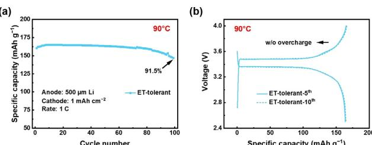
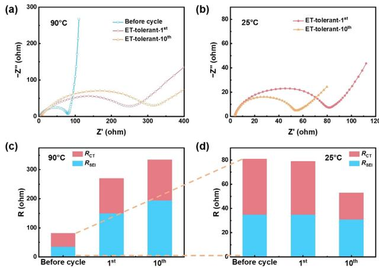
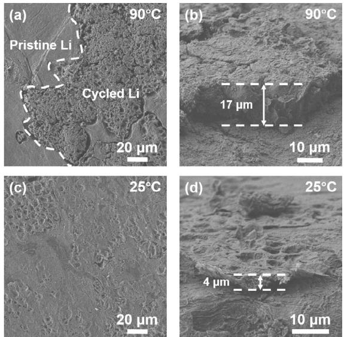
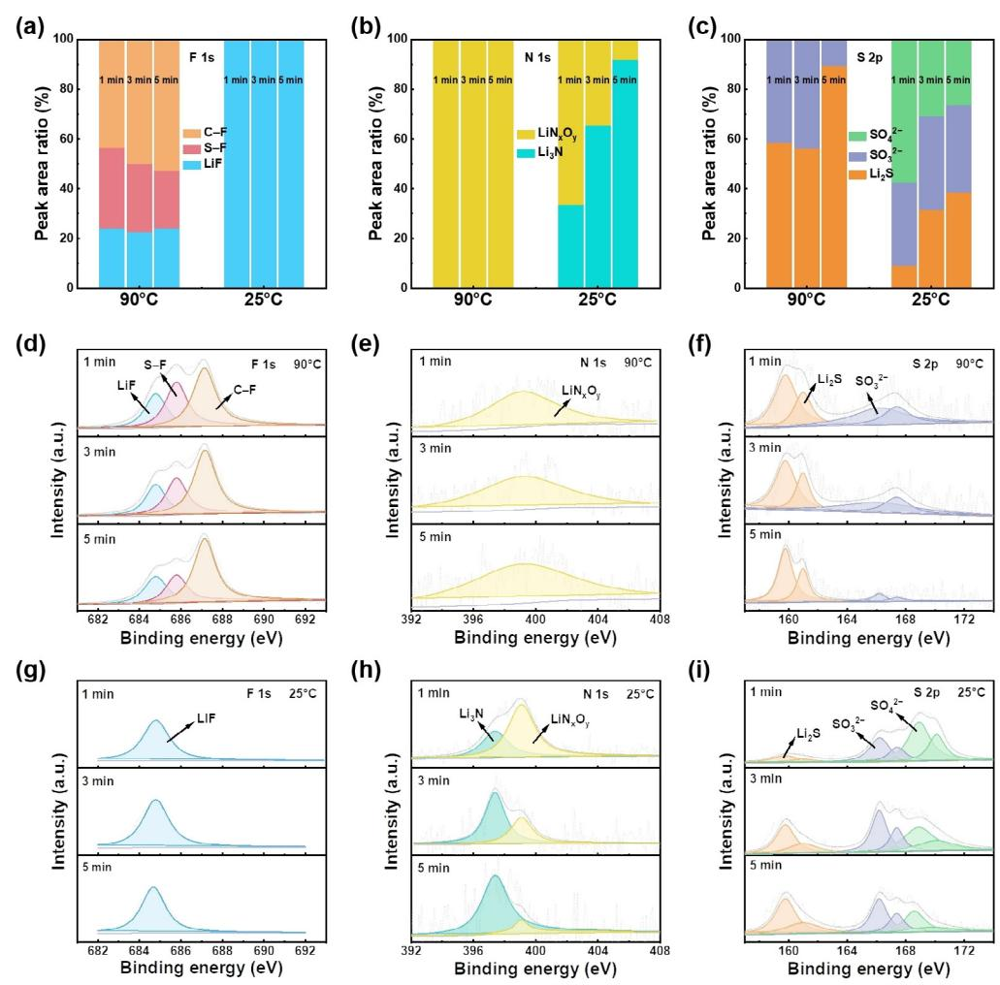
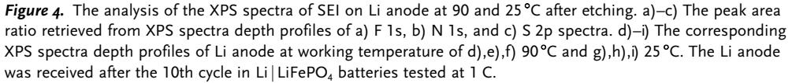
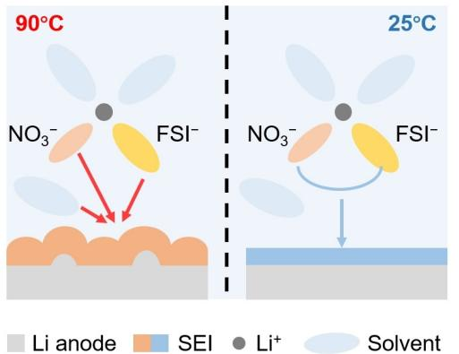

## Electrochemistry Hot Paper

Zitierweise: Angew. Chem. Int. Ed. 2020, 59, 15109 – 15113 Internationale Ausgabe: doi.org/[10.1002/anie.202002711](http://dx.doi.org/10.1002/anie.202002711) Deutsche Ausgabe: doi.org[/10.1002/ange.202002711](http://dx.doi.org/10.1002/ange.202002711)

# Cycling a Lithium Metal Anode at 90 8C in a Liquid Electrolyte

Li-Peng Hou, Xue-Qiang Zhang, Bo-Quan Li, and [Qiang Zhang\\*](http://orcid.org/0000-0002-3929-1541)

Abstract: Stable operation at elevated temperature is necessary for lithium metal anode. However, Li metal anode generally has poor performance and safety concerns at high temperature (> 558C) owing to the thermal instability of the electrolyte and solid electrolyte interphase in a routine liquid electrolyte. Herein a Li metal anode working at an elevated temperature (90 8C) is demonstrated in a thermotolerant electrolyte. In a Li j LiFePO4 battery working at 90 8C, the anode undergoes 100 cycles compared with 10 cycles in a practical carbonate electrolyte. During the formation of the solid electrolyte interphase, independent and incomplete decomposition of Li salts and solvents aggravate. Some unstable intermediates emerge at 90 8C, degenerating the uniformity of Li deposition. This work not only demonstrates a working Li metal anode at 908C, but also provides fundamental understanding of solid electrolyte interphase and Li deposition at elevated temperature for rechargeable batteries.

With the increasing demands of portable electronics, electrical vehicles, and smart grids, secondary batteries with higher energy density compared with lithium (Li)-ion batteries are attracting much attention.[1] Li metal anode has been strongly considered as one of the most promising anode candidates for high-energy-density batteries with its merits of high theoretically specific capacity (3860 mAh g-1 ) and low reduction potential (-3.04 V vs. standard hydrogen electrode).[2] In a practical perspective, the wide working temperature range is necessary for the secondary batteries owing to the diversified scenarios and working conditions,[3] especially an elevated temperature.[4]

Elevated temperature generally brings irreversible side reactions and even thermal runaway during the operation of a working battery.[5] A routine electrolyte in Li-ion batteries begins to decompose above 55 8C[6] and the solid electrolyte interphase (SEI) starts to disintegrate above 65 8C,[7] inducing a rapid degradation. The risk of thermal runaway increases rapidly beyond the working temperature range. This limits most Li-ion batteries only to work at a mild temperature range (< 55 8C).[5, 8] While Li metal anode is employed, the high reactive nature of Li metal towards nonaqueous liquid electrolyte brings more severe and new challenges at elevated temperature. For example, the routine carbonate solvents with low boiling point (such as 1268C for diethyl carbonate (DEC)) will react with Li metal aggressively. Hydrogen fluoride (HF) induced by the hydrolysis of lithium hexafluorophosphate (LiPF6) can increase significantly and corrode Li metal and SEI.[6] Therefore, a working Li metal anode at elevated temperature is much challenged but integrant for practical applications with diversified scenarios.

Pioneering efforts have been devoted to investigating the Li metal anode working at elevated temperature in a liquid electrolyte, such as electrolyte additives,[9] thermally stable solvents and Li salts,[10, 11] and functional separators.[12] Recently, Li and co-workers demonstrated that Li metal batteries can deliver at 80 8C by employing two thermally stable Li salts, namely, lithium bis(trifluoro-methanesulfonimide) (LiTFSI) and lithium difluoro(oxalato)borate (LiDFOB), and ethylene carbonate (EC) and propylene carbonate (PC) solvents with high boiling point.[11] Apart from much improved cycling performance, the fundamental understanding in features of Li plating/stripping, the decomposition of electrolyte, and the formation of SEI at elevated temperature are worthy of attention.

When it comes to elevated temperature, the mechanical properties of Li metal and the reaction pathways between Li metal and electrolyte to form SEI will change. The yield strength of Li operated at 908C decreases by three orders of magnitude and the interfacial orientation of Li deposition alters, affording to new insights in suppressing Li dendrites.[13] Meanwhile, some chemical/electrochemical reactions, which cannot occur at room temperature (25 8C), will proceed at elevated temperature, enhancing the reaction and depletion of electrolyte and fresh Li metal. Furthermore, the kinetics of some decomposition reactions between Li and electrolyte can be accelerated with increasing temperature according to Arrhenius formula. Consequently, the components and structure of SEI change, inducing different Li ion diffusion pathways and the behaviors of Li deposition.[14, 15] Therefore, a working Li metal anode at elevated temperature is much distinctive from that at room temperature. Furthermore, the exploration of a working Li metal anode at elevated temperature can provide new perspectives for disclosing the behaviors of Li plating/stripping and the formation mechanism of SEI, which affords fundamental guidance for anode interfacial regulation at elevated temperature in various battery systems.

Herein, a working Li metal anode is demonstrated at 908C in a thermotolerant liquid electrolyte. The better performance of Li metal anode at more elevated temperature induces less possibility of thermal runaway of batteries. Specically, lithium bis(fluorosulfonyl)imide (LiFSI) and lithium nitrate (LiNO3) are dissolved in mixed solvents composed of fluoroethylene carbonate (FEC) and tetraethylene glycol dimethyl ether (TEGDME) to constitute an elevated temperature-tolerant (ET-tolerant) electrolyte. When applied

Angew. Chem. 2020, 132, 15221 –15225 -

2020 Wiley-VCH Verlag GmbH & Co. KGaA, Weinheim 15221

[\*] L.-P. Hou, X.-Q. Zhang, B.-Q. Li, Prof. Q. Zhang Beijing Key Laboratory of Green Chemical, Reaction Engineering and Technology, Department of Chemical Engineering Tsinghua University, Beijing 100084 (P. R. China) E-mail: zhang-qiang@mails.tsinghua.edu.cn

Supporting information and the ORCID identification number(s) for the author(s) of this article can be found under: [https://doi.org/10.1002/anie.202002711.](https://doi.org/10.1002/anie.202002711)

into a Li jLiFePO4 battery working at 908C, the Li metal anode undergoes 100 cycles in the ET-tolerant electrolyte with a capacity retention of 91.5%, while the Li metal anode rapidly degenerates only within 10 cycles in a practical routine electrolyte (1.0m LiPF6 in EC/DEC). Distinctive features of SEI and Li deposition at 90 8C are revealed in the ET-tolerant electrolyte, which is a reasonable research platform. Both independent and incomplete decomposition of Li salts and solvents are enhanced at 90 8C, altering the formation mechanisms of SEI at 258C and inducing a degenerated uniformity of Li deposition.

The cycling performance of Li metal anode at 908C is evaluated in Li j LiFePO4 batteries. The full cells with the routine electrolyte fail rapidly within 10 cycles with a retention of 71.7% (Supporting Information, Figure S1a). The overcharge is obvious owing to the disintegration of electrolyte (Supporting Information, Figure S1b).[16] The low boiling point of DEC (1268C) and the decomposition of LiPF6 above 558C contribute to the fast capacity decay,[11] indicating that Li metal anode cannot tolerate cycling at 90 8C in the practical carbonate electrolyte. Moreover, the carbonate electrolyte exhibits poor compatibility with Li metal, thus, the side effects can be enlarged at elevated temperature. Therefore, TEGDME,[17] an ether solvent with a high boiling point (2758C) and good compatibility with Li metal, and FEC,[18] which is generally considered to form a SEI to enhance the uniformity of Li deposition, are coupled as cosolvents in the ET-tolerant electrolyte. LiFSI, which is more thermally stable than LiPF6, is employed as the Li salt.[19] Full cells with the ET-tolerant electrolyte deliver a prolonged lifespan with 91.5% capacity retention after 100 cycles, illustrating an absolute predominance over the routine carbonate electrolyte (Figure 1 a). There is nearly no overcharge during repeated cycles (Figure 1 b). Moreover, an overwhelming performance is achieved at room temperature in the ET-tolerant electrolyte (Supporting Information, Figure S2). Li j LiFePO4 batteries with the ET-tolerant electrolyte exhibit a capacity retention of 93.8% after 500 cycles (1 C) at 258C. The considerable performances both at 90 and 258C illustrate that an enhanced Li metal anode can be achieved at a wide range of operation temperature. Nevertheless, the cycle stability of Li metal deteriorates when it comes to elevated temperature. Therefore, the evolution

Figure 1. Electrochemical performance of Li j LiFePO4 batteries with an ET-tolerant electrolyte at 908C. a) Cycle lifespan and b) corresponding voltage–capacity curves of Li j LiFePO4 batteries. The Lij LiFePO4 batteries with a Li metal anode of 500 mm and a cathode with an areal capacity of 1 mAh cm-2 were tested at 1 C (1 C=170 mA g-1 ).

behaviors of Li deposition and the formation mechanism of SEI at elevated temperature are required to be explored.

The interfacial evolution of a working Li metal anode at 908C is detected by electrochemical impedance spectroscopy (EIS; Figure 2; Supporting Information, Figure S3). The semicircle in the high frequency and middle frequency region are designated to the resistance of Li ions through SEI (RSEI) and charge transfer (RCT), respectively.[20] Considering that LiFePO4 is relatively stable during the electrochemical window of 2.5–4.0 V, the dominated interfacial impedance can be assigned to Li metal anode and SEI. The RSEI increases about four times (from 35 to 150 ohm) after the first cycle at 90 8C in the ET-tolerant electrolyte, indicating that high temperature promotes the generation of a high resistant SEI (Figure 2 a,c). After the 10th cycle, the RSEI exhibits a slight increase (from 150 to 195 ohm) accompanying with similar increase in RCT (from 120 to 140 ohm). Although the SEI is highly resistant at 908C, it maintains a mild stability during cycling. In contrast, much smaller and more stable RSEI (35 and 31 ohm at the 1st and 10th cycle, respectively) is achieved in the ET-tolerant electrolyte when working at 258C (Figure 2 b,d). The increase of RSEI in the same electrolyte but different temperatures implies that the increasing temperature alters the decomposition reactions between electrolyte and Li anode and changes the components and structure of SEI.

Figure 2. The evolution of interfacial resistance of Li j LiFePO4 batteries using the ET-tolerant electrolyte during cycling at a),c) 908C and b),d) 258C. The dotted line is a local magnification of the impedance before cycling.

The homogeneity of Li plating/stripping and the accumulation of dead Li are efficient evidences for the uniformity of SEI.[21] Although local uniform Li deposition can be observed, the inhomogeneous utilization of active Li is still ubiquitous after the 10th cycle at 908C (Figure 3 a; Supporting Information, Figure S4a). Some areas of the pristine Li are not utilized during cycling. High temperature partially accelerates some side reactions between Li anode and electrolyte, and then results in enhanced inhomogeneity of SEI for Li ion diffusion. The nonuniform utilization patterns of Li metal is consistent with the previous works at 608C in an ether electrolyte,[14, 22]

### 15222 [www.angewandte.de](http://www.angewandte.de) -

Figure 3. Top-sectional and cross-sectional morphologies of Li deposition in Li j LiFePO4 batteries with the ET-tolerant electrolyte at a),b) 908C and c),d) 25 8C after the 10th cycle. Li metal anode was retrieved after cycled at 1 C. Pristine Li and Cycled Li in (a) represent the Li as received and the Li involved into cycling, respectively.

but the higher working temperature (90 8C) induces new difference in Li deposition. The nonuniform Li utilization exacerbates the formation of dead Li layer, constructing an aggressive positive feedback and accelerating the repeated regeneration of SEI. Finally, a thick dead Li layer (ca. 17 mm) is formed only after 10 cycles when the operation temperature reaches 908C (Figure 3 b), which is related to a high resistance of SEI (Figure 2). When it comes to a moderate working temperature at 25 8C, compact and uniform Li deposition with large Li nodules is observed (Figure 3 c; Supporting Information, Figure S4b). The stable and low resistant SEI induces a thin dead Li layer ca. 4 mm after 10 cycles (Figure 3 d). The behaviors of Li plating/stripping at 908C is much more aggressive and beyond conventional cognition compared with that at 258C.

The behaviors of Li plating/stripping are mainly related to the physical and chemical features of SEI. X-ray photoelectron spectroscopy (XPS) is conducted to reveal the evolution of the SEI formed at 90 or 258C after etching for 1, 3, and 5 min on a Li anode surface (Figure 4). There is an abundant inorganic component of LiF throughout the whole SEI formed at 25 8C, indicating a complete decomposition of FSI- (Figure 4 a,g). LiF with high surface energy is generally regarded as an effective component for homogeneous and fast Li deposition,[23] which corresponds to the low RSEI (Figure 2). In contrast, instead of LiF, the conspicuous existence of S-F bond can be detected at 908C in F 1s spectra (Figure 4 d). S-F species only originates from the disintegration of LiFSI. N-S bond in the FSI is the weakest bond and S-F bond is the second weakest according to DFT calculations.[24] Therefore, the abundant S-F bond in SEI signifies that the decomposition of FSI is incomplete at 90 8C. Low content of LiF but much S-F species contributes to a relatively high resistant SEI at 90 8C (Figure 2). The emergence of LiNxOy both at 908C and 25 8C demonstrates that LiNO3 involves in the formation of SEI (Figure 4 b,e,h). Furthermore, the different species detected in S 2p spectra imply that high temperature alters the decomposition mechanism of FSI-. As reported, NO3 is considered to accelerate the decomposition of FSI to sulfur-containing species in a high oxidation state, such as SO3 2 and SO4 2-. [25] The ubiquitous distribution of SO3 2 and SO4 2 at different depths at 258C demonstrates that the thorough decomposition of FSI with the assistance of LiNO3 (Figure 4 c,i). Nevertheless, plentiful Li2S and SO3 2 but little SO4 2 in S 2p spectra as well as abundant LiNxOy in N 1s spectra detected at 908C indicates that the disintegration of FSI and NO3 is separately enhanced at elevated temperature instead of NO3 assisting the decomposition of FSI to produce sulfur-containing species in a high oxidation state (Figure 4 c,f). Moreover, the presence of organic C-F bond is detected at 90 8C in F 1s spectra. The C-F bond only exists in FEC, which reveals that the incomplete decomposition of FEC participates in the formation of SEI with abundant organic components and less LiF. Therefore, the independent and incomplete disintegration of LiFSI and LiNO3 are enhanced at 90 8C and a possible decomposition mechanism of Li salts is proposed according to the results of XPS profiles by Equations (1), (2), and (3) (Supporting Information, Figure S5).

LiNðSO2FÞ2 þ 4 Liþ þ 4 e-! Li3N þ 2 LiSO2F ð1Þ

$$
LiN(SO_2F)_2 + 10Li^+ + 10e^- \rightarrow Li_3N + Li_2S + Li_2SO_3 + 2LiF + Li_2O
$$
 (2)

$$
x \text{LiNO}_3 + (5x-2y+1)\text{Li}^+ + (5x-2y+1)\text{e}^- \to \text{LiN}_x\text{O}_y + (3x-y)\text{Li}_2\text{O}
$$
 (3)

According to the above analysis, a distinctive formation mechanism of SEI is proposed when Li metal anode is operated at elevated temperature in liquid electrolyte. On the one hand, the independent and incomplete decomposition of Li salts is enhanced at high working temperature. The intermediate products, such as LiNxOy and components with S-F bond, generate at elevated temperature. Moreover, high temperature accelerates the decomposition process of NO3 -, weakening the synergistic effect between NO3 and FSI-, which promotes specific spatial distribution of inorganic components in SEI. On the other hand, the incomplete disintegration of FEC solvent is enhanced at 90 8C, forming more organic components (C-F species) instead of LiF. Less LiF with high surface energy induces a high interfacial impendence and non-uniformity of SEI at 90 8C compared to that at 25 8C. Consequently, a relatively nonuniform Li utilization can be observed at 90 8C (Figure 5).

In conclusion, a working Li metal anode at 90 8C is demonstrated in a thermotolerant electrolyte. A Li metal anode in Li j LiFePO4 battery working at 908C undergoes 100 cycles compared with 10 cycles in a routine electrolyte for practical batteries. The elevated temperature induces the independent and incomplete decomposition of Li salts and solvents, which significantly alters the components of SEI. Unstable intermediate decomposition products emerge but the components that contribute to rapid and uniform Li ion

diffusion, such as LiF, decrease at 90 8C. Therefore, a high-resistance SEI forms and the resistance significantly varies spatially, which induces a non-uniform utilization of Li metal. This contribution not only demonstrates an unprecedented working Li metal anode at 908C but also affords a fresh fundamental understanding of SEI and Li deposition at elevated temperature for rechargeable batteries.

### Acknowledgements

This work was supported by the National Key Research and Development Program (2016YFA0202500), National Natural Science Foundation of China (21825501 and U1801257), and the Tsinghua University Initiative Scientific Research Program. We thank helpful discussion with Peng Shi and Chong Yan.

Figure 5. The SEI formation mechanisms at 90 and 258C. The independent and incomplete decomposition of FEC solvent, NO3 -, and FSI are enhanced at 90 8C, inducing an inhomogeneous SEI and Li deposition (left). The thorough decomposition of FSI with the assistance of LiNO3 is achieved at 25 8C, enabling a uniform SEI and Li deposition (right).

### Conflict of interest

The authors declare no conflict of interest.

Keywords: elevated temperature · liquid electrolytes · lithium metal anodes · solid electrolyte interphase · thermal safety

- [1] H. Li, Joule 2019, 3[, 911 914](https://doi.org/10.1016/j.joule.2019.03.028); X. Zeng, M. Li, D. Abd El-Hady, W. Alshitari, A. S. Al-Bogami, J. Lu, K. Amine, [Adv. Energy](https://doi.org/10.1002/aenm.201900161) Mater. 2019, 9[, 1900161.](https://doi.org/10.1002/aenm.201900161)
- [2] P. G. Bruce, S. A. Freunberger, L. J. Hardwick, J.-M. Tarascon, [Nat. Mater.](https://doi.org/10.1038/nmat3191) 2012, 11, 19 – 29; X.-Q. Zhang, C.-Z. Zhao, J.-Q. Huang, Q. Zhang, [Engineering](https://doi.org/10.1016/j.eng.2018.10.008) 2018, 4, 831 – 847; Y. Liang, C. Z. Zhao, H. Yuan, Y. Chen, W. Zhang, J. Q. Huang, D. Yu, Y. Liu, M. M. Titirici, Y. L. Chueh, H. Yu, Q. Zhang, [InfoMat](https://doi.org/10.1002/inf2.12000) 2019, 1,6– [32](https://doi.org/10.1002/inf2.12000); X.-B. Cheng, C.-Z. Zhao, Y.-X. Yao, H. Liu, Q. Zhang, [Chem](https://doi.org/10.1016/j.chempr.2018.12.002) 2019, 5[, 74 – 96](https://doi.org/10.1016/j.chempr.2018.12.002).
- [3] X. Dong, Z. Guo, Z. Guo, Y. Wang, Y. Xia, Joule 2018, 2[, 902 –](https://doi.org/10.1016/j.joule.2018.01.017) [913](https://doi.org/10.1016/j.joule.2018.01.017); J. Kafle, J. Harris, J. Chang, J. Koshina, D. Boone, D. Qu, [J.](https://doi.org/10.1016/j.jpowsour.2018.04.102) [Power Sources](https://doi.org/10.1016/j.jpowsour.2018.04.102) 2018, 392, 60 – 68.

### 15224 [www.angewandte.de](http://www.angewandte.de) -

2020 Wiley-VCH Verlag GmbH & Co. KGaA, Weinheim Angew. Chem. 2020, 132, 15221 –15225

- [4] X. Dong, Y. Lin, P. Li, Y. Ma, J. Huang, D. Bin, Y. Wang, Y. Qi, Y. Xia, [Angew. Chem. Int. Ed.](https://doi.org/10.1002/anie.201900266) 2019, 58, 5623 – 5627; [Angew. Chem.](https://doi.org/10.1002/ange.201900266) 2019, 131[, 5679 – 5683](https://doi.org/10.1002/ange.201900266); M.-T. F. Rodrigues, G. Babu, H. Gullapalli, K. Kalaga, F. N. Sayed, K. Kato, J. Joyner, P. M. Ajayan, Nat. Energy 2017, 2, 17108.
- [5] H. Liu, Z. Wei, W. He, J. Zhao, [Energy Convers. Manage.](https://doi.org/10.1016/j.enconman.2017.08.016) 2017, 150[, 304 – 330.](https://doi.org/10.1016/j.enconman.2017.08.016)
- [6] C. L. Campion, W. Li, B. L. Lucht, [J. Electrochem. Soc.](https://doi.org/10.1149/1.2083267) 2005, 152, [A2327 – A2334.](https://doi.org/10.1149/1.2083267)
- [7] Q. Wang, J. Sun, X. Yao, C. Chen, [J. Electrochem. Soc.](https://doi.org/10.1149/1.2139955) 2006, 153, [A329 – A333.](https://doi.org/10.1149/1.2139955)
- [8] K. Takada, Y. Yamada, A. Yamada, [ACS Appl. Mater. Interfaces](https://doi.org/10.1021/acsami.9b12709) 2019, 11[, 35770 – 35776](https://doi.org/10.1021/acsami.9b12709).
- [9] C. Xu, G. Hernandez, S. Abbrent, L. Kober, R. Konefal, J. Brus, K. Edstrom, D. Brandell, J. Mindemark, [ACS Appl. Energy](https://doi.org/10.1021/acsaem.9b00607) Mater. 2019, 2[, 4925 – 4935](https://doi.org/10.1021/acsaem.9b00607).
- [10] H. Yang, C. Guo, J. Chen, A. Naveed, J. Yang, Y. Nuli, J. Wang, [Angew. Chem. Int. Ed.](https://doi.org/10.1002/anie.201811291) 2019, 58, 791 – 795; Angew. Chem. 2019, 131, 801 – 805; J. Wang, Y. Yamada, K. Sodeyama, E. Watanabe, K. Takada, Y. Tateyama, A. Yamada, [Nat. Energy](https://doi.org/10.1038/s41560-017-0033-8) 2018, 3, 22 – [29.](https://doi.org/10.1038/s41560-017-0033-8)
- [11] Z. Geng, J. Lu, Q. Li, J. Qiu, Y. Wang, J. Peng, J. Huang, W. Li, X. Yu, H. Li, [Energy Storage Mater.](https://doi.org/10.1016/j.ensm.2019.03.005) 2019, 23, 646 – 652.
- [12] Z. Zhou, T. Zhao, X. Lu, H. Cao, X. Zha, Z. Zhou, [J. Power](https://doi.org/10.1016/j.jpowsour.2018.06.040) Sources 2018, 396[, 542 – 550](https://doi.org/10.1016/j.jpowsour.2018.06.040); Z. Zhou, B. Chen, T. Fang, Y. Li, Z. Zhou, Q. Wang, J. Zhang, Y. Zhao, Adv. Energy Mater. 2019, 9, 1902023.
- [13] C. Xu, Z. Ahmad, A. Aryanfar, V. Viswanathan, J. R. Greer, [Proc. Natl. Acad. Sci. USA](https://doi.org/10.1073/pnas.1615733114) 2017, 114, 57 – 61.
- [14] Y. Han, Y. Jie, F. Huang, Y. Chen, Z. Lei, G. Zhang, X. Ren, L. Qin, R. Cao, S. Jiao, [Adv. Funct. Mater.](https://doi.org/10.1002/adfm.201904629) 2019, 29, 1904629.
- [15] X. Sun, X. Zhang, Q. Ma, X. Guan, W. Wang, J. Luo, [Angew.](https://doi.org/10.1002/anie.201912217) [Chem. Int. Ed.](https://doi.org/10.1002/anie.201912217) 2020, 59, 6665 – 6674; [Angew. Chem.](https://doi.org/10.1002/ange.201912217) 2020, 132, [6730 – 6739](https://doi.org/10.1002/ange.201912217).
- [16] K. Xu, Chem. Rev. 2014, 114[, 11503 11618](https://doi.org/10.1021/cr500003w).
- [17] K. Yoshida, M. Nakamura, Y. Kazue, N. Tachikawa, S. Tsuzuki, S. Seki, K. Dokko, M. Watanabe, [J. Am. Chem. Soc.](https://doi.org/10.1021/ja203983r) 2011, 133, [13121 – 13129](https://doi.org/10.1021/ja203983r); H. Yang, L. Yin, H. Shi, K. He, H.-M. Cheng, F. Li, [Chem. Commun.](https://doi.org/10.1039/C9CC07092C) 2019, 55, 13211 – 13214.
- [18] H. Zhang, G. Gebresilassie Eshetu, X. Judez, C. Li, L. M. Rodriguez-Martinez, M. Armand, [Angew. Chem. Int. Ed.](https://doi.org/10.1002/anie.201712702) 2018, 57[, 15002 – 15027;](https://doi.org/10.1002/anie.201712702) Angew. Chem. 2018, 130[, 15220 – 15246](https://doi.org/10.1002/ange.201712702).
- [19] F. Qiu, X. Li, H. Deng, D. Wang, X. Mu, P. He, H. Zhou, Adv. Energy Mater. 2018, 8, 1803372; T. T. Beyene, H. K. Bezabh, M. A. Weret, T. M. Hagos, C.-J. Huang, C.-H. Wang, W.-N. Su, H. Dai, B.-J. Hwang, [J. Electrochem. Soc.](https://doi.org/10.1149/2.0731908jes) 2019, 166, A1501 – [A1509.](https://doi.org/10.1149/2.0731908jes)
- [20] X. Q. Zhang, T. Li, B. Q. Li, R. Zhang, P. Shi, C. Yan, J. Q. Huang, Q. Zhang, [Angew. Chem. Int. Ed.](https://doi.org/10.1002/anie.201911724) 2020, 59, 3252 – 3257; [Angew. Chem.](https://doi.org/10.1002/ange.201911724) 2020, 132, 3278 – 3283; H. Xiang, P. Shi, P. Bhattacharya, X. Chen, D. Mei, M. E. Bowden, J. Zheng, J.-G. Zhang, W. Xu, [J. Power Sources](https://doi.org/10.1016/j.jpowsour.2016.04.017) 2016, 318, 170 – 177.
- [21] Y. Li, Y. Li, A. Pei, K. Yan, Y. Sun, C.-L. Wu, L.-M. Joubert, R. Chin, A. L. Koh, Y. Yu, J. Perrino, B. Butz, S. Chu, Y. Cui, Science 2017, 358[, 506 – 510](https://doi.org/10.1126/science.aam6014); Z. Peng, J. Song, L. Huai, H. Jia, B. Xiao, L. Zou, G. Zhu, A. Martinez, S. Roy, V. Murugesan, H. Lee, X. Ren, Q. Li, B. Liu, X. Li, D. Wang, W. Xu, J.-G. Zhang, [Adv. Energy Mater.](https://doi.org/10.1002/aenm.201901764) 2019, 9, 1901764.
- [22] K. Yan, J. Wang, S. Zhao, D. Zhou, B. Sun, Y. Cui, G. Wang, [Angew. Chem. Int. Ed.](https://doi.org/10.1002/anie.201905251) 2019, 58, 11364 – 11368; Angew. Chem. 2019, 131, 11486 – 11490.
- [23] M. He, R. Guo, G. M. Hobold, H. Gao, B. M. Gallant, [Proc. Natl.](https://doi.org/10.1073/pnas.1911017116) [Acad. Sci. USA](https://doi.org/10.1073/pnas.1911017116) 2020, 117, 73 – 79; X.-Q. Zhang, X. Chen, X.-B. Cheng, B.-Q. Li, X. Shen, C. Yan, J.-Q. Huang, Q. Zhang, [Angew.](https://doi.org/10.1002/anie.201801513) [Chem. Int. Ed.](https://doi.org/10.1002/anie.201801513) 2018, 57, 5301 – 5305; [Angew. Chem.](https://doi.org/10.1002/ange.201801513) 2018, 130, [5399 – 5403](https://doi.org/10.1002/ange.201801513); T. Hou, G. Yang, N. N. Rajput, J. Self, S.-W. Park, J. Nanda, K. A. Persson, [Nano Energy](https://doi.org/10.1016/j.nanoen.2019.103881) 2019, 64, 103881; S. Jurng, Z. L. Brown, J. Kim, B. L. Lucht, [Energy Environ. Sci.](https://doi.org/10.1039/C8EE00364E) 2018, 11, [2600 – 2608.](https://doi.org/10.1039/C8EE00364E)
- [24] R. Cao, J. Chen, K. S. Han, W. Xu, D. Mei, P. Bhattacharya, M. H. Engelhard, K. T. Mueller, J. Liu, J.-G. Zhang, [Adv. Funct.](https://doi.org/10.1002/adfm.201505074) Mater. 2016, 26[, 3059 – 3066](https://doi.org/10.1002/adfm.201505074).
- [25] X.-Q. Zhang, X. Chen, L.-P. Hou, B.-Q. Li, X.-B. Cheng, J.-Q. Huang, Q. Zhang, [ACS Energy Lett.](https://doi.org/10.1021/acsenergylett.8b02376) 2019, 4, 411 – 416; D. Aurbach, E. Pollak, R. Elazari, G. Salitra, C. S. Kelley, J. Affinito, [J. Electrochem. Soc.](https://doi.org/10.1149/1.3148721) 2009, 156, A694 – A702; X. Chen, X. Q. Zhang, H. R. Li, Q. Zhang, [Batteries Supercaps](https://doi.org/10.1002/batt.201800118) 2019, 2, [128 – 131.](https://doi.org/10.1002/batt.201800118)

Manuscript received: February 21, 2020 Revised manuscript received: March 25, 2020 Accepted manuscript online: May 19, 2020 Version of record online: June 9, 2020