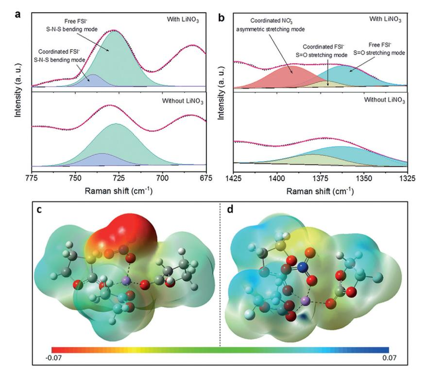
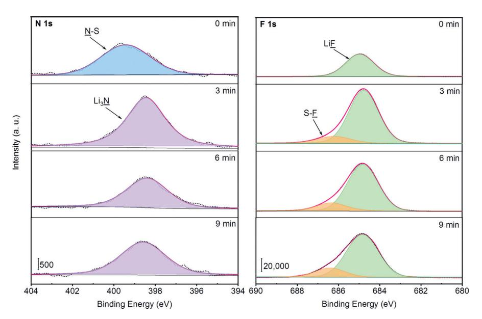
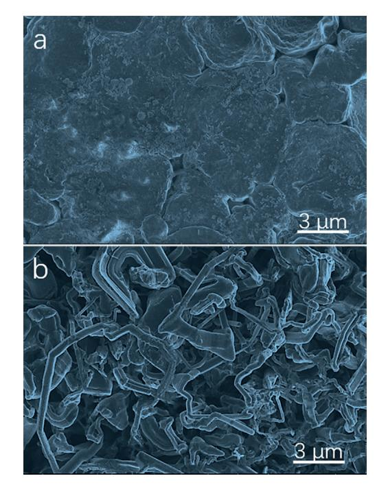
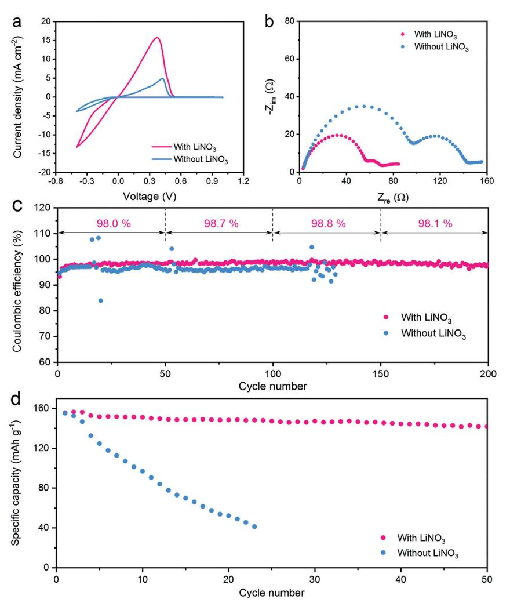

German Edition: DOI: [10.1002/ange.201914250](http://dx.doi.org/10.1002/ange.201914250) Batteries International Edition: DOI: [10.1002/anie.201914250](http://dx.doi.org/10.1002/anie.201914250)

## Enabling High-Voltage Lithium Metal Batteries by Manipulating Solvation Structure in Ester Electrolyte

Yulin Jie+ , Xiaojing Liu+ , Zhanwu Lei, Shiyang Wang, Yawei Chen, Fanyang Huang, [Ruiguo Cao,](http://orcid.org/0000-0002-3177-3917) Genqiang Zhang, and [Shuhong Jiao\\*](http://orcid.org/0000-0003-0860-4151)

Abstract: Lithium metal is an ideal electrode material for future rechargeable lithium metal batteries. However, the widespread deployment of metallic lithium anode is significantly hindered by its dendritic growth and low Coulombic efficiency, especially in ester solvents. Herein, by rationally manipulating the electrolyte solvation structure with a high donor number solvent, enhancement of the solubility of lithium nitrate in an ester-based electrolyte is successfully demonstrated, which enables high-voltage lithium metal batteries. Remarkably, the electrolyte with a high concentration of LiNO3 additive presents an excellent Coulombic efficiency up to 98.8% during stable galvanostatic lithium plating/ stripping cycles. A full-cell lithium metal battery with a lithium nickel manganese cobalt oxide cathode exhibits a stable cycling performance showing limited capacity decay. This approach provides an effective electrolyte manipulation strategy to develop high-voltage lithium metal batteries.

Electrolytes play essential roles in electrochemical energy storage systems, especially in lithium-based rechargeable batteries.[1] The electrolyte whose LUMO (lowest unoccupied molecular orbital) is lower than the Fermi level of anode often reacts with anode materials to form a solid–electrolyte interphase (SEI) layer, which significantly dictates overall electrochemical performance of nonaqueous lithium ion batteries (LIBs). Recently, lithium-metal batteries (LMBs) have attracted tremendous research efforts. Compared with LIBs, the anode of LMBs is Li metal, which has extremely high theoretical specific capacity (3860 mAh g-1 ) and low redox potential (-3.04 V vs. the standard hydrogen electrode). Therefore, LMBs are considered as the ultimate choice for next-generation high-energy rechargeable batteries and show potentials for powering future electric vehicles. However, the realization of LMBs is especially hampered by the development of suitable electrolytes for Li metal anode.

[\*] Y. Jie,[+] Dr. X. Liu,[+] Z. Lei, S. Wang, Y. Chen, F. Huang, Prof. R. Cao, Prof. G. Zhang, Dr. S. Jiao Hefei National Laboratory for Physical Science at the Microscale CAS Key Laboratory of Materials for Energy Conversion University of Science and Technology of China Hefei 230026 (P.R. China) E-mail: jiaosh@ustc.edu.cn Dr. X. Liu[+] Institute of Molecular Sciences and Engineering Shandong University, Qingdao 266237 (P.R. China) [ +] These authors contributed equally to this work.

Supporting information and the ORCID identification number(s) for the author(s) of this article can be found under: [https://doi.org/10.1002/anie.201914250.](https://doi.org/10.1002/anie.201914250)

Angew. Chem. Int. Ed. 2020, 59, 3505 –3510 -

In nonaqueous electrolytes, the dendritic growth and low Coulombic efficiency (CE) of Li metal anode pose uncompromising concerns for the widespread adoption of its practical deployment.[2]

To develop suitable electrolytes for stabilizing Li metal anode, tremendous efforts have been devoted.[3] It has been confirmed that highly concentrated electrolytes can enable stable cycling of Li metal anode because of its unique solvation structure and the lack of free solvent molecules.[3a, 4] Raman spectroscopy indicates that unlike diluted electrolyte in which most of anions are dissociated, in highly concentrated electrolyte, many anions are coordinated with Li+ ions, which decompose at the anode side to form a robust SEI layer.[5] However, the high cost and wetting issues derived from high concentration greatly limit their future practical applications. Notably, most of stable electrolytes for Li metal anode are based on ether-type solvents, which suffer from poor oxidative stability (less than 4.0 V versus Li/Li+) and a highly volatile nature.[6] Unlike ether-type solvents, organic ester solvents have good oxidative stability up to 4.5 V vs. Li/ Li+, which can be used for high-voltage cathode materials such as LiCoO2 and LiNi1/3Mn1/3Co1/3O2 (NMC333). However, there are few successful examples for ester-based electrolyte that could offer high CEs and stable cycling of Li metal anode. Commonly, in ester-based electrolytes, severe Li dendrite growth occurs and accordingly results in low CE (typically lower than 90%) and short cycling life of Li metal anode.[7] Therefore, it is significantly challenging to develop ester-based electrolytes for Li metal anode.

Lithium nitrate (LiNO3) is a magic electrolyte additive for Li metal batteries, which can drastically change the growth behaviors and improve the cycling stability of Li metal anode.[7] Generally, most previous reports of LiNO3 as an additive in ether-based electrolytes because of its reasonable solubility in ether solvents. For example, LiNO3 is indispensable for stabilizing Li metal anode in lithium sulfur batteries which use 1,2-dimethoxyethane (DME) and 1,3-dioxolane (DOL) as mixture solvents. However, there are few examples reported that use LiNO3 as an additive for the Li metal anode in ester-based electrolytes. The reason is that the solubility of LiNO3 is very low in most of carbonate ester solvents for LIBs. The only successful approach so far is to introduce copper fluoride (CuF) as a solubilizer to improve the solubility of LiNO3 in an ethylene carbonate/diethyl carbonate electrolyte mixture in which a high CE for Li metal anode was achieved up to 98.1%.[8] It should be noted that the introduction of CuF poses a concern of Cu deposition on Li metal anode and separators that may cause a short circuit in the cell.[9] Apart from the direct dissolution of LiNO3, other

## **Communications**

Angewandte of Edition Chemie

strategies have been attempted to extend the utilization of  $LiNO3$  from ether-based electrolytes to ester-based electrolytes by attaching solid LiNO3 on the electrode surface and separators.[10] However, the interface between solid LiNO3 and Li metal anode is still limited by the poor solubility of LiNO3 in carbonate ester solvents. Therefore, it is highly desirable to improve the solubility of  $LiNO3$  in ester solvent systems for developing high-voltage LMBs.

Herein, taking advantage of the high Gutmann donor number solvent with good oxidative stability, we have realized the utilization of LiNO3 in ester-based electrolyte for high voltage lithium metal batteries. In this context,  $\gamma$ -butyrolactone (GBL) is used to achieve high solubility of  $LiNO2$ in ester electrolyte and manipulates the solvation sheath of Li ions ( $Li^+$ ) as well. Raman spectra reveals that the presence of nitrate anion  $(NO_3^-)$  induces the change of the solvation structure of the electrolyte by forming contact ion pairs (CIPs) with Li ions. It is demonstrated that  $NO_3^-$  can be reduced on the Li metal anode establishing a Li+-conducting SEI layer. As a result, the electrochemical kinetics of Li metal anode has been significantly improved and a high CE is achieved up to  $98.8\%$ . More importantly, the ester electrolyte with  $LiNO_3$ 

enables stable cycling of high-voltage LMBs with NMC as cathode material.

To evaluate the solvating power of GBL for  $LiNO_3$ dissolution, a mixture of LiNO3 and lithium hexafluorophosphate ( $\text{LiPF}_6$ ) was dissolved in a variety of ester-based solvents, including propylene carbonate (PC), fluoroethylene carbonate (FEC), dimethyl carbonate (DMC), and GBL. The concentration of  $LiPF_6$  was fixed at 0.5 m in all of the electrolytes. As shown in the Supporting Information, Figure S1, it is clearly seen that large amount of  $LiNO3$  is precipitated out in the solvents of PC, FEC, and DMC when the concentration of  $LiNO3$  is increased up to 0.1m. In sharp contrast, no precipitation is observed in the solvent of GBL even when the concentration of LiNO3 is increased up to  $0.5$  M, suggesting that it has much larger solvating power for  $LiNO3$  dissolution. The solvating power of various ester solvents is believed to be related to their Gutmann donor number (Supporting Information, Figure S2). The carbonate esters have relatively lower donor number in comparison with GBL. For example, PC has a donor number of about 15.0 kcalmol $-1$ ,[11] while GBL has a donor number of 18.0 kcal $mol^{-1}$  and the nitrate anion has a donor number of 21.1 kcal mol-1.[12] Notably, DME has a higher donor number of 20.0 kcal mol $-1$ , which is usually used for dissolving LiNO3 in the electrolytes for Li–S batteries.[11a,13]

We chose lithium bis(fluorosulfonyl)imide (LiFSI) and LiNO3 to prepare a dual-salt electrolyte in a mixed solvent of

Figure 1. a),b) Raman spectra of 1 M LiFSI + 0.3 M LiNO3/FEC-GBL (1:2 v/v) (the electrolyte with  $LiNO_3$ ) and 1 M LiFSI/FEC-GBL (1:2 v/v) (the electrolyte without  $LiNO_3$ ) electrolytes. c),d) Electrostatic potential mapping based on the electron density of c) GBL and LiNO3 and d) FEC and LiNO3. O red, Li purple, C gray, H white, N blue, F green. The left end (red color) of the scale bar below the mapping reflects lower and the right end (blue color) higher coulomb potential.

FEC/GBL (1:2  $v/v$ ). Raman spectra are used to study the solvation structure of the electrolytes:  $1M$  LiFSI + 0.3M  $LiNO3/FEC-GBL$  (with  $LiNO3$ ) and 1m LiFSI/FEC-GBL (without  $LiNO_3$ ). As shown in Figure 1 a,b, ionic interaction is reflected by Raman spectra in the two electrolytes. The peaks centered at about  $730 \text{ cm}^{-1}$  and about  $1370 \text{ cm}^{-1}$  originated from FSI- anions, suggesting that most of LiFSI salt is dissociated by solvent molecules to form solvent separated ion pair (SSIP).[4a, 14] The peaks at 1390 cm $-1$  can be attributed to coordinated  $NO_3^-$ , indicating that  $NO_3^-$  anions form contact ion pair (CIP) in the electrolyte.[15] DFT calculation is performed to further investigate the interaction between LiNO3 and GBL or LiNO3 and FEC. It reveals that one LiNO3 molecule could be coordinated by the three GBL molecules or the three FEC molecules with the maximum complexation energy (Supporting Information, Figure S3) and the GBL has much larger complexation energy than FEC, which indicates that the coordination between GBL and  $LiNO3$  is more stable. Furthermore, the electrostatic potential mapping based on the electron density obviously illustrates the remarkable negative charge localization on NO3- owing to the larger electrostatic potential difference between  $NO_3^$ and  $Li^+$  coordinated with GBL (Figure 1c,d). Moreover, the highest occupied molecular orbital is mostly localized in the  $NO_3^-$  moiety with energy level of  $-6.05$  eV in GBL and  $-7.02$  eV in FEC, respectively (Supporting Information, Figure S4). This strongly indicates that there are more

active electron states on the  $NO_3$ - moiety in GBL than in FEC. Furthermore, the Mulliken charge distribution on  $NO_3^-$  moiety are  $-0.659$  (GBL) and  $-0.575$  (FEC), respectively. All of these results imply that  $NO_3^-$  behaves more like a dissociated state in GBL than in FEC, which is in good agreement with the higher solubility of  $LiNO_3$ in GBL than FEC by experimental observation. The  $NO_3^-$  anions in the solvation sheath may significantly influence the SEI layer formation and lithium plating behaviors during the lithium deposition process. The reductive potentials of different components in the electrolyte vary from 1.7 V vs.  $Li/Li^+$  for  $LiNO_3$  to  $1.0 \text{ V}$  vs. Li/Li+ for FEC are shown in the Supporting Information, Figure S5.[16–19] Since LiNO3 has the highest reductive potential, it could be reduced first in the electrolyte to form a SEI layer containing  $Li_3N$ 

Angewandte

Figure 2. XPS depth profiling results of N 1s and F 1s spectra for SEI layers formed in the electrolyte with LiNO3. The samples are copper working electrodes after 10 galvanostatic cycles at stripping state in Li || Cu coin cells. The current density is 0.5 mA cm-2, and the plating capacity for each cycle is  $1 \text{ mAh cm}^{-2}$ .

component which is favorable for Li ionic conductivity. To confirm this hypothesis, cyclic voltammetry (CV) measurements were carried out for the electrolytes with and without LiNO3. As shown in the Supporting Information, Figure S6, the electrolyte with  $LiNO3$  presents a broad peak at about 1.7 V vs. Li/Li $+$  which is related to the reduction of LiNO3. It also shows two small peaks at about  $1.1 \text{ V}$  and about  $0.7 \text{ V}$  vs. Li/Li+ which relate to the reduction of LiFSI, FEC or GBL and the underpotential deposition of lithium metal (Li UPD).[20] In sharp contrast, the electrolyte without  $LiNO_3$ shows much stronger peaks at about  $1.1 \text{ V}$  and about  $0.5 \text{ V}$  vs.  $Li/Li+$ , indicating a severe decomposition of electrolyte components and Li UPD.

To understand the decomposition mechanism, X-ray photoelectron spectroscopy (XPS) was used to analyze the SEI layer components. XPS depth profiling were done using Ar ion sputtering. The XPS depth profiling results for Li metal anode cycled in the electrolytes with and without  $LiNO3$  are shown in Figure 2 and the Supporting Information, Figures S7, S8. For the surface of the SEI layer formed in the electrolyte with LiNO3, large fraction of N species at about 399.5 eV and small fraction of N species at about 398.8 eV are observed, which should be assigned to N-S species and  $Li_3N$ , respectively. After sputtering for 3 min, the peaks for  $N-S$ species disappear and the peak for Li2N increase significantly. indicating that the inner part of the SEI layer mainly contains Li3N. Li3N is considered as an fast lithium ionic conductor, which can facilitate fast lithium ion transport through the SEI layer.[21] On the other hand, very weak peak for  $Li_3N$  is observed in the SEI layer for the electrolyte without LiNO3 additive. Furthermore, the intensity of LiF in the SEI layer for the electrolyte with LiNO3 additive is slightly higher than that without LiNO3 additive. The presence of more LiF may also help to facilitate the Li ions transport and suppress the

dendrite growth of Li metal anode.[22] Furthermore, atomic fraction of carbon in the SEI layer derived from the electrolyte without LiNO3 shows higher value than that from the electrolyte with LiNO3 (Supporting Information, Figure S9). Since the carbon source is originated from the reduction of ester solvents, it indicates that the decomposition of ester solvents occurs to a larger extent when the electrolyte is

Figure 3. Li plating morphology on copper working electrodes in the a) electrolyte with  $LiNO_3$  and b) the electrolyte without  $LiNO_3$ . The current density is 0.1 mA cm $-2$  and the plating capacity is 1 mAh cm $-2$ .

*Angewandte* Communications *Chemie*

absent from LiNO3. In the electrolyte with LiNO3, the side-reaction between ester solvent molecules and Li metal anode can be significantly mitigated by the passivation layer formed by reduction of LiNO3 additive. It is consistent with the aforementioned CV scan results. The composition and mechanical properties of SEI layer greatly regulates the growth behavior and morphology of Li metal anode.

The morphology of Li deposits in different electrolytes were evaluated in coin-type Li k Cu cells. The morphological changes of Li metal anode on copper substrates electrochemically deposited in the electrolytes with and without LiNO3 are shown in Figure 3 a,b and the Supporting Information, Figure S10. The plating current density is 0.1 mA cm-2 . After the initial nucleation stage at about 0.015 mAh cm-2 , the morphology of Li deposits tend to form granular aggregates in the electrolyte with LiNO3 additive. In contrast, severe dendritic structure grows in the electrolyte without LiNO3 additive (Supporting Information, Figure S10). When the plating capacity is increased to 1 mAh cm-2 , pressed nodular morphology without visible dendrite formation is obtained in the electrolyte with LiNO3 additive (Figure 3 a). At higher current densities (0.5, 1, and 2 mA cm-2 ), the Li deposition still maintained a dendritefree growth behavior (Supporting Information, Figure S11). Notably, the grain size decreased along with the increase of current density owing to more nucleation sites at high current densities. On the other hand, at 0.1 mA cm-2 , extensive dendritic structures of Li deposits are observed in the electrolyte without

LiNO3 additive (Figure 3 b). It is recently reported that a large granular size and minimum tortuosity could minimized the unreacted metallic Li (dead lithium) and significantly improve the CE and cycling stability of Li metal anode.[23]

To understand the electrochemical kinetics of the lithium metal anode, cyclic voltammetry (CV) and electrochemical impedance spectroscopy (EIS) were performed in the electrolytes of 1m LiFSI + 0.3m LiNO3/FEC-GBL and 1m LiFSI/ FEC-GBL, respectively. The CV curves show much higher plating/stripping current in the electrolyte with LiNO3 than that without LiNO3 (Figure 4 a), and a three-fold exchange current density has been achieved in the former electrolyte (Supporting Information, Table S1), indicating a better electrochemical kinetics for Li plating/stripping processes when LiNO3 is contained in the electrolyte. Meanwhile, in a Li k Li symmetric cell, Nyquist plots of EIS show much higher SEI resistance and charge transfer resistance in the electrolyte

Figure 4. a) CV scanning of the electrolytes with and without LiNO3 between 1 and -0.4 V at a scan rate of 5 mVs-1 . b) Nyquist plots of electrochemical impedance spectra for Li k Li symmetric cells after 6 hours rest. c) CE values of galvanostatic lithium plating/stripping processes using electrolytes with and without LiNO3 in Li kCu coin cells at the current density of 0.5 mA cm-2 and the plating capacity of 1 mAh cm-2 . d) Capacity retention of galvanostatic cycling using electrolytes with and without LiNO3 in Li kNMC 111 full cells cycled at a current density of 0.5 mA cm-2 .

without LiNO3 than that in the electrolyte with LiNO3 (Figure 4 b; Supporting Information, Figures S12, S13, Table S2), which implies the same trend in electrochemical kinetics again.

The cycling performances of Li metal anode were evaluated in the electrolytes with and without LiNO3 additive. Two parameters are essentially important for a practical electrolyte: low concentration (typically < 2m) and high CE (> 98%; Supporting Information, Figure S14). A low concentration can meet the requirements for high rate and low cost of LMBs. High CE dictates the cycling life of LMBs. However, very few examples of ester electrolytes have been previously reported to satisfy these two requirements at the same time (Supporting Information, Table S3). The CE of 1m LiFSI–0.3m LiNO3/FEC-GBL was measured in Li k Cu cells at a current density of 0.5 mA cm-2 and a plating capacity of 1 mAh cm-2 . The Li k Cu cell with the electrolyte containing LiNO3 additive achieves remarkably cycling stability over 200 cycles and very high CE up to 98.8% (Figure 4 c). By contrast, the cell without LiNO3 demonstrates only 120 cycles and lower CE. More importantly, the cycling stability of the cell without LiNO3 shows large fluctuation of CE after only 20 cycles, indicating that severe Li dendrites grow and extensive dead lithium forms in the cell. By comparison, the electrolytes of 1m LiFSI in GBL and 1m LiNO3 in GBL were also tested. Both the electrolytes exhibit very low CE and short cycle life, suggesting that the synergetic effect between LiNO3 and LiFSI is necessary to the electrolyte (Supporting Information, Figure S15). Furthermore, the voltage–capacity profiles of galvanostatic cycling for Li k Cu coin cells show the LiNO3 containing electrolyte exhibits much lower overpotentials for plating/stripping processes than the electrolyte without LiNO3 (Supporting Information, Figure S16). Furthermore, Li k Li symmetric cells with the LiNO3-containing electrolyte exhibits a stable cycling over 800 h with a gradual increase of overpotential, while the electrolyte without LiNO3 only survives less than 350 h (Supporting Information, Figure S17).

To verify the stability of electrolytes in high-voltage LMBs, a Li k NMC 111 cell was used to evaluate the electrolyte with or without LiNO3. The areal capacity of NMC cathode is about 2.8 mAh cm-2 , which is close to the requirements for practical LMBs. Under the condition of high capacity cycling, even more severe growth of lithium dendrite and more rapid increase of cell polarization will cause failure of lithium metal batteries in a short time. Therefore, an electrolyte compatible with both lithium-metal anode and high-voltage cathode becomes vital. As shown in Figure 4 d, the Li k NMC 111 cell with the electrolyte of 1m LiFSI–0.3m LiNO3/FEC-GBL exhibits very stable capacity retention upon cycling. After 50 cycles, the capacity decay is less than 7%. The cycling performance of Li k NMC 622 cell with the electrolyte of 1m LiFSI-0.3m LiNO3/FEC-GBL were also evaluated (Supporting Information, Figure S18). NMC622 can provide a discharge specific capacity of about 165 mAh g-1 and capacity retention of about 80% after 100 cycles. In sharp contrast, the cell with the electrolyte of 1m LiFSI/FEC-GBL shows drastic capacity degradation upon cycling. The cell fails to reach 30 cycles, the cycle life of which is very unsatisfactory for LMBs. With LiNO3, the electrolyte exhibits superior compatibility with NMC cathode even cycled at a high capacity, which is promising for practical high-voltage LMBs.

In summary, high-voltage lithium-metal batteries have been realized by using a high donor-number solvent and lithium nitrate. Taking advantage of large solvating power of GBL, the solubility of LiNO3 is significantly enhanced. The dissolved nitrate anions can modulate the solvation sheath of Li ions and consequently regulate the composition and structure of SEI layer on Li metal anode. As a result, a high Columbic efficiency of 98.8% for galvanostatic lithium plating/stripping processes is achieved, indicating that the electrolyte is a state-of-the-art electrolyte based on ester solvents. More importantly, a high-voltage lithium-metal battery with NMC cathode exhibits very stable cycling and attains about 93% capacity retention after 50 cycles. This work provides an effective approach and many meaningful insights for developing future high-voltage lithium-metal batteries.

## Acknowledgements

This work was supported by the National Key Research and Development Program of China (Grant No. 2017YFA0206700, 2017YFA0402802), the National Natural Science Foundation of China (Grant No. 21776265, 51902304), and Anhui Provincial Natural Science Foundation (Grant No. 1908085ME122).

## Conflict of interest

The authors declare no conflict of interest.

Keywords: electrode materials · high voltage · lithium metal batteries · lithium solvate sheath

How to cite: Angew. Chem. Int. Ed. 2020, 59, 3505 – 3510 Angew. Chem. 2020, 132, 3533 – 3538

- [1] a) K. Xu, Chem. Rev. 2004, 104[, 4303 4418](https://doi.org/10.1021/cr030203g); b) K. Xu, [Chem.](https://doi.org/10.1021/cr500003w) Rev. 2014, 114[, 11503 – 11618](https://doi.org/10.1021/cr500003w).
- [2] a) P. Albertus, S. Babinec, S. Litzelman, A. Newman, [Nat.](https://doi.org/10.1038/s41560-017-0047-2) Energy 2018, 3[, 16 – 21;](https://doi.org/10.1038/s41560-017-0047-2) b) B. Liu, J.-G. Zhang, W. Xu, [Joule](https://doi.org/10.1016/j.joule.2018.03.008) 2018, 2[, 833 – 845](https://doi.org/10.1016/j.joule.2018.03.008); c) M. Winter, B. Barnett, K. Xu, [Chem. Rev.](https://doi.org/10.1021/acs.chemrev.8b00422) 2018, 118[, 11433 – 11456](https://doi.org/10.1021/acs.chemrev.8b00422); d) R. Cao, W. Xu, D. Lv, J. Xiao, J. G. Zhang, [Adv. Energy Mater.](https://doi.org/10.1002/aenm.201402273) 2015, 5, 1402273; e) W. Xu, J. Wang, F. Ding, X. Chen, E. Nasybulin, Y. Zhang, J.-G. Zhang, [Energy Environ.](https://doi.org/10.1039/C3EE40795K) Sci. 2014, 7[, 513 – 537](https://doi.org/10.1039/C3EE40795K); f) D. Lin, Y. Liu, Y. Cui, [Nat. Nanotechnol.](https://doi.org/10.1038/nnano.2017.16) [2017](https://doi.org/10.1038/nnano.2017.16), 12, 194; g) J. W. Choi, D. Aurbach, Nat. Rev. Mater. 2016, 1, 16013.
- [3] a) J. Qian, W. A. Henderson, W. Xu, P. Bhattacharya, M. Engelhard, O. Borodin, J.-G. Zhang, Nat. Commun. 2015, 6, 6362; b) S. Chen, J. Zheng, L. Yu, X. Ren, M. H. Engelhard, C. Niu, H. Lee, W. Xu, J. Xiao, J. Liu, Joule 2018, 2[, 1548 – 1558](https://doi.org/10.1016/j.joule.2018.05.002); c) X. Ren, L. Zou, X. Cao, M. H. Engelhard, W. Liu, S. D. Burton, H. Lee, C. Niu, B. E. Matthews, Z. Zhu, C. Wang, B. W. Arey, J. Xiao, J. Liu, J. G. Zhang, W. Xu, Joule 2019, 3[, 1662 –](https://doi.org/10.1016/j.joule.2019.05.006) [1676](https://doi.org/10.1016/j.joule.2019.05.006); d) S. Chen, J. Zheng, D. Mei, K. S. Han, M. H. Engelhard, W. Zhao, W. Xu, J. Liu, J. G. Zhang, [Adv. Mater.](https://doi.org/10.1002/adma.201706102) 2018, 30, [1706102](https://doi.org/10.1002/adma.201706102).
- [4] a) X. Fan, L. Chen, X. Ji, T. Deng, S. Hou, J. Chen, J. Zheng, F. Wang, J. Jiang, K. Xu, C. Wang, Chem 2018, 4[, 174 – 185](https://doi.org/10.1016/j.chempr.2017.10.017); b) S. Jiao, X. Ren, R. Cao, M. H. Engelhard, Y. Liu, D. Hu, D. Mei, J. Zheng, W. Zhao, Q. Li, N. Liu, B. D. Adams, C. Ma, J. Liu, J.-G. Zhang, W. Xu, [Nat. Energy](https://doi.org/10.1038/s41560-018-0199-8) 2018, 3, 739 – 746.
- [5] a) D. W. McOwen, D. M. Seo, O. Borodin, J. Vatamanu, P. D. Boyle, W. A. Henderson, [Energy Environ. Sci.](https://doi.org/10.1039/C3EE42351D) 2014, 7, 416 – 426; b) K. Sodeyama, Y. Yamada, K. Aikawa, A. Yamada, Y. Tateyama, [J. Phys. Chem. C](https://doi.org/10.1021/jp501178n) 2014, 118, 14091 – 14097.
- [6] W. Li, H. Yao, K. Yan, G. Zheng, Z. Liang, Y. M. Chiang, Y. Cui, Nat. Commun. 2015, 6, 7436.
- [7] C. Niu, H. Lee, S. Chen, Q. Li, J. Du, W. Xu, J.-G. Zhang, M. S. Whittingham, J. Xiao, J. Liu, [Nat. Energy](https://doi.org/10.1038/s41560-019-0390-6) 2019, 4, 551 – 559.
- [8] C. Yan, Y. X. Yao, X. Chen, X. B. Cheng, X. Q. Zhang, J. Q. Huang, Q. Zhang, [Angew. Chem. Int. Ed.](https://doi.org/10.1002/anie.201807034) 2018, 57, 14055 – [14059](https://doi.org/10.1002/anie.201807034); Angew. Chem. 2018, 130[, 14251 – 14255.](https://doi.org/10.1002/ange.201807034)
- [9] P. Arora, R. E. White, M. Doyle, [J. Electrochem. Soc.](https://doi.org/10.1149/1.1838857) 1998, 145, [3647 – 3667.](https://doi.org/10.1149/1.1838857)

- [10] a) Y. Liu, D. Lin, Y. Li, G. Chen, A. Pei, O. Nix, Y. Li, Y. Cui, Nat. Commun. 2018, 9, 3656; b) Q. Shi, Y. Zhong, M. Wu, H. Wang, H. Wang, [Proc. Natl. Acad. Sci. USA](https://doi.org/10.1073/pnas.1803634115) 2018, 115, 5676 – [5680.](https://doi.org/10.1073/pnas.1803634115)
- [11] a) G. Gritzner, [J. Mol. Liq.](https://doi.org/10.1016/S0167-7322(97)00090-1) 1997, 73, 487 500; b) V. Gutmann, [Coord. Chem. Rev.](https://doi.org/10.1016/S0010-8545(00)82045-7) 1976, 18, 225 – 255; c) V. Gutmann, [Electro](https://doi.org/10.1016/0013-4686(76)85034-7)[chim. Acta](https://doi.org/10.1016/0013-4686(76)85034-7) 1976, 21, 661 – 670.
- [12] W. Linert, R. F. Jameson, A. Taha, [Dalton Trans.](https://doi.org/10.1039/DT9930003181) 1993, 3181 [3186.](https://doi.org/10.1039/DT9930003181)
- [13] M. Cuisinier, C. Hart, M. Balasubramanian, A. Garsuch, L. F. Nazar, [Adv. Energy Mater.](https://doi.org/10.1002/aenm.201401801) 2015, 5, 1401801.
- [14] L. Li, S. Zhou, H. Han, H. Li, J. Nie, M. Armand, Z. Zhou, X. Huang, [J. Electrochem. Soc.](https://doi.org/10.1149/1.3514705) 2011, 158, A74 – A82.
- [15] a) R. Miller, R. Getty, K. Treuil, G. Leroi, [J. Chem. Phys.](https://doi.org/10.1063/1.1672185) 1969, 51[, 1385 – 1389](https://doi.org/10.1063/1.1672185); b) D. Irish, A. Davis, R. Plane, [J. Chem. Phys.](https://doi.org/10.1063/1.1671363) 1969, 50[, 2262 – 2263](https://doi.org/10.1063/1.1671363); c) D. Gardiner, R. Hester, W. Grossman, [J.](https://doi.org/10.1063/1.1679789) [Chem. Phys.](https://doi.org/10.1063/1.1679789) 1973, 59, 175 – 184.
- [16] S. S. Zhang, [J. Power Sources](https://doi.org/10.1016/j.jpowsour.2016.05.009) 2016, 322, 99 105.
- [17] a) G. G. Eshetu, S. Grugeon, G. Gachot, D. Mathiron, M. Armand, S. Laruelle, [Electrochim. Acta](https://doi.org/10.1016/j.electacta.2013.03.171) 2013, 102, 133 – 141; b) M. Wang, L. Huai, G. Hu, S. Yang, F. Ren, S. Wang, Z. Zhang, Z. Chen, Z. Peng, C. Shen, D. Wang, [J. Phys. Chem. C](https://doi.org/10.1021/acs.jpcc.8b02314) 2018, 122, [9825 – 9834](https://doi.org/10.1021/acs.jpcc.8b02314).

- [18] X. Fan, L. Chen, O. Borodin, X. Ji, J. Chen, S. Hou, T. Deng, J. Zheng, C. Yang, S.-C. Liou, K. Amine, K. Xu, C. Wang, [Nat.](https://doi.org/10.1038/s41565-018-0183-2) [Nanotechnol.](https://doi.org/10.1038/s41565-018-0183-2) 2018, 13, 715.
- [19] S.-c. Kinoshita, M. Kotato, Y. Sakata, M. Ue, Y. Watanabe, H. Morimoto, S.-i. Tobishima, [J. Power Sources](https://doi.org/10.1016/j.jpowsour.2008.05.035) 2008, 183, 755 – 760.
- [20] D. Aurbach, Y. Talyosef, B. Markovsky, E. Markevich, E. Zinigrad, L. Asraf, J. S. Gnanaraj, H.-J. Kim, [Electrochim. Acta](https://doi.org/10.1016/j.electacta.2004.01.090) 2004, 50[, 247 – 254](https://doi.org/10.1016/j.electacta.2004.01.090).
- [21] U. v. Alpen, A. Rabenau, G. Talat, [Appl. Phys. Lett.](https://doi.org/10.1063/1.89283) 1977, 30, [621 – 623.](https://doi.org/10.1063/1.89283)
- [22] L. Yu, S. Chen, H. Lee, L. Zhang, M. H. Engelhard, Q. Li, S. Jiao, J. Liu, W. Xu, J.-G. Zhang, [ACS Energy Lett.](https://doi.org/10.1021/acsenergylett.8b00935) 2018, 3, 2059 – 2067.
- [23] C. Fang, J. Li, M. Zhang, Y. Zhang, F. Yang, J. Z. Lee, M. Lee, J. Alvarado, M. A. Schroeder, Y. Yang, B. Lu, N. Williams, M. Ceja, L. Yang, M. Cai, J. Gu, K. Xu, X. Wang, Y. S. Meng, [Nature](https://doi.org/10.1038/s41586-019-1481-z) 2019, 572[, 511 – 515](https://doi.org/10.1038/s41586-019-1481-z).

Manuscript received: November 7, 2019 Revised manuscript received: December 11, 2019 Accepted manuscript online: December 26, 2019 Version of record online: January 21, 2020