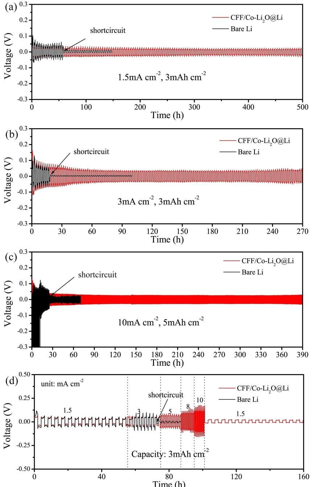
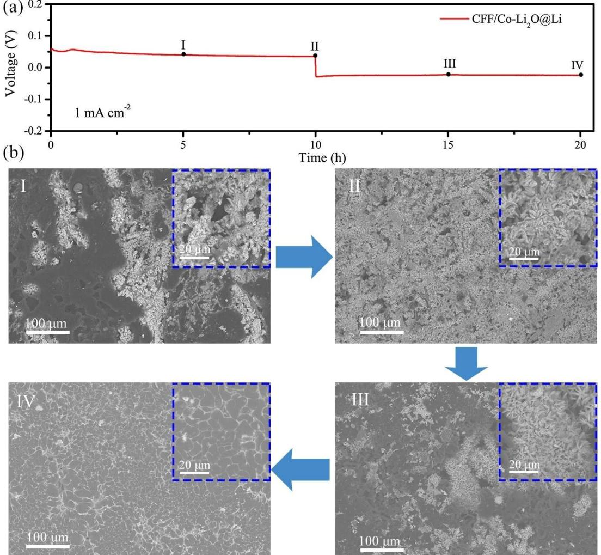
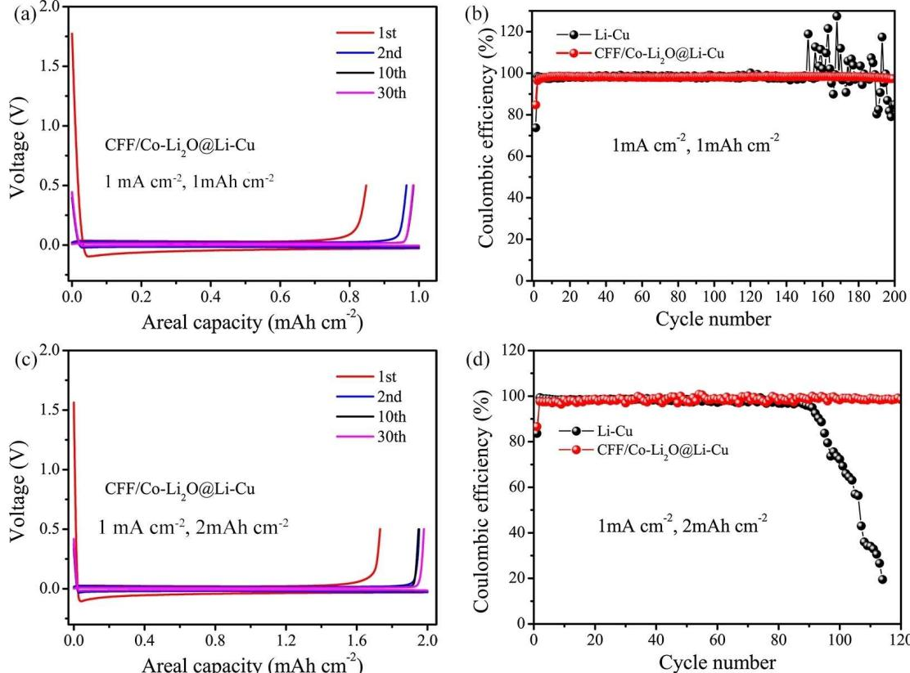
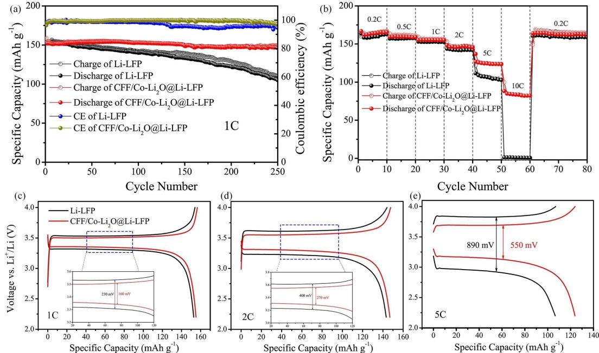
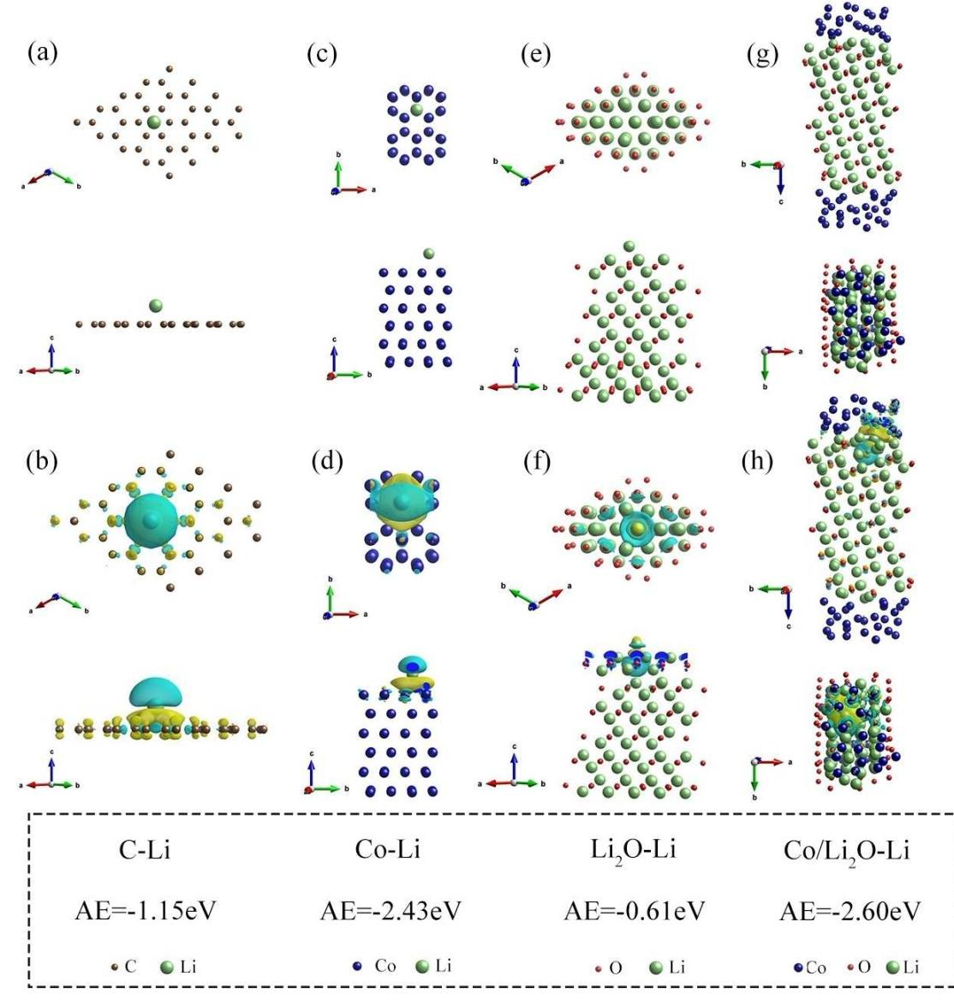

**2 3**

**5 6**

# **Constructing Co3O4 Nanowires on Carbon Fiber Film as a Lithiophilic Host for Stable Lithium Metal Anodes**

Fanfan Liu,[a] Zongzi Jin,[d, e] Zexun Hu,[a] Zhiwen Zhang,[a] Wei Liu,[d, e] and [Yan](http://orcid.org/0000-0002-3685-7773) Yu\*[a, b, c]

**Abstract:** Lithium metal has been considered as the most promising anode electrode for substantially improving the energy density of next-generation energy storage devices. However, uncontrollable lithium dendrite growth, an unstable solid electrolyte interface (SEI), and infinite volume variation severely shortens its service lifespan and causes safety hazards, thus hindering the practical application of lithium metal electrodes. Here, carbon fiber film (CFF) modified by lithiophilic Co3O4 nanowires (denoted as Co3O4 Nws) was proposed as a matrix for prestoring lithium metal through a thermal infusion method. The homogeneous needle-like Co3O4 nanowires can effectively promote molten lithium to infiltrate into the CFF skeleton. The post-formed Co Li2O nanowires produced by the reaction of Co3O4 Nws

## **Introduction**

To satisfy increased demand of electronic devices and electric vehicles (EVs), it is urgent to develop high-energy-density batteries for meeting the growing demand.[1–4] Lithium metal anode, considered as the "Holy Grail" electrode of various anode materials,[5,6] have been demonstrated as the essential anode material of high energy density batteries due to its high

| [a] F. Liu, Z. Hu, Z. Zhang, Prof. Y. Yu Hefei National Laboratory for Physical Sciences at the Microscale Department of Materials Science and Engineering University of Science and Technology of China CAS Key Laboratory of Materials for Energy Conversion Hefei, Anhui 230026 (P. R. China) E-mail: yanyumse@ustc.edu.cn |
|-------------------------------------------------------------------------------------------------------------------------------------------------------------------------------------------------------------------------------------------------------------------------------------------------------------------------------------------------|
| [b] Prof. Y. Yu                                                                                                                                                                                                                                                                                                                                 |
| State Key Laboratory of Fire Science                                                                                                                                                                                                                                                                                                            |
| University of Science and Technology of China                                                                                                                                                                                                                                                                                                   |
| Hefei, Anhui, 230026 (P. R. China)                                                                                                                                                                                                                                                                                                              |
| [c] Prof. Y. Yu                                                                                                                                                                                                                                                                                                                                 |
| Dalian National Laboratory for Clean Energy (DNL)                                                                                                                                                                                                                                                                                               |
| Chinese Academy of Sciences (CAS)                                                                                                                                                                                                                                                                                                               |
| Dalian 116023 (P. R. China)                                                                                                                                                                                                                                                                                                                     |
| [d] Z. Jin, Prof. W. Liu CAS Key Laboratory of Materials for Energy Conversion                                                                                                                                                                                                                                                               |
| Department of Materials Science and Engineering                                                                                                                                                                                                                                                                                                 |
| University of Science and Technology of China (USTC)                                                                                                                                                                                                                                                                                            |
| Hefei 230026 (P. R. China)                                                                                                                                                                                                                                                                                                                      |
| [e] Z. Jin, Prof. W. Liu                                                                                                                                                                                                                                                                                                                        |
| Key Laboratory of Materials Physics                                                                                                                                                                                                                                                                                                             |
| Institute of Solid State Physics                                                                                                                                                                                                                                                                                                                |
| Chinese Academy of Sciences                                                                                                                                                                                                                                                                                                                     |
| Hefei, 230031 (P. R. China)                                                                                                                                                                                                                                                                                                                     |
| Supporting information for this article is available on the WWW under https://doi.org/10.1002/asia.201901668                                                                                                                                                                                                                                 |
| This manuscript is part of a special collection on Interface Chemistry for Electrochemical Energy Applications. A link to the Table of Contents of the                                                                                                                                                                                       |

*special issue will appear here when the complete issue is published.*

and molten lithium can homogeneously distribute lithium ions flux and efficaciously increase the adsorption energy with lithium ions proved by density functional theory (DFT) calculation, boosting a uniform lithium deposition without dendrite growth. Therefore, the obtained composite anode (denoted as CFF/Co Li2O@Li) exhibits superior electrochemical performance with high stripping/plating capacities of 3 mAhcm 2 and 5 mAhcm 2 over long-term cycles in symmetrical batteries. Moreover, in comparison with bare lithium anode, superior Coulombic efficiencies coupled with copper collector and full battery behaviors paired with LiFePO4 cathode are achieved when CFF/Co Li2O@Li composite anode was employed.

theoretical capacity (3860 mAhg 1 ) and low reduction potential ( 3.04 V *vs.* standard hydrogen electrode (SHE)).[7–11] However, the practical applications of lithium metal anode are still impeded by many critical problems including severe lithium dendrite growth, infinite volume change of lithium foil, and unstable solid liquid interphase (SEI) film in the process of repeated charge/discharge cycles, which results in short cycle life, massive discharge capacity loss, and battery short circuit accompanied by battery failure, thermal runaway, and safety risks.[12–14]

Many approaches have been tried to regulate the undesired lithium dendritic formation, including designing various functional electrolyte additives,[15–20] creating artificial SEI films (i. e. LiF,[21–23] LiCl,[24] phosphorene,[25] Nafion/TiO2, [26] and MoS2, [27]) and use of 3D current collectors[28–30] to regulate the lithium deposition. Moreover, modifying the polypropylene separators via coating functional nanocarbon (FNC) is adopted to control the dendrite growth direction for making lithium metal anode rechargeable in the iterant charge/discharge cycles.[31] Nevertheless, due to the infinite volume change originated from the hostless lithium metal electrode, the interfacial SEI films structured by the aforementioned strategies are insufficiently stable to restrain the dendrite growth during long-term charge/ discharge cycles.[32,33] Consequently, a three-dimensional (3D) lithiophilic matrix for prestoring lithium metal, such as nickel foam-based,[28,34] copper-based,[30,35,36] graphene-based,[29,37,38] and carbon fiber cloth-based materials,[39–43] has been widely researched for suppressing the Li dendrite growth and buffering the infinite volume change. Furthermore, modifying the matrix via lithiophilic compounds including silver particles[33] and metal oxides such as ZnO,[44] SnO2, [45] and MnO2, [46] have been an effective way for infiltrating molten Li into the voids between the scaffolds, preventing lithium dendrite growth by

reducing the local areal current density and guiding a uniform lithium deposition.

In this manuscript, the carbon fiber film modified with Co3O4 Nws was reported as a lithiophilic host for improving the stability of lithium metal anode. The improved lithium metal composite was obtained by a facile thermal infusion method of infiltrating molten lithium into the CFF/Co3O4 Nws matrix. The resultant CFF/Co Li2O@Li composite anode demonstrates superior electrochemical behaviors with a high Li striping/plating capacity (3, 5 mAhcm 2 ) at various current densities in symmetrical cells. Meanwhile, the Coulombic efficiency of CFF/ Co Li2O@Li composite anode coupled with copper collector gets a great improvement over at the current density of 1 mAcm 2 with an areal capacity of 1 and 2 mAhcm 2 in comparison with bare Li anode. When assembled into a full battery coupled with LiFePO4 (LFP) cathode, CFF/Co Li2O@Li composite anode exhibits a better cyclability with a capacity retention of 94.3% over 250 cycles at the rate of 1 C (160 mAg 1 ) compared with bare Li anode. Moreover, the mechanism of uniform lithium deposition benefited from the post-formed Co Li2O nanowires is also revealed by DFT calculation, indicating the synergistic effect of Co and Li2O heterostructure for enhancing adsorption energy binding with lithium ions.

# **Results and Discussion**

The synthesis procedure of CFF/Co Li2O@Li composite anode was illustrated in Figure 1(a) in detail. First of all, Co3O4 nanowires were homogeneously grown on the surface of carbon fibers through a facile hydrothermal reaction method. Subsequently, owing to the high lithiophilicity of Co3O4, [46] the CFF/Co Li2O@Li composite anode was fabricated by infusing molten Li into the CFF/Co3O4 host at high temperature in an argon atmosphere. The corresponding optical images of CFF, CFF/Co3O4, and CFF/Co Li2O@Li composite anode are displayed in Figure S1, exhibiting a typical macro variation from pristine CFF to Li composite. As the Table S1 shows, the pristine carbon fiber film possesses an average mass of 6.27 mg with a diameter of 10 mm. After growing Co3O4 nanowires, the average mass of the electrodes increases to 9.23 mg. When molten Li completely infiltrating into the host, the average mass of CFF/Co Li2O@Li composite electrodes achieved to 19.36 mg, delivering a practical theoretical capacity of 1956 mAhg 1 (subtract the inactive Li mass of the concomitant Li2O).

The morphologies of CFF, CFF/Co3O4 Nws, and CFF/ Co Li2O@Li composite anode were characterized via scanning electron microscope (SEM). As shown in Figure 1b and inset image, the CFF are composed of interlaced carbon fibers with an average diameter of around 5 μm, offering a stable skeleton

**Figure 1.** (a) Schematic illustration of the synthesis procedures of CFF/Co Li2O@Li composite anode. SEM images of (b) CFF, (c) CFF/Co3O4 Nws, (d) CFF/ Co Li2O@Li composite, and (e) CFF/Co Li2O@Li after complete infusion. (f) TEM image of Co3O4 nanowires and (g) the corresponding high resolution image. (h) TEM of Co Li2O and (i) the corresponding high resolution image. (j) XRD pattern of CFF/Co3O4 Nws, CFF/Co Li2O@Li composite, and CFF/Co Li2O after removing Li using ethanol. (k) Scanning transmission electron microscopy (STEM) image of Co3O4 Nws and the corresponding elemental mapping of Co and O.

and adequate space for prestoring Li. As indicated in Figure 1c and inset image, the needle-like Co3O4 Nws are homogeneously grown on the surface of carbon fibers, demonstrating an increasing diameter of around 10 μm. As shown in the higher magnification image of Co3O4 Nws (Figure S2), this hierarchical Co3O4 Nws not only can change the carbon fibers from lithiophobicity to lithiophilicity, but also offer extra voids for prestoring Li between the nanowires. When molten Li infiltrating the CFF/Co3O4 Nws matrix (Figure 1d and inset image), the carbon fibers are wrapped by lithium accompanied by uniformly distributed Co Li2O nanowires, indicating the integrity of the holistic framework after Li infusion. In the meantime, the uniformly formed Co Li2O nanowires can effectively reduce the local current density, equably distribute Li ions flux, and substantially increase the adsorption energy with Li ions. Afterwards, when molten Li further infused into CFF/Co3O4 Nws matrix, the surface morphology of CFF/Co Li2O@Li composite anode are displayed in Figure 1e, demonstrating an integral flat surface with partially exposed Co Li2O nanowires (exhibited in the inset image of Figure 1 e). Moreover, as shown in Figure S3, the thickness of CFF/Co Li2O@Li composite anode increases to approximately 280 μm after infusing molten Li, corresponding to an incremental value of 57 μm derived from decorated Co3O4 nanowires and extra Li adsorbed on the surface of electrode in comparison with that of pristine carbon fiber film (around 223 μm).

The microstructure and phase transformation of Co3O4 nanowires and post-formed Co Li2O nanowires are characterized and analyzed by transmission electron microscopy (TEM) and X-ray diffraction (XRD). The needle-like structure of Co3O4 nanowires can be distinctly observed in Figure 1 f, which are constituted of Co3O4 nanoparticles with an average size of around 22 nm (see the corresponding inset image). The interplanar spacing of 0.467 nm in the nanoparticles in accordance with (111) lattice planes of Co3O4 can be evidently identified from the high-resolution TEM (HRTEM) images (Figure 1 g). To investigate the structure and phase of Co Li2O nanowires after reacting with molten Li, the Co Li2O was obtained employing ethanol to remove the extra lithium for maintaining its structural integrity. As shown in Figure 1 h and the corresponding inset image, the Co Li2O nanowires still keep the structure and particle size similar to that before Li infusion. The HRTEM image (Figure 1 i) demonstrates the lattice fringes of 0.177 nm and 0.204 nm corresponding to (200) and (111) lattice planes of elemental Co, indicating the formation of Co Li2O composite after reacting with molten Li. The XRD patterns of CFF/Co3O4, CFF/Co Li2O@Li, and CFF/ Co Li2O are shown in Figure 1 j. The major peaks of CFF/ Co3O4 observed at 19.0°, 31.3°, 36.9°, 38.5°, 44.8°, 55.7°, 59.3°, 65.2°, and 68.6° correspond to (111), (220), (311), (222), (400), (422), (511), (440), and (531) lattice planes of Co3O4 (JSPDS No.42-1467), respectively. After infusing molten Li into the CFF/Co3O4 Nws matrix, the major peaks of lithium metal and elemental Co can be detected in the CFF/Co Li2O@Li XRD pattern. When the Li was removed via the reaction of Li metal with ethanol, the major peaks at 44.2° and 51.5° belong to the elemental Co lattice planes (JSPDS No.15-0806) of (111) and (220), in accordance with the results of HRTEM in Figure 1 i. In addition, the peak of CFF/Co Li2O composite at around 25° is corresponding to the typical peak of amorphous carbon.[47] The elemental mapping results of Co3O4 nanowires are shown in Figure 1 k, delivering a uniform distribution of Co and O elements in the nanowires which is consistent with the results of HRTEM and XRD.

The electrochemical behaviors of CFF/Co Li2O@Li composite anode and bare Li foil were investigated in symmetrical batteries with high areal capacity at various areal current densities. Figures 2 a&b exhibit the voltage hysteresis-time profiles of CFF/Co Li2O@Li composite and bare Li anode symmetrical cells with a fixed stripping/plating capacity of 3 mAh cm 2 at the current densities of 1.5 mAcm 2 and 3 mAcm 2 . And the charge/discharge profiles of CFF/ Co Li2O@Li composite and bare Li anode symmetrical cells are shown in Figure S4, exhibiting a typical stripping/plating behavior. The value of voltage hysteresis represents the sum value of lithium stripping and plating overpotential which drives the Li ions to migrate to the counter electrode. As displayed in Figure 2 a&Figure S5, the CFF/Co Li2O@Li composite anode demonstrates a stable voltage profile with low polarizing voltage value of 48 mV over 500 h. However, the bare Li symmetrical cell exhibits a larger voltage hysteresis value accompanied as the appearance of short circuit phenomenon after 60 hours of stripping/plating process. When the current density increases to 3 mAcm 2 with a fixed stripping/plating capacity of 3 mAh cm 2 , the CFF/Co Li2O@Li composite anode still maintain a stable cycle profiles over 270 hours (Figure 2 b&Figure S6) with an increasing polarizing voltage value of 80 mV, whereas the short circuit phenomenon of bare Li symmetrical cell occurs earlier after 18 hours at the same cyclic condition due to the rapid growth of Li dendrites which can penetrate the separator in the cycle process. In contrast with the poor cycle performance of bare Li electrode, it can be proved that the usage of CFF/Co3O4 Nws host effectively improves the electrochemical cyclic life and suppress the dendrite formation through preventing infinite volume change, reducing the areal current density, and guiding homogeneous Li ions flux distribution. When the current density was further increased to 10 mAh cm 2 with higher stripping/plating capacity of 5 mAh cm 2 , extremely stable voltage hysteresis-time profiles with small polarizing voltage value of 55 mV over 390 hours was obtained in CFF/Co Li2O@Li composite symmetrical battery (Figure 2 c&Figure S7), indicating the composite anode promote uniform Li deposition without dendrite growth. Contrarily, bare Li symmetrical battery demonstrates a large voltage fluctuation and a short circuit phenomenon over 28 hours. Moreover, in comparison with the results of Figure 2b, it should be noted that the reduced polarizing voltage with higher current density and areal capacity is realized by the higher heat release resulted from the high current density.[48] The rate performances of CFF/Co Li2O@Li composite and bare Li anode symmetrical batteries were investigated at different current density from 1.5 to10 mAcm 2 with a fixed areal capacity of 3 mAh cm 2 . As

**Figure 2.** Galvanostatic cycle behaviors of CFF/Co Li2O@Li composite and bare Li anode at the current density of (a) 1.5 mAcm 2 and (b) 3 mAcm 2 with a stripping/plating capacity of 3 mAhcm 2 . (c) The electrochemical performance of CFF/Co Li2O@Li composite at the high current density of 10 mAcm 2 with a high stripping/plating capacity of 5 mAhcm 2 . (d) The rate behaviors of CFF/Co Li2O@Li composite and bare Li anode with a stripping/plating capacity of 3 mAhcm 2 at the current density of 1.5, 3, 5, 8, and 10 mAcm 2 .

demonstrated in Figure 2 d and Figure S8, the CFF/ Co Li2O@Li composite anode exhibits a stable voltage hysteresis profiles with incremental polarizing voltage value of 58, 82, 122, 171, and 230 mV at the current densities of 1.5, 3, 5, 8, and 10 mAcm 2 , respectively. When the current density returns to 1.5 mAcm 2 , the polarizing voltage recovers to a lower value of 30 mV, which is attributed to the stable SEI formation and uniform Li deposition. However, a larger polarizing voltage profile can be dedicated in the pristine current density conditions of bare Li electrode. In addition, the short circuit phenomenon of bare Li symmetrical cell occurs quickly after the cyclic time of 72 hours, which is caused by the serve dendrite growth in such high areal cycle capacity. For evaluating the electrochemical performance level of this manuscript, the parameters including current density, areal capacity, and cycling lifespan of

symmetric cells are compared with other reported papers,[45,46,49–53] as shown in Figure S9. It can be clearly seen that this work presents superior electrochemical behaviors, particularly in the high current density and high areal capacity.

To clearly clarify the Li ions mobility of bare Li and the CFF/ Co Li2O@Li composite anode, galvanostatic intermittent titration technique (GITT) tests were performed in symmetric cells on the condition of discharging/charging for 30 seconds and then resting for 3 minutes. As shown in Figures S10a&b, the GITT profiles of CFF/Co Li2O@Li anode symmetric cells demonstrate lower overpotential in contrast with bare Li anode at the current densities of 1 and 2 mAcm 2 with corresponding areal capacity of 1 and 2 mAhcm 2 , respectively. Accordingly, this result reveals that Li ions can migrate fast to the surface of composite electrode and deposit uniformly on the composite electrode. Moreover, electrochemical impedance spectroscopy (EIS) were conducted to analyze the interfacial impedance of bare Li and CFF/Co Li2O@Li composite anode in symmetric cells. The equivalent circuit of Li symmetric cell is displayed in inset image of Figure S11a, in which the Re, Rf , and Rct represent the impedance of electrolyte, SEI, and charge transfer ability between electrode and electrolyte, respectively. As shown in Figures S11a&b, before and after cycling, CFF/Co Li2O@Li composite electrodes both demonstrates lower impedance values of SEI and charger transfer resistance, indicating the composite anode does favor of stabling electrode SEI and enhancing the charge transfer ability between electrolyte and electrode. X-ray photoelectron spectroscopy (XPS) was employed to explore the surface chemical composition and element environments. XPS analysis results of pristine CFF/ Co Li2O@Li electrode is shown in Figure S12. The existence of O, C elements and the absence of Co element are mainly ascribed to the production of Li2CO3 due to the exposure to air in the process of transferring the electrode to XPS instrument. Figure S13 displays the XPS analysis results of the surface SEI element composition of CFF/Co Li2O@Li electrode after cycling, including the main element spectrum of C1s, N1s, O1s, F1s, and Li1s. It can be analyzed from the fine spectrum that the main components of the electrode SEI consist of LiF, Li3N, LiNxOy, RCO2Li, and Li2CO3.

In order to explore the stripping/plating morphology variation of CFF/Co Li2O@Li composite anode, stripping/ plating process with different quantity of lithium was conducted in symmetrical cells at the current density of 1 mAcm 2 . The voltage-time profile with a stripping/plating capacity of 10 mAh cm 2 of the composite anode is demonstrated in Figure 3 a, exhibiting a stable stripping and replating procedure without obvious fluctuation. The tagged notes of I, II, III, and IV in the curve represent different Li stripping/plating states, corresponding to the states of stripping 5, 10 mAh cm 2 and then re-plating 5, 10 mAh cm 2 , which are shown in Figure 3b. As displayed in **stage I** image, when 5 mAh cm 2 Li was stripped away, top lithium on the surface of the composite anode was migrated to the counter electrode preferentially and part of carbon fiber skeleton was exposed. In addition, it can be observed from the corresponding inset image that the carbon fiber modified by Co3O4 nanowires are wrapped by lithium which confirms that molten lithium successfully infused into the matrix skeleton. After 10 mAh cm 2 Li was further stripped, as shown in **stage II** image, the integral skeleton fibers of the composite anode are homogeneously exposed, indicating the structural stability of carbon fibers. Moreover, as displayed in the partial enlarged detail of **stage II** image (the inset image), the Co Li2O@Li fibers are still uniformly distributed on the surface of carbon fiber, revealing that the nanowires modification is stable and effective. Subsequently, when 5 mAh cm 2 Li was re-plated to the composite anode electrode, the electrode surface was again covered with lithium metal with partial exposed skeleton, which is exhibited in **stage III** image. Furthermore, it can be seen from the inset image that the structure of Co3O4 nanowire modifying carbon fiber can be well maintained. Finally, when all Li was re-plated (see **stage IV** image), the surface of the composite skeleton was covered by lithium island without dendrite growth due to lithium preferentially deposits on the external surface and then deposit in the internal porous layer.[54] The surface morphologies of CFF/Co Li2O@Li and bare Li after 10 cycles at 1.5 mAcm 2 with a stripping/plating capacity of 3 mAh cm 2 are compared in Figure S14. The CFF/ Co Li2O@Li electrode still maintains smooth and flat surface morphology (Figures S14a&b), indicating the skeleton containing Co Li2O nanowires is favor of uniform Li ions flux for dendrite-free growth. Whereas the bare Li electrode displays typical Li dendrite morphology (Figures S14c&d), which is ascribed to the uneven Li ions flux, leading to severe Li dendrite growth after repetitive cycles.

The Coulombic efficiencies of CFF/Co Li2O@Li composite and bare Li anode coupled with copper collector were measured to evaluate the constancy[55] of these two electrodes at the current density of 1 mAcm 2 with different capacities of 1 and 2 mAhcm 2 , respectively. The typical charge/discharge profiles of CFF/Co Li2O@Li composite anode with a stripping/ plating capacity of 1 mAhcm 2 are shown in Figure 4a, delivering an initial Coulombic efficiency value of 83.2% which is caused by the extra Li consumption of SEI film formation. As displayed in Figure 4b, CFF/Co Li2O@Li composite anode exhibits a stable Coulombic efficiency value of approximately 99.0% over 200 cycles, while the Coulombic efficiency of bare Li anode shows obvious fluctuation owing to the serve Li dendrite growth and SEI fracture. Moreover, the detailed voltagecapacity profile comparison results of bare Li and composite Li anode are shown in Figure S15, indicating that the CFF/ Co Li2O@Li composite anode can reduce the polarized voltage in Li Cu cells. When the stripping/plating capacity was further increased to 2 mAhcm 2 , the typical charge/discharge profile of CFF/Co Li2O@Li composite anode and the Coulombic efficiency comparison result are demonstrated in Figures 4c&d. The Coulombic efficiency of bare Li Cu displays a rapid decreasing trend after 82 cycles, which is due to the large volume change of bare Li and the formation of massive dead lithium without electrical contact. In contrast, the composite anode exhibits a stable Coulombic efficiency window over 120 cycles due to the

**Figure 3.** (a) The stripping/plating curve of CFF/Co Li2O@Li composite at the current density of 1 mAcm 2 with a stripping/plating capacity of 10 mAhcm 2 . (b) The surface morphologies of CFF/Co Li2O@Li composite anode at different stripping/plating states.

effects of multifunctional 3D CFF/Co3O4 host. Furthermore, for evaluating the constancy of Li metal anode in Li Cu cells, the morphologies of bare Li and composite Li anodes after cycling are characterized. As displayed in Figure S16, the bare Li anode presents numerous dendrites on the surface while CFF/ Co Li2O@Li composite anode still maintains smooth and plat Li surface morphology without dendrite formation.

In order to evaluate the potential application of CFF/ Co Li2O@Li composite anode in lithium metal batteries, full batteries paired with LiFePO4 (LFP) cathode were assembled for investigating the electrochemical performance, which are denoted as CFF/Co Li2O@Li LFP. What's more, bare Li full batteries coupled with LFP cathode were also assembled for comparison (denoted as Li LFP). The cyclic performances of CFF/Co Li2O@Li LFP and Li LFP at the current density of 1 C (160 mAg 1 ) are displayed in Figure 5a. The CFF/ Co Li2O@Li LFP presents an initial charge capacity of 158 mAhg 1 with an initial Coulombic efficiency of around 96.3%. And after 250 cycles, CFF/Co Li2O@Li LFP still maintains a charge capacity of 149 mAhg 1 , equivalent to a capacity retention ratio of 94.3%. In contrast, the Li LFP demonstrates a rapid capacity loss trend with a lower capacity retention ratio of 69.8% over 250 cycles, indicating the more Li consumption and dead Li production during the charge/discharge process. Additionally, the Coulombic efficiency of composite anode can be maintained at around 99.5% over all cycles, whereas that of bare Li anode decreases to 95.6% after 100cycles due to the unstable SEI cracked. The rate behaviors of CFF/Co Li2O@Li LFP and Li LFP are demonstrated in Figure 5b. It can be observed from the profiles that higher charge/discharge capacity of CFF/ Co Li2O@Li LFP battery can be retained especially at high rates (5 C and 10 C) in contrast with that of Li LFP battery. The CFF/ Co Li2O@Li LFP delivers a charge capacity of 165 mAhg 1 , 160 mAhg 1 , 156 mAhg 1 ,148 mAhg 1 , 125 mAhg 1 , and 83 mAhg 1 at 0.2 C, 0.5 C, 1 C, 2 C, 5 C, and 10 C, respectively. However, the Li LFP presents a lower charge capacity of 105 mAhg 1 at the rate of 5 C. As the current density increases to 10 C, the charge/discharge capacity of Li LFP almost decreases to almost zero, implying the continuous Li consumption and production of dead lithium that result in severe

**Figure 4.** The stripping/plating curves of CFF/Co Li2O@Li composite (a) coupled with Cu collector and the Coulombic efficiency comparison results (b) at the current density of 1 mAcm 2 with a capacity of 1 mAhcm 2 . The stripping/plating curves of CFF/Co Li2O@Li composite (c) coupled with Cu collector and the Coulombic efficiency comparison results (d) at the current density of 1 mAcm 2 with a capacity of 2 mAhcm 2 .

**Figure 5.** The cycling performance at the rate of 1 C (a) and the rate capability of CFF/Co Li2O@Li composite and bare Li anode paired with LFP cathode. The charge/discharge curves and polarizing voltage comparison of CFF/Co Li2O@Li LFP and Li LFP at the rate of 1 C (c), 2 C (d), and 5 C (e).

polarization at high rates. Furthermore, the charge/discharge profiles of CFF/Co Li2O@Li LFP and Li LFP at various current densities are also investigated for comparing the voltage hysteresis and cycle stability. As shown in Figure 5c and the inset image, a lower polarizing voltage value (160 mV) of CFF/ Co Li2O@Li LFP can be observed at the rate of 1 C than that of Li LFP (230 mV), corresponding to a polarizing voltage difference of 70 mV. Moreover, as presented in Figures 5d&e, the polarizing voltage difference of these two electrodes increases to 130 mV and 340 mV with the rate increasing to 2 C and 5 C, respectively, suggesting CFF/Co Li2O@Li composite anode possesses lower overpotential and better cycle stability during the Li stripping/plating process owing to the superior functions of 3D CFF/Co Li2O skeleton.

For verifying the effective operation of post-formed Co Li2O nanowires, density functional theory (DFT) calculations were employed to compare the binding energy of C (graphene), Co, Li2O, and Co Li2O slab with a lithium atom. The corresponding computational models and charge density difference are demonstrated in Figure 6. And the 3D crystal models are displayed in Figure S17. As shown in Figures 6a&b, the carbon fiber exhibits a binding energy of 1.15 eV with a homogeneous charge distribution on the surface of carbon atoms, which is in accordance with the reported result,[33] indicating the stable carbon fiber skeleton can reduce charge and ions accumulation but is not enough lithiophilic. As displayed in Figures 6c–h, the Co Li2O heterostructure slab exhibits a much higher binding energy of 2.60 eV than that of Co (-2.43 eV) and Li2O (-0.61 eV), indicating synergistic enhancement of the post-formed Co elemental and Li2O. Combining with the welldistributed Co Li2O nanowires on the surface of carbon fiber, the Co Li2O nanowires can guide homogeneous lithium ions

**Figure 6.** The computational model adsorbing a lithium atom and the corresponding charge density difference of C (a, b), Co (c, d), Li2O (e, f), and Co Li2O (g, h).

**Full Paper**

flux distribution and tightly adsorb lithium ions for dendritefree lithium deposition. For iconically exhibiting the effects of the composite anode, sketch diagrams of CFF@Co Li2O/Li and bare Li anode variation during Li stripping/plating process are presented in Figure S18. As shown in Figure S18a about bare Li anode, Li dendrites are easily grown on the surface of Li metal during the stripping/plating process due to the uneven Li deposition. However, with regard to CFF/Co Li2O@Li composite anode (Figure S18b), lithium can be uniformly stripped and deposited on the electrode combing the superiorities of reduced Li ions flux originated from nanowires/carbon structure and enhanced Co/Li2O adsorption energy.

### **Conclusion**

In summary, carbon fiber film modified by lithiophilic Co3O4 nanowires is designed to be a matrix for prestoring lithium metal via a facile thermal infusion method. By combining the three-dimensional carbon fiber skeleton and post-formed Co Li2O nanowires, the as-obtained CFF/Co Li2O@Li composite anode demonstrates synergetic functions of buffering Li volume expansion, reducing local current density and inducing uniform Li deposition. Therefore, the CFF/Co Li2O@Li composite anode exhibits better electrochemical performance including lower polarizing voltage value in symmetrical cells, better Coulombic efficiency stability coupled with copper collector, and superior cycle/rate capability in LFP full cells compared to routine bare Li anode. This work offers an effective design scheme of Liprestoring host combining the stable carbon fiber skeleton and metal oxides with unique morphology, meanwhile confirming the enhanced adsorption energy of post-formed Co Li2O nanowires in the composite anode for suppressing lithium dendrite growth via DFT calculation.

## *Acknowledgements*

*F.Liu and Z.Jin contributed equally to this work. This work was supported by the National Key R&D Research Program of China (No. 2018YFB0905400), the National Natural Science Foundation of China (Nos. 51872277, 51925207, U1910210, and 21605136), the Fundamental Research Funds for the Central Universities (WK2060140026), Dalian National Laboratory For Clean Energy (DNL) Cooperation Fund, CAS (DNL180310).*

**Keywords:** lithium metal anodes **·** carbon fiber films **·** composite anodes **·** energy storage devices **·** nanowires

- [1] B. Dunn, H. Kamath, J.-M. Tarascon, *Science* **2011**, *334*, 928–935.
- [2] S. Chu, A. Majumdar, *Nature* **2012**, *488*, 294.
- [3] M. Armand, J.-M. Tarascon, *Nature* **2008**, *451*, 652.
- [4] P. G. Bruce, S. A. Freunberger, L. J. Hardwick, J.-M. Tarascon, *Nat. Mater.* **2012**, *11*, 19.
- [5] W. Xu, J. Wang, F. Ding, X. Chen, E. Nasybulin, Y. Zhang, J.-G. Zhang, *Energy Environ. Sci.* **2014**, *7*, 513–537.
- [6] X.-B. Cheng, R. Zhang, C.-Z. Zhao, Q. Zhang, *Chem. Rev.* **2017**, *117*, 10403–10473.
- [7] D. Lin, Y. Liu, Y. Cui, *Nat. Nanotechnol.* **2017**, *12*, 194.
- [8] Y. Guo, H. Li, T. Zhai, *Adv. Mater.* **2017**, *29*, 1700007.
- [9] B. Liu, J.-G. Zhang, W. Xu, *Joule* **2018**.
- [10] J. Qian, W. A. Henderson, W. Xu, P. Bhattacharya, M. Engelhard, O. Borodin, J.-G. Zhang, *Nat. Commun.* **2015**, *6*, 6362.
- [11] D. Chen, H. Tan, X. Rui, Q. Zhang, Y. Feng, H. Geng, C. Li, S. Huang, Y. Yu, *InfoMat* **2019**.
- [12] D. Wang, W. Zhang, W. Zheng, X. Cui, T. Rojo, Q. Zhang, *Adv. Sci.* **2017**, *4*, 1600168.
- [13] X. B. Cheng, R. Zhang, C. Z. Zhao, F. Wei, J. G. Zhang, Q. Zhang, *Adv. Sci.* **2016**, *3*, 1500213.
- [14] B. Li, Y. Wang, S. Yang, *Adv. Energy Mater.* **2018**, *8*, 1702296.
- [15] C. Yan, Y. X. Yao, X. Chen, X. B. Cheng, X. Q. Zhang, J. Q. Huang, Q. Zhang, *Angew. Chem.* **2018**, *130*, 14251–14255.
- [16] X. Q. Zhang, X. B. Cheng, X. Chen, C. Yan, Q. Zhang, *Adv. Funct. Mater.* **2017**, *27*, 1605989.
- [17] X.-B. Cheng, M.-Q. Zhao, C. Chen, A. Pentecost, K. Maleski, T. Mathis, X.- Q. Zhang, Q. Zhang, J. Jiang, Y. Gogotsi, *Nat. Commun.* **2017**, *8*, 336.
- [18] F. Ding, W. Xu, G. L. Graff, J. Zhang, M. L. Sushko, X. Chen, Y. Shao, M. H. Engelhard, Z. Nie, J. Xiao, *J. Am. Chem. Soc.* **2013**, *135*, 4450–4456.
- [19] J. Z. Hu, Z. Zhao, M. Y. Hu, J. Feng, X. Deng, X. Chen, W. Xu, J. Liu, J.-G. Zhang, *J. Power Sources* **2016**, *304*, 51–59.
- [20] Z. Huang, J. Ren, W. Zhang, M. Xie, Y. Li, D. Sun, Y. Shen, Y. Huang, *Adv. Mater.* **2018**, *30*, 1803270.
- [21] J. Zhao, L. Liao, F. Shi, T. Lei, G. Chen, A. Pei, J. Sun, K. Yan, G. Zhou, J. Xie, *J. Am. Chem. Soc.* **2017**, *139*, 11550–11558.
- [22] X. Q. Zhang, X. Chen, R. Xu, X. B. Cheng, H. J. Peng, R. Zhang, J. Q. Huang, Q. Zhang, *Angew. Chem. Int. Ed.* **2017**, *56*, 14207–14211.
- [23] C. Yan, X. B. Cheng, Y. X. Yao, X. Shen, B. Q. Li, W. J. Li, R. Zhang, J. Q. Huang, H. Li, Q. Zhang, *Adv. Mater.* **2018**, *30*, 1804461.
- [24] X. Liang, Q. Pang, I. R. Kochetkov, M. S. Sempere, H. Huang, X. Sun, L. F. Nazar, *Nat. Energy* **2017**, *2*.
- [25] Y. Kim, D. Koo, S. Ha, S. C. Jung, T. Yim, H. Kim, S. K. Oh, D.-M. Kim, A. Choi, Y. Kang, *ACS Nano* **2018**, *12*, 4419–4430.
- [26] S. Jiang, Y. Lu, Y. Lu, M. Han, H. Li, Z. Tao, Z. Niu, J. Chen, *Chem. –Asian J.* **2018**, 13, 1379–1385.
- [27] E. Cha, M. D. Patel, J. Park, J. Hwang, V. Prasad, K. Cho, W. Choi, *Nat. Nanotechnol.* **2018**, *13*, 337.
- [28] S.-S. Chi, Y. Liu, W.-L. Song, L.-Z. Fan, Q. Zhang, *Adv. Funct. Mater.* **2017**, *27*.
- [29] G. Huang, J. Han, F. Zhang, Z. Wang, H. Kashani, K. Watanabe, M. Chen, *Adv. Mater.* **2019**, *31*, 1805334.
- [30] Q. Li, S. Zhu, Y. Lu, *Adv. Funct. Mater.* **2017**, *27*.
- [31] Y. Liu, Q. Liu, L. Xin, Y. Liu, F. Yang, E. A. Stach, J. Xie, *Nat. Energy* **2017**, *2*, 17083.
- [32] D. Lin, Y. Liu, Z. Liang, H.-W. Lee, J. Sun, H. Wang, K. Yan, J. Xie, Y. Cui, *Nat. Nanotechnol.* **2016**, *11*, 626.
- [33] R. Zhang, X. Chen, X. Shen, X.-Q. Zhang, X.-R. Chen, X.-B. Cheng, C. Yan, C.-Z. Zhao, Q. Zhang, *Joule* **2018**, *2*, 764–777.
- [34] X.-Y. Yue, W.-W. Wang, Q.-C. Wang, J.-K. Meng, Z.-Q. Zhang, X.-J. Wu, X.- Q. Yang, Y.-N. Zhou, *Energy Storage Mater.* **2018**, *14*, 335–344.
- [35] S. Wu, Z. Zhang, M. Lan, S. Yang, J. Cheng, J. Cai, J. Shen, Y. Zhu, K. Zhang, W. Zhang, *Adv. Mater.* **2018**, *30*.
- [36] K. R. Adair, M. Iqbal, C. Wang, Y. Zhao, M. N. Banis, R. Li, L. Zhang, R. Yang, S. Lu, X. Sun, *Nano Energy* **2018**, *54*, 375–382.
- [37] J. Zhao, G. Zhou, K. Yan, J. Xie, Y. Li, L. Liao, Y. Jin, K. Liu, P.-C. Hsu, J. Wang, *Nat. Nanotechnol.* **2017**, *12*, 993.
- [38] A. M. Hafez, Y. Jiao, J. Shi, Y. Ma, D. Cao, Y. Liu, H. Zhu, *Adv. Mater.* **2018**, *30*, 1802156.
- [39] S. Liu, X. Xia, Z. Yao, J. Wu, L. Zhang, S. Deng, C. Zhou, S. Shen, X. Wang, J. Tu, *Small Methods* **2018**.
- [40] S. Li, Q. Liu, J. Zhou, T. Pan, L. Gao, W. Zhang, L. Fan, Y. Lu, *Adv. Funct. Mater.* **2019**, 1808847.
- [41] Q. Wang, C. Yang, J. Yang, K. Wu, L. Qi, H. Tang, Z. Zhang, W. Liu, H. Zhou, *Energy Storage Mater.* **2018**, *15*, 249–256.
- [42] G. Hou, X. Ren, X. Ma, L. Zhang, W. Zhai, Q. Ai, X. Xu, L. Zhang, P. Si, J. Feng, *J. Power Sources* **2018**, *386*, 77–84.
- [43] X. Shen, X. Cheng, P. Shi, J. Huang, X. Zhang, C. Yan, T. Li, Q. Zhang, *J. Energy Chem.* **2019**, *37*, 29–34.
- [44] Y. Liu, D. Lin, Z. Liang, J. Zhao, K. Yan, Y. Cui, *Nat. Commun.* **2016**, *7*, 10992.
- [45] Y. Zhang, C. Wang, G. Pastel, Y. Kuang, H. Xie, Y. Li, B. Liu, W. Luo, C. Chen, L. Hu, *Adv. Energy Mater.* **2018**, *8*, 1800635.

- [46] B. Yu, T. Tao, S. Mateti, S. Lu, Y. Chen, *Adv. Funct. Mater.* **2018**, *28*, 1803023.
- [47] C. Kim, K. S. Yang, M. Kojima, K. Yoshida, Y. J. Kim, Y. A. Kim, M. Endo, *Adv. Funct. Mater.* **2006**, *16*, 2393–2397.
- [48] L. Li, S. Basu, Y. Wang, Z. Chen, P. Hundekar, B. Wang, J. Shi, Y. Shi, S. Narayanan, N. Koratkar, *Science* **2018**, *359*, 1513–1516.
- [49] C. Yang, Y. Yao, S. He, H. Xie, E. Hitz, L. Hu, *Adv. Mater.* **2017**, *29*, 1702714.
- [50] X. Zhang, R. Lv, A. Wang, W. Guo, X. Liu, J. Luo, *Angew. Chem. Int. Ed.* **2018**, *57*, 15028–15033.
- [51] S. Liu, X. Xia, Z. Yao, J. Wu, L. Zhang, S. Deng, C. Zhou, S. Shen, X. Wang, J. Tu, *Small Methods* **2018**, *2*, 1800035.
- [52] L. Wang, X. Zhu, Y. Guan, J. Zhang, F. Ai, W. Zhang, Y. Xiang, S. Vijayan, G. Li, Y. Huang, *Energy Storage Mater.* **2018**, *11*, 191–196.
- [53] S. Wu, Z. Zhang, M. Lan, S. Yang, J. Cheng, J. Cai, J. Shen, Y. Zhu, K. Zhang, W. Zhang, *Adv. Mater.* **2018**, *30*, 1705830.
- [54] H. Lee, J. Song, Y.-J. Kim, J.-K. Park, H.-T. Kim, *Sci. Rep.* **2016**, *6*, 30830. [55] B. D. Adams, J. Zheng, X. Ren, W. Xu, J.-G. Zhang, *Adv. Energy Mater.* **2018**, *8*.

Manuscript received: December 4, 2019 Revised manuscript received: January 9, 2020 Accepted manuscript online: February 3, 2020 Version of record online: February 24, 2020