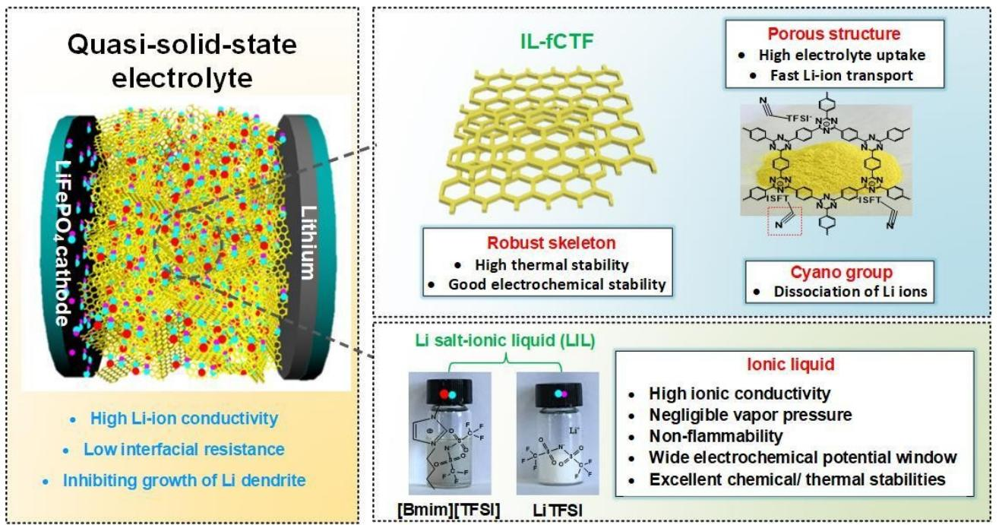
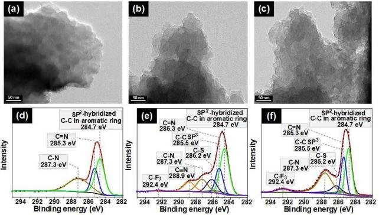
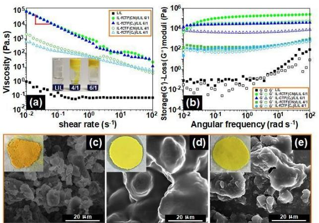
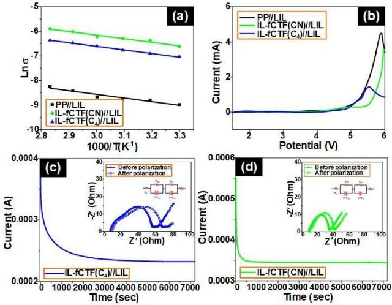
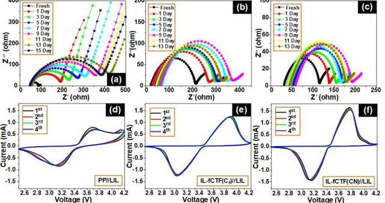
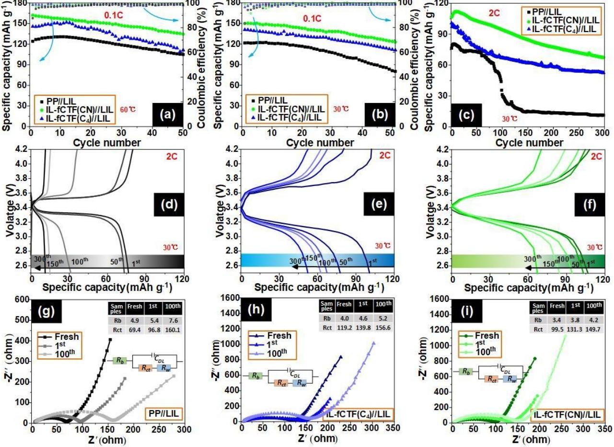
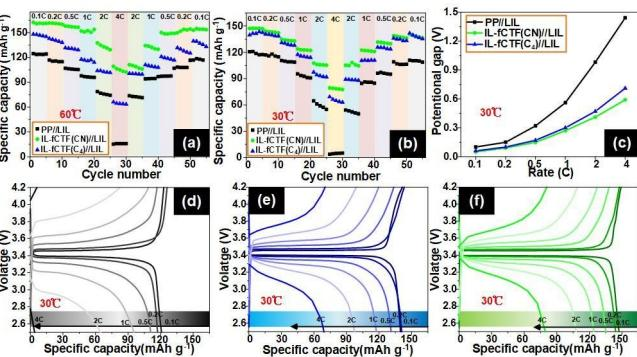
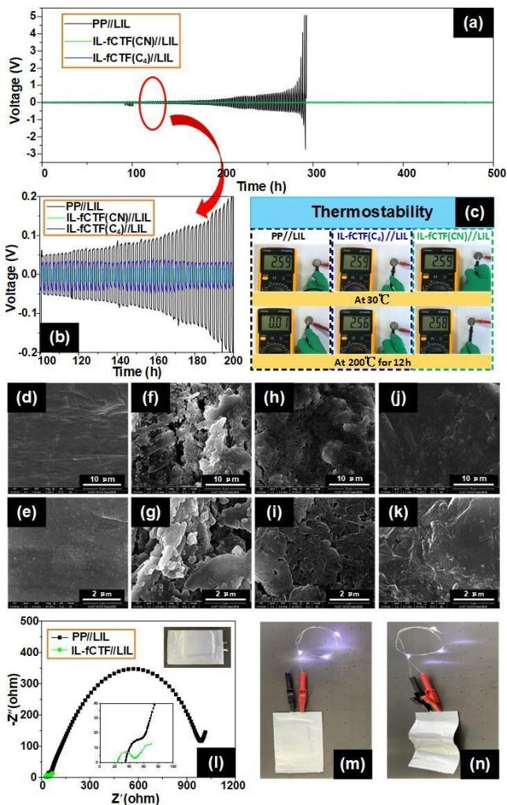

**2 3**

#### **1** *Very Important Paper*

# **Functional Covalent Triazine Frameworks-Based Quasi-Solid-State Electrolyte Used to Enhance Lithium Metal Battery Safety**

Qing Xuan Shi,[a] Xin Guan,[a] Hui Jie Pei,[a] Chen Chang,[a] Hao Qu,[a] Xiao Lin Xie,[a] and Yun [Sheng](http://orcid.org/0000-0002-2351-1845) Ye\*[a]

The development and use of lithium metal batteries (LMBs) has been hampered by uneven Li deposition and dendrite formation during repeated cycling. Here, a new class of quasisolid-state electrolytes (QSSE) consisting of ionic liquid functional covalent triazine-based frameworks (IL-fCTF) and a Li saltionic liquid (LIL), formed by simple mechanical mixing, is shown to overcome these problems. The IL-fCTF based QSSE exhibits high strength stability, due to its robust CTF skeleton that suppresses unwanted Li dendrite formation. Moreover, LIL absorbed in the ordered porous structures of the CTF skeleton

### **1. Introduction**

With the reduction of available fossil resources and the rapid expansion of the electronics market, the demand for clean energy lithium batteries is increasing rapidly.[1] Lithium metal batteries (LMBs) are attractive candidates for next-generation electrochemical energy storage systems, due to their ultra-high theoretical capacity (3860 mAhg 1 ), low negative electrochemical potential ( 3.04 V *vs.* a standard hydrogen electrode) and abundant Li (sourced from the Li metal anode).[2] However, their practical application is hindered by safety issues, due to uneven Li deposition and dendrite formation during repeated charging/discharging, potentially resulting in short circuits or even explosions, as well as low battery performance.[3]

Constructing a stable solid electrolyte interface (SEI) during Li plating/stripping is an effective strategy for inhibiting dendrite growth and thus achieving superior battery performance.[4] Many attempts have been made to modify the SEI layer, such as: (i) employing new electrolyte systems to create a robust SEI protecting layer on the Li metal anode,[5] (ii) introducing functional additives, including halogenated salts,[6] hydrogen fluoride (HF),[7] toluene,[8] or lithium nitrate (LiNO3),[9] (iii) creating an *ex-situ* formed protective layer (or artificial SEI),[10] (iv) designing optimized electrodes including Li microforms three-dimensional (3D) continues ion transport channels, beneficial for Li-ion conduction and ensuring even Li deposition. The QSSE used in LMBs shows a high room-temperature ionic conductivity (1.33 mScm 1 at 30°C), due to its excellent electrolyte uptake, ultra-high Li-ion transfer number (0.648), improved electrochemical/cycling stability and good rate capacity. The easily fabricated QSSE-based battery's excellent performance makes it a promising candidate for practical application in LMBs.

sphere anodes,[11] coated Li microsphere electrodes,[12] and using surface-modified Li foil.[13] These strategies form stable and effective SEIs able to inhibit unwanted Li dendrite formation, thereby leading to better battery performance and a reduction in the size of Li deposits.[4] However, the thermodynamic instability of Li metal in liquid electrolytes, assembly conditions, shelving times before use and large dead volumes also adversely affects the LMBs cycling performance.[4,14]

All-solid electrolytes, *e.g.* solid polymer electrolytes (SPEs) and inorganic solid electrolytes (ISEs), have received widespread attention thanks to their high mechanical strength that inhibits unwanted Li dendrite growth, leading to enhanced safety and cycling stability.[15] SPEs overcome the safety problem of liquid electrolytes (such as leakage, inflammability and inconvenient processing), by using polyether polymers (*e.g.* polyethylene oxide, PEO) electrolytes.[16] However, in these materials the Li-ions mobility is strongly limited by the low movement ability of the polymer chain segment as well as the crystalline phase, resulting in a relatively low ionic conductivity (*<*10 5 S cm 1 ).[17] The introduction of nano-sized inorganic fillers, such as SiO2, [18] Al2O3, [17b] ZrO2, [19] TiO2 [20] and Co3O4, [21] results in enhanced polymer electrolyte ionic conductivity by the construction of effective pathways for Li-ion transport as well as improving ion mobility and salt dissociation. But Li dendrites continue to grow at grain boundaries as well as in voids inside the polymer electrolyte.[22] More seriously, the poor interface impedance between all-solid electrolytes and electrodes further reduces battery performance. Benefit from high mechanical strength by solid electrolyte as well as high conductance and good interface stability by liquid electrolyte, gel electrolytes (GEs) can be regarded as a good option for inhibiting Li dendrite formation and resulting in a good LMBs performance.[23] However, GEs are usually prepared by photo-[24]

[a] *Dr. Q. X. Shi, X. Guan, H. J. Pei, C. Chang, H. Qu, Prof. X. L. Xie, Y. S. Ye School of Chemistry and Chemical Engineering Huazhong University of Science and Technology Wuhan 430074, China E-mail: ysye@hust.edu.cn*

Supporting information for this article is available on the WWW under <https://doi.org/10.1002/batt.202000069>

*An invited contribution to a Special Collection on Lithium Metal Anode Processing and Interface Engineering*

and thermal-polymerization,[25] which are complex and energyconsuming processes. GEs have an inherent disadvantage in that unreacted small molecules, including residual monomers and initiators, are highly reactive with Li metal.[26] Additionally, GEs are electrochemically unstable owing to their polymer skeleton disintegrating under high voltage.[27]

Recently, a new class of quasi-solid-state electrolyte (QSSE) has attracted attention due to its relatively high liquid electrolyte uptake and its robust skeleton that promote fast Li-ion transport and effective inhibition of Li dendrite growth, respectively. For example, a QSSE consisting of an Li salt-ionic liquid (LIL) as the electrolyte and a mesoporous silica material (MCM-41) as the skeleton was reported by Singh *et al.*, which showed excellent Li dendrite growth resistance (no fluctuations occurring in a Li symmetric cell during 100 cycles at 0.1 mAcm 2 ) owing to the high strength of the inorganic skeleton.[28] Dai *et al.* have made solid-like electrolytes with high room-temperature ion conductivity (2.5 mS cm 1 ) by taking advantage of the unique nanoarchitecture of hollow silica spheres with confined liquid electrolytes.[29] They also showed an interesting class of polymerized ionic networks (PIN) containing LIL, where the resulting QSSE exhibits high ionic conductivity (up to 5.32 mS cm 1 at 22°C), due to the PIN's high charge density providing abundant, weakly coordinating sites during Li-ion movement *via* electrostatic interaction.[30] Based on these experimental results, we can conclude that a welldesigned QSSE should have the following features: (i) the solid skeleton should possess good electrolyte compatibility and high capacity for electrolyte uptake; (ii) the solid skeleton should exhibit high thermal and electrochemical stability; (iii) the structure of the solid skeleton would be desirable if it can interact with the liquid electrolyte or Li salts for the further improvement in Li-ion conduction.

The covalent triazine-based framework (CTF) forms the basis of a class of structurally controllable porous organic polymeric materials with ordered porous structures, large specific surface areas and excellent thermal/chemical stabilities.[31] CTF are considered to be promising skeletons for the preparation of high-performance QSSE. Moreover, their *π*conjugated structures, bearing lithiophilic triazine nitrogen atoms, facilitate the dissociation of Li salts and promote Li-ion transport.[32] Nevertheless, CTF has poor compatibility with organic and inorganic material making adequate mixing challenging for uniform electrolyte preparation. Hence, how to effectively mingle the CTF with liquid electrolyte becomes extremely critical.

Here, for the first time, we show the use of a CTF-based skeleton to confine the plentiful liquid electrolyte of LIL, which not only ensures high Li-ion conductivity and low interfacial resistance but also effectively inhibits the growth of Li dendrites in LMBs (Scheme 1). ILs were selected as the liquid electrolyte, due to their superior properties, such as high ionic conductivity, negligible vapor pressure, non-flammability, wide electrochemical potential window, and excellent chemical/ thermal stabilities.[23,33] To solve CTF's inherent incompatibility with organic electrolytes, a cyano contained IL, which has outstanding solvent compatibility with various organic electrolytes as well as IL, was used as a functionalized moiety for the CTF. Specifically, the functionalized IL bearing cyano groups interact with the anion of Li salt to improve Li-ion conduction.[25,34] We proposed a simple strategy to fabricate the IL-functionalized CTF (IL-fCTF) with high electrolyte compatibility and uptake through N-alkylation and subsequent mixing

**Scheme 1.** A schematic representation of the IL-fCTF based quasi-solid-state electrolyte along with the envisioned structure of LMBs.

with LIL to prepare a new type of QSSE. The results demonstrated that the CTF-based QSSE has a high room temperature ion conductivity (1.33 mScm 1 at 30°C), a high Liion transfer number (0.648), improved electrochemical/cycling stability, better rate capacity and near-total resistance to Li dendrite growth in LMBs.

### **2. Results and Discussion**

### **2.1. Synthesis and Characterization of IL-Functionalized CTF (IL-fCTF)**

The pristine CTF was synthesized using a low-temperature polycondensation approach as in our previous work,[35] with the subsequent introduction of the IL moiety by nucleophilic *N*alkylation of alkyl bromide. As illustrated in Figure S1, two types of IL-fCTF with and without a cyano group were prepared, and denoted as IL-fCTF(CN)(Br ) and IL-fCTF(C4)(Br ), respectively. Here, IL-fCTF, without the cyano group, was employed as a comparison to investigate the effect of cyano groups on the properties of the resulting QSSE. After removing the residual alkyl bromide by repeated washing, the obtained IL-fCTF(Br ) was stably re-dispersed in deionized water (Figure S2a, c). Finally, the material was subject to anion exchange with bis (trifluoromethane) sulfonimide Li salt (LiTFSI) to tune their solubility from hydrophilic to hydrophobic (due to the hydrophobic of TFSI anion) [Figure S2 (b, d)] as well as to facilitate ionic conduction when used as a skeleton in QSSE [the resulting materials with TFSI anion are denoted as IL-fCTF(CN) and IL-fCTF(C4), respectively]. After ionic liquid functionality, the surface areas of CTF become much smaller (663 and 10 m2g 1 for CTF [Figure S3a] and IL-fCTF [Figure S3 (b, c)], respectively) due to the modified micro-molecules may on the boundary of the hole.[36]

The scanning electron microscope (SEM) images of pristine CTF in Figure S4 (a, b) show particle-like morphologies. After modification, the morphological structure of CTF remained stable after the functionalization of the IL molecules with and without cyano groups, as shown in Figure S4 (c, d) and Figure S4 (e, f)], respectively. The transmission electron microscopy (TEM) images in Figure 1 (a-c) show that the lamellar structure remains intact after IL functionalization. The corresponding SEM elemental mapping images show uniform oxygen and sulfur in both IL-fCTF resulting from uniformly functionalized IL molecules [Figure S4 (g, h)]. As shown in Figure 1d, by using X-ray photoelectron spectroscopy (XPS), the C 1s core-level spectrum of the pristine CTF can be resolved by curve-fitting into three peak components with binding energies of 287.3, 285.3 and 284.7 eV, these being attributable to C N, C=N and SP2 -hybridized C C in the aromatic ring, respectively. It can be seen that four new peaks corresponding to C�N (288.9 eV), C C SP3 (285.5 eV), C-F3 (292.4 eV) and C S (286.2 eV) appeared in the IL-fCTF(CN) resulting from the introduced IL containing cyano groups and TFSI anions [Figure 1e]. Similarly, the presence of two new peaks at 292.4 (C-F3) and 286.2 eV (C S) in the IL-fCTF(C4) show the functional-

**Figure 1.** TEM micrograph of: a) pristine CTF, b) IL-fCTF(CN) and c) IL-fCTF (C4); Carbon 1 s XPS profile of: d) pristine CTF, e) IL-fCTF(CN) and f) IL-fCTF (C4).

ized IL with TFSI anions [Figure 1f]. The Fourier transform infrared spectroscopy (FTIR) spectrum [Figure S5] shows the characteristic absorption bands peaks at 1523, 1367 cm 1 (triazine units) and 1356, 1196, 1141, 653, and 565 cm 1 (TFSI anions) in IL-fCTF. The solid-state cross-polarization magic angle spinning carbon-13 nuclear magnetic resonance (CP-MAS 13C-NMR), shows new peaks at around 48 and 158 ppm, which are ascribed to the alkane and CF3 groups of functionalized IL, respectively [Figure S6]. Moreover, the thermal stability of the pristine CTF was improved after IL-functionalization, as evidenced from the increase of the 5% weight loss thermal decomposition temperatures (*T*d5%) from 138.3 °C to 275.4 and 164.3°C for IL-fCTF(CN) and IL-fCTF(C4), respectively [Figure S7]. Those results demonstrate that the CTF was successfully decorated with IL molecules, and improved thermal stability was preferable for high-temperature operation.

#### **2.2. Preparation and Characterization of IL-fCTF-Based QSSE**

Good affinity between the solid skeleton and electrolyte is a key requirement for the preparation of QSSE,[37] therefore, the interaction and compatibility of synthesized IL-fCTF and IL were investigated. The as-prepared IL-fCTF was mixed with IL using a simple blending process (seeing the experimental section). Thermal gravimetric analysis (TGA) and differential scanning calorimetry (DSC) were used to investigate interactions in the resulting mixtures. Figure S8 shows the TGA curves of pure IL, IL-fCTF(CN)/IL and IL-fCTF(C4)/IL mixtures. It can be seen that the *T*d5% of pure IL is about 424.3 °C, when small amounts (~ 5 wt.%) of IL-fCTF(CN) and IL-fCTF(C4) were introduced, the *T*d5% increased to 440.4 and 434.1°C, respectively, due to interactions between IL-fCTF and cations of the IL. Such interactions are also reflected in changes in the melting point of the IL introduced with the IL-fCTF. As shown in DSC curves of Figure S9, an improved IL melting point can be observed by introducing ~5 wt.% of IL-fCTF. These results indicate that the interactions between functionalized CTF and IL are beneficial for the fabrication of IL-fCTF based QSSE.

Rheology is an effective and widely used tool to investigate the physical properties of electrolytes, including composite and gel electrolytes.[38] Static and dynamic rheology tests were carried out to study pure LIL and incorporated IL-fCTF electrolytes (IL-fCTF//LIL). Figure 2a shows the variation of viscosity (*η*) as a function of shear rate (*γ*) for all electrolytes with a constant amplitude gamma (*ϕ*=0.03). For the LIL, the viscosity is almost independent of the shear rate, indicating Newtonian fluidic behavior in the measured range of shear rate. As for IL-fCTF// LIL based electrolytes, the viscosity decreases with increases of shear rate, representing shear thinning behavior, which is possible, if and only if, the robust skeleton (IL-fCTF) forms a network structure. The fitting plot to a power-law with a slope of 1 at low shear rates (IL-fCTF:LIL=6:1, m/m) implies the existence of a network structure with yield stress.[39] The viscoelastic behavior was further performed to employ dynamic rheology measurements under a constant strain where the magnitude of the applied strain was within the linear viscoelastic region [Figure 2b].[38b] For pure LIL, the elastic moduli (*G*') is lower than the loss moduli (*G"*): both moduli values exhibit power-law dependency in the measured range of angular frequency, which is a typical rheological characteristic of a viscous fluid. In contrast, for the IL-fCTF//LIL based electrolyte, *G"* is higher than *G*' and both moduli values show frequency-independence of angular frequency, displaying solid-like stability over a wide range of time scales.[40] When the weight ratio of IL-fCTF:LIL was 6:1, the *G*' increased from 1.1× 10 4 kPa for the LIL to 169.0 and 30.4 kPa by the incorporation of IL-fCTF(CN)//LIL and IL-fCTF(C4)//LIL at 1 rads 1 , respectively. These results confirm that the IL-fCTF based electrolyte is in a quasi-solid-state. The interaction mechanism for the preparation of CTF-based QSSE can be ascribed to the robust ionic and capillary interactions between IL molecules and functional CTF (evidenced by improved thermal decomposition temperature and melting point of IL) bridging CTF skeleton together to form a quasi-state film. To optimize the stability of the electrolyte,

**Figure 2.** a) Steady-shear viscosity as a function of shear rate and b) variation of elastic (*G*') viscous (*G"*) moduli as function of frequency for pure LIL, ILfCTF(CN)//LIL and IL-fCTF(C4)//LIL QSSE; photographs and SEM of c) CTF//LIL, d) IL-fCTF(CN)//LIL and e) IL-fCTF(C4)//LIL QSSE.

the weight ratio of IL-fCTF:LIL as 6:1 was chosen for the fabrication of IL-fCTF based QSSE.

It can be seen that the resulting IL-fCTF based QSSE [Figure 2(d, e)] is denser and flatter than that of the electrolyte prepared by blending pristine CTF with pure LIL (CTF//LIL) (Figure 2c). Additionally, the corresponding SEM morphology of the QSSE reveals a smoother surface than the CTF//LIL electrolyte, indicating pure LIL is easily adhered and immobilized on the surface of IL-fCTF. These results highlight the improved compatibility between IL and CTF by IL-functionalization as mentioned above.

### **2.3. Electrochemical Properties of IL-fCTF-Based QSSE**

In this work, a commercial polypropylene (PP) separator absorbed with LIL (denoted as PP//LIL) was used as the control in a comparison of electrochemical properties and battery performance with the IL-fCTF based QSSE. Ionic conductivity (*σ*) is a critical characteristic for evaluating the IL-fCTF based QSSE as potential electrolytes for use in LMBs electrochemical applications. The temperature (30–80°C) dependence of *σ* for the PP//LIL and both QSSE, and the corresponding fitting curves are depicted in Figure 3a. It can be clearly seen that the *σ* increases with increasing temperature in all cases, due to the enhanced migration of the ions with rising temperature.[2b] Additionally, all fitting curves show linear profiles adhering to the Arrhenius equation nature. The calculated activation energy (*Ea*) of both QSSE (~1.47 eV) is similar to that of the PP//LIL (1.49 eV), however, the *σ* of the IL-fCTF based QSSE (0.89–1.72 and 1.33–2.75 ms cm 1 for IL-fCTF(C4)//LIL and IL-fCTF(CN)//LIL, respectively) is 10-fold higher than that of the PP//LIL (0.13– 0.26 mScm 1 ). We speculated that the IL-fCTF used as a skeleton in the QSSE not only provides abundant porous channels for the adsorption of the LIL electrolyte but also forms

**Figure 3.** a) Temperature dependence of ionic conductivity for PP//LIL, ILfCTF(C4)//LIL and IL-fCTF(CN)//LIL; b) LSV profile of PP//LIL, IL-fCTF(C4)//LIL and IL-fCTF(CN)//LIL; current-time curve following a DC polarization of the c) IL-fCTF(C4)//LIL and d) IL-fCTF(CN)//LIL at 60°C.

continuously interconnected pathways for ion transport. It is worth noting that the introduction of the cyano group in the skeleton of QSSE is beneficial for dissociation of the Li salt, thereby resulting in a further improvement of *σ.* Also, the rigid skeleton endows the resulting QSSE with high electrochemical stability, as evidenced by the linear sweep voltammetry (LSV) result. As shown in Figure 3b, the electrochemical stability window (ESW) of IL-fCTF(C4)//LIL was 4.9 V and increased to 5.4 V by employing IL-fCTF(CN) as the skeleton, giving values higher than that of PP//LIL (4.7 V *vs.* Li/Li+). Based on these results, we believe that QSSE fabricated with cyano contained IL-fCTF possesses high *σ* as well as high electrochemical stability, making it suitable for use in LMBs.

Low or negligible electronic conductivity in any electrolyte system is necessary for good LMBs cyclic stability. Electronic conductivity (*σele*) was measured using the direct current (DC) polarization technique with stainless steel (SS)jPP//LIL (or QSSE)j SS cells. The calculated *σele* (Figure S10) were 2.74×10 9 , 8.66×10 9 and 2.99×10 10 S cm 1 *viz.* 5, 6 and 7 orders less than their *σ* for PP//LIL, IL-fCTF(C4)//LIL and IL-fCTF(CN)//LIL, respectively, indicating that the total conductivity is mainly attributed to ionic migration with a negligible electron migration contribution. Inferior Li+ transport is the major drawback for the polymer electrolyte in LMBs since the abundant mobile anions increase ion concentration gradients and therefore cause undesirable electrode polarization, resulting in unwanted deposition of Li and consequent battery instability.[41] When compared to PP//LIL, the IL-fCTF based QSSE shows a much higher *tLi*+ (PP//LIL=0.227 in Figure S11; IL-fCTF(C4)//LIL=0.587 in Figure 3c; IL-fCTF(CN)//LIL=0.648 in Figure 3d), implying excellent Li+ dominant conduction behavior. We speculated that the porous IL-fCTF framework of QSSE effectively limits the movement of imidazolium anions thereby facilitating Li+ movement.[42] In particular, IL-fCTF(CN)//LIL has the highest *tLi*+ in all samples which can be attributed to the presence of interactions between nitrile groups and Li salts, which enhances Li+ transport in electrolytes.[43] These results beneficially reduce polarization and improve battery cycling performance when the IL-fCTF based QSSE was employed as the electrolyte in LMBs.

The interfacial stability of electrolyte towards the Li metal electrode in LMBs is a crucial factor for the battery's safety and cyclic stability. The electrochemical impedance spectra (EIS) of the LijPP//LIL (or QSSE)j Li symmetrical cell was measured at different storage times. The intersection of EIS diagram with the real axis at the high frequency assigned to electrolyte bulk resistance (*Rb*) and the depressed semicircle in the medium frequency is related to the charge transfer resistance (*Rct*).[44] As shown in Figure 4a, the *Rct* of the cell with PP//LIL increased from 41 to 364 Ω with aging until 13th day. In contrast, the ILfCTF(C4)//LIL assembled cell has a minor increase in *Rct* after 11 days (from 194 to 282 Ω) and then retains a constant value during additional storage time. It is worth noting that the ILfCTF(CN)//LIL assembled cell shows excellent interfacial stability, as evidenced by its low *Rct* of 84 and 138 Ω at the initial and aged states, respectively. The result indicates that the cyano contained QSSE have superior compatibility toward Li

**Figure 4.** Impedance spectra of: a) LijPP//LIL j Li, b) LijIL-fCTF(C4)//LIL j Li and c) LijIL-fCTF(CN)//LIL j Li as a function of the storage time at 60°C; cyclic voltammograms of the cell d) LijPP//LIL j LiFePO4, e) LijIL-fCTF(C4)//LIL j LiFe-PO4 and f) LijIL-fCTF(CN)//LIL j LiFePO4.

metal electrodes and satisfactorily stable interfaces, which is better for the protection of Li metal anode.

#### **2.4. Battery Performance of IL-fCTF-Based QSSE**

The cell with the IL-fCTF based QSSE was fabricated by simply coating the mixture of IL-fCTF and LIL on the LiFePO4 electrode and subsequently assembling with Li metal, as shown in Figure S12. The electrochemical performance of the resulting LiFePO4 jPP//LIL (or QSSE)j Li cells were first researched by cyclic voltammetry (CV) between 2.5 and 4.2 V with two electrodes, with LiFePO4 being used as a working electrode and Li metal used for the reference and counter electrode. The CV of PP//LIL and both QSSE all show redox peaks at ~3.1 and ~3.7 V corresponding to deintercalation/intercalation of Li+ into LiFePO4. An increased peak current was observed for both QSSE (Figure 4e and Figure 4f for IL-fCTF(C4)//LIL and IL-fCTF (CN)//LIL, respectively) compared to the PP//LIL [Figure 4a] due to the improved Li+ conductivity in the IL-fCTF framework structure.

Galvanostatic charge-discharge battery performances with a current rate of 0.1 C are shown in Figures 5a and 5b at 60 and 30°C, respectively. At 60°C, there is a benefit from the high Li+ conductivity and excellent interfacial stability, *i. e.* the cell with IL-fCTF(CN)//LIL possesses the highest initial discharge specific capacity of 162.1 mAhg 1 and Coulombic efficiency (CE) of 99.0%. Although both the initial discharge specific capacity (145.7 mAhg 1 ) and the CE (98.3%) of the battery is slightly decreased by using IL-fCTF(C4)//LIL, these values are still much higher than that of PP//LIL (124.2 mAhg 1 and 87.7%). Generally, IL-based polymer electrolytes suffer from limited battery performance at room temperature, due to relatively low Li+ conductivity by its inferior wettability of electrolyte.[27,45] Similarly, the PP//LIL only delivers an initial capacity of 121.6 mAhg 1 and CE of 83.4% at 30°C. However, it is worth noting that the cells with IL–CTF based QSSE show higher battery performance, especially for the IL-fCTF(CN)//LIL, which delivers an initial capacity of 150.0 mAhg 1 and CE of 98.9% at 30°C. After the 50 cycles, the IL-fCTF(CN)//LIL assembled cell

**Figure 5.** Charge-discharge capacity and CE (a-c) as a function of cycle number for LiFePO4/Li cells with PP//LIL, IL-fCTF(C4)//LIL and IL-fCTF(CN)//LIL; chargedischarge profiles (d-f) and EISs (g-i) of cells with PP//LIL, IL-fCTF(C4)//LIL and IL-fCTF(CN)//LIL with a current rate of 2 C at 30 °C.

still shows an excellent battery performance, delivering discharge specific capacities of 135.4 and 123.2 mAhg 1 at 60 and 30°C, respectively. The cycling stability of the cells was further evaluated by increasing the current rate to 0.5 and 2 C, see Figure S13 and Figure 5c. After 150 cycles at 0.5 C, the ILfCTF(CN)//LIL provides a better cycling performance for the cell when compared to the PP//LIL or other IL-based polymer electrolytes,[14] delivering discharge specific capacities of 110.3 and 107.8 mAhg 1 at 60 and 30°C, respectively. When the current rate was increased to 2 C at 60°C [Figure S14(a-d)], the cell with IL-fCTF(CN)//LIL displayed the highest discharge specific capacity *i. e.* 137.4 mAhg 1 and the lowest degradation rate of 0.12% per cycle among 300 cycles in all cells (IL-fCTF (C4)//LIL: 109.0 mAhg 1 at initial cycle, 0.15% per cycle; PP//LIL: 85.3 mAhg 1 at initial cycle, 0.26% per cycle). Importantly, at room temperatures (30°C), the cells with IL-fCTF based QSSE display a low discharge specific capacity loss after 300 cycles (48.3 and 39.5 mAhg 1 for IL-fCTF(C4)//LIL and IL-fCTF(CN)//LIL, respectively), while their charging/discharging platforms were still maintained during cycling [Figure 5(e, f)]. In contrast, the PP//LIL assembled cell displays large discharge specific capacity loss of 65.2 mAhg 1 after 300 cycles, and its charging/ discharging platforms gradually disappeared during cycling [Figure 5d]. It's worth to noticing that the cells with PP//LIL exhibit smaller polarization phenomenon than the cells with QSSE at initial time, which mainly due to the concentration polarization at high current density (2 C). By analyzing the EIS of the cycled cells and corresponding equivalent circuit of the Nyquist plots [Figure 5(g-i)], it can be seen that the *Rb* of the QSSE assembled cells is almost constant. Meanwhile, the QSSE assembled cells show a slight increase in *Rct* during cycling (*<* 20 Ω), which is much lower than that of the PP//LIL (63.3 Ω). These results indicate that the IL-fCTF based QSSE possesses good interfacial behavior and reversibility, resulting in a superior cycling performance as mentioned above.

The rate capability test was performed to examine the battery's performance under different charge-discharge current rates. The rate performance of the cells at 60°C is shown in Figure 6a. The cell with IL-fCTF(C4)//LIL shows satisfactory discharge capacities of 148.2, 143.0, 131.7, 117.8, 104.0 and 66.2 mAhg 1 at 0.1, 0.2, 0.5, 1, 2 and 4 C, respectively. Replacing IL-fCTF(C4)//LIL with IL-fCTF(CN)//LIL, results in an improved rate performance and delivers 162.5, 161.7, 158.1, 152.0, 137.6 and 109.3 mAhg 1 at 0.1, 0.2, 0.5, 1, 2 and 4 C, respectively. By contrast, the rate capability of the cell with PP//LIL was severely reduced, delivering 124.6, 117.0, 107.1, 97.9, 78.8 and

**Figure 6.** Rate capabilities of LiFePO4 j Li cells with PP//LIL, IL-fCTF(C4)//LIL and IL-fCTF(CN)//LIL at a) 60°C and b) 30 °C; the corresponding potential gap (c) and charge-discharge profile of d) PP//LIL, e) IL-fCTF(C4)//LIL and f) IL-fCTF (CN)//LIL at 30°C.

15.3 mAhg 1 at 0.1, 0.2, 0.5, 1, 2 and 4 C, respectively. These results indicate that the cells with the IL-fCTF based QSSE have excellent reversible rate capability. The charge-discharge plateaus of the cells show a dramatic degeneration in the plateau QSSE of the PP//LIL assembled cell with increases of current density [Figure S15a]. By contrast, the cells with both QSSE maintain a stable plateau with increasing current densities (even at a current density of 4 C) [Figure S15(b, c)]. Besides, the QSSE assembled cells display a smaller potential gap (ΔV) at various rates than with PP//LIL, implying a lower internal resistance and a better Li+ diffusivity ability for the ILfCTF based QSSE [Figure S15d].[46] As the temperature drops to room temperature (30°C) in Figure 6b, the QSSE assembled cells still achieved acceptable discharge capacities at the high current density of 4 C (69.3 and 79.5 mAhg 1 for IL-fCTF(C4)//LIL and IL-fCTF(CN)//LIL, respectively) – this being ascribed to its high room temperature *σ.* However, the discharge capacity of the PP//LIL assembled cell falls to a negligible capacity of 3.8 mAhg 1 at 4 C. Moreover, the corresponding chargedischarge voltage profiles [Figure 6(d-f)] and the potential gap [Figure 6c] of the cells with QSSE at various rates exhibit better capacity retention ratios and smaller polarizations. These results indicate the cells with IL-fCTF based QSSE show superior electrochemical performance, high reversibility as well as excellent cycling stability, especially for the cell with the IL-fCTF (CN)//LIL.

To evaluate the stability of IL-fCTF based QSSE with respect to Li dendrite formation, Li electrodeposition during galvanostatic charge-discharge cycling in Li symmetrical cells at a current density of 0.1 mAcm 2 in Figure 7(a, b) was examined. The over-potential of the cell with PP//LIL starts to rise quickly after 100 h cycling, while an irreversible voltage drop appeared after 280 h cycling, due to short-circuiting by uncontrolled Li dendritic growth. In comparison, the cells with the QSSE show no apparent voltage fluctuation and no sudden voltage drop during 500 h cycling, indicating a more even Li deposition that is able to inhibit unwanted Li dendrite formation. The surface morphologies of the Li-anode after 100 cycles at 1.0 C was also characterized to better examine its ability to inhibit Li dendrite formation. As shown in Figure 7(d, e), the surface of the fresh Li

**Figure 7.** a-b) Voltage-time profile of Lij Li symmetric cells with PP//LIL, ILfCTF(C4)//LIL and IL-fCTF(CN); c) open-circuit voltage of cells with PP//LIL, ILfCTF(C4)//LIL and IL-fCTF(CN)//LIL at different temperature; SEM images of the surface of Li electrodes obtained from the cells with d-e) fresh Li metal, f-g) PP//LIL, h-i) IL-fCTF(C4)//LIL and j-k) IL-fCTF(CN)//LIL after 100 cycles at 60°C with 1 C; l) impedance of pouch Cells assembled by PP//LIL and IL-fCTF (CN)//LIL based batteries; the flexible of battery in form of m) flat and n) waved shape lighting the LED lamps.

metal is smooth and compact. However, the Li-anode of the cell cycled with PP//LIL displays a rough and loose surface with many bulges and cracks, while with the QSSE has a much smoother and shiny surface [Figure 7(h, i) and Figure 7(j, k) for IL-fCTF(C4)//LIL and IL-fCTF(CN)//LIL, respectively], furtherly verifying the IL-fCTF based QSSE possesses a superior ability to suppress Li dendrite due to its the high modulus and better electrolyte/electrode interface.

The high-temperature resistance of the separator and electrolyte is critical for batteries used in high-temperature environments. As shown in Figure S16, the PP separator, saturated with LIL on a LiFePO4 cathode, starts to shrink at 90°C, becoming smaller as the temperature increases. However, the QSSE on the LiFePO4 cathode was still intact even at 210 °C. As illustrated in Figure 7c, after holding 200°C for 12 h, the open-circuit voltage of cells with the QSSE remained un-

changed (~2.6 V); however, the cell with PP//LIL shows almost no voltage, which is due to short-circuiting by PP shrinkage. Those results indicate that the IL-fCTF based QSSE has good high-temperature resistance properties. Figure S17 shows that a group of light-emitting diode (LED) lamps can be powered by the QSSE assembled cells for a period of time. To further identify the potential of QSSE for practical application, the pouch Cells were assembled in Figure 7l (insert). According to the results of EIS test in Figure 7l, the *Rct* of IL-fCTF(CN)//LIL was less than one-fortieth of PP//LIL assembled pouch Cells after cycling, which demonstrate the admirable interface between IL-fCTF(CN)//LIL and electrodes for the improved electrochemical performance. Besides, the LED lamps can still be lit up by the pouch type batteries assembled with QSSE in Figure 7(m, n) after the waving test, indicating the resulting QSSE with good flexibility and toughness.

### **3. Conclusions**

In this work, a new type of QSSE based on IL-fCTF and LIL with a good Li dendrite suppressing ability was fabricated in a facile manner using a simple mechanical mixing process. The mechanical modulus, ionic/electronic conductivity, electrochemical stability window, Li-ion transfer number and electrochemical stability of the IL-fCTF based QSSE and battery performance, thermostable performance, and resistance for Li dendrite of the QSSE assembled cell were systemically investigated. The fabricated QSSE has excellent mechanical stability derived from its robust CTF skeleton and a high ionic conductivity that originates from absorbed LIL. The ordered porous structure of the IL-fCTF skeleton decorated with cyano groups offers interconnected and continues ion channels for fast Li-ion transport as well as improved Li salt dissociation, resulting in stable Li deposition and excellent battery performance. At room temperature, the cells with IL–CTF based QSSE deliver a praiseworthy initial discharge specific capacity (150.0 mAhg 1 at 0.1 C), a superior rate performance (79.5 mAhg 1 at 4 C) and a low degradation rate of 0.12% per cycle among 300 cycles (at 2 C and 60°C). We speculate that this study will open a door to a new and effective method for using porous organic polymeric materials (including covalent organic frameworks, porous organic frameworks, hyper-crosslinked polymers) in energy storage systems.

## **Experimental Section**

### **Materials**

N-butyl bromide (�98%, Aladdin), bromoacetonitrile (*>*97%, Aladdin), poly (vinylidene difluoride) (PVDF, Aladdin), 1-butyl-3 methylimidazolium bis(trifluoro methylsulfonyl) imide ([Bmim][TFSI] noted as IL, �99% prepared according to a process previously reported in the literature (water content determined by KarlFischer titration: 100 ppm),[47] bis(trifluoromethane)sulfonimide lithium salt (LiTFSI, *>*98%, Adamas), N-methyl-2-pyrroldone (NMP, �99%, Aladdin), Li foil (1 mm thickness, Aldrich), LiFePO4 (Advanced Lithium Electrochemistry Co. Ltd., Taiwan), carbon black (CB, Ketjen black EC600JD, Azko Nobel), dimethyl sulfoxide (DMSO, �99.8%, Aladdin), methyl alcohol (MeOH, 99%, Aladdin).

### **Synthetic procedures**

*CTF*: Covalent triazine-based framework (CTF) were prepared as in our previous work (CTF-HUST-1 (noted as CTF) was chosen as a representative).[35] Briefly, CTF is synthesized by a condensation reaction between aldehyde and amidine dihydrochloride.

*Preparation of IL-fCTF(CN) and IL-fCTF(C4)*: The pristine CTF (0.1 g) was suspended in DMSO (10 ml) under ultrasonication for 30 min to obtain a uniform dispersion in a 25 mL round-bottom flask. Then bromoacetonitrile (0.478 g) [or n-butyl bromide (0.542 g)] was added. The mixture was heated at 80°C with reflux for 24 h under magnetic agitation. The resulting precipitate was washed with MeOH to remove the residual bromoacetonitrile (or n-butyl bromide). After this, the IL-fCTF(CN)(Br ) [or IL-fCTF(C4)(Br )] was redispersed in deionized water (1 mgmL 1 ), and subsequently treated with excess LiTFSI and stirred overnight. The final product with TFSI anions [IL-fCTF(CN) or IL-fCTF(C4)] was collected by filtration and dried at 60°C under vacuum for 12 h. Elemental analysis: IL-fCTF(CN): C(54.7%), N(16.0%), S(3.47%); IL-fCTF(C4): C(46.1%), N(11.7%), S(2.5%).

### **Preparation of IL-fCTF based quasi-solid-state electrolytes (QSSE) and PP based electrolyte**

The IL-fCTF(CN) [or IL-fCTF(C4)] and IL containing Li salt (LIL) [0.5 mol of LiTFSI in 1 kg of [Bmim][TFSI]] solution was mixed in 6:1 weight ratio (the electrolyte uptake is 500%) and mechanically ground in a mortar to obtain the quasi-solid-state slurry, denoted as IL-fCTF(CN)//LIL [or IL-fCTF(C4)//LIL]. The thickness of the QSSE is about 100 μm. The mass ratio of QSSE in the whole battery is about 4.22%. The IL-fCTF(CN)/IL, IL-fCTF(C4)/IL and CTF/LIL mixtures were obtained by a similar procedure.

The control group commercial polypropylene (PP) separator absorbed with LIL (denoted as PP//LIL) made by immersing PP in LIL electrolyte for 1 h until saturated, and was taken out from the LIL electrolyte solution; the excess LIL electrolyte solution was removed by wiping with filter paper (The electrolyte uptake is 95.6%). The LIL droplet can spread out on PP (instantly contact angle�83.9° in Figure S18), and optical photographs [Figure S19] show that the PP changes from white and opaque of pristine PP to transparent after absorbed LIL, indicating that the PP can be infiltrated and wetted by LIL electrolyte.

#### **Electrochemical and battery measurements**

*Ion conductivity (σ)*: The *σ* was calculated from alternating-current (AC) impedance measurements by an AUTOLAB with PP//LIL and quasi-solid-state slurry sandwiched between two stainless steel disc. The corresponding Arrhenius equation [Eq. (1)]:[15a]

$$
\sigma = \sigma_0 \exp(-E_a/KT) \tag{1}
$$

in which *Ea* is the activation energy, *σ0* is the pre-exponential factor, and *R* is the ideal gas constant.

*Electronic conductivity (σele)*: The *σele* was measured using a direct current (DC) polarization technique in which a voltage of 0.5 V was applied across the PP//LIL and QSSE between two SS electrodes

and the corresponding current was recorded as a function of time. The *σele* are calculated by Equation (2):

$$
\sigma_{ele} = (I_{SS}/\Delta V) \times (L/A)
$$
 (2)

in which *L* and *A* are the thickness and cross-sectional area of the disk-shaped PP//LIL and QSSE respectively, while *I*ss is the steadystate current respectively calculated from the curve.

*Cyclic voltammograms (CV)*: The CV was measured by spreading the quasi-solid-state slurry between LiFePO4 cathode (LiFe-PO4 :CB:PVDF=8:1:1 m/m/m, the active material's loading is around 1.5~2 mgcm 2 ) and Li mental packed in a CR2032 type coin battery in the voltage range of 2.5–4.2 V at 60°C and a scan rate of 0.5 mVs 1 .

*Linear sweep voltammetry (LSV)*: LSV was done by inserting the QSSE between a stainless steel disc and lithium mental packed in a CR2032 type coin battery at 60°C.

*Li-ion transfer number (tLi*+*)*: The *tLi*+ was calculated by using a direct current (DC) polarization technique in which a voltage of 0.05 V was applied across the pellet placed between two Li-metal electrodes and the corresponding current was recorded as a function of time. The *tLi*+ are calculated by following Equation (3):[48]

$$
t_{Li} + = I_s \left( \Delta V - I_0 R_0 \right) / I_0 (\Delta V - I_s R_s)
$$
\n(3)

in which *I*0 and *I*S are the initial and steady-state currents respectively, *R*0 and Rs are interfacial resistance measured by EIS before and after polarization respectively, Δ*V* is the applied polarization voltage.

*Battery measurements*: All battery performances were measured by spreading the quasi-solid-state slurry between LiFePO4 cathode and Li metal packed in a CR2032 type coin battery in an oven at 30 and 60°C.

### **Characterization**

The samples were characterized by scanning electron microscopy (SEM) and energy-dispersive X-ray spectroscopy (EDX) elemental mapping (FEI Nova NanoSEM450), X-ray photoelectron spectroscopy (XPS, ESCA 2000 using a monochromatized Al Kα anode), elemental analyses (EA, Vario Micro cube analyser), thermogravimetric analysis (TGA, Q50) from 30 to 800 °C at a heating rate of 10°C min 1 under N2 atmosphere, Differential scanning calorimetry (DSC, Q2000) from 60 to 0°C at a rate of 10°C min 1 , Fourier transform infrared spectroscopy (FTIR, Nicolet Avatar 320 FTIR spectrometer). Viscosity measurements were taken in parallel plates [diameter 25 mm (CP50 and space 1 mm)] under oscillatory shear on a MCR302 (Anton Paar P-PTD200). Surface area, N2 adsorption isotherms (77 K) and pore size distributions were measured using Micromeritics ASAP 2020 M surface area and porosity analyser. Frequency sweeps in the range of 0.1–100 rads 1 were conducted at a shear strain of 0.05% within the linear viscoelastic region of each sample. Electrochemical testing was undertaken using an AUTOLAB impedance analyzer. The performance of the cells was measured by LAND Electronic Co., Ltd battery test system at 30 and 60°C.

### *Acknowledgements*

*The authors acknowledge financial support from National Natural Science Foundation of China (51673076). We also acknowledge access to SEM, UV and XPS facilities of the Analytical and Testing Center of Huazhong University of Science and Technology.*

## *Conflict of Interest*

The authors declare no conflict of interest.

**Keywords:** covalent triazine framework **·** ionic liquid **·** quasisolid-state electrolyte **·** Li dendrite **·** lithium metal battery

- [1] a) Q. X. S. Shun Wang, Yun Sheng Ye, Yang Xue, Yong Wang, Hai Yan Peng, Xiao Lin Xie, Yiu Wing Mai, *Nano Energy* **2017**, *33*; b) Y. D. Pan, S. L. Chou, H. K. Liu, S. X. Dou, *Natl. Sci. Rev.* **2017**, *4*, [917–933](https://doi.org/10.1093/nsr/nwx037); c) X. Wen, X. Lu, K. Xiang, L. Xiao, H. Liao, W. Chen, W. Zhou, H. Chen, *[J.](https://doi.org/10.1016/j.jcis.2019.07.057) Colloid Interface Sci.* **2019**, *554*, [711–721](https://doi.org/10.1016/j.jcis.2019.07.057); d) Y. He, K. Xiang, Y. Wang, W. Zhou, Y. Zhu, L. Xiao, W. Chen, X. Chen, H. Chen, H. Cheng, Z. Lu, *Carbon* **2019**, *154*, [330–341;](https://doi.org/10.1016/j.carbon.2019.08.022) e) L. Chen, W. Yang, J. Liu, Y. Zhou, *[Nano](https://doi.org/10.1007/s12274-019-2508-3) Res.* **2019**, *12*, [2743–2748.](https://doi.org/10.1007/s12274-019-2508-3)
- [2] a) Q. Pan, D. M. Smith, H. Qi, S. Wang, C. Y. Li, *Adv. [Mater.](https://doi.org/10.1002/adma.201502059)* **2015**, *27*, [5995–6001](https://doi.org/10.1002/adma.201502059); b) X. W. Li, Z. X. Zhang, K. Yin, L. Yang, K. Tachibana, S. Hirano, *J. Power Sources* **2015**, *278*, [128–132;](https://doi.org/10.1016/j.jpowsour.2014.12.053) c) C. Shi, K. Xiang, Y. Zhu, X. Chen, W. Zhou, H. Chen, *[Electrochim.](https://doi.org/10.1016/j.electacta.2017.06.109) Acta* **2017**, *246*, 1088–1096.
- [3] a) Y. Lu, K. Korf, Y. Kambe, Z. Tu, L. A. Archer, *[Angew.](https://doi.org/10.1002/anie.201307137) Chem. Int. Ed.* **2014**, *53*, [488–492](https://doi.org/10.1002/anie.201307137); *Angew. Chem.* **2014**, *126*, [498–502](https://doi.org/10.1002/ange.201307137); b) H. Liao, H. Chen, F. Zhou, Z. Zhang, H. Chen, *J. Power Sources* **2019**, *435*, [226748.](https://doi.org/10.1016/j.jpowsour.2019.226748)
- [4] X. B. Cheng, R. Zhang, C. Z. Zhao, F. Wei, J. G. Zhang, Q. Zhang, *[Adv.](https://doi.org/10.1002/advs.201500213) Sci.* **2016**, *3*, [1500213.](https://doi.org/10.1002/advs.201500213)
- [5] a) I. A. Shkrob, T. W. Marin, Y. Zhu, D. P. Abraham, *J. Phys. [Chem.](https://doi.org/10.1021/jp506567p) C* **2014**, *118*, [19661–19671;](https://doi.org/10.1021/jp506567p) b) L. Suo, Y.-S. Hu, H. Li, M. Armand, L. Chen, *Nat. Commun.* **2013**, *4*.
- [6] Y. Lu, Z. Tu, J. Shu, L. A. Archer, *J. Power Sources* **2015**, *279*, [413–418.](https://doi.org/10.1016/j.jpowsour.2015.01.030)
- [7] S. Shiraishi, K. Kanamura, Z. I. Takehara, *J. Appl. Electrochem.* **1999**, *29*, 869–881.
- [8] G. Cheruvally, J.-K. Kim, J.-W. Choi, J.-H. Ahn, Y.-J. Shin, J. Manuel, P. Raghavan, K.-W. Kim, H.-J. Ahn, D. S. Choi, C. E. Song, *J. Power [Sources](https://doi.org/10.1016/j.jpowsour.2007.07.057)* **2007**, *172*, [863–869.](https://doi.org/10.1016/j.jpowsour.2007.07.057)
- [9] J. R. Akridge, Y. V. Mikhaylik, N. White, *Solid State [Ionics](https://doi.org/10.1016/j.ssi.2004.07.070)* **2004**, *175*, 243– [245](https://doi.org/10.1016/j.ssi.2004.07.070).
- [10] a) G. Zheng, S. W. Lee, Z. Liang, H.-W. Lee, K. Yan, H. Yao, H. Wang, W. Li, S. Chu, Y. Cui, *Nat. [Nanotechnol.](https://doi.org/10.1038/nnano.2014.152)* **2014**, *9*, 618–623; b) Y. J. Zhang, W. Wang, H. Tang, W. Q. Bai, X. Ge, X. L. Wang, C. D. Gu, J. P. Tu, *J. [Power](https://doi.org/10.1016/j.jpowsour.2014.12.023) Sources* **2015**, *277*, [304–311](https://doi.org/10.1016/j.jpowsour.2014.12.023).
- [11] J. S. Kim, W. Y. Yoon, *[Electrochim.](https://doi.org/10.1016/j.electacta.2003.12.071) Acta* **2004**, *50*, 531–534.
- [12] J. Heine, S. Krueger, C. Hartnig, U. Wietelmann, M. Winter, P. Bieker, *Adv. Energy Mater.* **2014**, *4*.
- [13] M.-H. Ryou, Y. M. Lee, Y. Lee, M. Winter, P. Bieker, *Adv. Funct. [Mater.](https://doi.org/10.1002/adfm.201402953)* **2015**, *25*, [834–841](https://doi.org/10.1002/adfm.201402953).
- [14] Q. Xia, J. Wu, Q. X. Shi, X. Xiang, X. Li, H. Pei, H. Zeng, X. Xie, Y. S. Ye, *[J.](https://doi.org/10.1016/j.jpowsour.2019.01.004) Power Sources* **2019**, *414*, [283–292.](https://doi.org/10.1016/j.jpowsour.2019.01.004)
- [15] a) D. Zhou, Y. B. He, R. L. Liu, M. Liu, H. D. Du, B. H. Li, Q. Cai, Q. H. Yang, F. Y. Kang, *Adv. Energy Mater.* **2015**, *5*, 11; b) R. Bouchet, S. Maria, R. Meziane, A. Aboulaich, L. Lienafa, J.-P. Bonnet, T. N. T. Phan, D. Bertin, D. Gigmes, D. Devaux, R. Denoyel, M. Armand, *Nat. [Mater.](https://doi.org/10.1038/nmat3602)* **2013**, *12*, [452–457.](https://doi.org/10.1038/nmat3602)
- [16] a) X. Li, Z. Wang, H. Lin, Y. Liu, Y. Min, F. Pan, *[Electrochim.](https://doi.org/10.1016/j.electacta.2018.10.023) Acta* **2019**, *293*, [25–29;](https://doi.org/10.1016/j.electacta.2018.10.023) b) N. Zhang, A.-l. Zhang, Q.-f. Liu, M. Zhang, Q. Li, F.-f. Li, *Ionics* **2018**, *24*, [3805–3813](https://doi.org/10.1007/s11581-018-2519-1).
- [17] a) F. Croce, L. Settimi, B. Scrosati, D. Zane, *J. New Mater. Electrochem. Syst.* **2006**, *9*, 3–9; b) F. Croce, G. B. Appetecchi, L. Persi, B. Scrosati, *Nature* **1998**, *394*, [456–458.](https://doi.org/10.1038/28818)
- [18] S. Liu, H. Wang, N. Imanishi, T. Zhang, A. Hirano, Y. Takeda, O. Yamamoto, J. Yang, *J. Power Sources* **2011**, *196*, [7681–7686](https://doi.org/10.1016/j.jpowsour.2011.04.001).
- [19] A. D'Epifanio, F. S. Fiory, S. Licoccia, E. Traversa, B. Scrosati, F. Croce, *J. Appl. Electrochem.* **2004**, *34*, 403–408.

- [20] I. Gurevitch, R. Buonsanti, A. A. Teran, B. Gludovatz, R. O. Ritchie, J. Cabana, N. P. Balsara, *J. Electrochem. Soc.* **2013**, *160*, [A1611-A1617](https://doi.org/10.1149/2.117309jes).
- [21] Y. Yang, J. Cui, P. Yi, X. Zheng, X. Guo, W. Wang, *J. Power [Sources](https://doi.org/10.1016/j.jpowsour.2013.10.016)* **2014**, *248*, [988–993.](https://doi.org/10.1016/j.jpowsour.2013.10.016)
- [22] Y. Ren, Y. Shen, Y. Lin, C.-W. Nan, *[Electrochem.](https://doi.org/10.1016/j.elecom.2015.05.001) Commun.* **2015**, *57*, 27– [30](https://doi.org/10.1016/j.elecom.2015.05.001).
- [23] Y.-S. Ye, J. Rick, B.-J. Hwang, *J. Mater. Chem. A* **2013**, *1*, [2719–2743.](https://doi.org/10.1039/C2TA00126H)
- [24] P. Lv, J. Yang, G. Liu, H. Liu, S. Li, C. Tang, J. Mei, Y. Li, D. Hui, *[Composites](https://doi.org/10.1016/j.compositesb.2017.03.060) Part B* **2017**, *120*, [35–41](https://doi.org/10.1016/j.compositesb.2017.03.060).
- [25] J. Chai, Z. Liu, J. Ma, J. Wang, X. Liu, H. Liu, J. Zhang, G. Cui, L. Chen, *Adv. Sci.* **2017**, *4*, [1600377.](https://doi.org/10.1002/advs.201600377)
- [26] D. Lei, K. Shi, H. Ye, Z. Wan, Y. Wang, L. Shen, B. Li, Q.-H. Yang, F. Kang, Y.-B. He, *Adv. Funct. Mater.* **2018**, *28*, [1707570](https://doi.org/10.1002/adfm.201707570).
- [27] Q. X. Shi, Q. Xia, X. Xiang, Y. S. Ye, H. Y. Peng, Z. G. Xue, X. L. Xie, Y. W. Mai, *Chem. Eur. J.* **2017**, *23*, [11881–11890](https://doi.org/10.1002/chem.201702079).
- [28] A. K. Tripathi, R. K. Singh, *J. Energy Storage* **2018**, *15*, [283–291](https://doi.org/10.1016/j.est.2017.12.008).
- [29] J. Zhang, Y. Bai, X.-G. Sun, Y. Li, B. Guo, J. Chen, G. M. Veith, D. K. Hensley, M. P. Paranthaman, J. B. Goodenough, S. Dai, *[Nano](https://doi.org/10.1021/acs.nanolett.5b00739) Lett.* **2015**, *15*, [3398–3402.](https://doi.org/10.1021/acs.nanolett.5b00739)
- [30] M. L. Pengfei Zhang, B. Yang, Youxing Fang, Xueguang Jiang, X.-G. S. Gabriel, M. Veith, Sheng Dai, *Adv. Mater.* **2015**, *27*, [8088–8094.](https://doi.org/10.1002/adma.201502855)
- [31] a) F. Xu, S. Yang, G. Jiang, Q. Ye, B. Wei, H. Wang, *ACS Appl. [Mater.](https://doi.org/10.1021/acsami.7b10991) Interfaces* **2017**, *9*, [37731–37738](https://doi.org/10.1021/acsami.7b10991); b) P. Kuhn, M. Antonietti, A. Thomas, *Angew. Chem. Int. Ed.* **2008**, *47*, [3450–3453;](https://doi.org/10.1002/anie.200705710) *[Angew.](https://doi.org/10.1002/ange.200705710) Chem.* **2008**, *120*, [3499–3502](https://doi.org/10.1002/ange.200705710).
- [32] Z. Cheng, H. Pan, H. Zhong, Z. Xiao, X. Li, R. Wang, *Adv. Funct. [Mater.](https://doi.org/10.1002/adfm.201707597)* **2018**, *28*, [1707597](https://doi.org/10.1002/adfm.201707597).
- [33] S. Sugata, N. Saito, A. Watanabe, K. Watanabe, J. D. Kim, K. Kitagawa, Y. Suzuki, I. Honma, *Solid State Ionics* **2018**, *319*, [285–290](https://doi.org/10.1016/j.ssi.2018.02.029).
- [34] S. A. Chopade, J. G. Au, Z. Li, P. W. Schmidt, M. A. Hillmyer, T. P. Lodge, *ACS Appl. Mater. Interfaces* **2017**, *9*, [14561–14565.](https://doi.org/10.1021/acsami.7b02514)
- [35] L.-M. Y. Kewei Wang, Xi Wang, Liping Guo, Guang Cheng, Chun Zhang, Shangbin Jin, Bien Tan, Andrew Cooper, *Angew. Chem. Int. Ed.* **2017**, *56, 1–6*; *Angew. Chem.* **2017**, *129*, 1–1.
- [36] a) S. Radi, A. Attayibat, A. Ramdani, M. Bacquet, *J. Appl. Polym. Sci.* **2010**, *117*, 3345–3349; b) S. Radi, A. Attayibat, Y. Lekchiri, A. Ramdani, M. Bacquet, *Mater. Chem. Phys.* **2008**, *111*, [296–300.](https://doi.org/10.1016/j.matchemphys.2008.04.011)
- [37] K. Kalaga, M. T. F. Rodrigues, H. Gullapalli, G. Babu, L. M. R. Arava, P. M. Ajayan, *ACS Appl. Mater. Interfaces* **2015**, *7*, [25777–25783.](https://doi.org/10.1021/acsami.5b07636)
- [38] a) S. K. D. a. A. J. Bhattacharyya, *J. Phys. Chem. C* **2009**, 6699–6705; b) M. Patel, M. Gnanavel, A. J. Bhattacharyya, *J. [Mater.](https://doi.org/10.1039/c1jm12269j) Chem.* **2011**, *21*, 17419.
- [39] C. W. Macosko, *VCH Publishers* **1994**. [40] K. Ueno, K. Hata, T. Katakabe, M. Kondoh, M. Watanabe, *J. Phys. [Chem.](https://doi.org/10.1021/jp8029117) B*
- **2008**, *112*, [9013–9019.](https://doi.org/10.1021/jp8029117) [41] a) L. Hao, M. Li, S. H. Siyal, Z. Ming, J. L. Lan, S. Gang, Y. Yu, W. Zhong, X. Yang, *J. Membr. Sci.* **2018**, *555*; b) Y. He, K. Xiang, W. Zhou, Y. Zhu, X. Chen, H. Chen, *Chem. Eng. J.* **2018**, *353*, [666–678](https://doi.org/10.1016/j.cej.2018.07.165).
- [42] a) Y. Lu, S. S. Moganty, J. L. Schaefer, L. A. Archer, *J. [Mater.](https://doi.org/10.1039/c2jm15345a) Chem.* **2012**, *22*, [4066–4072;](https://doi.org/10.1039/c2jm15345a) b) L. Yingying, K. Kevin, K. Yu, T. Zhengyuan, L. A. Archer, *Angew. Chem. Int. Ed.* **2014**, *53*, 488–492; *Angew. Chem.* **2014**, *126*, 498–502.
- [43] D. Zhou, Y.-B. He, R. Liu, M. Liu, H. Du, B. Li, Q. Cai, Q.-H. Yang, F. Kang, *Adv. Energy Mater.* **2015**, *5*, [1500353](https://doi.org/10.1002/aenm.201500353).
- [44] a) J. R. Nair, D. Cintora-Juarez, C. Perez-Vicente, J. L. Tirado, S. Ahmad, C. Gerbaldi, *[Electrochim.](https://doi.org/10.1016/j.electacta.2016.03.156) Acta* **2016**, *199*, 172–179; b) X. Wen, K. Xiang, Y. Zhu, L. Xiao, H. Liao, W. Chen, X. Chen, H. Chen, *J. Alloys [Compd.](https://doi.org/10.1016/j.jallcom.2019.152350)* **2020**, *815*, [152350.](https://doi.org/10.1016/j.jallcom.2019.152350)
- [45] H. Zhu, W. Deng, L. Chen, S. Zhang, *[Electrochim.](https://doi.org/10.1016/j.electacta.2018.11.133) Acta* **2019**, *295*, 956– [965](https://doi.org/10.1016/j.electacta.2018.11.133).
- [46] a) R. Tan, R. T. Gao, Y. Zhao, M. J. Zhang, J. Y. Xu, J. L. Yang, F. Pan, *[ACS](https://doi.org/10.1021/acsami.6b09008) Appl. Mater. Interfaces* **2016**, *8*, [31273–31280;](https://doi.org/10.1021/acsami.6b09008) b) Y. Chen, K. Xiang, Y. Zhu, L. Xiao, W. Chen, X. Chen, H. Chen, *J. Alloys [Compd.](https://doi.org/10.1016/j.jallcom.2018.12.135)* **2019**, *782*, 89– [99.](https://doi.org/10.1016/j.jallcom.2018.12.135)
- [47] Y.-S. Ye, G.-W. Liang, B.-H. Chen, W.-C. Shen, C.-Y. Tseng, M.-Y. Cheng, J. Rick, Y.-J. Huang, F.-C. Chang, B.-J. Hwang, *J. Power [Sources](https://doi.org/10.1016/j.jpowsour.2011.02.066)* **2011**, *196*, [5408–5415](https://doi.org/10.1016/j.jpowsour.2011.02.066).
- [48] H. Z. Jingyi Wu, Qingxuan Shi, Xiongwei Li, Qing Xia, Zhigang Xue, Yunsheng Ye , Xiaolin Xie, *J. Power Sources* **2018**, *405*, 7–17.

Manuscript received: April 1, 2020 Revised manuscript received: April 29, 2020 Accepted manuscript online: May 6, 2020 Version of record online: May 19, 2020