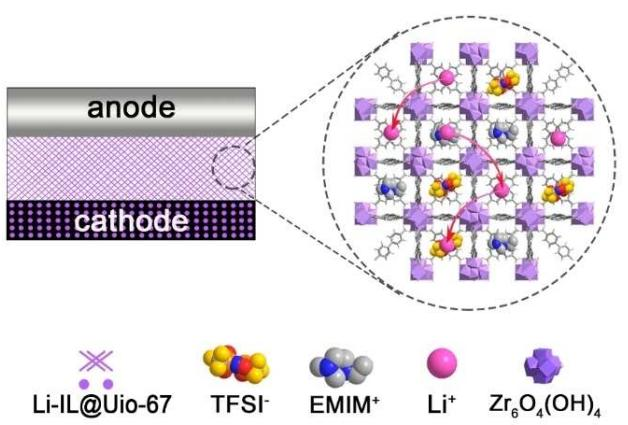
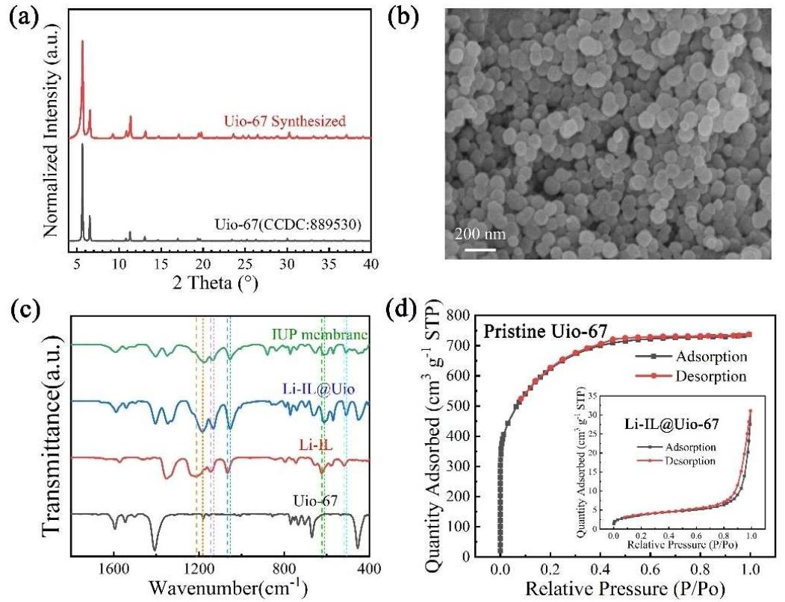
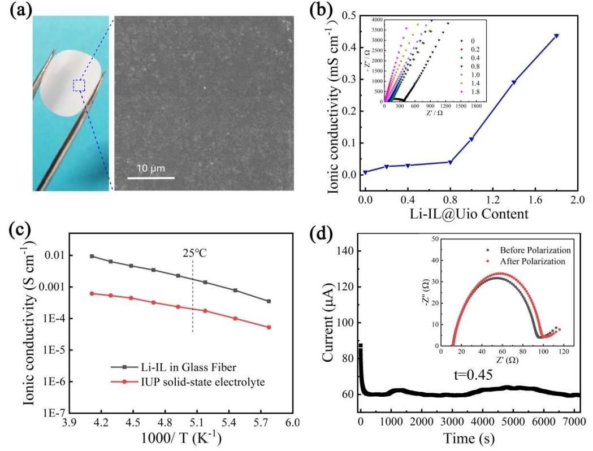
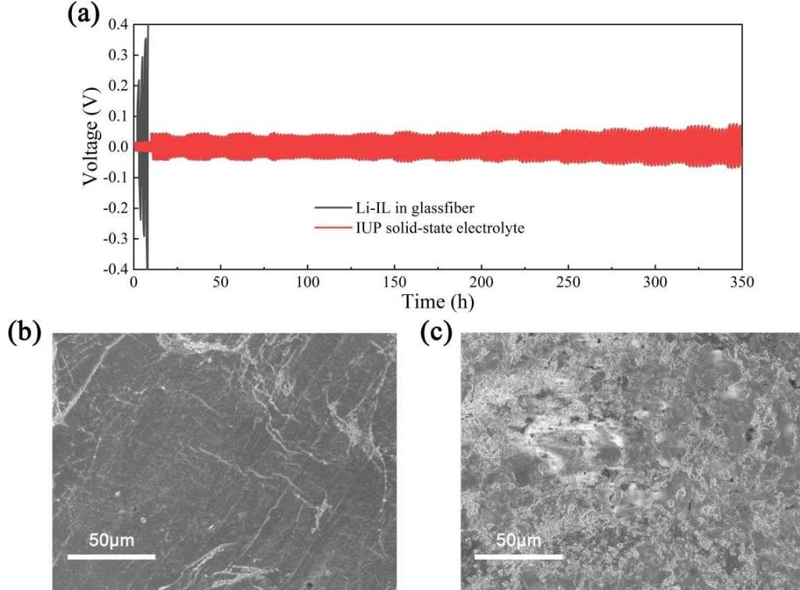
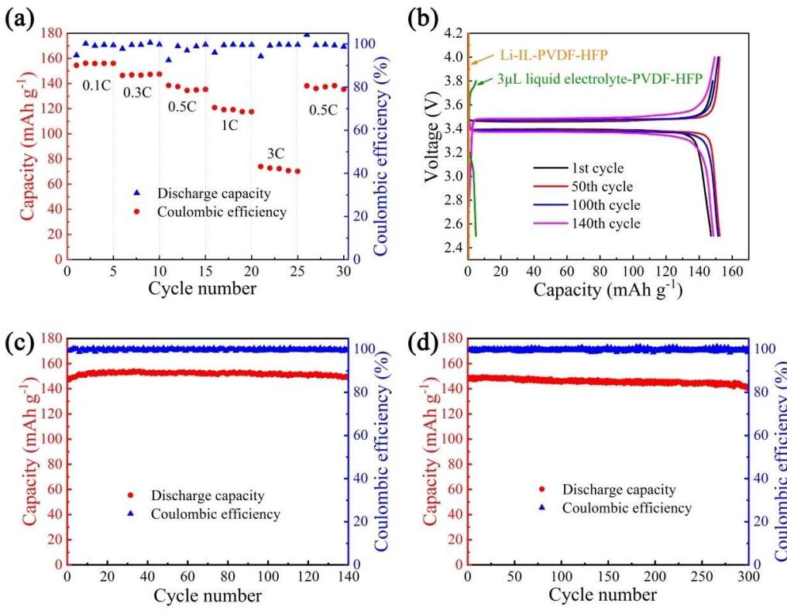

# **Flexible Quasi-Solid-State Composite Electrolyte Membrane Derived from a Metal-Organic Framework for Lithium-Metal Batteries**

Li Liu[a, b] and [Chunwen](http://orcid.org/0000-0002-3610-9396) Sun\*[a, b]

In this work, we developed a new kind of flexible Li-ion conductor membrane consisting of poly(vinylidene fluoride-cohexafluoropropylene) matrix and ionic liquid absorbed in metalorganic framework (MOF) particles. This composite membrane facilitates a homogeneous Li-ion flux and exhibits an excellent ionic conductivity of about 4.3×10 4 S cm 1 at room temperature, a wide electrochemical window of 4.8 V (*vs.* Li+/Li), as well as good thermal stability and flexibility. The quasi-solid-

## **1. Introduction**

In recent years, lithium-ion batteries have become the most common power sources for portable electronic devices and electric vehicles.[1] But the commercial organic liquid electrolyte which is widely used nowadays usually suffers from serious safety problems, because the ether and ester solvents could easily be leaked and ignited. In recent years, solid-state electrolytes (SSEs) are getting more and more attention.[2–5] Benefiting from intrinsic solid characteristic, solid-state electrolyte can solve the safety issue and inhibit dendrite problem, making it possible for lithium-metal batteries, the "holy grail" of Li-based batteries, whose theoretical specific capacity is about 10 times that of commercial graphite anodes.[3,6]

Solid-state electrolytes mainly fall into two kinds, polymerbased electrolytes or inorganic electrolytes.[7,8] For the polymerbased electrolytes, lithium ions can transport along the polymer chains of amorphous region, therefore, the ionic conductivity is determined by the degree of crystallinity. Various approaches, such as adding inorganic nanoparticles (Al2O3, SiO2, TiO2 and montmorillonite) or small molecules as plasticizer and polymerizing with other organic chains, have been taken to reduce the crystallinity of polymer electrolytes.[9–11] But most polymer electrolyte still cannot reach high ionic conductivity, unless operating at high working temperature, or even impregnated with liquid electrolyte before use.[12–15] These disadvantages

[a] *L. Liu, Prof. C. Sun CAS Center for Excellence in Nanoscience Beijing Institute of Nanoenergy and Nanosystems Chinese Academy of Sciences, Beijing 100083, China E-mail: sunchunwen@binn.cas.cn*

- [b] *L. Liu, Prof. C. Sun School of Nanoscience and Technology University of Chinese Academy of Sciences Beijing 100049, China*
- Supporting information for this article is available on the WWW under <https://doi.org/10.1002/celc.201902032>

state lithium metal battery assembled with the composite electrolyte membrane, a Li metal anode, and a composite cathode shows low interface impedance and a reversible discharge capacity of 149 mAhg 1 within 300 cycles at 0.1 C. This new kind of quasi-solid-state electrolyte membrane is a promising candidate for solid-state lithium-metal batteries with a high energy density.

make polymer electrolytes suffer from serious safety risks. As for inorganic electrolytes, the most serious problem is the large interfacial resistance caused by the poor physical contact between SSEs and electrodes, which substantially limits the transport of Li ions. Moreover, inorganic electrolytes usually have to be sintered at high temperature and their machinability is so poor that ceramic electrolyte cannot be used in flexible applications.[16–18]

Metal organic framework (MOF) materials have been applied in electrochemical energy storage and conversion. As electrochemical catalysts, MOF materials showed great application potential.[19–21] Recently, MOF materials are attracting more and more interest in designing new electrolyte.[22] The first electrolyte with MOF was derived from MOF Mg2(dobdc) reported by Long et al.[23] LiOi Pr was taken up into MOF followed by soaking in a typical electrolyte solution. The ionic conductivity of the composite pellet can reach 3.1×10 4 S cm 1 at room temperature. Kitagawa et al. developed a low temperature ionic conductor from ZIF-8 and ionic liquid,[24] but the reported electrochemical data were incomplete. Dincă and coworkers reported a series of single-ion conductors of Li+, Na+ and Mg2+ based on the post-synthetic modified MIT-20,[25] but its electrochemical window was too narrow (2–4.1 V) to be applied to the high-voltage layered oxide cathodes due to the redox active Cu(II) centers. Uio-66 and Uio-67 mixed with ionic liquid were also applied as Li ion conductor in recent studies. Guo et al. mixed Uio-66 and ionic liquid together and prepared composite membranes with a mold. The composite membrane can cycle 100 times at 0.2 C and 60°C.[26] They also mixed the Uio-66 and ionic liquid with polyethylene oxide (PEO), which can cycle 100 times at 0.5 C and 60°C.[27] Pan et al. adopted nanosized MOF materials to reduce the interface impedance among ceramic particles.[28] But the electrolytes were prepared by mechanical pressing, ionic liquids were likely to be in the voids among particles, the mechanism of Li-ion transport is not

clear. And the electrolytes were hard-disk like, which limited their application due to interfacial problems.

In this work, we propose a new type of flexible quasi-solidstate composite electrolyte membrane derived from MOF and ionic liquid. The location of ionic liquid and the mechanism of Li+ transport were determined by experiments. Ionic liquid electrolyte as guest was hosted in the cage of nanopores of MOF structure to form Li+ conductor. Uio-67 MOF constructed by Zr6(IV)O4(OH)4 clusters and biphenyl-4,4'-dicarboxylic acid (BPDC) linkers was selected as host to absorb nonvolatile and nonflammable Li IL (LiTFSI in [EMIM][TFSI]). The pore size of each octahedral cage in Uio-67 is estimated to be 1.2 nm, making it suitable to contain the segment of Li IL, such as the EMIM+ (chain length: 0.79 nm) and TFSI (chain length: 0.76 nm)[29] while smaller Li+ (ionic radius: 0.059 nm) can transport freely. The Li IL encapsulated in the MOF cages loses its pristine free-flowing nature, but preserves the high ionic conductivity. The composite Li ion conductor was marked as Li IL@Uio-67. To form flexible electrolyte membrane, poly (vinylidene fluoride-co-hexafluoropropylene) (PVDF-HFP) was chosen as the polymer matrix, who have been widely studied as a polymer matrix of gel polymer electrolyte (GPE) in LIBs, owing to its low crystallinity, good chemical resistance, thermal stability, self-extinguishing property and flexibility. Li IL@Uio-67 was dispersed in PVDF-HFP to form a continuous ion transport network, we proved that the Li IL still remain inside the nanopores of MOF structure after mixed with polymer matrix. The ionic conductivity of this composite electrolyte membrane can reach 4.3×10 4 S cm 1 , with a wide electrochemical window of 4.8 V (*vs.* Li+/Li) at room temperature. The electrolyte exhibits stable Li plating/stripping at a current areal capacity of 0.3 mAhcm 2 for more than 350 h. When coupling with LiFePO4 and Li IL@Uio-67 hybrid cathode, the prepared solid-state lithium battery can maintain a discharge capacity of 149 mAhg 1 for 300 cycles at 0.1 C, and the Li plating/stripping is almost completely reversible during cycling.

# **Experimental Section**

#### **Synthesis of Nanostructured Li IL@Uio-67 Filler**

Uio-67 was synthesized according to the reported procedures[28] with a little modification. Typically, 80 mg biphenyl-4,4'-dicarboxylic acid (BPDC) was dissolved in 30 ml of dimethylformamide (DMF) with 640 μL triethylamine added, this solution was marked as solution A. 80 mg zirconium chloride (ZrCl4) with 4 mL acetic acid was dissolved in 24 mL dimethylformamide (DMF), this solution was marked as solution B. The solution A was dropped into solution B at room temperature within 15 min. The mixed solution was then poured into a Teflon sealed autoclave and kept at 85°C for 24 h. White precipitate was collected by centrifugation and washed with DMF at 45°C and methanol, followed by activated in a vacuum oven overnight at 120 °C. To obtain Li-containing ionic liquid, 0.57 g LiTFSI was dissolved in 1 mL 1-ethyl-3-methylimidazolium bis [(trifluoromethyl)]sulfonyl]imide ([EMIM][TFSI]), which was heated at 120°C overnight before use. Different amounts of Li IL were mixed with Uio-67 in mortar and the mixtures were heated at 120 °C in a vacuum oven to obtain nanostructured Li IL@Uio-67.

#### **Synthesis of Flexible Quasi-Solid-State Composite Polymer Electrolyte**

0.5 g poly(vinylidene fluoride-co-hexafluoropropylene) (PVDF-HFP) was dissolved in 2 mL acetone to obtain a homogeneous solution, different amounts of Li IL@Uio-67 were dispersed in 1 mL N, Ndimethylacetamide (DMAc), these two solutions were mixed and stirred for 2 days. Afterwards, the solution was cast on a glass plate and stayed at room temperature for a while to volatilize acetone. The obtained membrane was then heated at 80°C in a vacuum oven overnight to remove the remained solvent. The flexible membrane was punched into circles with a diameter of 16 mm to obtain the IUP electrolyte membrane.

## **Synthesis of Hybrid Cathode**

LiFePO4, Li IL@Uio-67, Super P and PVDF binder were mixed in 5 ml N-methyl pyrrolidone (NMP) at different ratio, these homogeneous mixture were cast on aluminum foil by a doctor blade apparatus with different gap width followed by heated at 120 °C overnight. The aluminum foil was punched into circles with a diameter of 14 mm. The areal loading of active materials on each piece was about 3.33 mg cm 2 .

#### **Materials Characterization**

Powder X-ray diffraction (XRD) data were recorded by a Bruker D8 Advance diffractometer using Cu Kα, λ=1.541 Å from 2–40°. Scanning electron microscopy (SEM) and energy dispersive spectrometer (EDS) mappings were investigated using Hitachi SU8020 scanning electron microscopy with an Oxford AZtec energy dispersive spectrometer. Fourier transform infrared spectrometer (FTIR) measurements were performed on a Vertex 80v instruments. Liquid-state 13C nuclear magnetic resonance (NMR) spectra were recorded on an Avance Bruker IIIHD500 NMR spectrometer, the Li IL sample was dissolved in deuterated chloroform in advance. Solid-state 13C NMR measurements were performed on Avance Bruker IIIHD400 NMR spectrometer. N2 adsorption-desorption isothermal was recorded on a Micromeritics ASAP 2020 HD88 tool. Thermo gravimetric analysis (TGA) was carried out in a N2 atmosphere at a scan speed of 10°Cmin 1 on a Mettler Toledo TGA/DSC STAR system. Stress-strain curve was tested on a MTS electromechanical universal testing machine at stretching rate at 2 mmmin 1 .

#### **Electrochemical Measurements**

In an argon-filled glove box with H2O and O2 level below 0.1 ppm, LIR 2032 coin cells were assembled with IUP membranes for various electrochemical tests. 3 μL liquid electrolyte (1 M bis(trifluoromethanesulphonyl)imide (LiTFSI) in a mixture solution of 1,3-dioxolane (DOL) and 1,2-dimethoxyethane (DME) (1 :1 in volume)) was added on both sides of IUP membrane to improve the contact. Pure PVDF-HFP membrane as electrolyte and 3 μL liquid electrolyte added on both sides were also assembled to examine the effect of the added liquid electrolyte on the electrochemical performances. Coins cells with Li foils as anode, hybrid LFP as cathode, 25 μL ionic liquid as electrolyte with glass fiber as separators were also assembled in control experiment.

The electrochemical impedance spectroscopy (EIS) were measured in the temperature range from 5°C to 60°C on a ZENNIUME electrochemical workstation (Zahner, Germany) in the frequency range from 106 Hz to 10 2 Hz with a perturbation of 10 mV. The ionic conductivity (*σ*) was calculated from the Eq. (1), where *R* is the

resistance value of the bulk electrolyte, *L* is the thickness of electrolyte membrane, and *S* is the area of stainless-steel electrode.

$$
\sigma = \frac{L}{RS} \tag{1}
$$

Linear sweep voltammetry (LSV, 0.1 mVs 1 ) data were collected with a CHI604 electrochemical workstation. Lithium ion transference number (tLi+) was measured by a combination measurement of AC impedance and DC polarization and calculated using Eq. (2), where ΔV is the applied DC polarization voltage (10 mV), I0 and I1 are initial and stable currents during polarization, R0 and R1 are the resistance before and after polarization.

$$
t_{Li+} = \frac{I_{SS}(AV - I_0 R_0)}{I_0(AV - I_3 R_5)}
$$
(2)

The Li plating/stripping cycles and battery cycling performance at different current density were obtained with a LAND battery cycler at room temperature.

## **2. Results and Discussions**

Uio-67 MOF constructed by Zr6(IV)O4(OH)4 clusters and biphenyl-4,4'-dicarboxylic acid (BPDC) linkers was used as host for loading ionic liquid to form a new kind of Li-ion conductor. Ionic liquid is confined in nanoporous MOF, rather than in PVDF-HFP matrix. The porous MOF particles are favorable for facilitating a homogeneous Li-ion flux, thus guarantying excellent electrochemical properties. The constructional details and working mechanism of the quasi-solid-state battery (SSB) with IUP membrane as electrolyte are illustrated in Scheme 1.

#### **2.1. Characterization of Ionic Conductor Li IL@Uio**

Uio-67 nanoparticles were synthesized by solvothermal method.[31] The crystal structure was confirmed by X-ray diffraction (XRD). As shown in Figure 1a, it is well consistent

**Scheme 1.** Schematic illustration of the architecture and working mechanism of the quasi-solid-state battery, in which lithium foil as anode, mixture of LiFePO4 and Li-@Uio as cathode, IUP membrane as electrolyte.

with the simulated one based on the reported research.[29] Scanning electron microscopy (SEM) image of Uio-67 is shown in Figure 1b. It shows that the Uio-67 crystals are 70–120 nm in particle size with a spherical shape. As pure metal organic framework (MOF) is unable to conduct Li-ion, nonvolatile and nonflammable Li IL (LiTFSI in [EMIM][TFSI]) was chosen to be absorbed in Uio-67 as the Li ion conductor. It is believed that the more Li IL nanoparticles can hold, the higher ionic conductivity of the mixture can achieve.[26–28] Therefore, different amounts (0.5~2.0 mL) of Li IL were absorbed in activated Uio-67 host (1.0 g) to identify the optimized loading amount. It is found that when the loading amount of Li IL is less than 1.5 ml, the composites appear to be free-flowing dry powder, while it becomes gel-like state when mixed with more than 1.5 ml Li IL, suggesting that the volume in MOF particles is not enough for hosting more Li IL.[26–28] The gel-like composite suffers from liquid leakage and is likely to cause safety issue. Therefore, lithium ion conductor Li IL@Uio with optimized composition of 1.0 g MOF and 1.5 ml Li IL was used in the following experiments. Figure S1 shows XRD patterns of the Uio-67 containing different amounts of Li IL. It indicates that the intensity of reflection peak decreases with increasing of the absorbed amount of Li IL, which is evidence that Li IL has been absorbed in pores of Uio-67 structure, leading to the decrease of crystallinity of MOF particles.[33] After absorbing Li IL, it can be seen that the Uio-67 still keep a pure phase, indicating that it is chemically stable between Uio-67 and Li IL. The chemically stability is also further characterized by the Fourier transformation infrared spectrum (FT-IR). As shown in Figure 1c, it can be seen that no new peak of Li IL@Uio appears after mixing Li IL with Uio-67. It should be noted that the peak at 1209 cm 1 , 1144 cm 1 , 1066 cm 1 , and 622 cm 1 , 519 cm 1 assigned to O=S=O in [TFSI] and benzene ring in Uio-67 respectively, shifts to 1192 cm 1 , 1131 cm 1 , 1051 cm 1 and 611 cm 1 , 508 cm 1 after the Li IL has been absorbed in nanopores of Uio-67, attributed to conjugation effect between O=S=O bond in [TFSI] and benzene ring in MOF.[37] The conjugation effect makes the density of electron cloud average, the mechanical constants of bonds decrease, and the absorption peaks shift red. 13C liquid state nuclear magnetic spectra of Li IL and 13C solid state nuclear magnetic spectrum Uio-67 and Li IL@Uio-67 are shown in the Figure S2. The peaks between 115–123 ppm belong to the CF3 group in [TFSI] . The peaks at 14.48 ppm, 35.66 ppm and 44.89 ppm can be assigned to the CH3 group and CH2CH3 group in [EMIM]+. The peaks between 76–78 ppm belong to the deuterated chloroform solvent. In Figure S2b, the peaks between 121 and140 ppm belong to the benzene ring in Uio-67 and the peak at 168.48 ppm belongs to the ester group. After the Li IL and Uio-67 were mixed together, every characteristic peak of Li IL and Uio-67 can be found in Li IL@Uio-67 as shown in area A and B of Figure S2d, except the peak at 168.48 ppm of Uio-67. Two peaks at 170.13 ppm and 161.8 ppm can be found in Li IL@Uio-67, the enlarged drawing is shown in Figure S2e. A new peak appears at 161.8 ppm, which results from the change of chemical environment around COO group. In initial Uio-67, Zr4+ is connected to four ester groups, every ester group are in the

**Figure 1.** a) XRD patterns of the synthesized Uio-67 and the simulated result. b) SEM image of the synthesized Uio-67. c) FT-IR spectra of pristine Uio-67, Li IL, Li IL@Uio and IUP1.8 membrane. d) N2 adsorption-desorption isothermal curve at 77 K of pristine Uio-67 and Li IL@Uio in the inset.

same chemical environment, only one peak appears in 13C NMR. After Li IL is absorbed into the nanopore of MOF, some COO groups disconnect with Zr4+, instead, they interact with [EMIM]+, at the same time, Zr4+ interacts with [TFSI] , therefore, chemical environment of some COO changes, and new peak appears in NMR spectrum.[30] Additionally, according to the N2 adsorption- desorption isothermal curve tested at 77 K shown in Figure 1d, the BET surface area of the pristine Uio-67 MOF host is 2253 m2g 1 , demonstrating its high porosity, while it drops to 13 m2g 1 for the Li IL@Uio, suggesting a high occupation ratio of Li IL guest in the pores of MOF host. Moreover, the absorption-desorption curve shows a typical Type I isotherms,[34] suggesting the microporous adsorption characteristic of Uio-67. The results of FT-IR and BET tests suggest that the adsorption between Li IL and Uio-67 is physical adsorption as well as chemical adsorption, enabling the good stability of ionic liquid in MOF. Thermo-gravimetric analysis (TGA) of the Li IL@Uio tested in N2 atmosphere was also performed to examine its thermal stability, the decomposition temperature is over 360°C, as shown in Figure S3, which promised a wide operating temperature range of Li IL@Uio membrane as electrolytes for solid state batteries (SSBs).[36]

#### **2.2. Characterization of IUP Composite Electrolyte Membrane**

In order to form a composite solid-state electrolyte, one common kind of polymer matrix poly(vinylidene fluoride-cohexafluoropropylene) (PVDF-HFP) was selected, PVDF-HFP have been widely studied as a polymer matrix of GPE in LIBs, owing to its low crystallinity, as well as its chemical resistance, thermal stability, self-extinguishing property and flexibility.[35] By sonication treating and stirring, the lithium ion conductor Li IL@Uio powder was evenly mixed with acetone solution of PVDF-HFP. After casting the slurry into homogeneous composite membranes, a free-standing quasi-solid-state electrolyte membrane of Li IL@Uio-PVDF-HFP, hereafter denoted as IUP, was obtained. The photograph and SEM image of this membrane are shown in Figure 2a. The nanostructured Li IL@Uio fillers are uniformly distributed in PVDF-HFP matrix, evidenced by the SEM image and EDS mapping of Zr and F elements in the composite membrane (Figure S4). To check the existing sites of IL, a certain amount of Li IL was dropped into acetone solution of PVDF-HFP and cast the solution into membrane using the same method as preparing IUP electrolyte. After the solvent was evaporated completely, the PVDF-HFP matrix and ionic liquid cannot be fully integrated with each other into a whole, which can be proved by the residue on the paper clamped on both sides of Li IL-PVDF-HFP membrane for a while, as shown in Figure S5. In contrast, the IUP membrane containing the same amount of Li IL but absorbed in Uio-67, left nothing on the

**Figure 2.** a) Photograph and SEM image of the flexible quasi-solid-state electrolyte membrane IUP1.8. b) Ionic conductivity of composite membrane versus Li IL@Uio contents. c) Arrhenius plots of IUP1.8 membrane and Li IL in glass fiber. d) DC polarization curve of the IUP1.8 quasi-solid-state electrolyte.

weighing paper. This phenomenon indicates the poor compatibility between Li IL and PVDF-HFP. These results suggest that the ionic liquid is still located in the nanopore of the MOF structure, rather than dispersed in PVDF-HFP matrix.

Ionic conductivity is one of the most important properties of electrolytes. High ionic conductivity can avoid side reactions among electrolyte and electrode,[38] improve electrochemical properties, and extend batteries lifetime. A series of PVDF-HFP membranes containing different amounts of Li IL@Uio-67 fillers were prepared. Symmetric cells with a IUP solid electrolyte membrane and two stainless steel electrodes were assembled, with a tiny amount (3 μL, 1.5 μL/cm2 ) of liquid electrolyte (1 M LiTFSI in DOL/DME (V/V=1:1)), applied on both sides of the IUP membranes to reduce interface impedance. The conductivities of these IUP electrolyte membranes were measured using electrochemical impedance spectroscopy (EIS). As shown in Figure 2b. When the mass ratios of polymer matrix and fillers are 0, 0.2, 0.4, 0.8, 1.0, 1.4, 1.8 (labeled as IUP0, IUP0.2, IUP0.4, IUP0.8, IUP1.0, IUP1.4, IUP1.8, respectively, see Table S1 for specific components), the ionic conductivities of IUP membranes are 9.04×10 6 S cm 1 , 2.67×10 5 S cm 1 , 2.99×10 5 S cm 1 , 4.02× 10 5 S cm 1 , 1.13×10 4 S cm 1 , 2.92×10 4 S cm 1 and 4.3× 10 4 S cm 1 , respectively. It should be noticed that when the ratios are less than 0.8, the increase of ionic conductivities are not quite obvious. On the contrary, when the mass ratios are higher than 0.8, the ionic conductivity of IUP membrane increases by an order of magnitude. This is because the Li IL@Uio particles cannot contact with each other when less than 0.4 g fillers are dispersed in PVDF-HFP matrix, since the PVDF-HFP has poor Li+ transport capability, the ionic conductivities only slightly improve due to the decrease of crystallinity.[35] When more than 0.4 g fillers are added into the polymer matrix, the particles well contact each other, continuous Li+ transport channels are formed, therefore, significant increase of ionic conductivity is observed. Figure S6 provides evidence by means of the cross-sectional SEM images of the IUP0.2 and IUP1.8 membranes. The tensile strength of IUP1.8 with a thickness of about 74.2 μm can reach 10 MPa, as shown in Figure S7, Thus, the IUP1.8 membrane were used in the following electrochemical studies. Additionally, Figure 3c shows Arrhenius plots of IUP1.8 membrane and Li IL in glass fiber. The calculated activation energy of result of IUP1.8 is 0.3 eV, demonstrating a solid-state conduction behavior. The activation energy is lower than ionic liquid (0.36 eV), which means an easier transport path exists in the IUP electrolyte.[40] The ionic transference number was also tested. The transference number of pristine Li IL in a glass fiber as separator is only 0.086 (Figure S8), while the transference number of IUP1.8 electrolyte is 0.45 (Figure 2d), much higher than that of the bulk ionic liquid. The reason for the IUP showing lower activation energy and higher transference number may be in glass fiber, the pores are in micrometer size, ionic liquid preserves its liquid character, [EMIM]+ and [TFSI] ions are mobile, causing a higher activation energy and a lower Li+ transference number. However, in IUP

**Figure 3.** a) Voltage profiles of the LijIUP1.8 j Li cell and Lij Li IL j Li cell tested at room temperature at a current density of 0.3 mAcm 2 for 1 h. b) SEM image of the Li metal surface of LijIUP1.8 j Li symmetric cell after 150 h testing. c) SEM image of the Li metal surface of Lij Li IL j Li symmetric cell after 30 h testing.

electrolyte, since the EMIM+ and TFSI chains are much larger than Li+, the movement of EMIM+ and TFSI chains through the nanopore in MOF become more difficult. Nanopores in MOF structure restrict the movement of [EMIM]+ and [TFSI] ions, meanwhile they allow Li+ transport freely in the membrane along a continuous channel.[32] Low activation energy and high transference number make the IUP1.8 electrolyte be a promising candidate for high performance solid state batteries.

#### **2.3. Electrochemical Performance test of IUP Quasi-Solid-State Electrolyte**

One important feature of solid state electrolyte is their ability to block Li dendrites, which enables the use of Li metal as anode in solid state batteries to achieve higher energy densities and safer purpose.[40] Therefore, LijIUP1.8 j Li symmetric cell was assembled for the galvanostatic Li plating-stripping test at a current density of 0.3 mAcm 2 for 1 h, corresponding to a deposition amount of 0.3 mAhcm 2 at room temperature. As shown in Figure 3a, the polarization voltage of symmetric cell is about 50 mV, no sudden increase in polarization or short-circuit happened for 350 h testing. On the contrary, the symmetric cell with bulk Li IL as electrolyte and glass fiber as separator, the polarization increases to 0.2 V within 10 h, because of the uneven distribution the large segment in ionic liquid. These results imply a small interfacial resistance and a stable interface of composite membrane against Li metal. Figures 3b and 3c show SEM images of the Li metal surface after 150 h testing of LijIUP1.8 j Li and 30 h of Lij Li IL j Li symmetric cell, respectively. It is clearly observed that a much smoother Li surface is achieved for IUP1.8 electrolyte than that of Li IL electrolyte, benefiting from homogeneous Li-ion flux contributed by porous Uio-67 and the quasi solid nature of IUP1.8 membrane. Therefore, the application of IUP1.8 membrane in lithium metal batteries can be expected.

To further evaluate the application of the composite polymer electrolyte in solid state lithium batteries, electrochemical performance test of IUP1.8 was carried out on coin cell with hybrid cathode and Li metal anode. Figure S9 shows the liner sweep voltammograms (LSV) curve of the IUP1.8 quasisolid-state electrolyte, the decomposition voltage reaches up to 4.8 V, make this electrolyte capable working with most of the commercial cathode. In solid state batteries, ionic transport among the cathode material, carbon, and binder is limited due to the interfacial issue,[28] especially when only a little liquid electrolyte was added in this work. Therefore, nano-sized Li IL@Uio was mixed in cathode slurry to increase the contact area among electrode materials and decrease internal resistance. A series of hybrid cathode with different ratios of LiFePO4 to Li IL@Uio were prepared, and the electrochemical impedance spectra before cycling were shown in Figure S10. It can be seen that the cells with hybrid cathode had lower internal resistance than those with pure LiFePO4 cathode. The hybrid cathode with LiFePO4 : Li IL@Uio : Ketjen black : binder ratio at 4:4:1:1 were used in the following electrochemical studies.

Figure 4a and Figure S11 shows the rate performance of the solid-state battery. The specific discharge capacities of the solidstate battery are 156.7, 147.2, 137.1, 118.1 and 72.4 mAhg 1 at 0.1 C, 0.3 C, 0.5 C, 1 C and 3 C, respectively, implying that this battery has good rate capability. To reduce the interface impedance, 3 μL liquid electrolyte was added on the both sides of quasi-solid-state membrane. In a control experiment, to clarify the effect of liquid electrolyte, 3 μL liquid electrolyte was added on both sides of pure PVDF-HFP separator and the cell was charged at 0.1 C. As shown in Figure 4b, the cell shows large polarization and low capacity, which indicates that 3 μL liquid electrolyte is not enough for Li ion to transport through pure PVDF-HFP without Li IL@Uio particles. Therefore, Li ion transport along the pathway provided by Li IL@Uio dispersed in PVDF-HFP matrix is critical, while the liquid electrolyte added just acts as an interfacial wetting agent. Furthermore, half-cell with LiFePO4 as cathode and Li IL-PVDF-HFP as electrolyte cannot be charged, as shown in Figure 4**b**, indicating that Li IL in matrix was not continuous, so that Li IL-PVDF-HFP cannot transport Li-ion. Therefore, it is concluded that Li IL was absorbed in pores of Uio-67 structure when it is mixed with PVDF-HFP polymer matrix, forming a quasi-solid-state Li-ion conductor. In other word, Li-ions transport through continuous channel provided by the Li IL@Uio-67 inside the composite electrolyte, rather than transport by ionic liquid itself. Figure 4c shows the cycling performance of the cells tested at room temperature at 0.3 C. It can be seen that the discharge capacity of the cell maintains at about 150 mAhg 1 without obvious attenuation within 140 cycles, and the average Coulombic efficiency is as high as 99.86%, indicating excellent reversibility of Li+ intercalation/deintercalation. The electrochemical impedance spectra of the IUP1.8 membrane for different cycles are shown in Figure S12. On the contrary, the discharge capacity of the cells with Li IL in glass fiber as electrolyte reduces by 50% after 30 cycle at 0.3 C (Figure S13**)**. Figure 4d shows cycling performance of the cell at 0.1 C. The cell shows excellent cycling performance for 300 cycles with a discharge capacity decay by only 6%, from 149 mAhg 1 to 140 mAhg 1 , demonstrating this SSB with IUP1.8 quasi-solid-state electrolyte is promising for practical applications.

Furthermore, pouch cells were also prepared with IUP1.8 membranes as electrolyte. Figure 5a shows the cycle performance of the pouch cells at different bending angles. The pouch cells have average discharge capacity about 130, 135, and 125 mAhg 1 at different bending angles at 0°, 90° 150°, respectively, and the average Coulombic efficiency are 92.9%, 93.9% and 96.4% at 0.1 C. When the cell is unfolded to 0° again, the pouch cell exhibits a discharge capacity of 130 mAhg 1 and Coulombic efficiency about 95%, indicating the pouch cells have good environmental tolerance. Figure 5b shows the voltage-specific capacity curves at different bending angles, the differences of polarization voltages are caused by the change of contact between electrolytes and electrodes at different bending angles. Figure S14 shows that the pouch cell

**Figure 4.** a) Rate performance of the IUP1.8 quasi-solid-state battery. b) Charge and discharge curves of the solid-state battery for different cycle numbers at 0.3 C. c) Cycle performance of the solid-state battery with IUP1.8 electrolyte at 0.3 C. d) Cycle performance of the solid state battery with IUP1.8 electrolyte at 0.1 C.

**Figure 5.** a) Cycle performance of pouch cells with IUP1.8 electrolyte at 0.1 C under bending at different angles. b) Voltage-specific capacity curves of pouch cells with IUP1.8 electrolyte at 0.1 C under bending at different angles.

with an effective area of 6 cm2 can power a display panel with 69 LED lights showing the letters of BINN (the abbreviation of Beijing Institute of Nanoenergy and Nanosystems) under bending at angle of 150°, demonstrating the flexibility nature and good electrochemical properties of IUP1.8 membrane. These results indicate the IUP1.8 electrolyte based quasi-solid-state battery is a promising power source candidate for portable electronics and wearable devices.

## **3. Conclusions**

In summary, a flexible quasi-solid-state electrolyte derived from metal-organic framework was prepared by dispersed a new kind of ionic conductor of ionic liquid absorbed in MOF in PVDF-HFP matrix. The abundant nanopores in MOF particles can restrict the movement of large chains of ionic liquid, forming continuous ionic channels in polymer matrix and provide homogeneous Li-ion flux. This composite electrolyte membrane exhibits excellent ionic conductivity of about 4.3× 10 4 S cm 1 at room temperature. The symmetric cell with IUP1.8 electrolyte shows stable plating-stripping for 350 h testing a current density of 0.3 mAcm 2 . The cell with IUP1.8 electrolyte and hybrid LiFePO4 cathode also shows low interface impedance and stable cycling performance for 140 cycle at 0.3 C and 300 cycle at 0.1 C. This flexible quasi-solid-state electrolyte combined MOF with Li IL is demonstrated to be a promising candidate as power source for portable and wearable electronics.

## *Acknowledgements*

*This work is supported by the National Natural Science Foundation of China (grant numbers 51672029, 51372271) and the National Key R&D Project from Ministry of Science and Technology, China (2016YFA0202702).*

**Keywords:** composite electrolytes **·** metal-organic frameworks **·** ionic liquid electrolytes **·** lithium-metal batteries

- [1] J. B. Goodenough, K. S. Park, *J. Am. Chem. Soc.* **2013**, *135*, [1167–1176](https://doi.org/10.1021/ja3091438).
- [2] J. Janek, W. G. Zeier, *Nat. Energy* **2016**, *1*, 16141.
- [3] Y. Lu, J. A. Alonso, Q. Yi, L. Lu, Z. L. Wang, C. W. Sun, *Adv. [Energy](https://doi.org/10.1002/aenm.201901205) Mater.* **2019**, *9*, [1901205](https://doi.org/10.1002/aenm.201901205).
- [4] J. Wang, C. W. Sun, Y. D. Gong, H. R. Zhang, J. A. Alonso, M. T. Fernández-Díaz, Z. L. Wang, J. B. Goodenough, *Chin. Phys.* **[2018](https://doi.org/10.1088/1674-1056/27/12/128201)**, *27*, [128201](https://doi.org/10.1088/1674-1056/27/12/128201).
- [5] E. Quartarone, P. Mustarelli, *Chem. Soc. Rev.* **2011**, *40*, [2525–2540.](https://doi.org/10.1039/c0cs00081g)
- [6] D. C. Lin, Y. Y. Liu, Y. Cui, *Nat. [Nanotechnol.](https://doi.org/10.1038/nnano.2017.16)* **2017**, *12*, 194–206.
- [7] A. Manthiram, X. Yu, S. Wang, *Nat. Rev. Mater.* **2017**, *2*, 16103.
- [8] C. W. Sun, J. Liu, Y. D. Gong, D. P. Wilkinson, J. J. Zhang, *Nano [Energy](https://doi.org/10.1016/j.nanoen.2017.01.028)* **2017**, *33*, [363–386.](https://doi.org/10.1016/j.nanoen.2017.01.028)
- [9] A. B. Puthirath, S. Patra, S. Pal, M. Manoj, A. P. Balan, S. Jayalekshmi, T. N. Narayanan, *J. Mater. Chem. A* **2017**, *5*, 11152–11162.
- [10] D. C. Zhang, L. Zhang, K. Yang, H. Wang, C. Yu, D. Xu, B. Xu, L. M. Wang, *ACS Appl. Mater. Interfaces.* **2017**, *9*, [36886–36896](https://doi.org/10.1021/acsami.7b12186).
- [11] Q. Q. Zhang, K. Liu, F. Ding, X. J. Liu, *Nano Res.* **2017**, *10*, [4139–4174.](https://doi.org/10.1007/s12274-017-1763-4)
- [12] Z. G. Xue, D. He, X. L. Xie, *J. Mater. Chem. A.* **2015**, *3*, [19218–19253](https://doi.org/10.1039/C5TA03471J).
- [13] L. Z. Long, S. J. Wang, M. Xiao, Y. Z. Meng, *J. [Mater.](https://doi.org/10.1039/C6TA02621D) Chem. A.* **2016**, *4*, [10038–10069.](https://doi.org/10.1039/C6TA02621D)
- [14] D. D. Han, Z. Y. Wang, G. L. Pan, X. P. Gao, *ACS Appl. Mater. [Interfaces.](https://doi.org/10.1021/acsami.9b03682)* **2019**, *11*, [18427–18435](https://doi.org/10.1021/acsami.9b03682).
- [15] D. D. Han, S. Liu, Y. T. Liu, Z. Zhang, G. R. Li, X. P. Gao, *J. [Mater.](https://doi.org/10.1039/C8TA07685E) Chem. A.* **2018**, *6*, [18627–18634.](https://doi.org/10.1039/C8TA07685E)
- [16] J. C. Bachman, S. Muy, A. Grimaud, H. H. Chang, N. Pour, S. F. Lux, O. Paschos, F. Maglia, S. Lupart, P. Lamp, L. Giordano, Y. Shao-Horn, *[Chem.](https://doi.org/10.1021/acs.chemrev.5b00563) Rev.* **2016**, *116*, [140–162.](https://doi.org/10.1021/acs.chemrev.5b00563)
- [17] Z. H. Gao, H. B. Sun, L. Fu, F. L. Ye, Y. Zhang, W. Luo, Y. H. Huang, *[Adv.](https://doi.org/10.1002/adma.201705702) Mater.* **2018**, *30*, [1705702](https://doi.org/10.1002/adma.201705702).
- [18] Z. Z. Zhang, Y. J. Shao, B. Lotsch, Y. S. Hu, H. Li, J. Janek, L. F. Nazar, C. W. Nan, J. Maier, M. Armand, L. Q. Chen, *Energy [Environ.](https://doi.org/10.1039/C8EE01053F) Sci.* **2018**, *11*, [1945–1976.](https://doi.org/10.1039/C8EE01053F)
- [19] Z. B. Liang, C. Qu, W. H. Guo, R. Q. Zou, Q. Xu, *Adv. Mater.* **2018**, *30*, 39.
- [20] H. B. Wu, X. W. Lou, *Sci. Adv.* **2017**, *3*, 12.
- [21] R. Zhao, Z. Liang, R. Zou, Q. Xu, *Joule.* **2018**, *2*, [2235–2259](https://doi.org/10.1016/j.joule.2018.09.019).
- [22] Y. B. He, Y. Qiao, Z. Chang, H. S. Zhou, *Energy [Environ.](https://doi.org/10.1039/C8EE03651A) Sci.* **2019**, *12*, [2327–2344.](https://doi.org/10.1039/C8EE03651A)
- [23] B. M. Wiers, M. L. Foo, N. P. Balsara, J. R. Long, *J. Am. [Chem.](https://doi.org/10.1021/ja205827z) Soc.* **2011**, *133*, [14522–14525](https://doi.org/10.1021/ja205827z).
- [24] K. Fujie, K. Otsubo, R. Ikeda, T. Yamada, H. Kitagawa, *[Chem.](https://doi.org/10.1039/C5SC01398D) Sci.* **2015**, *6*, [4306–4310.](https://doi.org/10.1039/C5SC01398D)
- [25] S. S. Park, Y. Tulchinsky, M. Dinca, *J. Am. Chem. Soc.* **2017**, *139*, [13260–](https://doi.org/10.1021/jacs.7b06197) [13263.](https://doi.org/10.1021/jacs.7b06197)
- [26] J. F. Wu, X. Guo, *Small* **2019**, *15*, [1804413.](https://doi.org/10.1002/smll.201804413)
- [27] J. F. Wu, X. J. Guo, *J. Mater. Chem. A.* **2019**, *7*, [2653–2659](https://doi.org/10.1039/C8TA10124H).
- [28] Z. Q. Wang, Z. J. Wang, L. Y. Yang, H. B. Wang, Y. L. Song, L. Han, K. Yang, J. T. Hu, H. B. Chen, F. Pan, *Nano Energy* **2018**, *49*, [580–587](https://doi.org/10.1016/j.nanoen.2018.04.076).

- [29] C. Wang, Z. G. Xie, K. E. deKrafft, W. L. Lin, *J. Am. [Chem.](https://doi.org/10.1021/ja203564w) Soc.* **2011**, *133*, [13445–13454.](https://doi.org/10.1021/ja203564w)
- [30] Y. T. A. Wong, V. Martins, B. E. G. Lucier, Y. N. Huang, *[Chem.](https://doi.org/10.1002/chem.201803866) Eur. J.* **2019**, *25*, [1848–1853.](https://doi.org/10.1002/chem.201803866)
- [31] R. Chen, J. Zhang, J. Chelora, Y. Zhang, S. V. Kershaw, K. F. Li, P. K. Lo, K. W. Cheah, A. L. Rogach, J. A. Zapien, C. S. Lee, *ACS Appl. [Mater.](https://doi.org/10.1021/acsami.6b12469) Interfaces.* **2017**, *9*, [5699–5708.](https://doi.org/10.1021/acsami.6b12469)
- [32] S. Y. Bai, Y. Sun, Yi, J. He, Y. B. Qiao, Y. Zhou, *Joule.* **2018**, *2*, [2117–2132](https://doi.org/10.1016/j.joule.2018.07.010).
- [33] M. T. Li, W. S. Zhu, P. F. Zhang, Y. H. Chao, Q. He, B. L. Yang, H. M. Li, A. Borisevich, S. Dai, *Small* **2016**, *12*, [3535–3542](https://doi.org/10.1002/smll.201600358).
- [34] A. Ramirez, L. Sierra, M. Mesa, J. Restrepo, *Chem. Eng. Sci.* **2005**, *60*, 4702–4708.
- [35] G. H. Chen, F. Zhang, Z. M. Zhou, J. R. Li, Y. B. Tang, *Adv. Energy Mater.* **2018**, *8,* 1801219.
- [36] W. Q. Zhang, J. H. Nie, F. Li, Z. L. Wang, C. W. Sun, *Nano [Energy.](https://doi.org/10.1016/j.nanoen.2018.01.028)* **2018**, *45*, [413–419](https://doi.org/10.1016/j.nanoen.2018.01.028).
- [37] M. Jeyapandian, S. Lavina, S. Thayumanasundaram, H. Ohno, E. Negro, V. Di Noto, *J. Power Sources* **2010**, *195*, [341–353](https://doi.org/10.1016/j.jpowsour.2009.06.088).
- [38] X. B. Cheng, R. Zhang, C. Z. Zhao, F. Wei, J. G. Zhang, Q. Zhang, *[Adv.](https://doi.org/10.1002/advs.201500213) Sci.* **2016**, *3*, [1500213](https://doi.org/10.1002/advs.201500213).
- [39] S. Y. Yuan, J. L. Bao, J. S. Wei, Y. Y. Xia, D. G. Truhlar, Y. G. Wang, *[Energy](https://doi.org/10.1039/C9EE01473J) Environ. Sci.* **2019**, *12*, [2741–2750](https://doi.org/10.1039/C9EE01473J).
- [40] K. R. Deng, D. M. Han, S. Ren, S. J. Wang, M. Xiao, Y. Z. Meng, *J. [Mater.](https://doi.org/10.1039/C9TA02407G) Chem. A* **2019**, *7*, [13113–13119](https://doi.org/10.1039/C9TA02407G).

Manuscript received: December 4, 2019 Revised manuscript received: January 7, 2020 Accepted manuscript online: January 17, 2020