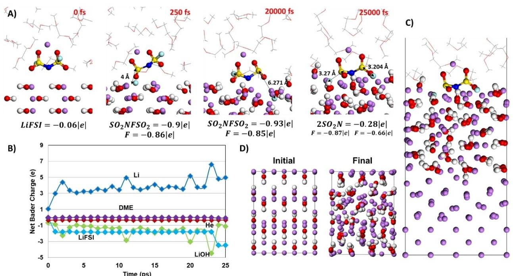
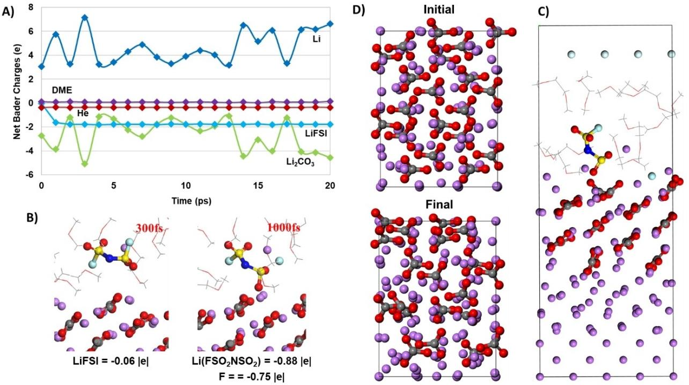
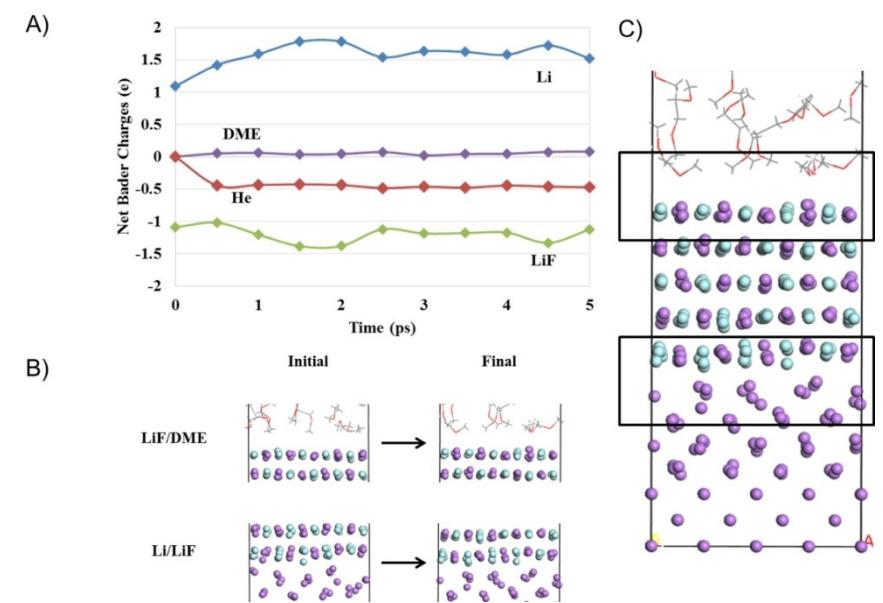
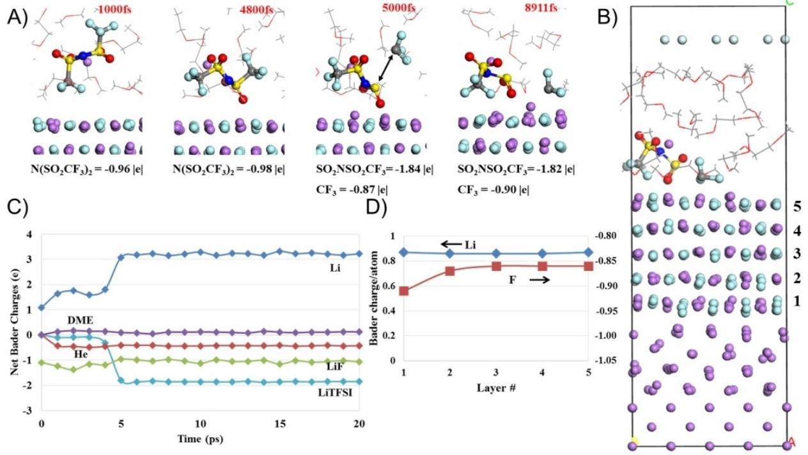
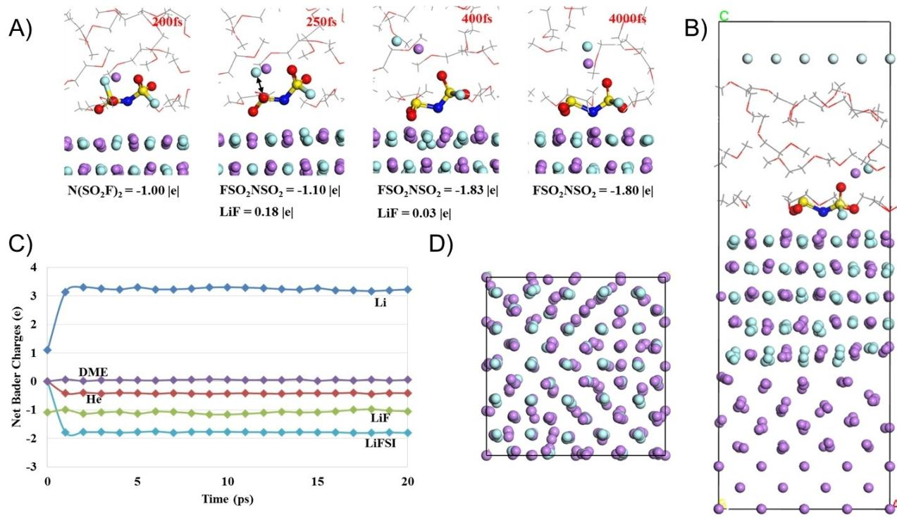

# **Effects of Solid Electrolyte Interphase Components on the Reduction of LiFSI over Lithium Metal**

Ethan P. Kamphaus,[a] Stefany Angarita Gomez,[a] Xueping Qin,[d] Minhua Shao,[d] and Perla B. [Balbuena\\*](http://orcid.org/0000-0002-2358-3910)[a, b, c]

The use of a lithium metal anode still presents a challenging chemistry and engineering problem that holds back next generation lithium battery technology. One of the issues facing lithium metal is the presence of the solid electrolyte interphase (SEI) layer that forms on the electrode creating a variety of chemical species that change the properties of the electrode and is closely related to the formation and growth of lithium dendrites. In order to advance the scientific progress of lithium metal more must be understood about the fundamentals of the SEI. One property of the SEI that is particularly critical is the passivating behavior of the different SEI components. This

## **1. Introduction**

Amongst the many possibilities for next generation battery chemistries, advancing lithium based technologies has been particularly desirable. Not only have there been several decades of research into lithium but given the commercial success of lithium ion batteries, the implementation of lithium based technologies is more straightforward.[1–3] Even when focusing on lithium based beyond Li-ion batteries, there still are several choices such as the lithium sulfur or lithium air battery.[4–7] These chemistries replace the intercalation electrodes of the lithium ion battery alternatives that allow for higher energy storage capacity. However, in order to access these higher capacity cathodes during discharge, they must be paired with a sufficiently high capacity lithium based anode.[8,9] Currently, the desired material for this anode is lithium metal.[10] Though proposed as a battery material in the past, lithium metal has never been successfully implemented into a safe, reliable and high performance battery design.[11]

This is due to the challenging scientific and engineering problems that lithium metal anodes present. Lithium is highly property is critical to the continued formation of SEI and stability of the electrolyte and electrode. Here we report the investigation of the passivation behavior of Li2O, Li2CO3, LiF and LiOH with the lithium salt LiFSI. We used large computational chemistry models that are able to capture the lithium/SEI interface as well as the SEI/electrolyte interface. We determined that LiF and Li2CO3 are the most passivating of the SEI layers, followed by LiOH and Li2O. These results match previous studies of other Li salts and provide further examination of LiFSI reduction.

reactive which makes the material difficult to process and utilize in a controlled manner.[12,13] For the specific application of a battery, a lithium metal electrode will react with the electrolyte reducing different molecules and forming films on the lithium metal.[14] These films are known as the solid electrolyte interphase (SEI) layer. The SEI consists of different products that are formed in the reduction of the electrolyte. Depending on the chemical environment that the lithium metal is exposed to, the chemical composition of the SEI will change.[15] Some components are more commonly observed than others such as Li2O, Li2CO3, LiF and LiOH.[16,17] The SEI presents a complex problem for the design of a high performance battery due to the lack of control over its formation and the properties of the SEI components. Mechanical, electrical, and reactivity properties of these components is highly critical to the overall design and performance of a battery that uses a lithium metal anode.[18] For instance, if the SEI has low ionic conductivity, that will have strong ramifications on the overall performance of the battery.[19] The mechanical properties of the SEI is directly related to the formation of lithium dendrites which can lead to catastrophic failure.[20]

The formation of a SEI layer on lithium metal is unavoidable. The SEI must be harnessed and incorporated into the design process. In order to successfully implement a lithium metal anode for a next generation battery, the SEI must be understood from a fundamental level. Attempting to create a designer SEI requires much knowledge about the properties and subsequent comparisons between SEI components.

The SEI on lithium metal has been long studied starting back when lithium metal was researched as a viable technology the first time.[21] At the time this research was occurring, the investigations were mainly experimental since computational investigations of the proper scale were not possible due to computational capabilities.[16] The SEI has been characterized by

[a] *E. P. Kamphaus, S. A. Gomez, Prof. Dr. P. B. Balbuena Department of Chemical Engineering, Texas A&M University, College Station, Texas 77843, United States E-mail: balbuena@tamu.edu*

[b] *Prof. Dr. P. B. Balbuena Department of Materials Science and Engineering, Texas A&M University, College Station, Texas 77843, United States*

[c] *Prof. Dr. P. B. Balbuena Department of Chemistry, Texas A&M University, College Station, Texas 77843, United States*

[d] *Dr. X. Qin, Prof. Dr. M. Shao*

*Department of Chemical and Biological Engineering, HKUST, Clear Water Bay, Kowloon, Hong Kong, China*

Supporting information for this article is available on the WWW under <https://doi.org/10.1002/cphc.202000174>

experiments in many different ways. XRD investigations were used to observe the crystal structures and what species are actually present in the experiments.[22,23] A wide variety of other type of analysis are available but arguably, the most important metric for these investigations is the overall battery performance with respect to cycling and storage capacity under different conditions. These types of experiments allow for a high level understanding of the influence of the SEI but they also include many different factors and variables that may convolute the results. More recently, XPS experiments have been used to gain detailed chemical information from the surface of the SEI as reported recently.[24] By utilizing techniques like soft-landing ionization, experiments are now able to exhibit molecular precision which has been used with XPS to delve into SEI properties.[25] Thanks to the rapidly increasing computational power over time, computer simulations of SEI are now possible for systems large enough to explore important aspects of the lithium/SEI/electrolyte interface.[26] In the field of energy storage research, computational chemistry has been used for a wide variety of investigations such as solid state properties, exploring reactions, and other finely detailed chemical information.[25,27,28] In particular, *ab-initio* level simulations deliver quantum level granularity to computational chemistry which allows for a strong fundamental connection and can explore electronic behaviors and reactions with relative ease.[29]

We have previously reported unique models for lithium and a thick layer of SEI (~1 nm) and explored the behavior of these systems with ideal electrolytes made of DME and DME with LiTFSI.[25] This study provided information regarding the passivation behavior of different SEI components which is an important detail for incorporation in battery design. This study only focused on LiTFSI but there are other lithium salts that have been proposed and used in promising studies. One of these promising but not as common salts is lithium bis (fluorosulfonyl) imide (LiFSI).[30] This salt has gained focus since it has good ionic conductivity and thermal stability along with a HF free nature.[31–33] Though the structure of the TFSI anion is similar to FSI anion, their chemical behavior is not the same.

LiFSI has been studied both computationally and experimentally at a precise level.[34–37] Experimental results have demonstrated that LiFSI reduces into LiF-rich SEI compositions. Computational research of LiFSI have demonstrated that LiFSI is more reactive than LiTFSI as well as has helped elucidating reactions of LiFSI with lithium metal. These investigations provide valuable information about the reduction of LiFSI with a lithium metal anode but there is missing information regarding how LiFSI will interact with already formed SEI. This is relevant for SEI growth past initial phases or for techniques such as an artificial SEI.

We have used our previously reported models to explore the passivation behavior of ~1 nm Li2CO3, LiOH, Li2O and LiF on a 1 nm lithium slab in the presence of an electrolyte with LiFSI. The models provide valuable details on how these different SEI components will passivate and behave with a lithium salt that is potentially critical to the development and engineering of the lithium metal anode for practical next generation battery applications. We compare our current observations with those of the LiTFSI behavior previously reported.

## **2. Methodology**

All of the work reported was simulated using Vienna ab initio simulation package (VASP).[38–40] This program was used for its electronic structure calculations implemented with density functional theory (DFT). The projector augmented wave pseudopotentials were used to describe the electron-nuclei interactions and the Perdew-Burke-Ernzerhof (PBE) generalized gradient approximation (GGA) functional was used to describe the dynamic electron correlation.[41,42] The DFT electronic structure calculations were used for *ab-initio* molecular dynamics (AIMD) simulations. A NVT ensemble was used with a Nose thermostat at 330 K with 0.5 as the value for the damping parameter. In the simulations Monkhorst-Pack K Point grids were used for surface Brillouin zone integration with 2×2×1 grid.[43] The cutoff energy was set to be 400 eV with an electronic convergence cutoff of 1×10 6 eV and a Gaussian smearing parameter of 0.5. The creation of the different systems is described in the previous work that the models were created in.[25] In this work, we introduce a model for LiF which was made by following the procedure described previously. AIMD is used to observe the progression of the system over time. Each of the reported simulations was run for a minimum of 15 ps. This is done to provide enough time to observe reaction progression and statistics while still remaining computationally feasible. Bader charge and other structural details were examined as the system evolves over time.[44–46]

The systems presented here were constructed by first optimizing the bulk lithium and SEI crystal structures. Then a slab of ~1 nm in size of the SEI model material was placed above the lithium metal and a series of single point energy calculations were used to scan the energy profile as a function of distance between the lithium and SEI slab. The crystalline structure for the SEI and the lithium metal were selected from experimentally determined structures from crystallography open database. Due to computational constraints, not all reasonable crystal structures and surfaces are able to be explored. The results reported here should be taken as specific to the particular crystal structure and exposed surface. As in previous work,[47,48] the Li( 100) facet was selected as it was found to have the lowest surface energy. From this energy profile, the SEI slab is placed at the distance from the lithium metal that corresponds to the minimum of energy. That structure is optimized prior to packing the remaining vacuum space above the SEI with solvent molecules which is assisted by the amorphous packing tool in Materials Studio. Due to the difference in crystal structures, chemical composition and other chemical factors, the systems are not uniform in size, crystal facet, or input configuration. These factors are unavoidable due to the large size of the systems and must be considered in the interpretation of conclusions. As in previous work, a monolayer of He is added at the top of the simulation cell, to diminish

interactions between the electrolyte and the bottom Li layers that may occur due to periodic boundary conditions.

## **3. Discussion**

### **3.1. Li(100)/Li2O (100)/LiFSI and DME**

The control case of just DME with Li/Li2O was discussed in our previous publication for the behavior of the Li/SEI model with no reactions occurring (Figures S1, S2, S3). ). Organic SEI would be formed from the decomposition of DME. However, the kinetics of DME electron-transfer driven decomposition is slower compared to that of the anions. Therefore, the DME reactions are not expected to be present in these simulations due to the limited time scale of the simulations.[37] Figure S4 shows the change in the geometry of the DME/LiFSI system throughout the AIMD simulation. It is clear that the LiFSI undergoes significant reduction. The geometry of the lithium slab and Li2O is very similar to our observations in the previous study where the initial 7 layers of lithium becomes 6 layers of lithium during initial stages of the dynamics. This effect is due to the exposed oxygen atoms that make up the Li/Li2O interface. The system adapts so that the number of lithium atoms on that interface matches the stoichiometry of the Li2O instead that of the bulk Li metal structure.

Figure 1A gives a detailed analysis of the reactions that occurred in the dynamics run. The LiFSI molecule underwent 6 e of reduction overall (Figure 1B). The first steps in the reaction were the abstraction of a fluorine (which stays coordinated with the Li+ as LiF that remains in the middle of the electrolyte for the rest of the simulation) followed by the N S bond breaking forming an SO2 and a NFSO2 anion fragments. Then the NFSO2 anion fragment was reduced further into NSO2 forming LiF and then NSO anion forming LixO. The first fluorine atom broken off stayed in solution coordinating closely with the lithium ion of the LiFSI forming a LiF molecule. The fluorine and oxygen atom are dissociated from the NFSO2 fragment adsorbed on the surface of the Li2O forming LiF and some LixO nuclei respectively. These reactions occurred in the first 5 ps. No more bonds were broken in the simulation time but around 10 ps the NSO fragment gained additional charge as it adsorbed on the surface. The charge profiles of the different components in the system (Figure 1B) show the same charge behavior observed in our previous study with the LiTFSI salt. The main points are that the Li starts the simulation with a deficit of 8 e charge, and the Bader analysis shows that the Li2O is assigned those electrons. We hypothesize that the complementary interface causes this effect. Figure S5 has the density of states (DOS) for the system at the beginning and end of the dynamics. As we found in our studies with DME and LiTFSI, the initial DOS of Li2O has a band gap since the material is an insulator but during the dynamics, its DOS changes showing conductor-like behavior. This effect is likely due to the favorable interface. Since the Li2O phase has an excess of partial charge, the electrons that reduce the LiFSI are coming from the Li2O instead of the Li slab.

Compared to the DME and LiTFSI electrolyte from the previous study, the LiFSI underwent more reduction than the LiTFSI salt. (6 e reduction for LiFSI and 2 e for LiTFSI). LiFSI and LiTFSI are very similar molecules. They have almost the same atomic makeup though LiFSI has no carbon atoms, less fluorine atoms, and is a smaller molecule. These differences

**Figure 1.** A) Snapshot of reactions occurring in Li/Li2O with DME and LiFSI B) Net Bader charges for the different system components C) Snapshot of system at end of dynamics. D) Top down view of system at end of dynamics with electrolyte removed. Color code for atoms: Li: purple, O: red, C: gray; F: light blue; N: blue; S: yellow.

amongst other reasons could be related to the molecules higher electron affinity leading to increased reactivity.[49]

#### **3.2. Li(100)/LiOH (100)/LiFSI and DME**

The LiOH structure undergoes seemingly dramatic changes during the run time of the AIMD (Figure S6). Unlike the Li2O where there is an alternation in the layers (Li or O) for the chosen facet, the LiOH facet in Figure S6 starts with the layers made up by in-plane molecules. During the time of the simulation, these layers become poorly defined mostly due to the rotation of the LiOH dipole which takes them out of the clear in-plane starting structure becoming an amorphous phase with randomly oriented dipoles (Figure 2 A, C, and D).

Figure 2 contains the detailed summary of the events observed in the Li/LiOH/LiFSI electrolyte AIMD run. At the early stages of the simulation (less than 2 ps, Figure 2B), the Li metal layer loses around 3 electrons, one of those is gained by the LiOH layer and the other two are gained by the LiFSI salt. This behavior is different than that observed for the Li2O film (Figure 1B). In addition to the Li metal donating electrons to LiOH film and then the film donating to the electrolyte, in part the electrons seem to go directly from the Li metal to the Li salt. The difference in this behavior is again consistent with the findings in the report on this model with LiTFSI and DME electrolyte. The first step involves the one-electron reduction of the LiFSI to remove fluorine from the molecule. In the second reaction the salt fragment loses a fluorine atom instead of the molecule splitting in half as in the Li2O model. The reduction fragments closely coordinate which demonstrates the nucleation or propagation of the SEI components.

Overall, the LiFSI undergoes 3 e of reduction which is half of what the Li2O model showed in Figure 1. Based on this alone, the LiOH is more passivating than Li2O for LiFSI. The reasons for the difference in reactivity are not totally clear. Examining the DOS (Figure S7), the LiOH system remains an insulator throughout the simulation, which may justify the slower reactions on the LiOH film. When comparing the results of the LiOH for the LiTFSI salt, the LiFSI salt had one more e of reduction than the LiTFSI model did. When compared to Li2O, the difference between LiFSI and LiTFSI reduction on LiOH is less but the general trend of reactivity and passivation is the same.

## **3.3. Li(100)/Li2CO3 (101)/LiFSI and DME**

Figure S8 shows the initial and final states of this system. Li2CO3 has a similar structure to LiOH based on the molecular arrangements within the layers. The Li2CO3 molecules lie on planes that run at a ~45° angle with respect to the plane of the Li metal enhancing the LiO interactions. Figure S9 displays the DOS of the system before and after the simulation run and like LiOH this system remains an insulator throughout the simulation.

Figure 3 shows the reduction results of this system. Similar to the case with the LiOH film, the Li metal loses in average 5 electrons; three of them go to the Li2CO3 film and the others to

**Figure 2.** A) Snapshot of reactions occurring in Li/LiOH with 1 M LiFSI in DME. B) Net Bader charges for the different system components (LiOH is the green curve) C) Snapshot of system at end of dynamics. D) Top down view of initial system configuration and at end of dynamics with electrolyte removed. Color code for the atoms as in Figure 1. The H atoms are colored white.

**Figure 3.** Li/Li2CO3 with 1 M LiFSI in DME. A) Net Bader charges for the different system components. B) Snapshot of reactions at the solid/liquid interface. C) Snapshot of system at end of dynamics (side view). D) Top down view of initial system configuration and at end of dynamics with electrolyte removed.

the reduction of LiFSI. The formation of LiF takes place through a 2 electron reaction from the Li metal. This reaction is characterized by the dissociation of a fluorine atom which remains in solution coordinating with the Li+ ion as seen in the Li2O model. The Bader net charge curves are dynamic and the largest changes are found at the Li/Li2CO3 interface, where Li atoms are much less oxidized in contact with the Li2CO3 layer, which reveals the passivating effect of the film. The salt undergoes a limited reaction and its charges are very stable. This indicates that the unstable charge transfer of lithium to the film may be due to the film molecular rearrangements and somewhat independent of the lithium salt reduction.

In comparison to the Li2O and LiOH, Li2CO3 is the most passivating of the SEI components for LiFSI. LiOH has similar extent of reduction to the Li2CO3 especially when considering the 6 electron reduction of LiFSI in the Li2O model. Comparing the carbonate film behavior to that found in the previous research, the LiTFSI received 2 e during the simulation time which is the same as observed in this work for LiFSI. Based on these AIMD models, there is no difference in passivation between LiFSI and LiTFSI for Li2CO3. However, the LiFSI reduction occurred much faster, within the first ps, whereas the LiTFSI reduction took ~7 ps before the LiTFSI underwent any reactions. The observed kinetics of the LiFSI reductions were faster though they had the same extent of reduction.

#### **3.4. Li(100)/LiF (100)/Electrolyte**

Lithium fluoride has been a SEI component of much focus due to several promising properties such as good stability, large band gap, and relatively high Li ionic diffusion.[50,51] Unfortunately, LiF can be difficult to simulate due to the large size of the system required to represent an interface. Crystal structures do not always align in geometry and interfaces have in most cases some degree of lattice mismatch. If the degree of lattice mismatch is too high, the amount of introduced strain in the system will not only give bad artificial results but also could be difficult to converge. The best practice is to minimize the lattice mismatch by using different planes or larger systems. For the Li/LiF interface, a large system was required to minimize the mismatch which made running the simulation challenging. In addition to the Li/LiF with the LiFSI, here we report the results for Li/LiF with pure DME and Li/LiF with DME and LiTFSI.

Due to the degree of lattice mismatch even with the large system, before the solvent was added to the system AIMD was run on just the Li/LiF model with an empty vacuum slab. This was done for ~10 ps to anneal the interface between Li and LiF to assist with convergence. There was some relaxation of the interface as seen by the change in partial charge (Figure S10). Li had some initial positive partial charge while the LiF had some negative partial charge and during the 10 ps this changed giving the LiF another ~0.5 partial charge from the Li slab. This provides some insight into the idea that the more favorable the interface the more charge transfer as observed in the Li2O. After

this annealing, the electrolyte was added to the system and then run AIMD simulations like all the other cases (Figure S11).

The first examined case was the electrolyte consisting of pure DME (Figure 4). Just as with the other systems with DME explored in our previous work, at these conditions the DME has no reactions and undergoes no reduction. The structure of LiF is similar to Li2O with clear well repeated layers but both Li and F are exposed to the electrolyte surface. The partial charges of the system components remain relatively constant. There is more fluctuation between the charge of LiF and Li than found in Li2O but less than that observed in Li2CO3 or LiOH. This is most likely due to the structural rearrangements. LiF has more structural changes than Li2O but less than those of Li2CO3 and LiOH (Figure S12). The DOS is shown in Figure S13and shows behavior similar to that of Li2CO3 and LiOH. The LiF starts and ends the simulation with insulator behavior.

Next, we explored the reduction of a LiTFSI in DME electrolyte shown in Figure 5A. For the entire run of the AIMD, the LiTFSI molecule underwent 2 e of reduction (Figure 5C). The reaction associated with this was the dissociation of a CF3 group of leaving a CF3SO2NSO2 group behind which occurred at ~5 ps. This reaction was observed in the other LiTFSI systems previously reported. The charge transfer behavior is similar to Li2CO3 and LiOH versus Li2O given that the electrons were transferred from the lithium metal to the LiTFSI molecule. As with the other systems explored, the presence of reactions does not change the stability of the SEI which can also be observed in Figure S14. From Figure 5 D, it is clear that the charges in the Li and F for each layer are constant. For F the constant behavior starts at the 3rd layer, whereas the layers closer to the Li slab has more negative Li atoms. This implies that the LiF layer is thick enough to represent bulk behavior instead of exhibiting thin film characteristics. Regarding the passivation trends with LiTFSI, LiF provided the same extent of reduction as LiOH and Li2CO3. The reduction occurred on almost the same exact time frame as the LiOH while being slightly slower than the Li2CO3 system.

Finally, we investigated the behavior of a LiFSI in DME electrolyte. In the AIMD simulation, the LiFSI was transferred 2 electrons in a short amount of time (~1 ps) as shown in Figure 6A. This two-electron reaction was associated with the scission of the C F bond releasing a fluorine atom which became adsorbed to the surface and a CSO2NSO2F fragment as products (Figure S16). The charge transfer behavior of the components in the system was the same as in the LiTFSI electrolyte. The largest difference between the LiFSI and LiTFSI electrolytes decomposition over LiF is that the LiFSI underwent a faster reduction than LiTFSI. This places LiF in the same passivation group as Li2CO3 where both the LiTFSI and LiFSI experienced the same extent of reduction but with different kinetics.

## **4. Conclusions**

With the use of large computational chemistry simulations, the reduction of LiFSI was investigated over lithium and LiF, Li2O, Li2CO3, and LiOH. AIMD simulations were utilized to track the reactions as they occurred to gain a fundamental understanding of the interface between the SEI and lithium, the extent and kinetics of the reduction of a lithium salt, and how these compared to previous work involving the reduction of LiTFSI.

We found that LiF and Li2CO3 passivated the lithium with respect to the LiFSI the best. These simulations only transferred 2 e worth of charge to the molecule. In comparison, LiOH had 3e worth of reduction while Li2O had 6 overall electrons

**Figure 4.** A) Net Bader charges for the different system components in the Li/LiF/DME/He system. B) Change in geometry of Li/LiF and LiF/DME interface over dynamics simulation C) Snapshot of the system in the final configuration. Color code as described in Figure 1.

Articles doi.org/10.1002/cphc.202000174

**Figure 5.** a) Snapshot of reactions occurring in Li/LiF with 1 M LiTFSI in DME B) Snapshot of system at end of dynamics C) Net Bader charges for the different system components. D) Charges of Li and Fluorine in each layer of LiF. Layers are numbered as in (B). Color code as in Figure 1.

**Figure 6.** A) Snapshot of reactions occurring in Li/LiF with 1 M LiFSI in DME B) Snapshot of system after dynamics run C) Net Bader charges for the different system components. D) Top down view of system after dynamics run with electrolyte removed. Color code as in Figure 1.

transferred to the LiFSI. As far as comparison goes, LiOH exhibited passivation behavior more similar to LiF and Li2CO3 versus Li2O. In all cases, the presence of the SEI films did provide some degree of passivation compared to lithium metal

based on previous studies. When compared to LiTFSI, LiFSI was either equal to or more reactive than LiTFSI and in the cases where the extent of reduction was the same, the reduction occurred in a smaller time frame for the LiFSI.

This information is helpful for designing the SEI in order to assist the use of a lithium metal anode in a safe, effective and practical way. If passivation of the lithium metal is the desired quality then LiF and Li2CO3 would be the best SEI components to accommodate that design criteria.

## **Supporting Information**

The following materials are available: Initial structures, lattice parameters, and film thicknesses of all the simulations (Figures S1 to S3); Initial and final geometries of the LiFSI solution in DME on the SEI-covered Li slabs (Figures S4, S6, S8); DOS of the simulated systems (Figures S5, S7, S9); Bader charges of the atoms in the LiF film and the Li slab (Figure S10); Initial and final configurations of all the simulations involving LiF films (Figures S11, 12, 14, 16); DOS of all the simulations involving LiF films (Figures S13, 15, 17).

## *Acknowledgements*

*This material is based upon work supported by the U.S. Department of Energy's Office of Energy Efficiency and Renewable Energy (EERE), as part of the Battery 500 Consortium, Award Number DE-EE0008210. Supercomputer resources from the Texas A&M University High Performance Computer Center and Texas Advanced Computing Center (TACC) are gratefully acknowledged.*

# *Conflict of Interest*

The authors declare no conflict of interest.

**Keywords:** ab initio molecular dynamics **·** advanced batteries **·** density functional theory **·** lithium metal anode **·** solid electrolyte interphase

- [1] K. E. Aifantis, S. A. Hackney, R. V. Kumar, *High energy density lithium batteries*, Wiley Online Library, **2010**.
- [2] Y. Cao, M. Li, J. Lu, J. Liu, K. Amine, *Nat. Nanotechnol.* **2019**, 1.
- [3] N. Nitta, F. Wu, J. T. Lee, G. Yushin, *Mater. Today.* **2015**, *18*, [252–264.](https://doi.org/10.1016/j.mattod.2014.10.040)
- [4] L. Grande, E. Paillard, J. Hassoun, J. B. Park, Y. J. Lee, Y. K. Sun, S. Passerini, B. Scrosati, *Adv. Mater.* **2015**, *27*, [784–800](https://doi.org/10.1002/adma.201403064).
- [5] N. Chawla, *Mater. Today Chem.* **2019**, *12*, [324–331](https://doi.org/10.1016/j.mtchem.2019.03.006).
- [6] M. Wild, L. O'neill, T. Zhang, R. Purkayastha, G. Minton, M. Marinescu, G. Offer, *Energy Environ. Sci.* **2015**, *8*, [3477–3494](https://doi.org/10.1039/C5EE01388G).
- [7] X. Fan, W. Sun, F. Meng, A. Xing, J. Liu, *Green Energy [Environ.](https://doi.org/10.1016/j.gee.2017.08.002)* **2018**, *3*, 2– [19](https://doi.org/10.1016/j.gee.2017.08.002).
- [8] A. Wang, S. Tang, D. Kong, S. Liu, K. Chiou, L. Zhi, J. Huang, Y. Y. Xia, J. Luo, *Adv. Mater.* **2018**, *30*, [1703891](https://doi.org/10.1002/adma.201703891).
- [9] H. Xu, S. Wang, A. Manthiram, *Adv. Energy Mater.* **2018**, *8*, [1800813](https://doi.org/10.1002/aenm.201800813).
- [10] B. Liu, J.-G. Zhang, W. Xu, *Joule.* **2018**, *2*, [833–845](https://doi.org/10.1016/j.joule.2018.03.008).
- [11] B. Scrosati, *J. Solid State [Electrochem.](https://doi.org/10.1007/s10008-011-1386-8)* **2011**, *15*, 1623–1630.
- [12] V. A. Agubra, J. W. Fergus, *J. Power Sources.* **2014**, *268*, [153–162.](https://doi.org/10.1016/j.jpowsour.2014.06.024)
- [13] E. Peled, C. Menachem, D. Bar-Tow, A. Melman, *J. [Electrochem.](https://doi.org/10.1149/1.1836372) Soc.* **1996**, *143*, [L4–L7](https://doi.org/10.1149/1.1836372).
- [14] G. Bieker, M. Winter, P. Bieker, *Phys. [Chem.](https://doi.org/10.1039/C4CP05865H) Chem. Phys.* **2015**, *17*, 8670– [8679.](https://doi.org/10.1039/C4CP05865H)
- [15] R. Younesi, M. Hahlin, M. Roberts, K. Edström, *J. Power [Sources](https://doi.org/10.1016/j.jpowsour.2012.10.011)* **2013**, *225*, [40–45](https://doi.org/10.1016/j.jpowsour.2012.10.011).
- [16] E. Peled, S. Menkin, *J. Electrochem. Soc.* **2017**, *164*, [A1703–A1719](https://doi.org/10.1149/2.1441707jes).
- [17] K. N. Wood, G. Teeter, *ACS Appl. Energy Mater.* **2018**, *1*.
- [18] Z. Lin, T. Liu, X. Ai, C. Liang, *Nat. Commun.* **2018**, *9*, 5262.
- [19] B. Ratnakumar, M. Smart, S. Surampudi, *J. Power [Sources.](https://doi.org/10.1016/S0378-7753(01)00682-6)* **2001**, *97*, 137– [139.](https://doi.org/10.1016/S0378-7753(01)00682-6)
- [20] J. Wen, Y. Yu, C. Chen, *Mater. Express.* **2012**, *2*, 197–212.
- [21] E. Peled, *J. [Electrochem.](https://doi.org/10.1149/1.2128859) Soc.* **1979**, *126*, 2047–2051.
- [22] M. Wu, Z. Wen, Y. Liu, X. Wang, L. Huang, *J. Power [Sources.](https://doi.org/10.1016/j.jpowsour.2011.05.035)* **2011**, *196*, [8091–8097.](https://doi.org/10.1016/j.jpowsour.2011.05.035)
- [23] Z. Huang, J. Ren, W. Zhang, M. Xie, Y. Li, D. Sun, Y. Shen, Y. Huang, *[Adv.](https://doi.org/10.1002/adma.201803270) Mater.* **2018**, *30*, [1803270](https://doi.org/10.1002/adma.201803270).
- [24] M. I. Nandasiri, L. E. Camacho-Forero, A. M. Schwarz, V. Shutthanandan, S. Thevuthasan, P. B. Balbuena, K. T. Mueller, V. Murugesan, *[Chem.](https://doi.org/10.1021/acs.chemmater.7b00374) Mater.* **2017**, *29*, [4728–4737](https://doi.org/10.1021/acs.chemmater.7b00374).
- [25] E. P. Kamphaus, S. Angarita-Gomez, X. Qin, M. Shao, M. Engelhard, K. T. Mueller, V. Murugesan, P. B. Balbuena, *ACS Appl. Mater. [Interfaces](https://doi.org/10.1021/acsami.9b07587)* **2019**, *11*, [31467–31476.](https://doi.org/10.1021/acsami.9b07587)
- [26] Y. Ma, *Energy Environ. Mater.* **2018**, *1*, [148–173.](https://doi.org/10.1002/eem2.12017)
- [27] L. E. Camacho-Forero, P. B. Balbuena, *J. Power [Sources](https://doi.org/10.1016/j.jpowsour.2018.06.092)* **2018**, *396*, 782– [790.](https://doi.org/10.1016/j.jpowsour.2018.06.092)
- [28] B. Kang, G. Ceder, *[Nature](https://doi.org/10.1038/nature07853)* **2009**, *458*, 190.
- [29] A. Jain, G. Hautier, C. J. Moore, S. P. Ong, C. C. Fischer, T. Mueller, K. A. Persson, G. Ceder, *Comput. Mater. Sci.* **2011**, *50*, [2295–2310.](https://doi.org/10.1016/j.commatsci.2011.02.023)
- [30] E. Paillard, Q. Zhou, W. A. Henderson, G. B. Appetecchi, M. Montanino, S. Passerini, *J. [Electrochem.](https://doi.org/10.1149/1.3208048) Soc.* **2009**, *156*, A891–A895.
- [31] S.-J. Kang, K. Park, S.-H. Park, H. Lee, *[Electrochim.](https://doi.org/10.1016/j.electacta.2017.11.018) Acta.* **2018**, *259*, 949– [954.](https://doi.org/10.1016/j.electacta.2017.11.018)
- [32] H. Kim, F. Wu, J. T. Lee, N. Nitta, H. T. Lin, M. Oschatz, W. I. Cho, S. Kaskel, O. Borodin, G. Yushin, *Adv. Energy Mater.* **2015**, *5*, [1401792](https://doi.org/10.1002/aenm.201401792).
- [33] G. Yang, Y. Li, S. Liu, S. Zhang, Z. Wang, L. Chen, *Energy Storage Mater.* **2019**.
- [34] Y. Jie, X. Ren, R. Cao, W. Cai, S. Jiao, *Adv. Funct. Mater.* 1910777.
- [35] H. Kim, F. X. Wu, J. T. Lee, N. Nitta, H. T. Lin, M. Oschatz, W. I. Cho, S. Kaskel, O. Borodin, G. Yushin, *Adv. Energy Mater.* **2015**, *5*, 8.
- [36] M. Q. Wang, L. Y. Huai, G. H. Hu, S. S. Yang, F. H. Ren, S. W. Wang, Z. G. Zhang, Z. L. Chen, Z. Peng, C. Shen, D. Y. Wang, *J. Phys. [Chem.](https://doi.org/10.1021/acs.jpcc.8b02314) C* **2018**, *122*, [9825–9834.](https://doi.org/10.1021/acs.jpcc.8b02314)
- [37] L. E. Camacho-Forero, P. B. Balbuena, *Phys. [Chem.](https://doi.org/10.1039/C7CP06485C) Chem. Phys.* **2017**, *19*, [30861–30873.](https://doi.org/10.1039/C7CP06485C)
- [38] G. Kresse, J. Furthmüller, *[Comput.](https://doi.org/10.1016/0927-0256(96)00008-0) Mater. Sci.* **1996**, *6*, 15–50.
- [39] G. Kresse, J. Hafner, *Phys. Rev. B* **[1993](https://doi.org/10.1103/PhysRevB.47.558)**, *47*, 558.
- [40] G. Kresse, J. Hafner, *Phys. Rev. B* **1994**, *49*, [14251](https://doi.org/10.1103/PhysRevB.49.14251).
- [41] P. E. Blöchl, *Phys. Rev. B.* **1994**, *50*, 17953.
- [42] J. P. Perdew, K. Burke, M. Ernzerhof, *Phys. Rev. Lett.* **[1996](https://doi.org/10.1103/PhysRevLett.77.3865)**, *77*, 3865.
- [43] H. J. Monkhorst, J. D. Pack, *Phys. Rev. B* **[1976](https://doi.org/10.1103/PhysRevB.13.5188)**, *13*, 5188.
- [44] W. Tang, E. Sanville, G. Henkelman, *J. Phys. [Condens.](https://doi.org/10.1088/0953-8984/21/8/084204) Matter.* **2009**, *21*, [084204.](https://doi.org/10.1088/0953-8984/21/8/084204)
- [45] E. Sanville, S. D. Kenny, R. Smith, G. Henkelman, *J. [Comput.](https://doi.org/10.1002/jcc.20575) Chem.* **2007**,
- [46] G. Henkelman, A. Arnaldsson, H. Jónsson, *[Comput.](https://doi.org/10.1016/j.commatsci.2005.04.010) Mater. Sci.* **2006**, *36*, [354–360](https://doi.org/10.1016/j.commatsci.2005.04.010).
- [47] L. E. Camacho-Forero, T. W. Smith, P. B. Balbuena, *J. Phys. [Chem.](https://doi.org/10.1021/acs.jpcc.6b10774) C* **2017**, *121*, [182–194.](https://doi.org/10.1021/acs.jpcc.6b10774)
- [48] L. E. Camacho-Forero, T. W. Smith, S. Bertolini, P. B. Balbuena, *J. [Phys.](https://doi.org/10.1021/acs.jpcc.5b08254) Chem. C* **2015**, *119*, [26828–26839](https://doi.org/10.1021/acs.jpcc.5b08254).
- [49] E. P. Kamphaus, K. Hight, M. Dermott, P. B. Balbuena, *Phys. [Chem.](https://doi.org/10.1039/C9CP06020K) Chem. Phys.* **2020**, *22*, [575–588](https://doi.org/10.1039/C9CP06020K).
- [50] S. Choudhury, L. A. Archer, *Adv. Electron. Mater.* **2016**, *2*, [1500246.](https://doi.org/10.1002/aelm.201500246)
- [51] L. Fan, H. L. Zhuang, L. Gao, Y. Lu, L. A. Archer, *J. [Mater.](https://doi.org/10.1039/C6TA10204B) Chem. A* **2017**, *5*, [3483–3492.](https://doi.org/10.1039/C6TA10204B)

Manuscript received: March 3, 2020 Revised manuscript received: May 1, 2020 Accepted manuscript online: May 4, 2020

Version of record online: May 25, 2020

*28*, [899–908](https://doi.org/10.1002/jcc.20575).