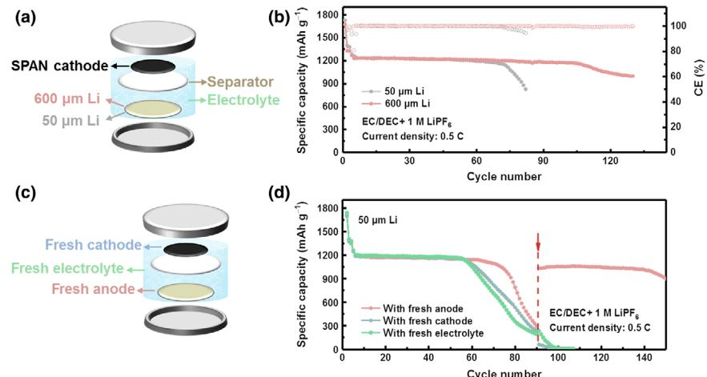
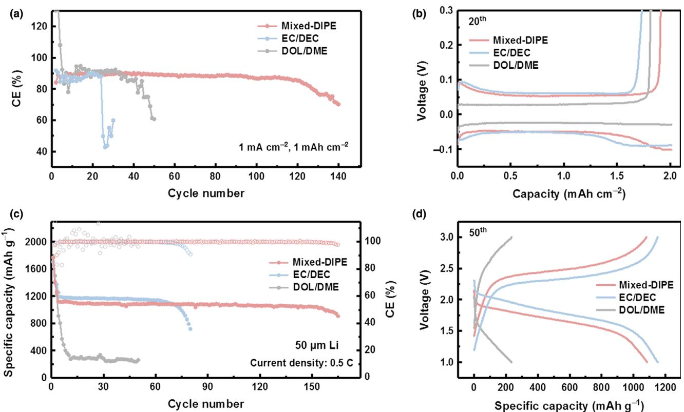
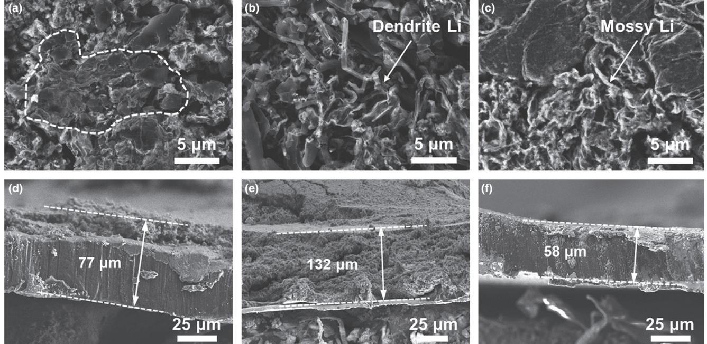
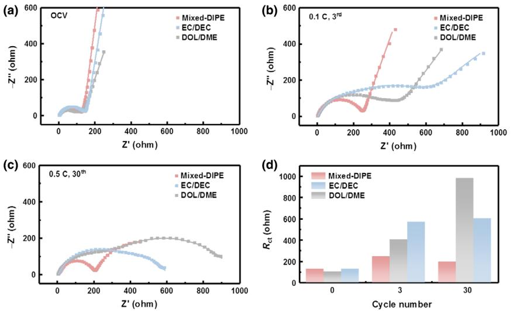
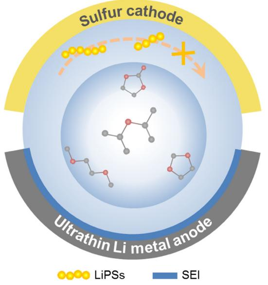

Lithium-Sulfur Batteries.

# A Mixed Ether Electrolyte for Lithium Metal Anode Protection in Working Lithium–Sulfur Batteries

Wei-Jing Chen, Chang-Xin Zhao, Bo-Quan Li , Qi Jin, Xue-Qiang Zhang, Tong-Qi Yuan[\\*](https://orcid.org/0000-0002-1854-938X) , Xitian Zhang, Zhehui Jin , Stefan Kaskel , and Qiang Zhang[\\*](https://orcid.org/0000-0002-3929-1541)

Lithium–sulfur (Li–S) battery is considered as a promising energy storage system to realize high energy density. Nevertheless, unstable lithium metal anode emerges as the bottleneck toward practical applications, especially with limited anode excess required in a working full cell. In this contribution, a mixed diisopropyl ether-based (mixed-DIPE) electrolyte was proposed to effectively protect lithium metal anode in Li–S batteries with sulfurized polyacrylonitrile (SPAN) cathodes. The mixed-DIPE electrolyte improves the compatibility to lithium metal and suppresses the dissolution of lithium polysulfides, rendering significantly improved cycling stability. Concretely, Li | Cu half-cells with the mixed-DIPE electrolyte cycled stably for 120 cycles, which is nearly five times longer than that with routine carbonate-based electrolyte. Moreover, the mixed-DIPE electrolyte contributed to a doubled life span of 156 cycles at 0.5 C in Li | SPAN full cells with ultrathin 50 lm Li metal anodes compared with the routine electrolyte. This contribution affords an effective electrolyte formula for Li metal anode protection and is expected to propel the practical applications of high-energy-density Li–S batteries.

W.-J. Chen, Prof. T.-Q. Yuan Beijing Advanced Innovation Center for Tree Breeding by Molecular Design, Beijing Forestry University, Beijing 100083, China E-mail: ytq581234@bjfu.edu.cn

W.-J. Chen, C.-X. Zhao, B.-Q. Li, Q. Jin, X.-Q. Zhang, Prof. Q. Zhang Beijing Key Laboratory of Green Chemical Reaction Engineering and Technology, Department of Chemical Engineering, Tsinghua University, Beijing 100084, China E-mail: zhang-qiang@mails.tsinghua.edu.cn

#### Q. Jin, Prof. X. Zhang

Key Laboratory for Photonic and Electronic Bandgap Materials, Ministry of Education, School of Physics and Electronic Engineering, Harbin Normal University, Harbin 150025, Heilongjiang, China

#### Prof. Z. Jin

School of Mining and Petroleum Engineering, Department of Civil and Environmental Engineering, University of Alberta, Edmonton AB T6G 1H9, Canada

#### Prof. S. Kaskel

Department of Inorganic Chemistry, Dresden University of Technology, Bergstrasse 66, Dresden 01069, Germany

Fraunhofer Institute for Material and Beam Technology, Winterbergstraße 28, Dresden 01277, Germany

The ORCID identification number(s) for the author(s) of this article can be found under<https://doi.org/10.1002/eem2.12073>.

## 1. Introduction

The ever-growing demand for sustainable energy supply stimulates the development of next-generation rechargeable battery technologies.[1] The prosperous market and system upgrading of portable electronics, electric vehicles, and smart grids substantially boost the exploitation of rechargeable batteries with higher energy density.[2] Lithium–sulfur (Li–S) battery is regarded as one of the most promising candidates considering its ultrahigh theoretical energy density of 2 600 Wh kg1 , as well as the abundance, low cost, nontoxicity, and environmental benignity of sulfur.[3,4] Generally, Li–S batteries with routine carbon/sulfur (C/S) cathodes go through complex phase transformation from solid elemental sulfur to dissolved lithium polysulfides (LiPSs) to solid lithium sulfide/disulfide (Li2S/Li2S2).[5] Unfortunately, the dissolved LiPSs diffuse to the anode side and interact with Li metal, which is noted

as the shuttle effect in a working Li–S battery.[6] The shuttle of LiPSs raises severe concerns regarding anode corrosion, reduced Coulombic efficiency, and rapid loss of active materials.[7,8] In addition, Li–S batteries with routine C/S cathode suffer from huge volume expansion and low utilization of sulfur and Li2S/Li2S2. [9]

To essentially solve the dissolution of LiPSs and resultant shuttle, sulfurized polyacrylonitrile (SPAN) was proposed as an alternative firstly reported by Wang and co-workers in 2002.[10] Although the structure of SPAN remains controversial, it is generally accepted that the active sulfur is atomically dispersed and covalently bonded to the skeleton of pyrolyzed polyacrylonitrile (PAN) chains.[11,12] In general, the SPAN cathode goes through a solid–solid conversion mechanism during discharge/charge with very limited LiPS in electrolyte.[13] Moreover, the intrinsic electronic conductivity of SPAN is higher than that of the routine C/S cathode.[14,15] These merits contribute to the promotion of sulfur utilization and the alleviation of Li metal corrosion, endowing Li–SPAN full cells with higher Coulombic efficiency close to 100% and obviously improved cycling stability.[16] Therefore, the Li–SPAN configuration is expected with great potential to realize high-energy-density Li–S batteries with long-cycling stability.

Nevertheless, to accomplish high-energy-density rechargeable batteries beyond 400 Wh kg1 , low negative/positive capacity ratio (N/P ratio) is demanded with limited anode excess.[17,18] The thickness of Li foil is therefore controlled to be 50–100 lm in a practical cell, which is only at most a quarter of that used in a coin cell (≥250 lm). Under such a rigorous condition, unstable Li anode emerges as the crucial bottleneck which limits the life span of working Li–S batteries.[19] On the one hand, heterogeneous Li plating/stripping results in the growth of Li dendrites and the formation of "dead Li" to accelerate the decomposition of electrolyte, consumption of fresh Li, and even induces severe safety hazards.[20,21] On the other hand, the corrosion of Li anode by LiPS intermediates exacerbates the above issues.[22–24] As a result, great attentions should be paid to the protection of Li metal anode in working Li–S batteries under practical conditions.

It has been proven that the Li plating/stripping behavior is determined by solid electrolyte interphase (SEI) to a large extent,[25,26] and SEI is generally formed by the reduction of electrolyte (including solvent and Li salt) on the surface of Li metal anode.[27–29] Consequently, electrolyte regulation emerges as an effective and feasible strategy for Li metal anode protection.[19] By selecting specific components of electrolyte, including solvents, Li salts,[30,31] and additives,[32,33] a more uniform, stable, and sustainable SEI can be constructed, dedicating to a more homogeneous Li plating/stripping behavior and consequently extended life span.[34,35]

The most widely employed electrolyte in Li–SPAN batteries is a carbonate-based electrolyte, that is, ethylene carbonate (EC)/diethyl carbonate (DEC) (1:1, v/v) with 1.0 M lithium hexafluorophosphate (LiPF6) as Li salt (EC/DEC for short). However, the EC/DEC electrolyte exhibits apparent incompatibility to Li anode.[36,37] Improved carbonate-based electrolyte formulation, such as fluoroethylene carbonate (FEC), has been introduced to the EC/DEC electrolyte for better compatibility in some recent works, but the protection of Li metal anode is still beyond satisfaction.[38,39] On the other hand, ether-based solvents are proved to be more compatible to Li metal than carbonates,[40] yet Li–SPAN batteries suffer from the dissolution of LiPSs in routine etherbased electrolyte (1,3-dioxolane (DOL)/1,2-dimethoxyethane (DME) (1:1, v/v) with 1.0 M lithium bis(trifluoromethanesulfonyl)imide (LiTFSI), DOL/DME for short).[23] Therefore, new formulas and insights are urgently needed for advanced electrolyte in Li–SPAN batteries with higher compatibility to Li metal anode and improved cycling stability.[41]

Considering the intrinsic compatibility toward Li metal anode, ether-based electrolyte is selected to be further improved in terms of LiPS inhibition. Several efforts have been devoted to introducing fluorinated ethers as solvents,[42,43] such as 1,1,2,2-tetrafluoroethyl-2,2,3,3 tetrafluoropropyl ether (TTE)[44–46] and 1,2-(1,1,2,2-tetrafluoroethoxy)ethane (TFEE).[47] However, excessive fluorinated ether reduces the solubility of Li salts and results in low ionic conductivity.[48] To this end, electrolyte with limited dissolved LiPS and suitable solubility of Li salts to afford sufficient ionic conductivity is highly considered.

In this contribution, a mixed diisopropyl ether (DIPE)-based electrolyte was proposed to protect Li metal anode in working Li–S batteries with SPAN cathodes. DIPE possesses suitable solubility of Li salts to afford necessary ionic conductivity, while LiPSs are difficult to be dissolved in DIPE.[49] With 50% (in volume) substitute to DOL/DME with DIPE, the compatibility of ether toward Li metal can be well maintained. In addition, 5.0% (in volume) EC is added to serve as the cathode film-forming agent. With the rationally designed mixed etherbased electrolyte, noted as mixed-DIPE, Li metal anode was effectively protected even with the employment of ultrathin Li foil (50 lm in thickness). Stable cycling for 120 cycles was achieved in Li | Cu halfcells with the mixed-DIPE electrolyte. Moreover, in Li | SPAN full cells, the life span was prolonged to 156 cycles at 0.5 C with the mixed-DIPE

electrolyte, which is twice as long as that with the routine EC/DEC electrolyte. Furthermore, dense morphology and low resistance of cycled Li metal anodes were identified as advantages of the mixed-DIPE electrolyte for Li metal anode protection.

## 2. Results and Discussion

The SPAN cathode, herein, was synthesized by annealing the mixture of sulfur and PAN powder after ball-milling, where more details can be found in corresponding Supporting information. X-ray diffraction patterns (Figure S1, Supporting Information) and Raman spectra (Figure S2, Supporting Information) were recorded to characterize the SPAN structure. C–S bonds were detected while no signal of elemental sulfur was observed in SPAN, suggesting the covalent bonding between atomic sulfur and the pyrolyzed PAN skeleton.[50,51] According to the element analysis, the sulfur content of the obtained SPAN powder was ca. 45 wt.% (Table S1, Supporting Information). The areal sulfur loading of the as-fabricated SPAN cathodes applied in this contribution was 1.0 mg cm2 in all cases.

In order to demonstrate how the excess of Li metal anode affects the cycling life span in working Li–S cells, model experiments were carried out in the first place. Li metal anodes with different thicknesses (50 or 600 lm) were paired with the SPAN cathodes (1.6 mAh cm2 ), corresponding to an anode excess of 5.2 and 74.0 times, respectively (Figure 1a). With the employment of routine carbonate-based EC/DEC electrolyte, significant differences of cycling life span were found in Li | SPAN full cells. As shown in Figure 1b, sudden capacity decay was observed in the cell with 50 lm Li at the 72nd cycle at 0.5 C (1.0 C = 1 672 mA g[S]1 ). On the contrary, no evident capacity fading was shown in the cell with 600 lm Li even after 120 cycles. Here, it should be noted that a relative high current density was imposed to rapidly distinguish the influences of anode excess on the cell cycling performance. The Li | SPAN full cells with thick Li anode (600 lm) can stably cycle for more than 350 cycles at 0.2 C as shown in Figure S3, Supporting Information, and the cycling performance was comparable with most of the reported literatures.[12,22] Therefore, it is indicated that limited excess of Li metal anode induces rapid capacity decay, which is considered as a crucial challenge in a practical working Li–S cell.

To further verify the failure mechanism of Li–SPAN cells with thin Li metal anode, the Li | SPAN full cells with 50 lm Li metal anodes were firstly cycled at 0.5 C until failure. Then, the failed cells were disassembled and replaced with fresh cathode, electrolyte, and anode, respectively (Figure 1c). As demonstrated in Figure 1d, only the cell with fresh anode can revive and continue the cycling for more than 50 cycles. In contrast, the cells with the replaced cathode or electrolyte failed to continue the cycling. These results specifically illustrate the deteriorating Li metal anode as the main reason to battery failure. The routine electrolyte EC/DEC cannot meet the requirements of long-term cycling when employing thin Li metal anodes to achieve practical high energy density. Therefore, electrolyte regulation for Li anode protection is explicitly confirmed to be vitally necessary.

With rational design of ether-based matrix and DIPE with limited LiPS solubility,[49] the proposed mixed-DIPE electrolyte exhibited superior capability for Li anode protection in Li | Cu half-cells and Li | SPAN full cells. The Li | Cu half-cells with the mixed-DIPE electrolyte exhibited a stable Coulombic efficiency (CE) about 90.0% over 120 cycles (Figure 2a). In comparison, a rapid decline of CE was

Figure 1. a) Schematic diagram of Li | SPAN full cells employing Li foils with different thickness. b) Cycling performances of Li | SPAN full cells with 50 or 600 lm Li metal anodes, respectively. c) Schematic diagram of the model experiment. The Li | SPAN full cells with 50 lm Li metal anodes were firstly cycled at 0.5 C until failure and then disassembled and replaced with fresh cathode, electrolyte, and anode, respectively. d) Cycling performances of the failed cells replaced with fresh anode, cathode, and electrolyte, respectively.

observed after 40 cycles for the DOL/DME electrolyte and only 24 cycles for the EC/DEC electrolyte. The voltage profiles with different electrolytes were not distinct at the initial cycles (Figure S4a, Supporting Information). Along with cycling, the polarization voltage of the cell with the mixed-DIPE electrolyte slightly increased to 104.0 mV at the 20th cycle (Figure 2b). However, after 30 cycles, the mixed-DIPE electrolyte afforded the lowest polarization voltage, demonstrating

Figure 2. a) Coulombic efficiency of Li | Cu half-cells with mixed-DIPE, EC/DEC, and DOL/DME electrolytes, respectively. b) Voltage–capacity profiles of Li | Cu half-cells with different electrolytes at the 20th cycle. c) Cycling performances of Li | SPAN full cells with different electrolytes and d) corresponding voltage–capacity curves at the 50th cycle.

better compatibility to Li metal anode (Figure S4b, Supporting Information).

The mixed-DIPE electrolyte was further evaluated in working Li | SPAN full cells with 50 lm ultrathin Li metal anodes. Notably, the cells with the mixed-DIPE electrolyte exhibited superior long-term cycling stability for 156 cycles at 0.5 C. The capacity only declined from 1118 (based on sulfur, herein and afterward) to 1 022 mAh g–1 , corresponding to a capacity retention of 91.4%. In contrast, the cells with the EC/DEC electrolyte rapidly failed after 68 cycles, which is merely half of that compared with the mixed-DIPE electrolyte. Moreover, the CE of the cells with the mixed-DIPE electrolyte steadily remained at nearly 100% along cycling. With regard to the cells with the DOL/DME electrolyte, it promptly failed after activation at 0.1 C. This is attributed to the imposed rigorous conditions of the applied high current density and thin Li metal anodes, since the Li | SPAN full cells with the DOL/DME electrolyte can cycle smoothly at 0.2 C and with thick Li metal anodes (Figure S5, Supporting Information). The polarization voltages of the cells with different electrolytes were similar at the 1st cycle (Figure S6a, Supporting Information). After 50 cycles, the cell with the mixed-DIPE electrolyte exhibited a slightly higher polarization voltage than that with the EC/DEC electrolyte (Figure 2d). This could be attributed to the formation of new SEI by the reaction between Li metal and DIPE. However, the polarization voltage of the cell with the mixed-DIPE electrolyte did not exhibit evident change in subsequent cycles, while the polarization was sharply increased in the cell with the EC/DEC electrolyte (Figure S6b, Supporting Information). From the remarkably prolonged cycling life span of Li | Cu half-cells and Li | SPAN full cells, it can be concluded that Li metal anode was well protected with employing the mixed-DIPE electrolyte, and a more stable SEI was formed.

Scanning electron microscopy (SEM) was conducted to observe the morphology of Li metal anodes after cycling with different electrolytes.

After 50 cycles in Li | SPAN full cells, the deposited Li with the mixed-DIPE electrolyte was compact and massive (marked area in Figure 3a). On the contrary, distinct Li dendrites can be observed in cases of EC/ DEC and DOL/DME electrolytes (Figure 3b and c). The different morphologies of Li metal anodes illustrated that the mixed-DIPE electrolyte is beneficial for suppressing Li dendrite growth and therefore guaranteeing long-term cycling of Li | SPAN batteries.[20] The thickness of the Li metal anode in full cells with the mixed-DIPE electrolyte increased from 50 to 77 lm after 50 cycles, and the dead Li accounted for 27 lm (Figure 3d). In contrast, the Li metal anode in the EC/DEC electrolyte suffered from great volume expansion with a thickness of 132 lm after cycling (Figure 3e). Although the thickness of Li anode in DOL/DME electrolyte was similar to that in the mixed-DIPE electrolyte (Figure 3f), it should be noted that due to the unaffordability of the DOL/DME electrolyte, the subsequent cycles were not as thorough as those with the mixed-DIPE electrolyte, resulting in less variations on the Li metal anode morphology and thickness. In Li | Cu half-cells after 5 cycles, similar morphology tendency was observed as in full cells. There were less Li dendrites in the cells with the mixed-DIPE electrolyte than in EC/DEC and DOL/DME electrolytes. The thickness of deposited Li with the mixed-DIPE electrolyte was only 10 lm, which is more favorable than EC/DEC and DOL/DME electrolytes (Figure S7, Supporting Information).

The interfacial evolution of Li | SPAN full cells was discovered by electrochemical impedance spectroscopy (EIS). The semicircle of the Nyquist plots in the high-frequency region was designated to the resistance of Li ion migration through the interface (Rct), which is employed as the indicator herein. At the state of open-circuit voltage (OCV), the cells with different electrolytes exhibited similar Rct values less than 150.0 ohm (Figure 4a). Significant variations appeared after activation at 0.1 C. The cells with EC/DEC and DOL/DME electrolytes displayed an obvious increase of Rct, and the resistances augmented

Figure 3. SEM images of cycled Li anodes in Li | SPAN full cells after 50 cycles at 0.5 C with a) mixed-DIPE, b) EC/DEC, and c) DOL/DME electrolytes. The corresponding cross-sectional SEM images of the Li foils with d) mixed-DIPE, e) EC/DEC, and f) DOL/DME electrolytes, respectively.

Figure 4. EIS spectra of the Li | SPAN full cells with mixed-DIPE, EC/DEC, and DOL/DME electrolytes at a) the OCV state, b) after activation at 0.1 C, and c) after cycling for 30 cycles at 0.5 C. d) The variation trends of the Rct fitting values at OCV state (cycle 0), after activation (the 3rd cycle) and at the 30th cycle, respectively.

Figure 5. Schematic diagram of the working mechanism of the mixed-DIPE electrolyte in working Li–S batteries.

further after 30 cycles at 0.5 C (Figure 4b and c). Nevertheless, the Rct of the cells with the mixed-DIPE electrolyte was much smaller, exhibiting 244.8 and 196.1 Ω for the 3rd and the 30th cycle, respectively. In short, the resistance of Li | SPAN full cells with the mixed-DIPE electrolyte firstly increased slightly and then declined with subsequent cycling (Figure 4d). On the contrary, the resistances of the cells with EC/DEC or DOL/DME electrolytes progressively increased along with cycling. The results of resistance evolution demonstrated that the mixed-DIPE electrolyte was much more compatible to Li metal anode and was efficient to construct a more stable SEI on the electrode. In addition, X-ray photoelectron spectroscopy (XPS) characterization was carried out to characterize the SEI (Figure S8, Supporting Information). By quantitative comparison of the element content, the Li metal anode after 10 cycles in the mixed-DIPE electrolyte exhibited more abundance of oxygen, which was favorable for constructing a more stable SEI with lithium oxides.

Superior electrochemical performances were demonstrated in Li–S batteries with SPAN cathodes due to the employment of the mixed-DIPE electrolyte. Specifically, the mixed-DIPE electrolyte affords superior compatibility to Li metal than routine carbonate electrolyte since the selection of ethers as solvent. Therefore, the Li | Cu half-cells were endowed with stable cycling stability. Further

electrolyte regulation by 50% substitution of DOL/DME with DIPE contributes to limited LiPS solubility, which guarantees less corrosion of Li metal anode by the LiPSs. Therefore, the prolonged cycling life span of 156 cycles was achieved in Li | SPAN full cells with ultrathin Li metal anodes. On the other hand, the ionic conductivity is well maintained because DIPE affords suitable solubility of Li salts, rendering stable cycling for the Li | SPAN full cells even at a high rate of 0.5 C (Figure 5).[49] The parasitic reactions originated from cathode (e.g., polysulfide intermediates in working Li–S batteries)[3,52,53] should be considered for electrolyte optimization to prevent the resulting corrosions to anode. The related principles can enlighten further electrolyte design toward Li metal anode protection in other Li metal batteries, such as Li | NCM and Li | LFP batteries, etc.

### 3. Conclusions

An emerging ether-based electrolyte of mixed-DIPE was proposed to forcefully protect the Li metal anode in working Li–S batteries with SPAN cathodes. Compared with routine EC/DEC or DOL/DME electrolyte, the mixed-DIPE electrolyte contributed to stable cycling for over 120 cycles in Li | Cu half-cells and superior long-term cycling stability for 156 cycles with a capacity retention of 91.4% in Li | SPAN full cells even with 50 lm ultrathin Li metal anodes. Apart from the effects on extending the cycling life span, the mixed-DIPE electrolyte was also favorable to regulate compact and massive Li deposition to reduce the interfacial resistance. This work provides a valid electrolyte regulation strategy toward Li anode protection and is expected to propel the practical applications of high-energy-density Li–S batteries.

### Acknowledgements

This work was supported by National Key Research and Development Program (2016YFA0202500 and 2016YFA0200102), National Natural Science Foundation of China (21776019, 21825501, and U1801257), and the Tsinghua University Initiative Scientific Research Program. We thank Chong Yan, Meng Zhao, and Prof. Jia-Qi Huang for helpful discussion.

# Conflict of Interest

The authors declare no conflict of interest.

## Supporting Information

Supporting Information is available from the Wiley Online Library or from the author.

### Keywords

full cells, lithium anode protection, lithium–sulfur batteries, mixed diisopropyl ether-based electrolyte, sulfurized polyacrylonitrile cathode

Received: January 20, 2020

Revised: February 13, 2020 Published online: February 21, 2020

- [1] X. Zeng, M. Li, D. Abd El-Hady, W. Alshitari, A. S. Al-Bogami, J. Lu, K. Amine, Adv. Energy Mater. 2019, 9, 1900161.
- [2] Y. Liang, C. Z. Zhao, H. Yuan, Y. Chen, W. Zhang, J. Q. Huang, D. Yu, Y. Liu, M. M. Titirici, Y. L. Chueh, H. Yu, Q. Zhang, InfoMat 2019, 1, 6.
- [3] H.-J. Peng, J.-Q. Huang, X.-B. Cheng, Q. Zhang, Adv. Energy Mater. 2017, 7, 1700260.
- [4] L. Bo, F. Ruyi, X. Dong, Z. Wenkui, H. Hui, X. Yang, W. Xiuli, X. Xinhui, T. Jiangping, Energy Environ. Mater. 2018, 1, 196.
- [5] B. Q. Li, L. Kong, C. X. Zhao, Q. Jin, X. Chen, H. J. Peng, J. L. Qin, J. X. Chen, H. Yuan, Q. Zhang, J. Q. Huang, InfoMat 2019, 1, 533.
- [6] S.-Y. Li, W.-P. Wang, H. Duan, Y.-G. Guo, J. Energy Chem. 2018, 27, 1555.
- [7] H. Yuan, H.-J. Peng, J.-Q. Huang, Q. Zhang, Adv. Mater. Interfaces 2019, 6, 1802046.
- [8] R. Fang, S. Zhao, Z. Sun, W. Wang, H.-M. Cheng, F. Li, Adv. Mater. 2017, 29, 1606823.
- [9] H. Yuan, H.-J. Peng, B.-Q. Li, J. Xie, L. Kong, M. Zhao, X. Chen, J.-Q. Huang, Q. Zhang, Adv. Energy Mater. 2019, 9, 1802768.
- [10] J. L. Wang, J. Yang, J. Y. Xie, N. X. Xu, Adv. Mater. 2002, 14, 963.
- [11] W. Wang, Z. Cao, G. A. Elia, Y. Wu, W. Wahyudi, E. Abou-Hamad, A.-H. Emwas, L. Cavallo, L.-J. Li, J. Ming, ACS Energy Lett. 2018, 3, 2899.
- [12] Z.-Q. Jin, Y.-G. Liu, W.-K. Wang, A.-B. Wang, B.-W. Hu, M. Shen, T. Gao, P.-C. Zhao, Y.-S. Yang, Energy Storage Mater. 2018, 14, 272.
- [13] K. Wang, Y. Guan, Z. Jin, W. Wang, A. Wang, J. Energy Chem. 2019, 39, 249.
- [14] J. Ye, F. He, J. Nie, Y. Cao, H. Yang, X. Ai, J. Mater. Chem. A 2015, 3, 7406.
- [15] S. Yang, Q. Liu, Q. Lu, E. Zhang, U. S. F. Arrozi, H. Li, S. Kaskel, F. Xu, H. Wang, Energy Technol. 2019, 7, 1900583.
- [16] H. Yang, J. Chen, J. Yang, J. Wang, Angew. Chem. Int. Ed. Engl. 2020, <https://doi.org/10.1002/anie.201913540>
- [17] S. Chen, C. Niu, H. Lee, Q. Li, L. Yu, W. Xu, J.-G. Zhang, E. J. Dufek, M. S. Whittingham, S. Meng, J. Xiao, J. Liu, Joule 2019, 3, 1094.
- [18] G. Wei, F. Yongzhu, Energy Environ. Mater. 2018, 1, 20.
- [19] X.-B. Cheng, C. Yan, J.-Q. Huang, P. Li, L. Zhu, L. Zhao, Y. Zhang, W. Zhu, S.-T. Yang, Q. Zhang, Energy Storage Mater. 2017, 6, 18.
- [20] X.-B. Cheng, R. Zhang, C.-Z. Zhao, Q. Zhang, Chem. Rev. 2017, 117, 10403.
- [21] R. Zhang, N.-W. Li, X.-B. Cheng, Y.-X. Yin, Q. Zhang, Y.-G. Guo, Adv. Sci. 2017, 4, 1600445.
- [22] S. Wei, L. Ma, K. E. Hendrickson, Z. Tu, L. A. Archer, J. Am. Chem. Soc. 2015, 137, 12143.
- [23] X. Chen, L. Peng, L. Wang, J. Yang, Z. Hao, J. Xiang, K. Yuan, Y. Huang, B. Shan, L. Yuan, J. Xie, Nat. Commun. 2019, 10, 1021.
- [24] X. Wang, Y. Qian, L. Wang, H. Yang, H. Li, Y. Zhao, T. Liu, Adv. Funct. Mater. 2019, 29, 1902929.
- [25] X.-Q. Zhang, X.-B. Cheng, Q. Zhang, Adv. Mater. Interfaces 2018, 5, 1701097.
- [26] C. Yan, H.-R. Li, X. Chen, X.-Q. Zhang, X.-B. Cheng, R. Xu, J.-Q. Huang, Q. Zhang, J. Am. Chem. Soc. 2019, 141, 9422.
- [27] X.-B. Cheng, R. Zhang, C.-Z. Zhao, F. Wei, J.-G. Zhang, Q. Zhang, Adv. Sci. 2016, 3, 1500213.
- [28] C. Yan, X.-B. Cheng, C.-Z. Zhao, J.-Q. Huang, S.-T. Yang, Q. Zhang, J. Power Sources 2016, 327, 212.
- [29] X. Chen, T.-Z. Hou, B. Li, C. Yan, L. Zhu, C. Guan, X.-B. Cheng, H.-J. Peng, J.-Q. Huang, Q. Zhang, Energy Storage Mater. 2017, 8, 194.
- [30] R. Younesi, G. M. Veith, P. Johansson, K. Edstrom, T. Vegge, Energy Environ. Sci. 2015, 8, 1905.
- [31] M. Nie, B. L. Lucht, J. Electrochem. Soc. 2014, 161, A1001.
- [32] X.-Q. Zhang, X.-B. Cheng, X. Chen, C. Yan, Q. Zhang, Adv. Funct. Mater. 2017, 27, 1605989.
- [33] H. Zhang, G. Gebresilassie Eshetu, X. Judez, C. Li, L. M. Rodriguez-Martinez, M. Armand, Angew. Chem. Int. Ed. Engl. 2018, 57, 15002.
- [34] X.-Q. Zhang, X. Chen, X.-B. Cheng, B.-Q. Li, X. Shen, C. Yan, J.-Q. Huang, Q. Zhang, Angew. Chem. Int. Ed. Engl. 2018, 57, 5301.
- [35] X.-Q. Zhang, X. Chen, L.-P. Hou, B.-Q. Li, X.-B. Cheng, J.-Q. Huang, Q. Zhang, ACS Energy Lett. 2019, 4, 411.
- [36] K. Xu, Chem. Rev. 2014, 114, 11503.
- [37] M. D. Tikekar, S. Choudhury, Z. Tu, L. A. Archer, Nat. Energy 2016, 1, 16114.
- [38] Z. Chen, J. Zhou, Y. Guo, C. Liang, J. Yang, J. Wang, Y. Nuli, Electrochim. Acta 2018, 282, 555.
- [39] H. Yang, A. Naveed, Q. Li, C. Guo, J. Chen, J. Lei, J. Yang, Y. Nuli, J. Wang, Energy Storage Mater. 2018, 15, 299.
- [40] D. Aurbach, J. Power Sources 2000, 89, 206.
- [41] W. J. Chen, B. Q. Li, C. X. Zhao, M. Zhao, T. Q. Yuan, R. C. Sun, J. Q. Huang, Q. Zhang, Angew. Chem. Int. Ed. Engl. 2020, [https://doi.org/10.](https://doi.org/10.1002/anie.201912701) [1002/anie.201912701](https://doi.org/10.1002/anie.201912701)
- [42] C. Qu, Y. Chen, X. Yang, H. Zhang, X. Li, H. Zhang, Nano Energy 2017, 39, 262.
- [43] X. Wang, Y. Tan, G. Shen, S. Zhang, J. Energy Chem. 2020, 41, 149.
- [44] N. Azimi, Z. Xue, I. Bloom, M. L. Gordin, D. Wang, T. Daniel, C. Takoudis, Z. Zhang, ACS Appl. Mater. Interfaces 2015, 7, 9169.
- [45] M. L. Gordin, F. Dai, S. Chen, T. Xu, J. Song, D. Tang, N. Azimi, Z. Zhang, D. Wang, ACS Appl. Mater. Interfaces 2014, 6, 8006.
- [46] C. Zu, N. Azimi, Z. Zhang, A. Manthiram, J. Mater. Chem. A 2015, 3, 14864.
- [47] S. Drvaric Talian, S. Jeschke, A. Vizintin, K. Pirnat, I. Arcon, G. Aquilanti, P. Johansson, R. Dominko, Chem. Mater. 2017, 29, 10037.
- [48] Q. Pang, X. Liang, C. Y. Kwok, L. F. Nazar, Nat. Energy 2016, 1, 16132.
- [49] K. Sun, Q. Wu, X. Tong, H. Gan, ACS Appl. Energy Mater. 2018, 1, 2608.
- [50] J. Fanous, M. Wegner, J. Grimminger, A. Andresen, M. R. Buchmeiser, Chem. Mater. 2011, 23, 5024.
- [51] Z. Li, J. Zhang, Y. Lu, X. W. Lou, Sci. Adv. 2018, 4, aat1687.
- [52] C. Yan, X.-Q. Zhang, J.-Q. Huang, Q. Liu, Q. Zhang, Trends Chem. 2019, 1, 693.
- [53] C. Song, C. Peng, Z. Bian, F. Dong, H. Xu, J. Yang, S. Zheng, Energy Environ. Mater. 2019, 2, 216.