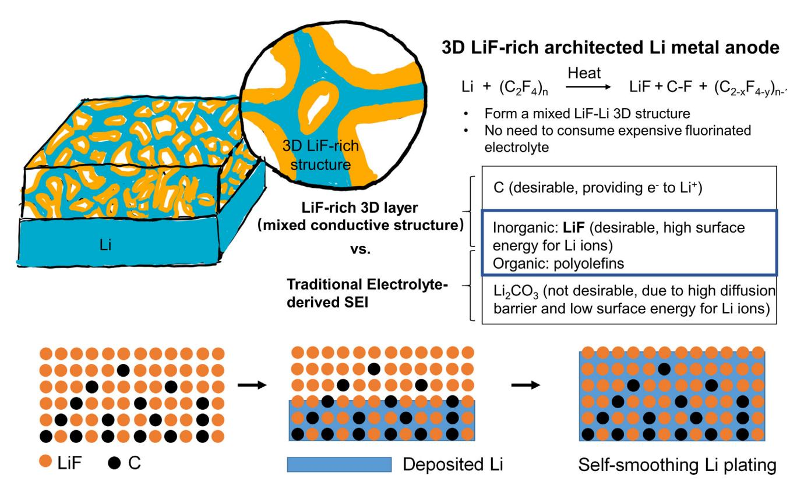
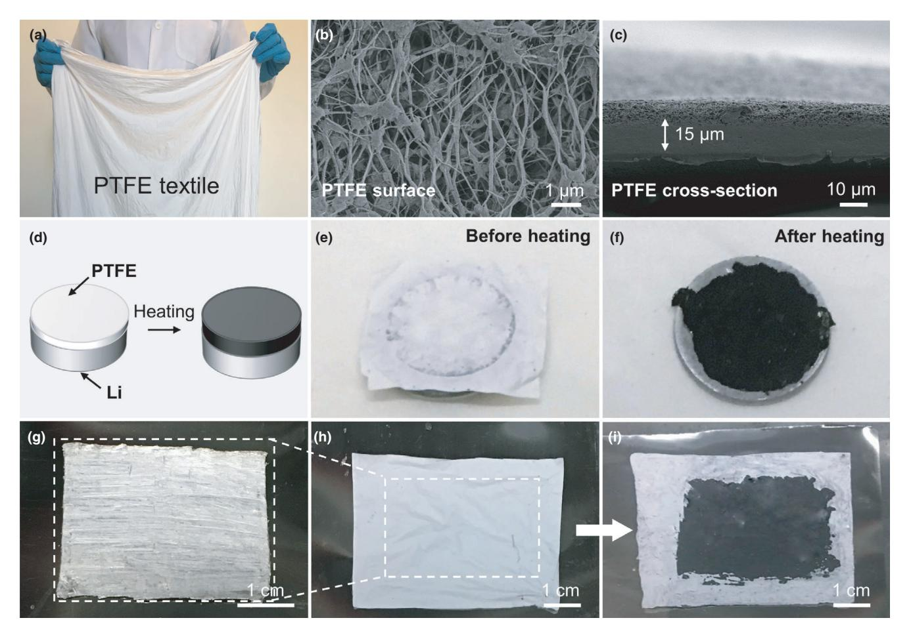
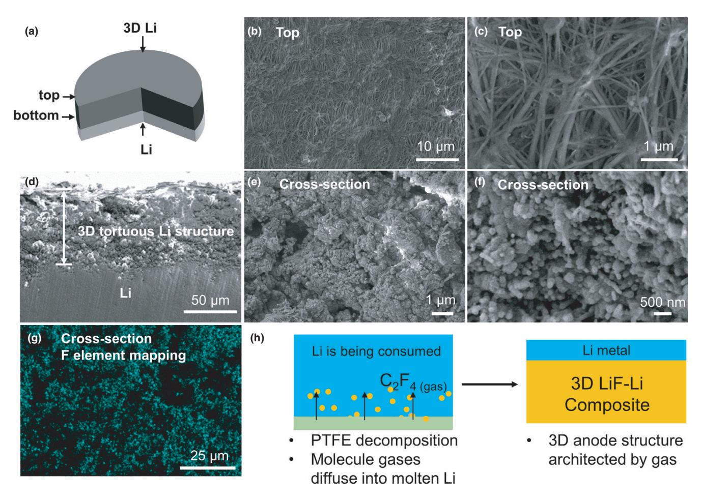
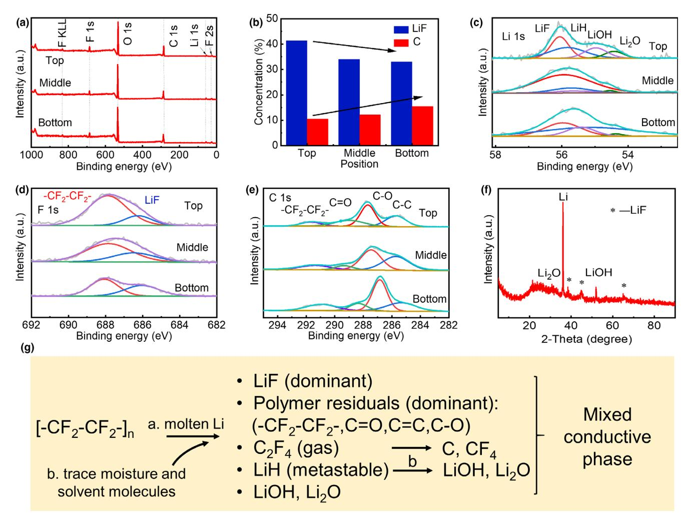
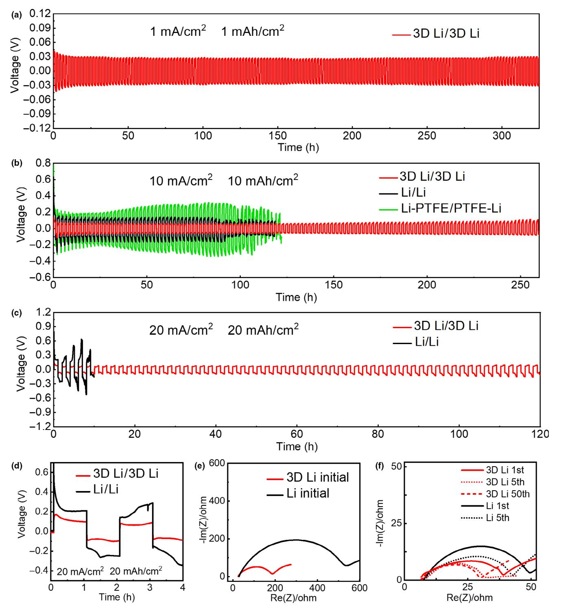
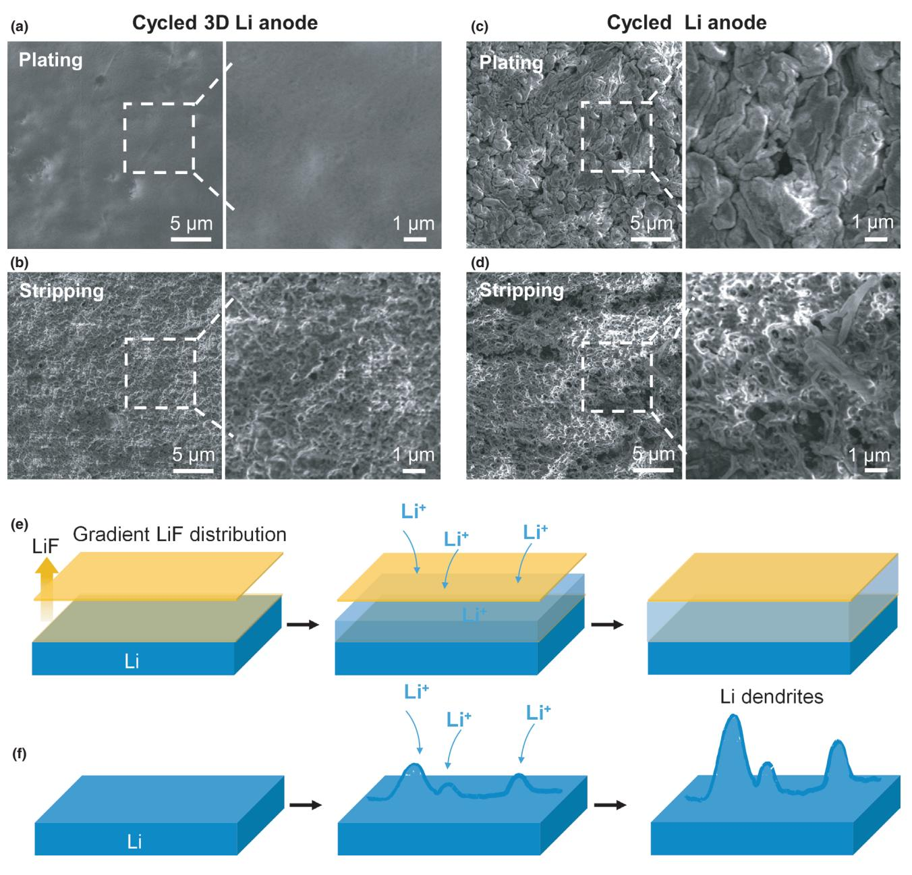

# Scalable Synthesis of LiF-rich 3D Architected Li Metal Anode via Direct Lithium-Fluoropolymer Pyrolysis to Enable Fast Li Cycling

Yuanyuan Shang, Tiankuo Chu, Baohui Shi, and Kun(Kelvin) Fu\*

Lithium metal anode holds an important position in fast-charging batteries. But lithium dendrite issues tend to exacerbate at high currents. LiF can be considered as an effective way to improve the Li metal surface electrochemical stability to achieve high power and high energy. However, most of reported work are relying on in situ formation of a 2D LiF on Li metal in liquid electrolyte, which limits the scalability and plated Li quantity. Here, we address this challenge and report a scalable synthesis of LiF-rich 3D architected Li metal anode via a direct pyrolysis of molten lithium and fluoropolymer to enable fast Li charging with high current density (20 mA cm2 ) and high areal capacity (20 mAh cm2 ). The 3D structure is synthesized by the pyrolysis of fluoropolymer with Li metal and results show high similarity to the pristine electrolyte-derived solid-electrolyte-interphase (SEI). This concept using pyrolysis of fluoropolymer with Li-containing active materials could be also extended to modify Li metal oxide cathode (e.g., LiNi0.5Mn1.5O4) for mixed conductive interphase and engineer Li solid ion conductors (e.g., Li garnet-type oxides) for interface stabilization and framework design.

# 1. Introduction

Fast charging of electrochemical energy storage has been identified as a critical challenge to ensure mass adoption of electrical vehicles and curb greenhouse gas emissions.[1,2] Lithium metal anode holds an important and promising position toward next-generation high-power and highenergy batteries for its low voltage and high capacity.[3,4] But lithium dendrite formation impedes Li-metal battery development toward fastcharging capability.[5–7] Reportedly, computational and experimental efforts have been made including applying computation modeling and characterizations to understand lithium dendrite formation as well as

#### DOI: 10.1002/eem2.12099

failure principles in batteries[8–14] and provide effective thoughts and strategies, through stabilizing Li dendrite growth or suppressing Li dendrite, such as nanostructure design, surface engineering and modification, functional polymer coating, three-dimensional structural framework, and inorganic solid electrolytes, to mitigate the adverse effects.[15–24] Creating an LiF-rich lager has been widely considered as an effective way to suppress and mitigate Li dendrite formation, and recent work using LiF-rich coating layer or high-concentration full-fluoride electrolytes have successfully been proved to stabilize Li metal.[25–27] However, most of reported work are relying on in situ formation of a 2D LiF on Li metal in liquid electrolyte, which limits the scalability and plated Li quantity.

Here, we address this challenge and report a scalable synthesis of LiF-rich 3D architected Li metal anode via a direct pyrolysis of molten lithium and fluoropolymer to enable fast Li charging with high current density

(20 mA cm2 ) and high areal capacity (20 mAh cm2 ) (Figure 1). The 3D LiF-rich structure is architected by the pyrolysis of fluoropolymer with molten Li, where fluoropolymer can be decomposed into small polyolefins molecules and gases. Main inorganic components including LiF, LiH, LiOH, and Li2O, organic components including - CF2-CF2-, C-O, C=O, C=C, and amorphous carbon coming from the C2F4 decomposition. The 3D structure is formed by those small molecules and gases derived from PTFE decomposition that migrate into the molten Li to form a porous 3D architecture. The Li metal composite features as an artificial LiF-rich mixed conductive interphase protection layer, with high similarity (~87%) to electrolyte-derived solid-electrolyte-interphase (SEI) components including inorganic (LiF, LiH, LiOH, and Li2O) and organic (C=O, C=C, C-O, and other polyolefins) materials. The atomic concentration was carried out to examination the porous structure, and results indicate there is a concentration gradient containing carbon and LiF from the top to the bottom of the porous structure, since LiF is the typical and representative component in the pyrolyzed materials, thus we consider the structure as a mixed electronion phase structure as well.

In this 3D structure, highly concentrated LiF and polyolefins components are favorable to enable a uniform Li plating due to high surface energy and better electrolyte wetting,[25–28] which could benefit vigorous Li plating and host large amount of Li. The low content elemental

Y. Shang, T. Chu, B. Shi

Department of Mechanical Engineering, University of Delaware, Newark DE 19716, USA

Prof. Kun (Kelvin) Fu

Department of Mechanical Engineering, University of Delaware, Newark DE 19716, USA

E-mail: kfu@udel.edu

Center for Composite Materials (CCM), University of Delaware, Newark DE 19716, USA

E-mail: kfu@udel.edu

The ORCID identification number(s) for the author(s) of this article can be found under [https://doi.org/10.1002/eem2.12099.](https://doi.org/10.1002/eem2.12099)

Figure 1. Schematic of 3D LiF-rich architected Li metal composite. The 3D structure is architected by the pyrolysis of fluoropolymer with molten Li, and the resulting product, an LiF-rich mixed conductive interphase, features a thick 3D porous structure with high similarity to the electrochemical SEI main components including LiF and organic polyolefins materials. Rich LiF and non-Li2CO3 allow uniform Li plating at high current density and high areal capacity in the 3D LiF-rich architected Li metal anode. The carbon in the reaction formula comes from the carbon backbone structure in C2F4 after decomposition. The carbon in the schematic on the bottom indicates amorphous carbon derived from carbonization of C2F4.

carbon on top could form a less electron-conducting surface compared with the bottom, so as to ensure a minimum Li deposition on top and form a dendrite-free surface and prevent Li dendrite out-of-plane growing. Eliminating Li2CO3, due to the low surface energy and poor wetting,[29] could largely decrease the Li dendrite formation. Tuning surface-energy could effectively suppress Li dendrite,[28] and therefore, our pyrolysis of fluoropolymer with molten Li provides a new strategy to create an in situ formed SEI composite structure with rich favorable LiF component. However, compared to those using high-cost deposition technique or salt for electrolyte, this work using low-cost polymer membrane and direct pyrolysis process could be a more practical strategy to produce mixed conductive interphase on Li metal anode for scalable manufacturing.

# 2. Results and discussion

#### 2.1. Synthesis of 3D LiF-rich Li Composite

Preparation of 3D Li anode structure is a scalable and facile process. Polytetrafluoroethylene (PTFE) polymer is selected as the F source due to its simple and fully F occupied chemical structure, forming rich LiF during its pyrolysis with Li metal. PTFE textile (Figure 2a) consisting of intertwined fibers has a porous structure with high surface area, allowing good contact with molten Li and fast gas generation from PTFE decomposition. The gas of decomposed PTFE architects 3D Li anode structure, and its byproduct from reacting with Li forms the artificial 3D mixed conductive interphase structure. PTFE textile exhibits a porous fibrous structure and a thickness of 15 um (Figure 2b,c). Its good mechanical strength allows ease of handling and roller pressing with Li metal to ensure good contact before heating (Figure 2d). The pyrolysis of PTFE with lithium metal at over 200 °C in an inert gas environment produced a dark coating layer (Figure 2e,f). We also demonstrate the potential scalable manufacturing of the 3D Li anode as shown in Figure 2g–i. The pyrolysis process can be designed into a roll-to-roll process for a large-scale production.

### 2.2. Morphology and Composition Characterizations of 3D LiF Structure

Morphological characterizations and proposed 3D Li anode formation schematic are shown in Figure 3. Top (away from Li metal) and bottom (close to Li metal) sides of 3D LiF structure are indicated in schematic Figure 3a. The pyrolysis of PTFE with molten Li forms a thick, and the porous 3D LiF by consuming plain and dense Li metal. The 3D Li anode remains a porous and fibrous structure on the top side (Figure 3b, c). Since the top did not touch with molten Li directly during pyrolysis process, the formation of fibrous PTFE-Li structure might be

Figure 2. Pyrolysis of fluoropolymer (e.g., PTFE) with molten Li to synthesize the 3D LiF-rich Li metal composite. a) A large piece of PTFE textile. b,c) SEM images of the PTFE surface showing highly porous and fibrous structure and its cross-section with a thickness of ~ 15 um. d) Schematic of 3D Li anode manufacturing process. PTFE turned to black after reacting with molten Li, indicating the pyrolysis of PTFE with Li and formation of 3D mixed conductive interphase. e,f) Photograph images of PTFE fabric before and after pyrolysis with molten Li metal. g-i) A large piece of 3D Li anode processing demonstration.

due to the vigorous pyrolysis reaction along PTFE fiber structure. Reaction products can be referred to Figure 4. The hybrid inorganic and organic components in the fibrous structure help to maintain a robust mechanical structure for the 3D Li anode. In the cross-section, a thick micro/nanoporous, tortuous, and granulated 3D Li anode structure with high surface area (Figure 3d-f) and extensive F elemental distribution (Figure 3g) were formed, in a contrast of a plain and dense Li sitting on bottom. This interior morphology shows a different structure from the fibrous layer on top (Figure 3d). PTFE textile has only a thickness of 15 um, the as-formed ~70 µm thick 3D Li anode is highly due to the reaction Li metal with small molecules and gases (e.g., C2F4) from decomposed PTFE, and the expansion caused from pyrolysis creates a porous structure. Our result shows that pure Li with 30 µm thick expanded to 70 µm thick 3D structure after pyrolizing with PTFE, and the estimated volume is ~57% in the 3D porous structure. The flow of gas inside of molten Li and consequential reactions forms the hierarchical 3D structure. The 3D LiF synthesis schematic is proposed in Figure 3h. We name the pristine Li before reacting with Li as "mother" Li since it provides the Li for porolysis. Pyrolysis of PTFE produces small molecules and gases, and they are migrating into the interior of molten Li and reacting with it. In brief, this is a gas-reaction process by

consuming mother Li with small molecules and gases (e.g., C2F4) from decomposed PTFE during their pyrolysis reaction to form 3D Li anode structure. This gas-reaction process creates the 3D nanoporous and tortuous structure. When zoomed-in, a hierarchical nanoporous structure can be observed (Figure 3e–f), confirming the gas-reaction process as proposed in Figure 3g. Our work indicates that increase of PTFE membrane thickness could increase the 3D Li anode thickness with a good mechanical stability (Figure S1). FTIR results of 3D Li from top to bottom confirms that PTFE was completed pyrolyzed, and no PTFE was remained at the top and the bottom of the 3D Li (Figure S2).

Composition characterizations are applied to identify the hybrid inorganic and organic components in mixed conductive interphase of 3D Li anode (Figure 4). To exclude the influence of the bottom Li metal to the characterization results, we removed the 3D porous structure from the bottom Li metal and applied characterization techniques to examine the 3D porous layer. The products of the gas-reaction with Li from small molecules and gases make up a hybrid inorganic and organic layer, which is highly similar to electrochemically electrolytedecomposed SEI. We probed different places of the 3D porous structure from top to bottom by coupling the technique with ion milling. As shown in Figure 4a, XPS results show the existence of C, O, F, and Li

Figure 3. Morphological characterizations and proposed mechanism of 3D LiF-rich structure. a) Schematic of thick 3D LiF structure synthesized by the pyrolysis of thin fluoropolymer material (e.g., PTFE) with molten Li. b,c) Top surface morphology of 3D LiF structure. d-f) Cross-section view of 3D Li anode showing the formation of a thick porous, tortuous, and granulated structure with high surface area. g) F elemental mapping in cross-section of 3D Li structure. h) Schematic of proposed Li composite with 3D LiF formation by directly consuming mother Li with small molecules and gases (e.g., C2F4) from decomposed PTFE during their pyrolysis reaction.

element from top to the bottom of 3D Li anode. The LiF and C percentage atomic concentration distribution exhibit a graded distribution from top to bottom (Figure 4b). LiF is the most dominant component with a decreasing distribution from 40% on top to 33% on bottom. Elemental carbon is also detected with an increasing distribution from 10% on top to 15%. Elemental carbon should come from the C2F4 decomposition. The XPS analysis of Li, F, and C suggests that the pyrolysis of PTFE with molten Li produced a highly similar composite material to the electrochemically electrolyte-decomposed SEI. Main inorganic components including LiF, LiH, LiOH, and Li2O, and organic components including -CF2-CF2-, C-O, C=O, C=C are detected from top to bottom of the 3D Li anode (Figure 4c–e). The H and O might come from trace amount of air, moisture and solvent molecules from glovebox and being trapped PTFE. X-ray diffraction (XRD) result confirms the key components in the 3D Li anode structure, including Li, LiF, and other Li compound (Figure 4f). Thermogravimetric analysis also confirms the key components as XPS and XRD suggested in the 3D Li anode structure (Figure S3). Here, we list all the possible reactions between PTFE and Li, and trace amount of moisture and solvent molecules may participate the reaction as well, shown in Figure 4g. In the 3D Li anode structure, LiF is the most favorable component, due to its high surface energy and low diffuse barrier for Li ions, to suppress Li dendrite formation and promote uniform Li deposition during plating.[26,27] The mixed components (e.g., LiF and elemental carbon) are serving as a mixed ion-electron conducting SEI to ensure the uniform deposition of Li within the porous 3D LiF-rich host.

#### 2.3. Electrochemical Characterizations of Symmetric LiF-rich Li Metal Anode

We tested the 3D LiF-rich anode in symmetric cell at increasing current density and capacity from 1 to 20 mA2 with 1 and 20 mA cm2 , respectively. Symmetric cells showed a good cycling stability, especially at 20 mA cm2 and 20 mAh cm2 (Figure 5). Under small current and capacity Li cycling at 1 and 1 mAh cm2 , a stable voltage as a function of time profile indicates a good stability of the 3D Li anode (Figure 5a). With an increase in current and capacity, symmetric 3D Li anode maintains a stable cycling with a lower voltage than the control, and over 250 h cycling during vigorous Li stripping/plating at

Figure 4. Composition characterizations of 3D LiF-rich structure. a) XPS of the 3D Li anode showing key elements (Li, F, C, O) distribution through sample thickness. b) Atomic concentration shows a graded distribution of LiF and C through thickness of 3D porous structure. c-e) XPS spectra of Li 1s, F 1s, and C 1s in top, middle, and bottom position. f) XRD profile confirming Li and LiF and carbon in the 3D Li anode. g) Proposed chemical reactions between PTFE and Li during pyrolysis. The key components are LiF and polymer residuals, similar to the main constituents of SEM.

10 mA cm2 and 10 mAh cm2 was survived (Figure 5b). In comparison, symmetric pure Li cell failed with a sign of short-circuit after ~100 h when tested at 10 mA cm2 and 10 mAh cm2 . In addition, symmetric pure Li having two additional PTFE textiles sandwiched in between were tested as well and it exhibited a similar failure time (~100 h) to the pure Li symmetric cell. Two control samples suggest that distance between Li and Li anode in symmetric cell may not be the dominating factor resulting in the short-circuit failure caused by vigorous Li dendrite growth during striping/plating. Under a much higher current and capacity testing condition (20 mA cm2 and 20 mAh cm2 ), though it is rare to see reportedly, 3D Li anode indeed survived over 120 h cycling without obvious sign of abrupt voltage increase (Figure 5c). But for pure Li anode, sharp voltage and abrupt voltage vibration occurred at 5 h and short-circuited at 10 h. In the first few hours of cycling, voltage profiles demonstrate the advantage of 3D Li anode over pure Li anode in lower voltage and stable voltage (Figure 5d), and small impedance (Figure 5c). 3D Li anode cell maintained a stable impedance from 5th to 50th cycle (Figure 5f). We

contribute the high current and high capacity as well as stable impedance to the 3D Li anode design and the mixed conductive interphase. The full cell of LiF-rich Li/LiFePO4 (LFP) was also measured in this work. We utilized the LiF-rich Li as the anode, and the cathode was LFP. The loading of LFP active material is about 3 mg cm2 . As is shown in Figure S4, the discharge capacity of the cell remains about 138 mAh g1 with quasi-unchanged charge-discharge profiles over 50 cycles at 2.0 °C (1.0 °C = 170 mA g1 ).

#### 2.4. Cycled morphology change and underlying principle

Cycled cells were disassembled and cycled 3D Li anode showed a uniform and smooth surface for both of samples after plating and stripping Li, while cycled pure Li anode exhibited a non-uniform and porous surface after plating and stripping Li (Figure 6a–d). Electrodes were rinsed with dimethyl ether (DME) solvent to remove residual electrolytes and dried in the vacuum chamber of the glove box before

Figure 5. Vigorous Li stripping/plating performance in symmetric cell testing. a-c) Voltage profiles of symmetric 3D Li anode cell (3D Li/ 3D Li) as a function of cycling time under increasing current density (1, 10, and 20 mA/cm2 ) and capacity (1, 10, and 20 mAh/cm2 ). Control cells are named as symmetric pure Li (Li/ Li) and symmetric pure Li with PTFE textiles sandwiched in between (Li-PTFE/ PTFE-Li). d) Comparison in voltage profiles of 3D Li and pure Li during initial few hours. 3D Li anode exhibited a lower and stable voltage compared with pure Li. e,f) Electrochemical impedance spectroscopy (EIS) profiles of symmetric 3D Li anode showing a lower and stable impedance with extended cycling for the cell cycled at 20 mA/cm2 and 20 mAh/cm2 .

taking analysis. In the cross-section, cycled 3D Li had a relatively dense cross-section morphology (Figure S5-6) but cycled pure Li had a pulverized morphology (Figure S7–S8). The interior morphology of cycled 3D Li can apparently show the micro-pore structure change by plated Li and stripped Li. The underlying principle is schematically given in Figure 6e–f. The mixed conductive interphase containing

Figure 6. Morphological characterizations of cycled anode and its schematically underlying principle. a,b) Surface morphology of 3D Li after 5th plating and stripping at 20 mA/cm2 and 20mAh/cm2 showing a smooth surface and no dendrite is observed. c,d) Surface morphology of pure Li showing a rough surface with rich Li dendrites. e,f) Schematics of Li plating process showing artificial 3D mixed conductive interphase containing highly concentrated Lif could trap Li metal plating and enable a dendrite-free fast charging. In contrast, pure Li suffers a vigorous Li dendrite growth and unstable SEI formation.

highly concentrated LiF on top and highly concentrated elemental carbon on bottom could confine and trap Li plating into the porous structure, which is in-plane Li plating. Due to the preferable low diffusion barrier and high surface energy for Li ions, LiF enables Li ions to grow and deposit within or along the granulated and rough surface to form a dense and uniform surface and cross-section morphology. The 3D mixed conductive interphase with porous structure and distributed LiF and elemental carbon, enhancing further SEI formation and forming a stable and dense SEI, can accommodate Li and guide its uniform deposition, as evidenced by a smooth and dense morphology observed in

the cycled sample. The 3D mixed conductive interphase from pyrolizing fluoropolymer with molten Li can be also considered as an in situ formation of highly LiF concentrated SEI process. Different from depositing a LiF rich barrier layer on surface of Li or creating a high concentration fluorine-donating salt on Li metal,[25–27] which requires slow and small-scale deposition technique or high-cost electrolyte salt, out direct pyrolysis of fluoropolymer strategy is practical to produce a meter-scale Li composite for fast-charging application. Since pure Li anode lacks a stable SEI, non-uniform distribution of Li results in quick dendrite formation and finally battery failure. In short, the 3D Li structure though pyrolysis of fluoropolymer with Li creates a unique artificial 3D mixed conductive interphase structure containing graded distributed LiF and elemental carbon, by creating a high surface energy and less electron-conducting surface, uniformly guiding homogeneous Li deposition and growth within the hierarchical 3D structure.

# 3. Conclusion

In this work, we design a 3D LiF-rich architected Li metal composite to enable the fast Li plating with high current density (20 mA cm2 ) with high areal capacity (20 mAh cm2 ). The concept is based on the pyrolysis of fluoropolymer to architect a 3D LiF-rich porous structure to direct the uniform Li plating and host the deposition with large quantity. The 3D LiF-rich anode features the functionality of a mixed conductive interphase structure and mixed electron-ion conductor. The pyrolyzed fluoropolymer and Li have a high similarity to electrochemical SEI composition, containing inorganic and organic components. This strategy using pyrolysis of fluoropolymer with molten Li is more practical to produce a meter-scale pre-formed mixed conductive interphase which is more suitable for scalable and roll-to-roll manufacturing. This concept of using pyrolysis of fluoropolymer with active materials can be also extended to modify Li compound cathode for mixed conductive interphase or engineer Li solid ion conductors for interface stabilization and framework design.

# 4. Experimental Section

Materials Preparation: PTFE textile with a thickness of 15 um was covering a fresh lithium (purchased from Sigma, and treated before using), followed by heating at 250°C for 30 min. The pyrolysis process was carried out in argon-filled glovebox. To assemble LiF-rich Li | LiFePO4 full cells, the LiFePO4 material powder (80%), carbon black as a conductive additive (16%), and polyvinylidene fluoride as a binder (4%) are used in mixed in N-Methyl pyrrolidone (NMP), and then ball milled for 3 h to form a uniform slurry, and the slurry was coated on aluminum foil by rolling to obtain a laminate. The laminate was dried in a vacuum oven at 80 °C for 22 h, and then cut into discs with a diameter of 11 mm.

Characterizations: XRD analysis was conducted with a Rigaku MiniFlex II Xray diffraction instrument using Cu Ka radiation, run at 15 mA and 30 kV. X-ray diffraction patterns were recorded from 5 to 90° 2h. Scanning electron microscopy (SEM) observations were performed on JEOL-7100F. Energy-dispersive X-ray diffraction spectra were recorded using an Oxford IE250 system. X-ray photoemission spectroscopy measurements were performed with a Physical Electronics Quantera Scanning X-ray Microprobe. The FTIR spectrum was obtained by a Bruker Vertex 70 FTIR spectrometer.

Electrochemical Testing: Bare Li metal was cut into discs by a punch machine (MTI Corporation). Symmetrical MTI type-2032 coin cells were constructed with two identical electrodes inside an Mbraun MB-200B argon-filled glove box; 1 M Li hexafluorophosphate (LiPF6) in cosolvent of ethylene (EC) and diethyl carbonate (DEC) (1:1 vol %) was used as the electrolyte. The similar electrolyte is used in the full cells. Battery testing was performed with a 96-channel battery tester (Neware Instruments) under a constant-current charge and discharge mode. Electrochemical impedance was measured over the frequency from 0.1 Hz to 200 kHz on an electrochemical workstation (BioLogic Science Instruments, VMP3) at room temperature. After cycling, the cell was disassembled and the electrode is washed by dimethyl ether (DME) organic solvent three time in glovebox to remove the Li salts and impurities and dried at vacuum atmosphere in glovebox. Full cell, 1 lM LiPF6 dissolved in ethyl carbonate (EC) and diethyl carbonate (DEC) (volume ratio 1: 1) was used as an electrolyte (60 lL of a limited electrolyte was added to the entire battery), and Celgard 2400 was used as a separator. Assemble the button battery (CR2025) with lithium metal foil as the counter electrode and reference electrode in a glove box (MBraun Labmaster 130) filled with Ar.

# Acknowledgement

Y.S, T.C and B.S contributed equally to this work. This work was supported by the startup funding at University of Delaware.

# Conflict of Interests

The authors declare no competing financial interests.

# Supporting Information

Supporting Information is available from the Wiley Online Library or from the author.

# Keywords

3D architected material, fast charging, Li-dendrite free, LiF-rich Li metal, pyrolysis of fluoropolymer

> Received: March 17, 2020 Revised: May 27, 2020 Published online: June 5, 2020

- [1] D. Howell,S. Boyd, B. Cunningham, S. Gillard, Enabling Fast Charging: A Technology Gap Assessment. 2017.
- [2] Y. Liu, Y. Zhu, Y. Cui, Nat. Energy 2019, 4, 540.
- [3] J. Liu, Z. Bao, Y. Cui, E. J. Dufek, J. B. Goodenough, P. Khalifah, Q. Li, B. Y. Liaw, P. Liu, A. Manthiram, Y. S. Meng, V. R. Subramanian, M. F. Toney, V. V. Viswanathan, M. S. Whittingham, J. Xiao, W. Xu, J. Yang, X.-Q. Yang, J.-G. Zhang, Nat. Energy 2019, 4, 180.
- [4] P. Albertus, S. Babinec, S. Litzelman, A. Newman, Nat. Energy 2018, 3, 16.
- [5] Y. Cao, M. Li, J. Lu, J. Liu, K. Amine, Nat. Nanotechnol. 2019, 14, 200.
- [6] X.-B. Cheng, R. Zhang, C.-Z. Zhao, Q. Zhang, Chem. Rev. 2017, 117, 10403.
- [7] D. Lin, Y. Liu, Y. Cui, Nat. Nanotechnol. 2017, 12, 194.
- [8] J. Qian, W. A. Henderson, W. Xu, P. Bhattacharya, M. Engelhard, O. Borodin, J.-G. Zhang, Nat. Commun. 2015, 6, 6362.
- [9] M. D. Tikekar, S. Choudhury, Z. Tu, L. A. Archer, Nat. Energy 2016, 1, 16114.
- [10] A. Aryanfar, D. Brooks, B. V. Merinov, W. A. Goddard, A. J. Colussi, M. R. Hoffmann, J. Phys. Chem. Lett. 2014, 5, 1721.
- [11] A. Jana, R. E. Garcıa, Nano Energy 2017, 41, 552.
- [12] X. Wang, M. Zhang, J. Alvarado, S. Wang, M. Sina, B. Lu, J. Bouwer, W. Xu, J. Xiao, J.-G. Zhang, J. Liu, Y. S. Meng, Nano Lett. 2017, 17, 7606.
- [13] Y. Li, Y. Li, A. Pei, K. Yan, Y. Sun, C.-L. Wu, L.-M. Joubert, R. Chin, A. L. Koh, Y. Yu, J. Perrino, B. Butz, S. Chu, Y. Cui, Science 2017, 358, 506.
- [14] M. J. Zachman, Z. Tu, S. Choudhury, L. A. Archer, L. F. Kourkoutis, Nature 2018, 560, 345.
- [15] X. Liang, Q. Pang, I. R. Kochetkov, M. S. Sempere, H. Huang, X. Sun, L. F. Nazar, Nat. Energy 2017, 2, 17119.
- [16] C. Niu, C. Niu, H. Pan, W. Xu, J. Xiao, J.-G. Zhang, L. Luo, C. Wang, D. Mei, J. Meng, X. Wang, Z. Liu, L. Mai, Nat. Nanotechnol. 2019, 14, 594.
- [17] Z. Liang, D. Lin, J. Zhao, Z. Lu, Y. Liu, C. Liu, Y. Lu, H. Wang, K. Yan, X. Tao, Y. Cui, Proc. Natl. Acad. Sci. USA 2016, 113, 2862.
- [18] F. Shi, A. Pei, D. T. Boyle, J. Xie, X. Yu, X. Zhang, Y. Cui, Proc. Natl. Acad. Sci. USA 2018, 115, 8529.
- [19] Y. Zhu, J. Xie, A. Pei, B. Liu, Y. Wu, D. Lin, J. Li, H. Wang, H. Chen, J. Xu, A. Yang, C.-L. Wu, H. Wang, W. Chen, Y. Cui, Nat. Commun. 2019, 10, 2067.
- [20] J. Lopez, D. G. Mackanic, Y. Cui, Z. Bao, Nat. Rev. Mater. 2019, 4, 312.
- [21] A. C. Kozen, A. C. Kozen, C.-F. Lin, A. J. Pearse, M. A. Schroeder, X. Han, L. Hu, S.-B. Lee, G. W. Rubloff, M. Noked, ACS Nano 2015, 9, 5884–92.
- [22] R. Zhang, N.-W. Li, X.-B. Cheng, Y.-X. Yin, Q. Zhang, Y.-G. Guo, Adv. Sci. 2017, 4, 1600445.
- [23] Y. Guo, H. Ye, Y. Yin, Modified 3d current collector, its application in lithium metal batteries and method for preparing said composite material. 2019.
- [24] C. Yang, K. Fu, Y. Zhang, E. Hitz, L. Hu, Adv. Mater. 2017, 29, 1701169.
- [25] L. Suo, W. Xue, M. Gobet, S. G. Greenbaum, C. Wang, Y. Chen, W. Yang, Y. Li, J. Li, Proc. Natl. Acad. Sci. USA 2018, 115, 1156.
- [26] Y. Lu, Z. Tu, J. Shu, L. A. Archer, J. Power Sources 2015, 279, 413.
- [27] S. Choudhury, L. A. Archer, Adv. Electron. Mater. 2016, 2, 1500246.
- [28] D. Wang, W. Zhang, W. Zheng, X. Cui, T. Rojo, Q. Zhang, Adv. Sci. 2017, 4, 1600168.
- [29] Y. Ozhabes, D. Gunceler, T. A. Arias, Stability and surface diffusion at lithium-electrolyte interphases with connections to dendrite suppression. arXiv:1504.05799, 2015.