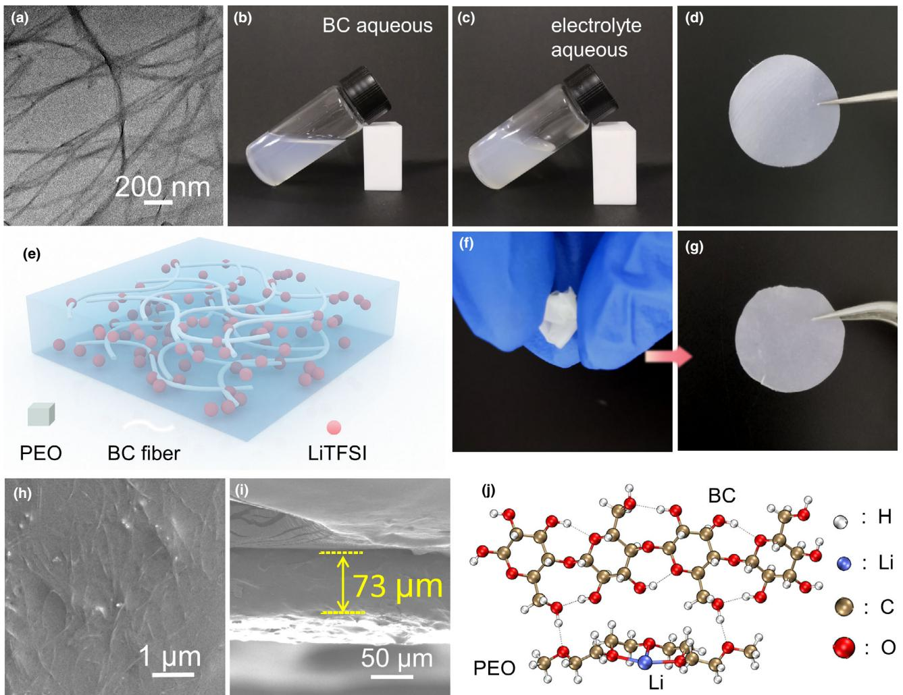
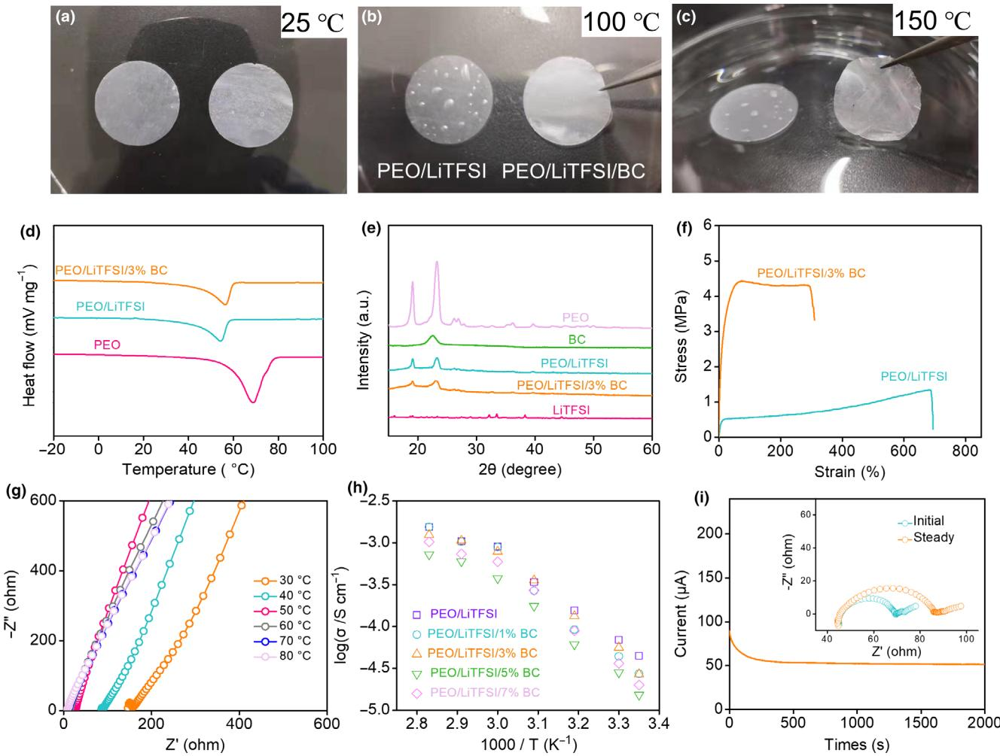
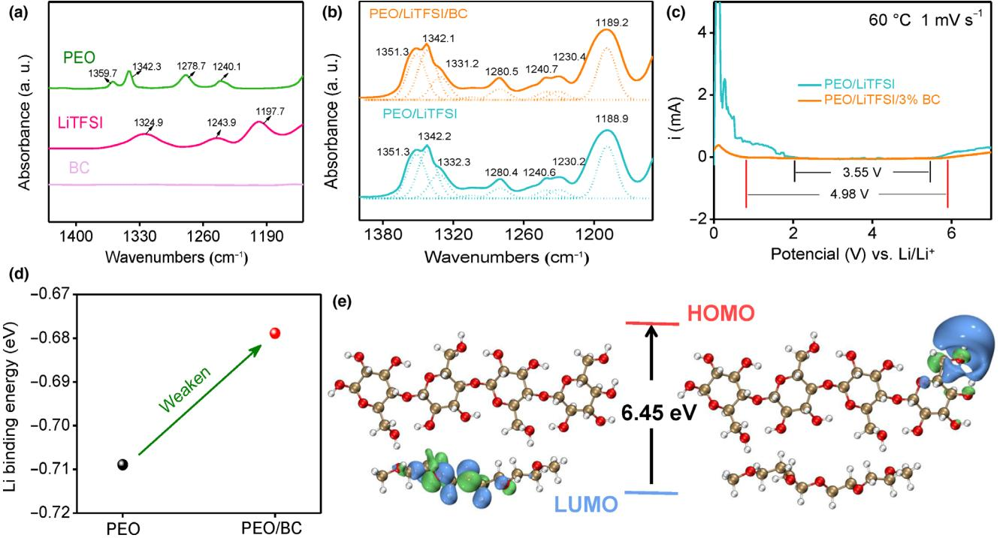
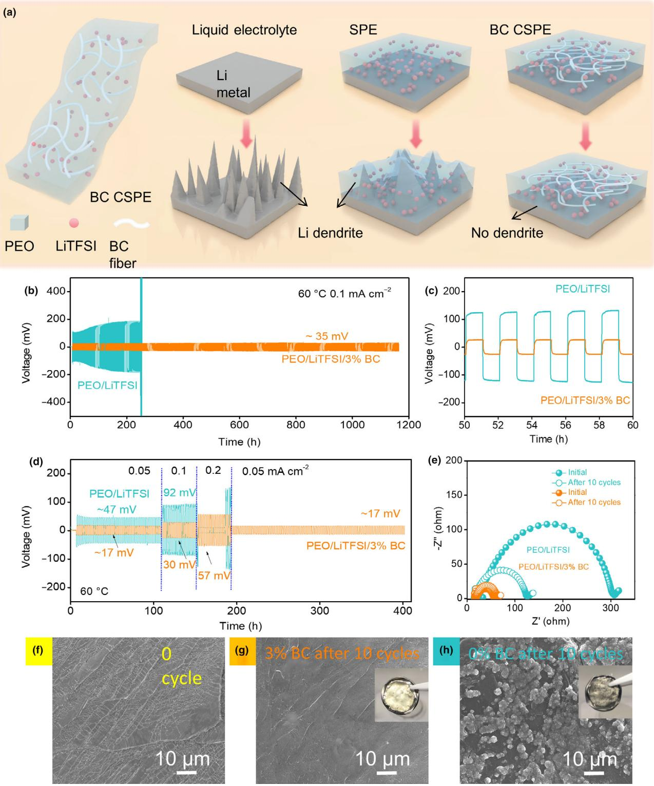
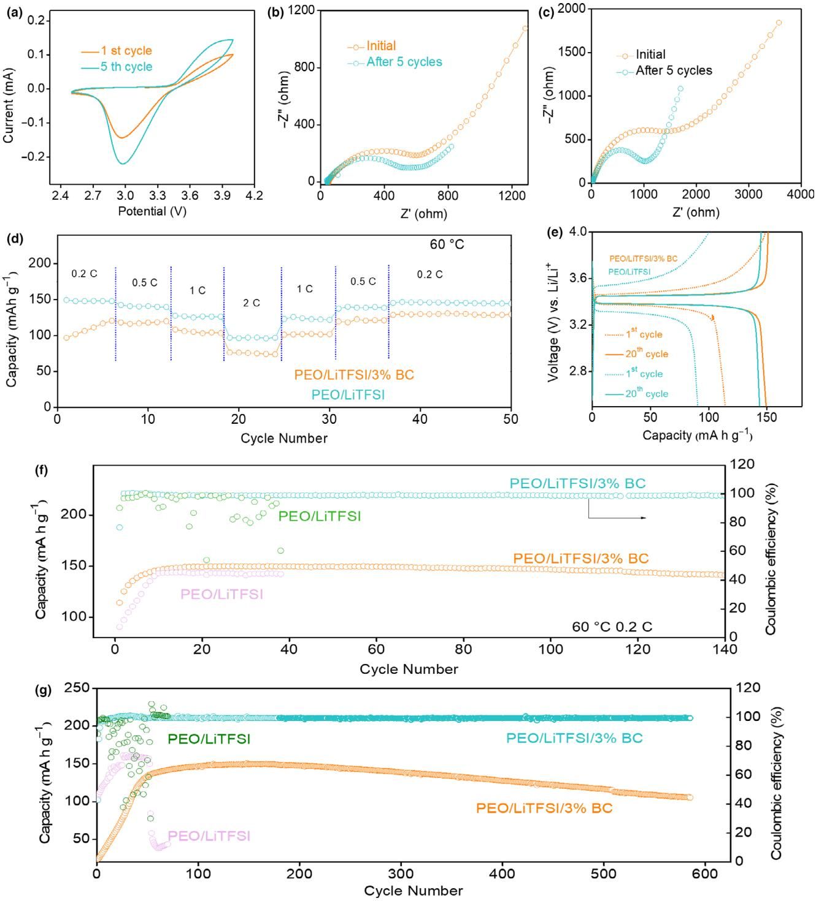

All Solid-State Lithium Metal Batteries

# Bacterial Cellulose Composite Solid Polymer Electrolyte With High Tensile Strength and Lithium Dendrite Inhibition for Long Life Battery

Yuhan Li, Zongjie Sun, Dongyu Liu, Shiyao Lu, Fei Li, Guoxin Gao, Min Zhu, Mingtao Li, Yanfeng Zhang, Huaitian B[u](https://orcid.org/0000-0001-9590-6486) , Zhiyu Jia, and Shujiang Ding\*

The development of metallic lithium anode is restrained by lithium dendrite growth during cycling. The solid polymer electrolyte with high mechanical strength and lithium ion conductivity could be applied to inhibit lithium dendrite growth. To prepare the high-performance solid polymer electrolyte, the environment-friendly and cheap bacterial cellulose (BC) is used as filler incorporating with PEO-based electrolyte owing to good mechanical properties and Li salts compatibility. PEO/LiTFSI/BC composite solid polymer electrolytes (CSPE) are prepared easily by aqueous mixing in water. The lithium ion transference number of PEO/LiTFSI/BC CSPE is 0.57, which is higher than PEO/LiTFSI solid polymer electrolyte (SPE) (0.409). The PEO/ LiTFSI/BC CSPE exhibits larger tensile strength (4.43 MPa) than PEO/LiTFSI SPE (1.34 MPa). The electrochemical window of composite electrolyte is widened 1.43 V by adding BC. Density functional theory calculations indicate that flex of PEO chains around Li atoms is suppressed, suggesting the enhanced lithium ion conductivity. Frontier molecular orbitals results suggest that an unfavorable intermolecular charge transfer lead to achieve higher potential for BC composite electrolyte. All solid-state Li metal battery with PEO/LiTFSI/BC CSPE delivers longer cycle life for 600 cycles than PEO/LiTFSI SPE battery (50 cycles). Li symmetrical battery using PEO/LiTFSI/BC CSPE could be stable for 1160 h.

Y. Li, Z. Sun, S. Lu, Prof. G. Gao, M. Zhu, Prof. Y. Zhang, Prof. S. Ding Department of Applied Chemistry, School of Chemistry, Xi'an Key Laboratory of Sustainable Energy Materials Chemistry, MOE Key Laboratory for Nonequilibrium Synthesis and Modulation of Condensed Matter, State Key Laboratory of Electrical Insulation and Power Equipment, Xi'an Jiaotong University, Xi'an 710049, China

E-mail: dingsj@mail.xjtu.edu.cn D. Liu, F. Li, Prof. M. Li

International Research Center for Renewable Energy, State Key Laboratory of Multiphase Flow in Power Engineering, Xi'an Jiaotong University, Xi'an 710049, China

Dr. H. Bu

Department of Materials and Nanotechnology, SINTEF Industry, Forskningsveien 1, Oslo 0373, Norway

Prof. Z. Jia

School of Chemistry and Chemical Engineering, MOE Key Laboratory of Cluster Science, Beijing Institute of Technology, Beijing 100081, China

The ORCID identification number(s) for the author(s) of this article can be found under<https://doi.org/10.1002/eem2.12122>.

DOI: 10.1002/eem2.12122

### 1. Introduction

The development of metallic lithium anode is restrained by the growth of lithium dendrite generated upon the continuous discharge/ charge cycling.[1,2] Many strategies have been adopted to protect lithium anode, such as composite interface, solid electrolyte interphase, 3D frame structure composite anode and so on.[3,4] Among the protection methods for lithium anode, the liquid-free solid polymer electrolyte which have high lithium ion transference number and good mechanical strength have been used to suppress the lithium dendrite efficiently.[5–10] The polyethylene oxide (PEO) based solid electrolyte system has attracted abroad studies due to the good flexibility, ionic conducting, and encapsulation. However, the pristine polyethylene oxide (PEO) solid electrolyte have several disadvantages, for example, poor mechanical strength, low ionic conductivity, narrow electrochemical window, and low lithium ion transference number.[11,12] And the narrow electrochemical window and poor thermostability of PEO electrolyte also confine its practical application. These problems could be

ameliorated by increasing Li ion conductive amorphous region. Reducing the crystallinity and increasing Li ion conductivity, various of fillers such as Li+ -conductive ceramic, inorganic oxide, and polymers are added to the PEO system.[13–16] But the mechanical properties of liquid-free solid polymer electrolyte was decreased when the abundant fillers are introduced to the system. Blending PEO with polymer might be an effective strategy owing to the good compatibility, the aggregation of nano-filler is avoided.[17] The balance between ionic conductivity and mechanical strength could be achieved by blending PEO with polymers.

Cellulose, as the co-environmental materials, has good mechanical properties and Li ion capacity.[18] Many research about the PEO and cellulose which are combined via liquid mixing and electrospinning have been reported.[19–21] Among all kinds of cellulose, bacterial cellulose (BC) had been applied in electrolyte materials for recent years, which exhibits several advantages, such as formability, high aspect ratio, good mechanical properties, and environmental-friendly.[22] A great deal of ether groups (–C–O–C–) in BC are similar to the structure of PEO. The nanofiber structure of BC is formed by the connection of glucose monomers and glycosidic bonds, which enables the capability of dissolving lithium salts. However, the dry BC nanofibers do not process elasticity and flexibility.[23] Accordingly, the BC nanofibers can be used as electrolyte by combining flexible polymers. BC nanofibers with hydrogen bonds could be blending with PEO, which improves the mechanical strength of PEO-based electrolyte films. The BC contain semicrystalline fibers has been used as separator for batteries, but the poor ionic conductivity still is the obstacle for large scale application.[24]

In this article, we prepare the composite solid polymer electrolyte by blending bacterial cellulose (BC) nanofibers with PEO/LiTFSI mixture and apply it in all solid-state lithium metal batteries. With high aspect ratio, the BC nanofibers exhibit the small diameter (about 100 nm) and high tensile strength. More importantly, as the environmentally friendly materials, BC has good wettability and dispersity in aqueous. PEO is also as the nontoxic polymer could dissolve in water. Blending the polymer in water, we can prepare the uniform BC nanofibers with PEO, which is convenient, clean, and nontoxic. The bacterial cellulose/ polyethylene oxide composite solid polymer electrolyte with reinforced tensile strength and improved thermostability are prepared without sacrificing the ionic conductivity. The 3% BC gifted PEO composite solid polymer electrolyte (PEO/LiTFSI/3% BC CSPE) reflects higher tensile strength (4.43 MPa) than PEO/LiTFSI SPE (1.34 MPa). The electrochemical window is widened after incorporating BC. The thermal stability of BC composite solid electrolyte has also been improved, implying that the solid electrolyte can be cycled at high temperature. The reasons for enhanced Li+ conductivity and mechanical properties by cooperating BC are studied by density functional theory (DFT) calculation. The extended electrochemical window is investigated with the frontier molecular orbitals. Because of the above reasons, the all solidstate Li/LiFePO4 battery with PEO/LiTFSI/BC composite solid polymer electrolyte displays long cycle life for 600 cycles at 0.5 C. Li symmetrical battery using PEO/LiTFSI/BC CSPE exhibits good cycling stability for 1160 h at 0.1 mA cm−2 and 60 °C.

#### 2. Results and Discussion

The morphology of BC is test by TEM, the image in Figure 1a shows the randomly arranged nanofibers with an average diameter size of 50–100 nm. As shown in Figure 1b, the BC suspension is creamy white aqueous, and then, PEO and LiTFSI are mixed in the aqueous to form a uniform electrolyte solution Figure 1c. The solution is cast on the disk to prepare the solid polymer electrolyte film. The photographs in Figure 1d show that the PEO/LiTFSI/3% BC CSPE is semitransparent, flexible, and thin film. The detailed schematic structure of PEO/LiTFSI/ BC composite solid polymer electrolyte (CSPE) are revealed in Figure 1e; BC nanofiber, LiTFSI, and PEO are represented by milky white fiber, pink ball, and blue block (continuous phase), respectively. In the photograph of PEO/LiTFSI/BC CSPE film in Figure 1f and g, the CSPE was able to regain the original shape after folding and bending. The top-view SEM image of PEO/BC (Figure 1h) reflects that the surface of CSPE is smooth and homogenous, randomly nanofibers can be observed in the continuous polymer phase. Due to the efficient aqueous solution technique, BC nanofibers disperse well in the PEO matrix without obvious fiber bundles. The homogeneous BC nanofibers build up a cross-linking structure in the PEO matrix, which is beneficial for the mechanical properties. In order to prove water in composite solid electrolyte is removed after blast drying and vacuum drying, TGA

measurements of electrolyte film have been conducted. The TGA plots of PEO/LiTFSI/3% BC CSPE and PEO/LiTFSI SPE in the Figure S1, Supporting Information show that the loss of mass is not be found until temperature increasing to 370 °C. It suggests that water is removed clearly. Figure 1i described the cross-sectional morphology of PEO/ LiTFSI/BC CSPE, and the thickness of the CSPE membrane is about 73 μm. DFT calculations were carried out to further reveal the role of BC on electrolyte performance. Figure 1j displays the optimized structure of BC/PEO-Li system. It can be seen that the Li atom is coordinated with three ether O atoms,[25] and the PEO and BC are hydrogen bonded.

Thermal stability of PEO/LiTFSI/BC CSPE and PEO/LiTFSI SPE are compared at different temperature. In Figure 2a, there is no distinct difference between PEO/LiTFSI/BC CSPE and PEO/LiTFSI SPE at 25 °C. With the temperature increases to 100 °C, PEO/LiTFSI SPE is melted (Figure 2b). In contrast, the morphology of CSPE is retained well and can be torn form culture dish. As the temperature increases to 150 °C, PEO/LiTFSI/BC CSPE still maintain free understanding (Figure 2c). However, the melting behavior is observed in PEO/LiTFSI SPE owing to the intrinsic thermal stability, leading to short circuit and explosion of battery at high temperature. Above results indicate that the thermal stability of composite electrolyte is enhanced by adding BC.

Thermal behavior of solid polymer electrolyte was investigated by differential scanning calorimeter (DSC) measurement. In Figure S2, Supporting Information, the glass transition temperatures (Tg) of PEO, PEO/LiTFSI SPE, and PEO/LiTFSI/BC CSPE are −50.3, −38.9, and −36.1 °C, as shown in Figure 2d. The corresponding melting temperatures (Tm) are 68.8, 54.2, and 56.3 °C. When the filler content is below 10 wt.%, Tg and Tm were independent of the filler content as the previous work. The melt temperature decreased notably by cooperating Li salt in PEO.[26] Tg is a parameter which could reflect the crystallinity of polymer materials. Lower Tg, lower crystallinity. Theoretically, the addition of BC reduces the crystallinity of the polymer, resulting in an increase in the mobility of the polymer segments, which corresponds to the decrease in the melting point and glass transition temperature of the composite electrolyte. However, BC has high crystallinity. The DSC spectrum of PEO/LiTFSI/BC CSPE reflects one crystalline melting transition peak and implies that the polymer system is homogeneous blended with no phase separation, the high crystallinity BC leading to the increased Tg and Tm of CSPE.

The changes in the semicrystalline nature of PEO/LiTFSI mixture after adding BC are examined by XRD measurement. The XRD patterns of LiTFSI, BC, PEO, PEO/LiTFSI SPE, and PEO/LiTFSI/BC SCPE are given in Figure 2e. The observed sharp peaks of PEO and LiTFSI are well matched with previous reports; the peaks of PEO and PEO/ LiTFSI SPE are at 19.2° and 23.2° corresponding to the crystalline phase. After the incorporation of BC to the PEO/LiTFSI system, the intensity of the characteristic peaks decreased obviously, suggesting the decrease in degree of crystallinity of solid polymer electrolyte. This decrease in the crystallinity caused active segmental motion of the composite electrolyte.

The mechanical properties of solid polymer electrolyte are important in the applications of solid-state Li metal batteries. The stress-strain curves of PEO-based solid polymer electrolyte are reflected in Figure 2f. Table S1, Supporting Information summarizes the maximum tensile strength and tensile modulus obtained from stress-strain curves. The PEO/LiTFSI/3% BC CSPE exhibits the larger tensile strength (4.43 MPa) than PEO/LiTFSI SPE (1.34 MPa). The tensile modulus of PEO/LiTFSI/ 3% BC CSPE is enhanced to 76.7 MPa, which is 6.5 times than filler

Figure 1. The morphology analysis of solid polymer electrolyte. a) TEM image of BC. b) The BC solution. c) The solution of BC composite electrolyte. d) The photograph of PEO/LiTFSI/BC CSPE film. e) Schematic diagram of composition of BC-PEO composite solid polymer electrolyte. f,g) The photograph of PEO/ LiTFSI/BC CSPE film. h) The top-view SEM image of composite solid electrolyte. i) The cross-sectional SEM image of PEO/LiTFSI/BC membrane. j) DFT optimized structure of Li bonded with PEO/BC. The hydrogen bonds are indicated by dashed lines.

free PEO/LiTFSI electrolyte (11.8 MPa). The improvement in the strength and modulus should be attributed to the heterogeneous dispersion of BC nanofibers and interactions between the PEO matrix and the BC via hydrogen bonding.[27]

AC impedance spectroscopy measurement was used to evaluate the effect of blending BC in PEO/LiTFSI matrix on the ionic conductivity. The EIS curves of PEO/LiTFSI/3% BC CSPE in Figure 2g reflected the decreased impedance with temperature increasing, implying the increased ionic conductivity. Arrhenius plots of the ionic conductivity for composite polymer electrolytes with 0–7 wt.% BC are revealed in Figure 2h, and the corresponding data are shown in Table S2, Supporting Information. The ion conductivity of composite electrolyte is lower than the PEO/LiTFSI SPE. The reduction of conductivity with the addition of BC is not significant, which is the same as those reported in previous work. This decrease could be related to the decrease of both PEO protons transverse relaxation and anion and cation diffusion coefficients. The stiff BC phase restricts segmental motions in PEO according to the model developed by Sergiy Kalnaus, showing the reduction of conductivity with mechanical properties enhancement with the addition of non-conducting filler phase.[28]

The lithium ion transference number (tLiþ ) of solid polymer electrolyte is a significant factor for the application in the Li metal battery. The tLiþ was measured by potentiostatic polarization and AC impedance technology. The i-t curve and EIS before and after polarization are shown in Figure 2i. According to equation in the experimental part, the tLiþ of PEO/LiTFSI/3% BC CSPE is calculated to be 0.57, which is higher than that of PEO/LiTFSI SPE (0.409) (Figure S3, Supporting Information). This can be assigned to the strong interactions between the functional –OH groups, ether groups (EO), glycosidic bonds on the BC chains, and the lithium ions, which offer great amount of transportation routes for Li+ ions.

Fourier transform infrared (FTIR) test was conducted to confirm the interaction between Li+ , BC, and PEO chains. FTIR spectrum of solid polymer electrolyte in the range of 4000 cm−1 ~ 1400 cm−1 is shown in Figure S4, Supporting Information. The broad absorption of O–H in the range of 3500 cm−1 ~ 3200 cm−1 is very weak in the spectrum of

Figure 2. Characterization of thermochemical properties, mechanical properties, and electrochemical properties. a-c) Thermal stability of PEO/LiTFSI SPE and PEO/LiTFSI/3% BC CSPE under different temperature. d) DSC curves of PEO, PEO/LiTFSI, and PEO/LiTFSI/3% BC CSPE with the scanning rate of 10 °C min−1 . e) XRD patterns of LiTFSI, PEO, BC, PEO/LiTFSI SPE, and PEO/LiTFSI/3% BC CSPE. f) The stress-strain curves of PEO/LiTFSI and PEO/LiTFSI/BC CSPE. g) Temperature-EIS plots of PEO/LiTFSI/3% BC CSPE at different temperature. h) Arrhenius plots for ionic conductivities of PEO/LiTFSI and PEO/LiTFSI/BC CSPE with different BC content (1, 3, 5, and 7 wt.%). i) I-t curve and EIS plots before and after polarization for 3% BC CSPE.

CSPE and SPE, which is corresponding to intermolecular hydrogen bond of BC or O–H in polyethylene oxide, suggesting that there is no water in the prepared electrolytes. The FTIR spectra 1150–1500 cm−1 of PEO, LiTFSI, and BC are shown in Figure 3a. The detailed spectra of PEO from 1400 to 1150 cm−1 reflects that the peaks at 1359.7, 1342.3, 1278.7, and 1240.1 cm−1 are attributed to –CH2– wagging absorptions and –CH2– twist peaks (Table S3, Supporting Information). The absorption peaks of LiTFSI at 1325.9, 1243.9, and 1197.7 cm−1 are correspond to the asymmetric –SO2– stretching, symmetric, and asymmetric stretching of –CF3. These peaks also can be observed in PEO/LiTFSI SPE and PEO/LiTFSI/3% BC CSPE, as shown in Figure 3b. The asymmetric stretching peaks of –CF3 shift to 1188.9 and 1189.2 cm−1 in PEO/LiTFSI SPE and PEO/LiTFSI/3% BC CSPE, indicating that the interaction between BC and the –CF3 group in the LiTFSI.[10]

The electrochemical window is another significant factor for the solid polymer electrolyte. Linear sweep voltammograms (LSVs) were employed to check the electrochemical window of the solid polymer

electrolytes at 60 °C. The results of PEO/LiTFSI and PEO/LiTFSI/3% BC membrane at the scan rate of 1 mV s−1 in the potential range of 0–7 V (vs Li+ /Li) are reflected in Figure 3c. For PEO/LiTFSI/3% BC CSPE, the current remains small until 5.9 V and the electrochemical window is 4.98 V. The impedance of PEO/LiTFSI SPE and PEO/ LiTFSI/3% BC CSPE before the LSV scanning (Figure S5). However, the electrochemical window of PEO/LiTFSI SPE is only 3.55 V, which is very narrow for the application in batteries. The electrochemical window of composite solid electrolyte is widened by BC, indicating that functional groups on the BC chains could delay the oxidation reaction. In Figure S6 and Figure 1b, c, the PEO and BC could be dispresed in the solvent, which is the basis of the electrolyte window being widened.

Density functional theory calculations were carried out to further reveal the role of BC on electrolyte performance. Figure 1g displays the optimized structure of BC/PEO-Li system. It can be seen that the Li atom is coordinated with three ether O atoms,[26] and the PEO and BC are hydrogen bonded. Since the linear BC chains are reported to possess high mechanical strength,[29,30] which is also indicated by our stress-strain curves in Figure 2f, these hydrogen bonds could prevent the PEO helix and facilitate their crystallization. Meanwhile, this constraint effect would suppress the flex of PEO chains around Li atoms and weaken the relevant lithium binding strength as shown in Figure 3d. This impact could reduce the transmission resistance for Li leaving PEO binding sites and enhance the lithium ion conductivity. Moreover, the extended electrochemical window is investigated with the frontier molecular orbitals (i.e., the highest occupied molecule orbital [HOMO] and the lowest unoccupied molecule orbital [LUMO]) as given in Figure 3e. It is obvious that the HOMO and LUMO are separately distributed at PEO and BC in their composite. Although the energy gap between HOMO and LUMO of PEO/BC composite is smaller than that of PEO (6.45 eV vs 7.27 eV), their spatial separation requires an unfavorable intermolecular charge transfer besides intramolecular charge transfer during redox reactions.[31–33] Thus, the higher potentials could be withstood.

Galvanostatic cycling stability of composite polymer electrolyte was tested by Li/Li symmetric battery to evaluate the electrochemical compatibility of electrolyte and Li metal. Lithium dendrite inhibition diagram of BC-PEO composite solid polymer electrolyte is shown in Figure 4a. The voltage profiles (Figure 4b) during Li plating/striping process are measured at 60 °C at 0.1 mA cm−2 . The battery with PEO/ LiTFSI/3% BC CSPE reflects the smaller overpotential (~35 mV) than the filler free solid polymer electrolyte (PEO/LiTFSI). In addition, the battery using PEO/LiTFSI SPE has been failed after 248 h due to internal short circuit, which is caused by uncontrollable Li dendrite growth (Figure 4a). On the contrary, the BC gifted composite polymer electrolyte battery can be stable for 1160 h without polarization, implying the homogeneous contact between Li metal and CSPE. In Figure 4c, the stable voltage profiles are observed, indicating a uniform and stable lithium deposits, which is suggested the good ability of BC in dendrite suppression. The cycling stability at different current densities is also evaluated in Figure 4d. The cycling profile for CSPE shows that the lower overpotential at various currents than the battery with PEO/LiTFSI SPE. Notably, the PEO/LiTFSI SPE battery is failed at 150 h with the increasing current density owing to the weak mechanical modulus of SPE. After 90 cycles, the battery with PEO/LiTFSI/3% BC CSPE cycles without internal short circuit and reveals low overpotential (~18 mV) at 0.05 mA cm−2 , demonstrating the inhibition of lithium dendrites growth and the stable interface between Li anode and composite solid electrolyte. It is attributed to high tLi+ and mechanical properties of PEO/LiTFSI/3% BC CSPE.

The interfacial properties between Li metal and electrolyte were investigated by electrochemical impedance spectroscopy (EIS) before and after 10 cycles at 0.1 mA cm−2 . EIS plots of Li/CSPE/Li symmetrical batteries have been fitted, and equivalent circuits are shown in Figure S7, Supporting Information. The corresponding electrochemical impedance is summarized in Table S4, Supporting Information. The EIS plots in Figure 4e show that the charge-transfer resistance (Rct) of PEO/LiTFSI/3% BC CSPE is 35.5 and 48.5 Ω before and after 10 cycles. On the contrary, the independence of symmetrical battery with PEO/ LiTFSI SPE are 282 and 112.6 Ω. This result suggests that PEO/LiTFSI/ 3% BC CSPE has small interfacial impedance and stable interface after cycling. Due to higher lithium ion conductivity and tensile property of PEO/LiTFSI/3% BC CSPE, the battery using composite electrolyte show higher electrochemical stability and better interface stability. Smaller internal resistance could be achieved by using BC composite electrolyte

Figure 3. Mechanism of enhanced electrochemical performance of CSPE. a) The detailed FTIR spectra of BC, LiTFSI, and PEO at 1150–1400 cm−1 . b) Gaussian-Lorentzian fitting of the peak for PEO/LiTFSI and PEO/LiTFSI/3% BC CSPE. c) LSVs of PEO/LiTFSI SPE and PEO/LiTFSI/3% BC CSPE. d) The binding energies of Li with PEO and PEO/BC. e) Calculated HOMO and LUMO distributions of BC/PEO composite. The Li, C, O, H atoms are denoted in blue, brown, red, and white balls, respectively.

Figure 4. Lithium dendrite inhibition performance of CSPE. a) Lithium dendrite inhibition characterization of BC-PEO composite solid polymer electrolyte. b) Galvanostatic cycling curves of Li/Li symmetric battery with PEO/LiTFSI/3% BC CSPE and PEO/LiTFSI SPE battery at 0.1 mA cm−2 at 60 °C. c) The details graphic of cycling curves ranging from 50 to 60 h. d) The rate performance of Li/Li symmetrical batteries with PEO/LiTFSI SPE and PEO/LiTFSI/3% BC CSPE. e) EIS plots of the batteries before and after 10 cycles. f) The SEM images of bare Li metal before cycling, lithium metal anode of battery with PEO/LiTFSI/3% BC CSPE g) and PEO/LiTFSI SPE h) after 10 cycles under 0.1 mA cm−2 .

Figure 5. Electrochemical performance of all solid-state lithium metal battery with CSPE. a) CV curve of Li/LiFePO4 battery with PEO/LiTFSI/BC composite electrolyte at the first cycle and the fifth cycle. b) EIS plots of the same battery with PEO/LiTFSI/BC CSPE. c) EIS plots of the battery with PEO/LiTFSI SPE. d) The rate capability curves of the batteries at different current densities. e) The charge and discharge curves of the Li metal batteries with PEO/LiTFSI SPE and PEO/LiTFSI/BC CSPE at the first cycle and the twentieth cycle. f) Long-term cycling performance of the batteries with PEO/LiTFSI SPE and PEO/LiTFSI/BC CSPE at 0.2 C at 60 °C. g) Long-term cycling performance of the batteries with PEO/LiTFSI SPE and PEO/LiTFSI/BC CSPE at 0.5 C at 60 °C.

and the internal resistance is kept at a low level after cycling. Therefore, the side reactions between electrode and electrolyte are suppressed, leading to the inhibition of lithium dendrite, and this is the reason why the battery with PEO/LiTFSI/3% BC CSPE possesses lower polarization.[8] On the contrary, the PEO/LiTFSI SPE battery exhibits serious lithium dendrites, confirming the unstable elecrochemical properties and interface. Hence, the battery with PEO/LiTFSI SPE represents that the internal resistance increases seriously after cycling, leading to higher polarization in the test.

To investigate the effective of composite electrolyte with high tensile strength for lithium dendrite inhibition, the SEM is employed to detect the surface morphology of Li anode before and after cycling of symmetrical battery. In Figure 4h, Li anode in the battery using PEO/LiTFSI SPE reflects the rough surface with many dendrites, just like the diagram in Figure 4a. In addition, the inset photograph of lithium anode in Figure 4h reflects dark surface. The lithium anode in the battery with PEO/LiTFSI/3% BC CSPE shows the smooth surface after cycling (Figure 4g); furthermore, the photo image of this anode exhibits bright surface. These results implying that the dendrite growth is inhibited by the composite solid polymer electrolyte via adding BC. It should be attributed to the high lithium ion conductivity and enhanced mechanical strength of BC gifted composite electrolyte.

The cyclic voltammetry (CV) test of LiFePO4/PEO/LiTFSI/BC/Li battery was conducted from 2.5 and 4.0 V with a scan rate of 1 mV s−1 . The oxidation and reduction peaks are at 3.0 and 3.9 V. The closed loop nature and symmetry of CVs implies the good electrochemical activity and no side reactions occurring (Figure 5a).

The interfacial properties between Li metal and electrolyte are investigated by electrochemical impedance spectroscopy (EIS) before and after 5 cycles. The equivalent circuit diagram is reflected in Figure S8, Supporting Information, and the data are summarized in Table S5, Supporting Information. The EIS plots in Figure 5b show that the charge-transfer resistance (Rct) of PEO/LiTFSI/3% BC CSPE is 524.6 and 444.7 Ω before and after 5 cycles, which are higher than that of PEO/LiTFSI SPE (Figure 5c). This result suggests that PEO/ LiTFSI/3% BC CSPE has more stable interface than PEO/LiTFSI SPE after cycling.[34]

In order to explore the faster charge/discharge ability of the solid polymer battery, the rate performance of batteries is test. At different current densities (0.2C, 0.5C, 1 C, 2C and 1 C, 0.5C, 0.2C), the high discharge capacities (148, 141, 125.2, 97.4 and 124.2, 140.2, 146.2 mAh g−1 ) are achieved for the battery with PEO/LiTFSI/3% BC CSPE (Figure 5d). However, the battery with the filler free electrolyte presents the discharge capacities of 111.3, 117, 103.2, 75.8 and 102.5, 120.8, 129.9 mAh g−1 . These results indicated that the battery have better rate performance at high temperature.

In order to discuss the polarization performance of the solid-state battery with different electrolytes, the charge and discharge profiles at different cycle numbers are reflected in Figure 5e. LiFePO4 is employed as cathode, the plateaus at about 3.45 V in two kinds of batteries, which are redox potential for LiFePO4. The polarization of solid polymer battery is reduced by adding the BC into the PEO-based electrolyte. The battery using PEO/LiTFSI/3% BC CSPE delivers an initial discharge capacity of 141 mAh g−1 , which is higher than battery with PEO/ LiTFSI SPE (90 mAh g−1 ). The PEO/LiTFSI/3% BC CSPE battery exhibits the low overpotential of ~80 mV at 0.2 C at the first cycle and 20th cycle. In contrast, the overpotential of PEO/LiTFSI SPE at the first cycle is 290 mV and decreased to 130 mV after 20 cycles, which is still large polarization. The PEO/LiTFSI/3% BC CSPE exhibits higher discharge

capacity 149.1 mAh g−1 and smaller polarization than that of PEO/ LiTFSI SPE battery (114 mAh g−1 ) after 20 cycles.

The cycling performance (Figure 5f) of all solid-state Li metal battery with composite electrolyte is investigated by the Li/LiFePO4 battery at 60 °C. The battery with PEO/LiTFSI/3% BC CSPE delivers a high-capacity 150 mAh g−2 after 18 cycles at 0.2 C. The capacity increases because the electrolyte/electrode interfacial contacts are enhanced as the cycles increasing. The BC composite electrolyte battery has a high retained capacity of 141 mAh g−1 after 140 cycles. In Figure 5g, the battery using composite electrolyte exhibits long-term cycling performance even after 600 cycles at high current density (0.5 C). However, the battery with PEO/LiTFSI SPE failed after 40 cycles at 0.2 C owing to large polarization and the battery show poor cycling performance at high current density of 0.5 C. It is due to the weak stretchability and low Li+ transference number of PEO/LiTFSI SPE. On the contrary, the long-term cycling stability of PEO/LiTFSI/3% BC CSPE is attributed to its good thermal stability, high Li+ transference number and high mechanical properties.

#### 3. Conclusion

In this article, the bacterial cellulose (BC) nanofibers are employed as polymer fillers in PEO-based solid electrolyte system owing to the high mechanical strength and lithium ion capacity. The BC incorporating PEO/LiTFSI composite solid electrolyte is prepared by convenient aqueous mixing method. The PEO/LiTFSI/BC composite solid polymer electrolyte (CSPE) exhibits reduced crystallinity degree and large tensile strength owing to the well well-dispersed nanofibers in electrolyte. The electrolyte widow and lithium ion transference number are also increased due to the interaction between abundant hydroxyl groups of cellulose and PEO/Li ion in the electrolyte system. Befitting from these enhanced properties, the BC composite electrolyte have the effective for the lithium dendrite inhibition, leading to long cycling life for 1160 h in the Li/CSPE/Li symmetrical battery. Notably, the ionic conductivity of solid electrolyte is not sacrifice. So the all solid-state Li metal battery with PEO/LiTFSI/BC CSPE reflects higher revised capacity (149.8 mAh g−1 ) at the 40th cycle at 60 °C than the filler free PEO/ LiTFSI solid electrolyte (142.3 mAh g−1 ).

#### 4. Experimental Section

Preparation of Composite Solid Polymer Electrolyte (CSPE): The bacterial cellulose (BC) aqueous suspension was diluted with deionized water under violently stirring. Then, the PEO and LiTFSI powder were added to the BC suspension under stirring. After stirring for 5 h, the mixed paste was cast onto the polytetrafluoroethylene mold uniformly and dried in a vacuum oven for 12 h at 60 °C. The molar ratios of EO/Li salts were controlled in 20:1. The content of BC in the solid polymer electrolyte are 0, 1, 3, 5, and 7 wt.% (with respect to PEO weight), respectively.

Electrochemical Measurements: The ionic conductivity (σ) of solid polymer electrolyte was tested by electrochemical impedance spectroscopy (EIS) measurements (CHI660E). The EIS plots were obtained at open circuit voltage between 1000 kHz and 0.1 Hz under different temperatures (30–80 °C). The σ was calculated from the equation as following: Rb, L, and S represents the bulk resistance, the thickness and area of the electrolyte film.[35]

$$
\sigma = L/R_b S \tag{1}
$$

The lithium ion transference number (tLiþ ) was measured by the DC polarization and EIS before and after polarization at 60 °C. A voltage pulse (ΔV) of 10 mV was applied in the polarization curve measurement. The tLiþ was calculated by equation: I0 and Is are represented the initial and steady-state current. The initial and the final interfacial resistances are R0 and Rs.

$$
t_{Li^{+}} = I_{s}/I_{0}(\Delta V - I_{0}R_{0})/(\Delta V - I_{s}R_{s})
$$
\n(2)

The electrochemical window of the solid polymer electrolyte was tested by linear sweep voltammetry (LSV) technique at 60 °C. Steel sheet was employed as reference electrode and lithium metal was as working electrode; the LSV was conducted at a scan rate of 1 mV s−1 with voltage from 0 to 7 V.

Battery Testing: All solid-state lithium metal batteries consisted of lithium metal, solid polymer electrolyte, and working electrode. Lithium metal acted as reference electrode and counter electrode. The working electrode is consisted LiFePO4, PVDF, and carbon black in a 7:1:2 weight ratio. The mass loading of active materials on the cathode in the rate performance measurement is about 1.5 mg cm−2 . The Li/Li symmetrical battery consisted of lithium metal and solid polymer electrolyte, and the type of coin cells were 2025. The CSPE membrane was sandwiched between two lithium metal to form a Li/electrolyte/Li cell. All the batteries were assembled in an argon-filled glove box. The cycling performance of solid polymer Li metal batteries was tested by NEWARE battery tester in the potential ranging from 2.5 to 4.0 V.

Materials Characterization: Transmission electron microscopy (TEM, JEOL JEM-2100Plus) was used to test the morphology of BC. The micromorphology of CSPE was studied by scanning electron microscopy (SEM, GeminiSEM 500). The composition and interaction of composite electrolyte was investigated by Fourier transform infrared (FTIR) spectroscopic measurements. The phase structure and crystallinity of SPE and CSPE were analyzed by X-ray diffraction (XRD, Bruker, D8 ADVANCE). Thermochemical behavior of electrolyte was conducted by a differential scanning calorimeter (DSC, TA Q2000) (−70 to 100 °C). Mechanical properties of CSPE films were examined by an electronic tensile machine (CMT6503, MTS) with a 50-N load cell.

Calculation Method: All calculations were performed with density functional theory (DFT) method in ORCA 4.2.1 program.[36] Geometry optimizations were carried out using the newly developed B97-3c method, which could yield similar structures to most hybrid functional calculations in large basis set expansions with low cost.[37] Single-point energy calculations were computed using B3LYP functional including the charge dependent atom-pairwise D4(EEQ)-ATM dispersion model (B3LYP-D4).[25,38,39] To accurately describe the hydrogen bond interaction between BC and PEO and reduced the Basis Set Superposition Error (BSSE), def2- QZVPP basis set was adopted, and def2/J auxiliary basis set was used for RIJCOSX procedure in ORCA program.[40-42] The PEO chain was represents by tetraethylene glycol dimethyl ether CH3O(CH2CH2O)4CH3, which could mimic the realistic local environment of Li in PEO well.[26,43] The BC chain was represent by two BC units and the two ends were saturated by hydrogen. The calculated data were processed with Multiwfn software and visualized with VMD software.[44,45]

#### Acknowledgements

This work was supported partially by the National Natural Science Foundation of China (No. 51973171), Young Talent Support Plan of Xi'an Jiaotong University and Innovation Capability Support Program of Shaanxi (No. 2018PT-28, 2019PT-05). We thank Mr. Zijun Ren at Instrument Analysis Center of Xi'an Jiaotong University for his assistance with SEM analysis. We thank Ms Lijing Ma at school of energy and power engineering of Xi'an Jiaotong University for her assistance with XRD analysis.

## Conflict of Interest

The authors declare no conflict of interest.

#### Author Contributions

Yuhan Li, Zongjie Sun, and Shujiang Ding designed the experiments; Yuhan Li and Shiyao Lu performed the experiments; Dongyu Liu, Fei Li, and Mingtao Li performed the DFT calculation for the electrolyte system. Yuhan Li wrote the paper with support from Shujiang Ding, Min Zhu, and Yanfeng Zhang. Guoxin Gao and Huaitian Bu contributed to the electrochemical analysis. All authors contributed to the general discussion. Huaitian Bu and Zhiyu Jia checked the paper and corrected errors in the text, and polish the article to improve the quality of the article.

#### Supporting Information

Supporting Information is available from the Wiley Online Library or from the author.

#### Keywords

all solid-state battery, bacterial cellulose, composite polymer electrolyte, DFT calculations, HOMO and LUMO

> Received: July 25, 2020 Revised: August 17, 2020 Published online: August 18, 2020

- [1] C. Yan, H. Yuan, H. S. Park, J. Q. Huang, J. Energy Chem. 2020, 47, 217.
- [2] Y. Xiao, R. Xu, C. Yan, Y. Liang, J. F. Ding, J. Q. Huang, Sci. Bull. 2020, 65, 909.
- [3] J. F. Ding, R. Xu, C. Yan, Y. Xiao, Y. Liang, H. Yuan, J. Q. Huang, Chin. Chem. Lett. 2020,<https://doi.org/10.1016/j.cclet.2020.03.015>
- [4] C. Yan, R. Xu, Y. Xiao, J. F. Ding, L. Xu, B. Q. Li, J. Q. Huang, Adv. Funct. Mater. 2020, 30, 1909887.
- [5] C. Z. Zhao, H. Duan, J. Q. Huang, J. Zhang, Q. Zhang, Y. G. Guo, L. J. Wan, Sci. China Chem. 2019, 62, 1286.
- [6] W. Liu, S. W. Lee, D. C. Lin, F. F. Shi, S. Wang, A. D. Sendek, Y. Cui, Nat. Energy 2017, 2, 17035.
- [7] S. Gheytani, Y. L. Liang, Y. Jing, J. Xu, Y. Yao, J. Mater. Chem. A 2016, 4, 395.
- [8] Y. H. Li, Y. K. Wang, Y. C. Shi, H. Wu, J. C. Zeng, H. T. Bu, M. Zhu, C. H. Xiao, Y. F. Zhang, G. X. Gao, S. J. Ding, Sci. Bull. 2020, 65, 1094.
- [9] T. T. Liu, J. J. Zhang, W. Han, J. N. Zhang, G. L. Ding, S. M. Dong, G. L. Cui, J. Electrochem. Soc. 2020, 167, 070527.
- [10] R. Xu, X. Q. Zhang, X. B. Cheng, H. J. Peng, C. Z. Zhao, C. Yan, J. Q. Huang, Adv. Funct. Mater. 2018, 28, 1705838.
- [11] X. B. Cheng, R. Zhang, C. Z. Zhao, Q. Zhang, Chem. Rev. 2017, 117, 10403.
- [12] W. S. He, Z. L. Cui, X. C. Liu, Y. Y. Cui, J. C. Chai, X. H. Zhou, Z. H. Liu,
- G. L. Cui, Electrochim. Acta 2017, 225, 151. [13] P. S. Bass, L. Zhang, M. B. Tu, Z. Y. Cheng, Actuators 2018, 7, 72.
- [14] L. Chen, Y. T. Li, S. P. Li, L. Z. Fan, C. W. Nan, J. B. Goodenough, Nano Energy 2018, 46, 176.
- [15] C. Z. Zhao, X. Q. Zhang, X. B. Cheng, R. Zhang, R. Xu, P. Y. Chen, H. J. Peng, J. Q. Huang, Q. Zhang, Proc. Natl Acad. Sci. USA 2017, 114, 11069.
- [16] B. Yuan, G. M. Luo, J. Liang, F. Y. Cheng, W. Q. Zhang, J. Chen, J Energy Chem 2019, 38, 55.
- [17] S. Choudhary, Compos. Commun. 2017, 5, 54.
- [18] M. A. Morsi, M. Abdelaziz, A. H. Oraby, I. Mokhles, J. Mater. Sci. Mater. Electron. 2018, 29, 15912.
- [19] L. F. Zhang, Y. L. Hsieh, Carbohyd. Polym. 2008, 71, 196.
- [20] Y. A. Samad, A. Asghar, R. Hashaikeh, Renew. Energy 2013, 56, 90.
- [21] T. Jayaramudu, H. Ko, H. C. Kim, J. W. Kim, E. S. Choi, J. Kim, Compos. Part B 2019, 156, 43.
- [22] G. P. Jiang, J. Zhang, J. L. Qiao, Y. M. Jiang, H. Zarrin, Z. W. Chen, F. Hong, J. Power Sources 2015, 273, 697.
- [23] D. Xu, B. R. Wang, Q. Wang, S. Gu, W. W. Li, J. Jin, C. H. Chen, Z. Y. Wen, ACS Appl. Mater. Interfaces 2018, 10, 17809.
- [24] Q. Xu, C. Z. Wei, L. L. Fan, S. Peng, W. L. Xu, J. Xu, Cellulose 2017, 24, 1889.
- [25] E. Caldeweyher, S. Ehlert, A. Hansen, H. Neugebauer, S. Spicher, C. Bannwarth, S. Grimme, J. Chem. Phys. 2019, 150, 154122.
- [26] J. Spevˇ a´cek, J. Brus, J. Dybal, ˇ Solid State Ionics 2005, 176, 163.
- [27] C. J. Zhou, R. Chu, R. Wu, Q. L. Wu, Biomacromol 2011, 12, 2617.
- [28] M. A. S. Azizi Samir, L. Chazeau, F. Alloin, J. Y. Cavaille, A. Dufresne, J. Y. Sanchez, Electrochim. Acta 2005, 50, 3897.
- [29] M. Gao, J. Li, Z. Bao, M. Hu, R. Nian, D. Feng, D. An, X. Li, M. Xian, H. Zhang, Nat. Commun. 2019, 10, 437.
- [30] S. Wang, T. Li, C. Chen, W. Kong, S. Zhu, J. Dai, A. J. Diaz, E. Hitz, S. D. Solares, T. Li, L. Hu, Adv. Funct. Mater. 2018, 28, 1707491.
- [31] D. D. Zhang, K. Suzuki, X. Z. Song, Y. Wada, S. Kubo, L. Duan, H. Kaji, ACS Appl. Mater. Interfaces 2019, 11, 7192.
- [32] Y. Yu, S. C. Chien, J. Sun, E. C. Hettiaratchy, R. C. Myers, L. C. Lin, Y. Wu, J. Am. Chem. Soc. 2019, 141, 8727.
- [33] Y. Z. Shi, K. Wang, X. Li, G. L. Dai, W. Liu, K. Ke, M. Zhang, S. L. Tao, C. J. Zheng, X. M. Ou, X. H. Zhang, Angew. Chem. Int. Ed. Engl. 2018, 57, 9480.
- [34] N. Chen, Y. J. Dai, Y. Xing, L. L. Wang, C. Guo, R. J. Chen, S. J. Guo, F. Wu, Energy Environ. Sci. 2017, 10, 1660.
- [35] X. X. Zuo, X. D. Ma, J. H. Wu, X. Deng, X. Xiao, J. S. Liu, J. M. Nan, Electrochim. Acta 2018, 271, 582.
- [36] F. Neese, Wiley Interdiscip. Rev. Comput. Mol. Sci. 2012, 2, 73.
- [37] J. G. Brandenburg, C. Bannwarth, A. Hansen, S. Grimme, J. Chem. Phys. 2018, 148, 064104.
- [38] A. D. Becke, J. Chem. Phys. 1993, 98, 5648.
- [39] E. Caldeweyher, C. Bannwarth, S. Grimme, J. Chem. Phys. 2017, 147, 034112.
- [40] F. Weigend, R. Ahlrichs, Phys. Chem. Chem. Phys. 2005, 7, 3297.
- [41] F. Weigend, Phys. Chem. Chem. Phys. 2006, 8, 1057.
- [42] F. Neese, F. Wennmohs, A. Hansen, U. Becker, Chem. Phys. 2009, 356, 98.
- [43] P. Johansson, J. Tegenfeldt, J. Lindgren, Polymer 2001, 42, 6573.
- [44] T. Lu, F. Chen, J. Comput. Chem. 2012, 33, 580.
- [45] W. Humphrey, A. Dalke, K. Schulten, J. Mol. Graphics 1996, 14, 33.