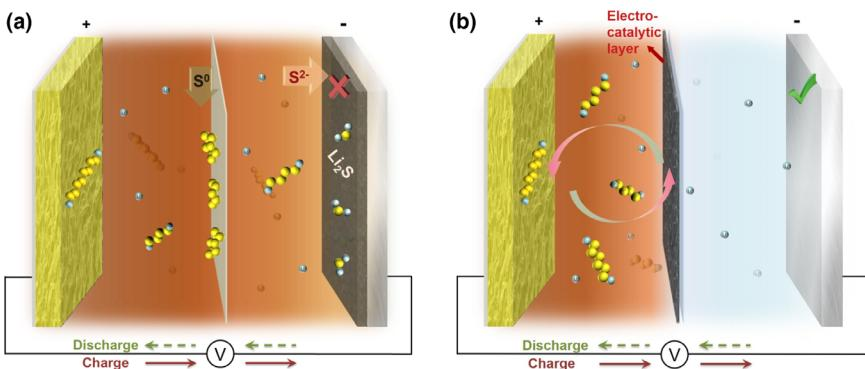
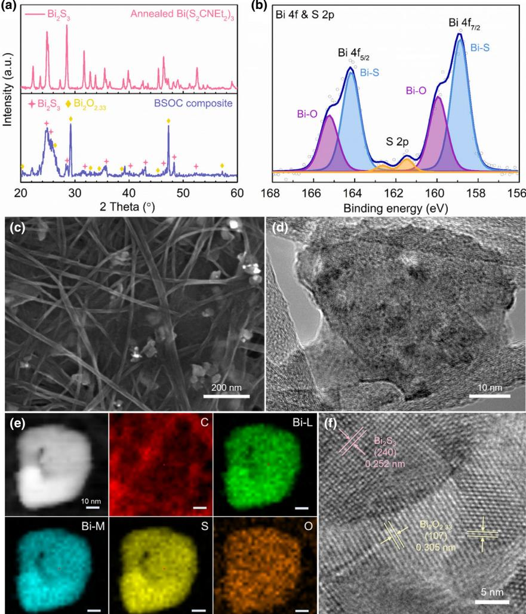
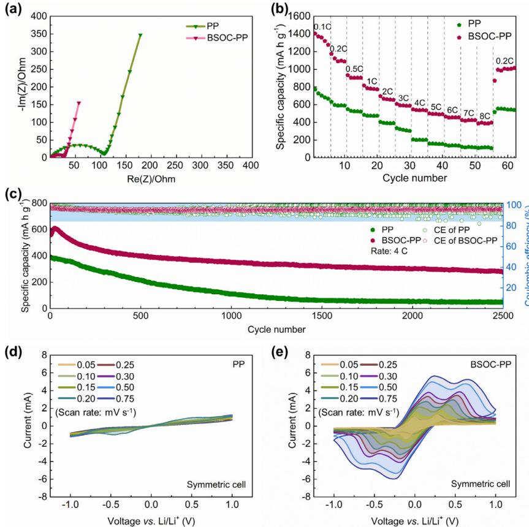
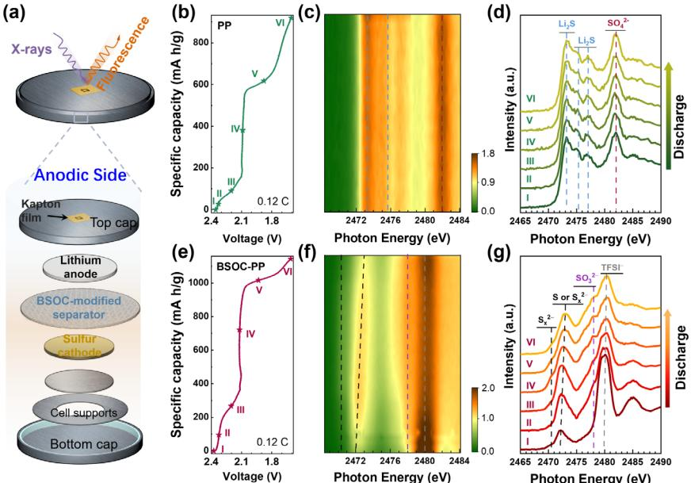
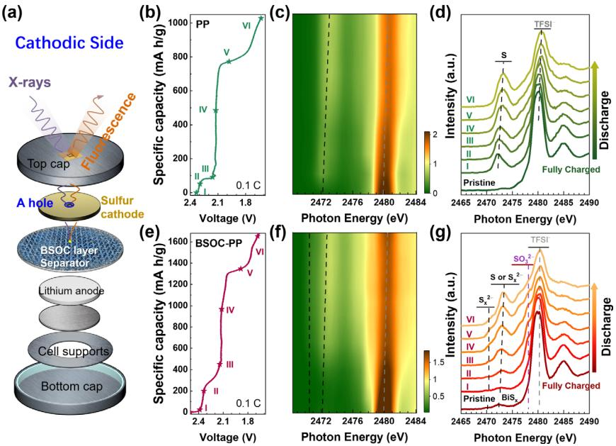

Lithium Sulfur Batteries

# Unraveling Shuttle Effect and Suppression Strategy in Lithium/Sulfur Cells by In Situ/Operando X-ray Absorption Spectroscopic Characterization

Lujie Jia, Jian Wang , Shuaiyang Ren, Guoxi Ren, Xiang Jin, Licheng Kao, Xuefei Feng, Feipeng Yan[g](https://orcid.org/0000-0002-5470-3241) , Qi Wang, Ludi Pan, Qingtian Li, Yi-sheng Liu, Yang Wu, Gao Liu, Jun Feng, Shoushan Fan, Yifan Ye\*, Jinghua Guo[\\*](https://orcid.org/0000-0002-8576-2172) , and Yuegang Zhang\*

The polysulfides shuttle effect represents a great challenge in achieving high capacity and long lifespan of lithium/sulfur (Li/S) cells. A comprehensive understanding of the shuttle-related sulfur speciation and diffusion process is vital for addressing this issue. Herein, we employed in situ/operando X-ray absorption spectroscopy (XAS) to trace the migration of polysulfides across the Li/S cells by precisely monitoring the sulfur chemical speciation at the cathodic electrolyte-separator and electrolyte-anode interfaces, respectively, in a real-time condition. After we adopted a shuttle-suppressing strategy by introducing an electrocatalytic layer of twinborn bismuth sulfide/bismuth oxide nanoclusters in a carbon matrix (BSOC), we found the Li/S cell showed greatly improved sulfur utilization and longer life span. The operando S Kedge XAS results revealed that the BSOC modification was bi-functional: trapping polysulfides and catalyzing conversion of sulfur species simultaneously. We elucidated that the polysulfide trapping-and-catalyzing effect of the BSOC electrocatalytic layer resulted in an effective lithium anode protection. Our results could offer potential stratagem for designing more advanced Li/S cells.

Advanced Light Source, and Energy Storage and Distributed Resources Division, Lawrence Berkeley National Laboratory, Berkeley CA 94720, USA

i-Lab, Suzhou Institute of Nano-Tech and Nano-Bionics, Chinese Academy of Sciences, Suzhou 215123, China

CAS Center for Excellence in Superconducting Electronics, State Key Laboratory of Functional Materials for Informatics, Shanghai Institute of Microsystem and Information Technology, Chinese Academy of Sciences, Shanghai 200050, China

#### DOI: 10.1002/eem2.12152

### 1. Introduction

To meet the ever-increasing demand in high energy density storages, advanced lithium/sulfur (Li/S) cell is a promising candidate to transcend current Li-ion cell because of its high theoretical capacity (1675 mA h g1 ) and specific energy (2600 W h kg1 ) as well as potential of environmental benignity and costeffectiveness.[1–4] However, the practical use of Li/S cell has been hindered by several obstacles, especially the well-known shuttle effect of intermediate polysulfides.[5–7] The up-to-date pursuing for advanced Li/S cell is a journey of seeking solution to overcome the shuttle effect to a great extent.

Extensive efforts have been made to address the shuttle effect by designing optimized nanocomposites, for instance, encapsulating sulfur in the pores of carbon materials such as mesoporous carbon,[8–10] graphene/graphene oxide,[11–19] carbon nanotube/nanofiber,[20–26]

and some heteroatom-doped hybridized composites.[27–31] The porous carbon hosts are able to trap the polysulfides at 1the early stage of cell cycling. However, due to the lack of effective conversion and utilization of the trapped polysulfides, such approach is limited in function when the carbon host is saturated by adsorbed polysulfides over time in the long-term application. Recently, the metalbased catalysts on conductive nanocarbon structures are deemed to be a two-in-one solution because of its bi-function of trapping and further converting polysulfides during cell operation.[32–40] Settling these function materials as an electrocatalytic layer across the polysulfides migration path has been proposed to effectively suppress the shuttle effect.[38,41–44] It is believed that the electrocatalytic layer can be a physical blocker/adsorbent and a chemical mediator/catalyst, which can synergistically restrict the polysulfides shuttling. Despite progresses have been made, the material development is still slow because these approaches are basically based on preconceived notions of the reaction mechanisms. The specific interaction mechanism between the electrocatalyst and sulfur species is seldom revealed systematically,[32,45,46] given that it is essential to investigate the dynamic process of chemical changes and species evolution during cell cycling to provide detailed guidance to the cell design.

Dr. L. Jia, S. Ren, Dr X. Jin, L. Pan, Dr Y. Wu, Dr S. Fan, Prof Y. Zhang State Key Laboratory of Low-Dimensional Quantum Physics and Department of Physics, Tsinghua University, Beijing 100084, China

E-mail: yuegang.zhang@tsinghua.edu.cn

Dr. L. Jia, Dr. G. Ren, Dr L. Kao, Dr X. Feng, Dr F. Yang, Q. Li, Dr G. Liu, Dr J. Feng, Dr Y. Ye, Dr J. Guo

E-mail: yifanye@lbl.gov E-mail: jguo@lbl.gov

Dr J. Wang, Dr Q. Wang

Dr G. Ren, Q. Li

The ORCID identification number(s) for the author(s) of this article can be found under<https://doi.org/10.1002/eem2.12152>.

X-ray absorption spectroscopy (XAS) with elemental selective feature allows direct identification of a specific element, S in this work, with various chemical states.[47–53] Since the troublesome shuttle effect is a non-local process related to cathodic and anodic interfaces, the real-time sulfur chemistry changes at relevant interfaces is critical to understand the dynamic polysulfides shuttling process in Li/S cells. In this regard, we can exactly take advantages of tender XAS fluorescence detection mode, possessing micrometer probing depth with interface detecting capability, to coordinate with specially designed in situ/operando Li/S cells.[48,50,54–56] Thus, the sulfur speciation across the Li/S cells during cycling can be observantly monitored in situ/operando, providing a comprehensive understanding of the shuttle effect mechanism and the suppression strategy.

Here, we developed a separator modification approach by employing hybrid bismuth sulfide and bismuth oxide nanoclusters embedded in a carbon matrix (BSOC) as an electrocatalytic layer in the Li/S cells. This approach significantly improved the rate performance and cycling stability of Li/S cells. On this material platform, using XAS characterization in combination with a dedicated designed in situ/operando coin cell, we comprehensively investigated the dynamic process of the shuttle effect in the Li/S cells with and without separator modification. The sulfur speciation at the cathodic electrolyte–separator interface (CESI) and anode–electrolyte interface (AEI) in real-time condition were precisely monitored. The evidences of S species migration and the resulted anode corrosion revealed the severe shuttle effect origination in conventional Li/S cells (Figure 1a). After introducing the functional BSOC layer, the degenerative process derived from shuttle effect was significantly suppressed. The adsorption, trapping, and further conversion of polysulfides on the electrocatalytic layer along with an effective lithium protection were unraveled (Figure 1b). Our studies provided insights into the dynamic process of shuttle effect in a Li/S cell and proposed a deep understanding of how to effectively restrict the shuttle effect and reuse the adsorbed polysulfides to achieve a high-performance Li/S cell.

Figure 1. Schematics of the sulfur speciation without/with electrocatalytic layer in Li/S cells. a) Illustrative process of the shuttle effect in a pristine Li/S cell. During cell cycling, polysulfides initially adsorb on bare separator, and spontaneously transform to S0 retaining on cathodic side; also, the migrated S species through the separator rapidly react with metallic lithium, and form insulating lithium sulfide (Li2S) which can block the charge transfer in cell operation. b) Suppressed shuttle effect by introducing an electrocatalytic layer in an optimized Li/S cell. The polysulfides isolated from cathode are trapped by the electrocatalytic layer. Since the layer is in physical contact with the cathode in an assembled cell (not shown in this illustration), the absorbed polysulfides can be further catalytically converted into lower-level polysulfides, which promotes the utilization of active materials. The introduction of electrocatalytic layer on separator can impede the migration of polysulfides to anode side, leading to a healthy lithium anode and high sulfur utilization of Li/S cell.

#### 2. Results and Discussion

Here, we developed a simple synthetic method to construct a bismuthbased electrocatalytic layer coordinating with polypropylene (PP) separator to evaluate its function on Li/S cells (Figure S1). This bi-functional layer consists of hybrid bismuth sulfide (BS) and bismuth oxide (BO) nanoclusters (BSO) seeded in nanocarbon host (denoted as BSOC). X-ray diffraction (XRD) spectroscopy was firstly performed to define the structure of the prepared materials as shown in Figure 2a. The typical patterns of Bi2S3 (PDF No. 17–0320) and non-stoichiometric Bi2O2.33 (PDF No. 27-0051) are observed in the BSOC layer, demonstrating the mixture of BS and BO products in the nanocomposites. The Raman spectroscopy and X-ray photoelectron spectroscopy (XPS) results (Figures S2 and S3) also show typical features of BSO hybrids as well as carbon substrate, verifying the successful synthesis of BSOC composite. The high-resolution XPS spectra (Figure 2b) display two detailed features of BSO hybrids, identified as Bi-O (165.3 eV, 160.0 eV) and Bi-S (164.2 eV, 158.9 eV). Scanning electron microscopy (SEM) and transmission electron microscopy (TEM) exhibit that the hybrid BSO nanoclusters grow perfectly in carbonaceous network forming a baby's breath-like structure with the BSO "flowers" surrounded by those crosslinked nanocarbon "leaves" (Figure 2c, d). Moreover, the energy dispersive X-ray (EDX) spectroscopic mapping results in Figure 2e identify that the carbon (C), bismuth (Bi), sulfur (S), and oxygen (O) elements are uniformly distributed within the nanocomposites. The distinct distribution of BO and BS in the BSO nanoparticle is further confirmed by the high-resolution TEM observation as displayed in Figure 2f, which is consistent with XRD result.

The Li/S cells employing pristine commercial PP or BSOC-modified PP (BSOC-PP) separator were assembled to evaluate the catalytic functions. The electrochemical impedance spectroscopy (EIS) of two types of Li/S cells displays that the resistance of charge transfer (Rct) remarkably decreases after introducing BSOC layer (29 vs 112 Ohm), indicating a rapid charge transfer kinetic (Figure 3a). This may be due to that

the BSOC layer optimized the electrode–electrolyte interface and then facilitated a fast charge transfer process. Cyclic voltammetry (CV) profiles of both cells show two pairs of redox peaks of sulfur (Figure S4), eliminating the electrochemical contribution of this electrocatalytic layer to cell performing. Remarkably, the BSOC-modified cell shows superior sulfur species utilization, exhibiting higher current density and large area in the CV curves. Furthermore, the sulfur cathode decorated with BSOC layer delivers much higher capacities at a variety of rates, that is, 933, 817, 697, 547, 466, and 388 mA h g1 at 0.5, 1, 2, 4, 6, and 8 C (1C = 1675 mA g1 ), respectively, in comparison with those of the pristine cell, showing 549, 485, 405, 207, 145, and 112 mA h g1 , respectively (Figure 3b). The improved superiority at higher current rates (≥4 C) indicates a propelled charge transfer and high sulfur species conversion kinetics achieved by introducing BSOC layer. Besides, lower polarization and voltage hysteresis (DE, 173 vs 239 mV) in BSOC-modified cell

Figure 2. Characterizations of chemical structure and morphology of the as-prepared BSOC nanocomposite. a) XRD patterns of annealed Bi(S2CN(C2H5)2)3 precursor (top) and BSOC composite (bottom). Bi(S2CN(C2H5)2)3 precursor annealed at 200°C shows typical features of Bi2S3 (PDF No. 17–0320; pink line), indicating the formation of Bi2S3 from single precursor heating treatment. In addition to the features of Bi2S3 (pink star), obvious diffraction peaks corresponding to non-stoichiometric Bi2O2.33 (PDF No. 27-0051; yellow rhombus) are observed in BSOC nanocomposite. The formation of Bi2O2.33 may derive from the reaction with the oxygen-containing groups of GO and SACNT matrices. b) Bi 4f and S 2p XPS spectra of the BSOC composite. c) SEM image of the BSOC layer. d) TEM image, and e) EDX chemical maps of hybrid BSO seeded carbon structure. f) High-resolution TEM images of BSO nanocluster. The components of BS and BO are twinborn with clear mass-thickness contrasts which can form the hybrid BSO nanocluster seeding in carbon hosts.

demonstrate an easier phase conversion between Li2S-polysulfides-S and an improved reaction kinetics during cycling (Figure S5). Also, this separator modification strategy significantly improved the cell longterm stability cycled at high rate of 4 C, demonstrating a high initial capacity of 599 mA h g1 and an extremely low decay rate of 0.022% per cycle for a life span of 2500 cycles (Figure 3c). Importantly, a steadily high Coulombic efficiency above 97% is achieved in BSOC-modified cell, proving an improved conversion reversibility and restricted polysulfides shuttling during cell cycles.

To further verify the catalytic effect of BSOC layer on polysulfides conversion, we explored the sulfur transformation chemistry via electrochemical methods. The lithium ion diffusion coefficient was firstly investigated to reflect the polysulfide redox reaction process. Figure S6a and b show the CV curves of two types of cells measured at various scan rates ranging from 0.05 to 0.75 mV s1 . The linear function between cathodic peak currents (Ip) and the square root of the scan rates (m0.5) is determined by the lithium ion diffusion rate (Figure S6c).[22,45] It is found that the system with BSOC layer displays a faster ion diffusion, which can contribute to enhanced kinetics and catalyzing conversion of sulfur redox. Then, the symmetric cells assembled using BSOC-PP and PP separator, respectively, and polysulfide electrolyte were used to further test the catalytic effect. The EIS of BSOC-modified symmetric cell shows significantly accelerated charge transfer process, which is proved by a remarkably shrank Rct compared with that of pristine symmetric cell (Figure S7). Moreover, the pristine symmetric cell barely shows redox current of Li2S6 in the CV profiles (Figure 3d), meaning no catalytic effect toward polysulfide when using bare PP separator. In sharp contrast, the BSOC-modified symmetric cell shows obvious redox peaks at various scan rates (Figure 3e), implying a reversible reaction of S8 ⇌ S6 2 ⇌ Li2S. These electrochemical results provide evidences for the polysulfide immobilization and catalyzed conversion by BSOC layer, while more insights are obtained by in situ/ operando S K-edge XAS measurements on both anode and cathode sides in a modified 2025-type coin cell.

The specifically designed in situ cell allows precisely probing on different interfaces across the Li/S cell (Figures 4a and S8). In this regard, the real-time information of sulfur speciation at cathodic electrolyte–separator interface (CESI) and anode–electrolyte interface (AEI) can be acquired under operando conditions. We firstly investigated the AEI evolution in Li/S cells with and without BSOC modification layer at 0.12 C to moni-

tor the shuttle effect. Figure 4c, d and f, g record the operando S K-edge XAS spectra evolution as a function of applied potentials along the discharge process and the representative spectra at different stages of discharge (marked by stars in Figure 4b, e). For the pristine cell, the S Kedge spectra plotted in 2D mode (Figure 4c) exhibit a nearly unchanged pattern during the discharge process, implying an unchanged S species at AEI layer during cell performing. The peaks at ~2473.2 and ~2475.3 eV are fingerprint features of Li2S.[57] The appearance of these features advocates S species shuttling from cathode side to the anode side during cycling in pristine cell. Besides, one feature is observable at ~2482.0 eV, representing the SO4 2 species.[58]

Figure 3. Electrochemical behaviors of Li/S cells with and without BSOC layer. a) EIS curves, b) Rate performances, and c) long-term cycling stability and Coulombic efficiency of pristine and BSOC-modified Li/S cells. CV profiles of the symmetric cells using d) bare PP separator and e) BSOC-PP separator at different scan rates from 0.05 to 0.75 mV s1 in a potential window from 1.0 to 1.0 V. The occurrences of redox peaks prove that the BSOC layer can effectively catalyze the conversion of polysulfides during electrochemical processes.

Selected spectra under different potentials (spectra I–VI in Figure 4d), showing identical spectra profiles, further confirm our observations. The spectra indicate that abundant Li2S and Li2SO4 species deposit on lithium anode, forming an insulating layer at AEI. The formed insulating layer in pristine Li/S cell can block the electrons/ions transportation across the AEI, which is detrimental to the cell performance.[58,59] It should also be noted that Li2SO4 species accumulation may serve as a compact layer preventing further reaction between travers S2 and the Li anode.[52] These results reflect the shuttle effect on anode side, showing as the irreversible corrosion of metallic lithium by Li2S. It is worthy to note that the AEI species formed at the very early stage of cell cycling (spectrum Ⅰ in Figure 4d), implying the shuttle effect is a fast process. The new in situ/operando information of sulfur speciation at the AEI during the cell cycling provides fresh insights into the real-time sulfur redox chemistry at the anode side.

For the BSOC-modified Li/S cell, it is obvious that the sulfur speciation at the AEI is quite different with that obtained in pristine Li/S cell. In Figure 4f, g, we observed a strong peak at 2480.0 eV, corresponding to the signal of sulfonyl groups in lithium bis-trifluoromethanesulfonimide (LiTFSI), which is an electrolyte component. Meanwhile, a small shoulder feature is observed at ~2478.0 eV, representing the formation of insoluble Li2SO3. [52] The Li2SO3 layer, similar with the Li2SO4 layer, is believed to be part of the SEI layer, which can suppress the shuttle effect. Interestingly, we did not observe the typical feature of Li2S, meaning that shuttle effect is effectively suppressed by introducing BSOC functional layer. Also, the appearance of the Li2SO3 layer instead of the Li2SO4 layer indicated the chemical environment change at the anode side with the introduction of the functional separator. The spectra also show an obvious feature at ~2472.2 eV along with a relatively weaker but visible feature at ~2470.5 eV, which are typical fingerprint features of polysulfides. These features are observable from the very beginning of discharge to the nearly end (spectra I–VI in Figure 4g). During the process, the peak of elemental S slightly shifts to higher photon energy, indicating a crystalline structure transformation.[51] Since the X-ray and fluorescence signals can penetrate through the lithium foil with the absence of Li2S at the AEI (Table S1), the feature of polysulfides should originate from the BSOC-PP separator. The detection of the BSOC-PP separator from the anode side is further proved by the observed LiTFSI signal in the electrolyte. In contrast, the absence of the electrolyte signal in pristine Li/S cell using bare PP implies a massive AEI layer formation. The different AEI structures in two types of Li/S cells presented by operando XAS advocate an effective polysulfides trapping by the BSOC layer, leading to a healthy lithium anode surface and resulted enhanced cell performances.

The AEI observations demonstrated how the modified separator altered the migration path of the polysulfides in the two types of cells, mak-

ing the investigation of S species on the separator interesting and necessary. To get a comprehensive understanding of the sulfur speciation on the separator, the CESI was probed by punching a hole at the sulfur cathode to let the signals pass through (Figures 5a and S8). Figure 5c, d and f, g display the in situ/operando S K-edge XAS spectra along with the discharge voltage profile of two types of cells. Both cells show strong LiTFSI signal at ~2480 eV, negligible elemental S signal at ~2472.2 eV, and polysulfides signals at ~2470.5 and ~2472.2 eV before cell discharging (spectra I in Figure 5d, g), proving the detection of the CESI without the interference signal from the cathode. Also, it clarifies that the information of AEI is not detectable in this configuration, which is consistent with the calculation results in Table S2.

The LiTFSI signal remains during discharging, and the species at low photon energy region appear for both cells. In pristine cell, we found a typical elemental S feature at ~2472.2 eV grows during the first discharge plateau, reflecting the deposition of elemental S on the bare PP separator (Figure 5c, d). These isolated S may not be efficiently utilized in the following cycles. During discharge process, the peak of elemental S slightly shifts to higher photon energy around 2473 eV, which may indicate a crystalline structure transformation.[51]

Figure 4. In situ/operando S K-edge XAS observations at the anodic side of Li/S cells with/without BSOC layer. a) Schematic illustration of the coin cell design for AEI observation in our in situ/operando XAS study. The operando cell was adapted from commercial 2025-type coin cell. A 2 9 1 mm2 hole was drilled at the cell shell; the hole was then sealed with a 13-µm thick kapton film to avoid electrolyte leaking and allow X-ray beam penetration through. From top to bottom: kapton film (13 µm), top (anode) cap, lithium anode, BSOC-PP separator, gasket, sulfur cathode, spacer, spring, and bottom (cathode) cap. b) Initial discharge voltage profile of the pristine Li/S cell using bare PP at 0.12 C while performing the operando XAS measurement. c) In situ/operando S K-edge XAS map, and d) representative XAS spectra collected at different potentials (from I to VI marked by stars in Figure 4b) for Li/S cell with PP separator during the first discharge process. e) Initial discharge voltage profile of BSOC-modified Li/S cell at 0.12 C while performing the operando XAS measurement. f) In situ/operando S K-edge XAS map, and g) representative XAS spectra collected at different potentials (from I to VI marked by stars in e) for Li/S cell with BSOC-PP separator during the first discharge process.

It is interesting that the feature at ~2470.5 eV does not appear during the whole cycle, meaning that no stable polysulfides absorb or stay on the PP separator. On the contrary, typical polysulfides spectral profiles were clearly observed in BSOC-modified cell (Figure 5f, g). It is interesting that the trapped polysulfides species on the separator showed feature of Li2SX, where x value is between 4 and 6, basing on the intensity ratio of the pre-edge and main feature peaks.[60,61] The unchanged polysulfides chain length may be due to the catalyzing effect of the BSOC layer. The S K-edge XAS evolution at CESI demonstrates an efficient polysulfides trapping-catalyzing in BSOC layer. These surface chemistry differences observed on cathode side further proved that the modified separator effectively altered the sulfur chemistry during cell cycling.

We now have a complete picture of the whole sulfur species shuttling process in the pristine Li/S cell using PP separator (Figure 1). First, polysulfides, which form at the cathode, dissolve in electrolyte and diffuse to separator. These migrated polysulfides cannot be stabilized at the CESI and spontaneously transform to S0 and S2. Following, S0 species accumulate on the separator, while S2 species further migrate through the separator to the anode side and immediately react with lithium anode to form insulating Li2S at the AEI. Furthermore, we unraveled the active roles of the BSOC layer in suppressing the shuttle effect and catalyzing sulfur species conversion, which acts as an effective polysulfides anchor and converter. Trapping-catalyzing polysulfides at the CESI not only protect the lithium anode surface but also facilitates the active material utilization in the subsequent cycling processes.

#### 3. Conclusions

In summary, the degenerative mechanism derived from shuttle effect in Li/S cell is revealed by precisely in situ/operando spectroscopic investigations at the AEI and CESI. We demonstrated a retention and accumulation of S0 species on PP separator at cathode side, and a rapid lithium corrosion by the traverse of S2 species to the anode side in the conventional Li/S cell. To address the shuttle of polysulfides between cathode and anode, we developed a bismuth-based electrocatalytic layer modified separator to effectively anchor and further convert polysulfides in a modified Li/S cell, leading to significantly improved electrochemical performances with high charge-discharge rate and prolonged cycle life. This dynamic surface speciation is precisely captured by in situ/operando XAS spectroscopic interfacial investigations at anode and cathode sides, respectively. This work provides one possible way to address the shuttle effect by separator modification strategy and shows extended potential of bismuth-based nanomaterials in trapping-catalyzing polysulfides for Li/S cells. We think this material design

can be used in other electrochemical catalysts for further development of the practical Li/S cell. Moreover, this study established the importance and capability of employing in situ/operando spectroscopic investigation in Li/S cells. We believe this methodology will provide fresh insights to the community.

#### 4. Experimental Section

Synthesis of BSOC Electrocatalytic Layer: We first prepared Bi(S2CN (C2H5)2)3 powder as precursor. The graphene oxide (GO) suspension was synthesized according to our previous reports.[62] Bi(NO3)35H2O (4.85 g) and sodium diethyldithiocarbamate (NaS2CN(C2H5)2, 6.76 g) were added into 30 mL of absolute ethanol, respectively, leading to bright kelly precipitation of Bi(S2CN(C2H5)2)3 product. Before drying at 40°C for 12 h, the as-prepared Bi (S2CN(C2H5)2)3 precursor was centrifuged and washed several times with deionized (DI) water. To make an even carbon substrate, 150 mg superaligned carbon nanotube (SACNT) with 50 mg polyvinylpyrrolidone (PVP K90) was first dispersed in the mixture of DI water and ethylene glycol (240 mL, 1:1, by volume) and then sonicated for 30 min, followed by the addition of 50 mg as-prepared GO and sonication. After completely mixing the dispersion, 75 mg of Bi(S2CN(C2H5)2)3 precursor was added and constantly

Figure 5. In situ/operando S K-edge XAS observations at the cathodic side of Li/S cells with/without BSOC layer. a) Schematic illustration of the coin cell design for CEI observation in our in situ/operando XAS study. The operando cell was adapted from commercial 2025-type coin cell. A 2 9 1 mm2 hole was drilled at the cell shell; the hole was then sealed with a 13-µm thick kapton film to avoid electrolyte leaking and allow X-ray beam penetration through. From top to bottom: kapton film (13 µm), top (cathode) cap, sulfur cathode (with a small hole), BSOC-PP separator, gasket, lithium anode, spacer, spring, and bottom (anode) cap. b) Initial discharge voltage profile of pristine cell at 0.1 C while performing the operando XAS measurement. c) In situ/operando S K-edge XAS map, and d) representative XAS spectra collected at different potentials (from I to VI marked by stars in b) for Li/S cell using PP separator during the first discharge process. e) Initial discharge voltage profile of BSOC-modified cell at 0.1 C while performing the operando XAS measurement. f) In situ/operando S K-edge XAS map, and g) representative XAS spectra collected at different potentials (from I to VI marked by stars in e) for Li/S cell using BSOC-PP separator during the first discharge process.

stirred for another 30 min for uniformly distributing on the carbon substrate. Then, the mixture was transferred into the Teflon coated stainless steel autoclaves and kept in oven at 200°C for 12 h. After cooling down to room temperature, rational amount (5 mL) of suspension was filtered to microporous polypropylene (PP) separator (Celgard 2400), washed by ethanol. In the hydrothermal reaction process, the final product consisting of bismuth sulfide-bismuth oxide (BS-BO) nanoclusters were grown on SACNT and GO matrices (donated as BSOC).

Cell Assembly: The synthesis of polyaniline welded carbon nanotube (CNT@PANI) was prepared according to our previous report.[30] In order to obtain the CNT@PANI@S (CPS) composites, the as-prepared CNT@PANI nanocomposites were firstly mixed with commercial sulfur by grinding. Then, the obtained mixture was heated in a sealed vessel at 155°C for 12 h under flowing argon atmosphere. The sulfur electrodes were prepared by mixing the CPS, carbon black (super P), and polyvinylidene fluoride (PVDF) (CPS/Carbon black/PVDF = 70:20:10, by weight) in N-methyl-2-pyrrolidinone (NMP) to make a slurry under vigorous stirring for several times, then coating the slurry on a commercial aluminum foil current collector and evaporating the solvent at 50°C for 24 h under vacuum. The sulfur loading is determined by the TGA data showing in Figure S12. The electrolyte was prepared by dissolving an appropriate amount of lithium bis-trifluoromethanesulfonimide (LiTFSI, 1 mol L1 ) and LiNO3 (1 wt%) in 1,2-dimethoxyethane (DME) and 1,3-dioxolane (DOL) (1:1, by volume). Then, 2025-type coin cells consisted of an asprepared sulfur cathode, a lithium metal foil (anode, thickness of 450 µm) and a porous polypropylene separator (Celgard 2400) or functionalized BSOC-PP separator were assembled in an argon-filled glovebox. In addition, 0.2 mol L1 Li2S6 electrolyte prepared same as our previous work was used for the symmetric cells.[22] The cells were assembled using stainless steel plates as symmetric electrodes and BSOC-PP separator or bare PP separator within a 2025-type housing. The diameters of cathode, separator, and anode are 10, 19, and 15.6 mm, respectively. The areal loading of active material in CPS cathode is 1.5 ~ 2.0 mg cm2 . The electrolyte/sulfur ratio is 20:1 and the electrolyte will overflow when assembling.

Material Characterization and Electrochemical Tests: X-ray diffraction (XRD) analysis (Rigaku, D/max 2500 PC) and Raman spectroscopy (Jobin Yvon LabRAM HR800) were used to characterize the samples. X-ray photoelectron spectroscopy (XPS) data were collected from a PHI Quantera II (Ulvac-Phi Inc). Morphologies of the BSOC composite surface were characterized by scanning electronic microscopy (SEM, NOVA 450, FEI) and transmission electronic microscopy (TEM, Tecnai G2F20, FEI). The electrochemical measurements were carried out using a Land CT2001 automatic battery tester from 1.6 to 2.8 V at designated rates for coin cells. Cyclic voltammetry (CV) was carried out on a VMP-3 electrochemical working station with the voltage range from 1.6 to 2.8 V for the subsequent cycles with various scan rates. Potentiostatic electrochemical impedance spectroscopy (PEIS) measurements were performed in the frequency range from 200 kHz to 100 mHz in the same electrochemical working station.

X-ray Absorption Spectroscopy (XAS) Measurements: The in situ/operando S K-edge XAS investigations were carried out at the beamline 5.3.1 of Advanced Light Source (ALS), Lawrence Berkeley National Laboratory (LBNL). A modified operando cell was settled in the chamber under flowing helium atmosphere during test. The configuration of modified operando cell was described in the Figures 4a and S8; noting that a

hole was punched in sulfur cathode for cathodic observation aiming at detecting electrolyte-separator interface. The parameters of the beam and test mode of XAS spectra were accordance to the previous reports.[51,52,56]

#### Acknowledgements

We are grateful to Jiangtao Zhao, Chenyi Gu, Yang Zhao, Chen Fang, and Zhimeng Liu for help in data analysis and sample preparation. This work was financially supported by the National Key R&D Program of China (2016YFB0100100); and the National Natural Science Foundation of China (Nos. 21433013, U1832218). L. J. acknowledges the support from China Scholarship Council. This research used resources of the Advanced Light Source, which is a DOE Office of Science User Facility under contract no. DEAC02-05CH11231. Lujie Jia and Jian Wang contributed equally to this work.

## Conflict of Interest

The authors declare no conflict of interest.

#### Supporting Information

Supporting Information is available from the Wiley Online Library or from the author.

#### Keywords

in situ/operando, lithium/sulfur cell, shuttle effect, sulfur speciation, X-ray absorption spectroscopy

> Received: September 2, 2020 Revised: October 29, 2020 Published online: November 2, 2020

- [1] P. G. Bruce, S. A. Freunberger, L. J. Hardwick, J. M. Tarascon, Nat. Mater. 2011, 11, 19.
- [2] X. Ji, L. F. Nazar, J. Mater. Chem. 2010, 20, 9821.
- [3] A. Manthiram, Y. Fu, S. H. Chung, C. Zu, Y. S. Su, Chem Rev 2014, 114, 11751.
- [4] J. B. Goodenough, J. Solid State Electrochem. 2019, 2012, 16.
- [5] V. Etacheri, R. Marom, R. Elazari, G. Salitra, D. Aurbach, Energy Environ. Sci. 2011, 4, 3243.
- [6] A. Manthiram, Y. Fu, Y. S. Su, Acc. Chem. Res 2013, 46, 1125.
- [7] S. S. Zhang, J. Power Sources 2013, 231, 153.
- [8] N. Jayaprakash, J. Shen, S. S. Moganty, A. Corona, L. A. Archer, Angew. Chem. Int. Ed. Engl. 2011, 50, 5904.
- [9] G. He, X. Ji, L. Nazar, Energy Environ. Sci. 2011, 4, 2878.
- [10] X. Ji, K. T. Lee, L. F. Nazar, Nat. Mater. 2009, 8, 500.
- [11] J.-Z. Wang, L. Lu, M. Choucair, J. A. Stride, X. Xu, H.-K. Liu, J. Power Sources 2011, 196, 7030.
- [12] J. Jin, Z. Wen, G. Ma, Y. Lu, Y. Cui, M. Wu, X. Liang, X. Wu, RSC Adv. 2013, 3, 2558.
- [13] R. Fang, S. Zhao, S. Pei, X. Qian, P. X. Hou, H. M. Cheng, C. Liu, F. Li, ACS Nano. 2016, 10, 8676.
- [14] C. Xu, Y. Wu, X. Zhao, X. Wang, G. Du, J. Zhang, J. Tu, J. Power Sources 2015, 275, 22.
- [15] H. Li, X. Yang, X. Wang, M. Liu, F. Ye, J. Wang, Y. Qiu, W. Li, Y. Zhang, Nano Energy 2015, 12, 468.
- [16] L. Ji, M. Rao, H. Zheng, L. Zhang, Y. Li, W. Duan, J. Guo, E. J. Cairns, Y. Zhang, J. Am. Chem. Soc. 2011, 133, 18522.
- [17] S. Evers, L. F. Nazar, Chem. Commun. 2012, 48, 1233.
- [18] M. K. Song, Y. Zhang, E. J. Cairns, Nano Lett. 2013, 13, 5891.
- [19] Y. Qiu, W. Li, W. Zhao, G. Li, Y. Hou, M. Liu, L. Zhou, F. Ye, H. Li, Z. Wei, S. Yang, W. Duan, Y. Ye, J. Guo, Y. Zhang, Nano Lett. 2014, 14, 4821.
- [20] W. Kong, L. Sun, Y. Wu, K. Jiang, Q. Li, J. Wang, S. Fan, Carbon 2016, 96, 1053.
- [21] L. Sun, M. Li, Y. Jiang, W. Kong, K. Jiang, J. Wang, S. Fan, Nano Lett. 2014, 14, 4044.
- [22] L. Jia, J. Wang, Z. Chen, Y. Su, W. Zhao, D. Wang, Y. Wei, K. Jiang, J. Wang, Y. Wu, J. Li, W. Duan, S. Fan, Y. Zhang, Nano Res. 2019, 12, 1105.
- [23] G. Zheng, Y. Yang, J. J. Cha, S. S. Hong, Y. Cui, Nano Lett. 2011, 11, 4462.
- [24] G. Zheng, Q. Zhang, J. J. Cha, Y. Yang, W. Li, Z. W. Seh, Y. Cui, Nano Lett. 2013, 13, 1265.
- [25] X. Zhu, Y. Ouyang, J. Chen, X. Zhu, X. Luo, F. Lai, H. Zhang, Y.-E. Miao, T. Liu, J. Mater. Chem. A 2019, 7, 3253.
- [26] L. Ji, M. Rao, S. Aloni, L. Wang, E. J. Cairns, Y. Zhang, Energy Environ. Sci. 2011, 4, 5053.
- [27] R. Chen, T. Zhao, J. Lu, F. Wu, L. Li, J. Chen, G. Tan, Y. Ye, K. Amine, Nano Lett. 2013, 13, 4642.
- [28] Y.-L. Ding, P. Kopold, K. Hahn, P. A. van Aken, J. Maier, Y. Yu, Adv. Func. Mater. 2016, 26, 1112.
- [29] Y. Hwa, H. K. Seo, J. M. Yuk, E. J. Cairns, Nano Lett 2017, 17, 7086.
- [30] J. Wang, S. Cheng, W. Li, L. Jia, Q. Xiao, Y. Hou, Z. Zheng, H. Li, S. Zhang, L. Zhou, M. Liu, H. Lin, Y. Zhang, Nano Energy 2017, 40, 390.
- [31] S. Yuan, Z. Guo, L. Wang, S. Hu, Y. Wang, Y. Xia, Adv. Sci. 2015, 2, 1500071.
- [32] G. Zhou, H. Tian, Y. Jin, X. Tao, B. Liu, R. Zhang, Z. W. Seh, D. Zhuo, Y. Liu, J. Sun, J. Zhao, C. Zu, D. S. Wu, Q. Zhang, Y. Cui, Proc. Natl. Acad. Sci. U.S.A. 2017, 114, 840.
- [33] Z. Li, R. Xu, S. Deng, X. Su, W. Wu, S. Liu, M. Wu, Appl. Surf. Sci. 2018, 433, 10.
- [34] L. Luo, S.-H. Chung, A. Manthiram, J. Mater. Chem. A 2018, 6, 7659.
- [35] J. He, Y. Chen, A. Manthiram, iScience 2018, 4, 36.
- [36] Z. Yuan, H. J. Peng, T. Z. Hou, J. Q. Huang, C. M. Chen, D. W. Wang, X. B. Cheng, F. Wei, Q. Zhang, Nano Lett. 2016, 16, 519.
- [37] X. Liang, C. Hart, Q. Pang, A. Garsuch, T. Weiss, L. F. Nazar, Nat. Commun. 2015, 6, 5682.
- [38] J. Park, B.-C. Yu, J. S. Park, J. W. Choi, C. Kim, Y.-E. Sung, J. B. Goodenough, Adv. Energy Mater. 2017, 7, 1602567.
- [39] T. Zhou, W. Lv, J. Li, G. Zhou, Y. Zhao, S. Fan, B. Liu, B. Li, F. Kang, Q.- H. Yang, Energy Environ. Sci. 2017, 10, 1694.
- [40] J. Wang, L. Jia, J. Zhong, Q. Xiao, C. Wang, K. Zang, H. Liu, H. Zheng, J. Luo, J. Yang, H. Fan, W. Duan, Y. Wu, H. Lin, Y. Zhang, Energy Storage Mater. 2019, 18, 246.
- [41] W. Kong, L. Yan, Y. Luo, D. Wang, K. Jiang, Q. Li, S. Fan, J. Wang, Adv. Func. Mater. 2017, 27, 1606663.
- [42] D. Tian, X. Song, M. Wang, X. Wu, Y. Qiu, B. Guan, X. Xu, L. Fan, N. Zhang, K. Sun, Adv. Energy Mater. 2019, 9, 1901940.
- [43] N. Hu, X. Lv, Y. Dai, L. Fan, D. Xiong, X. Li, ACS Appl. Mater. Interfaces 2018, 10, 18665.
- [44] Y. Dong, S. Zheng, J. Qin, X. Zhao, H. Shi, X. Wang, J. Chen, Z. S. Wu, ACS Nano 2018, 12, 2381.
- [45] X. Tao, J. Wang, C. Liu, H. Wang, H. Yao, G. Zheng, Z. W. Seh, Q. Cai, W. Li, G. Zhou, C. Zu, Y. Cui, Nat. Commun. 2016, 7, 11203.
- [46] X. Liang, C. Y. Kwok, F. Lodi-Marzano, Q. Pang, M. Cuisinier, H. Huang, C. J. Hart, D. Houtarde, K. Kaup, H. Sommer, T. Brezesinski, J. Janek, L. F. Nazar, Adv. Energy Mater. 2016, 6, 1501636.
- [47] Y. Xu, Y. Ye, S. Zhao, J. Feng, J. Li, H. Chen, A. Yang, F. Shi, L. Jia, Y. Wu, X. Yu, P. A. Glans-Suzuki, Y. Cui, J. Guo, Y. Zhang, Nano Lett. 2019, 19, 2928.
- [48] Y. Ye, A. Kawase, M. K. Song, B. Feng, Y. S. Liu, M. A. Marcus, J. Feng, E. J. Cairns, J. Guo, J. Zhu, Nanomaterials (Basel) 2016, 6, 1.
- [49] J. Conder, R. Bouchet, S. Trabesinger, C. Marino, L. Gubler, C. Villevieille, Nat Energy 2017, 2, 1
- [50] M. Cuisinier, P.-E. Cabelguen, S. Evers, G. He, M. Kolbeck, A. Garsuch, T. Bolin, M. Balasubramanian, L. F. Nazar, J. Phys. Chem. Lett. 2013, 4, 3227.
- [51] L. Zhang, D. Sun, J. Feng, E. J. Cairns, J. Guo, Nano Lett. 2017, 17, 5084.
- [52] L. Zhang, M. Ling, J. Feng, L. Mai, G. Liu, J. Guo, Energy Storage Mater. 2018, 11, 24.
- [53] H. Wang, B. D. Adams, H. Pan, L. Zhang, K. S. Han, L. Estevez, D. Lu, H. Jia, J. Feng, J. Guo, K. R. Zavadil, Y. Shao, J.-G. Zhang, Adv. Energy Mater. 2018, 8, 1800590.
- [54] L. Zhang, D. Sun, Q. Wei, H. Ju, J. Feng, J. Zhu, L. Mai, E. J. Cairns, J. Guo, J. Phys. D: Appl. Phys. 2018, 51, 494001.
- [55] M. Ling, L. Zhang, T. Zheng, J. Feng, J. Guo, L. Mai, G. Liu, Nano Energy 2017, 38, 82.
- [56] L. Zhang, M. Ling, J. Feng, G. Liu, J. Guo, Nano Energy 2017, 40, 559.
- [57] Y. Gorlin, M. U. M. Patel, A. Freiberg, Q. He, M. Piana, M. Tromp, H. A. Gasteiger, J. Electrochem. Soc. 2016, 163, A930.
- [58] Y. Ye, A. Kawase, M.-K. Song, B. Feng, Y.-S. Liu, M. A. Marcus, J. Feng, H. Fang, E. J. Cairns, J. Zhu, J. Guo, J. Phys. Chem. C 2016, 120, 10111.
- [59] X. Feng, M.-K. Song, W. C. Stolte, D. Gardenghi, D. Zhang, X. Sun, J. Zhu, E. J. Cairns, J. Guo, Phys. Chem. Chem. Phys. 2014, 16, 16931.
- [60] K. H. Wujcik, J. Velasco-Velez, C. H. Wu, T. Pascal, A. A. Teran, M. A. Marcus, J. Cabana, J. Guo, D. Prendergast, M. Salmeron, N. P. Balsara, J. Electrochem. Soc. 2014, 161, A1100.
- [61] T. A. Pascal, K. H. Wujcik, J. Velasco-Velez, C. Wu, A. A. Teran, M. Kapilashrami, J. Cabana, J. Guo, M. Salmeron, N. Balsara, D. Prendergast, J. Phys. Chem. Lett. 2014, 5, 1547.
- [62] J. Wang, S. Cheng, W. Li, S. Zhang, H. Li, Z. Zheng, F. Li, L. Shi, H. Lin, Y. Zhang, J. Power Sources 2016, 321, 193.