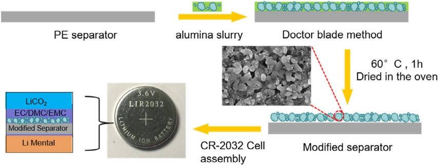
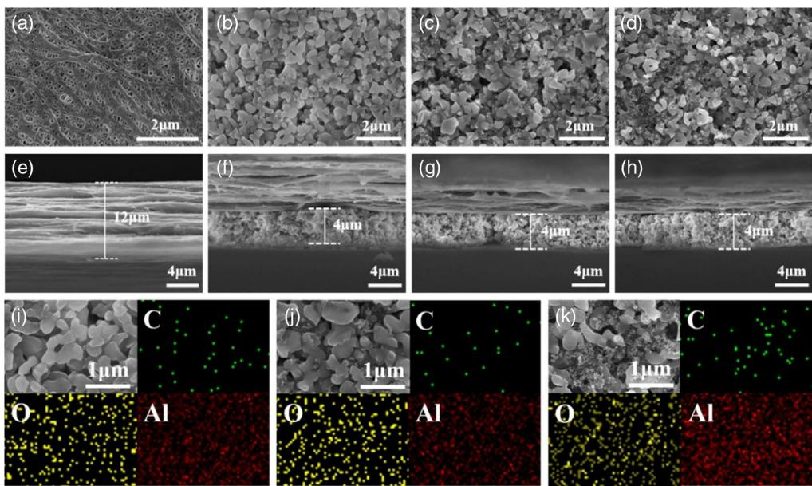
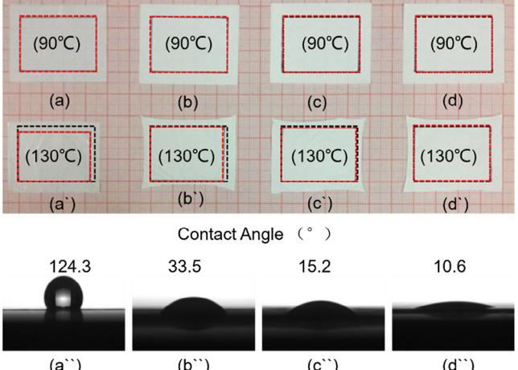
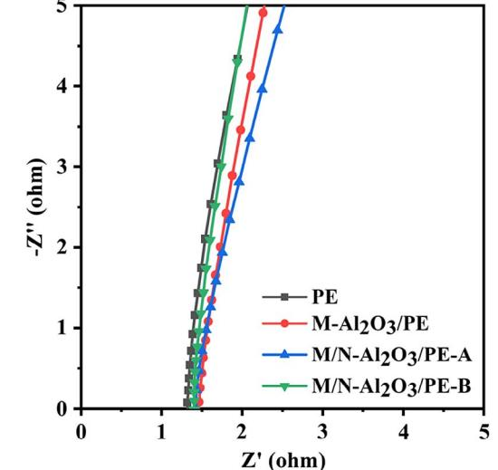
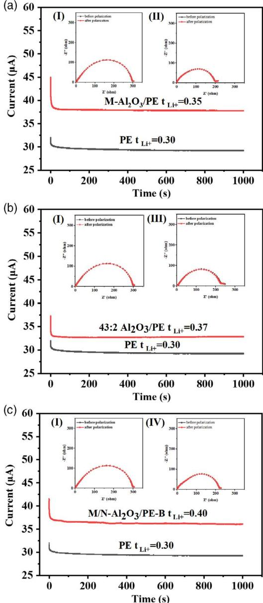
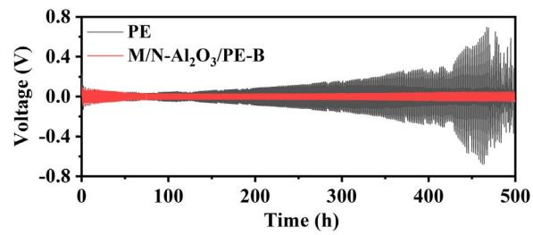
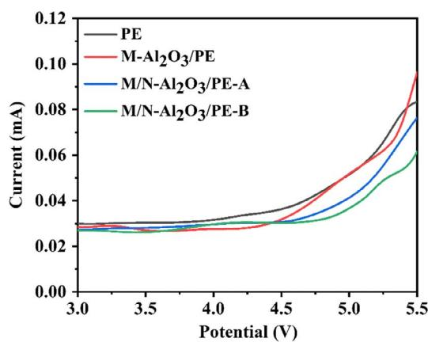
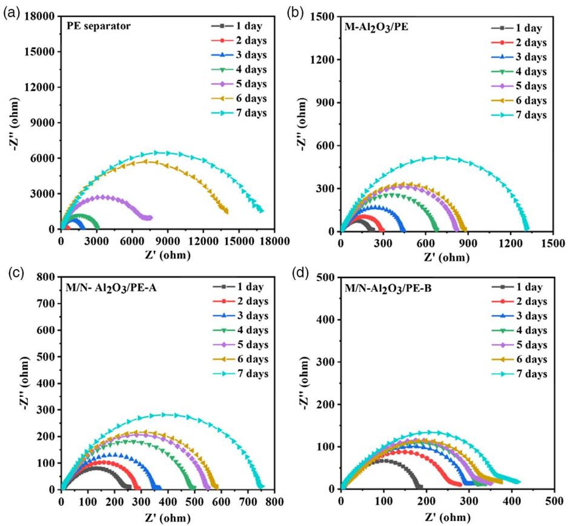
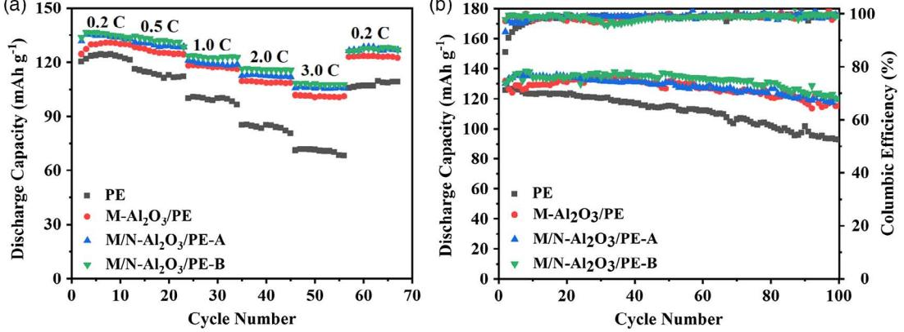
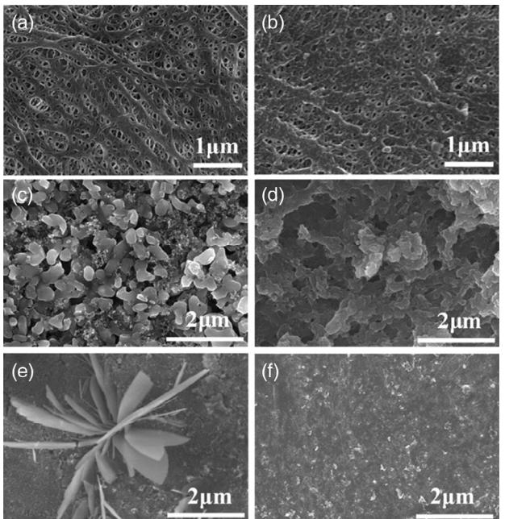

# Dual-Scale Al2O3 Particles Coating for High-Performance Separator and Lithium Metal Anode

Qingtong Wang, Jian Yang, Zhuyi Wang, Liyi Shi,\* Yin Zhao, and Shuai Yuan\*

Herein, the polyethylene (PE) separators are coated by micro/nanoalumina particles. The alumina particles with different sizes play different roles. The microalumina mainly enhances the thermal stability of the polyolefin separator and provides large channels for lithium-ion diffusion. The nanoalumina particles are helpful in improving the lithium-ion transference number by increasing the contact interface area of electrolyte/alumina. The lithium-ion transference number of the separators with different coatings increases from 0.32 to 0.40, mainly due to the ratio of micro/nanoalumina particles. Meanwhile, ion conductivity increases from 0.30 to 0.40 mS cm1 . As a result, the cycling stability of the lithium metal anode is greatly improved by the synergetic effect of microsized alumina particles and nanosized alumina particles.

#### 1. Introduction

Lithium-ion batteries (LIBs) have received wide attention due to their high energy density and power density and long cycle life, meeting the demands for energy storage and electric vehicles.[1–4] The separator is an important component of the LIBs, preventing direct contact between the cathode and anode and allowing ions to shuttle between two electrodes.[5] Its performance directly affects the safety, capacity, and life of battery.[6,7] Therefore, separators should have a high thermal stability, chemical stability, and good ionic conductivity.[8]

Currently, the separators commonly used in LIBs are microporous polyolefin membranes such as polypropylene (PP) and polyethylene (PE) because of their low cost, good mechanical strength, and chemical stability. However, these polyolefin separators exhibit serious shrinkage at high temperatures, which may cause internal short circuits, fire, and even explosion.[9,10] Furthermore, the difference in polarity between the polyolefin separator and the organic electrolyte solvent results in poor wettability, which hinders absorption and retention of organic

Q. Wang, J. Yang, Z. Wang, Prof. L. Shi, Y. Zhao, Prof. S. Yuan Research Centre of Nanoscience and Nanotechnology Shanghai University Shanghai 200444, China E-mail: [shiliyi@shu.edu.cn;](mailto:shiliyi@shu.edu.cn) [s.yuan@shu.edu.cn](mailto:s.yuan@shu.edu.cn) Prof. S. Yuan Emerging Industries Institute Shanghai University Jiaxing, Zhejiang 314006, China

The ORCID identification number(s) for the author(s) of this article can be found under<https://doi.org/10.1002/ente.201901429>.

DOI: 10.1002/ente.201901429

electrolyte solution into the separator. As a result, the polyolefin separator has a lower conductivity.[11,12]

To improve the thermal stability of the polyolefin separator, organic materials such as polyvinylidene fluoride (PVDF)- hexafluoro propylene and aramid nanofiber and inorganic oxide particles such as Al2O3 and SiO2 are usually used to modify the polyolefin separators.[13–17] Compared with organic materials, the inorganic coating materials show a higher thermal stability and lower cost. However, there is no significant improvement on the conductivity and Liþ-ion transference number of the separator. In our previous work, SiO2 or ZrO2 nanoparticles were deposited on PE

separators, which improved the ionic conductivity and Liþ-ion transference number significantly. For example, the self-assembly of PEI/SiO2 (-5 nm) on a PE separator can improve the ionic conductivity from 0.36 to 0.49 mS cm1 and the Liþ-ion transference number from 0.36 to 0.66.[18] A functional ultrathin multilayer film was constructed on a PE separator using a layer-by-layer (LBL) selfassembly process of poly(acrylic acid) (PAA) and ZrO2 (-10 nm). The ionic conductivity of the separator increased from 0.36 to 0.51 mS cm1 , and the Liþ-ion transference number increased from 0.37 to 0.60.[19] Our further research reveals that the specific surface area of the inorganic particles with a small size can improve their contact interface area with electrolyte, which has a great effect on the ion transport behavior of cations and anions.[20] However, the ultrathin layers are not effective in improving thermal stability.

Based on the aforementioned analysis, it is possible to develop high-performance separators by coating materials, combining the advantages of microsized particles and nanosized particles. As shown in Figure 1, the micro/nanoalumina particles were mixed to produce the coating slurry. Then, the slurry was coated on the PE separator by the doctor-blade method. The characterization and measurement results reveal that the dual-scale alumina coating can enhance the thermal stability of the PE separator more effectively. Meanwhile, the dual-scale alumina particle recombination can increase the ionic conductivity and higher Liþ-ion transference number.

#### 2. Results and Discussion

#### 2.1. Structure and Physical Properties

Figure 2 shows the scanning electron microscopy (SEM) images of the surface morphology and cross section for the pristine PE

Figure 1. Scheme of the preparation of a dual-scale alumina particle–modified PE separator.

Figure 2. SEM image of surface and cross section for a,e) pristine PE, b,f ) M-Al2O3/PE, c,g) M/N-Al2O3/PE-A, and d,h) M/N-Al2O3/PE-B; EDS elemental maps of the surface of i) M-Al2O3/PE; j) M/N-Al2O3/PE-A, and k) M/N-Al2O3/PE-B.

separator and coated separator. The PE separator has q uniform pore structure (Figure 2a). As shown in Figure 2b, the PE separator was coated by submicro Al2O3 particles. There are obvious pores due to the irregular shape of Al2O3 particles. According to Figure 2c,d, the nanosized Al2O3 particles are uniformly dispersed in submicro particles. With the increasing content of nanosized Al2O3 particles, the voids between submicro Al2O3 particles are filled more uniformly. Compared with Figure 2b, the dual-scale structure will increase the specific surface area of the coating layer, which is meaningful to adsorb and retain the organic electrolyte and promote the Liþ-ion flux more homogeneously.

Combined with the Gurley value of the separator in Table 1, it can be concluded that the coating layer will inevitably increase the Gurley value due to the particles' blocked pores and increased thickness of the separator. However, the participation of nanosized Al2O3 has a positive effect on reducing the Gurley value, leading to a higher ionic conductivity, compared with the

microalumina coating separator. According to the SEM images in Figure 2, it may be due to the higher viscosity of slurry in the presence of nanosized Al2O3 which can prevent the deposition of particles and produce more connected pores. Moreover, as shown in Figure 3 and Table 1, the thermal dimensional shrinkage of the pure PE separator was about 20% after heat treatment at 130 C for 30 min, whereas M/N-Al2O3/PE-A and M/N-Al2O3/ PE-B separator coated by submicro/nanoceramic particles were almost zero, indicating that it can greatly improve the dimensional stability. The enhancement of thermal stability is mainly attributed to the formation of micro/nanoalumina particles' evenly hybrid coating.

The electrolyte uptake and contact angle properties of the pristine PE separator and modified separators are shown in Table 1 and Figure 3. The pristine PE membrane is hydrophobic, which is not conducive to the wetting of electrolyte. In contrast, the contact angles of the dual-scale Al2O3 particle-modified separators changed from 124.3 to 15.2 and 10.6, which show a better

[www.advancedsciencenews.com](http://www.advancedsciencenews.com) [www.entechnol.de](http://www.entechnol.de)

| Sample         | Gurley value [s 100 cc1 ] | Contact angle [] | Electrolyte uptake [%] | Thermal dimensional shrinkage [%, 130 C] | Ionic conductivity [mS cm1 ] | Liþ-ion transference number |
|----------------|---------------------------------|---------------------|---------------------------|---------------------------------------------|------------------------------------|--------------------------------|
| PE separator   | 181                             | 124.3               | 128                       | 19.5                                        | 0.32                               | 0.30                           |
| M-Al2O3/PE     | 250                             | 33.5                | 224                       | 9.5                                         | 0.38                               | 0.35                           |
| M/N-Al2O3/PE-A | 221                             | 15.2                | 256                       | 0                                           | 0.39                               | 0.37                           |
| M/N-Al2O3/PE-B | 204                             | 10.6                | 277                       | 0                                           | 0.40                               | 0.40                           |

Table 1. Properties of pristine PE separator and modified separators.

Figure 3. Thermal stability at 90 and 130 C and contact angle comparison of a,a0 ,a00) pure PE; b,b0 ,b00) M-Al2O3/PE; c,c0 ,c00) M/N-Al2O3/PE-A; and d, d0 ,d00) M/N-Al2O3/PE-B separator, respectively. The black dotted framework indicates the original size of the separator before heat treatment (3.5 cm 2.5 cm), and the red dotted framework represents the size of the heat-treated separator.

wetting property than the separator coated only by micro Al2O3 particles. Compared with the pristine PE separator, the electrolyte retention of coated separators increases from 128% to 224%, 256%, and 277% with the increasing content of nanosized Al2O3 in the coating layer, respectively. Combining the morphologies and Gurley value test results, the introduction of nanosized Al2O3 may increase the specific surface area and porous structure. Both of these two factors may enhance the wetting performance of the modified separator.

#### 2.2. Electrochemical Properties of Separators

Figure 4 shows the Nyquist plots of the stainless steel (SS)/ separator–electrolyte/SS molds assembled by sandwiching the pristine PE separator or coated separators soaking liquid electrolyte between two pieces of SS. In the Nyquist diagram, the value corresponding to the intercept on the Z axis is assigned to the resistance value R of the separator. The ionic conductivities of pristine PE, M-Al2O3/PE, M/N-Al2O3/PE-A, and M/N-Al2O3/ PE-B at room temperature were obtained by calculating the resistance value, thickness, and area of the separator, which were 0.32, 0.38, 0.39, and 0.40 mS cm1 , respectively (Table 1). Compared with the pristine PE separator, the coated separators

Figure 4. Nyquist plots of cells (SS/separator–electrolyte/SS) with liquid electrolyte-soaked PE separator and coated PE separators at 25 C.

show higher ionic conductivities, which confirm that the Al2O3 coating layers have good ionic conductive properties. Most of all, the dual-scale Al2O3 particles' coating layers show better ionic conductive properties due to the improved pore structure, wettability, and retention of liquid electrolyte. However, the viscosity of the coating slurry increases significantly and the coating process turns out to be difficult when the ratio of submicro-Al2O3/ nano-Al2O3 reduces to 40:5. So, in this work, the sample of M/N-Al2O3/PE-B (micro-Al2O3/nano-Al2O3 equals 41:4) shows the best ion conductivity.

The Liþ-ion transference number is an important parameter which reflects the contribution of Liþ ion in the liquid electrolyte. The Liþ-ion transference number can be calculated by combining a Li/separator–electrolyte/Li battery with chronoamperometry and electrochemical impedance spectroscopy. According to Figure 5, the Liþ-ion transference numbers of pristine PE, M-Al2O3/PE, M/N-Al2O3/PE-A, and M/N-Al2O3/PE-B are 0.30, 0.35, 0.37, and 0.40, respectively. Generally, the Liþ-ion transference behaviors are affected by not only the affinity of the electrolyte property and pore structure of separators but the interaction between the electrolyte and separator surface.[21,22] The M/N-Al2O3-comodified separator improved wettability and made it more hydrophilic to the electrolyte, thus altering diffusion coefficients, leading to an enhanced transference number. In contrast, according to the previous work, the Lewis acid sites

Figure 5. The chronoamperometry of Li/separator–electrolyte/Li cells assembled with a) PE versus M-Al2O3/PE, b) PE versus M/N-Al2O3/PE-A, and c) PE versus M/N-Al2O3/PE-B. Inset: EIS for the same cells before and after polarization assembled with (I) PE separator, (II) M-Al2O3/PE, (III) M/N-Al2O3/PE-A, and (IV) M/N-Al2O3/PE-B.

on the inorganic nanoparticles will help to trap the anion ions and solvent molecules in the electrolyte, resulting in more free Liþ ions to be available for conduction, which may be another reason of increasing Liþ-ion transference number.[23,24]

To evaluate the cycling stability between the separator and the lithium anode, the Li/separator–electrolyte/Li cells using pristine PE and M/N-Al2O3/PE-B separator were cycled at a constant current density of 1 mA cm2 with an areal capacity of 1.0 mAh cm2 . As shown in Figure 6, the Li/Li symmetric cell with the M/N-Al2O3/PE-B separator shows a low and stable

[www.advancedsciencenews.com](http://www.advancedsciencenews.com) [www.entechnol.de](http://www.entechnol.de)

Figure 6. Voltage–time curves of Li/separator–electrolyte/Li cells (constant current density 1.0 mA cm2 and 1.0 mAh cm2 ).

overpotential during the Li moving process for 500 h. In comparison, the Li/Li cell with a pristine PE separator exhibits a larger overpotential after cycling for 200 h due to the constantly generated solid electrolyte interface (SEI). Moreover, after continuous cycling for 500 h, a sudden voltage decrease occurs, which indicates a short-circuit being formed caused by dendrite growth.[25,26] These results confirm that the modified separator endows a homogenous Li deposition and effectively suppressed dendrite growth. Compared with the symmetric cell using the pristine PE separator, the cell using the M/N-Al2O3/PE-B separator provides a stable cycling performance.

An electrochemical window is also a vital parameter to evaluate the electrochemical stability of separators, which were investigated by linear sweep voltammetry (LSV) tests. As shown in Figure 7, there were no obvious current changes during the potential sweeps at 4 V, whereas the current showed a dramatic increment between 4.0 and 5.5 V. The onset of the suddenly increasing current was caused by the oxidative reaction of electrolyte decomposition, and the corresponding voltage indicates the maximum electrochemical stable voltage. The electrochemical stabilities of PE separators are about 4.1 V (vs Liþ/Li). In comparison, the current onsets of M-Al2O3/PE, M/N-Al2O3/ PE-A, and M/N-Al2O3/PE-B separators are 4.25 V and 4.6 V, respectively. The M/N-Al2O3/PE-B separator has a wider electrochemical stability window of about 4.75 V (vs Liþ/Li), which indicates that the dual-scale alumina-modified separator possessed better electrochemical stability and could be used in

Figure 7. Linear scan voltammetry (LSV) curve of Li/separator– electrolyte/SS cells.

higher-voltage devices. The dual-scale alumina-modified separator exhibited a better electrolyte affinity and higher uptake, which may decrease the highest occupied molecular orbital energy level and reduce the irreversible electrolyte decomposition reaction on the cathode, thus leading to an improvement on electrolyte antioxidation stability.[27–29]

To better understand the stability of the electrolyte/anode interface, the alternating current (AC) impedance spectra of the Li/separator–electrolyte/Li cells using different separators were measured (Figure 8). The intersection of the impedance semicircle and Z0 axis represents bulk resistance (Rb). The semicircle reflects the interface impedance value (Rint), which mainly results from the passivation layer deposited on the anode surface.[30] It can be observed that the interface impedance value increased continuously with the increasing storage time. Compared with the increasing interface resistance of the pure PE separator, the interface impedance of the M/N-Al2O3/PE-B membrane is much smaller and relatively steady, which should be ascribed to its affinity to electrolyte and rich pore structure. The liquid is adsorbed into the separator, reducing the contact resistance between the electrolyte and the electrode, thereby forming a stable SEI film on the surface of electrode.[31]

To further understand the beneficial effect of micro/nanoalumina particle-modified separators on battery performance, the half cells were packed with LiCoO2 cathode and lithium metal anode. The cells were charged at 0.2 C and cycled between 3.0

and 4.2 V. According to Figure 9a, the half cell composed of the pristine PE separator shows the lowest initial capacity at different rates. Compared with the cell using the pristine PE separator, the cell assembled with the M-Al2O3/PE-B separator shows a significantly improved C-rate performance. According to the analysis results on ionic conductivity and electrolyte uptake, the improvement should be mainly due to the increasing ability of lithium-ion migration and reducing moving resistance. Moreover, this result is consistent with the results of the Liþ-ion transference number. A higher Liþ-ion transference number indicates a faster migration process of the lithium ion in the membrane, which can enhance the C-rate performance.

As shown in Figure 9b, at an cycling operating condition of 0.2 C for discharging processes between 3.0 and 4.2 V, the half cell consisting of the pure PE separator has a capacity retention ratio of 73.8% after 100 cycles, whereas the half cells modified by M-Al2O3/PE, M/N-Al2O3/PE-A, and M/N-Al2O3/PE-B have capacity retention ratios of 87.4%, 91.8%, and 92.3% after 100 cycles, respectively. Compared with the cell using a pure PE separator, the half cell composed of the modified separator exhibits a significant improvement on discharge specific capacity and capacity retention.

As shown in Figure 10, the surface of the PE and modified separator after 100th cycling was investigated by SEM images, it was found that the surface morphology of micro/nanoalumina particles' comodified separator still maintained an interconnected

Figure 8. AC impedance spectra of Li/separator–electrolyte/Li cells based on a) PE, b) M-Al2O3/PE, c) M/N-Al2O3/PE-A, and d) M/N-Al2O3/PE-B.

Figure 9. a) Rate capability of half cells composed of different separators; b) cycling performance and Coulombic efficiency of half cells at 0.2 C.

Figure 10. SEM images of the a) PE and c) M/N-Al2O3/PE-B-modified separators before cycling; b) PE and d) M/N-Al2O3/PE-B-modified separators after 100th cycling; and e,f ) Li metal electrodes disassembled from cells after 100th cycling using PE and M/N-Al2O3/PE-B-modified separator, respectively.

structure without crack and alighting, which indicates that a modified membrane and electrolyte maintained a good structure stability. The ongoing chemical reaction between the active lithium metal and the organic liquid electrolyte causes uneven lithium-ion deposition and an unstable lithium dendrite, which has a serious negative effect on the cycling life of the LIB. To better understand this process, the cell was disassembled after 100th cycling and the surface morphology of the lithium metal surface was shown in Figure 10e,f. The surface of the lithium metal using a PE separator showed an obvious formation of rod-like lithium dendrites. However, the cell assembled with the modified membrane remained a relatively smooth structure, indicating that the modified PE membrane can effectively

prevent dendrite growth during cycling.[32,33] This is mainly due to the excellent electrolyte retention and rich lithium-ion transport channels of the dual-scale alumina coating particles, which improved ionic conductivity and Liþ-ion transference number, resulting in the lithium-ion deposition more uniformly on the lithium metal anode. It can effectively inhibit the formation of lithium dendrites during the charge/discharge process, greatly increasing the electrochemical cycling performance.

## 3. Conclusions

Compared with the pure PE separator, the M/N-Al2O3/PE-B-coated separator exhibited good thermal stability, enhanced electrolyte wettability, and increased ionic conductivity from 0.30 to 0.40 mS cm1 and improved the lithium-ion transference number from 0.30 to 0.40. The enhanced electrochemical performance was attributed to the double-scale alumina particles, especially the nanosized particles greatly increase the specific surface area of the separator and forms a rich porous network channel. Such a separator structure facilitates the absorption of organic electrolyte and boosts the lithium-ion migration. Thus, the battery composed of the M/N-Al2O3/PE-B film showed a capacity retention rate of 92.3% after 100 cycles, which could be applied in high-performance LIBs.

### 4. Experimental Section

Materials: Microalumina particles (D50 ¼ 0.7 μm) were obtained from Sinocera. Nanoalumina particles (-13 nm) were supplied by Evonik. PVDF (HSV900) was obtained from Arkema. 1-Methyl-2-pyrrolidinone (NMP) was purchased from Aladdin. Lithium cobalt (III) oxide (LiCoO2) was supplied by Alfa-Aesar. Li metal tablet (diameter: 1.6 mm, thickness: 1 mm) was obtained from China Energy Lithium Company (Tianjin, China). Liquid electrolyte consisting of 1.0 M LiPF6 in ethylene carbonate (EC)–dimethyl carbonate (DMC)–ethyl methyl carbonate (EMC) (1/1/1 by volume) was purchased from Guotai Huarong Company (Zhangjiagang, China). The PE separator was purchased from Chinaly New Materials Co., Ltd. (12 μm microporous PE film).

Preparation of Dual-Scale Alumina Dispersion: Dual-scale alumina dispersion was obtained by wet grinding micro/nanoalumina particles. About 45.0 g alumina particles mixture containing submicroparticles and nanoparticles was added in 54.6 g deionized water under stirring.

[www.advancedsciencenews.com](http://www.advancedsciencenews.com) [www.entechnol.de](http://www.entechnol.de)

Then, the dispersion was ground for 30 min. The solid content of the dispersion was 45%.

Fabrication of Dual-Scale Al2O3/PE Separators: About 3.0 g of PAA binder was added to 44.4 g alumina dispersion and stirred for an additional 3 h to obtain coating slurry. Then, the slurry was coated on the pristine PE separator by a doctor-blade method. The thickness of the coating layer was 4.0 μm. Then, the coated separator was dried at 60 C for 1 h. The same method was also used to produce a single-scale or submicro alumina-modified pure PE separator. The modified PE separators with different coating solutions were named M-Al2O3/PE (only submicro alumina particles), M/N-Al2O3/PE-A (submicro: nano ¼ 43:2), and M/N-Al2O3/PE-B (submicro: nano ¼ 41:4), respectively.

Characterization: The surface and cross-sectional morphology of separators and elemental distribution were observed by field-emission SEM and energy-dispersive X-ray spectroscopy (EDS, S-4800). The Gurley value was tested by Gurley densometer (UEC-1012-A). The wettability of the separator was evaluated by the contact angle analyzer (KRUSS, DSA100). The electrolyte uptake of the separator was calculated by the following formula[34]

$$
\Delta W\% = (W_i - W_0)/W_0 \times 100\% \tag{1}
$$

Wi represents the mass after the separator-soaking electrolyte, and W0 represents the initial mass of the separator. The thermal shrinkage of the separator is calculated by the formula[35]

$$
\Delta A = (A_0 - A_i)/A_0 \times 100\% \tag{2}
$$

A0 indicates the area of the separator before heat treatment, and Ai represents the area of separator after heat treatment at 130 C for 0.5 h.

Electrochemical Measurements: Ionic conductivity was an important parameter for the separator. The ionic conductivity was determined using the polytetrafluoroethylene (PTFE) test mold instead of the coin cell. The separator–electrolyte was fixed into the cylindrical PTFE mold, among which the gasket and spring pressed the separator, then the mold was screwed by two SS, and the pressure was about 10 PSI. After standing for 12 h to make sure the separator was soaked by the electrolyte, the impedance of the system was tested on CH1660E electrochemical workstation with AC amplitude of 5 mV in the frequency range from 0.1 Hz to 1 MHz at 20 C. The ionic conductivity (δ) calculation formula is as follows[36]

$$
\delta = L/(R \times S) \tag{3}
$$

where L represents the thickness of the separator, S represents the effective area of the separator for AC impedance testing, and R represents the impedance value measured by the AC impedance test procedure.

The lithium-ion transference number was measured by combining the chronoamperometry method and an AC impedance method of Li/separator–electrolyte/Li cells according to the equation[37]

$$
t_{\text{Li+}} = I_{\text{s}}(\Delta V - R_0 I_0) / I_0(\Delta V - R_{\text{s}} I_{\text{s}})
$$
\n(4)

ΔV represents the polarization voltage (10 mV), I0 represents the initial current, Is represents the steady-state current, R0 represents the initial resistance value, and Rs represents the steady-state resistance value. The curve of the electrochemical stability window was obtained by measuring the LSV of Li/separator–electrolyte/Li molds on the CHI660 electrochemical workstation. The sweep speed was 5 mVs1 , and the voltage was in the range of 1.0–6.0 V (vs Liþ/Li). The change in interface impedance was measured by testing the AC impedance spectra with different shelving time intervals.

The half cells using different separators with the LiCoO2 cathode and lithium anodes were assembled in a glovebox filled with high-purity argon. The cycling performance and C-rate performance tests were conducted on the LAND CT2001A battery test system. The charge and discharge voltages were set to 3.0–4.2 V.

#### Acknowledgements

The authors acknowledge the National Natural Science Foundation of China (21503131 and 51711530162) for financial support.

# Conflict of Interest

The authors declare no conflict of interest.

#### Keywords

ion conductivities, Liþ-ion transference numbers, lithium metal anodes, micro/nanocomposites, separators

> Received: December 11, 2019 Revised: February 21, 2020 Published online: February 26, 2020

- [1] A. Mauger, C. M. Julien, Ionics 2017, 23, 1933.
- [2] T. H. Kim, J. S. Park, S. K. Chang, S. Choi, J. H. Ryu, H. K. Song, Adv. Energy Mater. 2012, 2, 860.
- [3] A. Zhamu, G. Chen, C. Liu, D. Neff, Q. Fang, Z. Yu, W. Xiong, Y. Wang, X. Wang, B. Z. Jang, Energy Environ. Sci. 2012, 5, 5701.
- [4] B. Scrosati, J. Hassoun, Y. K. Sun, Energy Environ. Sci. 2011, 4, 3287.
- [5] P. Arora, Z. M. Zhang, Chem. Rev. 2004, 104, 4419.
- [6] S. S. Zhang, J. Power Sources 2007, 164, 351.
- [7] G. Venugopal, J. Moore, J. Howard, S. Pendalwar, J. Power Sources 1999, 77, 34.
- [8] Q. Cheng, W. He, X. Zhang, M. Li, X. Song, RSC Adv. 2016, 6, 10250.
- [9] H. Lee, M. Yanilmaz, O. Toprakci, K. Fu, X. Zhang, Energy Environ. Sci. 2014, 7, 3857.
- [10] N. S. Choi, Z. Chen, S. A. Freunberger, X. Ji, Y. K. Sun, K. Amine, G. Yushin, L. F. Nazar, J. Cho, P. G. Bruce, Angew. Chem., Int. Ed. 2012, 51, 9994.
- [11] X. B. Cheng, T. Z. Hou, R. Zhang, H. J. Peng, C. Z. Zhao, J. Q. Huang, Q. Zhang, Adv. Mater. 2016, 28, 2888.
- [12] D. Wang, W. Zhang, W. Zheng, X. Cui, T. Rojo, Q. Zhang, Adv. Sci. 2017, 4, 1600168.
- [13] H. Liu, J. Xu, B. Guo, X. He, Ceram. Int. 2014, 40, 14105.
- [14] D. Fu, B. Luan, S. Argue, M. N. Bureau, I. J. Davidson, J. Power Sources 2012, 206, 325.
- [15] J. K. Pi, G. P. Wu, H. C. Yang, C. G. Arges, Z. K. Xu, ACS Appl. Mater. Interfaces 2017, 9, 21971.
- [16] Y. Wang, S. Wang, J. Fang, L.-X. Ding, H. Wang, J. Membr. Sci. 2017, 537, 248.
- [17] H. Jeon, D. Yeon, T. Lee, J. Park, M.-H. Ryou, Y. M. Lee, J. Power Sources 2016, 315, 161.
- [18] Z. Wang, F. Guo, C. Chen, L. Shi, S. Yuan, L. Sun, J. Zhu, ACS Appl. Mater. Interfaces 2015, 7, 3314.
- [19] W. Xu, Z. Wang, L. Shi, Y. Ma, S. Yuan, L. Sun, Y. Zhao, M. Zhang, J. Zhu, ACS Appl. Mater. Interfaces 2015, 7, 20678.
- [20] M. Chi, L. Shi, Z. Wang, J. Zhu, X. Mao, Y. Zhao, M. Zhang, L. Sun, S. Yuan, Nano Energy 2016, 28, 1.
- [21] L. He, T. Qiu, C. Xie, X. Tuo, J. Appl. Polym. Sci. 2018, 135, 46697.
- [22] M. F. Lagadec, R. Zahn, V. Wood, Nat. Energy 2018, 4, 16.
- [23] M. Waqas, S. Ali, D. Chen, B. Boateng, Y. Han, M. Zhang, J. Han, J. B. Goodenough, W. He, Composites, Part B 2019, 177, 107448.
- [24] W. Chen, L. Shi, H. Zhou, J. Zhu, Z. Wang, X. Mao, M. Chi, L. Sun, S. Yuan, ACS Sustainable Chem. Eng. 2016, 4, 3794.

- [25] D. Zhou, A. Tkacheva, X. Tang, B. Sun, D. Shanmukaraj, P. Li, F. Zhang, M. Armand, G. Wang, Angew. Chem., Int. Ed. 2019, 58, 6001.
- [26] X. Wang, H. Zhai, B. Qie, Q. Cheng, A. Li, J. Borovilas, B. Xu, C. Shi, T. Jin, X. Liao, Y. Li, X. He, S. Du, Y. Fu, M. Dontigny, K. Zaghib, Y. Yang, Nano Energy 2019, 60, 205.
- [27] Z. Zhang, L. Hu, H. Wu, W. Weng, M. Koh, P. C. Redfern, L. A. Curtiss, K. Amine, Energy Environ. Sci. 2013, 6, 1806.
- [28] M. Schmidt, U. Heider, A. Kuehner, R. Oesten, M. Jungnitz, N. Ignat'ev, P. Sartori, J. Power Sources 2001, 97–98, 557.
- [29] Z. Qiu, L. Shi, Z. Wang, J. Mindemark, J. Zhu, K. Edström, Y. Zhao, S. Yuan, Chem. Eng. J. 2019, 368, 321.
- [30] Y. Wang, L. Fu, L. Shi, Z. Wang, J. Zhu, Y. Zhao, S. Yuan, ACS Appl. Mater. Interfaces 2019, 11, 5168.
- [31] M. Yanilmaz, Y. Lu, M. Dirican, K. Fu, X. Zhang, J. Membr. Sci. 2014, 456, 57.
- [32] J. Cui, J. Liu, C. He, J. Li, X. Wu, J. Membr. Sci. 2017, 541, 661.
- [33] R. Weber, M. Genovese, A. J. Louli, S. Hames, C. Martin, I. G. Hill, J. R. Dahn, Nat. Energy 2019, 4, 683.
- [34] L. Liu, Y. Wang, C. Gao, C. Yang, K. Wang, H. Li, H. Gu, J. Membr. Sci. 2019, 592, 117368.
- [35] H. Lee, H. Jeon, S. Gong, M.-H. Ryou, Y. M. Lee, Appl. Surf. Sci. 2018, 427, 139.
- [36] X. Zhu, X. Jiang, X. Ai, H. Yang, Y. Cao, ACS Appl. Mater. Interfaces 2015, 7, 24119.
- [37] X. Mao, L. Shi, H. Zhang, Z. Wang, J. Zhu, Z. Qiu, Y. Zhao, M. Zhang, S. Yuan, J. Power Sources 2017, 342, 816.