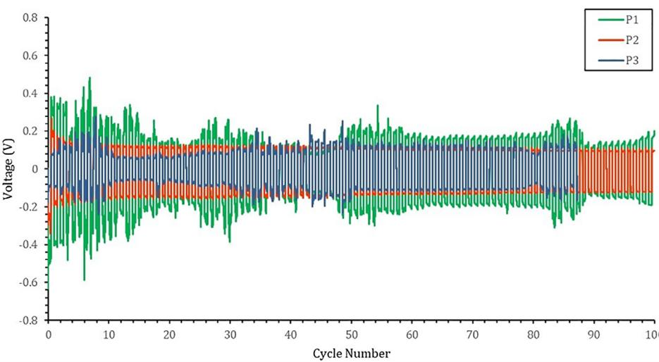
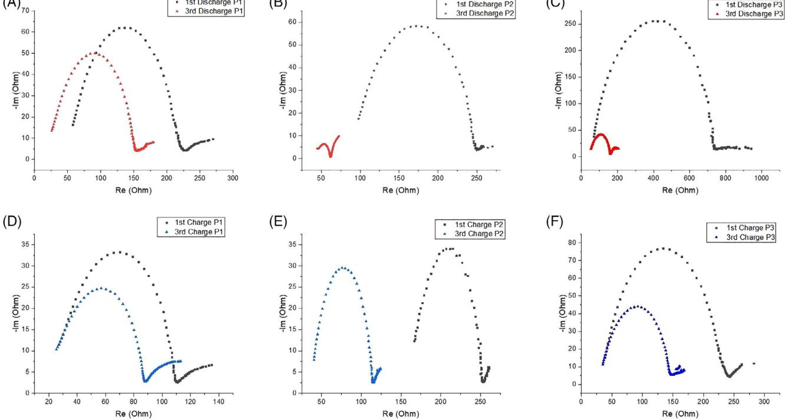
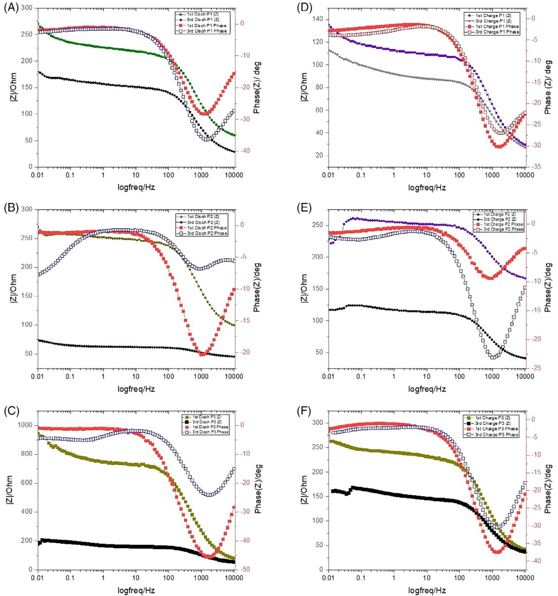
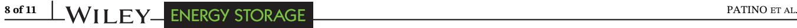
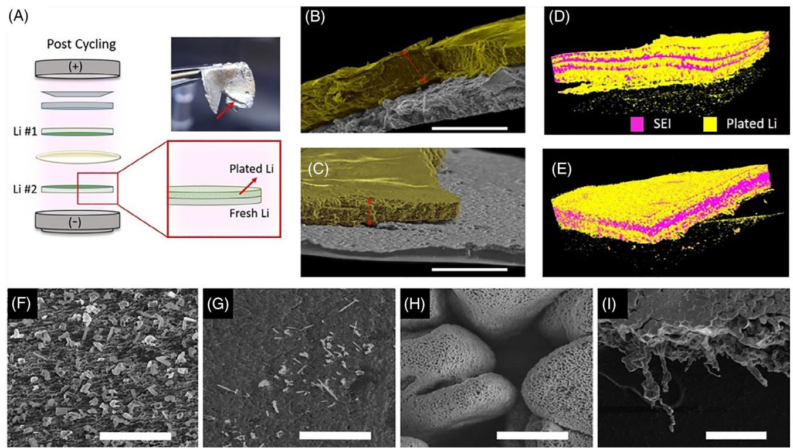

#### RESEARCH ARTICLE

# Beyond cell parameters: Exploiting cell operation towards optimizing the SEI and suppressing dendrite growth on lithium metal anodes

Daisy Patino1 | Bo Dong2 | Fabian Villalobos1 | Steven Herrera1 | Jeffrey Bell1 | Mihrimah Ozkan2,3 | Cengiz S. Ozkan1,3,4

1 Materials Science and Engineering Program, University of California, Riverside, California

2 Department of Electrical and Computer Engineering, University of California, Riverside, California

3 Department of Chemistry, University of California, Riverside, California

4 Department of Mechanical Engineering, University of California, Riverside, California

#### Correspondence

Cengiz S. Ozkan, Materials Science and Engineering Program, University of California, Riverside, CA. Email: [cozkan@engr.ucr.edu](mailto:cozkan@engr.ucr.edu)

Mihrimah Ozkan, Department of Electrical and Computer Engineering, University of California, Riverside, CA. Email: [mihri@ece.ucr.edu](mailto:mihri@ece.ucr.edu)

#### Funding information

Office of the Vice Chancellor for Research and Economic Development, University of California Riverside; Vantage Advanced Technology LLC, Grant/Award Numbers: 16040361, 16060655

#### Abstract

Lithium metal electrodes are regarded as the optimal anode for next generation lithium ion batteries especially in the lithium-sulfur architecture. Unfortunately, the lithium metal anode falls subject to several challenges such as dendrite formation and low Coulombic efficiency, which inhibit its candidacy as a viable technology. As such, substantial research efforts alter cell parameters in effort to manipulate interfacial chemistries, mitigate dendrite growth, and improve cyclability. Unlike conventional efforts, we demonstrate a practical cell operation approach to reinforce the Solid Electrolyte Interphase in lithium anodes via a refined formation protocol governed by the redox reactions found in lithium-sulfur systems. Galvanostatic and electrochemical impedance data on Li-Li symmetrical cells reveal that cell operation during the formation phase plays a critical role on interface stability of lithium metal anodes. Li-Li symmetrical cells subject to our refined protocol, P2, displayed advantages in steadily enduring high cycling currents of 6 mA with minimal polarization, and in lowering the charge transfer resistance at the cell interfaces by a fourfold when compared to cells subject to conventional formation protocols. Additionally, scanning electron microscopy images demonstrate that our formation protocol significantly minimizes the size and dispersion of lithium dendrites, as well as the degree of plated lithium. These effects are enabled by the reinforced SEI formed during P2 which offers a stable ratio between the rates of lithium intercalation to lithium deposition. Microcomputerized tomography characterization further supports these findings by revealing that P2 averts dendrite nucleation sites, and yields greater quantity of SEI species, encompassing 41.1% volume of the entire anode, compared to just 21.5% from the common formation protocol found in literature. Overall, this approach deviates from the convention of materials exploration yet highlights the importance of understanding the nature of interfacial chemistries in response to cell operation. We believe the

Daisy Patino and Bo Dong contributed equally to this work.

transferability of this approach has the potential to expedite the commercialization of next-generation lithium ion technologies.

KEYWORDS

conditioning, cycling rates, dendrite, in vivo, sulfur, symmetrical cells

# 1 | INTRODUCTION

Lithium ion batteries (LiBs) have been replacing power sources for numerous applications in recent years. The momentum for this trend is not expected to decline given their unique advantages in minimal emissions relative to fossil energy, and high energy density relative to other rechargeable batteries. Beyond consumer electronics, LiBs continue to shift global sectors of transportation and grid storage for renewable energies as societies become more invested in reducing our dependence on fossil energy.

However, the energy density of the commercial lithium ion technologies using lithium transition metal oxides as the cathode and graphite as the anode is limited to 100 to 265 Wh kg−1 and cannot meet the growing demands of industry transitions to electric vehicles and renewable energies.1,2 Hence, researchers are looking into the next-generation materials that can enable higher performing lithium ion technologies. Lithium-sulfur (Li-S) batteries have amassed substantial attention as a promising next-generation full cell system. Sulfur is regarded as the optimal cathode owing to its high specific capacity 1675 mAhg−1 , high energy density 2600 Wh kg−1 , and material abundance.3-5 Likewise, lithium metal is widely regarded as the optimal next-generation anode, owing to its high theoretical capacity of 3860 mAhg−1 , low gravimetric density 0.59 g/cm−3 , and low negative redox potential −3.04 V.6,7 However, the advancement of Li-S systems is hindered by an unbalanced research effort toward optimizing each electrode, respectively. While substantial research has been directed toward alleviating the challenges inherent to sulfur cathodes, as little as 2% of research efforts toward Li-S systems target to improve on the challenges inherent to lithium metal anodes.6,8,9 For lithium metal anodes, the critical investigations needed are scalable methods to improve on their high reactivity and excessive volume expansions which lead to poor cyclability and severe safety hazards. Although it is expected for electrodes to undergo volume changes during the cycling process, expansion becomes a concern when it irreversibly damages the structural integrity of an electrode. For example, conventional graphite anodes undergo a stable 10% volumetric expansion.6,10 However, sulfur cathodes undergo 80% volume changes and lithium anodes are subject to infinite volume changes.11,12 When extreme volumetric expansion is coupled with the inherent high reactivity of lithium metal anodes, their SEI layers suffer from several self-reinforcing challenges.

Due to the very low electrochemical potential of Li, electrolytes are spontaneously reduced at the surface and develop a mosaic SEI layer with heterogeneous ionic conductivity and nucleation sites for lithium deposition.12-14 Once the native SEI is formed upon battery assembly, its structural integrity is further governed by the rate of chemical reactions that occur during the "formation cycles"—the first several charge/discharge cycles commonly applied to a new battery. Although initial irreversible capacity loss is inevitable in new batteries, the formation of a uniform and stable SEI layer is critical to the safety and longevity of Li-S batteries as it will protect the anode's surface by allowing lithium ions to pass through and it, while preventing unwanted side reactions with electrolyte molecules. Upon high rate cycling, expansion in the SEI can cause irregularities in ion flux. Wherein, cracks in the SEI locally enhance ion flux by exposing fresh Li with a lower energy barrier for ion transport; and accumulated SEI which impede ion flux via local blockades for ion transport. Both instances adversely affect the battery by igniting a continuous consumption of lithium and electrolyte, which leads to an increase in cell resistance and ultimately, irreversible capacity fading.

More importantly, the impact of heterogeneous nucleation sites in the SEI is dendrite formation.15-17 During cyclic volume fluctuations, fractures in the SEI can cause dendrites to lose contact with current collector and remain as "dead lithium" in the electrolyte. This in effect, crowds the mobility of lithium ions through the electrolyte, and contributes to lowering of the Coulombic efficiency of the battery. Concurrently, extensive dendrite growth can protrude through the separator, resulting in an internal short circuit; this ultimately can lead to thermal runaway and pose safety hazards for consumers.18,19 As such, researchers look toward improving the stability and uniformity of the SEI to mitigate the adverse effects on cyclability and safety in lithium anodes. Common approaches toward optimizing the SEI alter cell parameters by integrating scaffolds20,21 and surface modifications via gaseous,22-24 chemical,25-28 and physical29-32 treatments of the lithium electrode prior to battery operation. However, these approaches hinge on a strict control over reaction and ambient conditions. Similarly, electrolyte compositions are altered via ion selective additives33-35 and report greater success in developing a controlled SEI that reduces side reactions with the electrolyte. These methods, however, involve a deliberate addition to the conventional cell parameters which adversely affect energy/power density and ultimately forgo scalability of battery manufacturing, whereas changes to the composition of a battery must be validated by the existing industrial qualification assessments and be compatible with the current manufacturing processes. Therefore, it is of great significance to find an effective method that can enhance the SEI layers without changing the cell parameters of the batteries. However, an in-depth understanding of the degradation mechanisms and dominating reactions during the cycling is necessary to achieve this goal.

Unlike conventional intercalation cathodes, the redox reactions during charge/discharge processes of lithiumsulfur batteries are complex and even still under investigation.36 Hence, such complexity makes it valuable to study the effects of modifying the charge/discharge procedures at specific state of charges. Conventional research usually neglects the design of the formation cycles and simply assumes slower cycling rates will achieve better SEI morphologies. For example, standard formation protocols simply operate a cell at a slow fixed rate within C/50-C/20 for a few cycles to allow for the formation of protective surface films.37,38 Recently, our group developed a cell operation approach toward reinforcing the SEI layer in Li-S batteries which evades the alteration of cell parameters.39 Our approach optimizes standard formation protocols by targeting the depth-ofdischarge (DOD) associated with the reduction of short chain polysulfides and the formation of a solid film in Li-S batteries.40 We found that by simply permitting more formation time (rate of C/100) within 2.1 to 1.7 V DOD, Li-S cells develop a noticeably more stable SEI. Electrochemical characterization of Li-S cells subject to the modified cell operation showed significant retention in capacity and Coulombic efficiency which we attribute to the mitigation of polysulfide shuttling via a reinforced SEI in the carbon-sulfur cathode. This work seeks to extend the investigation to demonstrate the effects of controlled cell operation on SEI reinforcement and dendrite suppression in lithium metal anodes for Li-S systems. To execute this, two-electrode symmetrical cells were utilized to isolate lithium metal anodes cycled within standard Li-S electrolyte (DOL: DME). Electrochemically symmetric cells have been proven to be a facile method to investigate ion migration, and interfacial chemistries in lithium metal anodes.41-43

### 2 | METHODS

# 2.1 | Fabrication of symmetrical cells

Symmetrical Li/Li cells were fabricated in 2032 type coin cells in an argon-filled glove box. Bare lithium foils of 16 mm in diameter were used as both working and counter electrodes with Celgard 3501 separators. A conventional lithium-sulfur electrolyte was used for all cells (1:1 DOL:DME, 1 wt% LiNO3, 1 M LiTFSI). All batteries were tested under room temperature with a Bio Logic VMP-3 for electrochemical procedures including galvanostatic cycling and potentiostatic electrochemical impedance spectroscopy (PEIS).

## 2.2 | Electrochemical formation procedure

We investigated three electrochemical formation protocols for a duration of three complete discharge and charge cycles. To account for the difference in working mechanisms in symmetrical cells vs cells with two distinct electrodes, cycling parameters were modeled after the amount of time LiS cells spent to complete a discharge/charge step at a given C rate.

The standard protocol, P1 models discharge rates of C/50 with a constant current of 168 μA, for the duration of time which sulfur cathodes completed the discharge/ charge steps at that rate, 28 hours. Likewise, P2 models sulfur cells subject to a modified two-step discharge protocol (discharge C/50 for 2.8-2.1 V, then C/100 for 2.1-1.7 V) with discharge currents of 168 μA for 17 hours, followed by 84 μA for 20 hours. Charge steps for this protocol (C/50) are modeled by a current of 168 μA for 28 hours. Finally, P3 subjects symmetrical cells to pulsed discharge and charge currents of 168 μA for 10-minute intervals, followed by 10-minute rests until LiS cells subject to the same procedure at C/50 reached full discharge or charge (125 repetitions per discharge and charge step).

Each formation protocol was followed by high rate cycling for 100 cycles. Wherein, LiS cells cycled at C/10 are modeled by symmetrical cells subject to a constant current of 6 mA for 1 hour durations for discharge and charge cycles.

### 2.3 | Electrochemical cycling with PEIS procedure

The electrochemical formation procedures were repeated with PEIS employed after each discharge and charge cycle to further characterize the interfacial reactions occurring at this stage. P1 applied the following sequence for three repetitions before proceeding to cycling at a high C rate: rest, PEIS, 168 μA discharge, rest, PEIS, 168 μA charge, repeat two times. The following high rate cycling (C/10 for LiS half-cells, 6 mA for symmetrical cells) employed PEIS every 10 cycles after the discharge and charge steps.

Similarly, P2 applied the following sequence for three repetitions before proceeding to cycling at a high C rate: rest, PEIS, 168 μA + 84 μA discharge, rest, PEIS, 168 μA charge, repeat two times. The following high rate cycling employed PEIS every 10 cycles after the discharge and charge steps.

Finally, P3 applied the following sequence for three repetitions before proceeding to cycling at a high C rate: rest, PEIS, 168 μA discharge for 10 minutes, rest 10 minutes, repeat 125 times, PEIS, 168 μA charge for 10 minutes, rest 10 minutes, repeat 125 times, repeat entire sequence three times.

# 2.4 | Characterization

The morphology of lithium metal surfaces postcycling was characterized by a NovaNano Scanning Electron Microscope (NNS450) operated within 3 to 5 kV. Microcomputed tomography (micro-CT) images were obtained by ZEISS Xradia 510 Versa with an exposure time of 1 second for 1601 projections and source settings of 80 kV, 81 μA, 180 scan, and 3.3998 μm pixel size. Threedimensional renderings were generated using Amira software. Sample preparation for micro-CT characterization involved opening postcycling symmetrical cells in an argon-filled glove box, and sealing the samples in a custom inert holder for transportation to the imaging facility.

# 3 | RESULTS AND DISCUSSION

The symmetrical cell configuration is a practical tool for investigating interfacial chemistries on lithium metal anodes; the stability of potential profiles directly translates the stability of reactions between the lithium surface and the electrolyte. High rate cycling profiles for cells that have been subject to the different formation protocols are shown in Figure 1. Each profile shown is an average of three batteries subject to that particular formation protocol. Initial cycling for all protocols shows the largest overwork potential which is explained by the native surface film formed on lithium metal from the spontaneous electrolyte reduction. At this state, the film is expected to be the thickest and most homogeneous44 which in effect noticeably hinders kinetics for lithium deposition and dissolution. Cells subject to the conventional formation protocol, P1, show an irregular evolution of overwork potential throughout the cycles. By cycle 20, overpotential of cells subject to P1 have decreased due to the improved local kinetics stemming from the cracks in native SEI which attract a nonuniform current distribution on the electrode, resulting in temporary decreased resistance. However, at cycle 30, overpotential rises again due to the rebuilding of the now irregular SEI, which slows down bulk kinetics of the cell since lithium deposition is accumulating on concentrated areas. This general trend repeats as the SEI developed during P1 is prone to cracking upon expansion because it was not formed uniformly enough during the formation cycles. At cycle 50 for P1, we see a steady increased overpotential which can be attributed to an increased amount of dead lithium, surface dendrites observed in Figure 4D, that broke off during expansion of the SEI, and are now crowding the electrolyte. In contrast, P2 cells show stable voltage polarization throughout 100 cycles, despite the fast cycling

FIGURE 1 Evolution of overwork potentials for Li/Li symmetrical cells during high rate plating/stripping processes with current density of 3 mA cm−2

current, suggesting that the two-step discharge formation current enabled a more homogeneous surface film that effectively lowers the variability and density of local currents. However, the improved performance from P2 cannot directly be attributed to the partially reduced current rate compared to P1. A mere decrease in formation current does not guarantee improved performance; Figure S1 shows an increased overpotential in cells that were subject to a consistent low current of 84 μA throughout the discharge cycles. This suggests that current rates are most impactful on the stability of interfacial chemistries during the end of a discharge cycle, as modeled by P2. Furthermore, the optimized local current density from P2 minimizes the extent of destructive lithium plating as observed by the decreased thickness of plated lithium compared to P1 (Figure 4C). Sparse dendrites formed on P2 cells Figure 4E are also supportive of a stable SEI which protected the lithium metal surface from excess side reactions.

P3 exhibits the narrowest overpotential within the initial cycles and between cycles 10 and 30, presuming to have the most stable interfacial chemistries among the tested formation protocols. However, the periodic voltage fluctuations observed are representative of local short-circuits which eventually result in global short circuit by cycle 88. A likely explanation for narrow overpotentials can be an increase in locally enhanced kinetics that stem from

PATINO ET AL. 5 of 11

significant cracks in the SEI and plated lithium (Figure 4F) during the pulsed cycling. Similar to the pulsed cycling nature of P3, standard galvanostatic intermittent titration technique profiles are shown to allow a cell's potential to rebound to a new equilibrium during the pulsed rest periods.45,46 This effectively causes strain upon frequent expansion and contraction within a given discharge/charge cycle. Significantly poor SEI in P3 cells is also supported by SEM images (Figure 4G) depicting dendrites order of magnitudes larger than dendrites found in P1 and P2. The large branch-like dendrites were able to grow more freely because less of the lithium metal surface was protected by a native SEI; in other words, fresh lithium metal was constantly reducing electrolyte and forming larger dendrites.

PEIS was employed during the different formation protocols to further investigate the kinetics, thermodynamic properties, and diffusion behaviors inside the electrolyte bulk and at the interfaces of symmetrical cells. In this study, a voltage signal of 10 mV was used within a frequency range 10 kHz to 10 MHz. An in-depth analysis for the equivalent circuit selection, and data fitting, on various LiBs and super capacitor applications can be found in previous work from our colleagues.47-51 Here, impedance data was acquired at the end of each discharge and charge sequence for the three formation cycles within each protocol. As shown in Nyquist Plots of PEIS, Figure 2, the diameter of semicircles indicates the

FIGURE 2 Nyquist plots measured after formation charge cycles for cells subject to, A, P1, B, P2, and C, P3; and after formation discharge cycles for, D, P1, E, P2, and F, P3

charge transfer resistance (Rct) at the double layers. Although both electrodes of the symmetric cells are lithium metal, they can never be chemically/electrochemically identical. In order to distinguish, terms "discharge" and "charge" are maintained in this study. Figure 2A-C isolates Nyquist plots for discharge cycles to highlight the effects of formation discharge rates on lithium metal anodes. Similarly, Figure 2D-F depicts Nyquist plots for the formation charge cycles for protocols P1 to P3. The decreasing impedance value in all figures are attributed to the gradual transition from local to bulk reactions, considering that the initial formation cycles depict preliminary wetting and development of native surface films. All protocols, except for P3, have similar starting impedance due to the inert oxidized surface of lithium foils. P3 shows exceptionally higher Rct during the first discharge, suggesting that the pulsed cycling style is destructive upon initial discharging. By the third discharge cycles, P2 cells show a fourfold decrease in Rct compared to that of the conventional P1 cells. This suggests that the discharge rates during formation benefit the surface area of surface films. Besides, all semicircles for P2 exhibit pronounced diffusion tails relative to the other formation protocols, which is evidence for the formation of beneficial surface area52 for fast lithium-ion diffusion. It can be attributed to the more favorable morphology of the SEI layers forming at the interfaces. The formation of this structure reduces the possibility of the lithium ions to participate into plating and other parasitic reactions. Instead, most of the lithium ions diffuse and intercalate in the formed structure which dramatically decreases the impedance of the cell. Meanwhile, it is obvious that the starting point of some figures also varies during the cycling, which is not commonly observed for half-cells or full cells under normal cycling conditions. However, such deviation mainly refers to the change of electrolyte and electrode material resistance. For symmetric cell, although the electrolyte resistance keeps stable under the formation cycles, the microstructure of the lithium metal electrodes changes a lot at the same time, which can be further proved by the SEM and CT images in Figure 4.

To further characterize the interfacial variations occurring in the cells during formation protocols, Bode plots of the same PEIS results are shown in Figure 3. Compared with Nyquist plot, Bode plots provide a detailed insight into the phase changes along the frequency spectrum, wherein, the phase changes from high to low frequency are depicted as valleys in Bode figures. Valleys that undergo significant changes in depth are indicative of inconsistent reactions occurring at the electrode surface. The drastic depth changes from −20 to −5 for P2 cells (Figure 3B,E) is therefore telling of unique reactions occurring within the formation protocol that are not present in P1 formation. Inconsistent reaction during these formation cycles can be representative of SEI formation since that process is expected to be more heterogeneous than plating in Li-Li symmetrical cells. Thus, we can infer the drastic depth change in the Bode valleys for P2 represent formation of robust SEI in comparison to P1, which is supportive of the stable high rate cycling of P2 in Figure 1. Cells that have minimal SEI layer are more prone to homogeneous lithium plating, and thus experience less diffusion behavior than cells with anomalous morphology due to a developed SEI layer. Furthermore, the phase angle change observed at the lower frequency range for P2 cells indicates the existence of the nanostructure which has a semiinfinite diffusion length. Such behavior cannot be observed for P1 due to the lack of diffusion behavior for the lithium surfaces that are more prone to plating. The significant phase change during the discharge cycles of P3 cannot be explained by the same phenomena as P2, as it is a result of the abnormally high initial impedance. After stabilization, P3 experiences minimal phase change comparable to P1.

Therefore, it is evident that for P2, the morphology of the SEI layers is beneficial for the rapid ionic diffusion and thus avoids metallic dendrite formation. Besides, the cycling data in Figure 1 further supports the analysis given above. For protocols P1 and P3, various voltage fluctuations can be observed, which indicates complicated reactions happening at the interfaces, including dendrite formation and SEI dissolution. All these reactions lead to the poor polarization behavior. However, due to the favorable morphology and possibly nanostructured lithium surface of P2, the cycling behavior is very stable.

Symmetrical cells are inevitably prone to lithium plating on both electrodes, as illustrated by Figure 4A, and are at higher risk than conventional cells to experience an accumulation of detached plated lithium in the separator thereby, leaving a cell at hazard of a short circuit. However, an analysis on the effect of formation protocols on plating within symmetrical cells can guide safer cell operation in full cells which incorporate lithium metal. Wherein, the extent of plating in response to formation protocols can provide further insights toward the stability of interfacial chemistries within the cells. The morphology of surface films containing plated lithium and dendrites was characterized postcycling with scanning electron microscopy (SEM). The widths of plated lithium highlighted yellow in Figure 4B,C were obtained using ImageJ processing; the width of plated lithium decreased to 190 μm when cells were subject to P2, in comparison to the 284 μm plated film for cells subject to P1. The notable reduction of plated lithium corresponds to an improved balance between the rate of lithium intercalation and lithium deposition for cells that were activated

FIGURE 3 Bode measurements taken after formation charge cycles for cells subject to, A,P1, B, P2, and C, P3; and after formation discharge cycles for, D, P1, E, P2, and F, P3

by P2. Whereas the increased plating for P1 further explain the over potential spikes in Figure 1.

Noninvasive X-ray tomography is a convenient tool for characterizing plating in lithium metal anodes. Here, low resolution micro-CT offers quantitative insights toward the influence of cell operation on the structural development of SEI and plated Li in symmetrical cells subject to formation protocols, P1 (Figure 4D) and P2 (Figure 4E). Fresh lithium metal at the base of the anodes is muted in the 3D renderings to isolate the stacked formation of plated lithium. Figure 4D shows plated lithium (yellow) forms a distinct layer above fresh lithium, upon the initial formation cycle. Each plated layer is followed by a thin stacking believed to contain SEI species (purple); the number of layers coincides with the number of formation cycles. The yellow specs at the base of both micro-CT images depict minute nucleations for plating at the outermost face of lithium metal in contact with the coin cell cap. In comparison, P2 cells form a greater quantity of SEI species, encompassing 41.1% volume of the entire anode, compared to just 21.5% for P1 cells. This further supports the conclusions drawn from electrochemical analysis in Figures 2 and 3. It is believed that the reduction of plated Li in addition to the dense packing of the layers (observed in Supplemental Figure S3) attribute to the improved intercalation mechanism for P2

FIGURE 4 Illustrations of plated Li: A, postcycling schematic and photograph. Cross-sectional scanning electron microscopy (SEM) images highlighted in yellow with 500 μm scale for, B, P1 cells, and C, P2 cells. Microcomputed tomography (micro-CT) rendering of plated lithium (yellow) and SEI (purple) for, D, P1 cells, E, P2 cells. Surface SEM images of dendritic plated Li with 10 μm scale for, F, P1 cells, G, P2 cells, H, P3 cells; and 100 μm scale depicting large dendrites for, I, P3 cells

cells. Moreover, Micro-CT reveals a rough topography for the surface of P1 cells (Supplemental Figure S4 and Supplemental Video) which serves as nucleation points for dendrite formation observed by SEM.

SEM images taken at the lithium surfaces show a drastic change in the population and size of dendrites for each formation protocol. Images for P1 cells depict dendrites as small white limbs, dispersed in high concentrations throughout the electrode (Figure 4F). Taking into consideration the cyclic increase in impedance for P1 cells, (Figure 1 at cycle 50), we can infer that a notable fraction of these dendrites detached upon cyclic volume expansions, resulting in a decrease of ionic mobility. In contrast, finer dendrites are found in areas of sparse population for lithium surfaces subject to P2 (Figure 4G). The smooth surface is conclusive of the refined formation rates allowing for lithium intercalation to prevail over uneven lithium deposition at the phase in which SEI development is most critical. Despite all cells were subject to high rate cycling immediately after formation protocols, only those that underwent protocol P2 developed an SEI with a lasting structural integrity that suppressed dendrite growth. The surface film morphology of P3 cells differ significantly to that observed for P1 and P2 cells. Interestingly, the pulsed nature of this protocol prevented uniform lithium plating, inferring a mechanically unstable SEI layer that could not withstand frequent volume fluctuations, thus enabling the large mosaic-like cracks visible in Figure 4H which act as local kinetic pathways for lithium deposition.53 Additionally, the surfaces of the mosaic structures are covered with nano moss-like lithium which are considered to be reaction limited54; the intermittent cycling style of P3 is likely to have influenced the reaction rates to form mossy lithium. Studies on Li-Li symmetrical cells have observed that once mossy lithium depletes electrolyte salt on the anode surface and ignites sudden growth of branch-like dendrites as observed by a voltage spike in Figure 1 around 34 cycles for P3. Mossy lithium and branch-like dendrites found in Figure 4I are likely to have caused the cell failures for P3 as observed in Figure 1, either due to electrolyte depletion or cell shortage via piercing of the separator.

#### 4 | CONCLUSION

Lithium metal is a promising anode for next generation LiBs, especially in the lithium-sulfur architecture. However, both electrodes have their individual challenges which hinder their commercialization; polysulfide shuttling, dendrite formation, and excessive volumetric expansion lead to more complex cycling mechanisms than conventional transition metal oxide/graphite batteries. Consequently, research efforts aimed at improving these systems must look beyond materials exploration; conventional cell operation and electrochemical characterization techniques need to be adapted for the new generation of lithium batteries. This paper highlights a practical approach for controlling SEI morphology and hence, the stability of lithium metal anodes via a refined formation protocol. Symmetrical cells subject to the refined discharge rates developed a robust SEI which enabled the cells to steadily endure high cycling currents of 6 mA with minimal polarization. In effect, the charge transfer resistance at the cell interfaces was decreased by a fourfold. Moreover, this method enabled a steady balance between lithium intercalation to lithium deposition rates which yielded smooth surface morphologies on lithium anodes, as supported by Micro-CT, which minimized lithium plating by 33%. Furthermore, the refined formation rates led to a significant reduction in the size and population of dendrites, which contribute sustained ionic mobility, Coulombic efficiency, and operating safety for the lithium metal batteries.

Our approach to modify cycling parameters rather than physical cell parameters is highly practical, transferrable to other material systems, and is not subject to adverse effects in battery performance or manufacturing complexity. By fully exploiting cell operation in parallel to optimizing cell parameters for individual electrode chemistries, stable next generation full cell systems such as LiS can be achieved sooner that current estimates forecast. Further developments on this approach are contingent on a thorough analysis of formation current rates for LiS batteries that can conserve practical cycling time. It is possible that conventional formation rates of C/5-C/20 are too demanding and can cause microlocalized short circuits given the inert nature of sulfur cathodes. Although a combination of slow current rates of C/50-C/100 presented here prove to be effective, it would be beneficial to explore current rates governed by areal capacity to promote homogeneous activation of electrodes.

#### ACKNOWLEDGMENTS

Financial support for this work was provided by Vantage Advanced Technologies LLC, and the Office of the Vice Chancellor for Research at the University of California, Riverside. The authors would like to thank Dr Ilkeun Lee for his assistance in electron microscopy and analytical characterization. The authors would also like to thank Dr Eric Bushong for his guidance on micro-CT data collection and image reconstruction at the National Center for Microscopy and Imaging at the University of California, San Diego, CA.

#### ORCID

Cengiz S. Ozkan <https://orcid.org/0000-0001-6751-6851>

#### REFERENCES

- 1. Khan N, Dilshad S, Khalid R, Kalair AR, Abas N. Review of energy storage and transportation of energy. Energy Storage. 2019;1(3):e49.
- 2. Kalair A, Abas N, Saleem MS, Kalair AR, Khan N. Role of energy storage systems in energy transition from fossil fuels to renewables. Energy Storage. 2020;2:1-27.
- 3. Wild M, O'Neill L, Zhang T, et al. Lithium sulfur batteries, a mechanistic review. Energy Environ. Sci. 2015;8(12): 3477-3494.
- 4. Cheon S-E, Ko K-S, Cho J-H, Kim S-W, Chin E-Y, Kim H-T. Rechargeable lithium sulfur battery: I. structural change of sulfur cathode during discharge and charge. J Electrochem Soc. 2003;150(6):A796-A799.
- 5. Rosenman A, Markevich E, Salitra G, Aurbach D, Garsuch A, Chesneau FF. Review on li-sulfur battery systems: an integral perspective. Adv Energy Mater. 2015;5(16):1500212.
- 6. Cao R, Xu W, Lv D, Xiao J, Zhang J-G. Anodes for rechargeable lithium-sulfur batteries. Adv Energy Mater. 2015;5(16):1402273.
- 7. Lin D, Liu Y, Cui Y. Reviving the lithium metal anode for high-energy batteries. Nat Nanotechnol. 2017;12(3):194-206.
- 8. Xiong S, Xie K, Diao Y, Hong X. On the role of polysulfides for a stable solid electrolyte interphase on the lithium anode cycled in lithium–sulfur batteries. J Power Sources. 2013;236:181- 187. 2, 3.
- 9. Cleaver T, Kovacik P, Marinescu M, Zhang T, Offer G. Commercializing lithium sulfur batteries: are we doing the right research? J Electrochem Soc. 2018;165(1):A6029-A6033.
- 10. Zheng G, Lee SW, Liang Z, et al. Interconnected hollow carbon nanospheres for stable lithium metal anodes. Nat Nanotechnol. 2014;9(8):618-623.
- 11. Walus S, Offer G, Hunt I, et al. Volumetric expansion of lithium-sulfur cell during operation–fundamental insight into applicable characteristics. Energy Storage. 2018;10: 235-245.
- 12. Yang H, Guo C, Naveed A, et al. Recent progress and perspective on lithium metal anode protection. Energy Storage Mater. 2018;14:199-221.
- 13. Wu F, Yuan Y-X, Cheng X-B, et al. Perspectives for restraining harsh lithium dendrite growth: towards robust lithium metal anodes. Energy Storage Mater. 2018;15:148-170. 2.
- 14. Lang J, Qi L, Luo Y, Wu H. High performance lithium metal anode: progress and prospects. Energy Storage Mater. 2017;7: 115-129.
- 15. Wang L, Zhou Z, Yan X, et al. Engineering of lithium-metal anodes towards a safe and stable battery. Energy Storage Mater. 2018;14:22-48.
- 16. Shen X, Liu H, Cheng X-B, Yan C, Huang J-Q. Beyond lithium ion batteries: higher energy density battery systems based on lithium metal anodes. Energy Storage Mater. 2018; 12:161-175.

10 of 11 PATINO ET AL.

- 17. Liu B, Zhang J-G, Xu W. Advancing lithium metal batteries. Joule. 2018;2(5):833-845.
- 18. Peled E, Menkin S. SEI: past, present and future. J Electrochem Soc. 2017;164(7):A1703-A1719.
- 19. Pinson MB, Bazant MZ. Theory of SEI formation in rechargeable batteries: capacity fade, accelerated aging and lifetime prediction. J Electrochem Soc. 2013;160(2):A243-A250.
- 20. Kim J-S, Kim DW, Jung HT, Choi JW. Controlled lithium dendrite growth by a synergistic effect of multilayered graphene coating and an electrolyte additive. Chem Mater. 2015;27(8): 2780-2787.
- 21. Yan K, Lee H-W, Gao T, et al. Ultrathin two-dimensional atomic crystals as stable interfacial layer for improvement of lithium metal anode. Nano Lett. 2014;14(10):6016-6022.
- 22. Belov DG, Yarmolenko OV, Peng A, Efimov ON. Lithium surface protection by polyacetylene in situ polymerization. Synth Met. 2006;156(9):745-751.
- 23. Wu M, Wen Z, Liu Y, Wang X, Huang L. Electrochemical behaviors of a Li3N modified li metal electrode in secondary lithium batteries. J Power Sources. 2011;196(19):8091-8097.
- 24. Zhang YJ, Wang W, Tang H, et al. An ex-situ nitridation route to synthesize Li3N-modified li anodes for lithium secondary batteries. J Power Sources. 2015;277:304-311.
- 25. Marchioni F, Star K, Menke E, et al. Protection of lithium metal surfaces using chlorosilanes. Langmuir. 2007;23(23): 11597-11602.
- 26. Umeda GA, Menke E, Richard M, Stamm KL, Wudl F, Dunn B. Protection of lithium metal surfaces using tetraethoxysilane. J Mater Chem. 2011;21(5):1593-1599.
- 27. Thompson RS, Schroeder DJ, Lopez CM, Neuhold S, Vaughey JT. Stabilization of lithium metal anodes using silanebased coatings. Electrochem Commun. 2011;13(12):1369-1372.
- 28. Li N-W, Yin Y-X, Yang C-P, Guo Y-G. An artificial solid electrolyte interphase layer for stable lithium metal anodes. Adv Mater. 2016;28(9):1853-1858.
- 29. Dudney NJ. Addition of a thin-film inorganic solid electrolyte (lipon) as a protective film in lithium batteries with a liquid electrolyte. J Power Sources. 2000;89(2):176-179.
- 30. Lee H, Lee DJ, Kim Y-J, Park J-K, Kim H-T. A simple composite protective layer coating that enhances the cycling stability of lithium metal batteries. J Power Sources. 2015;284:103-108.
- 31. Kozen AC, Lin C-F, Pearse AJ, et al. Next-Generation lithium metal anode engineering via atomic layer deposition. ACS Nano. 2015;9(6):5884-5892.
- 32. Cao Y, Meng X, Elam JW. Atomic layer deposition of li x al y S solid-state electrolytes for stabilizing lithium-metal anodes. ChemElectroChem. 2016;3(6):858-863.
- 33. Liu Q-C, Xu J-J, Yuan S, et al. Artificial protection film on lithium metal anode toward long-cycle-life lithium–oxygen batteries. Adv Mater. 2015;27(35):5241-5247.
- 34. Basile A, Bhatt AI, O'Mullane AP. Stabilizing lithium metal using ionic liquids for long-lived batteries. Nat Commun. 2016; 7:ncomms11794.
- 35. Pang Q, Liang X, Shyamsunder A, Nazar LF. An in vivo formed solid electrolyte surface layer enables stable plating of li metal. Joule. 2017;1(4):871-886.
- 36. Klein MJ, Dolocan A, Zu C, Manthiram A. An effective lithium sulfide encapsulation strategy for stable lithium–sulfur batteries. Adv Energy Mater. 2017;7(20):1701122.
- 37. Liu N, Wu H, McDowell MT, Yao Y, Wang C, Cui Y. A yolkshell design for stabilized and scalable li-ion battery alloy anodes. Nano Lett. 2012;12(6):3315-3321.
- 38. Favors Z, Wang W, Bay HH, et al. Scalable synthesis of nanosilicon from beach sand for long cycle life li-ion batteries. Sci Rep. 2014;4:5623.
- 39. Bell J, Ye R, Patino D, et al. Plateau targeted conditioning: an additive-free approach towards robust SEI formation in Li-S batteries for enhanced capacity and cycle life. Nano Energy. 2018;49:498-507.
- 40. Xiong S, Xie K, Diao Y, Hong X. Properties of surface film on lithium anode with LiNO3 as lithium salt in electrolyte solution for lithium–sulfur batteries. Electrochim Acta. 2012;83: 78-86.
- 41. Lin H, Yang L, Jiang X, et al. Electrocatalysis of polysulfide conversion by sulfur-deficient MoS 2 nanoflakes for lithium–sulfur batteries. Energ Environ Sci. 2017;10(6): 1476-1486.
- 42. Pu J, Shen Z, Zheng J, et al. Multifunctional Co3S4@ sulfur nanotubes for enhanced lithium-sulfur battery performance. Nano Energy. 2017;37:7-14.
- 43. Xu H, Qie L, Manthiram A. An integrally-designed, flexible polysulfide host for high-performance lithium-sulfur batteries with stabilized lithium-metal anode. Nano Energy. 2016;26: 224-232.
- 44. Bieker G, Winter M, Bieker P. Electrochemical in situ investigations of SEI and dendrite formation on the lithium metal anode. Phys Chem Chem Phys. 2015;17(14): 8670-8679.
- 45. Shen Z, Cao L, Rahn CD, Wang C-Y. Least squares galvanostatic intermittent titration technique (LS-GITT) for accurate solid phase diffusivity measurement. J Electrochem Soc. 2013;160(10):A1842-A1846.
- 46. Zhu Y, Wang C. Galvanostatic intermittent titration technique for phase-transformation electrodes. J Phys Chem. 2010;C 114 (6):2830-2841.
- 47. Yan Y, Li C, Liu C, et al. Bundled and dispersed carbon nanotube assemblies on graphite superstructures as freestanding lithium-ion battery anodes. Carbon. 2019;142: 238-244.
- 48. Liu C, Li C, Ahmed K, et al. High-potential metalless nanocarbon foam supercapacitors operating in aqueous electrolyte. Small. 2018;14(15):1702444.
- 49. Ye R, Bell J, Patino D, Ahmed K, Ozkan M, Ozkan CS. Advanced sulfur-silicon full cell architecture for lithium ion batteries. Sci Rep. 2017;7(1):17264.
- 50. Li C, Liu C, Ahmed K, et al. Kinetics and electrochemical evolution of binary silicon–polymer systems for lithium ion batteries. RSC Adv. 2017;7(58):36541-36549.
- 51. Campbell B, Ionescu R, Tolchin M, et al. Carbon-coated, diatomite-derived nanosilicon as a high rate capable Li-ion battery anode. Sci Rep. 2016;6:33050.
- 52. Cheng X-B, Peng H-J, Huang J-Q, Wei F, Zhang Q. Dendritefree nanostructured anode: entrapment of lithium in a 3D fibrous matrix for ultra-stable lithium-sulfur batteries. Small. 2014;10(21):4257-4263.
- 53. Li W, Yao H, Yan K, et al. The synergetic effect of lithium polysulfide and lithium nitrate to prevent lithium dendrite growth. Nat CommunNat Commun. 2015;6:7436.

54. Bai P, Li J, Brushett FR, Bazant MZ. Transition of lithium growth mechanisms in liquid electrolytes. Energy Environ Sci. 2016;9(10):3221-3229.

### SUPPORTING INFORMATION

Additional supporting information may be found online in the Supporting Information section at the end of this article.

How to cite this article: Patino D, Dong B, Villalobos F, et al. Beyond cell parameters: Exploiting cell operation towards optimizing the SEI and suppressing dendrite growth on lithium metal anodes. Energy Storage. 2020;2:e188. [https://](https://doi.org/10.1002/est2.188) [doi.org/10.1002/est2.188](https://doi.org/10.1002/est2.188)