#### **REVIEW**

# **Electrolyte additives: Adding the stability of lithium metal anodes**

**Lulu Li1 Huichao Dai1,2 Chengliang Wang1**

#### 1 School of Optical and Electronic Information, Wuhan National Laboratory for Optoelectronics (WNLO), Huazhong University of Science and Technology, Wuhan, China

2 Material Science and Engineering College, Northeast Forestry University, Harbin, China

#### **Correspondence**

ChengliangWang, School of Optical and Electronic Information,Wuhan National Laboratory for Optoelectronics (WNLO), Huazhong University of Science and Technology,Wuhan, 430074, China. Email: [clwang@hust.edu.cn](mailto:clwang@hust.edu.cn)

#### **Funding information**

National Natural Science Foundation of China, Grant/Award Number: 51773071; Fundamental Research Funds for the Central Universities, Grant/Award Numbers: HUST: 2018KFYXKJC018, HUST: 2019kfyRCPY099

# **1 INTRODUCTION**

#### **Abstract**

Lithium metal is regarded as the "holy grail" of anodes due to its highest theoretical specific capacity and lowest electrode potential, and hence is considered as a promising anode candidate to meet the growing demand for large scale energy storage devices. However, lithium metal anode is suffering the challenges in side reactions, volume change, and low Coulombic efficiency, and particularly the growth of lithium dendrites, which extremely limits its practical applications. To tackle these issues, many strategies have been developed. Among them, the addition of electrolyte additives is an effective and the simplest method. In this review, electrolyte additives for enhancing the stability of Li metal anodes are summarized, according to their different working mechanisms. The prospects of key challenges and future trends of such electrolyte additives are discussed.

#### **KEYWORDS**

electrolyte additives, homogeneous Li deposition, Li metal anode, working mechanisms

Since the commercialization of lithium-ion batteries (LIBs) in 1991,[\[1\]](#page-17-0) LIBs have become the most popular energy supply devices in portable electronics, electric vehicles, and others because of its rechargeability, light weight and high specific energy density.[\[2,3\]](#page-17-0) However, with the rapid development of portable electronics and electric vehicles and the concern of utilization and storage of the renewable energies in power grids, the development of LIBs lacks far behind its increasing demands for various applications. Although the energy density of current commercialized LIBs systems is more limited by the cathodes (capacity of about 200 mAh g–1) rather than the anodes (capacity of carbons reaching ∼372 mAh g–1), it is well acknowledged that the increase of the capacity of anodes is also capable of enhancing the total capacity of the cells approaching the capacity of cathodes. Therefore, the study of anode materials also attracted a lot of attention and many materials have been developed as anodes.[\[4–7\]](#page-17-0) Among them, lithium metal is regarded as the "holy grail" of anodes due to its highest theoretical specific capacity (3860 mAh g−1 ) and lowest electrode potential (–3.04 V vs. standard hydrogen electrode).[\[1,8,9\]](#page-17-0)

Actually, Li metal has been considered as anodes in 1970s; however, its commercialization in Li batteries failed due to the safety issues, which led to the birth of lithiumion batteries by using carbons as anodes as mentioned

© 2020 The Authors. *Nano Select* published by Wiley-VCH GmbH

This is an open access article under the terms of the [Creative Commons Attribution](http://creativecommons.org/licenses/by/4.0/) License, which permits use, distribution and reproduction in any medium, provided the original work is properly cited.

above. The using of lithium metal as anode is facing the following challenges: (1) Lithium metal has extremely high reactivity, which can cause side reactions with the electrolyte, resulting in loss of capacity and shortened cycle life. Although the side reaction will produce a solid electrolyte interphase (SEI) that may mitigate/prevent the further reactions between lithium metal and the electrolyte, the SEI layer is usually brittle and uneven and hence is not sufficient.[\[10–12\]](#page-17-0) (2) The heterogeneous dissolution and deposition behavior of the lithium metal during cycling will lead to the morphological change of the lithium anode. The volume expansion after Li deposition will increase the contact area of the Li surface (particularly the newly formed surface) with the electrolyte, cause more side reactions, and decrease the overall performance.[\[13,14\]](#page-17-0) (3) Typically, lithium metal is prone to form dendritic morphologies. On one hand, lithium dendrites can pierce the separator, causing safety issues such as short circuit, thermal runaway and even explosion.[\[15\]](#page-17-0) On the other hand, the lithium dendrites may detach from the current collector due to the irregular morphologies and the possibly prior dissolution of the root during the discharging process, and thereby lose electrical contact, form "dead lithium", and result in the capacity decay. Meanwhile, the accumulation of "dead lithium" will hinder the diffusion of lithium ions, increase battery polarization, and affect the rate and cycle performance.[\[16–18\]](#page-17-0)

Till now, many strategies have been developed to inhibit the side reactions and the growth of lithium dendrites for realizing the application of Li metals as anodes in LIBs and the revisit of Li metals as anodes revived the so-called Li metal batteries. The strategies can be mainly classified into three types: (1) Construction of conductive matrixes for storage of lithium, including carbon materials,[\[19–21\]](#page-17-0) three-dimensional metal frameworks,[\[22,23\]](#page-17-0) metal organic frameworks[\[24,25\]](#page-17-0) and other host materials, to form composite lithium metal anodes; (2) Construction of stable lithium metal interfaces by optimizing the liquid electrolytes[\[26–29\]](#page-17-0) or salts,[\[30,31\]](#page-17-0) adding additives,[\[32,33\]](#page-17-0) using solid-state electrolytes,[\[34–37\]](#page-17-0) or introducing artificial SEI,[\[38–40\]](#page-17-0) etc.; (3) Modification of separators[\[41\]](#page-17-0) or introduction of interlayers.[\[42–44\]](#page-17-0)

Among them, the addition of electrolyte additives is an effective and the simplest method. It fits for the current technology and process of LIBs and has the merits of unlimited deposition of Li (compared with the 3D conductive host) and the fast diffusion of Li ions (compared with solid-state electrolytes). In this review, the recent progress on electrolyte additives for realizing stable lithium metal anodes is summarized according to their different fundamentals and working mechanisms, and can be roughly divided into the electrostatic shield mechanism, regulation of the solid electrolyte interphase, alloying mechanism, homogeneous nucleation, grain refining mechanism, and leveling agent. Specifically, the electrostatic shield mechanism is to utilize a kind of additives for forming a positive electrostatic shielding layer, which can suppress the adsorption and nucleation of lithium ions and the growth of lithium dendrites (Section 2). Secondly, the brittle SEI could be optimized by additives (Section [3\)](#page-5-0). Thirdly, the alloying mechanism has similarity with the conductive host, by forming an alloy phase with lithium metal, which enables the lithium deposition in the alloy (Section [4\)](#page-10-0). The latter three mechanisms (homogeneous nucleation, grain refining, and leveling agent) have not been widely reported, and hence are summarized together in Section [5.](#page-13-0) Among them, homogeneous nucleation and grain refining refer to the protecting of Li surface by forming a protective layer different from SEI through deposition or physical adsorption, which can induce the homogenous nucleation for Li+. The leveling agent means that the additive flattens the deposition of lithium on the tip or induces preferential deposition of Li+ in the electrode recessions, so as to realize the dendrite-free growth of Li. It should be noted that some additives may have synergistic effects of different mechanisms on protecting the Li anodes. Finally, we will give an outlook of the additives for Li anodes, hoping to promote the Li metals as the next-generation anodes in Li-metal batteries.

# **2 ELECTROSTATIC SHIELD MECHANISM**

The electrostatic shield mechanism is based on the fact that the selected cations (e.g., Cs+) at low concentration could possess a lower effective reduction potential than Li+ at high concentration (e.g., typically 1 M in the electrolyte), according to the Nernst equation.[\[45\]](#page-17-0) In this case, during charge process, the additive cations can be adsorbed on the surface of lithium anode, particularly at the lithium protuberance due to the higher electric field intensity than that of the recessions. The accumulation of the additive cations thereby form a positive electrostatic shielding layer at the tip of the lithium protuberance, without deposition of the additive cations because of its lower reduction potential. The electrostatic shielding effect inhibits the growth of Li at the protuberance and induces the deposition at the recessions, thus forming a uniform dendrite-free lithium morphology.

### **2.1 Alkali metal cation additives**

Alkali metal cations, such as Cs+, Rb+, K+, etc. are the most commonly used additives with electrostatic shielding

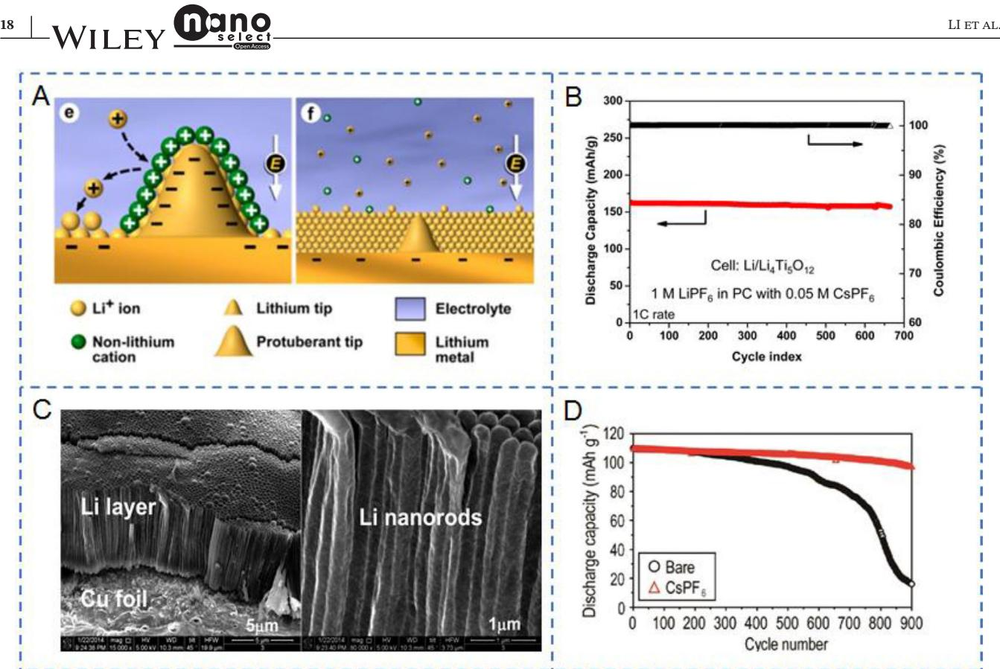

**FIGURE 1** A, Illustration of Li deposition process based on the SHES mechanism. B, Cycling performance and CE of Li4Ti5O12//Li full cell at 1C. Reproduced with permission.[\[45\]](#page-17-0) Copyright 2013, American Chemical Society. C, SEM images of the electrochemically deposited Li films on Cu foil with 0.05 M CsPF6 additive. Reproduced with permission.[\[47\]](#page-18-0) Copyright 2014, American Chemical Society. D, Long-term cycling stability of LMO//Li cell at 0.6 mA cm−2. Reproduced with permission.[\[49\]](#page-18-0) Copyright 2019, Elsevier

mechanism. Taking Cs+ as an example, as mentioned above,[\[45\]](#page-17-0) the equilibrium potential of Cs+ at low concentration is lower than that of Li+ at high concentration, and hence Cs+ can be adsorbed on the lithium protuberance tip without deposition. The strong electrostatic repulsion force between Li+ and Cs+ will prevent the growth of Li at the tip and eventually lead to uniform deposition.[\[46\]](#page-17-0)

As a pioneer work, Ding and co-workers[\[45\]](#page-17-0) proposed the self-healing electrostatic shield (SHES) mechanism (Figure 1A), which could suppress the growth of lithium dendrite during the process of lithium deposition. They proposed that CsPF6 or RbPF6 could be used as electrolyte additives in 1 M LiPF6/propylene carbonate (PC) electrolyte to realize the dendrite-free Li. It was found that the optimal concentration of Cs+ additive was 0.05 M. The lithium metal batteries (LMBs) with Li4Ti5O12 as cathode could keep stable for > 600 cycles at 1C rate (Figure 1B). A following work[\[47\]](#page-18-0) showed that dense nanorods of lithium rather than dendrites were formed on the copper foils during cycling (Figure 1C). The characterization indicated that the formation of the nanorod structured Li was not only due to the electrostatic shielding mechanism of the Cs+, but also benefited from the synergistic effect of the reduction of PF6 – anion, forming LiF-based robust SEI. Nevertheless, the authors also suggested that Cs+ may be deposited on the surface of Li at high current density and consumed, because of the small difference between the effective reduction potentials of Cs+ and Li+. [\[48\]](#page-18-0) Subsequently, Kim et al.[\[49\]](#page-18-0) introduced the CsPF6 additive into the surface-patterned lithium metal anode, with expectation to utilize the synergistic effect of electrostatic shielding mechanism and the surface patterns (conductive host). The addition of CsPF6 further reduced the formation of mossy and granular Li in the patterned holes. The LiMn2O4 (LMO)-based LMO//Li full cells using surface-patterned Li metal as anodes with or without CsPF6 in the electrolyte (1 M LiPF6 in ethylene carbonate (EC)/PC/ethyl methyl carbonate (EMC) (5:2:3 by weight)) showed discharge capacities of 96.6 mAh g−1 and 16.4 mAh g−1 , respectively, at a current density of 0.6 mA cm−2 after 900 cycles (Figure 1D).

Rubidium fluoride (RbF)[\[50\]](#page-18-0) was also used as an additive to inhibit the growth of lithium dendrites. The mechanism is similar to that of Cs+: at low concentration, the effective reduction potential of Rb+ is lower than that of Li+ (at high concentration), resulting in electrostatic

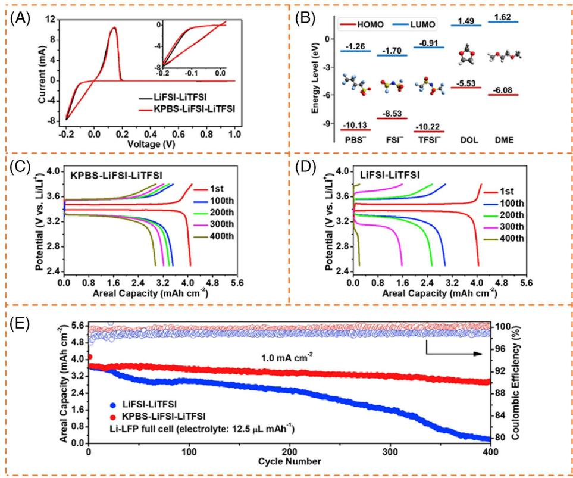

**FIGURE 2** Schematic depiction and the performance of LiFSI-LiTFSI electrolyte with/without addition of KPBS. A, CV curves of Li–Cu cells with or without KPBS additive at 0.1 mV s–1. B, Schematic illustration of the HOMO/LUMO energy levels of the solvents and anions. (C-D) Charge/discharge curves of Li//LFP full cells with (C) and without (D) KPBS 0.1 mA cm−2. E, Cycling performance and CE of Li//LFP cells at 1 mA cm−2. Reproduced with permission.[\[51\]](#page-18-0) Copyright 2020, Elsevier

shielding mechanism; simultaneously, the addition of F– could also produce LiF and form a stable SEI. The coulombic efficiency (CE) of Li-Cu cells maintained above 90% after 120 cycles with addition of 0.05 M RbF in the electrolyte (1 M LiPF6 in EC/dimethyl carbonate (DMC) (1:1 by volume)) at 0.5 mA cm–2 for 1 mAh cm−2. The Li-Li symmetric cells showed stable cycle performance for > 1000 hour. Similar effect[\[51\]](#page-18-0) could also be observed by using K+ as the additive. When the concentration of functional additive potassium nonafluoro-1-butanesulfonate (KPBS) was < 0.02 M, the effective reduction potentials of K+ (–3.032 V at 0.02 M) were lower than that of Li+ (–3.022 V at a total concentration of 2 M) in Lithium bis(trifluoromethanesulfonyl)imide/lithium bis (fluorosulfonyl)imide (LiTFSI/LiFSI) ether electrolyte. The K+ additive could regulate Li deposition by electrostatic shielding mechanism. The cyclic voltammetry (CV) curves with/without the additive showed the similar characteristics, indicating that there was no deposition of K (Figure 2A). At the same time, there was no K 2p peaks in the X-ray photoelectron spectroscopy (XPS) of SEI film, which further proved the absence of K deposition. In addition, the lowest unoccupied molecular orbital (LUMO) energy level of PBS– (-1.26 eV) was lower than that of TFSI– (-0.91 eV); hence, PBS– would preferentially decompose and form LiF (Figure 2B). The cation K+ formed the electrostatic shielding layer and the F– rich anion PBS– improved the SEI, jointly improving the deposition of Li compared with the electrolyte without KPBS and the performance of lithium metal anode. As shown in charge/discharge curves of Li//LiFePO4 (LFP) full cells with different electrolytes (Figure 2C,D), the cells with KPBS additive showed smaller overpotential and better stability. Specifically, with KPBS-LiFSI-LiTFSI electrolyte, Li–Cu cells could keep a high CE of 99.1% after 400 cycles at 1 mA cm–2 for 1 mAh cm–2. The Li//LFP full cells under relatively lean electrolyte (12.5 µL mAh–1) showed areal capacity of 2.9 mAh cm−2 after 400 cycles at 1 mA cm−2 (Figure 2E).

# **2.2 Other additives with SHES mechanism**

In addition to alkali metal cations, there are many additives with the similar SHES mechanism,[\[45\]](#page-17-0) such as

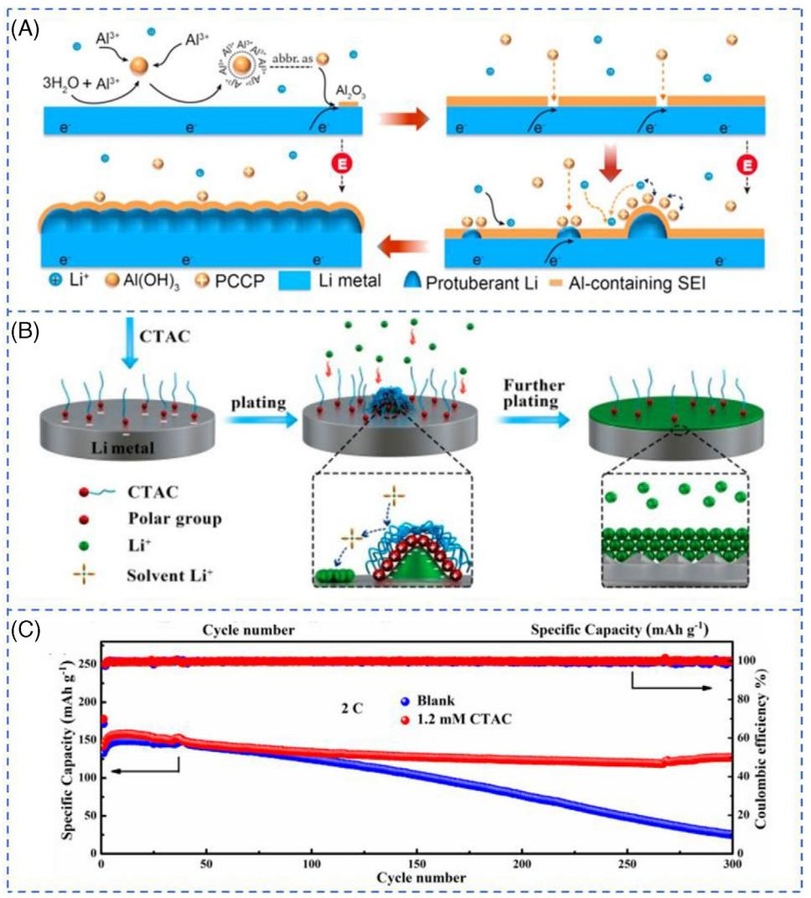

**FIGURE 3** A, Schematic diagrams depicting the Li plating process with AlCl3 additive. Reproduced with permission.[\[52\]](#page-18-0) Copyright 2017, Elsevier. B, Illustration of the effect of CTAC additive on the Li deposition process. C, Cycling performance of Li//NCM full cells with or without CTAC additive at 2C. Reproduced with permission.[\[56\]](#page-18-0) Copyright 2018, American Chemical Society

Al-based positively charged colloidal particles, ionic liquids, cationic surfactants, and so on. AlCl3 was selected as an additive to protect lithium metal anodes and a similar mechanism was proposed.[\[52\]](#page-18-0) After adding AlCl3 in 1 M LiPF6 with EC/ DMC/ diethyl carbonate (DEC) (1:1:1 in wt%) electrolyte, Al3+ could react with the trace water in electrolyte to form nanosized Al(OH)3 particles through a hydrolysis reaction. Nanosized Al(OH)3 colloidal particles could adsorb the excess Al3+, forming positively charged colloidal particles. The positively charged particles rather than Al3+ were expected to be adsorbed on the protuberance of Li during charging and improve the morphology of lithium by forming positive electrostatic shielding layer (Figure 3A). In addition, Al2O3 may be generated on the surface of lithium anode and form a SEI layer with high mechanical strength and good stability, which was helpful to further improve the performance of lithium anode.

Ionic liquid, 1-dodecyl-methylpyrroli-dinium bis (fluorosulfonyl)imide (Pyr1(12)FSI), was also proposed as an electrolyte additive in the electrolyte (1 M LiTFSI in dioxolane/dimethoxyethane (DOL/DME)) to improve the performance of lithium anode via the electrostatic shielding mechanism.[\[53\]](#page-18-0) Similarly, the cation Pyr1(12)+ acted as the positive charges that would accumulate on the protuberance of Li during charging and repel the Li ions by electrostatic repulsion, facilitating the homogeneous deposition of Li and slowing down the formation of lithium dendrites. The decomposition of FSI– due to the easy breakage of S-F bonds[\[54,55\]](#page-18-0) was conducive to the formation of LiF and strengthened the SEI layer. Furthermore, the aliphatic chain in Pyr1(12)+ also increased the lithiophobic effect, although such ionic liquids may face the challenges of poor wetting with separator and high cost. Compared with ionic liquids, the cost of cationic surfactants is relatively low. Yoo and co-workers[\[56\]](#page-18-0) proposed that hexadecyl trimethylammonium chloride (CTAC) could be used as a cationic surfactant additive via lithiophobic repulsion mechanism (Figure [3B\)](#page-4-0). The cation CTA+ could be adsorbed around the lithium protuberance and form a cross-linked lithiophobic layer. During cycling, Li+ was induced to deposit near the protuberance forming uniform deposition rather than on the protuberance forming lithium dendrites, due to the repulsive force of the adsorbed lithiophobic layer. The cycle performance of the battery was hence improved. When the fixed capacity was 0.5 mAh cm−2 in PC/EC/DEC electrolyte (1:4:5, vol.%) using 1 M LiPF6 salt, the Li-Li symmetric battery with additive kept stable for 300 hours at the current density of 1.0 mA cm−2. Compared with the electrolyte without additive, the Li//LiNi0.5Co0.2Mn0.3O2 (NCM) battery with 1.2 mM CTAC additive showed better cycle performance, and the discharge capacity was 127.2 mAh g−1 at 2C after 300 cycles (Figure [3C\)](#page-4-0). These two kinds of organic additives (ionic liquids and cationic surfactants) are intriguing, because they have not only electrostatic shielding effect, but also alkyl chains to enhance the lithiophobic effect. Thereinto, cationic surfactants as additives may be more promising due to the synergistic effect of electrostatic shielding and lithiophobic effect, as well as relatively low cost.

# **3 REGULATION OF SOLID ELECTROLYTE INTERPHASE**

Typically, it is believed that the formation of Li dendrites is due to the heterogeneous SEI layer, which results in the non-uniform deposition of Li. The higher electric field density at the nucleation sites further leads to the growth of Li dendrites. Moreover, the SEI layer is brittle, which does not have enough mechanical strength to withstand the volume changes of Li anode and the invasion of lithium dendrite, resulting in formation of new SEI, low coulombic efficiency, dead Li and other safety issues.[\[57,58\]](#page-18-0) From these points of view, the performance of Li anode could be improved by directly achieving stable SEI, either through ex-situ surface treatment prior assembly of the cell or spontaneous formation originated from special additives.[\[59\]](#page-18-0) The latter has attracted much attention because of its low cost and compatibility with the current commercialized LIB technology.[\[60\]](#page-18-0)

### **3.1 Inorganic salt additives**

During charging, it is believed that the Li ions migrate to the anode surface, relay itself in the Schottky vacancy inside the SEI layer, and then accept electrons from the current collector to deposit as lithium metal.[\[12\]](#page-17-0) Therefore, the diffusion resistance of lithium ions is one of the factors that affect the uniform deposition of lithium metal. It has been confirmed that the existence of lithium halide salts, especially lithium fluoride, in the SEI layer, can greatly reduce the diffusion resistance through the SEI layer.[\[12,61,62\]](#page-17-0) Arias and co-workers studied the role of LiF in regulating lithium metal deposition through joint density functional theoretical (JDFT).[\[62\]](#page-18-0) JDFT showed that the transport rate of Li+ on LiF surface was 30 times higher than that on Li2CO3 that was regarded as the main component of SEI layer. Due to the lower transverse diffusion barrier on LiF, Li+ tended to deposit more smoothly (Figure [4A](#page-6-0)[\[63\]](#page-18-0) ). Obviously, direct use of LiF additive to improve the SEI layer and inhibit the growth of lithium dendrites should be the simplest method. Research showed that addition of only 0.5 wt% LiF additive could increase the coulombic efficiency by at least 10% compared to conventional batteries.[\[63\]](#page-18-0) Nevertheless, the LiF is not well soluble in organic electrolyte, making it difficult to form homogenous layer. On the other hand, the handling of HF for forming LiF[\[64\]](#page-18-0) is facing the safety challenge. Therefore, some other additives for formation of advantageous SEI layers were proposed. Water was ever considered as a harmful specie in lithium batteries, because it could react with the electrolyte to form HF and hence corrode the electrode materials. However, it has been proved that controlling the amount of trace H2O (25-50 ppm) could hydrolyze LiPF6 to produce trace HF, thus benefiting the formation of SEI layer with rich LiF.[\[65\]](#page-18-0) Both the voltage-time profiles and the CV curves indicated that trace amounts of HF underwent electrochemical reduction at around 2.6 V, resulting in more LiF. The reaction process was shown in Equation (1):

$$
2HF + 2Li^{+} + 2e^{-} \rightarrow 2LiF + H_{2}
$$
 (1)

Actually, difluorophosphate anion (PO2F2 –) was another product of LiPF6 hydrolysis.[\[66\]](#page-18-0) Since LiPO2F2 hydrolyzes very slowly even under weakly alkaline conditions, PO2F2 – could replace PF6 – to undergo a hydrolysis reaction and exhibit superior performance in inhibiting lithium dendrite.[\[67\]](#page-18-0) Research showed that the dual additives composed of LiPO2F2 and vinylene carbonate (VC) could be even more advantageous through synergistic effect.[\[68\]](#page-18-0) On one hand, VC promoted the breakage of the P-F bond in LiPO2F2 to form LiF and Li3PO4, which had been regarded as important components for robust SEI. On the other hand, these inorganic components embedded in the matrix of organic compounds formed a flexible SEI layer, which did not require too much LiF to enhance its framework.

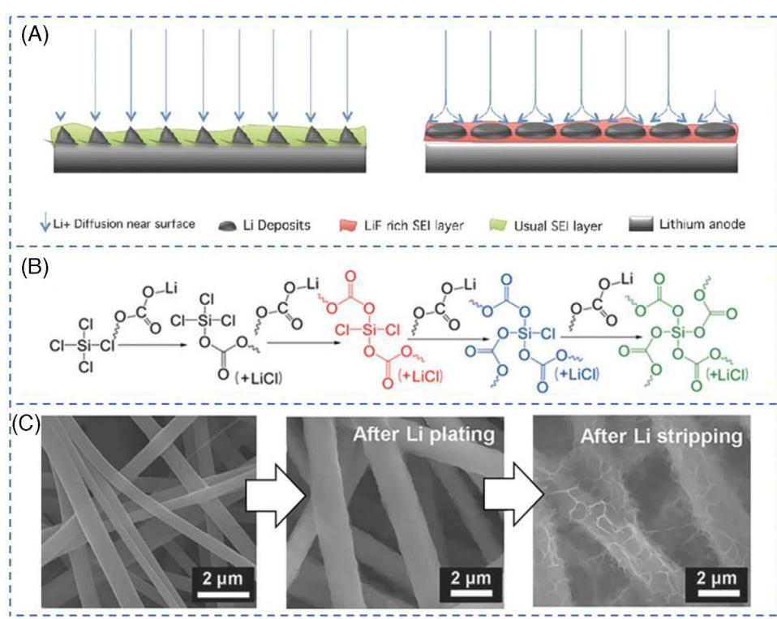

**FIGURE 4** A, Schematic diagram of homogeneous lithium deposition induced by low LiF lateral diffusion barrier. Reproduced with permission.[\[63\]](#page-18-0) Copyright 2016, WILEY-VCH. B, Possible reaction of SiCl4 in PC electrolytes, forming LiCl and crosslinked SEI layer. Reproduced with permission.[\[72\]](#page-18-0) Copyright 2018, WILEY-VCH. C, SEM images of lithium metal (deposited on carbon fiber) and the SEI layer (which could be clearly observed after lithium stripping). Reproduced with permission.[\[73\]](#page-18-0) Copyright 2018, WILEY-VCH

Generally, LiPF6 is one of the most widely commercialized lithium salt in electrolytes, which itself produced poor SEI on Li metal. However, Wu et al. reported that the addition of 0.05 M LiPF6 in the LiTFSI-LiBOB double salt and carbonate-solvent-based electrolytes helped to form an SEI layer with rich polycarbonate.[\[69\]](#page-18-0) It was speculated that the strong Lewis acids PF5 and POF3, which were derived from the decomposition or hydrolysis of LiPF6, respectively, could induce the polymerization of EC solvents into polycarbonates. This polycarbonate-rich SEI layer had higher flexibility and faster Li+ transfer rate. On the other hand, the increase of LiPF6 additive resulted in the decrease of polycarbonates and increase of inorganic components. The Li//NMC battery with such electrolyte containing 0.05 M LiPF6 as additives showed a capacity retention of 97.1% after 500 cycles at 1.75 mA cm–2, much better than those using LiPF6 as the salt or using LiTFSI-LiBOB double salts but without LiPF6 additive.

Beside of LiF, other lithium halide salts were also reported as additives for Li metal batteries. LiI was found to be able to induce the polymerization of ether-based electrolytes, thereby forming an ion-conductive SEI layer that was rich in elastic oligomers on the surface of the lithium anode.[\[70,71\]](#page-18-0) Quantum chemistry (QC) calculations showed that the DME(-H) radicals, formed by the reaction of I⋅ radicals (generated from the oxidation of I– at about 3V vs. Li/Li+) with DME, would be polymerized in the solution to form a comb-branched polyether protective film, which could also be proved by the apparent increase of anodic current at around 3 V in the CV curves.[\[71\]](#page-18-0) This protective film effectively promoted migration and uniform deposition of Li+. With the addition of 2 wt% LiI in the electrolyte (1 M LiTFSI in DOL/DME (1:1 by volume)), Li-Cu cells could keep a high CE of 98.1% after 200 cycles at 0.5 mA cm–2 for 1 mAh cm–2. [\[70\]](#page-18-0)

Similarly, LiCl-rich SEI was also found to be able to accelerate the migration of lithium ions and realize the dendrite-free Li deposition. The SO2Cl2 additive could spontaneously react with Li to form LiCl and SO2, and SO2 could further react with Li to form Li*x*SO*y*. [\[60\]](#page-18-0) The lower surface diffusion barrier of Li+ in the LiCl accelerated the Li+ transfer and promoted the homogeneous nucleation of Li+; while the Li*x*SO*y* improved the mechanical modulus of the interface and inhibited the side reactions. Unlike SO2Cl2, the direct reaction between SiCl4 and lithium was sluggish;[\[74\]](#page-18-0) however it has been found that the reaction could be accelerated by propylene carbonate (PC).[\[72\]](#page-18-0) One SiCl4 molecule reacted with four ROCOOLi molecules (produced by Li and PC), releasing four LiCl molecules and producing Si-connected organic carbonates (Figure 4B). As a result, this SEI layer containing LiCl and Si-O bonds provided sufficient elasticity to cope with the volume change of Li plating/stripping. Compared with the SEI formed in the electrolyte without the addition of SiCl4, this SEI exhibited lower charge-transfer resistance and higher exchange current density. The symmetric Li-Li cells exhibited incredible cycling ability even at 3 mA cm–2. The discharge capacity remained at 751 mAh g–1 and the coulombic efficiency was close to 100% in Li-S cells with addition of 0.1 M SiCl4 in 1 M LiPF6/PC electrolyte, after 200 cycles at 1 C.

Lithium nitrate, a typical additive, has been widely reported, especially in Li-S batteries. It was believed that LiNO3 was reduced to Li3N and LixNOy at ≈1.7 V, which participated in the formation of the SEI layer.[\[75,76\]](#page-18-0) Nonetheless, normally it was only used in ether-based electrolytes, due to its low solubility in other electrolytes (e.g., carbonate esters). Some novel electrolytes (such as phosphates,[\[77–79\]](#page-18-0) *γ*-butyrolactone[\[80\]](#page-18-0) and gel polymer electrolyte,[\[81\]](#page-18-0) etc.) were reported. It has been found that the gel polymer electrolytes (GPEs) containing LiPF6 in EC/DMC as liquid electrolytes and LiNO3 as additive could result in the formation of a stable SEI layer consisting of rich Li3N and LiNxOy. Poly(vinylidene fluoride) (PVDF), poly(methyl methacrylate) (PMMA), and poly(ethylene oxide) (PEO) were blended to form the GPEs, in which the ether polymer PEO was introduced for dissolving the LiNO3. [\[81\]](#page-18-0) Furthermore, because of the continuous consumption of LiNO3 on the Li anode, it was more popular to adopt LiNO3 as a co-salt,[\[72,82\]](#page-18-0) or as one of the dual-additives (e.g., together with vinylene carbonate,[\[83\]](#page-18-0) diphenyl disulphide,[\[84\]](#page-18-0) etc.). For example, LiNO3 and AgPF6 were introduced as hybrid additives to protect the lithium metal anode through the synergy of the alloying and grain refinement mechanisms (see the following sections).[\[72\]](#page-18-0)

Unlike the sacrificial LiNO3, lithium perchlorate (LiClO4) only acted as a catalyst to optimize the chemical composition of the SEI layer by promoting the decomposition of LiTFSI through the ion association effect, which meant that LiClO4 was not consumed during cycling.[\[85\]](#page-18-0) Density functional theory (DFT) indicated that LiClO4 and LiTFSI could form an ion association of CF3OSO-Li+(ClO4) ––O(NLi)SOCF3; that is, the O atoms with lone pair electrons from LiClO4 bonded to the –CF3 groups from LiTFSI because of the strong electronegativity of F atoms, and the Li atom from LiClO4 bonded to two symmetric oxygen atoms from LiTFSI. The ion association was prone to prior reduction, because its LUMO energy level (–3.34582 eV) is lower than LiTFSI (–2.26487 eV). Therefore, LiClO4 promoted the decomposition of LiTFSI by forming an ion association with a lower LUMO energy level, thereby optimizing the chemical composition of the SEI layer. More importantly, the linear sweep voltammetric (LSV) curves did not show new redox peaks after adding LiClO4, proving that LiClO4 only served as a catalyst without being sacrificed. What's more, LiClO4 had good solubility in both ether and carbonate-based electrolytes. Adding 7 wt% of LiClO4 in the carbonate electrolytes, the cycle performance of Li-Cu cells was significantly enhanced (from 25 cycles to 95 cycles).

Inspired by the using boric acid (BA) as a cross-linking agent to connect polymers to form O-B-O bonds,[\[86–89\]](#page-18-0) Huang and co-workers introduced BA additive into lithium-oxygen batteries (LOBs) to obtain a SEI layer with main components of covalent bonding with BA.[\[73\]](#page-18-0) Li2O and LiOH were the common components, which were formed on the surface of lithium metal under O2-rich conditions. They could be chemically connected with BA via O-B-O bonds, forming (Li2O)m(B2O3)n (m and n were positive integers). The scanning electron microscopy (SEM) images showed the microscale structure of the SEI layer formed on the surface of lithium metal on carbon fiber (Figure [4C\)](#page-6-0). The micro-network structure of the independent and continuous SEI layer could be clearly observed after the stripping of lithium metal. However, the SEI layer formed without BA did not have sufficient mechanical strength to maintain its independence and continuity. The cycle life of LOBs with BA was six times longer than that without BA. However, it should be noted that the effect of BA in lithium-metal batteries was greatly weakened, because the oxygen-containing lithium salt was not enough to crosslink with BA. Pre-treatment of lithium metal or current collectors would be a feasible way to expand the application of BA to other lithium-metal batteries. Examples can be found by using Cu2O/Cu as the current collector, together with BA as additives.[\[90\]](#page-18-0)

# **3.2 Organic additives**

It is believed that the main components of SEI layer of the traditional electrolytes are inorganic salts, which are brittle and can't protect the lithium anode effectively. Therefore, organic additives were reported to enhance the SEI due to the flexibility and mechanical stability of formed organic components in SEI layer. The aforementioned VC additive[\[68\]](#page-18-0) and polycarbonates (formed in the EC electrolytes with addition of LiPF6) [\[69\]](#page-18-0) are examples, showing the advantages of organic components in SEI layer. However, the products of the SEI layer are normally very complicated and may contain both inorganic salts and organic components, as shown in the example of LiPF6 additive. Hence, the addition of organic additives may also mainly result in inorganic products, for example LiF, to construct the SEI layer. This is also the reason that we classified this section according to the additive itself rather than the

products. The organic additives should meet three basic criteria: (1) The lowest unoccupied molecular orbital (LUMO) energy levels of additives should be lower than that of electrolyte (both solvents and solutes), so as to ensure the preferential decomposition/reaction of additives and its participation in the formation of SEI layers.[\[91\]](#page-18-0) (2) The formed SEI layer should be ion-conducting, so that Li+ could pass freely.[\[92\]](#page-18-0) (3) The formed SEI layer should have sufficient mechanical strength, elasticity, and compactness to cope with the volume expansion of lithium metal.[\[93\]](#page-18-0)

Fluoroethylene carbonate (FEC) was a typical organic additive. It was the most widely reported organic additive for regulating the SEI layer in various metal-ion batteries,[\[94–96\]](#page-18-0) which was believed to be capable of inducing the formation of a LiF-rich SEI layer.[\[97\]](#page-18-0) Based on first-principle calculations,[\[97\]](#page-18-0) the LUMO energy level (-0.87 eV) of FEC was lower than EC (−0.38 eV) and DEC (0 eV), indicating that FEC would be priorly reduced. The carbon-fluorine bonds in FEC broke first after around 310 fs. Subsequently, LiF was formed on the surface of lithium, which could be inferred from the similar distance between F– after fracture and Li+ with that in the lithium fluoride crystal (0.2032 nm). Further characterization[\[97\]](#page-18-0) of XPS indicated that the proportion of LiF in the SEI layer was 48.2% after adding 5% FEC. This value was significantly higher than that (29.5%) in the SEI layer formed without FEC additive, in which the LiF came from the decomposition of the salt (LiPF6). The LiF-rich SEI layer ensured the absence of lithium dendrite, high cycling stability and low impedance. There is no doubt that other additives could be combined to further enhance the performance of Li anodes. For example, FEC was ever reported as dual-additives together with LiAsF6 [\[98\]](#page-18-0) or LiNO3. [\[99\]](#page-18-0) Among them, the additive LiAsF6 took effect via the alloying mechanism (see the next section);[\[98\]](#page-18-0) while the reduction of FEC was particularly significant for the uniformity of LixAs alloy phase produced by LiAsF6.

Similar to FEC, the C-F bonds of 2-fluoropyridine (2-FP) were also able to dissociate and contribute to the formation of LiF in the SEI layer.[\[100\]](#page-18-0) Lithium ions were easily solvated by 2-FP to form the F-contained solvation sheath. Meanwhile, XPS showed that the N element reached 2.39% in the SEI layer in the presence of 2-FP. Pyridinic N and its derivatives were observed, indicating the participation of 2-FP for forming the SEI. Li3N was also found, which has been proved to be efficient for stabilizing the SEI layer and inhibiting the growth of lithium dendrites.[\[101,102\]](#page-18-0) However, Li3N was not observed in the samples with only LiNO3 additive (the decomposition of LiNO3 was normally believed at around 1.7 V; while the samples here were tested in the voltage range of 2.5–4.0 V), indicating that the Li3N was originated from 2-FP. In addition, the pyridinic nitrogen with lone-pair electrons could be regarded as Lewis base, which will benefit the even distribution and nucleation of Li ions (Lewis acid) on the anode surface by acid–base interaction.[\[103\]](#page-19-0) In Li-Cu cells, after 50 cycles at 0.5 mA cm−2, dense and smooth lithium deposition was observed on the surface of copper foil in the electrolyte (1 M LiPF6 in EC/DEC (1:1 vol.%)) with addition of 0.02 M 2-FP.[\[100\]](#page-18-0) NMC111//Li battery[\[100\]](#page-18-0) was tested under the same electrolyte condition. After 300 cycles at 0.5 C, the capacity was 103.1 mAh g–1 with CE of 99.89% and capacity retention of 67.6%.

Considering the consumption of the additives, such fluorinated materials were also utilized as co-solvent. Examples can be found in the FEC based electrolytes.[\[99\]](#page-18-0) Fluorinated aromatic compounds were also possible candidates.[\[104\]](#page-19-0) Yoo and co-workers proposed a localized high concentration electrolyte with triple-salts composed of 1.3 M LiFSI, 0.7 M LiTFSI and 0.02 M LiPF6 in DMC/1,2-difluorobenzene (v/v = 3:7). 1,2- Difluorobenzene (1,2-dfBen) was used as the diluent for providing LiF. 1,2-dfBen could tune the composition of the SEI layer by reacting with lithium metal. The authors believed that the increase of LiF content in the SEI layer was due to the decomposition of the anion as well as the reaction of 1,2-dfBen with lithium. Notably, although the LUMO energy level of 1,3-dfBen (-0.965 eV) was lower than that of 1,2-dfBen (-0.943 eV), 1,2-dfBen had higher reactivity with lithium than 1,3-dfBen. The reason can be ascribed to the lower free energies in two steps of fracture of two C-F bonds and a smaller Li⋅⋅⋅F distance (1.9 vs. 5.4 Å for 1,2-dfBen and 1,3-dfBen, respectively) in the intermediate after the first step for 1,2-dfBen compared with those of 1,3-dfBen. In addition to FEC and 2-FP, other organic additives, such as vinylene carbonate (VC),[\[105\]](#page-19-0) dimethyl sulfate (DMS),[\[106\]](#page-19-0) poly(sulfur-random-1,3 diisopropenylbenzene) (PSD),[\[107\]](#page-19-0) *N,N*-dimethylethano lamine (DMEA),[\[108\]](#page-19-0) trimethylsilyl(fluorosulfonyl)(*n*nonafluorobut-anesulfonyl)imide (TMS-FNFSI),[\[109\]](#page-19-0) tripropargyl phosphate (TPP),[\[110\]](#page-19-0) and tris (2, 2, 2 trifluoroethyl) borate (TTFEB),[\[111\]](#page-19-0) as well as some organic salts (e.g., lithium bis(oxalato)borate (LiBOB),[\[33\]](#page-17-0) lithium difluoro(oxalate)borate (LiDFOB)[\[112\]](#page-19-0) ) etc. have also been developed to regulate the SEI layer (Figure [5\)](#page-9-0). Some of them could not only induce more LiF products but also introduce other inorganic and/or organic components,[\[100,111–113\]](#page-18-0) even could form a stable cathode electrolyte interphase (CEI) at the cathode.[\[33\]](#page-17-0) The CEI layer on the cathode side can also improve battery performance.[\[114–116\]](#page-19-0)

Based on the first-principle calculations, the LUMO energy level of DMS was as low as -1.125 eV, which meant that it was easily reduced.[\[106\]](#page-19-0) S-O bonds were broken during the reduction, resulting in an inorganic mixture

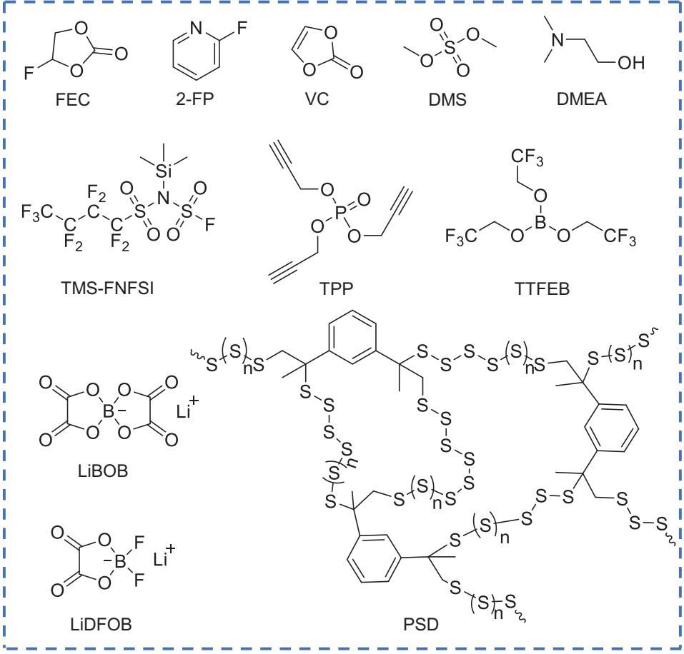

**FIGURE 5** The chemical structure of representative organic SEI-formed additives

containing Li2S and Li2O with a high Li+ transport and a dense structure. In addition, the Young's modulus of the SEI layer with DMS additive (about 2.0 GPa) was much greater than that without DMS additive (0.31 GPa). Normally, the Li-S batteries are suffering the dissolution of polysulfides and the adverse reactions of the polysulfides with the lithium anodes, resulting in inferior SEI with high resistance, poor protection of the Li metal, possible lithium dendrites, low CE and cycleability, etc. Wang and co-workers found that the aromatic-based organosulfur polymer (PSD, that had the polysulfide structures) as additives could enhance the SEI layer.[\[107\]](#page-19-0) Once in contact with lithium metal, PSD was reduced to Li organosulfides (RSxLi4), Li organopolysulfides (RS4Li4), and inorganic Lithium polysulfide (Li2S/Li2S2). The aromatic-based organic components improved the toughness and flexibility of the SEI layer. The inorganic components provided the necessary Li+ conductive pathways and mechanical strength for the SEI layer.

DMEA can also induce organic components in the SEI layer. As a smart bifunctional additive, DMEA could react with lithium and form a DMEA-Li based SEI layer,[\[108\]](#page-19-0) but also enabled the reaction with free HF via its amine groups forming ammonium. The DMEA-Li-based SEI layer had better flexibility than the LiF-rich SEI layer to cope with the volume change of lithium anode. However, it should be noted that high concentrations of DMEA would cause a thick DMEA-Li-based SEI layer that was not conducive to the conduction of lithium ions. TMS-FNFSI, which contained both organosilicon and fluorinated sulfonimide,[\[109\]](#page-19-0) was able to form improved SEI and clear the contaminants in the electrolyte. A SEI layer, which was rich in LiF, organic F- and Si-containing materials, was formed, by reduction of FSO2, C4F9SO2 and -Si(CH3)3, respectively. On the other hand, the proton impurities (H2O, alcohols, and HF) in the electrolyte were removed by breaking the Si-N bonds of TMS-FNFSI. Organic F-[\[117,118\]](#page-19-0) and Si-containing[\[119\]](#page-19-0) materials were also proven to be efficient for enhancing the flexibility of the SEI layer elsewhere.

Tetraethyl orthosilicate (TEOS) has something in common with the BA. TEOS also reacted with the corrosion product LiOH of the lithium anode in the Li-O2 batteries, forming a Si-O cross-linked polymer film.[\[120\]](#page-19-0) If the polymer film was broken in a highly corrosive environment, it could be self-healed by the continuous reaction of TEOS

with the exposed LiOH. However, similar to BA, the existence of LiOH was required for TEOS, which confined its application in LOBs. In addition, the additives were also consumed during cycling. From these discussions, it can be concluded that organic additives mainly have two advantages compared with inorganic additives. Firstly, organic additives are various and can be designed through functionalization to produce more robust SEI layer. Secondly, organic additives are beneficial to form a SEI layer with higher mechanical stability due to the presence of organic components in the SEI layer, although some organic additives resulted in the inorganic salts as the main component of the SEI layer and inorganic additives may also lead to organic components of the SEI layer (e.g., the aforementioned LiI).

### **4 ALLOYING MECHANISM**

It has been reported that some materials could form alloys with lithium, although these materials often suffer the large volume expansion after storage of lithium ions.[\[121\]](#page-19-0) However, this property indicates that the nucleation of lithium onto/into these materials would be easier than the normal current collector (i.e., Cu foil). Cui and coworkers[\[121\]](#page-19-0) found that the nucleation overpotential of Li on Cu foil was ∼40 mV (Figure [6A\)](#page-11-0). In contrast, the nucleation overpotential of lithium deposition on Au was quite different (Figure [6B\)](#page-11-0). After forming two Lix Au alloy phases above 0 V, the nucleation overpotential of lithium on lithiated Au was essentially zero. As shown in the binary phase diagram (Figure [6C\)](#page-11-0), Au could not only form multiple Lix Au Alloy phase with Li, but also had a solubility zone in Li metal (∼0.7 at.%@155◦C) when the atomic ratio of Li approached 100%. This feature made the surface gold dissolve in Li before the formation of pure Li phase. The surface layer of the solid solution had the same crystal structure as that of pure Li metal (*β* Li), which could be used as a buffer layer for Li deposition, thus effectively eliminating the nucleation barrier. As for Cu, it could not form solid solution with Li. Subsequently, they studied the overpotential of Li deposition on various conductive substrates, including Au, Ag, Zn, Mg, Al, Pt, Si, Sn, C, Cu and Ni (Figure [6D,E\)](#page-11-0). Among them, Cu and Ni can't react with Li at room temperature; while the others can form alloy phases with Li. According to the galvanostatic voltage profiles, it was found that the nucleation overpotential of Li on the materials (e.g., Au, Ag, Zn, Mg, Al, Pt) with a definite solubility in lithium was nearly zero or very low; while the materials (e.g., Si, Sn, C, Cu, and Ni) with negligible solubility showed obvious nucleation overpotentials. As for C, Sn, and Si, although they could form composite alloy phases with Li, the overpotentials for Li nucleation still existed, which can be ascribed to the quite different crystal structures of their alloy compounds from that of lithium metal. When the reduction potential of the metal ions in the additives was higher than that of Li+/Li, it would be preferentially reduced to metal seeds. Hence, using the metal ions of the aforementioned materials with zero or small Li nucleation overpotentials as additives could enable the deposition of lithium preferentially on the metal seeds to form alloy phases and suppress the growth of lithium dendrites. The discovery of this characteristic opens up an opportunity for spatial control of lithium deposition.

Examples could be found by using the aforementioned Ag, Zn, Mg as well as others such as As and In etc. The reaction between the additives and lithium metal resulted in the metal seeds, which served as the heterogeneous nucleation sites to guide the further deposition of lithium. For example, AgPF6-LiNO3 [\[122\]](#page-19-0) co-additives were added into carbonate electrolyte composed of 4 M LiPF6, EMC and 3 vol% VC. The process of in-situ chemical deposition of silver metal was shown in Figure [7A.](#page-12-0) By using AgPF6- LiNO3 co-additives, the uniform and compact lithiophilic Ag-Li alloy seed layer could be formed on the surface of lithium metal. As the work functions of Ag (4.26 eV) was much higher than that of Li (2.9 eV), Ag particles deposited on Li substrate would spontaneously be lithiated, and the formation of Ag-Li alloy layer as the seed of Li deposition was conducive to the nucleation and growth of Li. Simultaneously, the addition of LiNO3 could work as a grain refiner and inhibited the growth of lithium dendrites. After adding AgPF6-LiNO3 co-additives, Li-Li symmetric cells could work steadily for 3000 hours at a current density of 0.5 mA cm−2 (Figure [7A\)](#page-12-0). Ren and co-workers[\[98\]](#page-18-0) also explored the synergistic effect of LiAsF6 and different cyclic carbonate additives (FEC or VC) in 1 M LiPF6/PC electrolyte. LiAsF6 additive could be reduced to LixAs alloy and LiF. The reaction process was shown in Equations (2)– (5):

$$
LiAsF_6 + Li^+ + e^- \rightarrow As^0 + LiF \tag{2}
$$

LiAsF6 + Li+ + e− + PC → AsxOy + LiF + side products (3)

$$
As_xO_y + Li^+ + e^- \rightarrow As^0 + Li_2O \tag{4}
$$

$$
As0 + Li+ + e- \rightarrow Lix As
$$
 (5)

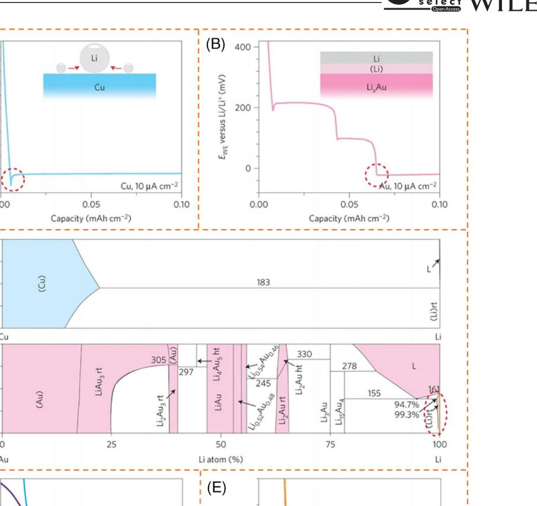

**FIGURE 6** A, Galvanostatic voltage profiles of Li deposited on Cu foil at 10 µA cm−2. The inset shows the nucleation mechanism of Li. B, Galvanostatic voltage profiles of lithium deposited on an Au substrate at 10 µA cm−2. The inset shows a schematic diagram of the solid solution buffer layer of Au dissolved in lithium. C, Illustration of the phase diagrams of Li with Cu (top panel) and Au (bottom panel). D, Schematic diagram of the voltage profiles of lithium deposited on various materials with a definite solubility in Li. E, Schematic diagram of the voltage profiles of lithium deposited on various materials with negligible solubility in Li. Reproduced with permission.[\[121\]](#page-19-0) Copyright 2016, Macmillan Publishers

Among them, LixAs alloy could be used as the nanosized seeds to induce further homogeneous deposition of lithium. Meanwhile, introducing LiF into SEI could not only improve the mechanical stability of SEI, but also promoted the transport of Li on the interface, which was conducive to the formation of more uniform morphology during lithium deposition.[\[51\]](#page-18-0) Furthermore, the addition of VC or FEC could benefit the more uniform distribution of LixAs alloy nanosized seeds and improve the flexibility of SEI layer. The synergistic effect of LiAsF6 and cyclic carbonate additives resulted in a self-aligned columnar structure of lithium, which was dense, uniform and dendritefree (Figure [7B\)](#page-12-0). In particular, FEC improved the diameter uniformity of the lithium columns more effectively than VC, with enhanced CE of Li-Cu cells from 74.1% (baseline electrolyte) to 94.1% and 93.7% at 0.2 mA cm−2 for FEC and VC, respectively.

The indium halides as additives (InX3, X = F, Cl, Br, I)[\[123\]](#page-19-0) were proposed by utilizing the alloying mechanism to realize the fast migration of lithium. For the Li-Li symmetric battery with 1 M LiPF6 in EC/DMC, the highly stable Li-electrolyte interface and dendrite-free plating were

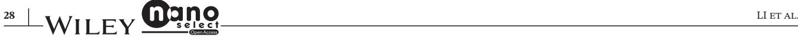

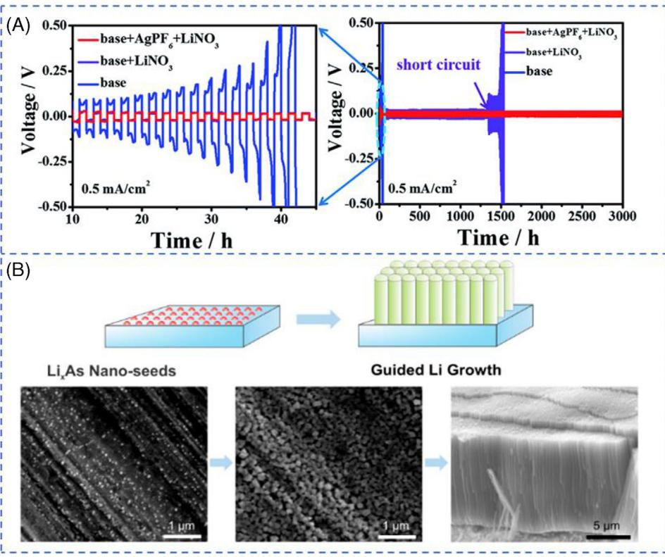

**FIGURE 7** A, Cycling performance of Li-Li symmetric cells at 0.5 mA cm–2. Reproduced with permission.[\[122\]](#page-19-0) Copyright 2020, Royal Society of Chemistry. B, Illustration of the effect of LixAs seeds to induce dendrite-free Li deposition (top). SEM images of Li surface after deposition in1 M LiPF6–PC (bottom): The interface layer on the Cu substrate after LSV to 0 V with LiAsF6 and VC additives (left); Li morphology after deposition for 10 minutes at 0.1 mA cm−2 with LiAsF6 and VC additives (middle); Cross section of electrodeposited Li film on Cu substrate with LiAsF6 and FEC additives (right). Reproduced with permission.[\[98\]](#page-18-0) Copyright 2018, American Chemical Society

obtained for more than 400 hours at 1 mA cm−2 with InF3 additive. And the Li4Ti5O12(LTO)//Li full cells could maintain efficient operation for more than 1000 cycles, which was much better than that without InF3 additive (∼300 cycles).

Mg can also form solid solution phases with lithium to suppress the growth of lithium dendrites. For example, the electrolyte additive, magnesium bis(trifluoromethanesulfonyl)amide (Mg(TFSA)2),[\[124\]](#page-19-0) was proved to be able to inhibit the growth of Li dendrites in electrolytes of x M Mg(TFSA)2 and (1-x) M LiTFSA/G3 (lithium bis(trifluoromethanesulfonyl)amide/triethylene glycol dimethyl ether) (x = 0, 0.1, 0.5). In electrolytes containing Li and Mg salts, Mg2+ was preferentially reduced before Li+, forming metal Mg, because the electrode potential of Mg2+ is higher than that of Li+ (–2.36 vs. –3.04[\[125\]](#page-19-0) ). Subsequently, the further deposition of Li with suppressed lithium dendrites could be realized by forming Li-Mg alloy phase (solid solutions). In the electrolyte containing 0.1 M Mg(TFSA)2 additive, obvious lithium dendrites could still be observed. However, when the concentration of additives increased to 0.5 M, the morphology of lithium deposition was improved obviously and the dendrite growth was suppressed. The authors claimed that the final alloy product was Li0.9Mg0.1 after plating for 10 hours in electrolytes of 0.5 M Mg(TFSA)2 and 0.5 M LiTFSA/G3 (Figure [8A\)](#page-13-0). Although the growth of Li dendrites was effectively inhibited, the CE was very low at 0.1 mA cm−2. Recently, Mg(NO3)2 [\[126\]](#page-19-0) was introduced as additives to improve the interfacial stability of lithium metal anode, where the baseline electrolyte was composed of 0.8 M LiTFSI, 0.2 M LiDFOB, 0.05 M LiPF6 in EMC/FEC (v/v = 3:1). Mg2+ could reduce the number of solvent molecules around Li+ due to the coordination of Mg2+ with the solvent molecules, and hence could change the solvation structure of Li+ (Figure [8B\)](#page-13-0). Simultaneously, partial deposition of Mg could form Li-Mg alloy on the surface of lithium metal, suppressing the growth of lithium dendrites. On the other hand, the NO3 – was conducive to forming a stable SEI film and improving the uniformity of lithium deposition. Therefore, the lithium metal batteries with Mg(NO3)2 additive (0.1 M) showed much higher cycling stability than that without additive. The Li-Li symmetric cells also kept stable for > 1400 h at a current density of 1.8 mA cm−2 and capacity loading of 1.8 mAh cm−2 (Figure [8C\)](#page-13-0).

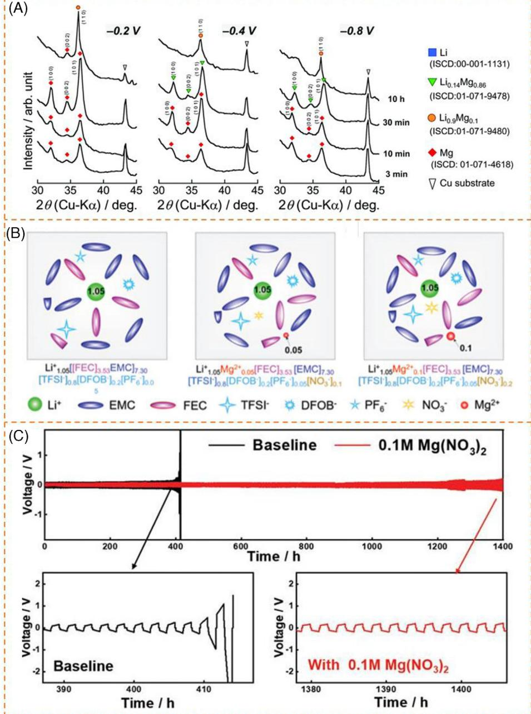

**FIGURE 8** A, XRD of deposits on a Cu substrate with 0.5 M Mg(TFSA)2 additive. Reproduced with permission. Reprinted with permission.[\[124\]](#page-19-0) Copyright 2018, Royal Society of Chemistry. B, Illustration of changes in Li+ solvation structure after adding Mg(NO3)2 additive: 0 M, 0.05 M, 0.1 M Mg(NO3)2, respectively. C, Schematic depicting the electrochemical properties of symmetric Li-Li cells with or without additive. Reproduced with permission.[\[126\]](#page-19-0) Copyright 2020, WILEY-VCH

### **5 OTHER MECHANISMS**

There are a lot of methods which have been reported for inhibiting lithium dendrites. For example, adding one layer between the lithium metal and the electrolyte (either coating on the lithium metal or directly adding another protecting layer) could be used for achieving homogenous distribution and deposition of Li and preventing the penetration of Li dendrites.[\[43,127–130\]](#page-17-0) Such protecting layer was often introduced before or during the assembly of the cells, leading to the complex handling. However, some additives can also functionalize similarly. After adding the additives, the additives could induce the homogenous distribution and deposition of Li.

# **5.1 Homogenous nucleation and grain refining mechanism**

Due to the extremely high local current density on the surface of the lithium anode, Li+ would be unevenly distributed on the anode surface, which was considered as one of the reasons for the growth of lithium dendrites.[\[131\]](#page-19-0) Although the regulation of the SEI layer, electrostatic shield mechanism and alloying mechanism, mentioned above promoted the uniform deposition of lithium to a certain extent, these methods did not fundamentally change the distribution of Li ions and the growth behavior of lithium dendrite.[\[132\]](#page-19-0) In addition, the additives for constructing SEI layer would be continuously consumed, as the SEI layer was repeatedly broken and reorganized. To tackle this issue, the mechanism of homogenous nucleation and grain refinement was proposed. Briefly, homogenous nucleation and grain refining mechanism means that the additives are specified to form a protective layer on the anode surface through deposition or physical adsorption, thereby facilitating the homogenous distribution of Li ions and deposition of Li. Compared with the regulation of the SEI layer and alloying mechanism, the protective layer here, would be stable during cycling. The protective layer is expected to not react with the electrolyte and lithium anode. The additives with the homogenous nucleation and grain refinement mechanism include magnesium bis(trifluoromethanesulfonyl)imide (Mg(TFSI)2),[\[133\]](#page-19-0) carbon nanodot (CDs),[\[134\]](#page-19-0) aluminum nitride (AlN) nanoflakes[\[135\]](#page-19-0) and poly(ethylene glycol) (PEG),[\[136\]](#page-19-0) etc. Among them, the first additive takes effect by inducing more nucleation sites through the deposition of Mg particles as nucleation sites; while the latter three facilitate the homogenous nucleation by forming homogenously distributed complexes with Li+ (due to the repulsion of adjacent complexes) on the substrates.

Inspired by magnesium batteries without dendritic Mg anodes, the surface of lithium anodes could be covered by magnesium.[\[133\]](#page-19-0) Magnesium bis-(trifluoromethanesulfonyl)imide (Mg(TFSI)2) was reported as the additives to form Mg metallic layer on the surface of lithium metal. The XRD of the lithium anode after immersing in the electrolyte with 25 mM Mg(TFSI)2 for 6 hours also showed the diffraction peaks of Mg metal, indicating that Mg2+ were reduced to Mg spontaneously. The EDS element mapping indicated that a porous network composed of interconnected Mg grains was potentially formed on the anode surface. However, unlike the above section, in which Mg2+ could form alloy with Li, the Mg metal here did not result in the Li-Mg alloy, although the reason was not clear. The authors contributed this phenomenon to the moderate reduction potential of Mg2+ and the porosity of Mg grains that facilitated the fast Li conducting pathway rather than the intrinsic diffusion in the alloy phase. The porosity was beneficial for the electrolyte to permeate through the voids in Mg network. The further characterization inferred that the Mg coating was an intermediate layer between the original lithium substrate and the lithium layer formed by plating. This mechanism was somewhat similar to the conductive matrix as host for Li deposition that induced the homogenous electric field and the intermediate Mg layer improved the uneven deposition of Li+. It should be noted that too much Mg deposition would have an adverse effect, because the porosity of magnesium was essential to the diffusion of Li+. The optimized amount of additives was 25 mM.

It is well known that more nucleation centers can significantly reduce the grain size. Some additives that can combine with lithium ion and be adsorbed uniformly on the anode surface make it possible to refine the grains of Li. It has been reported that the carbon nanodot (U-CD) with urea as the precursor could combine with Li+ to produce a smooth lithium deposition surface (Figure [9A\)](#page-15-0).[\[134\]](#page-19-0) The U-CD additive had a strong affinity with Li+, due to its low Zeta potential (25 mV) and surface containing abundant carboxyl and N-containing functional groups. During the electroplating/stripping process, the U-CD-Li+ ion clusters, formed by combination of U-CD with Li+, were evenly distributed on the anode surface due to the repulsion between these ion clusters. And then the ion clusters accepted electrons and were reduced uniformly. Hence, the addition of carbon nanodots provided more nucleation sites and exhibited higher coulombic efficiency and capacity retention than those without additive. Li//LiCoO2 full-cells were tested in the electrolyte (1.3 M LiPF6 in EC/DEC (3/7 vol%)) with the addition of 0.5 mg mL–1 U-CD. After 100 cycles at 1 mA cm–2 for 1 mAh cm–2, the capacity retention was as high as 99.9% with CE of 99.1% (Figure [9B\)](#page-15-0). Aluminum nitride (AlN) nanoflakes[\[135\]](#page-19-0) showed the similar effect as U-CD. The calculation showed that the binding energy of AlN with Li+ was much higher than those of Cu or carbon paper current collector with Li+, leading to homogenous distributed Li+-complexes. These results are quite different from the electrostatic shielding mechanism. In the electrostatic shielding mechanism, the positive charges are adsorbed on the lithium protuberances due to the higher electric field intensity, but they are not deposited because of their lower electrode potential, leading to the deposition of Li at the recessions. However, the homogenous nucleation mechanism here is using the binding of Li+ with additives to form Li+-clusters, and the clusters are adsorbed on the entire substrate homogenously due to the electrostatic repulsion, leading to homogenous nucleation and deposition of Li.

Similar results were obtained by using polymers as additives. For example, poly(ethylene glycol) (PEG-200)[\[136\]](#page-19-0)

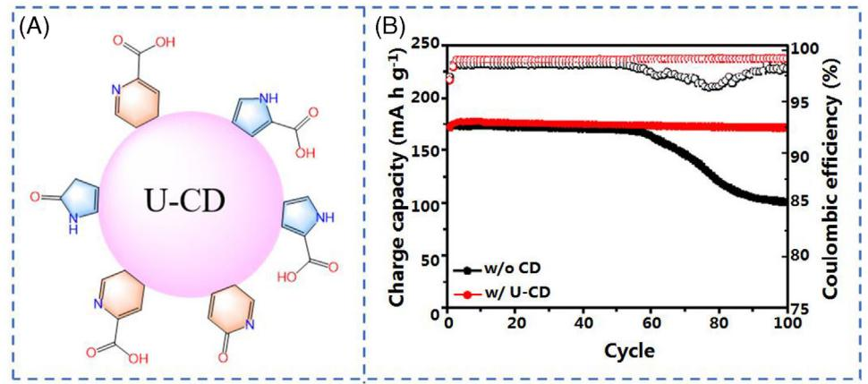

**FIGURE 9** A, Structural illustration of the U-CD. B, The cycling performance of Li//LiCoO2 full-cell with and without U-CD. Adapted with permission.[\[134\]](#page-19-0) Copyright 2019, Royal Society of Chemistry

was added to the electrolyte, which would form a complex with Li+. The complex would preferentially be adsorbed on the surface of lithium metal in a flat manner. The lying-flat adsorption was confirmed through similar resistance of Li-Cu half-cells with different chain lengths of EG molecules. DFT calculation proved the absorption and coordination energies of PEG-200 with four coordination sites were lower than those of DME electrolyte with two coordination sites, indicating that PEG-200 were easier to be adsorbed on lithium metal and had a greater tendency to coordinate with Li+ than those of DME molecules. It was well known that when Li+ were reduced to Li on the anode surface, a local space charge layer would be formed, and the uneven Li+ flux would lead to the growth of lithium dendrites. The homogenous distributed Li+-PEG complex on the anode surface ensured the uniform distribution of Li+, which provided a uniform Li+ deposition. In particular, the PEG-200 did not participate in the formation of SEI layer; and hence it would not be decomposed and consumed during cycling. Furthermore, the PEG with higher molecular weight resulted in lower CE and more cracks in the Li surface.

### **5.2 Leveling agent**

In the traditional electroplating process, the flatness of the coating can be improved by adding leveling agent, because the leveling agent is more easily absorbed by the microscopic peaks on the surface of the plated part, which increases the deposition resistance and slows down the deposition rate of the peaks. Inspired by the leveling mechanism, some additives with leveling effects were developed for Li metal batteries.

Two-dimensional materials, boron nitride nanosheets (BNNSs), have been adopted as coating layer on Li metal,[\[137\]](#page-19-0) separators[\[138,139\]](#page-19-0) and solid-state electrolytes.[\[140,141\]](#page-19-0) The application of BNNSs as leveling agent recently was developed by Huang and others.[\[142\]](#page-19-0) BNNSs have the advantages of two-dimensional structure and high Young's modulus (BNNSs: 950 GPa, lithium metal: 4.9 GPa). In the early stage of lithium deposition, as the tip showed a stronger electric field, Li ions were more likely to be deposited on the tip, leading to the formation of lithium dendrites. However, when BNNS additives were present, the deposition of lithium would be flattened by BNNSs, because of their two-dimensional structure and high mechanical strength. In addition, there were no electrons on the Pz orbital of the B atom in BNNSs, which would act as Lewis acid to capture the TFSI anions and promote their dissociation from Li ions, thereby reducing the Li+ concentration gradient. Encouragingly, the BNNS additives allowed Li-Li symmetric batteries to operate for a long time in the temperature range of 0∼-20◦C, and would not be consumed (Figure [10A\)](#page-16-0).

In addition to the aforementioned electrostatic shielding additives that are adsorbed on the protrusions, the additives used to guide the deposition of Li+ can also be adsorbed in the recessions. The adsorbed additives then could induce the preferential deposition of Li+ at the recession, resulting in uniform lithium electrodeposition. Thiourea (THU) is one kind of these additives.[\[143\]](#page-19-0) In situ optical microscopy was carried out to observe the deposition behavior of lithium metal in electrolytes with or without THU additive. After 2.0 hours, obvious lithium dendrites were observed in the bare electrolyte. In sharp contrast, a dense lithium layer without dendrites was observed in the electrolyte containing 0.02 M THU (Figure [10B\)](#page-16-0). Some studies denoted it as the superfilling effect, which could accelerate the Li growth in recessions. The S atom of thiourea had greater binding energy with lithium metal than other electrolyte molecules. More importantly, THU tended to aggregate in the recessions rather than on the protuberances. Both experiments and

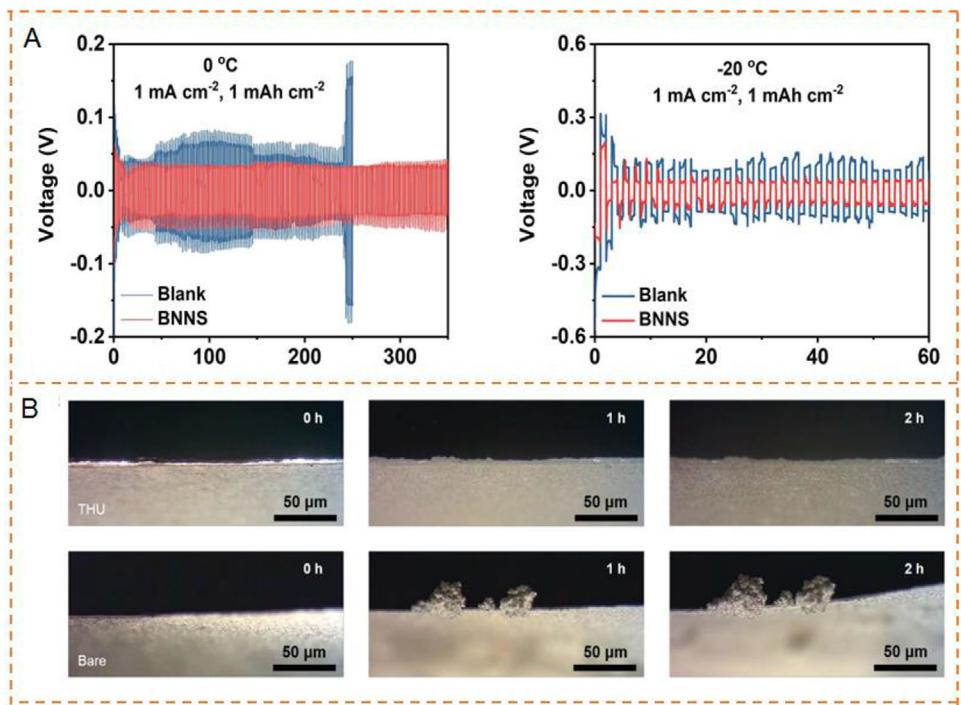

**FIGURE 10** A, Time-voltage curves of Li-Li symmetric batteries in different electrolytes cycled at 0◦C and -20◦C. Reproduced with permission.[\[142\]](#page-19-0) Copyright 2020, Elsevier. B, In situ optical microscopy observations of lithium deposition in using 1.0 M LiPF6 in DOL/DME with and without 0.02 M THU at 3.0 mA cm–2 for 6.0 mAh cm–2. Reproduced with permission.[\[143\]](#page-19-0) Copyright 2019, Wiley-VCH

calculations showed that THU exhibited a catalytic effect during the reduction of Li+ to Li, and the nucleation barrier of Li+ was decreased due to the presence of THU. In this case, the filling speed of the pits was accelerated, leading to a superfilling phenomenon on the lithium metal surface. Notably, THU would not be consumed during cycling. The concentration of THU should also be controlled, because it would exert a negative effect at high concentrations. In addition, a series of thiourea analogues and derivatives were proposed, such as carbon disulfide, thiophene, dithiooxamide, *N*,*N*-diphenylthiourea and so on. The same effect as THU could be achieved by using dual-additives. For example, saccharin could be used with hexafluoroacetylacetone (HFAA) as a mixed additive.[\[144\]](#page-19-0) HFAA was used as a grain refiner to complex with Li+ to provide more nucleation sites, and saccharin as a leveling agent to drive the deposition of Li+ on the recession surface of the electrode. This mixed additive enhanced the stability of the battery under high current density.

### **6 CONCLUSION AND PROSPECT**

Lithium metal batteries are considered to be a promising candidate for the next generation energy storage devices due to their high energy density. However, the low coulombic efficiency and the growth of lithium dendrites during cycling seriously hinder the practical applications of lithium metal batteries. The addition of electrolyte additives is facile and effective for suppressing the growth of lithium dendrites, which is superior in low cost and easy production. In this short review, we briefly summarized the recent progress of electrolyte additives for lithium anodes, according to the various mechanisms of electrolyte additives, such as electrostatic shield mechanism, forming a stable SEI, alloying mechanism etc.

Although electrolyte additives have made great achievements, there are still a lot of challenges needed to be solved before the practical application in LMBs. (1) The fundamental reason that causes the formation of lithium dendrites is still not clear. The further understanding of the reason is helpful for developing more suitable electrolyte additives and solving the problem. (2) Most reported additives are consumed during cycling and cannot play a sustainable role in the long-term cycling. If the additives can work like catalysts, they will not be sacrificed during cycling, which will make the additives more effective and durable. (3) It might be a compromise to use multifunctional additives or multiple additives to realize synergistic effect, allowing each additive to give full play to its advantages. (4) The cost of additives must be taken into account, which is a key factor for practical applications. (5) It is necessary to develop more characterization techniques for understanding the fundamental reason of forming Li dendrites and the mechanism of inhibiting the Li dendrites. Currently, CE, morphology and cycling stability are often used to characterize the effect of the Li anodes. However, the components of the interface are always complex and not well defined. (6) More robust additives should be developed. Artificial intelligent would be a promising tool that can help to develop reliable additives.[\[145\]](#page-19-0)

In brief, electrolyte additives have received much attention. The challenges should be overcome after unremitting efforts, and rechargeable LMBs will replace the traditional LIBs in the near future. The application of electrolyte additives will pave a way for the rapid development of LMBs.

#### **ACKNOWLEDGMENTS**

This work was financially supported by the National Natural Science Foundation of China (51773071), the National 1000-Talents Program, the Innovation Fund of WNLO and the Fundamental Research Funds for the Central Universities (HUST: 2018KFYXKJC018 and 2019kfyRCPY099). Lulu Li and Huichao Dai contributed equally to this work.

#### **ORCID**

*ChengliangWang* [https://orcid.org/0000-0002-1151-](https://orcid.org/0000-0002-1151-3122) [3122](https://orcid.org/0000-0002-1151-3122)

#### **REFERENCES**

- 1. D. Lin, Y. Liu, Y. Cui, *Nat. Nanotech.* **2017**, *12*, 194.
- 2. Y. Chen, M. Tang, Y. Wu, X. Su, X. Li, S. Xu, S. Zhuo, J. Ma, D. Yuan, C. Wang, W. Hu, *Angew. Chem. Int. Ed.* **2019**, *58*, 14731.
- 3. M. Tang, S. Zhu, Z. Liu, C. Jiang, Y. Wu, H. Li, B. Wang, E. Wang, J. Ma, C. Wang, *Chem* **2018**, *4*, 2600.
- 4. Y. Gu, W. W. Wang, Y. J. Li, Q. H. Wu, S. Tang, J. W. Yan, M. S. Zheng, D. Y. Wu, C. H. Fan, W. Q. Hu, Z. B. Chen, Y. Fang, Q. H. Zhang, Q. F. Dong, B. W. Mao, *Nat. Commun.* **2018**, *9*, 1339.
- 5. Y. Chen, C. Wang, *Acc. Chem. Res.* **2020**, [https://doi.org/10.](https://doi.org/10.1021/acs.accounts.0c00465) [1021/acs.accounts.0c00465.](https://doi.org/10.1021/acs.accounts.0c00465)
- 6. C. Wang, *Energy Environ. Mater.* **2020**, [https://doi.org/10.1002/](https://doi.org/10.1002/eem2.12076) [eem2.12076.](https://doi.org/10.1002/eem2.12076)
- 7. Y. Chen, S. Zhuo, Z. Li, C. Wang, *EnergyChem* **2020**, *2*, 100030.
- 8. L. Li, S. Li, Y. Lu, *Chem. Commun.* **2018**, *54*, 6648.
- 9. J. M. Tarascon, M. Armand, *Nature* **2001**, *414*, 359.
- 10. G. Bieker, M. Winter, P. Bieker, *Phys. Chem. Chem. Phys.* **2015**, *17*, 8670.
- 11. Y. S. Cohen, Y. Cohen, D. Aurbach, *J. Phys. Chem. B* **2000**, *104*, 12282.
- 12. X.-B. Cheng, R. Zhang, C. Z. Zhao, F. Wei, J. G. Zhang, Q. Zhang, *Adv. Sci.* **2016**, *3*, 1500213.
- 13. K. Yoo, S. Banerjee, P. Dutta, *J. Power Sources* **2014**, *258*, 340.
- 14. Y. Liu, D. Lin, Z. Liang, J. Zhao, K. Yan, Y. Cui, *Nat. Commun.* **2016**, *7*, 10992.
- 15. K. J. Harry, D. T. Hallinan, D. Y. Parkinson, A. A. MacDowell, N. P. Balsara, *Nat. Mater.* **2014**, *13*, 69.
- 16. F. Hao, A. Verma, P. P. Mukherjee, *Energy Storage Mater*. **2019**, *20*, 1.
- 17. W. Xu, J. Wang, F. Ding, X. Chen, E. Nasybulin, Y. Zhang, J.-G. Zhang, *Energy Environ. Sci.* **2014**, *7*, 513.
- 18. D. Aurbach, E. Zinigrad, H. Teller, P. Dan, *J. Electrochem. Soc.* **2000**, *147*, 1274.
- 19. Z. Sun, S. Jin, H. Jin, Z. Du, Y. Zhu, A. Cao, H. Ji, L.-J. Wan, *Adv. Mater.* **2018**, *30*, 1800884.
- 20. C. Yang, Y. Yao, S. He, H. Xie, E. Hitz, L. Hu, *Adv. Mater.* **2017**, *29*, 1702714.
- 21. H. Ye, S. Xin, Y. X. Yin, J. Y. Li, Y. G. Guo, L. J. Wan, *J. Am. Chem. Soc.* **2017**, *139*, 5916.
- 22. C. Zhang, W. Lv, G. Zhou, Z. Huang, Y. Zhang, R. Lyu, H. Wu, Q. Yun, F. Kang, Q.-H. Yang, *Adv. Energy Mater.* **2018**, *8*, 1703404.
- 23. Q. Li, S. Zhu, Y. Lu, *Adv. Funct. Mater.* **2017**, *27*, 1606422.
- 24. Z. Jiang, T. Liu, L. Yan, J. Liu, F. Dong, M. Ling, C. Liang, Z. Lin, *Energy Storage Mater.* **2018**, *11*, 267.
- 25. H. Wang, D. Lin, Y. Liu, Y. Li, Y. Cui, *Sci. Adv.* **2017**, *3*, e1701301.
- 26. J. Heine, P. Hilbig, X. Qi, P. Niehoff, M. Winter, P. Bieker,*J. Electrochem. Soc.* **2015**, *162*, A1094.
- 27. M. S. Park, S. B. Ma, D. J. Lee, D. Im, S. G. Doo, O. Yamamoto, *Sci. Rep.* **2014**, *4*, 3815.
- 28. X. Fan, L. Chen, O. Borodin, X. Ji, J. Chen, S. Hou, T. Deng, J. Zheng, C. Yang, S. C. Liou, K. Amine, K. Xu, C. Wang, *Nat. Nanotech.* **2018**, *13*, 1191.
- 29. X. Ren, S. Chen, H. Lee, D. Mei, M. H. Engelhard, S. D. Burton, W. Zhao, J. Zheng, Q. Li, M. S. Ding, M. Schroeder, J. Alvarado, K. Xu, Y. S. Meng, J. Liu, J.-G. Zhang, W. Xu, *Chem* **2018**, *4*, 1877.
- 30. J. Qian, W. A. Henderson, W. Xu, P. Bhattacharya, M. Engelhard, O. Borodin, J. G. Zhang, *Nat. Commun.* **2015**, *6*, 6362.
- 31. Y. Lu, Z. Tu, L. A. Archer, *Nat. Mater.* **2014**, *13*, 961.
- 32. Q. Pang, X. Liang, A. Shyamsunder, L. F. Nazar, *Joule* **2017**, *1*, 871.
- 33. W. Zhao, L. Zou, J. Zheng, H. Jia, J. Song, M. H. Engelhard, C. Wang, W. Xu, Y. Yang, J. G. Zhang, *ChemSusChem* **2018**,*11*, 2211.
- 34. X. Shen, X. Cheng, P. Shi, J. Huang, X. Zhang, C. Yan, T. Li, Q. Zhang, *J. Energy Chem.* **2019**, *37*, 29.
- 35. X. Zhang, S. Wang, C. Xue, C. Xin, Y. Lin, Y. Shen, L. Li, C. W. Nan, *Adv. Mater.* **2019**, *31*, 1806082.
- 36. B. Wang, Y. Wu, S. Zhuo, S. Zhu, Y. Chen, C. Jiang, C. Wang, *J. Mater. Chem. A* **2020**, *8*, 5968.
- 37. B. Wang, M. Tang, Y. Wu, Y. Chen, C. Jiang, S. Zhuo, S. Zhu, C. Wang, *ACS Appl. Energy Mater.* **2019**, *2*, 5909.
- 38. C. Yan, X. B. Cheng, Y. Tian, X. Chen, X. Q. Zhang, W. J. Li, J. Q. Huang, Q. Zhang, *Adv. Mater.* **2018**, *30*, 1707629.
- 39. X.-T. Xi, W.-H. Li, B.-H. Hou, Y. Yang, Z.-Y. Gu, X.-L. Wu, *ACS Appl. Energy Mater.* **2019**, *2*, 201.
- 40. J. Ding, R. Xu, C. Yan, Y. Xiao, Y. Liang, H. Yuan, J. Huang, *Chin. Chem. Lett.* **2020**, *31*, 2339.
- 41. Q.-K. Lei, Q. Zhang, X.-Y. Wu, X. Wei, J. Zhang, K.-X. Wang, J.-S. Chen, *Chem. Eng. J.* **2020**, *395*, 125187.
- 42. X. B. Cheng, T. Z. Hou, R. Zhang, H. J. Peng, C. Z. Zhao, J. Q. Huang, Q. Zhang, *Adv. Mater.* **2016**, *28*, 2888.
- 43. C. Jiang, Y. Gu, M. Tang, Y. Chen, Y. Wu, J. Ma, C. Wang, W. Hu, *ACS Appl. Mater. Interfaces* **2020**, *12*, 10461.
- 44. C. Jiang, C. Wang, *Chem. Asian J.* **2020**, *15*, 2294.
- 45. F. Ding, W. Xu, G. L. Graff, J. Zhang, M. L. Sushko, X. Chen, Y. Shao, M. H. Engelhard, Z. Nie, J. Xiao, X. Liu, P. V. Sushko, J. Liu, J. G. Zhang, *J. Am. Chem. Soc.* **2013**, *135*, 4450.
- 46. X. Sun, X. Zhang, Q. Ma, X. Guan, W. Wang, J. Luo, *Angew. Chem. Int.* Ed. **2020**, *59*, 6665.

LI et al. **33**

- 47. Y. Zhang, J. Qian, W. Xu, S. M. Russell, X. Chen, E. Nasybulin, P. Bhattacharya, M. H. Engelhard, D. Mei, R. Cao, F. Ding, A. V. Cresce, K. Xu, J. G. Zhang, *Nano Lett*. **2014**, *14*, 6889.
- 48. F. Ding, W. Xu, X. Chen, J. Zhang, Y. Shao, M. H. Engelhard, Y. Zhang, T. A. Blake, G. L. Graff, X. Liu, J.-G. Zhang, *J. Phys. Chem. C* **2014**, *118*, 4043.
- 49. S. Kim, J. Choi, H. Lee, Y.-C. Jeong, Y. M. Lee, M.-H. Ryou, *J. Power Sources* **2019**, *413*, 344.
- 50. S. Li, S. Fang, H. Dou, X. Zhang, *ACS Appl. Energy Mater.* **2019**, *11*, 20804.
- 51. D. Wang, H. Liu, M. Li, D. Xia, J. Holoubek, Z. Deng, M. Yu, J. Tian, Z. Shan, S. P. Ong, P. Liu, Z. Chen, *Nano Energy* **2020**, *75*, 104889.
- 52. H. Ye, Y.-X. Yin, S.-F. Zhang, Y. Shi, L. Liu, X.-X. Zeng, R. Wen, Y.-G. Guo, L.-J. Wan, *Nano Energy* **2017**, *36*, 411.
- 53. D.-J. Yoo, K. J. Kim, J. W. Choi, *Adv. Energy Mater.* **2018**, *8*, 1702744.
- 54. A. Budi, A. Basile, G. Opletal, A. F. Hollenkamp, A. S. Best, R. J. Rees, A. I. Bhatt, A. P. O'Mullane, S. P. Russo, *J. Phys. Chem. C* **2012**, *116*, 19789.
- 55. D. Lin, Y. Liu, W. Chen, G. Zhou, K. Liu, B. S. Dunn, Y. Cui, Nano Lett. **2017**, *17*, 3731.
- 56. H. Dai, K. Xi, X. Liu, C. Lai, S. Zhang, *J. Am. Chem. Soc.* **2018**, *140*, 17515.
- 57. E. Peled, D. Golodnitsky, G. Ardel,*J. Electrochem. Soc.* **1997**,*144*, L208.
- 58. D. Lin, Y. Liu, A. Pei, Y. Cui, *Nano Res*. **2017**, *10*, 4003.
- 59. X.-B. Cheng, R. Zhang, C. Z. Zhao, Q. Zhang, *Chem. Rev.* **2017**, *117*, 10403.
- 60. X. Fu, G. Wang, D. Dang, Q. Liu, X. Xiong, C. Wu, *J. Mater. Chem. A* **2019**, *7*, 25003.
- 61. Q. C. Liu, J. J. Xu, S. Yuan, Z. W. Chang, D. Xu, Y. B. Yin, L. Li, H. X. Zhong, Y. S. Jiang, J. M. Yan, X. B. Zhang, *Adv. Mater.* **2015**, *27*, 5241.
- 62. D. Gunceler, K. Letchworth-Weaver, R. Sundararaman, K. A. Schwarz, T. A. Arias, *Modell. Simul. Mater. Sci. Eng.* **2013**, *21*, 074005.
- 63. S. Choudhury, L. A. Archer, *Adv. Electron. Mater.* **2016**, *2*, 1500246.
- 64. K. Kanamura, S. Shiraishi, Z.-i. Takehara, *J. Fluorine Chem.* **1998**, *87*, 235.
- 65. J. Qian, W. Xu, P. Bhattacharya, M. Engelhard, W. A. Henderson, Y. Zhang, J.-G. Zhang, *Nano Energy* **2015**, *15*, 135.
- 66. E. Markevich, R. Sharabi, H. Gottlieb, V. Borgel, K. Fridman, G. Salitra, D. Aurbach, G. Semrau, M. A. Schmidt, N. Schall, C. Bruenig, *Electrochem. Commun.* **2012**, *15*, 22.
- 67. P. Shi, L. Zhang, H. Xiang, X. Liang, Y. Sun, W. Xu, *ACS Appl. Mater. Interfaces* **2018**, *10*, 22201.
- 68. G. Zheng, Y. Xiang, S. Chen, S. Ganapathy, T. W. Verhallen, M. Liu, G. Zhong, J. Zhu, X. Han, W. Wang, W. Zhao, M. Wagemaker, Y. Yang, *Energy Storage Mater*. **2020**, *29*, 377.
- 69. J. Zheng, M. H. Engelhard, D. Mei, S. Jiao, B. J. Polzin, J.-G. Zhang, W. Xu, *Nat. Energy* **2017**, *2*, 17012.
- 70. G. Wang, X. Xiong, D. Xie, X. Fu, X. Ma, Y. Li, Y. Liu, Z. Lin, C. Yang, M. Liu, *Energy Storage Mater*. **2019**, *23*, 701.
- 71. F. Wu, J. T. Lee, N. Nitta, H. Kim, O. Borodin, G. Yushin, *Adv. Mater.* **2015**, *27*, 101.
- 72. Q. Zhao, Z. Tu, S. Wei, K. Zhang, S. Choudhury, X. Liu, L. A. Archer, *Angew. Chem. Int. Ed.* **2018**, *57*, 992.
- 73. Z. Huang, J. Ren, W. Zhang, M. Xie, Y. Li, D. Sun, Y. Shen, Y. Huang, *Adv. Mater.* **2018**, *30*, 1803270.
- 74. S. Cahen, R. Janot, L. Laffont-Dantras, J. M. Tarascon, *J. Electrochem. Soc.* **2008**, *155*, A512.
- 75. M. Ebadi, M. J. Lacey, D. Brandell, C. M. Araujo, *J. Phys. Chem. C* **2017**, *121*, 23324.
- 76. A. Rosenman, R. Elazari, G. Salitra, E. Markevich, D. Aurbach, A. Garsuch, *J. Electrochem. Soc.* **2015**, *162*, A470.
- 77. Z. Zeng, V. Murugesan, K. S. Han, X. Jiang, Y. Cao, L. Xiao, X. Ai, H. Yang, J.-G. Zhang, M. L. Sushko, J. Liu, *Nat. Energy* **2018**, *3*, 674.
- 78. S. J. Tan, J. Yue, X. C. Hu, Z. Z. Shen, W. P. Wang, J. Y. Li, T. T. Zuo, H. Duan, Y. Xiao, Y. X. Yin, R. Wen, Y. G. Guo, *Angew. Chem. Int. Ed.* **2019**, *58*, 7802.
- 79. Z. L. Brown, S. Heiskanen, B. L. Lucht, *J. Electrochem. Soc.* **2019**, *166*, A2523.
- 80. Y. Jie, X. Liu, Z. Lei, S. Wang, Y. Chen, F. Huang, R. Cao, G. Zhang, S. Jiao, *Angew. Chem. Int. Ed.* **2020**, *59*, 3505.
- 81. Z. Wang, K. Yang, Y. Song, H. Lin, K. Li, Y. Cui, L. Yang, F. Pan, *Nano Res*. **2020**, *13*, 2431.
- 82. S. S. Zhang, *Electrochim. Acta* **2012**, *70*, 344.
- 83. J. Guo, Z. Wen, M. Wu, J. Jin, Y. Liu, *Electrochem. Commun.* **2015**, *51*, 59.
- 84. X. Yan, H. Zhang, M. Huang, M. Qu, Z. Wei, *ChemSusChem* **2019**, *12*, 2263.
- 85. Y. He, Y. Zhang, P. Yu, F. Ding, X. Li, Z. Wang, Z. Lv, X. Wang, Z. Liu, X. Huang, *J. Energy Chem.* **2020**, *45*, 1.
- 86. T. Miyazaki, Y. Takeda, S. Akane, T. Itou, A. Hoshiko, K. En, *Polymer* **2010**, *51*, 5539.
- 87. M. Lim, H. Kwon, D. Kim, J. Seo, H. Han, S. B. Khan, *Prog. Org. Coat.* **2015**, *85*, 68.
- 88. J. Y. Woo, E. J. Shin, Y. H. Lee, *Polym. Bull.* **2010**, *65*, 169.
- 89. Z. An, O. C. Compton, K. W. Putz, L. C. Brinson, S. T. Nguyen, *Adv. Mater.* **2011**, *23*, 3842.
- 90. D. Zhuang, X. Huang, Z. Chen, H. Gong, L. Sheng, L. Song, T. Wang, J. He, *J. Power Sources* **2020**, *458*, 228055.
- 91. A. M. Haregewoin, A. S. Wotango, B.-J. Hwang, *Energy Environ. Sci.* **2016**, *9*, 1955.
- 92. T. Dagger, P. Niehoff, C. Lürenbaum, F. M. Schappacher, M. Winter, *Energy Technol*. **2018**, *6*, 2023.
- 93. X. Shen, R. Zhang, X. Chen, X. B. Cheng, X. Li, Q. Zhang, *Adv. Energy Mater.* **2020**, *10*, 1903645.
- 94. M. Tang, Y. Wu, Y. Chen, C. Jiang, S. Zhu, S. Zhuo, C. Wang, *J. Mater. Chem. A* **2019**, *7*, 486.
- 95. E. Markevich, G. Salitra, D. Aurbach, *ACS Energy Lett.* **2017**, *2*, 1337.
- 96. Y. Rangom, R. R. Gaddam, T. T. Duignan, X. S. Zhao, *ACS Appl. Mater. Interfaces* **2019**, *11*, 34796.
- 97. X.-Q. Zhang, X.-B. Cheng, X. Chen, C. Yan, Q. Zhang, *Adv. Funct. Mater.* **2017**, *27*, 1605989.
- 98. X. Ren, Y. Zhang, M. H. Engelhard, Q. Li, J.-G. Zhang, W. Xu, *ACS Energy Lett*. **2018**, *3*, 14.
- 99. X.-Q. Zhang, X. Chen, X.-B. Cheng, B.-Q. Li, X. Shen, C. Yan, J.-Q. Huang, Q. Zhang, *Angew. Chem. Int. Ed.* **2018**, *130*, 5399.
- 100. Z. Xie, Z. Wu, X. An, X. Yue, A. Yoshida, X. Du, X. Hao, A. Abudula, G. Guan, *Chem. Eng. J.* **2020**, *393*, 124789.
- 101. C. Yan, Y. X. Yao, X. Chen, X. B. Cheng, X. Q. Zhang, J. Q. Huang, Q. Zhang, *Angew. Chem. Int. Ed.* **2018**, *57*, 14055.
- 102. K. Park, J. B. Goodenough, *Adv. Energy Mater.* **2017**, *7*, 1700732.
- 104. D. J. Yoo, S. Yang, K. J. Kim, J. W. Choi, *Angew. Chem. Int. Ed.* **2020**, *59*, 14869.
- 105. H. Kuwata, H. Sonoki, M. Matsui, Y. Matsuda, N. Imanishi, *Electrochemistry* **2016**, *84*, 854.
- 106. G. Wan, F. Guo, H. Li, Y. Cao, X. Ai, J. Qian, Y. Li, H. Yang, *ACS Appl. Mater. Interfaces* **2018**, *10*, 593.
- 107. G. Li, Q. Huang, X. He, Y. Gao, D. Wang, S. H. Kim, D. Wang, *ACS Nano* **2018**, *12*, 1500.
- 108. X. Fan, A. Xing, W. Sun, R. Lu, A. Li, X. Wei, F. Meng, J. Liu, *Electrochim. Acta* **2018**, *282*, 711.
- 109. B. Tong, J. Wang, Z. Liu, L. Ma, P. Wang, W. Feng, Z. Peng, Z. Zhou, *J. Power Sources* **2018**, *400*, 225.
- 110. Y. Qian, Y. Kang, S. Hu, Q. Shi, Q. Chen, X. Tang, Y. Xiao, H. Zhao, G. Luo, K. Xu, Y. Deng, *ACS Appl. Mater. Interfaces* **2020**, *12*, 10443.
- 111. Y. Ma, Z. Zhou, C. Li, L. Wang, Y. Wang, X. Cheng, P. Zuo, C. Du, H. Huo, Y. Gao, G. Yin, *Energy Storage Mater*. **2018**, *11*, 197.
- 112. L. Yu, S. Chen, H. Lee, L. Zhang, M. H. Engelhard, Q. Li, S. Jiao, J. Liu, W. Xu, J.-G. Zhang, *ACS Energy Lett*. **2018**, *3*, 2059.
- 113. Z. A. Ghazi, Z. Sun, C. Sun, F. Qi, B. An, F. Li, H. M. Cheng, *Small* **2019**, *15*, 1900687.
- 114. W.-H. Li, H.-J. Liang, X.-K. Hou, Z.-Y. Gu, X.-X. Zhao, J.-Z. Guo, X. Yang, X.-L. Wu, *J. Energy Chem.* **2020**, *50*, 416.
- 115. X. T. Wang, Z. Y. Gu, W. H. Li, X. X. Zhao, J. Z. Guo, K. D. Du, X. X. Luo, X. L. Wu, *Chem. Asian J.* **2020**, *15*, 2803.
- 116. W. H. Li, Q. L. Ning, X. T. Xi, B. H. Hou, J. Z. Guo, Y. Yang, B. Chen, X. L. Wu, *Adv. Mater.* **2019**, *31*, 1804766.
- 117. B. Tong, J. Huang, Z. Zhou, Z. Peng, *Adv. Mater.* **2018**, *30*, 1704841.
- 118. Z. Fang, Q. Ma, P. Liu, J. Ma, Y. S. Hu, Z. Zhou, H. Li, X. Huang, L. Chen, *ACS Appl. Mater. Interfaces* **2017**, *9*, 4282.
- 119. M. Nie, D. P. Abraham, Y. Chen, A. Bose, B. L. Lucht, *J. Phys. Chem. C* **2013**, *117*, 13403.
- 120. Y. Yu, Y.-B. Yin, J.-L. Ma, Z.-W. Chang, T. Sun, Y.-H. Zhu, X.-Y. Yang, T. Liu, X.-B. Zhang, *Energy Storage Mater*. **2019**, *18*, 382.
- 121. K. Yan, Z. Lu, H.-W. Lee, F. Xiong, P.-C. Hsu, Y. Li, J. Zhao, S. Chu, Y. Cui, *Nat. Energy* **2016**, *1*, 16010.
- 122. L.-N. Wu, J. Peng, F.-M. Han, Y.-K. Sun, T. Sheng, Y.-Y. Li, Y. Zhou, L. Huang, J.-T. Li, S.-G. Sun, *J. Mater. Chem. A* **2020**, *8*, 4300.
- 123. Q. Pang, X. Liang, I. R. Kochetkov, P. Hartmann, L. F. Nazar, *Angew. Chem. Int. Ed.* **2018**, *57*, 9795.
- 124. M. Shimizu, M. Umeki, S. Arai, *Phys. Chem. Chem. Phys.* **2018**, *20*, 1127.
- 125. M. Jagannathan, K. S. R. Chandran, *J. Electrochem. Soc.* **2013**, *160*, A1922.
- 126. S. H. Lee, J. Y. Hwang, J. Ming, Z. Cao, H. A. Nguyen, H. G. Jung, J. Kim, Y. K. Sun, *Adv. Energy Mater.* **2020**, *10*, 2000567.
- 127. C. Gao, Q. Dong, G. Zhang, H. Fan, H. Li, B. Hong, Y. Lai, *Chem-ElectroChem* **2019**, *6*, 1134.
- 128. S. Tang, X. Zhang, Y. Li, J. Tian, Y. Zhao, L. Mai, L. Wang, Y.-C. Cao, W. Zhang, *J. Alloys Compd.* **2020**, *843*, 155839.
- 129. J. Xie, L. Liao, Y. Gong, Y. Li, F. Shi, A. Pei, J. Sun, R. Zhang, B. Kong, R. Subbaraman, J. Christensen, Y. Cui, *Sci. Adv.* **2017**, *3*, eaao3170.
- 130. Y. Zhao, Y. Ye, F. Wu, Y. Li, L. Li, R. Chen, *Adv. Mater.* **2019**, *31*, 1806532.
- 131. S. Li, Z. Luo, L. Li, J. Hu, G. Zou, H. Hou, X. Ji, *Energy Storage Mater*. **2020**, *32*, 306.
- 132. H. Zhang, G. G. Eshetu, X. Judez, C. Li, Rodriguez-Martinez, L. M., M. Armand, *Angew. Chem. Int. Ed.* **2018**, *57*, 15002.
- 133. F. Chu, J. Hu, J. Tian, X. Zhou, Z. Li, C. Li, *ACS Appl. Mater. Interfaces* **2018**, *10*, 12678.
- 134. D. Hong, Y. Choi, J. Ryu, J. Mun, W. Choi, M. Park, Y. Lee, N.- S. Choi, G. Lee, B.-S. Kim, S. Park, *J. Mater. Chem. A* **2019**, *7*, 20325.
- 135. C. Gao, B. Hong, K. Sun, H. Fan, K. Zhang, Z. Zhang, Y. Lai, *Energy Technol*. **2020**, *8*, 1901463.
- 136. Q. Wang, C. Yang, Y. Zhang, J. Yang, K. Wu, C. Hu, J. Lu, W. Liu, H. Zhou, *ACS Appl. Energy Mater.* **2019**, *2*, 4602.
- 137. K. Yan, H. W. Lee, T. Gao, G. Zheng, H. Yao, H. Wang, Z. Lu, Y. Zhou, Z. Liang, Z. Liu, S. Chu, Y. Cui, *Nano Lett*. **2014**, *14*, 6016.
- 138. W. Luo, L. Zhou, K. Fu, Z. Yang, J. Wan, M. Manno, Y. Yao, H. Zhu, B. Yang, L. Hu, *Nano Lett*. **2015**, *15*, 6149.
- 139. Y. Fan, Z. Yang, W. Hua, D. Liu, T. Tao, M. M. Rahman, W. Lei, S. Huang, Y. Chen, *Adv. Energy Mater.* **2017**, *7*, 1602380.
- 140. Q. Cheng, A. Li, N. Li, S. Li, A. Zangiabadi, W. Huang, A. C. Li, T. Jin, Q. Song, W. Xu, *Joule* **2019**, *3*, 1510.
- 141. J. Wen, Y. Huang, J. Duan, Y. Wu, W. Luo, L. Zhou, C. Hu, L. Huang, X. Zheng, W. Yang, Z. Wen, Y. Huang, *ACS Nano* **2019**, *13*, 14549.
- 142. J. Wu, X. Li, Z. Rao, X. Xu, Z. Cheng, Y. Liao, L. Yuan, X. Xie, Z. Li, Y. Huang, *Nano Energy* **2020**, *72*, 104725.
- 143. Q. Wang, C. Yang, J. Yang, K. Wu, C. Hu, J. Lu, W. Liu, X. Sun, J. Qiu, H. Zhou, *Adv. Mater.* **2019**, *31*, 1903248.
- 144. J. Dong, H. Dai, Q. Fan, C. Lai, S. Zhang, *Nano Energy* **2019**, *66*, 104128.
- 145. H. Yang, J. Li, Z. Sun, R. Fang, D.-W. Wang, K. He, H.-M. Cheng, F. Li, *Energy Storage Mater*. **2020**, *30*, 113.

#### **AUTHOR BIOGRAPH IES**

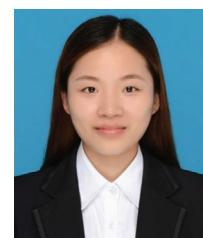

**Lulu Li** is now a master's student at Huazhong University of Science and Technology (HUST) under the supervision of Prof. Chengliang Wang. She received her B.E. degree from Zhengzhou University in 2019. Her research

interests focus on electrolyte additives for lithium metal batteries.

**Huichao Dai** is now a bachelor's student at Northeast Forestry University. He is expected to receive his B.E. degree from Northeast Forestry University in 2021, and continue his study in HUST as a Ph.D. student under the supervi-

sion of Prof. Chengliang Wang.

**Prof. Chengliang Wang** received his B.S. degree from Nanjing University in 2005 and Ph.D. degree from the Institute of Chemistry, Chinese Academy of Sciences in 2010. He then worked at the Chinese University of Hong Kong,

University of Muenster and Technical University of Ilmenau. He was selected in the National 1000-Talents Program for Young Scholars and joined HUST in 2016. His research topics include the synthesis of novel conjugated organic/polymeric materials for optoelectronics and batteries.

**How to cite this article:** Li L, Dai H, Wang C. Electrolyte additives: Adding the stability of lithium metal anodes. *Nano Select*. 2021;2:16–36. <https://doi.org/10.1002/nano.202000164>