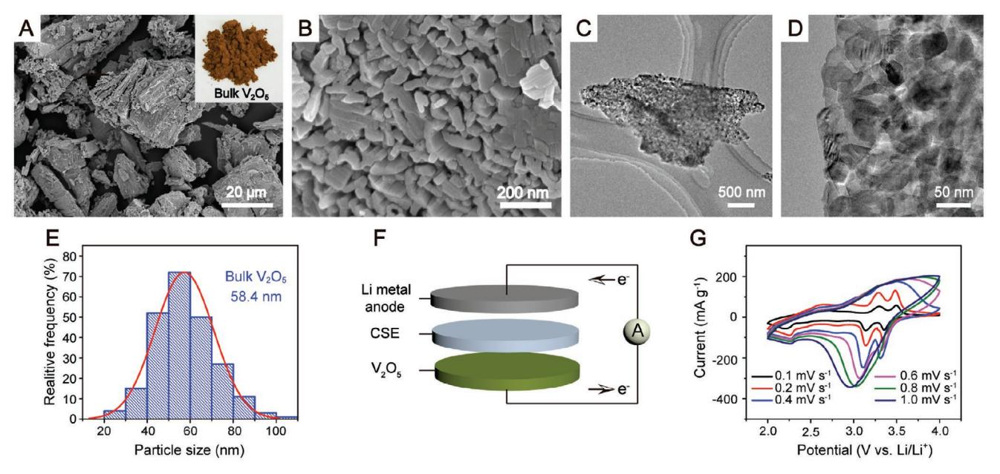
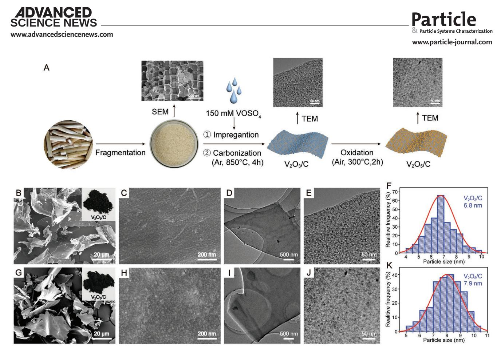
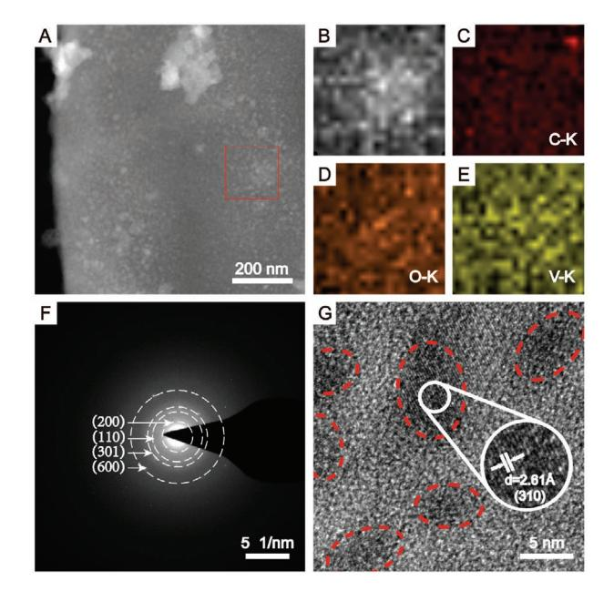
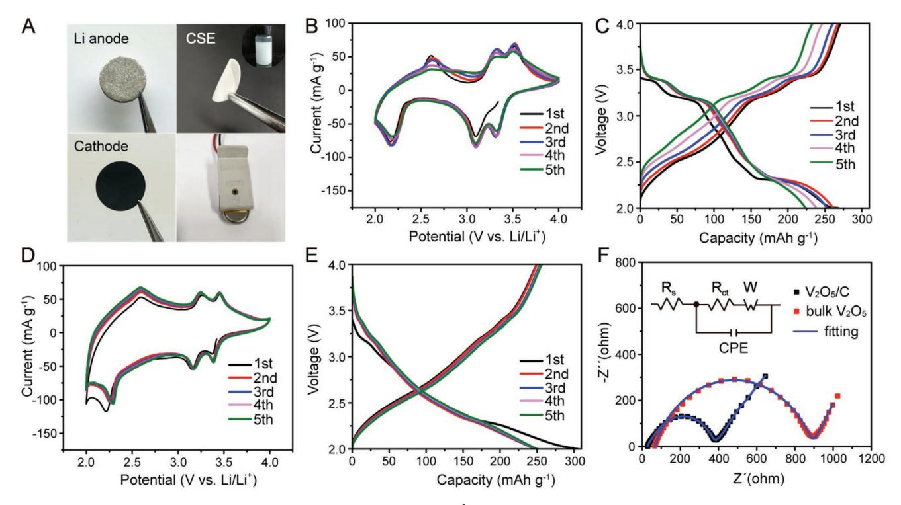
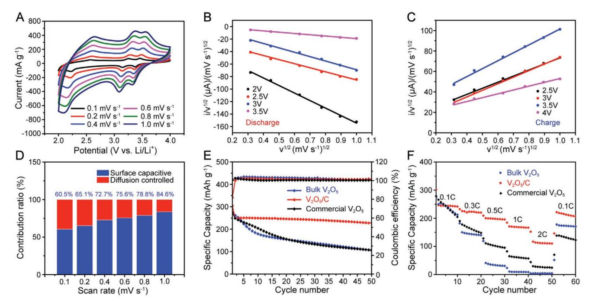
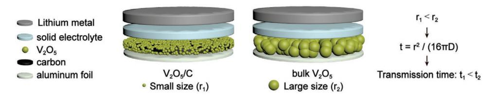

# Sub-10 nm $V_2O_5$ Crystals on Carbon Nanosheets for Advanced All-Solid-State Lithium Metal Batteries

Liwei Su, Linhui Liu, Jinpei Hei, Huan Chen, Lianbang Wang, \*Yuanhao Wang, \* and Manman Ren

 $V_2O_5$ , as a lithium-free cathode material, has inherent defects such as sluggish kinetics and volume change and, at the same time, requires a lithium metal anode that tends to form dendrites in liquid electrolytes. Both the lithium dendrite and the flammable electrolyte solvent bring longtime safety issues. This work introduces nonflammable inorganic-organic composite solid electrolyte to inhibit the growth of the lithium dendrite and suppress the instability caused by  $V_2O_5$  nanometerization. However, the long-term cycling and rate performances are still insufficient even when reducing  $V_2O_5$ size to about 50 nm. As an improvement, sub-10 nm  $V_2O_5/C$  nanosheets are designed and prepared using corn stalks as precursors through simple impregnation and calcination process. The  $V_2O_5/C$  offers a much better electrode/electrolyte contact and interface stability than bulk  $V_2O_5$  and commercial  $V_2O_5$  in the inorganic–organic composite solid electrolyte. The discharge capacity is 228 mAh g-1 at 0.1 C after 50 cycles and ≈110 mAh g-1 at 2.0 C.

## 1. Introduction

With the rapid development of portable electronic devices and electric vehicles, high energy density and high safety are the two core indicators pursued by lithium-ion batteries (LIBs). Cathodes and electrolytes determine the price and performance of LIBs to a great extent.[1-3] Cathode materials consist of two types, lithium-based and lithium-free, according to whether they contain lithium. Current commercial cathode materials

Prof. L. Su, L. Liu, Dr. J. Hei, Dr. H. Chen, Prof. L. Wang State Key Laboratory Breeding Base of Green Chemistry-Synthesis Technology College of Chemical Engineering Zhejiang University of Technology Hangzhou 310014, China E-mail: wanglb99@zjut.edu.cn Dr. Y. Wang **SUSTech Engineering Innovation Center** School of Environmental Science and Engineering Southern University of Science and Technology Shenzhen 518055, China E-mail: wangyh2020@mail.sustech.edu.cn Dr. M. Ren Institute of Materials Science and Engineering Qilu University of Technology Jinan 250353, China The ORCID identification number(s) for the author(s) of this article

can be found under https://doi.org/10.1002/ppsc.202000164.

#### DOI: 10.1002/ppsc.202000164

are mainly lithium-based, such as layered  $\text{LiCoO}_{2}$ ,[4] spinel  $\text{LiMn}_{2}\text{O}_{4}$ ,[5] and olivine LiFePO4.[6] These materials provide a limited capacity of no more than  $200$  mAh g-1 that cannot meet people's increasing demand for high-performance electronic devices and electric vehicles. Lithium-free cathode materials have higher theoretical capacities,[7,8] such as  $V_2O_5$  $(294 \text{ mAh g}^{-1})$ ,[9] FeS2 (894 mAh g-1),[10] and FeF3 (712 mAh g-1).[11]  $V_2O_5$ , as a lithiumfree material, has the intercalation structure to insert/extract two Li+ ions (voltage range:  $2-4$  V vs Li/Li+). Furthermore, it has good thermal stability, abundant raw resources, and low cost, and hence is considered one of the ideal cathode materials.[12–17] However, bulk  $V_2O_5$  has inherent defects such as low electric conductivity ( $10^{-2}$ – $10^{-3}$  S cm-1), small lithium-

ion diffusion coefficient ( $\approx 10^{-12}$  cm2 s-1), and volume changes, resulting in cyclic instability and poor rate performance.[16,18-23] In response to these defects, the main improvement strategies are nanotechnology of  $V_2O_5$ [24–27] and/or compositing with conductive materials.[28-30] Table S1 (Supporting Information) lists the modification method and performance of V2O5 in liquidelectrolyte  $V_2O_5$ //Li batteries.

In the liquid-electrolyte  $V_2O_5$ //Li battery, lithium metal is liable to form dendrites, causing short circuits.[31-33] Moreover, organic solvents in liquid electrolytes are generally flammable and volatile, leading to longtime safety issues. Another problem is that the nanometerization of  $V_2O_5$ generally leads to higher solubility (for material loss) and catalytic performance (for instability of liquid electrolytes). All-solid-state (ASS) lithium metal batteries (LMBs) that use solid electrolytes instead of separators and liquid electrolytes can effectively inhibit the growth of lithium dendrites, suppress the occurrence of side reactions.[34–36] Moreover, they have many advantages in terms of energy density, safety, packaging, and working temperature.[25, 33, 34, 36, 37] However, the solid-solid contact at the electrode/electrolyte interface in ASS LMBs has a higher interface impedance than the solid-liquid contact in traditional liquid electrolytes.[38,39] At the same time, the volume expansion of  $V_2O_5$  particles requires a robust solid-solid electrode/electrolyte interface. Based on the above reasons, there is very little research on quasi-solid- or ASS-electrolyte Li//V2O5 batteries (Table S2, Supporting Information).

Reducing the size of V2O5 is expected to effectively increase the point-to-point contact at the electrode/electrolyte interface and concurrently shorten the Li+ diffusion distance to reduce the contact resistance.[12,20,38,40–43] Nevertheless, we found in the experiment that the reaction kinetics are still inferior even when reducing the size of V2O5 to about 50 nm, which might not be small enough. As another route, loading V2O5 on conductive carbon materials can effectively relieve the volume change to avoid surface cracking and pulverization and improve the electronic conductivity of the electrode.[38,44–46] Therefore, designing V2O5 with sub-10 nm particle sizes and compositing with carbon materials is expected to improve its performance and the electrode/electrolyte interface stability further. This work reported sub-10 nm V2O5/C nanosheets using corn stalks as the self-template precursor via a simple impregnation and calcination process. ASS LMBs were assembled to test the electrochemical performance using inorganic–organic composite solid electrolytes (CSE). The unique structural advantages of the V2O5/C nanosheets improved the electrolyte/ electrode interface contact and significantly enhanced cycling and rate performance.

### **2. Results and Discussion**

The bulk V2O5 was obtained by directly heating VOSO4·*x*H2O in the air. **Figure 1** shows the morphology, particle size distribution, and electrochemical performance. The optical photograph (Figure 1A inset) exhibits that the bulk V2O5 is brown, consistent with the commercial powder. The X-ray diffraction (XRD) pattern (Figure S1, Supporting Information) confirms that it is high-purity V2O5 (JCPDS No. 041–1426). The scanning electron microscope (SEM) image in Figure 1A suggests that the bulk V2O5 has a micro-nano hierarchical structure. The primary structure is rod-like particles with a diameter of 50–70 nm (Figure 1B), and the overall structure is irregular particles between 10 and 40 µm. The TEM image in Figure 1C shows that the V2O5 nanoparticles (black dots in the figure) pile up into a porous nanosheet (white dots in the figure are pores). Figure 1D shows V2O5 particles (about 50 nm) connect and pores disperse among them. The particle size statistics show that the average particle size is 58.4 nm (Figure 1E, over 400 particles sampled).

cyclic voltammetry (CV) tests were performed in ASS LMBs using poly(ethylene oxide) (PEO)-Li7La3Zr2O12 (LLZO) CSE as the electrolyte, bulk V2O5 as the cathode, and Li metal as the anode electrode (Figure 1F). Figure S2 (Supporting Information) shows the preparation process of the PEO-LLZO CSE. Figure S3 (Supporting Information) exhibits its excellent mechanical flexibility and stability for Li metal anodes. The CV curve (Figure 1G) at a shallow scan rate (0.1–0.2 mV s−1 ) has two sets of distinct redox peaks at 3.1–3.5 V, which are characteristic of a battery-type reaction (diffusion control). At higher scan rates (0.6–1.0 mV s−1 ), the two pairs of redox peaks disappear, and a prominent dispersion peak appears instead, showing it turns into a capacitive behavior (surface control). This result implies that the reaction kinetic is sluggish. The CSE cannot provide an infinite continuous Li+ transmission network like a liquid electrolyte. Furthermore, the relatively large V2O5 particles cannot provide sufficient electrode/electrolyte contact area. The transport path of both electrons and ions is too long in the bulk phase at the same time.

As an improvement, sub-10 nm V2O5 crystals were successfully dispersed on carbon nanosheets by a simple impregnation and calcination process to improve the reaction kinetics of V2O5. **Figure 2**A shows the preparation process. The corn stalk is adopted as a self-template precursor. Its cell wall has numerous functional groups to immobilize the V4+ ions and form a uniform atom-level film on the surface. Because the coating film is extremely thin and well-proportioned, the

**Figure 1.** A,B) SEM images (inset: optical photograph), C,D) TEM images, and E) particle size distribution (over 400 particles sampled) of the bulk V2O5. F) Diagram of the Li|CSE|V2O5 cells and G) initial CV curves obtained at different scan rates.

**Figure 2.** A) Schematic diagram of the preparation process of the V2O3/C and V2O5/C nanosheet. B,C) SEM images (inset: optical photograph), D,E) TEM images, and F) particle size distribution (over 400 particles sampled) of V2O3/C nanosheets. G,H) SEM images (inset: optical photograph), I,J) TEM images, and K) particle size distribution (over 400 particles sampled) of V2O5/C nanosheets.

embedded V4+ ions are subjected to in-plane confinement of the cell wall surface and hence can decompose into uniform sub-10 nm V2O3 crystals without any agglomeration. The V2O3 crystals convert into V2O5 through low-temperature oxidation to maintain the size of sub-10 nm. The optimal oxidation temperature is 300 °C confirmed by a combination of the thermogravimetric analyses (TGA) curves (Figure S4A, Supporting Information), XRD patterns (Figure S4B, Supporting Information), and TEM images (Figure S5, Supporting Information). This temperature ensures not only full oxidation of V2O3 but also avoiding excessive loss of carbon and particle agglomeration. See the detailed analyses in the Supporting Information.

XRD, TGA, and Raman spectroscopy were performed to confirm the chemical composition and crystal structure of the V2O3/C and V2O5/C nanosheets, as shown in Figures S1, S4A, and S6 in the Supporting Information, respectively. The XRD patterns of the V2O3/C and V2O5/C correspond to the standard cards of rhombohedral V2O3 (JCPDS No. 034–0187) and orthogonal V2O5 (JCPDS No. 041–1426), respectively.[47] Both the patterns have an additional dispersion peak around 25°, belonging to amorphous carbon. The carbon content of V2O5/C material is 42.94% calculated based on TGA (see Figure S4A and the specific analyses in the Supporting Information ). Raman spectra (Figure S2B, Supporting Information) suggest that the *I*D/*I*G ratio of the V2O3/C is significantly higher than that of V2O5/C because the sp3 carbon in amorphous carbon materials is preferentially oxidized. In contrast, the sp2 hybridized carbon is relatively stable and able to improve the electric conductivity.

Figure 2B–K shows the optical photographs, SEM images, and TEM images to characterize the morphology, microstructure, and particle size of the V2O3/C and V2O5/C nanosheets. As shown in the optical photos in Figure 2B,G, both the V2O3/C and V2O5/C are black, different from the bulk V2O5, and mainly due to the presence of carbon. SEM images in Figure 2B,G shows that both the V2O3/C and V2O5/C have a relatively smooth 2D sheet structure inherited from the cell wall, with a thickness of ≈70 nm and 2D range from 5 to 40 µm. Because the V2O3 and V2O5 crystals are too small, their particle structure is not apparent on the carbon sheet in highmagnification SEM images (Figure 2C,H) and low-magnification TEM images (Figure 2D,J). In comparison, TEM images with higher magnifications show a large number of ultra-small V2O3 (Figure 2E) and V2O5 (Figure 2J) nanoparticles evenly disperse on the surface of carbon nanosheets. According to the particle size distribution statistics, the particle size of V2O3 distributes in the range of 4–10 nm, with an average of 6.8 nm (Figure 2F). In comparison, the particle size of V2O5 distributes between 5–12 nm with an average of 7.9 nm (Figure 2K). The average diameter of V2O5 particles in V2O5/C is less than oneseventh of that of the primary particles in the bulk V2O5.

The high angle annular dark field-scanning transmission electromicroscopy (HAADF-STEM) and energy-dispersive X-ray spectroscopy (EDS) mapping were used to confirm further

Figure 3. A) HAADF-STEM, B-E) EDS mapping, F) SAED, and G) HRTEM images of  $V_2O_5/C$  nanosheets.

the spatial distribution of different elements in the  $V_2O_5/C$ nanosheets (Figure  $3A-E$ ). V, O, and C elements homogenously distribute throughout the nanosheet. The selected area electron diffraction (SAED) diffraction rings (Figure 3F) correspond to the (200), (110), (301), and (600) crystal planes of the orthogonal  $V_2O_5$  (JCPDS No. 41–1426), indicating that  $V_2O_5$  has a polycrystalline nature. The high-resolution transmission electron

microscopy (HRTEM) image in Figure 3G confirms that  $\approx$ 5 nm  $V_2O_5$  crystals evenly disperse on the carbon nanosheet without any agglomeration, and the lattice fringe with a plane spacing of 2.61 Å belongs to the (310) crystal plane of  $V_2O_5$ .

www.particle-journal.com

ASS LMBs were assembled to evaluate the lithium storage performance of the  $V_2O_5/C$ , bulk  $V_2O_5$  and pure carbon derived from corn stalks. The X-ray photoelectron spectroscopy (XPS) result (Figure S7, Supporting Information) shows that the  $V_2O_5/C$  and bulk  $V_2O_5$  share comparable vanadium oxide states. Lithium metal and PEO-LLZO were used as the anode and CSE, respectively. Figure 4A shows the optic photographs of the electrode, the CSE, and the button cell.

First, the CV curves (Figure 4B) and GCD profiles (Figure 4C) of the bulk V2O5 powder were measured at a shallow scan rate  $(0.1 \text{ mV s}^{-1})$  and constant current rate (0.1 C) to analyze its electrochemical behavior. Three reduction peaks at 3.31, 3.09, and 2.16 V correspond to the phase transition of  $\alpha$ -V2O5 to  $\varepsilon$ -Li0.5V2O5 (Equation 1),  $\delta$ LiV2O5 (Equation 2), and  $\gamma$ Li2V2O5 (Equation 3), respectively.[48] Three oxidation peaks appear at 3.54, 3.34, and 2.64 V, reflecting the reverse transformation of the above four crystal forms.[49] The three pairs of redox peaks are consistent with that of reported  $V_2O_5$  with large particles.[50–52] The shape of the first three cycles is almost the same, indicating that the bulk  $V_2O_5$  can achieve relatively sufficient reversibility of lithium storage in a prolonged charge/discharge mode. However, there are three shortcomings: huge redox potential differences (0.23, 0.25, and 0.48 V), weakened peak intensity from the fourth cycle, and the absence of redox peaks at high scan rates of 0.6–1.0 mV s $-1$  (Figure 1G). The charge–discharge profiles (Figure 4C) confirms the shortcomings. The specific capacity decreases and the voltage platform blurs gradually along with

**Figure 4.** A) Diagram of the ASS LMBs. B) The first five CV curves (0.1 mV s-1) and C) GCD profiles (0.1 C) of the bulk  $V_2O_5$ . D) The first five CV curves (0.1 mV s-1) and E) GCD profiles (0.1 C) of the  $V_2O_5/C$  nanosheet. F) Nyquist plots of  $V_2O_5/C$  and bulk  $V_2O_5$ .

**www.advancedsciencenews.com**

increasing cycles. All these points indicate that the reaction kinetics is sluggish because the particle of the bulk V2O5 is too large, and there is no carbon material as structural support.

$$\alpha - V_2O_5 + 0.5Li^+ + 0.5e \leftrightarrow \varepsilon - Li_{0.5}V_2O_5$$
 (1)

ε δ − + Li0.5 2 V O5 2 0.5Li + ↔ 0.5e L − iV O5 + (2)

$$\delta - \text{LiV}_2\text{O}_5 + \text{Li}^+ + e \leftrightarrow \gamma - \text{Li}_2\text{V}_2\text{O}_5$$
 (3)

Figure 4D,E exhibits the counterpart CV and charge– discharge curves of the V2O5/C electrode, respectively. In contrast, all the curves almost overlap, except for the initial cycle with slight difference caused by electrolyte infiltration and early activation, showing excellent cycling stability. The three redox peak potential differences in the CV curves are 0.08, 0.10, and 0.35 V (Figure 4D), much smaller than the corresponding values of the bulk V2O5. The GCD profiles in Figure 4E shows that the initial discharge and charge capacities are 304.8 and 249.5 mAh g−1 , respectively. The irreversible capacity mainly comes from the formation of the SEI film in the first cycle.[48,53,54] The following curves almost overlap with each other, indicating good cycling reversibility. The discharge/ charge profiles of the V2O5/C and bulk V2O5 are different, mainly due to the ultrasmall V2O5 particle. The well-defined voltage plateaus of bulk V2O5 indicate that its lithium storage behavior is dominated by diffusion control rather than surface capacitance. In comparison, the V2O5/C has much smaller V2O5 particles (≈8 nm) that result in larger surface area, faster reaction kinetic, and more electroactive sites. As a result, surface capacitance contribution significantly increases. Similar phenomena occur in many nanosized materials such as LiCoO2 [55]

and nickel/cobalt hydroxides.[56] Moreover, the carbon substrate presents a capacitive behavior to some extent.

**www.particle-journal.com**

An electrochemical impedance spectra (EIS) test was performed on the bulk V2O5 and V2O5/C electrodes. Figure 4F shows the Nyquist pots fitted with an equivalent circuit. The *x*-intercept represents the intrinsic resistance of the system (*R*s), including the electrolyte and all the external circuits. The semicircle in the high-frequency region belongs to the charge transfer resistance (*R*ct) and the constant phase element (CPE) at the electrode/electrolyte interface. The oblique line in the low-frequency region corresponds to the Warburg impedance (*W*), reflecting the impedance of Li+ diffusion at the interface.[57–59] The fitting results show that the *R*s (32.0 Ω), *R*ct (342 Ω), and *W* (1.51 Ω) of the V2O5/C nanosheet are much smaller than the *R*s (67.2 Ω), *R*ct (825 Ω), and *W* (2.79 Ω) of the bulk V2O5. These results indicate that the V2O5/C nanosheet can effectively improve the solid–solid V2O5/CSE interface contact and hence level up the electrochemical reaction kinetics.

**Figure 5** shows the capacitive contribution ratio, longtime performance, and rate capability of the V2O5/C nanosheet. V2O5 is an extrinsically pseudocapacitive material. Its capacitive behavior generally results from the nanosize effect, arising when redox reactions occur at/near the active material/electrolyte surface, or when these reactions are not limited by solidstate ion diffusion.[55] The active material/electrolyte contact modes are the main difference between the solid and liquid electrolyte systems. The liquid electrolyte is more natural to permeate into the electrode, form a solid–liquid contact, and provide higher capacitance. However, V2O5 can probably dissolve in the liquid electrolyte due to the trace existence of acid.[56] Therefore, the nanotechnology of V2O5 is a trade-off strategy in a liquid electrolyte. By contrast, the capacitance is

**Figure 5.** Electrochemical performances of the V2O5/C nanosheet: A) CV curves at different scan rates, *i/v*1/2–*v*1/2 plots of B) discharge and C) charge process, and D) capacitive contribution ratio at different scan rates. Performance comparison between the V2O5/C nanosheet, commercial V2O5, and bulk V2O5: E) long-term cyclability (0.1 C) and F) rate performance.

concentrated on the electrode/electrolyte solid–solid contact in the solid electrolyte. In this case, it is essential to increase the solid–solid contact area.

Figure 5A exhibits the CV curves at different scan rates of 0.1–1.0 mV s−1 . According to the current separation method proposed by Dunn et al., the current contribution in the CV curve can be divided into a surface control process and a diffusion control process.[56] Figure 5B,C indicates the linear relationship of *i*/*v*1/2–*v*1/2 at different voltages during the discharging and charging, respectively. Figure 5D shows the contribution ratio of the surface control to the total capacity at different scan rates. The contribution provided by the surface control accounts for 60.5% of the total capacity at the scan rate of 0.1 mV s−1 , gradually grows with the increasing rate and reaches 84.6% at 1.0 mV s−1 . In the CV curves of the bulk V2O5 (Figure 1G); however, the severe polarization and absence of the redox peaks at high rates (0.4–1.0 mV s−1 ) make it impossible to calculate the contribution ratio of surface control using the same method.

Figure 5E shows the cycling performance of the V2O5/C nanosheet, commercial V2O5, and bulk V2O5 at 0.1 C for 50 cycles. The cycling performances of commercial V2O5 and bulk V2O5 materials are similar, with initial discharge capacities of 273.8 and 268.2 mAh g−1 , respectively. Both their reversible capacities decay to ≈106 mAh g−1 after 50 cycles, with a loss of ≈1.2% per cycle. By sharp contrast, the reversible capacity of the V2O5/C nanosheet stabilizes since the second cycle and maintains at 228 mAh g−1 after 50 cycles, with a loss of 0.50% per cycle. The initial Coulombic efficiency is 81.9% and remains at more than 98% in the subsequent cycles. The reversible capacity of pure carbon materials under the same condition is only 2.8 mAh g−1 (Figure S8, Supporting Information).

Figure 5F shows the rate performance of the V2O5/C nanosheet, commercial V2O5, and bulk V2O5. The rate performance of the V2O5/C nanosheet is significantly better than commercial V2O5 and bulk V2O5. For example, the reversible capacity of the V2O5/C keeps at ≈110 mAh g−1 at 2.0 C. In comparison, the counterpart capacities of commercial V2O5 and bulk V2O5 are only 24.3 and 4.4 mAh g−1 , respectively. The performance difference is mainly ascribed to the sizeable V2O5 particle in commercial V2O5 and bulk V2O5 and the lack of carbon matrix support.

The enhanced performance of the V2O5/C nanosheet originates from its unique structural advantages. First, as shown in **Figure 6**, sub-10 nm V2O5 particles provide much more pointto-point contact between the V2O5 and CSE electrolyte than bulk particles and hence improve the Li+ ion diffusion. Second, sub-10 nm V2O5 particles offer more boundary active sites and shorter diffusion paths of electrons and Li+ ions than bulk particles (according to the formula in Figure 6). Finally, carbon nanosheets as structural support can improve the overall conductivity of the electrode, effectively relieve the volume change of V2O5 particles during cycling, avoid surface cracks and powdering caused by stress concentration, and improve the stability of the solid–solid electrode/electrolyte interface.

#### **3. Conclusions**

In summary, this work successfully dispersed sub-10 nm V2O5 crystals (7.9 nm) on carbon nanosheets and tested their performance in ASS LMBs using PEO-LLZO as the electrolyte. The temperature-engineering phase and morphological evolution of the V2O3/C mediator were studied using TGA, XRD, Raman, and TEM to ensure the full oxidation of V2O3, maintain carbon supporting, and avoid particle agglomeration. The long-term and rate performance of the V2O5/C nanosheet was much higher than that of commercial V2O5 and bulk V2O5. The enhanced performance originated from sub-10 nm V2O5 particles and a robust carbon substrate for improved reaction kinetics and stability. Rational design and ingenious preparation of sub-10 nm active materials on conductive carbon materials is an effective strategy to improve the performance of ASS LMBs. It is envisaged that introducing ultrasmall particles of lithium superionic conductor into this strategy can improve the kinetics and rate performance further.

#### **4. Experimental Section**

*Materials Synthesis*: Synthesis of bulk V2O5/C powders, V2O3/C, and V2O5/C nanosheets**—**All the chemical reagents were of analytic purity and used without any purification. Bulk V2O5 was prepared by annealing VOSO4 ·*x*H2O at 300 °C for 2 h at 5 °C min−1 in the air. Below is the preparation process of the V2O3/C and V2O5/C nanosheet. First, corn straws were pulverized into sub-millimeter level particles, immersed in 1.5 wt.% H2SO4 at 95 °C for 1 h, washed with deionized water to neutral, and then dried at 45 °C for 24 h in the air to obtain the pretreated corn straws. Second, 0.4 g of the pretreated corn straws were impregnated in 150 × 10−3 m VOSO4 ·*x*H2O aqueous solution under continuous ultrasonic for 30 min, followed by vacuum treatment for 30 min. Subsequently, the impregnated corn straws were filtered, dried at 60 °C for 12 h, and then carbonized at 850 °C for 4 h in the Ar atmosphere with a heating rate of 5 °C min−1 to yield V2O3/C nanosheets. Finally, the V2O3/C was annealed at 300 °C for 2 h at 5 °C min−1 in the air to obtain the V2O5/C nanosheet.

Synthesis of composite solid electrolyte—The composite solid electrolyte membrane was prepared by slurry casting. The garnet Al-doped LLZO was synthesized by a sol–gel method.[60,61] In detail, PEO (*M*w = 600 000, Aladdin) and lithium perchlorate (LiClO4, Aladdin, 99.99%) were dried at 60 °C under vacuum for 12 h to remove water. The PEO and LiClO4 ([EO]/[Li] molar ratio was around 15:1) were dissolved in acetonitrile under stirring at room temperature for 4 h to obtain a

**Figure 6.** Schematic illustration for the enhanced performance of sub-10 nm V2O5/C.

**www.advancedsciencenews.com**

homogeneous solution. The LLZO powders were added to the solution with a weight percentage of 10% in the total amount of PEO and LLZO. After stirring for 24 h, the homogeneous mixture was cast onto a clean poly tetra fluoroethylene plate (PTFE), then dried in vacuum at 60 °C for 24 h to evaporate the solvent. The as-obtained composite electrolyte was punched into round-shaped membranes with a diameter of 18 mm before measurements.

*Materials Characterization*: The components and structural features of the products were characterized by XRD (PANalytical X'Pert Pro X-ray with Cu K*α* radiation, *λ* = 1.5418 Å, scanning rate: 2° min−1 ), SEM (Nova NanoSEM450 at 15kV), HRTEM (Tecnai G2 F30 S-Twin), EDS (Tecnai G2 F30 S-Twin). TGA (Perkin Elmer thermobalance, heating rate: 10 °C min−1 , in air atmosphere) was used to analyze the carbon content of the products. Raman spectroscopy was tested using a Raman spectrometer (LabRam HR Evolution) at a scanning range of 1000–2000 cm−1 . XPS (Thermo Scientific K-Alpha) was performed to confirm the chemical valence state of the V element.

*Electrochemical Measurements*: Coin cells (2032-type) were assembled in a glove box filled with argon (O2 and H2O < 0.1 ppm) to investigate the electrochemical performance. The working electrode (cathode) was made of active materials, polyvinylidene fluoride (PVDF), and super P with a mass ratio of 8:1:1 in *N*-methyl-2-pyrrolidone (NMP). The mixture slurry of these materials was uniformly pasted on Al foil with a blade, dried at 120 °C for 12 h in the vacuum. Li metal plates were used as the counter and reference electrode. The as-prepared composite solid electrolyte worked as the electrolyte and the separator at the same time. The mechanical stability of the electrolyte against Li metal was evaluated by symmetric Li|CSE|Li cells, which were discharged and charged for 0.5 h each half cycle at the current densities of 0.025, 0.05, and 0.1 mA cm−2 separately. CV was conducted on an Iviumstat electrochemical workstation at 2.0–4.0 V. Galvanostatic charge/discharge (GCD) measurements were carried out on a LAND battery test system. EIS were collected by the Iviumstat workstation in the frequency range of 0.01 Hz–1 MHz with an amplitude of 10 mV. All the electrochemical tests were carried out at 60 °C.

# **Supporting Information**

Supporting Information is available from the Wiley Online Library or from the author.

## **Acknowledgements**

L.S. and L.L. contributed equally to this work. This work was supported by the Natural Science Foundation of Zhejiang Province (LGG18B030001, LGG20B030002), the Key Research and Development Program of Science and Technology Department of Zhejiang Province (2017C01023), and the National Natural Science Foundation of China (61705258).

# **Conflict of Interest**

The authors declare no conflict of interest.

## **Keywords**

carbon nanosheets, lithium metal batteries, nanocrystals, solid-state electrolytes, vanadium oxides

- Received: May 27, 2020
- Revised: July 3, 2020
- Published online: July 26, 2020

**www.particle-journal.com**

- [1] J. W. Fergus, *J. Power Sources* **2010**, *195*, 939.
- [2] J. B. Goodenough, K. S. Park, *J. Am. Chem. Soc.* **2013**, *135*, 1167.
- [3] X. B. Cheng, R. Zhang, C. Z. Zhao, Q. Zhang, *Chem. Rev.* **2017**, *117*, 10403.
- [4] H. Matsumoto, H. Sakaebe, K. Tatsumi, M. Kikuta, E. Ishiko, M. Kono, *J. Power Sources* **2006**, *160*, 1308.
- [5] M. H. Pyun, Y. J. Park, *J. Alloys Compd.* **2015**, *643*, S90.
- [6] Y. Wang, Y. Wang, E. Hosono, K. Wang, H. Zhou, *Angew. Chem., Int. Ed. Engl.* **2008**, *47*, 7461.
- [7] L. Wang, Z. Wu, J. Zou, P. Gao, X. Niu, H. Li, L. Chen, *Joule* **2019**, *3*, 2086.
- [8] L. Wu, Y. Zhang, L. Fan, Q. Zhang, P. Wang, D. Tian, N. Zhang, K. Sun, *Energy Technol.* **2018**, *6*, 2115.
- [9] T. Kim, J. Shin, T. S. You, H. Lee, J. Kim, *Electrochim. Acta* **2015**, *164*, 227.
- [10] H. Wan, G. Liu, Y. Li, W. Weng, J. P. Mwizerwa, Z. Tian, L. Chen, X. Yao, *ACS Nano* **2019**, *13*, 9551.
- [11] R. Ma, Z. Lu, C. Wang, H. E. Wang, S. Yang, L. Xi, J. C. Chung, *Nanoscale* **2013**, *5*, 6338.
- [12] S. Wang, P. Y. Zhang, H. Tan, X. Y. Fan, K. Huang, *J. Power Sources* **2019**, *419*, 106.
- [13] C. Wang, L. Zhang, M. Al-Mamun, Y. Dou, P. Liu, D. Su, G. Wang, S. Zhang, D. Wang, H. Zhao, *Adv. Energy Mater.* **2019**, *9*, 1900909.
- [14] X. Peng, X. Zhang, L. Wang, L. Hu, S. H.-S. Cheng, C. Huang, B. Gao, F. Ma, K. Huo, P. K. Chu, *Adv. Funct. Mater.* **2016**, *26*, 784.
- [15] G. Z. Li, Y. C. Qiu, Y. Hou, H. F. Li, L. S. Zhou, H. Deng, Y. G. Zhang, *J. Mater. Chem. A* **2015**, *3*, 1103.
- [16] Z. Wang, H. Y. Huang, L. Zeng, Y. C. Wang, L. Lv, C. Y. Dai, W. G. Mao, X. Chen, D. N. Fang, *Electrochim. Acta* **2019**, *305*, 101.
- [17] Z. Y. Li, C. K. Zhang, C. F. Liu, H. Y. Fu, X. H. Nan, K. Wang, X. Y. Li, W. D. Ma, X. M. Lu, G. Z. Cao, *Electrochim. Acta* **2016**, *222*, 1831.
- [18] J. Zeng, J. D. Huang, J. Liu, T. Xie, C. Q. Peng, Y. K. Lu, P. J. Lu, R. Z. Zhang, J. Min, *Carbon* **2019**, *154*, 24.
- [19] Y. L. Cheah, V. Aravindan, S. Madhavi, *ACS Appl. Mater. Interfaces* **2012**, *4*, 3270.
- [20] L. Wang, Y. Wang, X. Zhu, Y. Zhao, *J. Alloys Compd.* **2019**, *792*, 418.
- [21] Q. F. Li, D. Chen, H. T. Tan, X. H. Zhang, X. H. Rui, Y. Yu, *J. Energy Chem.* **2020**, *40*, 15.
- [22] N. Aliahmad, Y. D. Liu, J. Xie, M. Agarwal, *ACS Appl. Mater. Interfaces* **2018**, *10*, 16490.
- [23] A. Q. Pan, J. G. Zhang, Z. M. Nie, G. Z. Cao, B. W. Arey, G. S. Li, S. Q. Liang, J. Liu, *J. Mater. Chem.* **2010**, *20*, 9193.
- [24] Y. Yue, H. Liang, *Adv. Energy Mater.* **2017**, *7*, 1602545.
- [25] P. Liu, K. Zhu, Y. Gao, H. Luo, L. Lu, *Adv. Energy Mater.* **2017**, *7*, 1700547.
- [26] Y. N. Ma, A. B. Huang, H. J. Zhou, S. D. Ji, S. M. Zhang, R. Li, H. L. Yao, X. Cao, P. Jin, *J. Mater. Chem. A* **2017**, *5*, 6522.
- [27] H. T. Tan, X. Rui, W. Sun, Q. Yan, T. M. Lim, *Nanoscale* **2015**, *7*, 14595.
- [28] Y. Yang, L. Li, H. Fei, Z. Peng, G. Ruan, J. M. Tour, *ACS Appl. Mater. Interfaces* **2014**, *6*, 9590.
- [29] Z. Li, Q. Zhu, S. Huang, S. Jiang, S. Lu, W. Chen, G. S. Zakharova, *RSC Adv.* **2014**, *4*, 46624.
- [30] C. H. Han, M. Y. Yan, L. Q. Mai, X. C. Tian, L. Xu, X. Xu, Q. Y. An, Y. L. Zhao, X. Y. Ma, J. L. Xie, *Nano Energy* **2013**, *2*, 916.
- [31] X. Liu, X. Li, H. Li, H. B. Wu, *Chem. Eur. J.* **2018**, *24*, 18293.
- [32] Z. Wan, D. Lei, W. Yang, C. Liu, K. Shi, X. Hao, L. Shen, W. Lv, B. Li, Q.-H. Yang, F. Kang, Y.-B. He, *Adv. Funct. Mater.* **2019**, *29*, 1805301.
- [33] H. Huo, Y. Chen, J. Luo, X. Yang, X. Guo, X. Sun, *Adv. Energy Mater.* **2019**, *9*, 1804004.
- [34] L. Chen, Y. Li, S.-P. Li, L.-Z. Fan, C.-W. Nan, J. B. Goodenough, *Nano Energy* **2018**, *46*, 176.
- [35] X.-B. Cheng, C.-Z. Zhao, Y.-X. Yao, H. Liu, Q. Zhang, *Chem* **2019**, *5*, 74.
- [36] H. Xie, C. Yang, K. K. Fu, Y. Yao, F. Jiang, E. Hitz, B. Liu, S. Wang, L. Hu, *Adv. Energy Mater.* **2018**, *8*, 1703474.

**www.advancedsciencenews.com**

- [37] Y. Zhang, J. Y. Lai, Y. D. Gong, Y. M. Hu, J. Liu, C. W. Sun, Z. L. Wang, *ACS Appl. Mater. Interfaces* **2016**, *8*, 34309.
- [38] L. Xu, S. Tang, Y. Cheng, K. Wang, J. Liang, C. Liu, Y.-C. Cao, F. Wei, L. Mai, *Joule* **2018**, *2*, 1991.
- [39] X. Chen, W. He, L.-X. Ding, S. Wang, H. Wang, *Energy Environ. Sci.* **2019**, *12*, 938.
- [40] G. Peng, X. Yao, H. Wan, B. Huang, J. Yin, F. Ding, X. Xu, *J. Power Sources* **2016**, *307*, 724.
- [41] X. T. Gao, Y. T. Liu, X. D. Zhu, D. J. Yan, C. Wang, Y. J. Feng, K. N. Sun, *Carbon* **2018**, *140*, 218.
- [42] M. H. Chen, X. H. Xia, J. F. Yuan, J. H. Yin, Q. G. Chen, *J. Power Sources* **2015**, *288*, 145.
- [43] Y. F. Dou, X. Liang, G. H. Gao, G. M. Wu, *J. Alloys Compd.* **2018**, *735*, 109.
- [44] L. Zhi, D. Kong, Y. Zhang, X. Li, X. Hai, B. Wang, X. Qiu, Q. Song, Q. H. Yang, *Energy Environ. Sci.* **2016**, *9*, 906.
- [45] M. Sathiya, A. S. Prakash, K. Ramesha, J. M. Tarascon, A. K. Shukla, *J. Am. Chem. Soc.* **2011**, *133*, 16291.
- [46] Y. Tang, X. Rui, Y. Zhang, T. M. Lim, Z. Dong, H. H. Hng, X. Chen, Q. Yan, Z. Chen, *J. Mater. Chem. A* **2013**, *1*, 82.
- [47] F. Xiao, X. X. Song, Z. H. Li, H. L. Zhang, L. J. Zhang, G. T. Lei, Q. Z. Xiao, Z. L. Hu, Y. H. Ding, *J. Mater. Chem. A* **2017**, *5*, 17432.

- [48] H. Yu, J. Yang, H. S. Fan, *CrystEngComm* **2017**, *19*, 716.
- [49] Y. Sun, Z. Xie, Y. Li, *RSC Adv.* **2018**, *8*, 39371.
- [50] H. Wu, M. Qin, X. Li, Z. Cao, B. Jia, Z. Zhang, D. Zhang, X. Qu, A. A. Volinsky, *Electrochim. Acta* **2016**, *206*, 301.
- [51] C. Peng, F. Xiao, J. Yang, Z. H. Li, G. T. Lei, Q. Z. Xiao, Y. H. Ding, Z. L. Hu, *Electrochim. Acta* **2016**, *192*, 216.
- [52] P. Liu, B. Wang, X. M. Sun, I. Gentle, X. S. Zhao, *Electrochim. Acta* **2016**, *213*, 557.
- [53] Z. Y. Cao, B. Q. Wei, *Nano Energy* **2013**, *2*, 481.
- [54] D. Zhu, H. Liu, L. Lv, Y. Yao, W. Yang, *Scr. Mater.* **2008**, *59*, 642.
- [55] Y. Jiang, J. Liu, *Energy Environ. Mater.* **2019**, *2*, 30.
- [56] V. Augustyn, P. Simon, B. Dunn, *Energy Environ. Sci.* **2014**, *7*, 1597.
- [57] X. Yao, G. L. Guo, P. Z. Li, Z. Z. Luo, Q. Y. Yan, Y. L. Zhao, *ACS Appl. Mater. Interfaces* **2017**, *9*, 42438.
- [58] N. T. Wu, W. Z. Du, G. L. Liu, Z. Zhou, H. R. Fu, Q. Q. Tang, X. M. Liu, Y. B. He, *ACS Appl. Mater. Interfaces* **2017**, *9*, 43681.
- [59] J. F. Huang, X. N. Qiao, Z. W. Xu, L. Y. Cao, H. B. Ouyang, J. Y. Li, R. Y. Wang, *Electrochim. Acta* **2016**, *191*, 158.
- [60] Y. Sun, X. Zhan, J. Hu, Y. Wang, S. Gao, Y. Shen, Y. T. Cheng, *ACS Appl. Mater. Interfaces* **2019**, *11*, 12467.
- [61] Y. Jin, P. J. McGinn, *J. Power Sources* **2011**, *196*, 8683.

**www.particle-journal.com**