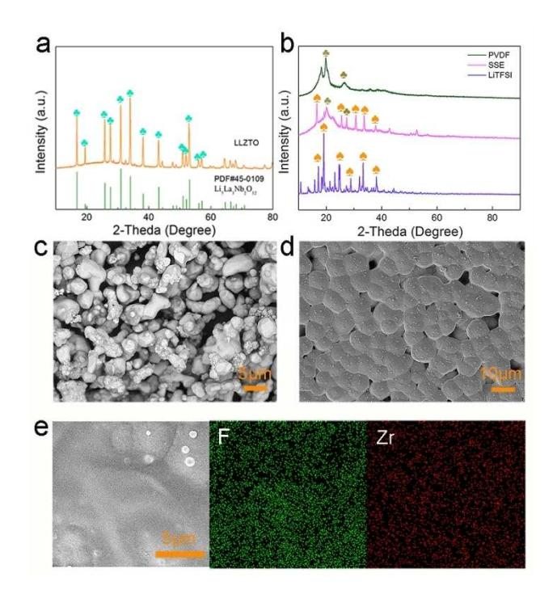
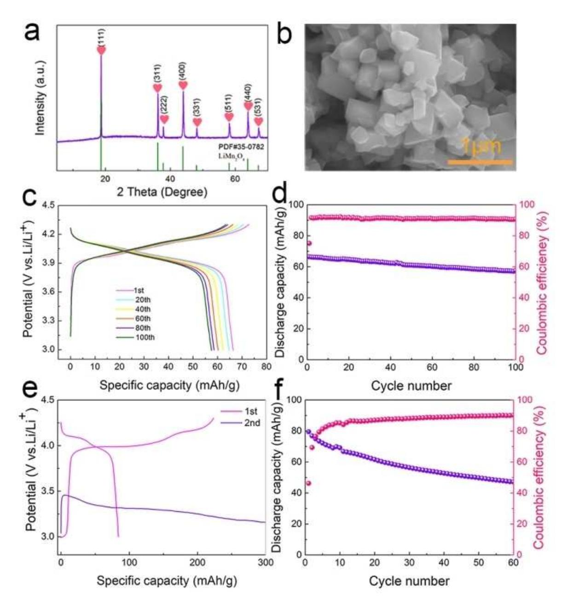
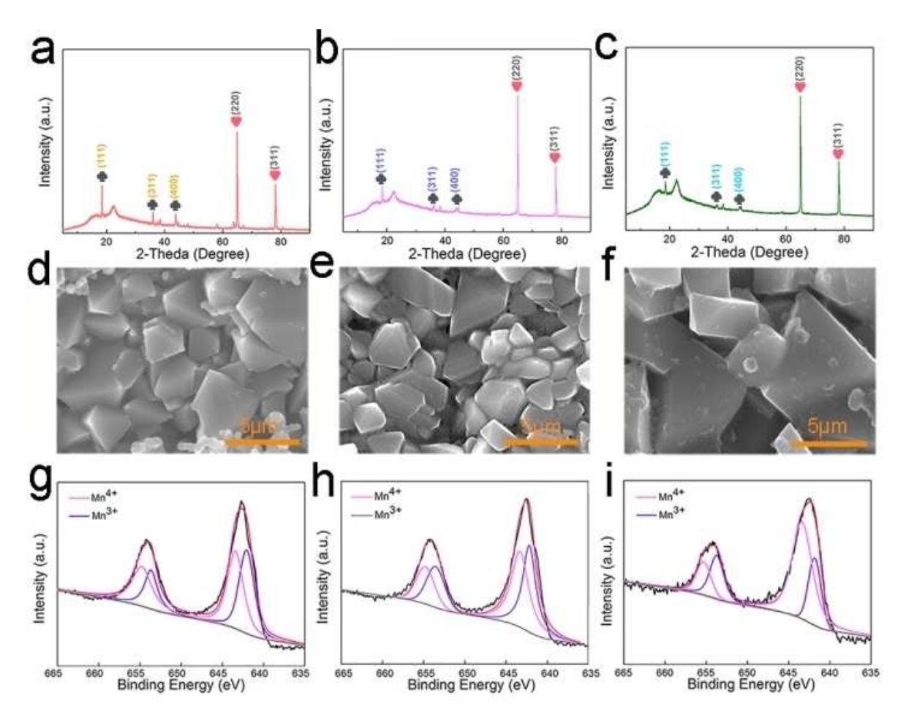
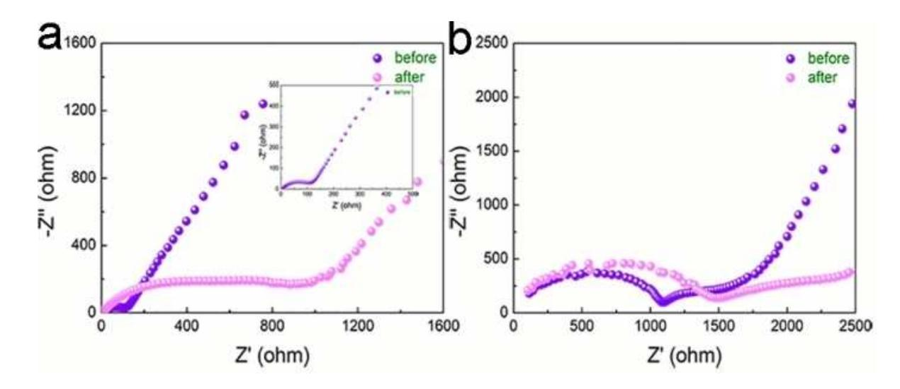

## z **Energy Technology & Environmental Science**

# **High Voltage, Flexible and Low Cost All-Solid-State Lithium Metal Batteries with a Wide Working Temperature Range**

Yuchan Zhang, Huifang Fei, Yongling An, Chuanliang Wei, and [Jinkui](http://orcid.org/0000-0002-5683-849X) Feng\*[a]

In this work, a flexible 4 V all-solid-state lithium metal battery is reported. In this battery, polyvinylidene fluoride (PVDF)/ Li6.40La3Zr1.40Ta0.60O12 (LLZTO) composite electrolyte is used as the electrolyte and low cost LiMn2O4 (LMO) is used as the cathode. It is found that this all-solid-state battery can work from room temperature to 80°C. At 80°C, a capacity retention

### **Introduction**

Lithium ion batteries have been widely used in various electronic devices and energy storage systems.[1,2] With the developing of electric vehicles and electronics, higher energy density and safer power sources are in urgent demanding.[3] 4 V class cathode materials include LiMn2O4, LiNi1/3Co1/3Mn1/3O2 and LiCoO2, [4,5] etc, dominate commercial lithium ion batteries. Among these electrode materials, spinel LMO is a promising choice owing to its superior characters, such as high ionic conductivity, low cost, high theoretical specific capacity and high working potential, et al.[6–8] However, the capacity decays of LMO during cycling, especially at high temperature(*>* 55°C),[9–12] prevents its further application. One of the main reasons is the accelerating dissolution of Mn2+ into the liquid electrolyte at high temperature.[13,14] To solve this problem, great work have been done, such as doping, coating, electrolyte additives et al.[15,16] However, further work is still needed to address the issue. The low ion solubility and inert character of solid state electrolyte may provide a alterative solution for this problem.[17–23]

All-solid-state batteries have been considered as one of the most promising battery system due to the advantages of high safety, simple package and high stability at various environments.[24–32] However, the problems of low conductivity, high interface impedance and poor mechanic performance prevent their commercial application.[33,34] Many solid electrolytes have been probed, including inorganic ceramics, organic polymers, and ceramic-composites.[35–37] Recently, ceramic-polymer composites electrolytes have attracted great attention due to its jointed advantages of ceramic solid-state electrolyte and of 78.8% is obtained after 50 cycles while battery with liquid electrolyte last only one cycle. Further researches discover that liquid electrolyte react continuously with LMO while the solidstate electrolyte is stable with LMO at high temperature. These results may be useful for the developing of low cost, high energy and high safety batteries system.

polymer electrolyte. The ceramic fillers in composite polymer electrolyte (CPEs) can be divided into inert fillers such as SiO2, TiO2 and Al2O3, and active inorganic electrolyte fillers such as Li0.3La0.557TiO3 (LLTO), Li6.40La3Zr1.40Ta0.60O12 (LLZTO) and Li1.3Al0.3Ti1.7(PO4)3. [38] The dispersion of ceramic fillers in polymer matrix can not only enhance the ionic conductivity of polymer electrolyte, but also improve the mechanical properties and thermal stability.[39–41] LLZTO based garnet type oxide are the most promising ceramic electrolyte due to it high conductivity and high lithium compatibility. PEO is the most commonly polymer electrolyte in CPEs. However, the ionic conductivity and stability of PEO at room temperature are poor. Moreover, PEO is not stable at 4 V range, which cannot meet the energy density requirements of next generation lithium batteries.[43] Recently, the composite electrolyte of PVDF and LLZTO is proved to be a promising solid state electrolyte choice due to its high conductivity, wide potential window and good mechanic stability.[39,43–45] However, the researches on this electrolyte system are limited.

In this work, an all-solid-state battery is constructed with PVDF/LLZTO as the electrolyte and LMO as the cathode. The main contribution of this work is to solve the capacity decays of spinel LMO during cycling by solid state electrolyte, especially at high temperature. It is found that the all-solidstate battery can retain 78.8% of its initial capacity after 50 cycles at 80°C. In contract, the LMO battery with liquid electrolyte can only last one cycle. The performance enhancement mechanism is probed and find that the liquid electrolyte can react continuously with LMO while the solid state electrolyte is stable with LMO at 80°C.

#### **Results and Discussion**

Figure 1a and 1b are the XRD patterns of LLZTO and pure PVDF, SSE, LiTFSI respectively. All the peaks are fitted well with the standard phase, and LLZTO is a cubic phase similar to that of Li5La5Nb2O12. [39] The XRD pattern of SSE contains the peaks of pure PVDF, LLZTO and LiTFSI, indicating all the compositions are stable in the preparation progress. The SEM images of

[a] *Y. Zhang, H. Fei, Dr. Y. An, Dr. C. Wei, Prof. J. Feng* Key Laboratory for Liquid–Solid Structural Evolution & Processing of Materials (Ministry of Education), School of Materials Science and Engineering, Shandong University, Jinan 250061, China E-mail: jinkui@sdu.edu.cn

Supporting information for this article is available on the WWW under <https://doi.org/10.1002/slct.201904206>

**Figure 1.** (a) The XRD pattern of LLZTO, (b) PVDF, SSE, LiTFSI, and the SEM image of LLZTO (c), SSE (d) with the EDS map of F and Zr (e) in the SSE.

LLZTO and SSE membrane are shown in Figure 1c and 1d, respectively. It can be seen from figure 1c that the size of LLZTO powder is about 2–10 μm. The SSE membrane shows a dense composite morphology (figure 1d). Figure 1e shows the energy-dispersive spectral (EDS) mapping images of SSE, from this mapping we can see Zr and F are homogeneously dispersed in SSE, implying that the evenly distribution of LLZTO and PVDF, which may ensure a close and stable grain boundary.

In order to test the application of electronic devices, allsolid-state lithium battery with LMO as cathode and lithium metal as anode was assembled. The coin cell can light a yellow LED lamp (figure 2a). The electrochemical window of the solidstate electrolyte was tested by linear sweep voltammetry (LSV). It can be observed the LSV curve (figure 2b) that the PVDF/

**Figure 2.** (a) Image of all-solid-state lithium battery using LMO as cathode and lithium metal as anode for lighting LED light. (b) LSV of PVDF/LLZTO membrane. Inset are the CV curve of PVDF/LLZTO solid battery at 80 °C.

LLZTO membranes decompose at about 4.5 V, which is not satisfying enough. High voltage solid state electrolyte is a big challenge and needs more efforts. Since the LMO is only charged to 4.3 V, the electrochemical window of 4.5 V is suitable for LMO cathodes. The oxidation peak may partly ascribed to the corrosion of Al by LiTFSI. The CV curve of solidstate LMO battery was also tested at the rate of 0.1 mVs 1 between 3 and 4.3 V. The results are shown inside figure 2b. It shows a pair of reversible peaks located between 3.5 V and 4.3 V respectively. The peak value is corresponding well with the typical CV curves of LMO, indicating that LMO could function well in the SSE. The forming ability and mechanical strength of the solid electrolyte membranes are crucial characters. From the top left of figure 2a and 2b we can see that the membrane is light yellow with excellent flexibility, which is similar to the reports before.

X-ray diffraction (XRD) and Scanning electron microscopy (SEM) were performed to characterize LMO powder. The XRD patterns of LMO powder are shown in figure 3a. From the patterns we can see that the LMO is a pure spinel phase. SEM (figure 3b) of LMO powder reveal a typical spinel shape with primary size range from 100–500 nm.

To study the electrochemical performance of LMO/PVDF batteries, galvanostatic charge/discharge test was conducted from 25°C to 80°C. The cell was cycled between 4.3 V and 3 V at the current density of 50 mAg 1 . The results are shown in figure 3c-f. Figure 3c showed the 1st, 20th, 40th, 60th, 80th, 100th charge-discharge curves of the LMO/SSE/Li cell at room temperature. From the figure we can see that the cell shows a similar shape as typical LMO, indicating that LMO cathode worked well in this solid-state system. The 1st reversible capacity is 67 mAhg 1 , which is slightly lower than the capacity in liquid electrolyte. The lower capacity may be ascribed to the relatively low conductivity of SSE. All the charge/diacharge curves from 1st to 100th overlaps well, indicating a stable interfacial interface. Figure 3d shows the cycling performance of LMO/SSE/Li at 25°C at the rate of 50 mAg 1 . From the figure we can see that the LMO showed a stable cycling performance. It keeps an 88% capacity retention even after 100 cycles. The charge and discharge curves of LMO battery in solid and liquid state electrolytes at 80°C are shown in figure 3e. The liquid LMO battery can work only one cycle at 80°C. For comparison, LMO/SSE/Li cell can work normally at 80°C (figure 3f). The initial discharge capacity of the solid state LMO battery is 80 mAhg 1 at a rate of 50 mAg 1 at 80°C, which is much higher than the capacity at room temperature. The higher capacity may be ascribed to the higher ionic conductivity at 80°C. Its capacity still remained 50 mAhg 1 even after 50 cycles with the capacity loss about 0.75% per cycle when compared to initial capacity with a high coulombic efficiency (figure 3f). The 1st cycle discharge capacity is ∼50% of the theoretical capacity for LMO, which is not satisfying. The reason is that at 80 degree, some side reactions between LMO and electrolyte or Al current collector is inevitable. As a comparison at the same temperature, the LMO using liquid electrolyte cannot last one cycle. The performance can be further improved by coating on the cathode. The significantly enhanced performance of

**Figure 3.** (a) The XRD pattern of LMO powder. (b) SEM of LMO powder. (c) the charging/discharging curve of PVDF all solid state battery at 25°C. (d) the cycle curve of LMO/PVDF all-solid state battery at 25 °C. (e) the charging/discharging curve of liquid LMO battery at 80 °C. (f) the cycle performance of PVDF solid battery at 80°C.

solid-state LMO battery at 80°C may be ascribed to the inert and HF free character of the solid electrolyte, which can well prevent the side interfacial reaction and the dissolution of Mn element in liquid cells.

In order to further investigate the reasons that LMO electrode fails in liquid electrolyte at 80°C, we disassembled the cycled batteries and characterized these cathode electrodes of LMO by XRD, SEM and X-ray photoelectron spectroscopy (XPS). Figure 4a, 4b, 4c show the XRD pattern of LMO cathode plates before cycling, after cycling in solid state electrolyte and liquid electrolyte at 80°C. From the XRD patterns, we can see that LMO remain spinel structure in all the three electrodes. However, the peaks intensity of electrode in liquid electrolyte significantly reduced, indicating the loss of active LMO, which may be caused by the side reaction and results in battery failure. The SEM images of the unreacted electrode plates, the cycled electrode in solid state electrolyte and liquid electrolyte at 80°C are displayed as shown in figure 4d, 4e, 4f. From the images we can see that the surface of LMO cycled in the solid state electrolyte after cycling at 80°C is smooth, while the surface of the LMO cycled in liquid electrolyte turns rough and many fluffy particles are observed, which may be caused by the side reaction between high oxidative LMO cathode and liquid electrolyte.[46] To further conducted the surface chemistry

**Figure 4.** the XRD pattern of LMO electrode (a) before cycling. (b) cycled in solid state batteries after 50 cycle at 80 °C. (c) cycled in liquid electrode at 80 °C, the SEM image of LMO electrode (d) before cycling, (e) after cycling in solid state electrolyte at 80°C. (f) after cycling in liquid electrolyte at 80°C. the XPS image of LMO electrode (g) before charging, (h) after cycling in solid electrode electrolyte at 80 °C and (i) after cycling in liquid electrolyte at 80°C.

changes of LMO electrode, the XPS of LMO before cycling, after cycling in solid state electrolyte and liquid electrolyte at 80°C are shown in figure 4g, 4 h and 4i, respectively. The binding energy of Mn3+ located at 642.0 eV (Mn 2p3/2) and 653.5 eV (Mn 2p1/2), and Mn4+ located at 643.3 eV (Mn 2p3/2) and 654.6 eV (Mn 2p1/2).[47] The content of Mn3+ and Mn4+ is related to the peak area. It can be found from the peak intensity of Mn3+ and Mn4+ in figure 4g and 4f is almost the same, while the peak intensity in figure 4i is significantly reduced. It can may be ascribed to the byproduct of side reaction between LMO and electrolyte, which will block the ion transport between LMO and electrolyte. Mn3+/Mn4+ ratio was lower in liquid electrolyte than that in pristine LMO or solid state electrolyte, which may be ascribed to the disproportion of Mn3+ to soluble Mn2+ and Mn4+ especially at high temperature. The disproportionation reaction of Mn3+ in solid-state batteries is negligible. The reason is that the solubility of ions is low in solid state electrolyte, and the low solubility may accords for the low disproportionation reaction of Mn3+. The work reported on LMO with solid state electrolyte is rare. The loss of Mn may not only cause the structural degradation of LMO, but also destroy the SEI (solid electrolyte interface) film formed on the anode, resulting in the fast decay of the LMO battery.

To further study the changes of LMO with solid-state electrolyte and liquid electrolyte before and after cycling at high temperature, electrochemical impedance spectroscopy were tested at 80°C before cycling and after failure of liquid LMO battery and before cycling and after 50 cycles of solid state LMO battery, as shown in figure 5. It can be seen from the figures that all the EIS plots showed a typical compress half circle at high frequency and a straight line at low frequency. Figure 5a shows the impedance value of LMO battery with common liquid electrolyte is about 100 Ω before cycling, while after one cycle at 80°C the impedance increased to about 1050 Ω, which is about 10 times higher. However, for solidstate LMO/Li cell at 80°C, there is no significant change in the shape and impedance value before and after 50 cycles (Figure 5b), which are 1100 Ω and 1500 Ω respectively, indicating a stable interface between LMO and solid-state electrolyte, which ensures a stable high temperature performance.

**Figure 5.** The impedance of LMO battery at 80 °C (a) liquid LMO battery before cycling and after failure. (b) all solid state LMO battery before cycling and after 50 cycles.

#### **Conclusions**

In this work, we successfully constructed a safe 4 V class allsolid-state LMO/PVDF/LLZTO/Li battery. It is found that the battery could not only enable LMO work at room temperature, but also improve its high temperature performance. The performance enhancing mechanism is tested and owing to the stable interface between the solid electrolyte and the cathode. The findings may be useful for the developing of high safe and low cost lithium metal batteries.

#### **Supporting Information Summary**

Experimental details, ionic conductivity of PVDF/LLZTO membrane, the impedance of PVDF/LLZO membrane at 80°C, the charging-discharging curve of LMO-PVDF solid state battery at 80°C, the cycle performance of PVDF solid and liquid battery at 25°C, the Raman spectra of unreacted electrode and liquid state electrode after cycling.

#### *Acknowledgements*

*This work was supported by The National Natural Science of China (No. 61633015, 51972198), Shandong Provincial Natural Science Foundation (China, ZR2017MB001), Independent Innovation Foundation of Shandong University, The Young Scholars Program of Shandong University (2016WLJH03), The National Natural Science Foundation of China (No. 21371108), and the Project of the Taishan Scholar (No. ts201511004, tsqn201812002).*

**Keywords:** All-solid-state battery **·** High temperature **·** LiMn2O4 **·** Polymer-ceramic composite **·** Solid electrolyte

- [1] Q. Zhang, H. Wan, G. Liu, Z. Ding, J. P. Mwizerwa, X. Yao, *Nano Energy* **2019**,*57*, 771–782 .
- [2] A. Mukhopadhyay, B. W. Sheldon, *Prog. Mater. Sci.* **2014**, *63*, 58–116.

- [3] S. Lee, Y. Cho, H. K. Song, K. T. Lee, J. Cho, *Angew. Chem. Int. Ed.* **2012**, *51*, 8748–8752; *Angew. Chem.* **2012**, *124*, 8878–8882.
- [4] O. K. Park, Y. Cho, S. Lee, H. C. Yoo, H. K. Song, J. Cho, *Energy Environ. Sci.* **2011**, *4*, 1621–1633.
- [5] W. Tang, Y. Zhu, Y. Hou, L. Liu, Y. Wu, K. P. Loh, H. Zhang, K. Zhu, *Energy Environ. Sci.* **201**3, 6, 2093–2104.
- [6] S. Li, K. Zhu, S. Du, *AIP Conf. Proc.* **2017**, *1890*, 4–9.
- [7] W. Tang, Y. Zhu, Y. Hou, L. Liu, Y. Wu, K. P. Loh, H. Zhang, K. Zhu, *Nano Lett.* **2014**, *14*, 3550–3555.
- [8] G. Xu, Z. Liu, C. Zhang, G. Cui, L. Chen, *J. Mater. Chem. A* **2015**, *3*, 4092– 4123.
- [9] M. J. Lee, S. Lee, P. Oh, Y. Kim, J. Cho, *Nano Lett.* **2014**, *14*, 993–999.
- [10] W. Tang, Y. Zhu, Y. Hou, L. Liu, Y. Wu, K. P. Loh, H. Zhang, K. Zhu, *Nat. Mater.* **2015**, *15*, 173–177.
- [11] T. Waldmann, M. Wilka, M. Kasper, M. Fleischhammer, M. Wohlfahrt-Mehrens, *J. Power Sources* **2014**, *262*, 129–135.
- [12] J. Y. Piao, S. Y. Duan, X. J. Lin, X. Sen Tao, Y. S. Xu, A. M. Cao, *Chem. Commun.* **2018**, *54*, 5326–5329.
- [13] T. Nomura, T. Akiyama, C.-G. Han, N. Sheng, C. Zhu, G. Saito, *Electrochim. Acta* **2016**, *224*, 71–79.
- [14] Y. Zhang, P. Dong, M. Zhang, X. Sun, X. Yu, J. Song, Q. Meng, X. Li, Y. Zhang, *J. Appl. Electrochem.* **2018**, *48*, 135–145.
- [15] A. Pugazhendhi, S. Ellappan, I. Kumaresan, M. Paramasivam, *Ionics (Kiel).* **2018**, *24*, 3745–3755.
- [16] C. Zhan, T. Wu, J. Lu, K. Amine, *Energy Environ. Sci.* **2018**, *11*, 243–257.
- [17] W. Zha, L. Zhang, Q. Shen, F. Chen, D. Yang, *J. Power Sources* **2018**, *397*, 87–94.
- [18] D. Cai, P. S. Clegg, F. H. Richter, J. H. J. Thijssen, P. G. Bruce, *Drug Delivery Transl. Res.* **2018**, *70*, 2016.
- [19] W. Zhou, S. Wang, Y. Li, S. Xin, A. Manthiram, J. B. Goodenough, *J. Am. Chem. Soc.* **2016**, *138*, 9385–9388.
- [20] Z. Gao, H. Sun, L. Fu, F. Ye, Y. Zhang, W. Luo, Y. Huang, *Adv. Mater.* **2018**, *30*, 1–27.
- [21] Z. Jiang, H. Xie, S. Wang, X. Song, X. Yao, H. Wang, *Adv. Energy Mater.* **2018**, *8*, 1801433.
- [22] X. Chen, W. He, L.-X. Ding, S. Wang, H. Wang, *Energy Environ. Sci.* **2019**, *12*, 938–944.
- [23] H. Xiang, J. Chen, Z. Li, H. Wang, *J. Power Sources* **2011**, *196*, 8651–8655.
- [24] L. Chen, W. Li, L. Z. Fan, C. W. Nan, Q. Zhang, *Adv. Funct. Mater.* **2019**, *1901047*, 1–11.
- [25] C. Zhu, C. Tao, C. Wang, J. Bao, G. Qian, L. Cheng, C. Chen, G. Shi, *J. Power Sources* **2018**, *389*, 84–92.
- [26] Z. Zhu, M. Hong, D. Guo, J. Shi, Z. Tao, J. Chen, *J. Am. Chem. Soc.* **2014**, *136*, 16461–16464.
- [27] Y. Zhu, X. He, Y. Mo, *J. Mater. Chem. A* **2016**, *4*, 3253–3266.

- [28] Z. Zhu, M. Hong, D. Guo, J. Shi, Z. Tao, J. Chen, *Adv. Energy Mater.* **2017**, *7*, 1–9.
- [29] W. Zhang, C. Sun, *J. Phys. Chem. Solids* **2019**, *135*, 109080.
- [30] Y. Lu, J. A. Alonso, Q. Yi, L. Lu, Z. L. Wang, C. Sun, *Adv. Energy Mater.* **2019**, *1901205*, 1–9.
- [31] C. Sun, J. Liu, Y. Gong, D. P. Wilkinson, J. Zhang, *Nano Energy* **2017**, *33*, 363–386.
- [32] Y. Lu, X. Meng, J. A. Alonso, M. T. Fernández-Díaz, C. Sun, *ACS Appl. Mater. Interfaces* **2019**, *11*, 2042–2049.
- [33] J. Mindemark, M. J. Lacey, T. Bowden, D. Brandell, *Prog. Polym. Sci.* **2018**, *81*, 114–143.
- [34] W. Luo, Y. Gong, Y. Zhu, Y. Li, Y. Yao, Y. Zhang, K. K. Fu, G. Pastel, C. F. Lin, Y. Mo, *Adv. Mater.* **2017**, *29*, 1–7.
- [35] S. H. Kim, K. H. Choi, S. J. Cho, J. Yoo, S. S. Lee, S. Y. Lee, *Energy Environ. Sci.* **2018**, *11*, 321–330.
- [36] Y. Li, B. Xu, H. Xu, H. Duan, X. Lü, S. Xin, W. Zhou, L. Xue, G. Fu, A. Manthiram, J. B. Goodenough, *Angew. Chem. Int. Ed.* **2017**, *56*, 753–756; *Angew. Chem.* **2017**, *129*, 771–774.
- [37] J. Zhang, X. Zang, H. Wen, T. Dong, J. Chai, Y. Li, B. Chen, J. Zhao, S. Dong, J. Ma, L. ue, Z. Liu, X. Guo, G. Cui, L. Chen, *J. Mater. Chem. A* **2017**, *5*, 4940–4948.
- [38] F. Ma, E. Zhao, S. Zhu, W. Yan, D. Sun, Y. Jin, C. Nan, *Solid State Ionics* **2017**, *295*, 7–12.

- [39] W. Zhang, J. Nie, F. Li, Z. L. Wang, C. Sun, *Nano Energy* **2018**, *45*, 413– 419.
- [40] F. Ma, E. Zhao, S. Zhu, W. Yan, D. Sun, Y. Jin, C. Nan, *Electrochim. Acta* **2017**, *258*, 1106–1114.
- [41] Z. Li, H. M. Huang, J. K. Zhu, J. F. Wu, H. Yang, L. Wei, X. Guo, *ACS Appl. Mater. Interfaces* **2019**, *11*, 784–791.
- [42] D. Brogioli, F. Langer, R. Kun, F. La Mantia, *ACS Appl. Mater. Interfaces*, **2019**, *11*, 11999–12007.
- [43] Z. Li, H. M. Huang, J. K. Zhu, J. F. Wu, H. Yang, L. Wei, X. Guo, *ChemElectroChem* **2018**, *5*, 2873–2881.
- [44] X. Huang, S. Zhang, Y. Shen, L. Li, X. Zhang, B. Xu, C.-W. Nan, Y. Lin, B. Xu, T. Liu, *J. Am. Chem. Soc.* **2017**, *139*, 13779–13785.
- [45] X. Zhang, S. Wang, C. Xue, C. Xin, Y. Lin, Y. Shen, L. Li, C. W. Nan, *Adv. Mater.* **2019**, *31*, 1–9.
- [46] S. Wang, H. Hu, P. Yu, H. Yang, X. Cai, X. Wang, *J. Appl. Electrochem.* **2018**, *48*, 1221–1230.
- [47] L. Li, J. Sui, J. Chen, Y. Lu, *Electrochim. Acta* **2019**, *305*, 433–442.

Submitted: November 4, 2019 Accepted: January 10, 2020