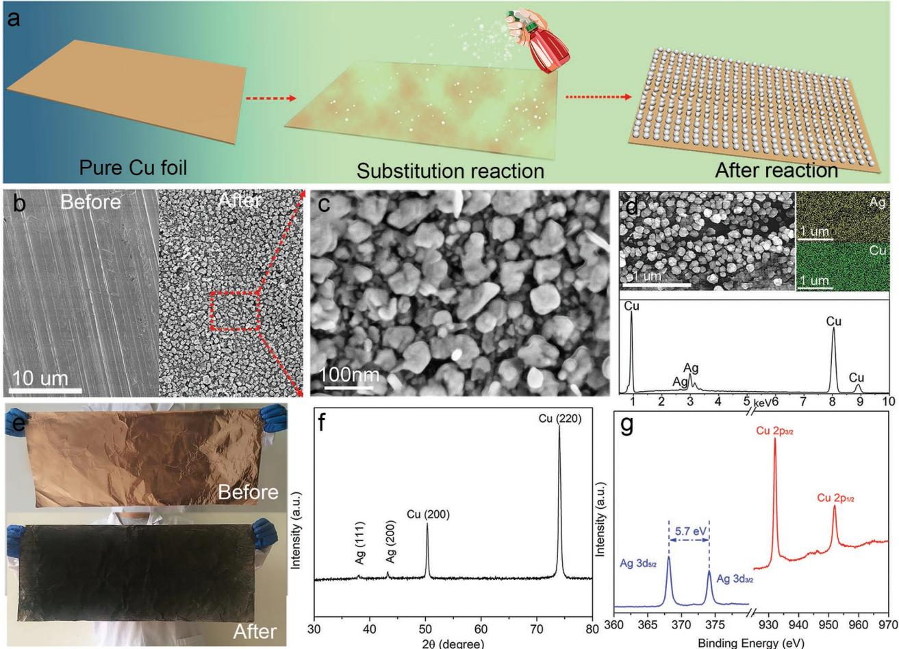
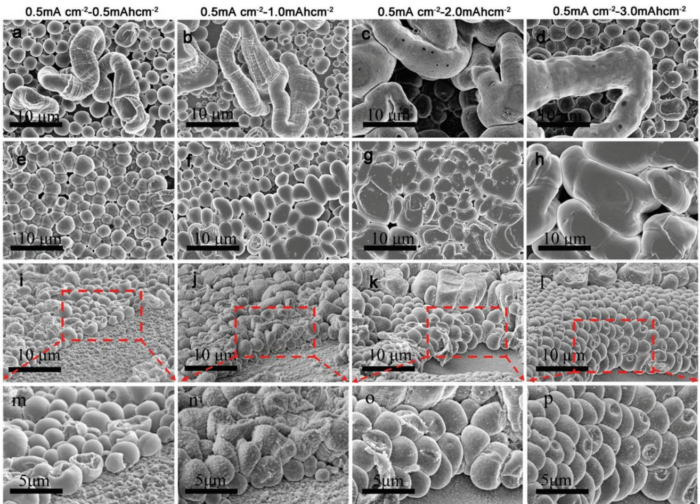
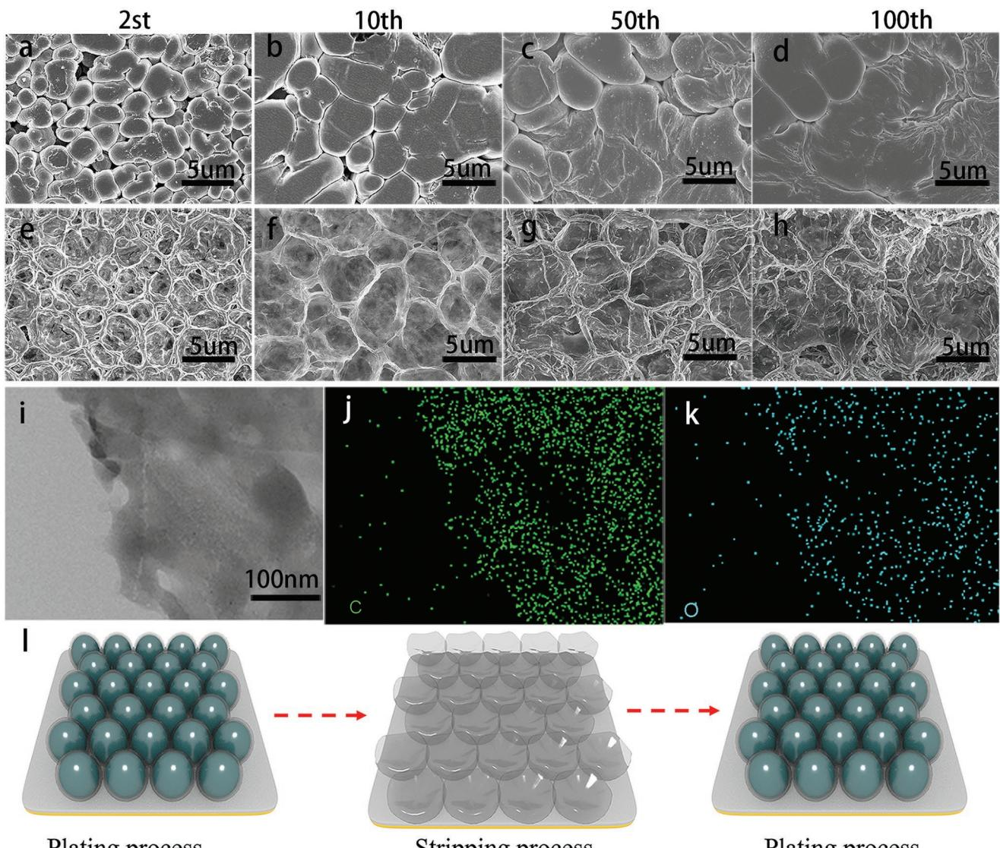
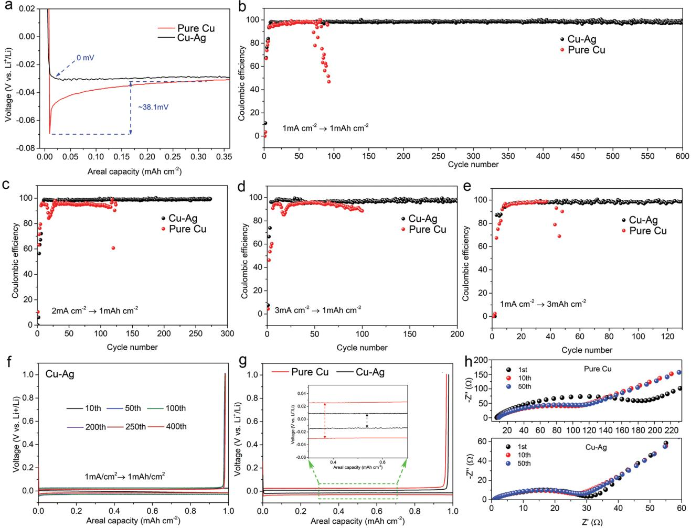
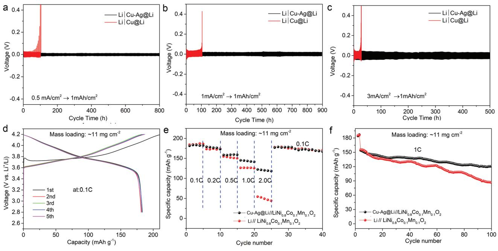

# **Large-Scale Modification of Commercial Copper Foil with Lithiophilic Metal Layer for Li Metal Battery**

*Shiqiang Cui, Pengbo Zhai, Weiwei Yang, Yi Wei, Jing Xiao, Libo Deng,\* and Yongji Gong\**

**The application and development of lithium metal battery are severely restricted by the uncontrolled growth of lithium dendrite and poor cycle stability. Uniform lithium deposition is the core to solve these problems, but it is difficult to be achieved on commercial Cu collectors. In this work, a simple and commercially viable strategy is utilized for large-scale preparation of a modified planar Cu collector with lithiophilic Ag nanoparticles by a simple substitution reaction. As a result, the Li metal shows a cobblestone-like morphology with similar size and uniform distribution rather than Li dendrites. Interestingly, a high-quality solid electrolyte interphase layer in egg shell-like morphology with fast ion diffusion channels is formed on the interface of the collector, exhibiting good stability with long-term cycles. Moreover, at the current density of 1 mA cm−2 for 1 mAh cm−2 , the Ag modified planar Cu collector shows an ultralow nucleation overpotential (close to 0 mV) and a stable coulombic efficiency of 98.54% for more than 600 cycles as well as long lifespan beyond 900 h in a Li**|**Cu-Ag@Li cell, indicating the ability of this method to realize stable Li metal batteries. Finally, full cells paired with LiNi0.8Co0.1Mn0.1O2 show superior rate performance and stability compared with those paired with Li foil.**

### **1. Introduction**

With the extensive popularization of modern electronic devices in the world, rechargeable batteries with high energy density

Dr. S. Cui, Dr. L. Deng College of Chemistry and Environmental Engineering Shenzhen University Shenzhen 518060, P. R. China E-mail: denglb@szu.edu.cn Dr. S. Cui, Dr. L. Deng Key Laboratory of Optoelectronic Devices and Systems of Education and Guangdong Province College of Optoelectronic Engineering Shenzhen University Shenzhen 518060, P. R. China Dr. S. Cui, P. Zhai, Dr. W. Yang, J. Xiao, Prof. Y. Gong School of Materials Science and Engineering Beihang University Beijing 100191, P. R. China E-mail: yongjigong@buaa.edu.cn Y. Wei State Key Laboratory of Organic-Inorganic Composites Beijing Key Laboratory of Electrochemical Process and Technology for Materials Beijing University of Chemical Technology Beijing 100029, P. R. China

The ORCID identification number(s) for the author(s) of this article can be found under https://doi.org/10.1002/smll.201905620.

#### **DOI: 10.1002/smll.201905620**

and long cycle life are urgently pursued.[1–4] However, current lithium-ion batteries (LIBs) have almost reached their theoretical limitation.[5–8] So, developing novel electrode materials with high energy and power densities as well as long cycle life is of great significance. Li metal electrodes, hailed as "Holy Grail" electrode, show incomparable advantages including high specific capacity (3860 mAh g−1 ) and low electrochemical potential (−3.040 V vs standard hydrogen electrode) and have been considered as the most promising next-generation electrode materials for Li-S, Li-air batteries, and so on.[9–11] However, the lithium metal batteries (LMBs) always suffer dendritic Li during the repeated plating/stripping process, which not only causes the formation of lots of "dead Li" and blocks the Li+/ electron transportation between the bulk Li and the electrolyte and furtherly results in the low coulombic efficiency (CE) but also is the main culprit in piercing the sepa-

rator, giving rise to the internal short circuits and finally leading to the serious security risks.[12–14] In addition, the unstable solid electrolyte interphase (SEI) is formed repeatedly on the surface of Li metal during the charge–discharge process, which leads to the nonuniform Li ionic flux and further aggravates the growth of dendritic Li as well as depletes the electrolyte.[15–18] All these disadvantages lead to low CE and poor cyclability and further impede the commercialization of LMBs.

In recent years, many attempts have been exerted to eliminate the formation of Li dendrite and enhance the cyclability of LMBs. Fabricating stable intrinsic SEI layer by the liquid electrolyte additives can improve partly the electrochemical performance.[19–23] Similarly, preparing artificial SEI layer with high Young's Modulus on the surface of the Li metal is another common way to suppress the dendrite growth.[24–27] Modified separator with functional materials for LMBs is also adopted to inhibit the formation of dendritic Li and shows some progress.[28] Solid electrolytes with high Young's modulus have exhibited good resistance to lithium dendrites in previous reports.[29,30] Although some good results are achieved by these strategies, the complicated synthesis process, high cost, great weight or instability during long-term cycle limit their practical applications. More recently, designing 3D collectors with a lithiophilic surface as host for storing Li metal, such as modified 3D Cu foam or Ni foam, shows some progress since large specific area of 3D structure is beneficial to decreasing the local current density and regulating the distribution of electric field and furtherly slowing the growth of the dendritic Li.[31] Unfortunately, most of these modified 3D hosts are complex and costly, hindering their large-scale applications. Furthermore, the energy density of the LMBs is severely reduced due to the heavier and thicker 3D structure (commercial Cu foam was >30 mg cm–2) than that of the commercial planar collector.[32] Thus, it is still highly desirable to design a dendrite-free anode by using commercial copper foil that is compatible with industry of LIBs and low price.

Commercial Cu foil is commonly used as the anode current collector in industry. However, the "lithiophobic" nature was adverse to the homogeneous Li-ion flux distribution, which leads to the formation of Li dendrite and hinders its direct application in the LMBs.[33,34] Therefore, a great deal of efforts have been devoted to developing the lithiophilic surface on Cu foils, such as creating porous structure, and/or modifying the surface with some lipophilic materials, for improving the lithiophilic nature and homogenizing Li-ion flux distribution, furtherly achieving the stable Li anode.[35–38] But most published reports always need complex and even expensive equipment, such as chemical vapor deposition furnace or atomic layer deposition equipment. A simple, scalable, and green strategy to build the lithiophilic layer on the surface of Cu collector is therefore highly desired. Silver-modified copper foils have been proved good electrochemical properties on LMBs due to its good lithiophilicity.[39]

Herein, we developed a simple and commercially viable strategy for large-scale preparation of modified Cu foil with Ag nanoparticles by a green and simple substitution reaction between pure Cu and Ag+. These Ag nanoparticles were uniformly anchored on planar Cu substrate (labeled as Cu-Ag), which can not only homogenize the electric field and ion distribution on the surface but also be used as the Li metal seeds for inducing the Li deposition due to the prominent affinity of Ag for Li, realizing evenly Li plating.[40–43] Consequently, even at a very high lithium capacity of 5.0 mAh cm−2, the Cu-Ag collector could still ensure the uniform plating morphology. The as-prepared planar collector showed ultralong cycle lifespan beyond 600 cycles with as high as 98.54% CE at the current density of 1 mA cm−2 for 1 mAh cm−2. In Li|Cu-Ag@Li cells, the Li-plated Cu-Ag collector could work steadily over 800, 900, and 500 h with low voltage polarization at 0.5, 1.0, and 3.0 mA cm−2 , respectively. For the full cell tests, the Cu-Ag@Li//LiNi0.8Co0.1Mn0.1O2 cell exhibited relatively high capacity retention compared with Li//LiNi0.8Co0.1Mn0.1O2 one. The large-scale preparation of Ag modified planar Cu collector by this simple method would further promote the practical application of Li metal batteries as the new generation energy storage systems.

## **2. Results and Discussion**

The growth of Ag nanoparticles on the surface of the Cu foil is exhibited in **Figure 1**a. Typically, the Cu foil was washed by dilute H2SO4, alcohol, and deionized water, respectively. Then the AgNO3 solution (100 × 10−6 m) was sprayed repeatedly onto the surface of the copper foil through a watering pot until the brown surface was changed to black due to the substitution reaction between Ag+ and Cu. Figure 1b,c shows the surface morphology images of the pure Cu foil and the modified Cu foil with Ag nanoparticles. As compared to the pure Cu foil, many Ag nanoparticles of ≈50 nm in size were evenly distributed on the surface of Cu foil. The energy dispersive spectrometer (EDS) image in Figure 1d proved the pure element composition (only Ag and Cu) after the substitution reaction and the content of Ag was about 6.9 at%. These homogeneous Ag nanoparticles can be used as the Li metal seeds for guiding the homogeneous growth of the dendrite-free Li metal due to the good intersolubility between Ag and Li.[44] From the optical photograph in Figure 1e, an obvious color change was found before and after the substitution reaction. It is worth emphasizing that, although the reaction process is controlled manually, a relatively uniform layer of silver particles in mm scale can be obtained by adjusting the concentration of AgNO3 (see Figure S1, Supporting Information). It was a meaningful attempt and proves the feasibility of large-scale preparation of Ag modified Cu foil via this simple method. The presence of the highly dispersed Ag nanoparticles on the Cu substrate help to seed numerous active sites for uniform nucleation of lithium as well as homogenize the ion distribution, contributing to excellent Li plating/stripping reaction. As compared to immersing the copper foil in mixed solution containing AgNO3 reported shortly before by Quan and co-workers, only one side of Cu foil was modified with Ag nanoparticles in our work by means of spray AgNO3 silver nitrate aqueous solution without any additives, which were not only benefit to saving raw materials but also conducive to minimizing the increase in the mass of the collector due to the presence of silver nanoparticles. The X-ray diffraction (XRD) patterns in Figure 1f showed the typical Ag peaks located at 38.1° and 44.2°, which were assigned to the (111) and (200) lattice planes of Ag (Joint Committee on Powder Diffraction Standards 04-0783). The other peaks were attributed to the lattice planes of (200) and (220) of the Cu substrate. X-ray photoelectron spectroscopy (XPS) pattern is given in Figure 1g, two peaks at 373.6 and 367.9 eV were attributed to the binding energies of Ag 3d3/2 and Ag 3d5/2, respectively, and the distance between these two peaks was about 5.7 eV, indicating the existence of metallic Ag.[43] The other peaks at 952.0 and 932.1 eV were associated with the binding energies of Cu 2p1/2 and Cu 2p3/2, respectively. In order to investigate the contact between Ag and Cu, the conductivity was tested by the four-probe measurement. 1.4 × 106 and 1.2 × 106 S cm−1 were obtained on Cu-Ag and Cu foil, respectively, indicating the improvement of the conductivity as well as the intimate contact between Ag nanoparticles and Cu foil. The lithiophilicity of Cu and Cu-Ag collector was investigated preliminarily by molten Li in Figure S2 in the Supporting Information. It was clear that the molten Li metal uniformly spread out on the surface of Cu-Ag. By contrast, it appeared as a droplet shape on the surface of pure Cu foil. The optical photographs directly validated the changing of Cu collector from lithiophobic to lithiophilic after modifying Ag nanoparticles. The wettability of the electrolyte on pure Cu and the Cu-Ag collectors were also investigated. As shown in Figure S3 in the Supporting Information, the Cu-Ag collector showed a smaller contact angle (27.53°) than pure Cu collector (35.56°), indicating good wettability of Cu-Ag to the electrolyte, which was helpful to facilitate fast Li+ diffusion and nucleation.

**Figure 1.** a) Schematic configuration of the spraying process for fabricating the Cu-Ag collector. b) SEM image of pure Cu and Cu-Ag collectors. c,d) Magnified view and energy dispersive X-ray spectroscopy image of the Cu-Ag collector. e) Optical photograph of before and after the substitution reaction between Ag+ and Cu. f,g) XRD and XPS images of the Cu-Ag collector.

The Li plating behavior on pure Cu and Cu-Ag collectors with different deposition amount were first comparatively investigated by ex situ scanning electron microscope (SEM) at the current density of 0.5 mA cm−2 . For investigating microscopic morphology, cells with different Li capacities were disassembled and the electrode was immersed in 1,2-dimethoxyethane for 24 h. In order to observe the cross-sectional morphology conveniently, the electrode was treated by a slight ultrasonic treatment in 1,2-dimethoxyethane to peel off part of Li. As shown in **Figure 2**a, at low plating capacity, most Li metal showed spherical structure beneficial from the ether electrolyte with LiNO3; however, a small amount of Li-dendrites were also found. When the deposition capacity was further increased to 1, 2, and 3 mAh cm−2 , respectively, the number and the dimension of Lidendrites were also increased obviously (see Figure 2b–d). This observation is also consistent with published data.[38] The poor lithiophilic property and high energy barrier of pure Cu collector always resulted in the uneven Li nucleation and dendrite growth.[45] In contrast, in virtue of the lithiophilic Ag nanoparticles on the surface of the Cu-Ag collector, evenly and wellregulated cobblestone-like metallic Li, about 2–3 µm in size, were formed with a crosslinked structure and tightly attached to the current collector after a deposition capacity of 0.5 mAh cm−2 (see Figure 2e). It should be pointed out that the initial homogeneous lithium deposition is necessary to realize large capacity lithium deposition with no Li dendrite. As shown in Figure 2f–h, not only did the cobblestone-like metallic Li become larger, but they were also more interconnected with one another upon the deposition capacity was rationally increased to 1.0, 2.0, and 3.0 mAh cm−2 , respectively. From the cross-section (Figure 2i–l) and corresponding enlargement morphologies (Figure 2m–p), the thickness of the lithium layer was increased visibly with the increasing of the plating capacity and most of the lithium metal exhibited stacked small ball-shaped at the bottom and squashed pebble-shaped morphology at the top. Additionally, a higher current density (1.0 mA cm−2 ) and larger deposition capacity (5.0 mAh cm−2 ) were also investigated on Cu-Ag collector and the result was still similar with the above phenomenon, free from the lithium dendrite (Figure S4a–c, Supporting Information), indicating the prominent ability of Cu-Ag collector to suppress lithium dendrite. Thus, it is reasonable to conclude that ether-based electrolyte can effectively suppress the growth of lithium dendrites at low current density and low capacity and the existence of Ag nanoparticles can extend it to large current

**Figure 2.** SEM images of different plating amount of 0.5, 1.0, 2.0, and 3.0 mAh cm−2 on a–d) pure Cu and e–h) Cu-Ag collectors. i–l) Cross-section and m–p) corresponding enlargement morphologies of Li metal with different capacities on Cu-Ag collector.

density and high capacity. Compared to the 3D substrates with high specific surface area, the modified Cu-Ag current collector can still be considered as a 2D one with much smaller specific surface area than the 3D substrates, the compact deposition of Li on 2D substrates was conducive to reducing the contact area of lithium with electrolyte, thus decreasing the side reaction between the lithium and the electrolyte.[46] Moreover, the initial nucleation process of Li on the pure Cu and Cu-Ag collectors were also investigated in Figure S5 in the Supporting Information, showing a successive Li nucleation and growth process, which was in line with previous report.[34]

The structural stability of the Cu-Ag collector was explored by ex situ SEM after 2nd 10th, 50th, and 100th plating/stripping cycles at the current density of 1.0 mA cm−2 for 1.0 mAh cm−2 . With the increasing of cycle laps from 2 to 100 (see **Figure 3**a–d), the morphologies of Li metal always kept spherical structure at the plating status with no lithium dendrites were found. At the same time, even after 100 cycles, the plating Li on Cu-Ag collector still remained relatively flat and no dead lithium was found, which also explains the reason of high coulomb efficiency and stable long cycle performance on modified collectors. Similarly, the morphologies of Cu-Ag collectors at stripping status were also investigated after cycling different laps and exhibited in Figure 3e–h. It was clear that the surface morphology of the Cu-Ag collector exhibited many cobblestone-like outlines at the stripping status after cycling different laps. These outlines indicated the cobblestone-like Li metal was perfectly preserved upon cycling. Meanwhile, no dead Li was detected on the interface even after 100 cycles, indicating excellent plating/stripping abilities of Cu-Ag collector. In order to investigate the elemental composition of the outline-like material, the Cu-Ag collector was ultrasonically processed in 1,2-dimethoxyethane solution and then investigated by transmission electron microscope. As shown in Figure 3i–k, the elemental composition was mainly C and O, corresponding to the main ingredients of SEI layer. The stable SEI could repeatedly guide the nucleation and growth of the Li metal on the Cu-Ag collector. The plating and stripping processes were imitated in Figure 3l. Based on the above discussion, it is obvious that the presence of Ag nanoparticles on the Cu collector was conducive to fabricating the high quantity SEI layer, homogenizing the ion flux distribution, improving the Li-ion conductivity, facilitating the uniform deposition of Li, and restraining the growth of the dendritic lithium, thus enabling the improvement of electrochemical performance.

The Li plating/stripping behaviors on the as-prepared electrodes were further investigated by comparing the CE value.

**Figure 3.** a–d) SEM image of Cu-Ag collector at 2nd, 10th, 50th, and 100th plating and e–h) stripping status. i–k) EDS mapping of SEI layer. l) Schematic diagram of plating and stripping process of Li metal on Cu-Ag collector.

As we all know that CE was commonly used to evaluate the Li metal anodes, which was defined as the ratio of the amount of lithium stripped from the collector to that plated on the collector. Before investigating the CE, the nucleation overpotential of the metallic Li deposition on pure Cu and Cu-Ag collectors were investigated by the difference value between sharp tip voltage and later stable voltage for evaluating their lithiophilicity.[47] As shown in **Figure 4**a, at 1.0 mA cm−2 , the nucleation overpotential of Li on pure Cu and Cu-Ag collectors were 38.1 and 0 mV, respectively, indicating the excellent lithiophilic property of Cu-Ag collector, which was attributed to the good intersolubility of Ag and Li according to the phase diagram.[20] However, pure Cu has no or little solubility in Li metal at room temperature, resulting in large nucleation overpotential.

The good lithiophilicity of Ag was favorable to the nucleation and deposition of Li.[47] Figure 4b–d shows the CE of these two working electrodes at different current densities with a determined deposition capacity of 1.0 mAh cm−2 . It should be noted that prior to Li plating/stripping tests, all batteries were operated within the voltage range of 0.01–1.0 V during the first six cycles to achieve an alloying reaction between lithium and silver and the formation of stable SEI layer. So, the first several cycles showed low CE value. In fact, this phenomenon was also found in many published literatures.[17,48,49] In order to increase the initial coulombic efficiency in Li metal battery, a pretreatment process of the anode in half cell was very effective, which is commonly used in the preparation of lithium-ion battery.[48] As shown in Figure 4b, at the current density of 1.0 mA cm−2 , the CE value on the Ag-Cu collector showed significant growth from 93.36% (first plating cycle) to 98.48% (fifth plating cycle), and the CE value was still as high as 98.54% after 600 cycles. The small amount of capacity loss was attributed to the SEI recovery on the surface area of the Ag-Cu electrode. In sharp contrast, the pure Cu collector exhibited a fluctuant CE after

**www.advancedsciencenews.com**

**www.small-journal.com**

**Figure 4.** a) Nucleation overpotential of Li on planar Cu and Cu-Ag collector. b–d) Li|Cu and Li|Cu-Ag cells at current density of 1.0, 2.0, and 3.0 mA cm−2 with capacity of 1.0 mAh cm−2 , respectively. e) Li|Cu and Li|Cu-Ag cells at the current density of 1.0 mA cm−2 with capacity of 3.0 mAh cm−2. f) Discharge/ charge curves of the 10th, 50th, 100th, 200th, 250th, and 400th of Cu-Ag collector with the cycling capacity of 1.0 mAh cm−2 at 1.0 mA cm−2. g) Discharge/charge profile of the 20th on pure Cu (red line) and Cu-Ag (black line) collectors at 1.0 mA cm−2 with capacity of 1.0 mAh cm−2. h) Electrochemical impedance spectra (EIS) of pure Cu and Cu-Ag collector at different cycle number.

only 100 laps. The cyclic performance on Cu-Ag collector was superior to most recent reports including some planar or 3D collectors.[50–53] When the current density was further enhanced to 2.0 mA cm−2 and even reached 3.0 mA cm−2, the CE value on the Ag-Cu collectors respectively remained at ≈99.72% (for 270 cycles shown in Figure 4c, 2.0 mA cm−2) and ≈98.23% (for 200 cycles shown in Figure 4d, 3 mA cm−2), respectively. However, the CE value on pure Cu collectors at these two current densities was fluctuant with low retention. All these Ag-Cu collectors at different current densities showed longer and more stable cycling performances as well as higher CE values than the pure Cu electrodes. Besides, high cycling capacities (e.g., 3.0 mAh cm−2 ) at 1.0 mA cm−2 were also investigated. Figure 4e exhibits that Cu-Ag collector could cycle more than 120 laps with high CE (98.8%), but pure Cu collector was cycled only 30 cycles. Some reports have shown that the deposition performance and CE on the planar collector were not as stable as those on the 3D porous current collectors since 3D porous collectors could provide smaller current density per unit area and larger Li accommodation space.[37,45] Interestingly, even with large deposition capacity at large current density in this work, the CE was still stable, showing superior electrochemical properties of the planar Cu-Ag collector. This was attributed to the good lithiophilic property of this designed Cu-Ag collector, which was in favor of reducing the nucleation overpotential and removing the deposition barrier as well as suppressing the growth of dendritic lithium during the plating/stripping process. Meanwhile, the Cu-Ag collectors also showed obvious advantages over the reported works (see Table S1 in the Supporting Information).

As shown the charge/discharge curves of Cu-Ag collector in Figure 4f, the voltage curves from different cycles were almost coincident with 1.0 mAh cm−2 at 1.0 mA cm−2 , suggesting the stable plating/stripping behaviors of Cu-Ag collector, which was in line with high CE value shown in Figure 4b. For comparison, the charge/discharge curves of pure Cu and Cu-Ag collector at 20th are shown in Figure 4g. Clearly, the polarization on Cu-Ag collector was only ≈ 10 mV, smaller than that on pure Cu of ≈25 mV. Meanwhile, the conductivity was also investigated by electrochemical impedance spectroscopy (EIS). As shown in Figure 4h, the interfacial charge transfer resistance of Cu-Ag collector after the first cycle was basically consistent (≈29 Ω), smaller than that of pure Cu one (110 Ω), showing the excellent conductivity of Cu-Ag collector. The small overpotential was attributed to the good lithiophilicity of Ag metal and high conductivity of the Ag-Li nanoparticles.

The long-time stability was further evaluated by galvanostatic charge/discharge method in Li|Cu@Li and Li|Cu-Ag@Li cells at different current densities (0.5, 1.0, and 3.0 mA cm−2 ) with 1.0 mAh cm−2 . Before the test, Li with a capacity of 2.0 mAh cm−2 is first plated on working electrodes at the current density of 1.0 mA cm−2 . Excessive lithium on anode is necessary when used to evaluate the long cycle performance of lithium metal batteries since some lithium will react with electrolyte during cycles.[38]

As shown in **Figure 5**a, the Li|Cu-Ag@Li cell showed exceptionally stable cycle characteristics with low voltage hysteresis (10 mV) for over 800 h at 0.5 mA cm−2. Contrastingly, the Li|Cu@Li cell only cycled less than 100 h before fluctuation. When the current density was risen to 1.0 mA cm−2, as shown in Figure 5b, the Li|Cu-Ag@Li cell was capable of cycling for nearly 900 h steadily within the overpotential of ≈18 mV. Again, the Li|Cu@Li cell still showed inferior cyclability compared to the Li|Cu-Ag@Li cell and started fluctuating after 100 h. Upon further enhancing the current density to 3.0 mA cm−2 (Figure 5c), the Li|Cu-Ag@Li cell exhibited outstanding electrochemical stability and cycle life over 500 h (as high as 810 cycles) with negligible polarization growth. Comparatively, the Li|Cu@ Li cell showed obvious fluctuation only after 25 h, exhibiting poor cyclability. All these results showed that the effective inhibition on the growth of lithium dendrite was obtained on Cu-Ag collector due to the merits of its good lithiophilicity, stable reaction interface, and high electrical conductivity. Not only that, the Li|Cu-Ag@Li also showed great behavior compared to the reported symmetric batteries in literature (see Table S2 in the Supporting Information). Moreover, for comparison, the pure Li|Li symmetrical cells were also assembled and tested at large current densities of 1.0 and 3.0 mA cm−2 , respectively. Clearly, the pure Li|Li cells showed rapid voltage polarization and less stable cycling performance compared to Li|Cu-Ag@Li cell at both current densities of 1.0 and 3.0 mA cm−2 (Figure S6, Supporting Information), which was associated with the constant SEI growth and continuous consumption of electrolyte with the increasing of cycle numbers.[15] Moreover, the gradual formation of arcing profile (random voltage oscillation) on Li|Li symmetrical cells indicated that the Li+ transport pathway on pure Li electrode was blocked by the thick layer of dead Li.[14] Combining with SEM observations, the excellent cyclability of Cu-Ag electrode was benefited from the stable nucleation and uniform lithium deposition on the lithiophilic Ag layer without the growth of dendritic Li, showing potential practical value for large scale commercial production. In addition, based on the excellent results shown in Figure 5a–c, it can be forecasted that the Cu-Ag@Li will show excellent cyclability along with small polarization at even large current densities.

The electrochemical performance of the Cu-Ag@Li in comparison with the pure Li foil was further tested in full cells with the commercial LiNi0.8Co0.1Mn0.1O2 (≈11.0 mg cm−2) as the cathode and the Cu-Ag@Li (or pure Li foil) as the anode, respectively. Figure 5d presents the first five galvanostatic charge/discharge curves of the Cu-Ag@Li//LiNi0.8Co0.1Mn0.1O2 full cell at 0.1 C (1.0 C = 200 mA g−1 ) within the potential range from 2.8 to 4.2 V. It was clear that the full cell showed high and steady reversible capacity of 185 mAh g−1 at 0.1 C. As shown in Figure 5e, the Cu-Ag@Li//LiNi0.8Co0.1Mn0.1O2 full cell shows high rate capability of 185 mAh g−1 at 0.1 C, 180 mAh g−1 at 0.2 C, 160 mAh g−1 at 0.5 C, 143 mAh g−1 at 1.0 C, and 120 mAh g−1 at 2.0 C, respectively, higher than Cu-Ag@Li//LiFePO4 full cell (≈160, 153, 145, 136, and 118mAh g−1 , respectively, see Figure S7a in the Supporting Information) at the same current densities. When the current density was turned again back to 0.1 C, the specific capacity of the Cu-Ag@Li//LiNi0.8Co0.1Mn0.1O2 full cell was recovered to 180 mAh g−1 , indicating good electrochemical performance at different current densities. In order to increase the specific capacity of the LiNi0.8Co0.1Mn0.1O2, we widened the voltage range, raising the charging voltage to 4.5 V and keeping the discharge voltage constant. As shown in Figure S7b,c in the Supporting Information, the full cell can still circulate relatively steadily and the specific capacity at 0.1 C was as high as 198 mAh g−1 , close to the theoretical capacity of LiNi0.8Co0.1Mn0.1O2. At the same, this also indicated that the Cu-Ag collector could work steadily under high voltage (4.5 V). For comparison, the Li//LiNi0.8Co0.1Mn0.1O2 full cell was also investigated at the same conditions. Though the similar capacity was also obtained on Li//LiNi0.8Co0.1Mn0.1O2 at low current densities (such as 0.1, 0.2, and 0.5 C) compared with the Cu-Ag@Li//LiNi0.8Co0.1Mn0.1O2, the capacity was quickly decreased to ≈50 mAh g−1 at 2.0 C.

Figure 5f shows the long cyclability of Cu-Ag@Li// LiNi0.8Co0.1Mn0.1O2 and Li//LiNi0.8Co0.1Mn0.1O2 full cells at 1.0 C. Comparing to the Li//LiNi0.8Co0.1Mn0.1O2 full cell, the former showed better stability and higher capacity retention (122 mAh g−1) after 100 cycles. The excellent Cu-Ag@Li anode in full cell was mainly attributed to the presence of the lithiophilic layer on the Cu substrate, which impeded the growth of Li dendrites and enhanced the cyclability. Contrarily, pure Li foil in full cell was always faced with the continuous formation of Li dendrites and the exhaustion of electrolyte during the cyclic processes, leading to poor cyclic stability.

## **3. Conclusion**

In summary, we develop a simple and scalable method to modify the planar Cu collector with the Ag nanoparticles by the simple substitution reaction. The good lithiophilicity of Ag can not only reduce the nucleation barrier but also serve as nuclei seeds to guide the uniform lithium nucleation, further affecting the lithium deposition morphology and suppressing the growth of Li dendrites. As a result, the modified Cu substrate with Ag nanoparticles can cycle stably over 600 laps with high CE of 98.8% at 1.0 mA cm−2 . Moreover, a prolonged cycle stability close to 800 h at 0.5 mA cm−2 , 900 h at 1.0 mA cm−2 , and 500 h at 3.0 mA cm−2 were obtained in symmetric cells, respectively.

**www.advancedsciencenews.com**

**Figure 5.** Voltage time profiles of the Li plating/stripping process at current density of a) 0.5, b) 1.0, and c) 3.0 mA cm−2 with depositing capacity of 1.0 mAh cm−2 in symmetric Li|Cu@Li and Li|Cu-Ag@Li cells, respectively. d) Galvanostatic charge/discharge curves of Cu-Ag@Li//LiNi0.8Co0.1Mn0.1O2 full cell at 0.1 C. e) Rate capabilities of Cu-Ag@Li//LiNi0.8Co0.1Mn0.1O2 and Li//LiNi0.8Co0.1Mn0.1O2 full cell and f) the long cyclability at 1.0 C current density.

In addition, the assembled Cu-Ag@Li//LiNi0.8Co0.1Mn0.1O2 full cell exhibits a much higher capacity retention than Li// LiNi0.8Co0.1Mn0.1O2 full cell after 100 cycles. These merits prove a valuable strategy to promote the development of safe Li-metal batteries and suggest a facile and scalable method to prepare lithium metal anode for industry.

#### **4. Experimental Section**

*Fabrication of Ag Nanoparticles Modified Copper Foil*: The commercial Cu foil (≈75 × 30 cm2 ) was washed in sequence by dilute H2SO4, alcohol, and deionized water. Then, Ag modified Cu foil was synthesized by a simple substitution reaction. Typically, a solution of AgNO3 (100 × 10−6 m) was sprayed onto the clean Cu foil by one watering pot for several times until the color of the copper turns light black, like spraying paint (see Figure 1a). Afterward, the light black Cu-Ag was washed by deionized water and alcohol again. Finally, the Ag modified copper foil was punched out into 12 mm of circular disks for LMBs.

*Structure Characterization*: The element analysis and structure the of the as-prepared materials were investigated by XPS (Thermal ESCALAB 250) and XRD measurements (Bruker, with Cu-*K*α radiation of 1.5418 Å), respectively. The morphologies of the obtained materials were surveyed by SU8020 field scanning electron microscopy.

*Electrochemical Property Measurements*: To investigate the lithium plating/stripping behavior on Cu-Ag (and pure Cu foil) anode, coin cells (2032 type) were assembled with Li foil as the counter electrode, Cu-Ag (or pure Cu foil) as the working electrode, Celgard 2400 as separator membrane, and 40 µL of 1 m lithium bis(trifluoromethanesulfonyl)imide mixed solution (in 1:1 of 1,3-dioxolane/1,2-dimethoxyethane, with 1.0% of LiNO3 as the additive) as the electrolyte, respectively. The galvanostatic charge/discharge tests were carried out on the Neware battery-testing system. To study the CE, different capacities of Li was plated on the collector and then charged to 1 V (vs Li+/Li) for each cycle at the corresponding current density. To evaluate the cyclability of the Li metal on pure Cu and Cu-Ag collectors, 2 mAh cm−2 of Li was first plated on the current collector at the current density of 1 mA cm−2 for fabricating the Li|Cu@Li and Li|Cu-Ag@Li cells, then cells were cycled with the capacity of 1 mAh cm−2 at 0.5, 1.0, and 3.0 mA cm−2 , respectively. The EIS was performed on an electrochemical workstation (CHI 760E) with the frequency changing from 10 mHz to 100 KHz. In addition, full cells were assembled with 40 µL of electrolyte and the LiNi0.8Co0.1Mn0.1O2 (≈11 mg cm−2 ) or LiFePO4 (≈12.5 mg cm−2 ) as the cathode in combination with plating 3.0 mAh cm−2 of Li on Cu-Ag@Li (or pure Li foil for comparison) as the anode. The amount of predeposited lithium was chosen randomly for symmetry cells or full cells and excessive lithium deposited on anode is necessary since some lithium will react with electrolyte during cycles. In a typical process, a slurry of polyvinylidene fluoride (as the binder), super P (as the conductive agent), and LiNi0.8Co0.1Mn0.1O2 or LiFePO4 (as the active material) with a weight ratio at 8:1:1 were uniformly mixed with the moderate amount of *n*-methylpyrrolidone in a small beaker. The slurry was then coated onto the surface of the Al foil and dried for 10 h at 120 °C in a vacuum drying oven.

#### **Supporting Information**

Supporting Information is available from the Wiley Online Library or from the author.

#### **Acknowledgements**

This project was supported by the Shenzhen Government's Plan of Science and Technology (KQJSCX2017033011014404), the National Key R&D Program of China (Grant No. 2018YFA0306900), and the National Natural Science Foundation of China (51872012, 51602202, and 51774203). The authors gratefully acknowledge the SEM testing work supported by Beijing Zhongkebaice Technology Service Co., Ltd.

**www.advancedsciencenews.com**

## **Conflict of Interest**

The authors declare no conflict of interest.

## **Keywords**

Ag nanoparticles, dendrite-free, lithium metal anodes, planar collectors, stable deposition

Received: October 1, 2019

Revised: November 29, 2019

Published online: January 14, 2020

- [1] D. Lin, Y. Liu, Y. Cui, *Nat. Nanotechnol.* **2017**, *12*, 194.
- [2] X.-B. Cheng, R. Zhang, C.-Z. Zhao, Q. Zhang, *Chem. Rev.* **2017**, *117*, 10403.
- [3] Y. Sun, X. Yan, *Sol. RRL* **2017**, *1*, 1700002.
- [4] Y. Sun, P. Ma, L. Liu, J. Chen, X. Zhang, J. Lang, X. Yan, *Sol. RRL* **2018**, *2*, 1800223.
- [5] Y.-M. Chiang, *Science* **2010**, *330*, 1485.
- [6] E. E. Evarts, *Nature* **2015**, *526*, S93.
- [7] J. W. Choi, D. Aurbach, *Nat. Rev. Mater.* **2016**, *1*, 16013.
- [8] C. Grey, J. Tarascon, *Nat. Mater.* **2017**, *16*, 45.
- [9] H. Kim, G. Jeong, Y.-U. Kim, J.-H. Kim, C.-M. Park, H.-J. Sohn, *Chem. Soc. Rev.* **2013**, *42*, 9011.
- [10] Q. Song, H. Yan, K. Liu, K. Xie, W. Li, W. Gai, G. Chen, H. Li, C. Shen, Q. Fu, S. Zhang, L. Zhang, B. Wei, *Adv. Energy Mater.* **2018**, *8*, 1800564.
- [11] B. Adams, C. Radtke, R. Black, M. Trudeau, K. Zaghib, L. Nazar, *Energy Environ. Sci.* **2013**, *6*, 1772.
- [12] D. Lu, Y. Shao, T. Lozano, W. D. Bennett, G. L. Graff, B. Polzin, J. Zhang, M. H. Engelhard, N. T. Saenz, W. A. Henderson, *Adv. Energy Mater.* **2015**, *5*, 1400993.
- [13] K. N. Wood, E. Kazyak, A. F. Chadwick, K.-H. Chen, J.-G. Zhang, K. Thornton, N. P. Dasgupta, *ACS Cent. Sci.* **2016**, *2*, 790.
- [14] K.-H. Chen, K. N. Wood, E. Kazyak, W. S. LePage, A. L. Davis, A. J. Sanchez, N. P. Dasgupta, *J. Mater. Chem. A* **2017**, *5*, 11671.
- [15] K. R. Adair, M. Iqbal, C. Wang, Y. Zhao, M. N. Banis, R. Li, L. Zhang, R. Yang, S. Lu, X. Sun, *Nano Energy* **2018**, *54*, 375.
- [16] H. Wang, D. Lin, J. Xie, Y. Liu, H. Chen, Y. Li, J. Xu, G. Zhou, Z. Zhang, A. Pei, *Adv. Energy Mater.* **2019**, *9*, 1802720.
- [17] X.-R. Chen, B.-Q. Li, C.-X. Zhao, R. Zhang, Q. Zhang, *Small Methods* **2019**,<https://doi.org/10.1002/smtd.201900177>.
- [18] S. Liu, L. Deng, W. Guo, C. Zhang, X. Liu, J. Luo, *Adv. Mater.* **2019**, *31*, 1807585.
- [19] S. S. Zhang, *Electrochim. Acta* **2012**, *70*, 344.
- [20] Y. Lu, Z. Tu, L. A. Archer, *Nat. Mater.* **2014**, *13*, 961.
- [21] J. Zheng, M. H. Engelhard, D. Mei, S. Jiao, B. J. Polzin, J.-G. Zhang, W. Xu, *Nat. Energy* **2017**, *2*, 17012.
- [22] X.-Q. Zhang, X.-B. Cheng, X. Chen, C. Yan, Q. Zhang, *Adv. Funct. Mater.* **2017**, *27*, 1605989.
- [23] Q. Ma, B. Tong, Z. Fang, X. Qi, W. Feng, J. Nie, Y.-S. Hu, H. Li, X. Huang, L. Chen, *J. Electrochem. Soc.* **2016**, *163*, A1776.
- [24] N. W. Li, Y. X. Yin, C. P. Yang, Y. G. Guo, *Adv. Mater.* **2016**, *28*, 1853.
- [25] X. Zhang, T. Liu, S. Zhang, X. Huang, B. Xu, Y. Lin, B. Xu, L. Li, C.-W. Nan, Y. Shen, *J. Am. Chem. Soc.* **2017**, *139*, 13779.
- [26] Y. Gao, Y. Zhao, Y. C. Li, Q. Huang, T. E. Mallouk, D. Wang, *J. Am. Chem. Soc.* **2017**, *139*, 15288.
- [27] J. Lang, Y. Long, J. Qu, X. Luo, H. Wei, K. Huang, H. Zhang, L. Qi, Q. Zhang, Z. Li, *Energy Storage Mater.* **2019**, *16*, 85.
- [28] Y. Liu, Q. Liu, L. Xin, Y. Liu, F. Yang, E. A. Stach, J. Xie, *Nat. Energy* **2017**, *2*, 17083.
- [29] W. J. Hyun, A. C. M. de Moraes, J.-M. Lim, J. R. Downing, K.-Y. Park, M. T. Z. Tan, M. C. Hersam, *ACS Nano* **2019**, *13*, 9664.
- [30] Y. Gao, Z. Yan, J. L. Gray, X. He, D. Wang, T. Chen, Q. Huang, Y. C. Li, H. Wang, S. H. Kim, T. E. Mallouk, D. Wang, *Nat. Mater.* **2019**, *18*, 384.
- [31] S. Huang, W. Zhang, H. Ming, G. Cao, L.-Z. Fan, H. Zhang, *Nano Lett.* **2019**, *19*, 1832.
- [32] F. Pei, A. Fu, W. Ye, J. Peng, X. Fang, M.-S. Wang, N. Zheng, *ACS Nano* **2019**, *13*, 8337.
- [33] K. Yan, Z. Lu, H.-W. Lee, F. Xiong, P.-C. Hsu, Y. Li, J. Zhao, S. Chu, Y. Cui, *Nat. Energy* **2016**, *1*, 16010.
- [34] A. Pei, G. Zheng, F. Shi, Y. Li, Y. Cui, *Nano Lett.* **2017**, *17*, 1132.
- [35] Z. Liang, D. Lin, J. Zhao, Z. Lu, Y. Liu, C. Liu, Y. Lu, H. Wang, K. Yan, X. Tao, Y. Cui, *Proc. Natl. Acad. Sci. U. S. A.* **2016**, *113*, 2862.
- [36] Y. Liu, D. Lin, Z. Liang, J. Zhao, K. Yan, Y. Cui, *Nat. Commun.* **2016**, *7*, 10992.
- [37] Y. Zhang, W. Luo, C. Wang, Y. Li, C. Chen, J. Song, J. Dai, E. M. Hitz, S. Xu, C. Yang, Y. Wang, L. Hu, P. Natl. *Proc. Natl. Acad. Sci. USA* **2017**, *114*, 3584.
- [38] H. Qiu, T. Tang, M. Asif, X. Huang, Y. Hou, *Adv. Funct. Mater.* **2019**, *29*, 1808468.
- [39] Z. Hou, Y. Yu, W. Wang, X. Zhao, Q. Di, Q. Chen, W. Chen, Y. Liu, Z. Quan, *ACS Appl. Mater. Interfaces* **2019**, *11*, 8148.
- [40] C. Yang, Y. Yao, S. He, H. Xie, E. Hitz, L. Hu, *Adv. Mater.* **2017**, *29*, 1702714.
- [41] P. Xue, S. Liu, X. Shi, C. Sun, C. Lai, Y. Zhou, D. Sui, Y. Chen, J. Liang, *Adv. Mater.* **2018**, *30*, 1804165.
- [42] R. Zhang, X. Chen, X. Shen, X.-Q. Zhang, X.-R. Chen, X.-B. Cheng, C. Yan, C.-Z. Zhao, Q. Zhang, *Joule* **2018**, *2*, 764.
- [43] F. Guo, C. Wu, H. Chen, F. Zhong, X. Ai, H. Yang, J. Qian, *Energy Storage Mater.* **2020**, *24*, 635.
- [44] B. Predel, in *Ag–Li (Silver–Lithium)*, Springer, Berlin, Germany **1991**.
- [45] C. Zhang, W. Lv, G. M. Zhou, Z. J. Huang, Y. B. Zhang, R. Y. Lyu, H. L. Wu, Q. B. Yun, F. Y. Kang, Q. H. Yang, *Adv. Energy Mater.* **2018**, *8*, 1703404.
- [46] Y. Zhang, J. Qian, W. Xu, S. M. Russell, X. Chen, E. Nasybulin, P. Bhattacharya, M. H. Engelhard, D. Mei, R. Cao, F. Ding, A. V. Cresce, K. Xu, J.-G. Zhang, *Nano Lett.* **2014**, *14*, 6889.
- [47] R. Zhang, X.-R. Chen, X. Chen, X.-B. Cheng, X.-Q. Zhang, C. Yan, Q. Zhang, *Angew. Chem., Int. Ed.* **2017**, *56*, 7764.
- [48] R. Zhang, X. Cheng, C. Zhao, H. Peng, J. Shi, J. Huang, J. Wang, F. Wei, Q. Zhang, *Adv. Mater.* **2016**, *28*, 2155.
- [49] P. Zhai, T. Wang, W. Yang, S. Cui, P. Zhang, A. Nie, Q. Zhang, Y. Gong, *Adv. Energy Mater.* **2019**, *9*, 1804019.
- [50] F. Qiu, X. Li, H. Deng, D. Wang, X. Mu, P. He, H. Zhou, *Adv. Energy Mater.* **2019**, *9*, 1803372.
- [51] Z. Wang, S. Lu, K. Lu, Y. Li, R. Wang, Y. Cheng, W. Qin, X. Wu, *J. Power Sources* **2019**, *428*, 1.
- [52] J. Cui, S. Yao, M. Ihsan-Ul-Haq, J. Wu, J.-K. Kim, *Adv. Energy Mater.* **2019**, *9*, 1802777.
- [53] H. Liu, E. Wang, Q. Zhang, Y. Ren, X. Guo, L. Wang, G. Li, H. Yu, *Energy Storage Mater.* **2019**, *17*, 253.