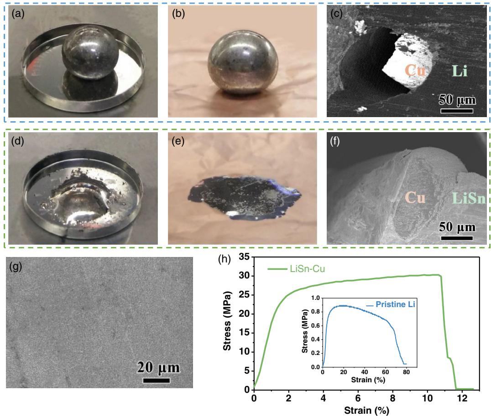
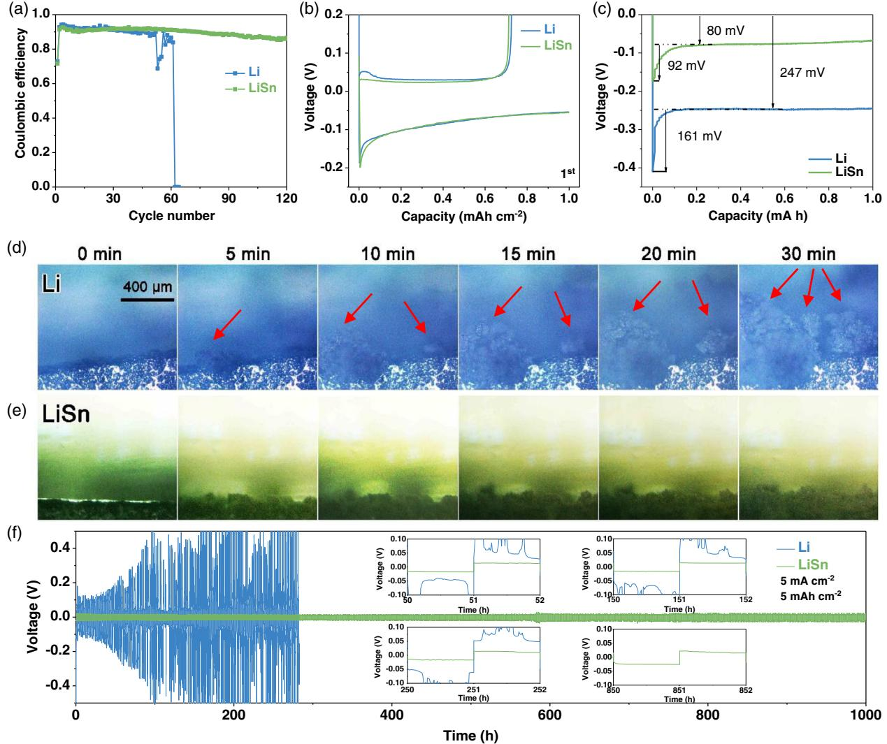
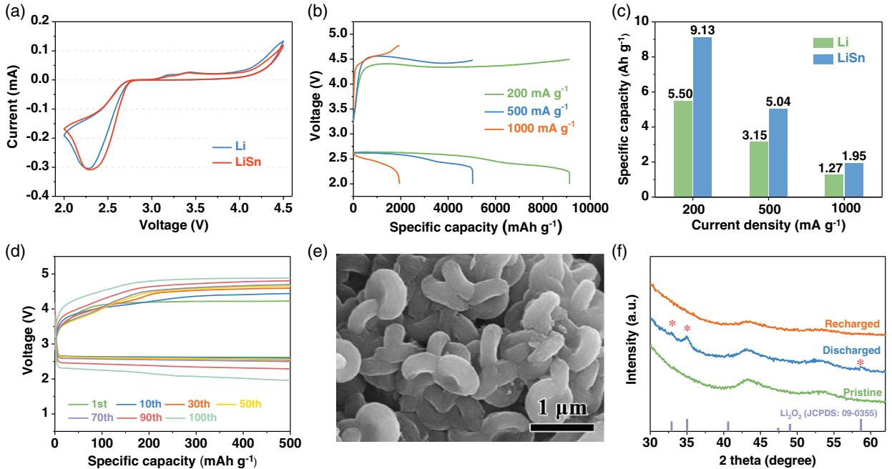
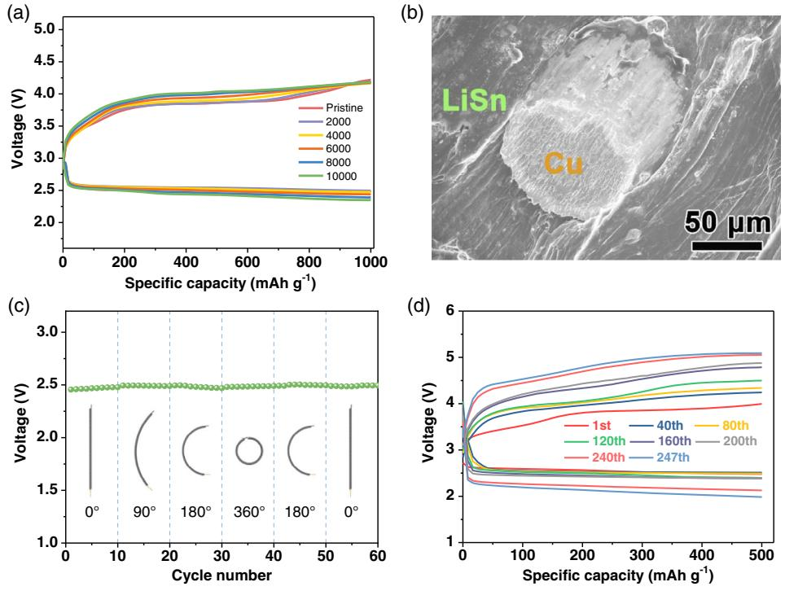

# Lithium and Stannum Hybrid Anodes for Flexible Wire-Type Lithium–Oxygen Batteries

Tong Liu, Yue Yu, Xiao-Yang Yang, Jin Wang, and Xin-Bo Zhang\*

Flexible lithium–oxygen batteries (LOBs) are promising candidates for nextgeneration portable and flexible devices due to their ultrahigh theoretical energy density. However, the widely used metallic lithium anode leads to many obstacles that have to be surmounted when it is applied to the 1D flexible LOB. Herein, the LiSn hybrid anode that is facilely generated by molten tin solders and lithium metal is used in wire-type LOBs to improve the wettability of molten Li against Cu current collectors, increase the strength of anode, and repress the growth of dendrites. This anode cycles stably for more than 1000 h at the current density of 5 mA cm2 with minimal voltage divergence. The obtained wire-type LOB composed of this LiSn hybrid anode, flexible gel–polymer electrolyte, and carbon thread cathode exhibit a higher specific capacity, stable reversibility, superior structure flexibility, and cycling stability (up to 247 cycles). Utilizing the tin solders to fabricate the LiSn hybrid anode not only decreases the fabrication cost but also simplifies the production procedures of flexible wire-type LOBs, providing new ideas for environmental protection and practical applications.

#### 1. Introduction

The highly demand for flexible/wearable electronics, which holds unique properties and wide application in a variety of fields, has led to an upsurge in the development of corresponding flexible energy-storage systems (FESS).[1] There are two main structures for FESS, planar structures and fiber structures. Compared with the planar ones, the linear structures with omnidirectional flexibility can be twisted, tied, and woven into textiles and are more adaptable and wearable.[2] Recently, much

Dr. T. Liu, Y. Yu, Prof. X.-B. Zhang State Key Laboratory of Rare Earth Resource Utilization Changchun Institute of Applied Chemistry Chinese Academy of Sciences Changchun 130022, P. R. China E-mail: [xbzhang@ciac.ac.cn](mailto:xbzhang@ciac.ac.cn)

Dr. T. Liu, Y. Yu, Prof. X.-B. Zhang School of Applied Chemistry and Engineering University of Science and Technology of China Hefei 230026, P. R. China

Prof. X.-Y. Yang, J. Wang Key Laboratory of Automobile Materials Ministry of Education, and College of Materials Science and Engineering Jilin University Changchun 130012, P. R. China

The ORCID identification number(s) for the author(s) of this article can be found under<https://doi.org/10.1002/sstr.202000015>.

#### DOI: 10.1002/sstr.202000015

progresses have been made to develop wire-shaped FESS, such as alkali metal– ion batteries, solar cells, and supercapacitors.[3] However, these FESS, including the mostly explored wire-type lithium–ion batteries with paired electrodes structures, face the common bottlenecks of inherent low energy density, preventing them from commercialization.[4] Fortunately, the wiretype lithium–oxygen batteries (LOBs), with a coaxial structure which constituted of a linear lithium metal anode, Li-ion conducting electrolyte, and composite air cathode, have been developed as a promising technology to flexible batteries, because of their favorable advantages including the ultrahigh energy density of 3500 Wh kg1 , low cost, and environmental friendliness.[5]

To endow the wire-type LOBs with flexibility, it is necessary to make each component flexible, especially the core anode that supports the rest of the battery

components. However, the anodes in reported linear structure LOBs almost are pure lithium rods.[6] During repeated deformation, the pure lithium rod anode with low strength may generate cracks. In addition, the poor interfacial contact of lithium metal on the current collector may lead to limited electron transfer and a detachment between the anode and current collector, hampering the flexible LOBs toward practical applications.[7] Moreover, the formation of undesirable Li dendrite during cycling not only corrodes the lithium anode, then forming dead Li, but also consumes the electrolyte, thus inducing the premature failure and safety issues of the battery.[8] Therefore, it is highly required and challenging to develop an effective strategy to increase the structural robustness and efficiency of anodes in the linear LOBs and reduce the formation of lithium dendrites concurrently.

Electrical wire that composed of copper fibers plays a crucial role in social progress, and it is an inexpensive current collector and an ideal flexible substrate for constructing flexible anodes (Figure S1, Supporting Information). However, it is impracticable to coat Li metal on the copper fibers' current collector as molten Li shows weak wettability with copper substrates. Herein, inspired by the fact that tin solders are widely used for joining electric circuits, we fabricated the LiSn hybrid anode that utilized Sn as the coating modification layer on flexible Cu fibers. The LiSn hybrid anode improved the wettability and structural robustness of molten Li against Cu, solved the issues caused by Li dendrite, and demonstrated enhanced electrochemical performances. In addition, the LiSn hybrid anode accompanied by the in situ fabricated gel–polymer electrolyte (GPE) and

[www.advancedsciencenews.com](http://www.advancedsciencenews.com) [www.small-structures.com](http://www.small-structures.com)

flexible carbon thread cathode forms a flexible wire-type LOB with excellent performance and mechanical stability.

#### 2. Results and Discussion

As shown in Figure 1a,b, the pure liquated lithium metal dewets the stainless steel and copper foil due to the difference in surface energy. Even after cooling down to room temperature and the liquated lithium metal becomes solidified lithium metal, there is poor contact between the solidified Li and Cu that is confirmed by the hole between them in the SEM (Figure 1c), which might cause limited and sluggish electron transfer and even battery premature death. In sharp contrast, after adding Sn into the molten lithium metal, the new formed LiSn hybrid metal shows much-improved wettability on the stainless steel and copper foil (Figure 1d,e). The scanning electron microscopy (SEM) image in Figure 1f showed that the LiSn hybrid anode continuously and conformally contacts with the Cu fiber, indicating that Li alloying with Sn could overcome the contact difficulty within Li metal and Cu current collector. The uneven surface of pure Li metal would induce inhomogeneous conductivity, leading to selective electrodeposition on sparse local sites

and then forming lithium dendrites (Figure S2, Supporting Information). Different from pure Li, the morphology of LiSn hybrid metal is more smooth which benefits the uniform transfer of lithium ion (Figure 1g). Energy-dispersive spectroscopy (EDS) mapping of the LiSn hybrid anode showed a uniform distribution of Sn in the LiSn hybrid metal (Figure S3, Supporting Information). Compared with the X-ray diffraction (XRD) pattern of pure lithium metal, the XRD pattern of the LiSn hybrid metal indicated the coexistence of Li22Sn5 alloy and Li metal (Figure S4, Supporting Information). This is because in the preparation progress of the LiSn hybrid anode, the lithium metal is excessive. After the excessive molten Li reacted with soldering tin, Li22Sn5 alloy and residual lithium metal were formed. The mechanical strength of the LiSn hybrid metal with a copper core (LiSn– Cu) and the pristine Li anode are compared in Figure 1h. LiSn–Cu could withstand the stress of 30.3 MPa which is much higher than 0.89 MPa of pristine Li, revealing that it has enough toughness to maintain structural integrity during the bending process of flexible electronics.

To assess the electrochemical performance of LiSn hybrid metal in a practical battery system, we first assembled and tested the button cells with LiSn hybrid metal as the anode. Coulombic efficiency (CE) is a generally accepted index to evaluate the

Figure 1. Photographs of pure liquated Li on a) stainless steel and b) copper foil. c) Cross-sectional SEM images of the Cu fiber coated with pure Li. Photographs of liquated LiSn hybrid anode on d) stainless steel and e) copper foil. f ) Cross-sectional SEM images of the Cu fiber coated with LiSn hybrid anode. g) The SEM image of LiSn hybrid anode. h) Stress–strain curves of pristine Li and LiSn–Cu hybrid anode.

sustainability of anodes.[9] We tested the CE of LiSn|Cu and Li|Cu symmetric batteries at a current of 1 mA cm2 with the plating capacity of 1 mAh cm2 and stripping capacity controlled by the cutoff voltage at 0.5 V. As shown in Figure 2a, the cell with pure Li showed a poor CE that failed after 60 cycles, which may result from the short circuit due to the formation of dendritic Li. However, the LiSn hybrid anode demonstrated a stable CE throughout 120 cycles. From the 1st and 50th discharge–charge curves of LiSn|Cu and Li|Cu cells in Figure 2b and Figure S5, Supporting Information, it is evident that the LiSn hybrid anode shows a lower charge overpotential, demonstrating lower resistance for lithium ion to deposit at the LiSn hybrid metal surface. Furthermore, we investigated the morphology of the discharged anodes which were taken apart from the failed cells. Compared with the rough and porous surface of pure Li, the morphology of LiSn hybrid anode is flat and compact, which mostly maintained the initial state, suggesting that Li alloying with Sn is efficient in homogeneous deposition behavior (Figure S6, Supporting Information).

To further illustrate the lithium electrodeposition process on LiSn and Li anodes, respectively, we compared the voltage profiles of Li|LiSn and Li|Li symmetric cells (Figure 2c). At the beginning of Li-ion deposition, there is a distinct voltage dip, which is then followed by a flat voltage plateau. The voltage difference between the platform voltage and peak voltage, mainly influenced by the characteristic of the substrate, is usually defined as the Li metal's nucleation overpotential (μn).[10] The LiSn hybrid anode displayed a μn of 92 mV, which is much less than that of pure Li (161 mV), indicating that LiSn has a lower heterogeneous nucleation barrier and thus more uniform lithium nucleation compared with pure Li.[11] To understand the mass transport processes of anodes at electrode/electrolyte

Figure 2. a) CE and the b) first-cycle voltage curves of LiSn|Cu and Li|Cu cells at a current density of 1 mA cm2 with a cycling capacity of 1 mAh cm2 . c) The voltage curves of lithium plating on LiSn hybrid and pristine Li anodes at a current density of 1.0 mA cm2 for 1 mAh cm2 . Operando optical microscopy images of the electrolyte–electrode interface during electrodeposition on d) pristine Li and e) LiSn hybrid anode in a symmetric transparent cell at a current density of 5 mA cm2 . f ) Voltage profiles of pristine Li symmetric cells (blue) and LiSn symmetric cells (green) with a cycle capacity of 5 mAh cm2 at 5 mA cm2 .

interphases in symmetric cells, we carried out electrochemical impedance spectroscopy (EIS) measurements. The Nyquist plots in Figure S7, Supporting Information, showed that the LiSn hybrid anode has a lower interfacial resistance than pristine Li, demonstrating that mass transport through the LiSn hybrid anode interface is not hindered or even promoted.[12] To further compare the morphology evolutions of the two anodes during the Li plating process, sealed transparent Li|LiSn and Li|Li symmetric cells were monitored with an optical microscope.[13] As shown in Figure 2d, Li protrusions start to appear along the edge of the pure Li electrode after about 5 min at a deposition current of 5 mA cm2 , and it grew into pronounced dendritic Li after 30 min. In contrast, the LiSn hybrid anode exhibits smooth lithium deposition with a visibly slower growth rate and is almost dendrite free, indicating that it could effectively mitigate the generation of Li dendrites (Figure 2e).

To probe the cycling stability of LiSn hybrid anode, we examined galvanostatic cycles of LiSn|LiSn and Li|Li symmetric cells conducted at 5 mA cm2 and 5 mAh cm2 . As shown in Figure 2f, the voltage of the Li|Li symmetric cell gradually increased to 500 mV in 100 h (50 cycles), followed by the voltage fluctuating irregularly. As opposed to the control, the voltage of LiSn symmetric cell was steady with a nearly constant voltage polarization of 30 mV throughout the whole 1000 h, indicating the stable plating/stripping process of LiSn hybrid anode. These improvements make the LiSn hybrid anode a hopeful candidate for the anode in new types of Li metal batteries.

To identify the electrochemical properties of LiSn hybrid anode in Li–O2 battery, we investigated it in an Li–O2 button cell coupled with a Super P (SP) cathode. Cyclic voltammetry (CV) was conducted demonstrate the electrochemical activity of

LiSn hybrid anode in Li–O2 cell. As shown in Figure 3a, the LiSn hybrid anode exhibited a similar curve to pure Li, and there are no other peaks except for that related to the formation/ decomposition of discharge product, indicating LiSn hybrid anode is electrochemical stable in the LOB system. Figure 3b shows the rate capacities of LOBs with LiSn hybrid anode at different current densities. At the current of 200 mAg1 , the discharge capacity of LOB with LiSn is 9130 mAh g1 , which is much higher than 5500 mAh g1 of LOBs with pure Li (Figure S8, Supporting information). When the current densities increased to 500 and 1000 mAg1 , the discharge capacities of LiSn are still higher than those of pristine Li (Figure 3c). Moreover, the stable charging curves of LiSn hybrid anode demonstrated good reversibility in LOBs. As shown in Figure 3d, the LOB with LiSn hybrid anode and SP cathode demonstrates stable discharge–charge curves for more than 100 cycles, further suggesting the good rechargeability of LiSn hybrid anode in LOBs (Figure S9, Supporting information). We argued that the good performances of LiSn hybrid anode might arise from homogeneous lithium deposition, good charge/atom transport, low interface resistance, and mitigation of dendrite formation, indicating the LiSn hybrid anode might be a better choice for the anode in LOBs.

To verify the effects of the introduction of LiSn hybrid anode on the electrochemical behavior of LOB, we explored the evolution of discharge products during charging and discharging. From the SEM image in Figure 3e, we found the toroidal products formed on the cathode after initial discharge, which is consistent with the typical morphology of Li2O2 reported in many other studies.[14] After charging, Li2O2 disappeared and the SP cathode recovered to its pristine state with a smooth

Figure 3. a) CV curves of the LOBs with pure lithium and LiSn hybrid anode at a constant scan rate of 0.1 mV s1 . b) The discharge–charge curves of LOBs with LiSn hybrid anodes at current densities of 200, 500, and 1000 mA g1 . c) The discharge capacity of the pristine lithium and the LiSn hybrid anode in LOBs. d) The cycle performance of LiSn anodes at a current density of 200 mA g1 and a specific capacity limited to 500 mA h g1 . e) The SEM image of discharged SP cathode in LOB with LiSn anode. f ) The XRD patterns of the SP cathode after discharge and recharge.

surface (Figure S10, Supporting Information). Furthermore, the XRD patterns of the SP cathode (Figure 3f ) also confirmed the formation and decomposition of Li2O2 after discharging and recharging, which is consistent with the SEM results. The equilibrium potential of LOB with LiSn hybrid anode was close to 2.96 V, indicating that the discharge products were Li2O2 (Figure S11, Supporting Information).[15] Therefore, the earlier results confirmed that the LiSn anode did not affect the formation/decomposition of discharge product Li2O2, that is, the LOB with LiSn hybrid anode is highly reversible.

Encouraged by the excellent performance of LiSn hybrid anode, we fabricated a flexible rechargeable wire-type LOB to demonstrate the potential of LiSn–Cu fiber anode in flexible energy-storage systems. For improving the safety and performance of this wire-type LOB, an easy-to-produce GPE and a carbon thread coated with Ru nanoparticles and modified Super P (Ru–SP) cathode were incorporated (Figure S12 and S13, Supporting Information). A typical fabrication process of the wire-type LOB is schematically shown in Figure 4a. In brief, the Cu fibers were first stripped out from the waste electric wire. After cleaning with deionized water and ethanol, the Cu fibers were uniformly coated by molten Sn. Subsequently, the tinned

copper fibers were immersed into the liquated lithium at a high temperature of 250 C, forming the LiSn–Cu fibers anode. After naturally being cooled to room temperature, the anode was passed through a vessel filled with predispersed GPE paste. It was dried at room temperature in a vacuum for 24 h to remove the excess solution. Then, the as-prepared GPE-coated anode was wound by the flexible cathode to obtain the wire-type LOB. Prior to the demonstration of wire-type LOB, we characterized the synthesized GPE which consists of poly(vinylidene fluoride-co-hexafluoropropylene), polyurethane (PU), and hydrophobic SiO2. We added PU and SiO2 to enhance the mechanical strength and hydrophobicity of the GPE, respectively. As shown in Figure S14–S19, Supporting Information, the large-area fabricated flexible porous GPE exhibits excellent mechanical/ electrochemical/chemical stability, high ionic conductivity, and water contact angle of 124.8, indicating that it could provide full-range protection for the anode without damaging the battery performance. The flexible GPE that separated the LiSn–Cu fibers anode and carbon thread cathode could prevent the battery from short circuiting in the process of deformation conditions. Figure 4b shows the photo of the as-fabricated wire-type LOB with an open-circuit voltage of 2.94 V (Figure 4b).

Figure 4. a) Schematic diagram of fabrication procedure of the wire-type LOB. b) Photograph of the fabricated wire-type LOB with an open-circuit voltage of 2.94 V. The length of the flexible LOB was about 22 cm. c) The flexible wire-type LOB powered a blue LED under the unfolded condition. d) The 1.47 g wire-type LOB hanging from a flying helium balloon powered a blue LED. e) The wire-type LOB intentionally bendt into quadrangular shape. f ) The wire-type LOB which wrapped around the wrist powering a red LED light strip. g) The wire-type LOB knitted into the cloth powering a red LED light strip.

To demonstrate its potential application in flexible electronics, the wire-type LOB was used to power a blue light-emitting diode (LED) (Figure 4c). The LOB with a lightweight of 1.47 g can be easily carried by a flying helium balloon (Figure 4d), indicating its excellent portability. Note that the blue LED remains shiny when intentionally bended into a quadrangular shape. The fabricated wire-type LOB wrapped around the wrist and powered a red LED light strip (Figure 4e), revealing it can be applied in smartwatches/bracelets. More excitingly, the wire-type LOB could be easily knitted into the cloth to power the red LED light strip. These tests demonstrated the great commercial prospects of our wire-type LOB in portable flexible/wearable electronics.

To study the mechanical and electrochemical stability of the wire-type LOB in diverse deformations, galvanostatic discharged/ charged measurements were carried out at different deformation states. As shown in Figure 5a, after 10 000 cycles of repeated bending, the charging and discharging curves of the wire-type LOB were nearly unaffected, indicating that the wire-type LOB is highly stable to mechanical stress. The SEM in Figure 5b showed that LiSn alloy still tightly attached to the inner Cu fiber current collector after thousands of time bends, proving the good stability of a flexible linear anode structure. After every ten discharge–charge cycles, the wire-type battery bent into different angles, including 90, 180, 360, 180, and 0. As shown in Figure 5c, there is only a little change in the discharge terminal voltage of the battery as it bent into different angles. More importantly, the flexible wire-type LOB exhibited superior cycling stability for 247 cycles, which is longer than many recently

reported wire-type batteries (Figure 5d, Table S1, Supporting Information).[16] The wire-type LOB demonstrated excellent structural flexibility and electrochemical performances, which should be attributed to the following factors. First and foremost, compared with the pure lithium anode, the LiSn–Cu anode with the features of good infiltration, high strength, and inhibition of dendrite could improve the cycle life of the anode. Second, the adoption of GPE could effectively avoid the leakage of electrolyte and provide full-range protection for the anode, thus preventing short circuit during battery deformation conditions and increasing the wire-type LOB safety. Third, the conductive carbon thread consisted of numerous carbon fibers that could facilitate electron conduction and mass transfer, and the Ru–SP catalysts with high catalytic activity could improve the electrochemical performance of wire-type LOB. Fourth, all the components in wire-type LOB are lightweight, mechanically robust, and flexible, given the battery with flexibility and wearability. All these factors enable the wire-type LOB to apply in portable and flexible devices, such as smart fitness wristbands and virtual reality glasses.

### 3. Conclusion

In summary, we proposed a facile strategy of adding Sn into the pristine Li to fabricate the LiSn–Cu anode which could improve the wettability of molten Li against Cu current collectors, increase the structural strength of anode, and repress

Figure 5. a) Galvanostatic discharge–charge curves of wire-type LOB after being bended thousands of times at a current density of 500 mA g1 . b) Cross-sectional SEM images of the Cu fiber coated with LiSn hybrid anode after thousands times of bends. c) Discharge terminal voltage versus cycle number curves of the wire-type LOB when it bent to 90, 180, 360, 180, and 0. d) The cycle performance of wire-type LOB with Ru-SP cathode at a current density of 500 mA g1 and a specific capacity limit of 500 mAh g1 .

[www.advancedsciencenews.com](http://www.advancedsciencenews.com) [www.small-structures.com](http://www.small-structures.com)

the growth of dendrites. A flexible and wearable wire-type LOB was designed and successfully assembled based on this LiSn–Cu anode, free-standing GPE, and Ru–SP-loaded carbon thread cathode. The outstanding mechanical flexibility and electrochemical performances of wire-type LOBs demonstrated that our prototype is successful, and it could be a promising energy-storage device in flexible/wearable electronics.

# Supporting Information

Supporting Information is available from the Wiley Online Library or from the author.

# Acknowledgements

The authors thank the National Key R&D Program of China (2017YFA0206700), the National Natural Science Foundation of China (21725103, 51702314), the Strategic Priority Research Program of the Chinese Academy of Sciences (XDA21010210), the K. C. Wong Education Foundation (GJTD-2018-09), Jilin Province Science and Technology Development Plan Funding Project (20180101203JC), Changchun Science and Technology Development Plan Funding Project (19SS010), and National & Local United Engineering Lab for Power Battery.

# Conflict of Interest

The authors declare no conflict of interest.

# Keywords

flexibilities, linear structures, LiSn hybrid anodes, lithium–oxygen batteries, wire-type batteries

> Received: June 24, 2020 Published online: September 9, 2020

- [1] a) J.-L. Wang, M. Hassan, J.-W. Liu, S.-H. Yu, Adv. Mater. 2018, 30, 1803430; b) C. Wang, K. Xia, H. Wang, X. Liang, Z. Yin, Y. Zhang, Adv. Mater. 2018, 1801072; c) F. Yi, H. Ren, J. Shan, X. Sun, D. Wei, Z. Liu, Chem. Soc. Rev. 2018, 47, 3152; d) Z. Guo, Y. Ma, X. Dong, J. Huang, Y. Wang, Y. Xia, Angew. Chem. Int. Ed. 2018, 57, 11737.
- [2] a) X. Wang, X. Lu, B. Liu, D. Chen, Y. Tong, G. Shen, Adv. Mater. 2014, 26, 4763; b) Y. Shao, M. F. El-Kady, L. J. Wang, Q. Zhang, Y. Li, H. Wang, M. F. Mousavi, R. B. Kaner, Chem. Soc. Rev. 2015, 44, 3639; c) Y. Li, C. Zhong, J. Liu, X. Zeng, S. Qu, X. Han, Y. Deng, W. Hu, J. Lu, Adv. Mater. 2018, 30, 1703657; d) H. Sun, Y. Zhang, J. Zhang, X. Sun, H. Peng, Nat. Rev. Mater. 2017, 2, 17023; e) Z.-D. Yang, X.-Y. Yang, T. Liu, Z.-W. Chang, Y.-B. Yin, X.-B. Zhang, J.-M. Yan, Q. Jiang, Small 2018, 14, 1800590.
- [3] a) D. Yu, K. Goh, H. Wang, L. Wei, W. Jiang, Q. Zhang, L. Dai, Y. Chen, Nat. Nanotechnol. 2014, 9, 555; b) N. A. Kyeremateng, T. Brousse, D. Pech, Nat. Nanotechnol. 2017, 12, 7; c) P. Zhang, Y. Li, G. Wang, F. Wang, S. Yang, F. Zhu, X. Zhuang, O. G. Schmidt, X. Feng, Adv. Mater. 2018, 31, 1806005; d) Z. Pei, Z. Yuan, C. Wang, S. Zhao, J. Fei, L. Wei, J. Chen, C. Wang, R. Qi, Z. Liu, Y. Chen, Angew. Chem., Int. Ed. 2020, 59, 4793; e) P. Yu, Y. Zeng, H. Zhang, M. Yu, Y. Tong, X. Lu, Small 2019, 15,

1804760; f ) N. Wu, Y.-R. Shi, S.-Y. Lang, J.-M. Zhou, J.-Y. Liang, W. Wang, S.-J. Tan, Y.-X. Yin, R. Wen, Y.-G. Guo, Angew. Chem., Int. Ed. 2019, 58, 18146; g) J. Ren, L. Li, C. Chen, X. Chen, Z. Cai, L. Qiu, Y. Wang, X. Zhu, H. Peng, Adv. Mater. 2013, 25, 1155.

- [4] a) J. Ren, Y. Zhang, W. Bai, X. Chen, Z. Zhang, X. Fang, W. Weng, Y. Wang, H. Peng, Angew. Chem., Int. Ed. 2014, 53, 7864; b) Y. Zhang, Y. Zhao, J. Ren, W. Weng, H. Peng, Adv. Mater. 2016, 28, 4524; c) Y. Yang, W. Gao, Chem. Soc. Rev. 2019, 48, 1465; d) L.-F. Chen, Z.-H. Huang, H.-W. Liang, Q.-F. Guan, S.-H. Yu, Adv. Mater. 2013, 25, 4746; e) Y. H. Lee, J. S. Kim, J. Noh, I. Lee, H. J. Kim, S. Choi, J. Seo, S. Jeon, T. S. Kim, J. Y. Lee, J. W. Choi, Nano Lett. 2013, 13, 5753; f ) D. Yang, R. Yang, S. Priya, S. Liu, Angew. Chem., Int. Ed. 2019, 58, 4466.
- [5] a) M. Asadi, B. Sayahpour, P. Abbasi, A. T. Ngo, K. Karis, J. R. Jokisaari, C. Liu, B. Narayanan, M. Gerard, P. Yasaei, X. Hu, A. Mukherjee, K. C. Lau, R. S. Assary, F. Khalili-Araghi, R. F. Klie, L. A. Curtiss, A. Salehi-Khojin, Nature 2018, 555, 502; b) X.-Y. Yang, X.-L. Feng, X. Jin, M.-Z. Shao, B.-L. Yan, J.-M. Yan, Y. Zhang, X.-B. Zhang, Angew. Chem., Int. Ed. 2019, 58, 16411; c) C. Shu, J. Long, S.-X. Dou, J. Wang, Small 2019, 15, 1804701; d) T. Liu, X.-L. Feng, X. Jin, M.-Z. Shao, Y.-T. Su, Y. Zhang, X.-B. Zhang, Angew. Chem., Int. Ed. 2019, 58, 18240.
- [6] a) T. Liu, Q.-C. Liu, J.-J. Xu, X.-B. Zhang, Small 2016, 12, 3101; b) Y. Zhang, L. Wang, Z. Guo, Y. Xu, Y. Wang, H. Peng, Angew. Chem., Int. Ed. 2016, 55, 4487; c) X.-Y. Yang, J.-J. Xu, D. Bao, Z.-W. Chang, D.-P. Liu, Y. Zhang, X.-B. Zhang, Adv. Mater. 2017, 29, 1700378; d) X. Lei, X. Liu, W. Ma, Z. Cao, Y. Wang, Y. Ding, Angew. Chem., Int. Ed. 2018, 57, 16131.
- [7] a) W. Luo, Y. Gong, Y. Zhu, K. K. Fu, J. Dai, S. D. Lacey, C. Wang, B. Liu, X. Han, Y. Mo, E. D. Wachsman, L. Hu, J. Am. Chem. Soc. 2016, 138, 12258; b) H. Ye, S. Xin, Y. X. Yin, J. Y. Li, Y. G. Guo, L. J. Wan, J. Am. Chem. Soc. 2017, 139, 5916; c) D. Lin, Y. Liu, A. Pei, Y. Cui, Nano Res. 2017, 10, 4003; d) Y. Zhang, W. Luo, C. Wang, Y. Li, C. Chen, J. Song, J. Dai, M. E. Hitz, S. Xu, C. Yang, Y. Wang, L. Hu, Proc. Natl. Acad. Sci. 2017, 114, 3584.
- [8] a) Z. A. Ghazi, Z. Sun, C. Sun, F. Qi, B. An, F. Li, H.-M. Cheng, Small 2019, 15, 1900687; b) M. D. Tikekar, S. Choudhury, Z. Tu, L. A. Archer, Nat. Energy 2016, 1, 16114; c) N.-W. Li, Y. Shi, Y.-X. Yin, X.-X. Zeng, J.-Y. Li, C.-J. Li, L.-J. Wan, R. Wen, Y.-G. Guo, Angew. Chem., Int. Ed. 2018, 57, 1505; d) P. Albertus, S. Babinec, S. Litzelman, A. Newman, Nat. Energy 2018, 3, 16; e) Z. Jiang, L. Jin, Z. Han, W. Hu, Z. Zeng, Y. Sun, J. Xie, Angew. Chem., Int. Ed. 2019, 58, 11374; f ) Y. Jie, X. Liu, Z. Lei, S. Wang, Y. Chen, F. Huang, R. Cao, G. Zhang, S. Jiao, Angew. Chem., Int. Ed. 2020, 59, 3505.
- [9] a) X.-B. Cheng, R. Zhang, C.-Z. Zhao, Q. Zhang, Chem. Rev. 2017, 117, 10403; b) X. B. Cheng, M. Q. Zhao, C. Chen, A. Pentecost, K. Maleski, T. Mathis, X. Q. Zhang, Q. Zhang, J. Jiang, Y. Gogotsi, Nat. Commun. 2017, 8, 336; c) C. Yan, Y.-X. Yao, X. Chen, X.-B. Cheng, X.-Q. Zhang, J.-Q. Huang, Q. Zhang, Angew. Chem., Int. Ed. 2018, 57, 14055; d) G. Wang, C. Chen, Y. Chen, X. Kang, C. Yang, F. Wang, Y. Liu, X. Xiong, Angew. Chem., Int. Ed. 2020, 59, 2055.
- [10] a) S. H. Wang, Y. X. Yin, T. T. Zuo, W. Dong, J. Y. Li, J. L. Shi, C. H. Zhang, N. W. Li, C. J. Li, Y. G. Guo, Adv. Mater. 2017, 29, 1703729; b) W. Liu, D. Lin, A. Pei, Y. Cui, J. Am. Chem. Soc. 2016, 138, 15443; c) L. Liu, Y. X. Yin, J. Y. Li, S. H. Wang, Y. G. Guo, L. J. Wan, Adv. Mater. 2018, 30, 1706216; d) Y. Nan, S. Li, Y. Shi, S. Yang, B. Li, Small 2019, 15, 1903520.
- [11] a) R. Zhang, X. Chen, X. Shen, X.-Q. Zhang, X.-R. Chen, X.-B. Cheng, C. Yan, C.-Z. Zhao, Q. Zhang, Joule 2018, 2, 764; b) K. Yan, Z. Lu, H.-W. Lee, F. Xiong, P.-C. Hsu, Y. Li, J. Zhao, S. Chu,

Y. Cui, Nat. Energy 2016, 1, 16010; c) S. Huang, H. Yang, J. Hu, Y. Liu, K. Wang, H. Peng, H. Zhang, L.-Z. Fan, Small 2019, 15, 1904216.

- [12] Z. Tu, S. Choudhury, M. J. Zachman, S. Wei, K. Zhang, L. F. Kourkoutis, L. A. Archer, Nat. Energy 2018, 3, 310.
- [13] a) X. Liang, Q. Pang, I. R. Kochetkov, M. S. Sempere, H. Huang, X. Sun, L. F. Nazar, Nat. Energy 2017, 6, 17119; b) Q. Zhang, Y. Lu, L. Miao, Q. Zhao, K. Xia, J. Liang, S.-L. Chou, J. Chen, Angew. Chem., Int. Ed. 2018, 57, 14796.
- [14] a) H.-D. Lim, B. Lee, Y. Zheng, J. Hong, J. Kim, H. Gwon, Y. Ko, M. Lee, K. Cho, K. Kang, Nat. Energy 2016, 1, 16066;

b) N. B. Aetukuri, B. D. McCloskey, J. M. Garcia, L. E. Krupp, V. Viswanathan, A. C. Luntz, Nat. Chem. 2015, 7, 50; c) D. Aurbach, B. D. McCloskey, L. F. Nazar, P. G. Burce, Nat. Energy 2016, 1, 16128; d) X. Zou, Q. Lu, Y. Zhong, K. Liao, W. Zhou, Z. Shao, Small 2018, 14, 1801798.

- [15] a) Z.-H. Cui, X.-X. Guo, H. Li, Energy Environ. Sci. 2015, 8, 182; b) X.-Y. Yang, J.-J. Xu, Z.-W. Chang, D. Bao, Y.-B. Yin, T. Liu, J.-M. Yan, D.-P. Liu, Y. Zhang, X.-B. Zhang, Adv. Energy Mater. 2018, 8, 1702242.
- [16] F. Mo, G. Liang, Z. Huang, H. Li, D. Wang, C. Zhi, Adv. Mater. 2020, 32, 1902151.