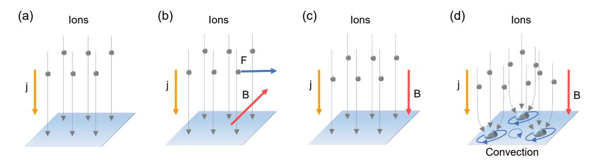
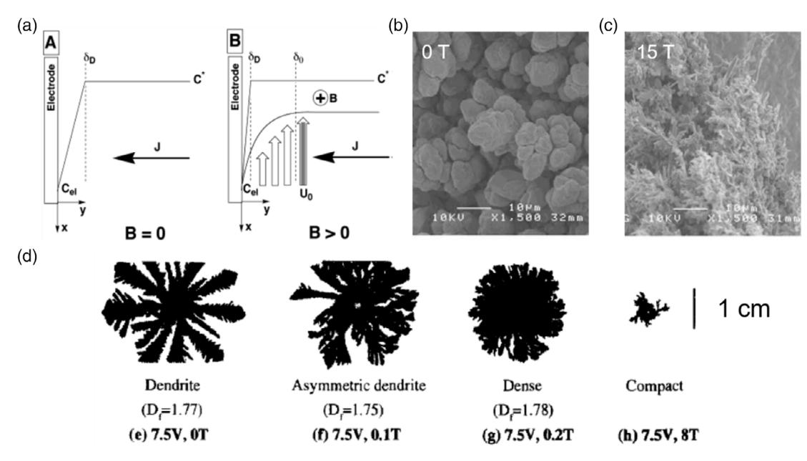
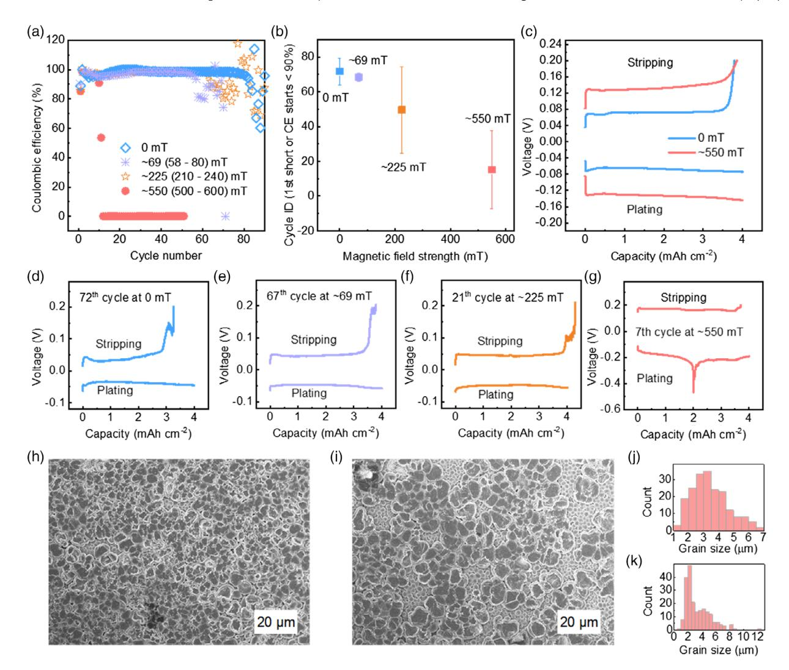
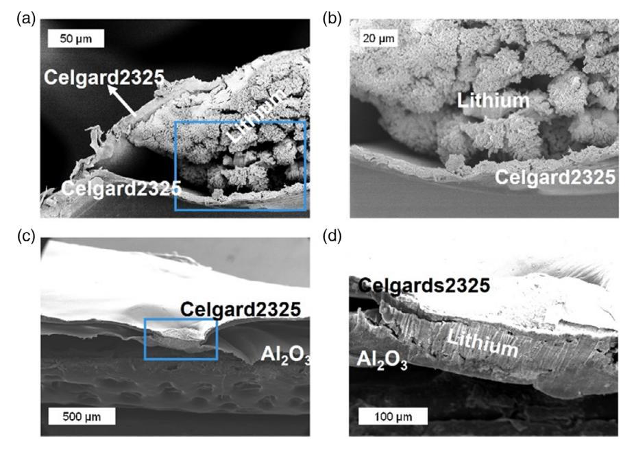
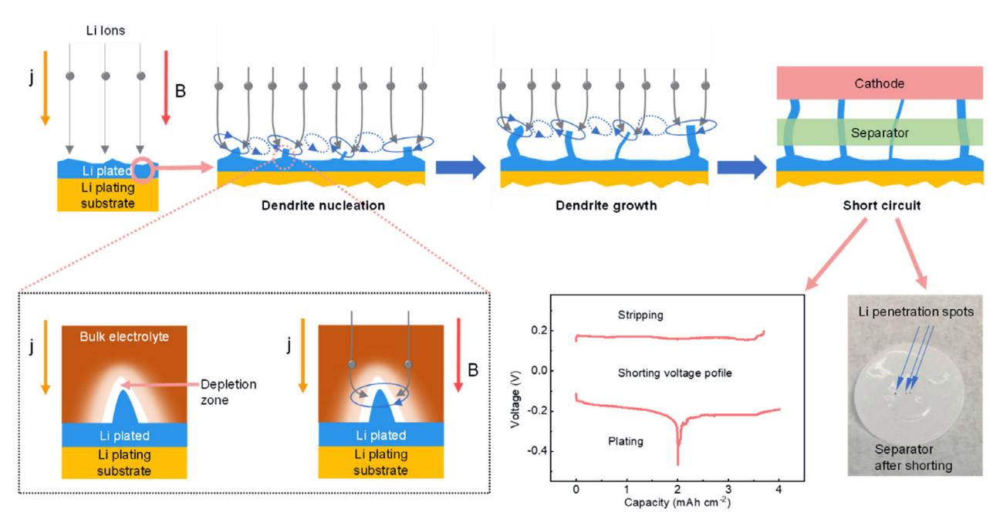

# A Perspective on the Behavior of Lithium Anodes under a Magnetic Field

Linghui Yu, Jiarui Wang, and Zhichuan J. Xu\*

Lithium metal-based rechargeable batteries, such as lithium–sulfur and lithium– air batteries, are promising next-generation batteries due to their high energy density. However, the use of lithium anode involves severe problems including poor cyclability and lithium dendrites-related safety issues. It is reported recently that the presence of magnetic field can improve the cyclability and prevent the growth of lithium dendrites. However, it is unclear how, in detail, magnetic field affects lithium anodes. Herein, a competition relationship is proposed for understanding magnetic effect on lithium anodes. Magnetic field induces multiple magnetohydrodynamic (MHD) effects in a cell. These effects include an uneven current distribution across the electrode, enhanced mass transport, and redistribution of lithium ions around lithium dendrites. While the first effect promotes dendritic growth, the latter two benefit preventing their growth. Thus, the first competes with the latter two. Herein, it is shown that uneven current distribution can be the domain effect. It leads to earlier short circuits caused by dendrites and shortens the cycle life of lithium anodes through a higher electrolyte decomposition rate. As it appears to be an emerging approach to improve the performance of lithium anodes and rechargeable batteries using magnetic field, challenges and opportunities are discussed.

#### severe problems including lithium dendrites-induced short circuits and poor cyclability caused by the continuous decomposition of electrolyte and generation of "dead lithium" upon cycling. It is reported recently that the presence of magnetic field can improve the cycling performance of lithium anodes and prevent the growth of lithium dendrites.[11–14] The improvement is probably related to the significant morphological change of the lithium plated. Typically, with the presence of magnetic field, the lithium plated becomes more uniform and denser, and the crystals become larger. These results make it very interesting to develop lithium metal-based rechargeable batteries using magnetic field. The change in morphology is attributed to the redistribution of lithium ions in magnetic field.[11,12] Although such a mechanism is applicable to the corresponding systems reported, further development requires a more thorough understanding of the effect of magnetic field on lithium anodes.

#### 1. Introduction

With the increasing demands on high-energy storage systems,[1–3] lithium metal-based batteries, such as lithium– sulfur and lithium–air batteries, have been a major research focus in the last decade, due to their high energy density.[4–10] However, the use of lithium anode in these batteries involves

Dr. L. Yu, J. Wang, Prof. Z. J. Xu School of Materials Science and Engineering Nanyang Technological University Singapore 639798, Singapore E-mail: [xuzc@ntu.edu.sg](mailto:xuzc@ntu.edu.sg) Dr. L. Yu, J. Wang, Prof. Z. J. Xu Singapore-HUJ Alliance for Research and Enterprise NEW-CREATE Phase II Campus for Research Excellence and Technological Enterprise (CREATE) Singapore 138602, Singapore Prof. Z. J. Xu Energy Research Institute@NTU, ERI@N Interdisciplinary Graduate School Nanyang Technological University Singapore 639798, Singapore

The ORCID identification number(s) for the author(s) of this article can be found under<https://doi.org/10.1002/sstr.202000043>.

#### DOI: 10.1002/sstr.202000043

#### 2. Effect of Magnetic Field on Electrochemical Processes

In fact, the effects of magnetic field on electrochemical processes have been intensively investigated.[15–17] The effects vary for different electrochemical systems. However, they originate mainly from the convection of electrolyte induced by the magnetic field.[16–20] Such effects are known as magnetohydrodynamic (MHD) effects. Under a magnetic field, the ions in the electrolyte moving through the field experience a force, which is known as the Lorentz force FL. The Lorentz force develops due to the interaction of the magnetic field B and the current density j

$$
F_{\rm L} = j \times B \tag{1}
$$

The force density FL is in N m3 when j is in A m2 and B is in tesla.

The force is only active when the field and the current flow are nonparallel, and it becomes the largest when they are orthogonal. This force creates a convective flow in the electrolyte.

For an ideal cell, the distribution of the current flowing through the electrode could be perfectly uniform, apart from

Figure 1. Schematic of convection of electrolyte under a magnetic field. Modified from the previous study.[15] a–c) Current distributes evenly in an ideal cell. a) Without a magnetic field, b) with a magnetic field perpendicular to the current flow, and c) with a magnetic field parallel to the current flow. d) Convections of electrolyte around surface protrusions under a magnetic field.

the edge, without the presence of a magnetic field (Figure 1a).[15] In this case, except the edge, the current may still distribute uniformly even under a uniform magnetic field (Figure 1b,c). This is because the ions in the same plane parallel to the electrodes experience the same Lorentz force. Such a case may only occur when the electrodes are perfectly smooth. However, practically, the electrode surface is inevitably nonuniform. In this case, the electric field near the surface becomes distorted, and ions prefer to move onto surface protrusions.[21,22] The current interacts with the magnetic field, and thus, there are electrolyte convections around the surface protrusions (Figure 1d).

MHD convection affects various ways in electrochemical processes. A major MHD effect is on mass transport. It is usually considered that the MHD convection reduces the diffusion layer thickness and enhances mass transport, Figure 2a.[18,20,23] As a result, it is often found that the presence of magnetic field can reduce the overpotential of electrochemical processes and improve the efficiency of the electrochemical processes.[24–27] Magnetic field can also tune the morphology of electrodeposits.[16,28,29] And the effect highly depends on electrochemical systems. For example, in a copper electrodeposition, increasing the field strength leads to the growth of dendrites (Figure 2b,c), which may be due to the ionic vacancies created by MHD flow that suppresses the active sites of nucleation.[30] Whereas in contrast, in a zinc dendrite growth condition, increasing the magnetic field strength transforms dendritic structure to a compact and dense structure (Figure 2d), which is ascribed to the enhanced mass transport.[31] Convective flow can be created around electrodeposited crystals locally. This may lead to the formation of chiral structures on the deposit surfaces.[32] Magnetic field can be beneficial to electrochemical processes involving gas bubble generation, for example, water electrolysis, and cobalt and nickel electrodeposition.[24,28,33] This is because the bubbles generated under magnetic field can be smaller, and the MHD effect induces

Figure 2. MHD effects in electrochemical processes. a) Schematic illustration of the mechanism of enhanced mass transport of a charged electroactive species under an applied magnetic field. Reproduced with permission.[20] Copyright 2004, American Chemical Society. b,c) Copper deposited using a cyclotron MHD electrode at 0 and 15 T, respectively.[30] d) Growth patterns of the zinc metal leaf in various magnetic fields. Reproduced with permission.[31] Copyright 1996, Elsevier.

hydrodynamic drag forces that sweep the bubbles away from the electrode surface.[28,33–35]

Apart from MHD convection, magnetic field may have additional effects during electrochemical processes. For example, polymerization of pyrrole is oriented under magnetic field. This is because aromatic ring of pyrrole generally has a large diamagnetic susceptibility perpendicular to the aromatic plane because of the diamagnetic ring current. Therefore, the ring is oriented parallel to the magnetic field during polymerization.[31]

#### 3. An Example of Magnetic Effects on Lithium Anode

Although the effects of magnetic field have been widely investigated in various electrochemical processes, as they differ in different systems, understanding the effects on lithium anodes requires further study. To contribute to such an understanding, we evaluated lithium plating at various field strengths. The magnetic field is parallel to the current flow. The schematic of a testing cell is shown in Figure S1, Supporting Information. Li/Cu cells were used as the testing cells. Copper was used as a substrate for lithium plating, whereas lithium was used as a source for lithium plating. In the tests, the lithium plating capacity was set at 4 mAh cm2 , and the plating and stripping currents were both set at 4 mA cm2 for all the cells. Every plating (on copper) process last 1 h, whereas the cutoff voltage for stripping (from copper) was 0.2 V. Four different strengths of magnetic field, i.e., 0 mT (no magnetic field), 69 mT, 225 mT, and 550 mT, were used for comparison. Multiple samples were tested at each strength (Figure S2, Supporting Information). Figure 3a shows the examples of the plating/stripping cyclability at the four strengths. We use coulombic efficiency (CE) to

Figure 3. Comparison of properties of lithium plating/stripping under various magnetic fields. a) Examples of lithium plating/stripping cyclability at four strengths of magnetic field. b) Cycle IDs of all the cells at which the CE starts to be lower than 90%, or there is the first short circuit even though the CE is higher than 90%. c) Lithium plating/stripping voltage profiles at 0 and 550 mT. Examples the voltage profile of the first shorting cycle at d) 0 mT, e) 69 mT, f ) 225 mT, and g) 550 mT. SEM image of the plated lithium at h) 0 mT and i) 550 mT. Histogram of grain size of lithium plated at j) 0 mT and k) 550 mT. Because the magnetic fields used were not perfectly uniform, the ranges of strength are indicated in (a).

indicate the reversibility of plating/stripping. A low CE means a high electrolyte decomposition rate and/or more "dead lithium" generation. Most of these cells have an initial CE between 80 and 90%. The CE of all the cells rises above 90% in the subsequent cycles. Afterward, once the CE falls below 90%, the cyclability fades fast. Short circuits happen near the cycle at which the CE starts to be lower than 90%. Here, we consider a drastic voltage drop or an obvious noisy voltage profile as a short circuit. Some examples are shown in Figure 3d–g. The occurrence of short circuits is because of lithium dendrites growing across the separator.

For better comparison, we plot the cycle IDs at which the CE starts to be lower than 90%, or there is the first short circuit even though the CE is higher than 90% (Figure 3b). The original data used are shown in Figure S2 and Table S1, Supporting Information. Such cycle IDs represent the cyclability of the cells. In general, increasing the strength of magnetic field results in an earlier short circuit and poorer cyclability. MHD effect helps enhance mass transport, and thus, it may reduce polarization. However, this is not the case here. The polarization is generally larger at 550 mT than at the other three strengths (Figure 3c–g). These results demonstrate that lithium anode can be negatively affected by magnetic field. The presence of a magnetic field can shorten the cycle life of lithium anodes and promote the growth of lithium dendrites, which leads to short circuits.

To understand why there is such a phenomenon, we analyzed the morphology of the lithium plated. Figure 3h,i shows the scanning electron microscopy (SEM) images of the lithium plated at 0 and 550 mT. The morphology of the lithium at 0 mT looks much more uniform than at 550 mT. Histograms of the lithium grain size are shown in Figure 3j,k. At 0 mT, the mean grain size is centered at 3.5 μm and distributes smoothly, whereas small grains with the size less than 2.5 μm are a major composition at 550 mT. The grain size depends on the plating overpotential/current density.[14,36] A higher plating overpotential/current density leads to smaller grains. Thus, the nonuniform morphology of the plated lithium at 550 mT indicates that the convection of electrolyte induces an uneven current distribution. This is because the MHD affects local mass transport, giving rise to a nonuniform distribution of lithium ions. This results in different overpotentials in different regions, leading to an uneven current distribution across the electrode. Uneven current distribution leads to uneven lithium plating. It causes different crystal growth rates in different regions and promotes the growth of lithium dendrites, as dendrites tend to grow in fast-plating regions. On the other hand, uneven current distribution also means an uneven consumption of the electrolyte in different parts of the cell. This may result in a fast consumption of the electrolyte in parts of the cell, which leads to poorer cyclability. The larger polarization at 550 mT observed above is an indication of fast consumption of electrolyte, as the electrolyte decomposition rate increases upon reducing the plating potential.

To investigate the morphology of dendrites, we applied continuous, one direction plating at a current of 4 mA cm2 on copper to induce dendrites. The separator was collected after shorting. We intended to analyze dendrite penetration regions using SEM. However, as shown in Figure S3a, Supporting Information, it is difficult to find where the dendrite penetration regions were as we were not able to visibly find dendrites on the separator. This raises the difficulty to prepare samples for SEM analysis. A trilayer-separator cell (Figure S4, Supporting Information) was used to overcome such a problem. The cell contained three layers of separator, where an Al2O3 film was sandwiched between two layers of Celgard2325 separator. The Al2O3 film has a thickness of less than 1 μm (Figure S5, Supporting Information) and is composed of 40 wt% of Al2O3 and 60 wt% of polyvinylidene difluoride (PVDF). On the separators collected after shorting, lithium penetration spots can be clearly found (Figure S3b, Supporting Information). This allowed us to cut across the lithium penetration spots for the SEM crosssectional analysis.

A cross section of Celgard2325 separator collected from a trilayer-separator cell after short circuit at 0 mT is shown in Figure 4a,b. It is surprising that the separator was split into two layers at the dendrite penetration spot. Lithium is sandwiched between the two layers. This means that the growth of lithium dendrites can destroy the separator instead of only penetrating the pores of separator. In general, the lithium is composed of particles with irregular shapes rather than filament-like structures. A top-view SEM image of a lithium penetration spot of the Al2O3 film is shown in Figure S6 and S7, Supporting Information. The lithium on the Al2O3 film is also irregularshaped, similar with that sandwiched between the Celgard2325 separator (Figure 4a,b). Figure 4c,d shows a cross section of the Celgard2325 separator and the Al2O3 film collected from a trilayer-separator cell after a short circuit at 550 mT. At the lithium penetration spot, the Celgard2325 separator and the Al2O3 film stick together by the lithium. Bulk lithium over several hundreds of micrometers large is observed. It is not likely that lithium dendrites punctured and destroyed the separator over such a wide area. This is because both the Al2O3 film and the Celgard2325 separator keep well at the lithium penetration spot according to the SEM images. Thus, the lithium dendriteinduced short circuit in this case is also due to the penetration of lithium dendrites through pores of separators. The bulk morphology is possibly caused by cutting, because lithium is soft and, thus, is easy to deform during cutting.

#### 4. Competition Relationship between Multiple MHD Effects

A lithium dendrite growth process is schematically summarized in Figure 5. MHD convection introduces multiple effects in the cell. First, upon lithium plating, there are convective flows around the lithium crystals plated due to the interaction between the current and the field. As the lithium crystals are inevitably nonuniform, the convections differ in different regions. Therefore, the mass transport enhanced by the convections varies in different regions of the electrode. This gives rise an uneven current distribution across the electrode, which leads to different plating rates in different regions. This promotes the growth of lithium dendrites, as dendrites tend to grow in fast-plating regions. Second, dendritic growth is often considered to start when the current exceeds the limiting value. Beyond such a current, the ions, in the electrolyte near the electrode surface, depleted during plating are unable to be replenished from the

Figure 4. Lithium dendrite penetration across the separators in a trilayer-separator cell. a) SEM image of cross section of a lithium penetration spot on Celgard2325 separator at 0 mT. b) Magnified image of the blue box region in (a). c) SEM image of cross section of a lithium penetration spot on Al2O3 film and Celgard2325 separators at 550 mT. d) Magnified image of the blue box region in (c).

Figure 5. Schematic of the lithium dendrite growth process.

bulk solution due to diffusion limitation.[37–40] The presence of MHD convections reduces the diffusion layer thickness and enhances mass transport, and thus increases the limiting current.[15] This is beneficial to prevent dendritic growth. Third, when a dendrite starts to grow, lithium ions prefer to deposit on the tip of the dendrite due to the distorted electric

field.[11,37–40] With the presence of MHD convections, lithium ions are redistributed, as they move around the dendrite. Therefore, the ion amount moving onto the tip is reduced.[11] This may also help preventing dendritic growth. During lithium plating, the first effect competes with the latter two. In our case, the overall MHD effect is negative. Uneven current distribution

is the domain MHD effect. It also shortens the cycle life of lithium anodes through a higher electrolyte decomposition rate. Dendrite-induced short circuit is caused by the penetration of dendrites through the pores of separator. However, we also directly observed that the separator can be destroyed by the growth of lithium dendrites.

We realize that our result is against previous reports where magnetic field is shown to prevent the growth of lithium dendrites.[11–14] However, as MHD effects compete with each other and differ in different electrochemical systems, the different results could be simply due to the different testing conditions. Therefore, to further understand how magnetic field affects lithium anodes, more work is necessary, for example, using different current densities, different electrolytes, different substrates, and different magnetic field orientations/strengths.

#### 5. Conclusion and Outlook

We showed a possibility that the magnetic field can negatively affect lithium anodes. However, most reports show that both the poor cyclability and dendrite issues of lithium anodes can be largely overcome using a magnetic field.[11–14] As it appears to be an emerging approach to use magnetic field to improve lithium anodes and rechargeable batteries, it brings both challenges and opportunities, including as follows.

1) Comprehensive understanding on the effect of the external magnetic field on lithium anodes. From both fundamental and application points of view, it is necessary to gain comprehensive understanding on the effect. Although it has been intensively investigated in various electrochemical processes, the effect always behaves differently in a new system. A start for comprehensive understanding will be acquiring the behaviors of lithium anodes under various parameters, in terms of the charging/ discharge method, electrolyte, plating substrate, magnetic field orientation/strength, and so on. Tremendous work will be required for this. Particular attention may need to be paid on evaluation using various kinds of electrolytes and different magnetic field orientations/strengths. This is because, on the one hand, the CE of lithium anodes largely depends on electrolyte without the presence of magnetic field; on the other hand, field orientation and strength determine the MHD effect directly. 2) Quantification of the relationship between multiple MHD effects. A key for in-depth understanding of the effect of magnetic field is quantifying the relationship between the multiple MHD effects. This is very challenging because of the difficulty to isolate multiple effects from each other during evaluation. It will require advanced experimental designs and analysis methodologies. 3) Simulation on electrochemical mass transfer. Simulation on electrochemical mass transfer is helpful for understanding magnetic effect and beneficial to further development. Two simulation models for lithium plating have been reported with the consideration of the distorted electric field and Lorentz force. Both models are based on a single protrusion.[11,12] Such models are relatively simple. To improve the model, more parameters that affect nucleation and electric/ magnetic field distribution will need to be considered, including surface roughness of plating substrate, surface energy, local overpotential (or current), and field redistribution caused by neighbor crystals deposited. 4) Magnetic effect on other metal anodes. As many other metal anodes have the same cyclability and dendrite problems with lithium anodes, such as sodium, potassium, and zinc, it may be very interesting to improve those anodes using magnetic field. Therefore, studies may need to be extended to those anodes. 5) Magnetic effect on non-metal electrodes. Magnetic field may be possibly used to improve the performance of non-metal electrodes in rechargeable batteries, because MHD convections can enhance mass transport. However, enhancement in mass transport does not guarantee enhanced kinetics as shown in our work. The effect will be very different from metal anodes, because no metal nucleation involved for those electrodes. Major focus will need to be on the difference of local overpotential (or current) created by MHD convections. This is because overpotential is the driving force that determines the rate of electrolyte decomposition and redox reaction. As those electrodes are typically composed of particles, how the particle shape affects the field distribution shall also be studied. 6) For practical applications, identifying the conditions that are feasible and beneficial is critical. While working on searching for such conditions, the differences between practical and evaluation cells that lead to derivations must be aware. One major difference perhaps is the excessive electrolyte, which is usually used to ensure a sufficient filling of electrolyte in the electrodes and separator in testing coin cells in most research laboratories.[41,42] Other differences include voltage range, current density, and charging/discharging methods. In addition, it is important to find out an ideal way to introduce a magnetic field into the cell. Also, when magnetic field is used, safety concerns may raise on field emission.[43–45] Thus, magnetic shielding techniques will be required.

# 6. Experimental Section

The schematic of a cell for cycling test is shown in Figure S1, Supporting Information. Copper (ϕ12.5–14.3 mm) was used as a working electrode. A lithium disc (ϕ6 mm) was used as a counter electrode. The electrolyte was 10 μL of 1 M LiTFSI/1 M LiNO3 in 1,2-dimethoxyethane (DME) for each test. Celgard2325 was used as a separator. A trilayer-separator cell (schematic shown in Figure S6, Supporting Information) was used for short circuit test. The cell contained three layers of separator, where an Al2O3 film was sandwiched between two layers of Celgard2325 separator. The components were sealed in a coin cell 2032 with 20 μL of 1 M LiTFSI/1 M LiNO3 in a glove box filled with Ar. The Al2O3 film contained 40 wt% of Al2O3 (50 nm, Yueci Electronic Technology Co., Ltd) and 60 wt% of PVDF and was prepared by casting an Al2O3 and PVDF slurry in N-methyl-2-pyrrolidone (NMP) onto glass followed by drying at 60 C overnight.

The magnetic field was generated using different parallel magnets. For testing under a magnetic field, the coin cells were sandwiched between two magnets. The strength of the magnetic field was measured by a Tunkia Tesla meter. Due to the magnetic fields were not perfectly uniform, the strengths were in a range, which is indicated in the figures. Galvanostatic cycling was performed using the Neware battery tester. The microscopes used were the JOEL JSM-6340F and 7800F microscopes.

# Supporting Information

Supporting Information is available from the Wiley Online Library or from the author.

## Acknowledgements

Authors thank the Facility for Analysis, Characterization, Testing and Simulation (FACTS) at the Nanyang Technological University for materials characterizations. This research was supported by the National Research Foundation, Prime Minister's Office, Singapore, under its Campus for Research Excellence and Technological Enterprise (CREATE) program. The work was partially supported by the Singapore Ministry of Education Tier 2 Grants (MOE2018-T2-2-027) and Tier 1 grant (2019-T1-002-125).

## Conflict of Interest

The authors declare no conflict of interest.

#### Keywords

battery safety, lithium anodes, lithium dendrites, lithium metal batteries, magnetic fields

- Received: July 19, 2020
- Revised: August 27, 2020
- Published online: October 7, 2020
- [1] W. Liu, P. Oh, X. Liu, M.-J. Lee, W. Cho, S. Chae, Y. Kim, J. Cho, Angew. Chem., Int. Ed. 2015, 54, 4440.
- [2] D. Lin, Z. Lu, P.-C. Hsu, H. R. Lee, N. Liu, J. Zhao, H. Wang, C. Liu, Y. Cui, Energy Environ. Sci. 2015, 8, 2371.
- [3] L. H. Yu, Y. Jin, Y. S. Lin, RSC Adv. 2016, 6, 40002.
- [4] X. Ji, K. T. Lee, L. F. Nazar, Nat. Mater. 2009, 8, 500.
- [5] P. G. Bruce, S. A. Freunberger, L. J. Hardwick, J.-M. Tarascon, Nat. Mater. 2012, 11, 19.
- [6] X.-B. Cheng, J.-Q. Huang, Q. Zhang, J. Electrochem. Soc. 2018, 165, A6058.
- [7] J. Lu, Y. Jung Lee, X. Luo, K. Chun Lau, M. Asadi, H.-H. Wang, S. Brombosz, J. Wen, D. Zhai, Z. Chen, D. J. Miller, Y. Sub Jeong, J.-B. Park, Z. Zak Fang, B. Kumar, A. Salehi-Khojin, Y.-K. Sun, L. A. Curtiss, K. Amine, Nature 2016, 529, 377.
- [8] L. Yu, J. Song, L. P. Wang, S. J. H. Ong, C. Gu, H. Liao, T. Wang, W. Chen, O. Lev, Z. J. Xu, J. Electrochem. Soc. 2019, 166, A3570.
- [9] B. Liu, Y. Zhang, Z. Wang, C. Ai, S. Liu, P. Liu, Y. Zhong, S. Lin, S. Deng, Q. Liu, G. Pan, X. Wang, X. Xia, J. Tu, Adv. Mater. 2020, 32, 2003657.
- [10] L. Huang, J. Li, B. Liu, Y. Li, S. Shen, S. Deng, C. Lu, W. Zhang, Y. Xia, G. Pan, X. Wang, Q. Xiong, X. Xia, J. Tu, Adv. Funct. Mater. 2020, 30, 1910375.
- [11] K. Shen, Z. Wang, X. Bi, Y. Ying, D. Zhang, C. Jin, G. Hou, H. Cao, L. Wu, G. Zheng, Y. Tang, X. Tao, J. Lu, Adv. Energy Mater. 2019, 9, 1900260.
- [12] A. Wang, Q. Deng, L. Deng, X. Guan, J. Luo, Adv. Funct. Mater. 2019, 29, 1902630.
- [13] J. Dong, H. Dai, C. Wang, C. Lai, Solid State Ionics 2019, 341, 115033.
- [14] Y. Huang, X. Wu, L. Nie, S. Chen, Z. Sun, Y. He, W. Liu, Solid State Ionics 2020, 345, 115171.
- [15] L. M. A. Monzon, J. M. D. Coey, Electrochem. Commun. 2014, 42, 38.
- [16] T. Z. Fahidy, Prog. Surf. Sci. 2001, 68, 155.
- [17] T. S. Gregory, R. Cheng, G. Tang, L. Mao, Z. T. H. Tse, Adv. Funct. Mater. 2016, 26, 3942.
- [18] G. Hinds, J. M. D. Coey, M. E. G. Lyons, Electrochem. Commun. 2001, 3, 215.
- [19] D. Fernández, J. M. D. Coey, Electrochem. Commun. 2009, 11, 379.
- [20] O. Lioubashevski, E. Katz, I. Willner, J. Phys. Chem. B 2004, 108, 5778.
- [21] P. Zou, Y. Wang, S.-W. Chiang, X. Wang, F. Kang, C. Yang, Nat. Commun. 2018, 9, 464.
- [22] C.-P. Yang, Y.-X. Yin, S.-F. Zhang, N.-W. Li, Y.-G. Guo, Nat. Commun. 2015, 6, 8058.
- [23] G. Hinds, F. E. Spada, J. M. D. Coey, T. R. Ní Mhíocháin, M. E. G. Lyons, J. Phys. Chem. B 2001, 105, 9487.
- [24] T. Iida, H. Matsushima, Y. Fukunaka, J. Electrochem. Soc. 2007, 154, E112.
- [25] F. M. F. Rhen, J. M. D. Coey, J. Phys. Chem. C 2007, 111, 3412.
- [26] Z. Lu, D. Huang, W. Yang, J. Congleton, Corros. Sci. 2003, 45, 2233.
- [27] F. M. F. Rhen, D. M. Fernandez, G. Hinds, J. M. D. Coey, J. Electrochem. Soc. 2006, 153, J1.
- [28] M. Uhlemann, A. Krause, J. P. Chopart, A. Gebert, J. Electrochem. Soc. 2005, 152, C817.
- [29] A. Franczak, A. Levesque, F. Bohr, J. Douglade, J.-P. Chopart, Appl. Surf. Sci. 2012, 258, 8683.
- [30] M. Miura, Y. Oshikiri, A. Sugiyama, R. Morimoto, I. Mogi, M. Miura, S. Takagi, Y. Yamauchi, R. Aogaki, Sci. Rep. 2017, 7, 45511.
- [31] I. Mogi, M. Kamiko, J. Cryst. Growth 1996, 166, 276.
- [32] I. Mogi, R. Aogaki, R. Morimoto, K. Watanabe, ECS Trans. 2013, 45, 1.
- [33] O. Devos, A. Olivier, J. P. Chopart, O. Aaboubi, G. Maurin, J. Electrochem. Soc. 1998, 145, 401.
- [34] J. A. Koza, M. Uhlemann, A. Gebert, L. Schultz, Electrochem. Commun. 2008, 10, 1330.
- [35] J. A. Koza, S. Mühlenhoff, P. Żabi´nski, P. A. Nikrityuk, K. Eckert, M. Uhlemann, A. Gebert, T. Weier, L. Schultz, S. Odenbach, Electrochim. Acta 2011, 56, 2665.
- [36] D. Aurbach, E. Zinigrad, Y. Cohen, H. Teller, Solid State Ionics 2002, 148, 405.
- [37] M. D. Tikekar, S. Choudhury, Z. Tu, L. A. Archer, Nat. Energy 2016, 1, 16114.
- [38] J. Zhao, L. Sun, S. Canepa, H. Sun, M. N. Yesibolati, M. Sherburne, R. Xu, T. Sritharan, J. S. C. Loo, J. W. Ager Iii, J. Barber, K. Mølhave, Z. J. Xu, J. Mater. Chem. A 2017, 5, 11905.
- [39] P. Bai, J. Li, F. R. Brushett, M. Z. Bazant, Energy Environ. Sci. 2016, 9, 3221.
- [40] H. J. S. Sand, Philos. Mag. 1901, 1, 45.
- [41] L. Yu, L. P. Wang, H. Liao, J. Wang, Z. Feng, O. Lev, J. S. C. Loo, M. T. Sougrati, Z. J. Xu, Small 2018, 14, 1703338.
- [42] A. Bhargav, J. He, A. Gupta, A. Manthiram, Joule 2020, 4, 285.
- [43] H. Lv, Z. Yang, P. L. Wang, G. Ji, J. Song, L. Zheng, H. Zeng, Z. J. Xu, Adv. Mater. 2018, 30, 1706343.
- [44] B. Quan, W. Shi, S. J. H. Ong, X. Lu, P. L. Wang, G. Ji, Y. Guo, L. Zheng, Z. J. Xu, Adv. Funct. Mater. 2019, 29, 1901236.
- [45] Z. Bi, T. Kan, C. C. Mi, Y. Zhang, Z. Zhao, G. A. Keoleian, Appl. Energy 2016, 179, 413.