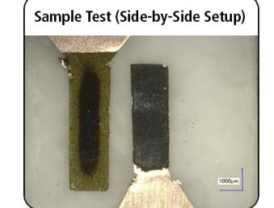
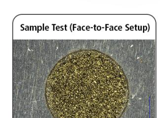
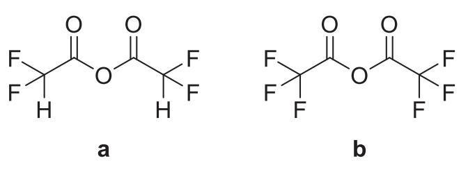
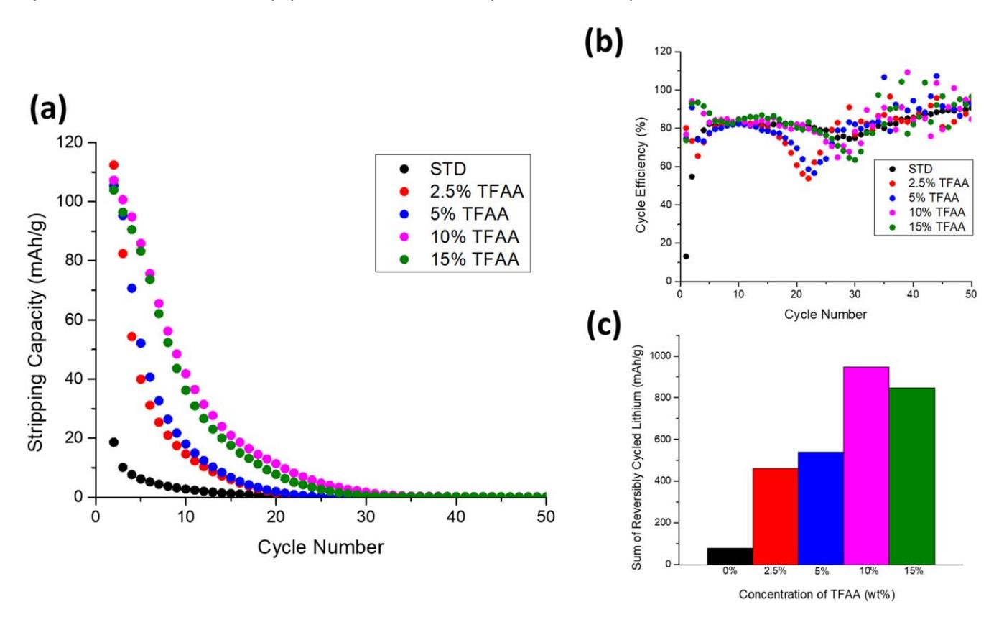
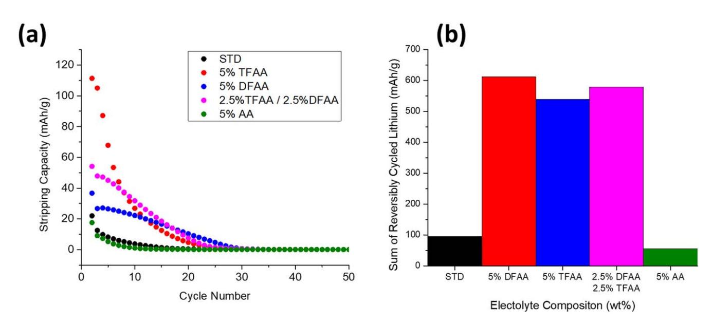
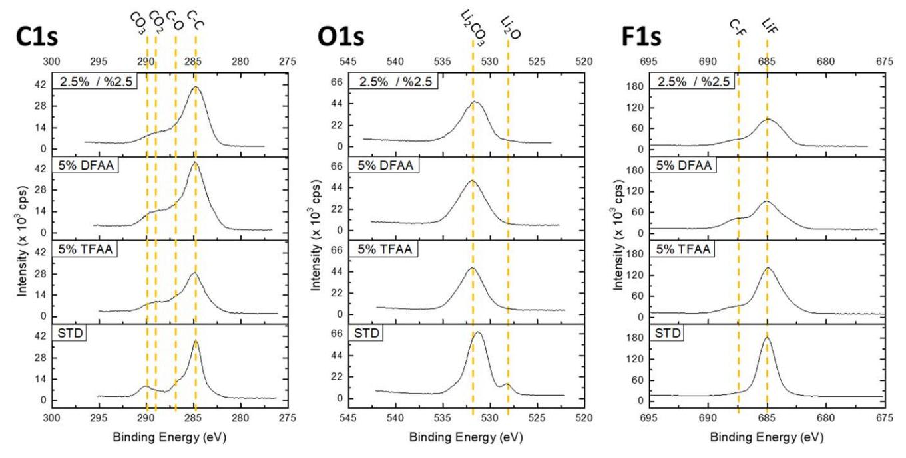
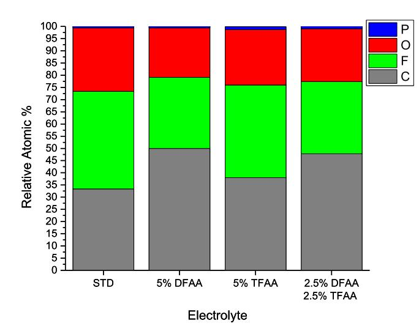
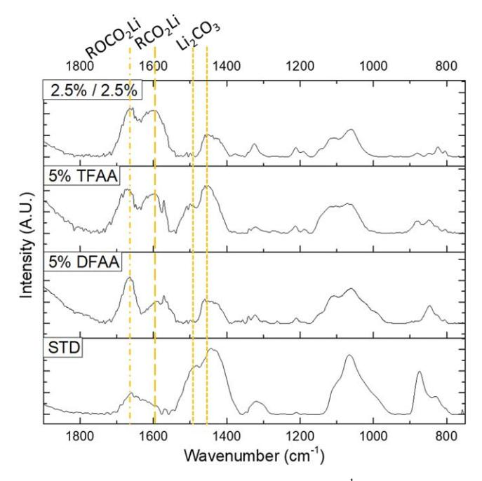

## **OPEN ACCESS**

# Fluorinated Acetic Anhydrides as Electrolyte Additives to Improve Cycling Performance of the Lithium Metal Anode

To cite this article: Satu Kristiina Heiskanen and Brett L. Lucht 2020 J. Electrochem. Soc. 167 110506

View the [article online](https://doi.org/10.1149/1945-7111/aba079) for updates and enhancements.

# You may also like

- [The Synthesis of Diaryliodonium Salts by](https://iopscience.iop.org/article/10.1149/1.1353574) [the Anodic Oxidation of Aryl Iodide/Arene](https://iopscience.iop.org/article/10.1149/1.1353574) [Mixtures](https://iopscience.iop.org/article/10.1149/1.1353574) -
- Martin J. Peacock and Derek Pletcher [Effect of pH and acetic anhydride](https://iopscience.iop.org/article/10.1088/1755-1315/1107/1/012124) -
- [concentration on physicochemical](https://iopscience.iop.org/article/10.1088/1755-1315/1107/1/012124) [characteristics of acetylated sago starch](https://iopscience.iop.org/article/10.1088/1755-1315/1107/1/012124) A Rahim, Mahfudz, Muhardi et al.
- [E-MSLDNet: a dual-enhanced network](https://iopscience.iop.org/article/10.1088/1361-6501/adffa3) [with edge-aware and multiscale feature](https://iopscience.iop.org/article/10.1088/1361-6501/adffa3) [fusion for precision landslide detection in](https://iopscience.iop.org/article/10.1088/1361-6501/adffa3) [complex terrain](https://iopscience.iop.org/article/10.1088/1361-6501/adffa3) Xingwang Zhao, Xingya Cao, Jingyu Yang et al. -

# **Fluorinated Acetic Anhydrides as Electrolyte Additives to Improve Cycling Performance of the Lithium Metal Anode**

Satu Kristiina Heiskanen\* and Brett L. Luchtz,\*\*

University of Rhode Island, Department of Chemistry, Kingston, Rhode Island 02881-2003, United States of America

The investigation of novel fluorinated electrolyte additives for lithium metal anodes has been conducted. Two acetic anhydride derivatives, difluoroacetic anhydride (DFAA) and trifluoroacetic anhydride (TFAA), were investigated in electrolytes composed of LiPF6 in ethylene carbonate (EC) and ethyl methyl carbonate (EMC). The addition of either DFAA or TFAA results in a significant improvement in capacity retention and reversibility of lithium plating. Ex situ surface analysis (XPS, IR-ATR) suggests that incorporation of either TFAA or DFAA results in a lithium carboxylate rich SEI which in turn inhibits SEI degradation resulting in superior cycling performance.

© 2020 The Author(s). Published on behalf of The Electrochemical Society by IOP Publishing Limited. This is an open access article distributed under the terms of the Creative Commons Attribution 4.0 License (CC BY, http://creativecommons.org/licenses/ by/4.0/), which permits unrestricted reuse of the work in any medium, provided the original work is properly cited. [DOI: 10.1149/ 1945-7111/aba0791  $\odot$ 

Manuscript submitted May 26, 2020; revised manuscript received June 15, 2020. Published July 2, 2020.

Improvements in the reversibility of the plating and stripping of lithium metal in carbonate-based electrolytes has drawn significant interest. $1-3$  Lithium metal as an anode has the potential to increase the anodic capacity of lithium batteries up to 3860 mAh  $g^{-1.4}$ However, the practical application of the lithium metal anode especially in carbonate electrolytes is severely hindered by dendrite growth as well as the formation of electronically isolated lithium metal domains.5 Furthermore, the inherent volume change of the anode material leads to mechanical stress resulting in fracturing of the solid electrolyte interphase (SEI) and allowing for continuous electrolyte reduction. The use of electrolyte additives can help to significantly limit the severity of these detrimental reactions.

The composition of carbonate based electrolytes (solvents, salt, and additives) can have a large influence on both the composition and morphology of the SEI and the plating and stripping efficiencies. $6-9$  Some examples of additives which have been investigated for lithium metal anodes in carbonate electrolytes include fluoroethylene carbonate (FEC),  $^{10-12}$  vinylene carbonate  $(VC)$ ,12,13 and lithium difluorooxalato borate (LiDFOB).14–16 These additives are thought to improve performance by forming a more elastic or more stable SEI on the surface of the lithium metal and improve the plating behavior of the lithium metal. Fluorinated electrolyte additives such as FEC and LiDFOB increase the amount of LiF in the SEI and the presence of nanostructured LiF has been reported to improve the uniformity of lithium metal plating.10,14

In this study, we investigate two fluorinated acetic anhydride derivatives, difluoroacetic anhydride (DFAA) and trifluoroacetic anhydride (TFAA) as electrolyte additives. Due to the presence of fluorine in the additive, we expected to observe improved performance from the generation of LiF. The performance of several electrolyte formulations containing DFAA and TFAA has been investigated electrochemically in Cu||LiFePO4 cells and by ex situ surface analysis of the plated lithium metal. The benefit of using a  $Cu||LiFePO4 cell composition is that the lithium metal anode is$ generated in situ preventing premature reaction of the electrolyte with the lithium metal anode. In addition, Cu||LiFePO4 cells contain a limited amount of lithium metal compared to a lithium foil making the cells more sensitive to changes in the electrolyte.13,14 This investigation reveals that both TFAA and DFAA improve the reversibility of lithium plating in carbonate electrolyte, and ex situ surface analysis of the plated lithium metal electrodes by X-ray Photoelectron Spectroscopy (XPS) and infra-red with attenuated total reflectance (IR-ATR) suggesting that the additives increase the stability of the SEI to the electrolyte solvents.

#### Experimental

Coin cells (CR2032) were assembled in an argon filled glovebox ( $<1$  ppm H2O) with a crimping pressure of 1500 psi. Single-sided lithium iron phosphate (LiFePO4, LFP) cathodes (91% active material, 9% PVdF binder and conductive carbon, 12 mg  $\text{cm}^{-2}$ loading of active material) were obtained from MTI Corporation, cut outside the glovebox and then dried under vacuum overnight at 110  $^\circ$ C prior to cell assembly. Copper foil current collectors for the anode were cut from copper foil obtained from MTI Corporation which was cleaned with a 1-minute sonication in 1 M HCl, followed by subsequent 1-minute sonication in two portions of isopropanol and under vacuum overnight at 110  $^{\circ}$ C prior to cell assembly. The cells were constructed with Cu foil as the anode side current collector (15 mm), two Celgard 2325 separators (19 mm), LFP cathode material (13.7 mm), and 100  $\mu$ l of electrolyte.

Cycling was conducted on an Arbin Instruments BT2000 battery cycler at 25°C. The cycling procedure consisted of plating Li metal at 0.1 mA cm $-2$  (approx. C/20 rate, where C represents the theoretical capacity of  $LiFePO4$ ) with subsequent stripping and plating at  $0.4 \text{ mA cm}^{-2}$  (approx. C/4 rate), within a voltage window of 2.0-4.0 V. There was a rest period of one hour between cell construction and the beginning of the cycling protocol.

Electrolytes investigated were all based on a 1.2 M  $\text{LiPF}_6$  in EC: EMC (3:7) obtained from BASF (standard electrolyte, STD). Trifluoroacetic anhydride (99+%, Acros, TFAA), difluoroacetic anhydride (98+%, TCI America, DFAA), and acetic anhydride (99%+, Alfa Aesar, AA) were used without further purification. DFAA concentrations of 0.5%, 1%, 2.5%, and 5%, TFAA concentrations of 2.5%, 5%, 10%, and 15%, as well as a mixture of  $2.5\%$ each of DFAA and TFAA were prepared in an argon-filled glovebox and stirred on a magnetic stir plate for two days before use.

XPS measurements were conducted with a Thermo-Fisher k-Alpha spectrometer utilizing aluminum  $k\alpha$  radiation ( $h\nu$  = 1486.6 eV) under ultra-high vacuum conditions ( $< 1 \times 10^{-12}$  atm) with a measured spot size of 400  $\mu$ m. Lithium metal was deposited onto Cu foil according to the first charge procedure outlined in the electrochemistry section (charge to  $4.0 \text{ V}$  at C/20 rate, stripped at C/ 4 rate, and again plated at  $C/4$  rate) and held at rest for approximately 4 h to allow equilibration before disassembly in an argon-filled glovebox. Electrodes were washed with  $3 \times 500 \mu l$ extra dry dimethyl carbonate (99+%, Acros, DMC) and dried under vacuum overnight. Samples were transferred into to the instrument with a vacuum transfer stage module to avoid exposure to air. The binding energy was corrected based on the F1s spectrum, assigning LiF to  $685 \text{ eV}$ .

IR-ATR spectra were obtained on a Bruker Tensor 27, using a Pike MIRacle horizontal ATR accessory equipped with a diamond/

 \*Electrochemical Society Student Member.

**\*\***Electrochemical Society Member.

&lt;sup>zE-mail: blucht@uri.edu

ZnSe crystal in a nitrogen-filled glovebox to prevent oxygen and water exposure of the samples. There is no evidence of nitrogen reacting with the plated lithium within the timeframe of measurement. Background and sample spectra were obtained with 256 scans for ATR spectra and a resolution of  $4 \text{ cm}^{-1}$ . Atmospheric compensation routines for both water and carbon dioxide were used to remove or reduce remaining interferences.

#### **Results and Discussion**

Two fluorinated compounds, difluoroacetic anhydride (DFAA, Fig. 1a) and trifluoroacetic anhydride (TFAA, Fig. 1b), were investigated as electrolyte additives for improving the cycling performance of Cu||LiFePO4 cells. The concentration of DFAA was varied from 0.5 to 5 wt $%$ , to determine the optimal concentration of the additive for improving the reversibility of lithium plating and stripping. Cycling performance of these cells is shown in Fig. 2. The first cycle stripping capacity (Fig. 2a) was improved for all concentrations of DFAA, with the cell containing 1% DFAA having the highest first cycle stripping capacity of 100 mAh  $g^{-1}$ . However, the optimal concentration for the sum of reversibly cycled lithium (Fig. 2c) over the first 50 cycles was determined to be  $2.5\%$  DFAA by weight. The sum of reversibly cycled lithium was improved to 800 mAh  $g^{-1}$ , compared to 80 mAh  $g^{-1}$  observed for the standard electrolyte formulation. The improved reversibility is consistent with a more efficient plating and stripping mechanism. Overall, the addition of difluoroacetic anhydride results in an almost fivefold increase in the initial stripping capacity as well as a tenfold increase in the sum of reversibly cycled lithium.

The cycling performance of Cu||LiFePO4 cells was also investigated in the presence of trifluoroacetic anhydride (TFAA) as shown in Fig. 3. The initial stripping capacity and capacity retention are improved by addition of TFAA. However, the performance improvements are observed at higher concentrations of TFAA than were observed for DFAA. While the initial stripping capacity is improved fivefold, from 19 mAh  $g^{-1}$  to ~105 mAh  $g^{-1}$  for all concentrations of TFAA investigated, the best capacity retention is observed for cells containing 10% TFAA (Fig. 3a). The sum of reversibly cycled lithium is increased more than tenfold from 78 mAh  $g^{-1}$  to 946 mAh  $g^{-1}$  for cells containing 10% TFAA (Fig. 3c). In an effort to confirm the importance of the fluorination of TFAA and DFAA, Cu||LiFePO4 cells were prepared with  $2.5\%$  and  $5\%$ acetic anhydride (AA). The capacity retention and cycling performance were nearly identical to that for cells cycled with the standard electrolyte (Fig. 4), confirming the importance of fluorination for performance improvements.

Considering that the reversibility of lithium plating and the initial stripping capacities are higher in the cells cycled with electrolyte containing TFAA and the rate of capacity loss is lower in cells cycled with DFAA, a synergistic effect of the two additives was investigated using an electrolyte containing 2.5% by weight of both DFAA and TFAA. The stripping capacities and sum of reversibly cycled lithium is shown in Fig. 4. While the combination of additives provides good overall performance, the combination does not outperform the best single additive formulation. The combination of 2.5% DFAA and 2.5% TFAA has better initial stripping capacity than 5% DFAA although it is still lower than 5% TFAA (Fig. 4a). The combination of additives provides a comparable sum of reversibly cycled lithium over the first 50 cycles (Fig. 4b). The highest sum of reversibly cycled lithium is for the cell containing 5% DFAA (611 mAh  $g^{-1}$ ) followed by the combination of 2.5% DFAA and 2.5% TFAA (579 mAh  $g^{-1}$ ) and the cell 5% TFAA has the lowest sum of reversibly cycled lithium (538 mAh  $g^{-1}$ ). Unfortunately, the combination of additives does not result in an improvement in performance over the single additives.

In order to understand the source of the observed electrochemical improvements, the surface films formed on the lithium metal anodes have been investigated by XPS. The C1s, O1s and F1s spectra of the lithium plated in STD, 5% DFAA, 5% TFAA and 2.5% DFAA  $+$ 

Figure 1. Chemical structures of (a) difluoroacetic anhydride (DFAA) and (b) trifluoroacetic anhydride (TFAA).

2.5% TFAA electrolytes are provided in Fig. 5. Interestingly, the C1s, O1s and F1s spectra are similar for the lithium metal anodes plated in the presence of 5% DFAA, 5% TFAA, or 2.5% of DFAA and TFAA after the second plating. However, there are some small variations in SEI composition between the different electrolytes, consistent with the observed performance differences. The C1s spectra contain peaks corresponding to  $-CO_3$  at 290.1 eV,  $-CO_2$  at 289.0, C–O at 286.7 eV and C–C/C–H at 285.0 eV consistent with the generation of RCO2Li, ROCO2Li and Li2CO3. The peaks characteristic of lithium carboxylates ( $-CO2Li$ ) at 289.0 eV are stronger for the cells containing either TFAA or DFAA, consistent with reduction of the anhydride additives on the lithium metal surface. The O1s spectrum contains a broad peak composed of several overlapping species centered at  $\sim$ 531.8 eV, characteristic of a mixture of C–O and C=O and consistent with the C1s spectra. $13,17$  A peak corresponding to  $Li_2O$  is also observed at 528 eV in the O1s spectrum for the electrode cycled with the STD electrolyte. Differences are also observed in the F1s spectra. While a single F1s peak is observed at 685 eV characteristic of LiF for the lithium metal anode plated with the standard electrolyte, an additional peak is observed at 687 eV consistent with C-F containing species for cells cycled with either TFAA or DFAA. The presence of C-F containing species is consistent with reduction of the DFAA or TFAA on the surface of the plated lithium. Surprisingly, the C-F peak associated with the CF3 group is not observed in the C1s spectrum at 294 eV. However, this could be due to the decomposition of the  $CF_3$  group to generate LiF and other C–F containing species. Only very weak peaks are observed in the P2p spectrum (not shown) consistent with low concentrations of  $\overline{\text{Li}}_x\overline{\text{PF}}_v\text{O}_z$ . The elemental concentrations of the SEI as determined by XPS are provided in Fig. 6. The SEI generated from the standard electrolyte is primarily composed of C, F, and O with a very low concentration of P. Surprisingly, the F content of the SEI is slightly decreased upon incorporation of 5% TFAA, 5% DFAA, or a combination of 2.5% DFAA and TFAA while the C content is slightly increased. The changes in concentrations, suggest that the presence of lithium carboxylates may be important to the improved cycling performance.

IR-ATR spectra of lithium plated on copper foil were acquired after the second plating for the STD, 5% DFAA, 5% TFAA, and 2.5% TFAA + 2.5% DFAA electrolytes are shown in Fig. 7. The highly reactive nature of lithium metal requires the use of a diamond/ZnSe ATR crystal, which has inherent spectral artefacts at  $1570 \text{ cm}^{-1}$  and  $1340 \text{ cm}^{-1}$ , as previously reported.13 The spectrum of the lithium metal anode plated with the standard electrolyte contains strong absorptions at  $1450$  and  $1490 \text{ cm}^{-1}$  characteristic of Li2CO3.17 In addition, a broad peak characteristic of lithium alkyl carbonates (ROCO2Li) is observed at 1660 cm $-1$ . Incorporation of either TFAA or DFAA results in significant changes to the IR spectra on the lithium metal surfaces. The relative intensity of the  $\text{Li}_2\text{CO}_3$  peaks are diminished and the relative intensity of the lithium alkyl carbonate peaks are increased. In addition, new absorptions are observed at  $\sim 1600$  cm-1 characteristic of lithium carboxylates (RCO2Li) which is consistent with observations by XPS.10,18

The combination of XPS and IR-ATR provides significant insight into the differences in SEI composition. Lithium plated with the standard electrolyte has an SEI which consists primarily of Li2CO3

Figure 2. (a) Stripping specific capacity vs cycle number for the STD, 0.5% DFAA, 1% DFAA, 2.5% DFAA, and 5% DFAA, (b) corresponding cycle efficiency vs cycle number, and (c) sum of reversibly cycled lithium over the first 50 cycles for each electrolyte.

Figure 3. (a) Stripping specific capacity vs cycle number for the STD, 2.5% TFAA, 5% TFAA, 10% TFAA, and 15% TFAA, (b) corresponding cycle efficiency vs cycle number, and (c) sum of reversibly cycled lithium over the first 50 cycles for each electrolyte.

with a low concentration of lithium alkyl carbonates. Alternatively, lithium plated with either TFAA or DFAA has high concentrations of lithium carboxylates and lithium alkyl carbonates and low concentrations of Li2CO3. Since Li2CO3 has been reported to be a

Figure 4. (a) Stripping specific capacity vs cycle number for the STD, 5% TFAA, 5% DFAA, 2.5% DFAA + 2.5% TFAA, and 5% AA, and (b) sum of reversibly cycled lithium over the first 50 cycles for each electrolyte.

Figure 5. C1s, O1s, F1s and P2p XPS spectra after the second plating of lithium on copper foil in STD, 5% TFAA, 5% DFAA, and 2.5% DFAA + 2.5% TFAA.

decomposition product of lithium alkyl carbonates it appears that the presence of DFAA or TFAA slows SEI degradation via the generation of the more stable lithium carboxylates.18 Interestingly, the presence of fluorine substitution of the lithium carboxylates may also be importance since incorporation of acetic anhydride did not result in improvements in the reversibility of lithium plating/ stripping.

#### **Conclusions**

Trifluoroacetic anhydride (TFAA) and difluoroacetic anhydride (DFAA) have been investigated as electrolyte additives to improve the reversibility of lithium plating in Cu||LiFePO4 cells. Both TFAA and DFAA significantly improve the reversibility of lithium plating and stripping compared to the standard electrolyte. Electrolytes containing DFAA have optimized performance at lower concentrations, 2.5% by weight, and have a slower rate of capacity fade compared to electrolytes containing TFAA. Conversely, TFAA has optimal performance enhancement at higher concentrations, 10% by weight, affords a higher initial stripping capacity and the greatest quantity of reversibly cycled lithium over 50 cycles. Additionally, the synergistic effect of combinations of both DFAA and TFAA were investigated, but did not provide a significant improvement over either of the two individual additives. The presence of either DFAA or TFAA results in a modification of the SEI on the plated lithium metal. Surprisingly, the concentration of LiF was not increased. However, the SEI has lower concentrations of Li2CO3 but higher concentrations of lithium carboxylates suggesting that the presence of lithium carboxylates in the SEI may improve SEI stability and the reversibility of lithium plating and stripping.

Figure 6. Elemental concentrations of the SEI obtained by XPS after the second plating of lithium on copper foil in STD, 5% TFAA, 5% DFAA, and 2.5% DFAA + 2.5% TFAA.

**Figure 7.** ATR-FT-IR spectra in the  $1900-800 \text{ cm}^{-1}$  region of lithium plated in STD, 5% DFAA, 5% TFAA, and 2.5% TFAA + 2.5% DFAA.

#### **Acknowledgments**

The authors wish to gratefully thank the BASF Electrochmical Network for funding this work.

### **ORCID**

Brett L. Lucht **(b)** https://orcid.org/0000-0002-4660-0840

#### **References**

- 1. M. Ue and K. Uosaki, "Recent progress in liquid electrolytes for lithium metal batteries." Curr. Opin. Electrochem., 17, 106 (2019).
- $\mathcal{L}$ D. Aurbach, "Introduction to the focus issue on selected papers from IMLB 2018." Electrochem. Soc., 166, Y3 (2019).
- 3. J. Liu et al., "Pathways for practical high-energy long-cycling lithium metal batteries." Nat. Energy, 4, 180 (2019).
-  $\overline{4}$ W. Xu, J. Wang, F. Ding, X. Chen, E. Nasybulin, Y. Zhang, and J.-G. Zhang, "Lithium metal anodes for rechargeable batteries." Energy Environ. Sci., 7, 513  $(2014).$
- 5. C. Fang, X. Wang, and Y. S. Meng, "Key issues hindering a practical lithium-metal anode." Trends Chem., 1, 152 (2019).
- M. Genovese, A. J. Louli, R. Weber, C. Martin, T. Taskovic, and J. R. Dahn, "Hot 6. formation for improved low temperature cycling of anode-free lithium metal batteries." *J. Electrochem. Soc.*, **166**, A3342 (2019).
- H. Sonoki, M. Matsui, and N. Imanishi, "Effect of anion species in early stage of  $\overline{7}$ SEI formation process." J. Electrochem. Soc., 166, A3593 (2019).
- $\mathbf{g}$ B. Liu, J. G. Zhang, and W. Xu, "Advancing lithium metal batteries." Joule., 833  $(2018)$
- 9. J. Zheng, M. H. Engelhard, D. Mei, S. Jiao, B. J. Polzin, J. G. Zhang, and W. Xu, "Electrolyte additive enabled fast charging and stable cycling lithium metal batteries." Nat. Energy, 2, 17012 (2017).
- 10. Z. L. Brown, S. Jurng, C. C. Nguyen, and B. L. Lucht, "Effect of fluoroethylene carbonate electrolytes on the nanostructure of the solid electrolyte interphase and performance of lithium metal anodes." ACS Appl. Energy Mater., 1, 3057 (2018).
- 11. E. Markevich, G. Salitra, F. Chesneau, M. Schmidt, and D. Aurbach, "Very stable lithium metal stripping-plating at a high rate and high areal capacity in fluoroethylene carbonate-based organic electrolyte solution." ACS Energy Lett., 2, 1321 (2017)
- 12. R. Mogi, M. Inaba, S.-K. Jeong, Y. Iriyama, T. Abe, and Z. Ogumi, "Effects of some organic additives on lithium deposition in propylene carbonate." J. Electrochem. Soc., 149, A1578 (2002).
- 13. Z. L. Brown, S. Jurng, and B. L. Lucht, "Investigation of the lithium solid electrolyte interphase in vinylene carbonate electrolytes using Cu||LiFePO4 cells." J. Electrochem. Soc., 164, A2186 (2017).
- 14. S. Jurng, Z. L. Brown, J. Kim, and B. L. Lucht, "Effect of electrolyte on the nanostructure of the solid electrolyte interphase (SEI) and performance of lithium metal anodes." Energy Environ. Sci., 11, 2600 (2018).
- 15. B. Liu, J. G. Zhang, and W. Xu, "Advancing lithium metal batteries." Joule, 2, 833  $(2018)$ .
- 16. Z. L. Brown and B. L. Lucht, "Synergistic performance of lithium difluoro(Oxalato) borate and fluoroethylene carbonate in carbonate electrolytes for lithium metal anodes." J. Electrochem. Soc., 166, A5117 (2018).
- 17. D. M. Seo, C. C. Nguyen, B. T. Young, D. R. Heskett, J. C. Woicik, and B. L. Lucht, "Characterizing solid electrolyte interphase on Sn anode in lithium ion battery." J. Electrochem. Soc., 162, A7091 (2015).
- 18. T. Yoon, M. S. Milien, B. S. Parimalam, and B. L. Lucht, "Thermal decomposition of the solid electrolyte interphase (SEI) on silicon electrodes for lithium ion batteries." Chem. Mater., 29, 3237 (2017).