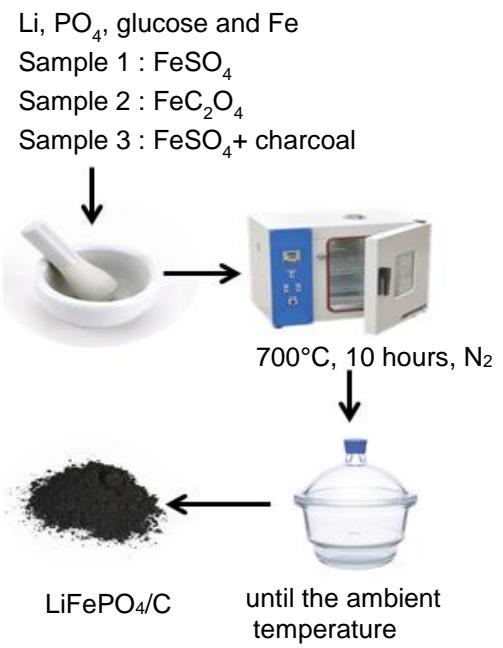
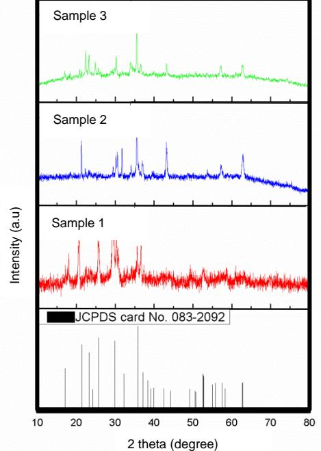
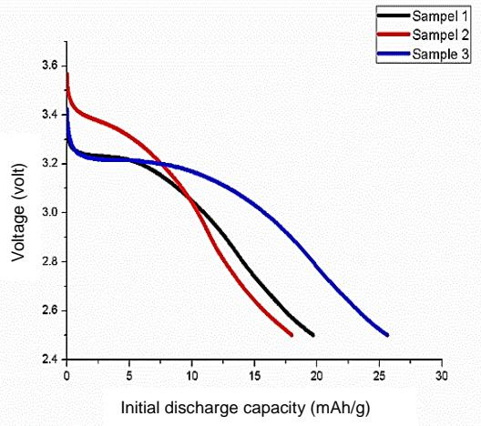

# **INFLUENCE COMPARISON OF PRECURSORS ON LiFePO4/C CATHODE STRUCTURE FOR LITHIUM ION BATTERIES**

# **Luthfi Mufidatul Hasanah, Cornelius Satria Yudha, Soraya Ulfa Muzayanha, Diajeng Putri Suciutami, Atika Aulia Novita Sari, Inayati, and Agus Purwanto\***

*Postgraduate Chemical Engineering, Faculty of Engineering, Universitas Sebelas Maret Jl. Ir. Sutami No. 36 A, Surakarta 57126, Central Java, Indonesia* 

\* Correspondence: Tel/Fax (0271)-632112, email: aguspur@uns.ac.id

Received: May 07, 2019 Accepted: April 04, 2020 Online Published: April 30, 2020 **DOI : 10.20961/jkpk.v5i1.29874**

# **ABSTRACT**

Electricity is the most energy demanded in this era. Energy storage devices must be able to store long-term and portable. A lithium ion battery is a type of battery that has been occupied in a secondary battery market. Lithium iron phosphate / LiFePO4 is a type of cathode material in ion lithium batteries that is very well known for its environmental friendliness and low prices. LiFePO4/C powder can be obtained from the solid state method. In this study the variables used were the types of precursors : iron sulfate (FeSO4), iron oxalate (FeC2O4) and FeSO4+charcoal. Synthesis of LiFePO4/C powder using Li:Fe:P at 1:1:1 %mol. Based on the XRD results, LiFePO4/C from FeSO4+charcoal shows the LiFePO4/C peaks according to the JCPDS Card with slight impurities when compared to other precursors. XRD results of LiFePO4/C with precursors of FeSO4 or FeC2O4 shows more impurities peaks. This LiFePO4/C cathode is paired with lithium metal anode, activated by a separator, LiPF6 as electrolyte. Then this arrangement is assembled become a coin cell battery. Based on the electrochemical results, Initial discharge capacity of LiFePO4/C from the FeSO4 precursor is 19.72 mAh/g, while LiFePO4/C with the FeC2O4 precursor can obtain initial discharge capacity of 17.99 mAh/g, and LiFePO4/C with FeSO4+charcoal exhibit initial discharge capacity of 21.36 mAh/g. This means that the presence of charcoal helps glucose and nitrogen gas as reducing agents.

*Keywords: Lithium Ion Battery; Lithium Iron Phosphate; Cathode; Solid state; Iron sulfate; Iron oxalate; Charcoal*

## **INTRODUCTION**

In this era, electricity is the most increased energy need due to the demand for all economy sectors [\[1](http://dx.doi.org/10.2174/1877944111202020194)[-2\].](http://dx.doi.org/10.1039/C3EE42613K) Electrical energy can be found everywhere but still a challenge due to it is not portable or can't be carried anywhere easily, while the amount of electricity need are always increasing. So, in this case we need an electrical energy storage device.

Battery is an such of device that is capable of storing electrical energy and can be applied to many electronic devices such as mobile phones, laptops, remote controls to electric cars. Batteries consist of 2 types: primary batteries or disposable batteries and secondary batteries or rechargeable batteries. Secondary batteries that have been circulating in the market are Lead acid, Nickel cadmium and Lithium ion. Lithium ion batteries have many advantages such as their environmental friendliness and relatively inexpensive so this really answers the needs of batteries for the future. In this decade, Lithium ion batteries have proven able to conquer consumers in the electric vehicle global market [3].

The Lithium ion battery arrangement consists of electrolyte, separator, anode and cathode. A battery with good performance is greatly influenced by the type of cathode. Cathodes that have been circulating in the market are LiCoO2 [\[4\]](http://dx.doi.org/10.1016/j.jpowsour.2010.06.060), NCA [5][6] , LiMn2O4 [7] and LiMPO4 [8]. Based on the cathode category, the highest environmental friendliness is LiMPO4. LiMPO4 is divided into several categories : LiMnPO4, LiCoPO4, LiNiPO4 and LiFePO4. LiFePO4 battery is one of phosphate batteries that have trending topic due to their environmentally friendly [9] , The raw material is quite easy to obtained and LiFePO4 does not produce impurities during the delithiation process [10].

LiFePO4 cathode has advantages such as low cost, long cycle life (700-6500) [11], high thermal stability and does not contain explosive materials [9]. LiFePO4 has a theoretical capacity of 170 mAh/g [12]. However, LiFePO4 has shortcomings such as the low conductivity of 10-9 -10-10 S/cm and the low diffusion coefficient of 10-13-1016/s. The aims of addition the reducing agent to reduce / eliminate the possibility of oxidized iron. The reducing agent added are activated carbo[n](http://dx.doi.org/10.1016/j.electacta.2015.07.064) [13], metal oxides [14] or the presence of dopants with supervalent metal ions [15]. The addition of carbon is intended to increase the value of battery conductivity due to carbon has a higher conductivity value of 1.25-2x103 S/cm [16].

LiFePO4 has an olivine structure with FeO6 octahedra, PO4 tetrahedra and there is a 1-dimensional tunnel as a lithium ion diffusion channel.The electrode synthesis method has been widely developed in the world which are called solid state [1[7-18\],](http://dx.doi.org/10.1016/j.jallcom.2013.04.015) carbothermal [19], mechanochemical [20], hydrothermal [2[1-13\],](http://dx.doi.org/10.1016/j.electacta.2015.07.064) sol-gel [2[2-23\],](http://dx.doi.org/10.1016/j.jallcom.2013.03.281) solvothermal [2[4-25\],](http://dx.doi.org/10.1016/j.powtec.2011.12.028) electrospinning [26-27], vapor desposition [28], microwave heating [2[9-30\],](http://dx.doi.org/10.1016/j.jpcs.2016.11.011) freeze drying [3[1-](http://dx.doi.org/10.1016/j.jpcs.2010.02.012) 32], spray pyrolysis [3[3-34\]](http://dx.doi.org/10.1016/j.electacta.2014.09.028) and coprecipitation [3[5-36\].](https://scholar.google.co.id/citations?hl=id&user=OvmYgkQAAAAJ) The consideration of the method chosen is in terms of economic/low production cost and ease of processing. Solid state is a method that is able to answer these challenges due to it has been widely applied. In this study, LiFePO4/C will be synthesized with variety of precursors namely iron sulfate (FeSO4), iron oxalate (FeC2O4) and FeSO4 + charcoal, so, we can find out the effect of different precursors.

## **METHODS**

#### **1. Material**

FeSO4, FeC2O4, Li2CO3, NH4H2PO4 99.99%, Glucose 99.99%, Acetylene black 99.99%, Poly vinil di fluoride 99.99%, N metyl pyrolidine 99.99%, Inert gas (Nitrogen), H2O2 50%, Aquadest, Aseton Lithium chip, Coin cell set, LiPF6 (electrolite)

#### **2. Methods**

Solid state method [14-15] starts with mixed sources of iron, lithium carbonate and ammonium phosphate stoichiometrically. Then the mixture is grounded using a mortar until homogeneous. After that, the mixture was added glucose (C6H12O6) as much as 30% by weight as a carbon source / reducing agent. Next, the precursors were put into the cruicible alumina and sintered into the furnace at 700°C for 10 hours under nitrogen (inert) gas flow. LiFePO4/C powder was cooled to ambient temperature. Sample 1 (FeSO4), sample 2 (FeC2O4) and sample 3 (FeSO4 with the addition of charcoal to the top of the mixture/ not mixed with precursors).

Figure 1. LiFePO4/C powder prepared through solid state method at 700°C for 10 hours under inert (nitrogen) gas flow.

#### **3. Characterization**

The obtained LiFePO4/C was characterized by electrochemical properties using coin cell batteries. First, the cathode paste was made by ratio of LiFePO4/C: Acetylene Black: Polyvinylidene Fluoride (PVDF) at 80 : 10 : 10 % by weight. The mixture was dissolved into N-Methyl-2-pyrrolidone (NMP) until homogeneous. The paste was filtered using a 200 mesh filter. After that, the sheet was made using the Doctor blade method with a thickness of 200 nm (speed of 30 mm s -1 ). The sheet was dried at 120 °C until the N-Methyl-2-pyrrolidone (NMP) content was evaporated and a dry LiFePO4/C layer was obtained. The sheet was pressed using a hot press machine.). The sheet was cut with a diameter of 19 mm and separator with a diameter of 20 mm. The coin cells were assemblied in a Glove box with full argon gas and containing H2O maximal 1.0 ppm. The arrangement of coin-cell battery from bottom to top : positive cell - cathode sheet - separator - anode - spacer - spring and negative cell. The cell was filled with LiFP6 electrolyte/each layer is added with electrolyte drop. The final step, the cell was pressed using crimping machine.

## **4. Test**

The obtained LiFePO4/C powder were tested using XRD diffraction to determine its crystallinity. Electrochemical properties were tested to determine the initial discharge capacity of the batteries.

## **RESULTS AND DISCUSSION**

#### **1. Reaction of LiFePO4**

There are two types of reactions in this battery : the litiation and delitiation that occurs in the process of charging and discharging Lithium ion batteries. During the charging process, lithium comes out of the LiFePO4, while during the discharging process the lithium ion enters the FePO4. The reactions during the charging and discharging process are below:

Charging :

LiFePO4 Li1-xFePO4 + xLi + xe- (1) Discharging :

Li1-xFePO4 + xLi + xe- LiFePO4 (2)

#### **2. XRD diffraction pattern**

XRD test is used to determine the crystallinity of the material obtained whether it is in accordance with JCPDS Card LiFePO4/C or not and produce other impurities or not. The XRD pattern test use CuKα 2θ radiation

in the range of 10-80 °. Diffraction test results can be seen in Figure 2 below :

Figure 2. LiFePO4/C diffraction pattern with variable of precursor, sintered at 700°C for 10 hours under nitrogen (inert) gas flow

Figure 2 - sample 1 is the result of XRD LiFePO4/C particle test. This sample using iron sulfate/FeSO4 as iron source and glucose as reducing agent. Iron sulfate, ammonium phosphate, lithium carbonate and glucose are grounded homogeneously. The mixture is put into the alumina cruicible and then heated into the furnace at 700°C for 10 hours under nitrogen (inert) gas flow. FeSO4 was chosen due to the cheapest iron source compared to other iron sources such as iron nitrate (FeNO3) [37] and iron chloride (FeCl3) [38] which had been applied in the synthesis of LiFePO4 previously. Glucose (C6H12O6) not only as a conductivity enhancing agent but also as a reducing agent in previous research [39]. Based on the XRD results in sample 1, it can be seen that the main peaks of LiFePO4

have been successfully formed in accordance with JCPDS Card 083-2092. However, there are still any impurity peaks which are at the peak of 18.5 ° 27.9 °, 31 ° 32 °, 33.3 ° and 34.5 °. Based on the appearance of product shows a black color on the inside but there are still red dots on the outside which means oxidation reaction still occurs due to the formation of Fe2O3 [40]. Oxidation reaction caused by the presence of oxygen content during the heating/sintering process in the furnace.

Figure 2 - sample 2 is the result of XRD LiFePO4/C particle test using FeC2O4 as a source of iron with the solid state method. FeC2O4, ammonium phosphate, lithium carbonate and glucose are grounded homogeneously. The mixture is put into the alumina cruicible and then heated into the furnace at 700°C for 10 hours under nitrogen (inert) gas flow. Based on the XRD results - sample 2, it can be seen that some of the main peaks of LiFePO4 have been successfully formed. However the main peaks at 17.75 ° and 25.90 ° did not form. In addition, impurity peaks are still formed, namely at the peak of 29.10 ° 30.50 °, 31.5 ° and 34.15 °. FeC2O4 was chosen due to iron source contains two carbon atoms which are intended as additional reduction agents apart from the presence of glucose and nitrogen (inert) gas. However, the content of four oxygen atoms becomes dangerous due to the formation of LiFePO4/C must be in an inert condition which means the oxygen content must be limited. Based on the results of sintering, Based on the appearance of product shows a black color on the inside but there are still red dots on the outside which means oxidation reaction still occurs due to the formation of Fe2O3 compounds [40]. Oxidation reaction caused by the presence of oxygen content during the heating process in the furnace.

Figure 2 - sample 3 is the result of XRD LiFePO4/C particle test using FeSO4 as a source of iron with the solid state method and the addition of charcoal. Iron sulfate, ammonium phosphate, lithium carbonate and glucose are grounded homogeneously. The mixture is put into the alumina cruicible then mixture top is covered with charcoal. The precursor is heated into the furnace at 700°C for 10 hours under nitrogen (inert) gas flow. Based on the XRD results, it can be seen that the main peaks of LiFePO4 have been successfully formed. In addition, impurity peaks are still formed, namely at the peak of 23.10 ° 24.95 °, 28.55 ° and 34.3 °.

The presence of charcoal is intended as an additional reducing agent apart from the presence of nitrogen (inert) gas and glucose. The oxidation number in Charcoal or C will increased when charcoal is burned so that it automatically becomes a reducing agent. Based on the appearance of product shows a grayish black color which means it matches the color of LiFePO4 in the commercial.

#### **3. Electrotrochemistry**

Electrochemical testing was carried out using a battery analyzer (Neware, China). The voltage applied at 2.5 - 4.2 volts using lithium metal as an anode. Based on the data obtained, sample 1 / LiFePO4/C from FeSO4 obtained an initial discharge capacity of 19.72 mAh/g, while sample 2 / LiFePO4/C from FeC2O4 obtained an initial discharge capacity of 17.99 mAh/g, and sample 3 / LiFePO4/C from FeSO4 + charcoal as a reducing agent obtained an initial discharge capacity of 25.63 mAh/g. However, all these capacities are still far from the theoretical capacity of 170 mAh / g [12]. Initial discharge capacity can be seen on the figure below :

Figure 3. LiFePO4/C electrochemical test results with precursor variables.

## **CONCLUSION**

Based on the data, we can conclude that LiFePO4/C can be synthesized by the solid state method. These LiFePO4/C particles use several types of precursor (iron source and carbon source), namely FeSO4, FeC2O4 and FeSO4+charcoal. Those three variables still exhibits impurity peaks, called Fe2O3. This is due to during heating process there is still any oxygen content which reacts with iron to produce Fe2O3. Sample 3 (FeSO4 + charcoal) XRD pattern results is closest to JCPDS Card compared to other variables. The highest initial discharge capacity is shown in sample 3 which is 25.63 mAh/g. Contract: PRJ-31 / LPDP / 2018). Voltage (volt)

## **ACKNOWLEDGEMENTS**

We acknowledge the Education Fund Management Institution (LPDP) through the RISPRO Invitation Scheme program (No

## **REFERENCES**

- [1] L. Z. F. Yu, S. Ge, B. Li, G. Sun, & R. Mei, "Three-Dimensional Porous LiFePO4: Design, Architectures and High Performance for Lithium Ion Batteries," *Current Inorganic Chemistry*., vol. 2, no. 2, 2010. DOI: [10.2174/1877944111202020194](http://dx.doi.org/10.2174/1877944111202020194)
- [2] J. B. Goodenough, "Electrochemical energy storage in a sustainable modern society," *Energy Environ. Sci*., vol. 7, pp. 14-18, 2014. DOI: [10.1039/C3EE42613K](http://dx.doi.org/10.1039/C3EE42613K)
- [3] R. Zhang, Y. Zhang, K. Zhu, F. D. Q. Fu, X. Yang, Y. Wang, X. Bie, G, Chen, & Y. Wei, "Carbon and RuO2 Binary Surface Coating for the Li3V2(PO4)3 Cathode Material for Lithium-Ion Batteries.," *ACS Appl. Mater. Interfaces*, vol. 6, no. 15, pp. 12523– 30, 2014, DO[I: 10.1021/am502387z](http://dx.doi.org/10.1021/am502387z)
- [4] M. Park, X. Zhang, M. Chung, G. B. Less, & A. M. Sastry, "A review of conduction phenomena in Li-ion batteries," *J. Power Sources*, vol. 195, no. 24, pp. 7904–7929, 2010, DOI: [10.1016/j.jpowsour.2010.06.060](http://dx.doi.org/10.1016/j.jpowsour.2010.06.060)
- [5] C. S. Yudha, L. M. Hasanah, S. U. Muzayanha, H. Widiyandari, & A. Purwanto, "Synthesis and Characterization of Material LiNi0.8Co0.15Al0.- 05O2 Using One-Step Co-Precipitation Method for Li-Ion Batteries," *JKPK (Jurnal Kimia dan Pendidik. Kimia).* vol. 4, no. 3, pp. 134–144, 2019. DOI: [10.20961/jkpk.v4i3.29850](http://dx.doi.org/10.20961/jkpk.v4i3.29850)
- [6] S. U. Muzayanha, C. S. Yudha, L. M. Hasanah, A. Nur, & A. Purwanto, "Effect of Heating on the Pretreatment Process for Recycling Li-Ion Battery Cathode," *JKPK (Jurnal Kimia dan Pendidik. Kimia),* vol. 4, no. 2, pp. 105- 114, 2019, DOI: [10.20961/jkpk.v4i2.29906](http://dx.doi.org/10.20961/jkpk.v4i2.29906)
- [7] B. Stiaszny, J. C. Ziegler, E. E. Krauß, M. Zhang, J. P. Schmidt, & E. Ivers-Tiffée, "Electrochemical characterization and post-mortem analysis of aged LiMn 2O4-NMC/graphite lithium ion

batteries part II: Calendar aging," *J. Power Sources*, vol. 258, pp. 61–75, 2014. DOI: [10.1016/j.jpowsour.2014.02.019](http://dx.doi.org/10.1016/j.jpowsour.2014.02.019)

- [8] A. K. Padhi, K. S. Nanjundaswamy, & J. B. Goodenough, "Phospho-olivines as Positive-Electrode Materials for Recharg-eable Lithium Batteries," *J. Electrochem. Soc.,* vol. 144, no. 4, pp. 1188–1194, 1997. DOI: [10.1684/agr.2014.0700](http://dx.doi.org/10.1684/agr.2014.0700)
- [9] L. X Yuan, Z. H. Wang, W. X. Zhang, X. L. Hu, J. T. Chen, Y. H. Huang & J. B. Goodenough, "Development and challenges of LiFePO 4 cathode material for lithium-ion batteries," *Energy Environ. Sci.*, vol. 4, no. 2, pp. 269–284, 2011. DOI: [10.1039/C0EE00029A](http://dx.doi.org/10.1039/C0EE00029A)
- [10] J. Molenda, A. Kulka, A. Milewska, W. Zajac, & K. Świerczek, "Structural, transport and electrochemical properties of liFePO4 substituted in lithium and iron sublattices (Al, Zr, W, Mn, Co and Ni)," *Materials (Basel).,* vol. 6, no. 5, pp. 1656–1687, 2013. DOI: [10.3390/ma6051656](http://dx.doi.org/10.3390/ma6051656)
- [11] G. García, S. Dieckhöfer, W. Schuhmann, & E. Ventosa, "Exceeding 6500 cycles for LiFePO4/Li metal batteries through understanding pulsed charging protocols," *J. Mater. Chem. A*, vol. 6, no. 11, pp. 4746–4751, 2018, DOI: [10.1039/c8ta00962g](http://dx.doi.org/10.1039/c8ta00962g)
- [12] C. Gong, Z. Xue, S. Wen, Y. Ye, & X. Xie, "Advanced carbon materials/olivine LiFePO4 composites cathode for lithium ion batteries," *J. Power Sources*, vol. 318, pp. 93–112, 2016, DOI: [10.1016/j.jpowsour.2016.04.008](http://dx.doi.org/10.1016/j.jpowsour.2016.04.008)
- [13] Y. Liu, M. Zhang, Y. L. Y.Hu, M. Y. Zhu, H. M. Jin, & W. Li, "Nano-sized LiFePO4/C composite with core-shell structure as cathode material for lithium ion battery," *Electrochim. Acta*, vol. 176, pp. 689–693, 2015. DOI: [10.1016/j.electacta.2015.07.064](http://dx.doi.org/10.1016/j.electacta.2015.07.064)
- [14] M. Sivakumar, R. Muruganantham, & R. Subadevi, "Synthesis of surface modified LiFePO4 cathode material via polyol technique for high rate lithium secondary battery," *Appl. Surf. Sci.,* vol. 337, pp. 234–240, 2015. DOI: [10.1016/j.apsusc.2015.02.100](http://dx.doi.org/10.1016/j.apsusc.2015.02.100)
- [15] D. Xu, P. Wang, & B. Shen, "Synthesis and characterization of sulfur-doped carbon decorated LiFePO4 nanocomposite as high performance cathode material for lithium-ion batteries," *Ceram. Int.,* vol. 42, no. 4, pp. 5331–5338, 2016, DOI: [10.1016/j.ceramint.2015.12.064](http://dx.doi.org/10.1016/j.ceramint.2015.12.064)
- [16] M. Ohring, "Engineering Materials Science." 1995.
- [17] Y. Wang, Z. S. Feng, J. J. Chen, & C. Zhang, "Synthesis and electrochemical performance of LiFePO4/graphene composites by solid-state reaction," *Mater. Lett*., vol. 71, pp. 54–56, 2012. DOI: [10.1016/j.matlet.2011.12.034](http://dx.doi.org/10.1016/j.matlet.2011.12.034)
- [18] Z. F. Zhang, Z. J. Wu, S. H. Su, Z. F. Gao, L. S. Li, & X. R. Wu, "Sustainable preparation of Li(FeM)PO4/C from converter sludge and its electrochemical performance as a cathode material for lithium ion batteries," *J. Alloys Compd.,* vol. 574, pp. 136–141. DOI: [10.1016/j.jallcom.2013.04.015](http://dx.doi.org/10.1016/j.jallcom.2013.04.015)
- [19] L. Bin Kong, P. Zhang, M. C. Liu, H. Liu, Y. C. Luo, & L. Kang, "Fabrication of promising LiFePO 4/C composite with a core-shell structure by a moderate in situ carbothermal reduction method," *Electrochim. Acta*, vol. 70, pp. 19–24, 2012. DOI: [10.1016/j.electacta.2012.02.102](http://dx.doi.org/10.1016/j.electacta.2012.02.102)
- [20] N. V Kosova, "Mechanochemical reactions and processing of nan-structured electrode materials for lithium-ion batteries," vol. 3, no. 2, pp. 391–395, 2016. DOI: [10.1016/j.matpr.2016.01.025](http://dx.doi.org/10.1016/j.matpr.2016.01.025)
- [21] D. Zhou, X. Qiu, F. Liang, S. Cao, Y. Yao, & X. Huang, "Comparison of the e ff ects of FePO 4 and FePO 4 · 2H 2 O as precursors on the electrochemical performances of LiFePO 4 / C," *Ceram. Int.,* vol. 43, no. 16, pp. 13254–13263, 2017. DOI: [10.1016/j.ceramint.2017.07.023](http://dx.doi.org/10.1016/j.ceramint.2017.07.023)
- [22] J. Mun, H. Ha, & W. Choi, "Nano LiFePO 4 in reduced graphene oxide framework for ef fi cient high- rate lithium storage," *J. Power Sources*, vol. 251, pp. 386–392, 2014. DOI: [10.1016/j.jpowsour.2013.11.034](http://dx.doi.org/10.1016/j.jpowsour.2013.11.034)
- [23] G. Xie, H. J. Zhu, X. M. Liu, & H. Yang, "A core-shell LiFePO4/C nanocomposite prepared via a sol-gel method assisted by citric acid," *J. Alloys Compd.,* vol. 574, pp. 155–160, 2013. DOI: [10.1016/j.jallcom.2013.03.281](http://dx.doi.org/10.1016/j.jallcom.2013.03.281)
- [24] Y. Wang, B. Zhu, Y. Wang, & F. Wang, "Solvothermal synthesis of LiFePO4 nanorods as high-performance cathode materials for lithium ion batteries," *Ceram. Int.,* vol. 42, no. 8, pp. 10297– 10303, 2016. DOI: [10.1016/j.ceramint.2016.03.165](http://dx.doi.org/10.1016/j.ceramint.2016.03.165)
- [25] D. Jugović, M. Mitrić, M. Kuzmanović, N. Cvjetićanin, S. Marković, S. Škapin, & D. Uskokovića, "Rapid crystallization of LiFePO 4 particles by facile emulsion -mediated solvothermal synthesis," *Powder Technol*., vol. 219, pp. 128– 134, 2012, DOI: [10.1016/j.powtec.2011.12.028](http://dx.doi.org/10.1016/j.powtec.2011.12.028)
- [26] C. Zhang, Y. Liang, L. Yao, & Y. Qiu, "Effect of thermal treatment on the properties of electrospun LiFePO 4 – carbon nanofiber composite cathode materials for lithium-ion batteries," *J. Alloys Compd*., vol. 627, pp. 91–100, 2015. DOI: [10.1016/j.jallcom.2014.12.067](http://dx.doi.org/10.1016/j.jallcom.2014.12.067)
- [27] C. Zhu, Y. Yu, L. Gu, K. Weichert, & J. Maier, "Electrospinning of highly electroactive carbon-coated singlecrystalline LiFePO4 nanowires," Angew. *Chemie - Int. Ed.,* vol. 50, no. 28, pp. 6278–6282, 2011. DOI: [10.1002/anie.201005428](http://dx.doi.org/10.1002/anie.201005428)
- [28] X. R. Zeng, F. Deng, & J. Z. Zou, "Effect of temperature on the structure and electrochemical performance of LiFePO4-based composite prepared by microwave chemical vapor deposition," *J. Alloys Compd*., vol. 517, pp. 176– 181, 2012. DOI: [10.1016/j.jallcom.2011.12.073](http://dx.doi.org/10.1016/j.jallcom.2011.12.073)
- [29] A. Naik, J. Zhou, C. Gao, & L. Wang, "Microwave synthesis of LiFePO4 from iron carbonyl complex," *Electrochim. Acta*, vol. 142, pp. 215–222, 2014. DOI: [10.1016/j.electacta.2014.07.118](http://dx.doi.org/10.1016/j.electacta.2014.07.118)
- [30] Z. Huang, P. Luo, & D. Wang, "Preparation and characterization of core-shell structured LiFePO 4 / C composite using a novel carbon source for lithium-ion battery cathode," *J. Phys. Chem. Solids*, vol. 102, no. September 2016, pp. 115–120, 2017. DOI: [10.1016/j.jpcs.2016.11.011](http://dx.doi.org/10.1016/j.jpcs.2016.11.011)
- [31] M. Kuzmanovi, D. Jugovi, M. Mitri, B. Joki, & N. Cvjeti, "The use of various dicarboxylic acids as a carbon source for the preparation of LiFePO 4 / C composite," *Ceram. Int*., vol. 41, pp. 6753–6758, 2015. DOI: [10.1016/j.ceramint.2015.01.121](http://dx.doi.org/10.1016/j.ceramint.2015.01.121)
- [32] E. Zhecheva, M. Mladenov, P. Zlatilova, V. Koleva, & R. Stoyanova, "Particle size distribution and electrochemical properties of LiFePO4 prepared by a freeze-drying method," *J. Phys. Chem. Solids*, vol. 71, no. 5, pp. 848–853, 2010. DOI: [10.1016/j.jpcs.2010.02.012](http://dx.doi.org/10.1016/j.jpcs.2010.02.012)
- [33] N. A. Hamid, S. Wennig, S. Hardt, A. Heinzel, C. Schulz, & H. Wiggers, "High-capacity cathodes for lithium-ion batteries from nanostructured LiFePO 4 synthesized by highly-flexible and scalable flame spray pyrolysis," *J. Power Sources*, vol. 216, pp. 76–83, 2012. DOI: [10.1016/j.jpowsour.2012.05.047](http://dx.doi.org/10.1016/j.jpowsour.2012.05.047)
- [34] L.Ni, J. Zheng, C.Qin, Y.Lu, P.Liu, T.Wu, Y. Tang, & Y.Chen, "Fabrication and characteristics of spherical hierarchical LiFePO4/C cathode material by a facile method," *Electrochim. Acta*, vol. 147, pp. 330–336, 2014. DOI: [10.1016/j.electacta.2014.09.028](http://dx.doi.org/10.1016/j.electacta.2014.09.028)
- [35] S. Fujieda, K. Shinoda, & S. Suzuki, "Improvement of electrochemical properties of LiFePO4 fine particles synthesized in ethylene glycol solution resulting from heat treatment," *Solid State Ionics*, vol. 262, pp. 613–616, 2014. DOI: [10.1016/j.ssi.2013.11.008](http://dx.doi.org/10.1016/j.ssi.2013.11.008)
- [36] K. A. Parmar, S. Prajapati, R. Patel, & Y. Dabhi, "Effective use of ferrous sulfate and alum as a coagulant in treatment of dairy industry wastewater," *J. Eng. Appl. Sci*., vol. 6, no. 9, pp. 42– 45, 2011.
- [37] Y. Zhu, S. Tang, H. Shi, & H. Hu, "Synthesis of FePO 4 Á x H 2 O for fabricating submicrometer structured LiFePO 4 / C by a co-precipitation method,"*Ceramics International*, vol. 40, no. 2, pp. 2685–2690, 2014. DOI: [10.1016/j.ceramint.2013.10.055](http://dx.doi.org/10.1016/j.ceramint.2013.10.055)
- [38] X. Ma, G. Chen, Q. Liu, G. Zeng, & T. Wu, "Synthesis of LiFePO 4 / Graphene Nanocomposite and Its Electrochemical Properties as Cathode Material for Li-Ion Batteries," *journal of nanomaterials*, vol. 2015, pp 1-6, 2015. DOI: [10.1155/2015/301731](http://dx.doi.org/10.1155/2015/301731)
- [39] R. L. Jianjun Chen, Zhiwen Li, Qing Ding, Xiaoshuai An, Yi Pan, Zhu Zheng Fu, Minwei Yang, & Dongju, "Preparation of LiFePO4/C Cathode Materials via a Green Synthesis Route for Lithium-Ion Battery Applications," pp. 1–13, 2018. DOI: [10.3390/ma11112251](http://dx.doi.org/10.3390/ma11112251)
- [40] E. Suryono, *Fabrikasi Lithium Iron Phosphate Carbon Sebagai Material Katoda Baterai Lithium Ion*. Surakarta: UNS Press, 2015.