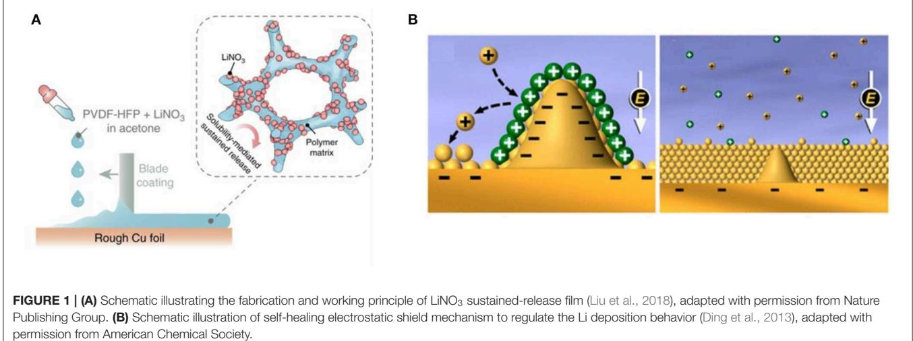
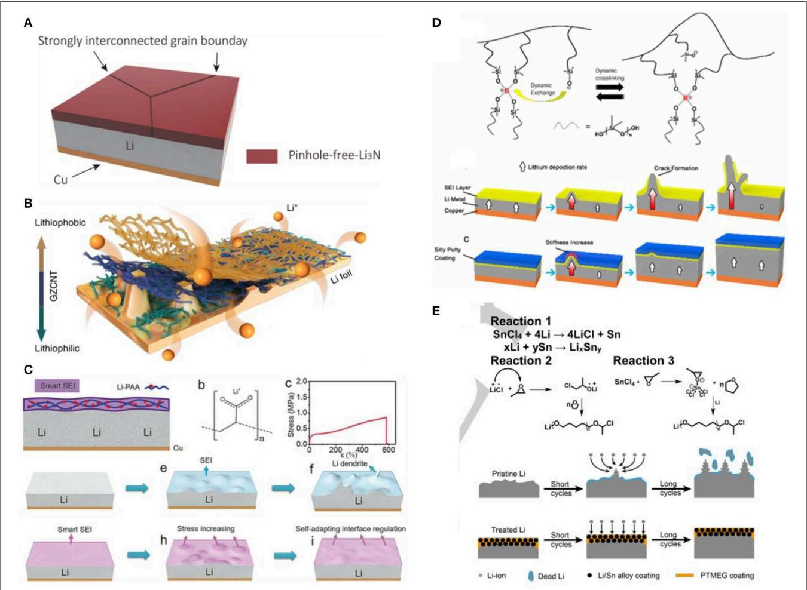

# Progress and Perspective of Constructing Solid Electrolyte [Interphase on Stable Lithium Metal](https://www.frontiersin.org/articles/10.3389/fmats.2020.00071/full) Anode

#### [Jing Yu](http://loop.frontiersin.org/people/907011/overview)1,2†, Liang Zhao1,2†, Yanfei Huang1 , Yi Hu1 , Likun Chen1,2 and [Yan-Bing He](http://loop.frontiersin.org/people/528697/overview)1 \*

*1 Shenzhen Geim Graphene Center, Tsinghua Shenzhen International Graduate School, Tsinghua University, Shenzhen, China, 2 Laboratory of Advanced Materials, Department of Materials Science and Engineering, Tsinghua University, Beijing, China*

Lithium metal is considered as one of the most promising anode materials for high-energy-density rechargeable batteries. However, uncontrolled dendrite growth, the unstable interface between lithium metal anode and electrolyte, and infinite volume change are major obstacles in their practical applications. Constructing a solid electrolyte interphase (SEI) with high strength, good stability, and desirable flexibility is one of the most promising approaches to mitigate the volume expansion of lithium anode and induce the uniform deposition of lithium for dendrite-free anode. Herein, we summarize the advances of SEI modification from the aspects of *in-situ* (adding electrolyte additives) and *ex-situ* (constructing artificial SEI) methods. The ideal SEI on lithium anode can effectively suppress the lithium dendrite growth and volume change of lithium metal anode. In the future study, the modification of SEI should focus on the suppression of side reactions between active lithium metal and electrolyte and the formation of dead lithium, which is quite significant to reduce the consumption of active lithium anode and electrolyte for safe and long-life high energy lithium metal batteries. Constructing an excellent SEI is a robust strategy to achieve the highly stable lithium metal anode for practical application of lithium metal batteries.

#### Edited by:

*Cheng Zhong, Tianjin University, China*

#### Reviewed by:

*Shiyou Zheng, University of Shanghai for Science and Technology, China Ziying Zhang, Shanghai University of Engineering Sciences, China*

#### \*Correspondence:

*Yan-Bing He [he.yanbing@sz.tsinghua.edu.cn](mailto:he.yanbing@sz.tsinghua.edu.cn)*

*†These authors have contributed equally to this work*

#### Specialty section:

*This article was submitted to Energy Materials, a section of the journal Frontiers in Materials*

Received: *12 February 2020* Accepted: *09 March 2020* Published: *25 March 2020*

#### Citation:

*Yu J, Zhao L, Huang Y, Hu Y, Chen L and He Y-B (2020) Progress and Perspective of Constructing Solid Electrolyte Interphase on Stable Lithium Metal Anode. Front. Mater. 7:71. doi: [10.3389/fmats.2020.00071](https://doi.org/10.3389/fmats.2020.00071)*

Keywords: lithium metal anode, lithium dendrite, solid electrolyte interphase, in-situ SEI, ex-situ SEI

# INTRODUCTION

Lithium metal has become an ideal anode material for next-generation high-energy-density lithium-ion batteries due to its high specific capacity (3,860 mAh g−1 ), low reduction potential (−3.040 V vs. standard hydrogen electrode) and low density (0.534 g cm−3 ) [\(Jung et al., 2015\)](#page-5-0). However, uncontrollable dendrite formation, large volume expansion during the lithium deposition and the unstable SEI have caused serious safety problems and rapid capacity fading of the lithium metal batteries [\(Lin et al., 2017b\)](#page-6-0), which have restricted the application of lithium metal anode. Researchers have proposed some methods to solve these problems such as designing a three-dimensional (3D) current collector to induce uniform lithium deposition and mitigate the volume change of the lithium anode [\(Yun et al., 2016\)](#page-6-1), constructing coating layer on separator to control lithium dendrite growth [\(Liu Y. et al., 2017\)](#page-6-2), improving the stability and mechanical strength of the SEI on the surface of lithium anode to inhibit the growth of dendrites [\(Gao et al.,](#page-5-1) [2019\)](#page-5-1), and employing non-flammable solid electrolyte to block Li dendrites and mitigating the safety hazards [\(Lu et al., 2019;](#page-6-3) [Zhu et al., 2019;](#page-6-4) [Pang et al., 2020\)](#page-6-5).

Among them, constructing an SEI with high strength, good stability, and sufficient flexibility on the surface of lithium anode can fundamentally suppress lithium dendrite growth, and effectively reduce the sacrifice in energy density of the battery. However, the SEI formed naturally is relatively brittle and unstable, which is easily damaged due to the mechanical stress caused by the rapid volume change during lithium deposition and dissolution, resulting in the uneven lithium ion flux and formation of lithium dendrites. In addition, repeated cracking and formation of the SEI during battery cycling will consume a large amount of electrolyte and active lithium anode, resulting in decrease of the coulombic efficiency and drying up of the electrolyte [\(Li N. W. et al., 2018\)](#page-6-6). Therefore, it is important to protect lithium anode by introducing additives in the electrolyte to form an ideal SEI in situ, or by coating an artificial SEI through ex-situ physical and chemical methods. This perspective briefly summarizes the research progress of in-situ SEI and artificially constructed ex-situ SEI on protection of lithium metal anode in recent years and prospects the development of this method in the future.

# ADVANCES IN CONSTRUCTING SEI FILM

Constructing an ideal SEI film with desired properties is an effective strategy to protect lithium metal from dendrites growth via in-situ and ex-situ methods, as summarized in **[Table 1](#page-1-0)**. This section will focus on the recent advances of SEI modification for stable lithium metal anode.

### In-situ Formed SEI

The ideal SEI should have high ionic conductivity, near-insulated electronic conductivity, proper thickness, dense structure and high elastic modulus to suppress dendrite penetration. The application of additives in electrolyte is one of the most facile ways to improve the stability of the SEI because it can directly affect the physical and chemical properties of the SEI, change the interface environment and finally improve the lithium deposition behavior [\(Tao et al., 2017\)](#page-6-7). Additives can be divided into two types which are film-forming additives and Li+ plating additives according to the formation mechanism of SEI. The film-forming additive is a self-sacrificing additive that preferentially in-situ reacts with lithium metal to form a stable SEI in the initial cycle of the battery [\(Li et al., 2015\)](#page-6-8). The Li+ plating additives would not react with lithium metal but form an electrostatic shield or "cloud" around the initial growth tip and induce uniform deposition of lithium, which dissipates once the applied voltage is removed, thus eliminating its consumption upon repeated cycling [\(Ding et al., 2013\)](#page-5-2).

Vinyl carbonate (VC) and fluoroethylene carbonate (FEC) have been widely used as electrolyte additives to improve the properties of the SEI. The FEC can be reduced to form LiFrich SEI on the surface of lithium metal, which can facilitate the lithium ion transportation and effectively inhibit the growth of lithium dendrites [\(Zhang et al., 2017\)](#page-6-9). Due to the presence of an unsaturated double bond, VC is easily reduced on lithium metal through ring-opening polymerization to form a gel-like film on the lithium anode, which can also greatly suppress side reactions

| Material                        | Thickness |                                  | Cu cell or Li   Li Li  |                      |        |                         |             | cell Full             |                                                        | References                        |
|---------------------------------|-----------|----------------------------------|---------------------------------|----------------------|--------|-------------------------|-------------|--------------------------|--------------------------------------------------------|-----------------------------------|
|                                 |           | Current density ) (mA cm−2 | Area capacity ) (mAh cm−2 | number/time Cycle | CE (%) | Cathode material        | Rate (C) | Cycle number (cycles) | ) −1 & retainer g capacity (mAh Initial |                                   |
| FEC additive                    | -         | 0.5                              | 0.5                             | 100 cycles           | 95     | O2 LiNi0.5Co0.2Mn0.3 | 1           | 100                      | 154/100.1                                              | 2017 et al., Zhang          |
| film LiNO3/PVDF-HFP gel      | 18µm      | 1                                | 1                               | 200 cycles           | 98.1   | -                       | -           | -                        | -                                                      | 2018 et al., Liu            |
| CsPF6 additives                 | -         | -                                | -                               | -                    | -      | Li4Ti5O12               | 1           | 660                      | -                                                      | 2013 et al., Ding           |
| layer Pinhole-free-Li3N      | -         | -                                | -                               | -                    | -      | Li4Ti5O12               | 1           | 500                      | 160/159                                                | 2018 Y. et al., Li          |
| Li nanowires printed Cu3N | 3µm       | 5                                | 5                               | 100 h                | -      | LiCoO2                  | 0.5         | 300                      | -                                                      | 2020 Lee et al.,               |
|                                 |           |                                  |                                 |                      |        | Li4Ti5O12               | 4           | 1000                     | -/125                                                  |                                   |
| LiF layer Conformal          | 40 nm     | 1                                | 1                               | 200 cycles           | -      | S                       | 0.5         | 100                      | -/1000                                                 | 2017a et al., Lin           |
| alloy hybrid LiF/Sn/Sn–Li    | 25µm      | 1                                | 1                               | 850 h                | -      | LiNi1/3Co1/3Mn1/3O2     | 1           | 150                      | 130.86/ 104.71                                         | 2020 Pathak et al.,            |
| layer                           |           |                                  |                                 |                      |        |                         |             |                          |                                                        |                                   |
| Gradient ZnO-CNT                | 20µm      | 10                               | 1                               | 100 h                | -      | -                       | -           | -                        | -                                                      | 2018 et al., Zhang          |
| LiPAA                           | 20 nm     | 1                                | -                               | 250 h                | -      | LiFePO4                 | -           | 500                      | 140/116                                                | 2018 et al., W. N. Li |
| Dynamically cross-linked        | -         | 1                                | 1                               | 120 cycles           | 97     | LiFePO4                 | -           | 50                       | 142.1/142.1                                            | 2017 et al., K. Liu      |
| polymer                         |           |                                  |                                 |                      |        |                         |             |                          |                                                        |                                   |
| LiPEO–UPy                       | 70 nm     | 5                                | 10                              | 1000 h               | -      | O2 LiNi0.6Co0.2Mn0.2 | 1           | 200                      | 148.2/124.8                                            | 2019 et al., Wang           |
| LiF/PVDF-HFP                    | 12µm      | 2                                | 1                               | 200 h                | -      | LiFePO4                 | 0.5         | 250                      | 150/120                                                | 2018 et al., Xu             |
| LLZTO/Li-Nafion                 | 5µm       | 1                                | 0.5                             | 200 h                | -      | LiFePO4                 | 1           | 150                      | 135/120                                                | 2019 et al., Xu             |
| alloy PTMEG-Li/Sn            | <10µm     | 1                                | 1                               | 1000 h               | -      | S                       | 0.5         | 300                      | –/766.3                                                | 2019 et al., Jiang          |
|                                 |           |                                  |                                 |                      |        | LiFePO4                 | 0.5         | 300                      | -                                                      |                                   |

between lithium metal and the electrolyte and improving the coulombic efficiency [\(Ota et al., 2004\)](#page-6-20). Therefore, additives of VC and FEC have been widely used in lithium metal batteries.

In addition to some organic solvent additives, inorganic additives such as LiNO3 [\(Liu et al., 2018\)](#page-6-10), KNO3 [\(Jia et al., 2016\)](#page-5-4), AlI3 [\(Ma et al., 2017\)](#page-6-21), MgCl2 [\(Ouyang et al., 2019\)](#page-6-22), and InX3 (X = Cl, F, Br) [\(Pang et al., 2018\)](#page-6-23) have also been extensively studied to improve the performance of lithium metal anode. Liu et al. [\(2018\)](#page-6-10) designed a gel polymer film composed of LiNO3 and PVDF-HFP attached on lithium sheet to overcome the poor solubility of LiNO3 in carbonate electrolyte. The dissolved LiNO3 can continuously replenish the NO− 3 consumed by lithium anode to form an SEI rich in LiNxOy, Li3N, and Li2O, which induces the deposition of lithium from dendritic to spherical (see **[Figure 1A](#page-2-0)**). This strategy achieved a high Coulombic efficiency (CE) of ∼98.1% for more than 200 cycles at a current density of 1 mA cm−2 and a capacity of 1 mAh cm−2 . Due to the excellent properties for protecting lithium metal anode, the LiNO3 additive has been widely applied in lithium metal batteries and Li-S batteries.

Most electrolyte additives are self-sacrificing additives that require continuous consumption to maintain the integrity of the SEI. As a result, the thickness of SEI may increase, which easily leads to the rate and cycling performance decay of lithium metal batteries. In contrast, the Li+ plating additives can induce the uniform deposition of lithium without consumption. For instance, [Ding et al. \(2013\)](#page-5-2) proposed a new type of self-healing electrostatic shielding mechanism to solve the lithium dendrite problem. A proper amount of metal ion additives such as Cs+ or Ru+ with a reduction potential lower than Li+ was added to the electrolyte. It tends to gather around the initial tip of the lithium protrusion to form a positively-charged electrostatic shield, which forces subsequent Li+ to deposit near the protrusion until a uniform lithium deposition layer is formed (see **[Figure 1B](#page-2-0)**). The method of protecting lithium metal by using the electrostatic shielding effect does not involve the consumption of electrolyte additives and can effectively improve the cycle life of the battery. However, this method cannot significantly improve the coulombic efficiency. In addition, the reduction potentials of Cs+ and Li+ are close and both ions may deposit simultaneously to form dendrites under high current density. Similarly, K+ [\(Xu et al., 2016\)](#page-6-24), Ca2+, Ba2+, Na+ [\(Goodman and Kohl, 2014\)](#page-5-5), and Al3+ based colloidal particles [\(Ye et al., 2017\)](#page-6-25) can also suppress the growth of lithium dendrite by similar principles. Above research indicates that the combining of film-forming additives and Li+ plating additives may be a new choice for lithium metal batteries with outstanding cycling performance and coulombic efficiency.

### Ex-situ Constructed SEI

The use of electrolyte additives to in situ form a dense SEI during the activation of battery is a simple and effective way for suppressing lithium dendrites. However, it is difficult to precisely regulate the parameters of the SEI such as components, thickness and strength. Therefore, researchers have proposed the ex-situ methods such as artificially constructing inorganic SEI, organic SEI and organic/inorganic composite SEI before the assembly of battery to protect the lithium anode. From the perspective of the preparation methods of artificial SEI, there are two ways to construct the ex-situ SEI on Li metal anode: the chemical method and physical method. Among them, the chemical method is relatively complicated, but it can regulate the composition and thickness of the protective layer by adjusting the type of reactant, reaction time, concentration, and other parameters according to designer's requirements. The current physical coating methods such as spin-coating, chemical vapor deposition, atomic layer deposition, and magnetron sputtering which much depend on the process engineering to achieve a dense and thin protective layer, is easier to control the parameters of the ex-situ SEI precisely.

#### Ex-situ Inorganic SEI

A common artificial inorganic SEI composition is Li3N [\(Alpen,](#page-5-6) [1979\)](#page-5-6), which has high ionic conductivity (up to 10−3 S cm−1 ) and

low electronic conductivity (<10−12 S cm−1 ). It does not hinder the transport of Li+ and has unique thermodynamic stability for lithium metal [\(Zhu et al., 2017\)](#page-6-26). [Li Y. et al. \(2018\)](#page-6-11) obtained a dense Li3N layer with tunable thickness from 2 to 200µm on the surface of Li sheet by reacting molten Li with N2 at 450◦C for a short time, which had high mechanical strength and could inhibit lithium dendrite growth (see **[Figure 2A](#page-3-0)**). When paired it with a Li4Ti5O12 electrode, Li3N modified Li anode exhibited high capacities with ∼99.99% CE on cycling with a long lifespan of 500 cycles. In a recent study, [Lee et al. \(2020\)](#page-6-12) reported Cu3N nanowires printed Li metal by one-step roll-press method. The transferred Cu3N with the thickness of ≈3µm can generate Li3N@Cu nanowires layer by a conversion reaction with lithium, and the as-obtained coating not only enhances the reversible Li plating/stripping behavior due to high ionic conductivity of Li, but also induces homogeneous Li-ion flux due to its 3D open channel structure. Even at a high current density of 5.0 mA cm−2 with the capacity of 5.0 mAh cm−2 , the protected Li anode could still stable cycle for 100 h in carbonate electrolytes. In addition, the LiX (X = Cl, F, Br, I) is also used for the artificial SEI because of its low surface diffusion energy and high surface energy [\(Ozhabes et al., 2015\)](#page-6-27). [Lin et al. \(2017a\)](#page-6-13) introduced a conformal LiF coating on the planar and even 3D framework Li by the reaction between gaseous Freon R134a (1, 1, 1, 2 tetrafluoroethane) and Li metal, which showed highly improved interfacial stability and reduced side reactions. In addition, by controlling gas pressure and reaction temperature, the LiF film with a controllable thickness can be achieved. Recently, Pathak et al. [\(2020\)](#page-6-14) have reported an artificial SEI composed of LiF, Sn, and the Sn–Li alloy with the thickness of 25µm on the Li surface by treating the Li metal with a SnF2-containing electrolyte. This hybrid SEI layer facilitates the Li ion diffusion and Li storage via

FIGURE 2 | (A) Schematic diagram of lithium surface with a pinhole-free and tightly connected Li3N film [\(Li Y. et al., 2018\)](#page-6-11), adapted with permission from American Chemical Society (B) Schematic diagram and synthesis process of lithiophilic-lithiophobic gradient CNT interfacial layer [\(Zhang et al., 2018\)](#page-6-15), adapted with permission from Nature Publishing Group. (C) Schematics diagram of LiPAA interface layer inhibition lithium dendrite [\(Li N. W. et al., 2018\)](#page-6-6), adapted with permission from John Wiley and Sons. (D) Molecular structure and illustration of SEI crack elimination of Silly Putty [\(Liu K. et al., 2017\)](#page-6-16), adapted with permission from American Chemical Society. (E) Schematic diagram of formation mechanism and working principle of PTMEG-Li/Sn alloy hybrid layer [\(Jiang et al., 2019\)](#page-5-3), adapted with permission from John Wiley and Sons.

reversible Li–Sn alloying, thus eliminating Li dendrite and dead Li. As a result, the hybrid SEI-modified Li displayed outstanding electrochemical performance, which can stably cycle 2,325 and 850 h at 0.5 mA cm−2 and 1 mA cm−2 in the Li | Li symmetric cell, respectively. Since the Li3N and LiX can construct highly efficient lithium ion transportation channels in the SEI, the uniform layer of Li3N and LiX can induce the homogeneous lithium metal deposition to suppress the lithium dendrite growth.

Carbon materials are also widely used for building artificial SEI due to their unique properties and structures such as excellent chemical and electrochemical stability, strong mechanical strength and adjustable nanostructures. [Zhang et al.](#page-6-15) [\(2018\)](#page-6-15) used the upper lithophobic carbon nanotubes and the bottom lithophilic ZnO-coated carbon nanotubes to construct a 20µm thick lithophobic-lithophilic gradient SEI (see **[Figure 2B](#page-3-0)**). The close contact between the ionic conductive lithophilic layer and lithium is beneficial to the uniform distribution of Li ions, thereby preventing the formation of lithium dendrites. The lithophobic layer with a porous structure is conducive to the diffusion of Li ions and its high mechanical strength can also inhibit the growth of lithium dendrites. After repeated deposition/extraction process, Li is tightly deposited in the bottom lithiophilic layer. Even so, the bottom lithiophilic layer is anchored to the Li foil and effectively ensured uniform Li deposition, while the porous upper CNT layer is not filled with deposits. It is proposed that the lithiophobic property, high mechanical strength and favorable ion diffusion are the three necessary factors for building a stable interfacial protective layer. In the Li | Li symmetric cell, the Li anode protected with this gradient interfacial layer showed dendrite-free properties over 1,000 h at 1.0 mA cm−2 , and ensured ultralong-term stable Li stripping/ plating even at a high current density of 10 mA cm−2 . Other carbon materials such as reduced graphene oxide (rGO) [\(Bai et al., 2018\)](#page-5-7), nitrogen-doped amorphous carbon (a-CNx) [\(Zhang et al., 2016\)](#page-6-28) and other graphene-like two-dimensional materials such as hexagonal boron nitride (h-BN) [\(Yan et al.,](#page-6-29) [2014\)](#page-6-29) and MXene (Ti3C2Tx) [\(Zhang et al., 2019\)](#page-6-30) are also used to suppress lithium dendrites. The lithophilic properties of carbonbased materials as artificial SEI is quite significant for uniform lithium deposition and suppression of lithium dendrite growth.

#### Ex-situ Organic SEI

Although the inorganic SEI can protect lithium metal to a certain extent, it is too brittle and cannot buffer the volume change of lithium metal during cycling. Unlike rigid inorganic materials, polymer with good flexibility can adapt to the volume change of lithium metal, which is an effective material for artificial SEI. Li N. W. et al. [\(2018\)](#page-6-6) prepared a highly elastic nano-scale lithium polyacrylic acid (LiPAA) SEI with excellent adhesion, certain ionic conductivity and extremely high elasticity using in-situ reaction of polyacrylic acid (PAA) with lithium (see **[Figure 2C](#page-3-0)**), which could alleviate the volume change and dendrite growth of the lithium anode by self-adapting interface regulation. The LiPAA/Li anode demonstrated flat voltage plateau for 700 h in the Li | Li symmetric cell at 0.5 mA cm−2 . [Liu K. et al. \(2017\)](#page-6-16) designed a hybrid "solid-liquid" interfacial protective layer formed by a dynamic cross-linked polymer of polydimethylsiloxane (PDMS) (Silly Putty) (see **[Figure 2D](#page-3-0)**). This "smart" layer can evenly cover the lithium surface and continuously adjusts its shape to adapt to the volume and morphological changes of the lithium anode during the lithium deposition/ extraction process. The emergence of the protrusions on the lithium surface increases the rigidity of the Silly Putty protective layer locally, thereby inhibiting the rapid growth of lithium dendrites. As a result, the PDMS-coated electrode delivered good cycling performance, maintaining a high CE of 97.0% over 120 cycles at 1 mA cm−2 . This work utilizes the dynamic adaptability of the interface layer to suppress lithium dendrites, which provides a new idea for SEI design. Recently, a self-stabilized and strongly adhesive supramolecular polymer comprised of pendant poly (ethylene oxide) (PEO) segments and ureido-pyrimidinone (UPy) quadruple-hydrogenbonding moieties with a thickness of 70 nm, have been used as an artificial SEI of Li anode to effectively protect Li metal from side reaction with electrolyte and inhibit Li dendrite formation [\(Wang et al., 2019\)](#page-6-17). The in-situ-formed LiPEO– UPy SEI layer modified Li anode could work for 1000 h under ultrahigh areal-capacity of 10 mAh cm−2 and current density of 5 mA cm−2 .

#### Ex-situ Organic/Inorganic Composite SEI

Organic SEI is promising in protecting lithium metal due to its diversity and controllability. However, polymers play a limited role in suppressing lithium dendrites due to their low mechanical strength. To combine the advantages of both inorganic and organic based SEI, researchers have proposed an organic/inorganic composite SEI, in which the inorganic component provides sufficient mechanical strength to suppress lithium dendrites, and the organic component gives the protective layer a certain flexibility to mitigate the volume change of lithium anode. [Xu et al. \(2018\)](#page-6-18) prepared a hybrid composited of poly(vinylidene-co-hexafluoropropylene) (PVDF-HFP) and LiF particles to serve as an artificial SEI with synergistic soft– rigid feature on Li metal anode. The SEI exhibits a Young's modulus of 6.72 GPa, a high ionic conductivity, and good shape conformability. The soft PVDF-HFP can withstand the interface fluctuation during plating/stripping process without undesirable detachment that leads to the loss of protection and poor contact, while the tough LiF further strengthens the composite protective layer and realizes uniform Li deposition for a prolonged lifespan. Protected by this composite SEI, the Li | Cu half-cell gained a prolonged lifespan of 120 cycles with a very high CE of ∼97.2% at a current density of 0.5 mA cm−2 , and the Li | Li symmetric cell remained stable over more than 200 h with a negligible increase in hysteresis at 2.0 mA cm−2 . Recently, Xu et al. [\(2019\)](#page-6-19) constructed a robust dual-phase artificial interface to enable a high-efficiency Li diffusion manner and a dendritefree Li plating behavior, using the 4µm thick rigid garnet Aldoped Li6.75La3Zr1.75Ta0.25O12 (Al-LLZTO) as bottom layer and the 1µm thick soft lithiated Nafion (Li-Nafion) component as top layer. This composite SEI possesses high mechanical rigidity of the Al-LLZTO and considerable deformability of Li-Nafion and more importantly, its single ion conducting nature with nearly unity tLi+ ensures a high-efficiency transport and spatially homogeneous distribution of Li-ion on the surface of

lithium metal, which promotes the compact and dense Li plating. Therefore, the modified Li | Cu cell delivered a high CE of 98.5% for more than 350 cycles at 1.0 and 1.0 mAh cm−2 . The LiFePO4 full cell maintained a high capacity retention of 87.4% after 150 cycles at 1 C with ultrathin Li anode. [Jiang et al.](#page-5-3) [\(2019\)](#page-5-3) designed a poly(tetramethylene ether glycol) (PTMEG)- Li/Sn alloy hybrid SEI on the surface of lithium metal by a simple solution method (see **[Figure 2E](#page-3-0)**). The PTMEG has a strong affinity with lithium and strong hydrophobicity due to its abundant C-O functional groups and high content of alkyl chain in the skeleton, respectively, and the Li/Sn alloys can provide rapid Li ion transport channels. Hence, the hybrid SEI not only can induce uniform lithium deposition but also has excellent air stability even in a high-humidity environment. Moreover, the preparation of the hybrid SEI is simple and has some commercial potential, and it might be extended to other relevant battery systems (such as Zn and Na) anodes. Therefore, constructing an organic/inorganic composite SEI by ex-situ method is effective to suppress lithium dendrite growth and mitigate the volume change of lithium anode synchronously.

# PERSPECTIVES

Constructing a high ion conductivity, high elastic modulus and uniform SEI on the surface of lithium metal by in-situ or ex-situ method is an effective strategy to protect the lithium anode. The in-situ formation of SEI is easily achieved by the reduction or deposition of electrolyte additives, but it is difficult to monitor the formation or evolution of the SEI due to the dynamic operating environment of batteries. The ex-situ construction of an artificial SEI on lithium metal by physical or chemical methods is relatively complicated, but the parameters such as composition, thickness, and morphology of the SEI can be precisely controlled. Although important progress has been made in the research of lithium metal protective layer, there still exist some deficiencies. Firstly, the structure, composition, optimization method and Li ion diffusion mechanism of the SEI need to be further studied, and the dynamic change process of the SEI needs analyzing in situ through advanced characterization such as in-situ atomic force microscopy (AFM), in-situ transmission electron microscopy (TEM) and in-situ X-ray absorption spectroscopy

#### REFERENCES

- Alpen, U. (1979). Li3N: a promising Li ionic conductor. J. Solid State Chem. 29, 379–392. doi: [10.1016/0022-4596\(79\)90195-6](https://doi.org/10.1016/0022-4596(79)90195-6)
- Bai, M., Xie, K., Yuan, K., Zhang, K., Li, N., Shen, C., et al. (2018). A scalable approach to dendrite-free lithium anodes via spontaneous reduction of spray-coated graphene oxide layers. Adv. Mater. 30:e1801213. doi: [10.1002/adma.201801213](https://doi.org/10.1002/adma.201801213)
- Ding, F., Xu, W., Graff, G. L., Zhang, J., Sushko, M. L., Chen, X., et al. (2013). Dendrite-free lithium deposition via self-healing electrostatic shield mechanism. J. Am. Chem. Soc. 135, 4450–4456. doi: [10.1021/ja312241y](https://doi.org/10.1021/ja312241y)
- Gao, Y., Yan, Z., Gray, J. L., He, X., Wang, D., Chen, T., et al. (2019). Polymer-inorganic solid-electrolyte interphase for stable lithium metal batteries under lean electrolyte conditions. Nat. Mater. 18, 384–389. doi: [10.1038/s41563-019-0305-8](https://doi.org/10.1038/s41563-019-0305-8)

(XAS). Therefore, the role of each component in the SEI layer can be clearly identified for optimizing the SEI design. Secondly, the current design of the SEI is only suitable for limited operating environment (such as moderate temperature, charging and discharging currents and capacity), therefore, the SEI that can adapt to the extremely harsh conditions according to the changing operating environment (such as high temperature, huge pulse charging and discharging currents and capacity) is quite crucial for the commercial application of lithium anode. Finally, most research of protecting lithium metal with SEI is based on some ideal conditions, such as excessive lithium anode and electrolyte, which are far from practical application. In the future, the constructed SEI on lithium anode not only should effectively suppress the lithium dendrite growth and volume change, but also suppress the side reactions between active lithium metal and electrolyte and dead lithium formation, which is quite significant to reduce the consumptions of active lithium anode and electrolyte for safe high energy lithium metal batteries. The constructing of an excellent SEI opens a new way for the practical application of lithium metal anode and batteries.

# DATA AVAILABILITY STATEMENT

All datasets generated for this study are included in the article/supplementary material.

# AUTHOR CONTRIBUTIONS

JY and LZ wrote the manuscript. YHua, YHu, and LC revised the manuscript. Y-BH designed the framework of the manuscript, and revised the manuscript.

# FUNDING

This work was supported by the National Natural Science Foundation of China (51672156), Local Innovative Research Teams Project of Guangdong Pearl River Talents Program (No. 2017BT01N111), Guangdong Province Technical Plan Project (2017B010119001 and 2017B090907005), and Shenzhen Technical Plan Project (JCYJ20170412170706047 and JCYJ20170817161221958).

- Goodman, J. K. S., and Kohl, P. A. (2014). Effect of alkali and alkaline earth metal salts on suppression of lithium dendrites. J. Electrochem. Soc. 161, D418–D424. doi: [10.1149/2.0301409jes](https://doi.org/10.1149/2.0301409jes)
- Jia, W., Fan, C., Wang, L., Wang, Q., Zhao, M., Zhou, A., et al. (2016). Extremely accessible potassium nitrate (KNO3) as the highly efficient electrolyte additive in lithium battery. ACS Appl. Mater. Interfaces 8, 15399–15405. doi: [10.1021/acsami.6b03897](https://doi.org/10.1021/acsami.6b03897)
- Jiang, Z., Jin, L., Han, Z., Hu, W., Zeng, Z., Sun, Y., et al. (2019). Facile generation of polymer-alloy hybrid layer towards dendrite-free lithium metal anode with improved moisture stability. Angew. Chem. Int. Ed. Engl. 58, 11374–11378. doi: [10.1002/anie.201905712](https://doi.org/10.1002/anie.201905712)
- Jung, Y. S., Oh, D. Y., Nam, Y. J., and Park, K. H. (2015). Issues and challenges for bulk-type all-solid-state rechargeable lithium batteries using sulfide solid electrolytes. Isr. J. Chem. [55, 472–485. doi: 10.1002/ijch.2014](https://doi.org/10.1002/ijch.201400112) 00112
- Lee, D., Sun, S., Kwon, J., Park, H., Jang, M., Park, E., et al. (2020). Copper nitride nanowires printed Li with stable cycling for Li metal batteries in carbonate electrolytes. Adv. Mater. 32:1905573. doi: [10.1002/adma.201905573](https://doi.org/10.1002/adma.201905573)
- Li, N. W., Shi, Y., Yin, Y. X., Zeng, X. X., Li, J. Y., Li, C. J., et al. (2018). A flexible solid electrolyte interphase layer for long-life lithium metal anodes. Angew. Chem. Int. Ed. Engl. 57, 1505–1509. doi: [10.1002/anie.201710806](https://doi.org/10.1002/anie.201710806)
- Li, W., Yao, H., Yan, K., Zheng, G., Liang, Z., Chiang, Y.-M., et al. (2015). The synergetic effect of lithium polysulfide and lithium nitrate to prevent lithium dendrite growth. Nat. Commun. 6:7436. doi: [10.1038/ncomms8436](https://doi.org/10.1038/ncomms8436)
- Li, Y., Sun, Y., Pei, A., Chen, K., Vailionis, A., Li, Y., et al. (2018). Robust pinholefree Li3N solid electrolyte grown from molten lithium. ACS Cent Sci. 4, 97–104. doi: [10.1021/acscentsci.7b00480](https://doi.org/10.1021/acscentsci.7b00480)
- Lin, D., Liu, Y., Chen, W., Zhou, G., Liu, K., Dunn, B., et al. (2017a). Conformal lithium fluoride protection layer on three-dimensional lithium by nonhazardous gaseous reagent Freon. Nano Lett. 17, 3731–3737. doi: [10.1021/acs.nanolett.7b01020](https://doi.org/10.1021/acs.nanolett.7b01020)
- Lin, D., Liu, Y., and Cui, Y. (2017b). Reviving the lithium metal anode for high-energy batteries. Nat. Nanotech. 12, 194–206. doi: [10.1038/nnano.2017.16](https://doi.org/10.1038/nnano.2017.16)
- Liu, K., Pei, A., Lee, H. R., Kong, B., Liu, N., Lin, D., et al. (2017). Lithium metal anodes with an adaptive "solid-liquid" interfacial protective layer. J. Am. Chem. Soc. 139, 4815–4820. doi: [10.1021/jacs.6b13314](https://doi.org/10.1021/jacs.6b13314)
- Liu, Y., Lin, D., Li, Y., Chen, G., Pei, A., Nix, O., et al. (2018). Solubility-mediated sustained release enabling nitrate additive in carbonate electrolytes for stable lithium metal anode. Nat. Commun. 9:3656. doi: [10.1038/s41467-018-06077-5](https://doi.org/10.1038/s41467-018-06077-5)
- Liu, Y., Liu, Q., Xin, L., Liu, Y., Yang, F., Stach, E. A., et al. (2017). Making Li-metal electrodes rechargeable by controlling the dendrite growth direction. Nature Energy 2:17083. doi: [10.1038/nenergy.2017.83](https://doi.org/10.1038/nenergy.2017.83)
- Lu, F., Pang, Y., Zhu, M., Han, F., Yang, J., Fang, F., et al. (2019). A highperformance Li-B-H electrolyte for all-solid-state Li batteries. Adv. Fun. Mater. 29:1809219. doi: [10.1002/adfm.201809219](https://doi.org/10.1002/adfm.201809219)
- Ma, L., Kim, M. S., and Archer, L. A. (2017). Stable artificial solid electrolyte interphases for lithium batteries. Chem. Mater. 29, 4181–4189. doi: [10.1021/acs.chemmater.6b03687](https://doi.org/10.1021/acs.chemmater.6b03687)
- Ota, H., Sakata, Y., Otake, Y., Shima, K., Ue, M., and Yamaki, J. (2004). Structural and functional analysis of surface film on Li anode in vinylene carbonate-containing electrolyte. J. Electrochem. Soc. 151, A1778–A1788. doi: [10.1149/1.1798411](https://doi.org/10.1149/1.1798411)
- Ouyang, Y., Guo, Y., Li, D., Wei, Y., Zhai, T., and Li, H. (2019). Single additive with dual functional-ions for stabilizing lithium anodes. ACS Appl. Mater. Interfaces 11, 11360–11368. doi: [10.1021/acsami.8b21420](https://doi.org/10.1021/acsami.8b21420)
- Ozhabes, Y., Gunceler, D., and Arias, T. A. (2015). Stability and surface diffusion at lithium-electrolyte interphases with connections to dendrite suppression. arXiv [preprint] arXiv:1504.05799.
- Pang, Q., Liang, X., Kochetkov, I. R., Hartmann, P., and Nazar, L. F. (2018). Stabilizing lithium plating by a biphasic surface layer formed in situ. Angew. Chem. Int. Ed. Engl. 57, 9795–9798. doi: [10.1002/anie.201805456](https://doi.org/10.1002/anie.201805456)
- Pang, Y., Wang, X., Shi, X., Xu, F., Sun, L., Yang, J., et al. (2020). Solid-state prelithiation enables high-performance Li-Al-H anode for solid-state batteries. Adv. Energy Mater. 1902795. doi: [10.1002/aenm.201902795](https://doi.org/10.1002/aenm.201902795)
- Pathak, R., Chen, K., Gurung, A., Reza, K. M., Bahrami, B., Pokharel, J., et al. (2020). Fluorinated hybrid solid-electrolyte-interphase for dendrite-free lithium deposition. Nat. Commun. 11:93. doi: [10.1038/s41467-019-13774-2](https://doi.org/10.1038/s41467-019-13774-2)
- Tao, R., Bi, X., Li, S., Yao, Y., Wu, F., Wang, Q., et al. (2017). Kinetics tuning the electrochemistry of lithium dendrites formation in lithium batteries through electrolytes. ACS Appl. Mater. Interfaces 9, 7003–7008. doi: [10.1021/acsami.6b13859](https://doi.org/10.1021/acsami.6b13859)
- Wang, G., Chen, C., Chen, Y., Kang, X., Yang, C., Wang, F., et al. (2019). Self-stabilized and strongly adhesive supramolecular polymer protective layer enables ultrahigh-rate and large-capacity lithium-metal anode. Angew. Chem. Int. Ed. Engl. 58, 2055–2060. doi: [10.1002/anie.201913351](https://doi.org/10.1002/anie.201913351)
- Xu, Q., Yang, Y., and Shao, H. (2016). Enhanced cycleability and dendrite-free lithium deposition by adding potassium ion to the electrolyte for lithium metal batteries. Electrochim. Acta 212, 758–766. doi: [10.1016/j.electacta.2016.07.080](https://doi.org/10.1016/j.electacta.2016.07.080)
- Xu, R., Xiao, Y., Zhang, R., Cheng, X. B., Zhao, C. Z., Zhang, X. Q., et al. (2019). Dual-phase single-ion pathway interfaces for robust lithium metal in working batteries. Adv. Mater. 31:e1808392. doi: [10.1002/adma.201808392](https://doi.org/10.1002/adma.201808392)
- Xu, R., Zhang, X.-Q., Cheng, X.-B., Peng, H.-J., Zhao, C.-Z., Yan, C., et al. (2018). Artificial soft-rigid protective layer for dendrite-free lithium metal anode. Adv. Funct. Mater. 28:1705838. doi: [10.1002/adfm.201705838](https://doi.org/10.1002/adfm.201705838)
- Yan, K., Lee, H. W., Gao, T., Zheng, G., Yao, H., Wang, H., et al. (2014). Ultrathin two-dimensional atomic crystals as stable interfacial layer for improvement of lithium metal anode. Nano Lett. 14, 6016–6022. doi: [10.1021/nl503125u](https://doi.org/10.1021/nl503125u)
- Ye, H., Yin, Y., Zhang, S., Shi, Y., Liu, L., Zeng, X., et al. (2017). Synergism of Al-containing solid electrolyte interphase layer and Al-based colloidal particles for stable lithium anode. Nano Energy 36, 411–417. doi: [10.1016/j.nanoen.2017.04.056](https://doi.org/10.1016/j.nanoen.2017.04.056)
- Yun, Q., He, Y.-B., Lv, W., Zhao, Y., Li, B., Kang, F., et al. (2016). Chemical dealloying derived 3D porous current collector for Li metal anodes. Adv. Mater. 28, 6932–6939. doi: [10.1002/adma.201601409](https://doi.org/10.1002/adma.201601409)
- Zhang, D., Wang, S., Li, B., Gong, Y., and Yang, S. (2019). Horizontal growth of lithium on parallelly aligned MXene layers towards dendrite-free metallic lithium anodes. Adv. Mater. [31:e1901820. doi: 10.1002/adma.2019](https://doi.org/10.1002/adma.201901820) 01820
- Zhang, H., Liao, X., Guan, Y., Xiang, Y., Li, M., Zhang, W., et al. (2018). Lithiophilic-lithiophobic gradient interfacial layer for a highly stable lithium metal anode. Nat. Commun. [9:3729. doi: 10.1038/s41467-018-0](https://doi.org/10.1038/s41467-018-06126-z) 6126-z
- Zhang, X., Cheng, X., Chen, X., Yan, C., and Zhang, Q. (2017). Fluoroethylene carbonate additives to render uniform Li deposits in lithium metal batteries. Adv. Funct. Mater. 27:1605989. doi: [10.1002/adfm.201605989](https://doi.org/10.1002/adfm.201605989)
- Zhang, Y., Bai, W., Wang, X., Xia, X., Gu, C., and Tu, J. (2016). In situ confocal microscopic observation on inhibiting the dendrite formation of a-CNx/Li electrode. J. Mater. Chem. A 4, 15597–15604. doi: [10.1039/C6TA06612G](https://doi.org/10.1039/C6TA06612G)
- Zhu, M., Pang, Y., Lu, F., Shi, X., Yang, J., and Zheng, S. (2019). In situ formed Li-B-H complex with high Li-ion conductivity as a potential solid electrolyte for Li batteries. ACS Appl. Mater. Interfaces 11, 14136–14141. doi: [10.1021/acsami.9b01326](https://doi.org/10.1021/acsami.9b01326)
- Zhu, Y., He, X., and Mo, Y. (2017). Strategies based on nitride materials chemistry to stabilize Li metal anode. Adv. Sci. [4:1600517. doi: 10.1002/advs.2016](https://doi.org/10.1002/advs.201600517) 00517

**Conflict of Interest:** The authors declare that the research was conducted in the absence of any commercial or financial relationships that could be construed as a potential conflict of interest.

Copyright © 2020 Yu, Zhao, Huang, Hu, Chen and He. This is an open-access article distributed under the terms of the [Creative Commons Attribution License \(CC BY\).](http://creativecommons.org/licenses/by/4.0/) The use, distribution or reproduction in other forums is permitted, provided the original author(s) and the copyright owner(s) are credited and that the original publication in this journal is cited, in accordance with accepted academic practice. No use, distribution or reproduction is permitted which does not comply with these terms.