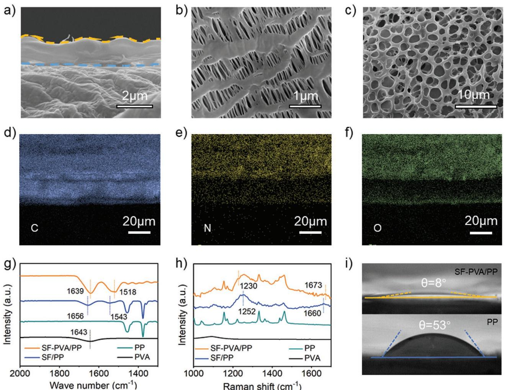
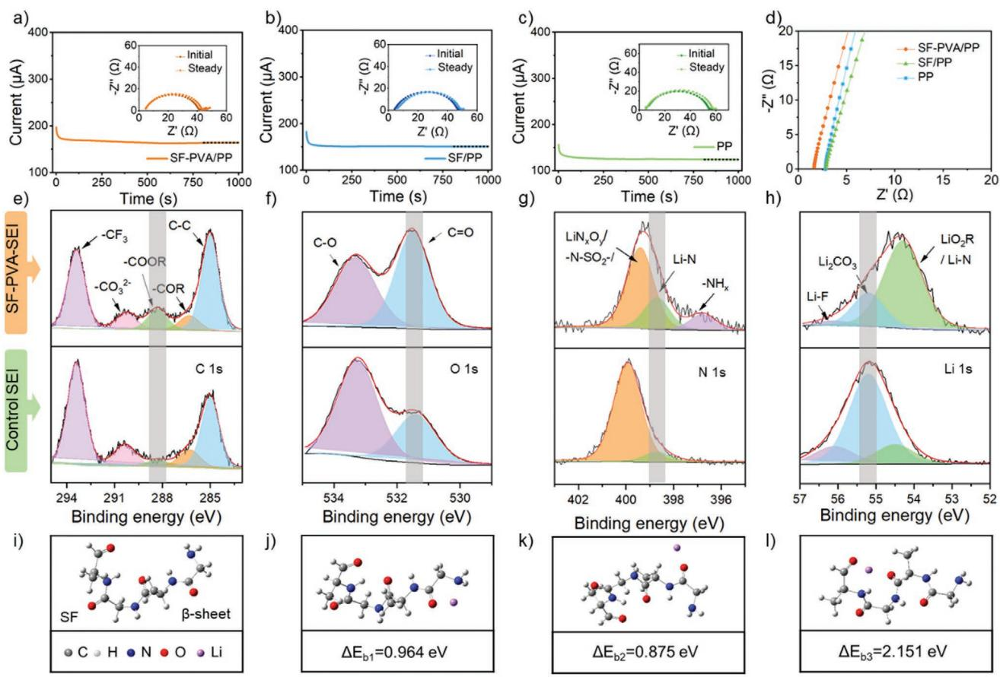
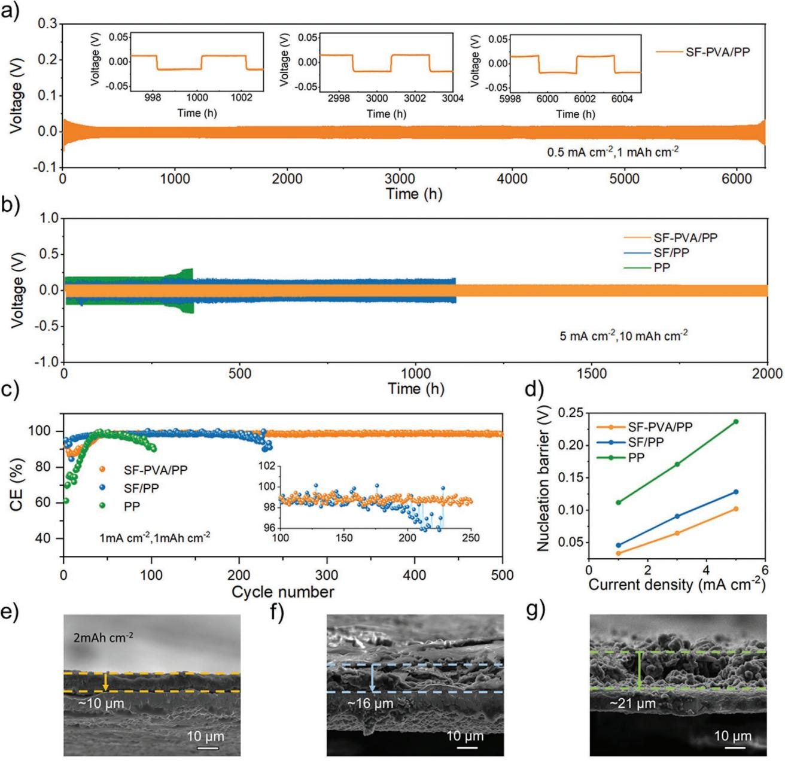
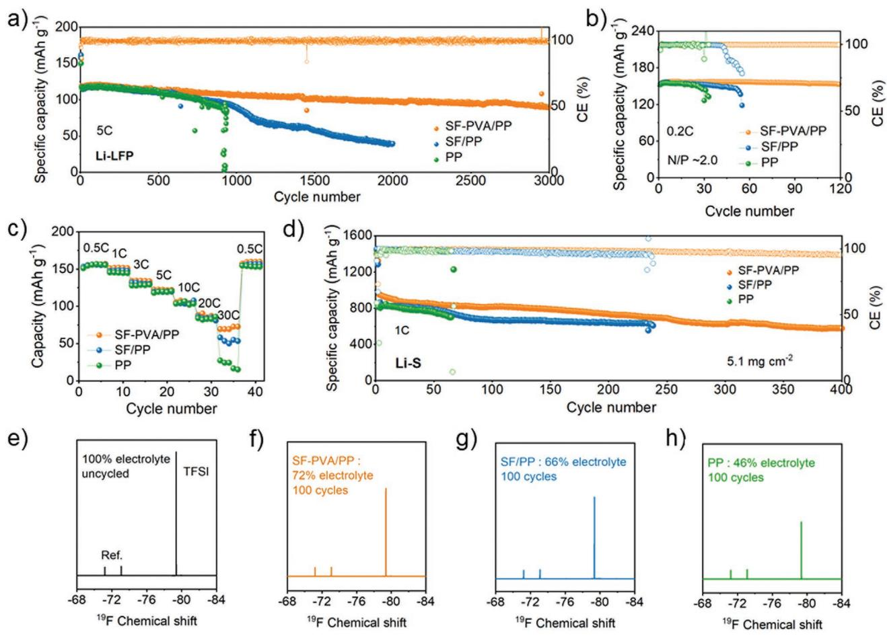

# **Elevated Lithium Ion Regulation by a "Natural Silk" Modified Separator for High-Performance Lithium Metal Anode**

*Xiang Li, Lixia Yuan,\* Dezhong Liu, Mengyi Liao, Jie Chen, Kai Yuan, Jingwei Xiang, Zhen Li, and Yunhui Huang\**

**Metallic lithium anode has long stood as the "holy grail" in the field of secondary batteries for its high theoretical specific capacity and low electrochemical potential. But its edge is blunted by the inherent uncontrolled lithium dendrite growth that can curtail the cycle life and raise safety concerns. In this work, a functional modification layer from a derivant of natural silk is developed to protect lithium anode via a facile automatic transfer route. Via offering abundant functional group sites, the Li-ion flux on the anode surface is made uniform efficiently. The silk fibroin-based modification layer also contributes to the in situ formation of a Li3N-rich solid electrolyte interphase film on the lithium anode. Consequently, a high-performance lithium metal anode with dendrite-free morphology and significantly enhanced cycle stability is achieved: when paired with LiFePO4 cathodes, the full cell achieves a longterm cycling stability of 3000 cycles at 5 C; when paired with sulfur cathodes (5 mgsulfur cm−2 ), a long lifespan for over 400 cycles at 1 C is achieved. This work offers a facile and practical approach for the interface modification of the high-performance lithium anode and as well as provides a new perspective for the application of biomass-based materials in advanced batteries.**

### **1. Introduction**

Metallic lithium anode has long been the "holy grail" in the field of secondary batteries for it has the highest theoretical specific capacity (3860 mAh g−1 ) and the lowest electrochemical potential (−3.04 V) among all the solid materials possible as rechargeable anodes. Today the ever pursuing of high energy density makes lithium metal batteries (LMBs) are attended unprecedentedly.[1–4] However, several factors limit the commercial application of lithium metal anodes: i) The high reaction activity of lithium will continuously consume electrolyte and result in the formation of vulnerable solid electrolyte interphase

X. Li, Prof. L. Yuan, D. Liu, M. Liao, J. Chen, K. Yuan, Dr. J. Xiang, Prof. Z. Li, Prof. Y. Huang

State Key Laboratory of Material Processing and Die & Mold Technology School of Materials Science and Engineering

Huazhong University of Science and Technology

Wuhan 430074, China

E-mail: yuanlixia@hust.edu.cn; huangyh@hust.edu.cn

**DOI: 10.1002/adfm.202100537**

(SEI) film; ii) the uncontrollable growth of lithium dendrite creates cracks in the fragile SEI, resulting in the continuous repairing of SEI and accumulation of dead Li and even the exhaustion of electrolyte; iii) the infinite volume change during the repeated Li stripping/plating process can further destroy the fragile SEI and even cause collapse of the electrode structure. The end results are the lowered CE and shortened lifespan of the battery, and even thermal runaway.[5,6]

To overcome the hurdles in lithium metal battery technology, constructing a stable interface between lithium anode and electrolyte is the crux of the problems. While the dendrite growth during Li stripping/plating cycles poses the greatest barrier. Now countless research works have been carried out to optimize the electrolyte for a strengthened SEI,[7–9] or even directly construct an artificial SEI,[10,11] and to use 3D collectors[12,13] for suppressing

the Li dendrite growth via decreasing the actual current density and providing a host for lithium deposition. Via these efforts, the rechargeability of Li metal anode is significantly improved. However, natural convection always exists on the surface of Li anode, which inherently causes the nonuniform Li-ion flux and hence the dendritic Li deposition after long-term cycling. On the other hand, the amounts of the functional additives in electrolytes are always limited and they will be consumed in the repeated charging-discharging cycles and cannot guarantee the long-term effective protection; the interphase modification routes realized via lithium surface engineering always involve complex processes and harsh condition, which limits the compatibility with the practical deployment.

Among all the strategies, the functional separator route is one of the simplest and efficient ways to improve the rechargeability of lithium anode.[14–17] Many functional materials can be introduced as modification layers for the traditional polypropylene (PP) separator. For instance, the separators modified by nitrogen and sulfur co-doped graphene nanosheets,[18] functionalized nanocarbon,[19] conductive polymers,[20] etc., can physically suppress the growth of lithium dendrites via robust mechanical strength. Some electrochemically active materials like graphene-oxide film,[21] SiO2, [22] TiO2, [23] and Si particles[24]

The ORCID identification number(s) for the author(s) of this article can be found under https://doi.org/10.1002/adfm.202100537.

can be coated on the PP separators to spontaneously consume the dendrites and "dead Li" through chemical reactions. What's more, some porous structured materials with polar functional groups can also be used to modify the PP separators to regulate Li deposition via facilitating the Li ion transportation at the vicinity of anode.[25–28] In 2017, Archer and co-workers reported *γ*-Al2O3 with nanopores can augment the lithium transference number of the electrolyte via ion rectification and as well as control the dendrite nucleate size via aperture limitation.[29] Li et al. have developed a bilayer composite separator with a large quantity of polar groups. The highly concentrated functional sites enable fast and homogenous distribution of Li ion flux on molecular-level, thus realizing a stable Li electro-deposition.[30]

In this work, we designed a multifunctional separator to uniform the Li ion transportation on the anode surface and as well as benefit the formation of a highly Li-ion conductive and mechanically strengthened SEI. Via a simple freeze-drying method, a hybrid layer of silk fibroin and polyvinyl alcohol (SF-PVA) was modified on the commercial PP separator, which will autotransfer to the surface of Li anode during cell assembly. The SF-PVA layer will uniform the Li ion flux at the electrolyte/ lithium interface and realize a significantly improved lithiumion transference number (0.63) via offering abundant polar group sites including peptide bonds, amino, and aldehyde groups. In addition, the SF-PVA function layer which contacts with Li anodes directly, can induce the in situ formation of a Li3Nrich SEI. Li3N has high Li-ion conductivity (≈10−3–10−4 S cm−1 ) and high Young's modulus (≈48 GPa),[31] which will realize a highly Li-ion conductive SEI with high chemical and mechanical stability. Furthermore, here the introduction of a small amount of PVA enables the silk fibroin to go through the secondary structure transformation from random coil to *β*-sheets. The well-ordered *β*-sheet structure can further facilitate the Li ion transport. It is further found the SF-PVA layer significantly benefits the electrolyte infiltration and retention during the repeated Li dissolving/deposition cycles. With the SF-PVA modified separator, the symmetric Li–Li cells can operate stably for more than 6000 h (0.5 mA cm−2, 1 mAh cm−2 ); the Li–LiFePO4 cell can achieve a long lifespan for over 3000 cycles at 5 C and high rate capability up to even 30 C; the Li–S cell with a sulfur loading of 5 mg cm−2 also demonstrates a long life of over 400 cycles at 1 C. We believe this economically viable and environmentally friendly strategy can offer new perspective for the development of the advanced LMBs.

# **2. Results and Discussion**

As shown in **Figure 1**a, a homogeneous thin SF-PVA layer was fabricated by casting the mixed solution of silk fibroin and PVA onto the commercial PP (Celgard 2400) separator, followed by a simple freeze-drying process. The SF-PVA layer has strong affinity with lithium or copper foil through electrostatic adsorption, so it will automatically transfer onto the surface of lithium anode or copper foil in cell assembly (Figure S1, Supporting Information). The entire process successfully bypasses the cumbersome procedures of directly constructing a protection layer on the highly reactive lithium. Besides, both raw materials are affordable and readily available (Table S1, Supporting Information), and the whole fabrication process is eco-friendly, safe, biocompatible, and easy to scale up, which are all the important factors for mass-production (Figure S2, Supporting Information). Figure 1b shows the Li anode system with traditional commercial PP separator, the uneven concentrated Li-ion flux renders uncontrollable dendrite growth during Li plating process. When employing the SF-PVA modified separator (SF-PVA/PP, Figure 1c), Li ion flux is uniformed by the homogeneously distributed polar NH and CO groups in SF (Figure S3 and Table S2, Supporting Information) and the consequent electro-deposition is regulated accordingly. In the meanwhile, SF-PVA also attributes to the formation of the Li3Nrich SEI with both high ionic conductivity and high thermal and mechanical stability on the surface of Li anode. All these result a uniform Li nucleation and dense Li plating.

The cross section image (**Figure 2**a) identifies the thickness of the SF-PVA layer is only ≈1.5 µm, and its areal mass is calculated to be as low as ≈0.18 mg cm−2, which can almost be negligible for the PP separator (25 µm and 1.5 mg cm−2). Therefore, almost no any loss of gravimetric or volumetric energy density is done due to the modification. Different from the highly-oriented hole structure of the bare PP (Figure 2b) or the disordered stacking thin flake morphology of pure SF (Figure S4, Supporting Information), the composite SF-PVA layer demonstrates a highly porous structure with interconnected pores and the average diameter of the pores is ≈2 µm (Figure 2c). Obviously, these pores should originate from the molecular interaction between PVA and SF. The energy dispersive spectroscopy (EDS) elemental mapping for SF-PVA clearly reveals the homogeneous distribution of C, N, and O elements (Figure S5, Supporting Information). Accordingly, in the overall element plots (Figure 2d–f), the N and O signals of SF-PVA are significantly stronger than those in the bare PP separator, while the C signals shows no distinct boundary. The Fourier transform infrared (FTIR) spectra in Figure 2g further reveals the presence of the considerable polar groups in silk fibroin. More importantly, compared to the random coil structure of pure silk fibroin, which have two peaks at 1543 and 1656 cm−1 , the newly appeared characteristic peaks at 1639 and 1518 cm−1 in SF-PVA correspond to the *β*-sheet structure of SF.[32,33] Obviously, PVA leads to the conformational transition of SF from random coil to ordered *β*-sheet via changing the polarity of the solution, which is also confirmed by the nuclear magnetic resonance (NMR) analysis (Figure S6, Supporting Information). In Raman spectrum (Figure 2h), the two peaks at 1230 and 1673 cm−1 also correspond to the *β*-sheet structure in the SF-PVA/PP separator.[34] In addition, the interconnected porous structure and the abundant polar functional groups both contribute to the enhanced affinity of the separator with the electrolyte (1 m LiTFSI in 1:1 DOL/DME with 2 wt% LiNO3): As shown in Figure 2i, the contact angle with the electrolyte decreases from 53° to 8° in the presence of the SF-PVA modification.

The apparent Li-ion transferences are calculated from the current-time curves and the electrochemical impedance spectroscopy (EIS) plots before and after polarization for the separators infiltrated with electrolyte (**Figure 3**a–c). The SF-PVA system demonstrates the highest apparent Li-ion transference number of 0.63, much higher than those of 0.49 for PP and 0.51 for SF/PP systems (Table S3, Supporting

**Figure 1.** a) Schematic illustration for the fabrication of the SF-PVA modified PP separator. Li stripping/plating behavior with b) PP and c) SF-PVA/ PP separator.

Information). The enhancement comes from the depressed anion migration by the abundant polar peptide bonds and the innately pores in SF-PVA.[35] The ionic conductivities for different separators infiltrated by the same electrolyte are also tested in symmetric coin cells with stainless steel (SS) foils as electrodes (Figure 3d). They are calculated as 1.99, 1.14, and 0.91 mS cm−1 for the SF-PVA/PP, SF/PP and PP systems, respectively. The highest ionic conductivity for SF-PVA/PP system may be due to its strong lithiophilicity and the porous structure, which accelerate the Li transport kinetics. X-ray photoelectron spectroscopy (XPS) was conducted to analyze the composition of SEI on the surface of the cycled Li anode. As shown in Figure 3e–h, the intensity increases of the 288.3 eV peak in C 1s[36] and the 531.5 eV peak in O 1s spectrum,[37] both correspond to the CO group in silk fibroin, which is considered to facilitate the homogeneous Li ion flux on the anode surface during cycling. Furthermore, both N 1s and Li 1s spectrum indicate the Li3N content increases markedly on the SF-PVA modified Li anode. The concentration enhancement of Li3N contributes to the formation of a robust SEI with higher ionic conductivity. In addition, the typical species originated from the decomposition of electrolyte such as carbonate (Li2CO3), LiF, and -CF3, are relatively decreased, implying the SF-PVA layer can mitigate the side reactions between Li metal and electrolyte. This view can also be supported by the cyclic voltammetry analysis (Figure S7, Supporting Information). Several added reduction peaks appear before the large depositing of Li in the first cycle and disappear in the following cycles. These peaks should be related with the additional side reactions between the active groups in SF-PVA and Li metal which realizes a Li3N-rich SEI layer.

Density functional theory (DFT) calculations were performed to further elucidate the interaction between Li ions and SF-PVA layer. As shown in Figure 3k, the binding energy between Li ions and peptide bonds within the *β*-sheet structured SF is calculated to be 0.875 eV, which is much higher than the binding energy between Li ion and PP separator (0.02 eV) or peptide bonds within the random coil structured SF (0.676 and 0.734 eV) (the random coil structured SF contains more than one type of peptide bond, Figure S8 and Table S4, Supporting Information), implying the greatly improved Li-ion capture ability of the *β*-sheet structured SF. The binding energy can be even higher between Li ions and the terminal groups in the

**Figure 2.** a) Cross section image of the SF-PVA layer on PP separator. Top-view SEM images of b) PP and c) SF-PVA/PP. d–f) EDS elemental mapping of the SF-PVA/PP separator. g) FTIR spectra and h) Raman Spectra of PVA solution (black line), and PP (green line), SF/PP (blue line) and SF-PVA/PP (yellow line) separators. i) Contact angles between electrolyte and SF-PVA/PP (top) or PP (down) separators.

peptide chains of SF, such as the amino group (0.964 eV) and aldehyde (2.151 eV) (Figure 3j,l). Obviously, the enhanced interaction between Li ion and the uniformly distributed groups of SF, facilitates the homogeneous transportation of Li ions; the interconnected porous structure of SF-PVA which affords large exposed inner surface further magnify the effect.

To directly validate the effectiveness of the SF-PVA/PP separator, various cells with lithium anode were assembled. The Li–Li symmetric cells with SF-PVA/PP separator exhibits superior electrochemical performance: At 0.5 mA cm−2 and 1 mAh cm−2, it cycles for over 6000 h with a stable voltage plateau throughout (**Figure 4**a). The enlarged voltage profiles at different cycling stage in the inset clearly shows the high consistency without any significant increase in overpotential. As the current density and capacity increase to 1 and 5 mA cm−2 , the cells with PP separator and SF/PP separator succumb quickly due to the augment of polarization (Figure S9, Supporting Information), which could be ascribed to the accumulation of SEI and "dead lithium". In sharp contrast, the Li/SF-PVA anode system demonstrates flat voltage plateau throughout the whole cycling process. Even at a high current density of 5 mA cm−2 and a high areal capacity of 10 mAh cm−2 , the Li/SF–PVA/PP system can still keep stable voltage profiles for over 2000 h with a low voltage hysteresis ≈78 mV, which is much smaller than those of the Li/PP (≈150 mV) and Li/SF/PP systems (≈190 mV) (Figure 4b). Furthermore, the lifespan of the Li–Li cells with SF-PVA/PP separators outperform those with other reported Li anode protection strategies (Figure S10, Supporting Information). The rate capabilities of the cells were tested from 1 to 8 mA cm−2 with an areal capacity of 1 mAh cm−2 (Figure S11, Supporting Information). As expected, the Li/SF–PVA/PP system exhibits the lowest voltage hysteresis at all current densities, demonstrating an excellent rate capability.

The effectiveness of the strategy is more obvious in Li–Cu half-cells. With SF-PVA/PP separator, the Li–Cu cell achieves a Coulombic efficiency of ≈99% stabilizing for over 500 cycles (Figure 4c), which is much higher than those of the PP and SF/PP systems. The latter two both exhibit inferior electrochemical cycling stability and rapid CE decay (Figure S12, Supporting information). When the deposition capacity

**Figure 3.** Variation of current with time and EIS test before and after the polarization of Li–Li symmetrical cells with a) PP, b) SF/PP, and c) SF-PVA/PP separators. d) Impedance plots of different separators to estimate Li conductivity. e) C 1s, f) O 1s, g) N 1s, and h) Li 1s XPS spectra of SF-PVA-derived SEI layer (top) and control SEI (down). i) The *β*-sheet structure of SF and the corresponding DFT calculation of the interactions between Li ions and j) amino group, k) peptide bonds, and l) aldehyde group within *β*-sheet structured SF. Gray, white, blue, red, and purple balls represent carbon, hydrogen, nitrogen, oxygen, and lithium atoms, respectively.

increases, the SF-PVA system shows more obvious advantages (Figure S13, Supporting Information). Figure 4d shows the Li nucleation barriers. Obviously, the nucleated overpotentials Li in the SF-PVA/PP cells are significantly reduced at various current densities. The contrast is even more striking in the cross section SEM image (Figure 4e,g). After 2 mAh cm−2 Li deposition, the SF-PVA/PP system demonstrates a compact and thinner Li layer with thickness of 10 µm, which is almost the same with the theoretical thickness of Li (5 µm mAh−1 ). It is much thinner than those of the SF/PP (16 µm) and the PP (20 µm) systems. Obviously, the SF-PVA layer can exist in cells in the long-term cycles and influence the deposition/dissolving cycles throughout (Figure S14, Supporting Information). Compared with the loose and porous morphology of the control samples, the surface of the Li layer deposited on the SF-PVA modified copper foil remains smooth and no obvious Li dendrite can be observed (Figure S15, Supporting Information). Similar condition can be found in the Li–Li symmetrical systems (Figure S16, Supporting Information). In addition, the Li–Cu cell with SF-PVA/PP separator shows much lower impedances during resting time compared to the cells with SF/PP separator or bare PP separator (Figure S17, Supporting Information). These results all demonstrate that Li dendrite has been effectively suppressed by the SF-PVA modification layer.

The advantages of SF-PVA/PP were further demonstrated by the full-cells with LiFePO4 (LFP) and S cathodes. For the Li-LFP system, as shown in **Figure 5**a at 5 C rate (1 C = 170 mAh g−1 ), all cells exhibit nearly the same initial specific capacities, but the cells with PP or SF/PP separator encounter much faster capacity decay after 900 cycles and dramatically increased voltage polarization (Figure S18a,b, Supporting Information). For comparison, the Li-LFP cell with SF-PVA/PP separator exhibits a high capacity retention of 75.5% after 3000 cycles with a quite stable voltage profiles (Figure S18c, Supporting Information), which outperforms most literature results (Table S5, Supporting Information). At a high mass loading (≈12 mg cm−2 ) and low N/P ratio (≈2.0) (Figure 5b), the Li-LFP cell with SF-PVA modification still demonstrates a prolonged lifespan of more than 100 cycles with a steady CE of nearly 100%, while the PP and SF/PP cell both show much faster capacity decay and sharply deteriorated CE (Figure S19, Supporting Information). Figure 5c gives the high-rate capabilities. Even at an extremely high rate of 30 C, the Li/SF-PVA/ LFP cell can still achieve a discharge capacity of 72.7 mAh g−1 and an acceptable voltage polarization (Figure S20, Supporting

**Figure 4.** Electrochemical performance of cells with PP, SF/PP, SF-PVA/PP separator. Voltage profiles of the Li–Li symmetric cells at a) 0.5 mA cm−2 , 1 mAh cm−2 , b) 5 mA cm−2 , 10 mAh cm−2 . c) Coulombic efficiencies of Li–Cu cells at a current density of 1 mA cm−2 with areal capacity of 1 mAh cm−2. d) The Li nucleation barrier of Li–Cu cells at different current densities. The cross-sectional SEM images of e) SF-PVA modified copper foil f) SF modified copper foil g) bare copper foil after cycles with 2 mAh cm−2 Li deposition.

Information). The Li/SF-PVA anode also behaves well in the Li–S full cells (Figure 5d). Due to the "shuttle" phenomenon from the soluble polysulfide intermediates, the Li–S full cells with PP and SF/PP separators suffer from abrupt capacity failure after 67 and 240 cycles, respectively (Figure S21, Supporting Information). In contrast, with SF-PVA modification on the Li anode, the Li–S full cell with 5.1 mgsulfur cm−2 loading can deliver a high initial capacity of 953.1 mAh g−1 , and it retains at 577.1 mAh g−1 after 400 cycles at 1 C rate, corresponding to a decay rate of merely 0.13% per cycle.

To further interrogate the reasons for the enhanced electrochemical performance, we tested the change of the electrolyte quantity in the cells after 100 cycles via NMR analysis. The 19F NMR spectra of electrolyte from the cycled cells are shown in Figure 5f h. Since the LiTFSI salt (−79.4 ppm in 19F NMR spectra) is the sole source of F element in the electrolyte, it is used to quantitatively analyze the amount of electrolyte after cycles. LiPF6 (−73.1 and −71.9 ppm) was added as the reference,[38,39] and the volume fraction of electrolyte before cycling was normalized to be 100% (Figure 5e). Based on the above

**Figure 5.** Electrochemical performance of full cells with SF-PVA/PP, SF/PP, and PP separators. a) Cycle performance of Li-LFP cells at 5 C (1 C = 170 mAh g−1 ). b) Cycling performance of Li-LFP cells with a capacity ratio of the negative electrode to the positive electrode (N/P ratio) of ≈2.0. c) Rate capability of the Li-LFP cell. d) Cycle performance of high loading Li–S batteries at 1 C (cathode loading = 5.1 mgsulfur cm−2 , 1 C = 1675 mAh g−1 ). 19F NMR spectra of e) the fresh electrolyte, and the electrolytes taken from cells with f) SF-PVA/PP separator g) SF/PP separator, and h) PP separator.

settings, via the peak area change of LiTFSI, it is calculated that the SF-PVA/PP system has an electrolyte retention of 72% after 100 cycles, much higher than those of the SF/PP (66%) and PP system (46%). The improvement can come from two aspects: 1) The unique porous structure and good electrolyte affinity of SF-PVA layer enhance the ability of liquid retention; 2) SF-PVA boosts the formation of a dense SEI layer that prevents the side reactions between electrolyte and anode effectively.

#### **3. Conclusion**

This work provides a facile strategy via modifying the commercial PP separator with a natural silk-derivative to protect Li-metal anode. The modification of SF-PVA can realize a high-performance lithium metal anode with dendrite-free morphology and significantly enhanced cycle stability due to the following reasons: 1) The abundant functional groups in the silk fibroin can effectively homogenize the lithium-ion flux at the interface; 2) the structure transformation of SF-PVA from random coil to ordered *β*-sheet, the porous structure, and the intrinsic mechanical and polar properties of the silk fibroin are beneficial to enhance the ionic transport and the Li-ion transference number within the SF-PVA layer; 3) the in situ formed Li3N-rich SEI possess high ion conductivity and high mechanical strength, which facilitates the kinetics of Li deposition as well as reduces the parasitic reactions between Li and electrolyte. As results, via the modification of SF-PVA, the stability of Li–Li symmetric cells (6000 h) and Li–Cu half cells (500 cycles) have been achieved. What's more, greatly extended cyclic life with a specific capacity beyond 155 mAh g−1 can be realized under low N/P ratio in Li-LFP full cell. Li–S full cell also exhibits a capacity of 953 mAh g−1 with a capacity decay rates of 0.13% per cycle over 400 cycles at 1 C with an areal loading of 5.1 mg cm−2 . Taken together, this strategy provides a new perspective to realize practical LMBs, which broadens the application of biomass materials in the field of advanced battery and hold great promise for applying this strategy to other metal anodes.

#### **Supporting Information**

Supporting Information is available from the Wiley Online Library or from the author.

# **Acknowledgements**

This work was supported by the National Science Foundation of China (Grant Nos. 22075091 and 21773077). The authors thank the technical support from the Analytical and Testing Center of Huazhong University of Science and Technology (HUST) for material characterizations, and the State Key Laboratory of Materials Processing and Die and Mould Technology of HUST for SEM tests.

#### **Conflict of Interest**

The authors declare no conflict of interest.

### **Data Availability Statement**

Research data are not shared.

# **Keywords**

lithium anode, lithium metal batteries, polyvinyl alcohol, separator modification, silk fibroin

- Received: January 18, 2021
- Revised: February 10, 2021
- Published online: February 24, 2021
- [1] X. B. Cheng, R. Zhang, C. Z. Zhao, Q. Zhang, *Chem. Rev.* **2017**, *117*, 10403.
- [2] F. Wu, J. Maier, Y. Yu, *Chem. Soc. Rev.* **2020**, *49*, 1569.
- [3] J. Liu, Z. Bao, Y. Cui, E. J. Dufek, J. B. Goodenough, P. Khalifah, Q. Li, B. Y. Liaw, P. Liu, A. Manthiram, Y. S. Meng, V. R. Subramanian, M. F. Toney, V. V. Viswanathan, M. S. Whittingham, J. Xiao, W. Xu, J. Yang, X. Q. Yang, J. G. Zhang, *Nat. Energy* **2019**, *4*, 180.
- [4] P. Wang, W. Qu, W. L. Song, H. Chen, R. Chen, D. Fang, *Adv. Funct. Mater.* **2019**, *29*, 1900950.
- [5] Y. Sun, N. Liu, Y. Cui, *Nat. Energy* **2016**, *1*, 16071.
- [6] H. Liu, X.-B. Cheng, Z. Jin, R. Zhang, G. Wang, L.-Q. Chen, Q.-B. Liu, J.-Q. Huang, Q. Zhang, *Energy Chem* **2019**, *1*, 100003.
- [7] S. H. Lee, J. Y. Hwang, S. J. Park, G. T. Park, Y. K. Sun, *Adv. Funct. Mater.* **2019**, *29*, 1902496.
- [8] Z. Jiang, Z. Zeng, C. Yang, Z. Han, W. Hu, J. Lu, J. Xie, *Nano Lett.* **2019**, *19*, 8780.
- [9] X.-Q. Zhang, X.-B. Cheng, X. Chen, C. Yan, Q. Zhang, *Adv. Funct. Mater.* **2017**, *27*, 1605989.
- [10] B. Han, D. Feng, S. Li, Z. Zhang, Y. Zou, M. Gu, H. Meng, C. Wang, K. Xu, Y. Zhao, H. Zeng, C. Wang, Y. Deng, *Nano Lett.* **2020**, *20*, 4029.
- [11] M. S. Kim, J.-H. Ryu, Deepika, Y. R. Lim, I. W. Nah, K.-R. Lee, L. A. Archer, W. Il Cho, *Nat. Energy* **2018**, *3*, 889.

#### **www.advancedsciencenews.com www.afm-journal.de**

- [12] Y. An, H. Fei, G. Zeng, X. Xu, L. Ci, B. Xi, S. Xiong, J. Feng, Y. Qian, *Nano Energy* **2018**, *47*, 503.
- [13] Q. Li, S. Zhu, Y. Lu, *Adv. Funct. Mater.* **2017**, *27*, 1606422.
- [14] Z. Hao, Q. Zhao, J. Tang, Q. Zhang, J. Liu, Y. Jin, H. Wang, *Mater. Horiz.* **2021**, *8*, 12.
- [15] L. Ma, J. Cui, S. Yao, X. Liu, Y. Luo, X. Shen, J.-K. Kim, *Energy Storage Mater.* **2020**, *27*, 522.
- [16] Y. Li, S. Lin, D. Wang, T. Gao, J. Song, P. Zhou, Z. Xu, Z. Yang, N. Xiao, S. Guo, *Adv. Mater.* **2020**, *32*, 1906722.
- [17] M. Yuan, K. Liu, *J. Energy Chem.* **2020**, *43*, 58.
- [18] W. K. Shin, A. G. Kannan, D. W. Kim, *ACS Appl. Mater. Interfaces* **2015**, *7*, 23700.
- [19] Y. Liu, Q. Liu, L. Xin, Y. Liu, F. Yang, E. A. Stach, J. Xie, *Nat. Energy* **2017**, *2*, 17083.
- [20] S. H. Lee, J. R. Harding, D. S. Liu, J. M. D'Arcy, Y. Shao-Horn, P. T. Hammond, *Chem. Mater.* **2014**, *26*, 2579.
- [21] M. Ye, Y. Xiao, Z. Cheng, L. Cui, L. Jiang, L. Qu, *Nano Energy* **2018**, *49*, 403.
- [22] K. Liu, D. Zhuo, H. W. Lee, W. Liu, D. Lin, Y. Lu, Y. Cui, *Adv. Mater.* **2017**, *29*, 1603987.
- [23] S. S. Zhang, X. Fan, C. Wang, *J. Mater. Chem. A* **2018**, *6*, 10755.
- [24] X. Chen, R. Zhang, R. Zhao, X. Qi, K. Li, Q. Sun, M. Ma, L. Qie, Y. Huang, *Energy Storage Mater.* **2020**, *31*, 181.
- [25] W. Liu, Y. Mi, Z. Weng, Y. Zhong, Z. Wu, H. Wang, *Chem. Sci.* **2017**, *8*, 4285.
- [26] Y. He, S. Wu, Q. Li, H. Zhou, *Small* **2019**, *15*, 1904332.
- [27] H. Shang, Z. Zuo, X. Dong, F. Wang, F. Lu, H. Zheng, K. Li, Y. Li, *Mater. Today Energy* **2018**, *10*, 191.
- [28] X. Mao, L. Shi, H. Zhang, Z. Wang, J. Zhu, Z. Qiu, Y. Zhao, M. Zhang, S. Yuan, *J. Power Sources* **2017**, *342*, 816.
- [29] Z. Tu, M. J. Zachman, S. Choudhury, S. Wei, L. Ma, Y. Yang, L. F. Kourkoutis, L. A. Archer, *Adv. Energy Mater.* **2017**, *7*, 1602367.
- [30] C. Li, S. Liu, C. Shi, G. Liang, Z. Lu, R. Fu, D. Wu, *Nat. Commun.* **2019**, *10*, 1363.
- [31] K. Chen, R. Pathak, A. Gurung, E. A. Adhamash, B. Bahrami, Q. He, H. Qiao, A. L. Smirnova, J. J. Wu, Q. Qiao, Y. Zhou, *Energy Storage Mater.* **2019**, *18*, 389.
- [32] J. Nam, Y. H. Park, *J. Appl. Polym. Sci.* **2001**, *81*, 3008.
- [33] X. Chen, Z. Shao, N. S. Marinkovic, L. M. Miller, P. Zhou, M. R. Chance, *Biophys. Chem.* **2001**, *89*, 25.
- [34] S. Zheng, G. Li, W. Yao, T. Yu, *Appl. Spectrosc.* **1989**, *43*, 1269.
- [35] L. Nie, Y. Li, S. Chen, K. Li, Y. Huang, Y. Zhu, Z. Sun, J. Zhang, Y. He, M. Cui, S. Wei, F. Qiu, C. Zhong, W. Liu, *ACS Appl. Mater. Interfaces* **2019**, *11*, 32373.
- [36] T. Wang, Y. Li, J. Zhang, K. Yan, P. Jaumaux, J. Yang, C. Wang, D. Shanmukaraj, B. Sun, M. Armand, Y. Cui, G. Wang, *Nat. Commun.* **2020**, *11*, 5429.
- [37] Y. Tang, J. Deng, W. Li, O. I. Malyi, Y. Zhang, X. Zhou, S. Pan, J. Wei, Y. Cai, Z. Chen, X. Chen, *Adv. Mater.* **2017**, *29*, 1701828.
- [38] D. Guo, X. Li, W. Wahyudi, C. Li, A. H. Emwas, M. N. Hedhili, Y. Li, Z. Lai, *ACS Nano* **2020**, *14*, 17163.
- [39] Y. Gao, Z. Yan, J. L. Gray, X. He, D. Wang, T. Chen, Q. Huang, Y. C. Li, H. Wang, S. H. Kim, T. E. Mallouk, D. Wang, *Nat. Mater.* **2019**, *18*, 384.