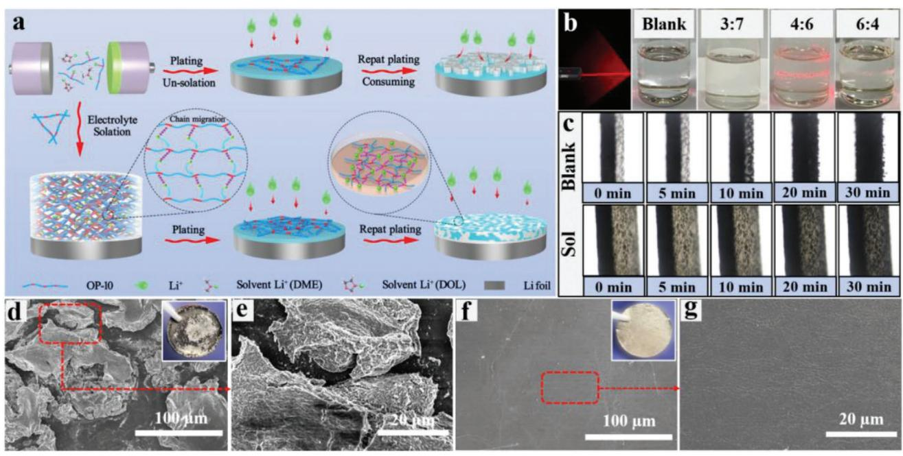
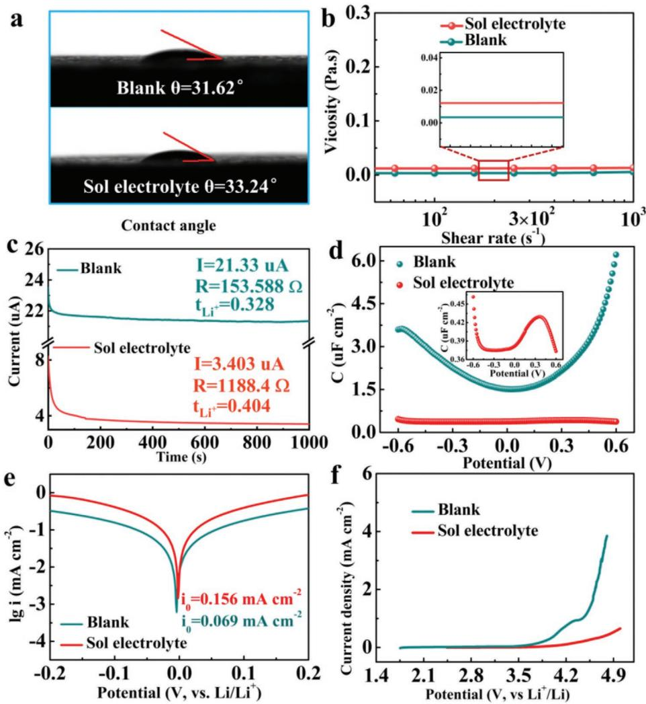
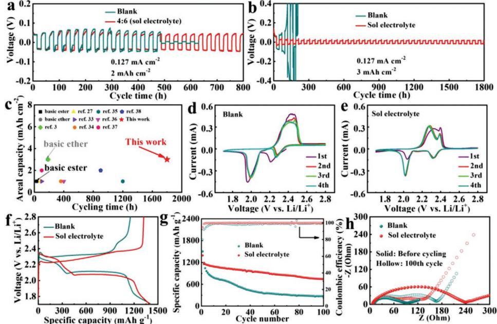
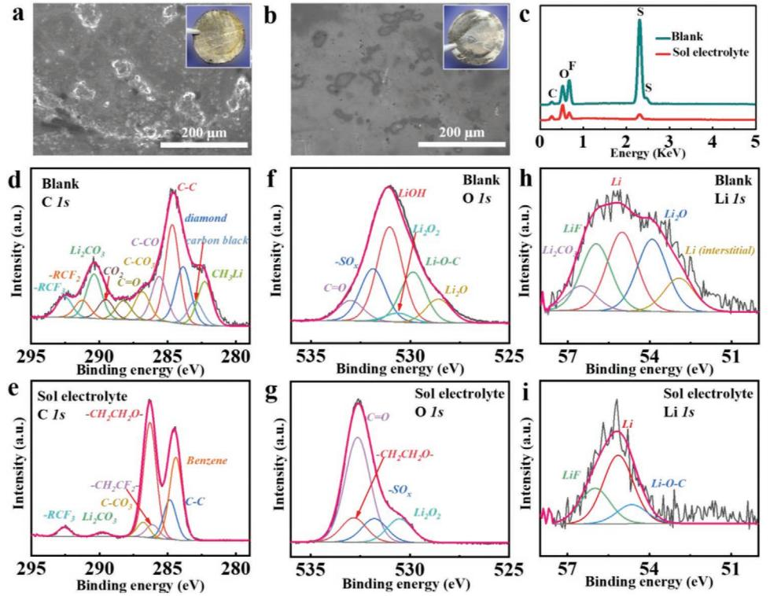
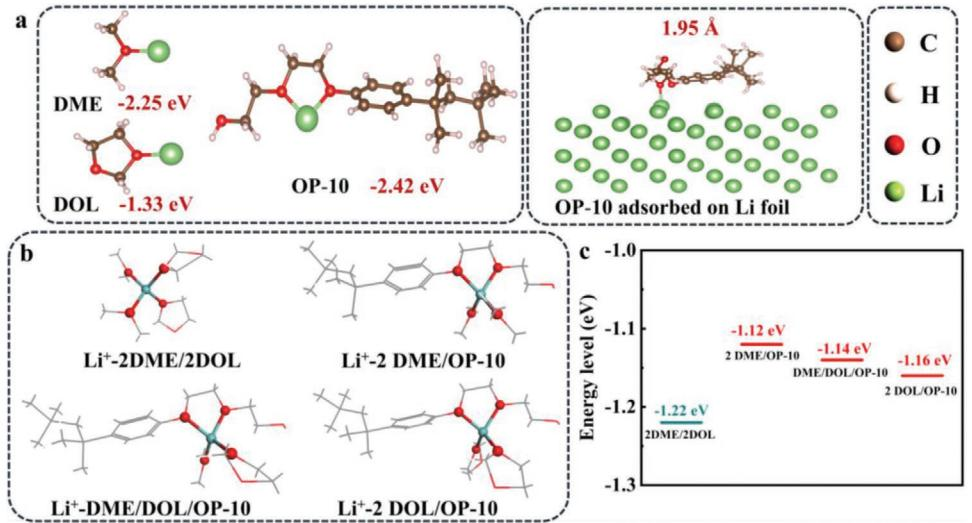
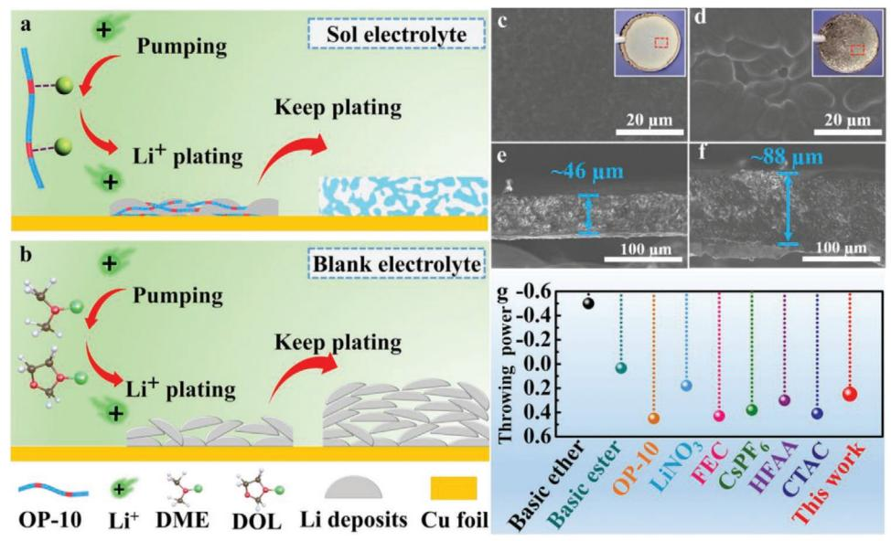

# **Sol Electrolyte: Pathway to Long-Term Stable Lithium Metal Anode**

*Chuang Sun, Jing Dong, Xidi Lu, Yinwei Li, and Chao Lai\**

**Lithium (Li) metal batteries are the subject of intense study due to their high energy densities. However, uncontrolled dendrite growth and the resulting pulverization of Li foil during the repeated plating/stripping process seriously diminish their cycling life. Herein, a facile approach using octaphenyl polyoxyethylene (OP-10)-based sol electrolyte is proposed to alleviate Li anode pulverization. This sol electrolyte possesses better ionic conductivity compared to gel and solid-state electrolytes and also homogenizes Li ion diffusion throughout the entire electrolyte efficiently. As a result, Li/Li symmetric cells using this sol electrolyte demonstrate long-term cycling stability for up to 1800 h, with a plating capacity of 3.0 mAh cm**−**2 without deteriorating the integrity of the thin Li foil. Using a conventional liquid electrolyte, electrode pulverization and battery failure can be observed after just three cycles. More importantly, a parameter of "throwing power" is introduced in a metal Li battery system to characterize the homogenizing ability of Li deposition in different electrolyte systems, which can serve as a guide to the efficient selection of electrolytes for Li metal batteries.**

# **1. Introduction**

The rapid development of electric vehicles and portable devices brings with it an increasing demand for high-energy and stable rechargeable batteries. Li metal is an ideal anode material, with an extra-large theoretical specific capacity (3860 mAh g−1 ), a low mass density (0.534 g cm−3), and the lowest reduction potential (−3.04 V vs the standard hydrogen electrode). Therefore, it can offer a much higher energy density after pairing with suitable cathode materials, such as sulfur or conventional metal oxidebased cathodes, compared to commercial graphite anodes. However, when using conventional liquid electrolytes, the high reactivity of Li metal not only causes serious side reactions that decrease the coulombic efficiency, but also generates massive dendrites during repeated cycling, leading to safety issues, electrode pulverization, and even battery failure.[1,2]

C. Sun, J. Dong, X. Lu, Prof. C. Lai School of Chemistry and Materials Chemistry Jiangsu Normal University Xuzhou, Jiangsu 221116, P. R. China E-mail: laichao@jsnu.edu.cn Prof. Y. Li School of Physics and Electronic Engineering Jiangsu Normal University Xuzhou, Jiangsu 221116, P. R. China

The ORCID identification number(s) for the author(s) of this article can be found under https://doi.org/10.1002/adfm.202100594.

**DOI: 10.1002/adfm.202100594**

To stabilize the Li metal anode, a variety of strategies have been developed, such as electrolyte engineering,[3–6] construction of a Li anode structure,[7–10] designing a Li alloy,[11–14] and modification of the electrode separator.[15–18] Although these strategies are useful for improving the performance of Li metal batteries, the use of solidstate electrolytes has been suggested as the most promising route to overcome the inherent problems of Li metal batteries. The use of nonvolatile, nonflammable, solvent-free polymer electrolytes in solid-state Li batteries can help to reduce the extent of side reactions, prevent the growth of Li dendrites, suppress electrode volume expansion, and prevent battery short circuits due to their high mechanical strength.[19,20] Furthermore, solidstate electrolytes can completely solve the problem of the pulverization of Li foil in commercial batteries, which is the main

problem leading to battery failure, since there is no large excess of Li metal in commercial batteries, as there is in laboratoryscale batteries. However, solid-state electrolytes demonstrate a much lower ionic conductivity and very poor wettability between the solid-state electrolyte and the electrode, which significantly increases the interface impedance and limits the performance of Li metal batteries. Hence, several researchers have developed gel polymer electrolytes to counter this problem. Compared with solid-state electrolytes, gel polymer electrolytes improve the electrode/electrolyte interface characteristics and ionic conductivity at the cost of using a large number of plasticizers. Nevertheless, the ionic conductivity of most gel electrolytes is still below 2 mS cm−1 , which is far below commercial standards.[21–26] In addition, gel polymer electrolytes require a brand new and more expensive battery manufacturing technology.

In summary, a new electrolyte design is needed to solve the problems mentioned above and, at the same time, suppress the long-term pulverization of Li metal. Herein, we demonstrate a novel type of sol electrolyte comprising a commercial electrolyte and octaphenyl polyoxyethylene (OP-10)-based polymer for Li metal batteries, which not only possesses the advantages of solid-state and gel electrolytes, but also has its own unique advantages, such as excellent ionic conductivity and a liquid feature that avoids a change of battery manufacturing technology. Similar to solid-state and gel electrolytes, the strong regulating function of this sol electrolyte depends mainly on the use of functional OP-10 polymer. As shown in **Figure 1**a OP-10 molecules not only homogenize the uniform

**Figure 1.** a) Schematic diagram of lithium (Li) plating in sol electrolyte and electrolyte with 5 vol% OP-10 polymer; b) Tyndall effect test of electrolytes with different OP-10 contents; c) in situ optical microscopy images of Li deposition using conventional liquid and sol electrolytes. The thickness of Li was about 460 µm; d–g) SEM images of Li foil after three cycles at a current density of 0.127 mA cm−2 and a fixed capacity of 2 mAh cm−2 with: d,e) blank electrolyte; f,g) sol electrolyte.

distribution of Li ions throughout the whole electrolyte via a strong complex effect, but also participate in the construction of a robust solid electrolyte interphase (SEI) film at the moment of initial plating, thoroughly addressing the important issue of the uneven dissolution–deposition reaction of the Li anode. The robust SEI layer and the uniformity of the ions in the bulk electrolyte can stabilize the solid-electrolyte interface during long-term cycling compared to the OP-10 additives described in our previous reports,[27] which are gradually consumed during cycling, especially at higher plating capacities. Therefore, a greatly enhanced cycling stability of up to 1800 h at a high plating capacity (3 mAh cm−2) can be obtained using the sol electrolyte described in this study.

### **2. Results and Discussion**

The sol state of an electrolyte can be simply verified via measurement of the Tyndall effect. As shown in Figure 1b and Figure S1 (Supporting Information), when the laser light passed through a conventional liquid electrolyte ("blank electrolyte") and the electrolytes containing different concentrations of OP-10, a clear light path was observed from the direction perpendicular to the incident light in the electrolyte containing 40 vol% OP-10 ("sol electrolyte"), indicating that the electrolyte with 40 vol% OP-10 was colloidal. The uniform distribution of the colloidal particles also can be confirmed by the results of polarizing microscope (Figure S2, Supporting Information). Under these conditions, the long-chain OP-10-adsorbed Li ions exist in the electrolyte as a stable suspension, which allowed the Li ions to be transported in a chain migration mechanism similar to a solid-electrolyte during cycling, successfully addressing the problem of dendrite growth. Transparent symmetric cells were first assembled using an optical microscope to monitor the Li plating in situ. An uninterrupted current of 1 mA cm−2 for 30 min was applied in order to conduct the plating measurements. As shown in Figure 1c during the initial deposition stage, the surfaces of Li metal in both of the blank and sol electrolytes were smooth with no obvious protuberance. After 10 min deposition, obvious protrusions were observed on the surface of the Li foil in the blank electrolyte, which gradually turned into Li dendrites with further deposition. In contrast, the surface of Li metal in the sol electrolyte remained smooth and free of dendrites during the whole plating process, which may be due to the uniform Li deposition and the formation of a sturdy solid-electrolyte interface film comprising cross-linked polymer resulted from OP-10.

The morphology of the Li foil following cycling was used as direct evidence for uniform Li deposition. Hence, scanning electron microscopy (SEM) was conducted to gain insights into the integrity of the Li foil after three cycles at a current density of 0.127 mA cm−2 and a fixed capacity of 2 mAh cm−2 , for which a thin Li foil with a thickness of 100 µm was chosen. Remarkable differences in the Li foil morphology were observed. In the case of the blank electrolyte, complete pulverization of the Li foil was clearly seen (Figure 1d,e). For the sol electrolyte, a compact and integrated Li foil was maintained under the same conditions (Figure 1f,g), indicating that the pulverization was basically inhibited. To further illustrate the unique advantages of the sol electrolyte, the Li foil was also tested using electrolyte with 5% OP-10 additives under the same conditions. As shown in Figure S3 (Supporting Information), cracks could still be

**www.advancedsciencenews.com www.afm-journal.de**

**Figure 2.** Testing of: a) contact angle; b) viscosity; c) chronoamperometric curves; d) differential capacitance curves; e) Tafel curves of Li/Li symmetric cells; f) linear sweep voltammetry (LSV) in conventional liquid and sol electrolytes.

observed, especially at the edge of the Li foil, which seriously limits the long-term cycling life of these cells. The sol electrolyte can better regulate the uniform deposition of Li ions, and so better maintain the integrity of the SEI film during cycling at high plating/stripping capacities to alleviate the issue of pulverization of the Li anode compared to the conventional strategy using electrolyte additives.

In order to explain the efficient regulating function of the sol electrolyte, its intrinsic properties, such as conductivity, contact angle, and viscosity must first be studied. As shown in **Figure 2**a,b, both the contact angle and the viscosity of the sol electrolyte had a negligible increment compared to the blank electrolyte, indicating that the sol electrolyte possessed similar transport properties and wettability. At the same time, as we predicted, the ionic conductivity of the sol electrolyte (Figure S4, Supporting Information) decreased dramatically to 2.41 mS cm−1 at room temperature, and such a value far exceeds the ionic conductivity of most gel polymer electrolytes.[21–26] The uniform structure of the sol electrolyte also contributes to other unique advantages, including a high dielectric constant and ion migration number, as shown in Figure 2c and Figure S5 (Supporting Information), which is calculated from the EIS results in Figure S6 (Supporting Information). For the same Li salt content, the higher the dielectric constant of the electrolyte, the more easily the Li salt dissolves. Such an enhancement can be attributed mainly to the strong complexation between Li ions and OP-10 in the sol electrolyte, which can reduce the presence of solvated ions and ensure rapid Li ion transport via chain transfer that enhances ionic mobility.

Except for the higher ionic conductivity, as compared to the gel electrolyte, the advantages of using OP-10-based sol electrolyte were also reflected in the strong regulating effect on Li deposition and the construction of a robust SEI film. Differential capacitance testing was first conducted in order to demonstrate the adsorption of OP-10 molecules on the Li anode. As shown in Figure 2d the value of the differential capacitance dropped dramatically compared to the blank electrolyte, indicating that massive OP-10 molecules were absorbed on the Li anode and formed a dense double electric layer.[28,29] During cycling, massive OP-10 molecules participated in the formation of the SEI film and produced a functional solid layer as a solidstate electrolyte to enable rapid Li ion transport, which was confirmed by the Tafel curves shown in Figure 2e. Generally, the larger the exchange current density, the faster the lithium ions diffuse in the SEI film.[30–34] The exchange current density (0.156 mA cm−2 ) of the cell using a sol electrolyte was much greater than that of a cell containing a blank electrolyte (0.069 mA cm−2 ), indicating that the thin and stable SEI film formed in the sol electrolyte was more favorable for Li ion transmission.

Oxidative stability is another vital factor for evaluating whether a sol electrolyte can be used in different battery systems. From the linear sweep voltammetry (LSV) tests (Figure 2f), it can be seen that when charging exceeded 3.8 V, the current density of the blank electrolyte increased abruptly due to the inherent poor oxidative stability of the free ether solvent in the electrolyte.[35] The sol electrolyte, on the other hand, maintained a low current density within 4.3 V. This wider electrochemical window is beneficial for expanding the available voltage range of Li metal batteries. By combining all of the above results, it can be concluded that our designed sol electrolyte possesses a much higher ionic conductivity compared to gel and solid-state electrolytes and, at the same time, can act like a gel or solid-state electrolyte to protect the Li anode under practical testing conditions.

As discussed above, a highly stable interface and well-regulated Li deposition induced via a sol electrolyte can contribute to the long-term cycling life. A Li/Li symmetric cells test was carried out in order to evaluate the Li deposition/stripping behavior. As shown in **Figure 3**a the cells with the blank electrolyte that were tested at a current density of 0.127 mA cm−2 and a fixed capacity of 2 mAh cm−2 presented noisy voltage curves after about 80 h. Resulting from the unstable interface and the continuous consumption of electrolyte, the cells finally shortcircuited after 480 h. In contrast, the overpotentials of the cells using the sol electrolyte were maintained at a stable level for 800 h. When the fixed capacity was increased to 3 mAh cm−2 , the difference in performance of the cells using the two electrolytes became more obvious (Figure 3b). The cells using the blank electrolyte appeared to be damaged within 180 h, while the cells with the sol electrolyte were stable for 1800 h. Notably, such a long-term cycle life under a high areal capacity of 3 mAh cm−2 for our sol electrolyte outperformed all other previously reported electrolyte systems (Figure 3c).[27,36–43] For comparison, the symmetric cells were also tested in an electrolyte with 5% additives (Figure S7, Supporting Information), and short-circuit occurred after 210 h, indicating that the sol electrolyte demonstrated better regulating ability compared to the electrolyte containing a lower proportion of OP-10 additives. The enhanced cycling life can be explained by the results of electrochemical impedance spectroscopy (EIS) measurements (Figure S8, Supporting Information). The equivalent circuits and fitting results are provided in Figure S9 and Table S1 (Supporting Information). Before cycling, the charge transfer resistance (*R*ct) of the cell using sol electrolyte was much higher (1045 Ω) than that of the cell using blank electrolyte (217 Ω), which may because massive OP-10 molecules in the sol electrolyte were adsorbed on the Li anode. After three cycles, the cell with sol electrolyte displayed decreased *R*ct of 315.9 Ω. In contrast, the cell with blank electrolyte presented a large increase in *R*ct (659.5 Ω), which is caused by the dendrite growth and pulverization of the Li foil. The cracks in the Li

**Figure 3.** Li plating/stripping tests of Li/Li symmetric cells using conventional liquid or sol electrolyte at a current density of 0.127 mA cm−2 and a fixed capacity of: a) 2 mAh cm−2 ; b) 3 mAh cm−2 ; c) comparison of areal capacity and cycle life of various electrolyte systems. Cyclic voltammograms of Li–S battery containing: d) blank electrolyte; e) sol electrolyte; f) charge–discharge curves of the assembled Li–S batteries using blank and sol electrolytes at a current density of 0.2 C; g) cyclic performance of Li–S batteries with the two electrolytes at a current density of 0.2 C; h) electrochemical impedance spectroscopy (EIS) of Li–S full batteries with blank and sol electrolytes before cycling and following 100 cycles at a current density of 0.2 C.

foil appeared just after the initial cycle in the blank electrolyte at a current density of 0.127 mA cm−2 and a fixed capacity of 2 mAh cm−2 (Figure S10, Supporting Information), and complete pulverization occurred after just three cycles (Figure 1d,e). In strong contrast, the Li foil using the sol electrolyte maintained integrity, with a flat surface after three cycles (inset of Figure 1f), and the dendrite growth problem was basically resolved. The pulverization of Li foil has always been neglected in coin cells, as the sizes of Li anodes are all excessive, while it is actually a critical issue for commercial Li metal batteries such as pouch cells. Thus, the sol electrolyte possesses unique advantages in inhibiting the pulverization of Li metal anodes compared to blank electrolyte and, moreover, the liquid state and higher ionic conductivity of sol electrolyte are both favorable for its application in a wider range of storage systems compared to gel and solid-state electrolytes.

To further evaluate the electrochemical performance of the sol electrolyte, full cells of lithium–sulfur (Li–S) batteries were assembled, with the potential set between 1.7 and 2.8 V. Cyclic voltammetry (CV) scans of the Li–S full batteries using the two different electrolytes were run. As shown in Figure 3d,e, the batteries using the sol electrolyte demonstrated a much lower overpotential (0.285 V) than those using the blank electrolyte (0.468 V) after the initial cycle, indicating a better reversibility and kinetic performance during cycling.[44] In sol electrolyte, the two sharp oxidation peaks at 2.27 and 2.38 V versus Li/Li+ during anodic scan can be attributed the transformation of Li2S to high-order Li2S*n* and eventually to S8, respectively. Next, the cycle stabilities of the full batteries with the two different electrolytes were evaluated at a current density of 0.2 C. Figure 3f shows the initial charge–discharge curves of the Li–S batteries containing the conventional liquid and sol electrolytes, which shows that the voltage curves of the two batteries were basically identical and that the difference in the first cycle discharge capacity of the full battery with sol electrolyte was negligible compared to that of the blank electrolyte. In addition, increasing capacity from 712.3 to 752.3 mAh g–1 corresponding to the second plateau can be observed after using sol electrolyte, further indicating that the dissolution of active materials are well suppressed. In Figure 3g the battery using the blank electrolyte showed a high initial discharge capacity of 1412.2 mAh g−1 , but after 100 cycles the capacity rapidly decayed to 275.1 mAh g−1 . Although the discharge capacity (1394.9 mAh g−1 ) of the first cycle for the sol electrolyte was lower than that of the blank electrolyte, the battery still retained a high discharge capacity of 744.7 mAh g−1 after 100 cycles, indicating a remarkable cycle stability. In particular, the initial coulombic efficiency was enhanced from 80.06% to 94.81% using the sol electrolyte. The rate capability of Li–S batteries in different electrolytes system at rates from 0.2 to 2C was also investigated and the results were given in Figure S11 (Supporting Information). At a high rate of 2C, a high discharge capacity of 837.4 mAh g–1 still can be achieved using sol electrolyte, in contrast to 438.8 mAh g–1 in the cell of conventional electrolyte. For practical applications, loading mass of electrode is one of the key parameters, and thus discharge-charge performance of high-loading mass sulfur electrode were given in Figure S12 (Supporting Information). It can be seen the potential plateau are well retained, and high capacity of 953 mAh g–1 still can be achieved in sol electrolyte even the loading mass of electrode reach up to 6.3 mg cm–2. The balanced electron transfer and Li ion diffusion of the sulfur cathodes in the two electrolyte systems were also confirmed in the EIS. From Figure 3h and Table S2 (Supporting Information), it can be seen that the *R*ct of the sulfur cathode before cycling in the blank electrolyte was much smaller (72.81 Ω) than that in the sol electrolyte (218 Ω). This result can readily verify why the initial discharge capacity in the sol electrolyte was slightly lower than that in the blank electrolyte. However, after 100 cycles, *R*ct of the full cell using sol electrolyte decreased to 54.62 Ω, which was smaller than that of the blank electrolyte (101 Ω), further confirming the stable electrode-electrolyte interface in sol electrolyte.

For the Li–S battery, as well as the protecting effect of the Li foil, as shown in **Figure 4**a,b, the inhibition of the polysulfide shuttle from the OP-10 or something else also contributed to the improvement in cycling performance. As shown in the inset, the Li foil used in the blank electrolyte turned yellow, while the surface of the Li foil in the sol electrolyte remained shiny. The inhibition of polysulfide shuttling can be directly illustrated by the dissolution experimental. As shown in Figure S13 (Supporting Information), Li2S6 dissolves rapidly in blank electrolyte. While it is suspended in the upper part in sol electrolyte, indicating its slow diffusion in sol electrolyte. The elemental analysis in Figure 4c and Figure S14 (Supporting Information) further confirmed the role of sol electrolyte in inhibiting the dissolution and transport of polysulfide. The X-ray photoelectron spectroscopy (XPS) analysis of Li anodes of Li–S battery in conventional liquid and sol electrolytes are also provided (Figure S15, Supporting Information), and it can be seen the results are well consistent with those of elemental analysis. The surficial chemical composition of the Li anode after cycling in the two electrolyte systems was further examined by XPS to disclose the underlying mechanism (Figure 4d–i). For the Li foil extracted from sol electrolyte, phenyl group is detected from the C 1s spectra, which can be attributed to the reaction product of OP-10 additive in SEI. Overall, there were many peaks corresponding to inert substances produced by side reactions in the C 1s, O 1s, and Li 1s XPS spectra throughout the entire SEI obtained in the blank electrolyte, while the peaks formed in the sol electrolyte corresponded mainly to ethylene oxide groups and benzene groups, which can be attributed to the existence of OP-10.[27] The depth profile of XPS data of Li anode were provided in Figure S16 (Supporting Information). It can be seen that LiOC bond can be observed even when the etching depth is 500 nm, indicating that OP-10 was involved in the whole process of SEI film formation. Fourier Transform (FTIR) spectra of Li metal electrodes after cycling in blank and sol electrolytes are given in Figure S17 (Supporting Information). The cycled electrodes were hermetically closed in optical cells with a KBr window. The absorbance of the Li electrodes cycled in sol electrolyte is higher than that of Li electrodes cycled in blank electrolyte, indicating that denser or thicker surface films are formed on the surface of Li electrodes after cycling in sol electrolyte.[45] Consequently, It can be concluded from the XPS and FTIR results that OP-10 participated in the formation of SEI to produce a robust protective layer and inhibited side reactions between the Li metal and the electrolyte.

**Figure 4.** Scanning electron microscopy (SEM) image and corresponding optical picture of Li foil surface after 5 cycles of Li–S battery containing: a) blank electrolyte; b) sol electrolyte; c) elemental mapping images of Li foil after 5 cycles of Li–S battery with conventional liquid and sol electrolytes; C 1s, O 1s, and Li 1s spectra of the Li anode in: d–i) conventional liquid and sol electrolytes.

To gain fundamental insights into the sol electrolyte, the function of OP-10 was investigated by means of first-principle calculations, and the results are presented in **Figure 5**a The C–O groups in OP-10 showed the highest binding energy to Li ion compared to the solvent molecules, and thus OP-10 preferentially coordinated with Li ions, which had the effect of homogenizing the Li ion distribution throughout the entire electrolyte. In addition, during the plating/stripping process, the diffusion of Li ions was more dependent on chain transfer similar to the solid-state and gel electrolytes, as shown in Figure 1a and not on the migration of solvated Li ions. The stable 3D polymer structure and the chain migration of Li ions produced a homogeneous ionic flux during the deposition process and avoided the generation of unbalanced electric fields to

**Figure 5.** a) The binding energy between Li ion and different molecules and adsorption conformation between OP-10 molecule and Li metal; b) Simulated lithium ion solvation environment and the c) corresponding coordinate bond energy of lithium ion in different mixed solvents.

**Figure 6.** Migrating behavior of Li ions in a) sol electrolyte and in b) blank electrolyte; SEM images of Li deposition on copper substrate in c,e) sol electrolyte and in d,f) blank electrolyte at a current density of 0.127 mA cm–2 with a fixed capacity of 3 mAh cm–2; g) Comparison of throwing power and cycle life of various electrolyte systems.

suppress dendrite growth. Furthermore, Figure 5a also shows the adsorption conformation of OP-10 molecules on the surface of the Li metal, the distance between which was only 1.95 Å, suggesting that OP-10 could anchor strongly to the surface of the Li anode via the formation of LiOC bonds (Figure 4i). Besides, the sheath of solvation of lithium ion was also simulated by DFT calculation (Figure 5b,c). As for the solvent molecules, the coordination mainly occurs between the oxygen atom and lithium ion. The calculated binding energies show that the introduction of OP-10 can partly improve the interaction between original ion and solvent, thus the ion migration barrier can be alleviated in the sol electrolyte. Thus, a robust and compact SEI film could be generated during the plating process with such a surface cross-linked polymer skeleton to ensure the stability of the interface (**Figure 6**a), while Li displayed a loose structure following deposition in the blank electrolyte, which created convenient conditions for the occurrence of side reactions (Figure 6b). These two phenomena are clearly reflected in the SEM of the deposited Li (3 mAh cm−2 ) on copper foil. The Li deposited on copper foil in sol electrolyte displayed a uniform and smooth surface (Figure 6c), with a thickness of only 46 µm and a highly dense distribution (Figure 6e). For the blank electrolyte, a porous structure with an irregular massif-like 3D Li metal can be clearly seen (Figure 6d), and the thickness of the deposits was up to 88 µm (Figure 6f). The stripping process of Li is also vital in the charge-discharge process of lithium metal batteries. As shown in Figure S18 (Supporting Information), the deposited lithium can be thoroughly stripped off from substrate to form flat surface in sol electrolyte, while in blank electrolyte, obvious dead lithium is still left on substrate after long-time striping.

In order to further reveal the modifying mechanisms in sol electrolyte, the concept of "throwing power" was introduced in metal Li batteries, which is a parameter of the ability of a plating to cover uniformly.[46–48] The throwing power of various electrolytes can be tested using the Hull cell method, the formula for which is[46–48]

$$
T = \left(1 - \frac{M_1}{M_2 \times K}\right) \times 100\%
$$
\n(1)

where *T* is the throwing power of the electrolyte, *K* is the distance ratio between the far and near cathode to anode, and *M*1 and *M*2 are the qualities of the coatings on the near and far cathodes, respectively. The better the throwing power of the electrolyte, the more uniform the deposits on the electrode obtained in the electrolyte. As can be seen in Figure 6g the throwing powers of basic ether (1 m LiTFSI in DME:DOL = 1:1 vol%) and ester electrolyte (1 m LiPF6 in EC:DMC:EMC = 1:1:1 vol%) were −50% and 3.4%. For the sol electrolyte, the throwing power can reach up to 25%, a value much higher than that of the basic ether electrolyte. In addition, we tested the other liquid electrolytes with different additives reported previously, and the throwing powers of electrolytes with 1 wt% lithium nitrate (LiNO)3, 5 vol% hexafluoroacetone (HFAA), 1.2 × 10−3 m hexadecyl trimethylammonium chloride (CTAC), 30 vol% Fluoroethylene carbonate (FEC), 5 vol% OP-10, and 0.05 m cesium hexafluorophosphate (CsPF6) were 18%, 30%, 41%, 43%, 45%, and 38%, respectively. It can be seen that the electrolytes with various additives all presented much higher throwing power compared to the basic electrolyte. In this way, different electrolyte systems could be directly compared for their regulating effect on the uniformity of electroplating on Li anode surfaces.[27,36–43] For example, the cells using an electrolyte containing 30 vol% FEC showed a much better cycling performance compared to cells using an electrolyte with 5 vol% HFAA. In addition, although the sol electrolyte presented a lower value of throwing power compared to the electrolyte with 5 vol% OP-10, it showed a much better protective effect for alleviating Li anode pulverization. This could be attributed mainly to the fact that **www.advancedsciencenews.com www.afm-journal.de**

the cross-linked skeleton throughout the entire electrolyte maintained a stable interface during repeated cycling, and thus offered a much longer cycling life of up to 1800 h compared to other liquid electrolytes with different additives.

# **3. Conclusion**

In summary, we have proposed a new design of sol electrolyte based on OP-10, to inhibit Li foil pulverization. Different than the previous strategy of using electrolyte additives, after participating in the construction of a robust SEI film to stabilize the electrode/ electrolyte interface, the sol electrolyte still possessed a stable cross-linked polymer network with which to complex with Li ions in order to homogenize the Li ion flux throughout the entire electrolyte to fully address the issue of dendrite growth, thus offering long-term cycle stability even under practical testing conditions. Combining all of these advantages, in Li/Li symmetric cells, the cells with the sol electrolyte exhibited an ultralong cycle life of 1800 h without Li pulverization, even under a high plating capacity of 3 mAh cm−2 . In addition, in the Li–S full battery, the sulfur cathode showed a stable cycling performance, and the discharge capacity was maintained at 744.7 mAh g−1 after 100 cycles at a current density of 0.2 C using sol electrolyte. As a comparison, a capacity of only 275.1 mAh g−1 was attained using blank electrolyte. To better characterize the homogenization ability, we introduce the parameter of "throwing power" in order to evaluate the regulating ability of uniform Li deposition in different electrolyte systems, for which the sol electrolyte presented a much higher throwing power of ≈25% compared with blank electrolyte (−50%). This finding suggests an alternative recipe for the electrolytes chosen to be used in Li metal batteries.

# **4. Experimental Section**

*Electrochemical Measurements*: The Li plating/stripping test for Li/Li symmetric cells was performed at 0.127 mA cm−2 with fixed capacities of 2 and 3 mAh cm−2 (one Li foil was 100 µm and the other was 460 µm). The blank electrolyte was 1 m LiTFSI dissolved in a mixed solution of dimethyl ether (DME) and 1,3-dioxolane (DOL) (DME:DOL = 1:1 vol%), which was defined as "blank electrolyte" (used in the figures). The content of OP-10 in the electrolyte was 30, 40, 60, 70, or 80 vol% (Li salt concentration remained at 1 m). The volume of electrolyte used in the assembly process was 30 µL. The ionic conductivity of the electrolyte was tested using a DDS-307A conductivity meter (INESA Scientific Instrument Co., Ltd, Shanghai, China). The Li ion transference numbers of the Li/Li symmetric cells both without and with 40 vol% OP-10 were calculated from their chronoamperometric profiles. Differential capacitance measurements were conducted using a Solartron 1287 electrochemical workstation (AMETEK Advanced Measurement Technology, Leicester, UK) in a Li/Li symmetric cell. Tafel curves were obtained in a Li/Li symmetric cell (scan rate: 1 mV s−1 ) on a CHI604E electrochemical workstation (Chenhua Instrument Co., Shanghai). Linear sweep voltammetry (LSV) was run in a Li/Cu cell at a scan rate of 10 mV s−1 from open circuit voltage to 5 V. The CNTs@50%S composite electrode was prepared as follows. Carbon nanotubes and high-purity sulfur were mixed uniformly at a mass ratio of 1:1 under argon gas protection at 155 °C for 12 h. To fabricate the CNT@S electrode, the powder containing the CNTs and high-purity sulfur, superconducting carbon, and polyvinylidene fluoride (PVDF) were ground into a paste slurry (1-methyl-2-pyrrolidinone solvent) in mass ratios of 7:2:1. Finally, the slurry was coated on aluminum foil and placed in an oven at 80 °C for 6 h. The mass loading of electrolytes are around 1.0–1.2 mg cm–2. For practical applications, sulfur cathodes with high loading mass up to 6.3 mg cm–2 were also fabricated. The capacity were calculated based on the mass of sulfur. Cyclic voltammograms of Li/CNTs@50%S full batteries at a scan rate of 0.05 mV s−1 between 1.7 and 2.8 V were run on the CHI604E workstation. Li/CNTs@50%S (1 C = 1675 mAh g−1 ) full batteries using 100 µm ultra-thin Li foils were scanned over the voltage ranges 1.7–2.8 V. Before assembling the battery, the composite materials were soaked in 1 m LiTFSI electrolyte (DME:DOL = 1:1 vol%). EIS of the Li/Li symmetric cells and Li/CNTs@50%S full batteries was carried out using the CHI604E workstation. The cathodes used in the throwing power test were two copper foils with a diameter of 8 mm coated with varnish on the back, and the anode was a Li foil with 8 mm diameter holes. The current density was 0.5 mA cm−2 , and the distance ratio between the far and near copper foils was 2.

*Calculations*: The binding energy (Eb) was defined as E E b t = − otal E E M − Li+, where Etotal, EM, and ELi+ represent the total energy, molecule, and Li+ ion, respectively. For the DME and DOL solvents, density functional theory (DFT) calculations were performed using the Gaussian 09 program package with the hybrid B3LYP functional and the 6−311+G(d, p) basis set. For the OP-10 polymer, DFT calculations were performed using the Vienna Ab initio Simulation Package (VASP). The general gradient approximation (GGA) of Perdew–Burke–Ernzerdof (PBE) was employed for the exchange correlation functional. The projector augmented wave (PAW) method was used to describe the electron-core interactions, with a kinetic energy cutoff of 500 eV. Brillouin zones were sampled with a grid of a 1 × 1 × 1 Gamma special *k*-point for the 6 × 6 × 1 Li (111) supercell. A vacuum layer of 15 Å in the vertical direction was chosen to model the slab to avoid lateral interactions between the layer and its images. The top two layers were allowed to fully relax, while the bottom two layers were fixed. The convergence criterion for the electronic self-consistent cycle was fixed at 0.01 meV per cell. The geometry optimization was halted when the forces on all unconstrained atoms were less than 0.05 eV Å−1 . In terms of sheath of solvation of lithium ion, the DFT calculations were performed using the hybrid B3LYP functional. Basis sets of def2-TZVP were adopted for all atoms in the complexes with decontracted auxiliary def2-TZVP/J Coulomb fitting basis sets. The average binding energy *E*(abe.) is calculated by *E*(abe.) = [*E*(total) − *E*(Li+) − *E*(solvation molecules)]/4.

*Characterization*: SEM and corresponding energy dispersive spectrum (EDS) analyses of the Li foil were conducted using a Hitachi SU8010 ultrahigh resolution scanning electron microscope (Hitachi, Tokyo, Japan). Before the SEM test, the electrodes were washed with 1,3-dioxolane (DOL) to remove excess electrolyte and then placed in a glove box to dry completely. XPS was conducted on a K-Alpha photoelectron spectrometer (Thermo Fisher Scientific, Waltham, MA, USA) equipped with a monochromatic Al K*α* X-ray source (1486.6 eV) operating at 100 W. The viscosity of the electrolyte was obtained using a TA-DHR2 rheometer (TA Instruments, New Castle, DE, USA). An automatic contact angle tester (JC2000D3M, Powereach, China) was used to characterize the wettability of various electrolytes on the surface of Li foil. The dielectric constants of the electrolytes were measured using a Concept 90 dielectric analyzer (Novocontrol Technologies, Montabaur, Germany). IR was conducted on a Nicolet IS5 infrared spectrometer. The cycled electrodes were hermetically closed in optical cells with a KBr window.

# **Supporting Information**

Supporting Information is available from the Wiley Online Library or from the author.

### **Acknowledgements**

C.S. and J.D. contributed equally to this work. This work was supported by the National Natural Science Foundation of China (No. 51871113) **www.advancedsciencenews.com www.afm-journal.de**

and Natural Science Foundation of Jiangsu Province (BK20200047). The authors thank to Prof. Jianmin Ma (School of Physics and Electronics, Hunan University, Changsha, 410082, China; E-mail: nanoelechem@hnu.edu.cn) for his support in theoretical calculations.

# **Conflict of Interest**

The authors declare no conflict of interest.

# **Data Availability Statement**

Research data are not shared.

#### **Keywords**

lithium anode, lithium batteries, pulverization, sol electrolyte, throwing power

- Received: January 19, 2021
- Revised: April 4, 2021
- Published online: April 20, 2021
- [1] D. Lin, Y. Liu, Y. Cui, *Nat. Nanotechnol.* **2017**, *12*, 194.
- [2] B. Liu, J. Zhang, W. Xu, *Joule* **2018**, *2*, 833.
- [3] S. Li, W. Zhang, Q. Wu, L. Fan, X. Wang, X. Wang, Z. Shen, Y. He, Y. Lu, *Angew. Chem., Int. Ed.* **2020**, *59*, 14935.
- [4] Q. Ma, X. Zhang, A. Wang, Y. Xia, X. Liu, J. Luo, *Adv. Funct. Mater.* **2020**, *30*, 2002824.
- [5] E. Markevich, G. Salitra, F. F. Chesneau, M. Schmidt, D. Aurbach, *ACS Energy Lett.* **2017**, *2*, 1321.
- [6] Z. Yu, H. Wang, X. Kong, W. Huang, Y. Tsao, D. G. Mackanic, K. Wang, X. Wang, W. Huang, S. Choudhury, Y. Zheng, C. V. Amanchukwu, S. T. Hung, Y. Ma, E. G. Lomeli, J. Qin, Y. Cui, Z. Bao, *Nat. Energy* **2020**, *5*, 526.
- [7] X. Chen, B. Li, C. Zhu, R. Zhang, X. Cheng, J. Huang, Q. Zhang, *Adv. Energy Mater.* **2019**, *9*, 1901932.
- [8] L. Luo, J. Li, H. Y. Asl, A. Manthiram, *Adv. Mater.* **2019**, *31*, 1904537.
- [9] H. Wang, D. Lin, J. Xie, Y. Liu, H. Chen, Y. Li, J. Xu, G. Zhou, Z. Zhang, A. Pei, *Adv. Energy Mater.* **2019**, *9*, 1802720.
- [10] Z. Zheng, Q. Su, Q. Zhang, X. Hu, Y. Yin, R. Wen, H. Ye, Z. Wang, Y. Guo, *Nano Energy* **2019**, *64*, 103910.
- [11] K. R. Adair, M. Iqbal, C. Wang, Y. Zhao, M. N. Banis, R. Li, L. Zhang, R. Yang, S. Lu, X. Sun, *Nano Energy* **2018**, *54*, 375.
- [12] Y. Gao, R. Yi, Y. C. Li, J. Song, S. Chen, Q. Huang, T. E. Mallouk, D. Wang, *J. Am. Chem. Soc.* **2017**, *139*, 17359.
- [13] X. Wu, W. Zhang, N. Q. Wu, S. S. Pang, Y. Ding, G. He, *Adv. Energy Mater.* **2021**, *11*, 2003082.
- [14] M. Wan, S. Kang, L. Wang, H. Lee, G. W. Zheng, Y. Cui, Y. Sun, *Nat. Commun.* **2020**, *11*, 1.
- [15] J. Bae, Y. Qian, Y. Li, X. Zhou, J. B. Goodenough, G. Yu, *Energy Environ. Sci.* **2019**, *12*, 3319.
- [16] Y. He, Z. Chang, S. Wu, Y. Qiao, S. Bai, K. Jiang, P. He, H. Zhou, *Adv. Energy Mater.* **2018**, *8*, 1802130.
- [17] J. Liang, Q. Chen, X. Liao, P. Yao, B. Zhu, G. Lv, X. Wang, X. Chen, J. Zhu, *Angew. Chem., Int. Ed.* **2020**, *59*, 6561.
- [18] C. Zhao, P. Chen, R. Zhang, X. Chen, B. Li, X. Zhang, X. Cheng, Q. Zhang, *Sci. Adv.* **2018**, *4*, eaat3446.
- [19] X. Cheng, C. Zhao, Y. Yao, H. Liu, Q. Zhang, *Chem* **2019**, *5*, 74.
- [20] L. Fan, S. Wei, S. Li, Q. Li, Y. Lu, *Adv. Energy Mater.* **2018**, *8*, 1702657. [21] K. Dai, C. Ma, Y. Feng, L. Zhou, G. Kuang, Y. Zhang, Y. Lai, X. Cui,
- W. Wei, *J. Mater. Chem. A* **2019**, *7*, 18547.
- [22] X. Guan, Q. Wu, X. Zhang, X. Guo, C. Li, J. Xu, *Chem. Eng. J.* **2020**, *382*, 122935.
- [23] C. Li, B. Qin, Y. Zhang, A. Varzi, S. Passerini, J. Wang, J. Dong, D. Zeng, Z. Liu, H. Cheng, *Adv. Energy Mater.* **2019**, *9*, 1803422.
- [24] J. Shi, Y. Yang, H. Shao, *J. Membr. Sci.* **2018**, *547*, 1.
- [25] X. Wang, X. Hao, D. Cai, S. Zhang, X. Xia, J. Tu, *Chem. Eng. J.* **2020**, *382*, 122714.
- [26] D. Xu, J. Su, J. Jin, C. Sun, Y. Ruan, C. Chen, Z. Wen, *Adv. Energy Mater.* **2019**, *9*, 1900611.
- [27] H. Dai, X. Gu, J. Dong, C. Wang, C. Lai, S. Sun, *Nat. Commun.* **2020**, *11*, 1.
- [28] M. Jitvisate, J. R. T. Seddon, *J. Phys. Chem. Lett.* **2018**, *9*, 126.
- [29] V. Lockett, M. D. Horne, R. Sedev, T. Rodopoulos, J. Ralston, *Phys. Chem. Chem. Phys.* **2010**, *12*, 12499.
- [30] Z. Jiang, Z. Zeng, C. Yang, Z. Han, W. Hu, J. Lu, J. Xie, *Nano Lett.* **2019**, *19*, 8780.
- [31] X. Q. Zhang, T. Li, B. Q. Li, R. Zhang, Q. Zhang, *Angew. Chem., Int. Ed.* **2019**, *132*, 3278.
- [32] R. H. Wang, W. S. Cui, F. L. Chu, F. X. Wu, *J. Energy Chem.* **2020**, *48*, 145.
- [33] J. Liu, H. Yuan, X. Y. Tao, Y. R. Liang, S. J. Yang, J. Q. Huang, T. Q. Yuan, M. M. Titirici, Q. Zhang, *EcoMat* **2020**, *2*, 12019.
- [34] J. Liu, R. Xu, C. Yan, H. Yuan, J. F. Ding, Y. Xiao, T. Q. Yuan, J. Q. Huang, *Energy Storage Mater.* **2020**, *30*, 27.
- [35] F. Qiu, X. Li, H. Deng, D. Wang, X. Mu, P. He, H. Zhou, *Adv. Energy Mater.* **2019**, *9*, 1803372.
- [36] J. Dong, H. Dai, Q. Fan, C. Lai, S. Zhang, *Nano Energy* **2019**, *66*, 104128.
- [37] N. W. Li, Y. X. Yin, J. Y. Li, C. H. Zhang, Y. G. Guo, *Adv. Sci.* **2017**, *4*, 1600400.
- [38] H. Sun, G. Zhu, Y. Zhu, M.-C. Lin, H. Chen, Y.-Y. Li, W. H. Hung, B. Zhou, X. Wang, Y. Bai, M. Gu, C.-L. Huang, H.-C. Tai, X. Xu, M. Angell, J.-J. Shyue, H. Dai, *Adv. Mater.* **2020**, *32*, 2001741.
- [39] W. Chen, Y. Hu, W. Lv, T. Lei, C. Yan, *Nat. Commun.* **2019**, *10*, 4973.
- [40] H. Dai, K. Xi, X. Liu, C. Lai, S. Zhang, *J. Am. Chem. Soc.* **2018**, *140*, 17515.
- [41] D. J. Yoo, K. J. Kim, J. W. Choi, *Adv. Energy Mater.* **2018**, *8*, 1702744.
- [42] J. M. Zheng, M. H. Engelhard, D. H. Mei, S. H. Jiao, B. J. Polzin, J. G. Zhang, W. Xu, *Nat. Energy* **2017**, *2*, 17012.
- [43] Z. P. Jiang, Z. Q. Zeng, C. K. Yang, Z. L. Han, W. Hu, J. Lu, J. Xie, *Nano Lett.* **2019**, *19*, 8780.
- [44] Y. T. Liu, D. D. Han, L. Wang, G. R. Li, S. Liu, X. P. Gao, *Adv. Energy Mater.* **2019**, *9*, 1803477.
- [45] E. Markevich, G. Salitra, F. Chesneau, M. Schmidt, D. Aurbach, *ACS Energy Lett.* **2017**, *2*, 1321.
- [46] Tan, T. Chye, *J. Electrochem. Soc.* **1987**, *134*, 3011.
- [47] S. Field, *Trans. IMF* **1934**, *9*, 144.
- [48] G. E. Gardam, *Trans. Faraday Soc.* **1938**, *34*, 698.